# Bhaskar, Friedman, Chen 2024 — The Heuristic Core: Understanding Subnetwork Generalization in Pretrained Language Models

See also: [the global concept index](../../concepts/index.md).

**Adithya Bhaskar**, **Dan Friedman**, **Danqi Chen** (Princeton Language and Intelligence (PLI), Princeton University).

arXiv [2403.03942](https://arxiv.org/abs/2403.03942), 6 March 2024 (version v2 — 5 June 2024). 10 citations — the twenty-second most cited work in the corpus. The source is the native arXiv HTML of version v2.

The files of this paper's analysis:

- [`2403.03942.the-heuristic-core-understanding-subnetwork-generalization-in-pretrained-language-models.license.txt`](2403.03942.the-heuristic-core-understanding-subnetwork-generalization-in-pretrained-language-models.license.txt) — the arXiv licence record for this paper.

The anchor scheme and the rules for linking into a card are in the [README of the papers folder](../README.md).

**Excerpt card.** The paper's licence (`arxiv-nonexclusive`) does not permit republishing the paper itself; what stands here are the editorial sections and the fragments the corpus quotes (right of quotation). The paper: <https://arxiv.org/abs/2403.03942>.

## Concepts covered

**[The sparse subnetwork / lottery ticket](../../concepts/sparse-subnetwork-lottery-ticket.md)** — the work is built entirely on pruning and gives the corpus its most awkward observation about subnetworks: within **one** trained model, pruning with different random seeds finds subnetworks that are indistinguishable in-domain yet diverge out-of-domain to the utmost — from $4.1\%$ to $50.2\%$ on one and the same HANS subcase ([`p4-1`](#p4-1)). Hence a practical conclusion directly contrary to the hopes of "extracting a generalising ticket": **no sparse subnetwork generalises as well as the full model**, and the sparser the subnetwork, the worse it generalises ([`p6-4`](#p4-2)).

**[Circuit efficiency](../../concepts/circuit-efficiency.md)** — the branch of this notion going back to Merrill et al. (the competition of a dense and a sparse subnetwork) is **not confirmed** when carried over to a pre-trained language model. The authors decomposed it into two checkable predictions — disjoint subnetworks and a decreasing effective size at generalisation ([`p6-7`](#p5-3)) — and refuted both. Instead of disjoint subnetworks a strong overlap is found: the Spearman correlation between the head frequencies in the generalising and the non-generalising subnetworks is $0.82$, whereas the expected intersection of $12$ random subnetworks of the same sparsity is $7.7\cdot 10^{-5}$ of a head ([`p6-8`](#p5-4)).

**[Freezing a subnetwork](../../concepts/freezing-subnetwork.md)** — the **heuristic core** is the work's main notion: nine BERT attention heads occurring in *all* the MNLI subnetworks, including those that do not generalise at all, and already present in the subnetworks of the checkpoint **before** the generalisation begins ([`p6-18`](#p6-2)). For QQP the same kind of core consists of eight heads, five of them shared with the MNLI core ([`p8-1`](#p8-1)). The core is neither extracted nor frozen artificially — it is discovered as the intersection of independently found subnetworks.

**[Attention routing](../../concepts/attention-routing-heads.md)** — the heads of the core admit a direct reading. Four of the nine attend to tokens repeated in the premise and the hypothesis, that is, they compute a lexical-overlap feature; the rest attend to the previous token, the next token or the separator ([`p7-1`](#p7-1), [`fig-7`](#fig-7)). This is a rare case in the corpus in which a "heuristic" from the behavioural literature (HANS) is joined to concrete heads of the model.

**[Causal ablation](../../concepts/causal-ablation-intervention.md)** — the work's decisive argument is obtained by intervention rather than by observation. Switching off any head of the core barely affects the in-domain accuracy but **collapses** the out-of-domain one: a single head (L4.H0) takes away more than 40 % on the *SO-Swap* subcase, and switching off three heads at once gives $3.6\%$ instead of $86.7\%$ — a drop that is **super-additive** ([`p7-3`](#p7-3), [`tab-3`](#tab-3)). That is, the generalisation *rests* on the heuristic heads rather than fighting them.

**[Progress measures](../../concepts/progress-measures.md)** — a quantity of **effective size** is introduced: the size of the smallest subnetwork *faithful* to the model on a dataset $D$ (the accuracies differing by no more than $3\%$) ([`p6-17`](#p6-1)). The quantity is taken from Merrill et al. but computed separately per dataset — in-domain, out-of-domain, mixed — and it is precisely this separation that yields the result: the effective size on in-domain data stays level while the one on out-of-domain data **grows** together with the generalisation ([`p6-18`](#p6-2), [`fig-6`](#fig-6)).

**[The emergence of features](../../concepts/feature-emergence-feature-learning.md)** — the picture of the training turns out to be accumulative rather than substitutive: the model first learns simple surface features and then generalises by **absorbing** into that core additional heads which lean on its output to compute higher-order features ([`p6-18`](#p6-2), [`p9-4`](#p9-4)).

**[Phase transition](../../concepts/phase-transition.md)** — in sparsity there is no transition at all: the out-of-domain accuracy falls smoothly as the sparsity grows and is "devoid of sharp transitions" ([`p6-4`](#p4-2), [`fig-4`](#fig-4)). This matters for the corpus: where the picture of competing circuits predicts a switch, a gradual degradation is observed.

**[Grokking](../../concepts/grokking.md)** — the problem is posed by analogy with grokking (the in-domain quality saturates early while the out-of-domain accuracy rises much later) ([`p6-6`](#p5-2)), and it was precisely this analogy that prompted the check of the competing-subnetworks explanation. The outcome for the corpus is a **negative transfer**: the mechanism that explains grokking on algorithmic tasks does not describe the delayed syntactic generalisation of a pre-trained language model.

**[Mechanistic interpretability](../../concepts/mechanistic-interpretability.md)** — the method is top-down: subnetworks are sought by optimising a binary mask over heads and MLP layers with mean ablation and an $L_{0}$ regularisation towards a target sparsity ([`p3-2`](#p3-2)). The authors themselves note the price of that choice: they do not look for and do not find atomically interpretable "circuits" ([`p10-1`](#p10-1)).

**[Memorisation](../../concepts/memorization-phase.md)** — the "heuristic" occupies the same place here as memorisation does in algorithmic settings: a solution with a high in-domain accuracy that does not carry over beyond it. The difference is substantial and deserves attention: memorisation in grokking gives nothing outside the training set, whereas a heuristic *does* generalise to the examples friendly to it, and therefore turns out to be a useful foundation rather than rubbish to be displaced.

It is worth saying separately what the work does **not** contain. There is no explanation of *why* the model builds on the core rather than replacing it: the mechanism is described, the driving force is not ([`p10-1`](#p10-1)). Nor is there a check on models of a different scale: the authors warn outright that models of 7 billion parameters and more may take a different road to generalisation ([`p8-2`](#p8-2)).

Cards of corpus papers: [Merrill et al. 2023](../2303.11873.a-tale-of-two-circuits-grokking-as-competition-of-sparse-and-dense-subnetworks/2303.11873.a-tale-of-two-circuits-grokking-as-competition-of-sparse-and-dense-subnetworks.card.md) — the competing-subnetworks hypothesis checked here and the effective-size quantity; [Varma et al. 2023](../2309.02390.explaining-grokking-through-circuit-efficiency/2309.02390.explaining-grokking-through-circuit-efficiency.card.md) — a second version of the same explanation, named in the introduction; [Power et al. 2022](../2201.02177.grokking-generalization-beyond-overfitting-on-small-algorithmic-datasets/2201.02177.grokking-generalization-beyond-overfitting-on-small-algorithmic-datasets.card.md) — the source of the analogy; [Omnigrok](../2210.01117.omnigrok-grokking-beyond-algorithmic-data/2210.01117.omnigrok-grokking-beyond-algorithmic-data.card.md) — the carry-over of grokking beyond algorithmic tasks, named in the survey.

## What is shown and what is conjectured

The card editor's remarks following the analysis of the claims (`…claims.txt`). The work rests on three supports: a reproducible observation about the divergence of subnetworks, the refutation of somebody else's hypothesis, and a positive finding — the heuristic core.

**The refutation is done by the rules.** The competing-subnetworks hypothesis is not discarded rhetorically but decomposed into two predictions, each checked by its own measure ([`p6-7`](#p5-3)): the disjointness by the correlation of head frequencies against the random expectation, the decrease of the effective size by measuring that size over the course of the training. Both predictions are violated, and the second with the opposite sign: the effective size **grows** ([`p6-18`](#p6-2)). This is the strongest part of the work.

**The heuristic core is shown by an intersection, and its role by an intervention.** An intersection of subnetworks is by itself a correlational observation. But the ablation of the core's heads gives a causal argument in the required direction: removing a "heuristic" head **harms** the out-of-domain generalisation ([`p7-3`](#p7-3)). It is this result that turns the core from a statistical artefact of pruning into a load-bearing structure.

**The super-additivity of the drop is the most substantive fact.** Three heads individually take away tens of per cent, while together they leave $3.6\%$ where the full model gives $86.7\%$. Hence the conclusion that the rest of the model *rests* on the output of the core. Exactly one triple of heads was checked, however, chosen by the largest individual effect; there is no systematic enumeration of subsets.

**That the core's heads "compute lexical overlap" is a reading of attention patterns.** The argument runs thus: four of the nine heads attend to repeated tokens, and this is visible in the examples ([`fig-7`](#fig-7)). The authors themselves cite in their survey a work showing that attention patterns can mislead ([`p9-1`](#p9-1)), and they support the reading with neither probing nor activation patching. The role of the core is proved by ablation; the *content* of the features is only shown.

**The coincidence of the MNLI and QQP cores is left as a hypothesis.** Five heads of eight are shared, and the largest effect comes from the same two ([`p8-1`](#p8-1)). The natural explanation — that these heads compute overlap already in pre-trained BERT, before any fine-tuning — the authors call a possibility and leave outright to future work. The check would have cost a single run.

**The carry-over to other architectures is not shown to an equal degree.** For RoBERTa the results are reproduced in full, though the ablation effects are weaker ([`p14-15`](#p14-7)). For GPT-2 the picture is more complicated: the model barely generalises on HANS, only one of the "contradiction" subcases is usable, and on the "entailment" subcases the accuracy falls towards the end of the training ([`p15-1`](#p15-1)). The explanation through "contradiction heuristics" ([`p15-3`](#p15-3)) is internally consistent but leans on two trends with no separate check, and the authors themselves enumerate what has remained unexplained ([`p17-2`](#p17-2)).

**The negative transfer of grokking is presented honestly and is useful.** The analogy with grokking served as a working hypothesis and was refuted on the authors' own material — exactly the case in which a negative result is worth more than a confirming one. It is worth remembering the difference of settings, however: there an algorithmic task with a complete overfitting on a small dataset, here the fine-tuning of a pre-trained model on hundreds of thousands of examples. What is refuted is the transferability of the mechanism, not the mechanism itself.

**Its place in the corpus.** The work is the principal counterargument to the picture of "a dense memorising subnetwork displaced by a sparse generalising one". It exhibits a setting in which the generalisation is **built on top of** the non-generalising features rather than replacing them, and in which the effective size grows at generalisation. For the corpus this means that a growth or a decrease of the effective size is not a mark of grokking as such but a property of the particular setting.

---

# Quoted fragments

Only the fragments the corpus cards refer to are
reproduced here (right of quotation); the paper's licence does not permit
republishing the whole text. Anchor numbering matches the original.

###### p1-2

Prior work has found that pretrained language models (LMs) fine-tuned with different random seeds can achieve similar in-domain performance but generalize differently on tests of syntactic generalization. In this work, we show that, even within a single model, we can find multiple subnetworks that perform similarly in-domain, but generalize vastly differently. To better understand these phenomena, we investigate if they can be understood in terms of “competing subnetworks”: the model initially represents a variety of distinct algorithms, corresponding to different subnetworks, and generalization occurs when it ultimately converges to one. This explanation has been used to account for generalization in simple algorithmic tasks (“grokking”). Instead of finding competing subnetworks, we find that all subnetworks—whether they generalize or not—share a set of attention heads, which we refer to as the *heuristic core*. Further analysis suggests that these attention heads emerge early in training and compute shallow, non-generalizing features. The model learns to generalize by incorporating additional attention heads, which depend on the outputs of the “heuristic” heads to compute higher-level features. Overall, our results offer a more detailed picture of the mechanisms for syntactic generalization in pretrained LMs.111We release our code publicly at https://github.com/princeton-nlp/Heuristic-Core.

**The Heuristic Core: Understanding Subnetwork Generalization in Pretrained Language Models**

**Adithya Bhaskar** **Dan Friedman** Princeton Language and Intelligence (PLI), Princeton University adithyab@princeton.edu {dfriedman, danqic}@cs.princeton.edu **Danqi Chen**

###### fig-1

*Figure 1: We find different subnetworks in a pretrained LM that achieve similar in-domain performance but generalize differently. Prior work has explained similar generalization phenomena in synthetic tasks in terms of distinct subnetworks that compete during training. We instead find evidence of a *heuristic core*: a set of attention heads that appear in all generalizing subnetworks but, on their own, do not generalize.* **[p. 1]**

###### p1-5

A central question in machine learning is to understand how models generalize from data that supports different possible solutions. McCoy et al. (2020) investigated this question in the context of pretrained language models (LMs) like BERT (Devlin et al., 2019) trained on natural language inference (NLI; Williams et al., 2018), showing that models trained with different random seeds perform very similarly on in-domain (ID) evaluation sets but generalize very differently to adversarial out-of-domain (OOD) evaluation sets. However, we have a limited understanding of how any individual model learns to generalize.

###### p1-6

In this work, we use subnetwork analysis to better understand how pretrained LMs generalize on NLP tasks. Specifically, we use structured pruning Wang et al. (2020); Xia et al. (2022) to isolate various subnetworks—subsets of attention heads and MLP layers—that approximate the behavior of the full model. Our main finding is, that even within a single model, there exist multiple subnetworks that all match the model’s performance closely on in-domain evaluation sets, but exhibit vastly different generalization. This result has meaningful consequences for practitioners—for example, it underscores the importance of OOD evaluation of pruning methods. It also raises several questions about the mechanisms underlying generalization, which we proceed to investigate.

One possible explanation for our results is that the model initially consists of a variety of disjoint **[p. 2]** subnetworks, corresponding to distinct possible solutions for the task; the model ultimately generalizes if it converges to a subnetwork that generalizes. This model of generalization has been used to explain the “grokking” phenomenon on toy algorithmic tasks, whereby a neural network initially overfits a training set—but, after continued training, suddenly undergoes a phase shift to perfect generalization (Barak et al., 2022; Nanda et al., 2023; Varma et al., 2023). We refer to this as the *Competing Subnetworks* explanation, following Merrill et al. (2023). Our setting bears a similarity to grokking, originally documented by Tu et al. (2020): models converge early on in-domain evaluations and only start to generalize after training for additional epochs. Therefore, we test if generalization in this case also arises from competition between disjoint subnetworks.

*Table 1: Example cases and adversarial subcases from HANS McCoy et al. (2020). We focus mostly on these subcases in the main text as the model generalizes best to them. We use abbreviated names for ease of discussion.* **[p. 3]**

| **Subcase** | **Name** | **Abbreviation** | **Example** |
|---|---|---|---|
| *Lexical Overlap (LO)* |  |  |  |
| Subject-Object Swap | lexical_overlap_ ln_subject-object_swap | SO-Swap | The doctor advised the president. $\not\rightarrow$ The president advised the doctor. |
| Preposition | lexical_overlap_ ln_preposition | Prep | The tourist by the manager saw the artists. $\not\rightarrow$The artists saw the manager. |
| *Constituent (C)* |  |  |  |
| Embedded under if | constituent_ cn_embedded_under_if | Embed-If | If the artist slept, the actor ran. $\not\rightarrow$ The actor ran. |
| Embedded under verb | constituent_ cn_embedded_under_verb | Embed-Verb | The lawyers believed that the tourists. shouted $\not\rightarrow$ The tourists shouted. |

*Table 2: Example questions from the PAWS-QQP dataset Zhang et al. (2019) dataset. We only work with questions whose label is “not equivalent”, as the others are heuristic-friendly.* **[p. 3]**

| **Question #1** | **Question #2** | **Equivalent?** |
|---|---|---|
| Is a contagious yawn also fake? | Is a fake yawn also contagious? | ✗ |
| How are noble gases stable? | How are stable gases noble? | ✗ |
| How is Perth better than Melbourne? | How is Melbourne better than Perth? | ✗ |

###### p2-1

First, we check if these behaviorally different subnetworks consist of disjoint subsets of model components (attention heads). To the contrary, we find a small set of nine attention heads that occur in *all* subnetworks—even the ones that do not generalize at all. Furthermore, we find that this same set of attention heads also appears when we prune earlier checkpoints of the model before it starts to generalize. In the grokking setting, generalization is marked by a decrease in *effective size*—defined as the size of the smallest subnetwork that matches the full network’s performance on the generalization sets—as the model switches from a dense, memorizing subnetwork to a sparse, generalizing subnetwork. In contrast, we find that generalization in our case is accompanied by a sharp *increase* in effective size. Together with the set of common attention heads, our results suggest that, instead of selecting between competing subnetworks, the model initially learns a “core” of attention heads that implement simple heuristics. The model ultimately generalizes by learning additional attention heads that interact with these heads.

We refer to this core set of attention heads as the *heuristic core*, and conduct further analysis to better understand what roles they play in the model. We find that these attention heads are associated with entailment heuristics—namely, attending to words that are repeated across sentences—supporting our characterization of these components as heuristic core. On the other hand, ablating these attention heads from the original model leads to a dramatic *decrease* in performance on the generalization set. This result further supports the idea that generalization arises from additional components building off simple features extracted by heuristic components. At intermediate sparsity222In this paper, sparsity refers to the fraction (or percentage) of attention heads and MLPs that have been pruned away. levels, subnetworks contain different “counter-heuristic” components, leading to different degrees of partial generalization to different subcases.

These results have important practical implications. For instance, they suggest that we cannot make the model more robust by ablating the “heuristic” components. More broadly, our experiments paint a more detailed picture of the mechanisms underlying generalization in natural language understanding tasks. In doing so, they highlight interesting phenomena and open new avenues to future research into language models’ internals.

###### p3-2

We prune via optimization of a binary *mask*, where $0$ and $1$ indicate dropping and retention, respectively. Our runs prune attention heads and entire MLP layers, each corresponding to one bit in this mask. We use *mean ablation* per recommendations from work in Mechanistic Interpretability Zhang and Nanda (2024)—pruned layers’ (or heads’) activations are replaced by the mean activation over the training data. Following CoFi Pruning Xia et al. (2022), we relax binary masks to floats in $[0,1]$ and then perform gradient descent to optimize them. The objective optimized is the KL loss between the predictions of the full model and those of the pruned subnetwork. Finally, the mask entries are discretized to $\{0,1\}$ based on a threshold. L0 regularization is used to enforce a target sparsity. We adopt Louizos et al. (2018)’s recipe to model the masks and furnish the details in Appendix B. More details and hyperparameters, along with a more detailed discussion of the method, are provided in Appendix A. We freeze the model after fine-tuning and only optimize the pruning masks to preserve faithfulness to the full model.

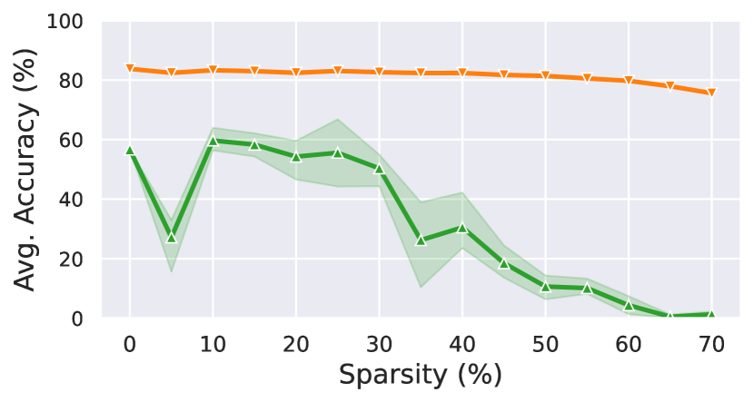

*(a) MNLI/HANS*

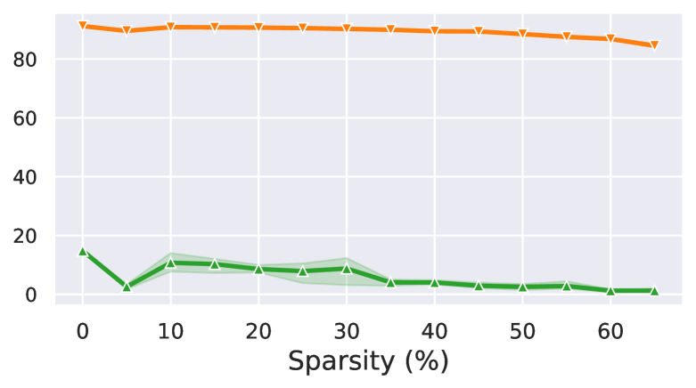

*(b) QQP/PAWS-QQP*

###### fig-4

*Figure 4: The OOD accuracy decreases fairly smoothly with sparsity ($3$ seeds). The drop in ID accuracy is slow and has low variance. We find no subnetworks sparser than $30\%$ generalizing as well as the full model on either dataset.* **[p. 5]**

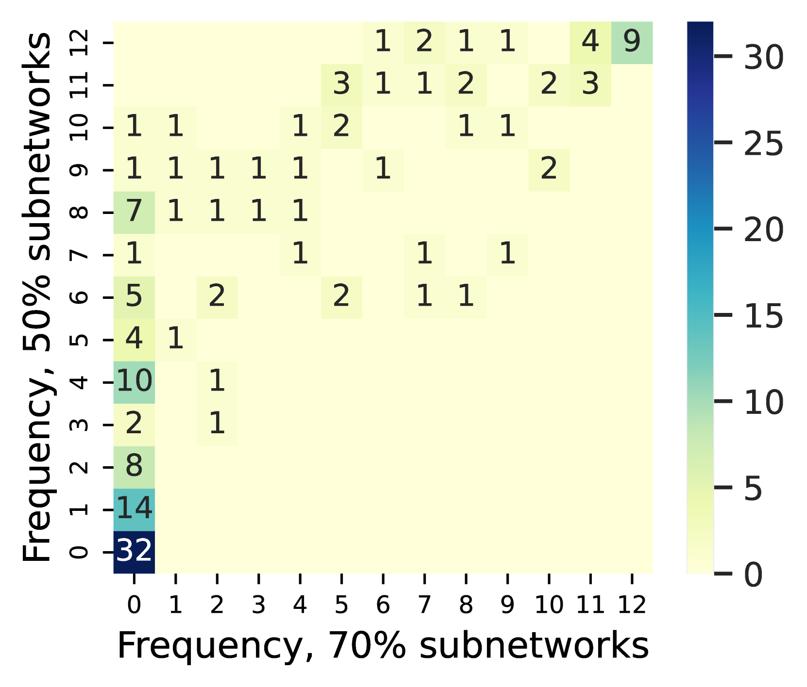

*Figure 5: This heatmap quantifies the frequencies of attention heads in the $50\%$ and $70\%$ sparsity subnetworks (MNLI). Entry $(i,j)$ corresponds to the number of heads appearing in $i$/12 $50\%$ subnetworks and $j$/12 $70\%$ subnetworks. In particular, we note that *nine* attention heads appear in all of the subnetworks.* **[p. 5]**

###### p4-1

Figures 2a and 2c plot the results for a target sparsity of $50\%$ and $30\%$ in the case of MNLI and QQP, respectively. The pruned models perform close to each other in-domain, and are all within 2-3% of the full model’s accuracy on both the MNLI and QQP validation splits. However, their accuracies on the out-of-domain evaluation splits varies widely. In the most extreme case, the accuracies on the *Embed-If (Constituent)* subcase of HANS vary from just $4.1\%$ to $50.2\%$. Moreover, different subnetworks generalize to different subcases, as Figure 3 illustrates. Subnetwork #8 achieves $41.4\%$ at *SO-Swap (Lexical Overlap)* but only $18.0\%$ at *Embed-If (Constituent)*. Subnetwork #5, on the other hand, achieves only $19.5\%$ at the former but $50.2\%$ at the latter. Thus, pruning different parts of the model seems to sacrifice generalization on the OOD subcases to varying degrees. The results in the case of QQP and PAWS-QQP are similar.

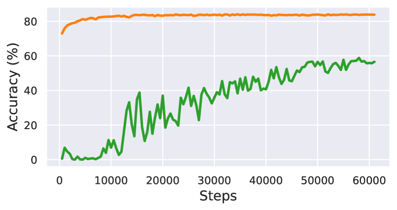

*(a) MNLI/HANS – Accuracy*

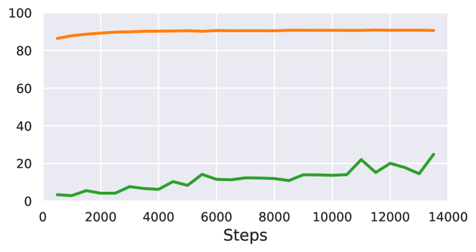

*(b) QQP/PAWS-QQP (adv.) – Accuracy*

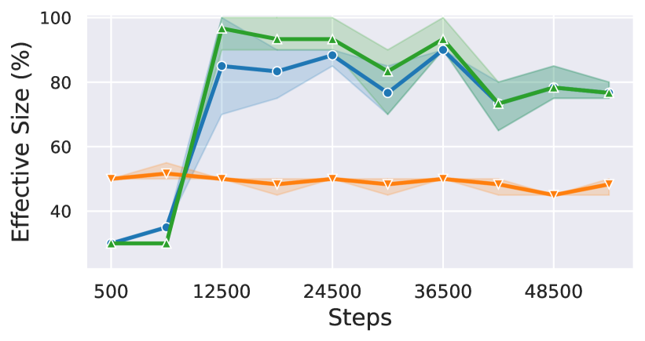

*(c) MNLI/HANS – Effective size*

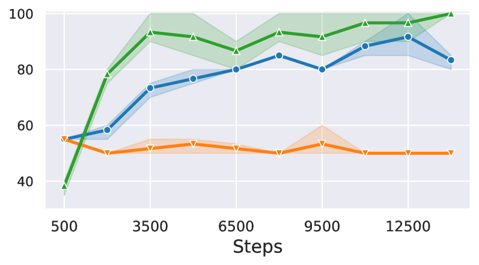

*(d) QQP/PAWS-QQP (adv.) – Effective size*

###### fig-6

*Figure 6: The ID and OOD accuracies, and effective size of the model during fine-tuning, computed by pruning with $3$ seeds. Generalization is associated with a steep *increase* in effective size for OOD/mixed datasets. The effective size for ID datasets remains constant, showing that these extra effective parameters go towards generalization.* **[p. 6]**

###### p4-2

We also observe that sparser subnetworks consistently generalize worse. First, we prune the model to a higher sparsity ($70\%$ for MNLI and $60\%$ for QQP) with $12$ random seeds. As Figures 2b and 2d show, virtually *all* subnetworks at this sparsity show a complete lack of generalization on almost every OOD subcase. The ID accuracy stays at a respectable 74-76%, indicating that a large portion of model performance is explained by these sparse subnetworks. In Figure 4, we plot the generalization accuracy of subnetworks pruned at different sparsity levels, **[p. 5]** for $3$ random seeds. The generalization accuracy generally drops steadily at higher sparsity levels and is devoid of any drastic phase transitions.

###### p5-2

Specifically, we explore if our findings can be explained in terms of *competing subnetworks*: the model initially represents multiple solutions as different subnetworks, and it ultimately converges to one. Whether it generalizes is dependent on which of the subnetworks it converges to. This hypothesis has been found to explain the curious phenomenon of grokking (Merrill et al., 2023). Additionally, as Tu et al. (2020) note, the ID performance of our BERT models saturates early in training (Figure 6) but the OOD accuracy starts to rise much later. Motivated by the similarity to grokking, we test if generalization in our case also arises from competition between disjoint subnetworks.

###### p5-3

We consider the Competing Subnetwork Hypothesis to consist of two main predictions, mirroring Merrill et al. (2023). First, the model can be composed into subnetworks that are *disjoint*, representing distinct algorithms consistent with the training data. Second, a rise in generalization is accompanied by a reduction in the model’s *effective size*—the smallest subnetwork whose accuracy matches the model’s within a given threshold (e.g., $3\%$) on a target dataset—which occurs when the model switches from a dense, non-generalizing subnetwork to a sparse, generalizing subnetwork.

###### p5-4

We start by measuring how many model components are shared between different subnetworks. In particular, we compute the frequencies of each attention head in the $50\%$ (partially generalizing) subnetworks and in the $70\%$ (non-generalizing) subnetworks of the MNLI model. These frequencies are visualized in Figure 5 (a corresponding plot for QQP is presented in Figure 11 of Appendix C). The Spearman’s Rho correlation between the two frequencies if $0.82$ ($p$-value = $1.6\cdot 10^{-36}$), i.e., very strong agreement. (The corresponding value for QQP is $0.74$, corresponding **[p. 6]** to strong agreement; see Figure 14 in Appendix C.) In particular, we observe that **nine attention heads** appear in *all* subnetworks, even the sparsest ones—that is, the subnetworks that behave most consistently with the heuristics. In other words, instead of finding disjoint subnetworks, we find a high degree of overlap (the expected intersection of $12$ random $70\%$ sparsity subnetworks is $7.7\cdot 10^{-5}$ heads) between the subnetworks that partially generalize and the subnetworks that do not generalize at all.

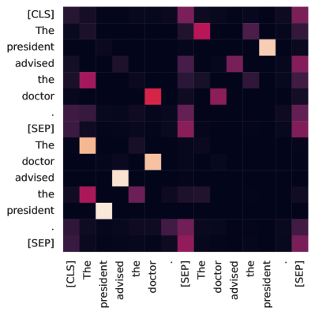

*(a) Layer $2$, Head $5$*

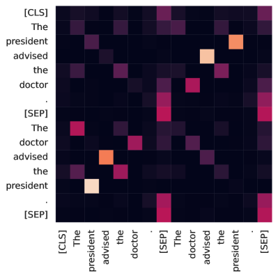

*(b) Layer $3$, Head $7$*

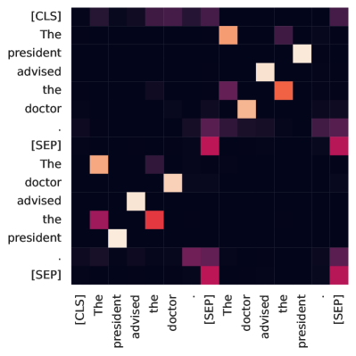

*(c) Layer $4$, Head $0$*

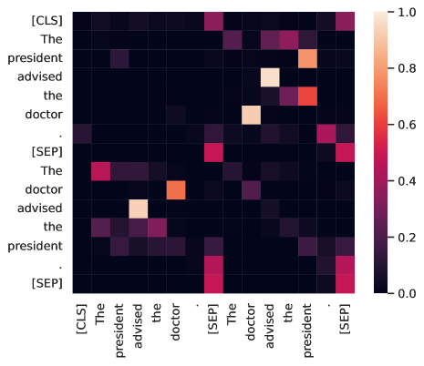

*(d) Layer $8$, Head $11$*

###### fig-7

*Figure 7: Many attention heads common to the MNLI subnetworks attend to tokens co-occurring in the premise and context. Since the order of, *e.g.*, “doctor” and “president” is reversed, the heads seem to identify lexical overlap.* **[p. 7]**

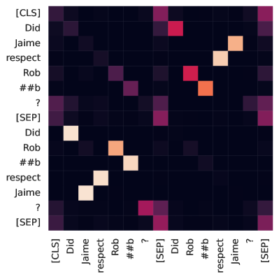

*(a) Layer $2$, Head $5$*

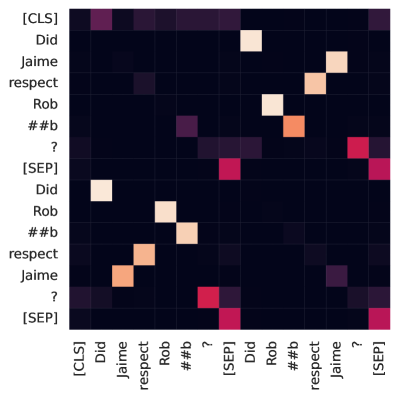

*(b) Layer $4$, Head $0$*

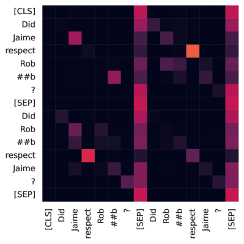

*(c) Layer $8$, Head $11$*

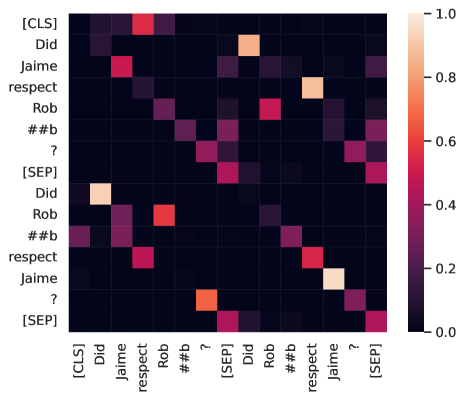

*(d) Layer $9$, Head $1$*

*Figure 8: Many attention heads in the QQP heuristic core also focus their attention between tokens repeated across the premise and context. Interestingly, there is a significant overlap between these heads and those for MNLI.* **[p. 7]**

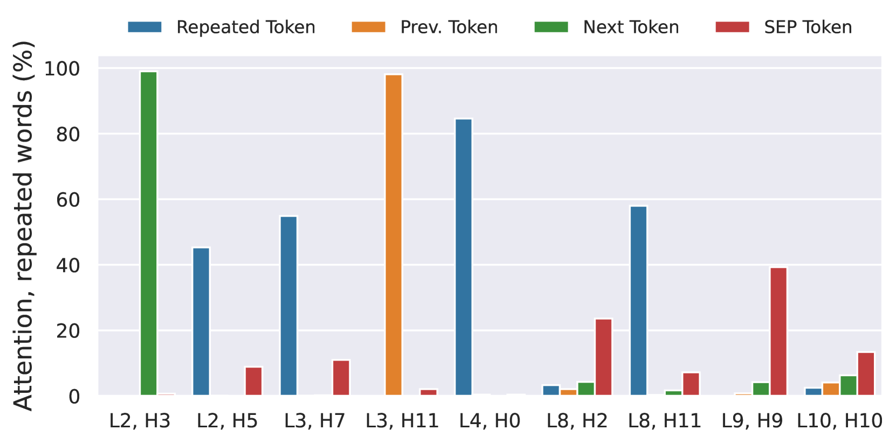

*Figure 9: Of the $9$ heads occurring in all MNLI subnetworks, several assign their attention weight between words repeated across the premise and hypothesis. Others either attend to the previous, next, or separator token. Here, “L$x$, H$y$” stands for “Head $y$ of Layer $x$”.* **[p. 7]**

###### tab-3

*Table 3: The effects of ablating the $9$ heads occurring in all MNLI subnetworks individually from the full model. It is noteworthy that some of these are also important for counter-heuristic behavior, as their ablation leads to reduced generalization. In the final row, L$x$.H$y$ refers to Head $y$ in Layer $x$.* **[p. 8]**

| **Ablated Head** | **Accuracy (%)** $\uparrow$ |  |  |  |  |
|---|---|---|---|---|---|
| **MNLI (matched)** | **SO-Swap [LO]** | **Prep [LO]** | **Embed-If [C]** | **Embed-Verb [C]** |  |
| None | 83.3 | 86.7 | 73.5 | 33.0 | 33.4 |
| Avg. (Non-HC) | 83.2*↓0.1* | 86.2${}_{\downarrow}{0.5}$ | 73.1*↓0.4* | 33.5*↑0.5* | 34.1*↑0.7* |
| Layer 2, Head 3 | 83.2*↓0.1* | 79.3 | 72.3*↓1.2* | 28.8 | 28.9 |
| Layer 2, Head 5 | 83.4*↑0.1* | 70.3 | 58.6 | 28.5 | 23.6 |
| Layer 3, Head 7 | 83.5*↑0.2* | 68.6 | 60.2 | 28.2 | 23.0 |
| Layer 3, Head 11 | 83.5*↑0.2* | 81.8 | 70.1*↓3.4* | 31.0*↓2.0* | 32.9*↓0.5* |
| Layer 4, Head 0 | 82.9*↓0.4* | 45.4 | 41.8 | 21.2 | 12.7 |
| Layer 8, Head 2 | 83.7*↑0.4* | 84.5*↓2.2* | 69.5*↓4.0* | 31.6*↓1.4* | 27.5 |
| Layer 8, Head 11 | 81.0*↓2.3* | 88.3*↑1.6* | 76.5*↑3.0* | 37.6 | 34.1*↑0.7* |
| Layer 9, Head 9 | 83.4*↑0.1* | 87.7*↑1.0* | 74.2*↑0.7* | 36.1*↑3.1* | 32.4*↓1.0* |
| Layer 10, Head 10 | 81.5*↓1.8* | 84.7*↓2.0* | 72.2*↓1.3* | 41.1 | 38.7 |
| L2.H5 & L3.H7 & L4.H0 | 80.4*↓2.9* | 3.6 | 11.1 | 20.1 | 4.7 |

*Table 4: The effects of ablating the $8$ heads occurring in all QQP subnetworks individually from the full model. The heads with the strongest reduction are the same ones that had the largest effect on the MNLI model.* **[p. 8]**

| **Ablated Head** | **Accuracy (%)** $\uparrow$ |  |
|---|---|---|
| **QQP** | **QQP-PAWS (adv.)** |  |
| None | 91.2 | 14.8 |
| Layer 2, Head 3 | 91.1*↓0.1* | 14.1*↓0.7* |
| Layer 2, Head 5 | 91.1*↓0.1* | 9.9 |
| Layer 3, Head 3 | 91.2*↓0.0* | 13.9*↓0.9* |
| Layer 4, Head 0 | 90.2*↓1.0* | 3.3 |
| Layer 8, Head 11 | 91.0*↓0.2* | 14.6*↓0.2* |
| Layer 9, Head 1 | 91.2*↓0.0* | 16.6 |
| Layer 9, Head 9 | 91.1*↓0.1* | 16.2 |
| Layer 11, Head 6 | 91.1*↓0.1* | 17.1 |

###### p6-1

Next, we investigate how these subnetworks emerge over training. We conduct a similar analysis to Merrill et al. (2023) and plot the *effective size* of the model, defined as the size of the smallest subnetwork that is *faithful* to the model on a particular evaluation dataset $D$. We say that a subnetwork is *faithful* to a model on dataset $D$ if their accuracies are within $3\%$. We report faithfulness using different choices of $D$—either the in-domain validation set, the out-of-domain validation sets, or the equally weighted combination of the two (mixed data). We prune each checkpoint to sparsities of multiples of $5\%$ and pick the highest one that yields a faithful subnetwork. The reported accuracies at each sparsity are averages over three seeds.

###### p6-2

The results are in Figure 6. The effective size needed to approximate the model on the in-domain evaluation remains relatively flat over the course of training. However, on out-of-domain and mixed data, generalization is accompanied by an *increase* in effective size. We also examine the set of attention heads that appear in the MNLI subnetworks at the checkpoint immediately before the model starts to generalize. We find that the same nine attention heads that appear in all subnetworks at the end of training appear in these subnetworks as well. This suggests that, rather than switching between competing subnetworks, the model first learns a set of attention heads that compute simple, non-generalizing features, and then generalizes by incorporating more components into this core.

###### p7-1

First, we look at the attention patterns exhibited by these attention heads. We inspect example attention patterns and observe that most heads exhibit a simple attention pattern, and we quantify these in Figure 9. Four out of nine heads (MNLI) attend to tokens that repeat across the premise and hypothesis, suggesting that they extract token overlap features. Figure 7 shows example attention patterns. Notably, we find that eight attention heads also appear in all QQP subnetworks. Figure 8 presents an example indicating that these heads play a similar role for QQP, attending between repeated words.

Other low-layer heads attend to the previous or subsequent token. The heads in the higher layers are more difficult to characterize but often attend to the special separator token, perhaps aggregating information from across the sequence. Overall, these findings are consistent with the notion that these attention heads calculate simple, shallow features.

###### p7-3

Next, we ablate each heuristic core attention head from the full model and observe how the in-domain and out-of-domain accuracies change, in Table 3. None of the heads’ ablation affects in-domain accuracy greatly. **[p. 8]** Surprisingly, however, many heads seem to be critical to performing well on HANS: for example, ablating a single head (L4.H0) reduces performance on *SO-Swap* by more than 40%. Moreover, the drops observed on ablating these heads is *super-additive*: ablating just three of them leads to the OOD accuracy plummeting. This indicates that heads outside the heuristic core rely on the heuristic core to implement more complex behavior.

###### p8-1

Table 4 paints a similar picture for QQP. Perhaps most interestingly, the heads $2.5$ and $4.0$ that had the maximum ablation effect for MNLI also stand out here. Along with the fact that $5$ of these $8$ heads also exist in the MNLI model’s core, this highlights the possibility that these heads already extract word overlap features in the BERT model prior to fine-tuning. We leave this question for future work.

###### p8-2

We show in Appendix D that our results extend to RoBERTa (Liu et al., 2019) models. Appendix E finds that they also transfer to GPT-2 (Radford et al., 2019) models, albeit with some novel behavior. Specifically, we observe that the accuracy on the *non-adversarial* OOD (‘entailment’) cases slightly drops late into training, and is accompanied by a mild increase in effective size. The performance on these cases also varies across different subnetworks of the same sparsity. Explaining these additional features requires further research and makes for future work. We also note that it is possible that models much larger (such as those with 7B+ parameters) take a different route to generalization. They might thus show qualitatively different behavior, and we urge caution in applying the results of this paper to them.

###### p9-1

Mechanistic Interpretability seeks to understand models through their components, e.g., neurons, attention heads, and MLPs. Such analysis uncovers intricate interactions between different atomic components, which form *circuits* Elhage et al. (2021); Olah et al. (2020) implementing various tasks. Pruning has occasionally been used as part of a larger interpretability effort Lepori et al. (2023a), though mostly in an ad-hoc manner. Jain et al. (2023) use pruning and probing techniques to show that fine-tuning learns a thin “wrapper” around model capabilities. Lepori et al. (2023b) use pruning to identify subnetworks which they then show form modular building blocks of model behavior. In a similar vein, De Cao et al. (2020) learn differentiable masks over the input to investigate model behavior. While most of these approaches replace missing layers with an identity function, work in Mechanistic Interpetability Zhang and Nanda (2024); Conmy et al. (2023) has shown that adding their mean activations might preserve faithfulness better. Prior work has examined attention patterns to decipher model behavior (e.g. Clark et al., 2019), although attention patterns have also been shown to be misleading in some cases (Jain and Wallace, 2019).

###### p9-4

We showed that pruning a pretrained LM with different random seeds can yield subnetworks that perform similarly to the original model in-domain but generalize differently. Moreover, sparser subnetworks generalize worse. To explain this result, we first considered the *Competing Subnetworks Hypothesis*, which has been used to explain grokking on algorithmic tasks; it suggests that the model consists of disjoint subnetworks representing different solutions, some which generalize and some which do not. We found that our results are instead more consistent with the existence of a *Heuristic Core*: a subset of attention heads that appear in all subnetworks and calculate shallow, non-generalizing features. The model generalizes by incorporating additional heads that interact with the heuristic core. Our results have practical implications about the effect of pruning on generalization and raise intriguing questions about how language models learn to generalize by composing simple components.

**[p. 10]**

###### p10-1

Our approaches are not without limitations. Our analysis is based on a top-down approach of identifying subnetworks. Thus, we do not look for or discover “circuits” that are atomically interpretable. Our experiments only use text classification tasks, although we believe that such a task is ideal due to clear definitions of heuristics. Additionally, we only work with BERT models—it is possible that larger transformers, or those pretrained differently, exhibit different behavior. Finally, although we have analyzed the mechanisms of generalization in this paper, the question of why they are undertaken remains elusive for the moment. Our experiments also raised many novel questions, which require further research to answer.

###### p14-7

Table 5 demonstrates that different subnetworks at $50\%$ sparsity still generalize differently despite **[p. 15]** performing similarly to the full model in-domain. Figure 15 tells us that the effective size again goes up along with generalization. The $12$ subnetworks share $11$ attention heads that also appear in the effective size subnetworks before generalization. We list these heads along with the effect of ablating them in Table 6. The effects are smaller but consistent with the findings on the BERT model: these heads have much larger ablation effects than random other heads despite not generalizing on their own.

###### p15-1

In this subsection, we ask if our findings and explanations can extend to decoder-only models. We work with a GPT-2 small (117M) model (Radford et al., 2019). Most of the hyperparameters for both fine-tuning and pruning are the same as those listed in Appendices A and B. However, we found that the GPT-2 model, even as a whole, generalizes very poorly to the HANS subcases. After training for $10$ epochs ($12270$ steps), constituent_cn_embed_under_if is the only “contradiction” subcase with an accuracy above $30\%$. Hence, we select this setting, and Embed-If as the only adversarial out-of-domain subcase. Interestingly, however, we observed that the accuracies of some of the *heuristic-friendly* subcases started dropping later into the training. We select subsequence_se_relative_clause_on_obj (Rel-Clause [SE]) and constituent_ce_embedded_under_since (Embed-Since [CE]) as two representative subcases and group them under the split OOD-E (OOD-Entailment). We perform the experiments for both the OOD and OOD-E subcases.

We evaluate 12 pruned subnetworks at $40\%$ and $60\%$ sparsity in Table 7. Like before, the subnetworks perform similarly in-domain but generalize differently. However, one striking feature stands out. As we increase the sparsity, the average performance on the ‘contradiction’ OOD cases *increases*, whereas that of the ‘entailment’ cases *decreases*.

###### p15-3

One way to reconcile these results is for some heuristics to be *contradiction* heuristics, and for the model to develop further non-heuristic heads around a *contradiction* heuristic core. Indeed, in Figure 16, we note two interesting trends: (1) the model accuracy decreases slightly on the OOD-E subcases late into training and (2) a mild increase **[p. 17]** in the OOD-E effective size accompanies this decrease in accuracy. A possible explanation for the latter could be that some heuristics for spotting ‘contradiction’ are also learned, and play an analogous role in the heuristic core.

We find the heads common to all $40\%$ and $60\%$ subnetworks and tabulate their ablation effects in Table 8. We note the following: (1) On Embed-If, some heads show a strong increase in accuracy on ablation, and some a strong decrease. This would be consistent with some heads implementing entailment heuristics and some contradiction heuristics. On the other hand, (2) None of the heads show large ablation effects on Rel-Clause. On Embed-Since—the other entailment subcase—some heads show small but significant effects.

###### p17-2

Therefore, our results on the OOD subcases are consistent with the model implementing both entailment and contradiction heuristics. On the other hand, some questions remain regarding the OOD-E subcases in GPT-2—namely, why the performance of the model tapers off late into the training, and why there is a variance in performance at *high* sparsities (in contrast to the results on BERT) despite none of the common heads having significant ablation effects. We leave it to future work to answer these questions.
