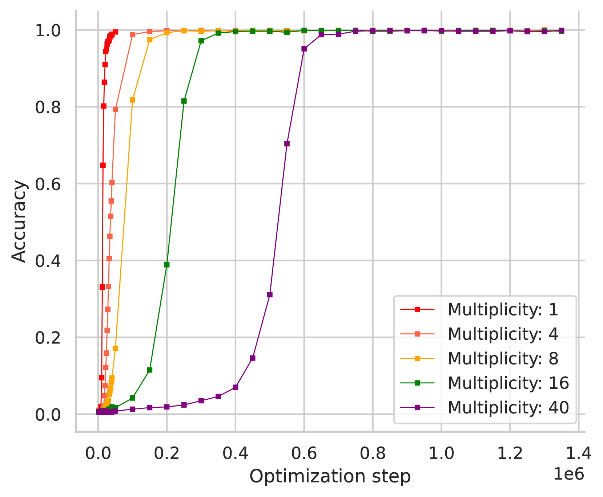
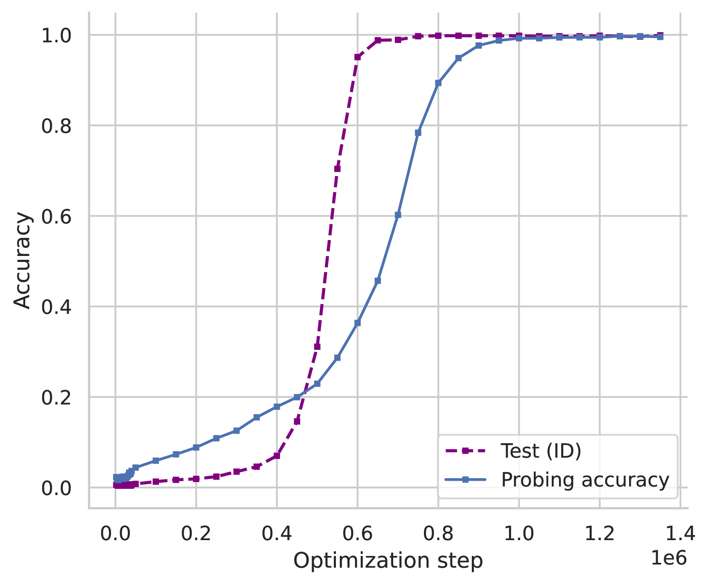

# Wang et al. 2024 — Grokked Transformers are Implicit Reasoners: A Mechanistic Journey to the Edge of Generalization

See also: [the global concept index](../../concepts/index.md).

**Boshi Wang**, **Yu Su**, **Huan Sun** — The Ohio State University; **Xiang Yue** — Carnegie Mellon University (the work was begun at OSU).

arXiv [2405.15071](https://arxiv.org/abs/2405.15071), 23 May 2024. NeurIPS 2024. 85 citations — the eighth most cited work in the corpus.

The source is the **native arXiv HTML**. The ar5iv rendering of this work nearly coincides with it (10 059 words against 10 107, 250 formulas against 253, 30 illustrations against 31); the fuller native one was taken.

The files of this paper's analysis:

- [`2405.15071.grokked-transformers-are-implicit-reasoners.license.txt`](2405.15071.grokked-transformers-are-implicit-reasoners.license.txt) — the arXiv licence record for this paper.

The anchor scheme and the rules for linking into a card are in the [README of the papers folder](../README.md).

**Excerpt card.** The paper's licence (`arxiv-nonexclusive`) does not permit republishing the paper itself; what stands here are the editorial sections and the fragments the corpus quotes (right of quotation). The paper: <https://arxiv.org/abs/2405.15071>.

## Concepts covered

**[Reasoning over knowledge graphs](../../concepts/reasoning-knowledge-graphs.md)** — the work **carries grokking into this area** and sets up a reproducible setting for it: a random knowledge graph, "atomic facts" as edges and "inferred facts" as the result of applying hidden rules ([`p3-4`](#p3-4)). Two tasks — two-hop composition and the comparison of attributes — are chosen as ones that even frontier LLMs fail at.

**[Data fraction / critical dataset size](../../concepts/data-fraction-critical-dataset-size.md)** — the work gives the corpus a **direct objection**: the speed of grokking is determined by the *ratio* of the number of inferred facts to atomic ones ($\phi$) and does not depend on the absolute size of the sample at all ([`p4-4`](#p4-1)). At a fixed $\phi$, growing the number of entities changes neither the speed of the ID generalisation nor the level of systematicity. The authors call this outright a correction to the hypotheses about a critical dataset size: what should be decisive is the *critical distribution*.

**[Circuit efficiency](../../concepts/circuit-efficiency.md)** — the mechanism of Varma et al. is applied to a new area and **acquires a countable form**: the complexity of the circuits is estimated by the number of facts they need to store. The memorising one needs both the atomic and the inferred facts; the generalising one needs the atomic ones plus a copy of those that occur at the second hop, that is, no more than twice the number of atomic facts ([`p6-3`](#p6-3)). From this follow at once the dependence on $\phi$, the independence of the sample size, and the prediction that a larger weight decay will speed the transition up (confirmed in E.1).

**[Mechanistic interpretability](../../concepts/mechanistic-interpretability.md)** — causal tracing and the logit lens are applied; the generalising circuit is not postulated but **derived**: weak nodes and connections are pruned away, leaving a graph on layers 0, 5 and 8. What was there before the grokking is shown too: the model related $(h,r_{1},r_{2})$ to the answer directly, bypassing the first hop.

**[Linear and sparse probing](../../concepts/linear-sparse-probing.md)** — used as an independent check: in the multi-token setting the second token of the bridge entity is decoded perfectly by a linear probe from the state $S[5,r_{1}]$ after the grokking, and the decodability grows over the course of the transition.

**[Structured representation learning](../../concepts/structured-representation-learning.md)** — the work shows that the structure may be **not the one that is needed**: the circuit for composition stores the atomic facts twice and only those that occurred at the second hop, which is why the OOD facts are unavailable where they are called for. For comparison the circuit is **parallel**, the facts lie in one place — and systematicity appears.

**[The emergence of features / feature learning](../../concepts/feature-emergence-feature-learning.md)** — the formation of the circuit is traced quantitatively across checkpoints: the strengthening of the causal connection $S[5,r_{1}]\to$ prediction and the growth of the rank of $r_{2}$ in $S[5,r_{2}]$ proceed gradually throughout the grokking.

**[Grokking](../../concepts/grokking.md)** — the notion receives an **important refinement**: "has grokked" does not mean "has learned the rule". In-distribution the generalisation always sets in; out of distribution it does not set in for composition even within 2 million steps. The level of systematicity is determined not by the fact of grokking but by the configuration of the circuit that has arisen.

Cards of corpus papers: [Power et al. 2022](../2201.02177.grokking-generalization-beyond-overfitting-on-small-algorithmic-datasets/2201.02177.grokking-generalization-beyond-overfitting-on-small-algorithmic-datasets.card.md) — the original phenomenon, carried over here to knowledge; [Varma et al. 2023](../2309.02390.explaining-grokking-through-circuit-efficiency/2309.02390.explaining-grokking-through-circuit-efficiency.card.md) — the circuit-efficiency mechanism, applied and counted here; [Liu et al. 2022](../2205.10343.towards-understanding-grokking-an-effective-theory-of-representation-learning/2205.10343.towards-understanding-grokking-an-effective-theory-of-representation-learning.card.md) and [Omnigrok](../2210.01117.omnigrok-grokking-beyond-algorithmic-data/2210.01117.omnigrok-grokking-beyond-algorithmic-data.card.md) — the hypotheses about a critical dataset size, objected to here; [Nanda et al. 2023](../2301.05217.progress-measures-for-grokking-via-mechanistic-interpretability/2301.05217.progress-measures-for-grokking-via-mechanistic-interpretability.card.md) — the same toolkit of mechanistic analysis, but on an algorithmic task.

## What is shown and what is conjectured

The card editor's remarks following the analysis of the claims (`…claims.txt`). The work stands out in the corpus for two things: it carries grokking into the area of reasoning over knowledge, and it **uses** a mechanism from another card of the corpus rather than proposing yet another of its own.

**The firmest result is the independence of the sample size.** At a fixed ratio of inferred facts to atomic ones, changing the number of entities changes neither the relative speed of the generalisation nor the level of systematicity ([`p4-4`](#p4-1)). This is a direct objection to the hypotheses about a critical dataset size, and it is supported by an explanation: increasing the size does not change the relative efficiency of the memorising and the generalising circuits.

**The mechanism of Varma et al. is applied and counted.** The complexity of the circuits is estimated by the number of facts they need to store: the memorising one the atomic and the inferred facts, the generalising one the atomic ones plus a copy of those occurring at the second hop, that is, no more than twice the number of atomic facts ([`p6-3`](#p6-3)). From this follow at once the dependence on $\phi$, the independence of the size, and the prediction about weight decay, confirmed in the appendix. A caveat: the number of facts is taken **as a proxy** for the complexity, with no direct measurement of it.

**The cause of the OOD failure is checked by intervention.** First it is shown that it is precisely the second hop that breaks: in the OOD setting the intermediate states encode the bridge entity and the second relation just as they do in the ID one. Then the architectural hypothesis is checked in practice — sharing parameters across layers unlocks the OOD generalisation, which without it had not appeared even within 2 million steps. This is a rare case in the corpus in which an explanation of a failure is confirmed by removing it.

**What has been left unexplained.** Why a sequential circuit arises for composition and a parallel one for comparison the work does not answer. The difference is recorded and related to systematicity, but the reason for the choice of configuration is open.

**How to read table 1.** The comparison with GPT-4-Turbo and Gemini-1.5-Pro is unequal by construction: the grokked transformer is trained on those very facts for hundreds of thousands of steps, while the LLMs see them in the context once. That is precisely the authors' point about parametric memory, but the table should **not** be read as a comparison of models. Of the six LLM measurements only one exceeds chance, and by four points at that — that is, what is shown is that the task is entirely beyond them.

**The most interesting observation of section 5 is not about accuracy.** A chain of reasoning makes the result worse (11.3 % against 28.7 %), 70.7 % of the answers conclude that the answer cannot be determined, and "most of the CoT rationales that give a correct final answer are in fact wrong" — they hallucinate underivable facts or contain logical errors. No number is given for the last statement, and the counting method is not described.

**On the status of the objection about the critical dataset size.** Strictly speaking, what is shown here is that the size does not affect the **speed** of grokking at a fixed distribution, whereas in Liu et al. and Varma et al. the critical size determines the **possibility** of generalisation at all. This is a refinement of the domain of applicability rather than a refutation; the paper does not spell the difference out, and the abstract presents it as a "correction".

## Common misreadings and overstatements

These are the card editor's remarks, not the authors' text: places where this paper restates someone else's results with an error, or without the qualifications their authors attached. The "details" links in the "Common misreadings and overstatements of this paper" sections of the cited works' cards lead here.

###### mc-2309-02390
**Varma et al. (2309.02390) — the efficiency mechanism carried over to multi-hop reasoning with "efficiency" redefined.** `"a natural explanation of why grokking happens through the lens of circuit efficiency [61]… $C_{gen}$ is relatively more *efficient*, in the sense that it could fit the data with a lower complexity"`. This is the largest extension of the theory in the corpus: a mechanism shown by Varma with [a constructed simulation on the single task of modular addition](../2309.02390.explaining-grokking-through-circuit-efficiency/2309.02390.explaining-grokking-through-circuit-efficiency.card.md#p3-9) and [depending decisively on weight decay](../2309.02390.explaining-grokking-through-circuit-efficiency/2309.02390.explaining-grokking-through-circuit-efficiency.card.md#sec-7) is applied to multi-hop reasoning in knowledge graphs, with "efficiency" redefined — from a ratio of logits to parameter norm into a number of stored facts. The carry-over is partly confirmed by their own experiment (App. E.1: a larger weight decay speeds grokking up — in agreement with the theory), but is presented as an explanation rather than as a hypothesis. Structurally this is the same genre of carry-over as Varma's own section 6 (in-context learning) — a hypothesis with no experiment.

## Common misreadings and overstatements of this paper

Patterns of misreading or overstatement of this work, as observed in the citing papers of the corpus. Each entry says what exactly gets distorted in the restatement and leads to the authors' own paragraphs, where the qualification that goes missing still stands. The specific wordings are examined in the citing works' cards, in their "Common misreadings and overstatements" sections, where the "details" links lead.

**A "φ threshold" instead of a correlation with the speed (erroneous).** The central result is that [the speed of grokking is determined by the ratio of inferred facts to atomic ones rather than by the sample size](#p4-1); φ was tested from 3.6 to 18, and generalisation occurred at every value. Those who cite it turn this into a threshold of existence: "the bare-minimum ratio of 3.6", "φ≈0.5 is insufficient to induce grokking" (there is no such experiment in the work), "a critical data ratio above which grokking leads to generalisation" — and once the φ values are attributed to Power et al., who have no φ at all. The extreme case is the work's being called as a witness for the thesis "more data means faster feature learning", directly contrary to its own result about the independence of the size. The details: [2504.20752](../2504.20752.grokking-in-the-wild-data-augmentation-for-real-world-multi-hop-reasoning-with-transformers/2504.20752.grokking-in-the-wild-data-augmentation-for-real-world-multi-hop-reasoning-with-transformers.card.md#mc-2405-15071), [2509.21519](../2509.21519.provable-scaling-laws-of-feature-emergence-from-learning-dynamics-of-grokking/2509.21519.provable-scaling-laws-of-feature-emergence-from-learning-dynamics-of-grokking.card.md#mc-2405-15071).

**"Grokking yields reasoning" without the limits of applicability (an over-extension).** The title is paraphrased as the result while the key distinction is dropped: [ID generalisation always sets in, OOD for composition never does, OOD for comparison does](#p2-2); the systematicity depends on the configuration of the circuit, not on the fact of grokking. The details: [2506.05718](../2506.05718.grokking-beyond-the-euclidean-norm-of-model-parameters/2506.05718.grokking-beyond-the-euclidean-norm-of-model-parameters.card.md#mc-2405-15071); a milder echo: [2601.19791](../2601.19791.to-grok-grokking-provable-grokking-in-ridge-regression/2601.19791.to-grok-grokking-provable-grokking-in-ridge-regression.card.md#mc-2405-15071) — the work's models (GPT-2-style, from scratch) are called "LLMs".

**Attribution of a subject that is not the work's (erroneous).** One paper cites the work twice past its content: as a study of "progress measures through embedding homogeneity" and as the source of the hypothesis that "grokking is a consequence of the transformer architecture", which is then "refuted" by works published before it; [what Wang relates to the architecture is the failure of OOD systematicity, not grokking itself](#p2-2). The details: [2504.03162](../2504.03162.beyond-progress-measures-theoretical-insights-into-the-mechanism-of-grokking/2504.03162.beyond-progress-measures-theoretical-insights-into-the-mechanism-of-grokking.card.md#mc-2405-15071).

Examples of careful citation: [2601.09049](../2601.09049.is-grokking-worthwhile-functional-analysis-and-transferability-of-generalization-circuits-in-transformers/2601.09049.is-grokking-worthwhile-functional-analysis-and-transferability-of-generalization-circuits-in-transformers.card.md) — a replication of the setting with exact numbers, a correct paraphrase of the mechanism of the OOD failure and of the role of parameter sharing, and a substantive argument; [2504.13292](../2504.13292.let-me-grok-for-you-accelerating-grokking-via-embedding-transfer-from-a-weaker-model/2504.13292.let-me-grok-for-you-accelerating-grokking-via-embedding-transfer-from-a-weaker-model.card.md) — the hedge "on some tasks", encoding the composition/comparison distinction in a single word.

---

# Quoted fragments

Only the fragments the corpus cards refer to are
reproduced here (right of quotation); the paper's licence does not permit
republishing the whole text. Anchor numbering matches the original.

###### p1-2

We study whether transformers can learn to *implicitly* reason over parametric knowledge, a skill that even the most capable language models struggle with. Focusing on two representative reasoning types, composition and comparison, we consistently find that transformers *can* learn implicit reasoning, but only through *grokking*, i.e., extended training far beyond overfitting. The levels of generalization also vary across reasoning types: when faced with out-of-distribution examples, transformers fail to systematically generalize for composition but succeed for comparison. We delve into the model’s internals throughout training, conducting analytical experiments that reveal: 1) the mechanism behind grokking, such as the formation of the generalizing circuit and its relation to the relative efficiency of generalizing and memorizing circuits, and 2) the connection between systematicity and the configuration of the generalizing circuit. Our findings guide data and training setup to better induce implicit reasoning and suggest potential improvements to the transformer architecture, such as encouraging cross-layer knowledge sharing. Furthermore, we demonstrate that for a challenging reasoning task with a large search space, GPT-4-Turbo and Gemini-1.5-Pro based on non-parametric memory fail badly regardless of prompting styles or retrieval augmentation, while a fully grokked transformer can achieve near-perfect accuracy, showcasing the power of parametric memory for complex reasoning.111Code and data: https://github.com/OSU-NLP-Group/GrokkedTransformer.

###### p1-4

Deficiency in implicit reasoning has profound implications. It implies the models’ limitations in inducing structured and compressed representations of facts and rules, which lead to redundant knowledge storage and difficulty in propagating knowledge updates [76], and importantly, fundamentally impede the model from *systematic generalization* over knowledge [25]. While explicit verbalizations of reasoning steps (e.g., chain-of-thought rationales) can improve task performance [67, 64, 73, 55, 31], they are not available during large-scale (pre-)training where the model’s core capabilities are acquired [77, 29].

###### fig-1

*Figure 1: We find that transformers can learn to reason implicitly, but this skill is only robustly acquired through *grokking*, i.e., an extended period of training far beyond overfitting. Moreover, the transformer fails to *systematically* generalize for composition, yet succeeds for comparison. We conduct a mechanistic study into the model internals throughout grokking, which reveals distinct generalizing circuits across the two tasks (Figure 4, 5) that explains the variations in systematicity.* **[p. 2]**

*Is implicit reasoning doomed given that even the most capable models struggle? **[p. 2]** Can it be resolved by further scaling data and compute, or are there fundamental limitations of the transformer [62] that prohibit robust acquisition of this skill?*

In this paper, we rigorously study these questions by constructing synthetic training and evaluation datasets, training transformers from scratch, and examining their generalization. We conceptualize reasoning as the *induction and application of inference rules*, and expose the model to a mixture of “atomic facts” and “inferred facts” (which are deduced from the atomic facts via a set of latent rules), resembling “axioms” and “theorems” in a formal system. To evaluate how well the model learns the rules, we test its ability to make novel deductions (i.e., completing unseen inferred facts) in both in-distribution (ID) and out-of-distribution (OOD) scenarios.222Definitions of ID/OOD are introduced in §2. This approach allows us to control the training data and perform clean evaluations, which would be challenging when studying existing LLMs trained on uncontrolled data.

###### p2-2

Our experiments reveal that transformers *can* learn to perform implicit reasoning, but this skill is only robustly acquired through *extended training far beyond overfitting* (Figure 1), a phenomenon known as *grokking* [47]. We find that the speed of improvement in generalization correlates with the *ratio* between inferred and atomic facts in training, and depends little on the absolute *size* of the training data (Figure 2). This suggests a correction of prior explanations of grokking based on *critical data size* [33, 61, 78, 21], in that it should instead be the *critical data distribution* that decides the characteristics of grokking. Our findings extend prior observations of the grokking phenomenon primarily in algorithmic and linguistic tasks [47, 38] to the domain of knowledge-based reasoning, and deepen our understanding of the grokking phenomenon.

###### p2-3

Moreover, we find that the transformer exhibits different levels of systematicity across reasoning types. While ID generalization is consistently observed, in the OOD setting, the model fails to systematically generalize for composition but succeeds in comparison (Figure 1). To understand why this happens, we conduct mechanistic analysis of the internal mechanisms of the model. The analysis uncovers the gradual formation of the *generalizing circuit* throughout grokking and establishes the connection between systematicity and its configuration, specifically, the way atomic knowledge and rules are stored and applied within the circuit. Our findings imply that proper cross-layer memory-sharing mechanisms for transformers such as memory-augmentation [54, 17] and explicit recurrence [7, 22, 57] are needed to further unlock transformer’s generalization.

Finally, to demonstrate the power and potential of parametric memory for complex reasoning, we show that for a reasoning task with a large search space, a fully grokked transformer can achieve near-perfect accuracy, while state-of-the-art LLMs like GPT-4-Turbo [43] and Gemini-1.5-Pro [16] based on non-parametric memory fail badly regardless of prompting styles or retrieval augmentation.

**[p. 3]**

###### p3-4

We focus on two-hop composition in this work. For atomic facts, we generate a random knowledge graph $\mathcal{G}$ consisting of $|\mathcal{E}|$ entities and $|\mathcal{R}|=200$ relations, where each entity (as the subject) has $20$ random distinct relations that each connects to another random entity (as the object). The atomic facts are then the edges, i.e., *(subject, relation, object)* triplets in $\mathcal{G}$, which we partition disjointly into atomic${}_{\text{ID}}$ and atomic${}_{\text{OOD}}$ ($95$%: $5$%). The rule of (two-hop) composition is

$$
\forall h,b,t\in\mathcal{E},\forall r_{1},r_{2}\in\mathcal{R},(h,r_{1},b)\land(b,r_{2},t)\implies(h,r_{1},r_{2},t), \tag{1}
$$

which is used to deduce the ID and OOD inferred facts from atomic${}_{\text{ID}}$ and atomic${}_{\text{OOD}}$, respectively. For convenience, in the above rule, we will call $h$ the *head* entity, $b$ the *bridge* entity, and $t$ the *tail* entity. For both atomic and inferred facts, training/testing is done by having the model predict the final tail entity. We assign a unique token to each relation/entity by default, and also find that the results are robust to different tokenizations (details in Appendix C).

We study the influence of the following two aspects on the model’s learned behaviors:

- **Ratio between inferred and atomic facts.** By varying the amount of inferred facts included in training, we study the effect of the ratio $\phi=|\text{{{train\_inferred${}_{\text{ID}}$}}}|/|\text{{{atomic${}_{\text{ID}}$}}}|$ on the model.
- **Training data size.** We study the impact of the training data size by varying $|\mathcal{E}|$, the total number of entities, while controlling the ratio $\phi$. Note that the size of training data (both atomic/inferred facts) scales linearly with $|\mathcal{E}|$.

###### p4-1

**Training data *distribution*, instead of training data size, qualitatively influences generalization behavior**. When $\phi$ increases and $|\mathcal{E}|$ holds constant, the *size* of training data also gets larger. Prior studies hypothesize that training data size plays a central role in order for grokking to happen. In particular, previous work connects grokking with the notion of *critical data size* (CDS) [33, 61, 78, 21], where it is hypothesized that CDS marks the shift from memorization to generalization (via grokking), and the speed of generalization improves as the training data further scales. However, results from our controlled experiments seem to contradict such a hypothesis. Figure 2(b) shows the results of varying $|\mathcal{E}|$ with a fixed $\phi=9.0$, where we change the horizontal axis from optimization step to epoch for better visualization.555The optimization steps for each epoch scale linearly with the training size since we use a fixed batch size. When fixing the ratio $\phi$, the training data size does *not* qualitatively affect the model’s generalization. Specifically, scaling the data affects neither the relative speed of ID generalization and training improvement (as seen by the rather constant “gap” between train_inferred${}_{\text{ID}}$ and test_inferred${}_{\text{ID}}$ curves), nor the systematicity level (OOD performance stays zero). We also run the experiments across different $\phi$ and find the results to be consistent. This suggests that *critical data “distribution”, not size, may be the actual deciding factor behind grokking and generalization.* In addition, we find that scaling up the model size also does not qualitatively change the generalization behaviors observed here (Appendix B), and the main pattern is that larger models converge in fewer optimization steps, which shares with prior findings [60, 28].

**Summary.** We have shown that transformers are capable of acquiring the rule of composition through grokking, with controlled experiments suggesting the crucial factor of data distribution (e.g., the inferred/atomic ratio $\phi$) in characterizing the model’s generalization. **[p. 5]** However, important questions still remain: *what happens during grokking, why does it happen, and why do transformers struggle with OOD examples?* Answering these questions requires a deeper understanding of (the changes in) the model’s inner workings, which we investigate next.

###### p6-3

**Why does grokking happen?** These observations suggest a natural explanation of why grokking happens through the lens of circuit efficiency [61]. Specifically, as illustrated above, there exist both a memorizing circuit $C_{mem}$ and a generalizing circuit $C_{gen}$ that can fit the training data. While $C_{mem}$ is learned first (which causes training performance to saturate quickly), $C_{gen}$ is relatively more *efficient*, in the sense that it could fit the data with a lower complexity. To see this, we can compare the amount of facts $C_{mem}$ and $C_{gen}$ need to store (denoted as $N_{mem}$ and $N_{gen}$) as a proxy for their complexity.777While the circuits also consist of other components, they pale in comparison as the number of facts scales. $C_{mem}$ stores both atomic facts and inferred facts in the weights. $C_{gen}$ (Figure 4(a)) stores the atomic facts in the lower layers, and another copy of the atomic facts that *appear as the second hop in the inferred facts* in the upper layers. As the inferred/atomic ratio $\phi$ increases, $N_{mem}$ would increase rapidly while $N_{gen}$ increases slowly and is always bounded by two times the total amount of atomic facts, and hence, the relative efficiency of $C_{gen}$ increases. In the long run, the model will be incentivized to transition from $C_{mem}$ to $C_{gen}$ due to implicit bias of the optimization [53] and explicit regularization such as weight decay which prefers more efficient circuits, and the transition would happen faster as $\phi$ increases. This also explains why the training data size does not affect the speed of grokking, since *solely increasing the size does not change the relative efficiency of $C_{mem}$ and $C_{gen}$*. The explanation also implies that a larger regularization factor should accelerate grokking (and vice versa), which we confirm by varying the degree of weight decay (Appendix E.1).

**[p. 7]**

**Explaining and mitigating the deficiency in OOD generalization.** The configuration of $C_{gen}$ also has another important implication: while the model does acquire compositionality through grokking, it *does not have any incentive to store atomic facts in the upper layers that do not appear as the second hop during training*. This explains why the model fails in the OOD setting where facts are only observed in the atomic form, not in the compositional form—the OOD atomic facts are simply not stored in the upper layers when queried during the second hop.888We verified that in the OOD setting, $S[5,r_{1}]$ and $S[5,r_{2}]$ encode $b$ and $r_{2}$ respectively as in the ID case. Such issue originates from the non-recurrent design of the transformer architecture which forbids memory sharing across different layers. Our study provides a mechanistic understanding of existing findings that transformers seem to reduce compositional reasoning to linearized pattern matching [10], and also provides a potential explanation for the observations in recent findings that LLMs only show substantial positive evidence in performing the first hop reasoning but not the second [71]. Our findings imply that proper cross-layer memory-sharing mechanisms for transformers such as memory-augmentation [54, 17] and explicit recurrence [7, 22, 57] are needed to improve their generalization. We also show that a variant of the parameter-sharing scheme in Univeral Transformer [7] can improve OOD generalization in composition (Appendix E.2).

###### p18-1

Figure 8(a) shows the ID test results, where the training and OOD results are the same from earlier (training performance saturates quickly, OOD result remains zero). It can be seen that a larger token multiplicity would delay the generalization, which is expected to a certain degree since the scale of the model is effectively smaller due to having fewer tokens in the vocabulary. Nevertheless, ID generalization always happens. We also run linear probing on $S[5,r_{1}]$ throughout training to predict the second token of the bridge entity $b$ in the setting with token multiplicity $40$,121212Recall that $S[5,r_{1}]$ is the state that encodes the bridge entity in the generalizing circuit (Figure 4(a)), where the results are shown in Figure 8(b). It can be seen that the second token of $b$ can be perfectly decoded from $S[5,r_{1}]$ after grokking, and the decodability improves throughout grokking. This suggests that for the multi-token case, the model is additionally storing the second token of $b$ into $S[5,r_{1}]$ throughout grokking, which may be another factor that further delays the speed of grokking. These results also share with recent findings that in many cases, tokens beyond the immediate next token are linearly encoded in the hidden states [69, 44, 2, 4].

In summary, different tokenizations affect the results in rather expected ways, and do not influence our main findings and conclusions.

*(a)*

*(b)*

*Figure 8: (a) ID generalization across different token multiplicity. (b) Probing accuracy on the second token of $b$ at $S[5,r_{1}]$.* **[p. 18]**
