# Zhou, Zhang, Xu 2024 — A rationale from frequency perspective for grokking in training neural network

See also: [the global concept index](../../concepts/index.md).

**Zhangchen Zhou, Yaoyu Zhang, Zhi-Qin John Xu** (Shanghai Jiao Tong University).

arXiv [2405.17479](https://arxiv.org/abs/2405.17479), 27 May 2024 (the sole version v1). 3 citations — the thirty-third most cited work in the corpus. The source is the native arXiv HTML of version v1.

The files of this paper's analysis:

- [`2405.17479.a-rationale-from-frequency-perspective-for-grokking-in-training-neural-network.license.txt`](2405.17479.a-rationale-from-frequency-perspective-for-grokking-in-training-neural-network.license.txt) — the arXiv licence record for this paper.

The anchor scheme and the rules for linking into a card are in the [README of the papers folder](../README.md).

**Excerpt card.** The paper's licence (`arxiv-nonexclusive`) does not permit republishing the paper itself; what stands here are the editorial sections and the fragments the corpus quotes (right of quotation). The paper: <https://arxiv.org/abs/2405.17479>.

## Concepts covered

**[The frequency principle and spectral bias](../../concepts/frequency-principle-spectral-bias.md)** — the work rests entirely on this notion. The F-principle (Xu et al., 2019–2022) states that networks fit a target function from the low frequencies to the high ones, and that the rate of decay of the loss in the frequency domain is set by the regularity of the activation functions ([`p2-3`](#p2-3)). An essential caveat, which the work uses in its third example: at too large an initialisation the F-principle does not hold ([`p2-3`](#p2-3), [`p7-1`](#p7-1)).

**[Grokking](../../concepts/grokking.md)** — a working definition is taken: networks first fit the training data and only later, in the course of the training, begin to generalise to the test data ([`p1-2`](#p1-2)). The explanation proposed comes down to a single phrase: grokking arises from a **mismatch** between the frequency preferred by the training dynamics and the dominant frequency in the test data, and that mismatch is a consequence of insufficient sampling ([`p1-5`](#p1-5)). The merit of such an explanation is that it requires neither constraints on the dimension of the data, nor an explicit regularisation, nor a lazy-to-rich transition ([`p1-5`](#p1-5), [`p2-2`](#p2-2)).

**Aliasing and spurious frequencies** — the mechanism is named precisely: under an insufficient and non-uniform sampling the frequency spectrum of the training set **diverges** from that of the test set and contains a spurious low-frequency component that is not dominant in the test data ([`p4-1`](#p4-1)). The network, following the F-principle, fits that component first — which is why the test loss rises at first. A subtle point: when the network subsequently learns the high frequencies, the insufficient sampling causes them to alias into the low-frequency region, so that the low-frequency amplitude on the training set is preserved while on the test set it decays ([`p5-1`](#p5-1)).

**[Initialisation scale](../../concepts/initialization-scale.md)** — the third example is set up as a mirror image of the first two. On MNIST at a large initialisation ($\alpha=8$) the F-principle does not hold, the network prefers the high frequencies while MNIST is dominated by low ones — and the test accuracy barely rises while the training accuracy climbs fast ([`p1-6`](#p1-6), [`p7-1`](#p7-1)). At the default initialisation ($\alpha=1$) no grokking appears at all ([`p6-8`](#p6-8), [`fig-6`](#fig-6)).

**[Real data](../../concepts/vision-real-world-data-mnist-cifar.md)** — the claim of breadth is made in the abstract: the phenomenon is observed on both synthetic and real datasets ([`p1-2`](#p1-2)). The MNIST setting is taken from Liu et al. (2022) with one difference: **without an explicit weight decay** ([`p6-7`](#p6-7)). And that is the argument against the explanation through the weight norm: grokking is observed where weight decay is absent, and so the explanation of Liu et al. may be inapplicable to this setting ([`p6-8`](#p6-8)).

**[Sparse parity](../../concepts/sparse-parity.md)** — the second example: the parity function $(10,[10])$ on $2^{10}$ points, a two-layer network of width 1000 with ReLU ([`p5-6`](#p5-6)). The observation agrees with the earlier works: the smaller the fraction of training data, the later the test loss falls ([`p6-1`](#p6-1)) — and it is explained by the spurious low frequencies being more pronounced at a smaller sample ([`p6-4`](#p6-4), [`fig-4`](#fig-4)).

**[Modular arithmetic](../../concepts/modular-arithmetic.md)** — it is absent here, and this is said outright: the mechanism may be inapplicable to grokking on language data, among which the authors count the algorithmic datasets too ([`p9-3`](#p9-3)). For the corpus this is an essential caveat: the explanation is built on tasks in which the frequency spectrum is defined naturally.

**[The manifold and the compression of the representation](../../concepts/manifold-representation-compression.md)** — the course of the training is described as a "coarse-to-fine" process, and the authors themselves liken it to grokking on XOR clusters, in which high-dimensional linear classifiers first fit the training data ([`p9-2`](#p9-2)).

**[Ungrokking](../../concepts/ungrokking.md)** and **[circuit efficiency](../../concepts/circuit-efficiency.md)** — named in the survey among the earlier explanations ([`p2-2`](#p2-2)), but the work's own frame does not compete with them: it explains not the choice of solution but the order in which the frequencies are learned.

**[The lazy-to-rich transition](../../concepts/lazy-to-rich-kernel-to-feature-learning.md)** — a direct demarcation: Kumar et al. (2024) assign grokking to a lazy-to-rich transition, whereas here no such transition is required — in the first two examples the F-principle alone suffices ([`p2-2`](#p2-2)).

**[The neural tangent kernel](../../concepts/neural-tangent-kernel-ntk.md)** — the line of theoretical works on the F-principle in the NTK regime is named in the survey as the foundation of the frequency picture ([`p2-3`](#p2-3)).

**[Spectral analysis](../../concepts/spectral-analysis-svd-esd-fve.md)** — the working method: a non-uniform discrete Fourier transform (NUDFT) along a chosen direction ([`p3-2`](#p3-2)). For MNIST the direction is taken as the leading one from a principal-component analysis, so as to preserve more frequency information ([`p6-10`](#p6-10)).

It is worth saying separately what the work does **not** contain. There is no theory: the mechanism is shown only experimentally, and a comprehensive theoretical understanding of the frequency dynamics is left to future work ([`p9-3`](#p9-3)). Nor is there a check on algorithmic tasks — the very ones on which grokking was discovered.

Cards of corpus papers: [Power et al. 2022](../2201.02177.grokking-generalization-beyond-overfitting-on-small-algorithmic-datasets/2201.02177.grokking-generalization-beyond-overfitting-on-small-algorithmic-datasets.card.md) — the original phenomenon; [Liu et al. 2022](../2205.10343.towards-understanding-grokking-an-effective-theory-of-representation-learning/2205.10343.towards-understanding-grokking-an-effective-theory-of-representation-learning.card.md) — the effective theory of representation learning, from which the MNIST setting is taken; [Omnigrok](../2210.01117.omnigrok-grokking-beyond-algorithmic-data/2210.01117.omnigrok-grokking-beyond-algorithmic-data.card.md) — a large initialisation and weight decay as conditions of grokking; [Nanda et al. 2023](../2301.05217.progress-measures-for-grokking-via-mechanistic-interpretability/2301.05217.progress-measures-for-grokking-via-mechanistic-interpretability.card.md) — the Fourier analysis of the embeddings, named in the survey; [Merrill et al. 2023](../2303.11873.a-tale-of-two-circuits-grokking-as-competition-of-sparse-and-dense-subnetworks/2303.11873.a-tale-of-two-circuits-grokking-as-competition-of-sparse-and-dense-subnetworks.card.md) — the competition of a dense and a sparse subnetwork on parity; [Varma et al. 2023](../2309.02390.explaining-grokking-through-circuit-efficiency/2309.02390.explaining-grokking-through-circuit-efficiency.card.md) — circuit efficiency, ungrokking and semi-grokking; [Kumar et al. 2023](../2310.06110.grokking-as-the-transition-from-lazy-to-rich-training-dynamics/2310.06110.grokking-as-the-transition-from-lazy-to-rich-training-dynamics.card.md) — the lazy-to-rich transition, from which the work demarcates itself.

## What is shown and what is conjectured

The card editor's remarks following the analysis of the claims (`…claims.txt`). The work is wholly experimental and short: three examples, one measurement method, and no theory.

**The explanation is simple and checkable, and therein lies its strength.** The thesis comes down to two quantities: what the training dynamics prefers and what dominates in the data. If the preference and the dominance diverge there will be a delay; if they coincide there will not ([`p1-5`](#p1-5)). The three examples are chosen so as to cover both sides: in the first two they diverge because of the F-principle and insufficient sampling, in the third because the F-principle is switched off by a large initialisation.

**The controls are carried out and are convincing.** The grokking disappears when the sample is increased to 1000 points and — more importantly — under a **uniform** sample of the same size ([`p3-5`](#p3-5)). The second separates the explanation through a shortage of data from the explanation through their distribution; such a distinction is rarely drawn in the corpus.

**The subtlest part of the analysis is the double origin of the low frequencies.** It is shown that after the grokking the low-frequency amplitude on the training set stays high while on the test set it falls, and this is explained by its now arising from aliasing of the high frequencies rather than from learning ([`p5-1`](#p5-1)). This is a non-obvious consequence, and it is observed in the figures.

**The robustness to the activation function is checked, but at only three points.** The same course of events is shown for $\sin$, ReLU and tanh ([`p5-3`](#p5-3)) — enough to dispel the suspicion of an activation artefact, but not enough for a claim of universality.

**The MNIST example is set up inversely to the first two, and this is worth spelling out.** There the delay arises because the network prefers low frequencies while high ones are needed; here because the network prefers high frequencies while low ones are needed ([`p7-1`](#p7-1)). What they have in common is one thing only: a mismatch between preference and dominance. The explanation is therefore not "low frequencies are harmful" but "what matters is the match", and the work sustains this.

**The argument against the weight-norm explanation is made in passing, and it weighs a great deal.** The setting of Liu et al. is reproduced **without** weight decay, and grokking is observed all the same ([`p6-7`](#p6-7), [`p6-8`](#p6-8)). This is an objection to the Omnigrok line, but it occupies a single sentence and is not developed; those who cite the work usually fail to notice it.

**There is no quantitative measure anywhere.** All the conclusions are read off the figures: "the spectra agree", "the amplitude decays", "the peak falls at frequency 6". There is not a single quantity such as a fraction of explained energy, nor a correlation between the mismatch of the spectra and the length of the delay. Yet it is precisely such a measure that would turn an observation into a prediction.

**Averaging is not given everywhere.** For the one-dimensional experiments ten runs with spread bands are mentioned ([`fig-1`](#fig-1)), and for parity likewise ([`fig-4`](#fig-4)), whereas the spectral analyses and the MNIST experiments are given as single runs. For figures carrying the main argument this is modest.

**The claimed domain of applicability is honestly narrowed.** The authors write outright that the mechanism may be inapplicable to language data, the algorithmic datasets included ([`p9-3`](#p9-3)). For the corpus this means that the work explains **not the** grokking of Power et al. but its analogue on data with a naturally defined spectrum.

**There is no theory, and this is admitted.** The mechanism is shown experimentally, and the derivation is left to future work ([`p9-3`](#p9-3)). References to theoretical results on the F-principle are there, but the work makes no derivation of its own — an estimate of the length of the delay through the mismatch of the spectra, for instance.

**Its place in the corpus.** This is the wiki's only work explaining grokking by **properties of the data sample** rather than by properties of the solution or of the optimiser: the spurious low frequencies arise from how the training points are drawn. It is also valuable that the explanation is symmetric: it predicts the disappearance of grokking under a uniform sample and its appearance when the F-principle is switched off by a large initialisation. The price: no theory, no quantitative measure of the mismatch, and an admitted inapplicability to algorithmic tasks.

## Common misreadings and overstatements

These are the card editor's remarks, not the authors' text: places where this paper restates someone else's results with an error, or without the qualifications their authors attached. The "details" links in the "Common misreadings and overstatements of this paper" sections of the cited works' cards lead here.

###### mc-2210-01117
**Omnigrok (2210.01117) — the caveat about inducement.** `"The grokking phenomenon has been empirically observed across a diverse array of problems, including algorithmic datasets (Power et al., 2022), MNIST, IMDb movie reviews, QM9 molecules (Liu et al., 2022)"`. The enumeration puts the algorithmic tasks on a level with real data, as though grokking were met with in the same way everywhere; in the cited work it is ["induced"](../2210.01117.omnigrok-grokking-beyond-algorithmic-data/original/2210.01117.omnigrok-grokking-beyond-algorithmic-data.md#p1-3) on those three tasks — ["in a slightly non-standard setting where it is relatively weak"](../2210.01117.omnigrok-grokking-beyond-algorithmic-data/original/2210.01117.omnigrok-grokking-beyond-algorithmic-data.md#p1-9) — with a truncated sample and an inflated initialisation, and its signs are ["typically less dramatic than for algorithmic datasets"](../2210.01117.omnigrok-grokking-beyond-algorithmic-data/original/2210.01117.omnigrok-grokking-beyond-algorithmic-data.md#p1-7). The wording "observed across" drops all three caveats at once.

###### mc-2205-10343
**Liu et al. (2205.10343) — indistinguishable "Liu et al. (2022)".** Two different "Liu et al. (2022)" appear in one paragraph: "attributed it to an effective theory…" (= 2205.10343) and "empirically discovered the grokking phenomenon on datasets beyond algorithmic ones, under the condition of large initialization scale with WD" (= [Omnigrok](../2210.01117.omnigrok-grokking-beyond-algorithmic-data/2210.01117.omnigrok-grokking-beyond-algorithmic-data.card.md)); both bibliography entries are dated 2022 with no a/b — for the reader the references are unresolvable, and the MNIST/IMDb/QM9 material is indistinguishable from the earlier work, to which [only the first MNIST demonstration belongs](../2205.10343.towards-understanding-grokking-an-effective-theory-of-representation-learning/original/2205.10343.towards-understanding-grokking-an-effective-theory-of-representation-learning.md#p9-2). An error of reference hygiene, not of paraphrase.

---

# Quoted fragments

Only the fragments the corpus cards refer to are
reproduced here (right of quotation); the paper's licence does not permit
republishing the whole text. Anchor numbering matches the original.

###### p1-2

Grokking is the phenomenon where neural networks (NNs) initially fit the training data and later generalize to the test data during training. In this paper, we empirically provide a frequency perspective to explain the emergence of this phenomenon in NNs. The core insight is that the networks initially learn the less salient frequency components present in the test data. We observe this phenomenon across both synthetic and real datasets, offering a novel viewpoint for elucidating the grokking phenomenon by characterizing it through the lens of frequency dynamics during the training process. Our empirical frequency-based analysis sheds new light on understanding the grokking phenomenon and its underlying mechanisms.

###### p1-5

In this work, we provide an explanation for the grokking phenomenon from a frequency perspective, which does not need constraints on data dimensionality or explicit regularization in training dynamics. The key insight is that, in the initial stages of training, NNs learn the less salient frequency components present in the test data. Grokking arises due to a misalignment between the preferred frequency in the training dynamics and the dominant frequency in the test data, which is a consequence of insufficient sampling. We use three examples to illustrate this mechanism.

###### p1-6

In the first two examples, we consider one-dimensional synthetic data and high-dimensional parity function, where the training data contains spurious low-frequency components due to aliasing effects caused by insufficient sampling. With common (small) initialization, NNs adhere to the frequency principle (F-Principle) that they often learn data from low to high frequencies. Consequently, during the initial stage of training, the networks learn the misaligned low-frequency components, resulting in **[p. 2]** an increase in test loss while the training loss decreases. In the third example, we consider the MNIST dataset trained by NNs with large initialization, where high frequencies are preferred in contrast to the F-Principle during the training. Since the MNIST dataset is dominated by low frequency, the test accuracy almost does not increase compared with the fast increase of training accuracy at the initial training stage.

Our work highlights that the distribution of the training data and the frequency preference in training dynamics are critical to the grokking phenomenon. The frequency perspective provides a rationale for the underlying mechanism of how these two factors work together to produce grokking phenomenon.

###### p2-2

The grokking phenomenon was first proposed by Power et al. (2022) on algorithmic datasets in Transformers (Vaswani et al., 2017), and Liu et al. (2022) attributed it to an effective theory of representation learning dynamics. Nanda et al. (2022) and Furuta et al. (2024) interpreted the grokking phenomenon of algorithmic datasets by investigating the Fourier transform of embedding matrices and logits. Liu et al. (2022) empirically discovered the grokking phenomenon on datasets beyond algorithmic ones, under the condition of large initialization scale with WD, which was theoretically proved by Lyu et al. (2023) for homogeneous NNs. Thilak et al. (2022) utilized cyclic phase transitions to explain the grokking phenomenon. Varma et al. (2023) explained grokking through circuit efficiency and discovered two novel phenomena called ungrokking and semi-grokking. Barak et al. (2022) and Bhattamishra et al. (2023) observed the grokking phenomenon in sparse parity functions. Merrill et al. (2023) investigated the training dynamics of two-layer neural networks on sparse parity functions and demonstrated that grokking results from the competition between dense and sparse subnetworks. Kumar et al. (2024) attributed grokking to the transition in training dynamics from the lazy regime to the rich regime without WD, while we do not require this transition. For example, in our first two examples, we only need the F-Principle without regime transition. Xu et al. (2023) discovered a grokking phenomenon on XOR cluster data and showed that NNs perform like high-dimensional linear classifiers in the initial training stage when the data dimension is larger than the number of training samples, a constraint that is not necessary for our examples.

###### p2-3

The implicit frequency bias of NNs that fit the target function from low to high frequency is named as frequency principle (F-Principle) (Xu et al., 2019, 2020, 2022) or spectral bias (Rahaman et al., 2019). The key insight of the F-principle is that the decay rate of a loss function in the frequency domain derives from the regularity of the activation functions (Xu et al., 2020). This phenomenon gives rise to a series of theoretical works in the Neural Tangent Kernel (Jacot et al., 2018) (NTK) regime (Luo et al., 2022; Zhang et al., 2019, 2021; Cao et al., 2021; Yang and Salman, 2019; Ronen et al., 2019; Bordelon et al., 2020) and in general settings (Luo et al., 2019). Ma et al. (2020) suggests that the gradient flow of NNs obeys the F-Principle from a continuous viewpoint. Also note that if the initialization of network parameters are too large, F-Principle may not hold in the training dynamics of NNs (Xu et al., 2020, 2022).

###### p3-2

1. $10000$ evenly-spaced points in the range $[-\pi,\pi]$ are sampled.
2. From this set, we select $20$ points that minimize $|\sin(x)-\sin(6x)|$ and $10$ points that minimize $|\sin(3x)-\sin(6x)|$.
3. These $30$ points are then combined with $n-30$ uniformly selected points to form the complete training dataset.

For the uniform dataset, the training data consists of $n$ evenly-spaced points, sampled from the range $[-\pi,\pi]$. The test data, on the other hand, comprises $1000$ evenly-spaced points, sampled from the range $[-\pi,\pi]$.

###### fig-1

*Figure 1: (a) (b) is the train and test loss of $n=65$ and $n=1000$ nonuniform experiment, respectively. (c) is the train and test loss of $n=65$ uniform experiment. The activation function is $\sin x$. Each experiment is averaged over $10$ trials and the shallow parts represent the standard deviation.* **[p. 3]**

###### p3-5

As illustrated in Fig. 1 (a), when training on a dataset of $65$ nonuniform points, a distinct grokking phenomenon is observed during the initial stages of the training process, followed by a satisfactory generalization performance in the terminal stage. In contrast, when training on a larger dataset of $1000$ points, as depicted in Fig. 1 (b), the grokking phenomenon is notably absent during the initial training phase. This observation aligns with the findings reported in Liu et al. (2022), which suggest that larger dataset sizes do not trigger the grokking phenomenon. Furthermore, as shown in Fig. 1 (c), we find that when maintaining the data size but uniformly sampling the data, the grokking phenomenon disappears, indicating that the data distribution influences the manifestation of grokking.

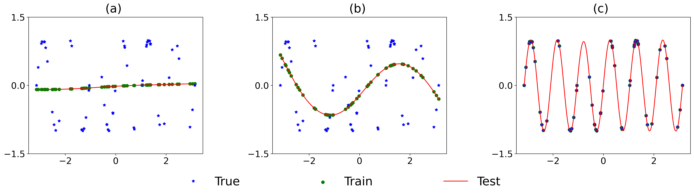

*Figure 2: During training with a set of $n=65$ non-uniformly sampled data points, the learned output function evolves across epochs as shown in (a)-(c) for $0$, $2000$, and $35000$ epochs, respectively. The blue stars represent the exact training data points, the green dots are the network’s outputs on the training data, and the red curve shows the overall learned output function, drawing on $1000$ evenly-spaced data points.* **[p. 4]**

Upon examining the output of the NN, we observe that with the default initialization, the output is almost zero, as depicted in Fig. 2 (a). During the training process, the output of the NN resembles $\sin x$, as shown in Fig. 2 (b). When the loss approaches zero, the network finally fits the target function $\sin 6x$, as illustrated in Fig. 2 (c). In the subsequent subsection, we will explain this process from the perspective of the frequency domain.

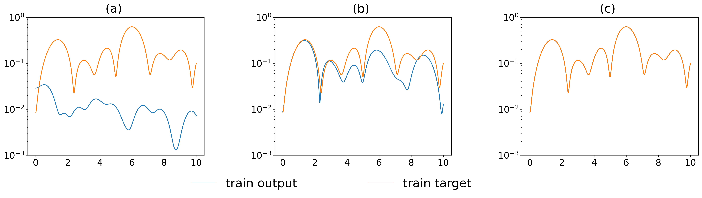

*(a)*

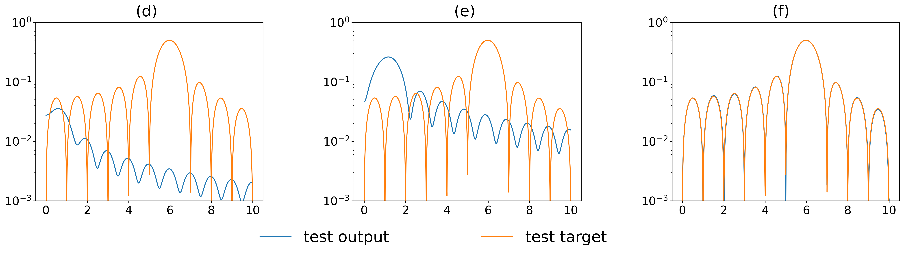

*(b)*

*Figure 3: The evolution of the frequency spectrum during training for Fig. 2. The columns from left to right correspond to epochs $0$, $2000$, and $35000$, respectively. The top row illustrates the frequency spectra of the target function (orange solid lines) and the network’s output (blue solid lines) on the training data. The bottom row shows the frequency spectra of the target function (orange solid lines) and the network’s output (blue solid lines) on the test data. The ordinate represents frequency and the abscissa represents the amplitude of the corresponding frequency components.* **[p. 4]**

###### p4-1

A key observation is that insufficient and nonuniform sampling leads to a discrepancy between the frequency spectra of the training and test datasets, and the training dataset’s spectrum contains a spurious low-frequency component that is not dominant in the test dataset’s spectrum. In the case of $n=65$ nonuniform data points, the NUDFT of the training data contrasts starkly with the NUDFT of the true underlying data, as illustrated in Fig. 3 (a) and (d). The training process adheres to the F-Principle, where the NNs initially fit the low-frequency components, as shown in Fig. 3 (b). At this time, as depicted in Fig. 3 (e), the low-frequency components of the output on the test dataset deviate substantially from the exact low-frequency components, inducing an initial ascent in the test loss.

**[p. 5]**

###### p5-1

As the training loss approaches zero, we note that the amplitude of the low-frequency components on the test dataset decreases, as illustrated in Fig. 3 (f), while it remains unchanged on the training dataset, as shown in Fig. 3 (c). This phenomenon arises due to two distinct mechanisms for learning the low-frequency components. Initially, following the F-Principle, the network genuinely learns the low-frequency components. Subsequently, as the network learns the high-frequency components, the insufficient sampling induces frequency aliasing onto the low-frequency components, thereby preserving their amplitude on the training dataset.

When training on data with sufficient or uniform sampling, as demonstrated in Fig. 9 and Fig. 10 in the appendix, the frequency spectrum of the training dataset aligns with that of the test dataset, thereby mitigating the occurrence of the grokking phenomenon.

###### p5-3

Furthermore, this phenomenon is robust across different activation functions, such as $\mathrm{ReLU}$ and $\mathrm{tanh}$, with the results shown in Fig. 11 and Fig. 14 in the appendix. The corresponding frequency spectra are depicted in Fig. 12, Fig. 13, Fig. 15, and Fig. 16.

###### p5-6

The experiment targets the $(10,[10])$ parity function, with a total of $2^{10}=1024$ data points. The data is split into training and test datasets with different proportions. We employ width-$1000$ two-layer fully-connected NN with activation function $\mathrm{ReLU}$. The training is performed using the Adam optimizer with a learning rate of $2\times 10^{-4}$.

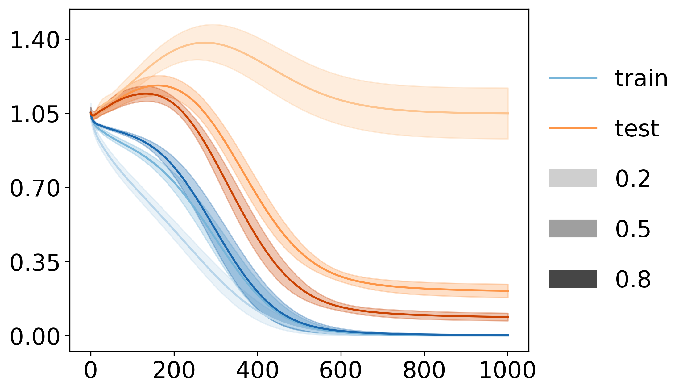

*(a) loss*

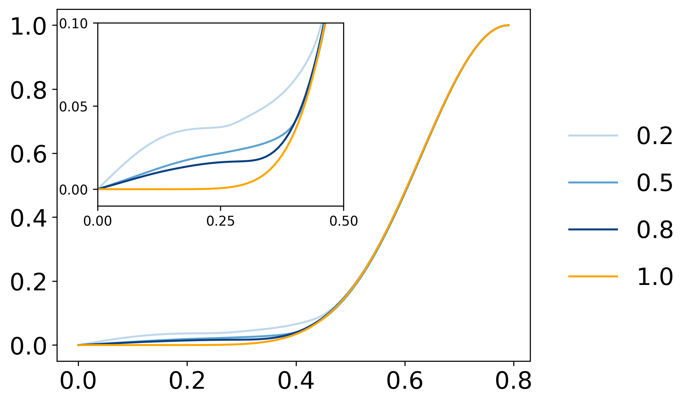

*(b) train data frequency*

###### fig-4

*Figure 4: (a) Loss for ($10,[10]$) parity function with different train data proportion respectively. The blue solid lines are the training dataset, and the orange solid lines are the test dataset. (b) The frequency spectra of the training set over different proportion ratios. The blue solid lines are the frequency spectra of the training dataset, and the orange solid line is the frequency spectrum of all data. The proportion ratios of the training-test dataset are $0.2$, $0.5$, and $0.8$, from shallow to deep. The ordinate represents frequency and the abscissa represents the amplitude of the corresponding frequency components. Each experiment is averaged over $10$ trials and the shallow parts represent the standard deviation.* **[p. 5]**

**[p. 6]**

###### p6-1

The grokking phenomenon is observed in the behavior of the loss across different proportions of the training and test set splits, as illustrated in Fig. 4 (a). When the training set constitutes a higher proportion of the data, the decline in test loss tends to occur earlier compared to scenarios where the training set has a lower proportion. This observation aligns with the findings reported in Barak et al. (2022); Bhattamishra et al. (2023), corroborating the described phenomenon. In the following subsection, we provide an explanation for this phenomenon from a frequency perspective.

###### p6-4

As illustrated in Fig. 4 (b), in the parity function task, when the sampling is insufficient, applying the NUDFT to the training dataset introduces spurious low-frequency components. Moreover, the fewer the sampling points, the more pronounced these low-frequency components become.

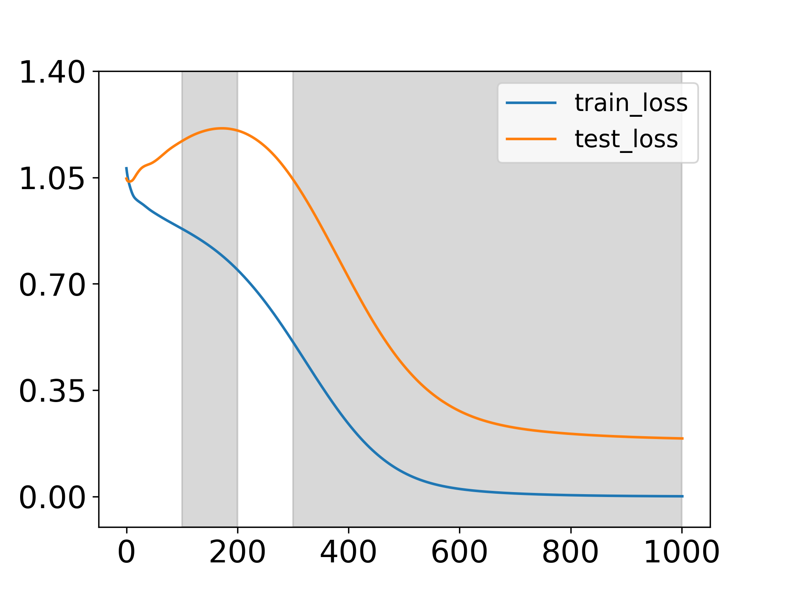

*(a) loss*

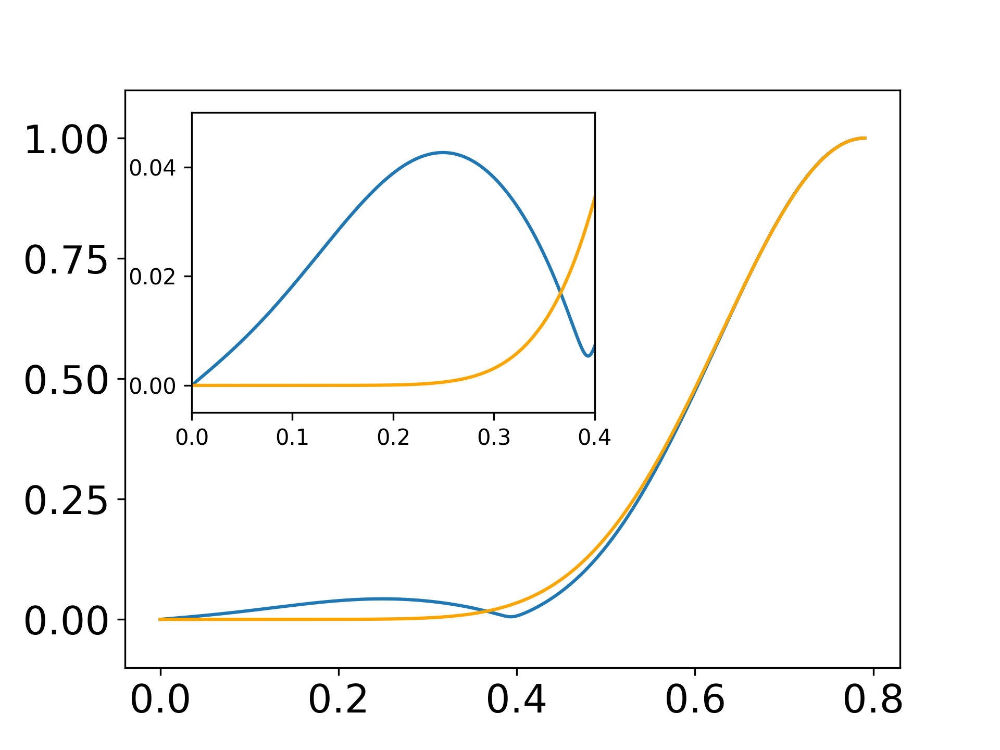

*(b) Frequency spectrum*

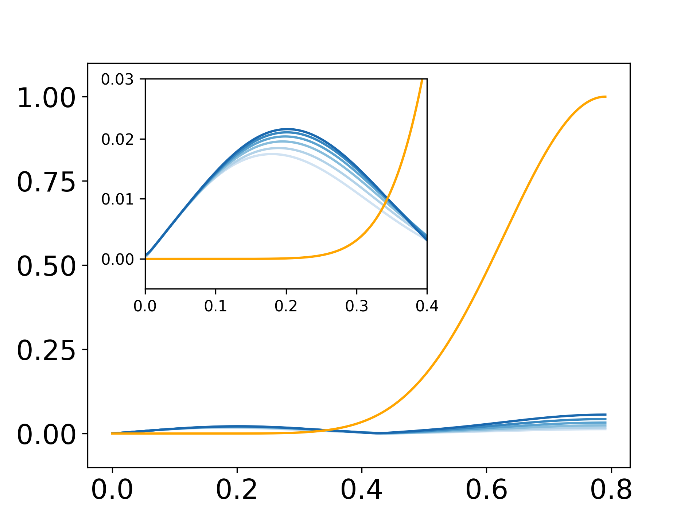

*(c) epoch $100$-$200$*

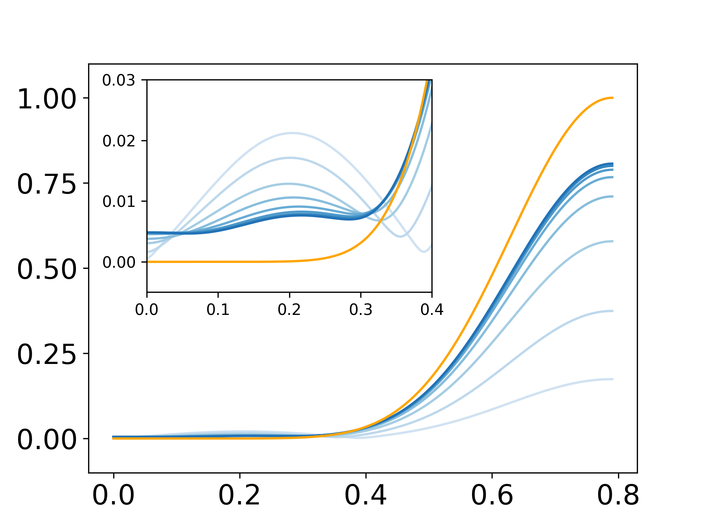

*(d) epoch $300$-$1000$*

*Figure 5: (a) The train and test loss for a specific experiment with proportion ration $0.5$. The ordinate represents epochs and the abscissa represents the loss. The grey background represents the selected intervals for (c)(d). (b) The frequency spectrum difference between the training dataset and the whole dataset. (c)(d) The frequency spectrum of the whole dataset. The orange solid line is the exact frequency spectrum of the $(10,[10])$ parity function. The blue solid lines are the frequency spectra during the training. From shallow to deep corresponds to an increase in epochs, with (c) recording every $20$ epochs, and (d) recording every $100$ epochs. The ordinate represents frequency and the abscissa represents the amplitude of the corresponding frequency components.* **[p. 7]**

To understand the evolution of the frequency domain during the NN’s attempt to solve this problem, we illustrate with a concrete example with the proportion $0.5$. Fig. 5 (a) is the loss for this example and Fig. 5 (b) is the frequency spectra of the training dataset and all data. Although the test loss does not approach zero, the test error already goes zero and we regard it as a good generalization as a classification task, as is illustrated in Fig. 17 (b) in the appendix. During the training process, owing to the F-Principle that governs NNs, the low-frequency components are prioritized and learned first. Consequently, the NN initially fits the spurious low-frequency components arising from insufficient sampling, as is shown in Fig. 5 (c). This results in an initial increase in the test loss, as the low-frequency components on the training dataset are first overfitted. However, as the NN continues to learn the high-frequency components and discovers that utilizing high-frequency components enables a complete fitting of the parity function, we observe a subsequent decline in the low-frequency components, ultimately converging to the true frequency spectrum, which is depicted in Fig. 5 (d).

Based on these findings, we can explain why a lower proportion of training data leads to a later decrease in test loss. When the training data proportion is lower, neural networks spend more time initially fitting the spurious low-frequency components arising from insufficient sampling, before eventually learning the high-frequency components needed to generalize well to the test data.

###### p6-7

We adopt similar experiment settings from Liu et al. (2022). The only difference is that we do not utilize explicit weight decay (WD). $\alpha$ is the scaling factor on the initial parameters. The training set consists of $1000$ points, and the batch size is set to $200$. The NN architecture comprises three fully-connected hidden layers, each with a width of $200$ neurons, employing the ReLU activation function. For large initialization, the Adam optimizer is utilized for training, with a learning rate of $0.001$. For default initialization, the SGD optimizer is employed, with a learning rate of $0.02$.

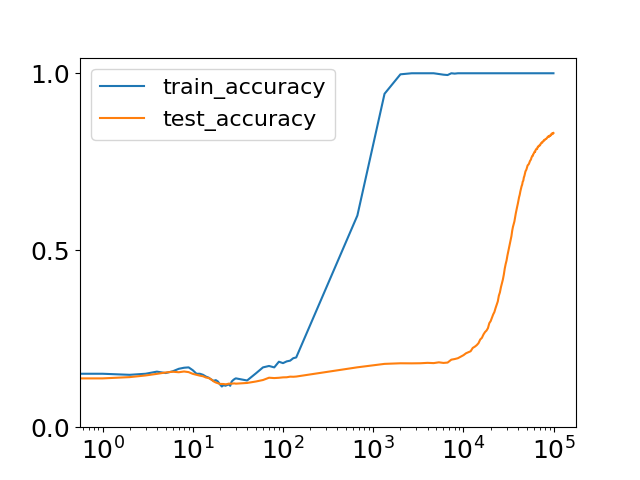

*(a) large initialization $\alpha=8$*

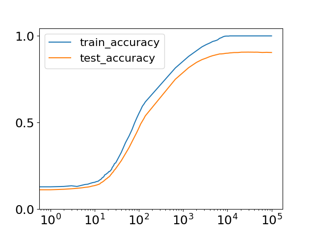

*(b) default initialization $\alpha=1$*

###### fig-6

*Figure 6: Accuracy on MNIST dataset for different initialization during the training process. The ordinate represents epochs and the abscissa represents the accuracy.* **[p. 8]**

###### p6-8

As illustrated in Fig. 6 (a), a grokking phenomenon is observed, suggesting that the explanation provided in Liu et al. (2022) may not be applicable in this scenario. And when we use default initialization, the grokking phenomenon will not appear, as illustrated in Fig. 6 (b).

###### p6-10

To mitigate the computation cost, we adopt the projection method introduced in Xu et al. (2022). We first compute the principal direction $\bm{d}$ of the dataset (including training and test data) $\mathcal{S}$ through **[p. 7]** Principal Component Analysis (PCA) which is intended to preserve more frequency information. Then, we apply Eq. (2) to obtain the frequency spectrum of MNIST. The values of $k$ are chosen by sampling $1000$ evenly-spaced points in the interval $[0,2\pi]$.

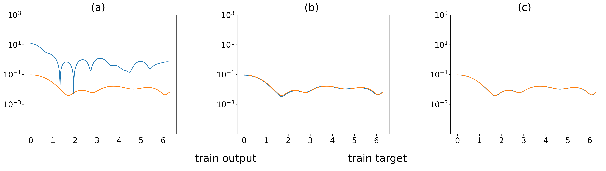

*(a)*

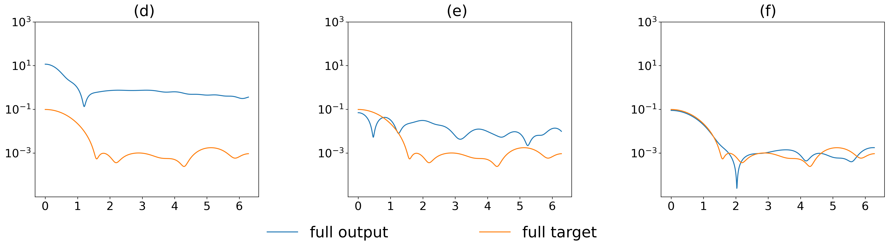

*(b)*

*Figure 7: Frequency spectrum evolution during training on the MNIST dataset when $\alpha=8$. The blue solids line represents the frequency spectra of the network’s outputs, while the orange solid lines depict the frequency spectra of the target data. The top row shows the frequency spectra on the training set, and the bottom row displays the spectra on the full dataset (train and test combined). The columns from left to right correspond to epochs $0$, $2668$, and $99383$, respectively. The ordinate represents frequency and the abscissa represents the amplitude of the corresponding frequency components.* **[p. 8]**

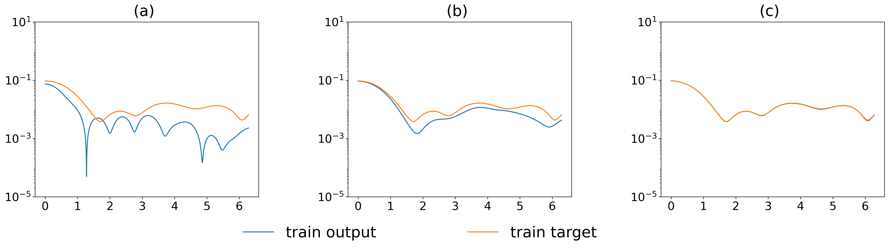

*(a)*

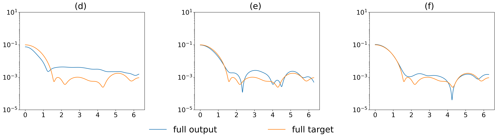

*(b)*

*Figure 8: Frequency spectrum evolution during training on the MNIST dataset when $\alpha=1$. The blue solid lines represents the frequency spectra of the network’s outputs, while the orange solid lines depict the frequency spectra of the target data. The top row shows the frequency spectra on the training set, and the bottom row displays the spectra on the full dataset (train and test combined). The columns from left to right correspond to epochs $0$, $1334$, and $99383$, respectively. The ordinate represents frequency and the abscissa represents the amplitude of the corresponding frequency components.* **[p. 9]**

###### p7-1

In this setting, due to the large initialization adopted, the frequency principle for NNs no longer holds (Xu et al., 2022), and the low-frequency components will not converge first. During the initial stages of training, the amplitude of the NN’s output in the frequency domain substantially exceeds the amplitude of the image itself after the NUDFT, as shown in Fig. 7 (a) and (d). After a period of training, the NN fits the frequencies present in the training set, which are primarily caused by high-frequency aliasing due to undersampling (Fig. 7 (b)), but it cannot fit the full dataset (Fig. 7 (e)). With further training, the NN learns to fit the true high frequencies, at which point the generalization performance of the NN improves, increasing the test set accuracy, as shown in Fig. 7 (c) and (f).

However, with default initialization, this phenomenon does not manifest because the NN’s fitting pattern adheres to the F-Principle, and image classification functions are dominated by low-frequency components (Xu et al., 2020). As shown in Fig. 8 (a) and (d), the low-frequency spectra of the training and test sets are well-aligned. Consequently, as the network learns the low-frequency components from the training data, it simultaneously captures the low-frequency characteristics of the test set, **[p. 8]** leading to a simultaneous increase in both training and test accuracy (Fig. 8 (b) and (e)). Ultimately, the network converges to accurately fit the frequency spectra of both the training set and the complete dataset, as illustrated in Fig. 8 (c) and (f).

###### p9-2

This coarse-to-fine processing bears resemblance to the grokking phenomenon observed on XOR cluster data in Xu et al. (2023), where high-dimensional linear classifiers were found to first fit the training data.

###### p9-3

However, we only demonstrate this mechanism empirically, leaving a comprehensive theoretical understanding of frequency dynamics during training for future work. Additionally, our mechanism may not apply to the grokking phenomenon observed in language-based data (like the algorithmic datasets).
