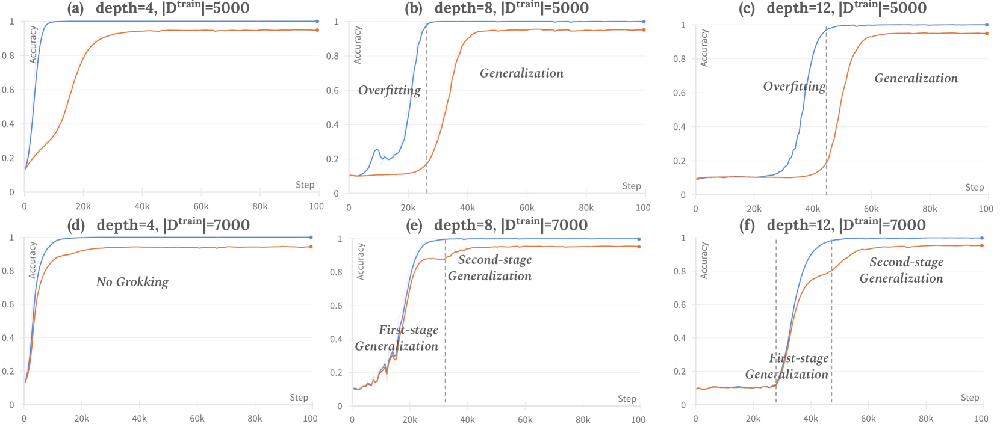
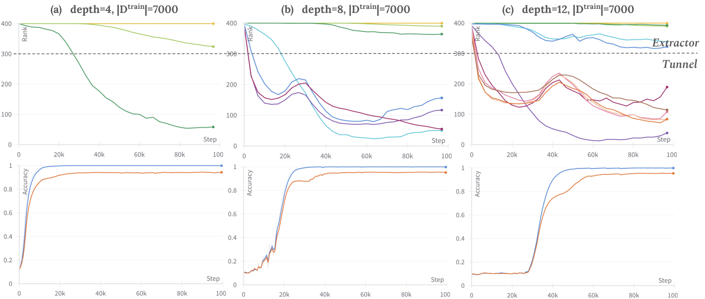

# Fan, Pascanu, Jaggi 2024 — Deep Grokking: Would Deep Neural Networks Generalize Better?

See also: [the global concept index](../../concepts/index.md).

**Simin Fan** (EPFL), **Razvan Pascanu** (Google DeepMind), **Martin Jaggi** (EPFL).

arXiv [2405.19454](https://arxiv.org/abs/2405.19454), May 2024 (version v1). There is no citation count for it in the corpus table. The work is in the corpus as an observational one: it carries the Omnigrok setting over from shallow networks to deep ones and proposes the rank of the internal features instead of the weight norm as an indicator of the phase transition. The source is the native arXiv HTML of version v1 (the only one).

The files of this paper's analysis:

- [`2405.19454.deep-grokking-would-deep-neural-networks-generalize-better.license.txt`](2405.19454.deep-grokking-would-deep-neural-networks-generalize-better.license.txt) — the arXiv licence record for this paper.

The anchor scheme and the rules for linking into a card are in the [README of the papers folder](../README.md).

**Excerpt card.** The paper's licence (`arxiv-nonexclusive`) does not permit republishing the paper itself; what stands here are the editorial sections and the fragments the corpus quotes (right of quotation). The paper: <https://arxiv.org/abs/2405.19454>.

## Concepts covered

**[Grokking](../../concepts/grokking.md)** — the work carries the phenomenon over from shallow networks to deep ones and discovers something unexpected: the deeper the MLP, the **stronger** the grokking rather than the weaker ([`p3-1`](#p3-1)). At $|D^{train}|=5000$ the rise of both the training and the test accuracy is markedly delayed as the depth grows from 4 to 12 layers ([`fig-2`](#fig-2)). Hence the authors' conclusion: the more elaborate features of deep layers are of little help to generalisation.

**[The representation manifold and compression](../../concepts/manifold-representation-compression.md)** — the work's main measurement. The numerical rank of the covariance of the layer-wise activations (the number of eigenvalues above a threshold) falls exactly when the test accuracy begins to rise ([`p3-4`](#p3-4), [`fig-1`](#fig-1)). This correspondence holds at every data size and every weight decay checked ([`p4-1`](#p4-1)).

**[Double descent](../../concepts/double-descent.md)** — the second observation, and the most distinctive one. In the 8- and 12-layer networks on a larger set ($|D^{train}|=7000$) the test accuracy rises in **two** sharp increments, and these two eras correspond to a double descent of the feature rank: the rank falls, rises at the first surge of the accuracy, and then falls again ([`p3-2`](#p3-2), [`p3-3`](#p3-3)). The authors state separately that they distinguish this from the double descent previously observed in loss curves ([`p1-3`](#p1-3)).

**[The Goldilocks zone](../../concepts/goldilocks-zone.md)** — the work contests it outright as an indicator. Having set out the conjecture of Liu et al. that a large initialisation carries the model outside the spherical shell while weight decay slowly drifts it back ([`p3-6`](#p3-6)), the authors measure the weight norm at different data sizes — and find that the norm trajectories largely overlap, decaying smoothly, while the generalisation behaviour is distinguishably different ([`p3-7`](#p3-7), [`fig-5`](#fig-5)).

**[The weight norm and its minimisation](../../concepts/weight-norm-minimization.md)** — hence a direct claim: the weight norm will not do as an indicator of the phase transition, whereas the feature rank will ([`p1-3`](#p1-3), [`p3-4`](#p3-4)). For the corpus this is a rare case in which an explanation through the norm is checked and rejected by experiment rather than by argument.

**[Sparse and linear probing](../../concepts/linear-sparse-probing.md)** — the second measure: a linear classifier with a random initialisation is attached to each internal layer, trained for a set number of steps and evaluated on the test set ([`p2-2`](#p2-2)). A rise of the test accuracy invariably corresponds to a rise of the probe accuracy in **all** the layers ([`fig-1`](#fig-1)).

**[Freezing a subnetwork](../../concepts/freezing-subnetwork.md)** — the notion of a "tunnel" is taken from Masarczyk et al.: the initial layers (the "extractor") learn a high-rank representation, and the upper ones (the "tunnel") compress it to a low rank ([`p3-5`](#p3-5)). Here it is shown that in deeper networks the tunnel is longer (1 layer in the four-layer network, 6 in the twelve-layer one), and the conjecture is put forward that it is the long tunnel that makes the grokking stronger ([`fig-3`](#fig-3), [`fig-4`](#fig-4)).

**[Weight decay](../../concepts/weight-decay.md)** — the controlling knob that sets which of the three behaviours arises. At $|D^{train}|=2000$: $\gamma=0.005$ gives no generalisation at all, $\gamma=0.01$ gives grokking, and $\gamma=0.05$ gives a two-era generalisation ([`p4-1`](#p4-1), [`fig-6`](#fig-6)). At 5000 points the smallest smoothing already gives generalisation without grokking ([`fig-7`](#fig-7)).

**[Initialisation scale](../../concepts/initialization-scale.md)** — the setting reproduces Omnigrok: the ordinary initialisation is multiplied by $\alpha=8.0$, the weight decay is small, the loss is the mean squared error, and the dataset is MNIST ([`p2-1`](#p2-1)).

**[Critical dataset size](../../concepts/data-fraction-critical-dataset-size.md)** — the size of the training set decides which of the three behaviours is seen: 2000, 5000 and 7000 points give, respectively, no generalisation, grokking and a two-era generalisation, everything else being equal ([`p3-2`](#p3-2), [`p4-1`](#p4-1)).

**[Lazy and rich regimes](../../concepts/lazy-to-rich-kernel-to-feature-learning.md)** — in the survey the explanation of Lyu et al. is set out as a transition from the kernel regime to the rich one ([`p6-2`](#p6-2)); the work makes no contribution of its own to that line, but its observation of two eras in the rise of the accuracy chimes with it.

It is worth saying separately what the work does **not** contain. There is no theory: all four pages are observations, and the authors themselves leave the theoretical analysis to future work ([`p6-4`](#p6-4)). Nor is there a check on other architectures: only MLPs on MNIST, with transformers and recurrent networks named among the further plans. Finally, the correspondence "a fall of the rank — generalisation" is shown as a coincidence in time rather than as a causal link: no intervention changing the rank with everything else equal was carried out.

Cards of corpus papers: [Power et al. 2022](../2201.02177.grokking-generalization-beyond-overfitting-on-small-algorithmic-datasets/2201.02177.grokking-generalization-beyond-overfitting-on-small-algorithmic-datasets.card.md) — the original phenomenon; [Liu et al. 2022](../2205.10343.towards-understanding-grokking-an-effective-theory-of-representation-learning/2205.10343.towards-understanding-grokking-an-effective-theory-of-representation-learning.card.md) — grokking as a slow assembly of representations; [Omnigrok](../2210.01117.omnigrok-grokking-beyond-algorithmic-data/2210.01117.omnigrok-grokking-beyond-algorithmic-data.card.md) — the setting with a large initialisation and the explanation through the weight norm, which is contested here; [Thilak et al. 2022](../2206.04817.the-slingshot-mechanism-an-empirical-study-of-adaptive-optimizers-and-grokking/2206.04817.the-slingshot-mechanism-an-empirical-study-of-adaptive-optimizers-and-grokking.card.md) — the slingshot, whose norm plateaus the authors did not see in their own runs; [Kumar et al. 2024](../2310.06110.grokking-as-the-transition-from-lazy-to-rich-training-dynamics/2310.06110.grokking-as-the-transition-from-lazy-to-rich-training-dynamics.card.md) — the transition from the lazy to the rich regime.

## What is shown and what is conjectured

The card editor's remarks following the analysis of the claims (`…claims.txt`). The work is short: four pages of main text and seven figures, with no appendices.

**The question is posed correctly and had not been posed by anyone before.** Almost the whole literature on grokking works with two- and three-layer models; here the same Omnigrok setting is run at 4, 8 and 12 layers ([`p1-7`](#p1-7)). That alone makes the work useful to the corpus.

**The result contradicts the expectation, and this is said outright.** The usual consideration is that deep networks generalise better; here they grok more strongly and later ([`p3-1`](#p3-1)). A result negative in spirit is set out with no attempt to soften it.

**The two-era generalisation is a finding in its own right.** The test accuracy rises in two sharp increments, and the feature rank gives a double descent ([`p3-2`](#p3-2), [`p3-3`](#p3-3)). In shallow models nothing of the kind is seen at all, that is, the finding arises precisely out of the depth.

**The refutation of the weight norm as an indicator is made by a direct measurement.** Two models of the same depth on different data sizes give almost coincident weight-norm trajectories with plainly different generalisation behaviour ([`p3-7`](#p3-7)). This is an honest check of somebody else's explanation within that explanation's own setting.

**The correspondence of the rank with the generalisation is shown broadly.** It holds at three data sizes, three weight-decay values and three depths ([`p4-1`](#p4-1)) — that is, it is not an isolated coincidence.

**There is nevertheless no causality, and none is claimed.** All the results are coincidences in time on curves. Not a single intervention changing the feature rank with everything else equal is carried out, and so "the rank as an indicator" remains an observation rather than a mechanism.

**There is no theory at all, and this is admitted.** The theoretical analysis is explicitly left to future work ([`p6-4`](#p6-4)); the link between the length of the tunnel and the strength of the grokking is called a conjecture ([`p3-5`](#p3-5)).

**The range of the check is narrow.** Only MLPs, only MNIST, only the mean-squared-error loss, only Adam. Other architectures (transformers, recurrent networks) are named among the plans ([`p6-4`](#p6-4)).

**There are no seed-to-seed deviations.** No figure carries spread bars; how many runs stand behind each curve is not said in the text. For a work whose main result is a coincidence of the kinks in two curves this is a substantial gap.

**The rank threshold is chosen by hand.** A layer is counted as part of the tunnel if the rank of its output features is below 300 ([`fig-3`](#fig-3)); where the 300 comes from is not explained, and the length of the tunnel is one of the work's principal quantities.

**The priority claim is stated more broadly than what is shown.** "We believe our work is the first to address grokking in deep networks" ([`p1-4`](#p1-4)) — but "deep" here means a 12-layer MLP on MNIST, whereas grokking had by then already been observed in far larger models.

**Its place in the corpus.** The work is observational and short, but it closes a notable gap: almost everything known about grokking was obtained on shallow networks. Three things are valuable: depth strengthens grokking rather than weakening it; the rank of the internal features falls in step with the onset of generalisation and therefore serves as an indicator better than the weight norm; and the two-era generalisation with a double descent of the rank, which is not met with in shallow models. The price: no theory, no interventions, no seed-to-seed deviations; one task, one architecture, one optimisation method.

## Common misreadings and overstatements

These are the card editor's remarks, not the authors' text: places where this paper restates someone else's results with an error, or without the qualifications their authors attached. The "details" links in the "Common misreadings and overstatements of this paper" sections of the cited works' cards lead here.

###### mc-2206-04817
**Thilak et al. (2206.04817) — "exclusively via the slingshot".** `"Thilak et al. (2022) reported that the grokking happens exclusively in accordance to a slingshot effect"`. Both of the original authors' hedges are dropped: ["without explicit regularization grokking… almost exclusively happens at the onset of slingshots"](../2206.04817.the-slingshot-mechanism-an-empirical-study-of-adaptive-optimizers-and-grokking/2206.04817.the-slingshot-mechanism-an-empirical-study-of-adaptive-optimizers-and-grokking.card.md#p1-2) — "almost" — and the condition "without explicit regularization" (with weight decay grokking proceeds perfectly well without slingshots, as Nanda et al. showed in appendix D.2). Further in the same paragraph the mechanism (the cycles, the norm) is paraphrased correctly, and the paper's own objection — the absence of a norm plateau in deep networks — is addressed precisely to the strengthened version of the statement.

---

# Quoted fragments

Only the fragments the corpus cards refer to are
reproduced here (right of quotation); the paper's licence does not permit
republishing the whole text. Anchor numbering matches the original.

###### p1-2

Recent research on the *grokking* phenomenon has illuminated the intricacies of neural networks’ training dynamics and their generalization behaviors. *Grokking* refers to a sharp rise of the network’s generalization accuracy on the test set, which occurs long after an extended overfitting phase, during which the network perfectly fits the training set. While the existing research primarily focus on shallow networks such as 2-layer MLP and 1-layer Transformer, we explore *grokking* on deep networks (e.g. 12-layer MLP). We empirically replicate the phenomenon and find that deep neural networks can be more susceptible to *grokking* than its shallower counterparts. Meanwhile, we observe an intriguing multi-stage generalization phenomenon when increase the depth of the MLP model where the test accuracy exhibits a secondary surge, which is scarcely seen on shallow models.

###### p1-3

We further uncover compelling correspondences between the decreasing of feature ranks and the phase transition from overfitting to the generalization stage during *grokking*. Additionally, we find that the multi-stage generalization phenomenon often aligns with a double-descent111We distinguish our observation from previously observed double-descent on the loss curves. pattern in feature ranks. These observations suggest that internal feature rank could serve as a more promising indicator of the model’s generalization behavior compared to the weight-norm.

###### p1-4

We believe our work is the first one to dive into grokking in deep neural networks, and investigate the relationship of feature rank and generalization performance.

###### fig-1

*Figure 1: **Generalization behaviors and internal feature learning of a 12-layer MLP network given various amount of training data ($|D^{train}|$).** Middle row depicts training (**blue** curve) and test accuracy (**orange** curve) along training steps. Top/Bottom row denotes per-layer feature ranks/linear probing accuracy respectively. **Left.&Center.** Grokking-Rank Descent: On small training set, the test accuracy started to increase after the training accuracy reaches the optimal, which corresponds to the feature ranks started to *decrease*. **Right.** Grokking-Rank Double Descent: On a larger training set, the test accuracy increases in parallel with the training accuracy, which corresponds to an *increment* of feature rank. However, it shows a second surge after training accuracy reaches its optimal, corresponding to a *second descent* of the feature ranks. For all three cases, the increasing of test accuracy always correspond to the increasing of linear probe accuracy across all layers. Different colors of feature ranks represent different layers.* **[p. 2]**

###### p1-7

The community has dedicated substantial efforts in understanding this delayed and sharp phase transition from overfitting to the generalization regime (Power et al., 2022; Liu et al., 2022; Thilak et al., 2022; Liu et al., 2023; Lyu et al., 2023), while nearly all existing studies on grokking are confined to *shallow* networks (e.g. 2-layer transformer, 2-layer MLP). However, as evidenced by recent findings, markedly different generalization behaviors can emerge when the model is scaled up (Wei et al., 2022). To bridge the gap, we conduct the first inquiry of grokking on deep neural networks (e.g. 12-layer MLPs) and investigate the correlation between evolution of internal feature representations and phase transitions during the training process.

Following Liu et al. (2023), we replicate the grokking phenomenon on deep MLP networks applying a large initialization and small weight decay. Specifically, we presents three intriguing observations on deep MLP networks:

###### p1-9

1. Deep MLP networks are more susceptible to grokking than shallow models;
2. On deep MLP networks, we observed a correspondence between feature rank decrease and generalization. It suggests that the internal feature ranks could be a more promising indicator of phase transition during training compared to the weight-norm proposed by (Liu et al., 2023);
3. We observe a multi-stage progress in generalization, where the test accuracy evolves in two sharp increments instead of a single surge observed previously. **[p. 2]** The two phases are mirrored by a *double-descent* pattern on the feature rank.

###### p2-1

Following Liu et al. (2023), we study grokking on Multi-Layer Perception (MLP) networks of varying depth on the MNIST dataset LeCun et al. (1998). We apply large initialization and small weight decay to reproduce grokking, mimicking the set-up of Liu et al. (2023). All the models have the same width (400) and implemented with ReLU activation. For each network, we scale the standard initialization222as default initialization in Pytorch. by a scaling factor $\alpha$.333$\alpha=w/w_{0}$, where $w_{0}$ and $w$ are the weight-norm of the network before and after rescaling. All the models are trained with the Adam optimizer (learning rate $1\times 10^{-3}$) and Mean Square Error (MSE) for $10^{5}$ steps following the setting in Liu et al. (2023). If not otherwise specified, the model is trained with initialization scale $\alpha=8.0$ and weight decay $\gamma=0.01$.

###### p2-2

We study the internal feature representation learning by measuring the (i) Linear probing accuracy, which indicates the quality of the internal representation and (ii) Numerical rank of representations, which indicates the extent of compression. For linear probing, we attach a randomly initialized linear classifier head to each internal layer $l$ of the neural network. We train the linear head only for a fixed number of steps on the training set, then evaluate it on the test set. The linear probing accuracy measures whether the learnt internal features are good enough to be linearly separable in the high-dimensional space. We also estimate the layer-wise numerical rank of feature representations to reflect to what extent the learnt internal features can be compressed. Specifically, we compute the singular values of the covariance matrix of the output **[p. 3]** activation $W\in\mathrm{R}^{n\times d}$ from an internal layer $l$. We then measure its numerical rank as the number of singular values above a certain threshold given a relative tolerance $\epsilon$: $\sigma=max(n,d)\cdot\epsilon$.444We use as tolerance $\epsilon$ the epsilon value of the dtype of the feature matrix $W$ used Pytorch *matrix_rank* function.

###### fig-2

*Figure 2: **Generalization behaviors of various depth of MLP models.** **Top.** Grokking: On small training set ($|D^{train}|=5000$), both the improvement of training (**blue** curve) and test (**orange** curve) accuracy would be delayed as the depth of the model increase. **Bottom.** Multi-stage Generalization: On a larger training set ($|D^{train}|=7000$), the deep (8- and 12-layer) MLP models exhibit a 2-stage generalization, where the test accuracy experiences a second surge. The 2-stage generalization phenomenon is also correlated to a double-descent of feature rank (Fig. 1, c).* **[p. 4]**

###### p3-1

The long-standing intuition from deep learning suggests that deeper neural networks have the potential to overfit on the training set as they are more expressive (Montúfar et al., 2014). They are also meant to learn complex features and are known to generalize better than shallow networks (Zeiler & Fergus, 2013; Ozair & Bengio, 2014). Our experiments reveals that deeper MLP networks are more prone to experiencing *grokking* compared to their shallower counterparts, which implies more sophisticated features learnt by deeper layers not help much with generalization. As illustrated in Figure 2 (a,b,c), as the network depth increases, both the growth in training and test accuracy are notably delayed.

###### p3-2

We also observed an intriguing multi-stage generalization behavior on deep MLP networks, wherein the test accuracy demonstrated several distinct periods of improvement marked by sharp transitions. According to Figure 2 (d,e,f), when trained on 7000 data points, no significant *grokking* was observed during the training of the 4-layer MLP network, while both the 8-layer and 12-layer MLP networks exhibited a notable second-surge of test accuracy. Meanwhile, compared to the 8-layer, the occurrences of both the first- and second- stage of generalization are delayed with the 12-layer model, and the test accuracy obtained from the first-stage generalization is significantly lower than the 8-layer network.

###### p3-3

Moreover, the multi-stage generalization behavior is corresponding to a double-descent of feature ranks. As depicted in Figure 1 (c), the feature ranks drop from the beginning of training, while starting to increase at the first surge of test accuracy. Concurrent to the second stage of generalization, the feature ranks experience a second-descent.

###### p3-4

We have observed a concurrent feature rank descent corresponding to the phase transition of “grokking” phenomenon on 12-layer MLP networks. According to Figure 1 (a), during the training of a 12-layer MLP network on limited data, the test accuracy (and linear probe accuracy) begins to rise notably as the feature ranks exhibit a significant decrease. With larger training data size (Fig. 1, b), the process of grokking occurs more rapidly, in accordance with findings by Power et al. (2022) and Liu et al. (2023). In these instances as well the correlation between rank collapse and the shift from overfitting to generalization stage remains consistent. It suggests that the feature ranks could be a more promising indicator of phase transition during training compared to the weight-norm, which is investigated by (Liu et al., 2023).

###### fig-3

*Figure 3: **Emergence of *Tunnel* on various depth of models ($|D^{train}|=5000$).** **Left.** 4-layer MLP: least extent of *grokking* with $tunnel\_length=1layer$; **Middle.** 8-layer MLP: more *grokking* than 4-layer model with $tunnel\_length=3layer$; **Right.** 12-layer MLP: the most severe *grokking* with $tunnel\_length=6layer$. We consider the layer with output feature rank lower than 300 as a *tunnel* layer.* **[p. 4]**

###### fig-4

*Figure 4: **Emergence of *Tunnel* on various depth of models ($|D^{train}|=7000$).** **Left.** 4-layer MLP: grearly generalize with no *grokking* with $tunnel\_length=1layer$; **Middle.** 8-layer MLP: *two-stage generalization* with $tunnel\_length=5layer$; **Right.** 12-layer MLP: *two-stage generalization* with delays in both generalization stages, $tunnel\_length=6layer$. We consider the layer with output feature rank lower than 300 as a *tunnel* layer.* **[p. 5]**

###### p3-5

Masarczyk et al. (2023) demonstrated that the architecture of an image classification model can split into two distinct parts: the initial layers (i.e. *Extractor*) learn a high-rank, linearly separable feature representation while the higher layers (i.e. *Tunnel*) tend to compress it into a low-ranked representation. As exhibited in Fig. 3 and Fig. 4, our observations align with these findings in two aspects: firstly, as the layer depth increases, the feature ranks decrease more significantly during training; secondly, deeper networks tend to have longer “*tunnel*”s. The empirical results from (Masarczyk et al., 2023) suggest that the longer tunnel may have a detrimental effect on the learned representation’s generalization ability. We hypothesize that the similar “*tunnel effect*” could lead to the more pronounced *grokking phenomenon* within deeper MLP networks compared to the shallower counterpart.

###### p3-6

Liu et al. (2023) presents a hypothesis of *grokking* from large initialization based on the *Godilocks Zone* theory: there exist a thick, hollow, spherical shell in the space of model’s weight around the initialization which could lead to a great generalization behavior (Fort & Scherlis, 2018). According to (Liu et al., 2023), the large, bad initialization would put the model outside the shell of the *Godilocks zone*, where the model would quickly fit to the training set with a slight change of the weight-norm, while being slowly drifted to the *Godilocks zone* by the weight decay regularization, corresponding to a drop of the weight-norm. However, could the weight-norm be considered as a proper indicator of *grokking*?

###### p3-7

We observed that *the dynamics of the weight-norm are not indicative of the model’s generalization behavior.* Following the setting as in Figure 2, we measure the weight-norm, defined as the L2 norm of all model parameters, in Figure 5. Specifically, we train two MLP models of the same depth on two different scales of training sets then compare the dynamics of the weight-norm and the feature-rank from the second-last layer during. Despite the distinguishable generalization behaviors, the weight-norm’s trajectories are largely overlap, which decrease smoothly throughout the training process, without a discernible indication of the phase transitions. In contrast, the feature-ranks exhibit significant differences indicating the phase transitions. **[p. 4]** We consolidate our finding with experiments on various depth of models Fig. 5 ($d=4,8,12$).

###### fig-5

*Figure 5: **Trajectories of train/test accuracy, weight-norm and feature-rank.** **Top-left**: the train and test accuracies. The dotted lines stand for test accuracies; **Top-right**: the trajectories of the weight-norms, defined as the magnitude of L2-norm of all the model parameters. **Bottom**: we present the feature rank curve from the *second-last layer* (the layer before output layer). When trained on various scales of training data, the trajectories of the weight-norms are largely overlapping while the feature-ranks exhibit significant differences indicating the phase transitions. The finding holds across various depths of models ($d=4,8,12$).* **[p. 5]**

###### p4-1

Following Liu et al. (2023), we also investigate the dependency on the strength of regularization by experimenting with three weight decay values: $\gamma=0.005$, $\gamma=0.01$, $\gamma=0.05$. As shown in Fig. 6, on 2000 training data points, the smallest regularization ($\gamma=0.005$) fails to gen**[p. 5]** eralize; with $\gamma=0.01$, the model demonstrates a delayed generalization (*grokking*); with the largest regularization ($\gamma=0.05$), the model exhibits a two-stage generalization. With a larger training data size (5000), the model shows similar grokking (resp. two-stage generalization) behaviors with $\gamma=0.01$(resp. $0.05$); while with the smallest **[p. 6]** regularization ($\gamma=0.005$), the model is able to generalize without grokking. All the training data size and weight decay combinations exhibit a consistent correlation between the beginning of generalization and the descent of the feature ranks. Also, the two-stage generalization phenomenons are aligned with a double-descent of the feature ranks.

###### fig-6

*Figure 6: **Generalization behaviors with various weight decay on $|D^{train}|=2000$.** **Left.** $\gamma=0.005$: Fail to Generalize; **Middle.** $\gamma=0.01$: Grokking; **Right.** $\gamma=0.05$: Two-stage Generalization.* **[p. 7]**

###### fig-7

*Figure 7: **Generalization behaviors with various weight decay on $|D^{train}|=5000$.** **Left.** $\gamma=0.005$: Generalize without grokking; **Middle.** $\gamma=0.01$: Grokking; **Right.** $\gamma=0.05$: Two-stage Generalization.* **[p. 7]**

###### p6-2

Current research have also provided valuable insights into the *grokking* phenomenon from the dynamics of learning. Thilak et al. (2022) reported that the *grokking* happens exclusively in accordance to a *slingshot effect*, which corresponding to a cyclic phase transitions between stable-and-unstable training regimes and the norm growth-and-plateau of the last layer weights. However, for the multi-stage generalization on deep networks, we have not observed any significant plateaus of the norm of the last layer or the entire set of model parameters. Liu et al. (2022) first attributed *grokking* to the slow formulation of good representations. However, they mainly construct a theory between the representation learning effectiveness and the size of available training data, without diving deep into the detailed feature characteristics (i.e. ranks collapse etc.). Following that, Liu et al. (2023) further explores the correspondence between the weight-norm and the transition of overfitting-generalization regimes, explaining that the model needs to *grok* slowly into the *Goldilocks zone* (Fort & Scherlis, 2018) for generalization. Lyu et al. (2023) explains grokking from the distinct implicit biases induced from overfitting and generalization phases from the *kernel-regime* where the classifier behaves like a Neural Tangent Kernel (NTK) to a *rich-regime*, which mainly based on a gradient-based convergence of a min-max minimizer.

###### p6-3

Concurrently, contemporary studies in mechanistic interpretability provided valuable insights of understanding model training dynamics through the lens of feature ranks (Feng et al., 2022; Boix-Adsera et al., 2023; Wang et al., 2024). However, none have yet linked layerwise feature ranks to the concept of *grokking*. Andriushchenko et al. (2023) suggests that sharpness-aware minimization would find solutions with lower feature ranks, which echos to our findings of the correlation between rank decrease and generalization. Therefore, our research presents the first evidence on the relationship between feature rank and *grokking*, aiming to enhance comprehension of generalization behavior through the analysis of internal feature representations. There are plentiful explorations on the double-descent phenomenon in over-parametrized networks (Nakkiran et al., 2019; Kuzborskij et al., 2021; Schaeffer et al., 2023; Lafon & Thomas, 2024), which could be connected to our observations.

###### p6-4

In this paper, we do the first inquiry on the grokking phenomenon and generalization behaviors on deep MLP networks. Unconventionally, we found that deep MLP models are more susceptible to suffer from *grokking* than its shallower counterparts. Also, we have observed the intriguing multi-stage generalization and a consistent feature rank-generalization correspondence on deep MLP models. Our observation suggests that internal feature ranks could serve as a promising indicator of the model’s generalization performance. We leave the theoretical analysis and extensive experiments on other architectures (e.g. Transformers, RNNs) to the future work.

**[p. 7]**
