# Lee et al. 2024 — Grokfast: Accelerated Grokking by Amplifying Slow Gradients

See also: [the global concept index](../../concepts/index.md).

**Jaerin Lee**, **Bong Gyun Kang**, **Kihoon Kim**, **Kyoung Mu Lee** — Seoul National University (ASRI, Department of Electrical and Computer Engineering; the interdisciplinary programme in artificial intelligence). The first two contributed equally.

arXiv [2405.20233](https://arxiv.org/abs/2405.20233), 30 May 2024. 36 citations — the twelfth most cited work in the corpus. The source is the native arXiv HTML of version v2. The code: [github.com/ironjr/grokfast](https://github.com/ironjr/grokfast).

The files of this paper's analysis:

- [`2405.20233.grokfast-accelerated-grokking-by-amplifying-slow-gradients.license.txt`](2405.20233.grokfast-accelerated-grokking-by-amplifying-slow-gradients.license.txt) — the arXiv licence record for this paper.

The anchor scheme and the rules for linking into a card are in the [README of the papers folder](../README.md).

**References of the form `LABEL:fig:...`** in the text are a trace of the HTML build on arXiv: there the captions of the figure panels did not resolve into numbers. In the PDF "Figures 4a and 4b" and the like stand in their place. Left as in the source.

**Excerpt card.** The paper's licence (`arxiv-nonexclusive`) does not permit republishing the paper itself; what stands here are the editorial sections and the fragments the corpus quotes (right of quotation). The paper: <https://arxiv.org/abs/2405.20233>.

## Concepts covered

**[Low-pass filtering of the gradient](../../concepts/gradient-low-pass-filtering.md)** — the work that defines this notion. The technique is a single line: $\hat{g}(t)=g(t)+h(t)*g(t)$, where $h$ is a low-pass filter along the axis of training iterations ([`p3-1`](#p3-1)). The hypothesis from which everything is derived: the delayed generalisation is a consequence of the **slowly varying** component of the parameter updates, while the fast one produces overfitting ([`p2-5`](#p2-5)).

**[Optimisers](../../concepts/optimizer-adam-adamw-sgd.md)** — Grokfast is not an optimiser but a **wrapper** over any first-order optimiser. Theorem A.1 shows that filtering the gradients is equivalent to filtering the parameter updates for any linear optimiser — which is why the technique is inserted in one line between `backward()` and `step()` ([`p8-2`](#p8-2)). The difference from momentum is spelled out by the authors: the smoothed gradient is used as a **residual** added to the gradient *before* the optimiser, rather than as the update itself.

**[The learning rate](../../concepts/learning-rate.md)** — the whole setting is built on the abstraction $u(g(t),t)$: any iterative optimiser with its hyperparameters fits into one notation ([`p2-3`](#p2-3)). The learning rate is meanwhile not touched at all — the acceleration is not achieved by enlarging the step.

**[Weight decay](../../concepts/weight-decay.md)** — a **joint** effect is shown: Grokfast-MA without weight decay gives a speed-up, with $\mathrm{wd}=0.01$ a further $\times 3.72$ on top, whereas the same weight decay without Grokfast makes the training unstable ([`p5-2`](#p5-2)). This is a case rare in the corpus in which two "accelerators" are checked both separately and together.

**[Progress measures](../../concepts/progress-measures.md)** — the work leans on the conclusion of Nanda et al. that grokking is not as abrupt as it looks: if there is a continuous progress inside, then there is also a slow signal that can be amplified ([`p9-2`](#p9-2)). In essence Grokfast is an engineering consequence of that observation.

**[The memorisation phase](../../concepts/memorization-phase.md)** and **[phase transition](../../concepts/phase-transition.md)** — a model of **three states** is proposed: A (initialisation), B (overfitting), C (generalisation) ([`p5-1`](#p5-1)). The transition A→B is short, B→C long; Grokfast shortens precisely the second. A two-stage strategy — switching the filter on only after B — gives a further $\times 1.53$.

**[The loss landscape and basins](../../concepts/loss-landscape-basins.md)** — a projection of all 423 thousand parameters onto two principal components shows that Grokfast leads the model into a **different** state C: the distance $\overline{\mathrm{AC}}$ is $\times 16$ shorter and the spread between runs a hundred times smaller ([`p9-1`](#p9-1)). That is, the acceleration is achieved not by traversing the same path faster but by a different path.

**[Modular arithmetic](../../concepts/modular-arithmetic.md)** — the main proving ground: $x\cdot y\bmod 97$ on a two-layer transformer, the same setting as in Power et al. ([`p7-1`](#p7-1)). It is here that the work's headline number is attained — a reduction of the number of iterations by $\times 50.49$.

**[Real data](../../concepts/vision-real-world-data-mnist-cifar.md)** — the check is carried over to the settings of Omnigrok: MNIST with a three-layer MLP (the delay cut by $\times 22.0$, and the final accuracy raised from 89.8 % to 91.2 %), the molecular QM9 with a graph convolutional network, and IMDb with an LSTM ([`p7-3`](#p7-3)). Four domains, four architectures — the broadest check of an accelerator in the corpus.

**[Initialisation scale](../../concepts/initialization-scale.md)** — grokking is not observed of its own accord in these tasks: it is **induced** by an enlarged initialisation following the Omnigrok recipe — $\times 8$ for MNIST, $\times 3$ for QM9, large weights for the LSTM ([`fig-11`](#fig-11)). An essential caveat: what is accelerated is a grokking induced artificially rather than met with in ordinary training.

**[Double descent](../../concepts/double-descent.md)** — mentioned in the survey as a line of explanations of grokking from which the work starts: the cause and the sufficient conditions of the phenomenon are, in the authors' view, not fully characterised ([`p1-3`](#p1-3)).

**[The slingshot effect](../../concepts/slingshot.md)** — given in the survey as an example of grokking being possible without an explicit regularisation at the expense of an implicit one ([`p9-2`](#p9-2)). Grokfast is itself an intervention in the optimiser too, but, unlike the slingshot, a deliberate and controllable one.

**[Grokking](../../concepts/grokking.md)** — the notion changes its status: from a phenomenon to be explained it becomes a phenomenon to be **used**. The position is stated outright: the work takes the side of the practitioner rather than of the theorist ([`p1-2`](#p1-2)).

Cards of corpus papers: [Power et al. 2022](../2201.02177.grokking-generalization-beyond-overfitting-on-small-algorithmic-datasets/2201.02177.grokking-generalization-beyond-overfitting-on-small-algorithmic-datasets.card.md) — the task and the base setting; [Omnigrok](../2210.01117.omnigrok-grokking-beyond-algorithmic-data/2210.01117.omnigrok-grokking-beyond-algorithmic-data.card.md) — the source of all the non-algorithmic settings and of the recipe for inducing grokking by the initialisation scale; [Nanda et al. 2023](../2301.05217.progress-measures-for-grokking-via-mechanistic-interpretability/2301.05217.progress-measures-for-grokking-via-mechanistic-interpretability.card.md) — the observation about a continuous internal progress from which the very idea is derived; [Slingshot](../2206.04817.the-slingshot-mechanism-an-empirical-study-of-adaptive-optimizers-and-grokking/2206.04817.the-slingshot-mechanism-an-empirical-study-of-adaptive-optimizers-and-grokking.card.md) — another intervention on the optimiser side; [Gromov 2023](../2301.02679.grokking-modular-arithmetic/2301.02679.grokking-modular-arithmetic.card.md) — mentioned in the survey as having shown the dependence of the picture of grokking on the optimisation.

**[Accelerating grokking](../../concepts/accelerated-grokking.md)** — the work makes acceleration its direct aim ([`p1-2`](#p1-2)) and derives the technique from a hypothesis about the cause of the delay: it is carried by the low-frequency, slowly varying part of the updates ([`p2-5`](#p2-5)). The technique is therefore not a hyperparameter search but a consequence of a mechanism — and hence checkable as a statement about it.
## What is shown and what is conjectured

The card editor's remarks following the analysis of the claims (`…claims.txt`). The work is engineering and says so honestly: it does not explain grokking but shortens its delay.

**The method works and is checked more broadly than any other in the corpus.** Four tasks, four architectures — a transformer, an MLP, a graph convolutional network, an LSTM — and everywhere an acceleration. The implementation is a dozen lines inserted between the computation of the gradients and the optimiser step; the code is open.

**Theorem A.1 is a genuine result rather than an ornament.** It shows that filtering the gradients and filtering the parameter updates are the same thing for any linear optimiser. It is from this that it follows that the technique requires no rewriting of the optimiser, and it is this that makes the claim of applicability to Adam and AdamW justified rather than an empirical coincidence.

**The headline "$\times 50$" is about iterations, not about time.** For Grokfast-MA a reduction of the iterations by $\times 50.49$ gives only $\times 20.49$ in wall-clock time, because an iteration becomes $\times 2.4$ dearer and requires 1.6 times more video memory. For the EMA variant the numbers honestly coincide ($\times 43.84$ in iterations and $\times 43.79$ in time), and it is that variant that is named the principal one. Table 3 gives all of this; the abstract does not.

**The most obvious comparison is not carried out.** Grokfast-EMA adds to the gradient its exponential moving average — that is, does something very close to raising the momentum. The authors explain how this differs formally ([`p8-2`](#p8-2)), but **there is no ablation against a plain increase of Adam's $\beta_{1}$ in the work**. Without it the contribution of the "filtering" cannot be separated from the contribution of "more momentum".

**The hypothesis is not measured directly.** The claim that the slow component is responsible for the generalisation and the fast one for the overfitting is nowhere checked by measuring the spectrum of the gradients in a grokking model. It is supported only by the fact that a method built from it works — and indirectly by the fact that the slow gradients alone give instability ([`p4-3`](#p4-3)).

**What is accelerated is an induced grokking.** In three of the four tasks grokking does not arise of itself: it is induced by an enlarged initialisation following the Omnigrok recipe. This is legitimate — the paper's task is acceleration — but it means that the work neither checks nor promises a carry-over to ordinary training, in which there is no delay.

**The most interesting observation is incidental.** Grokfast brings the model into a **different** final state: $\overline{\mathrm{AC}}$ is $\times 16$ shorter and the spread between runs a hundred times smaller ([`p9-1`](#p9-1)). The authors note that the source of this determinism is unclear to them and leave it as an open question. For the corpus this means that "accelerated grokking" and "ordinary grokking" may lead to different solutions at identical final metrics.

**There are almost no statistics.** The main curves are given with no error bars and, by the description, from single runs; five runs appear only in appendix E, where trajectories are compared. Numbers such as $\times 13.57$ and $\times 1.53$ should therefore be read as single measurements rather than as estimates with a mean.

**Its place in the corpus.** The work is a direct engineering consequence of Nanda et al.'s conclusion about a continuous internal progress: if the progress is continuous, its signal can be amplified. With Omnigrok the connection is technical: all the settings are taken from there. With the explanatory works it neither argues nor integrates — this is a separate branch of the corpus, in which grokking passes from an object of study into an instrument.

## Common misreadings and overstatements

These are the card editor's remarks, not the authors' text: places where this paper restates someone else's results with an error, or without the qualifications their authors attached. The "details" links in the "Common misreadings and overstatements of this paper" sections of the cited works' cards lead here.

###### mc-2210-01117
**Omnigrok (2210.01117) — the caveat about inducement (in one place out of three).** For the most part the paper cites carefully: the datasets are called `"treated to exhibit the grokking phenomenon"`, and the conditions of the inducement are spelled out: `"Under ×8 larger weight initialization … the network is known to exhibit grokking"`. In one place, however, the caveat is dropped: `"Omnigrok [Liu et al., 2022b] shows that such behavior can also be observed in a diverse set of tasks with larger and more complex datasets"` — "can also be observed" loses the fact that grokking there is ["induced"](../2210.01117.omnigrok-grokking-beyond-algorithmic-data/original/2210.01117.omnigrok-grokking-beyond-algorithmic-data.md#p1-3) ["in a slightly non-standard setting where it is relatively weak"](../2210.01117.omnigrok-grokking-beyond-algorithmic-data/original/2210.01117.omnigrok-grokking-beyond-algorithmic-data.md#p1-9). The warning concerns the wording of the survey; the paper's own experiments observe the conditions of the inducement.

###### mc-2201-02177
**Power et al. (2201.02177) — the delay of generalisation passed off as a property of the phenomenon rather than of the setting.** The introduction defines: `Grokking is a recently discovered phenomenon where generalization is achieved long after a model overfits to the training data. The phenomenon was first reported by Power et al. [2022] …`; and further, with a number: `In previous reports on grokking [Power et al., 2022, Liu et al., 2022b], generalization happens only after more than a tenfold of training iterations after overfitting`. In Power's own paper there is neither an unconditional statement nor that multiplier: in the list of contributions [the rise of the validation accuracy after overfitting happens only "sometimes"](../2201.02177.grokking-generalization-beyond-overfitting-on-small-algorithmic-datasets/2201.02177.grokking-generalization-beyond-overfitting-on-small-algorithmic-datasets.card.md#p2-3); [the effect is extremely striking "in some cases", and at larger dataset sizes the training and validation curves run closer together](../2201.02177.grokking-generalization-beyond-overfitting-on-small-algorithmic-datasets/2201.02177.grokking-generalization-beyond-overfitting-on-small-algorithmic-datasets.card.md#sec-3-1); and [the time to generalisation grows rapidly as the data fraction decreases](../2201.02177.grokking-generalization-beyond-overfitting-on-small-algorithmic-datasets/2201.02177.grokking-generalization-beyond-overfitting-on-small-algorithmic-datasets.card.md#sec-3-1-1). The pedigree of the multiplier is recoverable: the gap of $10^{3}$ against $10^{6}$ steps is taken from figure 1 of Power, but, [as appendix A.1.2 admits, that plot was made with Adam without weight decay and a budget of $10^{6}$ — "to emphasise how late… generalisation can begin"; the default setting is AdamW with a weight decay of 1](../2201.02177.grokking-generalization-beyond-overfitting-on-small-algorithmic-datasets/2201.02177.grokking-generalization-beyond-overfitting-on-small-algorithmic-datasets.card.md#sec-a1-2) — a sharpened demonstration is carried over onto the phenomenon as a whole. Under a strong regularisation the delay disappears: in [Omnigrok, figure 2](../2210.01117.omnigrok-grokking-beyond-algorithmic-data/original/2210.01117.omnigrok-grokking-beyond-algorithmic-data.md#fig-2), a large regularisation gives a fast generalisation, and the number of steps to generalisation is inversely proportional to the weight decay. Tellingly, the work itself demonstrates this: [on MNIST at a weight decay of 2.0 the delay is cut by $\times 22.0$](#p7-3), and the caption of figure 9 states that at suitable hyperparameters the grokking almost disappears. In the survey (section 6) the same paper cites Power carefully — as having shown the influence of batches, the optimiser, weight decay, noise, dropout and the learning rate on the picture of grokking; the warning concerns the wording of the introduction, not the work as a whole.

## Common misreadings and overstatements of this paper

Patterns of erroneous or over-extended citation of this work observed in the citing papers of the corpus. Each entry describes what exactly is distorted in the paraphrase and leads to the authors' own paragraphs, where the lost caveat stands. The analysis of particular formulations is in the citing works' cards, in their "Erroneous citations" sections, to which the "details" links lead. The fate of the headline "×50" in the corpus is a happy one: it is cited with an "up to" and is not turned into a law; the patterns below concern other things.

**"Consistently accelerates across tasks and architectures" (an over-extension; refuted).** The acceleration is shown [in iterations, on one task, under a grid search over hyperparameters; the main demonstration is together with a tuned weight decay](#p4-3), and in wall-clock time the MA variant gives half the headline figure (see "The headline ×50 is about iterations, not about time" above). The generalised "consistently accelerating across tasks and architectures" is refuted within the corpus: [2603.01968](../2603.01968.intrinsic-task-symmetry-drives-generalization-in-algorithmic-tasks/2603.01968.intrinsic-task-symmetry-drives-generalization-in-algorithmic-tasks.card.md) reports task-dependent behaviour with a slowdown in some settings, and [2504.17243](../2504.17243.neuralgrok-accelerate-grokking-by-neural-gradient-transformation/2504.17243.neuralgrok-accelerate-grokking-by-neural-gradient-transformation.card.md) a catastrophic instability of the EMA variant and a sensitivity of the MA one to hyperparameters. The details: [2510.04930](../2510.04930.egalitarian-gradient-descent-a-simple-approach-to-accelerated-grokking/2510.04930.egalitarian-gradient-descent-a-simple-approach-to-accelerated-grokking.card.md#mc-2405-20233).

**A shift of the method's category (erroneous, mild).** Grokfast is a gradient filter on top of an optimiser; it is cited now as a method of "inducing" grokking (the inducement in non-algorithmic tasks is a borrowed Omnigrok recipe, not the work's contribution), now as a "change of architecture". The details: [2601.09049](../2601.09049.is-grokking-worthwhile-functional-analysis-and-transferability-of-generalization-circuits-in-transformers/2601.09049.is-grokking-worthwhile-functional-analysis-and-transferability-of-generalization-circuits-in-transformers.card.md#mc-2405-20233), [2504.03162](../2504.03162.beyond-progress-measures-theoretical-insights-into-the-mechanism-of-grokking/2504.03162.beyond-progress-measures-theoretical-insights-into-the-mechanism-of-grokking.card.md#mc-2405-20233).

Examples of careful citation: [2504.13292](../2504.13292.let-me-grok-for-you-accelerating-grokking-via-embedding-transfer-from-a-weaker-model/2504.13292.let-me-grok-for-you-accelerating-grokking-via-embedding-transfer-from-a-weaker-model.card.md) — a direct comparison with a reproduction of the protocol; [2603.01968](../2603.01968.intrinsic-task-symmetry-drives-generalization-in-algorithmic-tasks/2603.01968.intrinsic-task-symmetry-drives-generalization-in-algorithmic-tasks.card.md) — a correct categorisation plus an honest record of the task-dependent behaviour; [2603.05228](../2603.05228.the-geometric-inductive-bias-of-grokking-bypassing-phase-transitions-via-architectural-topology/2603.05228.the-geometric-inductive-bias-of-grokking-bypassing-phase-transitions-via-architectural-topology.card.md) — "up to 50x" with a hedge and the right category of method.

---

# Quoted fragments

Only the fragments the corpus cards refer to are
reproduced here (right of quotation); the paper's licence does not permit
republishing the whole text. Anchor numbering matches the original.

###### p1-2

One puzzling artifact in machine learning dubbed *grokking* is where delayed generalization is achieved tenfolds of iterations after near perfect overfitting to the training data. Focusing on the long delay itself on behalf of machine learning practitioners, our goal is to accelerate generalization of a model under grokking phenomenon. By regarding a series of gradients of a parameter over training iterations as a random signal over time, we can spectrally decompose the parameter trajectories under gradient descent into two components: the fast-varying, overfitting-yielding component and the slow-varying, generalization-inducing component. This analysis allows us to accelerate the grokking phenomenon more than $\times 50$ with only a few lines of code that amplifies the slow-varying components of gradients. The experiments show that our algorithm applies to diverse tasks involving images, languages, and graphs, enabling practical availability of this peculiar artifact of sudden generalization. Our code is available at https://github.com/ironjr/grokfast.

###### p1-3

Grokking is a recently discovered phenomenon where generalization is achieved long after a model overfits to the training data. The phenomenon was first reported by Power et al. [2022] for a two-layer Transformer [Vaswani et al., 2017] trained using a simple algorithmic dataset. Later, Liu et al. [2022b] have shown that similar artifacts are observed for various model architectures trained with a variety of datasets, including images, languages, and graphs. Many theory-oriented works have tried to justify the effect by relating the grokking phenomenon to the previously known double descent phenomenon [Davies et al., 2023, Huang et al., 2024], yet its cause and sufficient conditions have not been fully characterized.

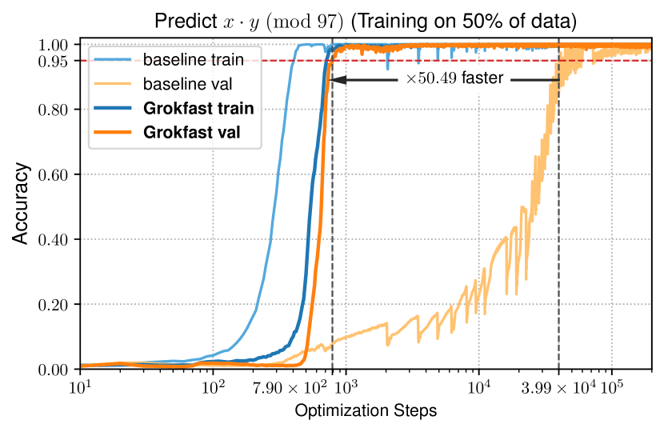

*(a)*

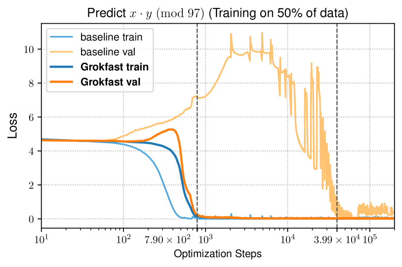

*(b)*

*Figure 2: **Accelerating generalization of a model under grokking phenomenon. Our Grokfast is a simple algorithmic modification upon existing optimizers to pull forward the time of event of sudden generalization after overfitting, also known as the *grokking* phenomenon.*** **[p. 2]**

Apart from theoretical studies, this work takes a practitioner’s standpoint to take advantage of the grokking phenomenon. **[p. 2]** In previous reports on grokking [Power et al., 2022, Liu et al., 2022b], generalization happens only after more than a tenfold of training iterations after overfitting. This high demand of computational resources means less practical appeal to general machine learning practitioners who are often under dire resource constraints. Achieving faster generalization in those overfitting systems is, therefore, a necessary step to fully explore the potential of this unusual behavior. Our goal is, to this end, to accelerate the grokking phenomenon.

In the example training curve of a model under grokking in Figure 2, the dynamics of the validation loss is few orders of magnitude slower than the dynamics of the training loss. The change in the losses is a direct consequence of the change in the parameter values throughout the training session. Hence, Figure 2 suggests that the parameter updates under grokking takes effect in two different timescales: the fast-varying component of the parameter updates contributes to the rapid overfitting, and the slow-varying component contributes to the slow generalization.

We begin by treating the change of value $u(t)$ of each model parameter $\theta$ over training iteration $t$ from an optimizer as a discrete (random) signal over time. As the optimizer iterates the training data, the value of each parameter $\theta(t)\,$, the loss $l(t)\,$, and its gradient $g(t)\coloneqq\partial l(t)/\partial\theta(t)$ drift with respect to the guidance from a sequence of randomly selected mini-batches sampled at each iteration $t\,$:

$$
\theta(t+1)=\theta(t)+u(g(t),t)=\theta({0})+\sum_{\tau=0}^{t}u(g(\tau),\tau)\,. \tag{1}
$$

###### p2-3

The parameter update function $u(t)=u(g(t),t)=\theta(t+1)-\theta(t)$ provides a simple abstraction of the underlying optimizer. Different instances of iterative optimizers including SGD with various hyperparameters, e.g., learning rate and momentum, can be dealt with this notation.

Treating the optimization process as a collection of discrete random signals $u(t)$ allows us to consider its dual representation $U(\omega)$ in the *frequency domain*. Taking the discrete-time Fourier transform $\mathcal{F}$ of $u(t)$ with respect to the training iteration $t\,$, we obtain the spectral representation of the sequence of changes of a specific parameter $\theta\,$:

$$
U(\omega)=\mathcal{F}\{u(t)\}=\sum_{t=0}^{T}u(t)e^{-i\omega t}\,, \tag{2}
$$

###### p2-5

where $T$ is the total number of training iterations in this specific training session. Under our assumption that the delayed generalization of grokking is a consequence of the slow-varying component of the parameter updates $u(t)\,$, the grokking phenomenon is directly related to the low-frequency part of the dual representation $U(\omega)\,$. Further, for a first-order optimizer $u(g(t),t)\,$, an almost unanimous choice in deep learning applications, the gradients $g(t)$ are linearly correlated with the parameter updates $u(t)\,$. Therefore, we can relate the low-frequency part of the gradient signal $G(\omega)=\sum_{t=0}^{T}g(t)e^{-i\omega t}$ with the slow generalization under grokking. Our hypothesis is that *amplifying this low-frequency component of $G(\omega)$ accelerates the speed of generalization under the grokking phenomenon*.

In the following sections, we empirically demonstrate this hypothesis with a simple low-frequency gradient amplifier in various scenarios. These include tasks involving various network architectures including Transformers [Vaswani et al., 2017], MLPs, RNNs and (Graph-)ConvNets and diverse datasets such as algorithmic data, images, languages, and graphs that are treated to exhibit the grokking phenomenon [Liu et al., 2022b]. Our method is simple, taking only a few lines of additional code and is applicable to most of machine learning frameworks such as PyTorch [Paszke et al., 2019], with $\times 50$ faster exhibition of grokking as shown in Figure 2.

###### p3-1

Amplifying the low-frequencies of the gradients $g(t)$ can be achieved by adding a low-pass filtered signal $g(t)$ to itself. Let $h(t)$ be a discrete-time low-pass filter (LPF) defined over the training iteration $t\,$. For simplicity, we assume a univariate time-invariant low-pass filter $h(t)$ uniformly applied across every model parameter $\theta\,$. Using a convolution operator $*\,$, we denote the modified gradient $\hat{g}(t)$ as:

$$
\hat{g}(t)=g(t)+h(t)*g(t)\,, \tag{3}
$$

which can then be plugged into the parameter update function $u$ of the optimizer:

$$
\hat{u}(t)=u(\hat{g}(t),t)=u(g(t)+h(t)*g(t),t)\,. \tag{4}
$$

In the dual domain, equation (3) is equivalent to:

$$
\hat{G}(\omega)=G(\omega)+H(\omega)G(\omega)=(1+H(\omega))G(\omega)\,, \tag{5}
$$

where $H(\omega)=\sum_{t=0}^{T}h(t)e^{-i\omega t}$ is the transfer function of the filter $h(t)\,$. **[p. 3]** Our goal can therefore be restated as to design a filter $h(t)$ with low-pass characteristics in its transfer function $H(\omega)\,$.

**Algorithm 1** Grokfast-MA

1: **Param:** window size $w\,$, scalar factor $\lambda\,$.
2: **Input:** initial parameters $\theta_{0}\,$, stochastic objective function $f(\theta)\,$, optimizer’s parameter update $u(g,t)$ from gradient $g$ at timestep $t\,$.
3: **begin:** $t\leftarrow 0\,$; $Q\leftarrow\mathrm{Queue}(\mathrm{capacity}=w)$
4: **while** $\theta_{t}$ not converged **do**
5: $t\leftarrow t+1$
6: $g_{t}\leftarrow\nabla_{\theta}f(\theta_{t-1})\,$: Calculate gradients.
7: $\mathrm{Insert}(Q,g_{t})\,$: Insert gradients to $Q\,$.
8: $\hat{g}_{t}\leftarrow g_{t}+\lambda\cdot\mathrm{Avg}(Q)\,$: Filter gradients.
9: ${\color[rgb]{0,0.6,0}\hat{u}_{t}}\leftarrow u({\color[rgb]{0,0.6,0}\hat{g}_{t}},t)\,$: Calculate update.
10: $\theta_{t}\leftarrow\theta_{t-1}+{\color[rgb]{0,0.6,0}\hat{u}_{t}}\,:$ Update parameters.
11: **end** **while**

**Algorithm 2** Grokfast-EMA (Grokfast).

1: **Param:** scalar momentum $\alpha\,$, factor $\lambda\,$.
2: **Input:** initial parameters $\theta_{0}\,$, stochastic objective function $f(\theta)\,$, optimizer’s parameter update $u(g,t)$ from gradient $g$ at timestep $t\,$.
3: **begin:** $t\leftarrow 0\,$; $\mu\leftarrow\theta_{0}$: EMA of gradients.
4: **while** $\theta_{t}$ not converged **do**
5: $t\leftarrow t+1$
6: $g_{t}\leftarrow\nabla_{\theta}f(\theta_{t-1})\,$: Calculate gradients.
7: $\mu\leftarrow\alpha\mu+(1-\alpha)g_{t}\,$: Calculate EMA.
8: $\hat{g}_{t}\leftarrow g_{t}+\lambda\mu\,$: Filter gradients.
9: ${\color[rgb]{0,0.6,0}\hat{u}_{t}}\leftarrow u({\color[rgb]{0,0.6,0}\hat{g}_{t}},t)\,$: Calculate update.
10: $\theta_{t}\leftarrow\theta_{t-1}+{\color[rgb]{0,0.6,0}\hat{u}_{t}}\,:$ Update parameters.
11: **end** **while**

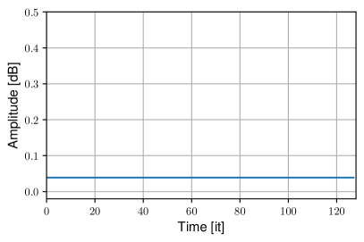

*(a)*

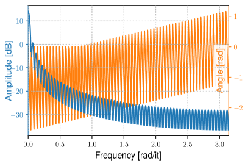

*(b)*

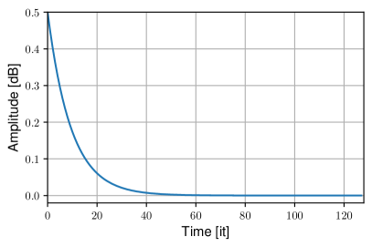

*(c)*

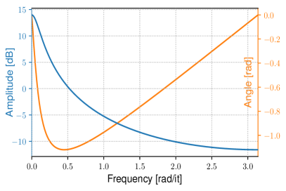

*(d)*

*Figure 3: **Time and frequency domain plots of the gradient filters. Figures (a, b) and (c, d) depict the impulse responses and the transfer functions of the filters of Algorithm 1 and 2, i.e., the MA and the EMA filters $h(t)\,$. We treat training iterations as discrete timesteps.*** **[p. 3]**

###### p3-10

The function $\Pi$ stands for the Heaviside Pi function, which has value of one in the interval $[-0.5,0.5]$ and of zero elsewhere. This filter has only two scalar hyperparameters: the scalar factor $\lambda$ and the window size $w\,$. As shown in Algorithm 1, we implement this filter $h$ with a fixed-capacity queue $Q$ storing the intermediate parameter updates $u(t)$ into the queue $Q\,$. The average of the queue $Q$ is the low-pass filtered gradients which is added to the current parameter update at each optimizer step.

###### p4-3

Our approach is based on our belief that the low-pass filtered gradient updates, or the *slow* gradients, contribute to the generalization. The most obvious question is then: can we *not* use the *fast* gradients and replace the original sequence **[p. 5]** of gradients with the low-pass filtered components? Using only the slow gradients calculated from a moving average filter in Algorithm 1 is equivalent to using larger, overlapping minibatches. We conduct an experiment with a modified algorithm that replaces the line 8 of Algorithm 1 with $\hat{g}_{t}\leftarrow\lambda\cdot\mathrm{Avg}(Q)\,$. Figure 5 shows the result. *1-stage* means that the gradient replacement happens from the beginning of the training, which is set by default, and *2-stage* means that the effect of Grokfast happens after the model overfits to the training data at iteration $500\,$. The results clearly reveal that removing the original gradients leads to much slower and unstable training. In conjunction with the result in Figure 4, we can conclude that both the fast and the slow components of the gradients are necessary for faster grokking.

###### p5-1

We can alternatively interpret the training dynamics of a model under the grokking phenomenon as a *state transition*. In this viewpoint, the model sequentially goes through three distinct stages: ($\mathrm{A}$) *initialized*, where both training and validation losses are not saturated, ($\mathrm{B}$) *overfitted*, where the training loss is fully saturated but the validation loss is not, and ($\mathrm{C}$) *generalized*, where both losses are fully saturated. In the experimental setting of Figure 4, state transition of $\mathrm{A}\rightarrow\mathrm{B}$ happens roughly after iteration $500\,$. This interpretation allows us to try out a staged strategy for optimization, where different algorithms are applied to the model during the two transition phases $\mathrm{A}\rightarrow\mathrm{B}$ (from iteration 0 to 499) and $\mathrm{B}\rightarrow\mathrm{C}$ (after iteration 500) as described in Table 1. Figure 6 and Table 1 summarize the result of the experiment. As the results show, we can accelerate the grokking effect further by $\times 1.53$ by separating the training stage of the model and applying Grokfast-MA only after the model becomes overfitted, suggesting an adaptive optimizer.

###### p5-2

Besides from our gradient filtering approach, the authors of Omnigrok [Liu et al., 2022b] have suggested that the weight decay hyperparameter is a critical determinant of the grokking phenomenon. According to the report, the grokking phenomenon appears and even becomes faster when the weight decay becomes larger. We, therefore, conduct additional experiments to find out how these two approaches affect the model when applied together. The results are summarized in Figure 7. Compared with the result from Grokfast-MA with no weight decay (orange), applying the weight decay (red) generally yields even faster generalization. The maximum acceleration appears at $\mathrm{wd}=0.01$ with $\times 3.72$ faster generalization than Grokfast-MA with no weight decay. We choose this result of $\times 50.49$ faster grokking to be our main demonstration in Figure LABEL:fig:figure_one:result. Interestingly, Figure 7 also reveals that applying the same weight decay with no Grokfast-MA (brown) makes the training unstable. The results demonstrates that applying our gradient filtering and setting up a proper weight decay together gives synergistic benefits.

###### p7-1

We first train the same task with the same model as in Section 2 using our new Algorithm 2. This is the same modular multiplication task devised to report the grokking phenomenon [Power et al., 2022]. Consuming much smaller computational resources ($\times 50$ less) compared to Algorithm 1, exponential moving average effectively captures the slow variation of the gradients necessary for accelerating the delayed generalization. Under the grokking phenomenon, the validation loss of the model first increases before it decreases again later during the late generalization stage as depicted in Figure LABEL:fig:ema:loss (baseline). This is well aligned with our state transition model interpretation in **Q2** of Section 2.3. High difference in the validation loss implies that the *generalization route* $\mathrm{B}\rightarrow\mathrm{C}$ is much longer than the *overfitting route* $\mathrm{A}\rightarrow\mathrm{B}$ in the parameter space. In contrast, models under our Grokfast training algorithms show significantly smaller peak in the validation loss as shown in Figures LABEL:fig:figure_one:result_loss and LABEL:fig:ema:loss. This implies that Grokfast effectively keeps the *generalization route* $\mathrm{B}\rightarrow\mathrm{C}$ close to the global optimum at state $\mathrm{C}\,$. We will revisit these conjectures in Section 5 with more visualization.

We also conduct ablation studies to find out the effect of hyperparameters $\lambda\,$, $\alpha\,$, and weight decay for our Grokfast algorithm with an EMA filter. The optimal hyperparameters are found with grid search as in Section 2. Figures LABEL:fig:ema:acc_gain through LABEL:fig:ema:acc_wd summarizes the results. Recalling that our main idea is at the design of a low-pass filter, the momentum parameter $\alpha$ of Algorithm 2 as well as the window size parameter $w$ of Algorithm 1 are equivalent to the cutoff frequency of the underlying filter. Experiments in Figures LABEL:fig:ema:acc_gain through LABEL:fig:ema:acc_wd as well as those in Figures 4 and 7 show that there exists a sweet spot in cutoff frequency that corresponds to the generalization-inducing gradient signal. From our empirical studies, we recommend $\lambda\in[0.1,5]$ and $\alpha\in[0.8,0.99]\,$. The weight decay is, like in typical optimization problems, dependent on the task of interest.

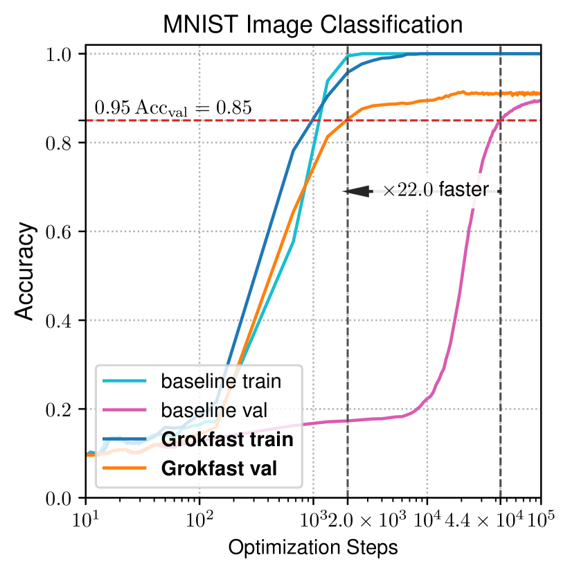

*(a)*

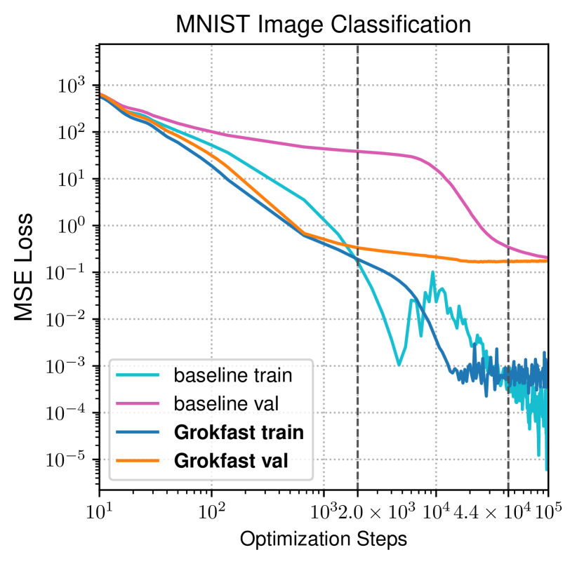

*(b)*

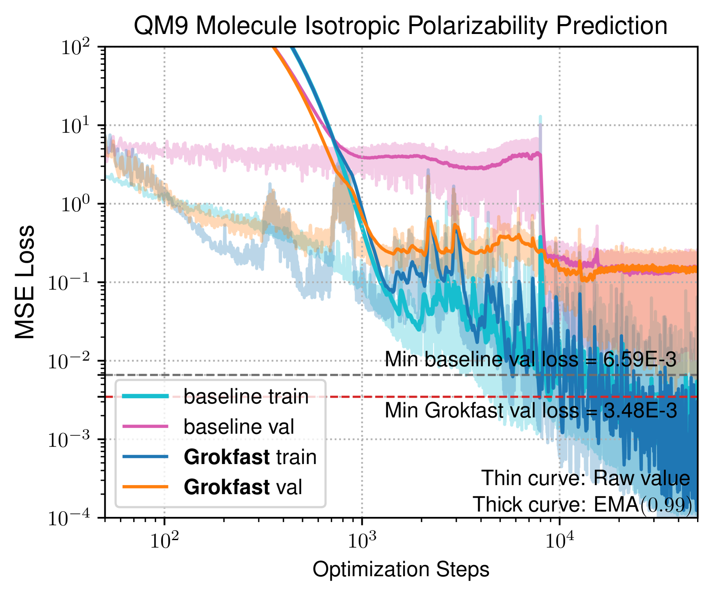

*Figure 9: MNIST results with a three-layer MLP. Grokking phenomenon is almost gone with proper hyperparameters.* **[p. 7]**

###### p7-3

Besides the simple algorithmic reasoning task, where the data is relatively simple, Liu et al. [2022b] report the similar delayed generalization can also be observed in many conventional tasks if the model goes through a special treatment. To demonstrate the generalizability of our Grokfast modification of the optimization process, we try to accelerate the speed of generalization under those reported models and tasks. The first is a three-layer ReLU-MLP trained for MNIST classification task [Deng, 2012] which exhibits the grokking phenomenon. Figure 10 summarizes the results, showing that our Algorithm 2 successfully accelerate the delayed generalization. With $\alpha=0.8\,$, $\lambda=0.1\,$, and $\mathrm{wd}=2.0\,$, the delay until grokking is reduced by $\times 22.0\,$. Moreover, the final evaluation accuracy becomes higher from 89.8% to 91.2%.

###### fig-11

*Figure 11: IMDb results with a two-layer LSTM. LSTM exhibits grokking phenomenon if the training begins with larger weight values at initialization. Grokfast algorithm produces faster generalization with higher validation error and lower validation loss. We show the exponential moving average (momentum 0.95) of the curves as thick lines for clearer visualization of the trend.* **[p. 8]**

###### p8-2

The lines 7-8 of Algorithm 2 take a similar form to the momentum variable, which is frequently used in optimizers in deep learning frameworks. However, notable differences exist: (1) Instead of using the scaled momentum as a parameter update, we use the smoothened gradient as a *residual*, which is added to the gradient before it is fed into the optimizer. Rather, the formula is more similar to Nesterov’s momentum; however, the filtering is applied *before* the optimizer, which is different from typical applications of Nesterov’s momentum such as NAdam [Dozat, 2016]. (2) The line 7-8 is applied to the gradients independently to the underlying optimizer. The optimizer can be of any type unless it is of the first-order gradient descent-based. Low-pass filtering the gradients $g(t)$ has the same effect as filtering the post-optimizer parameter updates $u(t)$ as mathematically explained in Appendix A with SGD and variants, and empirically proved in the previous sections with Adam [Kingma and Ba, 2014] and AdamW [Loshchilov and Hutter, 2018] optimizers.

###### p9-1

Lastly, the model trained with our Grokfast algorithm shows hundredfold smaller variances of the distances than the baseline as claimed in Table 2. This implies that training under Grokfast algorithm is much more deterministic than under typical first-order optimizers. This is possibly related to the similarity between the low-pass filtered gradients from small minibatches with normal gradients from larger minibatches. However, we have also demonstrated in Section 2.3 that using only the slow, more deterministic component of gradients and completely neglecting the original gradients lead to instability. Therefore, further investigation is needed to find out the source and the role of this determinism from our Grokfast algorithm, and the reason of its benefits when jointly applied with the faster, more stochastic gradients from baseline optimizers.

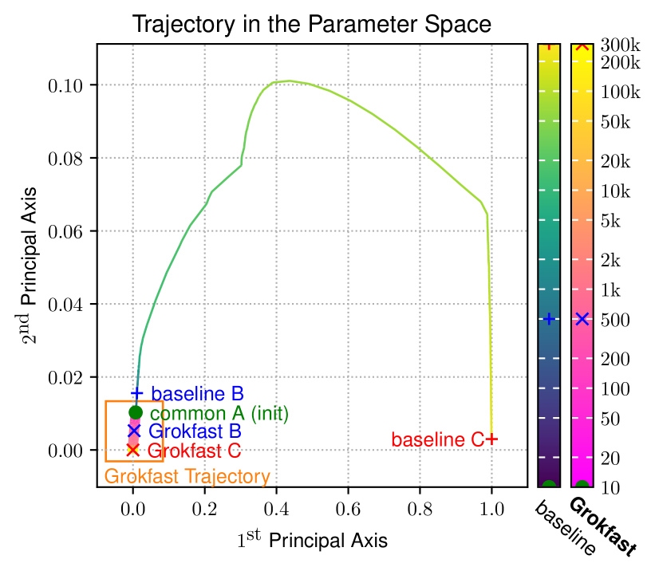

*(a)*

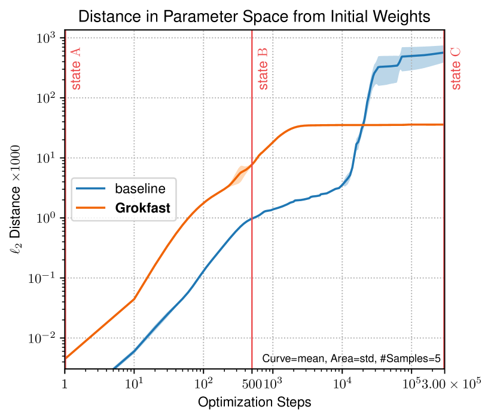

*(b)*

*Figure 12: Trajectories of model parameters from experiments of Figure 2 projected onto two principal axes of the PCA of the intermediate model parameters of the baseline. The two models travel along distinct pathways in the parameter space with different pace.* **[p. 9]**

###### p9-2

The recently discovered grokking phenomenon [Power et al., 2022] signifies one possibility of overparameterized neural networks generalizing (and reasoning) beyond memorization of the given dataset. Most of the works, thereafter, focus on identifying its mechanism. Recent studies associated grokking with a double descent phenomenon in the DNN mapping geometry training dynamics [Humayun et al., 2023], the speed of pattern learning [Davies et al., 2023], and the sizes of models and datasets [Huang et al., 2024], wherein the validation error initially increases and then decreases with the expansion of model parameters [Nakkiran et al., 2021, Belkin et al., 2019]. To investigate the internal roles of each model component during grokking, Nanda et al. [2023] employed mechanistic interpretability, a technique from the XAI domain, and revealed that grokking may not occur abruptly but rather exhibits an internal progress measure. **[p. 10]** Their assertion posits that the model captures slow, generalizing patterns, underscoring the critical role of proper optimization. Interestingly, while weight decay amplifies the double descent effect [Pezeshki et al., 2022], it contributes to enhanced generalization in grokking scenarios [Power et al., 2022]. Liu et al. [2022b] found more examples of grokking in various tasks and analyzed their training mechanism through loss landscape analysis. Thilak et al. [2022] found a similarity between grokking and the slingshot mechanism in adaptive optimizers. Barak et al. [2022] argued that optimizers reach delayed generalization by amplifying sparse solutions through hidden progress. Regularizers such as weight decay [Nanda et al., 2023] and the choice of the optimizer [Liu et al., 2022a] are highlighted as important factors in training a model that groks. Our work is a continuation of this discussion by providing a generalizable tool for the practical study of the grokking phenomenon. Through our discussion, we suggest a state transition model of the grokking and visualize the trajectory of the model weights in the parameter space during training.
