# Kunin et al. 2024 — Get rich quick: exact solutions reveal how unbalanced initializations promote rapid feature learning

See also: [the global concept index](../../concepts/index.md). arXiv [2406.06158v2](https://arxiv.org/abs/2406.06158), 10 June 2024 (v2 — 12 October 2024). PDF running head: "38th Conference on Neural Information Processing Systems (NeurIPS 2024)".

**Daniel Kunin\*, Allan Raventós\*, Feng Chen, Surya Ganguli** — Stanford University. **Clémentine Dominé, Andrew Saxe** — University College London. **David Klindt** — Cold Spring Harbor Laboratory. \* — equal contribution; correspondence: kunin@stanford.edu, aravento@stanford.edu.

The files of this paper's analysis:

- [`2406.06158.get-rich-quick-exact-solutions-reveal-how-unbalanced-initializations-promote-rapid-feature-learning.license.txt`](2406.06158.get-rich-quick-exact-solutions-reveal-how-unbalanced-initializations-promote-rapid-feature-learning.license.txt) — the arXiv licence record for this paper.

The anchor scheme and the rules for linking into a card are in the [README of the papers folder](../README.md).

**Excerpt card.** The paper's licence (`arxiv-nonexclusive`) does not permit republishing the paper itself; what stands here are the editorial sections and the fragments the corpus quotes (right of quotation). The paper: <https://arxiv.org/abs/2406.06158>.

## Concepts covered

**[The lazy→rich transition](../../concepts/lazy-to-rich-kernel-to-feature-learning.md)** — the work's chief contribution to this notion: it gives an exactly solvable model in which the position on the "lazy — rich" axis is set by **a single conserved quantity** rather than by the overall scale alone. For a two-layer linear network with one hidden neuron the difference $\delta=\eta_{w}a^{2}-\eta_{a}\|w\|^{2}$ does not change under the gradient flow and confines the trajectory to the surface of a hyperboloid ([p. 4, para. 4](#p4-4), [fig. 2](#fig-2)); its sign separates three cases, for which exact solutions are written out: at $\delta\gg 0$ (upstream) the kernel barely moves — the lazy regime ([p. 5, para. 3](#p5-3)); at $\delta=0$ (balanced) both the norm and the direction move — the rich one ([p. 5, para. 4](#p5-4)); and at $\delta\ll 0$ (downstream) a fast lazy fit comes first and then a slow alignment phase with a factor of $|\delta|^{-1}$ — a **delayed rich regime**, with the size of the delay set by the modulus of $\delta$ ([p. 5, para. 5](#p5-5), [fig. 3](#fig-3)). A second, independent source of delay is the different signs of $\delta_{k}$ across neurons in a wide network ([p. 7, para. 6](#p7-6)). The work stipulates its priority itself: the concurrent work of Tu et al. 2024 obtains the same equations **approximately** — in the regime $h\gg\max(d,c)$ at a Gaussian initialisation — whereas here, under the isotropy assumption, they are exact ([p. 7, para. 9](#p7-9)). The novelty against Azulay et al. 2021 is formulated by the authors as the **directionality** of the relative scale: the earlier analysis distinguished "balanced / unbalanced", whereas here the imbalance acquires a sign ([p. 2, para. 2](#p2-2)). The pivotal turn is in the nonlinear network ([§5](#sec-5)): upstream there turns out to be rich, because at a constant $M_{k}\approx\delta_{k}\mathbf{I}_{d}$ the directions $\hat{\beta}_{k}$ change, and with them the activation patterns and the kernel — "a rich regime at a small displacement in parameter space", the "get rich quick" of the title ([p. 9, para. 1](#p9-1)). What the work does not contain: grokking is not explained here by the lazy→rich transition, and the explanation is accepted by reference to Kumar et al., Lyu et al. and Rubin et al. ([p. 10, para. 2](#p10-2)); the whole theory is a gradient flow on MSE with no stochasticity and no discretisation, and the authors admit outright that SGD violates the conservation laws on which it rests ([p. 10, para. 3](#p10-3)).

**[The initialisation scale](../../concepts/initialization-scale.md)** — the work splits this notion in two and makes the split operational. The overall scale $\tau$ (the lever of Chizat et al. 2019) and the relative scale — the difference in magnitude between the weights of the first and second layers, so named in this work — are set independently, and a map of regimes is built along both axes at once ([fig. 1](#fig-1)): lazy learning at large $\tau$, rich at small $\tau$, and **fast** rich when $\tau$ is small and $\delta$ large simultaneously. A refinement of substance for the corpus: at one and the same small overall scale the relative scale still moves the network between lazy and rich, and downstream at a small scale turns out to be lazy ([fig. 1](#fig-1)). The setting is inherited from Azulay et al. 2021, in whom a balanced initialisation gave rich dynamics and an unbalanced one lazy ([p. 2, para. 1](#p2-1)). The practical lever in every experiment is one and the same: the initialisation of the first layer is divided by $\alpha$ and that of the last multiplied by $\alpha$, so that the input–output map is unchanged; $\alpha\gg 1$ is upstream, $\alpha\ll 1$ downstream ([fig. 6](#fig-6)). What the work does not contain: the distribution of the per-neuron conserved quantities at finite width is not studied and is expressly left for the future, even though the NTK and mean-field parameterisations give one and the same zero-mean distribution ([p. 10, para. 1](#p10-1)).

**[The neural tangent kernel](../../concepts/neural-tangent-kernel-ntk.md)** — the work takes the NTK not as an infinite-width limit but as an observable of a finite network, and gives a closed-form expression for it. The measure is the *kernel distance* $S(t_{1},t_{2})=1-\langle K_{t_{1}},K_{t_{2}}\rangle/\left(\|K_{t_{1}}\|_{F}\|K_{t_{2}}\|_{F}\right)$ from Fort et al. 2020, and the regime is determined by how far $S(0,t)$ departs from zero ([p. 3, para. 1](#p3-1)). The dynamics in function space is written as a preconditioned gradient flow $\dot{\beta}=-MX^{\intercal}\rho$, in which the preconditioner $M$ is expressed through $\beta$ and $\delta$ in closed form and also characterises the NTK matrix; three limits of $M$ give the three regimes directly ([p. 6, para. 3](#p6-3)). For a wide network $M$ decomposes into a sum over neurons, each term depending only on its own $\beta_{k}$ and its own $\delta_{k}$ ([p. 7, para. 6](#p7-6)). In a piecewise-linear network the NTK depends on two things — on $M_{k}$ and on the activation matrix $C$ — and this separation allows the authors to show that the early motion of the NTK in standard networks is related to a change of the activation patterns rather than to a large displacement of the parameters ([p. 9, para. 1](#p9-1), [fig. 6](#fig-6)). What the work does not contain: the NTK is never related to generalisation directly — it serves as an indicator of the regime rather than as a measure of quality.

**[The emergence of features](../../concepts/feature-emergence-feature-learning.md)** — the work proposes an operational signature of *fast* feature learning that separates two senses of the word "rich": a large change of the Hamming distance between activation patterns at a small change in parameter space ([fig. 5](#fig-5)). Such a combination is given precisely by an upstream initialisation at small $\tau$; downstream at small $\tau$, on the contrary, requires a large motion of the parameters to fit the data in the delayed rich regime. The mechanism is analysed on the surface of a two-layer ReLU network: the partition of the input space into convex activation regions rearranges during the alignment phase while the input–output map stays close to zero, and only then comes the fitting phase ([§5](#sec-5), [p. 8, para. 3](#p8-3)). An incidental result that the authors note as not previously observed: the input-space partition of a network with no redundant neurons is 2-colourable by the parity of the number of active neurons — and they stipulate that they use this property only for drawing ([p. 35, para. 5](#p35-5), [p. 35, para. 6](#p35-6)). What the work does not contain: which features exactly are learnt is nowhere analysed except for the Gabor filters of a CNN; "feature learning" here is measured by the motion of the kernel and the activations rather than by the content of a representation.

**[Margin maximisation](../../concepts/margin-maximization-implicit-bias.md)** — the work's contribution to implicit bias consists in writing it out as a function of $\delta$ and extending it into the region $\delta<0$. Theorem 3.1 extends theorem 2 of Azulay et al. 2021: the interpolating solution minimises $\Psi_{\delta}(\beta)-\psi_{\delta}\tfrac{\beta_{0}}{\|\beta_{0}\|}^{\intercal}\beta$ — a trade-off between the minimum-norm solution and the preservation of the initial direction ([p. 6, para. 5](#p6-5)). At a vanishing initialisation upstream and balanced are functionally indistinguishable in inductive bias; the difference is given only by downstream, in which the term preserving $\beta_{0}$ dominates ([p. 7, para. 1](#p7-1)), and this trade-off is shown in [fig. 4](#fig-4). For the singular values of $\beta$ the dynamics is written as a mirror flow with a *hyperbolic entropy* potential smoothly interpolating between the $\ell^{1}$ and $\ell^{2}$ penalties for the rich ($\delta\to 0$) and lazy ($\delta\to\pm\infty$) limits ([p. 8, para. 1](#p8-1), [p. 32, para. 8](#p32-8)). For depth $L+1$ the inductive bias of the rich limit is $Q(\beta)=(\tfrac{L+1}{L+2})\|\beta\|^{\frac{L+2}{L+1}}-\|\beta_{0}\|^{-\frac{L}{L+1}}\beta_{0}^{\intercal}\beta$ — a depth-dependent balance between the minimum norm and the initial direction ([p. 8, para. 2](#p8-2), [p. 34, para. 2](#p34-2)). What the work does not contain: all of this is derived for MSE and linear networks; for piecewise-linear networks the authors say outright that carrying over a mirror-flow-style analysis is "very difficult or provably impossible", and they stipulate themselves that from their mirror flow a claim about the inductive bias at interpolation does not follow, since the singular vectors change over the course of the training ([p. 32, para. 11](#p32-11)).

**[Grokking](../../concepts/grokking.md)** — the work does not explain grokking but uses it as a check of a consequence of its own theory: if grokking is a lazy-to-rich transition, then the lever governing that transition ought to govern the time to grokking too. The explanation itself is accepted by reference ([p. 10, para. 2](#p10-2)) to [Kumar et al. 2023](../2310.06110.grokking-as-the-transition-from-lazy-to-rich-training-dynamics/2310.06110.grokking-as-the-transition-from-lazy-to-rich-training-dynamics.card.md), [Lyu et al. 2024](../2311.18817.dichotomy-of-early-and-late-phase-implicit-biases-can-provably-induce-grokking/2311.18817.dichotomy-of-early-and-late-phase-implicit-biases-can-provably-induce-grokking.card.md) and [Rubin et al. 2024](../2310.03789.grokking-as-a-first-order-phase-transition-in-two-layer-networks/2310.03789.grokking-as-a-first-order-phase-transition-in-two-layer-networks.card.md); none of the three is analysed substantively. What is shown: dividing the weights of the positional and token embeddings of a single-layer transformer by $\alpha$ — an intervention touching under 6 % of all the parameters — "substantially shortens the time to grokking" ([p. 10, para. 2](#p10-2), [fig. 6](#fig-6), [p. 40, para. 6](#p40-6)); on a grid sweep over $\tau$ and $\alpha$ the conclusion is formulated as "the fastest grokking in the unbalanced rich setting" ([fig. 12](#fig-12)). It is separately valuable for the corpus that in the theoretical part the delayed generalisation arises **without regularisation, without weight decay and without stochasticity** — as a pure consequence of the imbalance of the layers in an exactly solvable model ([p. 5, para. 5](#p5-5), [p. 8, para. 6](#p8-6)); though there it is a delay in MSE regression rather than a train/test gap on an algorithmic task. What the work does not contain: nobody measured any dependence on the modulus $p$, on the fraction of training data or on weight decay; the order-of-magnitude acceleration rests on $\alpha=100$ ([fig. 6](#fig-6)), which does not appear at all in the grid experiment of [fig. 12](#fig-12), and the size of the effect is given by no number either in the caption or in the text.

**[Modular arithmetic](../../concepts/modular-arithmetic.md)** — the work merely uses this task as one of four applications and adds nothing of its own to it: the modular arithmetic task of Power et al. 2022 is taken on a ready-made third-party PyTorch implementation, the only difference being one transformer layer instead of the default two ([p. 40, para. 5](#p40-5)). Neither the operation, nor the modulus $p$, nor the fraction of training data is named in the text; the sweep runs only over $\tau$ and $\alpha$ ([fig. 12](#fig-12)). What the work does not contain: no analysis whatever of *what* the network learns on modular arithmetic — the choice of a single-layer model is justified by a single reference to [Nanda et al. 2023](../2301.05217.progress-measures-for-grokking-via-mechanistic-interpretability/2301.05217.progress-measures-for-grokking-via-mechanistic-interpretability.card.md), in which such a model is shown to learn the minimal circuit solving the task.

**[The canonical grokking proving ground](../../concepts/canonical-grokking-testbed.md)** — the work accepts the proving ground of [Power et al. 2022](../2201.02177.grokking-generalization-beyond-overfitting-on-small-algorithmic-datasets/2201.02177.grokking-generalization-beyond-overfitting-on-small-algorithmic-datasets.card.md) as given and introduces two departures into it, both borrowed: a single-layer transformer instead of a two-layer one ([p. 40, para. 5](#p40-5)) and the device of Kumar et al. 2023 — multiplying the logits by $\tau$ and dividing the learning rate by $\tau^{2}$ ([p. 40, para. 6](#p40-6)). The grokking threshold is defined as $\geq 0.99$ accuracy on the validation data, the budget is 30 000 steps, with 5 random initialisations per grid point ([fig. 12](#fig-12)). What the work does not contain: neither the weight decay, nor the training fraction, nor the optimiser for this experiment is stated in the text; a budget of 30 000 steps truncates from above the runs that did not reach the threshold, and how such runs are counted in the averaging is not said.

**[The learning rate](../../concepts/learning-rate.md)** — the work makes the learning rate a full axis of the theory rather than a hyperparameter: the layerwise rates $\eta_{a},\eta_{w}$ enter the conserved quantity $\delta=\eta_{w}a^{2}-\eta_{a}\|w\|^{2}$ on a par with the initialisation variances, so that "a slow first layer" and "a small first layer" are one and the same from the point of view of the regime ([p. 4, para. 4](#p4-4), [p. 3, para. 1](#p3-1)). Whence the formulation of future work in terms of a *learning-rate profile* across layers ([p. 10, para. 3](#p10-3)). In the experiments the learning rate also appears as a scale-linked factor: 5e-3$/\tau^{2}$ in the teacher–student experiment ([p. 37, para. 7](#p37-7)) and a division by $\tau^{2}$ in the grokking experiment ([p. 40, para. 6](#p40-6)). What the work does not contain: a sweep of the learning rate as such; in no experiment is it varied independently of the scale.

**[Real data and vision](../../concepts/vision-real-world-data-mnist-cifar.md)** — the work carries the relative-scale lever over to vision in two experiments. LeNet-5 on MNIST: the early motion of the NTK is related to a change of the activation patterns rather than to a large displacement of the parameters, with the curves averaged over 8 runs ([section D.3](#sec-d3), [fig. 6](#fig-6)). A small ResNet on CIFAR-10 with the convolutional kernel enlarged from $3\times 3$ to $15\times 15$ and the weight decay zeroed: at $\alpha=10$ the first layer's filters come out smooth and Gabor-like, at $\alpha=0.1$ they come out as noise, while the training and test accuracies are comparable across all $\alpha$ ([p. 39, para. 2](#p39-2), [fig. 11](#fig-11)). What the work does not contain: nobody looked for grokking on vision; the interpretability is measured by a single quantity — the normalised Laplacian of the filter — and the work establishes no relation between the smoothness of the filters and the performance but shows outright that there is none ([fig. 11](#fig-11)).

**[Weight decay / L2 regularisation](../../concepts/weight-decay.md)** — the work only mentions weight decay, and every time in order to switch it off. In the Gabor experiment the weight-decay parameter is set to $0$, "to avoid confounding factors" ([p. 39, para. 2](#p39-2)); in the random-hierarchy-model experiment biases and weight decay are likewise not used ([p. 40, para. 3](#p40-3)); and for the grokking experiment weight decay is not mentioned in the text at all. The work thereby gives the corpus one more case of delayed generalisation obtained **without** explicit regularisation: in the theoretical part the delay is derived from a single conserved quantity under a pure gradient flow ([p. 5, para. 5](#p5-5)). What the work does not contain: an interaction of the relative scale with weight decay — it is neither measured nor discussed, and because of that one cannot say whether the effect of $\alpha$ adds to the effect of the regularisation or substitutes for it.

**[Phase transition](../../concepts/phase-transition.md)** — the work speaks of a *phase portrait* and a *phase boundary* but not of a phase transition: the map on the $(\tau,\delta)$ plane ([fig. 1](#fig-1)) marks out the regions of lazy, rich and fast-rich learning, and a comparison with the infinite-width case of Luo et al. 2021 shows that the phase boundary "exists only at infinite width" and contains a whole set of parameterisations, mean-field included ([p. 10, para. 1](#p10-1)). There is no order parameter, no critical exponents and no language of first- or second-order transitions in the work; nobody measures the sharpness of the transition itself. The authors cannot be credited with a claim about a phase transition at grokking — that language belongs to Rubin et al. 2024, whom they merely cite ([p. 10, para. 2](#p10-2)).

**[Emergence / emergent abilities](../../concepts/emergence.md)** — a mention in a single subordinate clause: grokking is held to be "important for understanding emergent phenomena", with a reference to Nanda et al. 2023 ([p. 10, para. 2](#p10-2)). There is no work with emergence in the paper — no definition, no measurement and no scaling.

**[The role of gradient noise](../../concepts/gradient-noise.md)** — the notion enters the work only as an acknowledged limitation: "omitting the effects of discretisation and of the stochasticity of SGD, which violate the conservation laws central to our study and introduce additional biases towards simplicity" ([p. 10, para. 3](#p10-3)). This is a first-order caveat: the conservation of $\delta$ is the foundation of the whole theory, and under SGD it ceases to be exact. Meanwhile the experimental part — the Gabors, the random hierarchy model and the grokking — is trained stochastically, so the gap between theory and experiment runs exactly here.

---

## Points we could not reconcile

**The caption of fig. 11 contradicts fig. 6(b) and the paper's own convention for $\alpha$.** The [caption of fig. 11](#fig-11) states that "networks with a small initialisation ($\alpha<1$) learn far smoother filters". By the convention declared in the [caption of fig. 6](#fig-6), the initialisation of the first layer is **divided** by $\alpha$, and in the Gabor experiment the weights of the convolutional filters are divided by $\alpha$ too ([p. 39, para. 2](#p39-2)); hence $\alpha<1$ is an increased, not a small, first-layer initialisation, and that is downstream. Panel 6(b) itself shows the opposite of the caption: smooth Gabor-like filters at $\alpha=10$ and coloured noise at $\alpha=0.1$. The direction of the effect on which conclusion (b) in the [caption of fig. 6](#fig-6) rests — "upstream promotes the interpretability of the early layers" — is set by panel 6(b); the parenthetical "($\alpha<1$)" in the caption of fig. 11 contradicts it.

**Section D.3 is titled "Figure 5" but describes figure 6.** [Section D.3](#sec-d3) consists of four subsections — "Kernel distance", "Gabor filters", "Random hierarchy model", "Grokking" — that is, of exactly the panels (a)–(d) of [figure 6](#fig-6), whose caption itself refers to "Details in section D.3". The same shift infects the paragraph on computational cost: it gives the running time "for figure 5(a) … 5(b) … 5(c) … 5(d)" ([p. 37, para. 1](#p37-1)), whereas [figure 5](#fig-5) has only two panels. The experiment of figure 5 itself — the surface of a two-layer ReLU network on an XOR-like task — is not described in the appendix at all.

**$\delta$ or $\delta^{2}$ in the setting of fig. 1.** The [caption of fig. 1](#fig-1) sets the conserved quantity as $\delta=\tau^{2}(\alpha^{2}-\alpha^{-2})$, while section D.1 says that $\alpha$ is found from the equation $\delta^{2}=\tau^{2}(\alpha^{2}-\alpha^{-2})$ ([p. 37, para. 3](#p37-3)). The two cannot be reconciled: the sweep runs over $\delta$ in the range $[-1,1]$ ([p. 37, para. 7](#p37-7)), the right-hand side changes sign together with $\alpha-1$, and a square does not. One of the two writings is a typo; the setting of fig. 1 should be reproduced from the caption rather than from D.1.

**The isotropy assumption and the width condition in theorem B.6.** Assumption B.2 requires $\Delta=\delta\mathbf{I}_{h}$ ([p. 30, para. 6](#p30-6)), and it is stipulated in the same place that "for a general $\delta$ it requires $h\leq\min(d,c)$" ([p. 30, para. 7](#p30-7)). Theorem B.6, meanwhile, assumes simultaneously $\Delta=\delta\mathbf{I}_{h}$ and $h\geq\min(d,c)$ ([p. 32, para. 8](#p32-8)) — together these leave exactly $h=\min(d,c)$, that is, they take the theorem out of the overparameterised-width regime. Separately: the general requirement $h\leq\min(d,c)$ declared does not follow from the two cases given in the same place, each of which bounds $h$ by only one of the two dimensions ($\delta>0\Rightarrow h\leq c$, $\delta<0\Rightarrow h\leq d$).

**Minor discrepancies of notation and indices.** In the proof of lemma B.8 the exponent of the telescoping product is written as $d$ — $\|\beta\|^{2}=a^{\intercal}\left(W_{L}W_{L}^{\intercal}\right)^{d}a$ and $\|\beta\|^{2}=a^{\intercal}\left(aa^{\intercal}-\delta\mathbf{I}_{h}\right)^{d}a$ ([p. 33, para. 5](#p33-5)) — whereas the lemma's statement has $L$, the depth; the coincidence is possible only because $d=h$ is assumed in the same place. In section D.1 the letter $m$ denotes now the teacher's width ("the teacher model has $m=k$ hidden neurons") and now the student's (the setting of fig. 1 (b): $d=100$, $m=50$, [p. 37, para. 7](#p37-7)), while the setting of fig. 1 (a) uses $h$ for the same quantity ([p. 37, para. 5](#p37-5)).

## What is proved, what is shown and what is conjectured

**Proved** — for linear networks under a gradient flow on the mean-squared error: the conservation of $\delta$ and the geometry of the trajectory ([p. 4, para. 4](#p4-4)), exact solutions for $\mu,\phi$ in the single-neuron model ([§3](#sec-3)), the decomposition of the preconditioner over neurons (theorem 4.1) and a closed-form $M$ at an isotropic $\Delta$ (theorem 4.2, [§4](#sec-4)), the implicit bias at interpolation (theorem 3.1, [p. 6, para. 5](#p6-5)) and its generalisation to depth (theorem B.10, [p. 34, para. 2](#p34-2)), and the mirror flow on the singular values (theorem B.6, [p. 32, para. 8](#p32-8)). To the same heading belongs proposition C.2 on 2-colourability, which the authors themselves assign to visualisation ([p. 35, para. 6](#p35-6)).

**Shown numerically** — for two-layer piecewise-linear networks and for four applied settings: an agreement of the exact solutions with the numerical gradient flow across three measures ([fig. 3](#fig-3)); a map of regimes on the $(\tau,\delta)$ plane in a student–teacher ReLU task averaged over 16 seeds ([fig. 1](#fig-1), [p. 37, para. 7](#p37-7)); a relation of the early NTK motion to a change of activations on LeNet-5 and MNIST, 8 runs ([fig. 6](#fig-6)); Gabor-like filters at $\alpha=10$ on a ResNet and CIFAR-10 ([fig. 11](#fig-11)); a shift of the sample complexity on the random hierarchy model at 6 seeds ([p. 40, para. 2](#p40-2)); and a shortening of the time to the 99 % threshold on modular arithmetic ([fig. 6](#fig-6), [fig. 12](#fig-12)). Worth noting separately is the conscientious check of fig. 10: the training is extended tenfold, and although the training loss goes on falling between $10^{5}$ and $10^{6}$ steps, the test loss and all the distances considered remain practically unchanged ([fig. 10](#fig-10)).

**Accepted by reference rather than shown** — the thesis "grokking is a lazy-to-rich transition" itself: it is introduced in a single sentence with references to three works and is not checked in the paper ([p. 10, para. 2](#p10-2)). What is checked is a consequence: that the relative-scale lever governs that transition.

**Acknowledged as limitations by the authors themselves** — the carry-over of the theory to deep nonlinear networks is not made; the discretisation and stochasticity of SGD, which violate the conservation laws, are excluded from the analysis ([p. 10, para. 3](#p10-3)); the role of the *distribution* of the per-neuron conserved quantities at finite width is left for the future ([p. 10, para. 1](#p10-1)); a claim about the inductive bias at interpolation does not follow from the mirror flow on the singular values, since the singular vectors change over the course of the training ([p. 32, para. 11](#p32-11)); and a mirror-flow-style analysis for non-trivial piecewise-linear networks is "very difficult or provably impossible".

**The gap between the claim and what is shown.** The abstract says that the unbalanced rich regime "shortens the time to grokking in modular arithmetic" ([p. 1, para. 2](#p1-2)). What is shown is narrower: an upstream shift of **the embeddings only** of a single-layer transformer on **one** task shortens the number of steps to a 99 % accuracy threshold on the validation data. An acceleration of about an order of magnitude is read off [fig. 6](#fig-6) at $\alpha=100$; in the grid experiment of [fig. 12](#fig-12) the set of $\alpha$ is different ($\{0.1,0.3,1,3,10\}$), $\alpha=100$ is not there, and the size of the effect is given by no number. The theoretical part about grokking proves nothing: it concerns linear and two-layer piecewise-linear networks on MSE.

## Common misreadings and overstatements of this paper

Below are the patterns observed in the citing works of the corpus. Each entry says what exactly is distorted and gives references to the authors' paragraphs where the lost caveat stands.

**"Kunin et al. showed that grokking is a transition from the lazy regime to the rich one" (widening).** Citing works place the paper in a row with those that established this thesis. The position paper of Nam et al. (`2502.21009`, no card in the corpus as yet) writes: `"recent studies (Kumar et al. 2024; Lyu et al. 2024; Kunin et al. 2024) showed that grokking is a transition from a lazy overfitting regime to a rich generalizing regime"` — and its introduction lists "grokking (Kunin et al. 2024)" among the phenomena explained by layerwise-linear models. In the authors themselves this thesis stands in the passive voice and with others' references: [this behaviour, named grokking, is held to arise from a transition from lazy to rich learning](#p10-2) — with footnotes to Kumar et al. 2023, Lyu et al. 2024 and Rubin et al. 2024. The work's own contribution to grokking is not a mechanism but a lever: it shows that the relative scale governs that transition. In the same appendix Nam et al. cite it accurately — about lowering the variance of the embeddings and under 6 % of the parameters — so the warning concerns the formulation rather than the work as a whole; and there is a second, smaller narrowing there too: in Kunin et al. what is divided is [the embedding weights, positional and token alike](#p40-6), not the token ones only.

**"Kunin et al. changed the architecture" (erroneous).** [Gu et al. (`2504.03162`)](../2504.03162.beyond-progress-measures-theoretical-insights-into-the-mechanism-of-grokking/2504.03162.beyond-progress-measures-theoretical-insights-into-the-mechanism-of-grokking.card.md) assign the work to those that study the phenomenon by changing the architecture: `"Some studies also focus on changing the architecture to investigate variations in the phenomenon (Park et al., 2024; Kunin et al.,; Lee et al., 2024)"`. The intervention of Kunin et al. does not touch the architecture: the **weights** of the embeddings are divided by $\alpha$, and the network stays as it was ([p. 40, para. 6](#p40-6)). The only architectural departure — one transformer layer instead of two — is the baseline setting of the experiment rather than a lever, and it is justified by a reference to Nanda et al. 2023 ([p. 40, para. 5](#p40-5)); not one result of the work is obtained by comparing architectures. The same entry has a malformed citation besides — "Kunin et al.,;" with no year, and the bibliography carries the workshop version (HiLD 2024) rather than the NeurIPS one.

**"Kunin et al. is one of the explanations of grokking through the quality of representations" (widening, a mild echo).** [Zhang et al. (`2505.11411`)](../2505.11411.is-grokking-a-computational-glass-relaxation/2505.11411.is-grokking-a-computational-glass-relaxation.card.md) twice list the work among mechanisms: `"shifts from poor to good representation learning kumar2023grokking; varma2023explaining; kunin2024get; liu2022towards"`. The formulation does not contradict the paper but credits it with an explanatory position it does not occupy: the mechanism there is accepted by reference ([p. 10, para. 2](#p10-2)), and its own result is the controllability of the time to grokking by a layerwise imbalance, shown on one task at 5 seeds and a budget of 30 000 steps ([fig. 12](#fig-12)).

---

# Quoted fragments

Only the fragments the corpus cards refer to are
reproduced here (right of quotation); the paper's licence does not permit
republishing the whole text. Anchor numbering matches the original.

###### p1-2

While the impressive performance of modern neural networks is often attributed to their capacity to efficiently extract task-relevant features from data, the mechanisms underlying this *rich feature learning regime* remain elusive, with much of our theoretical understanding stemming from the opposing *lazy regime*. In this work, we derive exact solutions to a minimal model that transitions between lazy and rich learning, precisely elucidating how unbalanced *layer-specific* initialization variances and learning rates determine the degree of feature learning. Our analysis reveals that they conspire to influence the learning regime through a set of conserved quantities that constrain and modify the geometry of learning trajectories in parameter and function space. We extend our analysis to more complex linear models with multiple neurons, outputs, and layers and to shallow nonlinear networks with piecewise linear activation functions. In linear networks, rapid feature learning only occurs from balanced initializations, where all layers learn at similar speeds. While in nonlinear networks, unbalanced initializations that promote faster learning in earlier layers can accelerate rich learning. Through a series of experiments, we provide evidence that this unbalanced rich regime drives feature learning in deep finite-width networks, promotes interpretability of early layers in CNNs, reduces the sample complexity of learning hierarchical data, and decreases the time to grokking in modular arithmetic. Our theory motivates further exploration of unbalanced initializations to enhance efficient feature learning.

###### p2-1

**Rich regime.** In contrast to the lazy regime, the *rich* or *feature-learning* or *active* regime is distinguished by a learned NTK that evolves through training, non-convex dynamics traversing between saddle points [10, 11, 12], sigmoidal learning curves, and simplicity biases such as low-rankness [13] or sparsity [14]. Yet, the exact characterization of rich learning and the features it learns frequently depends on the specific problem at hand, with its definition commonly simplified as what it is not: lazy. Recent analyses have shown that beyond overall scale, other aspects of the initialization can substantially impact the extent of feature learning, such as the effective rank [15], layer-specific initialization variances [16, 17, 18], and large learning rates [19, 20, 21, 22]. Azulay et al. 2021 demonstrated that in two-layer linear networks, the relative difference in weight magnitudes between the first and second layer, termed the *relative scale* in our work, can impact feature learning, with balanced initializations yielding rich learning dynamics, while unbalanced ones tend to induce lazy dynamics. However, as shown in Fig. 1, for nonlinear networks unbalanced initializations can induce both rich and lazy dynamics, creating a complex phase portrait of learning regimes influenced by both overall and relative scale. Building on these observations, our study aims to precisely understand how layer-specific initialization variances and learning rates determine the transition between lazy and rich learning in finite-width networks. Moreover, we endeavor to gain insights into the inductive biases of both regimes, and the transition between them, during training and at interpolation, with the ultimate goal of elucidating how the rich regime acquires features that facilitate generalization.

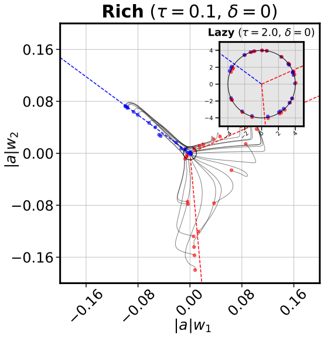

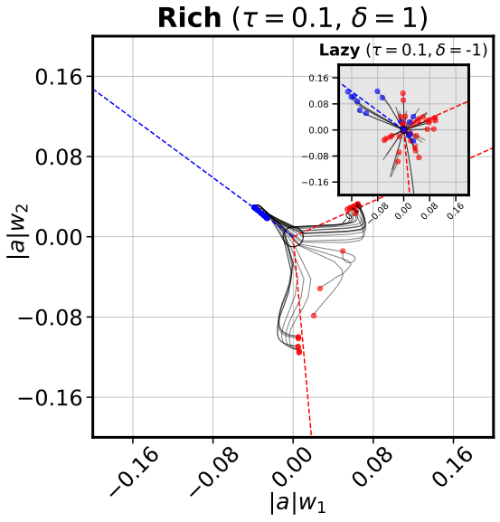

*(a) Overall and relative scale impact feature learning*

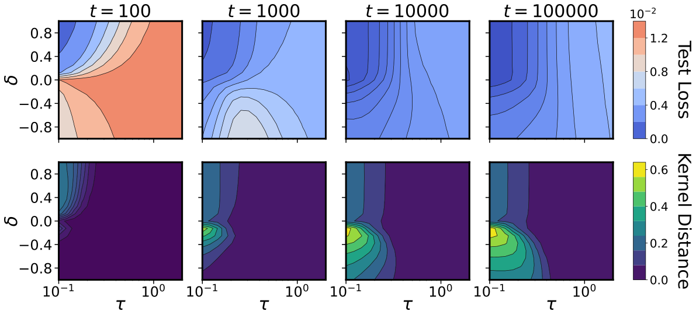

**[p. 2]**

*(b) A complex phase portrait of feature learning*

###### fig-1

*Figure 1: **Unbalanced initializations lead to rapid rich learning and generalization. We follow the experimental setup used in Fig. 1 of Chizat et al. 2019 – a wide two-layer student ReLU network $f(x;\theta)=\sum_{i=1}^{h}a_{i}\max(0,w_{i}^{\intercal}x)$ trained on a dataset generated from a narrow two-layer teacher ReLU network. The student parameters are initialized as $w_{i}\sim\text{Unif}(\mathbb{S}^{d-1}(\frac{\tau}{\alpha}))$ and $a_{i}=\pm\alpha\tau$, such that $\tau>0$ controls the *overall scale* of the function, while $\alpha>0$ controls the *relative scale* of the first and second layers through the conserved quantity $\delta=\tau^{2}(\alpha^{2}-\alpha^{-2})$. (a) Shows the training trajectories of $|a_{i}|w_{i}$ (color denotes $\mathrm{sgn}(a_{i})$) when $d=2$ for four different settings of $\tau,\delta$. The left plot confirms that small overall scale leads to rich and large overall scale to lazy. The right plot shows that even at small overall scale, the relative scale can move the network between rich and lazy as well. Here an upstream initialization $\delta>0$ shows striking alignment to the teacher (dotted lines), while a downstream initialization $\delta<0$ shows no alignment. (b) Shows the test loss and kernel distance from initialization computed through training over a sweep of $\tau$ and $\delta$ when $d=100$. Lazy learning happens when $\tau$ is large, rich learning happens when $\tau$ is small, and rapid rich learning happens when *both* $\tau$ is small and $\delta$ is large – an upstream initialization. This initialization also leads to the smallest test loss. See Fig. 10 in Section D.1 for supporting figures.*** **[p. 2]**

###### p2-2

**Our contributions.** Our work begins with an exploration of the two-layer single-neuron linear network proposed by Azulay et al. 2021 as a minimal model displaying both lazy and rich learning. In Section 3, we derive exact solutions for the gradient flow dynamics with layer-specific learning rates of this model by employing a combination of hyperbolic and spherical coordinate transformations. Alongside recent work by Xu and Ziyin 202411 1 Xu and Ziyin 2024 presented exact NTK dynamics for a linear model trained with one-dimensional data., **[p. 3]** our analysis stands out as one of the few analytically tractable models for the transition between lazy and rich learning in a finite-width network, marking a notable contribution to the field. Our analysis reveals that the layer-specific initialization variances and learning rates conspire to influence the learning regime through a simple set of conserved quantities that constrain the geometry of learning trajectories. Additionally, it reveals that a crucial aspect of the relative scale overlooked in prior analysis is its directionality. While a *balanced initialization* results in all layers learning at similar rates, an *unbalanced initialization* can cause faster learning in either earlier layers, referred to as an *upstream initialization*, or later layers, referred to as a *downstream initialization*. Due to the depth-dependent expressivity of layers in a network, upstream and downstream initializations often exhibit fundamentally distinct learning trajectories. In Section 4 we extend our analysis of the relative scale developed in the single-neuron model to more complex linear models with multiple neurons, outputs, and layers and in Section 5 to two-layer nonlinear networks with piecewise linear activation functions. We find that in linear networks, rapid rich learning can only occur from balanced initializations, while in nonlinear networks, upstream initializations can actually accelerate rich learning. Finally, through a series of experiments, we provide evidence that upstream initializations drive feature learning in deep finite-width networks, promote interpretability of early layers in CNNs, reduce the sample complexity of learning hierarchical data, and decrease the time to grokking in modular arithmetic.

###### p3-1

**Notation.** In this work, we consider a feedforward network $f(x;\theta):\mathbb{R}^{d}\to\mathbb{R}^{c}$ parameterized by $\theta\in\mathbb{R}^{m}$. Unless otherwise specified, $c=1$. The network is trained by gradient flow $\dot{\theta}=-{\eta_{\theta}}\cdot\nabla_{\theta}\mathcal{L}(\theta)$, with an initialization $\theta_{0}$ and layer-specific learning rate $\eta_{\theta}\in\mathbb{R}^{m}_{+}$, to minimize the mean squared error $\mathcal{L}(\theta)=\frac{1}{2}\sum_{i=1}^{n}(f(x_{i};\theta)-y_{i})^{2}$ computed over a dataset $\{(x_{1},y_{1}),\dots,(x_{n},y_{n})\}$ of size $n$. We denote the input matrix as $X\in\mathbb{R}^{n\times d}$ with rows $x_{i}\in\mathbb{R}^{d}$ and the label vector as $y\in\mathbb{R}^{n}$. The network’s output $f(x;\theta)$ evolves according to the differential equation, $\partial_{t}f(x;\theta)=\sum_{i=1}^{n}\Theta(x,x_{i};\theta)(y_{i}-f(x_{i};\theta))$, where $\Theta(x,x^{\prime};\theta):\mathbb{R}^{d}\times\mathbb{R}^{d}\to\mathbb{R}$ is the *Neural Tangent Kernel (NTK)*, defined as $\Theta(x,x^{\prime};\theta)=\sum_{p=1}^{m}{\eta_{\theta}}_{p}\partial_{\theta_{p}}f(x;\theta)\partial_{\theta_{p}}f(x^{\prime};\theta)$. The NTK quantifies how one gradient step with data point $x^{\prime}$ affects the evolution of the networks’s output evaluated at another data point $x$. When ${\eta_{\theta}}_{p}$ is shared by all parameters, the NTK is the kernel associated with the feature map $\nabla_{\theta}f(x;\theta)\in\mathbb{R}^{m}$. We also define the *NTK matrix* $K\in\mathbb{R}^{n\times n}$, which is computed across the training data such that $K_{ij}=\Theta(x_{i},x_{j};\theta)$. The NTK matrix evolves from its initialization $K_{0}$ to convergence $K_{\infty}$ through training. Lazy and rich learning exist on a spectrum, with the extent of this evolution serving as the distinguishing factor. Various studies have proposed different metrics to track the evolution of the NTK matrix [24, 25, 26]. We use *kernel distance* [27], defined as $S(t_{1},t_{2})=1-\langle K_{t_{1}},K_{t_{2}}\rangle/\left(\|K_{t_{1}}\|_{F}\|K_{t_{2}}\|_{F}\right)$, which is a scale invariant measure of similarity between the NTK at two times. In the lazy regime $S(0,t)\approx 0$, while in the rich regime $0\ll S(0,t)\leq 1$.

###### fig-2

*Figure 2: **Balance determines geometry of trajectory. The quantity $\delta=\eta_{w}a^{2}-\eta_{a}\|w\|^{2}$ is conserved through gradient flow, which constrains the trajectory to: (a) a one-sheeted hyperboloid for downstream initializations, (b) a double cone for balanced initializations, and (c) a two-sheeted hyperboloid for upstream initializations. Gradient flow dynamics for three different initializations $a_{0},w_{0}$ with the same product $\beta_{0}=a_{0}w_{0}$ are shown. The minima manifold is shown in red and the manifold of equivalent $\beta_{0}$ initializations in gray. The surface is colored according to training loss, with blue representing higher loss and red representing lower loss.*** **[p. 4]**

###### sec-3

## 3 A Minimal Model of Lazy and Rich Learning with Exact Solutions

###### p4-4

Except for a measure zero set of initializations which converge to saddle points22 2 The set of saddle points $\{(a,w)\}$ is the $d-1$ dimensional subspace satisfying $a=0$ and $w^{\intercal}X^{\intercal}y=0$., all gradient flow trajectories will converge to a global minimum, determined by the normal equations $X^{\intercal}Xaw=X^{\intercal}y$. However, even when $X^{\intercal}X$ is invertible such that the global minimum $\beta_{*}$ is unique, the rescaling symmetry between $a$ and $w$ results in a manifold **[p. 5]** of minima in parameter space. The minima manifold is a one-dimensional hyperbola where $w\propto\beta_{*}$ and has two distinct branches for positive and negative $a$. The symmetry also imposes a constraint on the network’s trajectory, maintaining the difference $\delta=\eta_{w}a^{2}-\eta_{a}\|w\|^{2}\in\mathbb{R}$ throughout training (see Section A.1 for details). This confines the parameter dynamics to the surface of a hyperboloid where the magnitude and sign of the conserved quantity determines the geometry, as shown in Fig. 2. An upstream initialization occurs when $\delta>0$, a balanced initialization when $\delta=0$, and a downstream initialization when $\delta<0$.

**Deriving exact solutions in parameter space.** We initially assume33 3 We relax this assumption when considering the dynamics of $\beta$ in function space and their implicit bias. whitened input $X^{\intercal}X=\mathbf{I}_{d}$ such that the ordinary least squares solution is $\beta_{*}=X^{\intercal}y$, and the gradient flow dynamics simplify to $\dot{a}=\eta_{a}\left(w^{\intercal}\beta_{*}-a\|w\|^{2}\right)$, $\dot{w}=\eta_{w}\left(a\beta_{*}-a^{2}w\right)$. Notice that $w(t)\in\mathrm{span}(\{w_{0},\beta_{*}\})$, and through training, $w$ aligns in direction to $\pm\beta_{*}$ depending on the basin of attraction44 4 The basin is given by $\mathrm{sgn}(a_{0})$ for $\delta\geq 0$ or $\mathrm{sgn}(w_{0}^{\intercal}\beta_{*}+\frac{a_{0}}{2}(\delta+\sqrt{\delta^{2}+4\|\beta_{*}\|^{2}}))$ for $\delta<0$. See A.2.5. the parameters are initialized in. Therefore, we can monitor the dynamics by tracking the hyperbolic geometry between $a$ and $\|w(t)\|$ and the spherical angle between $w(t)$ and $\beta_{*}$. We study the variables $\mu=a\|w\|$, an invariant under the rescale symmetry, and $\phi=\frac{w^{\intercal}\beta_{*}}{\|w\|\|\beta_{*}\|}$, the cosine of the spherical angle. From these two scalar quantities $\mu(t),\phi(t)$ and the initialization $a_{0},w_{0}$, we can determine the trajectory $a(t)$ and $w(t)$ in parameter space. The dynamics for $\mu,\phi$ are given by the coupled nonlinear ODEs,

$$
\dot{\mu}=\sqrt{\delta^{2}+4\eta_{a}\eta_{w}\mu^{2}}\left(\phi\|\beta_{*}\|-\mu\right),\qquad\dot{\phi}=\frac{\eta_{a}\eta_{w}2\mu\|\beta_{*}\|}{\sqrt{\delta^{2}+4\eta_{a}\eta_{w}\mu^{2}}-\delta}\left(1-\phi^{2}\right). \tag{2}
$$

Amazingly, this system can be solved exactly, as discussed in Section A.2, and shown in Fig. 3. Without delving into the specifics, we can develop an intuitive understanding of the solutions by examining the influence of the relative scale $\delta$.

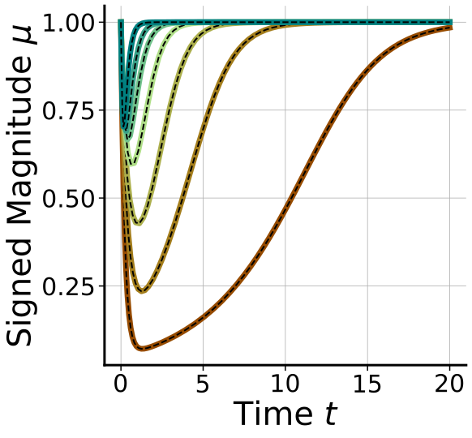

*(a) $\mu(t)$*

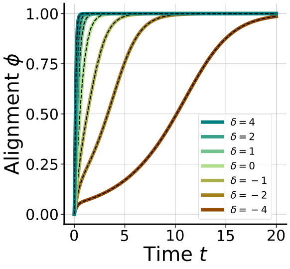

*(b) $\phi(t)$*

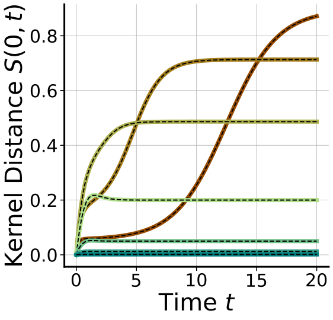

*(c) $S(0,t)$*

###### fig-3

*Figure 3: **Exact solutions for the single hidden neuron model.** Our theoretical predictions (black dashed lines) agree with gradient flow simulations (solid lines, color-coded based on $\delta$ values), shown here for three key metrics: $\mu$ (left), $\phi$ (middle), and $S(0,t)$ (right). Each metric starts at the same value for all $\delta$, but varying $\delta$ has a pronounced effect on the metric’s dynamics. For upstream initializations ($\delta\gg 0$), $\mu$ changes only slightly, $\phi$ exponentially aligns, and $S$ remains near zero, indicative of the lazy regime. For balanced initializations ($\delta=0$), both $\mu$ and $\phi$ change significantly and $S$ quickly moves away from zero, indicative of the rich regime. For downstream initializations ($\delta\ll 0$), $\mu$ quickly drops to zero, then $\mu$ and $\phi$ slowly climb back to one. Similarly, $S$ remains small before a sudden transition towards one, indicative of a delayed rich regime. See Section A.2 for further details.* **[p. 5]**

###### p5-3

*Upstream.* When $\delta\gg 0$, the updates for both $\mu$ and $\phi$ diverge, but $\phi$ updates much more rapidly. We can decouple the dynamics of $\mu$ and $\phi$ by separation of their time scales and assume $\phi$ has reached its steady-state of $\pm 1$ before $\mu$ has updated. Then, the dynamics of $\mu$ is linear and proceeds exponentially to $\pm\|\beta_{*}\|$. This regime exhibits minimal kernel movement (see Fig. 3 (c)) because the kernel is dominated by the $\eta_{w}a^{2}\mathbf{I}_{d}$ term, whereas it is mainly $w$ that updates.

###### p5-4

*Balanced.* When $\delta=0$, $\mu$ follows a Bernoulli differential equation driven by a time-dependent signal $\phi\|\beta_{*}\|$, and $\phi$ follows a Riccati equation evolving from an initial value to $\pm 1$ depending on the basin of attraction. For vanishing initialization $\|\beta_{0}\|\to 0$, the temporal dynamics of $\mu$ and $\phi$ decouple such that there are two phases of learning: an initial alignment phase where $\phi\to\pm 1$, followed by a fitting phase where $\mu\to\pm\|\beta_{*}\|$. In the first phase, $w$ aligns to $\beta_{*}$ resulting in a rank-one update to the NTK, identical to the silent alignment effect described in Atanasov et al. 2021. In the second phase, the dynamics of $\mu$ simplify to the Bernoulli equation studied in Saxe et al. 2013 and the kernel evolves solely in overall scale.

###### p5-5

*Downstream.* When $\delta\ll 0$, the updates for $\mu$ diverge, while the updates for $\phi$ vanishes. In this regime the dynamics proceed by an initial fast phase where $\mu$ converges exponentially to its steady state of $\phi\|\beta_{*}\|$. Plugging this steady state into the dynamics of $\phi$ gives a Bernoulli differential equation **[p. 6]** $\dot{\phi}=\eta_{a}\eta_{w}\|\beta_{*}\|^{2}|\delta|^{-1}\phi(1-\phi^{2})$. Due to the coefficient $|\delta|^{-1}$, the second alignment phase proceeds very slowly as $\phi$ approaches $\pm 1$, assuming $\phi,\mu\neq 0$, which is a saddle point. In this regime, the dynamics proceed by an initial lazy fitting phase, followed by a rich alignment phase, where the delay is determined by the magnitude of $\delta$.

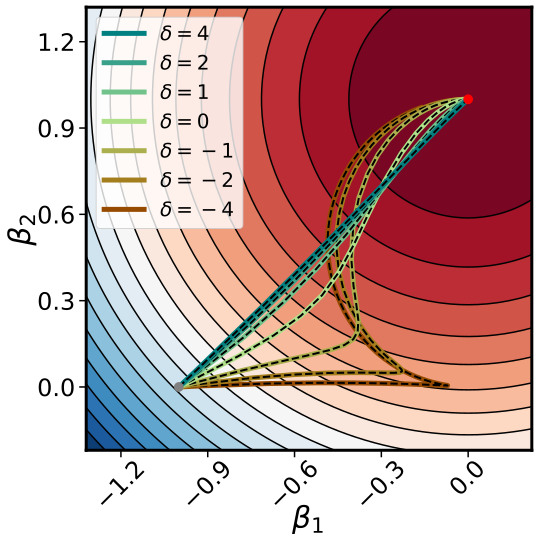

*(a) Whitened $X^{\intercal}X$*

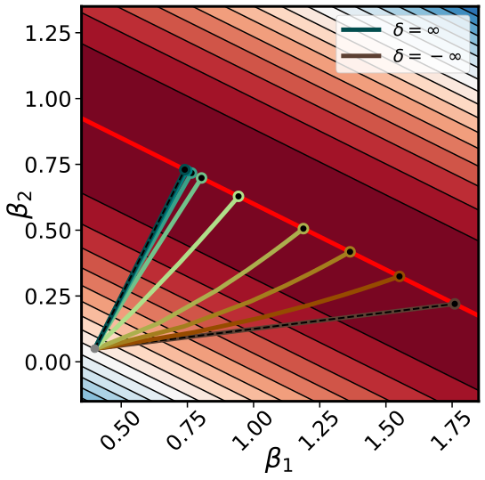

*(b) Low-Rank $X^{\intercal}X$*

###### fig-4

*Figure 4: **Balance modulates $\beta$ dynamics and implicit bias. Here we show the dynamics of $\beta=aw$ with different values of $\delta$, but the same initial $\beta_{0}$. When $X^{\intercal}X$ is whitened (left), we can solve for the dynamics exactly using our expressions for $\mu,\phi$ (black dashed lines). Upstream initializations follow the trajectory of gradient flow on $\beta$, downstream initializations first move in the direction of $\beta_{0}$ before sweeping around towards $\beta_{*}$, and balanced initializations take an intermediate trajectory between these two. When $X^{\intercal}X$ is low-rank (right), then we can only predict the trajectories in the limit of $\delta=\pm\infty$. If the interpolating manifold is one-dimensional, then we can solve for the solution in terms of $\delta$ exactly (black dots). See Section A.4 for details.*** **[p. 6]**

**Identifying regimes of learning in function space.** Here we take an alternative route towards understanding the influence of the relative scale by directly examining the dynamics in function space, an analysis strategy we will generalize to broader setups in Sections 4 and 5. The network’s function is determined by the product $\beta=aw$ and governed by the ODE,

$$
\dot{\beta}=-\underbrace{\left(\eta_{w}a^{2}\mathbf{I}_{d}+\eta_{a}ww^{\intercal}\right)}_{M}X^{\intercal}\rho, \tag{3}
$$

where $\rho=X\beta-y$ is the residual. These dynamics can be interpreted as preconditioned gradient flow on the loss in function space where the preconditioning matrix $M$ depends on time through its dependence on $a^{2}$ and $ww^{\intercal}$. Whenever $\|\beta\|\neq 0$, we can express $M$ directly in terms of $\beta$ and $\delta$ as

$$
M=\frac{\kappa+\delta}{2}\mathbf{I}_{d}+\frac{\kappa-\delta}{2}\frac{\beta\beta^{\intercal}}{\|\beta\|^{2}}, \tag{4}
$$

###### p6-3

where $\kappa=\sqrt{\delta^{2}+4\eta_{a}\eta_{w}\|\beta\|^{2}}$ (see Section A.3 for a derivation). This establishes a *self-consistent* equation for the dynamics of $\beta$ regulated by $\delta$. Additionally, notice that $M$ characterizes the NTK matrix Eq. 1. Thus, understanding the evolution of $M$ along the trajectory $\beta_{0}$ to $\beta_{*}$ offers a method to discern between lazy and rich learning. *Upstream.* When $\delta\gg 0$, $M\approx\delta\mathbf{I}_{d}$, and the dynamics of $\beta$ converge to the trajectory of linear regression trained by gradient flow. Along this trajectory the NTK matrix remains constant, confirming the dynamics are lazy. *Balanced.* When $\delta=0$, $M=\sqrt{\eta_{a}\eta_{w}}\|\beta\|(\mathbf{I}_{d}+\tfrac{\beta\beta^{\intercal}}{\|\beta\|^{2}})$. Here the dynamics balance between following the lazy trajectory and attempting to fit the task by only changing in norm. As a result the NTK changes in both magnitude and direction through training, confirming the dynamics are rich. *Downstream.* When $\delta\ll 0$, $M\approx|\delta|\tfrac{\beta\beta^{\intercal}}{\|\beta\|^{2}}$, and $\beta$ follows a projected gradient descent trajectory, attempting to reach $\beta_{*}$ in the direction of $\beta_{0}$. Along this trajectory the NTK matrix doesn’t evolve. However, if $\beta_{0}$ is not aligned to $\beta_{*}$, then at some point the dynamics of $\beta$ will slowly align. In this second alignment phase the NTK matrix will change, confirming the dynamics are initially lazy followed by a delayed rich phase. See Section A.3.1 for a derivation of the NTK dynamics $\dot{K}$.

**Determining the implicit bias via mirror flow.** So far we have considered whitened or full rank $X^{\intercal}X$, ensuring the existence of a unique least squares solution $\beta_{*}$. In this setting, $\delta$ influences the trajectory the model takes from $\beta_{0}$ to $\beta_{*}$, as shown in Fig. 4 (a). Now we consider low-rank $X^{\intercal}X$, such that there exist infinitely many interpolating solutions in function space. By studying the structure of $M$, we can characterize how $\delta$ determines the interpolating solution the dynamics converge to. Extending a time-warped mirror flow analysis strategy pioneered by Azulay et al. 2021 to allow $\delta<0$ (see Section A.4 for details), we prove the following theorem, which shows a tradeoff between reaching the minimum norm solution and preserving the direction of the initialization $\beta_{0}$.

###### p6-5

*For a single hidden neuron linear network, for any $\delta\in\mathbb{R}$, and initialization $\beta_{0}$ such that $\beta(t)\neq 0$ for all $t\geq 0$, if the gradient flow solution $\beta(\infty)$ satisfies $X\beta(\infty)=y$, then,*

$$
\beta(\infty)=\argmin_{\beta\in\mathbb{R}^{d}}\Psi_{\delta}(\beta)-\psi_{\delta}\tfrac{\beta_{0}}{\|\beta_{0}\|}^{\intercal}\beta\quad\mathrm{s.t.}\quad X\beta=y \tag{5}
$$

*where $\Psi_{\delta}(\beta)=\frac{1}{3}\left(\sqrt{\delta^{2}+4\|\beta\|^{2}}-2\delta\right)\sqrt{\sqrt{\delta^{2}+4\|\beta\|^{2}}+\delta}$ and $\psi_{\delta}=\sqrt{\sqrt{\delta^{2}+4\|\beta_{0}\|^{2}}-\delta}$.*

**[p. 7]**

###### p7-1

We observe that for vanishing initializations there is functionally no difference between the inductive bias of the upstream ($\delta\gg 0$) and balanced ($\delta=0$) settings. However, in the downstream setting ($\delta\ll 0$), it is the second term preserving the direction of the initialization that dominates the inductive bias. This tradeoff in inductive bias as a function of $\delta$ is presented in Fig. 4 (b), where if the null space of $X^{\intercal}X$ is one-dimensional, we can solve for $\beta(\infty)$ in closed form (see Section A.4).

###### sec-4

## 4 Wide and Deep Linear Networks

###### p7-6

By studying the dependence of $M$ on the conserved quantities $\delta_{k}$ and the dimensions $d$, $h$ and $c$, we can determine the influence of the relative scale on the learning regime. When $\min(d,c)\leq h<\max(d,c)$, and assuming independent initializations for all $\beta_{k}$, then networks which narrow from input to output ($d>c$) enter the lazy regime when all $\delta_{k}\gg 0$, whereas networks which expand from input to output ($d<c$) do so when all $\delta_{k}\ll 0$. However, with opposite signs for $\delta_{k}$, and assuming all $\beta_{k}(0)\not\propto\beta_{*}$, these networks enter a *delayed rich regime*. As elaborated in Section B.1.5, this occurs because in these regimes a solution $\beta_{*}$ does not exist within the space spanned by $M$ at initialization. When $h\geq\max(d,c)$ all networks enter the lazy regime when all $\delta_{k}\gg 0$ or all $\delta_{k}\ll 0$. Conversely, as all $\delta_{k}\to 0$, all networks transition into the rich regime regardless of dimensions. While Theorem 4.1 offers valuable insight into the learning regimes in the limits of $\delta_{k}$, understanding the transition between regimes remains challenging. To achieve this, we aim to express $M$ in terms of $\beta$, rather than $\beta_{k}$, by introducing structure on the conserved quantities $\Delta$.

###### p7-9

where $P=X\beta-Y$ is the residual. Under our isotropic assumption on the conserved quanitities $\Delta=\delta\mathbf{I}_{h}$, these dynamics are exact. Concurrent to our work, Tu et al. 2024 finds that $\beta$ *approximately* follows these dynamics in the overparameterized setting $h\gg\max(d,c)$ under a Gaussian initialization $\mathcal{N}(0,\sigma^{2})$ of the parameters where $\sigma^{2}h$ is analogous to $\delta$.

**[p. 8]**

###### p8-1

Equipped with a self-consistent equation for the dynamics of $\beta$ we now aim to interpret these dynamics as a mirror flow with a $\delta$-dependent potential. As presented in Theorem B.6, the dynamics of the singular values of $\beta$ can be described as a mirror flow with a *hyperbolic entropy* potential, which smoothly interpolates between an $\ell^{1}$ and $\ell^{2}$ penalty on the singular values for the rich ($\delta\to 0$) and lazy ($\delta\to\pm\infty$) regimes respectively. This potential was first identified as the inductive bias for diagonal linear networks by Woodworth et al. 2020 and the same mirror flow on the singular values is derived from a different initialization choice in prior work by Varre et al. 2024.

###### p8-2

**Deep linear networks**. As presented in Theorem B.10, we generalize the inductive bias derived for rich two-layer linear networks by Azulay et al. 2021 to deep linear networks. For a depth-$(L+1)$ linear network, $f(x;\theta)=A^{\intercal}\prod_{l=1}^{L}W_{l}x$, where $\beta=\prod_{l=1}^{L}W_{l}^{\intercal}A$, we find that the inductive bias of the rich regime is $Q(\beta)=(\tfrac{L+1}{L+2})\|\beta\|^{\frac{L+2}{L+1}}-\|\beta_{0}\|^{-\frac{L}{L+1}}\beta_{0}^{\intercal}\beta$. This inductive bias strikes a depth-dependent balance between attaining the minimum norm solution and preserving the initialization direction.

###### sec-5

## 5 Piecewise Linear Networks

###### p8-3

We now take a first step towards extending our analysis from linear networks to piecewise linear networks with activation functions of the form $\sigma(z)=\max(z,\gamma z)$. The input-output map of a piecewise linear network with $L$ hidden layers and $h$ hidden neurons per layer is comprised of potentially $O(h^{dL})$ convex *activation regions* [65]. Each region is defined by a unique *activation pattern* of the hidden neurons. The input-output map is linear within each region and continuous at the boundary between regions. Collectively, the activation regions form a 2-colorable77 7 To our knowledge, this property has not been recognized before. See Section C.1 for a formal statement. convex partition of input space, as shown in Fig. 5. We investigate how the relative scale influences the evolution of this partition and the linear maps within each region.

**Two-layer network.** We consider the dynamics of a two-layer piecewise linear network without biases, $f(x;\theta)=a^{\intercal}\sigma(Wx)$, where $W\in\mathbb{R}^{h\times d}$ and $a\in\mathbb{R}^{h}$. Following the approach in Section 4, we consider the contribution to the input-output map from a single hidden neuron $k\in[h]$ with parameters $w_{k}\in\mathbb{R}^{d}$, $a_{k}\in\mathbb{R}$ and conserved quantity $\delta_{k}=\eta_{w}a_{k}^{2}-\eta_{a}\|w_{k}\|^{2}$ [62]. However, unlike the linear setting, the neuron’s contribution to $f(x_{i};\theta)$ is regulated by whether the input $x_{i}$ is in the neuron’s *active halfspace*. Let $C\in\mathbb{R}^{h\times n}$ be the matrix with elements $c_{ki}=\sigma^{\prime}(w_{k}^{\intercal}x_{i})$, which determines the activation of the $k^{\mathrm{th}}$ neuron for the $i^{\mathrm{th}}$ data point. The dynamics of $\beta_{k}=a_{k}w_{k}$ are,

$$
\dot{\beta}_{k}=-\underbrace{\left(\eta_{w}a_{k}^{2}\mathbf{I}_{d}+\eta_{a}w_{k}w_{k}^{\intercal}\right)}_{M_{k}}\underbrace{\textstyle\sum_{i=1}^{n}c_{ki}x_{i}(f(x_{i};\theta)-y_{i})}_{\xi_{k}}. \tag{9}
$$

The matrix $M_{k}\in\mathbb{R}^{d\times d}$ is a preconditioning matrix on the dynamics, and when $\beta_{k}\neq 0$, it can be expressed in terms of $\beta_{k}$ and $\delta_{k}$. Unlike the linear setting, $\xi_{k}\in\mathbb{R}^{d}$ driving the dynamics is not shared for all neurons because of its dependence on $c_{ki}$. Additionally, the NTK matrix in this setting depends on $M_{k}$ and $C$, with elements $K_{ij}=\sum_{k=1}^{h}c_{ki}x_{i}^{\intercal}M_{k}x_{j}c_{kj}$. To examine the evolution of $K$, we consider a *signed spherical coordinate* transformation separating the dynamics of $\beta_{k}$ into its directional $\hat{\beta}_{k}=\mathrm{sgn}(a_{k})\tfrac{\beta_{k}}{\|\beta_{k}\|}$ and radial $\mu_{k}=\mathrm{sgn}(a_{k})\|\beta_{k}\|$ components, such that $\beta_{k}=\mu_{k}\hat{\beta}_{k}$. $\hat{\beta}_{k}$ determines the direction and orientation of the halfspace where the $k^{\mathrm{th}}$ neuron is active, while $\mu_{k}$ determines the slope of the contribution in this halfspace. These coordinates evolve according to,

$$
\dot{\mu}_{k}=-\sqrt{\delta_{k}^{2}+4\eta_{a}\eta_{w}\mu_{k}^{2}}\hat{\beta}_{k}^{\intercal}\xi_{k},\qquad\dot{\hat{\beta}}_{k}=-\frac{\sqrt{\delta_{k}^{2}+4\eta_{a}\eta_{w}\mu_{k}^{2}}+\delta_{k}}{2\mu_{k}}\left(\mathbf{I}_{d}-\hat{\beta}_{k}\hat{\beta}_{k}^{\intercal}\right)\xi_{k}. \tag{10}
$$

###### p8-6

*Downstream.* When $\delta_{k}\ll 0$, $M_{k}\approx|\delta_{k}|\hat{\beta}_{k}\hat{\beta}_{k}^{\intercal}$, and the dynamics are approximately $\partial_{t}\hat{\beta}_{k}=0$ and $\partial_{t}\mu_{k}=-|\delta_{k}|\hat{\beta}_{k}^{\intercal}\xi_{k}$. Irrespective of $\xi_{k}$, $\hat{\beta}_{k}(t)=\hat{\beta}_{k}(0)$, which implies the overall partition map doesn’t change (Fig. 5, bottom), nor the activation patterns $C$, nor $M_{k}$. Only $\mu_{k}$ changes to fit the data, while the NTK remains constant. If the number of hidden neurons is insufficient to fit the data, there is a delayed rich alignment phase where the kernel will change, with $|\delta_{k}|$ determining the delay.

*Balanced.* When $\delta_{k}=0$, $M_{k}=\sqrt{\eta_{a}\eta_{w}}|\mu_{k}|(\mathbf{I}_{d}+\hat{\beta}_{k}\hat{\beta}_{k}^{\intercal})$, and the dynamics simplify to, $\partial_{t}\hat{\beta}_{k}=-\sqrt{\eta_{a}\eta_{w}}\mathrm{sgn}(\mu_{k})(\mathbf{I}_{d}-\hat{\beta}_{k}\hat{\beta}_{k}^{\intercal})\xi_{k}$ and $\partial_{t}\mu_{k}=-2\sqrt{\eta_{a}\eta_{w}}|\mu_{k}|\hat{\beta}_{k}^{\intercal}\xi_{k}$. Here both the direction and magnitude of $\beta_{k}$ evolve, resulting in changes to the activation regions, patterns $C$, and NTK $K$. For vanishing initializations where $\|\beta_{k}(0)\|\to 0$ for all $k\in[h]$, we can decouple the dynamics into two **[p. 9]** distinct phases of training (Fig. 5, top), analogous to the rich regime discussed in Section 3. *Phase I: Partition alignment.* At vanishing scale, the output $f(x;\theta_{0})\approx 0$ for all input $x$, such that the vector driving the dynamics $\xi_{k}\approx-\sum_{i=1}^{n}c_{ki}x_{i}y_{i}$ is independent of the other hidden neurons. At the same time, the radial dynamics slow down relative to the directional dynamics, and the function’s output will remain small as each neuron aligns to certain data-dependent fixed points, decoupled from the rest. Prior works have introduced structural constraints on the training data, such as orthogonally separable [50, 53, 54], pair-wise orthonormal [52], linearly separable and symmetric [51] or small angle [55], to analytically determine the fixed points of this alignment phase. *Phase II: Data fitting.* After enough time, the magnitudes of $\beta_{k}$ have grown such that we can no longer assume $f(x;\theta)\approx 0$ and thus the residual will depend on all $\beta_{k}$. In this phase, the radial dynamics dominate the learning driving the network to fit the data. However, it is possible for the directions to continue to change, and therefore some prior works have further decomposed this phase into multiple stages.

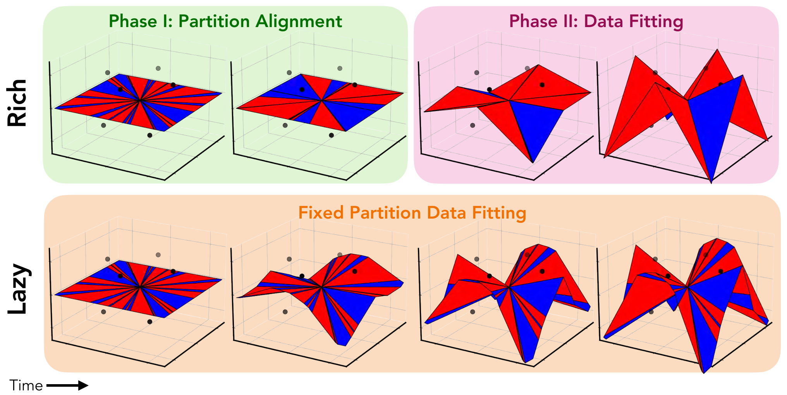

*(a) Evolution of a ReLU network’s input-output map*

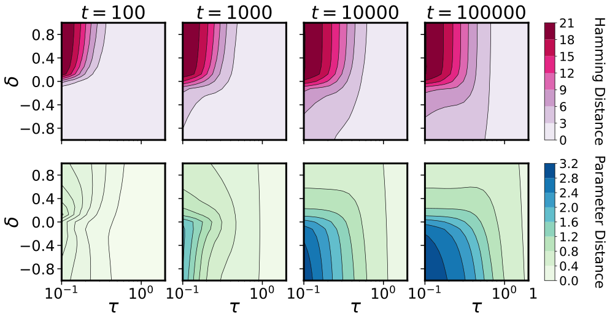

*(b) Hamming and parameter distance over $\tau$-$\delta$ sweep*

###### fig-5

*Figure 5: **Rapid feature learning is caused by large activation changes with minimal parameter movement.** (a) We show the surface of a two-layer ReLU network trained on an XOR-like task, starting with a near-zero input-output map, $f(x;\theta_{0})\approx 0$. The surface consists of convex conic regions, each with a distinct activation pattern, colored by the parity of active neurons. A lazy initialization (*bottom*) maintains a fixed activation partition throughout training, reweighting the hidden neurons to fit the data. In contrast, a rich balanced or upstream initialization (*top*) features an initial alignment phase where the partition map changes rapidly while the input-output map remains close to zero, followed by a data-fitting phase. (b) We show the evolution of Hamming distance in activation patterns and parameter distance, relative to $t=0$, as a function of *overall* and *relative* scales (same experiments as in Fig. 1(b)). *Rapid feature learning* occurs from a small-$\tau$ upstream initialization that promotes faster learning in early layers, driving a large change in Hamming distance, but a small change in parameter space. In contrast, small-$\tau$ downstream initializations require large parameter movement to fit the data in the delayed rich regime.* **[p. 9]**

###### p9-1

*Upstream.* When $\delta_{k}\gg 0$, $M_{k}\approx\delta_{k}\mathbf{I}_{d}$, and the dynamics are approximately $\partial_{t}\hat{\beta}_{k}=-\delta_{k}\mu_{k}^{-1}(\mathbf{I}_{d}-\hat{\beta}_{k}\hat{\beta}_{k}^{\intercal})\xi_{k}$ and $\partial_{t}\mu_{k}=-\delta_{k}\hat{\beta}_{k}^{\intercal}\xi_{k}$. Again, both the direction and magnitude of $\beta_{k}$ change. However, unlike the balanced setting, in this setting $M_{k}$ is independent of $\beta_{k}$ and stays constant through training. Yet, as $\beta_{k}$ change in direction, so can $C$, and thus the NTK. This setting is unique, because it is rich due to a changing activation pattern, but the dynamics do not move far in parameter space. Furthermore, unlike in the balanced scenario where scale adjusts the speed of radial dynamics, here it regulates the speed of directional dynamics, with vanishing initializations prompting an extremely fast alignment phase, as observed in Fig. 1 and in Fig. 5.

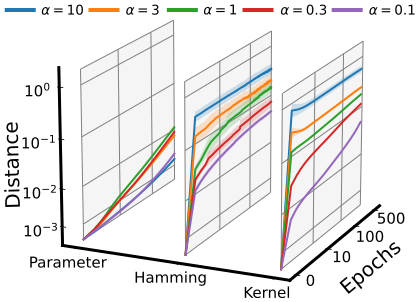

*(a) Kernel Distance*

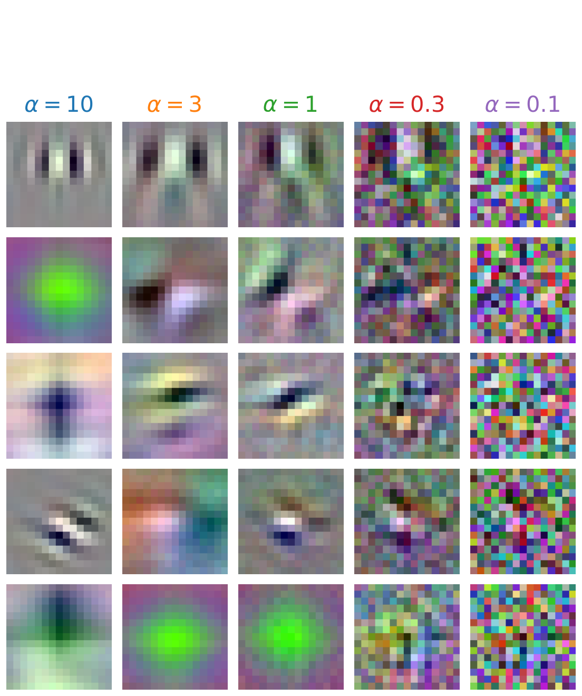

*(b) Convolutional Filters*

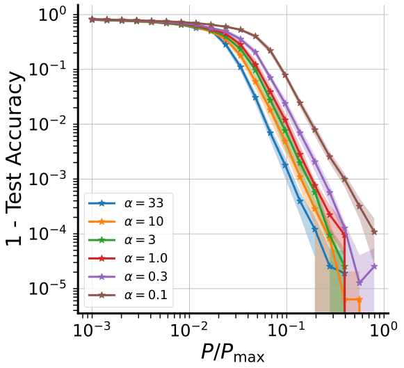

*(c) Random Hierarchy*

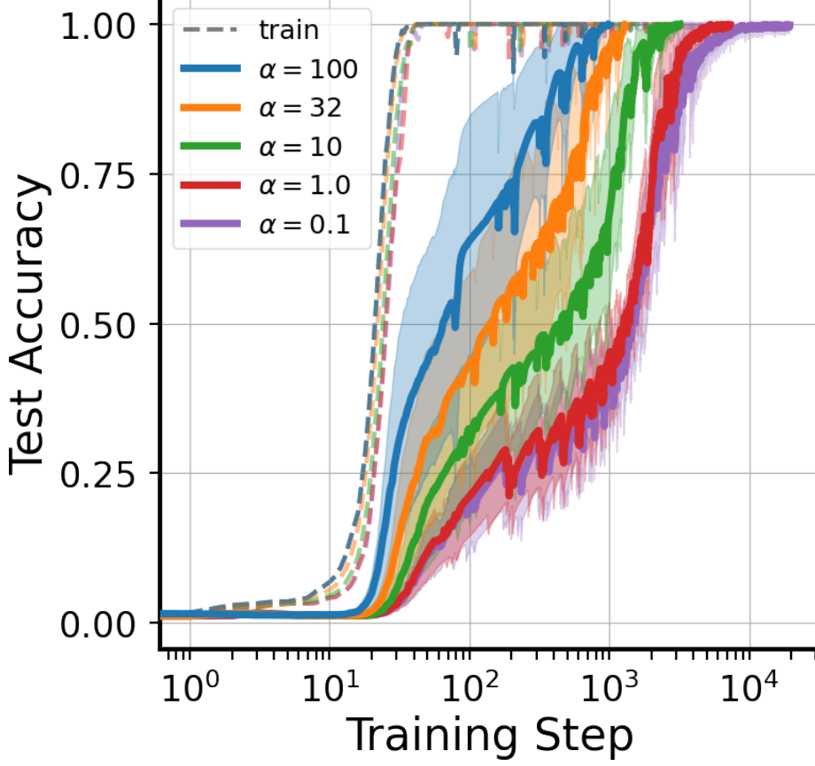

**[p. 10]**

*(d) Transformer Grokking*

###### fig-6

*Figure 6: **Impact of upstream initializations in practice. Here we provide evidence that an upstream initialization (a) drives feature learning through changing activation patterns, (b) promotes interpretability of early layers in CNNs, (c) reduces the sample complexity of learning hierarchical data, and (d) decreases the time to grokking in modular arithmetic. In these experiments, we regulate the first layer’s learning speed relative to the rest of the network by dividing its initialization by $\alpha$. For models without normalization layers, we also scale the last layer’s initialization by $\alpha$ to preserve the input-output map. $\alpha=1$ represents standard parameterization, while $\alpha\gg 1$ and $\alpha\ll 1$ correspond to upstream and downstream initializations, respectively. See Section D.3 for details.*** **[p. 10]**

###### p10-1

**Connections to infinite-width.** Our study of learning regimes in finite-width two-layer ReLU networks as a function of the overall and relative scale is consistent with existing infinite-width analysis of feature learning. For example, in Luo et al. 2021 they consider a network $f(x)=\frac{1}{\alpha}\sum_{k=1}^{h}a_{k}\sigma(w_{k}^{\intercal}x)$ with weights initialized as $a_{k}\sim\mathcal{N}(0,\beta_{a}^{2})$ and $w_{k}\sim\mathcal{N}(0,\beta_{W}^{2}\mathbf{I}_{d})$ as width $h\to\infty$. They obtain a phase diagram at infinite width capturing the dependence of learning regime on the overall function scale $\beta_{a}\beta_{W}/\alpha$ and the relative initialization scale $\beta_{a}/\beta_{W}$, each suitably normalized as a function of width. The resulting phase portrait is analogous to ours in Fig. 1 (b), where we use the conserved quantity $\delta$ rather than the relative scale $\beta_{a}/\beta_{W}$. Specifically, there is a lazy regime that includes the NTK parameterization, which is always achieved at large scale (as in the large-$\tau$ regions of Fig. 1 (b)), but is also achieved at small scale if the first layer variance is sufficiently larger than the second (as in the downstream initializations at small $\tau$ in Fig. 1 (b)). On the other side of the phase boundary is the infinite-width analog of rapid rich learning, where all neurons condense to a few directions. This is induced either at small function scale, or at larger scales if $\beta_{a}/\beta_{W}$ is sufficiently large, such that $W$ learns fast enough relative to $a$. The phase boundary, in turn, which exists only at infinite width, contains a range of parametrizations, including the mean-field parametrization. More broadly, across width-dependent parametrizations, the random initialization of weights induces a distribution over per-neuron conserved quantities. While the distinction between the NTK and the mean-field parametrizations has been extensively studied, both lead to the same distribution of per-neuron conserved quantities, which is zero in expectation with a non-vanishing variance. A more thorough study of what role the *distribution* of per-neuron conserved quantities plays in feature learning at finite-widths is left to future work.

###### p10-2

**Unbalanced initializations in practice.** Our analysis shows that upstream initializations can drive rapid rich learning in nonlinear networks. Further experiments in Fig. 6 show that upstream initializations are relevant across various domains of deep learning: (a) Standard initializations see significant NTK evolution early in training [27]. We show the movement is linked to changes in activation patterns rather than large parameter shifts. Adjusting the initialization variance of the first and last layers can amplify or diminish this movement. (b) Filters in CNNs trained on image classification tasks often align with edge detectors [66]. We show that adjusting the learning speed of the first layer can enhance or degrade this alignment. (c) Deep learning models are believed to avoid the curse of dimensionality and learn with limited data by exploiting hierarchical structures in real-world tasks. Using the Random Hierarchy Model, introduced by Petrini et al. 2023 as a framework for synthetic hierarchical tasks, we show that modifying the relative scale can decrease or increase the sample complexity of learning. (d) Networks trained on simple modular arithmetic tasks will suddenly generalize long after memorizing their training data [68]. This behavior, termed grokking, is thought to result from a transition from lazy to rich learning [69, 70, 71] and believed to be important towards understanding emergent phenomena [72]. We show that decreasing the variance of the embedding in a single-layer transformer ($<6\%$ of all parameters) significantly reduces the time to grokking.

###### p10-3

In this work, we derived exact solutions to a minimal model that can transition between lazy and rich learning to precisely elucidate how unbalanced layer-specific initialization variances and learning rates determine the degree of feature learning. We further extended our analysis to wide and deep linear networks and shallow piecewise linear networks. We find through theory and empirics that unbalanced initializations, which promote faster learning at earlier layers, can actually accelerate rich learning. **Limitations.** The primary limitation lies in the difficulty to extend our theory to deeper nonlinear networks. In contrast to linear networks, where additional symmetries simplify dynamics, nonlinear networks require consideration of the activation pattern’s impact on subsequent layers. One potential solution involves leveraging the path framework used in Saxe et al. 2022. Another limitation is our omission of discretization and stochastic effects of SGD, which disrupt the conservation laws central to our study and introduce additional simplicity biases [74, 75, 76, 77]. **Future work.** Our theory encourages further investigation into unbalanced initializations to optimize efficient feature learning. Understanding how the *learning speed profile* across layers impacts feature learning, inductive biases, and generalization is an important direction for future work.

**[p. 11]**

###### p30-6

Let $A\in\mathbb{R}^{h\times c}$ and $W\in\mathbb{R}^{h\times d}$ be initialized such that $\Delta=\eta_{w}A(0)A(0)^{\intercal}-\eta_{a}W(0)W(0)^{\intercal}=\delta\mathbf{I}_{h}$.

###### p30-7

In *square networks*, where the dimensions of the input, hidden, and output layers coincide ($d=h=c$), and the weights are initialized as $A\sim\mathcal{N}(0,\sigma_{a}^{2}/c)$ and $W\sim\mathcal{N}(0,\sigma_{w}^{2}/d)$, this assumption is naturally satisfied with $\delta=\sigma_{a}^{2}-\sigma_{w}^{2}$ as the dimension $h\to\infty$. However, a limitation of this assumption is that for general $\delta$ it requires $h\leq\min(d,c)$. Specifically, when $\delta>0$, the isotropic initialization requires that $A(0)A(0)^{\intercal}\succ 0$, which implies $h\leq c$. Similarly, when $\delta<0$, the isotropic initialization requires that $W(0)W(0)^{\intercal}\succ 0$, which implies $h\leq d$. Now we prove two important implications of the isotropic initialization assumption.

###### p32-8

*Let $\Delta=\delta\mathbf{I}_{h}$ and assume $h\geq\min(d,c)$ and $\delta\neq 0$. We then have that the dynamics of $\lambda$, the singular values of $\beta$, are given by the mirror flow*

$$
\dot{\lambda}=-\left(\nabla^{2}\Phi_{\delta}(\lambda)\right)^{-1}\nabla_{\lambda}\mathcal{L}, \tag{118}
$$

*where $\Phi_{\delta}(\lambda)=\sum_{i=1}^{\min(d,c)}q_{\delta}(\lambda_{i})$ and $q_{\delta}$ is the hyperbolic entropy potential*

$$
q_{\delta}(x)=\frac{1}{4}\left(2x\sinh^{-1}\left(\frac{2x}{|\delta|}\right)-\sqrt{4x^{2}+\delta^{2}}+|\delta|\right). \tag{119}
$$

###### p32-11

Theorem B.6 implies that the dynamics for the singular values of $\beta$ can be described as a mirror flow with a $\delta$-dependent potential. This potential was first identified as the inductive bias for diagonal linear networks by Woodworth et al. 2020. Termed *hyperbolic entropy*, this potential smoothly interpolates between an $\ell^{1}$ and $\ell^{2}$ penalty on the singular values for the rich ($\delta\to 0$) and lazy ($\delta\to\pm\infty$) regimes respectively. Unfortunately, in our setting we cannot adapt our mirror flow interpretation into a **[p. 33]** statement on the inductive bias at interpolation because the singular vectors evolve through training. If we introduce additional assumptions — specifically, whitened input data ($X^{\intercal}X=\mathbf{I}_{d}$) and a task-aligned initialization such that the singular vectors of $\beta_{0}$ are aligned with those of $\beta_{*}$ — we can ensure that the singular vectors remain constant and thus derive an inductive bias on the singular values. However, in this setting the dynamics decouple completely, implying there is no difference between applying an $\ell^{1}$ or $\ell^{2}$ penalty on the singular values. Consequently, even though the dynamics will depend on $\delta$, the final interpolating solution will be independent of $\delta$, making a statement on the inductive bias insignificant.

###### p33-5

The norm of the regression coefficients is the product $\|\beta\|^{2}=a^{\intercal}\left(\prod_{l=1}^{L}W_{l}\right)\left(\prod_{l=1}^{L}W_{l}\right)^{\intercal}a$. Using the conservation of the initial conditions between consecutive weight matrices, $W_{l+1}^{\intercal}W_{l+1}=W_{l}W_{l}^{\intercal}$, we can express this telescoped product as $\|\beta\|^{2}=a^{\intercal}\left(W_{L}W_{L}^{\intercal}\right)^{d}a$. When plugging in the conservation between last two layers, this implies $\|\beta\|^{2}=a^{\intercal}\left(aa^{\intercal}-\delta\mathbf{I}_{h}\right)^{d}a$, which expanded gives the desired result.

The outer product of the regression coefficients is $\beta\beta^{\intercal}=\left(\prod_{l=1}^{L}W_{l}\right)^{\intercal}aa^{\intercal}\left(\prod_{l=1}^{L}W_{l}\right)$. Using the conserved initial conditions of the last weights we can factor the outer product as the sum, $\beta\beta^{\intercal}=\left(\prod_{l=1}^{L}W_{l}\right)^{\intercal}W_{L}W_{L}^{\intercal}\left(\prod_{l=1}^{L}W_{l}\right)+\delta\left(\prod_{l=1}^{L}W_{l}\right)^{\intercal}\left(\prod_{l=1}^{L}W_{l}\right)$. Both these telescoping products factor using the conservation of the initial conditions between consecutive weight matrices giving the desired result. ∎

We now demonstrate how the quadratic terms $|a|^{2}$ and $W_{1}^{\intercal}W_{1}$ significantly influence the dynamics of $\beta$, similar to our analysis in the two-layer setting.

###### p34-2

*For a depth-$(L+1)$ linear network with square width ($d=h$) and isotropic initialization $\beta_{0}$ such that $\|\beta(t)\|>0$ for all $t\geq 0$, then in the limit as $\delta\to 0$, if the gradient flow solution $\beta(\infty)$ satisfies $X\beta(\infty)=y$, then,*

$$
\beta(\infty)=\argmin_{\beta\in\mathbb{R}^{d}}\left(\frac{L+1}{L+2}\right)\|\beta\|^{\frac{L+2}{L+1}}-\left(\frac{\beta(0)}{\|\beta(0)\|^{\frac{L}{L+1}}}\right)^{\intercal}\beta\quad\mathrm{s.t.}\quad X\beta=y. \tag{123}
$$

###### p35-5

*If $f(x;\theta)$ lacks redundant neurons, implying that every neuron influences an activation region, then the partition of input space can be colored with two distinct colors such that neighboring regions do not share the same color.*

###### p35-6

The justification for this proposition is straightforward. There is one color for regions with an even number of active neurons and another for regions with an odd number of active neurons. Because $f(x;\theta)$ lacks redundant neurons, there does not exist a boundary between activation regions where two neurons activations change simultaneously. In this work, we solely utilize this proposition for visualization purposes, as shown in Fig. 9. Nonetheless, we believe it may be of independent interest as it strengthens the connection between the surface of piecewise linear networks and the *mathematics of paper folding*, a connection previously alluded to in the literature [82].

**[p. 36]**

###### p37-1

We used Google Cloud Platform (GCP) nodes to run all experiments. Figure 1 experiments were run on a node with 360 AMD Genoa CPU cores with runtime totaling approximately 90 minutes including averaging over seeds as described below. Neural network training and NTK calculation for Figure 5 was performed on single A100 GPU nodes. Runtime was approximately 20 hours for Figure 5(a), four hours for 5(b), 12 hours for 5(c) (with individual runs ranging from five to 30 minutes depending on the number of datapoints), and 12 hours for 5(d). Figures 2, 3, and 4 are not compute-heavy, and these experiments were run on a personal computer. Overall, we estimate approximately 200 hours of single A100 runtime as well as 100 hours of the 360-core node accounting for failed runs and exploratory experiments.

###### p37-3

Note that the *base* student initialization described thus far is perfectly balanced at each neuron, that is $\delta_{i}=0$ for $i\in[m]$; we also define this to be our setting where the scale $\tau$ is 1. In order to transform the base initialization into a particular setting of $\tau$ and $\delta$, we first solve for the relative layer scaling $\alpha$ in $\delta^{2}=\tau^{2}(\alpha^{2}-\alpha^{-2})$ and then scale each $w_{i}$ by $\tau/\alpha$ and each $a_{i}$ by $\tau\alpha$. We obtain a training dataset $\{x^{(i)},y^{(i)}\}_{i=1}^{n}$ by sampling $x^{(i)}\overset{\text{i.i.d.}}{\sim}S^{d-1}$ and computing noiseless labels as $y^{(i)}=f^{\mathrm{teacher}}(x^{(i)};\theta^{\mathrm{teacher}})$. The student is then trained with full-batch gradient descent on a mean square loss objective.

**Figure 1 (a).**

###### p37-5

Here the setting is: $d=2$, $h=50$, $k=3$, and $n=20$. We sample a single teacher and then train four students with the same base initialization but different configurations of $\tau$ and $\delta$: $(\tau=0.1,\delta=0)$ and $(\tau=2,\delta=0)$ for the left subfigure, and $(\tau=0.1,\delta=1)$ and $(\tau=0.1,\delta=-1)$ for the right subfigure. Training is for 1 million steps at a learning rate of 1e-4.

**Figure 1 (b).**

###### p37-7

Here the setting is: $d=100$, $m=50$, $k=3$, and $n=1000$, as in Fig. 1c of [8]. Training is performed with learning rate of 5e-3$/\tau^{2}$. Test error is computed as mean square error over a held-out set of 10,000 datapoints. We sweep over $\tau$ over a logarithmic scale in the range $[0.1,2]$ and $\delta$ over a linear scale in the range $[-1,1]$. We average over 16 random seeds, where the seed controls the sampling of: the teacher weights $\theta^{\mathrm{teacher}}$, the base initialization of $\theta^{\mathrm{student}}$, and the training data $\{x^{(i)}\}_{i=1}^{n}$. In this way, each random seed is used for a sweep over all combinations of $\tau$ and $\delta$ in the sweep; we simply apply the scaling described above to get to each point on the $(\tau,\delta)$ grid. The kernel distance computed is as defined in [27], where here we compute it at time $t$ relative to the kernel at initialization, i.e. $S(t)=1-\langle K_{0},K_{t}\rangle/\left(\|K_{0}\|_{F}\|K_{t}\|_{F}\right)$. In Fig. 10, we additionally plot Hamming and parameter distances relative to initialization, as well as training loss, while training for ten times longer than in Fig. 1 (b).

Notebooks generating all two-layer experiment figures are provided here.

###### fig-10

*Figure 10: **Supporting figures for Fig. 1 (b). We plot Hamming distance, parameter distance, and training loss, on top of the test loss and kernel distance considered in Fig. 1 (b), and train for ten times longer than in Fig. 1 (b). We observe that although training loss still drops between $10^{5}$ and $10^{6}$ steps, the test loss and other distances considered remain largely unchanged. Training loss is saturated at 1e-10.*** **[p. 38]**

###### sec-d3

### D.3 Figure 5:

###### p39-2

We are training a small ResNet based on the CIFAR10 script provided in the DAWN benchmark (code available here). The only modifications to the provided code base are we increase the convolution kernel size from $3\times 3$ to $15\times 15$, to better observe the learned spatial patterns, and we set the weight decay parameter to $0$ to avoid confounding variables. Moreover, we are dividing the convolutional filters weights by a parameter $\alpha$ (after standard initialization) which controls the balancedness of the network. To quantify the smoothness of the filters, we compute the normalized Laplacian of each filter $w_{ij}\in\mathbb{R}^{15\times 15}$, over input $i=(1,2,3)$ and output $j=(1,...,64)$ channels

$$
\text{smoothness}(w_{ij}):=\left\lVert\frac{w_{ij}}{\|w_{ij}\|_{2}}\ast\Delta\right\rVert_{2}^{2} \tag{132}
$$

where the Laplacian kernel is defined as

$$
\Delta:=\left(\begin{array}[]{ccc}-0.25&-0.5&-0.25\\
-0.5&2&-0.5\\
-0.25&-0.5&-0.25\end{array}\right). \tag{133}
$$

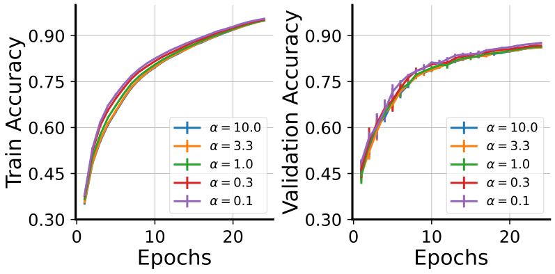

*(a) Accuracy*

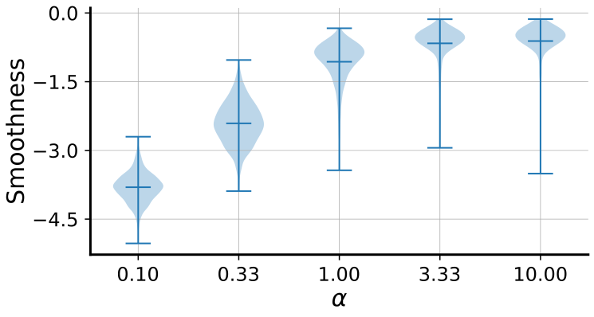

*(b) Gabor Smoothness*

###### fig-11

*Figure 11: **Interpreting convolutional filters. CNN experiments on CIFAR10. We can see in A) that all networks achieve comparable training and test accuracy, despite the modification in initialization. However, in B) we see that networks with a small initialization ($\alpha<1$) learn much smoother filters, giving quantiative support to results in Fig. 6. The smoothness is defined as the normalized Laplacian of the filters (see text, eq. 132).*** **[p. 39]**

**Random Hierarchy Model**

We refer to [67], who originally proposed the random hierarchy model (RHM) as a tool for studying how deep networks learn compositional data, for a more in-depth treatment. Here we briefly recap the setup following the notation used in [67].

An RHM essentially lets us build a random classification task with a clear hierarchical structure. The top level of the RHM specifies $m$ equivalent high-level features for *each* class label in $\{1,\ldots,n_{c}\}$, where each feature has length $s$ and $n_{c}$ is the number of classes. For example, suppose the vocabulary at the top level is $\mathcal{V}_{L}=\{a,b,c\}$, $n_{c}=2$, $m=3$, and $s=2$. Then in a particular instantiation of this RHM, we might have that Class 1 has $ab$, $aa$, and $ca$ as equivalent high-level features (this is precisely the example used in Fig.1 of [67]). Class 2 will then have three random high-level features, with the constraint that they are **not** features for Class 1, for example, $bb,bc,ac$.

Each successive level specifies $m$ equivalent lower-level features for each “token" in the vocabulary at the previous level. For example, if $\mathcal{V}_{L-1}=\{d,e,f\}$, we might have that $a$ can be equivalently **[p. 40]** represented as $de$, $df$, or $ff$; $b$ and $c$ will each have $m$ equivalent representations of their own. We assume that the vocabulary size, $v$, is the same at all levels. Therefore, sampling an RHM with hyperparameters $n_{c},m,s,v$ requires sampling $mn_{c}+(L-1)mv$ rules.

In order to sample a datapoint from an RHM, we first sample a class label (e.g. Class 1), then uniformly sample one of the highest level features, (e.g. $ab$), then for each “token" in this feature we sample lower level features (e.g. $a\to de$, $b\to ee$), and so on recursively. The generated sample will therefore have length $s^{L}$ and a class label. For training a neural network to perform this classification task, each input is converted into a one-hot representation, which will be of shape $(s^{L},v)$, and is then flattened.

###### p40-2

We use the code released by [67] to train an MLP of width 64 with three hidden layers to learn an RHM with $L=3$, $n_{c}=8,m=4,s=2,v=8$. The main change we make is allowing for scaling the initialization of the first layer by $1/\alpha$ and the initialization the readout layer by $\alpha$. We then sweep over $\alpha\in\{0.03,0.1,0.3,1,3,10\}$ and over the number of datapoints in the training set, which is specified as a fraction of the total number of datapoints the RHM can generate. We average test accuracy, which is by default computed on a held-out set of 20,000 samples, over six random seed configurations, where each configuration seeds the RHM, the neural network, and the data generation.

###### p40-3

We train with the default settings used in [67], that is stochastic gradient descent with momentum of 0.9, run for 250 epochs with a learning rate initialized at 6.4 (0.1 times width) and decayed with a cosine schedule down to 80% of epochs. The batch size of 128; we do not use biases or weight decay.

**Grokking**

###### p40-5

We are training a one layer transformer model on the modular arithmetic task in Power et al. 2022. Our experimental code is based on an existing Pytorch implementation (code available here). The only modifications to the provided code base is that we use a single transformer layer (instead of the default 2-layer model). Prior analysis in Nanda et al. 2023 has shown that this model can learn a minimal (attention-based) circuit that solves the task.

###### p40-6

We study the effects on grokking time (defined as $\geq 0.99$ accuracy on the validation data) of two manipulations. Firstly, we divide the embedding weights of the positional and token embeddings by the same balancedness parameter $\alpha$ as in the CNN gabor experiments. Secondly, like in Kumar et al. 2023, we multiply the output of the model (i.e., the logits) by a factor $\tau$ and divide the learning rate by $\tau^{2}$.

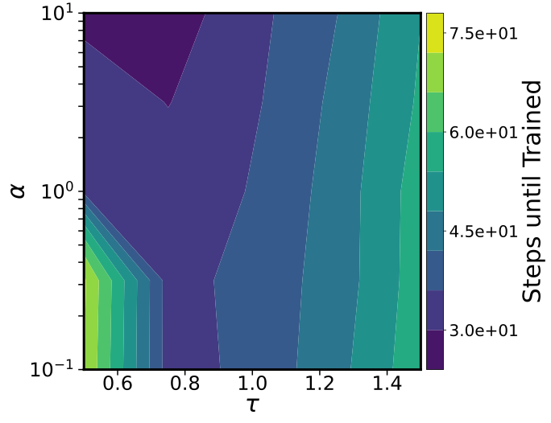

*(a) Steps until training*

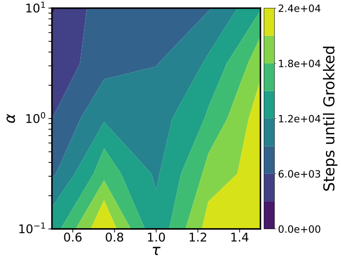

*(b) Steps until grokked*

###### fig-12

*Figure 12: **Transformer Grokking in Modular Arithmetic Task. A) Shows the number of training steps required until the training accuracy passes a predefined threshold of $99\%$; we sample scaling $\tau\in\{0.5,0.75,1.0,1.25,1.5\}$ [69] and balance $\alpha\in\{0.1,0.3,1.0,3.0,10\}$ on a regular grid over $n=5$ random initializations with a maximal computational budget of $m=30,000$ training steps. B) Same as A), but reporting the number of training steps required until the test performance passes the predefined threshold of $99\%$. We clearly see the fastest grokking in an unbalanced rich setting.*** **[p. 40]**
