# Feature Learning Dynamics under Grokking in a Sparse Parity Task

> **Provenance of the conversion.** Recovered from the PDF (task-032). The work
> has neither an arXiv version nor an HTML rendering: it appeared as a poster at
> the HiLD workshop at ICML 2024 and lives only on OpenReview (gciHssAM8A),
> which answers this container with a 403 at every address; the PDF was taken
> from an Internet Archive snapshot (checked 2026-09-05). The ETH Research
> Collection record declares the same file open under CC BY 4.0, but the live
> ETH site answers 403 as well.
>
> The parse is block-level (pymupdf): the PDF was built from LaTeX, and its text
> blocks follow the order of the content stream. The page marks are exact by
> construction: they are taken from the PDF's own pagination rather than matched
> against the text. Running heads and folios are not carried over.
>
> Figures. All 16 of them are assembled from vector graphics and embedded
> rasters, and are rendered from the PDF by the bounding box of the content
> above the caption at 250 dots per inch: the files embedded in the PDF are
> single panels only, and extracting them one by one would have torn the
> composite figures apart.
>
> Formulae. The text layer scatters the mathematics across blocks with
> mismatched coordinates, so the inline formulae (the empirical kernel, the
> eigenfunctions and their coefficients, CKA, the notation for the moments in
> time) were retyped from the raster of the corresponding lines. The section
> headings are marked up by hand: in the text layer nothing distinguishes them
> from the other blocks except the type size, and automatic recognition took
> fragments of formulae for headings.

Javier Sanguino Bautiste, Gregor Bachmann, Bobby He, Lorenzo Noci, Thomas Hofmann — ETH Zürich, Switzerland. The HiLD (High-dimensional Learning Dynamics) workshop at ICML 2024, Vienna, 26 July 2024.
## Abstract

###### p1-3

In this paper, we analyze the phenomenon of Grokking in a sparse parity task trained with Deep Neural Networks through the lens of feature learning. In particular, we analyze the evolution of the Neural Tangent Kernel (NTK) matrix. We show that during the initial overfitting phase, the NTK’s eigenfunctions are not aligned with the predictive input features. On the other hand, at a later stage the NTK’s top eigenfunctions evolve to focus on the features of interest, which corresponds to the onset of the delayed generalization typically observed in Grokking. Our experiments can be viewed as a mechanistic interpretation of feature learning during training through the NTK eigenfunctions’ evolution.

1. Introduction

Deep learning has garnered significant attention for its ability to effectively solve a wide range of tasks [4, 8]. However, its theoretical understanding still lags behind the empirical success. For example, the mechanisms behind feature learning, crucial to the practical effectiveness of these models, remain an active area of research [1, 23].

One paradigmatic case of this is the surprising phenomenon of Grokking, which describes a scenario where, long after fitting the training data, validation accuracy improves from chance level to perfect generalization (see Figure 1). Notably, no hyperparameters are altered; the network is simply trained for a longer period. Grokking was first identified by Power et al. [18] and it has been later observed in arithmetic [2, 12, 17, 20, 22], vision and language tasks [11, 14] with various architectures or in regression [13]. The phenomenon of grokking suggests that the networks’ internal representations (a.k.a. features) exhibit unique dynamics, enabling the observed delayed generalization.

In this paper, we analyze the feature dynamics of networks that exhibit grokking through the lens of the Neural Tangent Kernel (NTK) [7], and its evolution through training [5]. The NTK arises from the linearization of the network in function space [10], making it a valuable tool for analytically studying networks’ training dynamics. In particular, by looking at the NTK’s dynamics it is possible to differentiate between the “lazy” learning regime [3] — where the features barely move — and

© J. Sanguino Bautiste, G. Bachmann, B. He, L. Noci & T. Hofmann.

**[p. 2]**

FEATURE LEARNING DYNAMICS UNDER GROKKING IN A SPARSE PARITY TASK

tm ts tg Accuracy

tm ts tg Loss

100%

2.5

train test

90%

2.0

Accuracy (%)

80%

1.5

Loss

70%

1.0

60%

0.5

train test

50%

0.0

0 2000 4000 6000 8000 10000 Iterations

0 2000 4000 6000 8000 10000 Iterations

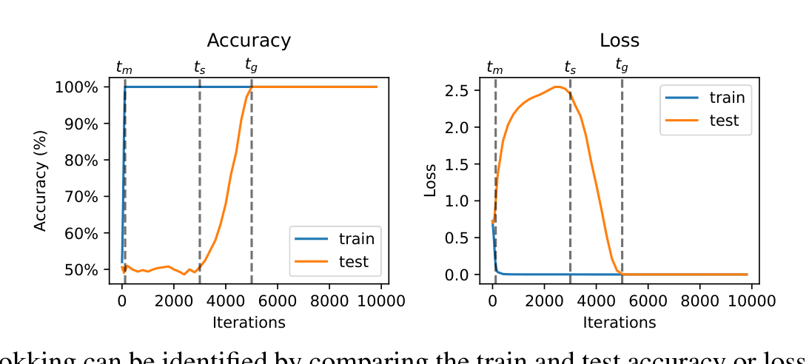
*Figure 1: Grokking can be identified by comparing the train and test accuracy or loss. Time points:*

t0 is the initialization time, tm is the first iteration with full training accuracy, ts is the beginning of an increase in test accuracy, and tg is the first iteration with full test accuracy.

the “rich” regime, where the NTK moves from its initial state, indicating feature evolution. The link between grokking and learning dynamics has been recently established in Kumar et al. [9], where it is shown that — when Grokking happens — the network transitions from lazy to rich dynamics.

In this work we confirm the transition from lazy to rich dynamics in grokking networks for a sparse parity task. In particular, we investigate how the meaningful (i.e. generalizing) features are encoded in the NTK matrix as training progresses. We do so by showing the emergence of structure in the NTK’s eigenfunctions, which start encoding the task’s generalizing features when delayed generalization happens. More generally, the tools used in this paper can be seen as a mechanistic interpretability framework for studying feature learning during training.

2. Experimental Setup and NTK framework

In this section we will introduce the necessary background and notation used throughout this work.

2.1. Task Definition

i=1 be training set, where xi ∈{0, 1}d is

We solve a (k, d)-sparse parity task. Let Dk,d = {(xi, yi)}n

Pk



a binary vector and the target yi =

mod 2 is the parity of the first k digits (clean digits). Notice that the remaining d −k entries (noisy digits) of xi do not contribute to yi. Further, let X = {xi}n

l=1 xi

i=1. Finally, let x ∈{0, 1}d denote an arbitrary test point.

i=1 and Y = {yi}n

2.2. Model Definition

To solve the task, we consider an equal-width L-layer Multi-Layer Perceptron fθ(x) : Rd →R, where θ represents the weights. The network is trained using full-batch Adam and includes L1-norm regularization on the weights, as it helps to induce grokking in the task [17].

2.3. Neural Tangent Kernel and Feature Learning link

From a theoretical perspective, if we consider continuous updates of the parameters instead of discrete updates (θt+1 ←θt −η∇θtL(X, Y; θt), where L(x, y; θ) is the empirical loss, the evolution of fθ can be described with the gradient flow equation:

∂ft(X)

∂θt

∂t = −η ˆΘt(X, X)∇ft(X)L(θ) (1)

∂t = ∇θfθ(X)

θ=θt

**[p. 3]**

FEATURE LEARNING DYNAMICS UNDER GROKKING IN A SPARSE PARITY TASK

where ˆΘt is the empirical Neural Tangent Kernel. In general, Eq. 1 is hard to solve, as ˆΘt depends on t.

If we consider flin

t (x) := f0(x)+∇θf0(x)

θ=θ0∆t where ∆t := θt −θ0, using the MSE loss

as L(x, y; θ), the ODE in equation 1 has a closed solution (as ∇θf0(x) is now constant through training, see Appendix 3). In particular, for an arbitrary test point x, flin

t (x) = µt(x) + γt(x), where

0 (I −e−µ ˆΘ0t)Y (2)

µt(x) = ˆΘ0(x, X) ˆΘ−1

0 (I −e−µ ˆΘ0t)f0(X) (3)

γt(x) = f0(x) −ˆΘ0(x, X) ˆΘ−1

Thus, the predictive function has a closed-form solution during training. We follow Hu et al. [6] by letting our initialization be small so the initial output is small (f0(x) ≈0) to simplify further the equation. Then, flin

t (x) = µt. We will consider this case for our next derivations. Therefore, flin

t (x) can be understood as kernel learning, meaning no feature learning is involved. If we start training the network normally, obtain the NTK at an arbitrary checkpoint (t = T) and then calculate the linearised predictive function at t →∞, we will effectively freeze feature learning from t = T. The resulting predictive function can thus be described as:

∞(x; T) = ˆΘT (x, X) ˆΘ−1

flin

T Y (4)

where ˆΘT is the NTK of the checkpoint from which the linearised training is induced.

2.3.1. EIGENFUNCTION DECOMPOSITION

A very common decomposition of kernel-based predictors is based on the eigenfunction framework. Let us denote the input distribution as x ∼pX. The eigenfunctions associated with the NTK Θ : Rn × Rn are defined through the integral equation

Z

Rd Θ(x, x′)ϕ(x′)pX(x′)dx′ = ωϕ(x) (5)

where ϕ : Rn −→R is the eigenfunction and ω ≥0 is its corresponding eigenvalue. To calculate the eigenfunctions, we need to know the input distribution pX, which we usually don’t have access to. Coming back to our example, let ˆΘ(X, X) = V ΩV T with orthogonal V ∈Rn×n and a diagonal Ω∈Rn×n. We can form an estimator of the eigenfunctions for an arbitrary test point x,

n X

ˆϕi(x) = 1

Θ(x, xl)Vli (6)

ωi

l=1

It can be shown that this forms a consistent estimator, i.e. as the sample size n increases, it holds that ˆϕi −→ϕi point-wise. Returning back to our predictive equation 16, we can now write it as a linear combination of eigenfunctions,

n X

i ˆϕi(x)

flin

αt

t (x) =

i=1

i = ωi(1−e−ηωit)

The weights αi can be written as αt

ωi vT

i Y =: γt

ivT

i Y where vi is the i-th eigenvector. Therefore, αt

i measures how well aligned the i-th eigenvector is with the targets Y throughout time.

**[p. 4]**

FEATURE LEARNING DYNAMICS UNDER GROKKING IN A SPARSE PARITY TASK

3. Experiments

This section presents the results of an experiment conducted on a (3, 35)-sparse parity dataset for several seeds. The rest of training details can be consulted in Appendix B. Results hold for different choices of d in a (k, d)-sparse parity dataset, Appendix D shows them.

It is known that grokking arises when the ”right” structure emerges in the network [12, 15]. In our case, this occurs when the network starts focusing on clean digits (see Appendix C.1 for details on how the weights evolve), indicating that it is learning the correct features. In our experiments, we analyze how the NTK shows the evolution of feature learning during training.

3.1. Feature learning happens late during training

As training a model until t = T and then considering a linearized version of the predictive function stops feature learning from t = T, we can evaluate the quality of the features learned up to that checkpoint using Equation 4. Additionally, if the NTK matrices at two different checkpoints are similar, it suggests that the true optimization path during training closely follows the linearized approximation, indicating that the network is close to the lazy regime. As suggested by Fort et al. [5] and Tsilivis and Kempe [21], we use the Central Kernel Alignment (CKA) metric:

d(K1, K2) = 1 − Tr(K1KT

2 ) q

Tr(K1KT

1 )Tr(K2KT 2 )

###### p4-11

Figures 2 (c) and (d) suggest that the quality of features starts increasing after ts and therefore, that the sudden increase in generalisation is due to the network starting to learn meaningful features. This is confirmed in figure 2 (e), the NTK changes slightly until tm, and then enters a lazy regime (where, in square 1, it does not change at all). As shown in square 2, after ts, the kernel starts changing, indicating a transition from the lazy regime to a rich feature learning regime. This change continues until a bit after tg to then stabilize, as shown in square 3.

Kernel Distance

tg

tm ts tg

tm tm

ts

100%

Accuracy (%)

train test

0.25

Loss

75%

train test

0.20

50%

ts

Iterations

0 2k 4k 6k 8k 10k

0 2k 4k 6k 8k 10k

0.15

(a)

(b)

NTK Accuracy (%)

0.10

100%

tg

train test

0.7

NTK Loss

75%

0.05

train test

0.6

50%

0.5

0.00

0 2k 4k 6k 8k 10k Iterations

0 2k 4k 6k 8k 10k Iterations

0 2000 4000 6000 8000 9800 Iterations

(c)

(d)

(e)

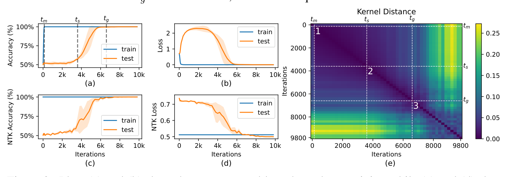
*Figure 2: Plots (a) and (b) show the accuracy and loss throughout training while (c) and (d) show*

the evolution of accuracy and loss when using Equation 4 for that checkpoints. All four plots show the average over several seeds and their variance. Plot (e) shows the average of CKA (over the seeds) between NTKs associated to all checkpoints. Note that the key checkpoints are defined with (a) but (e) includes them to facilitate its interpretation.

Therefore, the rapid increase in generalization occurs when the network enters a rich feature learning regime, this is when the training dynamics diverge from the linearized version, as stated by

**[p. 5]**

FEATURE LEARNING DYNAMICS UNDER GROKKING IN A SPARSE PARITY TASK

###### p5-2

Kumar et al [9]. Consequently, this experiment confirms their claims by extending the analysis to an unconstrained setting (sparse parity task) and complements them with the study of NTK evolution to understand feature learning throughout training.

3.2. Features are encoded in the NTK

In this section, we investigate the NTK at t0, tm, ts, tg to understand how it encodes features (refer to Figure 1 for a definition of the time points).

To understand which eigenfunctions are essential for the classification task, we have computed the NTK accuracy accumulating eigenfunctions progressively when calculating the predictive function i.e flin

###### p5-6

j=1 αj ˆϕj(x). Figures 3 (a) and (b) show the accumulated accuracy with respect of the number of used eigenfunctions. It can be seen that there is an emerging structure in the eigenfunctions as the network generalizes: the initial ones and those around 35 notably boost accuracy. It appears that these eigenfunctions (and therefore, some part of the NTK) encode valuable information relevant to a sparse parity learning task. In other experiments we have observed that changing the number of input features d also shifts the index of relevant eigenvalues to d.

i (x) = Pi

(a) Acc. Accuracy on train set

(b) Acc. Accuracy on test set

(c) Generative power of eigenfunctions

100%

50%

100%

Gen. power (%)

90%

40%

90%

Accuracy (%)

Accuracy (%)

80%

80%

30%

t0

70%

70%

20%

60%

60%

10%

50%

50%

0 100 200 300 400 500 0%

0 100 200 300 400 500

0 100 200 300 400 500

100%

50%

100%

Gen. power (%)

90%

40%

90%

Accuracy (%)

Accuracy (%)

80%

30%

80%

tm

70%

70%

20%

60%

60%

10%

50%

0 100 200 300 400 500 50%

0 100 200 300 400 500 0%

0 100 200 300 400 500

100%

50%

100%

Gen. power (%)

90%

40%

90%

Accuracy (%)

Accuracy (%)

80%

30%

80%

ts

70%

70%

20%

60%

60%

10%

0 100 200 300 400 500 50%

0 100 200 300 400 500 50%

0 100 200 300 400 500 0%

50%

50% 60% 70% 80% 90% 100%

100%

Gen. power (%)

40%

90%

Accuracy (%)

Accuracy (%)

80%

30%

tg

70%

20%

60%

10%

50%

0%

0 100 200 300 400 500 Index (i)

0 100 200 300 400 500 Index (i)

0 100 200 300 400 500 Index (i)

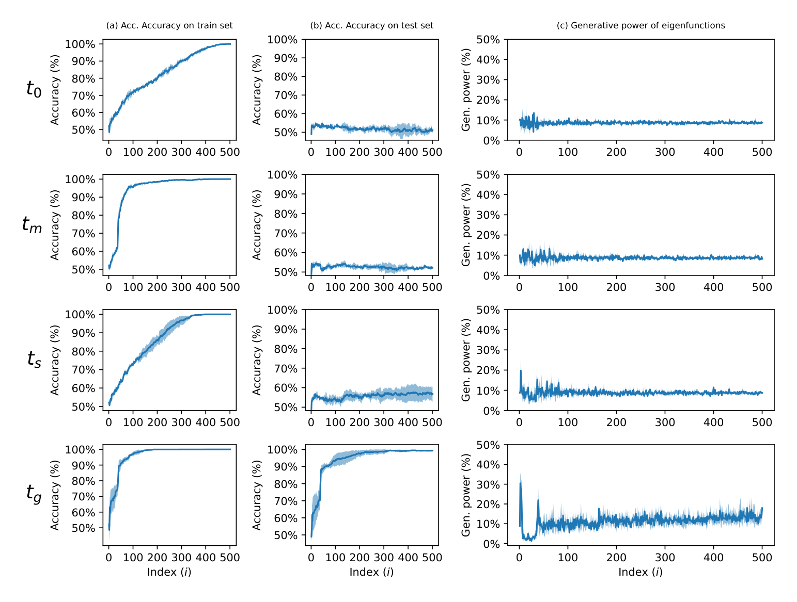
*Figure 3: Evolution of training and test accuracy and loss throughoutout training and of the NTK*

associated to that weights checkpoint following equation 4.

**[p. 6]**

FEATURE LEARNING DYNAMICS UNDER GROKKING IN A SPARSE PARITY TASK

To visualize the features encoded into these important eigenfunctions, we utilize saliency maps, defined as si(X) = 1

j=1 ∇xL(ˆϕi(xj), yj) ∈Rd [16, 19]. Saliency maps indicate the sensitivity of the loss to changes in each digit for each eigenfunction. By averaging them over all training samples, we obtain a more robust approximation, leveraging the consistent positioning of the clean digits in every sample of X.

Pn

n

We have also devised a metric (generative power, g) aimed at quantifying the generalizing power of an eigenfunction based on the proportion of its saliency map that concentrates on the clean digits:

P j = 1k [si(x)]j

gi =

Pd

j=1 [si(x)]j

where [si(x)]j is the j-th digit of si(x). Figure 3 (c) illustrates how the eigenfunctions exhibit an emerging structure as generalization occurs in the network. The first eigenfunctions focus on the clean digits, while the subsequent ones consistently focus on the noisy digits (generative power close to 0%). From the d-th eigenfunction onward, a small number of eigenfunctions again focus only on the clean digits. For a visualisation of the raw saliency maps, check Appendix C.2. This serves an explanation as why these eigenfunctions boost accuracy.

One last observation is that there appears to be a minimum number of eigenfunctions required for the network to generalize effectively. Figure 4 illustrates that the number of eigenfunctions needed for 99% accuracy on the training set decreases throughout training. As the network achieves good generalization performance, it converges to a minimum. This suggests a critical threshold in the number of eigenfunctions necessary for capturing the essential features of the dataset and facilitating successful generalization by the network.

tm ts tg Number of eigenfunctions needed for 99% accuracy for test set

Eigenfunctions

0 2000 4000 6000 8000 10000 Iterations

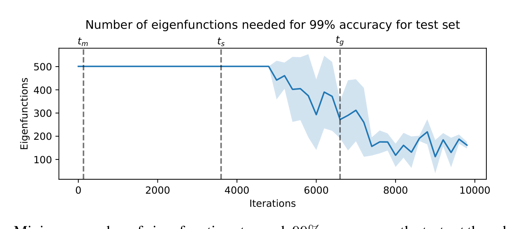
*Figure 4: Minimum number of eigenfunctions to reach 99% accuracy on the test set though training.*

The number seems to converge at some point of training (after tg). Note that this plot can be seen as summary of Figure 3 (b).

This approach offers an interpretation of the mechanism driving the change of the NTK by examining the evolution of its eigenfunctions throughout the training process. By tracking how these eigenfunctions change, we gain insights into the network’s feature learning dynamics.

**[p. 7]**

FEATURE LEARNING DYNAMICS UNDER GROKKING IN A SPARSE PARITY TASK

4. Conclusion

Our study sheds light on the mechanism underlying grokking in deep neural networks, in the context of sparse parity tasks. Our findings are consistent with Kumar et al. [9], where Grokking is attributed to the network’s transition from a lazy (close to its linearisation) to a feature learning regime. In this context, our analysis also unveil the emergence of structured eigenfunctions, indicating the acquisition of essential features crucial for generalization. Leveraging saliency maps and a devised metric (the generative power), we demonstrate how these eigenfunctions evolve, with early ones focusing on clean digits and later ones capturing noisy digits. Our findings provide insights into the progression of training dynamics and the encoding of task-relevant information.

Overall, our research compiles several techniques to analyze the NTK throughout training, proposing a mechanistic interpretability framework that can be used to understand the feature learning dynamics during training of Neural Network.

**[p. 8]**

FEATURE LEARNING DYNAMICS UNDER GROKKING IN A SPARSE PARITY TASK

References

[1] Devansh Arpit, Stanisław Jastrzundefinedbski, Nicolas Ballas, David Krueger, Emmanuel

Bengio, Maxinder S. Kanwal, Tegan Maharaj, Asja Fischer, Aaron Courville, Yoshua Bengio, and Simon Lacoste-Julien. A closer look at memorization in deep networks. In Proc. of the International Conf. on Machine Learning, 2017. URL https://dl.acm.org/doi/ 10.5555/3305381.3305406.

[2] Boaz Barak, Benjamin L. Edelman, Surbhi Goel, Sham M. Kakade, Eran Malach, and Cyril

Zhang. Hidden progress in deep learning: SGD learns parities near the computational limit. In Advances in Neural Information Processing Systems, 2022. URL https://openreview. net/forum?id=8XWP2ewX-im.

[3] Lenaic Chizat, Edouard Oyallon, and Francis Bach. On lazy training in differentiable pro-

gramming. In Advances in neural information processing systems, 2019. URL https: //dl.acm.org/doi/abs/10.5555/3454287.3454551.

[4] Jacob Devlin, Ming-Wei Chang, Kenton Lee, and Kristina Toutanova. Bert: Pre-training of deep bidirectional transformers for language understanding. In North American Chapter of the Association for Computational Linguistics, 2019. URL https://api. semanticscholar.org/CorpusID:52967399.

[5] Stanislav Fort, Gintare Karolina Dziugaite, Mansheej Paul, Sepideh Kharaghani, Daniel M Roy, and Surya Ganguli. Deep learning versus kernel learning: an empirical study of loss landscape geometry and the time evolution of the neural tangent kernel. In Advances in Neural Information Processing Systems, 2020. URL https://proceedings.neurips.cc/paper_files/paper/2020/file/ 405075699f065e43581f27d67bb68478-Paper.pdf.

[6] Wei Hu, Zhiyuan Li, and Dingli Yu. Simple and effective regularization methods for training

on noisily labeled data with generalization guarantee. In International Conf. on Learning Representations, 2020. URL https://openreview.net/forum?id=Hke3gyHYwH.

[7] Arthur Jacot, Franck Gabriel, and Cl´ement Hongler. Neural Tangent Kernel: convergence and

generalization in neural networks. In Advances in Neural Information Processing Systems, 2018. URL https://proceedings.neurips.cc/paper_files/paper/2018/ file/5a4be1fa34e62bb8a6ec6b91d2462f5a-Paper.pdf.

[8] Alex Krizhevsky, Ilya Sutskever, and Geoffrey E Hinton. Imagenet classification with deep

convolutional neural networks. In Advances in Neural Information Processing Systems, 2012. URL https://proceedings.neurips.cc/paper_files/paper/2012/ file/c399862d3b9d6b76c8436e924a68c45b-Paper.pdf.

[9] Tanishq Kumar, Blake Bordelon, Samuel J. Gershman, and Cengiz Pehlevan. Grokking as the

transition from lazy to rich training dynamics. In International Conf. on Learning Representations, 2024. URL https://openreview.net/forum?id=vt5mnLVIVo.

[10] Jaehoon Lee, Lechao Xiao, Samuel S Schoenholz, Yasaman Bahri, Roman Novak, Jascha

Sohl-Dickstein, and Jeffrey Pennington. Wide neural networks of any depth evolve as linear

**[p. 9]**

FEATURE LEARNING DYNAMICS UNDER GROKKING IN A SPARSE PARITY TASK

models under gradient descent. Journal of Statistical Mechanics: Theory and Experiment, 2020. URL http://dx.doi.org/10.1088/1742-5468/abc62b.

[11] Ziming Liu, Eric J Michaud, and Max Tegmark. Omnigrok: Grokking beyond algorithmic data. In International Conf. on Learning Representations, 2023. URL https:// openreview.net/forum?id=zDiHoIWa0q1.

[12] William Merrill, Nikolaos Tsilivis, and Aman Shukla. A tale of two circuits: Grokking as

competition of sparse and dense subnetworks, 2023. URL https://arxiv.org/abs/ 2303.11873.

[13] Jack William Miller, Charles O’Neill, and Thang D Bui. Grokking beyond neural networks:

An empirical exploration with model complexity. Transactions on Machine Learning Research, 2024. URL https://openreview.net/forum?id=ux9BrxPCl8.

[14] Shikhar Murty, Pratyusha Sharma, Jacob Andreas, and Christopher Manning. Grokking of

hierarchical structure in vanilla transformers. In Proc. of the Annual Meeting of the Association for Computational Linguistics, 2023. URL https://aclanthology.org/2023. acl-short.38.

[15] Neel Nanda, Lawrence Chan, Tom Lieberum, Jess Smith, and Jacob Steinhardt. Progress

measures for grokking via mechanistic interpretability. In International Conf. on Learning Representations, 2023. URL https://openreview.net/forum?id=9XFSbDPmdW.

[16] Yeat Jeng Ng, Ainhize Barrainkua, and Novi Quadrianto. Understanding and addressing spurious correlation via neural tangent kernels: A spectral bias perspective, 2024. URL https://openreview.net/forum?id=89AOrk05uy.

[17] Adam Pearce, Asma Ghandeharioun, Nada Hussein, Nithum Thain, Martin Wattenberg, and

Lucas Dixon. Do machine learning models memorize or generalize. People+ AI Research, 2023. URL https://pair.withgoogle.com/explorables/grokking/.

[18] Alethea Power, Yuri Burda, Harri Edwards, Igor Babuschkin, and Vedant Misra. Grokking:

Generalization beyond overfitting on small algorithmic datasets, 2022. URL https:// arxiv.org/abs/2201.02177.

[19] Karen Simonyan, Andrea Vedaldi, and Andrew Zisserman. Deep inside convolutional net-

works: Visualising image classification models and saliency maps. Computing Research Repository (CoRR), abs/1312.6034, 2013. URL https://api.semanticscholar. org/CorpusID:1450294.

[20] Dashiell Stander, Qinan Yu, Honglu Fan, and Stella Biderman. Grokking group multiplication

with cosets. In Proc. of the International Conf. on Machine Learning, 2024. URL https: //openreview.net/pdf?id=hcQfTsVnBo.

[21] Nikolaos Tsilivis and Julia Kempe. What can the neural tangent kernel tell us about adversarial

robustness? In Alice H. Oh, Alekh Agarwal, Danielle Belgrave, and Kyunghyun Cho, editors, Advances in Neural Information Processing Systems, 2022. URL https://openreview. net/forum?id=KBUgVv8z7OA.

**[p. 10]**

FEATURE LEARNING DYNAMICS UNDER GROKKING IN A SPARSE PARITY TASK

[22] Zhiwei Xu, Yutong Wang, Spencer Frei, Gal Vardi, and Wei Hu. Benign overfitting and grokking in ReLU networks for XOR cluster data. In International Conf. on Learning Representations, 2024. URL https://openreview.net/pdf?id=BxHgpC6FNv.

[23] Chiyuan Zhang, Samy Bengio, Moritz Hardt, Benjamin Recht, and Oriol Vinyals. Understand-

ing deep learning (still) requires rethinking generalization. Commun. ACM, 64(3):107–115, feb 2021. URL https://doi.org/10.1145/3446776.

**[p. 11]**

FEATURE LEARNING DYNAMICS UNDER GROKKING IN A SPARSE PARITY TASK

Appendix A. Definitions and extension of mathematical derivations

This appendix extends the definitions and elaborates on the mathematical derivations used in the main text. We first introduce the dataset and model that we use. Later derive its Neural Tangent Kernel (NTK) equations.

A.1. Dataset

In a sparse parity task, the goal is to calculate the parity of k digits within a d-bit number, where k ≤d. It has been demonstrated that gradient-based methods do not perform well on learning parities. Most works take the approach of making favorable assumptions on the input distribution. Nevertheless, we intentionally follow the paper on the example of [2] to not simplify the problem. Let us introduce first the term (d, S)-parity function to later define the dataset we use throughout the experiments.

Definition 1 (d, S)-parity function

For an natural number d and for a subset 1 S ⊆[d], let fS(x) be the (d, S)-parity function, fS : {0, 1}d →{0, 1} that takes a d-digit binary number x and checks if the number of ones in the index of the digits of S is odd. That is,

X

!

xi

fS(x) =

mod 2 (7)

i∈S

where xi is the i-th digit of x.

Without loss of generality, in this work, we study the parity in the firsts k digits of the problem. Therefore, S = {1, 2, . . . , k} (k ∈N, k ≤d). We can then define the (d, k)-parity function fk : {0, 1}d →{0, 1} as:

k X

!

xi

fk(x) =

mod 2 (8)

i=1

Definition 2 Sparse parity Dataset

Let a Sparse parity Dataset D(d,k) = {(xi, yi)B} of n training samples and ntest test samples (B = n + ntest) be a dataset where xi is drawn from Unif({0, 1}d) and yi = fk(xi). We denote X = [x1, . . . , xn] ∈Rn×d as the matrix of all training data and Y = [y1, . . . , yn] ∈Rd the vector of all training labels. X is any subset of test data (including the full test data).

1. We consider [d] to be the superset of sets of less or equal than d elements containing some natural numbers from 1 to d without repetition.

**[p. 12]**

FEATURE LEARNING DYNAMICS UNDER GROKKING IN A SPARSE PARITY TASK

A.2. Model

To solve the task we train a Neural Network (NN), we consider a L-layer MLP with the form fθ(x) : Rd →R that can be define recursively by:

fθ(x) = z(L) = 1 √mL

θ(L)x(L−1)

z(l) = 1 √ml

θ(l)x(l−1) −−→x(l) = σ



z(l)

where θ = {θ(l), ∀l = 1, . . . , n} are the trainable weights. θ(l) = [θ(l)

1 , . . . , θ(l) ml] ∈Rml×ml−1

for l = 1, . . . , L−1 are the weights of the hidden layers and θ(L) = [θ(L)

1 , . . . , θ(L)

mL] ∈RmL are the weights of the classification layer, all initialized as θ(l)

ij ∼N(0, σinit). σ(x) is the ReLU function. We assume that ml = m, ∀l and we can consider m0 = d.

The network is trained using full-batch gradient descent. With a slight abuse of notation (θt′ = θ

t=t′ and ft′ its corresponding function), the weight update rule in each iteration is2

θt+1 ←θt −η∇θtL(X, Y; θt) (9)

where L(x, y; θ) is the empirical loss, defined as

m X

L(θ) = L(x, y; θ) = 1

l(fθ(xi), yi) + λ1∥θ∥1 + λ2∥θ∥2 (10)

m

i=1

A.3. Neural Tangent Kernel

From a theoretical point of view, if instead of having discrete updates of the parameters like in equation 9, we consider a continuous update, the evolution of the weights of the NN can be described using the gradient flow differential equation.

∂θt

∂t = −η∇θL(θ)

θ=θt

(11)

T



= −η

∇θfθ(X)

∇ft(X)L(θ)

θ=θt

Then,

∂ft(X)

∂θt

∂t = ∇θfθ(X)

∂t

θ=θt

T



(12)

= −η∇θfθ(X)

∇θfθ(X)

∇ft(X)L(θ)

θ=θt

θ=θt

= −η ˆΘt(X, X)∇ft(X)L(θ)

2. We have experimented with slight variations of the optimizer update rule, including a momentum term and using the Adam optimizer. However, we have chosen not to include the specific formulas here, as they are not essential to our main objectives.

**[p. 13]**

FEATURE LEARNING DYNAMICS UNDER GROKKING IN A SPARSE PARITY TASK

where ˆΘt is the empirical Neural Tangent Kernel

Definition 3 Empirical Neural Tangent Kernel of the training data (e-NTK) The e-NTK ( ˆΘt ∈ Rn×n) is the inner product of the gradients evaluated at x1 and x2, where the network is fixed at θ = θt

T



ˆΘt(x1, x2) := ∇θfθ(x1)

∇θfθ(x2)

θ=θt

θ=θt

Equation 12 is difficult to solve, as ˆΘt depends on t. Nevertheless, there is two approximations that simplify the calculations. In this work, we focus on considering a linearised version of the network but equation 12 can be also solved considering the network to be infinitely wide (m →∞).

A.3.1. LINEARISED NETWORK

Let us consider the first-order Taylor approximation of the predictive function of the Neural Network:

flin

t (x) := f0(x) + ∇θf0(x)

θ=θ0∆t

where ∆t := θt −θ0. Then, equations 11 and 12 get simplified to:

∂∆t

∂t = −η∇θf0(X)∇flin

t (X)L(θ) (13)

∂flin

t (X) ∂t = −η ˆΘ0(X, X)∇flin

t (X)L(θ) (14)

As ∇θf0(x) (and therefore ˆΘ0) is constant through training, using the MSE loss, the ODE has a closed-form solution:

t (X) = (I −e−µ ˆΘ0t)Y + e−µ ˆΘ0tf0(X) (15)

flin

considering ˆΘ0 = ˆΘ0(X, X). For an arbitrary test point x, doing the same theoretical elaboration, flin

t (x) = µt(x) + γt(x), where

0 (I −e−µ ˆΘ0t)Y (16)

µt(x) = ˆΘ0(x, X) ˆΘ−1

0 (I −e−µ ˆΘ0t)f0(X) (17)

γt(x) = f0(x) −ˆΘ0(x, X) ˆΘ−1

Note that then, the evolution of the neural network through training has also closed-form solution and in the end of training (t →∞) the predictive function is

∞(x) = ˆΘ0(x, X) ˆΘ−1

flin

0 (Y −f0(X)) + f0(x) (18)

From here, similar to Hu et al. [6], we will consider the case when we initialise the parameters of the network so f0(x) ≈0 (σinit is small). Therefore:

**[p. 14]**

FEATURE LEARNING DYNAMICS UNDER GROKKING IN A SPARSE PARITY TASK

0 (I −e−µ ˆΘ0t)Y (19)

t (x) = µt(x) = ˆΘ0(x, X) ˆΘ−1

flin

∞(x) = ˆΘ0(x, X) ˆΘ−1

flin

## 0 Y (20)

Note that this equations have the form of a Kernel Learning algorithm with the transformation of the inputs given by the Neural Tangent Kernel. Therefore, a linearised Neural Network has no feature learning involved in model. Consequently, this is a useful tool for theoretically studying NN training dynamics but also takes away much of the power of NN.

**[p. 15]**

FEATURE LEARNING DYNAMICS UNDER GROKKING IN A SPARSE PARITY TASK

Appendix B. Experiment details

In this section, we outline the details of the experiments for reproducibility of the results. Grokking appears consistently for a sparse parity task, the choice of training hyperparameters was based on a purely time basis, so grokking would appear soon during training.

We use a sparse parity dataset D(d,k) = {(xi, yi)B} with 500 training samples and 500 test samples. xi is chosen so samples are not repeated in any of the B = 1000 samples: xi̸ = xj ∀i̸ = j. k = 3 is fixed and d = 10 is variable. In the main text, only results using k = 3 and d = 30 are shown but other results can be checked in D .

The network used to solve the task has depth L = 2 and width m = 64. No bias term is used in neither of the layers. The weights are initialized following a normal distribution with σinit = 1 (θ(l)

ij ∼N(0, 1)).

The optimizer used was full-batch Adam with learning rate µ = 0.03 and (β1, β2) = (0.9, 0.999) over a binary cross-entropy loss with a l1-regularisation term over the weights of λ1 = 10−3.

**[p. 16]**

FEATURE LEARNING DYNAMICS UNDER GROKKING IN A SPARSE PARITY TASK

Appendix C. Complementary results

This section offers complementary results to the ones shown in the main text for a (3, 35)−sparse parity dataset with the experiment setup described in B.

C.1. Emergence of the structure in the weights of the network

Weights of hidden layer in t0

Weights of hidden layer in tm

0 5 10 15 20 25 30

0 5 10 15 20 25 30

Weights of hidden layer in ts

Weights of hidden layer in tg

7.5

5.0

2.5

0.0

2.5

5.0

7.5

10.0

0 5 10 15 20 25 30

0 5 10 15 20 25 30

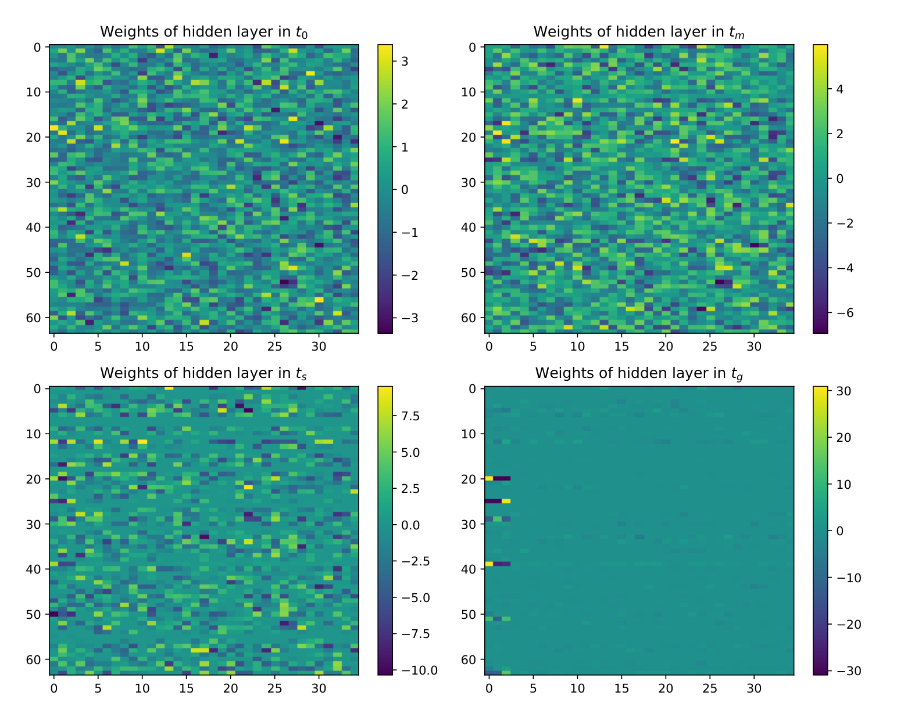
*Figure 5: Evolution of the weights of the first layer of a 2-layer MLP. Each image represents*

W (1) ∈Rm×d for different time steps of training. The weights progressively focus on the first three digits (clean digits).

As it can be seen, generalisation happens because the networks starts focusing on the clean digits. Nevertheless, during the memorisation period (t = [tm, ts]) this structure does not seem to arise. It is noteworthy that the scale of the weights increases from t0 to tm. This increase in scale contributes to the rise in the loss function during the memorization phase. Moreover, the logits of the function also scale up due to this weight scaling.

**[p. 17]**

FEATURE LEARNING DYNAMICS UNDER GROKKING IN A SPARSE PARITY TASK

C.2. Visualization of generative power

In this section, we show the saliency maps used to calculate the generative power metric.

1.0

0.8

0.6

t0

Digit

0.4

0.2

0.0

0 5 10 15 20 25 30 Index (i)

1.0

0.8

0.6

tm

Digit

0.4

0.2

0.0

0 5 10 15 20 25 30 Index (i)

1.0

0.8

0.6

ts

Digit

0.4

0.2

0.0

0 5 10 15 20 25 30 Index (i)

1.0

0.8

0.6

tg

Digit

0.4

0.2

0.0

0 5 10 15 20 25 30 Index (i)

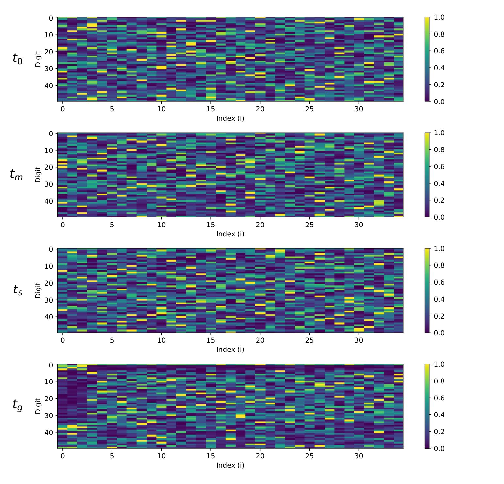
*Figure 6: Normalized saliency map of the first 50 eigenfunctions with respect to the loss function*

j=1 ∇xL(ˆϕi(xj), yj). Rows indicate the index of the eigenfunction (i). Highest value of each row is mapped to 1 and lowest to 0, the rest are interpolated.

Pn

si(X) = 1

n

As it can be also devised with the generative power metric (see Figure 3), the first eigenfunctions concetrate their saliency map only in the first 3 digits (clean digits) as training progresses. The following 32 eigenfunctions focus only on the noisy digits. And around the 35 eigenfunction, they focus again only on the clean digits.

**[p. 18]**

FEATURE LEARNING DYNAMICS UNDER GROKKING IN A SPARSE PARITY TASK

Appendix D. Results for other choices of d

D.1. 3 clean digits and 30 noisy

Kernel Distance

tg

tm ts tg

tm tm

ts

100%

Accuracy (%)

train test

0.20

Loss

75%

train test

ts

0.15

50%

0 2k 4k 6k 8k 10k 0

Iterations

0 2k 4k 6k 8k 10k

(a)

(b)

0.10

NTK Accuracy (%)

0.8

100%

train test

NTK Loss

tg

0.05

75%

train test

0.6

50%

0.00

0 2k 4k 6k 8k 10k Iterations

0 2k 4k 6k 8k 10k Iterations

0 2000 4000 6000 8000 9800 Iterations

(c)

(d)

(e)

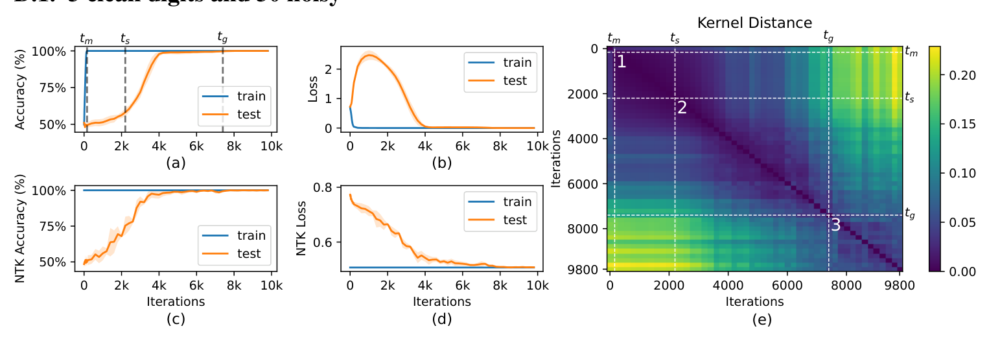
*Figure 7: Training metrics and NTK evolution through training for a (3, 30)-sparse parity dataset.*

The rest of the experimental set-up is identical to what was described in B.

(a) Acc. Accuracy on train set

(b) Acc. Accuracy on test set

(c) Generative power of eigenfunctions

100%

50%

100%

Gen. power (%)

90%

40%

90%

Accuracy (%)

Accuracy (%)

80%

80%

30%

t0

70%

70%

20%

60%

60%

10%

50%

50%

0 100 200 300 400 500 0%

0 100 200 300 400 500

0 100 200 300 400 500

100%

50%

100%

Gen. power (%)

90%

40%

90%

Accuracy (%)

Accuracy (%)

80%

80%

30%

tm

70%

70%

20%

60%

60%

10%

50%

50%

0 100 200 300 400 500 0%

0 100 200 300 400 500

0 100 200 300 400 500

100%

50%

100%

Gen. power (%)

90%

40%

90%

Accuracy (%)

Accuracy (%)

80%

80%

30%

ts

70%

70%

20%

60%

60%

10%

50%

50%

0 100 200 300 400 500 0%

0 100 200 300 400 500

0 100 200 300 400 500

50%

50% 60% 70% 80% 90% 100%

50% 60% 70% 80% 90% 100%

Gen. power (%)

40%

Accuracy (%)

Accuracy (%)

30%

tg

20%

10%

0%

0 100 200 300 400 500 Index (i)

0 100 200 300 400 500 Index (i)

0 100 200 300 400 500 Index (i)

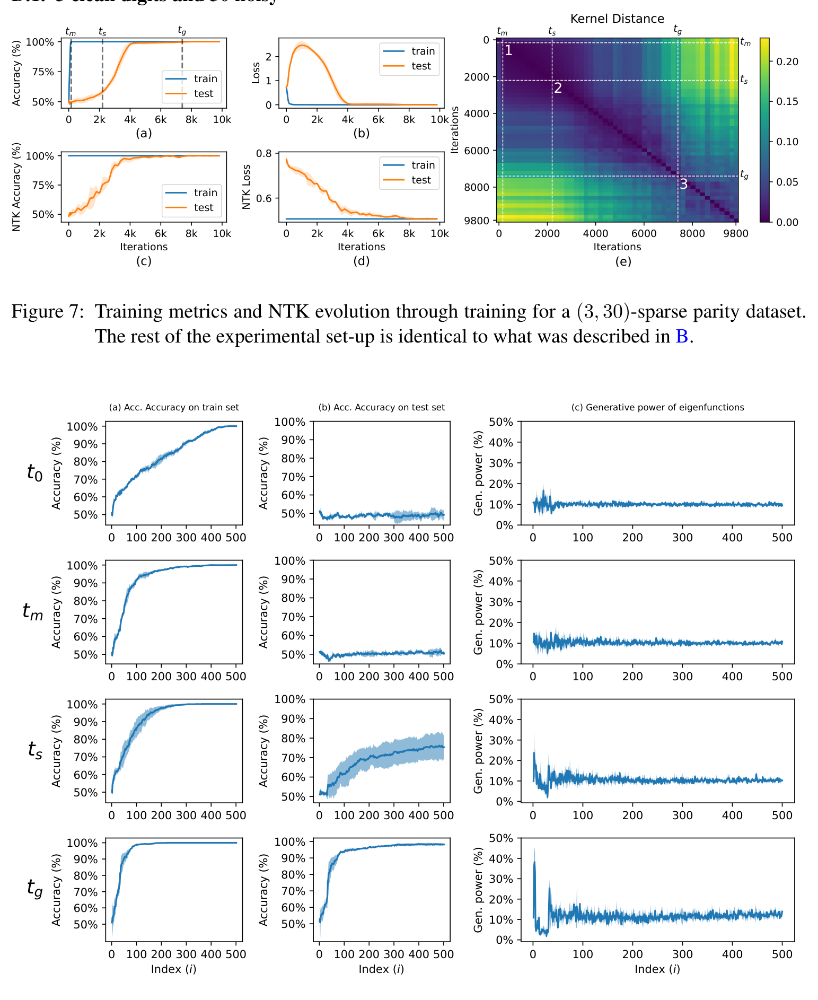
*Figure 8: Accumulative accuracy and generative power of each eigenfunction for a (3, 30)-sparse*

parity dataset. The rest of the experimental set-up is identical to what was described in B.

**[p. 19]**

FEATURE LEARNING DYNAMICS UNDER GROKKING IN A SPARSE PARITY TASK

1.0

0.8

0.6

t0

Digit

0.4

0.2

0.0

0 5 10 15 20 25 Index (i)

1.0

0.8

0.6

tm

Digit

0.4

0.2

0.0

0 5 10 15 20 25 Index (i)

1.0

0.8

0.6

ts

Digit

0.4

0.2

0.0

0 5 10 15 20 25 Index (i)

1.0

0.8

0.6

tg

Digit

0.4

0.2

0.0

0 5 10 15 20 25 Index (i)

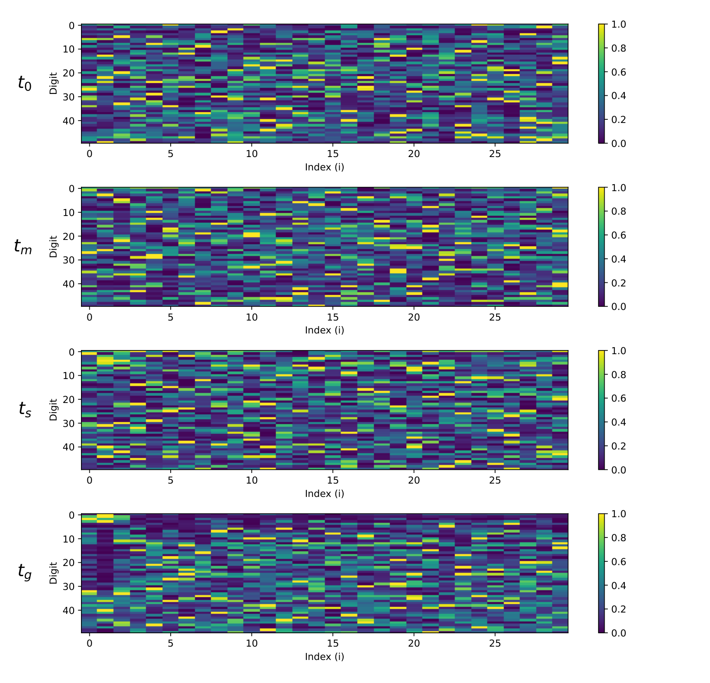
*Figure 9: Accumulative accuracy and generative power for each for a (3, 30)-sparse parity dataset.*

The rest of the set-up is identical to what was described in B.

**[p. 20]**

FEATURE LEARNING DYNAMICS UNDER GROKKING IN A SPARSE PARITY TASK

Weights of hidden layer in t0

Weights of hidden layer in tm

0 5 10 15 20 25

0 5 10 15 20 25

Weights of hidden layer in ts

Weights of hidden layer in tg

0 5 10 15 20 25

0 5 10 15 20 25

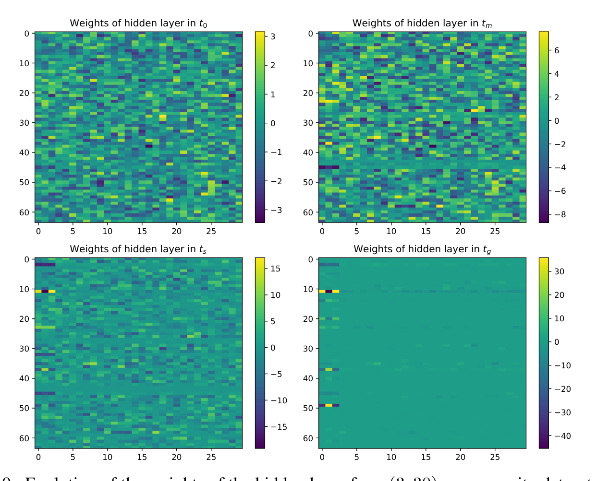
*Figure 10: Evolution of the weights of the hidden layer for a (3, 30)-sparse parity dataset. The rest*

of the set-up is identical to what was described in B.

tm ts tg Number of eigenfunctions needed for 99% accuracy for test set

Eigenfunctions

0 2000 4000 6000 8000 10000 Iterations

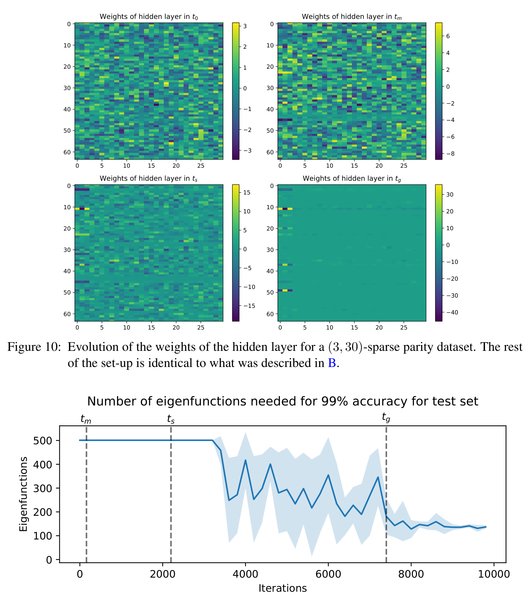
*Figure 11: Eigenfunctions needed to reach 99% accuracy through training for a (3, 30)-sparse par-*

ity dataset. The rest of the set-up is identical to what was described in B.

D.2. 3 clean digits and 40 noisy

**[p. 21]**

FEATURE LEARNING DYNAMICS UNDER GROKKING IN A SPARSE PARITY TASK

Kernel Distance

tg

tm ts tg

tm tm

ts

100%

0.200

Accuracy (%)

train test

0.175

Loss

75%

train test

0.150

ts

50%

0 2k 4k 6k 8k 10k 0

0.125

Iterations

0 2k 4k 6k 8k 10k

(a)

(b)

0.100

NTK Accuracy (%)

100%

0.075

train test

train test

0.7

NTK Loss

0.050

tg

75%

0.6

0.025

50%

0.5

0.000

0 2k 4k 6k 8k 10k Iterations

0 2k 4k 6k 8k 10k Iterations

0 2000 4000 6000 8000 9800 Iterations

(c)

(d)

(e)

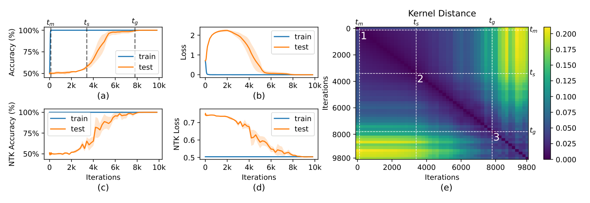
*Figure 12: Training metrics and NTK evolution through training for a (3, 40)-sparse parity dataset.*

The rest of the experimental set-up is identical to what was described in B.

(a) Acc. Accuracy on train set

(b) Acc. Accuracy on test set

(c) Generative power of eigenfunctions

100%

50%

100%

Gen. power (%)

90%

40%

90%

Accuracy (%)

Accuracy (%)

80%

80%

30%

t0

70%

70%

20%

60%

60%

10%

50%

50%

0 100 200 300 400 500 0%

0 100 200 300 400 500

0 100 200 300 400 500

100%

50%

100%

Gen. power (%)

90%

40%

90%

Accuracy (%)

Accuracy (%)

80%

80%

30%

tm

70%

70%

20%

60%

60%

10%

50%

50%

0 100 200 300 400 500 0%

0 100 200 300 400 500

0 100 200 300 400 500

100%

50%

100%

Gen. power (%)

90%

40%

90%

Accuracy (%)

Accuracy (%)

80%

80%

30%

ts

70%

70%

20%

60%

60%

10%

50%

50%

0 100 200 300 400 500 0%

0 100 200 300 400 500

0 100 200 300 400 500

50%

50% 60% 70% 80% 90% 100%

100%

Gen. power (%)

40%

90%

Accuracy (%)

Accuracy (%)

80%

30%

tg

70%

20%

60%

10%

50%

0%

0 100 200 300 400 500 Index (i)

0 100 200 300 400 500 Index (i)

0 100 200 300 400 500 Index (i)

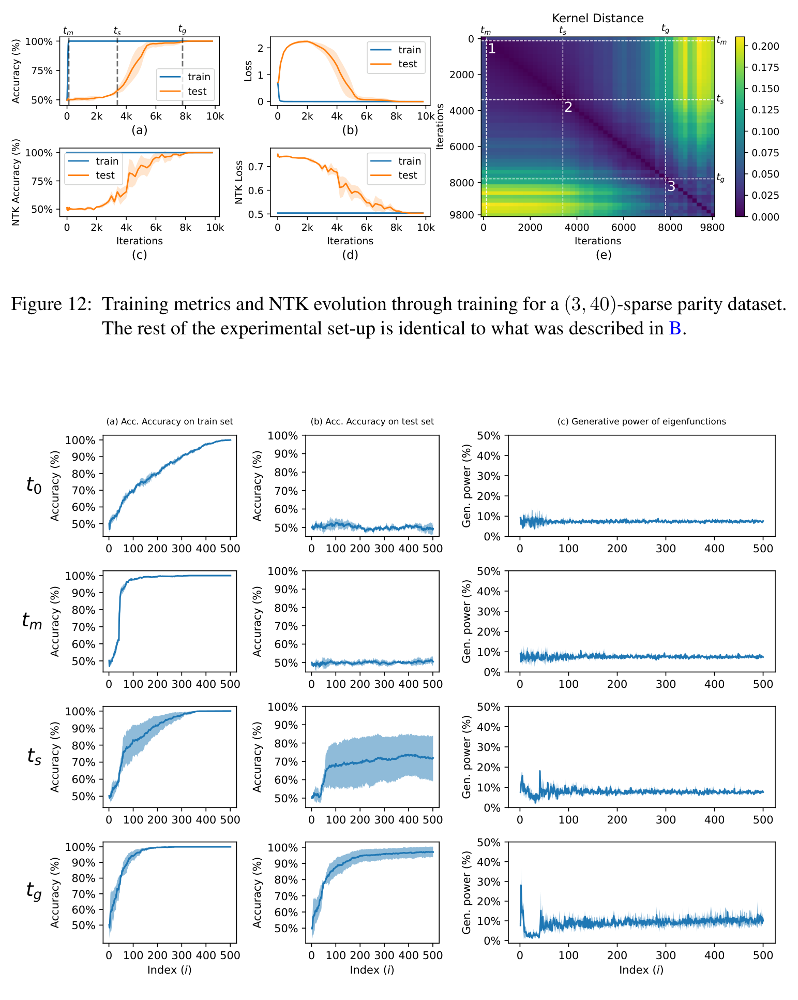
*Figure 13: Accumulative accuracy and generative power of each eigenfunction for a (3, 40)-sparse*

parity dataset. The rest of the experimental set-up is identical to what was described in B.

**[p. 22]**

FEATURE LEARNING DYNAMICS UNDER GROKKING IN A SPARSE PARITY TASK

1.0

0.8

0.6

t0

Digit

0.4

0.2

0.0

0 5 10 15 20 25 30 35 Index (i)

1.0

0.8

0.6

tm

Digit

0.4

0.2

0.0

0 5 10 15 20 25 30 35 Index (i)

1.0

0.8

0.6

ts

Digit

0.4

0.2

0.0

0 5 10 15 20 25 30 35 Index (i)

1.0

0.8

0.6

tg

Digit

0.4

0.2

0.0

0 5 10 15 20 25 30 35 Index (i)

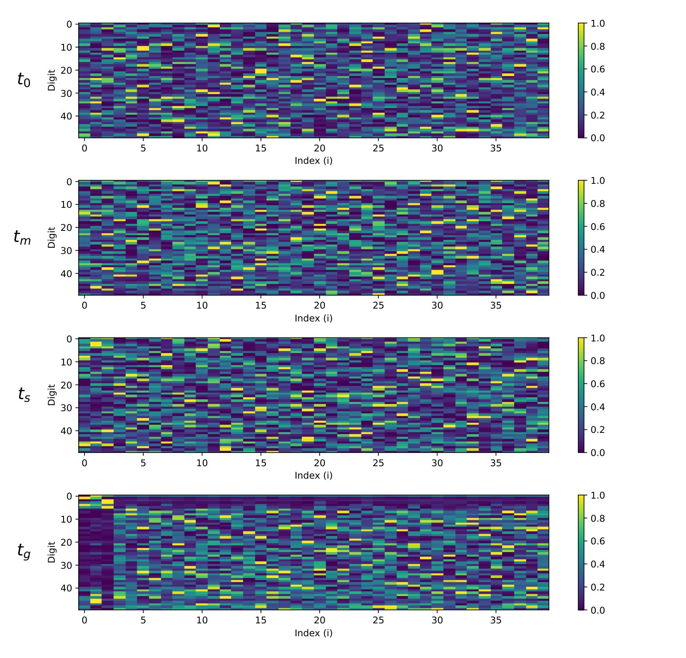
*Figure 14: Accumulative accuracy and generative power for each for a (3, 40)-sparse parity dataset.*

The rest of the set-up is identical to what was described in B.

**[p. 23]**

FEATURE LEARNING DYNAMICS UNDER GROKKING IN A SPARSE PARITY TASK

Weights of hidden layer in t0

Weights of hidden layer in tm

0 5 10 15 20 25 30 35

0 5 10 15 20 25 30 35

Weights of hidden layer in ts

Weights of hidden layer in tg

0 5 10 15 20 25 30 35

0 5 10 15 20 25 30 35

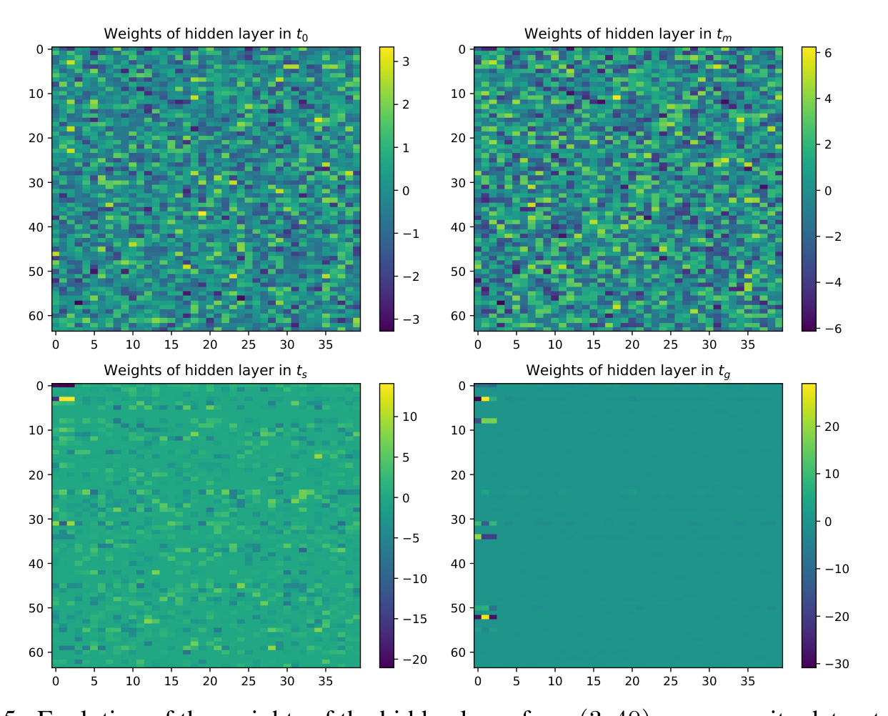
*Figure 15: Evolution of the weights of the hidden layer for a (3, 40)-sparse parity dataset. The rest*

of the set-up is identical to what was described in B.

tm ts tg Number of eigenfunctions needed for 99% accuracy for test set

Eigenfunctions

0 2000 4000 6000 8000 10000 Iterations

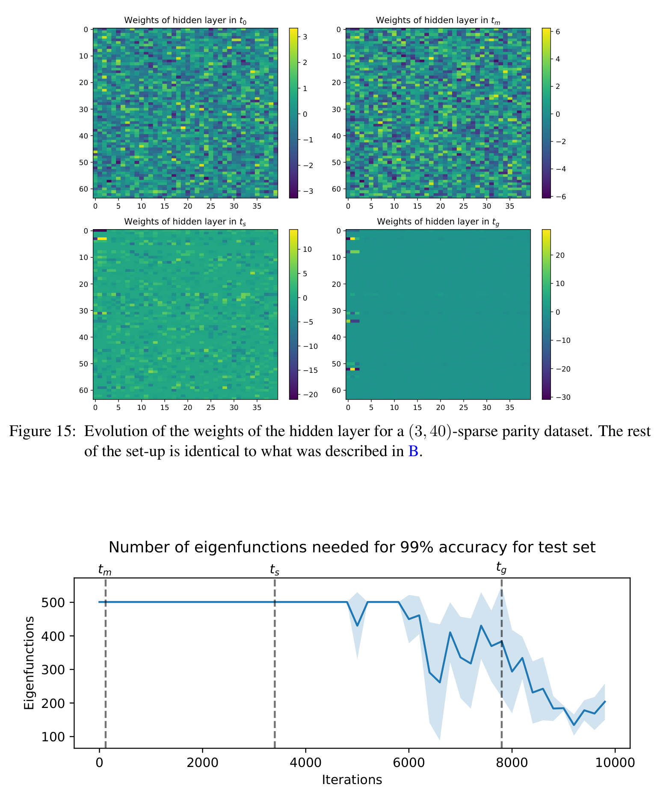
*Figure 16: Eigenfunctions needed to reach 99% accuracy through training for a (3, 40)-sparse par-*

ity dataset. The rest of the set-up is identical to what was described in B.

