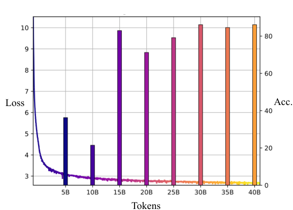
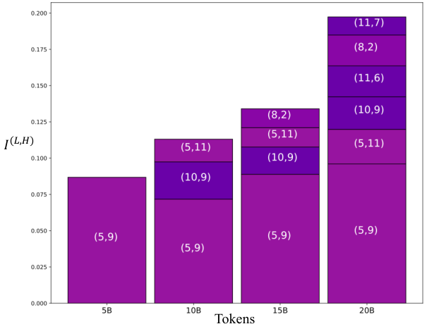

# Lv et al. 2024 — Language Models “Grok” to Copy

See also: [the global concept index](../../concepts/index.md). arXiv [2409.09281v2](https://arxiv.org/abs/2409.09281), 6 February 2025 (v1 — 14 September 2024). The PDF has no running head naming a venue; the arXiv note says "NAACL 2025 main conference, short paper".

**Ang Lv** — Gaoling School of Artificial Intelligence, Renmin University of China; Machine Learning Platform Department, Tencent. **Ruobing Xie, Xingwu Sun, Zhanhui Kang** — Machine Learning Platform Department, Tencent. **Rui Yan** — Gaoling School of Artificial Intelligence, Renmin University of China; School of Computer Science, Wuhan University. Correspondence: Ruobing Xie (ruobingxie@tencent.com), Rui Yan (ruiyan@ruc.edu.cn).

The files of this paper's analysis:

- [`2409.09281.language-models-grok-to-copy.license.txt`](2409.09281.language-models-grok-to-copy.license.txt) — the arXiv licence record for this paper.

The anchor scheme and the rules for linking into a card are in the [README of the papers folder](../README.md).

**Excerpt card.** The paper's licence (`arxiv-nonexclusive`) does not permit republishing the paper itself; what stands here are the editorial sections and the fragments the corpus quotes (right of quotation). The paper: <https://arxiv.org/abs/2409.09281>.

## Concepts covered

**[Grokking](../../concepts/grokking.md)** — the work carries the name of the phenomenon over from small algorithmic tasks to the pretraining of a language model of natural scale and declares this a new view: "language models grok to copy". The carry-over is made on a single feature — a delayed sharp rise of performance: the training loss reaches a shelf after 5 billion tokens, the copying accuracy stays low until 10 billion and rises in a burst at 15 billion ([p. 3, para. 1](#p3-1), [fig. 2](#fig-2)). The authors give the definition of grokking after Power et al. 2022 — "a sharp improvement of generalisation on the validation set long after the models have overfitted" ([p. 1, para. 4](#p1-4)). It matters what the work does not contain: exactly one of the features enumerated in that definition is preserved from the setting of Power et al. The evaluation task — completing a suffix from a prefix within a concatenation of 50 sequences of random tokens ([p. 2, para. 7](#p2-7), [fig. 1](#fig-1)) — is not a held-out part of the training distribution (the natural text of RedPajama); the training is a single pass over 40 billion tokens with no repeated epochs; a 162-million-parameter model has nothing to memorise at that volume; and the word "memorization" does not appear in the paper at all. The work neither proposes nor checks any mechanism of grokking: its three arguments are checks of consistency with the features of the phenomenon, and no experiment capable of refuting the analogy is set up.

**[The memorisation phase / the plateau](../../concepts/memorization-phase.md)** — the work is notable in that this link is absent from it, although it does quote the definition of grokking together with it. The word "overfit" occurs in the text exactly once, inside the definition ([p. 1, para. 4](#p1-4)); neither "memorization" nor a gap between the training and validation curves appears in the paper. The role of "100 % on training" is given to the shelf of the training loss ([p. 3, para. 1](#p3-1)), and in the discussion section the authors themselves admit that the training loss "does not fully capture the saturation of performance observed in traditional grokking tasks" ([p. 5, para. 5](#p5-5)) and replace it with the saturation of the ICL score ([p. 5, para. 6](#p5-6)). The authors cannot be credited with observing a memorisation phase before generalisation: they neither show it nor rely on it.

**[Emergence / emergent abilities](../../concepts/emergence.md)** — the work gives the corpus a case in which the ability of a genuine language model appears in a jump over the course of pretraining rather than at the crossing of a scale threshold: the axis of the transition here is the number of update steps and of tokens passed, at an unchanging 162 million parameters. The caution of the formulation is the authors' own: "grokked in-context copying does not set in until the optimisation reaches a certain strength" ([p. 3, para. 4](#p3-4)) — this is the only use of the verb "emerge" in the whole paper. The words "emergent" and "emergence" do not appear in it, it measures no scaling thresholds, and on its own grounds it cannot be assigned to the literature on emergent abilities under scaling.

**[Attention routing](../../concepts/attention-routing-heads.md)** — the paper's third argument is built entirely on induction heads: they are named the chief circuit of conditional copying ([p. 3, para. 5](#p3-5)), and an induction score is introduced for them, $I^{(L,H)}=\bar{A}^{(L,H)}\cdot EP^{(L,H)}$ — the product of the mean attention weight from position $s+i-1$ to position $i$ on a doubled random sequence with the positivity of the eigenvalues of the OV circuit ([p. 4, para. 1](#p4-1), [p. 4, para. 2](#p4-2), [p. 4, para. 3](#p4-3)). The observation the work gives the corpus: over the course of the training induction heads form from shallower layers towards deeper ones ([p. 4, para. 4](#p4-4), [fig. 6](#fig-6)). What the work does not contain: neither an ablation nor any other check that it is precisely these heads that perform the copying measured — the relation is established by a coincidence in time; the very order "shallow before deep" is partly set by the structure of an induction head, which works only on top of a previous-token head in a shallower layer, and the authors do not make this caveat; and figure 6 is obtained on a single model ([fig. 6](#fig-6)), whereas all the accuracies are averaged over three seeds ([p. 2, para. 8](#p2-8)).

**[Mechanistic interpretability](../../concepts/mechanistic-interpretability.md)** — the work acts as a consumer of a ready-made measurement kit rather than as its developer: the induction attention pattern and the positivity of the eigenvalues of the OV circuit $EP^{(L,H)}=\sum_{i}\lambda_{i}/\sum_{i}|\lambda_{i}|$ are taken from Elhage et al. 2021, and the decomposition of in-context learning into copying and fuzzy pattern completion from Olsson et al. 2022 ([p. 5, para. 3](#p5-3)). Its own contribution here is single and methodological: two known scores are multiplied into one scalar with values in $[-1,1]$, convenient for colouring the dynamics layer by layer ([p. 4, para. 1](#p4-1)). There is no reverse engineering of a circuit, no intervention and no causal check in the work.

**[Progress measures](../../concepts/progress-measures.md)** — the work poses the question of the readings by which the course of training is judged and answers it in the negative: the development of abilities such as in-context copying "is not necessarily reflected in a decrease of the pretraining loss" ([p. 2, para. 3](#p2-3)), and the training loss "does not fully capture the saturation of performance" ([p. 5, para. 5](#p5-5)). What is offered instead is not a measure of its own but the ICL score of Olsson et al. 2022, which reaches a shelf of −0.5 nats at around 4000 steps, that is, about 1.85 billion tokens ([p. 5, para. 6](#p5-6)). The work introduces no progress measure of its own and does not use the term; the score offered is itself a measure of in-context performance rather than of memorisation, and so it works poorly as a substitute for the condition "the model has already fitted".

**[The data fraction / the critical dataset size](../../concepts/data-fraction-critical-dataset-size.md)** — the work separates two quantities that in pretraining are usually merged: the number of tokens passed and the number of update steps. At three batch sizes (32, 64, 128) and the same initial weights, the foundation of copying forms at around 38 000 steps regardless of how many tokens have been passed in the meantime ([p. 3, para. 2](#p3-2), [fig. 3](#fig-3)), whereas the convergence of the training loss depends precisely on the number of tokens ([p. 3, para. 3](#p3-3), [fig. 4](#fig-4)). The reverse check is apt here: the two quantities are separated in more than words. The claim that the speed of grokking is independent of the volume of data the work takes ready-made from Wang et al. 2024 ([p. 2, para. 2](#p2-2)) — but in Wang et al. the independence is shown at a fixed ratio of inferred to atomic facts, and in Lv et al. there is no analogue of that ratio at all, so the condition "provided the distribution is preserved" is lost in the carry-over. The work neither measures nor introduces a critical dataset size: the volume of data here is not a control parameter but a consequence of the choice of batch.

**[The learning rate](../../concepts/learning-rate.md)** — the sole lever besides regularisation by which the work moves the time of the transition: "an increased learning rate promotes an earlier and stronger grokking" ([p. 3, para. 4](#p3-4), [fig. 5](#fig-5)). Whence the authors' guess that grokked copying sets in at a certain "optimisation strength" set by the learning rate and the number of steps ([p. 3, para. 4](#p3-4)); the guess is declared a conjecture ("we hypothesise") and is not supported by any experiment separating it from other explanations. The reckoning meanwhile starts from a base learning rate of 0.1 under AdamW ([p. 2, para. 6](#p2-6)) — a value two or three orders of magnitude above what is customary for pretraining; there is no discussion of this choice in the paper, and figure 5 itself is labelled with three quite different values: 1e-4, 2e-4 and 4e-4 ([fig. 5](#fig-5)). The number 0.1 therefore cannot be used as a hyperparameter of this work.

**[Varieties of regularisation](../../concepts/regularization-variants.md)** — the work's applied section consists in exactly this: carrying over into the pretraining of a language model the two techniques by which grokking is induced on small tasks in the corpus — a 10 % attention dropout and weight decay, chosen with a reference to Nanda et al. 2023 ([p. 5, para. 1](#p5-1)). The observation: dropout moves the sharp rise of accuracy forward from 15 billion tokens to 10 billion, "albeit with an increased variability in the course of the development" ([fig. 7](#fig-7)). This is the only check of the paper's chief applied claim — that findings about grokking carry over into pretraining cheaply ([p. 2, para. 5](#p2-5)): two techniques, one parameter value each, with no matching of compute and with no number of seeds stated. Grokfast, a direct technique for accelerating grokking, is named in the list of works ([p. 5, para. 8](#p5-8)) but is not tried.

**[Weight decay](../../concepts/weight-decay.md)** — used at the single value $\lambda=0.1$ as one of the two accelerating techniques ([p. 5, para. 1](#p5-1)); the caption to figure 7 ascribes the advancing of the time to dropout alone, whereas in the figure itself both curves at the 10-billion-token point rise from about 21 % for the ordinary model to about 51 % (weight decay) and 56 % (dropout) — that is, both advance it ([fig. 7](#fig-7)). It matters for the corpus that the direction of the effect here differs from that in the algorithmic settings: there, without regularisation the generalisation does not set in at all; here the base model generalises without it, and weight decay merely improves the level attained. There is no law relating the time to $\lambda$, no sweep of values and no analysis of the weight norm in the work.

**[When regularisation is necessary](../../concepts/regularization-necessity.md)** — the work gives the corpus a data point on the "not necessary" side, and in an unaccustomed setting at that. The delayed sharp rise of the copying accuracy is obtained on an ordinary model trained with no regularisation whatever ([p. 3, para. 1](#p3-1), [fig. 2](#fig-2)); dropout and weight decay appear only in the applied section and change the time and the final level rather than the presence of the transition ([p. 5, para. 1](#p5-1), [fig. 7](#fig-7)). The coincidence of the technique with Nanda et al. 2023, whence both regularisations are taken, therefore does not mean a coincidence of mechanism: there, without regularisation grokking does not set in at all; here it sets in without it too. The work does not pose the question of necessity and does not discuss it in this form — the conclusion follows from its own baseline setting rather than from any claim of the authors.

---

## Points we could not reconcile

**Two incompatible supports for "the model has already fitted".** In section 3 the role of this condition is played by the shelf of the training loss after 5 billion tokens — "which indicates that the foundational language modelling has been established (that is, the model has fitted the training distribution)" ([p. 3, para. 1](#p3-1)). In the discussion section the same condition is justified differently: the training loss "does not fully capture the saturation of performance" ([p. 5, para. 5](#p5-5)), and the support declared is the saturation of the ICL score at around 4000 steps, about 1.85 billion tokens ([p. 5, para. 6](#p5-6)). Whence the gap up to the jump at 15 billion comes out as either threefold or eightfold, depending on which paragraph one cites. The two justifications are moreover mutually exclusive: if the loss does not capture the saturation, its shelf at 5 billion cannot be evidence of a fit.

**The number of steps in figure 3 does not agree with the number of tokens in figure 2.** The setting gives 8 GPUs at 64 sequences of length 1024, that is, about 0.52 million tokens per update step ([p. 2, para. 6](#p2-6)). On that reckoning the burst of accuracy at 15 billion tokens ([fig. 2](#fig-2)) falls at about 28 600 steps, whereas the "foundational copying abilities" in figure 3 are assigned to about 38 000 steps ([fig. 3](#fig-3)), which corresponds to nearly 20 billion tokens. Within figure 3 itself the reckoning is consistent (at batches of 32 and 128 the same 38 000 steps give about 10 and about 40 billion tokens, which matches the formulation "half as many (twice as many)" in [p. 3, para. 2](#p3-2)), but with figure 2 it diverges by about a third, and the "foundation of copying" turns out to come later than the "burst". These may be two different thresholds, but the text does not distinguish them.

**The learning rate declared appears in not a single figure.** The setting names "a learning rate of 0.1" ([p. 2, para. 6](#p2-6)), while the analysis of the influence of learning rates is carried out in figure 5, whose three panels are labelled "LR = 1e-4", "LR = 2e-4" and "LR = 4e-4" ([fig. 5](#fig-5)); the value 0.1 is not among them. The levels diverge too: in figure 5 the accuracy at 5 billion tokens reaches several tens of percent, whereas in figure 2 at the same point it is about a third. Which of the rates corresponds to the main runs does not follow from the text.

**The advancing of the time is ascribed to one technique, while the figure shows two.** The caption to figure 7 and the text of section 4 say that the model with dropout groks earlier ([p. 5, para. 1](#p5-1)) and ascribe to it alone the shift of the sharp rise from 15 billion tokens to 10 billion ([fig. 7](#fig-7)). In the figure itself, at the 10-billion point the ordinary model gives about 21 %, the weight-decay model about 51 % and the dropout model about 56 %: both techniques produce the rise at that point, and the difference between them is small against the difference from the ordinary model.

---

## What is shown and what is conjectured

**Shown.** Three checks of consistency with the features of grokking, all on one setting: a delayed sharp rise of accuracy at a loss that has reached a shelf ([fig. 2](#fig-2)); a coincidence of the accuracy curves at an equal number of steps and different numbers of tokens, together with the reverse check that the convergence of the loss depends precisely on the tokens ([fig. 3](#fig-3), [fig. 4](#fig-4)); and the formation of induction heads from shallow layers towards deep ones ([fig. 6](#fig-6)). The check is one-dimensional: one model size, one architecture, one dataset, one language; the authors make no claims of carry-over to other scales, but neither is there a caveat about non-transferability.

**Shown with a caveat absent from the text.** The accuracy curve is not monotone, although the abstract speaks of the ability "first lagging and then sharply saturating": in figure 2 the accuracy at 10 billion tokens is lower than at 5 billion, and after the burst at 15 billion it sags at 20 billion and recovers only by 25–30 billion ([fig. 2](#fig-2)); the same values are repeated by the "Vanilla" line in figure 7 ([fig. 7](#fig-7)). Figure 3, on which argument 2 rests, is taken on a sparser grid — 5, 10, 20 and 40 billion tokens — and the 15-billion point, at which figure 2 places the burst, is absent from it altogether ([fig. 3](#fig-3)). The order "shallow before deep" in figure 6 is not strict either: the head of layer 10 appears already at 10 billion tokens, while the head of layer 8 appears only at 15 billion ([fig. 6](#fig-6)).

**Conjectured by the authors themselves.** Two places are marked with "we hypothesise" and are not separated by experiment: that a suitably smaller batch size promotes the development of abilities not legible in the training loss ([p. 3, para. 3](#p3-3)), and that the transition sets in at a certain "optimisation strength" set by the learning rate and the number of steps ([p. 3, para. 4](#p3-4)).

**Not measured at all.** In-context learning, for whose sake the whole setting was undertaken, was not tested: "owing to the limitations of our computational resources we were unable to train language models to a stable ICL performance and therefore did not test ICL tasks" ([p. 5, para. 10](#p5-10)). Copying acts here as a proxy for ICL by someone else's decomposition ([p. 5, para. 3](#p5-3)) rather than as a measurement of it.

**Two of the arguments draw on one signal.** The induction score is computed on a doubled random sequence ([p. 4, para. 2](#p4-2)) — on the same distribution on which the copying test is run ([p. 2, para. 7](#p2-7)). Argument 3 is therefore not independent of argument 1, and the coincidence of their timings is not a double piece of evidence.

**Unequal rigour within one paper.** The accuracies are everywhere averaged over three random seeds ([p. 2, para. 8](#p2-8)), while figure 6 is declared outright to be obtained on a single model ([fig. 6](#fig-6)); for figure 7, which carries the sole check of the applied claim, neither the number of seeds nor the error bars are named ([fig. 7](#fig-7)).

---

## Common misreadings and overstatements of this paper

Below are the patterns observed in the citing works of the corpus. For each one it is said what exactly gets distorted, with links to the authors' paragraphs where the qualification that goes missing still stands. The "Common misreadings and overstatements" sections on the citing side have not been started yet, so there is nothing detailed to address; the citing works are listed as plain links to their cards.

**"Grokking is observed in language tasks too" (widening).** The work is placed in a row with observations of grokking in vision, as evidence that the phenomenon is wider than algorithmic tasks: Prieto et al. 2025 write `"recent findings suggest that grokking may be a more pervasive phenomenon, also manifesting in more complex tasks involving vision and language (Lv et al., 2024; Humayun et al., 2024)"`. Such a rendering loses the structure of the measurement. In Lv et al. the "language task" is the training one, while the test is run on an extraneous synthetic distribution: a concatenation of 50 sequences of random tokens with the suffix completed from the prefix ([p. 2, para. 7](#p2-7), [fig. 1](#fig-1)) — that is, the test set is not a held-out part of the training distribution, as it is in Power et al. There is no overfitting in the setting and there can be none: the 40 billion tokens are passed once ([p. 2, para. 6](#p2-6)), and the word "memorization" does not occur in the paper — "overfit" stands only inside someone else's definition ([p. 1, para. 4](#p1-4)). Exemplary formulations do exist in the corpus: Li, Fan and Zhou 2026 stipulate both the scale and the simplicity of the task — `"Although Lv et al. [18] examined grokking behavior using a 162M parameter transformer pretrained on 40 billion tokens for a copying task, the scale of their model, dataset, and the simplicity of the task remain distant from practical, real-world scenarios"` — and note separately that multi-epoch grokking settings differ from single-pass pretraining; Muckatira et al. 2026 (no card as yet) are equally careful: `"Lv et al. (2025) argue that language models develop copying ability in a grokking-like manner, with induction heads emerging during pre-training"`, with a direct statement that the classical train/test division is not reproduced here. Works concerned: [Prieto et al. 2025](../2501.04697.grokking-at-the-edge-of-numerical-stability/2501.04697.grokking-at-the-edge-of-numerical-stability.card.md); exemplary formulations — [Li, Fan, Zhou 2026](../2506.21551.grokking-in-llm-pretraining-monitor-memorization-to-generalization-without-test/2506.21551.grokking-in-llm-pretraining-monitor-memorization-to-generalization-without-test.card.md) and Muckatira et al. 2026 (no card as yet).

**"Lv et al. explain the mechanism of grokking" (erroneous).** In a survey list reference the work is assigned to those that "have sought to explain the mechanisms behind grokking": `"While prior work has sought to explain the mechanisms behind grokking (Wang et al., 2024; Varma et al., 2023; Nanda et al., 2023; Merrill et al., 2023; Huang et al., 2024; Gu et al., 2025; Furuta et al., 2024; AlquBoj et al., 2025; Doshi et al., 2024; Lv et al., 2025)"`. The paper proposes no explanation of a mechanism whatever: its three arguments are checks of consistency with the features of the phenomenon, and its analysis of structure is confined to measuring an already known induction score on a ready-made definition of Elhage et al. 2021 ([p. 4, para. 1](#p4-1), [p. 4, para. 3](#p4-3)); there is no ablation, no intervention and no causal check that the heads measured are the ones performing the copying ([p. 4, para. 4](#p4-4)). Work concerned: [He et al. 2026](../2601.09049.is-grokking-worthwhile-functional-analysis-and-transferability-of-generalization-circuits-in-transformers/2601.09049.is-grokking-worthwhile-functional-analysis-and-transferability-of-generalization-circuits-in-transformers.card.md).

Not yet observed in the corpus, but deserving a warning, is the chief risk in retelling this work: its result compresses easily into "it is shown that in-context learning arises through grokking", whereas ICL is never measured in it and this is admitted in the limitations ([p. 5, para. 10](#p5-10)).

---

# Quoted fragments

Only the fragments the corpus cards refer to are
reproduced here (right of quotation); the paper's licence does not permit
republishing the whole text. Anchor numbering matches the original.

###### p1-4

In this paper, we examine the pre-training dynamics of language models, focusing specifically on their **context copying** capabilities. These capabilities are crucial for various LLM applications, including ICL and RAG. For example, Olsson et al. 2022 interpret ICL as a process that entails copying and then fuzzy pattern completion. Similarly, RAG exhibits this characteristic, as it requires the in-context retrieval of key information, which is then copied (or integrated with additional paraphrasing and reasoning) as the output. This paper presents empirical evidence demonstrating that Transformer-based language models Vaswani et al. 2017 develop context copying capabilities in a manner akin to “**grokking**” Power et al. 2022. Grokking refers to the abrupt improvement in test set generalization long after models have overfit.

Our experimental method is summarized as follows: We trained 12-layer Llama models Touvron et al. 2023 using 40 billion tokens and saved checkpoints at regular intervals. To evaluate context copying, we presented the models with an input context comprising multiple random token subsequences, each beginning with a unique prefix, and let them complete one of the prefixes presented in the context. The accuracy of these completions served as a measure of the models’ context copying abilities. By analyzing the evolution of context copying accuracy and the development of *circuits* (i.e., the subnetworks responsible for completing the specific task) across the saved checkpoints, we argue there is a potential connection between **[p. 2]** grokking and the development of context copying capabilities, as outlined in the following arguments:

###### p2-1

We observe that context copying accuracy shows a sudden increase long after the training loss stabilizes, akin to “grokking” on the test set when neural networks trained on small training sets.

###### p2-2

We adjust the batch size to manage the number of tokens trained at specific update steps. Results indicate that context copying is developed after certain updates, rather than after processing a specific quantity of tokens. Similarly, the data-amount-independent (i.e., token-count-independent) generalization speed is a characteristic of grokking Wang et al. 2024.

###### p2-3

We found that a higher learning rate speeds up grokked copying, suggesting it occurs at a specific optimization intensity, determined by the learning rate and update steps. These experiments underscore the importance of careful hyperparameter selection in training language models for capacities like context copying, as their development isn’t necessarily reflected in pre-training loss reduction.

###### p2-4

We note that *induction heads* Olsson et al. 2022, attention heads responsible for copying tokens, form from shallow to deep layers during training, consistent with research showing deeper circuits form in Transformers after grokking Wang et al. 2024.

###### p2-5

Based on the novel perspective that language models grok to copy, we pre-trained language models using regularization techniques, which are known to enhance grokking. These techniques lead to either faster copying acquisition or higher accuracy. Our findings highlight a promising and efficient research approach: developing improved language models with enhanced in-context performance by leveraging an understanding of grokking. This efficiency arises from the fact that studies on grokking can utilize smaller, synthesized datasets, thereby avoiding the extensive and resource-intensive trials required for directly pre-training language models.

###### fig-1

*Figure 1: An test input example when $i=1$. The correct completion of this input should be **ba717e**.* **[p. 2]**

###### p2-6

We train small Llama models Touvron et al. 2023 on a subset of the RedPajama dataset Computer 2023, comprising 40 billion tokens, with the task of next-token prediction. Our model has 162M parameters (12 layers, each with 12 attention heads; The hidden state dimension is 768, and the intermediate dimension of MLP layers is 3,072.) The context length is 1,024 tokens. We use the Llama tokenizer with a vocabulary of 32,000 tokens. Unless otherwise specified, the following hyperparameters are used: The AdamW optimizer Loshchilov and Hutter 2019 with $(\beta_{1},\beta_{2})$ = (0.9, 0.999), a learning rate of 0.1, 2000 warmup steps, and the norm clip value of 1. Our training is conducted on 8 A100 GPUs, with a batch size of 64 per GPU.

###### p2-7

Each test sample consists of 50 random-token sequences, which are concatenated to form a single long sequence. These sequences have an average length of 18 tokens, and we ensure that the $12$-gram prefix and $6$-gram suffix of each sequence is unique. We append the prefix of the $i$-th sequence to the end of the concatenated sequences, which together serve as the model’s input. An example input case is shown in Figure 1. Our test set includes 500 samples.

###### p2-8

We ask the model to continue the input. An output is correct if it copies the suffix of the queried prefix from the context, since random token sequences lack meaningful semantics and the most natural continuation is to generate the suffix of the prefix that has appeared in the context Olsson et al. 2022. To comprehensively assess context copying capabilities across different contextual positions, we evaluate the model for every $i$ mod $5=0$. Unless specifically indicated, we report the average accuracy across these positions, from models trained with 3 different random seeds.

###### fig-2

*Figure 2: We illustrate the average context copying accuracy by the bars, and the pre-training loss by the line. The X-axis represents the number of tokens trained. A clear grokked copying occurs at 15B tokens.* **[p. 3]**

###### fig-3

*Figure 3: We manage the token count trained at specific steps by adjusting the batch size. Three models trained with different batch size develop fundamental copying abilities after around 38,000 update steps, despite training on varying numbers of tokens.* **[p. 3]**

###### fig-4

*Figure 4: With a fixed learning rate,the convergence rate on the training set, as indicated by the training loss, is related to the token count. However, under similar convergence rates, the copying capacity varies significantly, which is influenced by the number of update steps.* **[p. 3]**

###### p3-1

**For Argument 1**, we present the context copying accuracy and pre-training loss in Figure 2. The training loss stabilizes after 5B tokens, indicating that the fundamental language modeling has been established (i.e., fitted to the training distribution). However, the accuracy is low until 10B tokens have been trained. A surge in accuracy occurs at 15B tokens. This pattern of developing robust context copying resembles grokking Power et al. 2022.

###### p3-2

**For argument 2**, we trained another two models using the same setups and same initial weights as described in Section 2, but with batch sizes of 32 and 128. Our results indicate that grokked context copying is independent of the token count. Figure 3 shows that *with a fixed learning rate*, to achieve similar accuracy to models using a batch size of 64, models trained with a batch size of 128 (32) require twice (half) the token count, as their update steps are equal. This finding aligns with observations Wang et al. 2024 that data quantity does not affect the grokking speed. The consistency enhances the connection between grokking and the development of context copying.

###### p3-3

Notably, we observed that the convergence on the training set is token-count-dependent, although copying performance is slowed down with larger batch sizes, as shown in Figure 4. We assume that using an appropriately smaller batch size to update the models with more steps within a single epoch may facilitate the development of capacities that are not reflected in the training loss reduction.

###### p3-4

Moreover, we examine the impact of learning rates. Figure 5 indicates that an increased learning rate facilitates earlier and stronger grokking. Consequently, we assume that the grokked context copying doesn’t emerge until the optimization reaches a specific intensity, which is influenced by both the learning rate and the number of update steps.

###### fig-5

*Figure 5: With a fixed batch size (64), a larger learning rate accelerates the grokking to copy.* **[p. 4]**

###### p3-5

**For argument 3**, we examined the evolution of induction heads in our models. Induction heads Elhage et al. 2021 are the primary circuit for condi**[p. 4]** tional copying in Transformer-based language models and have been identified as a general mechanism across various models Lv et al. 2024. Consider a sequence “$A,B,...,A$” input to the language model, where $A$ and $B$ are arbitrary tokens. Induction heads work based on collaboration across layers, enabling the model to output $B$. In shallower layers, certain attention heads move each token’s information to its next position; in deeper layers, induction heads at the final position (i.e., the second $A$) attend to $B$ (since a subspace of hidden states at $B$’s position contains information from the first $A$) and copy the attended $B$ as the output.

###### p4-1

We introduce the induction score $I^{(L,H)}$, which quantifies the similarity between the behavior of the $H$-th head in layer $L$—referred to as $(L,H)$—and that of an ideal induction head. We establish $I^{(L,H)}$ as a value within the range of $[-1,1]$, defined as:

$$
I^{(L,H)}=\bar{A}^{(L,H)}\cdot EP^{(L,H)}. \tag{1}
$$

###### p4-2

In Eq. 1, $\bar{A}^{(L,H)}\in[0,1]$ measures the induction attention pattern: when inputting a random token sequence of length $2s$ which contains two identical subsequences of length $s$ (set to 100), we denote the average attention weight assigned from position $s+i-1$ to $i$ as $\bar{A}^{(L,H)}$, $i\in[1,s-1]$. Induction heads are expected to exhibit a high $\bar{A}^{(L,H)}$ score.

###### p4-3

$EP^{(L,H)}\in[-1,1]$ in Eq. 1 is the eigenvalue positivity of the OV circuit Elhage et al. 2021 of the head: $EP^{(L,H)}=\sum_{i}\lambda_{i}/\sum_{i}|\lambda_{i}|$. $\lambda_{i}$ is the $i$-th eigenvalue of $(W_{U}W^{(L,H)}_{O}W^{(L,H)}_{V}W_{E})$, and $W^{(L,H)}_{O}$ and $W^{(L,H)}_{V}$ are weights of the value and output projection in head ($L,H$), while $W_{E}$ and $W_{U}$ are model’s embedding and unembedding matrices. A high $EP^{(L,H)}$ implies that the head copies the tokens it attends to as output. Overall, a higher $I^{(L,H)}$ indicates a stronger induction head.

###### p4-4

Figure 6 illustrates the evolution of induction heads during training, revealing that they develop from shallower to deeper layers. This findings echos Wang et al. 2024, who proposes that after grokking, models develop circuits in deeper layers.

###### fig-6

*Figure 6: The evolution of induction heads during training. A bar’s height represents the $I^{(L,H)}$ value. Bars exhibiting larger values positioned nearer to the X-axis. The results in this figure are from a single model.* **[p. 4]**

###### fig-7

*Figure 7: Regularization positively impacts the grokked copying. Compared with vanilla models, dropout accelerates the grokking process, advancing the abrupt accuracy increase from 15B tokens to 10B tokens, albeit with increased fluctuation in the evolutionary dynamics. Both techniques improve the final accuracy.* **[p. 4]**

**[p. 5]**

###### p5-1

Viewing the development of context copying as a special grokking inspires us to examine the impact of regularization, as it enhances grokking Nanda et al. 2023. We train models using (1) 10% attention dropout and (2) weight decay ($\lambda=0.1$). Figure 7 shows that their positive impact: with dropout, the model groks to copy earlier; both techniques improve the accuracy compared to the vanilla model.

###### p5-3

Induction heads, the key components responsible for in-context learning, are known to perform “copy and paste,” as described by Olsson et al. 2022. In essence, induction heads “complete the pattern” by copying and extending sequences that have occurred previously. This behavior motivates our exploration of copying, which are foundational to understanding in-context abilities.

Moreover, the copying task employed in this study has proven effective in previous research on RAG Tan et al. 2025 and in-context abilities Chen et al. 2024.

###### p5-5

In our task, the training objective is natural language modeling, while the testing task focuses on general copying. As a result, the training loss doesn’t fully capture the performance saturation seen in traditional grokking tasks. This is because copying can be viewed as a skill learned during pretraining, and once copying proficiency saturates, further improvements in other abilities can still lead to a decrease in training loss.

###### p5-6

To demonstrate that copying on the training data has reached saturation, we measured the “ICL score” proposed by Olsson et al. 2022, which tracks the development of in-context abilities. Our results show that after approximately 4,000 training steps (about 1.85 billion tokens), the ICL score stabilizes at -0.5 nats. Since testing accuracy continues to improve well after this saturation point, we infer that once copying accuracy is “grokked,” reductions in training loss primarily stem from improvements in other abilities, rather than further progress in in-context copying.

###### p5-8

The properties of grokking are not limited to the three arguments we have exemplified. Many studies Miller et al. 2024; Fan et al. 2024; Liu et al. 2022; Lee et al. 2024 explore various aspects of grokking; we list some for readers who may be interested.

###### p5-10

This paper focuses on the copying task to reflect the development of in-context capacities. Future innovations on improving the language model with better in-context capacities (e.g., ICL) might benefit from the correlations with grokking. However, it is important to note that ICL presents a higher level of complexity compared to simple copying tasks. Due to our limited computational resources, we were unable to train language models to achieve robust ICL performance, and therefore did not evaluate ICL tasks.
