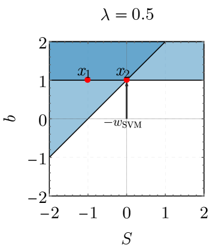
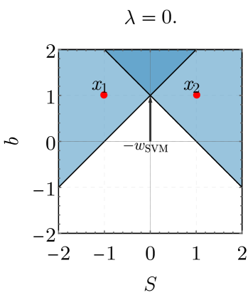
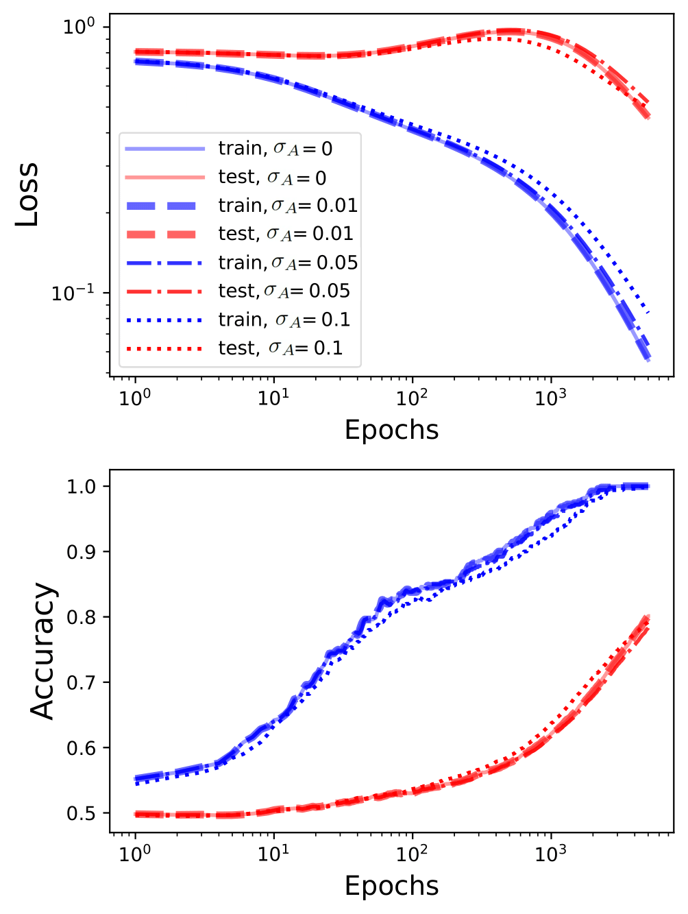
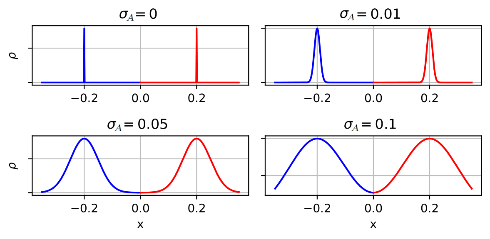
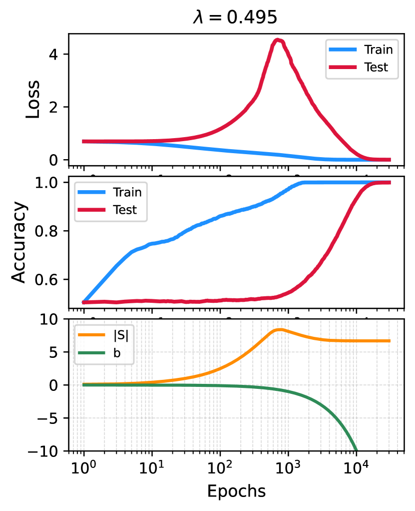
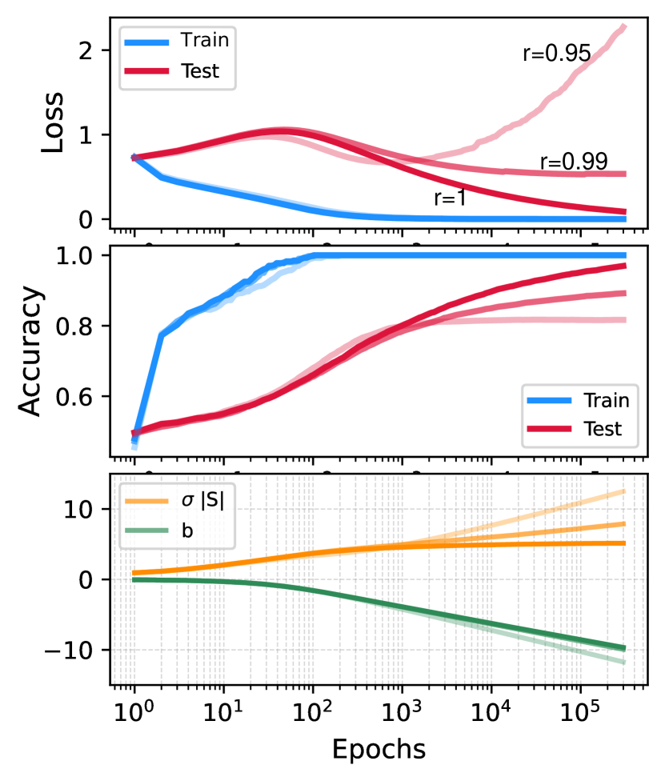

# Beck, Levi, Bar Sinai 2024 — Grokking at the Edge of Linear Separability

See also: [the global concept index](../../concepts/index.md).

**Alon Beck**, **Yohai Bar Sinai** (Tel Aviv University), **Noam Levi** (EPFL).

arXiv [2410.04489](https://arxiv.org/abs/2410.04489), 6 October 2024 (version v2 — 19 July 2025). 8 citations — the twenty-sixth most cited work in the corpus. The source is the native arXiv HTML of version v2.

The files of this paper's analysis:

- [`2410.04489.grokking-at-the-edge-of-linear-separability.license.txt`](2410.04489.grokking-at-the-edge-of-linear-separability.license.txt) — the arXiv licence record for this paper.

The anchor scheme and the rules for linking into a card are in the [README of the papers folder](../README.md).

**Excerpt card.** The paper's licence (`arxiv-nonexclusive`) does not permit republishing the paper itself; what stands here are the editorial sections and the fragments the corpus quotes (right of quotation). The paper: <https://arxiv.org/abs/2410.04489>.

## Concepts covered

**[Phase transition](../../concepts/phase-transition.md)** — the work's main thesis: grokking happens **near a critical point** at which two asymptotic solutions exchange stability ([`p9-1`](#p9-1)). Here that point is given explicitly and with no fitting: $\lambda_{c}=d/N=1/2$. At $\lambda<1/2$ the model almost surely generalises perfectly, at $\lambda>1/2$ it almost surely overfits ([`p1-9`](#p1-9)). The mechanism is called by its proper name from physics: **critical slowing down** — near the transition the loss landscape has "flat directions" that hold the training near almost-stable solutions for arbitrarily long ([`p9-2`](#p9-2)).

**[Generalisation bounds](../../concepts/generalization-bounds.md)** — the most unexpected thing in the work: the criterion of generalisation turns out to be **geometric and exact**. The model generalises perfectly if and only if the training set is **not linearly separable from the origin**, that is, the origin lies in the convex hull of the data ([`p5-5`](#p5-5)). In the separable case the limiting accuracy is expressed through the margin in closed form: $\mathcal{A}_{\mathrm{gen}}=\frac{1}{2}[1+\mathrm{erf}(\frac{1}{\sigma M\sqrt{2}})]$ ([`p5-6`](#p5-6)).

**[Data fraction and critical dataset size](../../concepts/data-fraction-critical-dataset-size.md)** — why the threshold is exactly $1/2$ is explained by **Wendel's theorem** of 1962: as $N,d\to\infty$ a set of $N$ points in $d$ dimensions is separable from the origin with probability 1 if $d>N/2$ ([`p6-8`](#p6-8), [`p6-9`](#p6-9)). No fitting: the interpolation threshold here is a theorem of combinatorial geometry rather than a measured quantity.

**[The naive minimisation of the loss](../../concepts/nlm.md)** and **[margin maximisation](../../concepts/margin-maximization-implicit-bias.md)** — the analysis rests entirely on the implicit bias of gradient descent: under an exponential tail of the loss the iterates converge in direction to the hard-margin SVM solution (the theorem of Soudry et al. 2018), and the whole question reduces to where $\boldsymbol{w}_ {\mathrm{SVM}}$ points in the extended space $(\boldsymbol{S},b)$ ([`p4-11`](#p4-11), [`p4-13`](#p4-13)). The generalising solution is $\boldsymbol{w}_ {\mathrm{SVM}}=(\boldsymbol{0},-1)$, that is, the separating plane goes off to infinity ([`p5-1`](#p5-1)).

**[The loss landscape and basins](../../concepts/loss-landscape-basins.md)** — the mechanism of the delay is decomposed into two factors, and both are needed **simultaneously**: as $\lambda\to\frac{1}{2}^{-}$ the limiting norm $\Vert\boldsymbol{S}_{\infty}\Vert$ diverges ([`p6-11`](#p6-11)), while at a large $\sigma$ the vector $\boldsymbol{S}$ reaches that norm arbitrarily fast ([`p6-13`](#p6-13)). The growth rate of $b$ meanwhile stays bounded — whence an arbitrarily long delay ([`p7-3`](#p7-3)).

**[Initialisation scale](../../concepts/initialization-scale.md)** — the role of $\sigma$ here is curious: it is **not** the scale of the weights but the scale of the noise in the directions perpendicular to the axis of separation ([`p7-2`](#p7-2)). A rescaling of the variables shows that a large $\sigma$ speeds the dynamics of $\boldsymbol{S}$ up by a factor of $\sigma^{2}$ without touching the dynamics of $b$ — that is, it separates the two parts of the solution in time.

**[The optimiser](../../concepts/optimizer-adam-adamw-sgd.md)** — an honest and useful caveat: under ordinary gradient descent the accuracy rises from the very beginning, and a "plateau at the chance level", as in Power et al., is obtained by switching to Adam ([`p2-3`](#p2-3), [`fig-5`](#fig-5)). An adaptive learning rate drives $\Vert\boldsymbol{S}\Vert$ onto the "memorising" solution faster and holds the accuracy down longer. The authors call this outright a superficial difference and work with GD for the sake of analytical tractability.

**[Double descent](../../concepts/double-descent.md)** — the connection with the interpolation threshold is drawn explicitly: $\lambda$ here plays the same role as the training-data fraction $\alpha$ in Power et al., setting the effective interpolation threshold ([`p2-3`](#p2-3)). The authors recall that double descent too has been proposed to be related to criticality, and put forward a conjecture about "universality classes" ([`p9-4`](#p9-4)).

**[Grokking](../../concepts/grokking.md)** — the setting is minimal: a **linear** logistic regression, no neural networks, no regularisation, no weight decay. The authors stress that their work requires **nothing** from the customary list of explanations ([`p2-3`](#p2-3)). This is the most economical demonstration of grokking in the corpus.

**[Modular arithmetic](../../concepts/modular-arithmetic.md)** — it is absent here altogether, and this is a matter of principle: grokking is reproduced on two Gaussians, and the connection with algorithmic tasks is drawn through a single quantity — the proximity to the interpolation threshold ([`p2-3`](#p2-3)).

It is worth saying separately what the work does **not** contain. There is no non-linearity: the model is linear, and the carry-over to deep networks remains a conjecture, "if one accepts a description through a feature map" ([`p9-7`](#p9-7)). Nor is there a claim that separability is a general mechanism: the authors state outright that they do not undertake to relate criticality specifically to separability in other settings ([`p9-5`](#p9-5)).

Cards of corpus papers: [Power et al. 2022](../2201.02177.grokking-generalization-beyond-overfitting-on-small-algorithmic-datasets/2201.02177.grokking-generalization-beyond-overfitting-on-small-algorithmic-datasets.card.md) — the task and the very data fraction $\alpha$ identified here with $\lambda$; [Grokking as a first-order phase transition](../2310.03789.grokking-as-a-first-order-phase-transition-in-two-layer-networks/2310.03789.grokking-as-a-first-order-phase-transition-in-two-layer-networks.card.md) — the corpus's nearest work in spirit, named in the conclusion; [Omnigrok](../2210.01117.omnigrok-grokking-beyond-algorithmic-data/2210.01117.omnigrok-grokking-beyond-algorithmic-data.card.md) — the weight norm and the initialisation scale, not needed here; [Nanda et al. 2023](../2301.05217.progress-measures-for-grokking-via-mechanistic-interpretability/2301.05217.progress-measures-for-grokking-via-mechanistic-interpretability.card.md) and [Merrill et al. 2023](../2303.11873.a-tale-of-two-circuits-grokking-as-competition-of-sparse-and-dense-subnetworks/2303.11873.a-tale-of-two-circuits-grokking-as-competition-of-sparse-and-dense-subnetworks.card.md) — the mechanisms named in the survey; [Gromov 2023](../2301.02679.grokking-modular-arithmetic/2301.02679.grokking-modular-arithmetic.card.md) — another analytically solvable model; [Prieto et al. 2025](../2501.04697.grokking-at-the-edge-of-numerical-stability/2501.04697.grokking-at-the-edge-of-numerical-stability.card.md) — numerical precision, named in the survey, and a work with a similar-sounding title but a different subject.

**[Criticality / the critical point](../../concepts/criticality-critical-point.md)** — one of the few cases in which the critical point is not a metaphor: it is shown that $\lambda=1/2$ is a critical point ([`p1-9`](#p1-9)) and that grokking happens near it, in the manner of critical slowing down in physics ([`p2-1`](#p2-1)).

**[Grokking outside neural networks](../../concepts/grokking-in-non-neural-models.md)** — the setting is chosen for the sake of rigorous definitions: in a binary logistic classification the memorising and the generalising solutions are given exactly ([`p1-2`](#p1-2)), and the transition between them can therefore be analysed analytically.
## What is shown and what is conjectured

The card editor's remarks following the analysis of the claims (`…claims.txt`). The work is built like a physics paper: a minimal model, an exact criterion, an analytical solution and an explicitly named mechanism.

**The generalisation criterion is proved rather than measured.** "The model generalises perfectly if and only if the data are not separable from the origin" ([`p5-5`](#p5-5)) is a statement with a proof in both directions, not an observation from curves. This is the strongest part of the work and a rarity in the corpus: the "generalising" and the "memorising" solutions are usually distinguished empirically, whereas here they are defined rigorously.

**The threshold $1/2$ is not fitted.** It follows from Wendel's theorem ([`p6-9`](#p6-9)) — a combinatorial fact about random points on a sphere, unrelated to learning in any way. The coincidence of a probabilistic geometry with the interpolation threshold is the work's most convincing argument.

**The conformal-time device is elegant and it works.** The substitution $\tau=\int e^{b}dt$ decouples the dynamics: $\boldsymbol{S}(\tau)$ follows exactly the path the problem **without** a bias would have followed ([`p6-3`](#p6-3)). The proof of the divergence of $\tau$ is placed in appendix C and given in full.

**The delay requires two conditions, and this is said outright.** Neither $\lambda\to\frac{1}{2}^{-}$ nor a large $\sigma$ suffices on its own ([`p7-3`](#p7-3)) — and this is confirmed by a two-dimensional map of the grokking time ([`fig-3`](#fig-3)). Such care distinguishes the work from explanations that name a single factor.

**The simplified two-point model is a methodologically valuable move.** The whole phenomenology is reproduced by a set of two points in one dimension ([`p7-4`](#p7-4)), where the solution is written out through the Lambert function and the prediction $\sqrt{\log(t^{ * }_ {\mathrm{gen}}/t^{ * }_ {\mathrm{tr}})}\propto\log(1-2\lambda)$ is checked numerically ([`fig-9`](#fig-9)). This is the sort of case in which a "toy model" really explains rather than illustrates.

**The shape of the curve depends on the optimiser, and the authors do not hide it.** Under GD the accuracy rises from the start; the classical plateau is obtained only with Adam ([`fig-5`](#fig-5)). The authors call the difference superficial ([`p2-3`](#p2-3)) — a reasonable argument but an unproved one: it rests on the mechanism being the same, and that is precisely what is at issue.

**The domain of applicability is narrow, and this is admitted.** A linear model, Gaussian data, the gradient-flow limit, and a constant labelling in the main text ([`p9-5`](#p9-5), [`p9-6`](#p9-6)). The appendices remove some of the restrictions — other distributions ([`p8-4`](#p8-4)), a label fraction $r<1$ ([`fig-16`](#fig-16)), an exponential loss instead of the cross-entropy — but non-linearity is not checked at all.

**The generalisation to other settings is claimed as a conjecture, and the word is well chosen.** "We conjecture that grokking is closely related to such critical points in other settings too" ([`p9-3`](#p9-3)); and it is said outright in the same place that the mechanism of criticality **need not** be related to separability ([`p9-5`](#p9-5)). That is, the work does not pass its criterion off as a general one.

**The perfect generalisation rests on the assumption $\sigma_{A}\ll\mu$.** It is this that allows the problem to be reduced to constant labels and an accuracy of 1 to be obtained below the threshold. When the assumption is relaxed the limiting accuracy falls below 1, but the **grokking remains** ([`p8-3`](#p8-3)) — that is, the delayed generalisation turns out to be more robust than the perfect generalisation itself.

**Its place in the corpus.** This is the most economical model of grokking in the wiki: a linear classification, two Gaussians, no regularisation and no neural network. Its contribution is twofold. First, it shows that **one** cause suffices for grokking — proximity to a point at which the asymptotic solution changes. Second, it gives the corpus a rare specimen: a criterion under which "memorisation" and "generalisation" are not metaphors but two limits of one dynamics, distinguished by a geometric condition on the data.

## Common misreadings and overstatements

These are the card editor's remarks, not the authors' text: places where this paper restates someone else's results with an error, or without the qualifications their authors attached. The "details" links in the "Common misreadings and overstatements of this paper" sections of the cited works' cards lead here.

###### mc-2303-11873
**Merlin et al. (2303.11873) — a trigonometric analysis ascribed to them.** `"Others analyzed the trigonometric algorithms learned by networks after grokking (Nanda et al., 2023; Chughtai et al., 2023; Merrill et al., 2023; Gromov, 2023)"` — the trigonometric algorithms of modular arithmetic were analysed by Nanda and Gromov; in Merrill there is [sparse parity](../2303.11873.a-tale-of-two-circuits-grokking-as-competition-of-sparse-and-dense-subnetworks/original/2303.11873.a-tale-of-two-circuits-grokking-as-competition-of-sparse-and-dense-subnetworks.md#p2-2) and DNF-like constructions, and no Fourier analysis at all. Further in the same sentence the paper cites correctly: "and demonstrated similar dynamics in sparse parity tasks (Merrill et al., 2023)" — the error is in the first half of the list, not in the understanding of the work.

## Common misreadings and overstatements of this paper

Patterns of erroneous or over-extended citation of this work observed in the citing papers of the corpus. Each entry describes what exactly is distorted in the paraphrase and leads to the authors' own paragraphs, where the lost caveat stands. The analysis of particular formulations is in the citing works' cards, in their "Erroneous citations" sections, to which the "details" links lead. The main hazard with this target is a conflation with the work of the same Levi, Beck and Bar-Sinai group, "Grokking in Linear Estimators" (2310.16441): half of the surname hits in the corpus are citations of that paper.

**Somebody else's mechanism ascribed to it (erroneous).** The work is credited with "the spectral properties of the empirical covariance" — that is the mechanism of Levi et al.; here [the criterion is proved through linear separability: the model generalises perfectly if and only if the training set is not linearly separable from the origin](#p5-5), with a critical slowing down at the threshold. The details: [2510.04930](../2510.04930.egalitarian-gradient-descent-a-simple-approach-to-accelerated-grokking/2510.04930.egalitarian-gradient-descent-a-simple-approach-to-accelerated-grokking.card.md#mc-2410-04489).

**"The roles of weight decay and initialisation scales" (erroneous).** Exactly contrary to the work's thesis: [neither a neural network, nor regularisation, nor weight decay is required for the delay](#p2-3), and [σ is the scale of the noise in the directions perpendicular to the data, not the scale of the weight initialisation](#p7-2). The details: [2603.29262](../2603.29262.grokking-from-abstraction-to-intelligence/2603.29262.grokking-from-abstraction-to-intelligence.card.md#mc-2410-04489).

Examples of careful citation: [2601.19791](../2601.19791.to-grok-grokking-provable-grokking-in-ridge-regression/2601.19791.to-grok-grokking-provable-grokking-in-ridge-regression.card.md) — the exact contribution and the limit of rigour ("provided evidence… but did not rigorously prove grokking"); [2509.20829](../2509.20829.explaining-grokking-and-information-bottleneck-through-neural-collapse-emergence/2509.20829.explaining-grokking-and-information-bottleneck-through-neural-collapse-emergence.card.md) — correctly separates Beck (classification) from Levi (regression) as two limits of one programme.

---

# Quoted fragments

Only the fragments the corpus cards refer to are
reproduced here (right of quotation); the paper's licence does not permit
republishing the whole text. Anchor numbering matches the original.

###### p1-2

We investigate the phenomenon of grokking – delayed generalization accompanied by non-monotonic test loss behavior – in a simple binary logistic classification task, for which "memorizing" and "generalizing" solutions can be strictly defined. Surprisingly, we find that grokking arises naturally even in this minimal model when the parameters of the problem are close to a critical point, and provide both empirical and analytical insights into its mechanism. Concretely, by appealing to the implicit bias of gradient descent, we show that logistic regression can exhibit grokking when the training dataset is nearly linearly separable from the origin and there is strong noise in the perpendicular directions. The underlying reason is that near the critical point, "flat" directions in the loss landscape with nearly zero gradient cause training dynamics to linger for arbitrarily long times near quasi-stable solutions before eventually reaching the global minimum. Finally, we highlight similarities between our findings and the recent literature, strengthening the conjecture that grokking generally occurs in proximity to the interpolation threshold, reminiscent of critical phenomena often observed in physical systems.

[name=Theorem,numberlike=thm]thmR \declaretheorem[name=Lemma,numberlike=thm]lemR \declaretheorem[name=Corollary,numberlike=thm]corR

###### p1-9

1. We prove, and demonstrate numerically, that grokking may occur in this setting, and is promoted when $\lambda$ is close to 1/2 and the separation along the separation **[p. 2]** between the Gaussians is small relative to the noise in other directions.
2. We show that this happens because $\lambda=1/2$ is a *critical point*. That is, for $\lambda<1/2$ the model will almost surely asymptotically approach perfect generalization accuracy and vanishing loss, while for $\lambda>1/2$ the model will almost surely achieve imperfect generalization accuracy and the population loss will diverge at $t\to\infty$.
3. More fundamentally, we show that generalization depends on whether the training set is *linearly separable* from the origin (that is, whether the origin is contained in the convex hull of the training set). In the limit $N,d\to\infty$, the data almost surely separable from the origin if $\lambda>1/2$ and almost surely false otherwise.
4. Moreover, we show that near the threshold value $\lambda=1/2$ (or, more generally, when the data is on the verge of being separable), the dynamics may generically track the overfitting solution for arbitrarily long times before transitioning to the optimal generalizing solution. This behavior manifests as a non-monotonic test loss and delayed generalization, and can lead to divergence of the "grokking time".
5. We construct a simple, one-dimensional model which captures the salient aspects of the problem, and explicitly solve the time evolution of the model parameters for several interesting cases.

###### p2-1

The main takeaway from this setup is that *grokking happens near a critical point*, similar to “critical slowing down” in the physics literature. While further study is needed, we conjecture that this applies to other grokking examples, as was demonstrated explicitly (though not necessarily stated in these terms) in Levi et al. (2023); Liu et al. (2023); Gromov (2023); Rubin et al. (2023, 2024).

The rest of the paper is organized as follows: Sec. 3 presents our main analysis of grokking as a critical phenomenon, beginning with empirical results in Sec. 3.1, studying the possible solutions in Sec. 3.2, and relating it to linear separability in Sec. 3.3. Finally, we bring together the pieces in Sec. 3.4 to explain why grokking occurs near the critical point. Sec. 4 provides a tractable effective model which fully captures the grokking dynamics. In Sec. 5, we discuss generalizations of this setup. We conclude in Sec. 6 and discuss future directions. In the appendices we discuss several generalizations of our results and provide some further proofs and derivations.

###### p2-3

Following the discovery of grokking by Power et al. (2022), numerous studies have attempted to elucidate its underlying mechanisms. Liu et al. (2022) showed that when sufficient data determines the structured representation, perfect generalization can be achieved on a non-modular addition task. Other works have identified factors contributing to grokking, including pattern learning (Davies et al., 2023), delayed robustness (Humayun et al., 2024), and transitions from memorization to circuit formation (Nanda et al., 2023), and the role of activation sparsity, weight entropy, and circuit complexity in real-world tasks (Golechha, 2024). Others analyzed the trigonometric algorithms learned by networks after grokking (Nanda et al., 2023; Chughtai et al., 2023; Merrill et al., 2023; Gromov, 2023), and demonstrated similar dynamics in sparse parity tasks (Merrill et al., 2023). Additional works proposed "slingshots" (Thilak et al., 2022) or "oscillations" (Notsawo et al., 2023) as explanations for grokking, whereas others focused on the role of regularization (Power et al., 2022; Liu et al., 2023) and of numerical precision (Prieto et al., 2025), which may significantly impact grokking in certain scenarios. We stress that our work requires **none** of these in order to exhibit or explain grokking.

###### p2-4

Recently, a body of works on solvable models which grok in various settings has emerged. Liu et al. (2023); Kumar et al. (2023) and Lyu et al. (2024) have linked grokking to memorization and transitions from lazy to rich dynamics. Žunkovič & Ilievski (2022); Gromov (2023); Doshi et al. (2024) analyzed solvable models exhibiting grokking and related their findings to the formation of latent-space structure, Xu et al. (2023) related grokking to benign over-fitting for ReLU networks on XOR data, Rubin et al. (2024) described grokking as a first-order phase transition, and Levi et al. (2023) provide the full dynamical solution of grokking in linear regression. Our work attempts to sidestep external probes, and fill the gap between solvable models and representation learning, whereby we can always identify the optimal solutions, while still solving the dynamics of the model. To accomplish this, our work relies on the results of Soudry et al. (2018); Nacson et al. (2019); Ji & Telgarsky (2019), which analyze the late-time dynamics properties of logistic regression for separable and inseparable data under gradient descent (GD).

###### p4-11

**Relation to prior results regarding separability.** These results are closely related to the framework developed by Soudry et al. (2018), who studied the convergence of binary classification for linearly separable data, and later expanded by Ji & Telgarsky (2019) for inseparable data. In our case, since the model contains a bias term and all labels are the same, the data is always separable by a hyperplane “at infinity”. To use their framework, we need to work in an extended space of dimension $d+1$, where we define the extended weight vector $\boldsymbol{w}=(\boldsymbol{S},b)\in\mathbb{R}^{d+1}$. The network solution at the late stages of training can be obtained as a direct corollary of Theorem 3 from Soudry et al. (2018).

###### p4-13

*Here, ${\boldsymbol{w}_{\mathrm{SVM}}}$ is the solution222Note that the SVM solution in the extended $d+1$ is not the same as the typical formulation of the Support Vector Machine (SVM) with bias in $d$ dimensions, because of the different penalty used for the bias term. to the hard margin SVM problem in the extended $d+1$ space and $\boldsymbol{\rho}$ is a residual vector which is bounded for all $t$.*

Connecting this result to the previous discussion, we se**[p. 5]** e indeed that either $|b|$ and/or $\left\lVert{\boldsymbol{S}}\right\rVert$ must diverge at infinite training times, and the question is now reduced to the directionality of $\boldsymbol{w}_{\mathrm{SVM}}$.

###### p5-1

The generalizing solution, which classifies correctly all points in $\mathbb{R}^{d}$ is when ${\boldsymbol{w}_{\mathrm{SVM}}}=(\boldsymbol{0},-1)$, ($\boldsymbol{0}$ being the $d$-dimensional zero vector) i.e. when it points in the direction of the bias and the separating plane is at infinity. This is exactly the aforementioned condition $b\to-\infty$ and $|b|/\left\lVert{\boldsymbol{S}}\right\rVert\to\infty$. In contrast, over-fitting occurs when the hyperplane is far enough from the data to correctly classify all the training samples, but does not go to infinity. In the extended space, this means that ${\boldsymbol{w}_{\mathrm{SVM}}}$ also contains a component in the direction of the data, and the model did not correctly learn the data distribution. In what follows, we will show that the factor determining whether we observe grokking in this setup is not the regular separability of data points from one another, but rather “separability from the origin” (or, separability with no bias), defined as follows:

###### p5-5

*The model will reach perfect generalization if and only if the data is not linearly separable from the origin. In particular:*

###### p5-6

1. *If the data is not linearly separable from the origin, then*$\lim_{t\to\infty}b(t)=\infty$*while*$\boldsymbol{S}$*saturates on a finite value*$\lim_{t\to\infty}\boldsymbol{S}(t)=\boldsymbol{S}_{\infty}$*.*
2. *If the data is linearly separable from the origin, then*$\lim_{t\rightarrow\infty}\mathcal{A}_{\mathrm{gen}}=\frac{1}{2}\left[1+\mathrm{erf}\left(\frac{1}{\sigma M\sqrt{2}}\right)\right],$*where*$M$*is the margin.*

To prove Prop. 3.2, we first note that due to the “exponential tail” of the cross-entropy loss, at late times the loss is dominated by samples with large model outputs $f=\boldsymbol{S}^{T}\boldsymbol{x}+b$, for which the cross-entropy loss $\ell(f)$ of Sec. 3.1, approaches the exponential loss $\ell_{e}(f)=e^{f}$ (Soudry et al., 2018; Nacson et al., 2019; Ji & Telgarsky, 2019). Specifically, the exponential loss must converge to the same late time dynamics as the cross entropy loss. Therefore, we will consider the exponential loss for which the calculations are tractable,

$$
\mathcal{L}_{e}(\boldsymbol{S},b)=\frac{1}{N}\sum_{i=1}^{N}e^{\boldsymbol{S}^{T}\boldsymbol{x}_{i}+b}. \tag{6}
$$

In the gradient-flow limit, the induced dynamics are

$$
\!\!\!\frac{\partial\boldsymbol{S}}{\partial t}=-\frac{\eta}{N}e^{b}\sum_{i}e^{\boldsymbol{S}^{T}\boldsymbol{x}_{i}}\boldsymbol{x}_{i}\ ,\frac{\partial b}{\partial t}=-\frac{\eta}{N}e^{b}\sum_{i}e^{\boldsymbol{S}^{T}\boldsymbol{x}_{i}}\ . \tag{**[p. 6]** 7}
$$

Note that both rates are proportional to a common time-dependent scalar $e^{b(t)}$. We can thus define a so-called *conformal time*333This is a common measure in cosmology and gravitational physics to describe co-moving objects in an expanding or shrinking spacetime background (Guth, 1981).: $\tau(t)=\int_{0}^{t}e^{b(t^{\prime})}dt^{\prime}$, which is a strictly increasing function of $t$. In terms of $\tau$, the time evolution takes the form

$$
\frac{\partial\boldsymbol{S}}{\partial\tau} =-\frac{\eta}{N}\sum_{i}e^{\boldsymbol{S}^{T}\boldsymbol{x}_{i}}\boldsymbol{x}_{i}\ , \frac{\partial b}{\partial\tau} =-\frac{\eta}{N}\sum_{i}e^{\boldsymbol{S}^{T}\boldsymbol{x}_{i}}\ . \tag{8}
$$

###### p6-3

The importance of this change of variables is that the dynamics of $\boldsymbol{S}(\tau)$ in terms of the conformal time are identical to those of $\boldsymbol{S}(t)$ *in the absence of bias*. That is, $\boldsymbol{S}(t)$ follows the same path that would be obtained by minimizing $\mathcal{L}=\frac{1}{N}\sum_{i=1}^{N}e^{\boldsymbol{S}^{T}\boldsymbol{x}_{i}}$, but does so at a different rate which depends exponentially on the current value of $b(t)$. This is demonstrated in the middle panel of Fig. 2. Since $\tau(t)$ diverges for $t\to\infty$ (see App. C for details), $\boldsymbol{S}(t)$ must follow the same path at long times, as it would have followed without bias. We can now complete the proof:

###### p6-8

*For $N,d\rightarrow\infty$, and $\lambda=d/N$, the dataset is separable from the origin with probability $1$, if $\lambda>1/2$, and is inseparable if $\lambda<1/2$.*

###### p6-9

In other words, Prop. 3.3 states that (almost) any large set of $N$ points in $d$ dimensions are separable (i.e., lie on the same "half" of some hypersphere passing through origin) as long as $d>N/2$. This is a direct corollary of Wendel’s theorem (Wendel, 1962) which we prove in App. A.

###### p6-11

*For $\lambda\rightarrow\frac{1}{2}^{-}$, $\left\lVert{\boldsymbol{S}_{\infty}}\right\rVert\rightarrow\infty$.*

That is, when the training set is non-separable, but on the verge of separability, $\left\lVert{\boldsymbol{S}_{\infty}}\right\rVert$ obtains arbitrarily large values. This statement is formally proven in App. D and empirically demonstrated in Fig. 1. It can also be obtained as a corollary of Ji & Telgarsky (2019). An intuitive geometric interpretation is that for a nearly separable set, $\boldsymbol{S}(t)$ approaches a finite limit $\boldsymbol{S}_{\infty}$, but a small translation of the data would make the set separable, and correspondingly would make $|\boldsymbol{S}(t)|\to\infty$. Smoothness thus implies $|\boldsymbol{S}_{\infty}|$ must be large if the set is almost separable.

###### fig-3

*Figure 3: **Simplified model.** Three left panels: Illustration of the hard margin SVM problem in 1+1 dimensions for the simplified model. Note that $-w_{SVM}$ is the point closest to the origin in the intersection of the two shaded regions. When $w_{SVM}$ points along the bias axis (the vertical axis) if and only if $x_{2}\geq 0$. (right) Grokking time, defined as the time it takes for the generalization accuracy to reach 0.95, plotted against $\sigma$ and $1-2\lambda$. We see it diverges when both $\lambda\rightarrow 1/2$ and $\sigma\rightarrow\infty$, while neither condition suffices alone.* **[p. 7]**

*Table 1: Summary of the different regimes of the simplified model, where $x_{1}=-1$, $x_{2}=1-2\lambda$, and the margin is $M=|x_{2}|=2\lambda-1$.* **[p. 7]**

|  | $\lambda<1/2$ ($x_{2}>0$) | $\lambda=1/2$ ($x_{2}=0$) | $\lambda>1/2$ ($x_{2}<0$) |
|---|---|---|---|
| $b(t\gg 1)$ | $-\log(t)$ | $-\log(t)$ | $-\frac{1}{1+M^{2}}\log(t)$ |
| $\\|\boldsymbol{S}\\|(t\gg 1)$ | $\frac{1}{2(1-\lambda)}\log\left(\frac{1}{1-2\lambda}\right)$ | $\log(\log(t))$ | $\frac{M}{1+M^{2}}\log(t)$ |

###### p6-13

*For $\lambda<\frac{1}{2}$ and $\sigma$ large enough, $\boldsymbol{S}(t)$ will approach its asymptotic value $\boldsymbol{S}_{\infty}$ arbitrarily fas**[p. 7]** t.*

###### p7-2

Note that these are identical to the gradient flow equations of the original variables given by Eq. 7, but the dynamics of $\boldsymbol{S}$ are *faster* by factor of $\sigma^{2}$. Thus, by taking a large $\sigma$, $\tilde{\boldsymbol{S}}$ will approach its asymptotic value $\boldsymbol{S}_{\infty}$ arbitrarily fast, while the dynamics of $b$ will not change. Recalling that $\sigma$ was mapped to $\sigma_{B}/\mu$ in the original two-Gaussians model introduced at the start, we note that a large $\sigma$ is equivalent to introducing *large noise* in directions perpendicular to the separation axis. ∎

###### p7-3

We can now understand mechanistically how grokking occurs. For $\lambda$ values close enough to $\frac{1}{2}$ from below, the limiting norm $\|\boldsymbol{S}_{\infty}\|$ is arbitrarily large (Prop. 3.4). For large enough $\sigma$, $\boldsymbol{S}(t)$ will grow arbitrarily fast towards $\boldsymbol{S}_{\infty}$ (Prop. 3.5). Under these conditions, the growth rate of $b(t)$ remains boudned, and the generalization can be delayed for *arbitrarily long times*. Note that this necessitates *both* $\lambda\rightarrow\frac{1}{2}^{-}$ and $\sigma\rightarrow\infty$, as is also demonstrated in the right panel of Fig. 3. Interestingly, using adaptive momentum based optimizers like ADAM (Kingma & Ba, 2017), one can see significant grokking even for $\sigma=1$, see App. B and App. F for more details.

###### p7-4

Our main claim is that the asymptotic dynamics depend only on the separability of the training set, and that grokking occurs at the edge of linear separability. This intuition can be worked out explicitly in a much simpler setting in one dimension. In this case, separability boils down to asking whether the origin is contained between the extremal points $\min\{x_{i}\}$ and $\max\{x_{i}\}$. Therefore, all the phenomenology of the full model described in the previous sections can be captured by a training set consisting of only 2 points $x_{1},x_{2}$, representing the points with maximal and minimal projections along $\boldsymbol{S}_{\infty}$. For consistency with the problem of Gaussian data, we parameterize this set as

$$
x_{1} =-\sigma\ ,\qquad x_{2}=\sigma\left(1-2\lambda\right)\ , \\
\mathcal{L}(S,b) =\frac{1}{2}\left(e^{Sx_{1}+b}+e^{Sx_{2}+b}\right), \tag{11}
$$

so that the scale of $x_{i}$ is $\sigma$, and they are separable (inseparable) for $\lambda<1/2$ ($\lambda>1/2$). We note that the margin of the dataset from the origin has the same dependence as in the Gaussian model with $N$ points in $d$ dimensions.

The asymptotic dynamics of this model qualitatively, and sometimes quantitatively, capture the phenomenology of the full problem. The model is fully tractable analytically and the detailed analysis is presented in App. E. We summarize here the main results:

- The left panels of Fig. 3 show the geometry of the problem in $1+1$ dimensions. It is easily seen that the optimal SVM solution is $s=0,b=-1$ if and only if the data is not separable, i.e. when the segment $x_{2}\geq 0$ **[p. 8]** contains the origin.
- The limiting value $S_{\infty}$ can be easily found to be $S_{\infty}=\frac{1}{2\left(\lambda-1\right)}\log\left(1-2\lambda\right),$ for the separable case $\lambda<1/2$. Indeed, it diverges logarithmically at $\lambda=1/2$, in agreement with the numerical results of the full model presented in the upper-right panel of Fig. 1. The long time dynamics of $\left\lVert{\boldsymbol{S}(t)}\right\rVert$ and $b(t)$ are summarized in Table 1.
- The behavior of the loss and accuracy of the simplified model as a function of $\lambda$ is remarkably similar to that of the full model, see Fig. 8 in App. E.

**Criticality.** We note that this result bears a striking resemblance to that of Levi et al. (2023), which employed the MSE loss in a linear regression problem, again for $N$ points sampled iid from an isotropic Gaussian distribution. In their setting, the interpolation threshold is at $\lambda=1$, in the sense that for $\lambda<1$ the model always generalizes asymptotically, and never generalizes for $\lambda>1$. They also found logarithmic divergence of the "grokking time" (the time difference between the times it takes for the generalization and training accuracy to reach a certain threshold). It diverges as a function of the distance from criticality as $\propto\log{(1-\sqrt{\lambda})}$, which was explained in terms of a “critical slowing down” effect, arising from a vanishing eigenvalue of the data covariance near criticality. While the two problems are quite different, they both display a critical behavior near an effective interpolation threshold of the corresponding problem. We believe this is not a coincidence but rather a manifestation of a deeper relation between the behaviors of NNs in the vicinity of critical points.

###### p8-3

Typically, binary classification models fully generalize only when the number of samples is sufficiently large, i.e., $N\gg d$. However, grokking is observed outside this regime, with $d/N\approx 1/2$. Here, the assumption $\sigma_{A}\ll\mu$ becomes particularly useful, as it ensures perfect test accuracy for any $\lambda$ below the critical point. When this assumption is relaxed, full generalization is no longer guaranteed. Nevertheless, the underlying mechanism discussed in earlier sections remains: near the critical point $\lambda=1/2$, the model can initially reduce the loss by adjusting the direction and norm of the perpendicular weights $\boldsymbol{S}_{2},...,\boldsymbol{S}_{d+1}$, while only modifying $\boldsymbol{S}_{1}$ at later times, leading to delayed generalization. In Fig. 4 we present numerical simulations supporting this behavior: While $\sigma_{A}=0.01$ is small enough to closely follow the behavior of $\sigma_{A}=0$, for larger values ($\sigma_{A}=0.05,0.1$), we observe that the limiting accuracy is below 1 and the loss begins to diverge at long times.

###### p8-4

Finally, we note that while the precise dynamics depend on the data distribution and labeling scheme, similar results are expected for a broad class of linear binary classification problems, as long as $\lambda$ is near the critical point. For instance, in App. I, we analyze a generalization of the setup from another perspective, where the constant labels are explicitly modified to be discriminative. The results closely resemble those presented here, see Fig. 16.

*Figure 4: Top: The GD dynamics of the loss and accuracy for the 2-Gaussians model, with different values of $\sigma_{A}$. The rest of the parameters are $\lambda=0.4$, $\mu=0.2$, $\sigma_{B}=1$, and $\eta=0.1$. Bottom: illustration of the separation for each $\sigma_{A}$.* **[p. 8]**

**[p. 9]**

###### p9-1

We studied the dynamics of gradient descent in a simple setting of logistic classification with strong noise. We have shown that in this setting, grokking occurs near a critical point in the asymptotic dynamics. Specifically, at the critical point, which occurs at $\lambda=1/2$ in our case, the overfitting and generalizing solutions exchange stability. We showed that this non-analytic change in the asymptotic dynamics is the cause for grokking, much like in Rubin et al. (2024); Levi et al. (2023); Doshi et al. (2024), and to some extent also Humayun et al. (2024), who showed that grokking occurs near a phase transition.

###### p9-2

Intuitively, in the vicinity of the critical point there are “flat directions” in the loss landscape. These directions may cause training to stay in the vicinity of almost-stable solutions for arbitrarily long times periods before eventually converging to the global minimum. In the physics literature, this behavior is known as “critical slowing down” (e.g. (Sethna, 2021)). In the current context, this is the mechanism of delayed generalization, which also explains the non-monotonic evolution of the generalization loss.

###### p9-3

While we cannot show it rigorously, we conjecture that grokking is intimately related to such critical points also in different settings. In a few examples, this has been directly demonstrated, (Levi et al., 2023; Rubin et al., 2023, 2024; Humayun et al., 2024). We note that other intriguing phenomena, such as the non-monotonic dependence of asymptotic performance on model complexity, a.k.a “double descent”, have also been proposed to be related to criticality, e.g. (Schaeffer et al., 2023).

###### p9-4

If this is indeed the case, then in analogy to the theory of critical phenomena in physics, there might exist “universality classes” that have similar critical behavior, but possibly very different underlying mechanisms (Sethna, 2021). We will address this connection in future work.

###### p9-5

**Limitations:** We considered a specific problem of linear binary classification in high dimensions. It is natural to ask how our results extend to more complex data, for instance including non-trivial correlations, hierarchical structure, or a finite sample space, as in the original observation of grokking in Power et al. (2022); Gromov (2023). While we believe the same analysis can be repeated in these instances, in the sense of (non)linear separability, we leave this to future work. In any case, we do not claim that the underlying mechanism of criticality is necessarily related to separability.

###### p9-6

The analytic were all done in the GF limit, and while our results were verified by experiments with a finite learning rate, it may be interesting to study how large learning rates affect this setup, possibly relating to catapults (Lewkowycz et al., 2020) or the edge of stability mechanism (Cohen et al., 2022).

###### p9-7

Lastly, we did not study the prospect of nonlinear logistic regression, which is closer to deep learning models in the wild. We believe some of our results may be generalized, provided we accept a “feature map” description of the model up to the last layer, and consider the SVM solution on the learned features.

###### p12-9

Indeed, in Fig. 5 we show that our setup is capable of grokking with accuracy staying at chance level (50%) at the start, similar to Power et al. We achieved this by using $\lambda$ values closer to half (“almost separable”) and the Adam optimizer instead of vanilla gradient descent (GD). The fact that this optimizer converges faster on the training data is no coincidence: the adaptive learning rate leads to quicker convergence to large values of $|S|$ (the “memorizing solution"), maintaining accuracy at chance level until later stages, before going to large $-b$ (the "generalizing solution"). Notably, Power et al. also used Adam (or AdamW). In conclusion, although Adam can lead to a slightly "cleaner" grokking result, we explored GD because it is easier to derive analytical insights from it while, we believe, not changing the underlying mechanism of **[p. 13]** grokking. Finally, We will also note that the non-monotonicity of the test loss is also a typical sign of Grokking that can be seen in our setup (for example, compare Fig. 4 of Power et al. with the test loss in Fig. 5).

###### fig-5

*Figure 5: Grokking in a similar setup to the results in the main text but with ADAM optimizer (with $\beta_{1}=0.8,$ $\beta_{2}=0.9$), instead of GD. The parameters are $\lambda=d/N=0.495$, $N=4000$ and $\sigma=1$.* **[p. 13]**

###### fig-9

*Figure 9: Numerical evidence for the Grokking time in the simplified model. In the left panel, we demonstrate for $1-2\lambda=0.001$ how the Grokking time is calculated: $t_{\mathrm{tr}}^{*}$, $t_{\mathrm{gen}}^{*}$ are calculated by finding the intersection of the loss with some $\varepsilon$. In the right panel we plot $\sqrt{\log(t_{\mathrm{gen}}^{*}/t_{\mathrm{tr}}^{*})}$ versus $\log(1-2\lambda)$ numerically, and show that the result is linear with slope $\approx\frac{1}{\sqrt{2}}$, in agreement with the prediction of Eq. 39* **[p. 19]**

It is interesting to note that in the conformal time, we have $b\approx-\tau$, and therefore can repeat this calculation and obtain

$$
\tau_{\mathrm{tr}}^{*}=-\log(\eta\varepsilon),\,\tau_{\mathrm{gen}}^{*}=\frac{1}{2}\log^{2}(1-2\lambda)-\log\frac{\eta}{2}\varepsilon. \tag{40}
$$

In this case, the result is a bit more natural since now the time difference (instead of ratio) becomes $\varepsilon$-independent:

$$
\tau_{\mathrm{gen}}^{*}-\tau_{\mathrm{tr}}^{*}\approx\frac{1}{2}\log^{2}(1-2\lambda). \tag{41}
$$

We note that this result still depends on $\varepsilon$ implicitly, in the sense that our assumption that $S=S_{\infty}$ is true only for long-times, or $\varepsilon$ which is small enough.

###### p25-8

For perfect generalization, we must have $b/S_{1}=-\mu$ and $S_{1}\gg S_{i},\forall{i>1}$, which can only be achieved up to a certain error, determined by the max-margin solution.

In Fig. 16, we demonstrate numerically that while the limiting generalization accuracy is smaller than one for $r<1$, grokking in the sense of delayed generalization and a non-monotonic test loss is still present.

###### fig-16

*Figure 16: Grokking at $\lambda=0.48$, for three different label-fractions: $r=1$ (constant label), $r=0.99$, and $r=0.95$ (represented by three different opacities). For example, for $r=0.95$, approximately $95\%$ of the input data would be assigned with the label $-1$ and 0.05 with the label $1$. The rest of the parameters are the same as in Fig. 1.* **[p. 26]**
