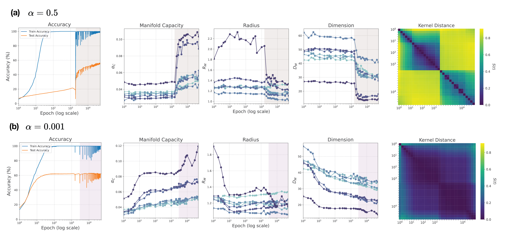
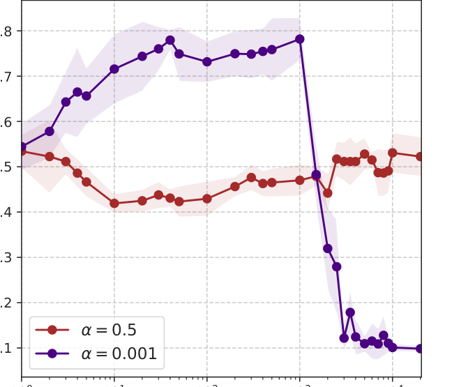

# Zheng et al. 2024 — Delays in generalization match delayed changes in representational geometry

**A work with no arXiv version.** It appeared only in the proceedings of the UniReps 2024 workshop and was never posted to arXiv, so the folder key is the year and month of the workshop with dashes in place of the sequence number (`2412.-----`), as described in the [README of the papers folder](../README.md). It has no "total" citation number: the corpus table of citing works is keyed by arXiv id. The serving source states only "Copyright (c) The authors and PMLR 2025" and no open licence, so the paper has two cards: the working full one, `…full.card.md`, which is not part of the public snapshot, and this publishable excerpt; neither `original/` nor `images/` goes outside.

See also: [the global concept index](../../concepts/index.md).

**Xingyu Zheng**, **Kyle Daruwalla**, **Ari S. Benjamin**, **David Klindt** — Cold Spring Harbor Laboratory, Cold Spring Harbor, NY 11724.

Proceedings of the UniReps 2024 workshop (the second edition of the Workshop on Unifying Representations in Neural Models), [PMLR volume 285](https://proceedings.mlr.press/v285/zheng24a.html), pages 324–334. The workshop was held in Vancouver on 14 December 2024, the volume was published on 15 June 2024. 10 pages, 4 figures. The authors' code: <https://github.com/cici-xingyu-zheng/rich-regime-geometry>.

The files of this paper's analysis:

- [`2412.-----.delays-in-generalization-match-delayed-changes-in-representational-geometry.license.txt`](2412.-----.delays-in-generalization-match-delayed-changes-in-representational-geometry.license.txt) — the licence record, compiled by hand.

The anchor scheme and the rules for linking into a card are in the [README of the papers folder](../README.md).

## Concepts covered

**[The lazy→rich transition](../../concepts/lazy-to-rich-kernel-to-feature-learning.md)** — the first empirical objection to this framework in the corpus. The kernel departs from its initial state long before the delayed generalisation, and the authors read that as showing that training before grokking is not lazy ([`p2-3`](#p2-3), [`p1-3`](#p1-3)). The three objections the corpus already holds are analytical or concern a different class of models; not one of them measures when the kernel stirs relative to the moment of grokking.

**[The neural tangent kernel](../../concepts/neural-tangent-kernel-ntk.md)** — the measure used is the kernel distance of Fort et al. on a subsample of 256 examples, not the alignment of the kernel with the labels. The block structure of the distance matrix arises in grokking and non-grokking networks alike, so the authors read it as a general property of optimisation rather than as a mechanism of the delay ([`p4-1`](#p4-1)).

**[The order parameter](../../concepts/order-parameter.md)** — the quantity offered for the role of marking the moment of the transition is the capacity of the class manifolds: it barely changes before grokking and grows together with it. There is no sharp transition where generalisation is not delayed ([`p5-5`](#p5-5)).

**[Progress measures](../../concepts/progress-measures.md)** — the family of representational-geometry measures (manifold capacity, effective dimension, effective radius) had not been met in the corpus. A nuance: the authors deliberately do not treat the loss as a progress measure, since under AdamW the accuracy can rise while the loss rises ([`p5-5`](#p5-5)).

**[Ungrokking](../../concepts/ungrokking.md)** — the same measures show a late corruption of already learned features in networks that do not grok, and the change of the kernel does not show that corruption. The authors relate it to the late memorisation of Stephenson et al. and to the misgrokking of Lyu et al. ([`p7-19`](#p7-19)).

**Excerpt card.** The serving source states no open licence, so the paper itself is not republished here; what stands are the editorial sections and the paragraphs the corpus quotes (right of quotation), under the same anchors the wiki links to. The paper: <https://proceedings.mlr.press/v285/zheng24a.html>.

---

# Quoted fragments

Only the fragments the corpus cards refer to are
reproduced here (right of quotation); the paper's licence does not permit
republishing the whole text. Anchor numbering matches the original.

###### p1-3

Delayed generalization, also known as “grokking”, has emerged as a well-replicated phenomenon in overparameterized neural networks. Recent theoretical works associated grokking with the transition from lazy to rich learning regime, measured as the change in the Neural Tangent Kernel (NTK) from its initial state. Here, we present an empirical study on image classification tasks. Surprisingly, we demonstrate that the NTK deviates from its initial state significantly before the onset of grokking, i.e., before test performance increases, suggesting that rich learning does occur before generalization. To explain this difference, we instead look at the representational geometry of the network, and find that grokking coincides in time with a rapid increase in manifold capacity and improved effective geometry metrics. Notably, this sharp transition is absent when generalization is not delayed. Our findings on real data show that lazy and rich training regimes can become decoupled from sudden generalization. In contrast, changes in representational geometry remain tightly linked and may therefore better explain grokking dynamics.

###### p2-3

1. Contrary to our expectations, networks that grok in an image classification setting show large changes in their NTK before delayed generalization, revealing the complex nature of training dynamics in real-world task settings. 2. Introducing measures of the representational geometry, we see that delayed generalization instead coincides with a rapid improvement in object manifold capacity, signifying feature learning but by a different measure [6, 8]. 3. Changes in network manifold capacity also allow us to identify a late stage over-fitting, where representations in over-trained network lose the ability to generalize.

###### p4-1

Network function diverges from initialization before grokking. We first reproduced the induced grokking for MNIST from [15, 19], by tuning either weight decay or output scaling (Fig. 1 a, Appendix Fig. 7). Consistent with the predictions of Lyu et al. [20], we observed that the weight norms of the networks initially exhibit minimal change prior to grokking, accompanied by a notable decrease coinciding with the networks’ improved generalization (Appendix Fig. 8).

We then investigated whether grokking is coupled to changes in the Neural Tangent Kernel (NTK). The NTK describes the learning dynamics of a network f(x; θt) at training time t, f : Rdin × Rdp →Rdout in terms of the tangent kernel, which has the following form for MSE loss and cross entropy loss:

Kt(x, x′) = ∇θf(x, θt)T ∇θf(x′, θt). (1)

To compare network kernels at different times, we use the kernel distance S developed by [11]:

S(t1, t2) = 1 − ⟨Kt1, Kt2⟩ ∥Kt1∥F ∥Kt2∥F

(2)

This measures a normalized dissimilarity between two kernels. Since the NTK is positive semidefinite, the inner product is always non-negative between 0 (identical) and 1 (orthogonal). As it is a scale invariant distance, it quantifies the relative rotation between the linearized model at different training times. In practice, the dimension of the empirical kernel is large for multiple output networks as the ones we study here, and we use a subsample of n = 256 of training dataset to calculate the empirical NTK (which constitutes the empirical gradient directions) [17, 23]; higher n or using test dataset to calculate the NTK gives a similar pair-wise distance score (Appendix Fig. 6).

We applied the kernel distance matrix to examine how the kernel changes over the course of optimization in our grokking setup. Surprisingly, the kernel changed substantially even before grokking (Fig. 1 b, right, red line highlighting the block structure transition to grok; Appendix Fig. 9). We observed similar kernel distance changes for the output scaling and weight decay schemes to induce grokking in MNIST (Appendix Fig. 7, Fig. 9). Based on prior literature, networks placed in the lazy regime via higher output scaling α or weight decay strategies might be expected to show minimal kernel distance before grokking [15, 24].

**[p. 5]**

Our findings indicate that grokking networks for MNIST classification explore regions of weight space far from initialization before they start to generalize, indicating that learning prior to grokking is not lazy training. The change in the network function shows multiple stages of change before and after grokking, evident from the block structure of the kernel distance matrix that aligns with the slow performance increase before grokking and the steeper increase period after (Fig. 1 b right). During periods of significant changes in accuracy or loss trajectories, both the grokked and non-grokked networks exhibit a characteristic block-like pattern: a sudden increase in kernel distance (marking a substantial shift in the functional space) followed by relatively minimal movement in weight space while the performance trends persist. Since this pattern appears regardless of whether grokking occurs, it likely reflects a general property of neural network optimization rather than a mechanism specific to delayed generalization. As an alternative explanation, we hypothesize that grokking mirrors an improvement in the geometry of class representation, where the object manifold of different classes become more linearly separable which allows generic test data to be classified more robustly.

Grokking is associated with a sharp change in network function space and manifold geometry. We subsequently extended our investigation of grokking to the more complex EMNIST dataset [7], which encompasses a larger number of classes (nclass = 47, including numbers and digits) and presents a more challenging learning task. A critical aspect of rich learning, which we aim to demonstrate, extends beyond merely "escaping" the kernel learning regime; rather, it involves the network actively developing representations of task-related features and patterns within the data [2, 32]. The precise characterization of rich learning and its learned features is often task-specific; in the context of image classification, a prevailing hypothesis is that good object representation should be organized into linearly separable, disentangled class manifolds— a property widely sought after in both deep learning theory and cognitive science [10, 18]. Here we use the manifold capacity and geometry metrics over training, which provide a direct theory-based measure on the changes of representation geometry in a layer-wise manner.

We first provide a brief explanation of central terminology; more details can be found in [6, 8]. Given N-dimensional features in neural activation space represented by P object manifolds, the manifold capacity αC = P/N is defined by the critical number of object manifolds such that when P < αCN, manifolds can be shattered with high probability. In other words, when assigning random binary labels to the manifolds, they can be linearly classified most of the time. Large αC implies well-separated manifolds in feature space. Two closely related properties of class object representation that describe the manifold geometry are reported here: DM, the effective dimension and RM, the effective radius. The two measures are defined by the anchor points of each class, which is a subset of training points that lies on the decision boundaries to other classes, and they describes the effective geometry of the class manifolds. The effective dimension captures the average dimension of the anchor points of given point cloud manifolds, while the effective radius measures the average norms of the anchor points that gives an estimate of the spread of the manifolds. A small DM implies that the anchor points of the point cloud occupy a low dimensional space, and a small RM implies that the anchor points of a given point cloud tightly group together, and both contribute to a bigger manifold capacity αC. As shown in Appendix Fig. 5, for a network trained with standard initialization on EMNIST, the manifold capacity metrics (αM, RM, DM) showed significant improvements as the network learned.

In our main result, we show the manifold geometry measures calculated at test activations (about 200 sample activations per class), as they are generic points that the network haven’t seen but should classify. We also computed the measurement on both train and test and show that they track each other over training (see Appendix Fig. 13 and Fig. 14), thus providing similar information about the manifold geometry in this context.

###### p5-5

When measured over the course of training in a grokking paradigm, we observed that the manifold capacity across layers αC barely changed before grokking but increases steadily during grokking (Fig. 2 b) while in contrast the kernel has moved away from initialization. This association between generalization and a sharp change in manifold measures was observed in all three setups for induced grokking and across seeds (Appendix Fig. 15), although we also noticed variability to induce the delayed task improvement using different seeds for otherwise identical networks (Appendix Fig. 11). Manifold capacity measurements thus better correspond to the onset of delayed generalization than changes to the network tangent kernel (Fig. 2 c).

We chose not to focus on the loss metric, as we observed that with the AdamW optimizer, model performance can continue improving even as the loss increases (Fig. 2 a). This divergence between

**[p. 6]**

loss and performance suggests that loss alone may not be a reliable predictor of classification performance nor the grokking behavior. While the increased loss in late training phase is not observed across all trained networks, we note great instability in the training loss curves with AdamW. Although our main results use AdamW in keeping with previous literature [15, 19], we also induced grokking using Adam with weight decay on the same network architecture (Appendix Fig. 12), where the loss exhibits a more conventional train-test gap pattern [12]. Notably, the manifold capacity across all layers shows stronger correlation with accuracy in the grokked network (Appendix Fig. 10).

The improved manifold capacity suggests that the weight space learns features that make object classes more separable, which implies more robust representations that enable the network to generalize on test data. This notion of changes in manifold geometry can be visualized in a UMAP projection (Fig. 2 d). In the early epochs, the object classes appear diffuse and poorly separated; as the network groks (around epoch 4000), the classes become increasingly distinct and tightly clustered, with clear boundaries between them. This visualization intuitively supports the insights gained from manifold capacity, that the network learns to extract features that effectively discriminate between object categories.

Manifold geometry metrics reveal generalization property of the network function beyond test performance metric. Now, we compare two networks that differ only by the output scaling parameter, one with large α = 0.5 and delayed generalization training dynamics, and one with small α = 0.001 and no delay (Fig. 3).

*Figure 3: Training dynamics, manifold measures and kernel distance of two output scaling (α = 0.5, 0.001). Networks were trained with n = 2000 samples. (a) The grokked network with output scaling parameter α = 0.5. (b) The network with no delayed generalization with α = 0.001.*

With α = 0.5, we observed a sharp increase manifold capacity αC as for the early example network (Fig. 3 a). In line with our previous observations, the kernel continues to change both before and after grokking, but the manifold capacity remains low and stable until grokking occurs. In addition, changes in effective radius RM and effective dimension DM suggests transition to generalization is associated with both the representation becoming lower dimensional (decreased DM), and the reduction of magnitude of the overall variance (decreased RM). While all layers undergo similar transitions in manifold geometry, the effect is strongest for the deepest layers in the network.

For small α, grokking is eliminated as the test performance closely tracks that of the training (Fig. 3 b). However, the capacity measurements reveal an interesting change in the network that happens in the late epochs where the performance becomes unstable. During this period (highlighted in light purple shade in Fig. 2), the capacity keeps increasing, and the decreased RM and DM suggest that the representation is drastically compressed. This “compression” has been shown to deteriorate the generalization ability on out-of-distribution data and can lead to higher catastrophic forgetting [21]. Moreover, the change is reminiscent of the memorization in late epochs revealed in network trained

**[p. 7]**

in permuted labels, where manifold capacity keep increasing after the generalization phase, but start to over-fit on the permuted labels [30].

We thus suspected a slightly different type of memorization for the later epochs here: after the network has adapted to its internal representations, once over-trained, the network can start to discard some learned features and only rely on a small subset of features, which might be spurious or specific to a dataset.

Feature learning can be gained and also lost. Following the above rationale, we predicted that the “compression” of the representation’s radius and dimension in the late stages of training, would decrease the robustness of generalization. This would be especially visible when evaluating data with slight distribution shifts from the training data.

To characterize how learned representations evolve through training, we evaluated the network’s generalization capabilities under subtle distribution shifts using MNIST dataset. While both EMNIST and MNIST contain handwritten digits, their distributions differ due to EMNIST’s additional letter classes and collection process variations. We assessed feature quality through linear probing: a linear classification layer was attached to the second-to-last layer and trained to classify MNIST digits (Fig. 4). This probes whether the learned features are general and transferable. For α = 0.5, the linear probing shows improved performance around the grokking epoch, confirming the network’s transition to meaningful feature learning. For α = 0.001, an intriguing pattern emerges: while the probing accuracy shows strong performance during the early plateau of train/test accuracy, it drops sharply in later epochs when manifold capacity continues increasing. This suggests a form of representation collapse [26]: the network’s features become increasingly specialized for EMNIST, potentially discarding general handwritten character features in favor of dataset-specific patterns. The sharp decline in linear probing performance indicates the features have become less general and transferable, consistent with overspecialization to the training data.

Linear Probing Performance

0.8

0.7

0.6

Mean Accuracy

0.5

0.4

0.3

0.2

= 0.5 = 0.001

0.1

100 101 102 103 104

Epoch (log scale)

*Figure 4: Performance under distribution shift. The mean accuracies on MNIST of the two networks from Fig. 3 across training epochs using linear probing. Shaded regions indicate standard deviation over 10 runs with randomly sampled MNIST data (n = 1280).*

###### p7-19

We further investigate the performance under distribution shift for networks that do not achieve grokking. Our analysis reveals that features learned during early training can deteriorate in later epochs. While this degradation is not apparent when examining kernel changes alone, it becomes evident through capacity measurements. This phenomenon aligns with the late-epoch memorization

**[p. 8]**

observed by Stephenson et al. [30] and the “misgrokking” concept introduced by Lyu et al. [20], where early-phase implicit bias leads to generalizable solutions, while late-phase bias results in overfitting. We propose that grokking should be viewed within a more comprehensive theoretical framework that captures the interplay between training biases and the transitions between overfitting and generalizing solutions, which will deeper insights into the dynamics of neural network learning.

Although we only focus on image classification in this work, we believe these insights could extend to other tasks. More importantly, we hope our results will motivate the community to evaluate future theoretical explanations of grokking on sufficiently complex datasets.

Acknowledgments and Disclosure of Funding

This project originated from a class project in Prof. SueYeon Chung’s course Neural Network: Theory and Applications, Spring 2024, where the first author became interested in representation learning and was introduced to manifold capacity theory. We thank Dr. Chi-Ning Chou for helpful discussions, and Burak M. Gürbüz for support throughout the project, and Dr. Sergey Shuvaev for revision advice. We thank the reviewers for their constructive suggestions.

References

[1] Matteo Alleman, Jack Lindsey, and Stefano Fusi. Task structure and nonlinearity jointly

determine learned representational geometry. In The Twelfth International Conference on Learning Representations, 2024. URL https://openreview.net/forum?id=k9t8dQ30kU.

[2] Silvia Bernardi, Marcus K Benna, Mattia Rigotti, Jérôme Munuera, Stefano Fusi, and C Daniel

Salzman. The geometry of abstraction in the hippocampus and prefrontal cortex. Cell, 183(4): 954–967, 2020.

[3] Abdulkadir Canatar, Blake Bordelon, and Cengiz Pehlevan. Spectral bias and task-model

alignment explain generalization in kernel regression and infinitely wide neural networks. Nature communications, 12(1):2914, 2021.

[4] Lenaic Chizat, Edouard Oyallon, and Francis Bach. On lazy training in differentiable program-

ming. Advances in neural information processing systems, 32, 2019.

[5] SueYeon Chung, Daniel D Lee, and Haim Sompolinsky. Linear readout of object manifolds.

Physical Review E, 93(6):060301, 2016.

[6] SueYeon Chung, Daniel D Lee, and Haim Sompolinsky. Classification and geometry of general

perceptual manifolds. Physical Review X, 8(3):031003, 2018.

[7] Gregory Cohen, Saeed Afshar, Jonathan Tapson, and Andre Van Schaik. Emnist: Extending

mnist to handwritten letters. In 2017 international joint conference on neural networks (IJCNN), pages 2921–2926. IEEE, 2017.

[8] Uri Cohen, SueYeon Chung, Daniel D Lee, and Haim Sompolinsky. Separability and geometry

of object manifolds in deep neural networks. Nature communications, 11(1):746, 2020.

[9] Xander Davies, Lauro Langosco, and David Krueger. Unifying grokking and double descent.

arXiv preprint arXiv:2303.06173, 2023.

[10] James J DiCarlo, Davide Zoccolan, and Nicole C Rust. How does the brain solve visual object

recognition? Neuron, 73(3):415–434, 2012.

[11] Stanislav Fort, Gintare Karolina Dziugaite, Mansheej Paul, Sepideh Kharaghani, Daniel M Roy,

and Surya Ganguli. Deep learning versus kernel learning: an empirical study of loss landscape geometry and the time evolution of the neural tangent kernel. Advances in Neural Information Processing Systems, 33:5850–5861, 2020.

[12] Andrey Gromov. Grokking modular arithmetic. arXiv preprint arXiv:2301.02679, 2023.

[13] Ahmed Imtiaz Humayun, Randall Balestriero, and Richard Baraniuk. Deep networks always

grok and here is why. arXiv preprint arXiv:2402.15555, 2024.

**[p. 9]**

[14] Arthur Jacot, Franck Gabriel, and Clément Hongler. Neural tangent kernel: Convergence and

generalization in neural networks. Advances in neural information processing systems, 31, 2018.

[15] Tanishq Kumar, Blake Bordelon, Samuel J Gershman, and Cengiz Pehlevan. Grokking as the

transition from lazy to rich training dynamics. arXiv preprint arXiv:2310.06110, 2023.

[16] Daniel Kunin, Allan Raventós, Clémentine Dominé, Feng Chen, David Klindt, Andrew Saxe,

and Surya Ganguli. Get rich quick: exact solutions reveal how unbalanced initializations promote rapid feature learning. arXiv preprint arXiv:2406.06158, 2024.

[17] Jaehoon Lee, Lechao Xiao, Samuel Schoenholz, Yasaman Bahri, Roman Novak, Jascha Sohl-

Dickstein, and Jeffrey Pennington. Wide neural networks of any depth evolve as linear models under gradient descent. Advances in neural information processing systems, 32, 2019.

[18] Qianyi Li, Ben Sorscher, and Haim Sompolinsky. Representations and generalization in

artificial and brain neural networks. Proceedings of the National Academy of Sciences, 121(27): e2311805121, 2024.

[19] Ziming Liu, Eric J Michaud, and Max Tegmark. Omnigrok: Grokking beyond algorithmic data.

In The Eleventh International Conference on Learning Representations, 2022.

[20] Kaifeng Lyu, Jikai Jin, Zhiyuan Li, Simon Shaolei Du, Jason D Lee, and Wei Hu. Dichotomy of

early and late phase implicit biases can provably induce grokking. In The Twelfth International Conference on Learning Representations, 2023.

[21] Wojciech Masarczyk, Mateusz Ostaszewski, Ehsan Imani, Razvan Pascanu, Piotr Miło´s, and

Tomasz Trzcinski. The tunnel effect: Building data representations in deep neural networks. Advances in Neural Information Processing Systems, 36, 2024.

[22] Francesca Mignacco, Chi-Ning Chou, and SueYeon Chung. Nonlinear classification of neural

manifolds with contextual information. arXiv preprint arXiv:2405.06851, 2024.

[23] Mohamad Amin Mohamadi, Wonho Bae, and Danica J Sutherland. A fast, well-founded

approximation to the empirical neural tangent kernel. In International Conference on Machine Learning, pages 25061–25081. PMLR, 2023.

[24] Mohamad Amin Mohamadi, Zhiyuan Li, Lei Wu, and Danica J Sutherland. Why do you grok?

a theoretical analysis of grokking modular addition. arXiv preprint arXiv:2407.12332, 2024.

[25] Neel Nanda, Lawrence Chan, Tom Lieberum, Jess Smith, and Jacob Steinhardt. Progress

measures for grokking via mechanistic interpretability. arXiv preprint arXiv:2301.05217, 2023.

[26] Vardan Papyan, XY Han, and David L Donoho. Prevalence of neural collapse during the

terminal phase of deep learning training. Proceedings of the National Academy of Sciences, 117 (40):24652–24663, 2020.

[27] Alethea Power, Yuri Burda, Harri Edwards, Igor Babuschkin, and Vedant Misra. Grokking: Gen-

eralization beyond overfitting on small algorithmic datasets. arXiv preprint arXiv:2201.02177, 2022.

[28] Ben Sorscher, Surya Ganguli, and Haim Sompolinsky. Neural representational geometry

underlies few-shot concept learning. Proceedings of the National Academy of Sciences, 119 (43):e2200800119, 2022.

[29] Cory Stephenson, Jenelle Feather, Suchismita Padhy, Oguz Elibol, Hanlin Tang, Josh McDer-

mott, and SueYeon Chung. Untangling in invariant speech recognition. Advances in neural information processing systems, 32, 2019.

[30] Cory Stephenson, Suchismita Padhy, Abhinav Ganesh, Yue Hui, Hanlin Tang, and SueYeon

Chung. On the geometry of generalization and memorization in deep neural networks. arXiv preprint arXiv:2105.14602, 2021.

[31] Vikrant Varma, Rohin Shah, Zachary Kenton, János Kramár, and Ramana Kumar. Explaining

grokking through circuit efficiency. arXiv preprint arXiv:2309.02390, 2023.

**[p. 10]**

[32] Blake Woodworth, Suriya Gunasekar, Jason D Lee, Edward Moroshko, Pedro Savarese, Itay

Golan, Daniel Soudry, and Nathan Srebro. Kernel and rich regimes in overparametrized models. In Conference on Learning Theory, pages 3635–3673. PMLR, 2020.

[33] William Yang, Chi-Ning Chou, and SueYeon Chung. Task-relevant covariance from manifold

capacity theory improves robustness in deep networks. In UniReps: 2nd Edition of the Workshop on Unifying Representations in Neural Models, 2024. URL https://openreview.net/ forum?id=1jHvHtbgRb.

[34] Chiyuan Zhang, Samy Bengio, Moritz Hardt, Benjamin Recht, and Oriol Vinyals. Understanding

deep learning (still) requires rethinking generalization. Communications of the ACM, 64(3): 107–115, 2021.
