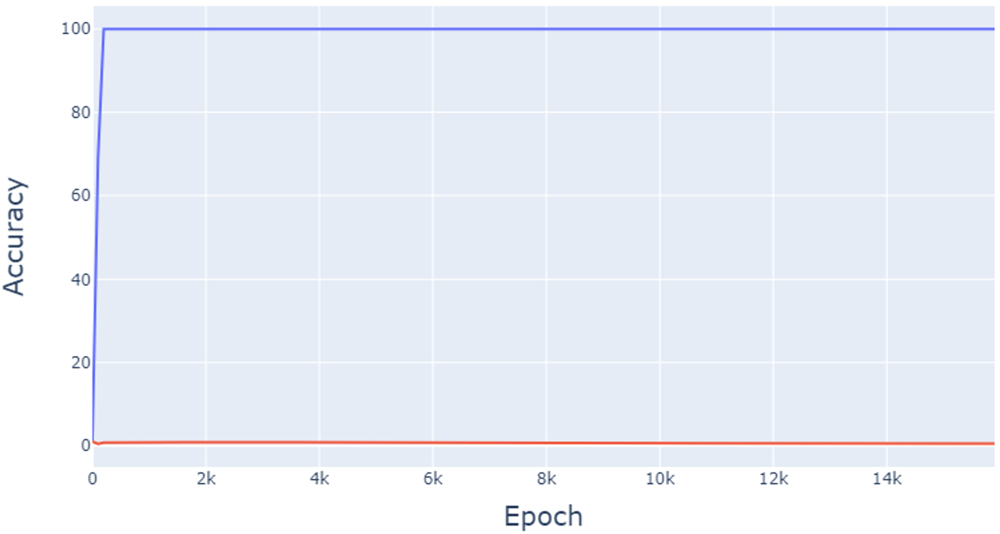
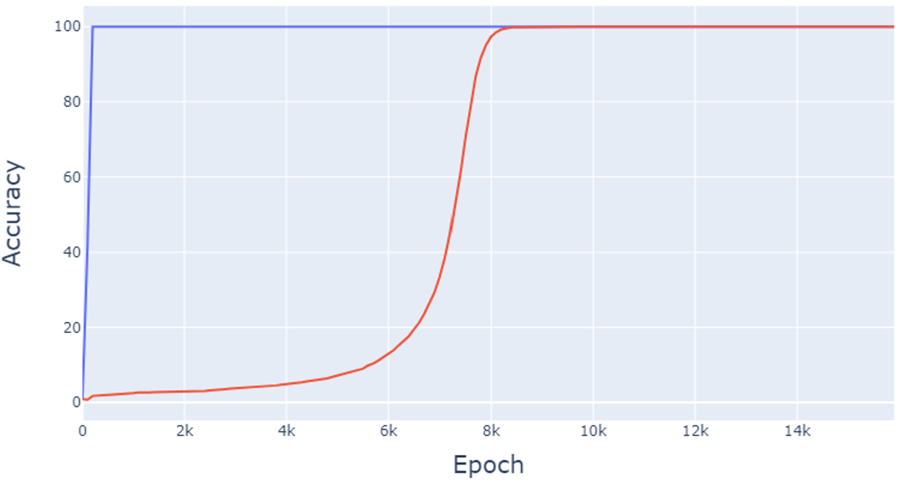
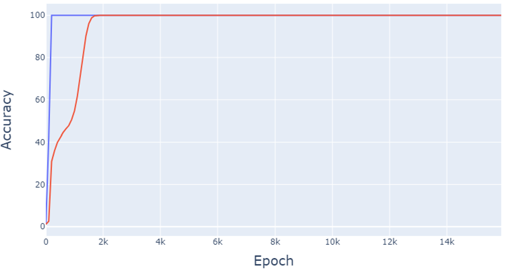

# Hu, Zhou & Yu 2024 — Exploring Grokking: Experimental and Mechanistic Investigations

See also: [the global concept index](../../concepts/index.md).

**QiYe Hu**, **Hao Zhou**, **RuoXi Yu** (the authors sign with student numbers; a course report).

arXiv [2412.10898](https://arxiv.org/abs/2412.10898), December 2024 (v1), 9 pages, 8 figures (30 panel files). Citations by Semantic Scholar — 1, inside the corpus — 0. A student reproduction report (the authors sign with student numbers, and the template's running head carries "NeurIPS 2022" for a December 2024 submission): the setting of Power et al. is reproduced on addition modulo 97 along three axes — the training data fraction $\alpha$, the architecture (transformer/MLP/LSTM) and the optimisation method (eight settings) — plus a retelling of two other people's explanations (the four phases of Liu et al. and the implicit biases of Lyu et al.). What is worth inheriting: the comparison of two encodings of one task (a vocabulary one against a classification one) with the conclusion that the threshold in the data fraction depends on the encoding, and the observation that the memorisation time is nearly constant (100–200 updates) under all optimizers and fractions while only the generalisation time changes. There is no theory of its own; "MLPs and LSTMs do not grok" in fact means "did not reach full memorisation".

The files of this paper's analysis:

- [`2412.10898.exploring-grokking-experimental-and-mechanistic-investigations.license.txt`](2412.10898.exploring-grokking-experimental-and-mechanistic-investigations.license.txt) — the arXiv licence record for this paper.

The anchor scheme and the rules for linking into a card are in the [README of the papers folder](../README.md).

**Excerpt card.** The paper's licence (`arxiv-nonexclusive`) does not permit republishing the paper itself; what stands here are the editorial sections and the fragments the corpus quotes (right of quotation). The paper: <https://arxiv.org/abs/2412.10898>.

## Concepts covered

**[The canonical grokking setting](../../concepts/canonical-grokking-testbed.md)** — a rare direct comparison of two encodings of one and the same task: the "official" vocabulary one (the openai/grok repository — every number, operation sign and "=" gets a vocabulary index, and the notion of "an integer" is not conveyed) against a simplified classification one (the input $x,y,p$, the output a distribution over $p$ outcomes); both give grokking, but the vocabulary one requires a larger training data fraction to succeed ([`p4-2`](#p4-2)). Analysis: the series over $\alpha$ for the vocabulary encoding is taken at incommensurable run lengths (the panel $\alpha=5\%$ is only 30 epochs against thousands for its neighbours), and some of the "grokking" curves do not fit the paper's own definition from the abstract (the validation accuracy comes to a shelf of 43–60% almost at once).

**[The critical dataset size](../../concepts/data-fraction-critical-dataset-size.md)** — the threshold in the data fraction is reproduced and shown to depend on the encoding rather than on the operation alone: under the vocabulary encoding the validation accuracy does not rise until $\alpha$ reaches roughly 40%, while under the classification one full generalisation is attained already at $\alpha=30\%$ ([`p3-10`](#p3-10)); grokking is most pronounced at $\alpha$ around 50% — declared to agree with Power et al. Analysis: there is not a single repetition with different seeds, and all the timings ("about 6000 epochs") are taken from single runs.

**[Optimizers (Adam/AdamW/SGD)](../../concepts/optimizer-adam-adamw-sgd.md)** — a sweep of eight optimisation settings at a budget of 1800 steps (data-efficiency curves): weight decay (AdamW) improves generalisation the most, some generalisation happens even under a full batch without decay or noise but only at a high data fraction, and poor hyperparameters sharply limit it ([`fig-5`](#fig-5)); an essential passing observation is that the training accuracy is reached within 100–200 updates under *all* optimisation methods and data fractions: the memorisation time is nearly constant, and only the generalisation time changes. Analysis: the panel captions, the file names and the list of settings in figure 5 give three incompatible correspondences — which panel goes with which setting cannot be recovered from the paper; and the figure caption is an almost verbatim retelling of Power et al. without a note of borrowing.

## What is shown and what is conjectured

These are the card editor's remarks, not the authors' text, drawn from a numbered pass over the paper's claims.

**What is valuable — the two encodings and the constancy of the memorisation time.** The comparison of the vocabulary and the classification encoding of one task, with the conclusion that the threshold in the data fraction depends on the encoding; and the observation that memorisation takes 100–200 updates under all optimizers and fractions — a cheap support for any analysis of "two clocks". The caveat about a full batch for the sake of reducing slingshots is the one place where Thilak et al. is used substantively.

**The negative results on MLPs and LSTMs are not set up as experiments about grokking.** In 100 thousand epochs the LSTM reaches only ~0.9 training accuracy — the sample is not memorised and the precondition of grokking is not met; the conclusion explains the failure by the absence of weight decay, whereas the recipe cited calls for a small decay at a large initialization, and the initialization scale was never varied. The same condition is attributed to Omnigrok in §4.2 and to Lyu et al. in §5. The text about the MLP ("even after 20,000 steps the training accuracy did not reach 100%") contradicts the paper's own figures 3b–3c.

**Student-level carelessness throughout.** Figure 5: the captions, the files and the list are incompatible; §3 against §4.3 — $4\cdot 10^{5}$ against $10^{5}$ parameters; "pretrained" with no indication of what was pre-trained; 9.1k in the text against ~8.3k in the figure; the introduction's references are lumped together (parity is attributed to Chughtai); the "Goldilocks zone" is read as a range of hyperparameters instead of a region in the scale of the representations; and there are no seeds and no error bands anywhere.

**How the work will be cited** ("it is shown that MLPs and LSTMs do not grok on modular addition") — more precisely: under one setting without weight decay and without varying the initialization scale, neither the MLP nor the LSTM reached full memorisation of the training sample, so the question of grokking was not posed for them at all.

---

# Quoted fragments

Only the fragments the corpus cards refer to are
reproduced here (right of quotation); the paper's licence does not permit
republishing the whole text. Anchor numbering matches the original.

###### p2-7

For instance, if the indices assigned to $1,2,3,+,=$ are $130,131,132,3,10$ respectively, then to compute $(1+2)\%p=3$, the input would be $[130,3,131,10]$, and the output would be $132$. The adoption of this indexing approach, which does not directly involve the representation of "integers", introduces additional complexity to the task of learning the underlying operations.

The implementation offered in the Colab notebook notably streamlines the task. For modular addition, it accepts three input values, encompassing the integers $x$, $y$ and $p$, where $0\leq x,y<p$. The mathematical operation is framed as a classification task, presenting probabilities for each of the $p$ potential outcomes.

###### p3-10

We execute the source code to obtain data for Figure 1. The figure illustrates when $\alpha$ is small, the task may be too hard for the Transformer to handle, and validation accuracy starts to grow until $\alpha$ reaches around $40\%$. This phenomena is mentioned in Figure2 of the original article [11]. Also, when $\alpha$ takes $45\%$ and $60\%$, the gap between the two curves is obvious and it takes around 6000 epoch for generalization. This means we have arrived at the same conclusion as the original article [11], that the grokking phenomenon is most pronounced when alpha is around $50\%$. When $\alpha$ takes $75\%$ and $90\%$, valid accuracy grows almost as fast as training accuracy and we think this is a certain outcome of a finite binary operation table and an excessive amount of known information.

*(a) Accuracy at 15% training data.*

*(b) Accuracy at 30% training data.*

*(c) Accuracy at 45% training data.*

*Figure 2: Comparison of accuracy at different training data fractions. The blue lines for training and the red lines for validation.* **[p. 4]**

Utilizing a straightforward encoding method alongside a Transformer model, Figure 2 illustrates three typical generalization scenarios in the modular addition problem. For $\alpha=15\%$, we trained for 25k epochs, where the validation data loss showed no improvement, and the accuracy remained close to **[p. 4]** zero, indicating a failure in generalization. With $\alpha=30\%$, the training data reached 100% accuracy after around 200 steps, but the validation accuracy surged around 6k steps, reaching 100% at 9.1k steps, signifying successful and complete generalization. At $\alpha=45\%$, the overall generalization behavior resembled typical cases, with both train and validation curves exhibiting similar trends. However, an observable delay in the validation curve’s sharp increase was also noted as was the previous one.

Additional details regarding the losses and steps until generalization at various training data fractions are presented in Figure 6 and Figure 7.

###### p4-2

When comparing different encoding methods, both exhibit the grokking phenomenon. However, the official problem is more challenging, requiring a larger training data fraction for successful generalization.

###### fig-5

*Figure 5: Different optimization algorithms lead to different amount of generalization within an optimization budget of 1800 steps for the problem of (x+y) mod 97. Weight decay, i.e. AdamW, improves generalization the most, but some generalization happens even with full batch optimizers and models without weight decay or activation noise at high percentages of training data fraction. Suboptimal choice hyperparameters severely limit generalization. Note this: training accuracy achieved after approximately 100-200 updates for all optimization methods and training data fractions.* **[p. 6]**

We observed different optimization algorithms to the problem and the result is displayed in Figure 5. We used the simplified pretrained Transformer model stated in Section 3 with a total of about $10^{5}$ non-embedding parameters.

For final configuration of hyperparameters, we have chosen a balance of performance and we chose not to anneal the learning rate for the experiments in the previous paper even though it performed better in some situations. For most experiments, we used AdamW optimizers with learning rate $10^{-3}$, weight decay 1, $\beta_{1}=0.9,\beta_{2}=0.98$, linear learning rate warmup over the first 10 updats, full batch and optimization budget of 1800 gradient updates.

**[p. 6]**

In Figure 5, we have tried the following variants(listed in the reading order):

- Adam optimizer with learning rate $3\cdot 10^{-4}$
- Adam optimizer with learning rate $10^{-3}$
- Adam optimizer with learning rate $3\cdot 10^{-3}$
- Adam optimizer with full batch and Gaussian noise added to the updated direction for each parameter ($W\leftarrow W+\text{lr}\cdot(\Delta W+\epsilon)$, where $\epsilon$ is sampled from unit Gaussain, $\Delta W$ is the standard Adam weight update, and lr is the learning rate)
- Adam optimizer on model with Gaussian weight noise of standard deviation 0.01 (each parameter $W$ replaced by $W+0.01\cdot\epsilon$, with $\epsilon$ is sampled from unit Gaussain)
- Adam optimizer with minibatch size 128
- AdamW optimizer with weight decay 1
- AdamW optimizer with minibatch size 128

Grokking is somewhat reminiscent of the phenomena of “epoch-wise”double descent [11],where generalization can improve after a period of over fitting. It has been found that regularization can mitigate double descent,similar perhaps to how weight decay influences grokking.
