# Prieto et al. 2025 — Grokking at the Edge of Numerical Stability

See also: [the global concept index](../../concepts/index.md).

**Lucas Prieto**, **Melih Barsbey**, **Pedro A. M. Mediano**, **Tolga Birdal** — Imperial College London, Department of Computing. The last two are marked as equal supervisors.

arXiv [2501.04697](https://arxiv.org/abs/2501.04697), 8 January 2025; ICLR 2025. 32 citations — the fifteenth most cited work in the corpus. The source is the native arXiv HTML of version v2.

The files of this paper's analysis:

- [`2501.04697.grokking-at-the-edge-of-numerical-stability.license.txt`](2501.04697.grokking-at-the-edge-of-numerical-stability.license.txt) — the arXiv licence record for this paper.

The anchor scheme and the rules for linking into a card are in the [README of the papers folder](../README.md).

**Excerpt card.** The paper's licence (`arxiv-nonexclusive`) does not permit republishing the paper itself; what stands here are the editorial sections and the fragments the corpus quotes (right of quotation). The paper: <https://arxiv.org/abs/2501.04697>.

## Concepts covered

**[Softmax collapse](../../concepts/softmax-collapse.md)** — the work **introduces** the notion and gives it its name. The definition is exact and narrow: it is a particular case of an absorption error in which the logit of the correct class is so large that $\sum_{k}e^{z_{k}}$ coincides in floating-point arithmetic with $e^{z_{y}}$; the loss then becomes **exactly** zero and the gradient with respect to the correct class **exactly** zero ([`p4-4`](#p4-4)). Hence the difference from every other explanation in the corpus: what halts the training is neither the landscape nor the optimiser but the arithmetic. The evidence is fitted to the mechanism in both directions — float64 postpones SC, float16 brings it closer ([`p5-3`](#p5-3)), and an artificially induced SC halts the generalisation of a model that generalises otherwise ([`fig-8`](#fig-8)).

**[Naive loss minimisation](../../concepts/nlm.md)** — the second notion introduced here and the root cause of the first. Definition 5 sets NLM as a direction that lowers the loss while the output of all the inputs is multiplied by a common factor $c>1$ ([`p7-1`](#p7-1)); for positively homogeneous networks that direction turns out to be the direction of the weights themselves ([`p7-10`](#p7-10)). Empirically, after the point of overfitting the cosine similarity of the updates with that direction reaches 0.9 for the output layers ([`fig-5`](#fig-5)). It matters what the work does not contain: a theorem that NLM arises in inhomogeneous networks with biases — there only a coincidence of the picture is shown.

**[⊥Grad](../../concepts/orthogonal-gradient-perp-grad.md)** — the work **introduces** an optimiser: its projection onto the current weight vector is subtracted from the gradient ([`p8-6`](#p8-6)), and proposition 2 proves that the remaining part always stays a descent direction. The result is formulated more strongly than "an acceleration": $\perp\mathrm{AdamW}$ and $\perp\mathrm{SGD}$ lead to generalisation **without** an initial overfitting phase ([`p8-11`](#p8-11)), that is, they remove not the delay but the phenomenon itself. In appendix E, $\perp\negthinspace\mathrm{\negthinspace Grad}$ with no hyperparameter tuning outpaces the best tuned weight decay ([`p17-1`](#p17-1)).

**[Numerical-stability techniques](../../concepts/numerical-stability-fix.md)** — $\mathrm{StableMax}$ is defined by replacing the exponential with a linearly growing branch ([`p5-4`](#p5-4)), and proposition 1 shows that this is still a $\mathrm{Softmax}$ applied to transformed logits. The limit of the technique is named in the same place: floating-point precision cannot be raised indefinitely, and float64 does not yield grokking ([`p5-3`](#p5-3)). Appendix F adds a negative result — temperature scaling merely postpones SC, while label smoothing prevents it at the price of an incomplete generalisation ([`p17-4`](#p17-4)).

**[Weight decay](../../concepts/weight-decay.md)** — the notion gets a change of status. Not a source of a useful implicit bias but a means of not arriving at NLM: weight decay pulls the weights back along exactly the direction along which NLM grows them ([`p9-5`](#p9-5)). Hence the explanation of why generalisation is nonetheless delayed under it: at first the gain from scaling the logits outweighs the increase of the L2 loss, and only later does the trade cease to be profitable. This is an argument rather than a measurement.

**[Weight norm minimisation](../../concepts/weight-norm-minimization.md)** and **[the Goldilocks zone](../../concepts/goldilocks-zone.md)** — a direct divergence from Liu et al.: grokking with $\mathrm{StableMax}$ sets in at a **growing** weight norm ([`p5-10`](#p5-10)), whence the conclusion that a decrease of the norm is not necessary for grokking. The work makes no comparison with the "Goldilocks zone" as such — it merely records that the two conditions are not both required.

**[Lazy to rich](../../concepts/lazy-to-rich-kernel-to-feature-learning.md)** — the frame is accepted in part. For the MSE loss on shallow networks the explanation through the lazy regime is not contested and is even refined: at MSE the logits may "overshoot" the target, so NLM does not operate there ([`p9-8`](#p9-8)). For cross-entropy and deeper networks the opposite is asserted — the observations are not as the theories of lazy learning predict, because those do not account for the finite precision of the arithmetic ([`p16-7`](#p16-7)).

**[Margin maximisation](../../concepts/margin-maximization-implicit-bias.md)** — the work embeds itself in the results of Lyu & Li on the directional convergence of homogeneous networks and the maximisation of the normalised margin beyond the point of 100 % accuracy ([`p7-12`](#p7-12)): that same alignment of the gradients, at finite precision, leads to SC and **halts** the margin maximisation. The survey also notes that grokking-like transitions in adversarial robustness were attributed precisely to SGD's bias towards the maximum-margin solution ([`p10-1`](#p10-1)).

**[The memorisation phase](../../concepts/memorization-phase.md)** — overfitting here is not a stage of the training but the condition under which NLM switches on: after 100 % training accuracy nearly the whole gradient goes into scaling the logits ([`p2-4`](#p2-4)). From the same place comes an intervention that exists nowhere else in the corpus: compressing the input representation to random binary vectors of dimension 14 makes memorisation difficult — and the generalisation delay disappears ([`p6-4`](#p6-4)).

**[Modular arithmetic](../../concepts/modular-arithmetic.md)** — the setting is standard (mod 113, splits of 40/60, 60/40, 70/30, an MLP with two hidden layers and a single-layer transformer) ([`p3-1`](#p3-1)), but the conclusion drawn about it is not: modular addition induces grokking only under a particular choice of input representation ([`p6-4`](#p6-4)). The difficulty is ascribed not to the task but to the encoding.

**[Sparse parity](../../concepts/sparse-parity.md)** — the second task used as a check, 2000 samples split evenly between training and test ([`p3-3`](#p3-3)); it serves to show that SC is not a peculiarity of modular arithmetic.

**[Real data](../../concepts/vision-real-world-data-mnist-cifar.md)** — MNIST is part of the main setting ([`p3-4`](#p3-4)), and appendix D.2 reproduces the MNIST grokking of Liu et al. and shows that without weight decay the fraction of SC approaches 100 % from the very start ([`p16-6`](#p16-6)). Appendix G carries both techniques over to GPT2-small and ResNet18 ([`fig-17`](#fig-17)) — but there is no grokking there any more; there ordinary performance is being compared, and for $\mathrm{StableMax}$ it is below the baseline on ImageNet-1k and WikiText-103.

**[Fourier features](../../concepts/fourier-features-circuits.md)** — an incidental result, but an inconvenient one for someone else's explanation: MLPs that grok **without** weight decay exhibit in Fourier space the same sparsity that Nanda et al. related to a cleanup phase ([`p15-7`](#p15-7)). The authors themselves call the observation superficial and draw no conclusions from it.

**[The learning rate](../../concepts/learning-rate.md)** — appendix C adds a second consequence of NLM: a growth of the weight norm at a fixed step size lowers the **effective** learning rate ([`p14-6`](#p14-6)). Appendix B.2 shows separately that the results are not a consequence of adaptive moments: the same picture is reproduced by SGD with a schedule ([`p14-2`](#p14-2)).

**[Adam and its kin](../../concepts/optimizer-adam-adamw-sgd.md)** — the second moments of adaptive optimisers naturally soften absorption errors, whereupon SC is rare under Adam and AdamW ([`p14-2`](#p14-2)). Appendix I notes the reverse action of that same term: too large an $\epsilon$ is capable of halting the training before any SC ([`p18-6`](#p18-6)).

**[The slingshot effect](../../concepts/slingshot.md)** — a demarcation rather than a dispute. Slingshots are an instability of a different kind: they arise only under adaptive optimisers and favour grokking, whereas SC affects any model with cross-entropy and hinders grokking ([`p18-5`](#p18-5)). A hypothesis about a connection — that zeroed gradients drop the second moments and thereby induce the jump — is offered as requiring further checking ([`p18-4`](#p18-4)).

**[Varieties of regularisation](../../concepts/regularization-variants.md)** — L1 is analysed separately and declared unreliable against NLM: the magnitude of its gradient does not depend on the magnitude of the weights, whereas NLM scales the weights in proportion to them. Appendix C.1 adds two ways of inducing grokking besides the main ones — a regularisation of the logit norm and a Taylor approximation of the softmax — with an honest statement that the second introduces an additional implicit bias.

**[Circuit efficiency](../../concepts/circuit-efficiency.md)** — a mention only: the work of Varma et al. is named among the explanations through the implicit biases of weight decay ([`p1-5`](#p1-5)) and takes no part in the further analysis.

**[Grokking](../../concepts/grokking.md)** — the notion receives a formulation of the opposite sign: gradient descent leads to grokking **by default**, if SC does not prevent it. Not "what must be added for grokking to occur" but "what must be removed so that it is not disrupted". What the work does not contain is an explanation of why the generalising solution is found at all: the mechanism learnt beyond the overfitting phase is not analysed here.

It is worth saying separately what the work does **not** assert, despite its title. The "edge of numerical stability" here has nothing to do with the [edge of stability](../../concepts/edge-of-stability.md) of Cohen et al.: there the matter is the sharpness of the landscape and the threshold $2/\eta$, here the width of the mantissa. The coincidence is verbal only.

Cards of corpus papers: [Power et al. 2022](../2201.02177.grokking-generalization-beyond-overfitting-on-small-algorithmic-datasets/2201.02177.grokking-generalization-beyond-overfitting-on-small-algorithmic-datasets.card.md) — the original task and weight decay as a reliable way of inducing grokking; [Liu et al. 2022](../2205.10343.towards-understanding-grokking-an-effective-theory-of-representation-learning/2205.10343.towards-understanding-grokking-an-effective-theory-of-representation-learning.card.md) and [Omnigrok](../2210.01117.omnigrok-grokking-beyond-algorithmic-data/2210.01117.omnigrok-grokking-beyond-algorithmic-data.card.md) — the weight norm and the "Goldilocks zone", from which there is a divergence here; [Nanda et al. 2023](../2301.05217.progress-measures-for-grokking-via-mechanistic-interpretability/2301.05217.progress-measures-for-grokking-via-mechanistic-interpretability.card.md) — Fourier structures and the cleanup phase; [Kumar et al. 2023](../2310.06110.grokking-as-the-transition-from-lazy-to-rich-training-dynamics/2310.06110.grokking-as-the-transition-from-lazy-to-rich-training-dynamics.card.md) — the "lazy to rich" frame, accepted in part; [Notsawo et al. 2023](../2306.13253.predicting-grokking-long-before-it-happens/2306.13253.predicting-grokking-long-before-it-happens.card.md) — slingshots and the landscape, with a different assessment of their role; [Grokfast](../2405.20233.grokfast-accelerated-grokking-by-amplifying-slow-gradients/2405.20233.grokfast-accelerated-grokking-by-amplifying-slow-gradients.card.md) — the corpus's second intervention straight into the gradient, but from the opposite side: there the slow component is amplified, here the harmful one is subtracted.

**[When regularisation is necessary](../../concepts/regularization-necessity.md)** — the "the dependence is a numerical artefact" version: [what is responsible for the absence of grokking without regularisation is Softmax Collapse](#p2-2), and once it is removed [StableMax yields grokking without regularisation, at a growing weight norm](#p5-10). The work inverts the question: the necessity is a property of the softmax arithmetic, not of the training dynamics.

## What is shown and what is conjectured

The card editor's remarks following the analysis of the claims (`…claims.txt`). The work is arranged as a chain "observation → mechanism → intervention", and the links of that chain are confirmed very unevenly.

**The strongest link is the reverse intervention.** Showing that removing SC yields grokking is not enough: anything might have coincided. Here the converse experiment is made too — SC is induced artificially, by multiplying the logits of the correct classes by zero after epoch 6000, and a generalising model ceases to generalise ([`fig-8`](#fig-8)). Together with the symmetric shift of the moment of SC under float16 and float64 ([`p5-3`](#p5-3)), this makes the causality of SC established within the range of tasks in which it was checked.

**The mechanism of the delay is confirmed more weakly than the mechanism of the halt.** That the logits grow and that the gradient aligns with the direction of the weights is measured ([`fig-5`](#fig-5)). That this scaling **is** the cause of the delay characteristic of grokking is inferred from the fact that the $\perp\negthinspace\mathrm{\negthinspace Grad}$ intervention removes the delay ([`p8-11`](#p8-11)). There is no theorem relating NLM to the length of the delay; and for networks with biases there is no guarantee that the direction of the weights lowers the loss at all — the authors caveat this.

**The claim about the representation is stronger than it is stated to be.** Compressing the input to random binary vectors of dimension 14 removes the delay entirely ([`p6-4`](#p6-4)). It follows that "modular arithmetic is a grokking task" is wrong as a formulation: what yields grokking is the task bound with a one-hot encoding that is easy to memorise. In the corpus this is the only experiment that separated the contribution of the task from the contribution of the representation.

**The divergence over the weight norm is recorded but not analysed.** Grokking under $\mathrm{StableMax}$ proceeds at a growing norm ([`p5-10`](#p5-10)), whereas Omnigrok derives generalisation from the norm's falling into a narrow range. The work draws from this the conclusion "a decrease of the norm is not necessary" and stops there; which of the two pictures describes which settings remains open.

**The weak place is appendix G.** The section is titled "in realistic settings", but the numbers of table 1 are mostly not in the techniques' favour: $\perp\mathrm{Grad}$ wins 2.7 points on CIFAR100 and loses fractions of a point on ImageNet-1k and WikiText-103, while $\mathrm{StableMax}$ loses 3.5 points on ImageNet-1k and 8.6 Top-5 points on WikiText-103. The text does not comment on these numbers. The techniques are to be read as instruments for checking a hypothesis rather than as recommendations for use — and the authors introduce them in exactly that way.

**The promise that "any intervention preventing SC leads to grokking" is not fully borne out.** Of the two alternatives checked ([`p17-4`](#p17-4)), temperature scaling merely postpones SC while label smoothing prevents it — and in doing so keeps the model from generalising fully. So removing SC is necessary, but what one removes it with is not a matter of indifference.

**The explanation of weight decay is an argument.** The picture of an equilibrium between the SCE and L2 losses, from which it is inferred why generalisation is nonetheless delayed under weight decay ([`p9-5`](#p9-5)), rests on a single trade-off plot and an analogy with the rotational equilibrium of Kosson et al. Nobody measured the moment at which the trade ceases to be profitable.

**Two observations are left unexplained.** Too large an $\epsilon$ in Adam halts the training before SC, and a hand-written implementation of $\mathrm{log\textunderscore softmax}$ allows learning beyond the point at which the loss is exactly zero ([`p18-6`](#p18-6)). The second the authors call outright a peculiarity of how PyTorch computes gradients, and do not take it into their conclusions.

**Its place in the corpus.** This is the only work in which the cause of the absence of grokking is **arithmetical**. All the other explanations — the landscape, circuit efficiency, the lazy regime, the phase transition — tacitly presuppose exact arithmetic, and to the extent that SC fires earlier, they describe a dynamics the training never reaches. The converse holds too: beyond settings with cross-entropy and no regularisation SC does not occur, and the explanation of the delay remains with NLM rather than with floating-point errors.

## Common misreadings and overstatements

These are the card editor's remarks, not the authors' text: places where this paper restates someone else's results with an error, or without the qualifications their authors attached. The "details" links in the "Common misreadings and overstatements of this paper" sections of the cited works' cards lead here.

###### mc-2301-05217
**Nanda et al. (2301.05217) — code and a blog post cited as the paper; the hedge of D.2 dropped.** One of the corpus's most careful citing works — the failures come exactly where the source ceases to be the text of the paper. (1) `"some supporting evidence from Nanda et al. (2023) which show that slingshots can disappear when using float64"` and (2) `"with Nanda et al. (2023) also alluding to the epsilon parameter being important in some cases"`: neither float64 nor the epsilon parameter is mentioned in the paper; both live in the accompanying code and blog post. (3) `"Nanda et al. (2023) showed that the slingshots observed in Thilak et al. (2022) can be explained by a very similar mechanism"`: the target has [a cautious "we speculate" and a single experiment with lowered precision](../2301.05217.progress-measures-for-grokking-via-mechanistic-interpretability/2301.05217.progress-measures-for-grokking-via-mechanistic-interpretability.card.md#sec-d-2); "showed … can be explained" raises a speculation to a result. Later, [2605.06152](../2605.06152.grokking-or-glitching-how-low-precision-drives-slingshot-loss-spikes/2605.06152.grokking-or-glitching-how-low-precision-drives-slingshot-loss-spikes.card.md) contested the optimiser half of that speculation while confirming the numerical half — so the dropped hedge turned out to matter.

## Common misreadings and overstatements of this paper

Patterns of erroneous or widened citation of this work observed in the citing papers of the corpus. Each entry describes what exactly is distorted in the retelling and leads to the authors' own paragraphs, where the lost caveat stands. The analysis of the particular formulations is in the cards of the citing works, in their "Erroneous citations" sections, to which the "details" links lead. The work's two-link mechanism is regularly flattened in retelling, while the papers that engage with it deeply cite it precisely.

**An inversion of the causality: "Softmax Collapse causes grokking" (erroneous).** The work is credited with explaining grokking "as a result of" the numerical collapse. In the authors it is exactly the reverse: [SC is an absorption error at which the loss and the gradient become exactly zero](#p4-4) — it halts the training and thereby hinders grokking; grokking, meanwhile, is the default behaviour once SC is removed. Details: [2506.05718](../2506.05718.grokking-beyond-the-euclidean-norm-of-model-parameters/2506.05718.grokking-beyond-the-euclidean-norm-of-model-parameters.card.md#mc-2501-04697).

**"The instability is the cause of the delay" (erroneous, citation by title).** The title "edge of numerical stability" is read as "the instability causes or delays grokking". In the work itself [the delay is explained by NLM — the naive minimisation of the loss by scaling the logits](#p7-1), an optimisation phenomenon rather than a numerical one; the instability explains the other link — the halt in the absence of regularisation. Details: [2510.04930](../2510.04930.egalitarian-gradient-descent-a-simple-approach-to-accelerated-grokking/2510.04930.egalitarian-gradient-descent-a-simple-approach-to-accelerated-grokking.card.md#mc-2501-04697), [2603.01968](../2603.01968.intrinsic-task-symmetry-drives-generalization-in-algorithmic-tasks/2603.01968.intrinsic-task-symmetry-drives-generalization-in-algorithmic-tasks.card.md#mc-2501-04697).

**"Grokking without regularisation was observed" with no mention of the intervention (widening).** In the authors [grokking without regularisation is achieved by removing SC — StableMax or a projection of the gradient](#p5-10); vanilla cross-entropy without regularisation does not generalise for them. Formulations of the "as observed by" kind drop the intervention. Details: [2603.01968](../2603.01968.intrinsic-task-symmetry-drives-generalization-in-algorithmic-tasks/2603.01968.intrinsic-task-symmetry-drives-generalization-in-algorithmic-tasks.card.md#mc-2501-04697); a mild echo: [2511.04760](../2511.04760.when-data-falls-short-grokking-below-the-critical-threshold/2511.04760.when-data-falls-short-grokking-below-the-critical-threshold.card.md) — weight decay is reduced to a struggle with floating-point errors, whereas [in the authors it counteracts NLM](#p9-5).

Examples of accurate citation: [2605.06152](../2605.06152.grokking-or-glitching-how-low-precision-drives-slingshot-loss-spikes/2605.06152.grokking-or-glitching-how-low-precision-drives-slingshot-loss-spikes.card.md) — reproduces the definition and the threshold of SC, conveys the hedge about slingshots and names outright what the authors did not show; [2603.15492](../2603.15492.grokking-as-a-variance-limited-phase-transition-spectral-gating-and-the-epsilon-stability-threshold/2603.15492.grokking-as-a-variance-limited-phase-transition-spectral-gating-and-the-epsilon-stability-threshold.card.md) — an explicit "prevents learning" and a recording of the conflict with Thilak; [2603.05228](../2603.05228.the-geometric-inductive-bias-of-grokking-bypassing-phase-transitions-via-architectural-topology/2603.05228.the-geometric-inductive-bias-of-grokking-bypassing-phase-transitions-via-architectural-topology.card.md) — NLM and SC kept apart as in the authors, six times over; [2410.04489](../2410.04489.grokking-at-the-edge-of-linear-separability/2410.04489.grokking-at-the-edge-of-linear-separability.card.md) — a hedged "in certain scenarios".

---

# Quoted fragments

Only the fragments the corpus cards refer to are
reproduced here (right of quotation); the paper's licence does not permit
republishing the whole text. Anchor numbering matches the original.

###### p1-2

Grokking, or sudden generalization that occurs after prolonged overfitting, is a surprising phenomenon that has challenged our understanding of deep learning. While a lot of progress has been made in understanding grokking, it is still not clear why generalization is delayed and why grokking often does not happen without regularization. In this work we argue that without regularization, grokking tasks push models to the edge of numerical stability, introducing floating point errors in the Softmax that we refer to as *Softmax Collapse* (SC). We show that SC prevents grokking and that mitigating SC leads to grokking *without* regularization. Investigating the root cause of SC, we find that beyond the point of overfitting, the gradients strongly align with what we call the *naïve loss minimization* (NLM) direction. This component of the gradient does not change the predictions of the model but decreases the loss by scaling the logits, usually through the scaling of the weights along their current direction. We show that this scaling of the logits explains the delay in generalization characteristic of grokking, and eventually leads to SC, stopping learning altogether. To validate these hypotheses, we introduce two key contributions that mitigate the issues faced in grokking tasks: (i) $\mathrm{StableMax}$, a new activation function that prevents SC and enables grokking without regularization, and (ii) $\perp\!\mathrm{\!Grad}$, a training algorithm that leads to quick generalization in grokking tasks by preventing NLM altogether. These contributions provide new insights into grokking, shedding light on its delayed generalization, reliance on regularization, and the effectiveness of known grokking-inducing methods. Code for this paper can be found at: https://github.com/LucasPrietoAl/grokking-at-the-edge-of-numerical-stability.

###### p1-4

In this paper we explore one such recently observed phenomenon known as *grokking*, first described by Power et al. (2022) as a sudden and unexpected generalization occurring after prolonged overfitting. Although predominantly studied in algorithmic tasks like modular addition or multiplication, recent findings suggest that grokking may be a more pervasive phenomenon, also manifesting in more complex tasks involving vision and language (Lv et al., 2024; Humayun et al., 2024).

###### p1-5

Prior research has consistently observed grokking in settings that involve some form of regularization, such as weight decay (Barak et al., 2022; Power et al., 2022; Nanda et al., 2023). This pattern has motivated investigations into the implicit biases introduced by weight decay, suggesting it may be critical to triggering delayed generalization. For instance, Liu et al. (2023a) argued that weight norms need to be in a narrow range or “Goldilocks Zone” for generalization. Similarly, Varma et al. (2023) highlighted weight efficiency of generalizing solutions, and Nanda et al. (2023) argued that weight decay favors simpler, more generalizable solutions. However, recent works have argued that regularization may not be necessary for grokking, at least on shallow networks with Mean Squared **[p. 2]** Error (MSE) loss (Kumar et al., 2024; Lyu et al., 2024; Gromov, 2023). These works tie grokking to a transition from lazy training (Chizat et al., 2018) to feature learning. Despite this ongoing work, several aspects in this framing of grokking remain unclear. These include why grokking tasks induce lazy training and why weight decay is often needed to enter the feature learning regime when using deeper models or cross-entropy (CE) loss.

###### p2-1

Here we propose a novel account of grokking, outlined in Fig. 1, that explains several of the main unanswered questions in the grokking literature. We start by showing that without regularization, grokking is prevented by absorption errors in the $\mathrm{Softmax}$, which we call *Softmax Collapse* (SC). These errors result in zero terms in the gradient and put an end to learning, sometimes before any progress is made in the test performance, resulting in complete overfitting (Fig. 1, **c**). We then argue that SC is caused by what we call *Naïve Loss Minimization* (NLM), as the gradient becomes aligned with a direction that corresponds to scaling up the logits by a constant. While scaling up all the logits does not change the model predictions, it does reduce the CE loss for a network that has reached 100% training accuracy, with the downside that this eventually leads to numerical errors in $\mathrm{Softmax}$. Our findings provide explanations for several key aspects of grokking, including (i) the delayed onset of generalization, (ii) why grokking is often absent without regularization, and (iii) why existing methods designed to induce grokking are effective.

###### p2-2

To validate our hypothesis that SC is responsible for the absence of grokking without regularization, we introduce $\bm{\mathrm{StableMax}}$ as a more numerically stable replacement to $\mathrm{Softmax}$ in CE loss. This simple change takes models from complete overfitting to grokking (Fig. 1, **c** to **b**) *without* regularization, in settings where it is normally not observed without it. Similarly, we validate that NLM is responsible for delaying generalization (Fig. 1, **a** to **b**) and leading to SC by introducing a new optimizer $\perp\!\mathrm{\!Grad}$, which only preserves the part of the gradient that is orthogonal to the NLM direction. By doing this, $\perp\!\mathrm{\!Grad}$ quickly leads to generalization without the initial overfitting phase that defines grokking (Fig. 1, **b** to **a**).

Our primary contributions are as follows:

###### p2-4

- We observe that cases of overfitting without grokking are due to floating point errors caused by extreme values in the $\mathrm{Softmax}$ function, which we term Softmax Collapse (SC; Sec. 3).
- We show that interventions to avoid SC, like greater floating point precision or a new, numerically stable version of Softmax ($\mathrm{StableMax}$), cause grokking in settings where it was previously absent without regularization (Sec. 3.3).
- We observe that models move towards SC because overfitting and cross-entropy loss push the model in a direction of uncontrolled logit growth, which we refer to as Naïve Loss Minimization (NLM; Sec. 4).
- We demonstrate that NLM can be avoided through a novel optimizer, $\perp\!\mathrm{\!Grad}$, which removes the delay in generalization (Sec. 5).

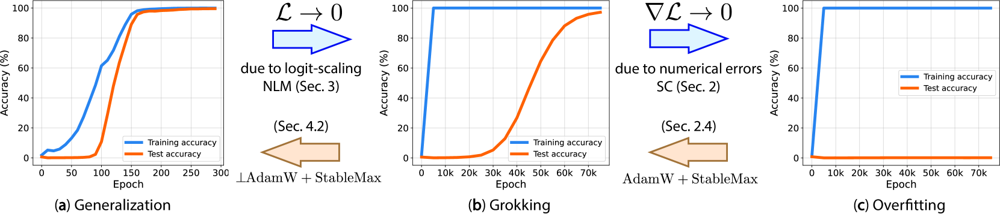

*Figure 1: Our contributions demonstrated through results obtained in addition modulo 113 task. We show that the delay in generalization induced by NLM can be reversed using the proposed $\perp$​AdamW ((**a**) and (**b**)) and that the numerical errors that lead to overfitting instead of grokking can be avoided by using the proposed $\mathrm{StableMax}$ ((**b**) and (**c**)).* **[p. 2]**

###### p3-1

The main results in this paper are shown on arithmetic modulo 113 (Power et al., 2022; Nanda et al., 2023). This is a family of supervised learning tasks where two one-hot encoded inputs representing integers $a,b<p$ are used to predict the target $y=a*b\mod p$, where $*$ is some binary operation and $p$ is a prime number. In most of our results, the binary operation is addition, but we show additional results with multiplication and subtraction.

Modular arithmetic tasks are characterized by a binary operation and a dataset size, with different behaviors being observed for different dataset sizes on the same binary operation. In these settings, we describe the dataset sizes as the percentage of the $113^{2}$ possible pairs that are used for training, with the rest of the data being used for testing as in Nanda et al. (2023) and Power et al. (2022). Our main results use a 40%/60% train/test split but we also include results using 60%/40% and 70%/30%. The input integers are represented as one-hot vectors.

###### p3-3

We also validate some of our results on the Sparse Parity task outlined in Barak et al. (2022). This is a supervised learning setting where the target is the parity of $k$ bits out of a binary vector of length $n$, with $k\ll n$. In this work we use 2000 samples, split evenly between train and test data and we describe instances of this task by specifying the values of $n$ and $k$.

###### p3-4

Finally, we provide some results on a subset the classic image classification dataset MNIST (Deng, 2012). For our experiments, we use a subset of 200 training samples from the training set as in Liu et al. (2023b), with evaluation on the full test set.

###### p4-4

*A specific case of absorption error occurs when, for a given sample **x**, the logit from the correct class $z_{y}$ is significantly larger than the logits for all other classes. This floating-point absorption of smaller terms, which we call **Softmax Collapse**, occurs when:*

$$
\sum_{k=1}^{n}e^{z_{k}}\doteq e^{z_{y}}~{}, \tag{2}
$$

*in which case the SCE loss becomes:*

$$
\mathcal{L}_{\mathrm{SCE}}(f(\textbf{x}),y)\doteq-\log\left(\frac{e^{z_{y}}}{e^{z_{y}}}\right)=0~{}. \tag{3}
$$

Thus, during SC the loss becomes identical to zero. Furthermore, for the correct class, the gradients become zero as well:

$$
\frac{\partial{\mathcal{L}_{SCE}}}{\partial z_{c}}=\frac{e^{z_{c}}}{\sum_{k=1}^{n}e^{z_{k}}}-\mathbb{1}_{\{c=y\}}\doteq 1-\mathbb{1}_{\{c=y\}}~{}. \tag{4}
$$

While weights that contribute to the wrong classes can still get negative updates, we show that disappearance of the gradients from the correct classes is enough to inhibit grokking (Fig. 2). We validate this in Sec. B.1 with an explicit intervention, showing that artificially setting the gradients from the correct class to zero stops generalization in a very similar way to what we observe in Fig. 2.

###### p5-3

The simplest way to avoid SC is to extend the FP precision from $\mathrm{float32}$ to $\mathrm{float64}$ for the $\mathrm{Softmax}$ calculation. We see in Fig. 2 that networks trained using $\mathrm{float64}$ in the $\mathrm{Softmax}$ face SC later in training which allows for a further increase in test performance. Conversely, using $\mathrm{float16}$ leads to SC earlier in training, leading to lower test performance. While this approach works as expected, FP precision cannot be extended indefinitely to allow for generalization as seen in the lack of grokking in Fig. 2(a).

###### p5-4

As demonstrated above, SC is caused by adding the exponentials of very large positive and negative logits in the $\mathrm{Softmax}$. To avoid these extreme summands, we propose using a softer version of $\mathrm{Softmax}$ to transform logits into probabilities before calculating the CE Loss:

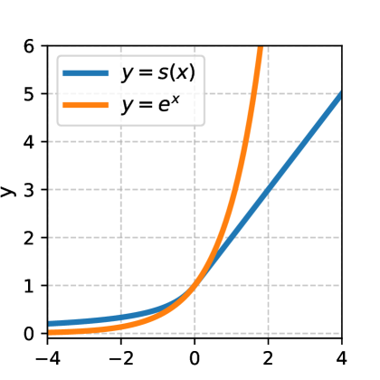

*Figure 3: $s(x)~{}\mathrm{vs.}~{}e^{x}$.* **[p. 5]**

###### p5-7

As seen in Fig. 3, $s(\cdot)$ is a simple ramp function that scales linearly instead of exponentially when $x\geq 0$ and also approaches 0 more slowly than the exponential function when $x<0$. This is similar to the Softplus function (Dugas et al., 2000) but approaches 0 more slowly with negative logits, further reducing the risk of absorption errors.

###### p5-10

To show that StCE indeed addresses the problems posed by SC, we repeat our experiments in Sec. 3.2 by replacing $\mathrm{Softmax}$ with $\mathrm{StableMax}$. Our results, presented in Fig. 4, indeed show that $\mathrm{StableMax}$ leads to grokking in commonly studied settings *without* regularization. Notably, this happens while the norm of the weights increases substantially (Fig. 4, middle). This suggests that while weight decay may lead to both grokking and a decreasing weight norm, the decreasing **[p. 6]** weight norm is not necessary for grokking. Overall, these results i) provide additional evidence for the importance of SC in preventing grokking, ii) suggest a novel activation function to address this problem, and iii) show that regularization or weight norm modification is not *necessary* for grokking.

###### p6-4

Results confirm our hypothesis, showing that as input representations are decreased in dimension, overfitting is prevented and models generalize without need for regularization (Fig. 4, right). This also shows that modular addition only induces grokking depending on the choice of representation. These findings highlight the importance of understanding the training dynamics beyond the point of overfitting (i.e. point of achieving 100% training accuracy), rather than focusing on the specifics of the modular arithmetic tasks as the key to explaining the delay in generalization.

###### p7-1

*A function $d_{\mathrm{NLM}}:\mathbb{R}^{m}\to\mathbb{R}^{m}$ specifies a direction of naïve loss minimization if it decreases the loss,*

$$
\mathcal{L}(f(\bm{\theta}+d_{\mathrm{NLM}}(\bm{\theta});\cdot))<\mathcal{L}(f(\bm{\theta};\cdot)), \tag{8}
$$

*while satisfying for some $c>1$:*

$$
f(\bm{\theta}+d_{\mathrm{NLM}}(\bm{\theta});\bm{x})=cf(\bm{\theta};\bm{x}),\quad\forall\mathbf{x}\in\mathcal{X}, \tag{9}
$$

*where $\mathcal{X}$ denotes the input space and $\mathcal{L}(f(\bm{\theta}+d_{\mathrm{NLM}}(\bm{\theta});\cdot))$ is the total loss over the training dataset.*

We find that under a large class of models, namely those that demonstrate *positive homogeneity*, when training beyond 100% training accuracy the direction of the weights is an NLM direction.

###### fig-5

*Figure 5: MLPs with (**a**) and without (**b**) bias terms trained on modular addition receive updates that are significantly aligned with the direction of NLM beyond the point of overfitting. In (**c**) we show these results for a selection of parameters for our one layer transformer. We highlight the embed and unembed matrices as well as the weights of the MLP. These are highlighted in the plot using the notation from Elhage et al. (2021).* **[p. 7]**

*When $f$ is a homogeneous neural network, $L$ corresponds to the number of layers.*

###### p7-10

In the case of homogeneous networks, training beyond 100% training accuracy, scaling the logits always leads to a decrease in the training loss. Therefore, $d_{\mathrm{NLM}}(\bm{\theta})=\alpha\bm{\theta}$ for $\alpha>0$ is an NLM direction, as it results in $f(\bm{\theta}+d_{\mathrm{NLM}}(\bm{\theta});\bm{x})=f((1+\alpha)\bm{\theta};\bm{x})=(1+\alpha)^{L}f(\bm{\theta};\bm{x})$, where the second equality follows from Eq. 10.

Many neural network architectures, such as ReLU MLPs and transformers without bias terms, are *positively homogeneous* or *approximately homogeneous* in the case of transformers (Merrill et al., 2020). While more complex deep learning models with skip connections and bias terms are not homogeneous, they have been shown to be quasi-homogeneous (Kunin et al., 2023) and in most cases – including all of the models in this work, the last layer is homogeneous. This means that for non-homogeneous models scaling the weights of the last layer corresponds to a direction of NLM.

###### p7-12

The fact that the gradients converge to the direction of the weights has been studied in previous works (Ji & Telgarsky, 2020; 2019; 2018; Lyu & Li, 2020) to prove that homogeneous networks converge in direction under gradient flow and gradient descent (GD), and they perform normalized margin maximization even beyond the point of $100\%$ training accuracy (Lyu & Li, 2020). **[p. 8]** However, we argue that gradient alignment also results in scaling of the logits which can lead to SC and put an end to the margin maximization described in Lyu & Li (2020), when working with limited floating point precision. While we study delayed generalization, the link between training trajectories and generalization is already established in prior art (Birdal et al., 2021; Andreeva et al., 2024).

###### p8-6

We propose a new optimizer, $\perp$**Grad** (read “ortho-grad”), that updates the weights based only on the part of the gradient that is orthogonal to the current direction of the weights:

###### p8-11

This projection of the gradient can be incorporated into different optimizers. In Fig. 6(a), we show results for $\perp$AdamW and $\perp$SGD, the $\perp$Grad versions of AdamW and SGD respectively. These results show that $\perp$Grad optimizers lead to generalization without a phase of initial overfitting, in contexts where no improvement in test performance is usually observed without weight decay. **[p. 9]** We note that similar projections of the gradients have been used in other settings to mitigate the effects of momentum in invariant layers (Heo et al., 2021), stabilize training Wang et al. (2024) or as one part in a more complex optimizer (Kosson et al., 2024). We design $\perp\!\mathrm{\!Grad}$ as a more precise intervention that directly prevents scaling along the NLM direction.

In Fig. 7, we compare the trajectories of models using SGD with and without weight decay to our new $\perp$SGD optimizer. SGD models start on a similar trajectory, reducing the training loss but increasing the test loss, until the model with weight decay changes direction and starts minimizing both the train and test loss. In contrast, the model using $\perp$SGD moves directly in a direction that minimizes both the train and test loss. While SGD with weight decay eventually reaches a point of lower loss, note that $\perp$SGD reaches 100% test accuracy within 400 iterations (Fig. 6(a)). Beyond showing how $\perp$SGD prevents NLM, Fig. 7 also suggests that weight decay induces grokking by avoiding NLM. In the following, we highlight that the success of several methods to induce grokking can be explained from this perspective.

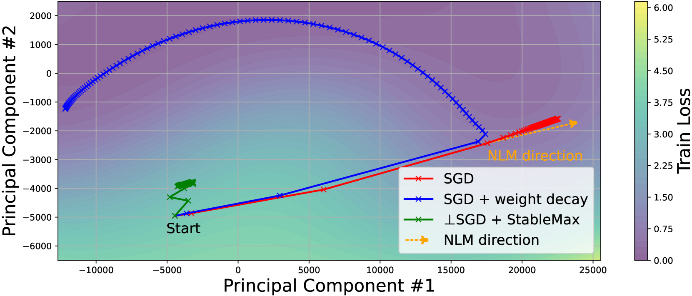

*(a) Training loss landscape*

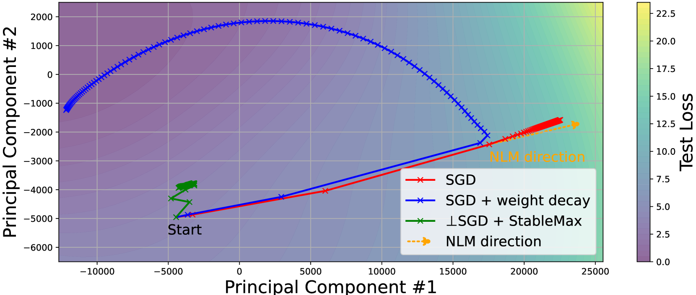

*(b) Test loss landscape*

*Figure 7: Model trajectories in in parameter space projected to 2D over the SCE loss landscape. SGD with weight decay starts along the same trajectory as SGD decreasing the training loss **(a)** but increasing the test loss **(b)**.* **[p. 9]**

###### p9-5

We have argued that the problem faced in grokking is that the ease of overfitting leads to NLM, which corresponds to scaling up the weights for homogeneous networks. Since weight decay corresponds to pulling back the weights along this same direction at every step during training, it is unsurprising, given our findings, that it is the most reliable way to induce grokking.

To explain why generalization tends to be delayed when using weight decay, as opposed to $\perp$Grad, we look at it from the perspective of L2 regularization which is equivalent to weight decay for SGD. In Fig. 6(c), we see an initial phase where classification loss decreases, at the cost of the L2 loss. Eventually, the decrease in classification loss from NLM stops outweighing the increase in L2 loss, meaning that only updates that are not aligned with the NLM direction are followed. This explains why weight decay leads to generalization in grokking tasks but only after scaling along the NLM direction no longer decreases the overall loss. This balance between weight decay and classification loss is similar to the rotational equilibrium studied in Kosson et al. (2024).

We argue that the main roles of weight decay are preventing floating point errors and preventing NLM. This is in line with recent findings about the role of weight decay in deep learning (D’Angelo et al., 2023) which point to the fact that it increases the effective learning rate and avoids floating point issues when using mixed-precision training in LLMs.

###### p9-8

While cross-entropy loss can be reduced indefinitely by scaling the logits through NLM, this is not the case with MSE loss. When using MSE loss the logits can overshoot the target, meaning that larger logits often do not lead to a lower MSE loss. This explains why Barak et al. (2022), Kumar et al. (2024), and Lyu et al. (2024) observed grokking with MSE loss without regularization. Interestingly, networks with more than one hidden layer do not generalize in these same settings (Fig. 13).

###### p10-1

Power et al. (2022) introduced grokking and showed that weight decay can consistently induce it in algorithmic tasks. Nanda et al. (2023) were able to reverse engineer the inner workings of a grokked transformer and found progress measures for grokking induced by weight decay. Chughtai et al. (2023) generalized the findings from Nanda et al. (2023) and showed grokked networks use group representations to solve group composition tasks, although some of these findings were disputed in Stander et al. (2024) which propose that grokked networks learn a coset based algorithm for these same tasks. Mallinar et al. (2024) has shown that grokking is not specific to neural networks or gradient-based optimization and cannot be predicted from the training or test loss. Varma et al. (2023) argued that grokking is driven by weight decay favoring more efficient solutions and Liu et al. (2023b) hypothesized that the weight norm of the models needs to be in a “Goldilock’s zone” to generalize. Kumar et al. (2024) and Lyu et al. (2024) connected grokking to a transition between “lazy training” (Chizat et al., 2018) and feature learning, and Kumar et al. (2024) showed that this can happen without regularization in the case of shallow networks with MSE loss. Grokking has also been described as a phase transition by Žunkovič & Ilievski (2024), Lyu et al. (2024) and Rubin et al. (2024). Humayun et al. (2024) show that in many settings, neural networks undergo grokking-like transitions in their adversarial robustness. This aligns with the findings of Lyu & Li (2020) which attributed this increased robustness to a bias of SGD towards a max-margin solution which was proven for homogeneous models. Beck et al. (2024) also connected grokking to the linear separability of the training data.

###### p10-2

Numerical instability is a common issue in deep learning Kloberdanz et al. (2022), especially when dealing with mixed precision training D’Angelo et al. (2023). It is known that the $\mathrm{Softmax}$ function is particularly prone to numerical stability problems although this often comes in the form of overflow in the exponential (Kloberdanz et al., 2022) and not from absorption errors in the sum as observed in this case. In the grokking setting, Nanda et al. (2023) showed that the slingshots observed in Thilak et al. (2022) can be explained by a very similar mechanism to the one involved in SC, although Nanda et al. (2023) do not use it to explain any grokking phenomena beyond these spikes that sometimes appear in the training process in grokking tasks. We believe the slingshots observed in Thilak et al. (2022) could be a mechanism to prevent full SC, explaining why slingshots can lead to grokking without weight decay in some settings. This is further discussed in App. H. Issues with numerical instability when training beyond overfitting with increasing learning rates were also observed in Lyu & Li (2020).

###### fig-8

*Figure 8: Taking a model that would normally generalize (green) and artificially inducing SC has a very similar effect to the one observed in Fig. 2.* **[p. 14]**

While SC leads the gradient from correctly predicted samples to be zero, it does not do this for the incorrect classes. To validate that setting the gradients from the correct classes to zero is enough to stop learning, we do this artificially for a model that is generalizing and show that learning stops after this intervention. In Fig. 8 we see that the baseline model shown in green generalizes, but this is stopped at epoch 6000 for the model shown in blue, after we perform this intervention.

**[p. 14]**

The intervention is implemented by multiplying the logits for the right classes by 0 at each step after epoch 6000.

###### p14-2

To show that our results are not due to the inductive bias of adaptive moments in optimizers like AdamW, we replicate some of the AdamW results using SGD with a learning rate scheduler. Our scheduler is similar to the one in Lyu & Li (2020) except at each step we divide the learning rate by the norm of the full gradient, instead of the loss. In Fig. 9 we observe that SC also puts an end to grokking in this setting.

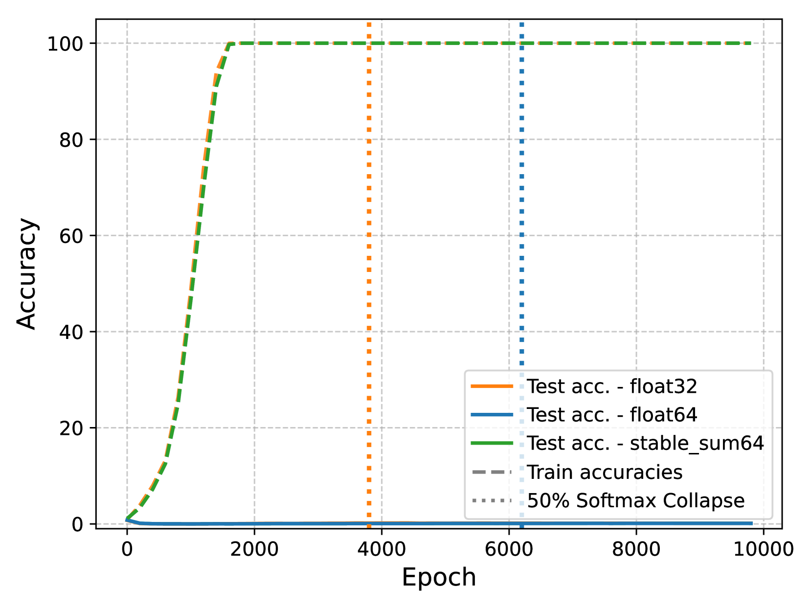

*(a) 40% training data*

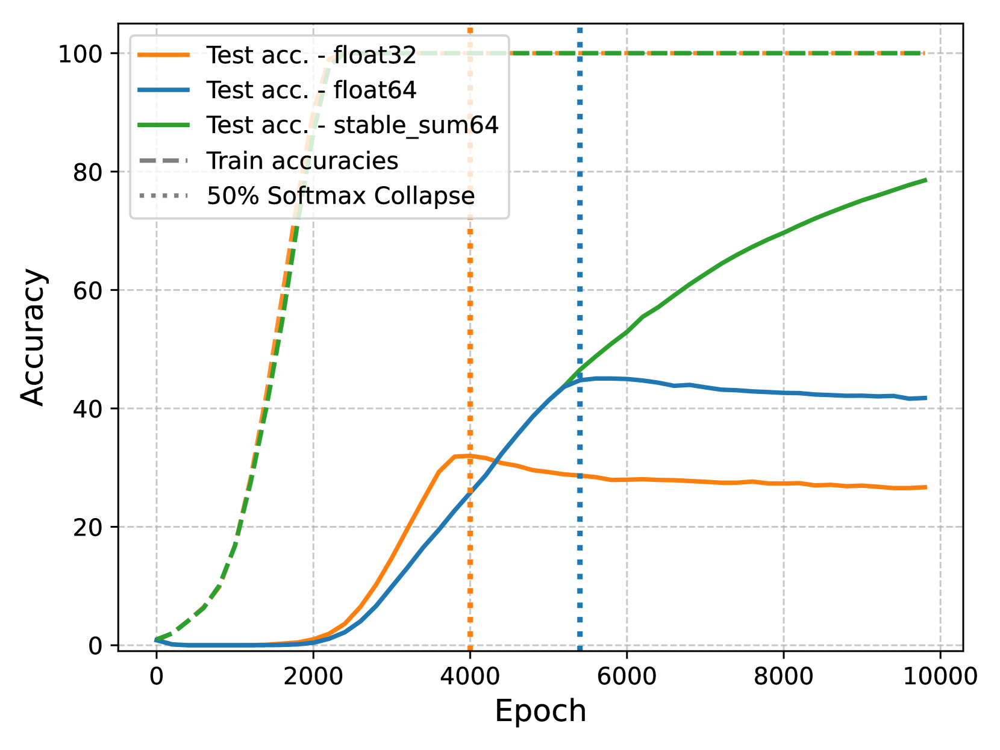

*(b) 60% training data*

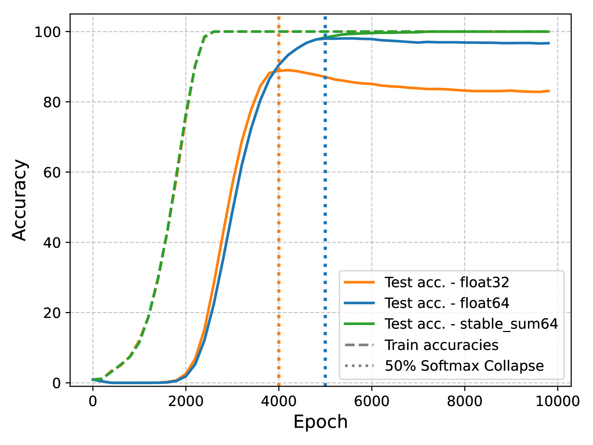

*(c) 70% training data*

*Figure 9: We show that the same dynamics observed in Fig. 2 can be observed with a learning rate scheduler instead of AdamW. This shows that this is not due to an implicit bias of adaptive optimizers.* **[p. 14]**

###### p14-6

Unexplored in the main paper, NLM also has the effect of reducing the effective learning rate. For a gradient update using regular gradient descent $\bm{\theta}_{t+1}=\bm{\theta}_{t}-\eta\nabla\mathcal{L}(\bm{\theta}_{t})$ it is easy to see that $||\bm{\theta}_{t+1}-\bm{\theta}_{t}||\to 0$ as $||\nabla\mathcal{L}(\bm{\theta}_{t})||\to 0$. This problem has been observed before when training beyond the point of overfitting, for example, Lyu & Li (2020) addressed it by using a loss based learning rate scheduler to keep up with the gradient. Theoretically, an alternative could be to simply extend the duration of training. According to our hypothesis, training for long enough should eventually lead to generalization on grokking tasks if we prevent SC. However, we find that another kind of floating point error can also appears in these settings, namely, gradient absorption errors in the weights.

For a weight $w$, gradient absorption errors happen when a gradient update is small enough that it leaves the weight unchanged. Using the notation outlined in this paper this can be formalized as $w-\eta\frac{\partial\mathcal{L}}{\partial w}\doteq w$. In Fig. 10 we show that this happens for an MLP trained with SGD on modular addition using 30% of the training data. As the norm of the gradient decreases, the percentage of the gradients that are absorbed by the weights increases substantially. Note that the number of gradients that are *exactly* zero remains stable while the number of absorbed gradients increases substantially.

This issue is naturally mitigated by second order moments for adaptive optimizers like Adam and AdamW which is why they do not frequently appear. However, they do prevent us from showing grokking with vanilla gradient descent without any learning rate scheduling.

###### p15-7

Weight decay has been identified as potentially responsible for inducing the periodic structures in the weights studied in Nanda et al. (2023). In Fig. 12 we show that MLPs that grok without weight decay on modular addition show a similar sparsity in Fourier space as the one observed in Nanda et al. (2023). While these are very superficial results, they suggest that these structures can emerge without a weight decay–induced “clean up” phase as described in Nanda et al. (2023).

###### p16-6

We replicate the setting from Liu et al. (2023b) of grokking on MNIST with cross-entropy loss and show that without weight decay, the scaling factor of the weights leads to significant FP errors, preventing grokking from happening until this is alleviated by weight decay.

###### p16-7

While SC explains why weight decay is needed to get the jump in performance observed in Fig. 14(b). It could also explain why inducing grokking by scaling the weights is less effective when using SCE. While when using MSE loss, Liu et al. (2023a) are able to induce full grokking from random level predictions to close to full training accuracy, the same does not seem to be possible when using SCE. In fact, we see in Fig. 14(b) that since the beginning of training the rate of SC approaches 100%. This could explain why the observations with cross-entropy loss are not the ones predicted by the lazy training theories outlined in Kumar et al. (2024) which do not take limited floating point precision into account.

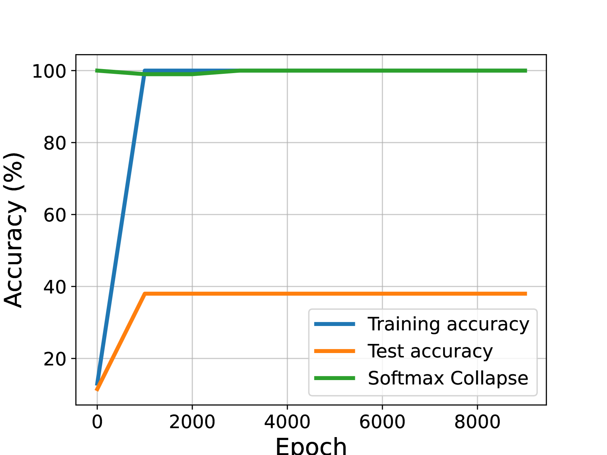

*(a) MLP without weight decay*

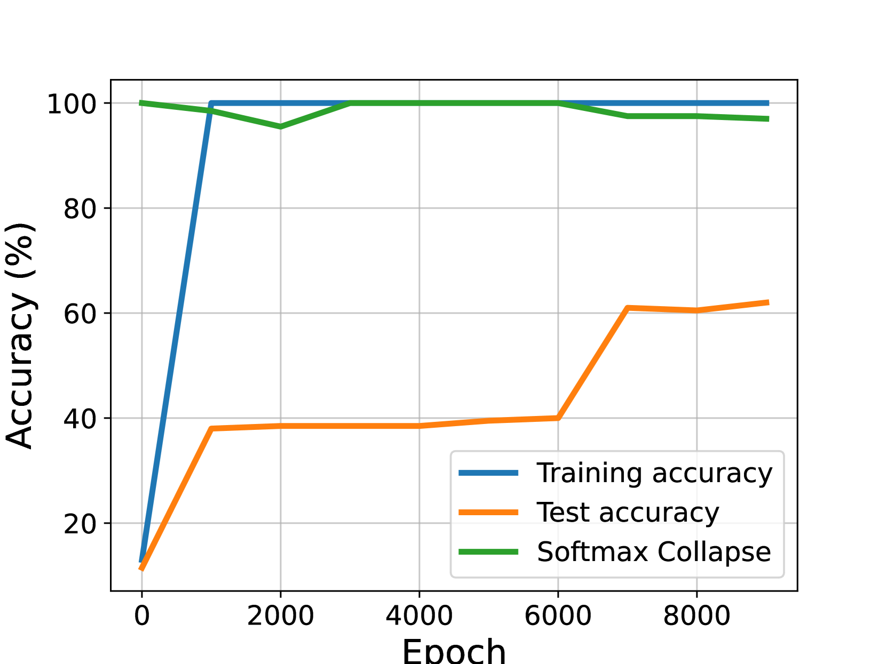

*(b) MLP with weight decay.*

*Figure 14: Replicating the grokking on MNIST for weight decay setting from Liu et al. (2023b). We find that MLPs with weights scaled up by 100 operate at the “edge of numerical stability” and in the absence of weight decay, SC eventually reaches 100%, preventing any further generalization. When using weight decay, the weight norm is reduced, mitigating SC and eventually allowing for further generalization as the SC rate drops from 100%.* **[p. 16]**

**[p. 17]**

###### p17-1

In Fig. 15, we provide a more in depth comparison of $\perp\!\mathrm{\!Grad}$ and weight decay. Fig. 15(a) highlights that increasing the weight decay multiplier leads to a smaller delay in generalization, but only up to a point. In this concrete setting, a weight decay multiplier of 8, prevents the model from fully generalizing (Fig. 15(a)). We then compare the best value of weight decay in this setting to $\perp\!\mathrm{\!Grad}$, which does not require any hyper-parameter tuning. Fig. 15(b) shows that $\perp\!\mathrm{\!Grad}$ leads to faster grokking even when compared to a tuned value of weight decay. Note that the models with weight decay overfit immediately before grokking while $\perp\!\mathrm{\!Grad}$ reaches 100% train and test accuracies almost at the same time.

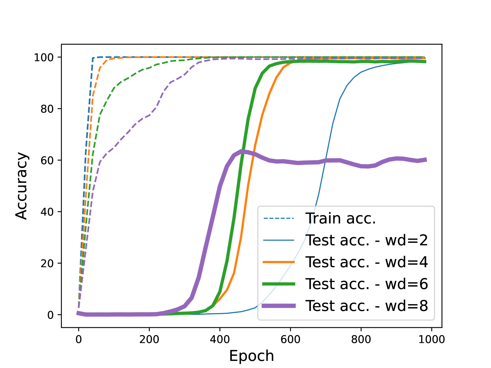

*(a) Sweep over values of weight decay*

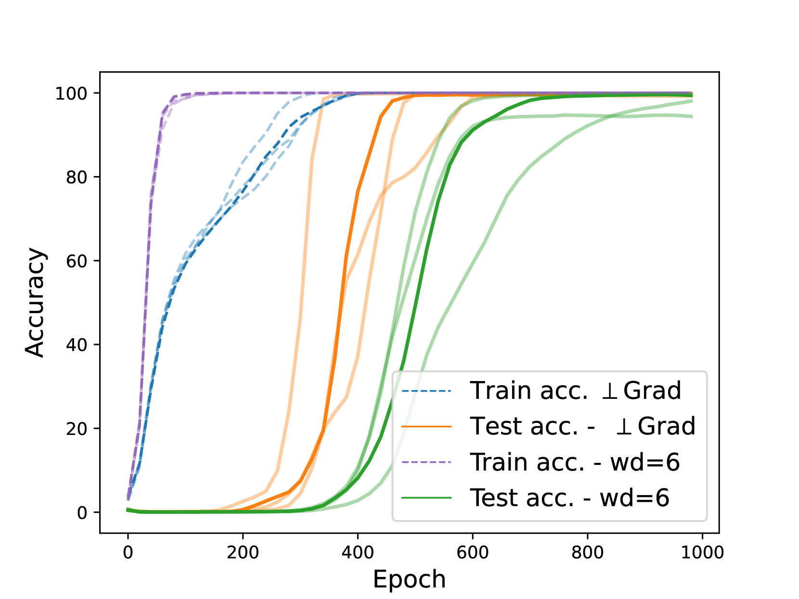

*(b) $\perp\!\mathrm{\!Grad}$ vs best performing wd model*

*Figure 15: Increasing weight decay (WD) for an MLP trained on modular addition with AdamW reduces the delay in generalization up to a point where WD prevents convergence Fig. 15(a). Without any tunable hyper-parameters and without WD, $\perp\!\mathrm{\!Grad}$ leads to grokking faster than the best model with WD Fig. 15(b).* **[p. 17]**

###### p17-4

While any intervention that prevents SC should lead to grokking or generalization, Fig. 16 shows that scaling the temperature of the $\mathrm{Softmax}$ is not enough to prevent SC and label smoothing does prevent SC and lead to some generalization, but at the cost of introducing another inductive bias that prevents full generalization and leads to qualitatively different behavior. By comparison, the simple change introduced in $\mathrm{StableMax}$ prevents SC and leads to grokking, serving as a validation for our hypothesis that gradient descent leads to grokking by default, unless this is stopped by SC.

###### fig-17

*Figure 17: Comparing Stablemax and $\perp\!\mathrm{\!Grad}$ to AdamW with SCE on text data Fig. 17(a) and image data Fig. 17(c). For the GPT2-small results in Fig. 17(a), we also include the results of replacing the $\mathrm{Softmax}$ in the attention mechanism with $\mathrm{StableMax}$.* **[p. 18]**

*Table 1: For the methods introduced in this paper, we report accuracies with standard deviations across five seeds for the CIFAR datasets and three seeds for Imagenet-1k and WikiText-103. We report Top-5 accuracy in the case of WikiText-103.*

**[p. 18]**

| **Method** | **CIFAR10** | **CIFAR100** | **ImageNet-1k** | **WikiText-103** (Top-5) |
|---|---|---|---|---|
| Softmax CE | $87.17\%\pm 0.2$ | $59.98\%\pm 0.4$ | $69.33\%\pm 0.04$ | $60.48\%\pm 0.04$ |
| Stablemax CE | $87.01\%\pm 0.2$ | $60.63\%\pm 0.4$ | $65.87\%\pm 0.22$ | $51.85\%\pm 0.47$ |
| $\perp\!\mathrm{\!Grad}$ | $87.22\%\pm 0.2$ | $62.69\%\pm 0.1$ | $68.95\%\pm 0.03$ | $59.64\%\pm 0.04$ |
| Stablemax Attention | – | – | – | $58.52\%\pm 0.04$ |

###### p18-4

Thilak et al. (2022) observed that spikes in the training loss appear when training on grokking tasks with adaptive optimizers like Adam, and that these spikes can lead to generalization without weight decay. Although Nanda et al. (2023) showed that slingshots are not necessary for grokking, it is still unclear what mechanism of adaptive gradient optimizers induces this behavior and why it leads to generalization. In light of the results in this paper, we believe that slingshots could lead to generalization because they prevent full SC. Nanda et al. (2023) pointed out that something like SC could be responsible for these slingshots. One possible mechanism would be that zero gradients for some samples due to SC rapidly diminish the second-order moments leading to a large update or slingshot which moves the model away from full SC, although more research would be needed to properly show this.

###### p18-5

While related to our work, slingshots are a different kind of instability which only appears with adaptive optimizers and can allow grokking. In contrast, we identify SC as a very specific issue in the $\mathrm{Softmax}$ that can affect any model trained with SCE, not only the ones trained with adaptive optimizers. Additionally SC prevents grokking whereas slingshots can lead to it. Wether and how slingshots are cause by SC remains an open research question, with some supporting evidence from Nanda et al. (2023) which show that slingshots can disappear when using $float64$.

###### p18-6

Beyond our main results, we found that in some cases, grokking could be stopped before SC due to the $\epsilon$ parameter in Adam being too large. While the $\epsilon$ term is designed to give numerical stability to the gradients, in settings with extremely low losses and gradients, the second order moments can be dominated by the $\epsilon$ term, putting an end to learning where it would have continued with a smaller $\epsilon$ value. This echoes the results in Thilak et al. (2022) which shows that increasing $\epsilon$ halts slingshots and grokking, with Nanda et al. (2023) also alluding to the $\epsilon$ parameter being important in some cases.

Surprisingly, we also found that a simple re-implementation of $torch.nn.functional.log\_softmax$ that does not use the official CUDA kernels can lead the models to keep learning beyond the point where the loss is exactly 0 and some gradients should be 0 with appropriate calculation, outperforming the official implementation for grokking tasks. Learning eventually also stops in this setting and this seems more like a quirk of how gradients are calculated in PyTorch in the absence of an explicitly defined backward pass.
