# Pomarico et al. 2025 — Grokking as an entanglement transition in tensor network machine learning

See also: [the global concept index](../../concepts/index.md). arXiv [2503.10483v1](https://arxiv.org/abs/2503.10483), 13 March 2025. The PDF has no running head (a Springer Nature template, page numbers only).

**Domenico Pomarico, Alfonso Monaco, Giuseppe Magnifico, Antonio Lacalamita, Ester Pantaleo, Tommaso Maggipinto, Marianna La Rocca, Sebastiano Stramaglia, Roberto Bellotti** — Dipartimento Interateneo di Fisica, Università degli Studi di Bari; Istituto Nazionale di Fisica Nucleare, Sezione di Bari. The corresponding author is Alfonso Monaco. **Loredana Bellantuono** — INFN Bari; Dipartimento di Biomedicina Traslazionale e Neuroscienze (DiBraiN), Università degli Studi di Bari. **Sabina Tangaro** — INFN Bari; Dipartimento Di Scienze Del Suolo, Della Pianta e Degli Alimenti, Università degli Studi di Bari. **Ernesto Picardi, Graziano Pesole** — Dipartimento di Bioscienze, Biotecnologie e Biofarmaceutica, Università degli Studi di Bari; Istituto di Biomembrane, Bioenergetica e Biotecnologie Molecolari, CNR, Bari. **Nicola Amoroso** — INFN Bari; Dipartimento di Farmacia-Scienze del Farmaco, Università degli Studi di Bari.

Sebastiano Stramaglia and Roberto Bellotti are marked as having contributed equally.

The files of this paper's analysis:

- [`2503.10483.grokking-as-an-entanglement-transition-in-tensor-network-machine-learning.license.txt`](2503.10483.grokking-as-an-entanglement-transition-in-tensor-network-machine-learning.license.txt) — the arXiv licence record for this paper.

The anchor scheme and the rules for linking into a card are in the [README of the papers folder](../README.md).

**Excerpt card.** The paper's licence (`arxiv-nonexclusive`) does not permit republishing the paper itself; what stands here are the editorial sections and the fragments the corpus quotes (right of quotation). The paper: <https://arxiv.org/abs/2503.10483>.

## Concepts covered

**[Grokking](../../concepts/grokking.md)** — the work carries the notion over to a carrier the corpus did not have before it: an MPS classifier (matrix product state) trained not by batch gradient descent but by sweeps in the spirit of DMRG, in which the role of an epoch is played by a sweep ([p9-1](#p9-1)) and the role of a complexity constraint by an SVD truncation at bond dimension $\chi$ ([p23-1](#p23-1)). The definition is borrowed and given in a single block: "beneficial generalisation beyond the memorisation of a finite training set in the overparameterised regime", with a reference to seven works at once, including Power et al. 2022 ([p2-4](#p2-4)); no analysis of any of them is carried out. The work's own contribution is a double signature: a simultaneous jump of performance on an independent set and a change of the growth law of the entanglement entropy along the chain of qubits ([p3-3](#p3-3)). The reference measurement: on the task "dress versus sneaker" the jump sets in at around sweep 60 out of 100, and the settled accuracy on the independent set is $88$% ([p10-2](#p10-2)). The most valuable thing for the corpus the authors say outright and against themselves: grokking entails an entanglement transition, but not the converse ([p13-1](#p13-1)). An essential caveat that the authors do formulate but do not carry into the definition: on the gene data the gain on the independent set falls at approximately the same sweep as the highest accuracy on the training set ([p16-1](#p16-1)), that is, there is no delayed generalisation — the very thing by which grokking is defined in Power et al. — in that half of the experiments; a delay of forty sweeps is visible only on fashion MNIST ([fig-4](#fig-4)). What the work does not contain: modular arithmetic and algorithmic tables, SGD or Adam, weight decay or any explicit regularisation at all, measurements of the weight norm, the length of the plateau or the fraction of training data as a control quantity; nor is there a comparison with an ordinary neural network on the same data, so the identity of the observed phenomenon with the grokking of Power et al. remains an assumption rather than a check.

**[Phase transition](../../concepts/phase-transition.md)** — the frame is borrowed entire from the physics of measurement-induced entanglement transitions: barren plateaus are identified with a volume law of entanglement and truncation with renormalisation is identified with a projective measurement, whereupon the transition is named a transition "from a volume to a sub-volume law" after the model of ion traps ([p3-2](#p3-2)). A quantum version of the NTK is mentioned separately, in which grokking is described as a dynamical phase transition between a frozen-kernel and a frozen-error phase with a transcritical bifurcation ([p2-5](#p2-5)); the authors do not check their own picture against it. What the work does not contain: a control parameter (an analogue of the measurement frequency in the literature cited), a phase diagram, critical exponents, finite-size scaling or any quantitative check that the transition is a phase transition at all — the authors' words "critical" and "transition" are descriptive, and the area law itself is rejected in section 4.2 ([p20-1](#p20-1)).

**[The order parameter](../../concepts/order-parameter.md)** — the work proposes for this role the growth law of the entanglement entropy along the lattice, measured by the slope of a linear fit $\log S=q+c\log i$ over eight sites from each boundary ([p18-1](#p18-1)) — and it itself shows that the quantity is unfit for the role. An entanglement transition is observed in all twenty gene communities, whereas an effective grokking occurs in about $60$% of the cases ([p13-1](#p13-1), [p17-1](#p17-1), [p27-4](#p27-4)); the artificial degenerate control "sneaker versus sneaker", in which there is nothing to classify, still gives a transition in the density spectrum ([p27-1](#p27-1)). The authors never use the term "order parameter", and this framing cannot be credited to them: in them the quantity is called a signature rather than an order parameter, and the one-sidedness of the relation they record as a result rather than as a defect.

**[Spectral analysis / FVE](../../concepts/spectral-analysis-svd-esd-fve.md)** — the spectrum here is not the spectrum of a weight matrix but the spectrum of the reduced density matrix $\varrho_{\lfloor N/2\rfloor}$ at a half-chain partition, and the work gives the corpus a rare observation: a successive "evaporation of eigenvalues" — a detachment from the continuous part of the distribution — which, by the authors' formulation, encompasses the grokking transition; the first to detach reach about 0.5, then gather into a separate group centred on 0.018 ([p11-3](#p11-3), [fig-6](#fig-6)). The learning mechanism itself is spectral too: every step is an SVD with a truncation to the $\chi$ largest singular values and a renormalisation ([p23-1](#p23-1)). What the work does not contain: a power-law fit of the eigenvalue distribution, heavy-tail exponents, random-matrix baselines or any spectral statistics beyond histograms; the connection of the evaporation with the grokking is shown by a coincidence in time on two datasets.

**[The emergence of features](../../concepts/feature-emergence-feature-learning.md)** — what is called feature extraction here is the picture of the local magnetisation of the qubits: the final magnetisations, laid back out into a $6\times 6$ square, reproduce the silhouette of the object, with a positive magnetisation corresponding to black pixels ([p10-4](#p10-4), [fig-4](#fig-4)). The order in which features emerge in the two masks is traced across the sweeps and turns out to differ: in most of the fashion MNIST tasks the sneaker mask magnetises first, in community C29 the HCC mask, in C41 the control one ([p16-1](#p16-1), [p25-1](#p25-1)). What the work does not contain: a check that it is precisely the extracted picture that the classifier recognises — there are no ablations and no interventions; the resemblance of the magnetisation picture to the pixel saliency maps of explainability methods for vision transformers is declared as an analogy ("mimics the output") with no comparison whatever ([p10-4](#p10-4)).

**[Real data and vision](../../concepts/vision-real-world-data-mnist-cifar.md)** — what serves as the contribution here is an extremely reduced setting: fashion MNIST compressed to $6\times 6$ pixels, $1$% of the sample taken, that is, 60 objects per label split evenly between training and test, with the tasks being "sneaker versus each of the other nine labels" ([p7-1](#p7-1), [fig-3](#fig-3)). The authors admit outright that at this resolution the sneaker is recognised by the first and last black rows of pixels and that the only confusable label is the sandal ([p7-1](#p7-1)). The bond dimension $\chi=400$, the same for all nine tasks, and the spread of the moment of transition, attributed to the initial random configuration and to the particular subsample of images, are in [p25-1](#p25-1). What the work does not contain: the original resolution, MNIST and CIFAR, confidence intervals and repetitions over seeds (there is no run in the paper that would measure the spread ascribed), and any comparison with a non-quantum model on the same subsamples.

**[The memorisation phase / the plateau](../../concepts/memorization-phase.md)** — in the text the overfitted regime is mentioned only in passing: the jump of the metrics on the independent set is described as occurring against the background of "the metrics mentioned growing in the overfitting regime for the training set" ([p10-2](#p10-2)), and no numbers about the memorisation phase are given. The plots themselves say more than the text, and in different directions. On fashion MNIST there is indeed a plateau: in [fig-4](#fig-4) all three training metrics reach 1.0 at around sweep 18–20 and hold there until the jump on the independent set at around sweep 58–60, that is, the delay occupies about forty sweeps. On the gene data there is no delay at all: in [fig-8](#fig-8) the training accuracy for C29 is still growing at the moment of the jump, and the authors say so themselves — the gain in generalisation performance falls "at approximately the same sweep as the highest accuracy performance for the training set" ([p16-1](#p16-1)). What the work does not contain: the training loss on the plots (only the metrics are shown), a measured length of the plateau, and a caveat that in half the experiments the phenomenon called grokking is not delayed.

**[The neural tangent kernel](../../concepts/neural-tangent-kernel-ntk.md)** — a mention in the survey part of the introduction: the training dynamics is "well captured" by the NTK, the frame has been extended to quantum neural networks, and there grokking manifests as a transition between a frozen-kernel and a frozen-error phase ([p2-5](#p2-5)). What the work does not contain: no kernel is computed here, the MPS training regime is not compared with the NTK picture, and the work of Guo & Draper on the NTK for MPS is cited elsewhere and for another purpose; the connection remains a motivation.

**[Effective theory / statistical mechanics](../../concepts/effective-theory-statistical-mechanics.md)** — the paper transposes the measurement apparatus of quantum many-body physics onto a classifier entire: the von Neumann entropy at every cut of the chain, the volume law of a random initial state with a saturation in the middle ([p11-2](#p11-2)), a linear fit of the logarithms and coefficients of determination as a measure of the quality of the law ([p18-1](#p18-1), [fig-14](#fig-14)), and a rejection of the area law in favour of a sub-volume one, because the area law requires a logarithmic dependence and would presuppose a locality of the interaction ([p20-1](#p20-1)). What the work does not contain: an effective loss, a coarse-grained model, a derivation of the dynamics — physics here serves as a vocabulary of measurements rather than as a theory; not a single analytical statement about the transition itself is derived, and no connection is drawn with the thermodynamic descriptions of grokking in the corpus (Rubin et al., Clauw et al.), although both works are cited in the introduction in a single block ([p2-4](#p2-4)).

---

## Points we could not reconcile

**The introduction promises an area law; section 4.2 renounces it.** Discussing Fig. 1, the authors write that a transition of the entanglement entropy occurs "from a volume to an area growth law" ([p3-4](#p3-4)); [p20-1](#p20-1) says the exact opposite: "we define such a behaviour as sub-volume laws, because an area law requires a logarithmic dependence", and a regime of local interaction cannot be established. The paper's keywords, the title of Appendix 8 and the survey part of the introduction ([p3-2](#p3-2)) all speak of a transition "from volume to sub-volume" — it is precisely the paragraph [p3-4](#p3-4) that diverges. A reader citing "a transition from a volume to an area law" in Pomarico et al. should know that the authors themselves rejected that variant.

**The entropy falls at the grokking — except in the two chief biological examples, where it grows.** The general picture is set out as a sharp decrease of the entropy, typical of a sub-volume law ([p12-1](#p12-1), [fig-7](#fig-7)). For C29 and C41 — the very two communities called "the most meaningful from a biological point of view" and on which the whole applied part rests — the greatest value of the half-lattice entropy **exceeds** the saturation value of the initial random MPS ([p16-2](#p16-2)). The discrepancy is noted as "a different dynamics" and is carried over neither into the conclusion about the sub-volume law nor into the formulations of the introduction and the conclusion.

**The features are declared to be cut down to the intersection with the independent set, yet the lattice is taken at the original size.** [p12-2](#p12-2) says that checking the generalisation requires reducing the gene expressions used from GSE102079 to their intersection with those common to GSE54236, and Appendix 9 speaks of "a reduction of the sizes of the communities" ([p29-1](#p29-1)). Yet for C29 and C41 the lattice is composed of $N=48$ qubits ([p16-1](#p16-1)) — exactly the number of genes standing against those communities in Table 1 before any intersection. Either the intersection removed not a single gene from these two communities (which is not stated), or one of the two statements about the size is wrong; this cannot be checked from the paper, because the sizes after the intersection are nowhere given.

## What is shown and what is conjectured

There are no formal statements in the paper: no theorems, no derivations, no analytical estimates — the whole argument is numerical. Nonetheless both the abstract ([p2-2](#p2-2)) and the conclusion ([p21-4](#p21-4)) use the turn "we numerically prove". What is shown is the following: on two small binary settings the moment of the jump of the metrics on the independent set coincides in time with a kink in the entanglement entropy profile and with an evaporation of eigenvalues; an entanglement transition is observed in all twenty gene communities, whereas an effective grokking occurs in about $60$% ([p13-1](#p13-1)); and in the degenerate control "sneaker versus sneaker" the transition is visible where there is nothing to classify ([p27-1](#p27-1)). There is not a single intervention in the work that would change one observable independently of the other, so what is shown is a coincidence rather than a causality.

It is worth noting separately the places where there is no hedge and no grounds for a causal verb are given. Of the evaporation of eigenvalues it is said that it "encompasses the grokking transition" ([p11-3](#p11-3)). The SVD truncation with a subsequent rescaling is declared to be "effectively performing a projective measurement" ([p24-5](#p24-5)) — an identification by which the setting is brought under the literature on measurement-induced transitions, but no analogue of the measurement frequency as a control parameter is introduced and there is no phase diagram in it. The resemblance of the magnetisation picture to the explainability methods for vision transformers is declared by the word "mimics" ([p10-4](#p10-4)) with no comparison. Finally, the claim that "the correlations are greatest at the point of grokking" is partly built into the procedure: the moment at which the correlations are taken is chosen separately for each mask by the largest $|C^{k}_{i,j}|$ ([p16-6](#p16-6)).

What was not measured: the spread of the moment of transition is attributed to the initial random configuration and to the particular subsample of images ([p25-1](#p25-1)), but there is no run over seeds in the paper that would measure this; there are no confidence intervals, repetitions or statistical tests in any table; and there is no comparison with a non-quantum model on the same data. The code is not published — it is "available from the authors upon reasonable request" ([p22-3](#p22-3)).

Finally, three things are visible in the figures and left unsaid in the text, and they substantially change what the results are evidence of. First: the legend of [fig-7](#fig-7) gives the accuracy of each of the ten fashion MNIST classifications, and two of them lie at or below the level of chance — sandal 0.47 and the degenerate control "sneaker versus sneaker" 0.27, while the ankle boot gives 0.59; yet [p25-1](#p25-1) says that the grokking transition is observed in all the remaining cases. That is, the one-sidedness of the relation, declared for the gene communities ([p13-1](#p13-1)), is confirmed on fashion MNIST too, only there it is not noted. Second: the length of the delay is nowhere named, but by [fig-4](#fig-4) it amounts to about forty sweeps, while by [fig-8](#fig-8) there is no delay for C29 — the training accuracy attains its greatest value simultaneously with the jump on the independent set, which the authors write outright ([p16-1](#p16-1)). Third: the number of sweeps for the gene communities is not named in the text, and in [fig-8](#fig-8) the axis for C29 runs to 50, whereas the transition sweep for C41 equals 107 ([p16-4](#p16-4)) — the run lengths differ, and what exactly "the end of the training" in [p20-1](#p20-1) falls on cannot be established from the paper.

## Common misreadings and overstatements of this paper

Below are the patterns observed in the citing works of the corpus: what exactly is distorted in the retelling and where in the authors' own text the check leads. Neither citing work has a card as yet, so there are no "details" links here; the candidates for analysis in their future cards are written out separately.

**"The entanglement transition is accompanied by a shift of the representation's bond dimension" (erroneous).** Pranjić, Roth and Tutschku (2607.08350) retell the work thus: [`"investigations into tensor networks suggest that grokking may manifest as an entanglement transition, where generalization coincides with shifts in the representation’s bond dimension and entropy"`](https://arxiv.org/abs/2607.08350). The hedge "may manifest" is carried over exactly, which makes the distortion the more noticeable: the only thing that can shift in Pomarico et al. is the entropy. The bond dimension $\chi$ in the paper is not an observable but a hyperparameter, set by hand before the training and constant throughout a run: $\chi=400$ for all nine fashion MNIST tasks ([p25-1](#p25-1)) and chosen per community for the gene data — $1000$ for C12, C28, C29 and C41, $300$ for C23, $100$ for C24 ([p27-2](#p27-2)). Moreover, in this work the bond dimension acts as an obstacle to the measurement rather than as its subject: it is precisely what sets the saturation of the entropy, on account of which the fit is carried out over only eight sites from each boundary ([p18-1](#p18-1), [fig-14](#fig-14)), and the single departure from the volume law on the initial random state is caused not by the state of the network but by the small $\chi=100$ of C24 ([p18-1](#p18-1)). A retelling in which $\chi$ "shifts" together with the entropy credits the work with a measurement it does not contain.

An example of an accurate formulation is given by the second citing work, 2507.23346 (Pomarico, Cilli, Monaco et al. 2025 — in part the same authors): [`"a transition from a high-entropy, volume law regime at early sweeps to a lower-entropy, sub-volume law regime as training progresses"`](https://arxiv.org/abs/2507.23346). Here both the word "sub-volume" is retained (rather than "area", which the authors rejected in [p20-1](#p20-1)) and the fact that what changes is the entropy and its growth law.

---
---

# Quoted fragments

Only the fragments the corpus cards refer to are
reproduced here (right of quotation); the paper's licence does not permit
republishing the whole text. Anchor numbering matches the original.

###### p2-2

Grokking is a intriguing phenomenon in machine learning where a neural network, after many training iterations with negligible improvement in generalization, suddenly achieves high accuracy on unseen data. By working in the quantum-inspired machine learning framework based on tensor networks, we numerically prove that grokking phenomenon can be related to an entanglement dynamical transition in the underlying quantum many-body systems, consisting in a one-dimensional lattice with each site hosting a qubit. Two datasets are considered as use case scenarios, namely fashion MNIST and gene expression communities of hepatocellular carcinoma. In both cases, we train Matrix Product State (MPS) to perform binary classification tasks, and we analyse the learning dynamics. We exploit measurement of qubits magnetization and correlation functions in the MPS network as a tool to identify meaningful and relevant gene subcommunities, verified by means of enrichment procedures.

###### p2-4

Within the framework of conventional machine learning the sudden gain in classification performances for unseen data is known as grokking. It is intended as a benign generalization beyond a finite training dataset memorization in an over-parameterized regime Power et al. 2022; Liu et al. 2022; Liu et al. 2023; Miller et al. 2024; Varma et al. 2023; Huang et al. 2024, effectively giving rise to a competition between slow and fast degrees of freedom Varma et al. 2023; Huang et al. 2024; Mei et al. 2018; Seroussi et al. 2023, which leads to a transition characterized by a synergistic behavior among extracted features Rubin et al. 2024; Clauw et al. 2024.

###### p2-5

The description of training dynamics is well captured by neural tangent kernel Jacot et al. 2018, a theoretical framework that has been extended to quantum neural networks Liu et al. 2022; Liu et al. 2023; Zhang et al. 2023; Zhang et al. 2024a; Zhang et al. 2024b. **[p. 3]** In the quantum context, grokking manifests as a dynamical phase transition between frozen-kernel and frozen-error phases, characterized by a transcritical bifurcation Liu et al. 2022; Zhang et al. 2023. This description has been further enriched to account for varying dataset cardinalities Zhang et al. 2024b.

Biological data and drug discovery applications in pharmacology inherently involve complex, large-scale datasets. These challenges can be addressed through combined approaches that exploits both quantum models and big data machine learning tools Banchi et al. 2020; Yu et al. 2023; Vakili et al. 2024; Batra et al. 2021, with particularly promising applications in cancer classification and risk assessment Pomarico et al. 2025; Repetto et al. 2024; Pomarico et al. 2021; Massafra et al. 2022; Fanizzi et al. 2023. In general, implementing the large quantum circuits required for these applications remains challenging on current quantum hardware Zhang et al. 2024b; Repetto et al. 2024, with only initial demonstrations achieved through quantum annealing approaches Willsch et al. 2020; Li et al. 2018; Li et al. 2021.

###### p3-2

The management of of a much higher computational complexity through Matrix Product State (MPS) Stoudenmire and Schwab 2017; Guo and Draper 2021; Ballarin et al. 2023 is essential with respect to machine learning applications involving datasets endowed by a high number of features Glasser et al. 2018; Glasser et al. 2020; Gallego and Orús 2022; Cheng et al. 2019; Chen and Barthel 2023. An increasing complexity of the considered dataset, quantified in terms of the required number of qubits and parameters, may lead towards a drop in generalizability Zhang et al. 2024a. The increasing dimension of the space for solution inherently includes barren plateaus McClean et al. 2018; Larocca et al. 2022; Larocca et al. 2023, identified with the entanglement volume law and managed by means of projective measurement able to decode nonlocal correlations in the variational circuit characterizing the area law Wiersema et al. 2023; Nahum et al. 2017; Vasseur et al. 2019; Zhou and Nahum 2019; Choi et al. 2020; Bao et al. 2020; Nahum et al. 2021; Bao et al. 2021; Sharma et al. 2022; Ge and Nori 2024. More generally the transition is referred to a volume to sub-volume law, as determined for the experimental framework of ion traps Sierant et al. 2022; Gullans and Huse 2020a; Gullans and Huse 2020b. This case is properly suited for the targeted quantum machine learning framework, since an area law typifies systems endowed with local interactions, while the exploited data encoding in a one-dimansional lattice of qubits cannot ensure the absence of long range entanglement before features extraction.

###### p3-3

In this paper we investigate the grokking phenomenon in MPS machine learning Stoudenmire and Schwab 2017. We numerically show that grokking manifests through two concurrent signatures: an improvement in test data classification performance and a distinct change in the entanglement entropy scaling along the one-dimensional qubit chain. Starting from randomly initialized MPS, we numerically identify a transition in the entanglement spectrum pointing out a connection with eigenvalue evaporation De Pasquale et al. 2010; Torlai et al. 2014; Facchi et al. 2019.

###### p3-4

We consider two datasets, as use case scenarios, namely fashion MNIST Glasser et al. 2020 and gene expressions from gene expression omnibus (GEO) of hepatocellular carcinoma (HCC), partitioned in communities as defined in Lacalamita et al. 2023. The workflow adopted for the two datasets is shown in Fig. 1. Fashion MNIST is referred to Fig. 1(a), which show features extractions as magnetization patterns in the MPS masks. Corresponding to this gain in generalization performances that we are going to discuss in the following, an entanglement entropy transition, from volum- to area-law scaling, takes place: in the volume-law phase we pictorially represent the three-dimensional graph edges as a description of how entanglement connects each element in the one-dimensional lattice in a all-to-all fashion beyond the spatial proximity, while at grokking the detected sub-volume law partially unravels a more localized entanglement structure.

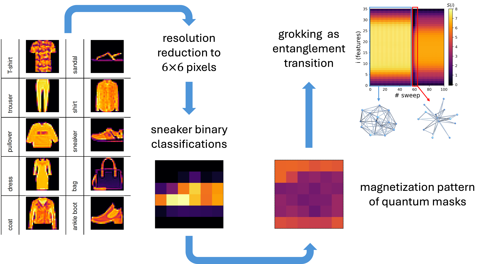

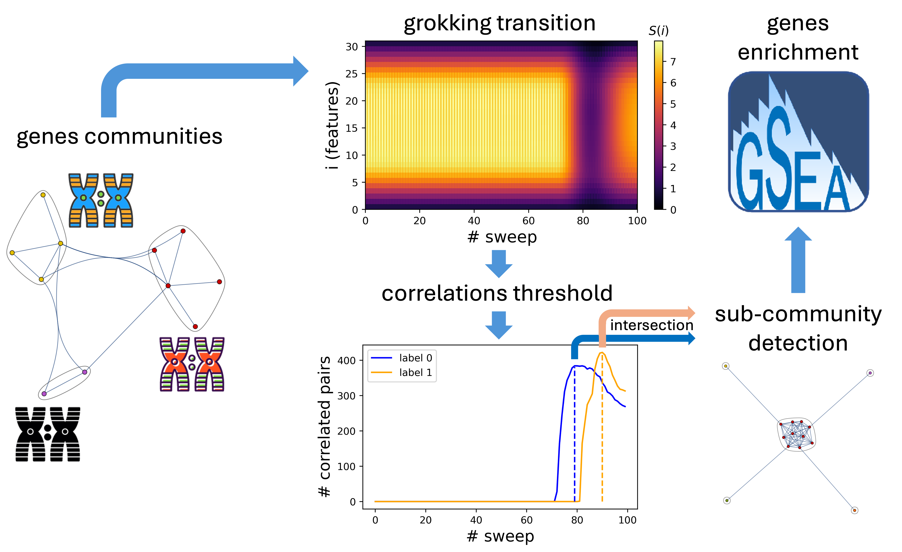

*Figure 1: A flowchart representing the adopted workflow, based on fashion MNIST for panel (a) and gene communities identified in Lacalamita et al. 2023 for panel (b). The grokking behavior is characterized for each binary classification involving sneaker with a reduced resolution version of fashion MNIST, as resumed in panel (a). Features extraction emerges with magnetization patterns corresponding to generalization and to the entanglement transition from volume-law of the initial random MPS. In panel (b) for each community features subset we ascertain whether or not the entanglement transition takes place, such that a correlation threshold can be imposed to select gene expressions pairs during the features extraction stage associated with grokking. Once the maximal number of pairs is identified for each class, their intersection defines the sub-community, which are further evaluated in terms of gene set enrichment analysis.* **[p. 4]**

The workflow regarding the gene expressions communities classifications is shown in Fig. 1(b). We focus on the two biologically meaningful communities described in Lacalamita et al. 2023, **[p. 5]** highlighting the presence of the associated grokking transition. This critical behavior is characterized in terms of entanglement entropy scaling. Furthermore, after the training phase, we exploit pairwise quantum-like correlations among gene expressions to determine relevant gene sub-communities. These sub-communities are evaluated through gene set enrichment analysis (GSEA), aiming at the discovery of new candidate biomarkers for diagnosis and prognosis Woo and Kim 2018; Lacalamita et al. 2023, e.g. the immune microenvironment Loose and Van de Wiele 2009; Gao et al. 2021; Prieto et al. 2015; Hou et al. 2020 or metabolic abnormalities and alcohol consumption Shin et al. 2023 with related serum biomarkers Yi et al. 2018. Another example used in clinical practice is referred to alpha-fetoprotein biomarker, correlated with the observed enrichment of vascular endothelial growth factor Galle et al. 2019; Parikh et al. 2020. Hormones and estrogen enrichments are included as well, even if the latter is endowed with a controversial role as both a carcinogen and protective effect in liver Baldissera et al. 2016. These characterizations are supported by the proposed sub-communities detection, which underlines the enrichment of Wnt pathways.

The manuscript is structured as follows. In Section 2 we introduce MPS as a mask for machine learning recognitions. In Section 3 we highlight for the fashion MNIST dataset the emerging features extraction as magnetization patterns. In Section 4 relevant gene sub-communities are detected through quantum correlations along the qubits lattice corresponding to the entanglement entropy transition.

###### fig-3

*Figure 3: Representative elements of the fashion MNIST dataset, both in the original resolution $28\times 28$ pixels and compressed version $6\times 6$.* **[p. 7]**

**[p. 7]**

###### p7-1

The fashion MNIST dataset is generally considered as a benchmark for machine learning models Glasser et al. 2020. It consists of $60,000$ images, with $28\times 28$ pixels, referring in a balanced way to 10 labels, namely T-shirt, trouser, pullover, dress, coat, sandal, shirt, sneaker, bag, ankle boot. In order to obtain a dataset with a comparable cardinality of the one presented in Section 2.2 and minimize the influence of the latter on the grokking behavior, we use subsamples composed by $1\%$ of the original images, then split in half for train and test. We select a particular class of binary classification problemss by choosing sneakers versus any remaining label, thus namely selecting 60 samples per label. This choice is explained in Fig. 3, since to make the simulation feasible we compress the original images in a $6\times 6$ pixels format. The characterizing trait of sneaker in the low resolution is based on the first and last black pixel rows, with just one confounding label referring to sandal, making it an easily recognized pattern. **[p. 8]** In order to map such images in a one-dimansional lattice, we unroll each element as a sequence of rows from top to bottom.

###### fig-4

*Figure 4: Grokking for the binary classification dress versus sneaker. In panel (a) every plot is referred to the considered 100 sweeps, with evaluation metrics in the top left, reduced density matrix in the top right and local magnetization per mask at the bottom. In panel (b) the rearranged squared images of the two objects are obtained from the final local magnetizations, with the same color map used in panel (a).* **[p. 9]**

###### p9-1

An illustrative example from the first dataset involves the binary classification of dress (label 0) versus sneaker (label 1) in Fig. 4. In panel (a) every plot is referred to a sweep axis, that can be interpreted as an analogous concept of epoch in conventional machine learning, as briefly explained in Appendix 6. The top left plot shows the behavior of three metrics, namely accuracy, sensitivity (also known as recall) and specificity:

**[p. 10]**

$$
\mathrm{accuracy}= \ \frac{TP+TN}{TP+TN+FP+FN}, \tag{4} \\
\mathrm{sensitivity}= \ \frac{TP}{TP+FN}=P(|f_{W}^{1}(\mathbf{x})|>|f_{W}^{0}(\mathbf{x})||y=1), \tag{5} \\
\mathrm{specificity}= \ \frac{TN}{TN+FP}=P(|f_{W}^{1}(\mathbf{x})|<|f_{W}^{0}(\mathbf{x})||y=0), \tag{6}
$$

where $TP$ and $TN$ stand for true positives (number of sneaker correctly classified) and true negatives (number of dress correctly classified), while $FP$ (number of dress identified as sneaker) and $FN$ (number of sneaker identified as dress) are false positives and false negatives, respectively.

###### p10-2

The peculiar grokking behavior emerges after approximately 60 sweeps, since aforementioned metrics increase in an overfitting regime for the training set, while concerning the independent set a sudden jump of sensitivity is followed by the one of specificity, thus reaching a stable trade-off between them yielding an accuracy equal to $88\%$ after 100 sweeps.

###### p10-4

The plots at the bottom of Fig. 4(a) illustrate the behavior of the two masks in terms of local magnetization of the underlying quantum states. When the sensitivity of the independent set undergoes a significant increase, the subspace associated with the sneaker mask dominates the training dynamics. From there on, the presence of the competing dress mask redistributes the training dynamics between the two components, leading to an increase in specificity. The final masks rearranged in a squared format are shown in panel (b), where we observe positive magnetization corresponding to black pixels in Fig. 3, such that the shape of the corresponding object is recognized. This behavior mimics the output of explainability techniques based on features relevance propagation through vision transformers: the color map representation of this quantity over input images allows to figure out the pixels weight affecting the classifier identification of depicted objects Abnar and Zuidema 2020; Chefer et al. 2021.

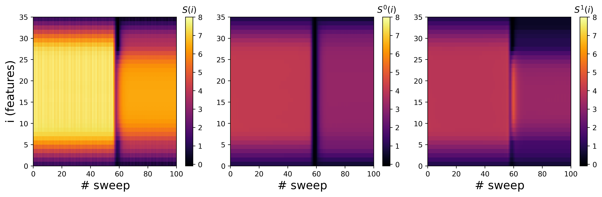

*Figure 5: Entanglement entropies $S(i)$, $S^{0}(i)$ and $S^{1}(i)$, from left to right, along the one-dimensional lattice for each bipartition corresponding to the edge separating sites $s_{i}$ and $s_{i+1}$ in the MPS tensor $W$, $W^{0}$ and $W^{1}$, respectively.* **[p. 10]**

**[p. 11]**

The dynamics of the local magnetization leading to a mask matching with the pattern typifying the targeted label is determined also by analyzing the modification of entanglement along the one-dimensional lattice. We quantify this dynamical behavior through Von Neumann entropy Bengtsson and Zyczkowski 2006, considered for the global and projected state into a specific label subspace, $S(i)$ and $S^{\ell}(i)$ respectively, evaluated corresponding to each bipartition obtained at a specific edge in the MPS between consecutive features $(i,i+1)$.

###### p11-2

In Fig. 5 we show collected results about entanglement entropies concerning the binary classification problem for dress versus sneaker. We start with each tensor of the MPS randomly sampled according to a Gaussian distribution: this initial condition causes an all-to-all entanglement of qubits beyond their spatial proximity with a volume-law behavior for the entropy, which grows linearly with the distance from the boundary, reaching a saturation in the middle of the chain, highlighted in the first plot of Fig. 5. Corresponding to the first mask transition during training, represented for the sneaker label in Fig. 4(a), the tensor components $W^{0}$ for the dress label are not involved in the training dynamics for a few sweeps before the 60-th sweep, as we can verify with a vanishing entropy $S^{0}(i)$ along the lattice, in this transition condition expressing the drained dynamics in the opposite label subspace, as shown in Fig. 6. After this sweep the off-diagonal coherence elements of $\varrho^{(\ell)}$ vanish, thus implying independent masks. The tensor components $W^{1}$ also shows an almost vanishing entropy corresponding to the spins “switched-on” by the pattern recognition associated with a shape of sneaker, namely the first and last row of resized and unrolled image in Fig 3, which become almost dynamically decoupled during the following sweeps. This decoupling is easily understood if we figure out that once some characterizing features of a pattern are extracted, the loss function will forbid to forget the acquired memory because of gradient descent. This phenomenon concentrates the norm of the reduced state in the specific label subspace along those features directions spanning the extracted pattern, thus causing some eigenvalues to be significantly higher than other meaningless directions with respect to the considered classification, as represented in Fig. 6.

###### fig-6

*Figure 6: Spectrum dynamics of the density matrix $\varrho_{\lfloor N/2\rfloor}$ referring to the bipartition along the edge joining the sites pair $(\lfloor N/2\rfloor,\lfloor N/2\rfloor+1)$. In the top panel the highest 100 eigenvalues with respect to the sweep number are denoted with graded colors from red to black. Lower panels represent the histogram distribution of such eigenvalues in the plot at the left, while histograms at the center and at the right describe eigenvalues distribution of the aforementioned density matrix projected in each label subspace.* **[p. 12]**

###### p11-3

In order to monitor variations at the level of the density matrix spectrum, we consider the bipartition associated with sites pair $(\lfloor N/2\rfloor,\lfloor N/2\rfloor+1)$. We denote the density matrix referred to this bipartition by $\varrho_{\lfloor N/2\rfloor}$, whose spectrum dynamics corresponding to the sweeps involved in the transition is shown in Fig. 6. In the top panel we detect a sequence of eigenvalues evaporation Facchi et al. 2019, i.e. a split off from the continuous distribution of eigenvalues, that activate the grokking transition. The first eigenvalues that become detach from the bulk reach high values (up to 0.5 approximately), but then converge towards a separated group centered at 0.018. In the lower panels we can verify that the spectrum at the end of training sweeps is given by the combination of the two spectra referring to the two labels (with projections $P_{0}$ and $P_{1}$), because of the vanishing off-diagonal elements of the reduced density matrix $\varrho^{(\ell)}$ in the label space. This statement holds true at the transition sweep. Instead the initial random state is endowed with coherence between label subspaces, thus it is characterized by a more complex behavior.

###### fig-7

*Figure 7: Entanglement entropy along the lattice evaluated corresponding each bipartition defined with respect to the link joining the features pair $(i,i+1)$. The top panels are referred to the initial random tensor $W$, yielding a volume law, while the bottom panels describe the grokking condition, highlighting a sharp entropy reduction, typifying a subvolume law entanglement transition. The legend reports the ranking of each binary classification problem for the fashion MNIST dataset with respect to accuracy.* **[p. 13]**

**[p. 12]**

###### p12-1

The characterization of sneaker images is investigated in the remaining fashion MNIST binary classifications, as represented in Fig. 7. In the top panels the initial randomized condition is depicted, with a volume law consisting in a linearly increasing entropy from both boundaries up to an upper bound imposed by the bond dimension, as previously mentioned in Fig. 5. In the bottom panels the entropy profiles at the grokking condition underline the entanglement transition, with a sharp entropy reduction, typifying a subvolume law entanglement behavior.

###### p12-2

The emerging grokking transition is further investigated in gene expression datasets about HCC presented in Section 2.2. The feature extraction involved at this training stage promotes the identification of gene sub-communities encapsulating the information required for generalization. The flowchart scheme in Fig. 1(b) exemplifies **[p. 13]** the workflow adopted in order to achieve this goal. As presented in Section 2.2, we consider the best performing communities determined during training in Lacalamita et al. 2023. The generalization test requires the reduction of the exploited gene expression in GSE102079 to the intersection with common ones in GSE54236 independent sets. During training dynamics we monitor the emergence of an entanglement transition, such that we can take into account correlations, introduced in Eq. (3), corresponding to a critical grokking condition. For increasing thresholds $t\in[0,1]$ with step size equal to 0.1, we consider absolute values of correlations $|C^{k}_{i,j}|>t$ in order to detect both correlated and anti-correlated feature pairs. The number of these pairs is maximal corresponding to the grokking transition, even if for each label $k=0,1$ the sweep may vary. The sub-community is identified by the intersection of these two maximal list of features pairs. We evaluate the effective information content of sub-communities obtained for each threshold through the GSEA gene enrichment procedure (https://www.gsea-msigdb.org/gsea/msigdb/human/annotate.jsp).

###### fig-8

*Figure 8: Grokking in the HCC classification for the two biologically meaningful communities C29 and C41 determined in Lacalamita et al. 2023, referred to panel (a) and (b), respectively. In both cases the top left plot describes evaluation metrics for the training and independent set. The two density plots at the top show the local magnetization dynamics projected in the two label subspaces. At the bottom of each panel entanglement entropies $S(i),S^{0}(i),S^{1}(i)$ are shown.* **[p. 14]**

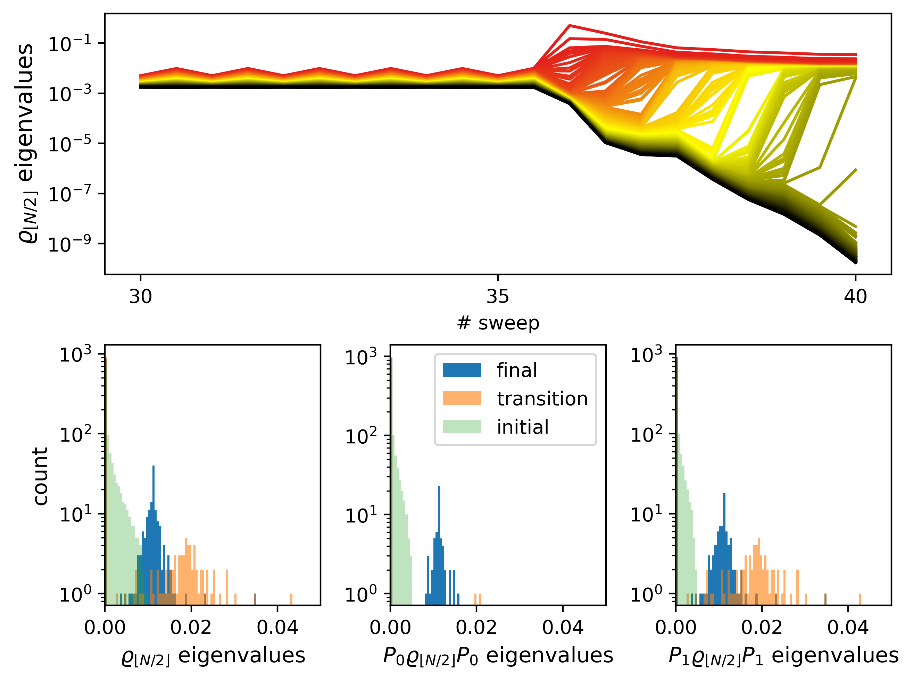

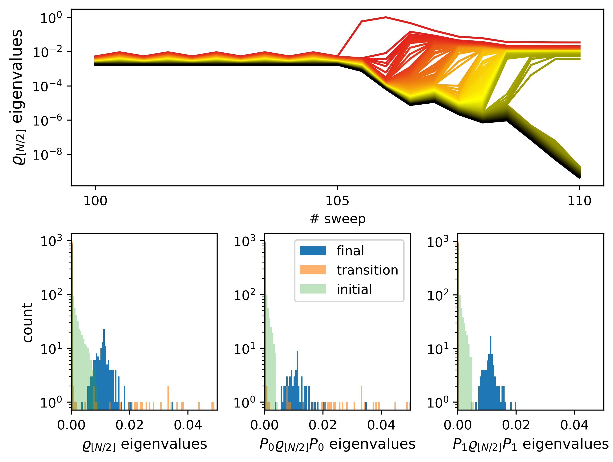

*Figure 9: Spectrum dynamics of the density matrix $\varrho_{\lfloor N/2\rfloor}$ for the half lattice bipartition of communities C29 and C41 in panel (a) and (b), respectively. The highest 200 eigenvalues with respect to the sweep number are denoted with graded colors from red to black in the top panel. Histogram of eigenvalues distribution in the bottom left panel, while the one of $\varrho_{\lfloor N/2\rfloor}$ projected in each label subspace at the center and right panels.* **[p. 15]**

###### p13-1

The training dynamics of each gene community in Table 1 undergoes an entanglement transition, with an effective grokking in independent sets classification observed in almost $60\%$ of cases in terms of a sufficient gain in performances with respect to a random classifier. This means that grokking implies an entanglement transition, but the viceversa does not hold true.

**[p. 16]**

###### p16-1

We firstly focus on the two most meaningful community according to a biological perspective, namely C29 and C41 as determined in Lacalamita et al. 2023. In both cases the lattice is composed of $N=48$ qubits, a size requiring an increased bond dimension $\chi=1000$, since there is no more notion of proximity, like for pixels in Section 3. In Fig. 8 we resume the training dynamics observed for both communities, with a grokking transition after a different number of sweeps. In panel (a) the training dynamics for C29 shows the gain in generalization performance approximately corresponding to the same sweep of the maximal performance in accuracy for the training set. The sensitivity of independent set classification experiences a sudden growth because the magnetization patterns firstly emerge for the MPS mask $W^{1}$. Immediately after the competing specificity rises because of the switched feature extraction in $W^{0}$, thus leading to the establishment of a steady classification performance. A reversed behavior is observed in panel (b) for C41, with magnetization patterns formation affecting the control mask before the HCC one, so involving a specificity growth followed by an increased sensitivity. In this case their stable value after grokking is almost equal, while in the previous community C29 their difference is much more pronounced.

###### p16-2

Entanglement entropy for these communities are characterized by a different dynamics with respect to the remaining communities, since the maximum value at half lattice overcomes the saturation value of the initial random MPS. In both case this behavior is driven by the entropy $S^{1}(i)$ after grokking, while the entropy $S^{0}(i)$ of the control mask keeps the reduction even after the peak for C41.

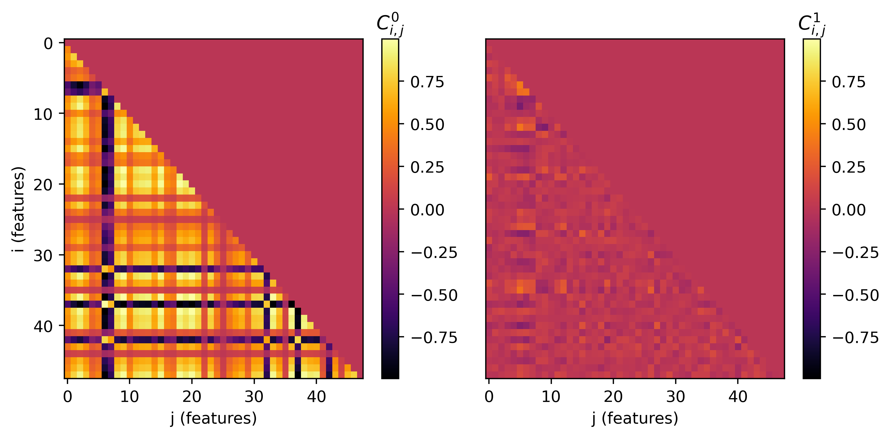

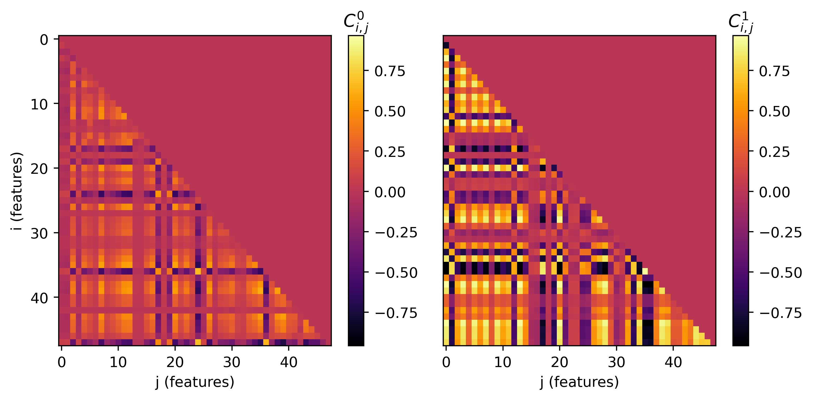

*Figure 10: Correlations pattern at grokking for C29 and C41, in panel (a) and (b), respectively. Left density plots are referred to the projection in the control label subspace $C^{0}_{i,j}$, while right ones to the HCC subspace $C^{1}_{i,j}$.* **[p. 17]**

###### p16-4

The lower histograms in both panels depict initial, transition and final eigenvalues distributions, by setting the transition sweep to 37 for C29 and to 107 for C41. We choose the transition sweep by selecting the minimum entropy along the lattice, namely when the HCC mask for C29 and the control one for C41 drain the dynamics.

In the histograms of Fig. 9, we observe that, at the transition, the eigenvalue distribution in the complementary subspace becomes entirely compressed towards near-zero values. The stable final configuration corresponds to a cluster of eigenvalues confined within a compact support, separated from the bulk, as previously noted in Fig. 6.

###### p16-6

An important characterization of the grokking transition for our purposes relies on correlations, evaluated according to prescriptions presented in Appendix 6. Absolute values of correlations reach the associated maxima corresponding to the grokking features extraction, depicted for C29 and C41 in Fig. 10. We properly select the sweep for each mask to capture maximum absolute values of correlations and we can verify that the dynamics draining at the transition influences correlations because of $\varrho_{kk}^{(\ell)}$, namely the norm of the reduced state projected in the $k$-th label subspace. **[p. 17]** Thus the mask firstly experiencing the magnetization patterns formation shows less pronounced correlations peaks. Nevertheless we are able to recognize some features pairs that remain almost uncorrelated, since the proposed flowchart in Fig. 1(b) will be able to detect sub-communities by varying the threshold for absolute values of correlations, thus highlighting the persistency of pairs in an independent or correlated behavior.

###### p17-1

Entanglement transitions are observed in every gene community, even if an effective grokking is not ensured. In order to estimate the dependence on the distance from each boundary of the one-dimensional lattice and to determine a transition from a volume to a sub-volume law of entanglement entropy Sierant et al. 2022, we apply a linear fit of the corresponding logarithms, such that the slope is able to quantify this information.

**[p. 18]**

###### p18-1

We collect fitting results in Tables 2 and 3, referring to Appendix 8 for more details. The volume law of the initial random MPS is easily recognized, since a slope close to unity is verified in all cases, with a unique exception for C24 caused by the bond dimension $\chi=100$, sufficient for the smallest community (see Table 1). The comparison of such linear fits considers the same number of lattice sites from both boundary for every gene community and the bond dimension imposes an entropy saturation value. For this reason the entropy linear growth for C24 experiences a curvature before **[p. 19]** remaining cases. Moreover reported coefficients of determination establish the quality of this linear dependence for initial random MPS. This means that entanglement spreads along the lattice beyond the spatial proximity of the qubits.

###### p20-1

At the end of the considered training dynamics final states entanglement entropies generally show a much more regular behavior. Sloped on both sides are more close with respect to their values for each community, up to slight deviations of C12, C29 and C41 driven by the lattice size, as well as in general a sub-volume law emerges with a renewed high quality for each fit testified by coefficients of determination close to unity. We define such behaviors as sub-volume laws because an area law requires a logarithmic dependence, thus we cannot establish a local interaction regime after grokking, which could be unreasonable given the absence of any proximity notion among gene expressions. We partially unravel through features extraction the intricate entanglement typifying the initial random MPS, actually enhancing our gene sub-community detection purposes.

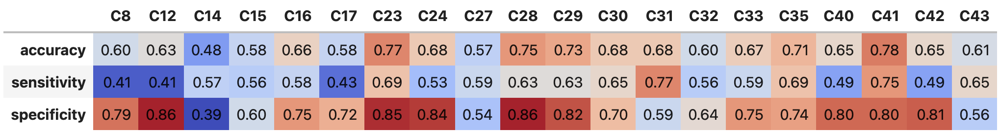

*Table 4: Evaluation metrics after magnetization transition in independent sets.* **[p. 20]**

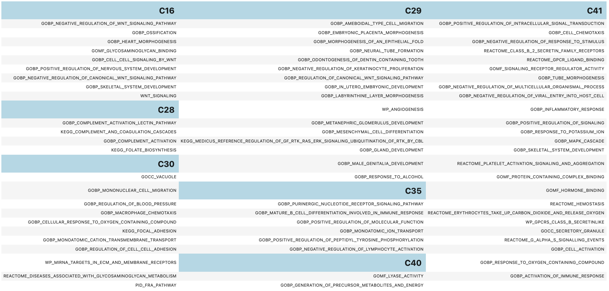

*Table 5: New enriched gene subsets within sub-communities detected through the sequence of correlation thresholds.* **[p. 20]**

###### p21-4

By exploiting the quantum-inspired machine learning framework based on tensor networks, we numerically prove that grokking phenomenon, with its emerging generalization gain in classification performances, can be related to an entanglement dynamical transition in the underlying quantum many-body systems.

We consider two datasets as case studies: Fashion MNIST and gene expression data related to hepatocellular carcinoma communities Lacalamita et al. 2023. In both cases, we employ Matrix Product States (MPS) as tensor networks to perform binary classification tasks and analyze the learning dynamics. For the second dataset, we leverage measurements of qubit magnetization and correlation functions within the MPS network to identify significant and relevant gene subcommunities, which are further validated through enrichment analysis.

###### p22-3

The code that supports the findings of this study is available from the authors, upon reasonable request.

###### p23-1

MPS format is based on truncated singular value decomposition (SVD), $M=U\Sigma V^{\dagger}$, keeping the $\chi$ (bond dimension) highest singular values and iterating for each link of the one-dimensional lattice Schollwöck 2011:

$$
W^{\ell}_{s_{1},\dots,s_{N}}=\sum_{a_{1},\dots,a_{N}}U_{s_{1},a_{1}}U_{s_{2},a_{2}}^{a_{1}}\dots U_{s_{j-1},a_{j-1}}^{a_{j-2}}\Lambda_{s_{j}}^{a_{j-1},\ell,a_{j}}V_{s_{j+1},a_{j}}^{\dagger a_{j+1}}\dots V_{s_{N-1},a_{N-2}}^{\dagger a_{N-1}}V_{s_{N},a_{N-1}}^{\dagger} \tag{8}
$$

**[p. 24]** with position $j$ for the orthogonality center $\Lambda$ Zaletel and Pollmann 2020; Evenbly 2022 and represented in Fig. 11(a). The gradient descent of the cost function introduced in Eq. (2) is based on a two-sites update

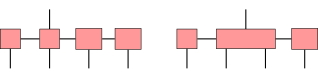

referring to a single right step, which leads to a sweep when back at the initial sites pair. The update rule requires the introduction of the following quantity

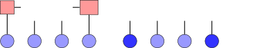

equivalently expressed in the predictor

$$
f^{\ell}_{W}(\mathbb{x})=\sum_{s_{j},s_{j+1}}\sum_{a_{j-1},a_{j+1}}B^{a_{j-1},\ell,a_{j+1}}_{s_{j},s_{j+1}}|\widetilde{\Phi}(\mathbb{x})^{s_{j},s_{j+1}}_{a_{j-1},a_{j+1}}\rangle, \tag{9}
$$

such that

$$
\Delta B^{\ell}=-\frac{\partial\mathcal{C}}{\partial B^{\ell}}=\sum_{\omega=1}^{N_{T}}|\widetilde{\Phi}(\mathbb{x}_{\omega})\rangle\otimes(y^{\ell}_{\omega}-f^{\ell}_{W}(\mathbb{x}_{\omega})). \tag{10}
$$

###### p24-5

The updated tensor is ruled by the learning rate $\alpha$, $B^{\prime\ell}=B^{\ell}+\alpha\Delta B^{\ell}$, that we compress according to the bond dimension and rescale in order to keep the state $W$ normalized, since the training dynamics is not unitary. The projection in the subspace spanned by principal components followed by a rescaling effectively implements a projective measurement Wiersema et al. 2023.

We measure the following quantities:

1. reduced density matrix $\varrho^{(\ell)}$ in label space, yielded by the contraction scheme depicted in Fig. 11(b);
2. local magnetization $\braket{\sigma_{Z}^{k,i}}$ for labels $k=0,1$ and features $i=1,\dots,N$, whose contraction is shown in Fig. 11(c);
3. correlation function $\braket{\sigma_{Z}^{k,i}\sigma_{Z}^{k,j}}$ for labels $k=0,1$ and features pairs $(i,j)$, with contraction scheme represented in Fig. 11(d) for features on opposite sides with respect to the orthogonality center, otherwise the same procedure in the previous point (ii) has to be fulfilled.

At each step of the gradient descent procedure, we implement a SVD for the new tensor $B^{\prime}_{s_{i},s_{i+1}}=U_{s_{i}}\Sigma V^{\dagger}_{s_{i+1}}$, followed by the contraction of $\Sigma$ with $U$ or $V^{\dagger}$ to obtain the orthogonality center $\Lambda$ if the step is moving to the left or right, respectively. The truncated matrix $\Sigma$ contains singular values $\{\lambda_{j}\}_{j=1,\dots,\chi}$, with $\chi$ bond dimension, such that we can easily evaluate the entanglement entropy $S(i)=-\sum_{j=1}^{\chi}\lambda_{j}^{2}\log\lambda_{j}^{2}$. It is possible to project into a specific label subspace by considering the SVD of $B^{\prime 0}_{s_{i},s_{i+1}}$ and $B^{\prime 1}_{s_{i},s_{i+1}}$, leading to the evaluation of $S^{0}(i)$ and $S^{1}(i)$, respectively.

###### p25-1

**[p. 25]** The stability of magnetization in the mask training is investigated in each of the possible binary classifications involving sneaker in fashion MNIST dataset. In Fig. 12 we observe the grokking transition in all remaining cases with respect to the one discussed in Section 3. Since the same lattice size characterizes each classification problem, we choose the same bond dimension $\chi=400$. The wide variation of the sweep number required to observe the transition is affected by the initial random configuration and the specific images subsample. In each case we assign the label 1 to sneaker: in Fig. 12 each panel confirms the definition of the same mask, with a particular case in panel (e), because sandal represent the most confounding classification, yielding almost the same mask of sneaker. Ankle boot and coat do not show high performances as well, probably because of the shape elongated along the horizontal direction, thus causing the first and last pixel rows behaving in a similar way with sneaker. Instead in panel (b) the mask for trouser is well differentiated, thus leading to the high performance reported in the legend of Fig. 7, and to a mask converging to the one of dress, discussed in Section 3, because of the similar shape in the $6\times 6$ pixel format (see Fig. **[p. 27]** 3). We can underline that the magnetization transition is observed before for sneaker masks in all cases, with the exception of panels (a), (b) and (h) standing for T-shirt, trouser and ankle boot, respectively.

###### p27-1

The complete decoherence observed after the grokking transition in the reduced density matrix for the label space for the well performing classification in Section 3 is further investigated by considering an artifical “fake” classification of sneaker versus sneaker. In Fig. 13 we report a sharply different behavior with respect to Fig. 4 and Fig. 6. The coherence in the reduced density matrix reaches a peak corresponding to the magnetization transition shown in Fig. 13 (a), related with an eigenvalues degeneracy condition with not distinguishable magnetization masks. After the transition the coherence reaches a not negligible steady condition, leading to almost perfectly overlapping magnetization masks. In Fig. 13 (b) this new steady condition is analyzed in terms of density matrix spectra, collected corresponding to the sites pair $(\lfloor N/2\rfloor,\lfloor N/2\rfloor+1)$. Since the two masks are no more independent, it is not possible to obtain the spectrum of $\varrho_{\lfloor N/2\rfloor}$ by simply combining those of the density matrix projected into each label subspace. The evaporated eigenvalues converge to two different groups, rather than just one as observed in Fig. 6. The separation between these two groups is higher in the full density matrix with respect to the projected ones because of the aforementioned coherence.

###### fig-14

*Figure 14: Representation of entanglement entropy profiles with respect to the distance from the left and right boundaries of the one-dimensional lattice. In panel (a) we report communities from C8 to C28, ordered by number, while in panel (b) the remaining ones from C29 to C43. In both cases the top row is referred to the left boundary, while the bottom one to right boundaries. Each column contains data of the initial, transition or final sweep from left to right. We take into account 8 lattice sites from both boundaries in order to avoid the saturating entropy imposed by the finite bond dimension for the initial random MPS.* **[p. 28]**

###### p27-2

The data discussed in Section 4.1 regarding entanglement entropy scaling are shown in Fig. 14. In Table 2 and 3 we report both the slopes and coefficients of determination for linear fits, required in order to monitor the dependence of entanglement entropy on the distance from boundaries of the considered one-dimensional lattice on left and right, respectively. We choose to apply the linear fit in logarithmic scale for both axis by taking into account the eight lattice sites labeled by integer $i=1,\dots,8$ for the left boundary, as well as $N-i$ for the right one. This choice is motivated by the use of a bond dimension $\chi=400$ for almost all communities, with exceptions for C12, C28, C29 and C41 requiring $\chi=1000$, C23 with $\chi=300$ and C24 with $\chi=100$. As discussed in Section 4.2, the bond dimension influences the saturation value of entanglement entropy in random MPS with volume law: in order to establish a common number of sites for fitting every community, 8 sites results a proper choice to focus on the linear growth. Plots at left of each panel in Fig. 14 confirm this assumption, since an almost indistinguishable behavior is verified for each community corresponding the random initialization.

The final behavior of entropy scaling corresponding to the preset number of sweeps shows an interesting trend for any community, since they collapse in an almost indistinguishable straight line in the logarithmic plane, as observed in plots at the right column of each panel in Fig. 14.

###### p27-4

At the grokking transition the behavior is more heterogeneous as expected, because the feature extraction is highly dependent on both the community information content and on the particular permutation of gene expressions ordering. **[p. 28]** The observation of a gain in independent sets classification implies that an entanglement transition occurs, but the viceversa does not hold true: this statement based on our numerical experiments could justify the absence of any explicit relation of entropy scaling at transition with the measured evaluation metrics.

###### p29-1

The considered gene expression communities determined in Lacalamita et al. 2023 **[p. 29]** are reduced to the common features subsets with the independent sets. This reduction of community sizes allows us to deduce new GSEA enrichments, representing the baseline with respect to thresholded sub-communities discussed in Section 4.2. These enriched gene subsets are listed comprehensively in Table 6, for **[p. 30]** enriched gene subsets in C16, C28, C29, C40 and C41, and Table 7, for those in C23, C30, C31, C33, C35 and C42, where in C33 GOMF_OXIDOREDUCTASE_LONG_1 stands for GOMF OXIDOREDUCTASE ACTIVITY ACTING ON PAIRED DONORS WITH INCORPORATION OR REDUCTION OF MOLECULAR OXYGEN NAD P H AS ONE DONOR AND INCORPORATION OF ONE ATOM OF OXYGEN and GOMF_OXIDOREDUCTASE_LONG_2 for GOMF OXIDOREDUCTASE ACTIVITY ACTING ON PAIRED DONORS WITH INCORPORATION OR REDUCTION OF MOLECULAR OXYGEN REDUCED FLAVIN OR FLAVOPROTEIN AS ONE DONOR AND INCORPORATION OF ONE ATOM OF OXYGEN. We can check that C24 is the unique community achieving an accuracy higher than 0.65 without any enrichment for both the baseline and thresholded sub-communities.

We have to highlight that these enrichments contain some new information with respect to Lacalamita et al. 2023, since we are considering the intersection of gene expressions in the training set GSE102079 and those of the independent set GSE54236. The immune microenvironment is confirmed in C29 and C41, as well as in C30, C35 and partially in C28, enriched in a more limited manner Loose and Van de Wiele 2009; Gao et al. 2021; Prieto et al. 2015; Hou et al. 2020. Another emerging confirmation regards metabolic abnormalities (obesity or diabetes), e.g. in C33 and C40, and alcohol consumption Shin et al. 2023. The vascular endothelial growth factor is enriched in C30, thus signaling a possible involvement of alpha-fetoprotein biomarker adopted in clinical practice Galle et al. 2019; Parikh et al. 2020. The characterization of liver as a hormone-sensitive organ emerges in C33 with the enrichment of estrogen pathways, whose controversial action presents evidence suggesting a role as both a carcinogen and protective effect in liver Baldissera et al. 2016. The enrichment of Wnt pathways Khalaf et al. 2018 is observed in C16 and C29, even if this behavior is enforced in sub-communities presented in Section 4.2.
