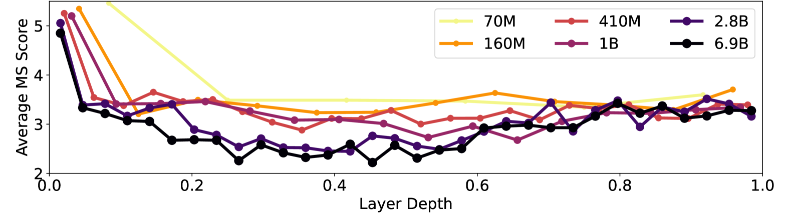
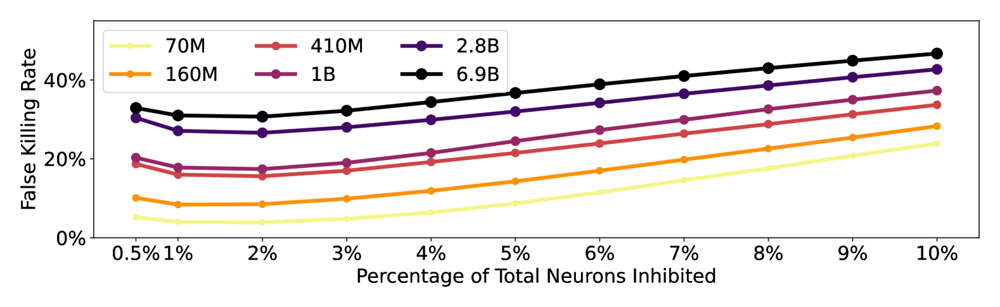
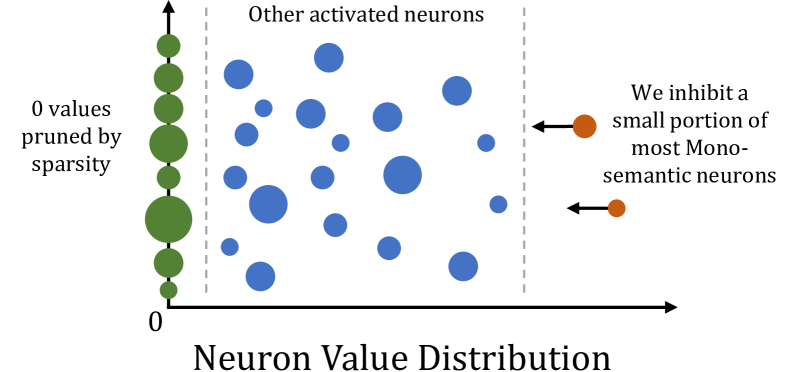

# Wang, Di, Tang, Li, Ng, Zhou, Chen 2025 — Learning Towards Emergence: Paving the Way to Induce Emergence by Inhibiting Monosemantic Neurons on Pre-trained Models

See also: [the global concept index](../../concepts/index.md).

**Jiachuan Wang**, **Shimin Di**, **Tianhao Tang**, **Haoyang Li**, **Charles Wang-wai Ng**, **Xiaofang Zhou**, **Lei Chen**.

arXiv [2503.23298](https://arxiv.org/abs/2503.23298), March 2025 (version v1). It has no citations — the work is in the corpus as a neighbouring branch: grokking is not studied here but serves as a phenomenon to compare emergence against. The source is the native arXiv HTML of version v1.

The files of this paper's analysis:

- [`2503.23298.learning-towards-emergence-inhibiting-monosemantic-neurons-on-pre-trained-models.license.txt`](2503.23298.learning-towards-emergence-inhibiting-monosemantic-neurons-on-pre-trained-models.license.txt) — the arXiv licence record for this paper.

The anchor scheme and the rules for linking into a card are in the [README of the papers folder](../README.md).

**Excerpt card.** The paper's licence (`arxiv-nonexclusive`) does not permit republishing the paper itself; what stands here are the editorial sections and the fragments the corpus quotes (right of quotation). The paper: <https://arxiv.org/abs/2503.23298>.

## Concepts covered

**[The emergence of abilities](../../concepts/emergence.md)** — the work does not undertake to explain emergence but to **induce** it: if monosemantic neurons disappear as the scale grows, then suppressing them ought to bring the properties of a large model closer ([`p1-2`](#p1-2)). The earlier line (emergence-based training) worked on the fine-tuning of small models ($\leq$88M), and the same is carried over here to the pre-training of models thirty times larger ([`p2-2`](#p2-2)).

**[Sparse probing and monosemanticity](../../concepts/linear-sparse-probing.md)** — the object of measurement. A monosemantic neuron responds to a single human-interpretable feature (say, "Python"), a polysemantic one to several ([`p1-4`](#p1-4)). The monosemanticity measure (MS) is computed during the training in $O(1)$, whereas probing requires labelled datasets and works only on a frozen model ([`p3-5`](#p3-5)).

**[Mechanistic interpretability](../../concepts/mechanistic-interpretability.md)** — the MS measure is cross-checked against probing from two sides: in monosemantic neurons the MS differs sharply between the presence and the absence of their feature ([`p4-3`](#p4-3)), and in random neurons there is no such difference ([`p4-5`](#p4-5)). This is a check of a measure against an independent method rather than against the outcome — a rarity in the corpus.

**[Memorisation](../../concepts/memorization-phase.md)** — the underlying conjecture: monosemanticity works like rote learning and impedes complex reasoning, while polysemanticity is responsible for abstraction ([`p6-3`](#p6-3)). Hence the design: preserve the polysemantic neurons and suppress the monosemantic ones.

**[Grokking](../../concepts/grokking.md)** — a direct comparison is placed in a separate appendix section: grokking and emergence share the idea that memorisation is harmful, but the works on grokking analyse very small models "as though under a microscope", whereas here models of up to 2.8B are at stake ([`p19-2`](#p19-2), [`p19-5`](#p19-5)). Named are Liu et al. 2022 (the weight norm), Nanda et al. 2023 (the three eras: memorisation, circuit formation, the removal of the memorising part) and the doubt of Levi et al. as to whether grokking itself is caused by the choice of the accuracy metric ([`p19-3`](#p19-3)).

**[The sparse subnetwork](../../concepts/sparse-subnetwork-lottery-ticket.md)** — a contradiction is examined separately: sparsity prizes a one-to-one correspondence "input — neuron", and suppressing monosemanticity destroys it, so that pruning by sparsity stops working ([`p20-5`](#p20-5)). A coexistence is proposed: to suppress only the **extremely** monosemantic neurons, leaving the unactivated ones for pruning ([`p20-6`](#p20-6)).

**[Scaling laws](../../concepts/data-fraction-critical-dataset-size.md)** — confirmed quantitatively and on a dense grid: the Kolmogorov–Smirnov statistic separating monosemantic features from the rest decreases as the scale grows on all three feature sets ([`p5-3`](#p5-3)), and the same is visible layer by layer ([`p5-4`](#p5-4)).

**[Freezing a subnetwork](../../concepts/freezing-subnetwork.md)** — the suppression is applied not to the whole network but to the middle layers, judged to be more polysemantic; an experiment on the choice of layers confirms this ([`p17-1`](#p17-1)). The upper and lower layers, being closer to the input and the output, are inevitably more monosemantic ([`p15-1`](#p15-1)).

**[Regularisation](../../concepts/regularization-variants.md)** — the main replacement of the earlier technique: instead of an inverse deactivation, which relies on the activation being already well trained, a penalty term is introduced into the loss that directly reduces the MS of the selected neurons ([`p7-4`](#p7-4)). A logarithmic transformation is added for the sake of gradient stability ([`p8-1`](#p8-1)).

**[Numerical stability](../../concepts/numerical-stability-fix.md)** — in the same place: the denominator $S^{2}$ of the MS measure can become extremely small, tearing the gradients apart ([`p7-4`](#p7-4)).

It is worth saying separately what the work does **not** contain. There is no emergence: the suppression improves the accuracy by 1–2 %, but no leap of ability is observed, and this is admitted as an unclosed problem ([`p9-3`](#p9-3)). There is no full pre-training: all the runs cover 10 % of the steps of the original Pythia, and such a setting, by the authors' own admission, favours their method. And there is no reliable foundation under the measure itself: the results depend strongly on the feature set, and on Code Language the fraction of false suppressions reaches 67 % ([`p14-1`](#p14-1)).

Cards of corpus papers: [Power et al. 2022](../2201.02177.grokking-generalization-beyond-overfitting-on-small-algorithmic-datasets/2201.02177.grokking-generalization-beyond-overfitting-on-small-algorithmic-datasets.card.md) — the original phenomenon, analysed in appendix C.1; [Liu et al. 2022](../2205.10343.towards-understanding-grokking-an-effective-theory-of-representation-learning/2205.10343.towards-understanding-grokking-an-effective-theory-of-representation-learning.card.md) — the weight norm and the representations; [Nanda et al. 2023](../2301.05217.progress-measures-for-grokking-via-mechanistic-interpretability/2301.05217.progress-measures-for-grokking-via-mechanistic-interpretability.card.md) — the three eras of circuit formation; [Kumar et al. 2024](../2310.06110.grokking-as-the-transition-from-lazy-to-rich-training-dynamics/2310.06110.grokking-as-the-transition-from-lazy-to-rich-training-dynamics.card.md) — the transition from the lazy to the rich regime, named among the works offering a deeper understanding.

**[Polysemanticity and superposition](../../concepts/polysemanticity-superposition.md)** — the work starts from the observation that monosemantic neurons disappear as the scale grows ([`p1-2`](#p1-2)) and defines monosemanticity operationally, by the statistics of the responses to a single feature ([`fig-1`](#fig-1)). This is a rare case in which polysemanticity is not an obstacle to the analysis but a controllable quantity.

**[Scaling laws](../../concepts/scaling-laws.md)** — they serve as the background to the claim: the usual dependence of the quality on the scale is a mild power law ([`p1-3`](#p1-3)), and it is against that background that abrupt abilities look like an exception requiring explanation.
## What is shown and what is conjectured

The card editor's remarks following the analysis of the claims (`…claims.txt`). The work is an applied one: nine pages of main text and eleven pages of appendices, almost entirely experimental.

**The check of the measure is done conscientiously and from two sides.** The MS is checked against an independent method (sparse probing): in monosemantic neurons it sharply distinguishes the presence of "their" feature from the others ([`p4-3`](#p4-3)), and in randomly chosen neurons there is no such difference ([`p4-5`](#p4-5)). The earlier work did not perform this check, and was reproached for its absence.

**The conjecture that monosemanticity decreases with scale is checked on a dense grid.** Six scales from 70M to 6.9B, three feature sets, the Kolmogorov–Smirnov statistic, and a layer-by-layer analysis ([`p5-3`](#p5-3), [`p5-4`](#p5-4)). This is markedly more substantial than the earlier "switch the neurons off and look at the loss".

**The introduced measure of false suppressions is useful and yields an unexpected turn.** The fraction of false suppressions at first **decreases** as the number of suppressed neurons grows and has its minimum around 2 % ([`p6-5`](#p6-5)). The stability of that value across scales is a practically useful result.

**The engineering part solves a named trouble rather than an invented one.** An adaptive threshold brings the additional cost down from 27 % to 1.5 % on the 2.8B model ([`p9-2`](#p9-2)), and the gain grows with the scale rather than shrinking.

**The main thing, however — emergence — is not shown.** The gain in accuracy is 1–2 % and has nothing in common with the leap of ability for whose sake the work was undertaken. It is admitted outright: "there is still much work to do" ([`p9-3`](#p9-3)).

**The training is cut off at 10 % of the steps, and this favours the method.** The authors themselves note that the assumptions of the rival method (the inverse deactivation) hold for a well-trained model and do not hold at 10 % of the steps ([`p9-3`](#p9-3)). The comparison with the earlier method is thereby set up in their own favour — and this is stated.

**The measure depends strongly on the feature set.** On Natural Language the fraction of false suppressions at 1 % is 5.2 %, on Data Subset 21.8 %, and on Code Language 67 % ([`p14-1`](#p14-1)). For the 70M model on Code Language the results are declared abnormal outright, since the probing classifier does not work there.

**The gain is unstable and in places negative.** On ARC-Easy the method consistently **hurts**; from this a conjecture is drawn that it helps only on hard tasks ([`p17-3`](#p17-3)). On MMLU and BBL the gain fluctuates, and the authors refuse outright to attribute it to their component without further study.

**The best suppression fraction is not one and the same.** 2 % is named the best and is supported by the false-suppression measure, but by the table's results 1 % is better for the 70M model and 3 % for the 2.8B one ([`p16-1`](#p16-1)). This weakens the claim that the setting is stable across scales.

**The relation to grokking is discussed honestly and without stretching.** Only the idea that memorisation is harmful is declared common; the difference in the scale of the models is named outright, and the doubt of Levi et al. as to whether grokking is created by the accuracy metric itself is given alongside the same doubt about emergence ([`p19-2`](#p19-2), [`p19-3`](#p19-3)).

**Its place in the corpus.** For the wiki this is a side branch: grokking is not studied here but serves as a neighbouring phenomenon against which emergence is compared. Two contributions are valuable: the cross-check of the monosemanticity measure against an independent method, and the false-suppression measure, which sets how many neurons to suppress. The price: the claimed emergence is absent, the gain is small and unstable, the training is cut off at a tenth of the steps, and the measure itself is unreliable outside a single high-quality feature set.

---

# Quoted fragments

Only the fragments the corpus cards refer to are
reproduced here (right of quotation); the paper's licence does not permit
republishing the whole text. Anchor numbering matches the original.

###### p1-2

Emergence, the phenomenon of a rapid performance increase once the model scale reaches a threshold, has achieved widespread attention recently. The literature has observed that monosemantic neurons in neural networks gradually diminish as the model scale increases. Subsequently, *Learning From Emergence* is proposed to actively inhibit monosemantic neurons in relatively small neural networks (e.g., BERT and Swin-Transformer) for promoting model performance with fine-tuning. However, to ultimately achieve emergence, it is demanding to support the monosemantic neuron inhibition in the pretraining phase of large-scale models. Thus, this work further pushes the boundary of this research direction to be *Learning Towards Emergence (L2E)* and enables the training and validating of the impact of inhibiting monosemantic neurons on larger pre-trained neural networks (e.g., Pythia-70M, 410M, and 2.8B). More specifically, to bridge the gap in current research, we first conduct experiments on models of various scales (up to 6.9B) to validate the monosemantic ideas. Then, we present a novel method L2E to address the inefficient monosemantic neuron retrieval and ineffective monosemantic neuron inhibition when existing methods are applied in the pretraining phase of large-scale models. It employs an adjustable thresholding technique for efficient neuron retrieval, incorporates a False Killing Rate metric to assess inhibition effects, and proposes a regularization-style inhibition approach, which addresses the limitations of previous approaches in both efficiency and effectiveness. Experimental results demonstrate the effectiveness of L2E’s monosemantic neuron inhibition and its efficiency in implementation with large-scale models.

###### p1-3

The success of large-scale pretraining models, such as GPT-3.5 (Ouyang et al., 2022), has drawn widespread attention in understanding their dynamics across different scales. Studies on Scaling Laws (Henighan et al., 2020; Kaplan et al., 2020) have analyzed the relationship between scale and performance, which typically follows a mild power law. However, recent research has observed dramatic performance improvements that defy these scaling laws when the model scales reach certain thresholds—a phenomenon termed *Emergence* (Wei et al., 2022). The resulting emergent abilities of these models are somehow recognized as a key factor in their success, prompting numerous follow-up investigations (Hu et al., 2024). Some studies suggest that the impressive emergence phenomenon may simply caused by deficiencies in observing and evaluating the accumulation of abilities (Schaeffer et al., 2023; Lu et al., 2024). But such deficiencies may persist for a long time because the commonly used unsupervised losses and weakly labeled datasets. Subsequently, a series of studies try to predict (Hu et al., 2024) and induce (Wang et al., 2024; Yan et al., 2024) emergence.

**[p. 2]**

*(a) The output statistics of monosemantic “Python” neuron on Code Language dataset. The neuron is in the layer 16, number 3519 of the Pythia 2.8B model.*

*(b) The output statistics of randomly selected neuron on Data Subset dataset. The neuron is in the layer 6, number 666 of the Pythia 410M model.*

###### fig-1

*Figure 1: A demonstration of the concept “monosemantic”. The left figure shows the output statistics of a monosemantic neuron, which is activated only by the feature “Python”. This contrasts with a randomly selected neuron in the right figure. We use sparse probing (Gurnee et al., 2023) on Pythia models (Biderman et al., 2023) to detect monosemantic neurons.* **[p. 2]**

###### p1-4

In earlier years, researchers propose the concept of monosemantic neurons to interpret model functionality (Bau et al., 2020; Elhage et al., 2022). These neurons form 1-to-1 mappings with human-friendly features (such as “dog” in images (Olah et al., 2020) or “Python” in code languages as shown in Figure 1(a)). In contrast, polysemantic neurons are activated for multiple features (Goh et al., 2021; Bricken et al., 2023). The discovery of monosemantic neurons, especially when visualizing impressively (Olah et al., 2020), greatly excite researchers when neural networks are considered as black-box. However, following the favor of monosemantic neurons in explanation, it has become harder to detect monosemanticity as model scale increases (Huben et al., 2024; Gurnee et al., 2023; Bricken et al., 2023). Existing works also find that monosemantic neurons have less impact on model performance of larger models (Gurnee et al., 2023).

###### p2-1

Based on these observations, Wang et al. (2024) hypothesize that the decrease of monosemantic neurons as a key factor towards better performance behind the increasing model scale, then propose *Learning From Emergence* to improve performance by actively inhibiting monosemantic neurons during the fine-tuning stage of relatively small models ($\leq$88M). To achieve that, Monosemanticity Score (MS) has been devised to quantify monosemanticity throughout the model training, which contrasts with literature that depend on specially labeled detection datasets and can only detect monosemantic neurons after training on frozen models (Gurnee et al., 2023; Huben et al., 2024). But Learning From Emergence is still in its early stages of exploration and has unresolved limitations (Yan et al., 2024). The validity of the MS metric and the above monosemanticity hypothesis lacks thorough investigation, as existing studies have not provided abundant experimental support. Moreover, the inhibition method faces challenges in effectiveness and efficiency when inhibiting monosemantic neurons in large-scale neural networks during the pretraining phase.

###### p2-2

To explore the impact of inhibiting monosemantic neurons on the model performance, we further push the boundary of Learning From Emergence to *Learning Towards Emergence (L2E)* to induce emergence by inhibiting monosemantic neurons during pretraining on larger ($\times 30$) models.

In this work, we first conduct an analysis to facilitate the understanding of monosemanticity. As monosemanticity is difficult to define explicitly (Olah et al., 2020; Elhage et al., 2022), we cross-validate the effectiveness of MS using carefully selected monosemantic neurons (Gurnee et al., 2023). Additionally, we perform an in-depth analysis of monosemanticity across different scales of models (from 70M to 6.9B). After validating the monosemantic idea, we propose L2E to enable monosemanticity inhibition for large-scale pretraining. More specifically, we first apply an adjustable thresholding technique to enable efficient monosemantic neuron retrieval. Then, we introduce the False Killing Rate as a metric to quantify the side effects of different inhibition levels and capture consistent patterns for guidance across scales. Finally, we propose a regularization-style inhibition approach, which addresses the ineffectiveness of existing work when applied to pretraining tasks. Experiments conducted on various tasks and scales using Pythia models (Biderman et al., 2023) (from 70M to 2.8B), validating the effectiveness and efficiency of L2E.

###### p3-5

However, probing experiments are time-consuming, making it crucial to develop alternative methods to boost the study of monosemanticity. Gurnee et al. (2023) first proposed estimating the neuron monosemanticity based on input weight norm and bias term, which is non-universal as not all models have bias terms (Yan et al., 2024). Further, Monosemanticity Score (MS) is proposed to dynamically analyze the monosemanticity based on sparsity (Wang et al., 2024). To be more specific, given a set of inputs $\left\{\mathbf{x}^{[i]}\right\}_{i=1}^{n}$ and the corresponding outputs of a neuron $\left\{{z}^{[i]}\right\}_{i=1}^{n}$, MS is defined as:

$$
\phi(z^{[i]})=\frac{(z^{[i]}-\bar{z})^{2}}{S^{2}}, \tag{1}
$$

where $\bar{z}$ is the mean of $\left\{{z}^{[i]}\right\}$, and $S^{2}$ is the sample variance. During model training, only samples before $z^{[i]}$ are observable. In this case, the MS can be calculated incrementally in linear time complexity (Wang et al., 2024). Given these advantages, Wang et al. (2024) proactively inhibited monosemanticity based on the MS. However, the effectiveness of the MS metric lacks experimental validation (Yan et al., 2024).

###### p4-3

**MS Can Detect Activated Monosemantic Neurons.** Firstly, we compare the MS values of monosemantic neurons when given and not given the corresponding features. The top 10 monosemantic neurons are selected by sparse probing (Gurnee et al., 2023) on Pythia models across scales (70M to 6.9B) (Biderman et al., 2023). To be more specific, given a set of inputs $\{\mathbf{x}^{[i]}\}_{i=1}^{n}$ and a monosemantic neuron $\theta$ with corresponding feature $\ell$, its output values $Z=\{z^{[i]}\}_{i=1}^{n}=\{\theta(\mathbf{x}^{[i]})\}_{i=1}^{n}$ can be partitioned as $C_{\ell}=C(\theta,\ell)$ and $C^{-}_{\ell}=\cup_{\ell^{\prime}\neq\ell}C(\theta,\ell^{\prime})$. We can calculate the MS values of $Z$ within $C_{\ell}$ and $C^{-}_{\ell}$ respectively, denoting the mean of each set as $\phi_{\ell}$ and $\phi_{\ell}^{-}$:

$$
\phi_{\ell}=\frac{\sum_{z\in C_{\ell}}(z-\bar{z})^{2}}{|C_{\ell}|S^{2}},\phi_{\ell}^{-}=\frac{\sum_{z\in C_{\ell}^{-}}(z-\bar{z})^{2}}{|C_{\ell}^{-}|S^{2}}. \tag{2}
$$

Intuitively, a monosemantic neuron should be activated when given the inputs from corresponding feature, thus a larger $\phi_{\ell}$ if MS is effective. Based on the top-10 monosemantic neurons, we derive $\phi_{\ell}$ and $\phi_{\ell}^{-}$ based on the Code Language feature dataset (Figure 3(a)), where results for two more datasets are provided in Figure 7 in the Appendix. It is clear that the MS values of neurons with monosemantic featuress are significantly different from those without monosemantic features. This indicates that MS is sensitive to monosemanticity when the corrsponding features are given.

###### p4-5

**MS is Non-sensitive to Non-monosemantic Neurons.** As MS is effective for monosemantic neurons, it is also important that MS should be insensitive to non-monosemantic neurons. To validate this, across different scales, we randomly select 10 neurons in addition to the monosemantic neurons. To compared with the score $\phi_{\ell}$ **[p. 5]** calculated for monosemantic neurons, we calculate the MS for those randomly selected neurons and mine their statistically more monosemantic features instead. Mathematically, for each feature $\ell^{[i]}\in L$, we calculate its average MS score $\phi_{\ell^{[i]}}=\nicefrac{{\sum_{z\in C_{\ell^{[i]}}}(z-\bar{z})^{2}}}{{\left|C_{\ell^{[i]}}\right|S^{2}}}$, where monosemanticity is higher when the score is higher. Thus, we denotes the feature $\ell^{*}$ with the highest $\phi_{\ell^{[i]}}$ as its relatively monosemantic feature, that is:

$$
\ell^{*}=\max_{\ell\in L}\frac{\sum_{z\in C_{\ell}}(z-\bar{z})^{2}}{\left|C_{\ell}\right|S^{2}}. \tag{3}
$$

The corresponding $\phi_{\ell^{*}}$ is used to compare with $\phi_{\ell}$ for monosemantic neurons. The results are shown in Figure 3(b), where $\phi_{\ell}$ and $\phi_{\ell^{*}}$ are derived from the Data Subset feature dataset. Additional results are given in Figure 8 in the Appendix. It is clear that the MS values of neurons with monosemantic features are significantly different from those from random neurons. This indicates that MS can effectively distinguish monosemantic neurons from other neurons.

###### p5-3

To obtain statistical significance, we apply the K-S test (Peacock, 1983) on the set of MS scores from relatively monosemantic features and the universal set. The K-S test, a widely used nonparametric hypothesis test, determines whether two sample sets originate from different distributions. In our experiment, we compare the K-S statistics, which is positive related the difference between the 2 sets. The results are shown in Figure 4, shown the results on 3 feature datasets Natural Language, Data Subset, and Code Language (Gurnee et al., 2023). The K-S statistics decrease as the scale increases, indicating that the prominence of the monosemantic set diminishes. These results validate that monosemanticity is negatively correlated with larger-scale models.

*Figure 5: Statistics of MS across scales and layers. The results are obtained on Natural Language feature dataset (Gurnee et al., 2023). Larger models are of deeper colors, which can be clearly observed that their scores are smaller, indicating lower monosemanticity.* **[p. 6]**

###### p5-4

Additionally, we investigate monosemanticity across layers. With 1,000 randomly selected neurons for each scale, we calculate the MS values for each neuron and record the mean scores of its most monosemantic feature $\phi_{\ell^{*}}$ according to equation 3. As shown Figure 5 and 9, a clear drop in MS, indicating lower monosemanticity, can be observed as the scale increases.

###### p6-3

Here we discuss the intuition behind the setting of $k$. From the perspective of memorization and reasoning, monosemantic and polysemantic neurons are assumed to play different roles. To prevent the model from overfitting-style rote memory, we aim to keep the polysemantic neurons and inhibit the monosemantic ones. This is achieved by filtering out the neurons with top-$k$ MS values. A small $k$ will lead to weak inhibition, while a large $k$ may also inhibit polysemantic neurons, which impairs functionality. To quantify the impairment, we propose the False Killing Rate (FKR) to measure the proportion of unexpected inhibitions where the inputs are not from monosemantic features. To be more specific, given a dataset with $n$ input instances $X=\{\mathbf{x}^{[i]}\}^{n}_{i=1}$ and a layer of $N$ neurons $\mathbf{z}=\{z_{j}\}^{N}_{j=1}$, the FKR is defined as:

$$
\text{FKR}=\frac{\sum_{i=1}^{n}\sum_{j=1}^{N}\mathbbm{1}\left(\mathbf{x}^{[i]}\notin\ell^{*}_{j}\right)\cdot\mathbbm{1}\left(\phi(z_{j}^{[i]})\geq\tau_{k}\right)}{\sum_{i=1}^{n}\sum_{j=1}^{N}\mathbbm{1}\left(\phi(z_{j}^{[i]})\geq\tau_{k}\right)}, \tag{4}
$$

where ${z}_{j}$ is the $j$-th neuron in the layer and $\ell^{*}_{j}$ is its relatively monosemantic feature as defined in equation 3. $\mathbbm{1}(\cdot)$ is the indicator function and $\tau_{k}$ is the $k$-th largest MS value. The FKR measures the proportion of unexpected inhibitions ($\mathbf{x}^{[i]}\notin\ell^{*}_{j}$) when the inputs are not from monosemantic features. Ideally, we aim to reduce monosemantic neurons while preserving polysemantic ones. Therefore, we must balance between achieving sufficient inhibition and maintaining a low FKR.

###### p6-5

To meet our goal, we conduct experiments on Pythia models of different scales (Biderman et al., 2023). Interestingly, despite the overall positive relationship, the FKR initially decreases as the **[p. 7]** number of inhibited neurons increases. We find a consistent trend when the number of inhibited neurons is determined based on percentage, as shown in Figure 6. One can easily observe an ideal $k$ (i.e., 2% of the total number of neurons) that minimizes the FKR. This empirical setting remains consistent across different scales, which is a promising result for large-scale models. We further validated this setting with experiments in Appendix B.4.

Moreover, the FKR is increasing when the scales of the models increase. This further validate the proposation that larger models are more polysemantic, so that inhibiting neurons will more likely lead to false killing. A more insight analysis is given in Appendix B.2.

**Efficient Neuron Retrieval.** When the inhibition level comes to several percentages (e.g., 2%) of neurons in a layer, efficiency becomes a bottleneck. Originally, finding the largest MS value costs $\Theta(N)$ times for a layer of $N$ neurons, which will be extended to $\Theta(kN)\sim\Theta(N^{2})$ for the top-$k$ inhibition. Using special data structures such as heap can reduce the cost to $O(N\log(k))\sim O(N\log(N))$, which is still expensive for large scale models.

Here, we design a moving threshold to circumvent the calculation of precise top-$k$ value. Being inspired while conducting monosemanticity analysis, we found that the inhibition should be better as a global percentage rather than an in-batch ranking. For example, a single batch of inputs may activate fewer monosemantic neurons, which should be given a lower level of inhibition. Therefore, we maintain a moving threshold to inhibit the most monosemantic neurons globally. The detailed implementation, primarily an engineering design, is provided in Appendix A. Our design involves only an element-wise comparison per batch with an $O(1)$ update to converge the threshold to the global value of the 2%-th highest MS, achieving efficient inhibition.

###### p7-4

**Efficient Neuron Inhibition.** Given the identified monosemantic neurons, the previous method developed Reverse Deactivation to inhibit them (Wang et al., 2024). This approach makes use of the model’s reliance on monosemanticity to naturally deactivate neurons. In short, it assumes that a monosemantic neuron is well-trained and effective, such that reducing its activation would lead to an increase in loss. However, the assumption is more valid for a well-trained model but less prevalent in the pretraining stage, particularly at its very beginning. To handle the problem, we propose a regularization-style method to encourage the inhibition. Specifically, we introduce a new term to the loss function to penalize the MS values of the monosemantic neurons directly, that is, to minimize equation 1 for each selected neuron $\theta$ and input $\mathbf{x}^{[i]}$:

$$
\min_{\bm{\omega}}\frac{(\theta_{\bm{\omega}}(\textbf{x}^{[i]})-\bar{z})^{2}}{S^{2}},
$$

###### p7-5

where $\bm{\omega}$ are the trainable parameters of neuron $\theta$. However, during implementation, we discovered that the denominator term $S^{2}$ could become extremely small, leading to unstable gradients. We turn to a logarithmic transformation to stabilize the gradients, minimizing the following term instead:

$$
\min_{\bm{\omega}}\log{\frac{(\theta_{\bm{\omega}}(\textbf{x}^{[i]})-\bar{z})^{2}}{S^{2}}}=\min_{\bm{\omega}}\log{(\theta_{\bm{\omega}}(\textbf{x}^{[i]})-\bar{z})^{2}}-2\log{S},
$$

where the second term is a constant and can be ignored. So that:

$$
\min_{\bm{\omega}}\mathcal{L}_{MS}=\min_{\bm{\omega}}\log{(\theta_{\bm{\omega}}(\textbf{x}^{[i]})-\bar{z})^{2}}, \tag{5}
$$

**[p. 8]**

###### p8-1

where the term $\mathcal{L}_{MS}$ can be added to the loss function. It offers a straightforward approach to reducing monosemanticity and is general to models at any stage of training.

In summary, L2E is designed for effectiveness and efficiency monosemanticity inhibition for pretraining in large-scale models. It builds on the dynamics of monosemanticity and introduces the False Killing Rate, which guides us in determining the optimal number of neurons to inhibit. A moving threshold is proposed for efficient identification of the most monosemantic neurons. Besides, it develops a regularization-style approach to encourage the inhibition of monosemantic neurons, addressing previous shortcomings in pretraining.

###### p9-2

Here, we compare the efficiency of L2E with the MEmeL method and the original Pythia model. Table 2 shows the results, recorded as the average time cost per step. At the 70M scale, both MEmeL and L2E show mild cost increases, consistent with (Wang et al., 2024). However, as discussed in Section 4.2, with a complexity of $O(N\log N)$, the time cost escalates significantly as the scale increases. When a scale of 2.8B ($\times 5$ parameters per layer), the additional time cost ratio for MEmeL jumps from 9.7% to 27.0%. In contrast, our L2E’s ratio even decreases from 3.4% to 1.5%. This reduction is due to L2E’s element-wise operations being amortized by the superlinear cost of the Attention framework as the number of parameters increases, aligning with our analysis in Section 4.2.

###### p9-3

There is still work to be done to fully validate the effectiveness of L2E, especially its potential to induce Emergence. Current experiments are limited to Pythia models, with the largest size being 2.8B and training steps at 10% of full pretraining. This limitation is an unavoidable trade-off at this trial stage, where detailed analysis is required with our resources fully utilized.

Additionally, monosemantic analysis relies heavily on feature datasets, which significantly influence the results. Our analyses show particular consistency with the Natural Language feature dataset, a high-quality set where different languages are clearly distinguished. For each language, identifying its context neurons is straightforward, with an inference accuracy of 100% (Gurnee et al., 2023). However, there’s no consensus on how to properly define feature datasets, which hinders comprehensive monosemanticity analysis. To validate the universality of our findings, one need to conduct analysis using more high-quality datasets. See Appendix B.1 for more results and discussions.

###### p13-6

To find out the reason, we further analyze the probing results of these feature datasets. As in Gurnee et al. (2023), the most monosemantic neurons are probed based on F1 scores (using the neuron outputs to predict feature), we dis**[p. 14]** play the average F1 scores of the top-10 neurons in Figure 10. We find that the neurons of the 70M model have significantly lower scores on the Code Language dataset. This suggests that the probing classifier may not be effective in detecting monosemantic neurons in the 70M model. As a consequence, the results of 70M model on the Code Language dataset are also abnormal, such as Figure 8(b), Figure 9(b), and Figure 4.

###### p14-1

These patterns further emphasize the importance of reliable feature datasets. According to Figure 10, only Natural Language consistently yields high F1 scores, owing to the inherent distinguishability of different languages. In contrast, when we inspect the results for Code Language with 9 features, 37 neurons have F1 scores $>0.9$, with 21 (approximately 57%) being Python-related, while none are associated with HTML or XML. This disparity suggests either a biased distribution of the model’s capabilities or a weakness in the feature dataset. In our analysis of inhibition levels (Figure 6 on Natural Language), a 1% inhibition on the 70M model leads to a False Killing Rate of 5.2%. However, when we examine the other two datasets, the FKR rises to 21.8% for Data Subset and even 67% for Code Language, failing to effectively distinguish monosemanticity for analysis. To further boost the study of monosemanticity, high-quality feature datasets are essential.

###### p15-1

In addition to the analysis given in Subsection 3.2, we further validate the monosemanticity hypothesis by examining the False Killing Rate (FKR) across different layers in the Pythia models (Biderman et al., 2023). Using the aforementioned setting (2% of the total number of neurons in each layer), we analyze how FKR varies across layers, as shown in Figure 11. Larger models, represented by deeper blue colors, are more likely to experience false killing when inhibiting neurons. This aligns with our hypothesis that larger models are more polysemantic. Besides, middle layers exhibit higher FKR, suggesting they are more polysemantic. This coincides with their role in abstraction and reasoning. In contrast, the top and bottom layers, being closer to specific inputs and outputs, are inevitably more monosemantic.

###### p16-1

Additionally, we observe that a higher level of inhibition is preferred as model scale increases. Specifically, the 2% inhibition level is optimal for the 410M model, while 1% and 3% are best for the 70M and 2.8B models, respectively. This aligns with our analysis in Section 3, which suggests that larger models are more polysemantic and thus require more inhibition to improve performance.

###### p17-1

Table 5 presents our results. Consistent with our analysis, inhibiting the middle layers yields the best performance improvement, with Mid-2 and Mid-1/3 achieving the highest scores in almost all cases (except for Top-Bot with 70M on 0-shot SciQ). Mid-2 would be the more efficient setting while maintaining similar performance. However, these finding opens up intriguing points for further research. For example, given that different layers may play different roles in a model’s capabilities, inhibiting specific layers might benefit particular tasks.

*Table 6: The results of L2E on MMLU (Hendrycks et al., 2021) and BBL (Google, 2023).* **[p. 17]**

| Setting | **0-shot** | **5-shot** |  |  |  |  |  |  |  |
|---|---|---|---|---|---|---|---|---|---|
| Scales | 70M | 410M | 2.8B | $\uparrow$ | 70M | 410M | 2.8B | $\uparrow$ |  |
| **MMLU** | Pythia | **0.2311** | 0.2303 | 0.2306 | - | 0.2438 | 0.2470 | 0.2432 | - |
| L2E | 0.2301 | **0.2306** | **0.2534** | **3.2**% | **0.2497** | **0.2472** | **0.2443** | **1.0**% |  |
| **BBL** | Pythia | 0.2188 | 0.2198 | **0.2321** | - | 0.2140 | **0.2377** | 0.2252 | - |
| L2E | **0.2242** | **0.2199** | 0.2313 | **0.7**% | **0.2235** | 0.2266 | **0.2320** | **0.9%** |  |

*Table 7: The results of L2E on ARC (Clark et al., 2018).* **[p. 18]**

| Setting | **0-shot** | **5-shot** |  |  |  |  |  |
|---|---|---|---|---|---|---|---|
| Scales | 70M | 410M | 2.8B | 70M | 410M | 2.8B |  |
| **Arc-Easy** | Pythia | **0.3880** | **0.4545** | **0.5223** | 0.3708 | **0.4811** | **0.5522** |
| L2E | 0.3813 | 0.4423 | 0.5042 | **0.3864** | 0.4798 | 0.5358 |  |
| **Arc-Challenge** | Pythia | 0.1706 | 0.1852 | 0.2304 | 0.1834 | 0.1988 | 0.2346 |
| L2E | **0.1877** | **0.2031** | **0.2304** | **0.1860** | **0.2056** | **0.2415** |  |

###### p17-3

Besides the datasets tested in the main experiments, we also obtained some noteworthy results on other datasets. ARC-Easy and ARC-Challenge are two partitions of data from (Clark et al., 2018), with ARC-Easy being the simpler set. While conducting experiments, we discovered negative results on ARC-Easy from L2E, as shown in Table 7. Interestingly, the results were remarkably consistent: L2E consistently outperformed the original model on ARC-Challenge but rarely improved on ARC-**[p. 18]** Easy. This pattern leads to a hypothesis that L2E may be more effective on more challenging tasks. This aligns with (Wang et al., 2024), which suggests that monosemanticity functions like hard memorization—potentially impairing performance on complex tasks while being beneficial for simpler ones. Some studies on grokking also treat memorization as a negative pattern when dealing with complex mathematical problems (Liu et al., 2022), while (Yan et al., 2024) also finds some positive impacts of monosemanticity. The potential influence of monosemanticity is still in its early stages of exploration.

###### p19-2

While monosemanticity functions like rote memorization in neural networks, a phenomenon called “grokking” also explores the negative impact of neuron memorization. The initial study by Power et al. (2022) observed grokking in very small models, where the test loss dramatically decreased after the training loss had converged for a long time. The authors highlighted an under-explored area: how neural networks generalize beyond mere memorization? Unlike studies on emergence, their research meticulously examined very small models (with only 2 layers). Interestingly, their analysis on algorithmic datasets aligns with our findings, hypothesizing that memorization hinders more complex reasoning.

###### p19-3

To investigate the reason of grokking, Liu et al. (2022) examines multiple datasets using models with fixed L2 norm of weight $w_{c}$. They find that a large $w_{c}$ leads to poor representation and impairs generalization in grokking. On the other hand, Nanda et al. (2023) focuses on the modular addition task and reverse engineering the model weights. They summarize the training process leading to grokking in 3 stages: memorization, circuit formation, and memorization component removal. Notably, both papers highlight grokking’s potential to aid in understanding emergence. However, unlike our work, their studies were limited to very small models.

Subsequent research has conducted case studies to explore the benefits of grokking (Xu et al., 2024) and gain deeper understanding (Rubin et al., 2024; Levi et al., 2024; Kumar et al., 2024). Notably, Levi et al. (2024) raises doubts about whether the occurrence of grokking might be due to the accuracy measure used, a concern similar to that raised about Emergence (Schaeffer et al., 2023).

###### p19-5

To conclude, complementing our research, grokking-related studies provide highly detailed analyses of small models (Liu et al., 2022; Doshi et al., 2024; Pearce et al., 2023), similar to observing particle motion through a microscope. Hopefully, these two research directions could yield discoveries from different perspectives and potentially combine to further enhance model performance, such as interchanging techniques for inducing grokking and emergence (Wang et al., 2024; Lyu et al., 2024). Besides, we highlight an interesting example from their experiments, where an extremely small model (with only 5 neurons) is incapable of even memorizing (Pearce et al., 2023). This raises a question: for current challenging tasks, where do our models stand? Are they at the stage of partial memorization awaiting generalization, or have they not even reached the point of memoriz**[p. 20]** ation?

###### p20-5

The main conflict between sparsity and our method lies in the functional assumption of activation. Monosemanticity forms a 1-to-1 correlation, which is considered similar to rote memorization and may hinder complex reasoning abilities. However, this 1-to-1 mapping is favored in sparsity studies. When we reduce monosemanticity, a single input would activate multiple neurons, rendering pruning based on sparsity ineffective. If both approaches are proved valid, balancing L2E and sparsity will become a trade-off between effectiveness and efficiency.

###### p20-6

Fortunately, our current studies focus on the inhibition of **extremely** monosemantic neurons, which can potentially co-exist with sparsity. We demonstrate the ideal case in Figure 13, where highly monosemantic neurons are inhibited (brown), while a large number of inactive neurons can be pruned (green) using sparsity methods. Besides, when using MoE, pruning occurs during expert selection, while each expert can be further enhanced with our method (i.e., made more polysemantic). Additionally, the MS metric could serve as a supervisor for pruning unimportant neurons to achieve sparsity. These potential collaborations await future research.
