# Gu, Chen, Zhang, Hu, Cao 2025 — Beyond Progress Measures: Theoretical Insights into the Mechanism of Grokking

See also: [the global concept index](../../concepts/index.md).

**Zihan Gu, Ruoyu Chen, Hua Zhang, Yue Hu, Xiaochun Cao** (Institute of Information Engineering, CAS; UCAS; Shenzhen Campus of Sun Yat-sen University).

arXiv [2504.03162](https://arxiv.org/abs/2504.03162), 4 April 2025 (version v2). 1 citation — the thirty-eighth most cited work in the corpus. The source is the native arXiv HTML of version v2. The code: [Grokking-Insight](https://github.com/Qihuai27/Grokking-Insight).

The files of this paper's analysis:

- [`2504.03162.beyond-progress-measures-theoretical-insights-into-the-mechanism-of-grokking.license.txt`](2504.03162.beyond-progress-measures-theoretical-insights-into-the-mechanism-of-grokking.license.txt) — the arXiv licence record for this paper.

The anchor scheme and the rules for linking into a card are in the [README of the papers folder](../README.md).

**Excerpt card.** The paper's licence (`arxiv-nonexclusive`) does not permit republishing the paper itself; what stands here are the editorial sections and the fragments the corpus quotes (right of quotation). The paper: <https://arxiv.org/abs/2504.03162>.

## Concepts covered

**[Grokking](../../concepts/grokking.md)** — the work claims a **complete** mathematical analysis of the mechanism of grokking on operations in a prime field and decomposes it into two factors: the uniformity of the embeddings induced by weight decay, and the distribution of the training set ([`p1-2`](#p1-2)). The main objection to the earlier works is stated outright: optimising the weight-decay term alone leads to a uniformity of the tokens, and that is **not sufficient** for grokking ([`p1-2`](#p1-2)). The second factor — the distribution of the data — is precisely what is absent from the earlier explanations altogether ([`p1-5`](#p1-5)).

**[Weight decay](../../concepts/weight-decay.md)** — analysed through an operator notation for the transformer. Theorem 3.5: if the model has mastered an equivalence class, then $\|\phi(i)+\phi(j)-k_{r(i,j)}\|<\delta_{r(i,j)}$; whence theorem 3.8 gives a decay of the mean difference of neighbouring embeddings ([`p4-8`](#p4-8)). The substance of the argument is lemma B.1: at a fixed constraint the smallest operator norm is attained when the embeddings are laid out uniformly on a manifold of codimension 1 ([`p14-13`](#p14-13)).

**[Structured representation learning](../../concepts/structured-representation-learning.md)** — "uniformity" here is a working and measurable notion: a uniform placement of the embeddings on an $n-1$-dimensional manifold ([`p4-9`](#p4-9)). The conclusion states something important: this uniformity is to be understood as a uniformity of the **representation** rather than as a property of the embedding space alone — and hence the architecture of the model and the task jointly determine how it manifests ([`p8-4`](#p8-4)).

**[Progress measures](../../concepts/progress-measures.md)** — the work gives them a rigorous definition (definition 4.1: a function $f$ is a progress measure if there exists a map $\varphi\circ f$ into $\{0,1\}$ marking the onset of the phenomenon) and points out their common defect: they detect properties of the parameters within the minimum-weight region but do not prove that those properties are necessary for reaching the minimum ([`p5-1`](#p5-1), [`p5-3`](#p5-3)). Hence an explanation of why different measures work at all: all of them indirectly capture one aspect or another of the uniformity ([`p5-4`](#p5-4)).

**[Fourier features and circuits](../../concepts/fourier-features-circuits.md)** — the Fourier decomposition of the embeddings is read as one such indirect probe: significant weights mean periodic signals, and that is a classical notion of dynamical systems ([`p5-4`](#p5-4)). In its place a **mean embedding difference** MED $=\frac{1}{p}\sum_{i}\|\phi^{(n)}(i+1)-\phi^{(n)}(i)\|$ is proposed — a quantity computed directly from the embedding matrix ([`p5-7`](#p5-7)).

**[Critical dataset size](../../concepts/data-fraction-critical-dataset-size.md)** — the second half of the explanation, and the most novel. Theorem 3.10: for the model to give the correct $r(i,j)$ on an unseen pair, there must be a pair from the same equivalence class nearby (by Manhattan distance) ([`p4-10`](#p4-10)). Whence theorem 3.12 gives a threshold on the training-data fraction $\alpha\geq\frac{2\ln p}{C}$ through the number of points $C$ covered by a single training point ([`p4-16`](#p4-16)). The practical corollary is checkable: by cutting a square or a strip out of the $p\times p$ lattice the authors **lower** the attainable accuracy ceiling — to 57 % for a square with $k=60$ and to 7.6 % for a strip with $t=67$, where the grokking disappears entirely ([`p7-1`](#p7-1)).

**[Modular arithmetic](../../concepts/modular-arithmetic.md)** — the setting of Power et al. is taken over in full but generalised: $f(i,j)\bmod p$ is considered for an arbitrary polynomial in two variables ([`p3-4`](#p3-4)). The key observation: at $f(i,j)=i+j$ all the equivalence classes are isomorphic, whereas at $f(i,j)=i^{2}+ij+j^{2}$ they are not, and then the accuracy ceiling does not reach 1 even under a random choice of training set ([`p7-2`](#p7-2)). From the side of algebraic geometry this is formulated thus: the distribution of the dataset is determined by the distribution of the integer solutions of an algebraic curve modulo $p$ ([`p7-2`](#p7-2)).

**[The manifold and the compression of the representation](../../concepts/manifold-representation-compression.md)** — section 5 develops the picture into a separability by convex hulls. Three kinds are defined: topological, convex, and convex on a subspace ([`p6-1`](#p6-1)). The conjecture: a transformer encodes its knowledge of the training set in a projectively convexly separable form, and as the number of layers grows the regions fragment, whereupon the test accuracy begins to oscillate violently ([`p6-3`](#p6-3), [`p6-4`](#p6-4)).

**[Real data](../../concepts/vision-real-world-data-mnist-cifar.md)** — the most notable experimental result: grokking is induced on a **ResNet-18**. The dataset is deliberately constructed: a vocabulary of 11 images with digits, each image split into four parts, the digit of the composite being the sum of the digits of the parts, $11^{4}=14\,641$ examples in all, with 25 % for training ([`p8-2`](#p8-2), [`p8-3`](#p8-3)). The training accuracy reaches 1 within a hundred epochs, the test accuracy stays around 0.3–0.4 for some 2800 epochs and only then shoots up ([`p8-2`](#p8-2)).

**[Initialisation scale](../../concepts/initialization-scale.md)** — appendix E checks whether a particular initialisation speeds grokking up: the embedding matrix is replaced by a Toeplitz one generated from a random vector, and the number of epochs to the onset of the grokking is halved ([`p26-2`](#p26-2), [`p26-3`](#p26-3)).

**[The optimiser](../../concepts/optimizer-adam-adamw-sgd.md)** — appendix C translates the training into the language of dynamical systems: the parameter updates are written as a system of three equations, reducible to a three-dimensional system in the unit cube, whose non-trivial equilibrium point $(1,1,1)$ is proved Lyapunov stable ([`p20-1`](#p20-1)).

**[Mechanistic interpretability](../../concepts/mechanistic-interpretability.md)** — the comparison of MLPs with transformers is made experimentally and starkly: on $f(i,j)=i^{2}+ij+j^{2}$ a two-layer MLP stays at the level of 0.01, whereas a transformer retains part of its ability to generalise ([`p7-3`](#p7-3)).

It is worth saying separately what the work does **not** contain. There is no number of runs and no spread bands: all the curves are given from single runs, and a spread is noted only for the epoch of the onset of grokking ($\pm 100$–$200$ epochs) ([`p7-1`](#p7-1)). Nor is there a check of the proposed MED measure as a **predictor**: all that is shown is that its curve keeps step with the test loss ([`p7-4`](#p7-4), [`p7-5`](#p7-5)). There is no comparison with the earlier progress measures in computational cost, although the main argument for MED is precisely its cheapness ([`p2-1`](#p2-1)).

Cards of corpus papers: [Power et al. 2022](../2201.02177.grokking-generalization-beyond-overfitting-on-small-algorithmic-datasets/2201.02177.grokking-generalization-beyond-overfitting-on-small-algorithmic-datasets.card.md) — the original setting, taken over in full; [Liu et al. 2022](../2205.10343.towards-understanding-grokking-an-effective-theory-of-representation-learning/2205.10343.towards-understanding-grokking-an-effective-theory-of-representation-learning.card.md) — theorem 3.5 is called a reformulation of their condition on the embeddings; [Nanda et al. 2023](../2301.05217.progress-measures-for-grokking-via-mechanistic-interpretability/2301.05217.progress-measures-for-grokking-via-mechanistic-interpretability.card.md) — the Fourier progress measures, explained here as an indirect probe of uniformity; [Gromov 2023](../2301.02679.grokking-modular-arithmetic/2301.02679.grokking-modular-arithmetic.card.md) — the two-layer MLP compared against; [Mohamadi et al. 2024](../2407.12332.why-do-you-grok-a-theoretical-analysis-of-grokking-modular-addition/2407.12332.why-do-you-grok-a-theoretical-analysis-of-grokking-modular-addition.card.md) — the kernel proof for addition, whose narrowness the work analyses by name; [Furuta et al. 2024](../2402.16726.towards-empirical-interpretation-of-internal-circuits-and-properties-in-grokked-transformers-on-modular-polynomials/2402.16726.towards-empirical-interpretation-of-internal-circuits-and-properties-in-grokked-transformers-on-modular-polynomials.card.md) — modular polynomials and internal circuits; [Liu et al. 2023](../2310.05918.grokking-as-compression-a-nonlinear-complexity-perspective/2310.05918.grokking-as-compression-a-nonlinear-complexity-perspective.card.md) — compression as an explanation. Named in the survey and without cards: Clauw et al. 2024 (information-theoretic progress measures), Humayun et al. 2024 (local complexity), Zhu et al. 2024 and Huang et al. 2024 (the critical dataset size).

## What is shown and what is conjectured

The card editor's remarks following the analysis of the claims (`…claims.txt`). The work is theoretical-cum-experimental: two theorems about two factors, one new measure, three experimental sections and an extensive appendix.

**The main contribution is the second factor, not the first.** That weight decay leads to a uniformity of the embeddings was shown before too (Liu et al. in a different notation, Mohamadi et al. for addition). What is new here is the claim that this is **not sufficient**, and the indication of a second condition: the training set must cover the test set within a Manhattan distance ([`p4-10`](#p4-10)). This turns the discussion of grokking from a property of the optimisation into a property of the **pair** "optimisation plus data".

**The controllability of the accuracy ceiling is shown convincingly.** Cutting squares and strips out of the $p\times p$ lattice gives a monotone fall of the attainable accuracy down to the complete disappearance of the grokking ([`p7-1`](#p7-1)). This is a case rare in the corpus of an **intervention** rather than an observation: a prediction is made by a theorem and checked by a deliberately constructed dataset.

**The threshold $\alpha\geq 2\ln p/C$ is derived crudely, and this is worth remembering.** The derivation leans on a union bound, on the independence of the choice of points and on the approximation $\ln(1-x)\approx-x$ ([`p16-1`](#p16-1)). What results is an order-of-magnitude estimate rather than an exact threshold; and it was not checked against the observed fractions in the experiments.

**The rigour of the proofs is uneven.** Lemma 3.4 and theorem 3.12 are proved by ordinary means. But theorem 3.5 leans on the assumption $\|l^{\prime}\|\approx\|l^{\prime\prime}\|$, justified only by a reference to the "widespread use of normalisation layers" ([`p13-2`](#p13-2)), and lemma B.1 is proved for **one** constraint, whereas the result required is for all the equivalence classes at once; the passage between them is announced but not carried out ([`p14-13`](#p14-13)).

**Appendix C is a separate work, loosely connected with the main one.** The reduction of the training to a three-dimensional dynamical system leans on Urysohn's lemma, which gives the **existence** of continuous functions rather than their form ([`p18-4`](#p18-4)). The conclusion that "the theorem given guarantees the existence of grokking" ([`p20-1`](#p20-1)) is stronger than what is shown: what is proved is the stability of an equilibrium point of the reduced system, not that the training arrives at it.

**MED is the most practical part of the work.** The measure is computed from a single embedding matrix, requires neither a Fourier analysis nor a counting of linear regions, and keeps step with the test loss at $p=47,97,211,379$ and under six different $f(i,j)$ ([`p7-5`](#p7-5), [`p21-3`](#p21-3)). An essential caveat: in the figures the factor $1/p$ is omitted for clarity ([`p8-1`](#p8-1)), so what is shown is an agreement of trends rather than of values.

**MED, however, is a measure of the same kind as those criticised.** The work justly reproaches the earlier measures for not proving the necessity of the property they capture ([`p5-3`](#p5-3)). For MED that necessity is in fact proved (theorem 3.8), and this is an honest step forward. But no predictive power is shown for it: there is not a single experiment in which the MED is used to determine in advance whether grokking will happen and when.

**The grokking on a ResNet-18 is obtained, but with a task built to fit the answer.** The dataset is constructed so as to preserve the linear periodic structure that convolutional layers usually destroy ([`p8-1`](#p8-1), [`p8-2`](#p8-2)). This confirms the theory — and at the same time shows its limits: the point is not that deep networks grok on their ordinary tasks but that a task can be built so that they do.

**The conjecture about knowledge capacity is given with no check.** From the observation that as the number of layers grows the test accuracy oscillates more strongly while the MED falls, it is inferred that deep transformers possess a greater knowledge capacity ([`p6-4`](#p6-4)). Between the observation and the conclusion lies a chain of assumptions about the fragmentation of the regions, not one of which is measured.

**The number of runs is stated nowhere.** Neither the main text nor the appendix says how many times each experiment was repeated; there are no spread bands on the curves, and a spread is given only for the epoch of the onset of grokking in table 1 ([`p7-1`](#p7-1)). For a work whose table of accuracy ceilings is the main experimental evidence this is a substantial gap.

**Its place in the corpus.** The work adds to the explanation of grokking the **distribution of the data** as a condition in its own right and shows that the upper ceiling of the accuracy can be lowered without touching either the model or the optimiser. The MED measure is valuable too — the cheapest in the corpus among those for which a connection with the direction of decrease of the weight decay is proved. The price: an uneven rigour (the key assumption about equal norms, a lemma for a single constraint), an absence of the number of runs, and an appendix on dynamical systems whose connection with the main argument is announced but not established.

## Common misreadings and overstatements

These are the card editor's remarks, not the authors' text: places where this paper restates someone else's results with an error, or without the qualifications their authors attached. The "details" links in the "Common misreadings and overstatements of this paper" sections of the cited works' cards lead here.

###### mc-2301-02679
**Gromov (2301.02679) — the functions of appendix C confused.** `"if we replace the 1-layer transformer with a 2-layer DNN (Gromov, 2023), the test accuracy will always remain around 0.01. DNNs completely fail on f(i,j)=i²+ij+j²"`: in appendix C of the cited work about 97 per cent accuracy at a large data fraction is reported for n²+m²+nm; the complete failure (≤1 per cent) in Gromov concerns a different function — n³+nm²+m — and he honestly adds that ["it is unclear how to predict which functions will generalise"](../2301.02679.grokking-modular-arithmetic/2301.02679.grokking-modular-arithmetic.card.md#p7-5). In section 2 the same paper cites Gromov correctly.

###### mc-2407-12332
**Mohamadi et al. (2407.12332) — both the activation and the regulariser confused.** `"the proof hinges on the piecewise-linearity of MLPs and the specific properties of the addition task … analyzing the effect of the weight decay term in a two-layer MLP (Mohamadi et al., 2024)"` — a double factual error: [the activation in Mohamadi is quadratic](../2407.12332.why-do-you-grok-a-theoretical-analysis-of-grokking-modular-addition/original/2407.12332.why-do-you-grok-a-theoretical-analysis-of-grokking-modular-addition.md#p3-1), not piecewise-linear, and [the regulariser is an explicit l∞ one emulating the implicit bias of Adam](../2407.12332.why-do-you-grok-a-theoretical-analysis-of-grokking-modular-addition/original/2407.12332.why-do-you-grok-a-theoretical-analysis-of-grokking-modular-addition.md#p4-8), not weight decay. Only the second half of the phrase — about the specifics of the addition task — is correct.

###### mc-2205-10343
**Liu et al. (2205.10343) — the priority of the critical dataset size erased.** `"some studies proposed the concept of 'critical dataset size' (Zhu et al., 2024; Huang et al., 2024)"`: the notion of a critical training-set size was [introduced in 2205.10343 and predicted by its theory before the experiment](../2205.10343.towards-understanding-grokking-an-effective-theory-of-representation-learning/original/2205.10343.towards-understanding-grokking-an-effective-theory-of-representation-learning.md#p6-1) (in 2022); the work is in the paper's bibliography, but in this phrase the authorship is given to works of 2024. In the introduction the same paper cites the Liu line correctly.

###### mc-2405-20233
**Grokfast (2405.20233) — counted among architectural interventions.** `"Some studies also focus on changing the architecture to investigate variations in the phenomenon (Park et al., 2024; Kunin et al.,; Lee et al., 2024)"`: Grokfast does not change the architecture: it is [a low-pass filter of the gradient on top of an ordinary optimiser](../2405.20233.grokfast-accelerated-grokking-by-amplifying-slow-gradients/2405.20233.grokfast-accelerated-grokking-by-amplifying-slow-gradients.card.md#p2-3). The category of the method is confused.

###### mc-2405-15071
**Wang et al. (2405.15071) — twice past the content.** (1) `"previous research on progress measures has primarily focused on approximating the uniformity of embedded values (Liu et al., 2022; Miller et al., 2024; Wang et al., 2024)"`: there is exactly one Wang in the paper's bibliography — this work — and there are no progress measures through the uniformity of embeddings in it. (2) `"leading some to speculate that grokking is a result of the Transformer architecture (Wang et al., 2024). This view was quickly overturned by the grokking phenomenon that appeared on DNNs (Gromov, 2023; …)"`: in Wang [what is related to the architecture is the failure of OOD systematicity under composition, not grokking itself](../2405.15071.grokked-transformers-are-implicit-reasoners/2405.15071.grokked-transformers-are-implicit-reasoners.card.md#p2-2); and the works that "quickly overturned" it appeared before Wang.

---

# Quoted fragments

Only the fragments the corpus cards refer to are
reproduced here (right of quotation); the paper's licence does not permit
republishing the whole text. Anchor numbering matches the original.

###### p1-2

Grokking, referring to the abrupt improvement in test accuracy after extended overfitting, offers valuable insights into the mechanisms of model generalization. Existing researches based on *progress measures* imply that grokking relies on understanding the optimization dynamics when the loss function is dominated solely by the weight decay term. However, we find that this optimization merely leads to token uniformity, which is not a sufficient condition for grokking. In this work, we investigate the grokking mechanism underlying the Transformer in the task of prime number operations. Based on theoretical analysis and experimental validation, we present the following insights: (i) *The weight decay term* encourages uniformity across all tokens in the embedding space when it is minimized. (ii) *The occurrence of grokking* is jointly determined by the uniformity of the embedding space and the distribution of the training dataset. Building on these insights, we provide a unified perspective for understanding various previously proposed progress measures and introduce a novel, concise, and effective progress measure that could trace the changes in test loss more accurately. Finally, to demonstrate the versatility of our theoretical framework, we design a dedicated dataset to validate our theory on ResNet-18, successfully showcasing the occurrence of grokking. The code is released at https://github.com/Qihuai27/Grokking-Insight.

###### p1-3

Grokking, or delayed generalization, refers to the phenomenon where a model’s test accuracy abruptly improves after a prolonged period of overfitting. This phenomenon was first identified by Power *et al.* (Power et al., 2022) in the context of operations within a prime number field. Investigating the occurrence of the grokking phenomenon offers valuable insights into the underlying mechanisms of representation learning and generalization in neural networks (Humayun et al., 2024; Chen et al., 2024).

###### p1-4

Previous studies (Power et al., 2022; Liu et al., 2022; Nanda et al., 2023; Humayun et al., 2024) have predominantly focused on predicting or monitoring the occurrence of grokking, emphasizing the importance of these tasks as a means to uncover its underlying causes. Such efforts are often framed in terms of *progress measures* (Nanda et al., 2023; Clauw et al., 2024; Humayun et al., 2024; Furuta et al., 2024), which aim to identify specific activation values within the model to characterize the phenomenon during parameter updates. However, a critical theoretical gap persists: existing methods fall short of adequately explaining why a well-designed progress measure can effectively capture the grokking process. Moreover, the insights gained from these studies often provide only a partial understanding, falling short of offering a comprehensive explanation of the underlying mechanisms (Zhu et al., 2024; Huang et al., 2024; Lee et al., 2024; Park et al., 2024). To address these limitations, we aim to investigate the following question:

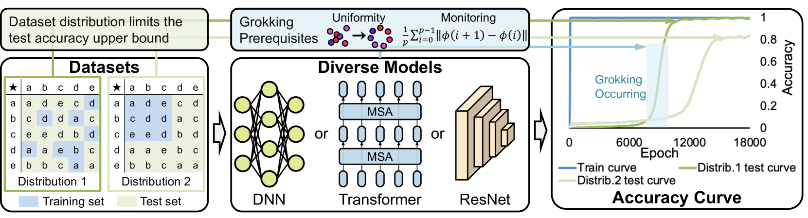

###### fig-1

*Figure 1: Grokking occurs from two factors: the **uniformity** of embeddings under weight decay and the **dataset distribution**. Embedding uniformity arises from parameter updates guided by minimizing the weight decay term, enabling us to track grokking by monitoring this uniformity. The distribution of the training set determines the upper limit of test accuracy. The above insights are applicable to diverse models, including DNN, Transformer and ResNet.* **[p. 2]**

###### p1-5

To answer this question, we investigate the operations within a prime-number field task, as proposed by Power *et al.* (Power et al., 2022), utilizing the single-layer transformer-based decoder (Vaswani et al., 2017). The analysis can be divided into two stages: (1) What are the properties of the convergence domain of the model parameters when the loss function includes only weight decay terms? (2) Why does the test accuracy reach 100$\%$ in this convergence domain? A representative kernel-based study considers the former problem by analyzing the effect of the weight decay term in a two-layer MLP (Mohamadi et al., 2024). However, the proof hinges on the piecewise-linearity **[p. 2]** of MLPs and the specific properties of the addition task and therefore does not account for grokking when other operations are performed on the prime field. Moreover, there is currently no related research addressing the second question. In the first stage, we demonstrate that the weight decay term significantly impacts the parameter convergence domain, resulting in uniformity in the embedded values. We further prove that this *uniformity is the key factor in improving test accuracy*. Additionally, we establish the necessary and sufficient conditions for grokking to occur in such tasks and design experiments to validate these findings. Building on this, we analyze and demonstrate that the *the training set distribution defines the upper bound for test accuracy*. While previous studies often report 100% test accuracy due to random training set proportions, we show that by deliberately selecting the distribution of the training set, the upper limit of test accuracy can be effectively controlled. Figure 1 provides a conceptual illustration of the factors contributing to grokking.

###### p2-1

Expanding on the above theoretical analysis, we observe that previous research on progress measures has primarily focused on approximating the uniformity of embedded values (Liu et al., 2022; Miller et al., 2024; Wang et al., 2024). However, methods relying on Fourier decomposition (Nanda et al., 2023) or local complexity (Humayun et al., 2024) are often overly complex and impractical. In contrast, we propose a concise and straightforward progress measure grounded in our theoretical insights. This measure directly monitors the trends in the loss function on the test set, providing a more efficient and practical alternative.

Furthermore, we demonstrate that any network whose feature operations become quasi-linear after capturing the main features will inevitably exhibit grokking on certain tasks. This implies that deeper networks may also be capable of exhibiting grokking. However, existing reports of this phenomenon are largely confined to relatively small networks, such as shallow DNNs or smaller transformers (Power et al., 2022; Liu et al., 2022; Gromov, 2023; Lyu et al., 2024). To show that grokking can indeed occur in deeper architectures, we constructed a novel task based on our theoretical findings and successfully demonstrated grokking on ResNet-18 (He et al., 2016), further validating the robustness and completeness of our theoretical framework.

Finally, we explore whether this research can enhance our understanding and improvement of network architectures. Specifically, we investigate how the transformer model encodes and processes knowledge from the dataset, defining three types of separability: topological separability, convex separability, and projected convex separability. The grokking phenomenon observed in operations over prime fields indicates that the transformer tends to encode the knowledge of the training dataset in a projected convex separable form. Interestingly, the grokking phenomenon diminishes as the number of transformer layers increases. This suggests that the convex hull representing the stored knowledge becomes smaller as the architecture deepens, leading us to speculate that deeper transformer architectures possess greater knowledge capacity.

To summarize, our contributions are as follows:

###### p2-5

- We present a comprehensive mathematical proof of the underlying mechanism behind grokking, demonstrating that the uniformity of embedded values drives grokking, while the distribution of training data determines the upper bound of test accuracy.
- We provide a systematic perspective on understanding progress measures associated with grokking and propose a novel, concise, and efficient approach for monitoring trends in the test set’s loss function.
- We construct a novel task and successfully demonstrate the grokking phenomenon on the deep network ResNet-18, further validating the completeness of our theoretical framework.
- We propose a new conjecture on how the transformer architecture processes knowledge from the training set and offer a structured representation of this mechanism.

**[p. 3]**

###### p3-2

**Progress Measure:** The concept of *progress measures* was first introduced in research on sparse parities (Barak et al., 2022), essentially as a smooth function of continuous changes in activation values used to predict model behavior. The first perspective is based on frequency and Fourier coefficients, inspired by circuit signal analysis (Nanda et al., 2023; Zhou et al., 2024; Furuta et al., 2024). The second perspective is local complexity, derived from linear region analysis (Humayun et al., 2024). The third perspective is based on information theory (Clauw et al., 2024). Recently, some methods have aimed to provide a more unified perspective (Yunis et al., 2024; Song et al., 2024).

###### p3-4

Our research is based on operation tasks on the prime number field $\mathbb{Z}_{p}$, focusing on the problem of outputting $f(i,j)\;mod\;p$, where $f$ is a two-variable polynomial function and $i,j\in\mathbb{Z}_{p}$. This task is performed by a single-layer transformer on inputs of the form $(i,j,\mathsf{cls})$. Unless otherwise specified, in the following text we consider $f(i,j)=i+j$ and denote the remainder of $f(i,j)$ modulo $p$ by $r(i,j)$.

For simplicity, we adopt a formal operator framework and use geometric terminology to characterize the model’s operational process. A single-layer transformer decoder comprises the following operators: the identity operator $I_{d}$ (corresponding to the residual connection), the normalization operator $n$ (corresponding to attention score normalization), the truncation operator $r$ (corresponding to the MLP activation function), linear operators $l_{O},l_{V},l_{1},l_{2},l$, and the bilinear operator $\beta_{QK}$ (corresponding to attention weight calculation). Consequently, the transformer’s two primary component expressions can be written as follows:

$$
\mathsf{SelfAtt}(X)=I_{d}(X)+l_{O}\circ(n\circ\beta_{QK}(X,X)\cdot l_{V}(X)), \tag{1}
$$

$$
\mathsf{MLP}(X)=I_{d}(X)+l_{1}\circ r\circ l_{2}(X). \tag{2}
$$

We consider the dataset $I\times J$ and $I=J=\mathbb{Z}_{p}$ with embedding function $\phi:\mathbb{Z}_{p}\to\mathbb{R}^{n}$. So the token input into the transformer has the form of $(\phi(i),\phi(j),\phi(\mathsf{cls}))$ where $i\in I$ and $j\in J$. We take $I^{\prime}\times J^{\prime}$ as the training set and $I^{\prime\prime}\times J^{\prime\prime}$ as the test set. Now we define an equivalence relation in the dataset.

###### p4-8

*Let $\phi(p)=\phi(0)$, when $W<E$, there exists a positive number $\delta$ such that $\frac{1}{p}\sum_{i=0}^{p-1}\|\phi(i+1)-\phi(i)\|<\delta$.*

###### p4-9

What we aim to prove is a stronger result: for any element in $I\times J/\sim$, embeddings uniformly distributed on the $n-1$ dimensional manifold will reduce the sum of norms in Lemma 3.4, thereby decreasing the weight decay function. This is what we refer to by $\Omega$ representing the “uniformity” of the embedding. Theorem 3.8 directly follows from this result.

###### p4-10

In this section, we address why the test accuracy increases rapidly with the model parameters in $\Omega$, as described in the following Theorem 3.10. The idea described in this theorem is simple: if the model wants to accurately output results in the test set, it must ”imitate” the results in the training set, and in this task, the imitated object must be nearby.

###### p4-16

In fact, this lower bound is also the proportion of training sets required to stably observe grokking under the assumption of randomly taking training sets.

###### p5-1

Let the complete set of parameters of a deep learning model be denoted by $M$, and the update step by $\displaystyle n$. Given a function $f:M\times\mathbb{Z}_{+}\to\mathbb{R}$, if there exists a mapping $\varphi\circ f:W\times\mathbb{Z}_{+}\rightarrow\{0,1\}$ such that $\varphi\circ f$ takes the value of 1 when a specific phenomenon occurs and 0 otherwise, then we call $f$ a **progress measure** of this specific phenomenon of the model.

Through this strict definition, it becomes clear that a progress measure is an explanation-based monitoring value for detecting which quantities change when the model groks. In other words, it tracks a trait from which the test loss trend can be inferred through the model parameters. Consequently, the design of such a measure is tightly linked to the fundamental reason the model can generalize.

###### p5-3

However, an inherent limitation exists in current progress measures. They merely reveal properties of model parameters within the minimal region defined by the weight decay term, without proving that these properties are necessary for the weight decay term to reach a local minimum.

###### p5-4

From the discussion in Section 3, the necessary and sufficient condition for the weight decay term to reach a local minimum is that the embedding in the equivalence class of the training set remains uniform. This insight explains why certain progress measures, despite not delving deeply into theory, can still succeed: they indirectly capture some aspect of uniformity. For instance, when Fourier decomposition exposes significant weights, it indicates periodic signals, which is a classical concept in dynamical systems (Brin & Stuck, 2002).

Meanwhile, interpretable progress measures are often cumbersome to compute. By directly applying our theorem, however, a concise progress measure can be constructed, termed the main embedding diff (MED), which straightforwardly captures changes in test accuracy after training accuracy reaches 1.

###### p5-7

where $\phi^{(n)}$ denotes the embedding mapping $\phi$ after $n$ epochs of updates, $p$ denotes the selected prime number.

###### p5-13

The real difficulty lies in how to measure this separation. We can only assume that the model stores knowledge in the form of *a continuous manifold of the convex hull that can contain multiple training sample points*. Then, the ability to complete this separation is measured by the convex separability of the embedded point set. The goal of deep learning is to learn the manifold of the embedding space that needs to be separated from the convex hull of discrete samples. We define three types of high-dimensional point set separability to describe this process:

**[p. 6]**

###### p6-1

Let $A$ and $B$ be two finite point sets in $n$-dimensional Euclidean space. We call $A$ and $B$ 1) *topologically separable* if and only if $A\cap B=\emptyset$; 2) *convexly separable* if and only if $\mathsf{Conv}(A)\cap\mathsf{Conv}(B)=\emptyset$, where $\mathsf{Conv}(A)$ and $\mathsf{Conv}(B)$ denote the convex hulls of $A$ and $B$, respectively; and 3) *convexly separable on subspace* $\mathcal{U}$ if and only if the projections of $A$ and $B$ onto $\mathcal{U}$ are convexly separable.

Among them, convex separability is stronger than subspace convex separability, and topological separability is stronger than positional separability. The role of positional embedding is to provide topological separability of the same vocabulary. The goal of transformer learning is to make the embedding convexly separable on a certain subspace.

###### p6-3

We hypothesize that the presence of bilinear operators in the transformer causes the division of regions to deviate from linearity. To address this, we adopt the convex separability of the subspace as an alternative to linearity. Furthermore, we conjecture that as the number of transformer layers increases, the growth of regional differentiation will follow at least a quadratic polynomial form. In other words, the linear combination of the learned characteristic functions will take the following form:

$$
f(x)=\sum_{r\in R}\theta_{r}(\sum_{t\in R_{r}}\mathbf{1}_{\Omega_{t}}). \tag{7}
$$

###### p6-4

We verify this conjecture on the grokking task in Figure 2. As the number of layers increases, due to the rapid decrease in the volume of the indicative area, the test sample points will enter and exit the corresponding indicative area differently, corresponding to the test accuracy rate oscillating sharply in a large range. This fully demonstrates the subdivision of the region. In our prime field operation task, this means that the continuous regions representing the congruence of the operation results become more numerous and smaller.

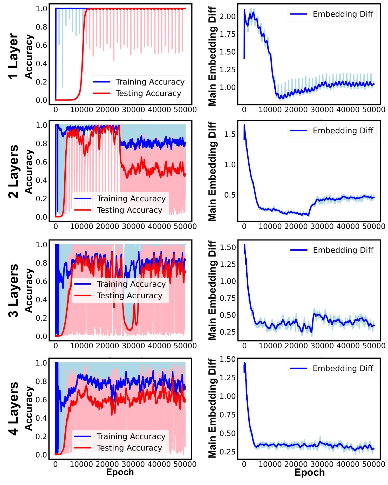

*Figure 2: **Impact of Using More Transformer Layers.** As the number of transformer layers increases, the test accuracy fluctuates violently, while the med keeps decreasing.* **[p. 6]**

###### p7-1

We summarize the experimental results in Table 1. For each specified training set distribution, we record the time (in epochs) at which grokking occurs as GO-Epoch, the upper limit of accuracy achievable through grokking as U-Acc, and the lowest accuracy observed after reaching this upper limit as L-Acc. The two values illustrate the range of accuracy oscillation following grokking.

*Table 1: Upper Limit of Accuracy Under Specific Training Set Distributions.* **[p. 7]**

| Method | Para | U-Acc | L-Acc | GO-Epoch |
|---|---|---|---|---|
| SQUARE $i=0,1,...,k$ $j=0,1,...,k$ | $k$=30 | 99.04 | 91.27 | 1500($\pm$100) |
| $k$=35 | 91.07 | 80.73 | 1500($\pm$100) |  |
| $k$=40 | 84.50 | 81.68 | 1700($\pm$100) |  |
| $k$=45 | 79.03 | 76.07 | 1900($\pm$100) |  |
| $k$=50 | 77.39 | 66.02 | 3400($\pm$200) |  |
| $k$=55 | 62.09 | 57.69 | 2600($\pm$100) |  |
| $k$=60 | 57.31 | 55.18 | 2200($\pm$100) |  |
| STRIP $i=0,1,...,t$ $j=0,1,...,97$ | $t$=67 | 7.56 | 3.58 | disappear |
| $t$=60 | 33.25 | 17.05 | 900($\pm$100) |  |
| $t$=50 | 80.10 | 73.61 | 1600($\pm$100) |  |
| $t$=40 | 89.89 | 84.80 | 1300($\pm$100) |  |

###### p7-2

In fact, what we are discussing is still a necessary condition. The upper limit of the grokking test accuracy of this task is determined by the distribution of the training set in each equivalence class in $I\times J/\sim$. It is just that when $f(i,j)=i+j$, the distribution of each of these equivalence classes is completely isomorphic. From an algebraic geometry perspective, *the distribution of a dataset is determined by the distribution of integer solutions of an algebraic curve taken modulo $p$*. However, this problem does not admit a general closed-form solution. Of course, we can change the expression of $f(i,j)$ to make the distribution of each of these equivalence classes complex. At this time, even if the value is randomly selected, the upper limit of the grokking test accuracy cannot reach 1, for example, we take $f(i,j)=i^{2}+ij+j^{2}$. The specific experimental results are shown in Figure 4. We use frac to represent the training set proportion. When $\text{frac}=0.5,0.6,0.7$, the relationship $\text{Acc}(1-\text{frac})=\text{Constant}$ holds approximately. Therefore, the generalization ability of the model has not improved as a result of the increased training data.

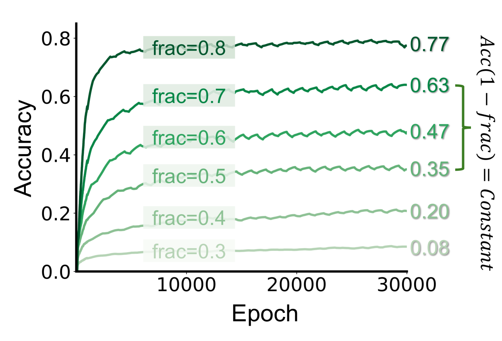

*Figure 4: **Accuracy Curves When $f(i,j)=i^{2}+ij+j^{2}$.** The upper limit of accuracy increases as frac increases. However, the number of samples that can be correctly output in the test set has not increased* **[p. 7]**

###### p7-3

We ultimately find that the difference between DNNs and Transformers in this task lies in their specialized operational mechanisms. Both can handle operations conforming to linear structures, such as $f(i,j)=ai^{n}+bj^{m}$. However, in the above experiment, if we replace the 1-layer transformer with a 2-layer DNN (Gromov, 2023), the test accuracy will always remain around 0.01. DNNs completely fail on $f(i,j)=i^{2}+ij+j^{2}$, whereas Transformers retain a degree of generalization. The detailed results and corresponding experiments are provided in Appendix D.

###### p7-4

In Section 4, we discussed the progress measure method for monitoring grokking. In fact, the essence of this monitoring is to find the weight decay term as a feature of the update direction of the loss function. In Theorem 3.8, we proved that the uniformity of embedding in the feature direction is the direction in which the weight decay decreases. Therefore, we can construct a progress measure function MED that can be easily calculated as shown in Definition 4.2. The MED function’s variation curve closely matches that of the task’s test loss.

###### p7-5

We maintain the same configuration as in Section 6.1, randomly selecting 30% of the entire dataset for the training set. The only difference is that we set $p=47,97,211,379$. We then plot the corresponding Loss, MED, and Accuracy curves to illustrate how effectively our progress measure monitors the test loss. The specific experimental results are shown in Figure 5.

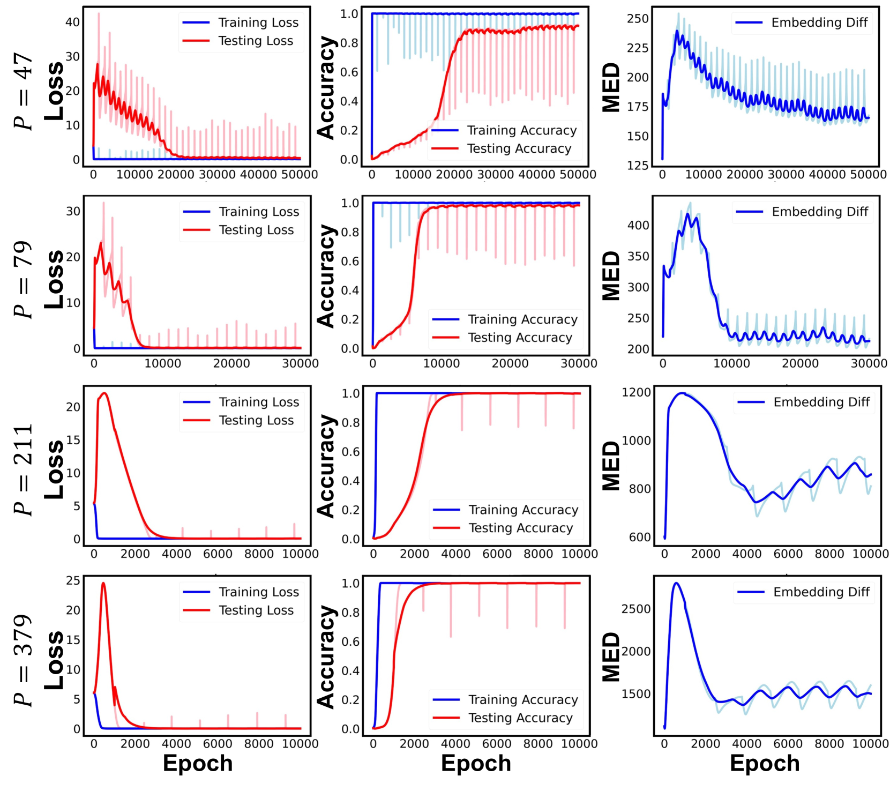

*Figure 5: **Performance of MED under different prime numbers.** To amplify the changes in the MED, we omitted the $\frac{1}{p}$ coefficient defined in Definition 4.2 which means we did not take the average here. It can be observed in all four groups of experiments that the MED and test loss have consistent changing trends.* **[p. 8]**

###### p8-1

According to our theorem, the necessary condition for grokking is that the task’s input exhibits a suitable representational structure and that the network has a corresponding property structure. In the prime-field operation task, this representational structure is a linear periodic structure. As is well-known, convolutional networks tend to destroy linearity due to pooling layers, which explains the lack of a prominent grokking phenomenon in these networks. Guided by our theoretical understanding and the features of convolution, we construct a dataset that ultimately induces grokking in a ResNet-18.

###### p8-2

To create a dataset that induces grokking in ResNet-18, the shallow convolutional layers are configured to extract local features, the deep convolutional layers perform feature operations, and the deeper layers maintain linear features. The task is defined as follows: first, **a dictionary for image classification** is constructed by recording $n$ images and their corresponding categories, with categories represented by integers from 1 to $n$. Each image is then divided into four parts, with each part embedded into an image from the dictionary such that the category of the resulting image is the sum of the categories of the four regions. This process generates a dataset of size $n^{4}$. Detailed instructions are provided in Figure 6.

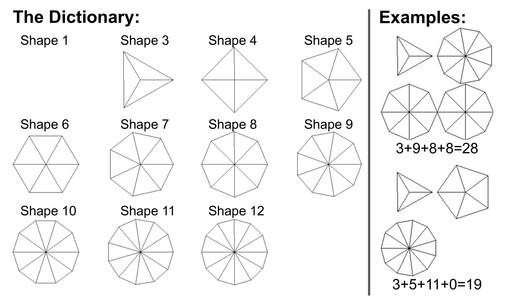

*Figure 6: **Structure of the Data Set.** The left side of the figure illustrates our dictionary, while the right side provides an example of a generated sample.* **[p. 8]**

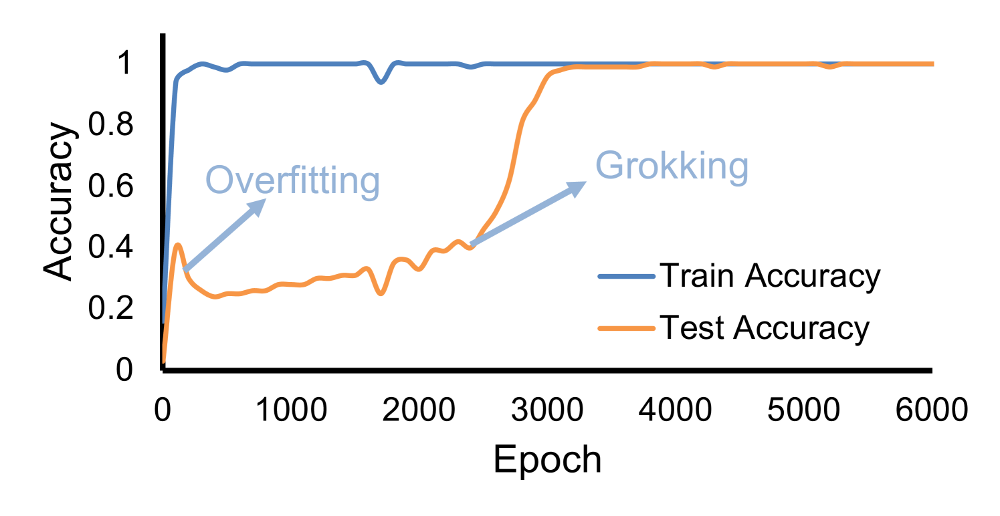

*Figure 7: **The Grokking Phenomenon on Resnet-18.** The training accuracy reaches 1 after approximately 100 epochs, while the test accuracy fluctuates between 0.3 and 0.4 for about 2800 epochs before rapidly rising to 1.* **[p. 8]**

###### p8-3

We use the ResNet-18 model implemented in PyTorch, the Adam optimizer, a learning rate of $10^{-3}$, and a weight decay coefficient of $10^{-4}$. The dataset is configured as described in Figure 6. The dictionary contains 11 entries in total, allowing for the generation of 14,641 samples with 25% of the data randomly selected as the training set. The experimental results are presented in Figure 7.

###### p8-4

In this paper, we systematically studied the grokking phenomenon of computational tasks on prime domains and analyzed the reasons behind the increase in test accuracy. We decomposed this increase into two parts: the uniformity brought about by weight decay, and the further accuracy improvement resulting from the interaction of that uniformity with the training set distribution. We proved these points rigorously and verified them through detailed experiments. We also noted that this uniformity should be interpreted as representation uniformity rather than a concept restricted to the embedding space, implying that both model architecture and task jointly determine how uniformity manifests. Based on this, we proposed an effective progress measure for prime-domain tasks and designed a ResNet-18 grokking task, extending beyond prior work on shallow networks and Transformers. Our findings suggest that for cognitively bounded domains, structured data can be more beneficial than larger data volumes.

**[p. 9]**

###### p13-2

Removing the constant (invariant) terms from this expression yields:

$$
\bar{\phi}(0)=\bigl{(}I_{d}+l_{1}\circ r\circ l_{2}\bigr{)}\circ l_{O}\circ\Bigl{(}n\circ\bigl{(}\beta_{QK}\bigl{(}\phi(i),\phi(\mathsf{cls})\bigr{)}\,l_{V}\bigl{(}\phi(i)\bigr{)}+\beta_{QK}\bigl{(}\phi(j),\phi(\mathsf{cls})\bigr{)}\,l_{V}\bigl{(}\phi(j)\bigr{)}\bigr{)}\Bigr{)}.
$$

Since addition and subtraction of linear transformations remain linear, we write:

$$
\bar{\phi}(\mathsf{cls})=r^{\prime}\circ l^{\prime}\bigl{(}\phi(i)\bigr{)}\;+\;r^{\prime\prime}\circ l^{\prime\prime}\bigl{(}\phi(j)\bigr{)},
$$

where $r^{\prime}$ and $r^{\prime\prime}$ are truncation operators, and $l^{\prime}$ and $l^{\prime\prime}$ are linear operators.

Owing to the widespread usage of normalization layers, it is reasonable to assume

$$
\|l^{\prime}\|\;\approx\;\|l^{\prime\prime}\|.
$$

From Lemma 3.2, it follows that

$$
\bigl{\|}\,r^{\prime}\circ l^{\prime}\bigl{(}\phi(i)\bigr{)}\;+\;r^{\prime\prime}\circ l^{\prime\prime}\bigl{(}\phi(j)\bigr{)}\;-\;c^{\prime}_{r(i,j)}\bigr{\|}<\epsilon^{\prime}_{r(i,j)}.
$$

This directly implies

$$
\|\;\phi(i)\;+\;\phi(j)\;-\;k_{r(i,j)}\|\;<\;\delta_{r(i,j)},
$$

for appropriate choices of $k_{r(i,j)}$ and $\delta_{r(i,j)}$.

As the size of $A\times B$ grows, the set of admissible vectors $\{k_{i}\}$ converges toward a single point, and the corresponding $\delta_{i}$ values shrink accordingly. Hence, while $k_{i}$ and $\delta_{i}$ are not strictly unique for finite $|A\times B|$, they become more tightly constrained as $|A\times B|$ increases.

*In essence, this argument establishes that if the model converges correctly, the linear operations (subject to truncation and normalization) enforce an approximate uniform embedding in the deeper layers.* ∎

###### p14-13

This lemma tells us that for a single constraint, the minimum value of weight decay corresponds to an embedding that is specific distributed on a smooth manifold of $n-1$ dimensions.

This implies $\sum_{i=0}^{p-1}\|\phi(i+1)-\phi(i)\|$ will decrease within the optimization process. In this way we can get the desired results.

Finally, we consider the general form of $f(i,j)$, which means that we need to change the constraints in the lemma to for each pair $(i,j)$ with $f(i,j)\equiv 0\pmod{p}$, we must have

$$
l(x_{i})+l(x_{j})\;=\;r,
$$

Here, the general f(i,j) cannot guarantee that the manifold has a good structure, so our theorem always holds, but the grokking phenomenon may not occur. ∎

**[p. 15]**

###### p16-1

The probability of full coverage satisfies

$$
P_{\mathrm{full}}\;=\;\Pr\bigl{(}\text{all }N\text{ points are covered}\bigr{)}\;\geq\;1\;-\;N\;\biggl{(}1-\tfrac{C}{N}\biggr{)}^{m}.
$$

By the union bound,

$$
\Pr\bigl{(}\cup_{(i,j)}[\text{point }(i,j)\text{ not covered}]\bigr{)}\;\leq\;\sum_{(i,j)}\Pr[\text{point }(i,j)\text{ not covered}]\;=\;N\,\left(1-\frac{C}{N}\right)^{m}.
$$

Hence,

$$
P_{\mathrm{full}}=1-\Pr\bigl{(}\cup_{(i,j)}[\text{point }(i,j)\text{ not covered}]\bigr{)}\;\geq\;1-N\,\left(1-\frac{C}{N}\right)^{**[p. 16]** m}.
$$

A simple approach is to require the *expected* number of uncovered points to be less than 1, which gives

$$
N\times\bigl{(}1-\frac{C}{N}\bigr{)}^{m}\;<\;1.
$$

Taking natural logarithms on both sides and using the approximation $\ln(1-x)\approx-x$ when $x$ is small, we obtain

$$
\ln(N)\;-\;m\,\frac{C}{N}\;<\;0\quad\Longrightarrow\quad m\;>\;\frac{N}{C}\,\ln(N).
$$

Since $m=\alpha N$, this yields

$$
\alpha\;>\;\frac{1}{C}\,\ln(N)\;=\;\frac{1}{C}\,2\ln(p).
$$

∎

###### p18-4

For the sample $(i,j,p_{+})\rightarrow c$, we define a map $F_{s,i,j,p},s=1,2,...,p$ that it maps $x,W,W_{U}$ in (8)-10 into three scalars $x,w,u$ with equations

$$
\frac{dx}{dt}=-(xwu-\delta_{s,c})wu, \tag{11}
$$

$$
\frac{dw}{dt}=-(xwu-\delta_{s,c})xu, \tag{12}
$$

$$
\frac{du}{dt}=-(xwu-\delta_{s,c})xw. \tag{13}
$$

The $\delta_{s,c}$ mentioned above is a Kronecker symbol.

###### p20-1

The above theorem guarantees the existence of grokking.

**[p. 20]**

###### p21-3

We have discussed the impact of choosing different $f(i,j)$ on the upper bound of accuracy, and have also described that this does not affect the ability of the MED function to monitor the progress of parameter updates due to weight decay, and our subsequent experiments report this result. We selected five cases to represent this: $x-y$, $xy$, $x^{2}+y^{2}$, $x^{2}+xy+y^{2}$, $x^{3}+y^{3}$, and $x^{3}+xy+y^{3}$. Through the experiments, we found that our MED function is still exceptionally capable of tracking test loss. For detailed experiments, please refer to Figure12-19

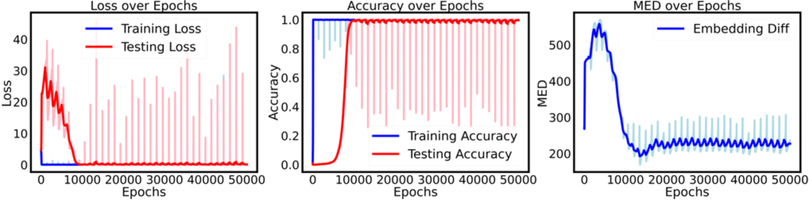

*Figure 12: $p=97$, $k=0$, $d_{model}$=128, $x-y$, the training set proportion is set to 0.3.* **[p. 24]**

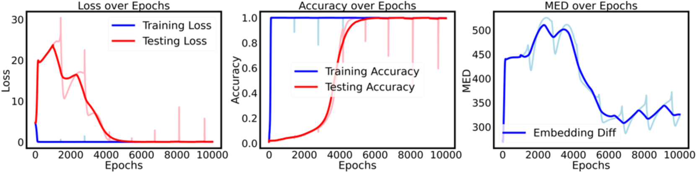

*Figure 13: $p=97$, $k=0$, $d_{model}$=128, $xy$, the training set proportion is set to 0.3.* **[p. 24]**

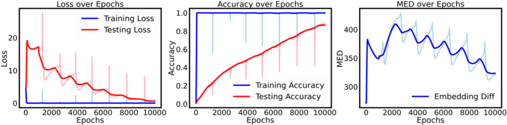

*Figure 14: $p=97$, $k=0$, $d_{model}$=256, $x^{2}+y^{2}$, the training set proportion is set to 0.2.* **[p. 24]**

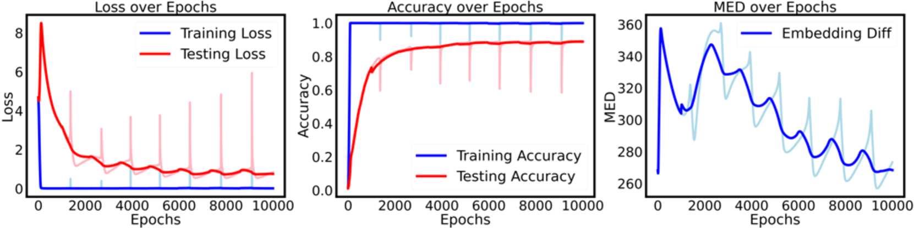

*Figure 15: $p=97$, $k=0$, $d_{model}$=128, $x^{3}+y^{3}$, the training set proportion is set to 0.2.* **[p. 24]**

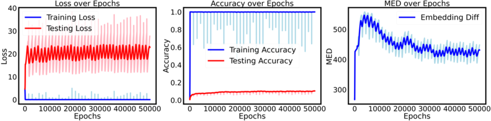

*Figure 16: $p=97$, $k=0$, $d_{model}$=128, $x^{2}+xy+y^{2}$, the training set proportion is set to 0.3.* **[p. 25]**

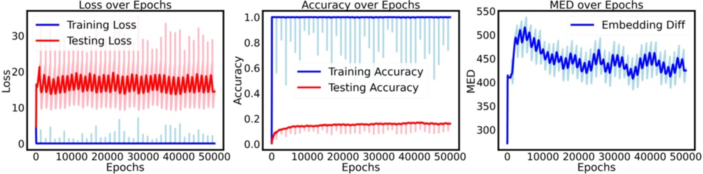

*Figure 17: $p=97$, $k=0$, $d_{model}$=256, $x^{2}+xy+y^{2}$, the training set proportion is set to 0.3.* **[p. 25]**

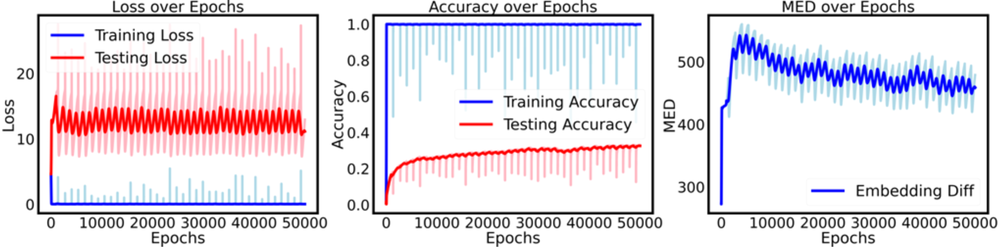

*Figure 18: $p=97$, $k=0$, $d_{model}$=256, $x^{2}+xy+y^{2}$, the training set proportion is set to 0.4.* **[p. 25]**

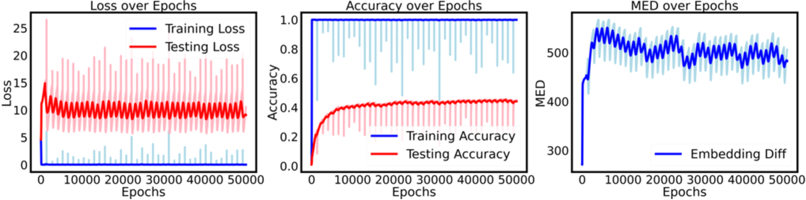

*Figure 19: $p=97$, $k=0$, $d_{model}$=256, $x^{3}+xy+y^{3}$, the training set proportion is set to 0.5.* **[p. 25]**

**[p. 26]**

###### p26-2

Since the occurrence of grokking implies thorough learning of the uniformity in the embedding space, our approach is to adjust the initial embedding values to facilitate this learning process. Specifically, we use a circulant matrix generated from a random vector to replace the embedding matrix, as expressed below:

$$
W_{E}=\text{Toeplitz}(v,v^{\prime}), \tag{19}
$$

###### p26-3

with Toeplitz represents the operation of generating a Toeplitz matrix, and $v$ is a random vector. We have presented the experimental results in Figure 20

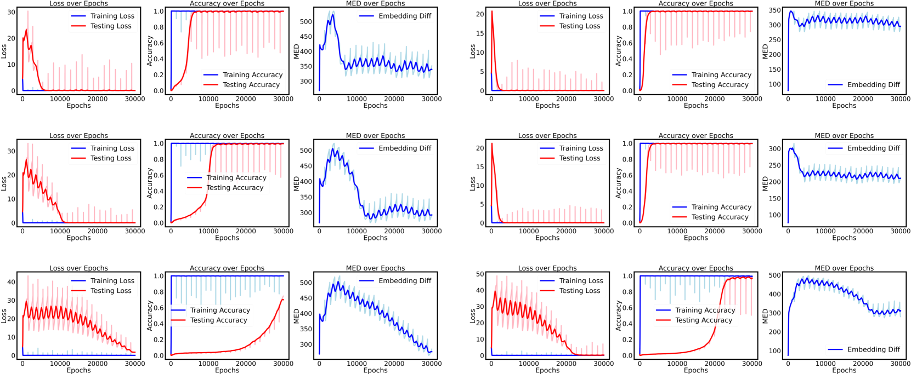

*Figure 20: The experiments were conducted with $p=97$, $k=0$, and $d_{model}=128$. The left side shows the results with random embeddings, while the right side displays the results using the improved embedding method. From top to bottom, the training set proportions are 0.3, 0.25, and 0.2, respectively. The number of epochs required for grokking to begin on the right side is only half of that on the left side.* **[p. 26]**
