# Eichin, Du, Mondorf, Matveev, Plank & Hedderich 2025 — ExPLAIND: Unifying Model, Data, and Training Attribution to Study Model Behavior

See also: [the global concept index](../../concepts/index.md).

**Florian Eichin**, **Philipp Mondorf**, **Barbara Plank**, **Michael A. Hedderich** (MaiNLP, LMU Munich; MCML), **Yupei Du** (Saarland University), **Maria Matveev** (MCML; the mathematics department of LMU Munich).

arXiv [2505.20076](https://arxiv.org/abs/2505.20076), May 2025, 32 pages, 15 figures, 2 tables. Citations by Semantic Scholar — 1, in the corpus — 1. A unified frame of post-hoc interpretability: three usually separate views — on the components of the model, on the training data and on the course of training — are brought into one "influence tensor" through a generalisation of the exact path kernel (EPK) to AdamW. On a grokking transformer for addition modulo 113 the three phases of Nanda et al. are rewritten: the third phase turns from "cleanup" into "alignment" — the embedding and the decoder fall into line with the representation pipeline formed in the middle layers; and transplanting the middle layers gives an instant generalisation.

The files of this paper's analysis:

- [`2505.20076.explaind-unifying-model-data-and-training-attribution-to-study-model-behavior.license.txt`](2505.20076.explaind-unifying-model-data-and-training-attribution-to-study-model-behavior.license.txt) — the arXiv licence record for this paper.

The anchor scheme and the rules for linking into a card are in the [README of the papers folder](../README.md).

**Excerpt card.** The paper's licence (`arxiv-nonexclusive`) does not permit republishing the paper itself; what stands here are the editorial sections and the fragments the corpus quotes (right of quotation). The paper: <https://arxiv.org/abs/2505.20076>.

## Concepts covered

**[Grokking](../../concepts/grokking.md)** — the heart of the work: the three phases of Nanda et al., "memorisation — circuit formation — cleanup", are rewritten as "memorisation — formation of a representation pipeline — alignment of the embedding and the decoder"; the fast rise of the validation accuracy is explained by a simultaneous alignment of the outer layers around the pipeline in the middle layers ([`p7-3`](#p7-3)). The causal check is a transplant: a model with the attention layers and Linear 1 taken from a grokked one and the rest random generalises within the first 100–200 steps and bypasses the memorisation phase ([`p7-4`](#p7-4), [`fig-3`](#fig-3)); one attention layer suffices; and the reverse transplant of the outer layers gives no fast generalisation.

**[Mechanistic interpretability](../../concepts/mechanistic-interpretability.md)** — the claimed contribution: an additive decomposition of a prediction over steps, parameters and training examples (an "influence tensor"), with an arbitrary granularity of summation and a validation by pruning ([`p4-1`](#p4-1)); at 100 quadrature nodes 100 % of the decisions of all three models are reproduced ([`p3-11`](#p3-11)). Acknowledged outright: the frame is not causal and does not isolate circuits at the level of activations; and the cost of applying it is orders of magnitude above that of training.

**[The neural tangent kernel](../../concepts/neural-tangent-kernel-ntk.md)** — the theoretical support: the exact path kernel (EPK) reformulates a model trained with AdamW as a kernel machine and generalises the NTK over the whole training trajectory ([`p2-7`](#p2-7)); Theorem 3.1 adds mini-batches, both moments, the step schedule and a decoupled weight decay to the EPK ([`p3-1`](#p3-1)).

**[The memorisation phase](../../concepts/memorization-phase.md)** — by the influence curves the memorisation phase coincides with the peak of the regularisation influence and the peak of the absolute importance of the decoder — the decoder is named the chief instrument of memorisation ([`p6-4`](#p6-4)).

**[Fourier features](../../concepts/fourier-features-circuits.md)** — the data-side perspective: after the memorisation, off-diagonal bands of the residue classes modulo 113 appear and sharpen in the decoder's influence matrices, the cyclic geometry shifts continuously "from high frequencies to low", and the final state is a cosine of "frequency 113", confirmed by a lasso fit (a coefficient of 0.112 — an order of magnitude above the others) ([`p7-8`](#p7-8), [`fig-4`](#fig-4)); the observations of Nanda et al. about cosine neurons are called consonant with this global cyclicity ([`p7-19`](#p7-19)). Note: the word "frequency" is used here in the sense of period — under the corpus's usual Fourier vocabulary the numbers read the other way round.

**[Weight decay](../../concepts/weight-decay.md)** — the regularisation is singled out as a separate term of the decomposition: in the final phase the absolute influence of the regularisation outweighs the kernel one, and the last phase is "governed by the regularisation" — once stable representations have formed, the regularisation suppresses the inefficient memorising solutions ([`p6-4`](#p6-4)); for the embedding itself the relative influence of the regularisation sharply prevails ([`p7-2`](#p7-2)). An editor's caveat: the quantity $D_{s}(\Theta)=\Psi-\Psi^{reg}$ defined in the paper is read in §5.1 in two opposite senses.

## What is shown and what is conjectured

These are the card editor's remarks, not the authors' text, drawn from a numbered pass over the paper's claims.

**The strong points — the measuring instrument and the transplants.** An additive decomposition of a prediction over steps, parameters and examples, with checks: at 100 quadrature nodes the EPK reproduces 100 % of the decisions with a KL near zero; and pruning a CNN by the weight scores is competitive with Li et al. at a consistently lower KL. The transplants are given as means over 5 runs with standard deviations: the middle layers are transferable (an instant generalisation, bypassing the memorisation; one attention layer suffices), the outer ones are not.

**The analysis of the influence phases is one run of one single-layer model.** The "precedence" of the peaks of the middle layers over the second peak of the decoder is hard to make out by eye, and there is no quantitative measure of the shift; the phases are not separated in time (the "late" embedding falls inside the circuit formation, while the validation accuracy rises only after step 1000); and the abstract's words about a pipeline "learned after the memorisation" conflict with the figure, where the peaks of the middle layers fall on the very rise of the training accuracy. The quantity $D_{s}(\Theta)$ is read in two opposite senses; the claim about the early checkpoints ("a fast generalisation, only at a slightly lower accuracy") does not follow from the figure — there the accuracy is 0.3–0.5, not unity; and the support of the alignment is named as the pair "the embedding and the decoder", yet in the causal check the gain is held only by the triple Emb. + Lin. 2 + Dec.

**Minor factual slips.** The setting and the model are attributed to Varma et al. (2023) — the chronology is the reverse (Power et al. 2022; the transformer from Nanda et al. 2023); the "efficiency perspective by Huang et al. (2024)" — the efficiency argument belongs to Varma et al.; the lasso fit is referred in the text to the decoder and in the captions to the second linear layer; and the statement that "the representation appears only in the attention decoders" contradicts the paper's own figure, where the cyclic picture is stronger in linear 2. It is precisely the grokked model that requires a fine quadrature: at 10 nodes the agreement falls to 0.748 (the CNN and the ResNet hold 0.997–0.998).

**The EuroLLM analysis is by proxy.** The genuine training batches are not used: a batch of the same composition is reconstructed, and one step per checkpoint is taken on it; the reading of the two-phase behaviour is declared a guess; and the caption of the figure and the text disagree on the direction of the first phase.

**How the work will be cited** ("it is proved that the third phase of grokking is an alignment of the embedding and the decoder") — more precisely: on one run of one single-layer model, a late rise of the importance of the embedding, a prevalence of the regularisation at the embedding and an instant generalisation on transplanting the middle layers are shown; the pair "the embedding and the decoder" itself works in the causal check only together with Linear 2. What is valuable independently of the reading of the phases is the measuring instrument itself.

---

# Quoted fragments

Only the fragments the corpus cards refer to are
reproduced here (right of quotation); the paper's licence does not permit
republishing the whole text. Anchor numbering matches the original.

###### p2-7

Gradient path kernels (Domingos, 2020) reformulate a model trained by gradient descent as a kernel machine. Bell et al. (2023) extended this perspective to an exact equivalence, deriving the *Exact Path Kernel* (EPK) and studying data attribution through the kernel scores. Our notion of the tensor of influences generalizes this idea to the model components and training steps. Furthermore, their formulation does not cover realistic learning scenarios involving gradient updates based on first- and second-order estimates, weight decay, dynamic learning rates, and mini-batching. Central to the EPK reformulation is the stepwise comparison of training and test sample gradients via dot products. This connects the EPK to the Neural Tangent Kernel (Jacot et al., 2018), which it generalizes over the training trajectory. TracIn (Pruthi et al., 2020) also measures dot-products of gradients across training steps for data attribution, but lacks a theoretical connection to model predictions.

###### p3-1

*Let $f_{\theta}:\mathcal{X}\rightarrow\mathcal{Y}$ be a model with parameters $\theta\in\mathbb{R}^{D}$, where $\mathcal{X}\subseteq\mathbb{R}^{I}$ and $\mathcal{Y}\subseteq\mathbb{R}^{O}$. Let $\mathcal{D}=\{(x_{1},y_{1}),\dots,(x_{M},y_{M})\}$ be a dataset, let $L:\mathcal{Y}\times\mathcal{Y}\rightarrow\mathbb{R}_{\geq 0}$ be a per-sample loss, and define the batch loss at training step $i$ by $\mathcal{L}_{i}(\theta):=\sum_{k\in B_{i}}w_{i,k}\,L(f_{\theta}(x_{k}),y_{k})$, for batch $B_{i}\subseteq\{1,\dots,M\}$ and $w_{i,k}\in\mathbb{R}$ the weight of sample $(x_{k},y_{k})$. Suppose that $\theta_{N}$ is obtained from $\theta_{0}$ by $N$ steps of AdamW with learning rates $\alpha_{s}\in\mathbb{R}_{>0}$, weight decay $\lambda\in\mathbb{R}_{\geq 0}$, betas $\beta_{1,2}\in[0,1]$, bias-corrected second-moment terms $\hat{v}_{s+1}$, and stability constant $\epsilon\in\mathbb{R}_{>0}$ at step $s$. Then, for every $x\in\mathcal{X}$, the model prediction decomposes as follows*

$$
\begin{split}f_{\theta_{N}}(x)=f_{\theta_{0}}(x)&-\sum_{k=1}^{M}\sum_{s=0}^{N-1}\phi_{s}^{test}(x)\,\phi_{s}^{train}(x_{k})\\
&-\sum_{s=0}^{N-1}\phi_{s}^{test}(x)\,\mathbf{r}_{s},\end{split} \tag{1}
$$

*where*

$$
\begin{split}\phi_{s}^{test}(x)&:=\int_{0}^{1}\nabla_{\theta}f_{\theta_{s}(t)}(x)\,dt\in\mathbb{R}^{O\times D},\\
\phi_{s}^{train}(x_{k})&:=\sum_{i=0}^{s}\alpha_{s,i}\,\mathbf{1}_{k\in B_{i}}\,w_{i,k}\,\frac{\nabla_{\theta}\!\bigl(L(f_{\theta_{i}}(x_{k}),y_{k})\bigr)}{\sqrt{\hat{v}_{s+1}}+\epsilon}\\
&\ \ \ \ \ \ \ \ \ \ \ \ \ \ \ \ \ \ \ \ \ \ \ \ \ \ \ \ \ \ \ \ \ \ \ \ \ \ \ \ \ \ \ \ \ \ \ \ \ \ \ \ \ \ \ \ \ \ \ \ \ \ \ \in\mathbb{R}^{D},\\
\end{split}
$$

$$
\begin{split}\mathbf{r}_{s}&:=\alpha_{s}\lambda\theta_{s}\in\mathbb{R}^{D},\\
\theta_{s}(t)&:=\theta_{s}+t(\theta_{s+1}-\theta_{s})\in\mathbb{R}^{D},\\
\alpha_{s,i}&:=\alpha_{s}(1-\beta_{1})\beta_{1}^{s-i}(1-\beta_{1}^{s+1})^{-1}\in\mathbb{R},\\
\end{split}
$$

###### p3-11

To empirically validate the exact equivalence of Theorem 3.1 and Theorem 3.2, we compute the EPK for a Transformer model, a standard CNN, and ResNet-9, trained on modulo addition, MNIST, and CIFAR-2 respectively.[^2] For this, we **[p. 4]** evaluate different numbers of integration steps in the test feature map $\phi^{\text{test}}$ and summarize the results in Table 1. The derived formulation provides an accurate approximation at 100 integration steps for all models, reproducing $100\%$ of their classification decisions. Furthermore, the output distributions closely match those of the original models, indicated by near-zero KL divergences. We therefore use $100$ integration steps for $\phi^{\text{test}}$ for the rest of this study.

###### p4-1

We now build on the established EPK of the training with realistic optimizers such as AdamW and define the ExPLAIND framework, which attributes prediction at the level of training samples, model parameters, and training steps. The key idea is a *tensor of influences* which indexes contributions by training steps, parameters, training samples, and outputs. Different explanations are then obtained by accumulating this tensor along selected axes, leading to parameter-, data-, and step-wise attributions at arbitrary levels of granularity, as visualized in Figure 1. We denote the influence of a parameter $\theta^{(i)}$ at step $s$ due to training sample $x_{k}$ on the prediction of output $j$ of a sample $x$ as

$$
\begin{split}\psi(s,\theta^{(i)},x_{k},x)_{j}:=\phi_{s}^{test}(x)_{j,i}\cdot\phi_{s}^{train}(x_{k})_{i}\end{split}
$$

and the influence of the regularization on $x$ at step $s$ as

$$
\psi^{{reg}}(s,\theta^{(i)},x)_{j}:=\phi_{s}^{test}(x)_{j,i}\cdot(\mathbf{r}_{s})_{i}.
$$

Rewriting Theorem 3.1 using this definition, the $j$-th coordinate of the model output can be written as

$$
\begin{split}f_{\theta_{N}}(x)_{j}=f_{\theta_{0}}(x)_{j}&-\sum_{k=1}^{M}\sum_{s=0}^{N-1}\sum_{i=1}^{D}\psi(s,\theta^{(i)},x_{k},x)_{j}\\
&-\sum_{s=0}^{N-1}\sum_{i=1}^{D}\psi^{reg}(s,\theta^{(i)},x)_{j}.\end{split} \tag{2}
$$

Hence, the scores $\psi(s,\theta^{(i)},x_{k},x)_{j}$ and $\psi^{reg}(s,\theta^{(i)},x)_{j}$ are additive and sum up to the model prediction. The naturally arising backbone of our ExPLAIND framework is the accumulation of these scores over different (sub-)sets of parameters, training and test samples, as well as training steps. We make this explicit with the following definition. We collect all atomic scores into one multi-dimensional object, with axes corresponding to *steps*, *parameters*, *test samples*, *training samples*, and *outputs*. For a set of training steps $\mathcal{S}\subset\{1,2,...,N\}$, model parameters $\Theta\subset\{\theta^{(1)},\theta^{(2)}...,\theta^{(D)}\}$, predicted samples $\mathcal{X}_{pred}\subset\mathcal{D}_{test}$, training samples $\mathcal{X}\subset\mathcal{D}_{train}$, and outputs $\mathcal{J}\subset\{1,...,O\}$ we define the respective **tensor of influences** as

$$
\Gamma(\mathcal{S},\Theta,\mathcal{X},\mathcal{X}_{pred})_{\mathcal{J}}:=(\psi(s,\theta,x,x^{\prime})_{j})_{s,\theta,x,x^{\prime},j}
$$

where $s\in\mathcal{S},\theta\in\Theta,x\in\mathcal{X},x^{\prime}\in\mathcal{X}_{pred},j\in\mathcal{J}$ and, by convention, if $e$ is not already a set we identify it with the singleton $\{e\}$. Further, we define the **accumulated influence** as sums over selected axes of the tensor of influences:

$$
\begin{split}\Psi(\mathcal{S},\Theta,\mathcal{X},\mathcal{X}_{pred})_{\mathcal{J}}&:=\mathrm{sum}(\Gamma(\mathcal{S},\Theta,\mathcal{X},\mathcal{X}_{pred})_{\mathcal{J}})\\
\end{split}
$$

where $\mathrm{sum}$ sums up the elements along all dimensions of the tensor. Furthermore, we define leaving out a category in the arguments of $\Psi$ or $\Gamma$ as summing over the complete set along it. For example, $\Psi(\Theta,\mathcal{X},\mathcal{X}_{pred})$ is the influence summed over all steps $\mathcal{S}$ and all output dimensions $\mathcal{J}$. To account for differences in sign across influences to different predictions and outputs, we further define the **accumulated importance** as follows

$$
\bar{\Psi}(\mathcal{S},\Theta,\mathcal{X},\mathcal{X}_{pred})_{\mathcal{J}}:=\sum_{x\in\mathcal{X}_{pred}}\sum_{j\in\mathcal{J}}|\Psi(\mathcal{S},\Theta,\mathcal{X},x)_{j}|
$$

We denote the analogous definitions for the regularization scores with $\Gamma^{reg}$, $\Psi^{reg}$, and $\bar{\Psi}^{reg}$.

This formulation allows us to explain model behavior in a unified way across different dimensions. By choosing which axes of the influence tensor to keep and which to sum over, we obtain different perspectives such as parameter-level, data-level, or step-level attribution. Within each perspective, the *granularity* of the explanation depends on the size of the sets we consider. For example, if we want to study the influence of a single parameter $\theta^{(i)}$ on a given prediction of a sample $x$, we can accumulate parameter-wise kernel scores over the training set as $\Psi(\theta^{(i)},x)$. In order to zoom out to the layer level per training step, we sum up the scores of all parameters that are a part of a layer $\Theta_{L}$ of the dataset at step $s$, i.e. compute $\Psi_{s}(\Theta_{L},x)$. We provide more details and more examples in Appendix F.5 and illustrate the practical use of such explanations in Sections 5 and 6.

To investigate the relative influence of the regularization term, with analogous definitions and conventions as above, we furthermore define the **parameter-wise relative regularization influence** on the model behavior as the difference

$$
\begin{split}D_{\mathcal{S},\mathcal{X},\mathcal{X}_{pred},\mathcal{J}}(\Theta):=\sum_{\theta\in\Theta}&(\Psi(\mathcal{S},\theta,\mathcal{X},\mathcal{X}_{pred})_{\mathcal{J}}\\
&-\Psi^{reg}(\mathcal{S},\theta,\mathcal{X},\mathcal{X}_{pred})_{\mathcal{J}}).\end{split}
$$

When interpreting the topology of high dimensional spaces, studying the similarity of their elements can be a helpful tool. With analogous definitions and conventions as above, we define the **similarity of two predictions** $x,x^{\prime}\in\mathcal{X}$ in terms of the cosine similarity of their respective scores:

$$
\begin{split}Sim_{\mathcal{S},\Theta,\mathcal{X},\mathcal{J}}&(x,x^{\prime}):=\\
&\frac{\mathrm{flat}(\Gamma(\mathcal{S},\Theta,\mathcal{X},x)_{\mathcal{J}})\cdot\mathrm{flat}(\Gamma(\mathcal{S},\Theta,\mathcal{X},x^{\prime})_{\mathcal{J}})}{||\Gamma(\mathcal{S},\Theta,\mathcal{X},x)_{\mathcal{J}}||\cdot||\Gamma(\mathcal{S},\Theta,\mathcal{X},x^{\prime})_{\mathcal{J}}||}\end{split}
$$

where $\mathrm{flat}$ transforms a tensor into a vector and $||\cdot||$ is the vector **[p. 5]** $\ell_{2}$-norm. We conclude by noting that model behavior can also be studied through other suitable accumulations of the influence tensor $\Gamma$, which we leave to future work.

###### fig-3

*Figure 3: Training statistics, influences, and validation of our representation pipeline hypothesis.* **[p. 6]**

Grokking is a training phenomenon where models first memorize, and then, after prolonged training, suddenly generalize (Power et al., 2022). Nanda et al. (2023) argue for multiple learning stages: (1) *memorization of the training data*, (2) *circuit formation*, in which the model learns a robust mechanism and thus generalizes, and (3) *cleanup*, during which the regularization “removes” memorization components. Other evidence emphasizes the role of dataset size, model capacity, and regularization (Huang et al., 2024; Wang et al., 2024). We use ExPLAIND to revisit these hypotheses, integrating perspectives on model components, training data, and training dynamics in a single analysis. We further verify our insights through ablation experiments.

Our testbed is the well-studied modulo addition task by Varma et al. (2023) where the samples are of the form $[a][+][b][\mathrm{mod}113=]$. We train a Transformer with AdamW (details in Appendix E.2) to predict the correct result. As shown in the top-left of Figure 3(a), the model exhibits Grokking: training accuracy rises sharply, reaching nearly perfect accuracy around step $800$. During this phase, test accuracy remains close to zero, but subsequently increases until $100\%$ at step $1939$, at which point training is stopped.

###### p6-4

**Kernel versus regularization balance.** The absolute influences $\bar{\Psi}_{s}(\Theta)$ and $\bar{\Psi}^{reg}_{s}(\Theta)$ (bottom left of Figure 3(a)) grow together from the start of memorization (around epoch $200$), both peaking near step $1700$ before declining. In the final phase, $\bar{\Psi}^{reg}_{s}(\Theta)$ dominates which indicates that the final training phase is governed by a higher relative influence of regularization. On the layer level, the memorization phase coincides with a peak in regularization influence $D_{s}(\Theta_{layer})$ (bottom right), and absolute influences $\bar{\Psi}_{s}(\Theta_{layer})$ (top right) of the decoder. This establishes the decoder as the most influential component for memorization.

**Middle-layer alternation and circuit formation.** The second peak of the decoder influence (top right) is preceded by peaks of the attention and linear layers, suggesting a single alternation between fitting the decoder and the intermediate layers. This marks the beginning of the circuit formation and hints at a representation pipeline forming in the middle layers.[^3] Their influence then decreases, supporting this interpretation. With respect to regularization, both layers have a rather low influence, indicating that regularization acts primarily on the embedding and decoder layers.

*Grid axes: Train Set (horizontal), Test Set (vertical).*

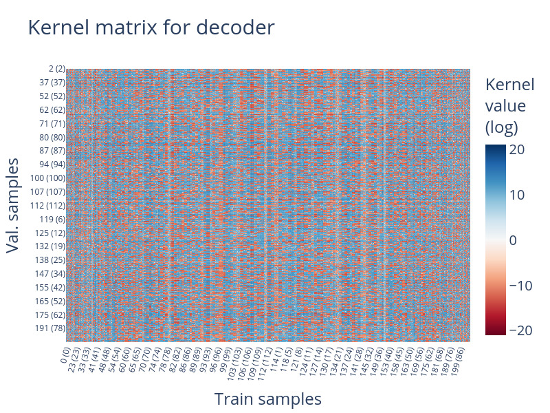

*Step 200 - 250*

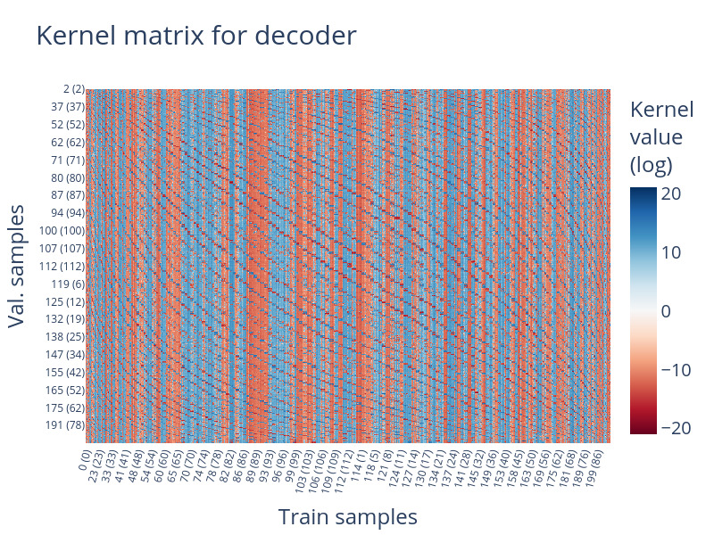

*Step 1050 - 1100*

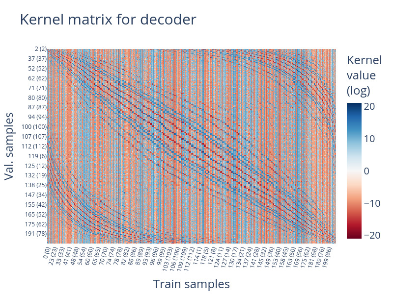

*Step 1850 - 1900*

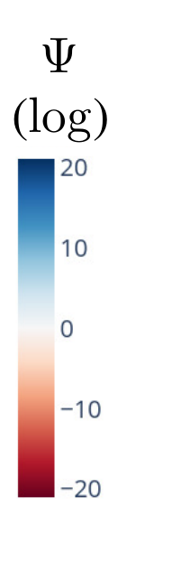

**[p. 7]**

*$\Psi$ (log)*

###### fig-4

*Figure 4: At different training stages, we show the influences $\Psi_{S}(\Theta_{dec},x,x^{\prime})$ of the training examples $x^{\prime}$ on the test samples $x$ of the decoder layer $\Theta_{dec}$, summed over the output dimensions, for predictions on the test set and the training set, accumulated over the preceding $50$ steps. The plots are labeled and ordered by the sum of inputs $a+b$ and the corresponding result ($a+b\bmod 113$). Corresponding figures for the other layers are provided in the Appendix in Figure 9.* **[p. 7]**

###### p7-2

**Late embedding dominance.** The embedding layer only begins to influence predictions in the circuit formation phase, evidenced by its sharp relative regularization dominance in $D_{s}(\Theta_{layer})$ and its rise in $\bar{\Psi}_{s}(\Theta_{layer})$. Remarkably, the latter continues to increase slightly during the rest of the training while all other layers’ influences decrease.

###### p7-3

These insights suggest that the model progresses through three influence phases: decoder-driven memorization, middle-layer alternation for circuit formation, and eventual embedding-decoder dominance under higher regularization influence. The rapid increase in test accuracy can thus be explained by a *simultaneous alignment of the input embeddings and decoder around the representation pipeline in the intermediate layers* (marked red in Figure 3(a)).

###### p7-4

To confirm that the alignment around this representation pipeline is causal, we train models initialized at random but replace only the Attention and Linear-1 layers with their grokked counterparts, which we hypothesize to be central to the representation pipeline. As shown in Figure 3(b), this initialization leads to instant generalization within the first $200$ training steps, and, in particular, bypasses the usual memorization phase. Additional experiments (Appendix Figure 11) confirm that even using only the attention layer produces the same phenomenon. Starting from earlier checkpoints also leads to rapid generalization, albeit with slightly lower final accuracy. This suggests a continuous refinement of the representation pipeline during the circuit formation phase. To further probe this effect, we swap grokked layers into intermediate checkpoints (see Appendix Figure 11). The outer layers identified above consistently improve the predictions of these checkpoints, whereas other combinations decrease performance. This shows that the aligned final embedding and decoder layers can already operate effectively around a pipeline that is not yet fully generalized.

These findings refine the three-stage description of Grokking by Nanda et al. (2023) by showing that in the final phase the model outer’ layers align around a generalized representation pipeline. They also connect to the efficiency perspective by Huang et al. (2024): our findings suggest that once robust representations have formed, the influence of the regularization suppresses inefficient memorization solutions.

In the next section we show that this representation pipeline encodes a cyclic data geometry that becomes increasingly robust during training.

###### p7-8

**Emergence of cyclic patterns in the kernel.** The vertical bands in Figure 4 reveal that at all training stages, each training sample has a global influence. After memorization, off-diagonal patterns emerge and sharpen, aligning with modular equivalence classes ($a+b\bmod 113$). Initially, these cycles have high frequency (about $2$), i.e. the influence is strong for training samples whose label differences are a multiple of $2$. Later in training, this cyclic geometry continuously shifts towards lower frequencies.

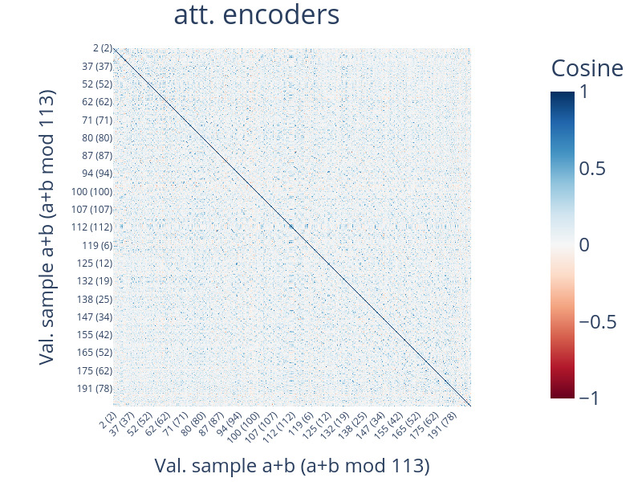

*Step 1050 - 1100, att. encoder*

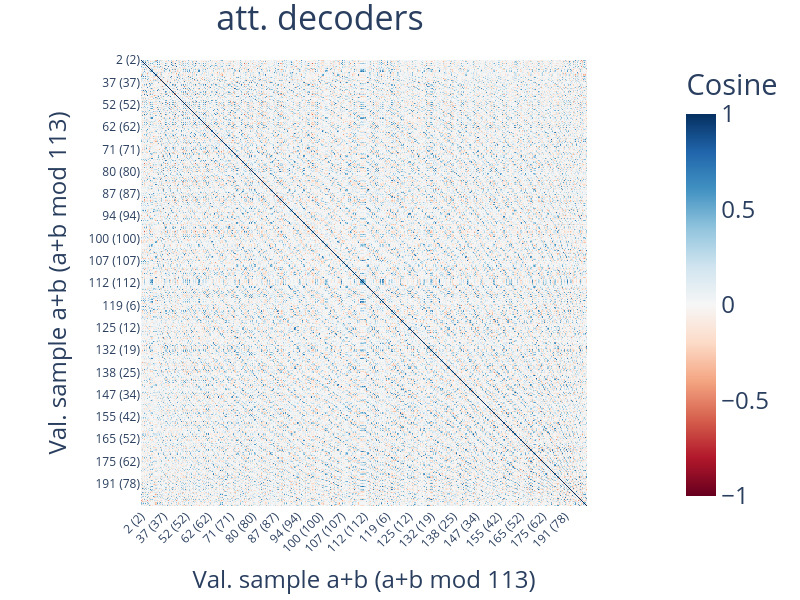

*Step 1050 - 1100, att. decoder*

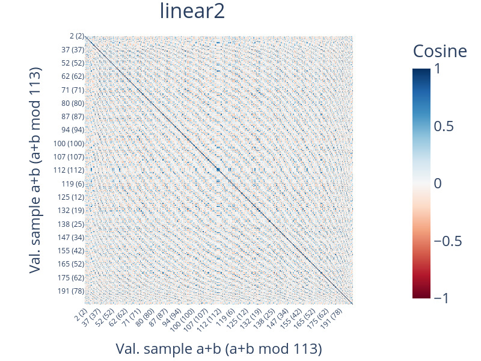

*Step 1050 - 1100, linear 2*

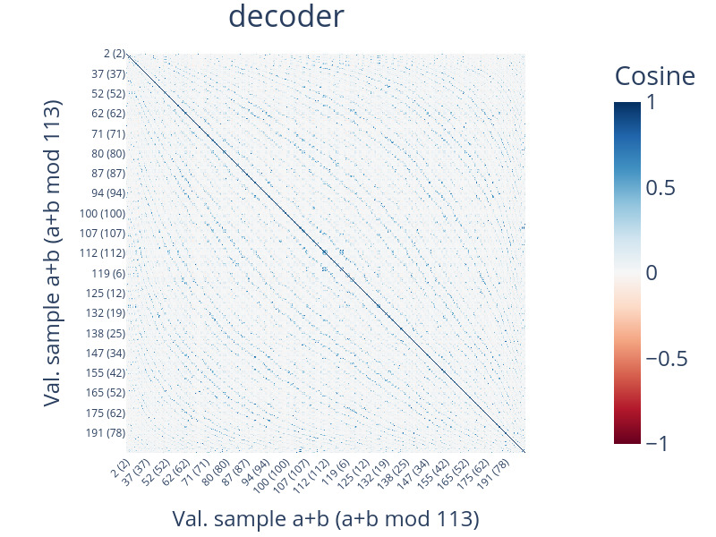

*Step 1050 - 1100, decoder*

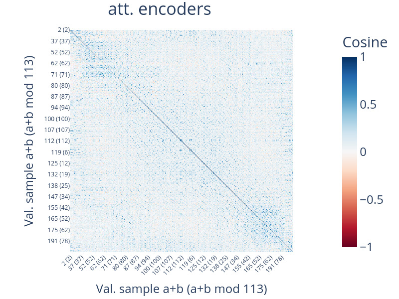

*Step 1850 - 1900, att. encoder*

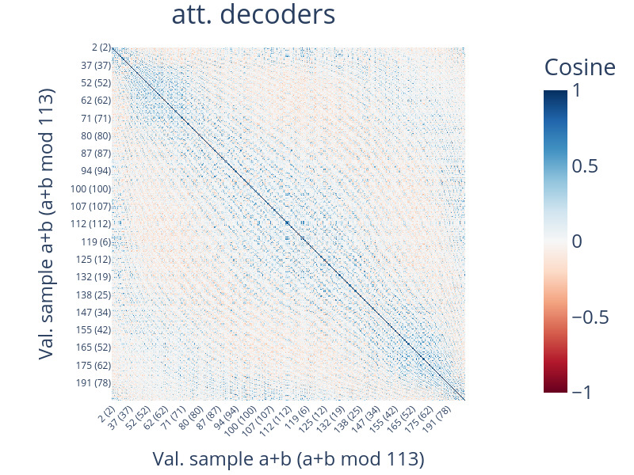

*Step 1850 - 1900, att. decoder*

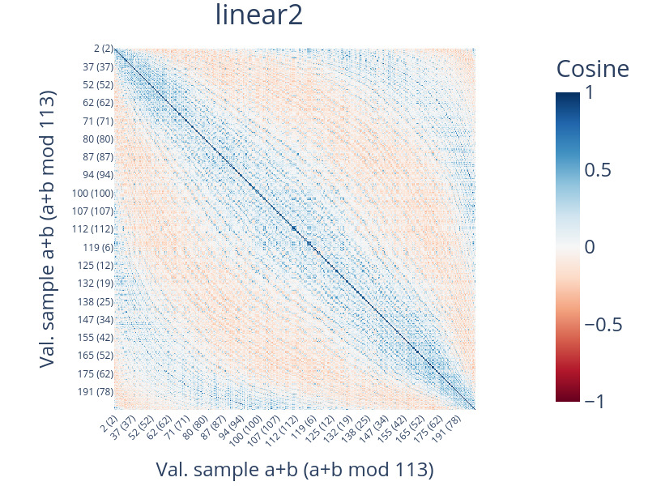

*Step 1850 - 1900, linear 2*

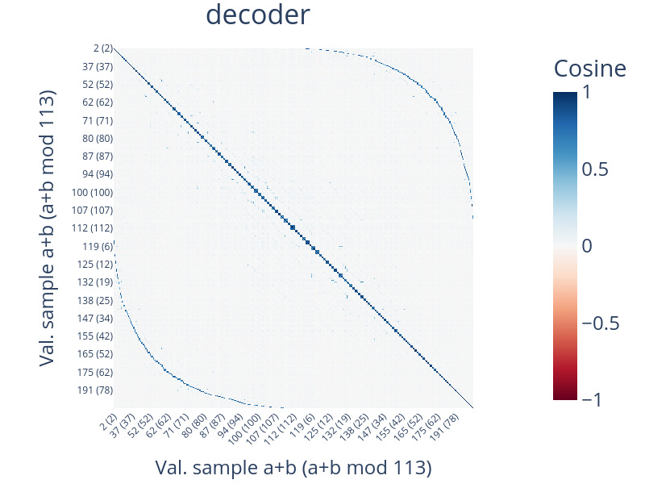

*Step 1850 - 1900, decoder*

*Figure 5: Similarity $Sim_{\Theta_{layer}}(x,x^{\prime})$ of predictions of the test set of the Transformer model accumulated over different training stages. All layers and other training stages shown in Appendix Figure 13.* **[p. 8]**

**Generalizable data geometry.** Similarity matrices (Figure 5) suggest a similar emergence of cyclic patterns, especially in the higher layers of the model. This indicates that the model indeed learns to represent the samples in a space where similarity is approximately a cosine of frequency $113$. We test this hypothesis by fitting a Lasso regression to the similarity matrix accumulated over epochs 1850 to $1900$ of the decoder, where we take as input features all cosines and sines of the pairwise differences of frequencies $2$ to $113$. The result is shown in Appendix Figure 12 and confirms our qualitative observation with the coefficient of the cosine of frequency $113$ being by far the largest. Furthermore, we note that in the final model this representation emerges only in the attention decoders, suggesting that the model first needs to combine the two input numbers and then proceeds to refining the cyclic geometry observed in higher layers.

Revisiting our layer-swapping experiment, we compare the confusion matrices of the swapped and original checkpoints (see Appendix Figure 10). We observe that the systematic cyclic off-diagonal error patterns are reduced once the final model’s outer layers are swapped in, suggesting that the embedding-decoder alignment indeed changes the prediction algorithm to one that uses the cyclic representations.

###### p7-19

Our observations agree with Nanda et al. (2023), who find that neurons in the linear layers are computing combinations different cosines and sines. As ExPLAIND reveals, neuron-level mechanisms that they describe result in a cyclic global pattern that is simple to interpret and the result of a continuous refinement from cycles of higher to lower frequency. In sum, our results show that Grokking in the modulo Transformer reflects the progressive refinement of a cyclic data geometry and its alignment with input and output layers.
