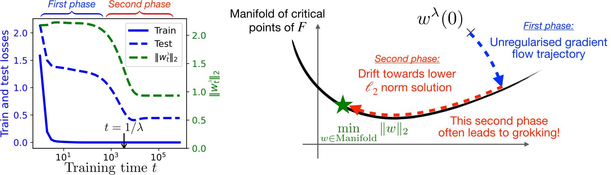
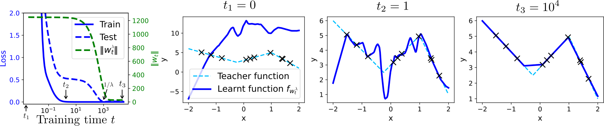

# Boursier et al. 2025 — A Theoretical Framework for Grokking: Interpolation followed by Riemannian Norm Minimisation

See also: [the global concept index](../../concepts/index.md). arXiv [2505.20172v2](https://arxiv.org/abs/2505.20172), 26 May 2025 (v2 — 5 November 2025). PDF running head: "39th Conference on Neural Information Processing Systems (NeurIPS 2025)".

**Etienne Boursier** — INRIA; LMO, Université Paris-Saclay, Orsay, France.
**Scott Pesme** — INRIA, Grenoble, France.
**Radu-Alexandru Dragomir** — Télécom Paris; Institut Polytechnique de Paris, Palaiseau, France.

The files of this paper's analysis:

- [`2505.20172.a-theoretical-framework-for-grokking-interpolation-followed-by-riemannian-norm-minimisation.license.txt`](2505.20172.a-theoretical-framework-for-grokking-interpolation-followed-by-riemannian-norm-minimisation.license.txt) — the arXiv licence record for this paper.

**Excerpt card.** The paper's licence (`arxiv-nonexclusive`) does not permit republishing the paper itself; what stands here are the editorial sections and the fragments the corpus quotes (right of quotation). The paper: <https://arxiv.org/abs/2505.20172>.

## Concepts covered

**[Grokking](../../concepts/grokking.md)** — the work gives the corpus the shortest formal definition of the phenomenon: grokking is the non-commutativity of two limits, $\lim_{\lambda\to 0^{+}}\lim_{t\to\infty}w^{\lambda}(t)\neq\lim_{t\to\infty}\lim_{\lambda\to 0^{+}}w^{\lambda}(t)$ ([p5-8](#p5-8)). The definition is purely optimisational: there is no data, no task and no architecture in it, and the authors caveat at once that the result "*a priori* does not entail any improvement of the test loss in the slow era" ([p2-6](#p2-6)). What the work does not contain: not one statement about the test error — the link "a smaller norm means better generalisation" is taken by reference (2; 33; 17) rather than derived; no modular arithmetic, no transformer and no classification — the last excluded by construction, since with separable data the unregularised iterates diverge and the manifold goes off "to infinity" ([p4-7](#p4-7), [p10-6](#p10-6)). All three experiments are synthetic regression: matrix completion, a two-layer ReLU network and a diagonal linear network.

**[Weight norm minimisation](../../concepts/weight-norm-minimization.md)** — the work's chief contribution and the chief reinforcement of this line of the corpus: the informal picture of Omnigrok ("first a bad global minimum, then weight decay leads away to a solution of smaller norm"), which the authors call outright attractive but lacking a rigorous theoretical support ([p3-2](#p3-2)), is carried through to a theorem. The slow era is described as a Riemannian gradient flow of the squared $\ell_{2}$ norm constrained to the manifold, and the limit points are characterised as KKT points of the problem $\min_{w\in\mathcal{M}}\|w\|_{2}^{2}$ ([p7-7](#p7-7)); on convergence to a **strict** local minimum of the norm the double limit equals it exactly ([p7-9](#p7-9)). A subtlety of substance for the corpus: the manifold $\mathcal{M}$ is defined as a connected component of the set of **stationary** points $\nabla F^{-1}(0)$ rather than of points of zero loss ([p4-9](#p4-9)); the interpolation that stands in the title is nowhere required — what is required is stationarity and Morse–Bott local minimality. What the work does not contain: rates of convergence, a dependence of the thresholds on the dimension and on $\eta$, and an analysis of convergence to **singular** points — which are precisely the solutions sought (sparse vectors, low-rank matrices), something the authors set in bold as an open challenge ([p28-3](#p28-3)).

**[Weight decay](../../concepts/weight-decay.md)** — here weight decay is neither an accelerator nor an auxiliary device but the sole engine of the second era and the sole source of the time scale: the fall begins at a time of order $1/\lambda$, and the joining point of the fast and slow dynamics is computed separately and is of order $-\lambda\ln\lambda$ ([p15-7](#p15-7), [p15-8](#p15-8)). On the corpus's most disputed fork the work speaks more cautiously than is customary: in classification grokking does occur without weight decay, thanks to the algorithm's implicit preference, but "in regression problems it cannot occur if weight decay is not used" ([p3-2](#p3-2)). What the work does not contain: not a single experiment comparing $\lambda>0$ with $\lambda=0$, nor any dependence of the delay on the magnitude of $\lambda$ outside the asymptotics; the whole analysis is conducted at $\lambda\to 0$, that is, in exactly the limit in which the delay diverges as $1/\lambda$.

**[When regularisation is necessary](../../concepts/regularization-necessity.md)** — the work draws the line of necessity by the type of task rather than by the architecture or the dataset: classification, where the implicit preference suffices, and regression, where, "to the best of our knowledge", there is no grokking without weight decay ([p3-2](#p3-2)). This same division explains why the corpus's refuting evidence does not contradict the theory: it is obtained in classification, which the theory excludes by the assumption of boundedness of the flow. What the work does not contain: a proof of this fork — the sentence stands in the survey section as a caveat about the state of knowledge rather than as a claim of the paper.

**[The lazy→rich transition](../../concepts/lazy-to-rich-kernel-to-feature-learning.md)** — the fast and slow eras are directly identified with the lazy and rich solutions: the first leads to a solution corresponding to the lazy regime, the second to a solution characteristic of the rich one ([p3-2](#p3-2)). A separate paragraph is given over to a comparison with the nearest rival, Lyu et al.: there a homogeneous parameterisation is needed, together with the initialisation scale being sent to infinity at rates linked by a power law, and a guarantee only "for some sufficiently large time", whereas here there are fewer assumptions and the limit points themselves are characterised ([p8-2](#p8-2)). What the work does not contain: not a single measurement of feature learning, no kernel and no change of it — the identification is made by references and words rather than by a quantity.

**[The neural tangent kernel](../../concepts/neural-tangent-kernel-ntk.md)** — the NTK enters only as a vocabulary for describing a large initialisation: the lazy regime is called the NTK regime, and to it is ascribed a rapid attainment of zero training loss at a poor generalisation ([p7-11](#p7-11)). Neither the kernel, nor its constancy, nor any departure from linearisation is computed in the work.

**[The initialisation scale](../../concepts/initialization-scale.md)** — the role of the scale is obtained as a **consequence** of the theorem rather than postulated: at a small initialisation the point $\Phi(w^{\lambda}(0))$ reached after the first era already has a small norm, and the second era simply does not occur; at a large one it retains a large norm, which is what launches the substantial motion in the grokking era ([p7-12](#p7-12)). What the work does not contain: not a single experiment sweeping the scale — in the experiments it is fixed (Gaussian weights of variance $4$ in the ReLU network, $0.1$ in the diagonal one), and the dependence of the plateau's length on the scale is not measured.

**[Phase transition](../../concepts/phase-transition.md)** — the work disputes outright the reading of grokking as a sudden transition: the fall "only **appears sudden when the training time is plotted on a logarithmic scale**", whereas in fact it unfolds over a duration of order $1/\lambda$ following a plateau of comparable duration, and on a logarithmic scale it occupies $\ln(M/\varepsilon)$ against the plateau's $\ln(\varepsilon/\lambda)$ ([p8-1](#p8-1)). The work introduces no order parameter, no language of phase transitions and no critical exponents; the argument is derived entirely from proposition 2, and there is not a single plot in linear time in the paper — all four figures are plotted on a logarithmic axis.

**[The memorisation phase / the plateau](../../concepts/memorization-phase.md)** — the plateau here receives for the first time a derived rather than a measured length: it occupies the interval $[M^{\prime},\varepsilon/\lambda]$, where $M^{\prime}$ is the characteristic convergence time of the unregularised flow, and the subsequent fall occupies $[\varepsilon/\lambda,M/\lambda]$ ([p8-1](#p8-1)). What the work does not contain: memorisation as such — in the regression setting what stands on the plateau is not a memorised table but the interpolant of the lazy regime, and nothing is said about what happens inside the network on the plateau.

**[The role of gradient noise](../../concepts/gradient-noise.md)** — this is a point of divergence from predecessors that the authors name as their contribution: whereas earlier analyses of drift along a manifold attribute the second, slower era to stochastic effects, here a **deterministic** mechanism is indicated — a slow drift induced by the regularisation — and related directly to grokking; beyond that, the need for an initialisation near the manifold is also removed ([p3-4](#p3-4)). What the work does not contain: SGD itself — the gradient flow is analysed, that is, the limit of descent as the step size goes to zero, and the discreteness of the step, the batch size and sampling noise are not considered at all.

**[The loss landscape / basins](../../concepts/loss-landscape-basins.md)** — the whole analysis rests on the structure of the critical set: $\mathcal{M}$ is a connected component of the set of stationary points ([p4-9](#p4-9)), assumed to be a smooth submanifold consisting solely of local minima, with the non-zero eigenvalues of the Hessian bounded away from zero — the Morse–Bott property, equivalent to a local Polyak–Łojasiewicz condition ([p4-11](#p4-11)). The exclusion of saddles is justified by references to works on their avoidance at **almost every** initialisation, proved moreover for discrete descent, while the carry-over to the continuous flow is merely declared possible ([p5-1](#p5-1)). What the work does not contain: a global validity of this assumption — of the three examples analysed it holds globally only in linear regression, while for diagonal networks and matrix sensing it is saved by the caveat "locally, outside a degenerate set" ([p28-3](#p28-3)).

**[Margin maximisation / implicit preference](../../concepts/margin-maximization-implicit-bias.md)** — the work divides the roles: the implicit preference of the optimisation algorithms is responsible for the first era and, in the authors' words, has already been analysed in detail, whereas the second — norm minimisation constrained to the manifold — has received little attention ([p10-3](#p10-3)). In the examples the preference of the second era is written out explicitly: for diagonal linear networks the minimisation of $\|u\|^{2}+\|v\|^{2}$ on the manifold is equivalent to the minimisation of the $\ell_{1}$ norm of the product, that is, it yields sparsity ([p27-4](#p27-4)), and for matrix sensing it corresponds to the nuclear norm, that is, to low rank ([p9-1](#p9-1)).

**[Varieties of regularisation](../../concepts/regularization-variants.md)** — the work only mentions a carry-over to other regularisers: a single sentence of the conclusion says that the analysis "can be readily extended" to other kinds of regularisation, and that the empirical observations for Sharpness-Aware Minimization, "we believe", may also be read through the lens of grokking ([p10-6](#p10-6)). Not one derivation and not one experiment stands behind this sentence.

**[Spectral analysis / FVE](../../concepts/spectral-analysis-svd-esd-fve.md)** — singular values serve as the chief measured indicator of the drift: in figure 2 seven of the ten singular values of $UV^{\top}$ go off to zero during the grokking era, while the three remaining arrive at the true $\sigma^{\star}_{1},\sigma^{\star}_{2},\sigma^{\star}_{3}$ ([fig-2](#fig-2)); for linear regression the trajectory is written out explicitly through the SVD, and the separation of scales is visible coordinate by coordinate — the directions orthogonal to $\mathcal{M}$ decay at a rate $\sigma_{i}^{2}+\lambda$ and the parallel ones at a rate $\lambda$ ([p26-6](#p26-6)). Spectral measures in the corpus's sense (ESD, heavy tails, fraction of variance explained) the work neither introduces nor computes.

---

## Points we could not reconcile

**Lemma 5 is stated with an equality and proved with a strict inequality.** The statement ([p21-9](#p21-9)) has $F(w)=\sup_{x\in\mathcal{M}}F(x)$ for $w\in U\setminus\mathcal{M}$, whereas the lemma's own proof ends with the words "$F(w)>F^{\star}$ for any $w\in U\setminus\mathcal{M}$" ([p22-2](#p22-2)), and thereafter — in the proofs of lemma 7 and lemma 3 — it is precisely the strict inequality that is used (without it both arguments collapse). A slip in the statement; when citing lemma 5 one must take its proof.

**Proposition 4 is written in a notation that does not exist in the paper.** The statement ([p7-9](#p7-9)) supposes that "$w^{\circ}(t)$ converges to a strict local minimum", whereas a paragraph earlier and in the proposition's own proof (A.5) the subject is $\tilde{w}^{\circ}(t)$ — the solution of the Riemannian flow in rescaled time. The symbol $w^{\circ}$ without a tilde is first introduced only in appendix C, in the section on singularities, where it means the same thing.

**The caption of figure 2 and the text differ by an order of magnitude on the time at which the grokking begins.** The caption says the grokking begins at around $t\approx 10^{2}$ ([fig-2](#fig-2)), whereas the analysis of the same experiment in the body of the paper puts the onset of the fall of the norms at $t=1/\lambda$ ([p9-4](#p9-4)), and $\lambda=10^{-3}$, that is, at $t=10^{3}$; the arrow $t=1/\lambda$ on the figure itself points at $10^{3}$. The fall of the norms in the plot does indeed begin before the $10^{3}$ mark, so the caption describes the visible onset and the text the predicted time; but a prediction presented as confirmed and the caption of the confirming figure name different numbers.

**The title and the vocabulary of the work speak of interpolation, while the theorems speak of stationarity.** "Interpolation" stands in the title and "the interpolation manifold" in section 2 and in the conclusion, whereas $\mathcal{M}$ is defined as a connected component of the set of stationary points ([p4-9](#p4-9)), and in none of the four propositions is a zero loss required; lemma 5 establishes only that $F$ is constant on $\mathcal{M}$ and strictly smaller in a neighbourhood. In the experiments interpolation is attained, but as a property of the examples rather than as a condition of the theory.

**Minor slips in the appendices, carried into the translation as they stand.** In the proof of lemma 4 the compact set is chosen by the condition "$u(t)\in K$ and $u(t)\in K$", where the first occurrence ought to be $u^{\lambda}(t)$; in the summary of the proof of lemma 7 the second item reads "included in $B(\Phi(w_{0}),\delta)$ **or** $t\in(\frac{t(\lambda)}{\lambda},t^{\prime})$" instead of "for"; in the same place the last computation leaves a bracket unclosed in $\frac{1}{\lambda^{\star}}F(w^{\lambda}(0),$; in the proof of lemma 1 $F\star$ is once typeset instead of $F^{\star}$ and a $\beta(x)$ appears, whereas $\beta$ was chosen independently of $x$; and in the proof of proposition 5 the neighbourhood is denoted $W$ while the condition is imposed on $U$.

---

## What is proved, what is shown and what is conjectured

**Proved** — under assumptions 1 and 2 ($\mathcal{C}^{3}$ smoothness, definability in an o-minimal structure, boundedness of the unregularised flow; a Morse–Bott manifold of local minima): the uniform convergence $w^{\lambda}\to w^{\mathrm{GF}}$ on any finite interval (proposition 1); the convergence of the rescaled trajectory to the Riemannian flow of the $\ell_{2}$ norm on $[\varepsilon,T]$ ([p6-9](#p6-9)); the inclusion of the limit points in the KKT points of the problem $\min_{w\in\mathcal{M}}\|w\|_{2}^{2}$ ([p7-7](#p7-7)); the exact equality of the double limit with a strict local minimum of the norm when one is attained ([p7-9](#p7-9)); and the order $-\lambda\ln\lambda$ of the joining point together with its necessity from both sides ([p15-8](#p15-8)).

**Shown by experiment** — three synthetic regressions, all with a logarithmic time axis. Most strongly confirmed is the prediction of a drift towards low rank: in matrix completion seven of the ten singular values go off to zero exactly during the grokking era, and the three remaining arrive at the true ones ([fig-2](#fig-2)). Similarly, on the diagonal linear network the teacher's sparse Fourier series is recovered, and the transition falls at $t\approx 1/\lambda$ with $\lambda=10^{-4}$ ([p29-3](#p29-3)). The experiment with the two-layer ReLU network the authors place outright outside their own theory — "our theoretical framework does not admit non-smooth architectures such as ReLU networks" — and present as an illustration ([p9-5](#p9-5)). Seed spreads, the number of runs and the hardware are nowhere stated.

**Conjectured or taken by reference** — the link "a smaller norm means better generalisation", on which the whole passage from an optimisational result to an explanation of grokking rests ([p2-6](#p2-6)); the avoidance of saddles, proved for discrete descent and carried over to the flow by an argument that "can be extended" ([p5-1](#p5-1)); the global validity of the Morse–Bott property, saved by a local caveat in two of the three examples; the estimate of how small $\lambda$ must be — the heuristic $\lambda\ll\|\nabla F(w_{0})\|/\|w^{\rm GF}\|$, declared an understanding rather than a theorem ([p30-3](#p30-3)); and the carry-over to other regularisers, including SAM, in a single sentence of the conclusion ([p10-6](#p10-6)).

**Not covered and admitted to be open** — convergence to singular points, that is, to precisely those solutions for whose sake the second era is of interest ([p28-3](#p28-3)); classification, excluded by the boundedness assumption ([p4-7](#p4-7)); and a fixed $\lambda>0$ instead of the asymptotics.

---

## Common misreadings and overstatements of this paper

Below are the patterns noticed in the citing works of the corpus; each entry says what exactly is distorted and leads to the authors' own paragraphs. The citing works' verbatim formulations are given here, since the cards of the corresponding works have either not yet been created or are being edited in a separate task.

**"The slow era proceeds along the zero-loss manifold" (erroneous).** The citing works regularly substitute a zero-loss manifold for the stationary one: `"Recent rigorous frameworks by Musat [7] and Pesme et al. [19] model grokking as Riemannian Norm Minimization on the zero-loss manifold."` ([Acharya, Dhakal 2026](../2603.15492.grokking-as-a-variance-limited-phase-transition-spectral-gating-and-the-epsilon-stability-threshold/2603.15492.grokking-as-a-variance-limited-phase-transition-spectral-gating-and-the-epsilon-stability-threshold.card.md)); the same substitution appears in `"weight decay induces a late-stage regime of Riemannian norm minimization constrained to the zero-loss manifold"` (2605.15787, no card created). In the authors, meanwhile, $\mathcal{M}$ is the largest connected component of the set of stationary points containing the limit of the unregularised flow ([p4-9](#p4-9)); a zero loss is nowhere required, and lemma 5 establishes only that $F$ is constant on $\mathcal{M}$ and strictly minimal in a neighbourhood ([p22-2](#p22-2)). The substitution is not innocuous: it is precisely on the stationary rather than the zero set that the argument about non-degenerate points rests, and that the question of singular ones remains open ([p28-3](#p28-3)). What invites it is the paper's own title, which contains the word "Interpolation".

**"It is proved that grokking is a Riemannian norm minimisation" (widening).** Here the thesis is strengthened into a claim about the phenomenon itself: `"Recent geometric frameworks [19, 7] prove that grokking corresponds to Riemannian Norm Minimization on the Minimizing Level Set $\mathcal{Z}$."` ([Acharya, Dhakal 2026](../2603.15492.grokking-as-a-variance-limited-phase-transition-spectral-gating-and-the-epsilon-stability-threshold/2603.15492.grokking-as-a-variance-limited-phase-transition-spectral-gating-and-the-epsilon-stability-threshold.card.md)), and in the same role `"which precisely corresponds to grokking"` (2605.15787). What is proved, however, is a purely optimisational claim about the trajectory, and the caveat stands in the paper itself: "no statistical assumptions are made, and it *a priori* does not entail any improvement of the test loss in the slow era" ([p2-6](#p2-6)). Grokking for the authors is defined as the non-commutativity of two limits ([p5-8](#p5-8)) — that is, as a property of the trajectory rather than as a claim about the test error. An example of accurate citation is given by [Xu et al. 2026](../2601.19791.to-grok-grokking-provable-grokking-in-ridge-regression/2601.19791.to-grok-grokking-provable-grokking-in-ridge-regression.card.md): `"they do not prove that the unregularized solution does not generalize and the ridge solution does generalize, and thus their results do not imply provable grokking"`.

**"The work brings the network into a „Goldilocks zone“" (erroneous).** The paper is placed in a row with norm-centric works under a common description: `"arguing that weight decay or other implicit biases drive the network across a zero-loss manifold into a “Goldilocks zone” of parameter norms where generalization naturally occurs"` (2605.15787, no card created). Neither a "Goldilocks zone" nor any range of norms in which generalisation sets in appears in the paper: the slow flow goes to a minimum of the norm on the manifold, with no window from below, and nothing is proved about generalisation itself ([p2-6](#p2-6)). The word "Goldilocks" came from Liu et al. 2022 and was carried over to this work along with a common list of references.

**The wrong surname named as first author (erroneous).** The work is cited as "Pesme et al.", and in the bibliography the order of the authors is transposed: `"Scott Pesme, Etienne Boursier, and Radu-Alexandru Dragomir."` ([Acharya, Dhakal 2026](../2603.15492.grokking-as-a-variance-limited-phase-transition-spectral-gating-and-the-epsilon-stability-threshold/2603.15492.grokking-as-a-variance-limited-phase-transition-spectral-gating-and-the-epsilon-stability-threshold.card.md)). The first author is Etienne Boursier; the corpus's other citing works name the work correctly.

The work is retold accurately by [Musat 2026](../2511.01938.the-geometry-of-grokking-norm-minimization-on-the-zero-loss-manifold/2511.01938.the-geometry-of-grokking-norm-minimization-on-the-zero-loss-manifold.card.md) — `"a fast initial stage where the network converges to the manifold of critical points"`, in which the manifold is called critical rather than zero-loss — and by [Xu et al. 2026](../2601.19791.to-grok-grokking-provable-grokking-in-ridge-regression/2601.19791.to-grok-grokking-provable-grokking-in-ridge-regression.card.md). A mild echo not warranting a separate entry: [Liu et al. 2026](../2605.06152.grokking-or-glitching-how-low-precision-drives-slingshot-loss-spikes/2605.06152.grokking-or-glitching-how-low-precision-drives-slingshot-loss-spikes.card.md) counts the work among those calling weight decay "the chief engine of grokking" — which for regression is true to the letter of the paper ([p3-2](#p3-2)), while for classification the authors assert the opposite. ---

# Quoted fragments

Only the fragments the corpus cards refer to are
reproduced here (right of quotation); the paper's licence does not permit
republishing the whole text. Anchor numbering matches the original.

###### p2-2

In this paper, we propose a novel theoretical perspective to explain this phenomenon. By examining the gradient flow dynamics **with weight decay**, we show that, in the limit of vanishing weight decay, we can fully describe the trajectory of the model parameters. Specifically, we prove that the training process can be decomposed into two distinct phases. In the first phase, the gradient flow follows the unregularised path, converging to a manifold of critical points of the training loss. In the second, the trajectory enters a slow drift phase, where the weights move along this manifold, driven by weight decay, gradually reducing their $\ell_{2}$ norm, as illustrated in Figure 1 (right). We argue that this slow decrease in the weight norms explains the grokking phenomenon, as smaller weight norms are often correlated with better generalisation. To convey the main intuition, we state below an informal version of our result, describing the full trajectory of the gradient flow with small weight decay.

###### p2-6

Note this is a purely optimisation result: no statistical assumptions are made, and it *a priori* does not imply any improvement in test loss during the slow phase. However, it provides a natural explanation for the grokking phenomenon. Indeed, in practice, for many deep learning models with random initialisation, gradient flow converges to a global minimiser of the training loss. When this solution generalises poorly—as is often the case with large initial weights, in the so-called *lazy* regime (14)—the subsequent slow drift along the critical manifold, driven by weight decay, decreases the $\ell_{2}$-norm of the solution and simplifies it in the second phase. Since lower weight norms often correlate with better generalisation (2; 33; 17), this offers a convincing explanation for the delayed improvement in test performance. We discuss various settings where this behaviour is observed in Section 5.

###### p3-2

The role of weight decay in grokking remains somewhat debated. While many of the original works exhibiting the phenomenon include weight decay (41; 32), grokking has also been observed without (13; 48), as strongly emphasised by 25. However, as shown in 34, the transition tends to occur much later and to be less sharp without weight decay. In this context, weight decay can be interpreted as a factor that triggers or accelerates the transition from the lazy to the rich regime. While grokking can be observed in classification tasks even without weight decay—thanks to the algorithm’s implicit bias—to the best of our knowledge, it cannot occur in regression tasks unless weight decay is used. Of particular relevance to our work, 33 propose an intuitive explanation of grokking that is based on weight decay: during the first phase, the model rapidly converges to a poor global minimum; during the second, slower phase, weight decay gradually steers the iterates toward a lower-norm solution with better generalisation properties. While appealing, this explanation remains informal and lacks rigorous theoretical support. In this work, we provide a formal analysis of the optimisation dynamics underlying the grokking phenomenon: an initial fast phase leads to convergence toward the solution associated with the lazy regime, followed by a slower second phase that drives convergence toward the solution characteristic of the rich regime.

###### p3-4

Our analysis builds upon this framework popularized by 30 and tracing back to 24. Our contribution differs from previous work in both focus and scope. Whereas previous analyses attribute the second, slower learning phase to stochastic effects, we identify a deterministic mechanism–namely, a slow drift induced by regularization–and link it directly to the grokking phenomenon, a connection that, to our knowledge, has not been previously explored. From a technical perspective, our setting is simpler yet enables a more detailed analysis. Rather than appealing to results from 24 as a black box, we provide a simpler, self-contained proof building on 18. Furthermore, unlike prior analyses that assume initialization near the interpolation manifold, our framework accommodates arbitrary initialisation. **[p. 4]** We rigorously characterise the initial convergence toward the manifold and the subsequent transition to the drift phase along it, which constitutes the main technical novelty of our analysis.

###### p4-7

Finally, note that the boundedness assumption on the unregularised flow excludes classification settings where the network can perfectly separate the data, since in such cases the unregularised iterates diverge.

###### p4-9

*We define $\mathcal{M}$ to be the largest connected component of $\nabla F^{-1}(0)$ containing $w^{\mathrm{GF}}_{\infty}$, where $\nabla F^{-1}(0)$ corresponds to the set of stationary points of $F$.*

Our key assumption is that $\mathcal{M}$ forms a smooth manifold, and that it contains only local minimizers (and not saddle points). Additionnally, we impose that the non-zero eigenvalues of the Hessian on $\mathcal{M}$ are lower bounded by some constant $\eta>0$. Following the terminology of 42, this is known as the *Morse-Bott property*.

###### p4-11

$\mathcal{M}$*is a smooth submanifold of $\mathbb{R}^{d}$ of dimension $k\in[d]$, i.e. for any $w\in\mathcal{M}$, $\mathrm{rank}(\nabla^{2}F(w))=d-k$. Also, there exists $\eta>0$ such that for any $w\in\mathcal{M}$, all non-zero eigenvalues of $\nabla^{2}F(w)$ are lower bounded by $\eta$.*

As stated in 42, for $\mathcal{C}^{2}$ functions this property is equivalent to the *Kurdyka–Łojasiewicz*, also known as *Polyak–Łojasiewicz* (PL) condition locally around $\mathcal{M}$ (26; 7). It implies that (i) every point in $\mathcal{M}$ is a local minimiser, and (ii) all gradient flow trajectories are locally attracted towards $\mathcal{M}$. This stability property is essential for proving regularity of the flow map $\Phi$ in Section 4. Let us discuss the relevance of 2 in the context of overparameterised machine learning.

**[p. 5]**

###### p5-1

- **Convergence to a local minimiser:** our assumption rules out the possibility that $w^{\mathrm{GF}}$ converges to a saddle point of $F$. This is justified by a large number of works showing that gradient methods avoid saddle points for *almost all* initialisations. In particular, 28; 27 prove it under the assumption that all saddle points of $F$ are strict. Although their result only holds for discrete-time gradient descent, the underlying argument can be extended to gradient flow (the proof relies on the Stable Manifold Theorem for dynamical systems, which also holds in continuous time (46, §7)).
- **Morse-Bott/Łojasiewicz property:** this is a common assumption in the analysis of gradient flow dynamics for overparameterised networks (30; 19; 44). Note that for general models, the critical set may not form a manifold everywhere. However, it is often possible to show that the manifold structure holds locally, i.e., on *most* of the space, excluding some degenerate points11 1 While our results are stated for such a global Morse-Bott assumption, they could be directly extended to local Morse-Bott assumptions, provided that the iterates remain in the non-degenerate region.; see Section 5 for examples and 31 for a generic result. Moreover, the results derived from such an assumption are generally very representative of empirical observations, as can be seen in Section 5.

###### p5-8

Importantly, uniform convergence only holds on finite time intervals of the form $[0,T]$, but is not true on $\mathbb{R}_{+}$. More precisely, grokking is observed when the two limits cannot be exchanged: $\lim_{\lambda\to 0^{+}}\lim_{t\to\infty}w^{\lambda}(t)\neq\lim_{t\to\infty}\lim_{\lambda\to 0^{+}}w^{\lambda}(t)=\lim_{t\to\infty}w^{\mathrm{GF}}(t)$. In Figure 1, the endpoint of the red arrow corresponds to this first limit, while the endpoint of the blue arrow corresponds to the second. This distinction highlights a key aspect of grokking: the dynamics evolve on two different timescales. Initially, as described by Proposition 1, the regularised flow tracks the unregularised one. But at much larger time horizons, the regularised dynamics begin to diverge.

**[p. 6]**

###### p6-9

*If 1 and 2 hold, then for all $T,\varepsilon>0$, we have $\tilde{w}^{\lambda}\underset{\lambda\to 0}{\longrightarrow}\tilde{w}^{\circ}$ in $(\mathcal{C}^{0}([\varepsilon,T],\mathbb{R}^{d}),\|\cdot\|_{\infty})$, where $\tilde{w}^{\circ}$ is the unique solution on $\mathbb{R}_{+}$ of the differential equation (6).*

Proposition 2 states that the slow dynamics $\tilde{w}^{\lambda}$ converges uniformly to $\tilde{w}^{\circ}$ as $\lambda\to 0$ on any compact interval of the form $[\varepsilon,T]$. Note that excluding $0$ from this interval (i.e., $\varepsilon>0$) is necessary. Indeed, uniform convergence cannot happen on an interval of the form $(0,T]$, since $\tilde{w}^{\lambda}(0)=w_{0}$ for any $\lambda>0$ and $\tilde{w}^{\circ}(0)=\Phi(w_{0})$. In particular, Proposition 2 leads to pointwise convergence of $\tilde{w}^{\lambda}$: we have

$$
\begin{cases}\lim\limits_{\lambda\to 0}\tilde{w}^{\lambda}(0)=w_{0},\\
\lim\limits_{\lambda\to 0}\tilde{w}^{\lambda}(t)=\tilde{w}^{\circ}(t)\quad\text{if }t>0.\end{cases}
$$

###### p7-7

*If 1 and 2 hold, then for any sequence $(\lambda_{k})_{k\in\mathbb{N}}$ such that $\lambda_{k}\underset{k\to\infty}{\rightarrow}0$, the limit points of $(\lim_{t\to\infty}w^{\lambda_{k}}(t))_{k\in\mathbb{N}}$ are included in the KKT points of Equation 7.*

While Proposition 3 guarantees that $w^{\lambda}$ gets arbitrarily close to KKT points of Equation 7 as $\lambda$ goes to $0$, it does not imply that it has the same limit as $\tilde{w}^{\circ}$. It is however guaranteed with the additional assumption that $\tilde{w}^{\circ}(t)$ converges to a strict local minimum of the Euclidean norm on the manifold $\mathcal{M}$.

###### p7-9

*Let 1 and 2 hold and, assume additionally that $w^{\circ}(t)$ converges towards a strict local minimum $w^{\star}$ of the constrained problem (7). Then $\lim_{\lambda\to 0}\lim_{t\to\infty}w^{\lambda}(t)=w^{\star}$.*

When the slow limit dynamics on $\mathcal{M}$ converges towards a strict local minimum, Proposition 4 guarantees that, for small enough $\lambda$, $w^{\lambda}$ gets trapped in the vicinity of this local minimum as $t\to\infty$, allowing us to get a perfect characterisation of $\lim_{\lambda\to 0}\lim_{t\to\infty}w^{\lambda}(t)$. In particular, this double limit corresponds to the limit of the slow dynamics $\tilde{w}^{\circ}$, while the permuted limit ($\lim_{t\to\infty}\lim_{\lambda\to 0}w^{\lambda}(t)$) corresponds to the limit of the fast dynamics $w^{\mathrm{GF}}$, thanks to Proposition 1.

###### p7-11

The initialisation scale strongly influences the behavior of the unregularised flow and, consequently, the first phase of training under weight decay. This dependence on scale is well-documented in the literature (14). While a complete theoretical understanding remains open, it is widely accepted that small initialisation scales correspond to the rich regime, in which implicit bias drives the model toward interpolating solutions with smaller weight norms, typically associated with better generalization. In contrast, large initialisation scales give rise to the lazy or NTK regime, where features change little during training. This regime behaves similarly to random feature models and tends to produce interpolators with weaker generalisation performance.

###### p7-12

In our framework, this distinction has a direct consequence. With a small initialisation scale, the point $\Phi(w^{\lambda}(0))$ reached after the first phase already exhibits a small norm–possibly corresponding **[p. 8]** to a KKT point of Equation 7–so no second grokking phase occurs, as the system has effectively converged. Conversely, with a large initialisation scale, $\Phi(w^{\lambda}(0))$ retains a large norm, which triggers substantial movement during the second, grokking phase.

###### p8-1

In the literature, grokking is often described as a “sudden drop” in the validation loss following an extended phase of overfitting. We argue here that this drop only **seems sudden when training time is plotted on a logarithmic scale**, whereas in fact it unfolds over a characteristic duration of order $1/\lambda$, following a plateau of comparable duration $1/\lambda$. Indeed, Proposition 2 predicts that the drop takes place within the time interval $[\varepsilon/\lambda,M/\lambda]$, where $\varepsilon$ is a small time independent of $\lambda$ (think of $\varepsilon$ as the time it takes for $\tilde{w}^{\circ}$ to move very slightly away from $w^{\rm GF}_{\infty}$), and $M$ corresponds to the typical time required for $\tilde{w}^{\circ}(t)$ to approach its limit $\lim_{t\to\infty}\tilde{w}^{\circ}(t)$. Prior to this interval, the parameters evolve according to the unregularised flow $w^{\rm GF}(t)$. Let $M^{\prime}$ denote the typical time it takes for $w^{\rm GF}(t)$ to reach $w^{\rm GF}_{\infty}$; then the plateau extends over the interval $[M^{\prime},\varepsilon/\lambda]$. As a result, on a logarithmic time scale, the drop occurs within an interval of length $\ln(M/\varepsilon)$, while the preceding plateau spans roughly $\ln(\varepsilon/\lambda)$ on the same scale. This explains why, as $\lambda\to 0$, the drop appears abrupt compared to the plateau in log-scale plots. In contrast, when viewed in linear time, the drop actually extends over a duration comparable to that of the preceding plateau, producing a markedly different visual impression.

###### p8-2

The work most closely related to ours is that of 34, which provides a theoretical characterization of the grokking phenomenon as a transition from the NTK regime—i.e., the unregularised flow initialised at large scales—to the *rich regime*, which typically converges to KKT points of Equation 7. However, their analysis does not offer a general optimisation-based perspective on the phenomenon and, in particular, does not account for the slow drift phase along the solution manifold, which we identify and characterise. Moreover, their setting is more restrictive: it assumes specific network architectures with homogeneous parameterisation and requires large initialisation scales. In contrast, our results hold outside the NTK regime and apply across a broader class of settings. In addition, their theoretical guarantees rely on taking the initialisation scale to infinity while simultaneously letting the regularisation strength tend to zero, with both rates polynomially coupled. Their analysis establishes that, for some sufficiently large time $\tilde{t}(\lambda)$, the regularised flow $w^{\lambda}$ approaches KKT points of Equation 7, but it does not provide guarantees about the asymptotic behavior beyond this time. By contrast, Proposition 3 characterises the limit points of the flow $w^{\lambda}$, offering a stronger and more complete understanding of its long-term dynamics.

###### p9-1

More precisely, we analyse the *extreme overparameterised setting* when $r=m+n$. In Appendix C, we show that the set $\mathcal{M}^{\star}$ of stationary points of $F$ which are nonsingular matrices forms a manifold. Provided that unregularised gradient flow converges to a nonsingular point, we can apply our results locally. These results state that, in the second, slow phase of the dynamics, the trajectories minimise $\|U\|_{F}^{2}+\|V\|_{F}^{2}$ on $\mathcal{M}^{\star}$. Recall that for a given matrix $M\in\mathbb{R}^{n\times m}$, we have

$$
\|M\|_{*}=\min_{UV^{\top}=M}\frac{1}{2}(\|U\|_{F}^{2}+\|V\|_{F}^{2}),
$$

where $\|M\|_{*}$ is the nuclear norm (45, Lemma 1). Since minimising the nuclear norm promotes low-rank solutions, this indicates a drift toward low-rank matrices during the slow phase of the dynamics. In Appendix C, we study the more general class of *matrix sensing problems* and discuss an important technical subtlety: the set $\mathcal{M}^{\star}$ forms a manifold only after excluding degenerate points. Handling those singularities is highly non-trivial and remains an open direction for future work.

###### fig-2

*Figure 2: Low-rank matrix completion. *(Left)*: Grokking phenomenon: the training loss drops quickly to zero, while the test loss remains high for an extended period before eventually improving—coinciding with a decrease in the norm of the weights $\|w\|^{2}=\|U\|_{F}^{2}+\|V\|_{F}^{2}$. *(Right)*: Singular values of $UV^{\top}$ over time. Each line corresponds to the $i$-th singular value of $UV^{\top}$. The singular values rapidly converge to large positive values at time $t\approx 1$. However, as grokking starts around time $t\approx 10^{2}$, all but three begin decay towards zero. The remaining three approach the true singular values $\sigma^{\star}_{1}$, $\sigma^{\star}_{2}$, and $\sigma^{\star}_{3}$.* **[p. 9]**

###### p9-4

*Explaining the observed grokking phenomenon.* At time $t=0$, the weights are randomly initialised and the training loss is high. Initially, the regularised and unregularised weights follow the same trajectory, and the training loss quickly drops to zero: the regularised iterates converge to the same solution as the unregularised gradient flow. This early solution has a high norm, large singular values, and poor generalisation performance. As training continues, around time $t=1/\lambda$, the weight norms begin to decrease. By $t\approx 10^{4}$, the parameters have drifted to a new solution that still achieves zero training loss but has a much lower norm and actually coincides with the low rank ground truth matrix $M^{\star}$.

###### p9-5

Although our theoretical framework does not allow for non-smooth architectures such as ReLU networks, we illustrate in Figure 3 that similar grokking dynamics can be observed in this case. We train a two-layer ReLU network of the form $f_{w}(x)=\sum_{j=1}^{m}u_{j}\,\mathrm{ReLU}(v_{j}x+b_{j}),$ with weights $w=(u,v,b)$ where the outer layer is $u\in\mathbb{R}^{m}$, the inner weight $v\in\mathbb{R}^{m}$ and bias $b\in\mathbb{R}^{m}$. The teacher function $f$ is a sum of $3$ ReLUs and is represented in dotted light blue in Figure 3. We generate a training dataset of $n=10$ points by sampling $x_{i}$ uniformly in $[-2,2]$ and computing $y_{i}=f(x_{i})$. These training points are shown as black crosses in Figure 3. We train the student network with $m=100$ by minimising the squared loss $F(w)=\tfrac{1}{2n}\sum_{i=1}^{n}\left(f_{w}(x_{i})-y_{i}\right)^{2}$ using gradient descent with weight decay $\lambda=10^{-3}$ for $T=10^{6}$ iterations and small step size. The initial weights are independently sampled from a Gaussian of variance $4$. At each iteration, we record the train loss, the $\ell_{2}$-norm of the weights, as well as the test loss over a fixed test dataset (plotted Figure 3, lef**[p. 10]** t).

*Explaining the observed grokking phenomenon.* At time $t_{1}=0$, the weights are randomly initialised and the training loss is high. By $t_{2}=1$, the training loss has dropped to nearly zero, and the iterates closely approximate the solution that would be obtained by unregularised gradient flow, this solution does not have a low norm and generalises poorly. Subsequently, around time $t=1/\lambda$, the weight norms begin to decrease, and by $t_{3}\approx 10^{5}$, they have drifted to a zero training loss solution which has a much lower $\ell_{2}$-norm and which generalises much better. Such solutions are believed to have a small number of "kinks" (43; 38; 9), as observed in Figure 3 (far right plot).

###### p10-3

This work presents a rigorous and general optimisation-based description of the grokking phenomenon as a two-timescale process. In the fast initial phase, parameters evolve according to the unregularised flow until reaching a stationary manifold. In the slower second phase, they follow the Riemannian gradient flow of the norm constrained to this manifold. Grokking naturally emerges from a gradual simplicity bias: starting from a poorly generalising solution recovered by unregularised gradient flow, the slow phase driven by weight decay gradually simplifies the model by reducing its norm, ultimately leading to better generalisation.

###### p10-4

While prior work has extensively analysed the first phase via the implicit bias of optimisation algorithms, the second phase—norm minimisation constrained to the interpolation manifold—has received little attention. Our framework highlights the critical role of this phase and motivates further study of optimisation dynamics on interpolation manifolds.

Large initialisations (NTK regime) are known to yield poor generalisation (14; 33), while small initialisations (rich regime) can lead to slow convergence or convergence to suboptimal solutions for the training loss (10; 11). Grokking may offer a desirable compromise, achieving fast convergence to an interpolating solution while retaining strong generalisation.

###### p10-6

Note that our analysis is derived in the asymptotic regime $\lambda\to 0$, since this allows for a tractable analysis. Extending the theory to a fixed $\lambda$ is considerably harder, that said, in Appendix E we offer a heuristic analysis regarding how small $\lambda$ needs to be for grokking to emerge. Also note that our analysis can easily be extended to other types of regularisations. In particular, we believe empirical observations reported for training with Sharpness-Aware Minimization (1, p. 7) may also be interpreted through the lens of grokking, albeit driven by SAM-style regularisation rather than standard weight decay. Lastly, our analysis focuses on regression settings with bounded dynamics. In classification tasks, by contrast, the stationary manifold lies “at infinity” once interpolation is achieved. Extending our approach to such settings remains an open and promising direction for future work, likely requiring techniques tailored to classification losses.

**[p. 11]**

###### p15-7

Lemma 2 states that for a well chosen timepoint $t(\lambda)$, which is of order $-\lambda\ln(\lambda)$, the slow dynamics solution $\tilde{w}^{\lambda}$ will be close to the limit of the unregularised flow at that timepoint. This result will then be key in showing that $\lim_{\lambda\to 0}\tilde{w}^{\lambda}$ admits a right limit in $0$, which is given by $\lim_{t\to\infty}w^{\mathrm{GF}}(t)$.

###### p15-8

Note that this order $-\lambda\ln(\lambda)$ for $t(\lambda)$ is necessary: a smaller value of $t(\lambda)$ would not allow enough time for the flow to approach the limit of the unregularised gradient flow; while a larger value would correspond to a time where the regularised flow significantly drifted from the unregularised one.

This time $-\lambda\ln(\lambda)$ can indeed be seen, in the fast timescale, as the point where the dynamics transition from mimicking the unregularised flow, to the slow dynamics that minimises the regularisation term within some manifold.

###### p21-9

*Consider 1 and 2. Let $U$ be an open neighbourhood of $\mathcal{M}$ such that $\Phi$ is continuous on $U$, then necessarily for any $w\in U\setminus\mathcal{M}$, $F(w)=\sup_{x\in\mathcal{M}}F(x)$.*

###### p22-2

In particular, for any $w\in U\setminus\mathcal{M}$, $w-\Phi(w)\neq 0$, so that the second integral is also non-zero. In particular, $F(w)>F^{\star}$ for any $w\in U\setminus\mathcal{M}$. ∎

###### p26-6

Eq. (23) describes the dynamics along the directions **orthogonal to $\mathcal{M}$**, and Eq. (24) along those **parallel to $\mathcal{M}$**. When $\lambda\rightarrow 0$, the first is much faster than the second. In the first phase, the iterates converge to $(z_{1}^{\lambda,\infty},\dots z_{n}^{\lambda,\infty},z_{n+1}(0),\dots,z_{d}(0))\stackrel{{\scriptstyle\lambda\rightarrow 0}}{{\approx}}(z_{1}^{\star},\dots z_{n}^{\star},z_{n+1}(0),\dots,z_{d}(0))$; this is the limit of unregularised gradient flow $z^{\rm GF}$ (which is also here the projection of the initial point onto $\mathcal{M}$). In the second phase, the iterates converge slowly towards the mimimum norm solution $(z_{1}^{\star},\dots z_{n}^{\star},0,\dots,0)$.

###### p27-4

we conclude that in the second, slow phase of the dynamics, the Riemannian gradient flow which minimizes $\|u\|^{2}+\|v\|^{2}$ on $\mathcal{M}^{*}$ tends to drift towards solutions of low $\ell_{1}$ norm.

###### p28-3

In summary, **our results capture the grokking dynamics near nonsingular points in $\mathcal{M}^{*}$, but do not yet account for potential convergence toward singular points, which represents an important open challenge.**

**[p. 29]**

###### p29-3

*Explaining the observed grokking phenomenon.* At time $t_{1}=0$, the weights are randomly initialised and the training loss is high. By $t_{2}=10^{2}$, the training loss has dropped to nearly zero, and the iterates closely approximate the solution that would be obtained by unregularised gradient flow. This solution is fully characterised by the implicit regularisation result of [47], and it does not have a low norm.55 5 One could also reach the solution observed at time $t_{3}=10^{5}$ without using weight decay by employing a much smaller initialisation scale [47], but at the cost of longer training time. Subsequently, around time $t=1/\lambda$, the weight norms begin to decrease, and by $t_{3}\approx 10^{5}$, they converge to the minimum-norm solution $(u^{\star},v^{\star})=\arg\min_{F(u,v)=0}\|u\|_{2}^{2}+\|v\|_{2}^{2}$. A straightforward calculation shows that the elementwise product $\beta^{\star}\coloneqq u^{\star}\odot v^{\star}$ solves the problem $\arg\min_{\langle\beta,x_{i}\rangle=y_{i}\forall i}\|\beta\|_{1}$. This is an $\ell_{1}$-minimisation problem, which (under RIP conditions) is known to recover the sparsest solution [12], explaining the zero test loss after the grokking phenomenon.

**[p. 30]**

###### p30-3

To formalize this intuition, we can define two characteristic times: $t_{\rm GF}$, the convergence time of the unregularized gradient flow, measured as the time at which the gradient norm substantially decreases relative to its initial value; and a second time $t_{\rm WD}$ of order $1/\lambda$, associated with the onset of the regularization effects. When $\lambda$ is small enough that $t_{\rm GF}\ll 1/\lambda$, we expect to observe grokking-like behavior. Specifically, for some threshold $\varepsilon\ll 1$ (e.g., $\varepsilon=0.01$): let $t_{\rm GF}$ such that $\|\nabla F(w_{t_{\rm GF}})\|\approx\varepsilon\|\nabla F(w_{0})\|$. Now let $t_{\rm WD}$ denote the time when weight decay kicks in: i.e. when the magnitude of the unregularised gradient becomes comparable to the magnitude of the weight decay term: $\|\nabla F(w_{t_{\rm WD}})\|\approx\lambda\|w_{t_{\rm WD}}\|$. Since at time $t_{\rm WD}$, the solution is close to the gradient flow solution $w^{\rm GF}$, we can consider $\|w_{t_{\rm WD}}\|\approx\|w^{\rm GF}\|$. The condition for grokking to occur (i.e., a plateau in test loss followed by an improvement of the test loss) is thus that $t_{\rm GF}\ll t_{\rm WD}$. Translating this condition in terms of gradients, we obtain: $\|\nabla F(w_{t_{\rm GF}})\|\gg\|\nabla F(w_{t_{\rm WD}})\|$, which, using the approximations above, implies: $\varepsilon\|\nabla F(w_{0})\|\gg\lambda\|w^{GF}\|$. Simplifying further (absorbing $\varepsilon$ into a constant), we have the practical guideline: $\lambda\ll\frac{\|\nabla F(w_{0})\|}{\|w^{\rm GF}\|}$. Hence, grokking occurs when the weight decay parameter $\lambda$ is sufficiently small compared to the ratio between the initial gradient magnitude and the norm of the unregularised gradient flow solution.
