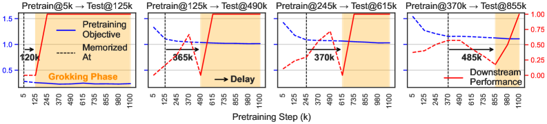
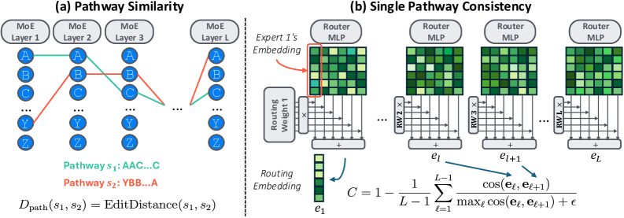
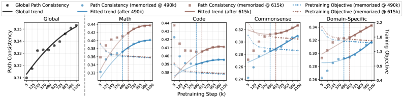
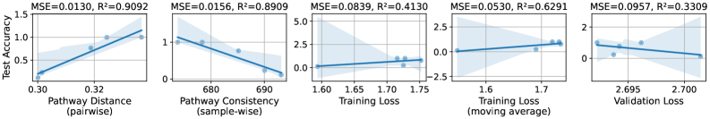
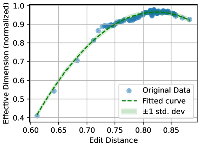
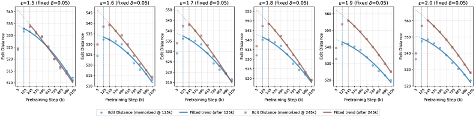
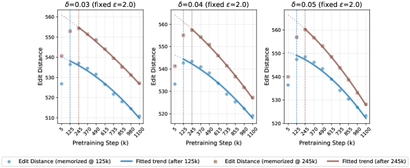
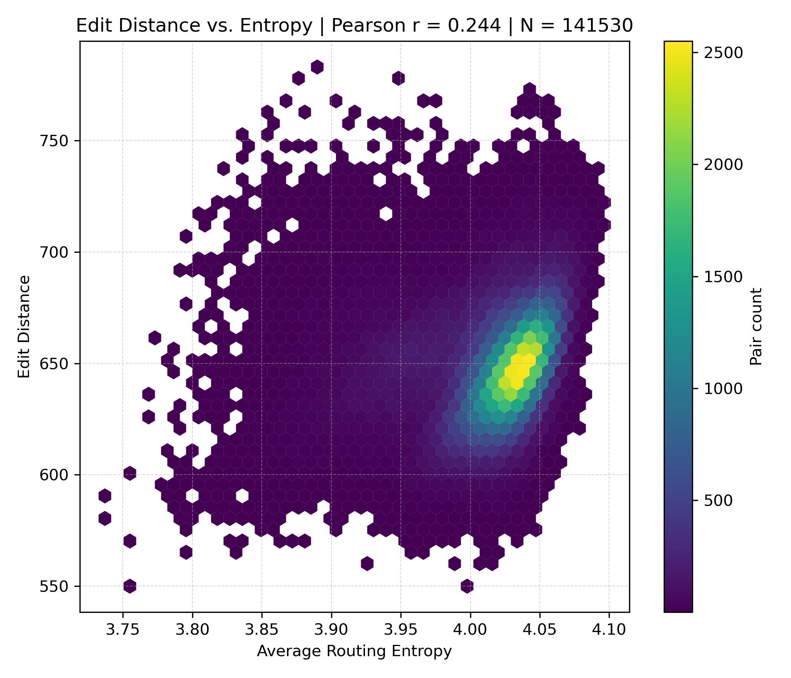
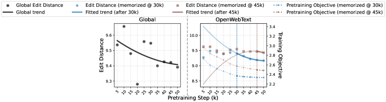
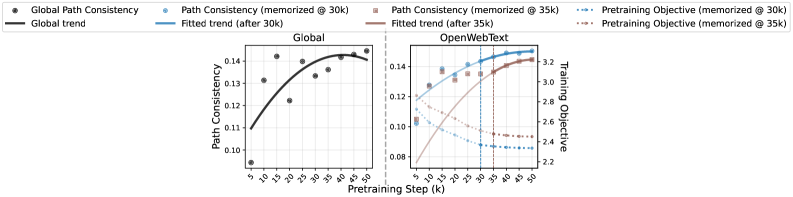

# Li, Fan, Zhou 2026 — Grokking in LLM Pretraining? Monitor Memorization-to-Generalization without Test

See also: [the global concept index](../../concepts/index.md).

**Ziyue Li**, **Chenrui Fan**, **Tianyi Zhou** (Department of Computer Science, University of Maryland, College Park).

arXiv [2506.21551](https://arxiv.org/abs/2506.21551), 26 June 2025 (version v4 — 3 February 2026). 8 citations — the twenty-seventh most cited work in the corpus. The source is the native arXiv HTML of version v4.

The files of this paper's analysis:

- [`2506.21551.grokking-in-llm-pretraining-monitor-memorization-to-generalization-without-test.license.txt`](2506.21551.grokking-in-llm-pretraining-monitor-memorization-to-generalization-without-test.license.txt) — the arXiv licence record for this paper.

The anchor scheme and the rules for linking into a card are in the [README of the papers folder](../README.md).

**Excerpt card.** The paper's licence (`arxiv-nonexclusive`) does not permit republishing the paper itself; what stands here are the editorial sections and the fragments the corpus quotes (right of quotation). The paper: <https://arxiv.org/abs/2506.21551>.

## Concepts covered

**[Grokking](../../concepts/grokking.md)** — the work checks the boldest possible generalisation: does grokking arise in the **real** pre-training of a large language model, that is, in almost a single pass over a corpus the size of the network? The answer is affirmative, but with an essential correction: the grokking turns out to be **local and asynchronous** — different groups of data enter their grokking stage at different moments, and the global synchronous transition familiar from algorithmic tasks is **not to be found** here ([`p2-5`](#p2-5), [`p4-6`](#p4-6)).

**[Memorisation](../../concepts/memorization-phase.md)** — the definition is adapted to a single-pass setting and deserves to be carried over into the corpus: an example counts as memorised from the step $t_{i}^{ * }$ at which its loss is below a threshold $\varepsilon$ and deviates from its final value by less than $\delta$ **at every subsequent** checkpoint ([`p3-6`](#p3-6)). The authors state separately that such "memorisation" of unseen data is caused not by overfitting and not by repetitions but by an interpolation of what has already been learned ([`p3-4`](#p3-4)).

**[Progress measures](../../concepts/progress-measures.md)** — the main practical contribution: two quantities computable **from the training data** and therefore almost free. The first is the Levenshtein edit distance between the *pathways* (the sequences of expert choices across the layers) of two examples ([`p7-1`](#p7-1)). The second is the consistency of a pathway: the normalised cosine proximity of the weighted expert embeddings between adjacent layers for a single example ([`p8-1`](#p8-1)). Both are strongly related to accuracy on benchmarks: the consistency gives a correlation above $0.97$ and the distance about $-0.93$ ([`p9-1`](#p9-1), [`tab-1`](#tab-1)).

**[Attention routing](../../concepts/attention-routing-heads.md)** — the architecture here is not decoration but an instrument: a mixture of experts (MoE) makes the internal computation **discrete and observable**, whereas in a dense network all the neurons are engaged at once ([`p6-3`](#p6-3)). It is precisely this that makes it possible to see the mechanism of the transition rather than only its consequences.

**[The emergence of features](../../concepts/feature-emergence-feature-learning.md)** — a substantive finding: the pathways evolve from random and example-specific to **structured and transferable across examples**, and they do so after the loss has already levelled off ([`p7-2`](#p7-2), [`fig-4`](#fig-4)). The authors call this a transition to a "smarter memorisation": the model goes on finding more and more shared knowledge in order to encode the same data more economically ([`p2-4`](#p2-4)).

**[The manifold and the compression of the representation](../../concepts/manifold-representation-compression.md)** — the layer-wise picture is subtle and does not reduce to "everything simplifies": the early layers simplify fastest after the memorisation, the late ones more slowly, and **the last layer, on the contrary, diversifies** ([`p7-3`](#p7-3), [`fig-5`](#fig-5)). The early layers consolidate universal representations while the late ones retain a task-specific flexibility.

**[Generalisation bounds](../../concepts/generalization-bounds.md)** — the theoretical part ties what is observed to a quantity for which a bound is proved: the **effective dimension** of the routing kernel $\operatorname{Tr}(\boldsymbol{H}^{ * }(\boldsymbol{H}^{ * }+\lambda I)^{-1})$ ([`p9-4`](#p9-4)). In the NTK regime with a fixed routing the excess risk is bounded through this dimension ([`p9-5`](#p9-5)); grokking then reads as a **collapse** of the effective dimension as the routing passes from random to structured ([`p10-1`](#p10-1)).

**[The neural tangent kernel](../../concepts/neural-tangent-kernel-ntk.md)** — the price of the theorem is named outright: the experts stay $\epsilon$-close to their initialisation, the routing is **fixed** and contains no learnable parameters, and the label noise is Gaussian ([`p15-1`](#p15-1)). That is, what is proved is a statement about a setting in which the routing dynamics under study is absent by construction.

**[Real data](../../concepts/vision-real-world-data-mnist-cifar.md)** — the setting is large-scale and heterogeneous: the open OLMoE checkpoints (7 billion parameters, a mixture of experts), four domains — mathematics, code, common sense, domain knowledge — with 10 thousand pre-training and 10 thousand test examples each ([`p4-4`](#p4-4)). Benchmark contamination is filtered out by Min-K%++ membership inference.

**[Double descent](../../concepts/double-descent.md)** and **[emergence](../../concepts/emergence.md)** — the work notices and explains an awkward fact: the training loss has a relation to the final accuracy that is not merely weak but **of the wrong sign** — positive where by rights it ought to be negative ([`p9-1`](#p9-1)). This is a direct objection to the practice of tracking quality by the loss curve.

It is worth saying separately what the work does **not** contain. There are no causal interventions: the relation of the pathways to the generalisation is established correlationally, and no attempts are made to change the routing and look at the outcome. Nor is there a carry-over to dense models — "virtual pathways" are named as future work ([`p10-2`](#p10-2)).

Cards of corpus papers: [Power et al. 2022](../2201.02177.grokking-generalization-beyond-overfitting-on-small-algorithmic-datasets/2201.02177.grokking-generalization-beyond-overfitting-on-small-algorithmic-datasets.card.md) — the original phenomenon from which the work starts; [Nanda et al. 2023](../2301.05217.progress-measures-for-grokking-via-mechanistic-interpretability/2301.05217.progress-measures-for-grokking-via-mechanistic-interpretability.card.md) — the gradual strengthening of structured mechanisms, named in the survey; [Merrill et al. 2023](../2303.11873.a-tale-of-two-circuits-grokking-as-competition-of-sparse-and-dense-subnetworks/2303.11873.a-tale-of-two-circuits-grokking-as-competition-of-sparse-and-dense-subnetworks.card.md) — the sparsity of subnetworks; [Wang et al. 2024](../2405.15071.grokked-transformers-are-implicit-reasoners/2405.15071.grokked-transformers-are-implicit-reasoners.card.md) — grokking and implicit reasoning, the nearest work in conception; [Huang et al. 2024](../2402.15175.unified-view-of-grokking-double-descent-and-emergent-abilities/2402.15175.unified-view-of-grokking-double-descent-and-emergent-abilities.card.md) and [DeMoss et al. 2024](../2412.09810.the-complexity-dynamics-of-grokking/2412.09810.the-complexity-dynamics-of-grokking.card.md) — corpus works named in the bibliography; [Notsawo et al. 2023](../2306.13253.predicting-grokking-long-before-it-happens/2306.13253.predicting-grokking-long-before-it-happens.card.md) — another attempt to predict grokking from the training dynamics.

## What is shown and what is conjectured

The card editor's remarks following the analysis of the claims (`…claims.txt`). The work is applied and conscientious: one observation about scale, two cheap quantities and an extensive set of robustness checks.

**The main finding is a negative one, and that is its merit.** There is **no** global synchronous grokking in the pre-training of large language models ([`p4-6`](#p4-6)). In its place there is a multitude of local transitions, each with its own moment and its own length. For the corpus this is an important correction: almost the whole literature on grokking describes a picture that is not reproduced in its original form at practical scale.

**The relation between the difficulty of the data and the length of the delay is a welcome side result.** Groups memorised later take longer to reach generalisation ([`p5-1`](#p5-1)), and mathematics and code require far more examples to be memorised than common sense and domain questions do ([`p4-5`](#p4-5)). This makes the "delay" a measurable characteristic of the data rather than only of the model.

**The quantities are cheap and correlate well — but this is a correlation.** An $|r|>0.97$ for the consistency of the pathway ([`p9-1`](#p9-1)) is impressive, yet it is built over **ten** checkpoints per domain, and after discarding the early phase of chance accuracy at that ([`p8-4`](#p8-4)). At ten points and with a prior truncation the confidence interval is wide, and "highly significant" should be read with caution.

**The observation about the sign of the loss correlation is a strong argument.** A moving average of the training loss gives a **positive** relation with the accuracy where a negative one would be expected ([`p9-1`](#p9-1)). This is not merely "the loss predicts poorly" — it is an indication that it misleads, and it is supported by numbers.

**There are many robustness checks, and they are the right ones.** The routing-weight threshold 0.5–0.8 ([`p18-2`](#p18-2)), a LoRA rank of 32 against 64 ([`p18-4`](#p18-4)), the thresholds $\varepsilon$ and $\delta$ ([`p19-2`](#p19-2)) — in every case the qualitative picture holds. Two checks are especially valuable: **cross-domain** pairs show no systematic decrease of the distance ([`p20-1`](#p20-1)), and the routing entropy explains only about 6 % of the variance ([`p20-4`](#p20-4)). The first cuts off the explanation through global load balancing, the second the explanation through a change in the uniformity of the routing.

**A reproduction on a second model removes the suspicion of an artefact of scale.** On nanoMoE (55 million parameters, trained from scratch) both trends recur ([`p21-1`](#p21-1), [`p21-3`](#p21-3)). There, however, the correlations are computed on benchmarks with no in-context examples and reach exactly $\pm 1.0$ by Spearman at ten points — a value that speaks rather of a small number of observations than of the strength of the relation.

**The theorem is proved not about the dynamics under study.** The bound is derived in the NTK regime with a **fixed** routing containing no learnable parameters ([`p15-1`](#p15-1)), whereas the whole empirical result is about how the routing **changes** during the training. Moreover, appendix D reports that the router weights adapt fastest of all ([`p17-2`](#p17-2)), that is, the fixed-routing assumption directly contradicts what is observed. The link between the theory and the experiment rests on a substitution: the effective dimension correlates with the edit distance — but that check is made on a **synthetic** single-layer MoE of 16 experts ([`p16-11`](#p16-11)) rather than on OLMoE.

**There is no causality, and this is the main gap.** All the conclusions about "a rearrangement of the pathways leading to generalisation" rest on a coincidence in time. Not a single intervention — neither a forced simplification of the routing nor a freezing of it — is carried out, although in an MoE architecture such an intervention suggests itself.

**The evaluation requires fine-tuning, and this weakens the claim of "zero cost".** The quantities really are free, but **checking** their usefulness required a LoRA fine-tuning of every checkpoint ([`p4-4`](#p4-4)). The claim holds for the application but not for the validation; in a new setting the quality of the relation is unknown in advance.

**Its place in the corpus.** This is the wiki's first work studying grokking in practical pre-training, and its main contribution is not a technique but a **correction to the picture**: at real scale grokking exists but breaks up into a multitude of local transitions tied to groups of data. The second contribution is practical: it is shown that the internal rearrangement of the computation continues after the loss has converged and that it can be tracked for free — although the causal role of that rearrangement remains unproved.

## Common misreadings and overstatements

These are the card editor's remarks, not the authors' text: places where this paper restates someone else's results with an error, or without the qualifications their authors attached. The "details" links in the "Common misreadings and overstatements of this paper" sections of the cited works' cards lead here.

###### mc-2306-13253
**Notsawo et al. (2306.13253) — oscillations as an established predictor.** `"Notsawo Jr et al. [23] identified oscillatory patterns in early training loss as predictors of subsequent grokking phenomena"` — "identified … as predictors": in the cited work the predictor exists as a [hypothesis — "we conjecture … can hint us"](../2306.13253.predicting-grokking-long-before-it-happens/original/2306.13253.predicting-grokking-long-before-it-happens.md#p3-1) plus a resemblance between two heat maps, with no threshold, no rate of correct predictions and no type I/II errors; the authors write outright that [the spectral signature is not a measure of capacity and that oscillations by themselves do not lead to grokking](../2306.13253.predicting-grokking-long-before-it-happens/original/2306.13253.predicting-grokking-long-before-it-happens.md#p3-4). Tellingly, the paper builds its own predictors and does not compare itself numerically with the target's "predictor" — there is nothing to compare with.

---

# Quoted fragments

Only the fragments the corpus cards refer to are
reproduced here (right of quotation); the paper's licence does not permit
republishing the whole text. Anchor numbering matches the original.

###### p1-2

This paper presents *the first study of grokking in practical LLM pretraining*. Specifically, we investigate when an LLM memorizes the training data, when its generalization on downstream tasks starts to improve, and what happens if there is a lag between the two. Unlike existing works studying when a small model generalizes to limited and specified tasks during thousands epochs’ training on algorithmic data, we focus on a practical setting for LLMs, i.e., near single-pass pretraining of next-token prediction on a cross-domain, large-scale corpus, and generalization on diverse benchmark tasks covering math/commonsense reasoning, code generation, and domain-specific retrieval. Our study, *for the first time, verifies that grokking still emerges in pretraining mixture-of-experts (MoE) LLMs*, though different local data groups may enter their grokking stages asynchronously due to the heterogeneity of their distributions and attributions to others. To find a mechanistic interpretation of this local grokking, we investigate the dynamics of training data’s pathways (i.e., expert choices across layers in MoE). Our primary discovery is that *the pathways evolve from random, non-smooth across layers, instance-specific to more structured and transferable across samples*, despite the converged pretraining loss. This depicts a transition from memorization to generalization. Two novel metrics are developed to quantify these patterns: one computes the pathway similarity between samples, while the other measures the consistency of aggregated experts between subsequent layers for each sample. These training data based metrics induce near zero cost but can faithfully track and monitor the generalization of LLMs on downstream tasks, reducing reliance on costly instruction tuning and benchmark evaluations. We also ground our findings in a theoretical analysis of one-layer MoE, showing that more structured pathways improve the generalization bound.

###### p2-2

**Main Contributions** In this paper, we investigate the training dynamics and grokking in LLM pretraining for a mechanistic interpretation of its emergent generalization on downstream tasks. Our study is conducted on the open-sourced pretraining checkpoints of a 7B mixture-of-experts (MoE) LLM, OLMoE [21]. While our study mainly focuses on OLMoE, its pretraining and evaluation setups are common among other LLMs. For the first time, we verify the existence of local grokking during LLM pretraining. However, unlike the previously observed global and synchronous grokking for most data [24, 19, 22], *LLM memorizes domains/groups of training data at different training steps and takes varying amounts of steps to generalize to related benchmark tasks.* The starting time and lasting steps of such local grokking vary across data groups. As a result, generalization performance is usually unstable during the earlier pretraining stages but starts to steadily improve once sufficient data have been memorized. This local difference also reflects data difficulty: the later memorized data group often takes longer to generalize.

Another primary challenge is to explain how the continual pretraining after memorization completed leads to the delayed sharp rise of the generalization performance. To investigate the mechanism of memorization-to-generalization transition, we explore internal states of LLMs track their major changes after loss converges. Specifically, we study how the pathways (the expert choices across layers for training samples) in OLMoE change. We introduce two metrics to measure their complexity how it changes over time: (1) the edit distance between different samples’ pathways; and (2) the consistency of selected experts’ embedding between consecutive layers for each sample.

###### p2-4

Our empirical analysis on four domains reveals a prominent trend of the pathway complexity during grokking: the edit distance declines and the consistency increases, despite the converged training loss and more data being learned. This change in pathway complexity reflects a transition to smarter memorization: it keeps discovering more transferable knowledge across samples to encode data more efficiently. *It explains why generalization improves with plateaued training loss: the model keeps finding more generalizable and shareable structures to memorize training data.* Additionally, we provide a theoretical explanation relating the pathway complexity to a generalization bound of a one-layer MoE. Practically, the two metrics show strong correlations with the evaluation results on standard benchmarks after instruction finetuning. Therefore, they provide a zero-cost, finetuning and benchmark evaluation-free tool to monitor generalization during pretraining, which is critical to LLM developers and practitioners. These discoveries take the first step toward bridging the gaps of understanding grokking and memorization-to-generalization transition in LLM pretraining. Our key findings and contributions can be summarized as:

###### p2-5

- Grokking still occurs during the near single-pass pretraining of practical-scale LLMs, but it is local and asynchronous for different data groups, unlike global grokking for all data in previous works.
- Grokking’s memorization-to-generalization transition can be explained by the dynamics of pathways in MoE: pathway similarity between samples and consistency across layers increase. A theoretical connection is also built between the pathway complexity and a generalization bound.
- The two metrics we developed to measure pathway complexity provide a finetuning and evaluation-free tool with almost zero cost to monitor the generalization during LLM pretraining.

**[p. 3]**

###### p3-4

- **Training-test evaluation gap**: most LLMs are trained for the next token(s) prediction while evaluated on diverse benchmark tasks, making the conventional comparison between training and test loss/accuracy invalid. Hence, we need to adapt the definition of grokking to the LLM setting.
- **Heterogeneous, web-sourced, cross-domain training data**: While previous grokking studies focus on clean training data with the same distribution/format, most LLMs are pretrained on heterogeneous, cross-domain, web-sourced data that contain redundant, contaminated, or imbalanced samples. Hence, their loss may converge at different rates and pose distinct effects on downstream tasks. To address these challenges, we carefully filter and group the data in our analysis.
- **Generalization to diverse downstream tasks**: Previous studies of grokking focus on generalization to highly-specified and limited tasks, while practical LLMs are expected to generalize to arbitrary tasks or domains via prompting. Hence, LLMs’ generalization behaviors may vary drastically across different downstream tasks/benchmarks and difficulty levels during pretraining.
- **Near single-pass pretraining**: Most LLMs’ pretraining only takes approximately one epoch, so the model has been trained only once on each sample, and its training loss may even converge before visiting later data. However, such “memorization” of unseen data is not caused by overfitting or repeated replay. Instead, it reflects the interpolation or composition of learned data, which might be counted as “generalization” in previous works but differs from the emergent generalization of LLMs on new tasks.

###### p3-6

Since $\ell_{i}(\theta)$ directly measures how the model memorizes each token in $x_{i}$, we will track it in the pretraining process and identify the sample with consistently small and converged loss across checkpoints as memorized. Specifically, for a sample $x_{i}$ with loss $\ell_{i}(\theta_{t})$ at pretraining step $t$, we identify it as *memorized* since step $t_{i}^{*}$ if $\ell_{i}(\theta_{t})\leq\varepsilon$ and $|\ell_{i}(\theta_{t})-\ell_{i}(\theta_{T})|\leq\delta$ for all $t\geq t_{i}^{*}$, where $\varepsilon$ is a small threshold, $\delta$ enforces stability over time, and $T$ indexes the final pretraining checkpoint. In Appendix E.3, We verify that varying $\varepsilon$ and $\delta$ does not change the post-memorization behavior analyzed in Section 4.

**Generalization is measured on standard benchmarks after instruction tuning.** As foundation models with various emergent capabilities, LLMs are expected to generalize to an open set of unseen tasks through simple prompting/instructions. Hence, their generalization performance is usually measured across standard benchmarks defined on diverse downstream tasks. To equip a pretrained LLM $\theta$ with the instruction-following capability, an instruction tuning algorithm $\mathcal{A}_{\text{IT}}$ further finetunes $\theta$ on a dataset $D_{\text{IT}}$. The generalization performance on benchmark-$i$ is then measured by

$$
\mathcal{G}_{i}=\text{Eval}_{i}(\theta_{IT},D_{i}),\theta_{IT}=\mathcal{A}_{\text{IT}}(\theta,D_{\text{IT}}), \tag{2}
$$

where $D_{i}$ is the dataset in benchmark-$i$ and $\text{Eval}_{i}$ defines the corresponding evaluation metric, which varies across benchmarks for different types of tasks. For example, accuracy is usually used in multi-choice QA tasks while BLEU/ROUGE scores are used in summarization and generation tasks. For code generation tasks, the generalization performance is usually measured by unit tests, where a test case is considered correct if the generated code can pass the unit tests.

**Grokking refers to delayed generalization improvement after memorization is completed.** Following the same spirit of previous works on grokking, we mainly focus on the phenomenon that $\mathcal{G}_{i}$ starts to surge long after $\ell_{i}(\theta)$ has converged/plateaued. We also use the training loss to track memorization as previous works. However, the test loss adopted by previous grokking analysis is no longer an ideal metric for LLM generalization, since it focuses on token-level matching to ground truths while downstream tasks focus on semantic-level matching, and some of them do not provide ground truths (e.g., code generation).

###### p4-4

**Experimental Setup** We equidistantly sample 10 checkpoints from the OLMoE pretraining trajectory. To evaluate memorization, we probe OLMoE on samples drawn directly from its pretraining corpus $D_{\text{train}}$, ensuring fidelity to the model’s original distribution. We evaluate generalization on widely used benchmarks spanning four domains: *math*, *code*, *commonsense QA*, and *domain-specific QA* (10k pretraining and 10k test samples per domain; see Appendix A). To exclude contaminated benchmark samples from the generalization analysis, we apply the Min-K%++ membership inference method [35] to identify them. Moreover, we mainly focus on the samples whose model predictions become consistently correct before the pretraining ends, and analyze when this generalization emerges and how long it persists. For downstream tasks, we apply lightweight LoRA-based instruction tuning $\mathcal{A}_{\text{IT}}$ on $D_{\text{IT}}$ to equip checkpoints with basic instruction-following capability while preserving pretrained capabilities (Appendix B).

###### p4-5

To understand when memorization unfolds during pretraining and how it affects generalization, Figure 1 contrasts the number of memorized training samples (using the criterion defined above) at each pretraining checkpoint with benchmark performance for each domain. It shows that (1) training samples are memorized at different pretraining steps; (2) generalization typically follows memorization with a lag: benchmark performance starts to achieve stable gains after sufficient data has been memorized. An interesting discovery is that the lag length varies across domains: generalization leap on math and coding tasks requires memorizing many more samples than commonsense and domain-specific QA tasks.

###### p4-6

These observations reveal the complex training dynamics of LLMs caused by training data heterogeneity and their uneven attributions to different benchmark tasks. **[p. 5]** It implies that the widely studied global grokking—a synchronous memorization of most training data and a delayed contemporary generalization leap on most test samples—cannot be found in LLM pretraining. That being said, the memorization of certain data is plausible to impose a long-term, delayed effect on the generalization to specific downstream tasks. To investigate such local dynamic patterns, we group data in each domain by their memorization steps $t_{i}^{*}$ and particularly focus on the early-memorized groups, as they leave more checkpoints after $t_{i}^{*}$ to study the subsequent dynamics of generalization. Accordingly, we group samples in benchmarks by the training steps since when their predictions become consistently correct. To enable an analysis of how memorization drives downstream generalization performance, we pair each training data group with its most relevant benchmark samples via bipartite graph matching (by Hungarian algorithm [13]), with the training-test data similarity defined in the embedding space of SentenceTransformer [27]. Additional implementation details of the pairing procedure are provided in Appendix B.1.

*Figure 2: **Pretraining objective (blue) and benchmark performance (red) across four paired training-test data groups from the math domain. Pretrain@$p$ → Test@$q$ denotes a paired training–test group, where Pretrain@$p$ is the training subset whose samples reach stable memorization at step $p$, and Test@$q$ is the benchmark subset whose accuracy stabilizes at step $q$. These pairs are formed using embedding-based Hungarian matching, as detailed in Appendix B.1. We observe local grokking on each pair: a delayed generalization leap on benchmark tasks after the pretraining objective plateaued. From left to right, more difficult data memorized (converged) later associate with a longer delay towards grokking.*** **[p. 5]**

###### p5-1

Figure 2 visualizes the memorization and generalization on four groups: all training-test pairs exhibit a delayed generalization leap on benchmark tasks after the pretraining objective stably converged on the training data. Hence, the training objective cannot monitor or predict the generalization performance. Moreover, earlier-converging groups generalize sooner after loss converged, while later-converged groups associate with substantially longer delays. Notably, this delay scales with data difficulty, which affects not only the number of steps taken to memorize the data but also the duration of memorization to generalization transition.

**[p. 6]**

**Remaining Question** This local grokking indicates that the model’s internal states, except its pretraining loss, might track generalization or reflect the transition better. This raises a fundamental question for understanding the emergence of capability in LLM:

*What internal state changes within an LLM signify the emergence of generalization?* Investigating this problem can provide critical insights to uncover the mechanisms of memorization-to-generalization transition and monitor the pretraining progress in practice. To this end, we probe LLMs’ internal state dynamics to address the challenge.

###### p6-3

As shown in Section 3, generalization in LLMs emerges well after memorization, suggesting that internal reorganization underlies this transition. Such dynamics are difficult to track in dense architectures, where all neurons are simultaneously involved. MoEs simplify this process: by organizing computation into experts, each input activates only a subset of experts, forming a discrete *routing pathway* across layers (Figure 3(a)). These pathways reveal how computation is allocated and reorganized during pretraining, providing a mechanistic view of the memorization-to-generalization transition.

In this section, we analyze the evolution of *routing pathway* during pretraining and introduce two metrics to quantify these changes (Figure 3): (i) the similarity of pathways across different inputs (Section 4.1), and (ii) the consistency of a single input’s pathway (Section 4.2). Importantly, all metrics are computed on pretraining samples that have already been memorized, i.e., those whose training objective has stabilized at low values beyond specific checkpoints, and trace how their internal routing continue to evolve from memorization to generalization. We then assess these metrics as robust generalization monitors (Section 4.3) and conclude by establishing a spectral framework connecting routing geometry to generalization bounds (Section 4.4).

*Figure 3: **Pathway Complexity Metrics to Monitor Grokking. (a) Pathway similarity between samples is measured by edit distance on their sequences of expert choices across layers. (b) Pathway consistency quantifies the smoothness of expert transitions between subsequent layers for the same sample by cosine similarity of their weighted expert embeddings.*** **[p. 6]**

###### p7-1

We use the Levenshtein edit distance $D_{\mathrm{path}}(s_{i},s_{j})=\mathrm{EditDistance}\big(s_{i},s_{j})$, which counts the minimum insertions, deletions, or substitutions required to align two pathways, to measure pathway similarity. This metric captures both local deviations in expert choice and global shifts in pathway structure, reflecting differences in selection, length, and ordering. We monitor the average pairwise distance across samples throughout pretraining to track the emergence of shared routing.

###### p7-2

**Overall pattern.** Our analysis, shown in Figure 4, reveals a clear trajectory in pathway dynamics. Early in pretraining, most inputs share nearly identical routes, producing low edit distance $D_{\mathrm{path}}$. As the model memorizes individual inputs, pathways diverge and $D_{\mathrm{path}}$ rises. Crucially, $D_{\mathrm{path}}$ decreases after memorization, which indicates that semantically related inputs then converge into similar routing sequences, signaling the **emergence of shared pathways** that support generalization.

###### p7-3

**Layerwise pattern.** While prior work [17] reports static depth-dependent specialization in trained MoEs, our results show that the memorization-to-generalization transition is also dynamically depth-dependent during pretraining (Figure 5). Shallow layers show the steepest decline in $D_{\mathrm{path}}$ after memorization, indicating rapid convergence to shared pathways. Deeper layers exhibit smaller reductions, and the final layer even shows an increase in $D_{\mathrm{path}}$ post-memorization. These patterns suggest a depth-specific reorganization: early layers consolidate universal representations, while later layers retain or enhance routing flexibility, balancing shared computation with task-specific specialization.

###### fig-4

*Figure 4: **Pathway edit distance and pretraining objective of two data groups (memorized at $125k$ and $245k$ steps) during pretraining across four domains. The global panel (leftmost) fits the overall quadratic trend over all domains, while domain panels fit separate trends after the corresponding convergence step. Despite early training objective plateauing, pathway edit distance continues to decline, indicating a declining complexity of internal memorization.*** **[p. 7]**

###### fig-5

*Figure 5: **Layer-wise evolution of pathway edit distance during pretraining for the data group memorized at $245k$ step. Overall distance decreases from early to later layers, indicating higher complexity in early layers. After pretraining objective convergence, early-layer routing among similar samples simplifies quickly, later layers adapt more gradually, and the final layer diversifies after memorization.*** **[p. 8]**

###### p8-1

To quantify routing smoothness, we define **pathway consistency** $C_{i}$ as the normalized average cosine similarity between consecutive layer embeddings for input $x_{i}$:

$$
C_{i}=1-\frac{1}{L-1}\sum_{\ell=1}^{L-1}\frac{\mathrm{cos}(\mathbf{e}_{i,\ell},\mathbf{e}_{i,\ell+1})}{\max_{\ell}\mathrm{cos}(\mathbf{e}_{i,\ell},\mathbf{e}_{i,\ell+1})+\epsilon},
$$

where $\epsilon=10^{-8}$ ensures numerical stability. Higher $C_{i}$ indicates more erratic transitions, while lower values reflect smoother, more consistent routing across layers.

Figure 6 tracks the evolution of pathway consistency and pretraining objective across four domains. A key finding is that even after the objective stabilizes, pathway consistency continues to improve—revealing ongoing refinement in the internal routing of the model. This suggests that smoother, more coherent cross-layer transitions emerge well after memorization, positioning pathway consistency as a valuable lens for understanding generalization beyond what the training objective alone captures.

*Figure 6: **Pathway consistency vs. training objective on four domains during pretraining. The global panel (leftmost) shows that the path consistency consistently improves over all data, while each domain panel shows the same trend on two data groups (memorized at $490k$ and $615k$) from each domain after the training objective converges. This reflects a progressively smoother transition of experts between consecutive layers after memorization.*** **[p. 8]**

###### tab-1

*Table 1: **Correlation between pathway complexity metrics and generalization (test accuracy) across four domains, with the comparison to training/validation loss. $p$-value: $p<0.1$, $p<0.05$, $p<0.01$, $p<0.001$, $p>0.1$, $p>0.5$, $p>0.8$. Preferred correlation: positive, negative.*** **[p. 9]**

| Metric | Math | Code | Commonsense | Domain-Specific |  |  |  |  |
|---|---|---|---|---|---|---|---|---|
| Pearson | Spearman | Pearson | Spearman | Pearson | Spearman | Pearson | Spearman |  |
| \cellcolornegcorrPathway Distance (pairwise) | \cellcolorsig1-0.9471 | \cellcolorsig1-0.9487 | \cellcolorsig2-0.9290 | \cellcolorsig2-0.9276 | \cellcolorsig2-0.9821 | \cellcolorsig3-0.9747 | \cellcolorsig1-0.9254 | \cellcolorsig1-0.9487 |
| \cellcolorposcorrPathway Consistency (sample-wise) | \cellcolorsig10.9246 | \cellcolorsig10.9487 | \cellcolorsig40.9786 | \cellcolorsig40.9856 | \cellcolorsig30.9804 | \cellcolorsig30.9747 | \cellcolorsig30.9917 | \cellcolorsig10.9487 |
| \cellcolornegcorrTraining Loss | \cellcolornonsig3-0.0435 | \cellcolornonsig2-0.2108 | \cellcolornonsig3-0.0680 | \cellcolornonsig3-0.2052 | \cellcolornonsig10.6427 | \cellcolornonsig30.4104 | \cellcolornonsig10.7944 | \cellcolorsig10.9487 |
| \cellcolornegcorrTraining Loss (moving average) | \cellcolornonsig20.4714 | \cellcolornonsig20.3162 | \cellcolornonsig20.2481 | \cellcolornonsig2-0.2052 | \cellcolornonsig10.7931 | \cellcolornonsig10.6669 | \cellcolornonsig10.8705 | \cellcolorsig10.9487 |
| \cellcolornegcorrValidation Loss | \cellcolornonsig20.4801 | \cellcolornonsig3-0.1054 | \cellcolornonsig10.5466 | \cellcolorsig10.8721 | \cellcolornonsig1-0.5752 | \cellcolornonsig1-0.4617 | \cellcolornonsig2-0.3339 | \cellcolornonsig2-0.3162 |

*Figure 7: Correlation of the two pathway complexity metrics with benchmark performance. Compared to the training objective and its moving average, both the pathway edit distance and consistency are highly correlated with the test accuracy, though they are also computed on training data.* **[p. 9]**

###### p8-4

Given the strong link between routing dynamics and generalization, we ask: *To what extent do our pathway metrics predict test performance across domains?* To answer this, we compute Pearson and Spearman correlations between downstream performance and two metrics across pretraining checkpoints. As described in Section 3.1, we apply a lightweight LoRA-based instruction tuning (rank = 32; see Appendix B) solely to equip pretrained checkpoints with basic instruction-following **[p. 9]** ability for benchmark evaluation. The robustness of this setup is further supported by the LoRA rank ablation in Appendix E.2. Our correlation analysis focuses on checkpoints after domain-level accuracy begins its sustained rise (shown in Figure 1), thereby isolating the mechanisms that drive generalization beyond the random-accuracy phase.

###### p9-1

Table 1 summarizes the correlation results across four tasks. Pathway consistency (sample-wise) shows exceptionally strong positive correlations with test accuracy—often exceeding $0.97$ and highly significant—indicating that coherent, stable routing across layers is a key marker of generalization. In contrast, pairwise pathway similarity consistently yields strong negative correlations (around -$0.93$), suggesting that as generalization improves, inputs tend to follow increasingly similar expert routes. By comparison, as shown in Figure 7, training and validation loss metrics exhibit weaker and less consistent correlations. Notably, while moving-average training loss shows relatively high correlation in certain domains (e.g., Code, Domain-Specific), its direction is inconsistent with expectation: since loss is minimized during training, we would expect a *negative* correlation with test accuracy—not the *positive* one observed here. This mismatch further underscores that conventional pretraining metrics fail to reflect the internal transition from memorization to generalization.

These findings position pathway metrics as robust, domain-general indicators of generalization. Importantly, they rely only on training dynamics—without requiring held-out validation data—making them especially valuable for real-time monitoring in large-scale or resource-constrained settings.

###### p9-4

Concretely, $\bm{H}^{*}$ is the Gram matrix of the routing kernel with entries $\bm{H}^{*}_{ij}=\Theta_{\text{route}}(x_{i},x_{j})$, capturing similarity between inputs induced by both routing overlap and expert functions. The effective dimension is defined as $\text{Tr}(\bm{H}^{*}(\bm{H}^{*}+\lambda I)^{-1})$, measuring the complexity of the function space induced by routing.

###### p9-5

*Under NTK regime with $K$ experts, with probability $1-\delta$ over $n$ samples, where $C_{1},C_{2}$ are NTK-dependent constants and $\lambda$ is the regularization parameter:*

$$
\textstyle\mathcal{E} \leq\underbrace{\frac{C_{1}\lambda^{2}}{n}\bm{y}^{\top}(\bm{H}^{*}+\lambda I)^{-2}\bm{y}}_{\text{Bias}}+\underbrace{C_{2}\left(\frac{\sigma^{2}\text{Tr}(\bm{H}^{*}(\bm{H}^{*}+\lambda I)^{-1})}{n}+\frac{\sigma^{2}\log(1/\delta)}{n}\right)}_{\text{Variance + Noise}}
$$

**[p. 10]**

###### p10-1

This provides a lens on grokking: as routing evolves from random to structured, the effective dimension collapses, triggering improvements in generalization. Intuitively, this collapse corresponds to a simplification of routing pathways: the kernel spectrum becomes more concentrated, reducing the hypothesis space and mitigating overfitting. The full theoretical setup, assumptions, and proof are detailed in Appendix C, while Appendix C.4 empirically confirms that effective dimension is tightly aligned with routing edit distance, establishing pathway complexity as a key driver of MoE generalization.

###### p10-2

This paper provides the first empirical evidence that, in large-scale LLM pretraining, generalization can emerge well after memorization has been achieved. Through an analysis of routing dynamics in a 7B-parameter MoE model, we propose two novel pathway-based metrics that accurately track generalization without requiring finetuning or external validation sets. Our findings reveal a transition from memorization to generalization, marked by increased pathway similarity and consistency, and supported by theoretical connections between routing structure and generalization bounds. These insights offer a foundation for more transparent and reliable monitoring of generalization in large-scale models. Future work will extend these pathway-based metrics beyond MoE, by constructing analogous “virtual pathways” in dense models, moving toward a unified framework for tracking generalization in foundation models.

###### p15-1

1. **NTK Regime for Experts:** Expert parameters $\theta=(\phi_{1},\dots,\phi_{K})$ are initialized as $\phi_{k}(0)\sim\mathcal{N}(0,I)$ for each $k$, and remain $\epsilon$-close to initialization ($\|\theta(t)-\theta(0)\|=O(1/\sqrt{\text{width}})$), enabling linearization via Neural Tangent Kernel (NTK). We assume $\phi_{k}(0)$ are independent across different experts $k$.
2. **Fixed Routing:** The routing weights $g_{k}(x)$ are fixed for all inputs $x$ and do not contain any trainable parameters. They satisfy $\max_{k}\|g_{k}\|_{\infty}\leq 1$.
3. **Label Noise:** Training labels $y_{i}=f^{*}(x_{i})+\epsilon_{i}$ with $\epsilon_{i}\sim\mathcal{N}(0,\sigma^{2})$, independent of $x_{i}$.

###### p16-11

Our setup involves a lightweight MoE architecture with 16 experts and a 100-dimensional input space. Input data are synthetic Gaussian clusters, providing a controlled environment to analyze pre-defined routing strategies. For each experimental trial, 200 samples are split into training and validation sets. We train a one-layer MoE model with ReLU activations where only expert networks are trainable; the router’s weights are initialized once and then frozen. To explore diverse fixed routing patterns, we perform multiple independent runs, *each starting with a different random initialization of the router*.

Following training, we extract the average edit distance of the pre-determined expert routing paths and the effective dimension. As illustrated in Figure 8, we observe a strong positive correlation between these two quantities. This empirically demonstrates that the structural properties of fixed routing, measured by edit distance, meaningfully impact the complexity of the function space learned by the experts, as predicted by $d_{\rm eff}$. This alignment supports edit distance as a valuable diagnostic for MoE generalization.

*Figure 8: **Correlation of Edit Distance with Effective Dimension. Each point represents an independent experimental run where the router is initialized with a different random seed and then fixed for expert training. This varying initialization leads to diverse fixed routing patterns. We observe a strong positive correlation. This suggests that the structural diversity of pre-defined routing significantly impacts the complexity of the function space learned by experts.*** **[p. 17]**

**[p. 17]**

###### p17-2

Table 3 reports convergence speed (magnitude drop-off over time) and stability (consistency of updates). Router weights adapt fastest while expert weights stabilize most gradually, indicating a division of labor: routing decisions are steered by fast-updating routers atop slow-evolving expert features. Attention layers lie in between.

*Table 3: Convergence speed and stability across parameter types. Higher values indicate faster convergence or greater stability.* **[p. 17]**

| **Parameter Type** | **Convergence Speed $\uparrow$** | **Stability $\uparrow$** |
|---|---|---|
| Router | **0.151** (fastest) | 5.63 |
| Expert | 0.063 (slowest) | **7.32** |
| Attention | 0.083 | 6.01 |

###### p18-2

These results demonstrate that our conclusions are **robust to the choice of routing-weight threshold**. The observed reduction in pathway complexity after memorization, corresponding to the **emergence of shared pathways**, persists across all threshold settings.

###### p18-4

Table 4 reports the correlation between pathway complexity metrics and downstream test accuracy under the two LoRA ranks. The results show that increasing the rank from 32 to 64 yields nearly identical correlations for both *Pathway Distance* and *Pathway Consistency*, while training and validation losses remain weakly correlated. This consistency indicates that the observed relationships between pathway metrics and generalization are **robust to LoRA configuration** and primarily reflect intrinsic pretraining-phase dynamics rather than artifacts of instruction tuning.

*Table 4: **Effect of LoRA Rank on the Correlation Between Pathway Metrics and Generalization (Commonsense reasoning domain). The results show that increasing the LoRA rank from 32 to 64 yields nearly identical correlations, confirming that the observed trends are robust to LoRA configuration. $p$-value: $p<0.1$, $p<0.05$, $p<0.01$, $p>0.1$, $p>0.5$, $p>0.8$. Preferred correlation: positive, negative.*** **[p. 19]**

| Metric | LoRA Rank = 32 | LoRA Rank = 64 |  |  |
|---|---|---|---|---|
| Pearson | Spearman | Pearson | Spearman |  |
| \cellcolornegcorrPathway Distance (pairwise) | \cellcolorsig2-0.9821 | \cellcolorsig3-0.9747 | \cellcolorsig3-0.9927 | \cellcolorsig1-0.9487 |
| \cellcolorposcorrPathway Consistency (sample-wise) | \cellcolorsig30.9804 | \cellcolorsig30.9747 | \cellcolorsig30.9559 | \cellcolorsig20.9487 |
| \cellcolornegcorrTraining Loss | \cellcolornonsig10.6427 | \cellcolornonsig30.4104 | \cellcolornonsig10.6197 | \cellcolornonsig30.4617 |
| \cellcolornegcorrTraining Loss (moving average) | \cellcolornonsig10.7931 | \cellcolornonsig10.6669 | \cellcolornonsig10.6871 | \cellcolornonsig10.2052 |
| \cellcolornegcorrValidation Loss | \cellcolornonsig1-0.5752 | \cellcolornonsig1-0.4617 | \cellcolornonsig1-0.6631 | \cellcolornonsig3-0.4104 |

###### p19-2

This confirms that the proposed pathway-based observations are **robust to the choice of $\varepsilon$ and $\delta$**.

*Figure 10: **Effect of the loss threshold $\varepsilon$ on pathway dynamics. The stability threshold is fixed at $\delta=0.05$. All curves show a consistent post-memorization decrease in edit distance, indicating that the results are robust to $\varepsilon$.*** **[p. 19]**

*Figure 11: **Effect of the stability threshold $\delta$ on pathway dynamics. The loss threshold is fixed at $\varepsilon=2.0$. The same decreasing trend holds across different $\delta$ values, confirming robustness to this parameter.*** **[p. 19]**

###### p20-1

As shown in Fig. 12, the cross-domain edit distance fluctuates throughout pretraining, showing irregular increases and decreases without any consistent downward trend. In contrast, Fig. 4 demonstrates that within-domain pathway distances decrease only for groups of samples that become memorized at different points in training, with each domain exhibiting its own localized transition rather than a global drop. These observations confirm that the structural changes we observe are **domain- and group-specific**, reflecting the **emergence of shared pathways among semantically related samples** rather than a global effect of routing behavior.

###### p20-4

We sample 141,530 pairs across checkpoints spanning both the *math* and *code* domains, including within-domain and cross-domain pairs. Figure 13 shows a weak correlation between average routing entropy and edit distance ($r=0.24$, explaining about $6\%$ of the variance) with no clear monotonic or directional trend. This indicates that neither more balanced routing (higher entropy) nor more concentrated routing (lower entropy) systematically reduces pathway distance. Therefore, the decrease in within-domain pathway distance observed after memorization is unlikely to result from overall changes in routing balance; instead, it reflects domain- and group-specific reorganization of computation.

*Figure 13: **Edit distance vs. routing entropy. Each hexagon aggregates sample pairs ($N=141{,}530$) drawn across checkpoints and across the *math* and *code* domains. Routing entropy is computed from the *full* routing-weight vectors (no thresholding); pathway edit distance uses pathways built with a cumulative cutoff of $0.8$. The weak correlation ($r=0.24$) indicates that routing balance does not systematically determine pathway similarity.*** **[p. 21]**

###### p21-1

**Pathway-metric dynamics.** Consistent with our large-scale results, we observe that after memorization, **pathway edit distance decreases while pathway consistency increases** as shown in Figure 14 and 15. These trends mirror the post-memorization reorganization we identify in OLMoE, demonstrating that even the smaller MoE model reorganizes routing toward more structured, shared computation after the loss has already converged.

*Figure 14: **Pathway edit distance and pretraining objective on nanoMoE during pretraining.** The left panel reports the overall pathway edit-distance trajectory across checkpoints without grouping samples by their memorization steps. The right panel instead visualizes pathway dynamics for two memorized data groups (memorized at 30k and 45k steps). After their respective memorization points, both groups exhibit a consistent post-memorization decline in edit distance despite a plateaued pretraining objective, indicating that nanoMoE continues to reorganize routing pathways toward more structured and shared computation. This mirrors the memorization-to-generalization transition observed in large-scale OLMoE.* **[p. 22]**

*Figure 15: **Evolution of pathway consistency in nanoMoE.** The left panel reports the overall progression of pathway consistency across checkpoints. The right panel further analyzes two memorized data groups (memorized at 30k and 35k steps), showing that once memorization is achieved, each group undergoes continued refinement of its layer-to-layer routing transitions.* **[p. 22]**

**Correlation with downstream performance.** We further evaluate all ten checkpoints in a zero-shot setting on standard commonsense reasoning benchmarks (ARC-Easy/Challenge [4], HellaSwag [34], and OpenBookQA [20]). Zero-shot evaluation is justified because models pretrained on OpenWebText, including GPT-2 [26], have been shown to achieve strong zero-shot performance on commonsense benchmarks. As in the large-scale setting, both pathway metrics exhibit strong correlations with benchmark accuracy ($|r|\approx 0.8$–$1.0$), as reported in Table 5, substantially outperforming training loss or its moving average. This confirms that routing dynamics remain tightly coupled with downstream generalization.

###### p21-3

The nanoMoE results reinforce our central claim: *post-memorization routing reorganization is not an artifact of model scale, data size, or specific MoE implementation*. Instead, it reflects an inherent property of MoE training dynamics. Combined with the large-scale OLMoE study, these findings establish pathway metrics as stable, architecture-intrinsic indicators of the memorization-to-generalization transition.

*Table 5: **Correlation Between Pathway Metrics and Downstream Accuracy on nanoMoE across four commonsense benchmarks (ARC-Easy, ARC-Challenge, HellaSwag, OpenBookQA). $p$-value: $p<0.1$, $p<0.05$, $p<0.01$, $p>0.1$, $p>0.5$, $p>0.8$. Preferred correlation: positive, negative.*** **[p. 23]**

| Metric | ARC-Easy | ARC-Challenge | HellaSwag | OpenBookQA |  |  |  |  |
|---|---|---|---|---|---|---|---|---|
| Pearson | Spearman | Pearson | Spearman | Pearson | Spearman | Pearson | Spearman |  |
| \cellcolornegcorrPathway Distance (pairwise) | \cellcolorsig1-0.8113 | \cellcolorsig3-1.0000 | \cellcolorsig3-1.0000 | \cellcolorsig3-1.0000 | \cellcolorsig1-0.9713 | \cellcolorsig3-1.0000 | \cellcolorsig1-0.8366 | \cellcolorsig2-0.9000 |
| \cellcolorposcorrPathway Consistency (sample-wise) | \cellcolorsig10.9416 | \cellcolorsig31.0000 | \cellcolorsig20.8818 | \cellcolorsig31.0000 | \cellcolorsig10.9234 | \cellcolorsig10.8000 | \cellcolorsig20.9979 | \cellcolorsig31.0000 |
| \cellcolornegcorrTraining Loss | \cellcolornonsig20.3301 | \cellcolornonsig3-0.1000 | \cellcolornonsig1-0.7799 | \cellcolornonsig1-0.5000 | \cellcolornonsig2-0.2182 | \cellcolornonsig3-0.2000 | \cellcolornonsig10.5984 | \cellcolornonsig10.8000 |
| \cellcolornegcorrTraining Loss (moving avg.) | \cellcolornonsig20.4664 | \cellcolornonsig20.4000 | \cellcolornonsig2-0.6078 | \cellcolornonsig2-0.8000 | \cellcolornonsig2-0.3580 | \cellcolornonsig30.2000 | \cellcolornonsig1-0.8655 | \cellcolornonsig2-0.4000 |

**[p. 22]**
