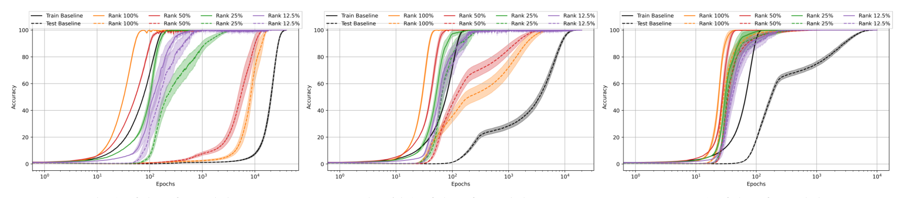

# Mason-Williams & Mason-Williams 2025 — Decomposed Learning: An Avenue for Mitigating Grokking

**A work with no arXiv version.** It appeared at the MOSS workshop at ICML 2025 and lives only on OpenReview, so the folder key is the year and month of the workshop with dashes in place of the sequence number (`2507.-----`), as described in the [README of the papers folder](../README.md). It has no "total" citation number: the corpus table of citing works is keyed by arXiv id. No licence is stated anywhere — neither on OpenReview nor in the PDF — so the paper has two cards: the working full one, `…full.card.md`, which is not part of the public snapshot, and this publishable excerpt; neither `original/` nor `images/` goes outside.

See also: [the global concept index](../../concepts/index.md).

**Gabryel Mason-Williams** — Queen Mary University of London. **Israel Mason-Williams** — UKRI Safe and Trusted AI, Imperial College London and King's College London.

The MOSS (Methods and Opportunities at Small Scale) workshop at ICML 2025, Vancouver. 8 pages, 2 figures, 2 tables. An earlier version of the work is an ICLR 2025 submission titled "Decomposed Learning and Grokking" with a different set of co-authors, status Reject.

The files of this paper's analysis:

- [`2507.-----.decomposed-learning-an-avenue-for-mitigating-grokking.license.txt`](2507.-----.decomposed-learning-an-avenue-for-mitigating-grokking.license.txt) — the licence record, compiled by hand.

The anchor scheme and the rules for linking into a card are in the [README of the papers folder](../README.md).

## Concepts covered

**[Accelerating grokking](../../concepts/accelerated-grokking.md)** — a technique of a different kind from everything the corpus has held so far: not a gradient filter, not an embedding transfer and not a change of optimiser, but a reparameterisation of the weight matrix by a product of three singular-value-decomposition matrices with the rank truncated. The claimed reduction in the number of epochs to the best accuracy averages 98.00 %, 97.08 % and 97.74 % at 50 %, 65 % and 80 % of the training data ([`p4-2`](#p4-2), [`p1-2`](#p1-2)).

**[Spectral analysis: SVD, ESD, FVE](../../concepts/spectral-analysis-svd-esd-fve.md)** — here the singular value decomposition is not a measuring instrument but a way of training: the rank is set as a fraction of the full one and stays fixed rather than being watched as training proceeds ([`p1-2`](#p1-2)).

**[Data fraction and the critical dataset size](../../concepts/data-fraction-critical-dataset-size.md)** — the effect of the technique depends on the fraction of data: between the full rank and the rank cut to 12.5 % the difference in epochs is 95.06 % at half the data and 63.17 % at eighty per cent ([`p4-4`](#p4-4)).

**Excerpt card.** The work's licence is not stated, so the paper itself is not republished here; what stands are the editorial sections and the paragraphs the corpus quotes (right of quotation), under the same anchors the wiki links to. The paper: <https://openreview.net/forum?id=LVuzwpMovE>.

---

# Quoted fragments

Only the fragments the corpus cards refer to are
reproduced here (right of quotation); the paper's licence does not permit
republishing the whole text. Anchor numbering matches the original.

###### p1-2

Grokking is a delayed transition from memorisation to generalisation in neural networks. It challenges perspectives on efficient learning, particularly in structured tasks and small-data regimes. We explore grokking in modular arithmetic from the perspective of a training pathology. We use Singular Value Decomposition (SVD) to modify the weight matrices of neural networks by changing the representation of the weight matrix, W, into the product of three matrices, U, Σ and V T . Through empirical evaluations on the modular addition task, we show that this representation significantly reduces the effect of grokking and, in some cases, eliminates it. Code available at: https://github.com/gmw99/decomposed_learning_an_avenue_for_ mitigating_grokking

1. Introduction

Understanding the learning dynamics of deep learning models is a critical area of research, especially as these models are increasingly deployed in real-world scenarios. Although significant advances have been made in optimising training (Hu et al., 2022; Zhao et al., 2024; Ma et al., 2024), the finer details of how neural networks generalise remains a significant challenge as phenomena such as grokking (Power et al., 2022) challenge our perspective on efficient learning in neural networks. The grokking phenomenon introduced by Power et al., (2022) represents the dynamic wherein a model experiences a significant delay between the point at which a model achieves perfect training accuracy and it achieves a corresponding perfect generalisation accuracy, widely considered as a delayed generalisation. The grokking phenomenon points towards inefficiencies in existing training setups. Liu et al., (2023), support this by showing that the grokking phenomena can be induced on MNIST (LeCun et al., 2010) and the IMDB dataset for sentiment analysis (Maas et al., 2011) when, and only when, the training settings are suboptimal. Grokking in these cases can be mitigated with appropriate training hyperparameters, suggesting that grokking is a training pathology.

In this paper, we investigate the underlying mechanisms that give rise to delayed generalisation in grokking using the mod 97 addition task with a 3-layer MLP. We propose a novel approach, namely Decomposed Learning, that leverages Singular Value Decomposition (SVD) to change the representation of the weight matrices of the layers within the MLP model. We argue that the use of SVD in this way increases the flexibility of the soft inductive bias of a neural network (Wilson, 2025). Empirically, we observe that it can mitigate delayed generalisation. By applying SVD, we decompose the weight matrix, W, into three matrices, Uk, Σk and V T

k , where k is the rank, and explore how this representation across a range of ranks and training data sizes, affects the learning process, specifically in the context of the delayed generalisation offered by the grokking phenomenon.

In this paper, we ask:

• What is the relationship between Decomposed Learning and the grokking phenomena?

• What, if any, relationship exists between the rank of a model’s weights and the amount of training data required for grokking?

1Queen Mary University of London 2UKRI Safe and Trusted AI, Imperial College London and King’s College London. Correspondence to: Gabryel Mason-Williams <g.t.mason-williams@qmul.ac.uk>.

International Conference on Machine Learning (ICML) Workshop on Methods and Opportunities at Small Scale (MOSS), Vancouver, Canada. 2025. Copyright 2025 by the author(s).

**[p. 2]**

Decomposed Learning: An Avenue for Mitigating Grokking

The questions are explored in-depth, and our contributions are:

• Representing the weight matrix, W, as the product of the three matrices Uk, Σk and V T k reduces the number of epochs required to achieve the best accuracy by 98.00% compared to training without SVD in the best case. Through this, our Decomposed Learning method effectively mitigates grokking.

• We show that with increased training data, the discrepancies between the ranks required to alleviate and mitigate the grokking phenomenon are reduced, which reduces the bottleneck of rank selection at the beginning of training.

2. Related Work

Grokking: Grokking (Power et al., 2022) is the name provided to the phenomena of delayed generalisation. Effectively, in grokking, the training data is first memorised, i.e. the test accuracy is at circa random accuracy during training. After significantly more training, the model generalises, and the test accuracy increases to be effectively equivalent to the training accuracy with minimal or no generalisation gap. Power et al., (2022) also showed that increasing the samples in the training data can reduce the number of training steps required for grokking to occur. Liu et al., (2022) identified four learning phases that occur during training, with grokking being a phase that could be avoided with hyperparameter tuning. Liu et al., (2023) showed that grokking also occurs on more complicated datasets such as image classification on MNIST, which they attribute to a discrepancy between training and test losses achieved at high weight norms, referred to as the “LU” mechanism. Following this, Kumar et al., (2024) suggested that grokking can occur as the neural network transitions from lazy (linear) to rich (feature) learning. Miller et al., (2024) provided a different perspective on the grokking phenomenon by highlighting that grokking is not limited to neural networks. Their work suggested that grokking can occur in any model where the solution is guided by complexity and error. In this paper, we explore how SVD can be leveraged to increase the flexibility of the soft inductive of a model and how this, in turn, affects the grokking phenomena.

Matrix Decomposition and Deep Learning: Despite neural networks typically being trained with access to all their parameters, literature has shown that they have an intrinsic dimensionality (Li et al., 2018), allowing fewer parameters to be used to reach similar performance. Aghajanyan et al. (2020) showed that pre-trained language models have a low intrinsic dimensionality. Hue et al., (2022) introduced Low-Rank Domain Adaptation (LoRA) as a method for fine-tuning the self-attention module of large language models and inspired the use of other low-rank adaption methods such as LoHa (Hyeon-Woo et al., 2023), LoKa (Edalati et al., 2022) and OFT (Qiu et al., 2023). In addition to fine-tuning, matrix decompositions, specifically SVD, have been used to make training more efficient by performing low-rank projections on the gradient updates (Zhao et al., 2024; Zhang et al., 2024). Furthermore, SVD has seen use cases in compressing models with only a slight performance degradation (Swaminathan et al., 2020; Liebenwein et al., 2021). SVD has also been used dynamically through training by Paul and Nelson (2021), who proposed a learning method using SVD on dense linear layers to reduce the rank progressively and, by extension, the dimensionality of the network during training. In this paper, we use SVD to decompose a weight matrix, W, into the form UkΣkV T

k at a selected rank, k, prior to training and then train in this representation. By doing this, we remove the requirement for the dynamic selection of a rank during training. Our method allows for an improved understanding of how a layers weight rank representation affects the learning process in grokking.

3. Decomposed Learning

Neural network layers are represented by a weight matrix, W, with the shape m  n where the full rank is min(m, n). The weight matrix, W, can be decomposed into a low-rank form as the product of UΣV T with Singular Value Decomposition (SVD) (Strang, 2006). Where U and V are orthogonal matrices and Σ is a diagonal matrix where the entries are the singular values (Strang, 2006). A low-rank representation of W at rank k is made by maintaining the top-k entries in Σ with the rest set to zero.

The particular form of SVD explored in this paper is reduced SVD. In reduced SVD, UΣV T is represented as UkΣkV T

k where k is the rank of the approximation and Uk has the shape m  k, Σk has the shape k  k and is a diagonal matrix containing only the top k largest singular values and V T

k has the shape k  n. Specifically, in this setup, Σk is optimised as a vector of the top singular values and is diagonalised in the forward pass to ensure all entries in the diagonal are zero. The decomposition enables an optimisation process on UkΣkV T

k instead of only on W.

We posit, that we induce an inductive bias through low rank weights by explicitly parametrising W as UkΣkV T

k .

**[p. 3]**

Decomposed Learning: An Avenue for Mitigating Grokking

We posit that by employing SVD in this way, we increase the flexibility of the soft inductive bias of the model by altering the weight matrix, W, into UkΣkV T

k , increasing the flexibility of the optimisation process.

4. Experimental Setup

We explore how Decomposed Learning can mitigate the grokking phenomenon under the mod 97 addition task, identified and explored by Power et al., (2022). For this experiment, we employ a 3-layer MLP architecture1, with an Embedding layer with dimensions 99 by 128, a Linear layer with dimensions 512 by 128, followed by a ReLU activation (Agarap, 2018) and a final output Linear layer with dimensions 128 by 99. The Linear layers weights are initialised with the Kaiming normal distribution (He et al., 2015), and the corresponding biases are set to zero. The model is optimised with AdamW (Loshchilov & Hutter, 2019) with a learning rate of 0.001, β1 of 0.9, β2 of 0.98, weight decay of 0.01 and a mini-batch size of 512.

To explore how Decomposed Learning affects the grokking phenomena, we low-rank approximate all three layers of the MLP at 100%, 50%, 25% and 12.5% of the original total ranks of the weights of the corresponding layers; it is important to note that these values are rounded down. For example, the embedding layer at 100% (full-rank) would be rank 99 and 50% would be rank 49. Furthermore, we explore how the number of training samples required to exhibit grokking using 50%, 65% and 80% of the dataset for training affects Decomposed Learning at 100%, 50%, 25% and 12.5% of the original total ranks. When training with 50%, 65% and 80% of the dataset, the models are trained for 40,000, 20,000 and 10,000 epochs, respectively. An epoch represents a complete pass-through the dataset. We decrease the number of epochs as the dataset gets larger, in line with the understanding that grokking takes less time when more data is presented (Power et al., 2022).

5. Results

Here, we present the impact of Decomposed Learning on the model at 12.5%, 25%, 50% and 100% of the total weight ranks. We compare our Decomposed Learning to a baseline model without SVD (black), as shown in Figure 1. Figure 1a, shows the clearest example of grokking with the baseline model (black) reaching perfect train accuracy at circa 200 epochs and near-perfect test accuracy in circa 38K epochs, representing significant delayed generalisation – as expected in grokking.

(a) 50% of data for training (b) 65% of data for training (c) 80% of data for training

*Figure 1. Train (solid) and test (dashed) accuracy with SVD on layers at 100%, 50%, 25% and 12.5% of the ranks in comparison with* **[an incomplete rendering: the raster panels were lost when the snapshot was truncated]**

the the baseline model without SVD (black). Mean across 10 models 1 SEM (Belia et al., 2005) is reported. The x-axis is log-scaled.

*Table 1. Model Performance with 50%, 65% and 80% of training data. Mean across 10 models 1 SEM (Belia et al., 2005) is reported.*
| Condition | Parameters | 50 % data: best accuracy | 50 %: steps to it | 65 %: best accuracy | 65 %: steps | 80 %: best accuracy | 80 %: steps |
|---|---|---|---|---|---|---|---|
| Baseline | 91,107 | 99.909 ± 0.051 | 37886.400 ± 789.312 | 99.997 ± 0.003 | 15302.700 ± 759.768 | 99.973 ± 0.015 | 8049.800 ± 436.094 |
| 100 % | 127,419 | 100.000 ± 0.000 | 15270.000 ± 1066.749 | 100.000 ± 0.000 | 4144.900 ± 527.485 | 100.000 ± 0.000 | 494.700 ± 134.741 |
| 50 % | 63,595 | 100.000 ± 0.000 | 11827.900 ± 1114.626 | 100.000 ± 0.000 | 3511.500 ± 367.841 | 100.000 ± 0.000 | 720.200 ± 179.852 |
| 25 % | 31,683 | 100.000 ± 0.000 | 3646.200 ± 366.481 | 100.000 ± 0.000 | 548.000 ± 93.077 | 100.000 ± 0.000 | 233.800 ± 118.456 |
| 12.5 % | 15,955 | 100.000 ± 0.000 | 754.200 ± 259.586 | 100.000 ± 0.000 | 446.800 ± 250.985 | 100.000 ± 0.000 | 182.200 ± 42.277 |

1https://github.com/enerrio/grokking-mlp/blob/main/grokking-modadd.ipynb

**[p. 4]**

Decomposed Learning: An Avenue for Mitigating Grokking

###### p4-2

Grokking Can be Mitigated When Weight Representations Are Decomposed: In Figure 1, it can be observed that across all training data that Decomposed Learning reduces and/or mitigates the grokking phenomena against the non-SVD representation provided by the baselines. In Table 1, we see that in the most extreme case, using Decomposed Learning can reduce the number of epochs to reach the best accuracy by an average of 98.00%, 97.08% and 97.74% at the 50%, 65% and 80% of the training sizes respectively. We regard this as a significant reduction in the delayed generalisation expected in the case of grokking. We argue that using SVD in this case of modular arithmetic effectively eliminates the grokking phenomenon altogether. Furthermore, it is important to note that our application of Decomposed Learning via SVD also reduces the number of parameters of the model due to the representation UkΣkV T

k . As a result, when using this representation at 12.5%, 25% and 50% we see a considerable reduction in the number of parameters of the model. Moreover, we argue that employing Decomposed Learning via SVD not only enables improved optimisation that can severely reduce the grokking phenomena in the worst case and mitigate it in its entirety in the best case but also allows the efficient use of model parameters, which highlights the effectiveness of this training paradigm. Through the efficient optimisation of parameters offered by Decomposed Learning to mitigate grokking, we add to the understanding of grokking as a training pathology, which we remove through SVD.

###### p4-4

Increased Training Data Can Alleviate Differences Between Low-Rank and High-Rank Representations: In Figure 1, at 50% of the training data, we observe that Decomposed Learning at 12.5% of the ranks far outcompetes other ranks in reducing the number of epochs for generalisation. For example, the mean percentage decrease between the number of epochs for the best accuracy for the 100% and 12.5% of the total ranks in this training data regime is 95.06%, as seen in Table 1. However, at the 80% training regime, this difference is 63.17%. While there is still a discrepancy between the most effective rank for Decomposed Learning, these results suggest that selecting the correct rank is less important when the available training data scales. We consider this a significant finding as the selection of the correct rank can severely impact the effectiveness of our Decomposed Learning paradigm. However, it is important to note that we only observe this for the modular addition task, and this not observed for modular subtraction, results in Appendix Section B, and thus needs further exploration. Nevertheless, for this task we find that at all scales, we see a reduction in the number of epochs required to reach the best accuracy against the baseline that does not employ SVD regardless of the amount of training data, which suggests a free lunch when employing Decomposed Learning in modular arithmetic grokking scenarios.

6. Conclusion

In this paper, we propose a novel method rooted in linear algebra to mitigate or eliminate grokking. We use SVD to change the representation of the weight matrix, W, into the product of three matrices, Uk, Σk and V T

k , via Decomposed Learning.

By training on this representation, we argue that we improve the flexibility of the soft inductive bias to enable effective learning. Through empirical experiments, we verify our intuition by showing that Decomposed Learning allows the model to generalise more effectively. We record a reduction in the number of epochs before the best test accuracy is reached of circa 97% by employing our Decomposed Learning against a non-SVD baseline. Furthermore, our approach bolsters efficient and effective learning by utilising fewer parameters to achieve better performance – contributing to the understanding that grokking is a training pathology. Additionally, we show that as the dataset becomes more representative, the performance benefits attributed to low-rank representations increase while reducing the need for bespoke rank identification.

Overall, our findings contribute to the growing body of work demonstrating that grokking is an example of a training pathology. However, we extend existing understandings with the novel offering of an effective mechanism that removes grokking as a training pathology via Decomposed Learning with SVD in the modular arithmetic regime. Concretely, we demonstrate how learning methods at a small scale can not only disambiguate but mitigate poorly understood phenomena, such as grokking, with potential applications beyond modular arithmetic.

Acknowledgements

The mod 97 addition task calculations were performed using the Sulis Tier 2 HPC platform hosted by the Scientific Computing Research Technology Platform at the University of Warwick. Sulis is funded by EPSRC Grant EP/T022108/1 and the HPC Midlands+ consortium. This research utilised Queen Mary’s Apocrita HPC facility, supported by QMUL Research-IT. http://doi.org/10.5281/zenodo.438045 for the mod 67 addition task and mod 97 subtraction task in Appendix

**[p. 5]**

Decomposed Learning: An Avenue for Mitigating Grokking

Section A and B respectively.

This work was supported by UK Research and Innovation [grant number EP/S023356/1], in the UKRI Centre for Doctoral Training in Safe and Trusted Articial Intelligence (www.safeandtrustedai.org).

References

Agarap, A. F. Deep learning using rectied linear units (relu). arXiv preprint arXiv:1803.08375, 2018. URL https:

//arxiv.org/pdf/1803.08375 .

Aghajanyan, A., Zettlemoyer, L., and Gupta, S. Intrinsic dimensionality explains the effectiveness of language model

ne-tuning, 2020. URL https://arxiv.org/abs/2012.13255 .

Belia, S., Fidler, F., Williams, J., and Cumming, G. Researchers misunderstand condence intervals and standard error bars.

Psychological methods, 10(4):389, 2005. URL https://psycnet.apa.org/buy/2005-16136-002 .

Edalati, A., Tahaei, M., Kobyzev, I., Nia, V. P., Clark, J. J., and Rezagholizadeh, M. Krona: Parameter efcient tuning with

kronecker adapter, 2022. URL https://arxiv.org/abs/2212.10650 .

He, K., Zhang, X., Ren, S., and Sun, J. Delving deep into rectiers: Surpassing human-level performance on ima-

genet classication. In Proceedings of the IEEE international conference on computer vision , pp. 1026–1034, 2015. URL https://openaccess.thecvf.com/content_iccv_2015/papers/He_Delving_Deep_into_ ICCV_2015_paper.pdf .

Hu, E. J., yelong shen, Wallis, P., Allen-Zhu, Z., Li, Y., Wang, S., Wang, L., and Chen, W. LoRA: Low-rank adaptation of

large language models. In International Conference on Learning Representations , 2022. URL https://openreview. net/forum?id=nZeVKeeFYf9 .

Hyeon-Woo, N., Ye-Bin, M., and Oh, T.-H. Fedpara: Low-rank hadamard product for communication-efcient federated

learning, 2023. URL https://arxiv.org/abs/2108.06098 .

Kumar, T., Bordelon, B., Gershman, S. J., and Pehlevan, C. Grokking as the transition from lazy to rich training dynamics.

In The Twelfth International Conference on Learning Representations, 2024. URL https://openreview.net/ forum?id=vt5mnLVIVo .

LeCun, Y., Cortes, C., and Burges, C. Mnist handwritten digit database. ATT Labs [Online], 2, 2010. URL http:

//yann.lecun.com/exdb/mnist .

Li, C., Farkhoor, H., Liu, R., and Yosinski, J. Measuring the intrinsic dimension of objective landscapes, 2018. URL

https://arxiv.org/abs/1804.08838 .

Liebenwein, L., Maalouf, A., Feldman, D., and Rus, D. Compressing neural networks: Towards determining the optimal layer-wise decomposition. Advances in Neural Information Processing Systems, 34: 5328–5344, 2021. URL https://proceedings.neurips.cc/paper_files/paper/2021/file/ 2adcfc3929e7c03fac3100d3ad51da26-Paper.pdf .

Liu, Z., Kitouni, O., Nolte, N., Michaud, E. J., Tegmark, M., and Williams, M. Towards understanding grokking: An

effective theory of representation learning. In Oh, A. H., Agarwal, A., Belgrave, D., and Cho, K. (eds.), Advances in Neural Information Processing Systems, 2022. URL https://openreview.net/forum?id=6at6rB3IZm .

Liu, Z., Michaud, E. J., and Tegmark, M. Omnigrok: Grokking beyond algorithmic data. In The Eleventh International

Conference on Learning Representations, 2023. URL https://openreview.net/forum?id=zDiHoIWa0q1 .

Loshchilov, I. and Hutter, F. Decoupled weight decay regularization, 2019. URL https://arxiv.org/abs/1711.

05101 .

Ma, S., Wang, H., Ma, L., Wang, L., Wang, W., Huang, S., Dong, L., Wang, R., Xue, J., and Wei, F. The era of 1-bit llms:

All large language models are in 1.58 bits, 2024. URL https://arxiv.org/abs/2402.17764 .

**[p. 6]**

Decomposed Learning: An Avenue for Mitigating Grokking

Maas, A. L., Daly, R. E., Pham, P. T., Huang, D., Ng, A. Y., and Potts, C. Learning word vectors for sentiment analysis. In

Proceedings of the 49th Annual Meeting of the Association for Computational Linguistics: Human Language Technologies - Volume 1, HLT ’11, pp. 142–150, USA, 2011. Association for Computational Linguistics. ISBN 9781932432879. URL

https://aclanthology.org/P11-1015.pdf .

Miller, J. W., O’Neill, C., and Bui, T. D. Grokking beyond neural networks: An empirical exploration with model complexity.

Transactions on Machine Learning Research , 2024. ISSN 2835-8856. URL https://openreview.net/forum?

id=ux9BrxPCl8 .

Paul, V. S. and Nelson, P. A. Matrix analysis for fast learning of neural networks with application to the classication

of acoustic spectra. The Journal of the Acoustical Society of America, 149(6):4119–4133, 2021. URL https: //pubs.aip.org/asa/jasa/article/149/6/4119/1059327 .

Power, A., Burda, Y., Edwards, H., Babuschkin, I., and Misra, V. Grokking: Generalization beyond overtting on small

algorithmic datasets, 2022. URL https://arxiv.org/abs/2201.02177 .

Qiu, Z., Liu, W., Feng, H., Xue, Y., Feng, Y., Liu, Z., Zhang, D., Weller, A., and Sch¤olkopf, B. Controlling text-to-image

diffusion by orthogonal netuning. In Thirty-seventh Conference on Neural Information Processing Systems, 2023. URL https://openreview.net/forum?id=K30wTdIIYc .

Strang, G. Linear algebra and its applications, 2006.

Swaminathan, S., Garg, D., Kannan, R., and Andres, F. Sparse low rank factorization for deep neural network compression.

Neurocomputing, 398:185–196, 2020. URL https://www.sciencedirect.com/science/article/pii/ S0925231220302253 .

Wilson, A. G. Deep learning is not so mysterious or different, 2025. URL https://arxiv.org/abs/2503.02113 .

Zhang, Z., Jaiswal, A., Yin, L., Liu, S., Zhao, J., Tian, Y., and Wang, Z. Q-galore: Quantized galore with int4 projection and

layer-adaptive low-rank gradients, 2024. URL https://arxiv.org/abs/2407.08296 .

Zhao, J., Zhang, Z., Chen, B., Wang, Z., Anandkumar, A., and Tian, Y. Galore: Memory-efcient llm training by gradient

low-rank projection, 2024. URL https://arxiv.org/pdf/2403.03507 .

A. Exploration on the mod 67 addition task.

To highlight the generalisability of the ndings in the main body of the paper, we additionally explore the mod 67 addition task. We use a 3-layer MLP architecture, with an Embedding layer with dimensions 69 by 128, a Linear layer with dimensions 512 by 128, followed by a ReLU activation (Agarap, 2018) and a nal output Linear layer with dimensions 128 by 69. All optimisation settings, along with the mini-batch size, are the same as in the body of the paper. When training with 50%, 65% and 80% of the dataset, the models were trained for 120000, 60000 and 25000 epochs, respectively, to ensure the model achieved circa 100% test accuracy.

Here, we present the impact of Decomposed Learning on the model at 12.5%, 25%, 50% and 100% of the total weight ranks. We compare our Decomposed Learning to a baseline model without SVD (black ), as shown in Figure 2. Figure 2a shows the clearest example of grokking with the baseline model (black ) reaching perfect train accuracy at circa 200 epochs and near-perfect test accuracy in circa 115k epochs, representing signicantly delayed generalisation – as expected in grokking.

**[p. 7]**

Decomposed Learning: An Avenue for Mitigating Grokking

(a) 50% of data for training (b) 65% of data for training (c) 80% of data for training

*[Figure 2 is not recovered: its raster resources are absent from the truncated snapshot of the PDF.]*
*Figure 2. Train (solid) and test (dashed) accuracy with SVD on layers at 100% , 50% , 25% and 12.5% of the ranks in comparison with*

the the baseline model without SVD (black ). Mean across 10 models  1 SEM (Belia et al., 2005) is reported. The x-axis is log-scaled .

*Table 2. Model Performance on the mod 67 addition task with 50%, 65% and 80% of training data. Mean across 10 models  1 SEM (Belia et al., 2005) is reported.*
| Condition | Parameters | 50 % data: best accuracy | 50 %: steps to it | 65 %: best accuracy | 65 %: steps | 80 %: best accuracy | 80 %: steps |
|---|---|---|---|---|---|---|---|
| Baseline | 91,107 | 99.898 ± 0.043 | 115172.700 ± 1973.594 | 99.994 ± 0.006 | 46757.100 ± 1995.255 | 100.000 ± 0.000 | 18197.400 ± 969.177 |
| 100 % | 127,419 | 100.000 ± 0.000 | 63941.200 ± 4052.644 | 100.000 ± 0.000 | 18537.800 ± 1429.721 | 100.000 ± 0.000 | 2053.500 ± 317.213 |
| 50 % | 63,595 | 95.470 ± 4.298 | 85612.300 ± 7126.539 | 100.000 ± 0.000 | 17254.500 ± 2010.670 | 100.000 ± 0.000 | 674.800 ± 141.667 |
| 25 % | 31,683 | 100.000 ± 0.000 | 56247.900 ± 5596.464 | 100.000 ± 0.000 | 4921.700 ± 725.738 | 100.000 ± 0.000 | 431.400 ± 183.335 |
| 12.5 % | 15,955 | 100.000 ± 0.000 | 11741.300 ± 2882.203 | 100.000 ± 0.000 | 1633.300 ± 497.939 | 100.000 ± 0.000 | 789.600 ± 262.138 |

We observe the same general ndings as in the main body of the paper, grokking can be mitigated when weight representations are decomposed and that increased training data can alleviate differences between low-rank and high-rank representations. The observation grokking can be mitigated when weight representations are decomposed, which is shown clearly when training with 50% of the data as the 100% rank decomposition can achieve 100% test accuracy with circa 44% decrease in training time compared to the baseline, see Table 2. It is important to note that for 50% of the total ranks, the model achieves a worse performance than the baseline; exactly why this occurs is unknown. However, the observation that this method can mitigate grokking continues when training with 65% and 80% of the data, with 12.5% and 25% of the ranks signicantly reducing training time to achieve 100% test accuracy. The observation that increased training data can alleviate differences between low-rank, and high-rank representations are demonstrated as the training data increases from 50% to 65% and 80% where all decompositions can achieve perfect test accuracy.

B. Exploration on the mod 97 subtraction task.

To highlight the generalisability of the ndings in the main body of the paper, we additionally explore the mod 97 subtraction task. We maintain the architecture, optimisation settings and mini-batch size. When training with 50%, 65% and 80% of the dataset, the models were trained for 70000, 35000 and 20000 epochs, respectively, to ensure the model achieved circa 100% test accuracy.

Here, we present the impact of Decomposed Learning on the model at 12.5%, 25%, 50% and 100% of the total weight ranks. We compare our Decomposed Learning to a baseline model without SVD (black ), as shown in Figure 3. Figure 3a shows the clearest example of grokking with the baseline model (black ) reaching perfect train accuracy at circa 180 epochs and near-perfect test accuracy in circa 61K epochs, representing signicantly delayed generalisation – as expected in grokking.

**[p. 8]**
