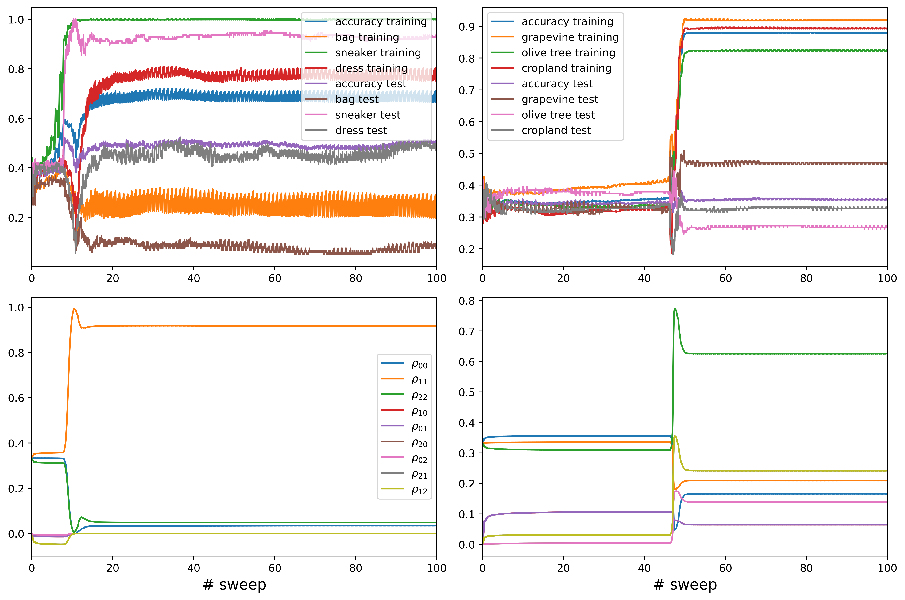
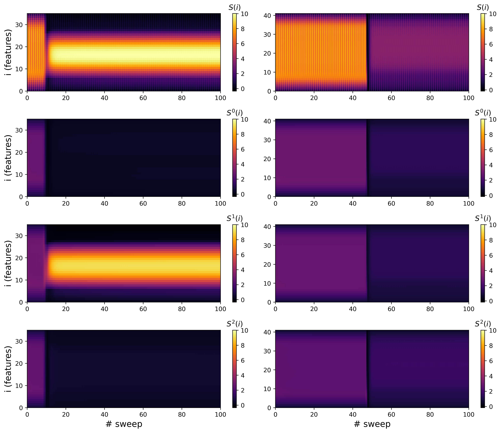

# Pomarico et al. 2025 — Transfer entropy and O-information to detect grokking in tensor network multi-class classification problems

See also: [the global concept index](../../concepts/index.md).

**Domenico Pomarico**, **Roberto Cilli**, **Alfonso Monaco**, **Loredana Bellantuono**, **Marianna La Rocca**, **Tommaso Maggipinto**, **Giuseppe Magnifico**, **Marlis Ontivero Ortega**, **Ester Pantaleo**, **Sabina Tangaro**, **Sebastiano Stramaglia**, **Roberto Bellotti**, **Nicola Amoroso** (University of Bari and INFN, Bari section).

arXiv [2507.23346](https://arxiv.org/abs/2507.23346), July 2025 (v1), 18 pages, 7 figures (15 files). Citations by Semantic Scholar — 2, in the corpus — 0. A direct continuation of 2503.10483 by the same Bari group: the same MPS classifier trained by sweeps, the same fashion MNIST, but with the task moved from two classes to three — precisely because the O-information is defined for three variables. The claim: grokking in tensor-network learning is recognised by two information measures — the transfer entropy between the label masks (directed "causal" links) and the O-information between the output scores (a change of synergy into redundancy); the negative control is an overfitting hyperspectral PRISMA task, in which the O-information never crosses zero. The real novelty, unstated in the paper: the mark of grokking is now no longer the entanglement transition (the predecessor itself showed that it happens without grokking too — and PRISMA reproduces that here) but the sign of the O-information.

The files of this paper's analysis:

- [`2507.23346.transfer-entropy-and-o-information-to-detect-grokking-in-tensor-network-multi-class-classification-problems.license.txt`](2507.23346.transfer-entropy-and-o-information-to-detect-grokking-in-tensor-network-multi-class-classification-problems.license.txt) — the arXiv licence record for this paper.

The anchor scheme and the rules for linking into a card are in the [README of the papers folder](../README.md).

**Excerpt card.** The paper's licence (`arxiv-nonexclusive`) does not permit republishing the paper itself; what stands here are the editorial sections and the fragments the corpus quotes (right of quotation). The paper: <https://arxiv.org/abs/2507.23346>.

## Concepts covered

**[Grokking](../../concepts/grokking.md)** — the word is carried over to a setting in which not one part of its own definition holds: the authors' formulation from the introduction ("a delayed but sudden improvement of the generalisation after the training data have been fitted") is not realised in their own experiment — the training sample is never memorised (the overall training accuracy levels off at ~70 %), and the jumps on the training and the test sets happen *simultaneously*, at sweeps 8–12 ([`p8-1`](#p8-1)); the claimed gain in generalisation is about eight percentage points over a randomly taken MPS. The analysis: with the training and the test jumping simultaneously, what is observed is not separated from ordinary training with a sharp transition; from Power et al. essentially only the word is borrowed — there is no modular arithmetic, no SGD, no weight decay and no plateau at a full training accuracy.

**[Phase transition](../../concepts/phase-transition.md)** — a second example of an entanglement transition in an MPS *without* a gain on an independent sample: the overfitting hyperspectral PRISMA task exhibits a sharp synchronous transition around sweep 45–50 — in the entropy, in the magnetisation of all three masks at once and in the density matrix — even though the overall test accuracy after the transition actually falls ([`p8-2`](#p8-2)); this reproduces the chief negative conclusion of the predecessor 2503.10483 ("grokking entails an entanglement transition, but not the other way round"), which is, however, not named here. The analysis: in the abstract and the discussion the transition in fashion MNIST is described as "a sharp fall out of the volume law", whereas by the paper's own figure the entropy in the middle of the chain *rises* after the transition to the top of the scale — the correct description ("the entanglement localises in the subspace of label 1") appears only in the results section.

**[Progress measures](../../concepts/progress-measures.md)** — two information measures are proposed as marks of generalisation: the O-information of the three output scores changes sign from synergy to redundancy simultaneously with the jump of the accuracy in fashion MNIST (from $\approx-0.66$ to a peak of $\approx 0.32$ around sweep 8–11), while in the overfitted PRISMA it rises by almost as much but does not cross zero ([`p13-2`](#p13-2)); the transfer entropy between the masks is declared evidence of a "causal hierarchy" — the sneaker mask governs the dress mask ([`p12-1`](#p12-1)). The analysis: the qualitative difference between the tasks comes down to the crossing of zero at a comparable size of the jump; a "statistically significant causal influence" is $z\approx 1.5$ ($p\approx 0.13$) with no threshold and no correction for 60 comparisons, and the curves $TE_{1\rightarrow 0}$ and $TE_{0\rightarrow 1}$ within the task itself practically coincide — the asymmetry is taken entirely from the comparison with PRISMA; and the spread band of the O-information over the six permutations measures only the noise of the estimator, since the quantity itself does not depend on the order of the variables (as the paper says).

**[Vision and real data](../../concepts/vision-real-world-data-mnist-cifar.md)** — a three-class fashion MNIST $6\times 6$ (dress/sneaker/bag, 36 qubits, 10 % of the sample — an order of magnitude more data than in the predecessor) with a deliberately "confusing" class: the bag scores below 10 % on the test set — markedly *worse* than the chance 33 %, that is, the predictions on that class are systematically opposite to the truth ([`p7-10`](#p7-10)); the negative control is the hyperspectral PRISMA imagery (43 features after a Boruta selection, the labels vineyard/olives/arable land). The analysis: between the two cases the subject, the nature of the noise, the number of features and the number of examples all differ at once — the conclusion that "the structure of the data, not the architecture of the model, governs the appearance of interpretable dynamics" is not separable from the other differences; and there are no seeds, no repeats (one run per task), and neither $\chi$ nor the learning rate appears in the text.

## What is shown and what is conjectured

These are the card editor's remarks, not the authors' text, drawn from a numbered pass over the paper's claims.

**The strong points — the carrying of the O-information over to the output scores, and a second counterexample to entanglement as a mark.** The O-information of a classifier's output scores as a possible mark of generalisation is a new instrument for the line of information measures (the line itself goes back to Clauw/Stramaglia 2408.08944: Stramaglia is a co-author here too); PRISMA gives the corpus a second example of an entanglement transition in an MPS without a gain on an independent sample, strengthening the negative conclusion of 2503.10483. The move to three classes is honestly motivated by the lower bound of the definition of the O-information.

**"Grokking" here is a word, not a phenomenon.** The authors' own definition from the introduction holds in not one of its parts: the training sample is not fitted (70 % on the training set), and there is no delay (the training and test jumps are simultaneous). The size of the effect is eight percentage points of the overall test accuracy; the "confusing" class is in fact anti-predicted (below 10 % against a chance 33 %).

**The statistics of the measures do not sustain the paper's own claims.** A "significant causal influence" at $z\approx 1.5$ with no threshold and no correction for 60 comparisons; there is no asymmetry of the TE within the task — the difference of the z-scores is taken from a comparison of two tasks; the monotone growth of the TE with the lag in both tasks is not checked against surrogates and may be a property of the KSG estimator; the "spread" band of the O-information measures the noise of the estimator; a "predictive peak" is claimed from two runs with no definition of a peak. The abstract contradicts the results: "entanglement compression" against a growth of the entropy in the middle of the chain. There is no code, no number of sweeps, no $\chi$ and no $\alpha$.

**How the work will be cited** ("it is shown that grokking is accompanied by a transition from synergy to redundancy") — more precisely: in a single run of a three-class fashion MNIST $6\times 6$ task the sign of the O-information changes around sweep 8 simultaneously with a jump of the accuracy on both the training and the test sets, while in the hyperspectral task it is compared against the O-information changes by almost as much but does not cross zero.

---

# Quoted fragments

Only the fragments the corpus cards refer to are
reproduced here (right of quotation); the paper's licence does not permit
republishing the whole text. Anchor numbering matches the original.

###### p7-10

In the top left panel the performance on fashion MNIST is characterized in terms of the overall training and test accuracy, plotted alongside the per-class performance. Sneaker class achieves the highest performance, with the test accuracy stabilizing around $90\%$. Dress class follows with a slightly lower performance.These patterns yield a grokking transition based on an effective features extraction useful for unseen data. **[p. 8]** Bag class performs poorly as a confounding case, with training accuracy around $25\%$, with oscillations, and test performance reaching a value even smaller than $10\%$.

###### p8-1

The general training accuracy increases steadily and saturates near $70\%$, but the test accuracy is limited by the poor generalization of the bag class. Oscillations and performance disparities suggest insufficient data quality for certain classes imposed by image rescaling. The MPS classifier handles sneakers and dresses well, likely due to distinguishable features consisting in horizontally and vertically elongated shapes in rescaled pixel space. However, bags are harder to distinguish.

###### p8-2

In the top right panel, the performance on hyper-spectral land cover classification is shown. There is a sharp transition in accuracy around sweep 45, indicating a shift in the overfitting regime, since the test performances are low. Grapevine achieves the highest training accuracy (around $90\%$) and test accuracy around $50\%$. Olive tree performs moderately, with almost $80\%$ training and $35\%$ test accuracy. Cropland performs the worst, with lowest test accuracy around $28\%$. The generalization gap is more pronounced than in the fashion MNIST task.

In bottom panels the reduced density matrix in the label subspace is characterized. On the left for fashion MNIST, the evolution of the $3\times 3$ reduced density matrix shows diagonal elements ($\varrho_{00},\varrho_{11},\varrho_{22}$) representing class populations: $\varrho_{11}$ corresponding to sneaker saturates around 0.95, while $\varrho_{00}$ and $\varrho_{22}$ are much lower. Off-diagonal elements (e.g. $\varrho_{12},\varrho_{01}$) decrease and stabilize near zero, so the model reaches a nearly classically separable form in the label subspace. Off-diagonal suppression indicates vanishing label entanglement, meaning that the model makes confident, distinct predictions for each input. On the right for land cover classification, a sudden jump near sweep 45 aligns with the accuracy jump. After this transition the diagonal elements stabilize to less balanced values (e.g. $\varrho_{00}$ around $0.6$, others $0.2$), while off-diagonal elements (e.g. $\varrho_{12},\varrho_{01}$) remain significant, some up to $0.2$. Unlike the fashion MNIST task, the land cover model retains quantum coherence in the label subspace. This suggests that the classifier operates in a superposed decision space, potentially due to the overlap in spectral features between the vegetation types.

*Figure 3: Performance analysis of two quantum MPS classifiers on 3-class problems: Fashion MNIST (left) and hyperspectral land cover classification (right). Top panels show overall and per-class training/test accuracies. Bottom panels display the evolution of the reduced density matrix elements in the label subspace.* **[p. 8]**

**[p. 9]**

###### p10-1

The right column refers to the land cover classification, where all three quantum masks undergo a sharp and synchronized transition in their local magnetizations at approximately sweep 50. This transition is abrupt and coherent across the three labels, resulting in simultaneous polarization across many features. Before sweep 50, magnetizations are close to zero for all classes, indicating the model is in an unstructured or pre-learning phase. After sweep 50, all masks acquire relatively uniform and structured magnetization patterns, though with subtle differences in magnitude.

*Figure 5: Entanglement entropy $S(i)$ along the MPS chain during training for fashion MNIST (left) and land cover classification (right). The top row shows total entropy, while rows 2-4 display label-resolved components: label 0 for dress/cropland, label 1 for sneaker/olive tree, label 2 for bag/grapevine.* **[p. 10]**

Unlike the fashion MNIST task, the masks for land cover classification display collective behavior, with a global learning transition likely triggered by a structural modification in the training process. The absence of delay between label activations suggests that the model required a global capacity boost to start encoding meaningful class distinctions, reflecting the presence of an overfitting regime, as shown in Figure 3.

Figure 5 illustrates the evolution of the entanglement entropy along the MPS chain during training sweeps. The vertical axis corresponds to the site index $i$ (i.e. feature index) and each panel shows the local bipartite von Neumann entropy, capturing the degree of entanglement across a cut in the MPS at the edge between site $i$ and $i+1$.

Left column refers to the fashion MNIST task, while the right column to the hyper-spectral land cover classification. The top row describes total entanglement entropy $S(i)$ for the full output state. From the second up to the fourth row we have label-specific contributions **[p. 11]** $S^{\ell}(i)$, ordered as follows: dress / cropland, sneaker / olive tree, bag / grapevine.

In both tasks, the top row clearly displays a transition from a high-entropy, volume law regime at early sweeps to a lower-entropy, sub-volume law regime as training progresses [34]. This is typical of MPS initialization with random parameters, where entanglement is initially extensive across the chain. As training optimizes the tensor network, the system moves toward a more structured state that requires less entanglement, indicating emergent efficient interactions among features required to minimize the cost function.

Initially, for fashion MNIST all positions exhibit high entanglement, consistent with a volume law state. As training progresses (especially by sweep around 10), entanglement becomes highly localized. The third row, corresponding to label 1 (sneaker), dominates the entropy dynamics. It maintains high entropy centered along the chain, indicating non-trivial internal correlations within the label-1 subspace. After the transition, two regions with high local magnetization become weakly entangled, consistent with effective feature segmentation. The other labels (0 = dress, 2 = bag) show negligible entropy after early sweeps, indicating that those subspaces become effectively decoupled from the evolving state. The MPS optimization concentrates most of the entanglement in the subspace associated with label 1 (sneaker), suggesting that this class is the dominant attractor in the learned representation.

The initial state for land cover classification exhibits a broad, uniform volume law entanglement across the MPS chain as well. At sweep around 50, a sharp drop in entropy is observed, consistent with a collective transition already seen in the magnetization and accuracy plots. After the transition, all labels exhibit low entanglement across the chain, with no particular label dominating the entropy budget. The near-flat, low-entropy pattern reflects the model’s attempt to suppress complexity and extract spatially coarse features. Unlike fashion MNIST, the learning here leads to an overall reduction in entanglement across all class subspaces, consistent with overfitted data representations.

###### p12-1

In fashion MNIST, the strong $TE_{1\rightarrow 0}$ signal implies that the learning dynamics of the sneaker mask (label 1) drives or conditions those of the dress mask (label 0). This supports earlier observations that label 1 dominates both magnetization and entropy dynamics. The asymmetry of transfer entropy confirms a causal hierarchy: the sneaker mask organizes meaningful features early, and this structure propagates to influence other masks. In hyper-spectral classification, the flat transfer entropy curves point to a more synchronized or globally entangled evolution, with no single mask strongly conditioning the others.

This analysis demonstrates that transfer entropy between quantum masks can reveal asymmetric causal dependencies in the learning process. For fashion MNIST, label 1 (sneaker) emerges as a dynamical driver, with $TE_{1\rightarrow 0}$ being the most statistically robust and interpretable signature. In contrast, the hyperspectral task exhibits a more balanced and collective mask interaction, lacking clear causal dominance. These findings provide a dynamical fingerprint of how quantum models internally organize information during training, potentially guiding task-specific architecture adjustments or mask pruning strategies.

###### p13-2

Corresponding to the entanglement transition, leading to grokking in the fashion MNIST task (top panel), a sharp transition occurs around sweep 8-9. The O-information jumps into the positive regime, peaking significantly before stabilizing. This transition coincides with earlier observations of improved accuracy, magnetization structure, and entanglement collapse. The shift to positive O-information reflects a regime dominated by redundancy. In contrast, the hyperspectral task (bottom panel) shows a more gradual transition around sweep 46, without reaching positive values. The O-information remains negative even after the transition, suggesting that the learned representations maintain synergistic, entangled relationships more typical of a random or overfitted classifier. This aligns with previous observations of weak causal mask interactions, low label-specific magnetization polarization, and flat transfer entropy curves. In both cases it is possible to identify a moderate peak forecasting the transition jump during the previous MPS sweep.

The O-information offers a compact global measure of the nature of inter-dependencies in the model output: a positive O-information (redundancy) is provided by predictive outputs highly coordinated and mutually informative, a signature of successful learning, while a negative O-information (synergy) among predictive outputs expresses **[p. 14]** complementary, distributed information. The clear divergence between the two tasks highlights the qualitative difference in learning behavior: fashion MNIST exhibits a grokking transition, with outputs reorganizing toward redundancy and predictability, the hyperspectral model, even after fitting, retains features of a disordered system, with scores synergy, indicating limited generalization.

This analysis of O-information complements earlier metrics (accuracy, entropy, magnetization, transfer entropy), revealing that fashion MNIST undergoes a coherent learning transition to redundancy-dominated dynamics, while hyperspectral classification remains trapped in a synergistic, less interpretable regime. The O-information thus acts as a powerful high-order probe for emergent structure and model interpretability in QML.
