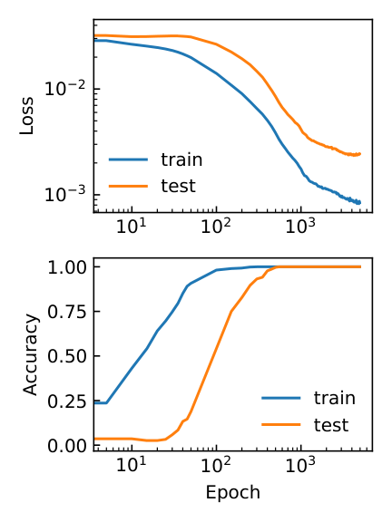
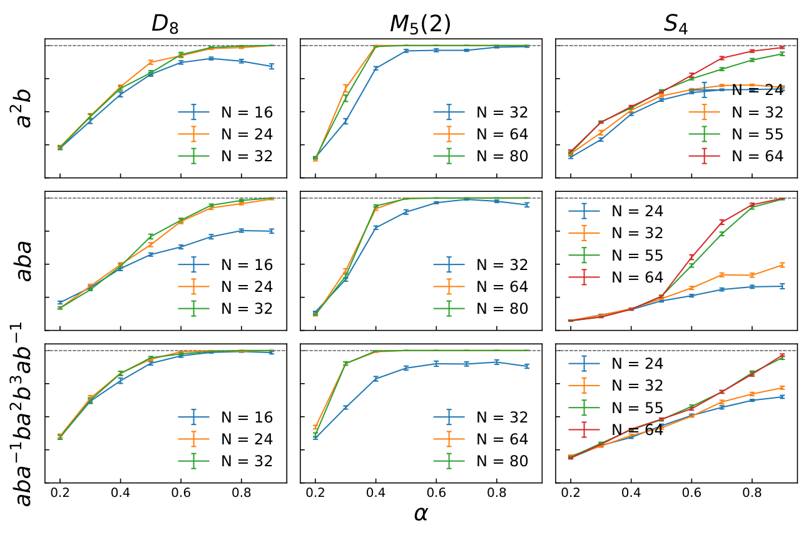
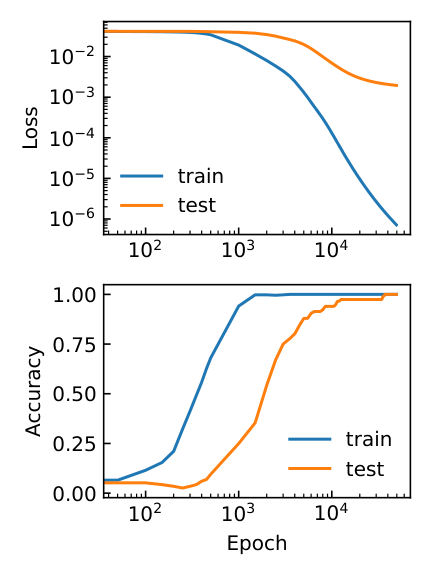
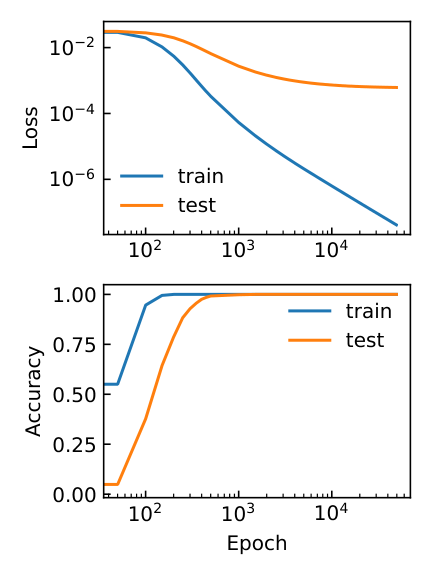

# Shutman, Louidor & Tessler 2025 — Learning words in groups: fusion algebras, tensor ranks and Grokking

See also: [the global concept index](../../concepts/index.md).

**Maor Shutman**, **Oren Louidor** (the Technion), **Ran Tessler** (the Weizmann Institute).

arXiv [2509.06931](https://arxiv.org/abs/2509.06931), September 2025, 41 pages, 31+ figures, 5 appendix tables. Citations by Semantic Scholar — 2, in the corpus — 1. The task of group multiplication is extended to an arbitrary **word** $w$ in the letters $a,b,a^{-1},b^{-1}$: a two-layer network learns any word in any finite group at a sufficient width — and groks while doing so. The mechanism: the task is rewritten as the realisation of a 3-tensor whose rank is typically small thanks to the fusion structure of the group; in the case of plain multiplication the network realises an efficient matrix multiplication in Strassen's sense. The line of the argument: the fusion rules make the bsc support of the word's tensor sparse, the sparsity gives a small rank, a small rank requires a small width, and a small width is the cause of the generalisation.

The files of this paper's analysis:

- [`2509.06931.learning-words-in-groups-fusion-algebras-tensor-ranks-and-grokking.license.txt`](2509.06931.learning-words-in-groups-fusion-algebras-tensor-ranks-and-grokking.license.txt) — the arXiv licence record for this paper.

The anchor scheme and the rules for linking into a card are in the [README of the papers folder](../README.md).

**Excerpt card.** The paper's licence (`arxiv-nonexclusive`) does not permit republishing the paper itself; what stands here are the editorial sections and the fragments the corpus quotes (right of quotation). The paper: <https://arxiv.org/abs/2509.06931>.

## Concepts covered

**[Group representations](../../concepts/group-representations-cosets.md)** — a direct continuation of the representational line of Chughtai et al. with two new notions: the **fusion algebra** of the group and the **tensor rank** of the task. The combinatorial fusion cover (CFC), defined solely through the fusion table, contains the true bsc$^{3}$ support of the word's tensor ([`p10-3`](#p10-3)); it is precisely the fusion structure that is named as the cause of the sparsity of the support and, further, of the network's ability to learn the word. The GCR algorithm turns out to be the special case $n_{a}=n_{b}=1$, and the characteristic formula $\chi_{\phi}(abc^{-1})$ coincides with its logit rule ([`p3-2`](#p3-2)).

**[Groups and non-commutative composition](../../concepts/group-composition-non-commutative-s5.md)** — the task is extended from multiplication to arbitrary words: $S_{4}$, $D_{8}$, $M_{5}(2)$, $Q_{8}$, $A_{5}$ and words up to $aba^{-1}ba^{2}b^{3}ab^{-1}$; Gromov's TLP model learns every (group, word) pair at a sufficient width ([`p5-9`](#p5-9), [`fig-2`](#fig-2)). The key link for the corpus: "the width of the network = the rank of the tensor realised" — the surrogate HD model at width $m$ realises exactly the 3-tensors of rank at most $m$ ([`p13-5`](#p13-5)).

**[Fourier features](../../concepts/fourier-features-circuits.md)** — Gromov's Fourier ansatz is explained as the case $G=\mathbb{Z}_{p}$ of a general bsc decomposition; in the case of multiplication the support is diagonal, $\{(\phi,\phi,\phi)\}$, and the network finds Strassen-like low-rank realisations of the bsc projections: the empirical minimum width coincides exactly with the theoretical rank bound ($D_{16}$ — 7 against 7, $\mathbb{Z}_{32}$ — 3 against $\le 3$, $Q_{8}$ — 8 against 8) ([`p18-1`](#p18-1), [`fig-10`](#fig-10)) — a rare case in which a prediction of the mechanism is checked by a number.

**[Grokking](../../concepts/grokking.md)** — it stands in the title but gets no analysis of its own: it was "often observed" in the TLP experiments ([`p5-9`](#p5-9)) and "confirmed" for the HD model ([`p14-1`](#p14-1), [`fig-9`](#fig-9)); neither the size of the delay nor its dependences are measured, and the authors state outright that the mechanism by which gradient descent arrives at a low-rank solution is not analysed — there is no proof even for $\mathbb{Z}_{p}$ ([`p20-2`](#p20-2)). All that is said about the mechanism of the arrival: the mono-bsc-aligned configurations are stable under GD, and the dynamics splits into independent problems per bsc ([`p17-1`](#p17-1)).

**[Weight decay](../../concepts/weight-decay.md)** — the grokking here arises **without** weight decay and without any explicit regularisation: pure GD for the HD model "to avoid unrelated effects" ([`p5-6`](#p5-6)), AdamW without weight decay for the TLP ([`p38-2`](#p38-2)); the authors do not note this circumstance, although for the corpus it is a contested point.

## What is shown and what is conjectured

These are the card editor's remarks, not the authors' text, drawn from a numbered pass over the paper's claims.

**All four main conclusions of the experimental part are a "Suggested General Principle".** The authors declare them suppositions rather than theorems; none of them has a proof. The only formal link between the surrogate HD model and the original TLP is lemma 4.6 (a TLP with a quadratic activation at double the width reproduces any HD); there is no converse statement, for the other activations there is no link at all, and the transfer of the conclusions to the TLP is "initial experiments".

**The strongest point is the exact coincidence of the numbers.** As soon as the width reaches the theoretical bound of Prop 5.2, a run appears with a loss below $10^{-6}$: $D_{16}$ — 7 at 7, $\mathbb{Z}_{32}$ — 3 at $\le 3$, $Q_{8}$ — 8 at 8, $M_{5}(2)$ — 21 at $\le 21$. The Strassen bound, however, contains an unknown quantity: $m_{d}$ (the rank of the tensor of $d\times d$ matrix multiplication) is not known at large $d$, neither in value nor in growth exponent.

**Grokking is linked to the mechanism only by proximity.** The title and the abstract link the low-rank mechanism with grokking, but all that is shown is that both are present in the same runs; a joint measurement (the moment of the transition against the moment the block structure appears) is never made. There are no interventions at all — no ablation of the bsc components, no forced substitution of rows: every argument about the mechanism is observational. The methodological conclusion of Stander et al. — that a mechanism remains a theory until it is checked by interventions — applies literally; the work of Stander et al. itself and the coset explanation are not mentioned.

**A reading by eye.** The bsc support of a row is read off a heat map "whenever there was a clear separation", with the recurring caveat "ignoring negligible noise" — with no threshold and no statistics. SGP 1 ("the ranks of word tensors are small") is inferred from six pairs, one of which contradicts it noticeably ($S_{4}$ with a long word: 446 against 576). The general gain that is proved is small (Cor 4.5: $|G|(|G|-1)+1$); every substantial reduction is a case-by-case count. In the terminal weights an additional vanishing is acknowledged which does not follow from the combinatorics of the fusion.

**Minor mismatches.** At the start of section 5 the generalisation to general groups is attributed to "Nanda et al [24]" — but [24] is about progress measures, and general groups are in [5] (Chughtai, Chan, Nanda); the caption of fig. 8 for ($aba$, $S_{4}$) gives a width $N=55$ against $N=64$ in the table of the same figure. The observation SGP 4 (that the set of learned bsc's is determined "somehow" by the initialization) independently reproduces the conclusion of Chughtai et al. about weak universality, but is not named as such.

**How the work will be cited** ("it is shown that grokking in groups is explained by a low-rank tensor structure") — more precisely: it is shown that the word's tensor is low-rank for fusion reasons and that the surrogate HD model finds exactly such solutions on nine (word, group) pairs; grokking is merely noted as present, and the question of why gradient descent arrives at a low-rank solution, and why with a delay, is declared open.

---

# Quoted fragments

Only the fragments the corpus cards refer to are
reproduced here (right of quotation); the paper's licence does not permit
republishing the whole text. Anchor numbering matches the original.

###### p3-2

Next we turn to apply our theory to the case of the group multiplication studied in previous works. In this case, the bsc-support of the word tensor is composed of triplets of bscs where all the components are the same, and our general theory gives rise to a class of low rank representations, which coincides with the ones found by Nanda [5] and Gromov [13]. We then derive theoretical bounds on the rank of the word tensor, by bounding the tensor rank of the components in its bsc-support. The latter involve the (generally unknown) tensor rank of matrix multiplication as an implicit constant. Bounds on the latter are known since the work of Strassen [30] (see also [25] for a more modern survey). The rank of word tensor directly relates to the width of the model, required to fulfill the learning task.

Turning to experiments, we again switch first to the HD model where the correspondence with the theory is more direct. The class of representations mentioned above is implemented by this model via, what we call, mono-bsc-aligned weight configurations. In such weight configurations corresponding rows of the weight matrices belong to the subspace of the same unique bsc. We show that the space of such weight configurations is stable under a step of gradient based optimization algorithms. We use this to argue that, starting from an initial weight configuration, the dynamics effectively decouples, with each subset of rows of the weight-matrices, corresponding to the same bsc, evolving independently as a stand alone model, minimizing the corresponding projection of the total loss.

This observation has two consequences. First, it allows us to study each bsc-component of the low-rank representation of the word tensor independently. Remarkably, again, we find that our rank bounds are often met (at least in the dimension where this can be verified), showing that the network discovers the minimal-rank matrix multiplication tensor on its way to finding a low rank solution to the full problem. Second, the observation reveals aspects of the mechanism by which the model reaches its terminal weight configuration. Starting from a random initialization, as the model evolves, the rows of the weight matrices partition in tandem to subsets which correspond to different bscs. Then for each such subset the model effectively evolves independently, by minimizing the corresponding bsc-loss, using as many rows as assigned under this partition. As in the general case, we show that this also happens with a strict subset of the dataset and under the TLP model as well.

###### p5-6

To avoid unrelated effects, in most experiments we use pure Gradient Descent without acceleration or additional regularization. Formally, given learning rate $\eta>0$, and sample set $\mathcal{S}$, the one-step gradient descent evolution is the function ${\rm GD}\equiv{\rm GD}_{f,\eta,\mathcal{S}}:\mathcal{W}\to\mathcal{W}$ given by

$$
{\rm GD}_{f,\eta,\mathcal{S}}(W):=W-\eta\nabla_{w}L_{f}(\mathcal{S};W)\,. \tag{9}
$$

For $t\in{\mathbb{N}}$, We shall write ${\rm GD}^{t}$ for the $t$-time composition of ${\rm GD}$ with itself, so that ${\rm GD}^{t}(W)$ is the the weights of the model after $t$ steps of gradient descent, starting from $W$.

Initial weights are chosen from the centered Gaussian distribution with variance inversely proportional to the width, as customary.

###### p5-9

We first tested whether the TLP model with standard activation functions can learn a word operation when trained on a a subset of the full dataset. We tried several groups and words. The former includes cyclic groups, abelian and non-abelian (see Section 3 for the precise definitions). The latter includes words of different lengths. Initialization and optimization as indicated in Subsection 2.1.6. The results, a partial account of which is given in Figure 2, clearly showed that the model is able to robustly learn all groups and words, once the width of the network is sufficiently large (depending on the group, word and activation function). Grokking was also frequently observed.

| Group | Word | $N$ | Activation | $\alpha$ | Median final test accuracy | Max. final test accuracy | Max. final train loss |
|---|---|---|---|---|---|---|---|
| $D_{8}$ | $a^{2}b$ | 48 | ReLU | 0.8 | 0.923077 | 1 | 0.00022 |
| $D_{8}$ | $aba^{-1}ba^{2}b^{3}ab^{-1}$ | 32 | square | 0.6 | 1 | 1 | 7.6e-05 |
| $D_{8}$ | $aba^{-1}ba^{2}b^{3}ab^{-1}$ | 48 | sigmoid | 0.7 | 1 | 1 | 0.00027 |
| $M_{5}(2)$ | $aba^{-1}ba^{2}b^{3}ab^{-1}$ | 64 | ReLU | 0.5 | 0.996094 | 1 | 0.00089 |
| $M_{5}(2)$ | $aba$ | 64 | ReLU | 0.7 | 1 | 1 | 0.0038 |
| $M_{5}(2)$ | $a^{2}b$ | 64 | square | 0.5 | 1 | 1 | 0.00034 |
| $S_{4}$ | $aba$ | 64 | square | 0.7 | 0.979769 | 1 | 0.00061 |
| $S_{4}$ | $a^{2}b$ | 196 | sigmoid | 0.8 | 0.982759 | 1 | 3.7e-05 |

###### fig-2

*Figure 2. *Left: Training results using the TLP model on various words and groups. $\alpha$ is fraction of samples given during test. Learning rate is 0.005, optimizer is AdamW. 20 runs per configuration. Right: Loss and accuracy evolution during training for the group $M_{5}(2)$, word $aba$ with the TLP model of width $N=64$, and the ReLU activation function, and with $\alpha=0.7$ fraction of the samples as the training set.** **[p. 6]**

###### p10-3

A key point is that the fusion structure of $G$ restricts the above set considerably. Recall that ${\rm bscs}^{m}(T)$ and ${\rm bscs}(\phi)$ denote the (subspaces associated with the) bscs in the direct sum decomposition of (the subspace associated with) $m$-tensor $T$ and sc representation $\phi$. Define

$$
{\rm bscs}^{3}_{\mathcal{CFC}}(\delta_{G,w}):=\Big\{(\phi,\psi,\zeta)\in{\rm bscs}(G)^{3}:\>\phi\in{\rm bscs}\big(\zeta^{\otimes n_{a}(w)}\big)\,,\,\,\psi\in{\rm bscs}\big(\zeta^{\otimes n_{b}(w)}\big)\Big\}\,, \tag{24}
$$

where $n_{a}(w)$ and $n_{b}(w)$ are the number of appearances of $a^{\pm 1},$ and $b^{\pm 1}$ in $w$, respectively. We shall call the above set the *Combinatorial-Fusion-Cover* (or CFC) of the bsc3-support of $\delta_{G,w}$. The name is explained by,

###### p13-5

where $X_{i,:}$ denotes the $i$-th row of matrix $X$. Thus, the set of tensors which can be implemented by HD models with width $m$ is precisely the set of all $3$-tensors in $(\mathbb{R}^{G})^{\otimes 3}$ of rank at most $m$. Formally,

$$
\Big\{T^{\rm HD}_{W}:\>W\in\mathcal{W}_{G,m}\Big\}=\Big\{T\in({\mathbb{R}}^{G})^{\otimes 3}:\>{\rm rank}(T)\leq m\Big\}\,. \tag{38}
$$

We also define the *bsc3 box-set* of an HD model with weights $W$ as

$$
{\rm bscs}^{3}_{\square}(W)=\Big\{{\rm bscs}(A_{i,:})\times{\rm bscs}(B_{i,:})\times{\rm bscs}(C_{i,:}\big)\Big\}_{i=1}^{m}\,. \tag{39}
$$

It follows straightforwardly from (37) that the latter is a box cover of ${\rm bscs}^{3}(T^{\rm HD}_{W})$, namely

$$
{\rm bscs}^{3}(T^{\rm HD}_{W})\subseteq{\rm bscs}^{3}_{\square}(W)\,. \tag{40}
$$

Lastly, we have the following lemma which shows that expressive power of the TLP model with the square activation function $\sigma(s)={\rm sqr}(s)=s^{2}$ is at least as strong as that of the Hadamard model.

###### p14-1

Lastly, we checked empirically whether the HD model reaches a generalizing solution given only a subset of the dataset, and moreover, whether the terminal weight configuration reached is the same as that in the case of the full sample set (albeit perhaps less pronounced). We also verified that the usual Grokking phenomenon is still exhibited when the learning task is of general group words. The answer to all of these questions turns out to be positive, as can be seen, for example. from Figure 9. We remark that both the maximal fraction of held train samples which still allow for full generalization and the level of pronunciation of the grokking features, depend on the group, word and width, and can be quite low in some cases. See Appendix B.2 for additional plots.

Finally, initial experiments involving the TLP model with various activation functions indicate that a similar principle to the one above also holds in this case, albeit with more “noise” appearing in the terminal weight configuration. The box-cover which dominates the terminal weight configuration is often slightly different than the case of the HD model. We expect that the reason is that activation functions have low degree polynomial approximations, e.g. via Taylor expansion, and that replacing the activations by the approximations yield relatively low rank tensors which can be analyzed using the fusion tools developed in this work. See Subsection 7.3 for further discussion and Appendix B.3 for heatmaps of the terminal weights under the TLP model.

###### fig-9

*Figure 9. *Left: Final test accuracy, for different groups, widths $N$ and train fractions, as average over $20$ runs of GD for the HD-model starting from a random initialization and using a random train-test split. Error bars mark one standard deviation. Right: The evolution of train/test loss/accuracy during training in one run for $G=S_{4},w=aba,\alpha=0.8,N=64$ (left column) and $G=M_{5}(2),w=aba^{-1}ba^{2}b^{3}ab^{-1},N=80,\alpha=0.4$ (right column).** **[p. 15]**

###### p17-1

The following proposition shows the stability of bsc-alignment under GD. Together with Decomposition (48) and (50) this gives the decoupling of the dynamics along different bscs of $G$. Recall that $W|W^{\prime}$ denotes concatenation of (weight) matrices.

###### fig-10

*Figure 10. *Top: Terminal bsc-loss in repeated (20-100) runs of the model for various groups and bscs as a function of the width of the network, with initial weights chosen randomly from $R_{\phi}$. The minimal loss is marked with a blue diamond. Bottom: Minimal number of rows needed in order to have at least one run (among 20-100 tried) with terminal bsc-loss $<10^{-6}$. Accuracy and bsc-loss are those at the end of one such run. The theoretical minimal number of rows for achieving noticeably low bsc-loss is computed using Proposition 5.2** **[p. 17]**

**[p. 18]**

###### p18-1

Figure 10 shows the terminal loss as a function of the width of the model, in repeated runs (20-100, depending on the group and bsc) of the above experiment for different choices of groups and bscs. As can be seen from the plots, as soon as the number of rows reaches the theoretical value given by the r.h.s. of (45) in Proposition 5.2, a run whose terminal loss is noticeably low was observed. A table summarizing the empirical minimal number of rows required to achieve a low bsc-loss per group and bsc is included in the figure as well. The results thug suggest:

###### p20-2

This work exposed a class of low-rank implementations for the word-tensor which the HD model can represent. The existence of such implementation is likely a necessary condition a model to able to represent a generalizing solution with limited width. This work did not address, however, the mechanism-by-which and reason-for-which such a solution is reached via gradient descent, for a general word. Mathematically, it is not clear why (approximations of) those low-rank sparse-bsc-support implementations of the word tensor appearing in Suggested General Principle 2 should be globally (not just locally) attractive. A proof for this is missing even in the simple case of group multiplication on ${\mathbb{Z}}_{p}$. In the case of the multiplication word, the decoupling of the dynamics starting from a mono-bsc-aligned configuration reduces the analysis to the, seemingly tractable case of a single-bsc.

###### p38-2

*Left:* Training results on various groups. 20 runs per group and activation function, using the AdamW optimizer without weight decay, batch size of 16, and 5000 epochs. *Right:* Projection (in absolute value) of the terminal weights of the rows of matrices $A$, $B$ and $C$ (Y-axis) on the matrix entries of all bscs of the group as ${\mathbb{R}}^{G}$-vectors (X-axis; entries of the same bsc are adjacent to each other) in one run of training for (${\mathbb{Z}}_{56}^{\times}$, square), ($S_{4}$, square), ($S_{4}$, Relu) (top to bottom). The resulting blocks correspond exactly to the different bscs of the group.

| Group | $N$ | Activation | Learning rate | Weight init. STD | Min. final accuracy | Median final accuracy | Max. final loss |
|---|---|---|---|---|---|---|---|
|  | 24 | ReLU | 0.001 | 0.2 | 0.947917 | 0.998264 | 0.025 |
| $\mathbb{Z}_{56}^{\times}$ | 24 | sigmoid | 0.005 | 0.2 | 0.972222 | 1 | 0.024 |
|  | 24 | square | 0.001 | 0.2 | 1 | 1 | 0.013 |
|  | 48 | ReLU | 0.001 | 0.14 | 0.973765 | 0.98968 | 0.011 |
| $\mathbb{Z}_{91}^{\times}$ | 48 | sigmoid | 0.005 | 1 | 1 | 1 | 0.01 |
|  | 48 | square | 0.001 | 0.14 | 1 | 1 | 0.0085 |
|  | 32 | ReLU | 0.001 | 0.18 | 0.972656 | 0.988281 | 0.022 |
| $D_{16}$ | 32 | sigmoid | 0.005 | 0.18 | 0.990234 | 1 | 0.02 |
|  | 32 | square | 0.001 | 0.18 | 1 | 1 | 0.014 |
|  | 32 | ReLU | 0.001 | 0.18 | 0.921875 | 0.983507 | 0.025 |
| $S_{4}$ | 32 | sigmoid | 0.005 | 0.18 | 0.984375 | 0.998264 | 0.023 |
|  | 32 | square | 0.001 | 0.18 | 0.980903 | 1 | 0.02 |
|  | 90 | ReLU | 0.001 | 0.11 | 0.996944 | 0.999583 | 0.011 |
| $A_{5}$ | 90 | sigmoid | 0.005 | 1 | 0.998889 | 1 | 0.011 |
|  | 90 | square | 0.001 | 0.11 | 0.999722 | 1 | 0.01 |
|  | 32 | ReLU | 0.001 | 0.18 | 1 | 1 | 0.013 |
| $(\mathbb{Z}_{4}\times\mathbb{Z}_{2})$ | 32 | sigmoid | 0.005 | 0.18 | 1 | 1 | 0.016 |
| $\rtimes\mathbb{Z}_{2}$ | 32 | square | 0.001 | 0.18 | 1 | 1 | 1.3e-05 |
|  | 16 | ReLU | 0.005 | 0.25 | 0.96875 | 1 | 0.027 |
| $Q_{8}$ | 16 | sigmoid | 0.005 | 0.25 | 1 | 1 | 0.017 |
|  | 12 | square | 0.001 | 0.29 | 1 | 1 | 0.016 |
|  | 48 | ReLU | 0.001 | 0.14 | 0.992188 | 0.998047 | 0.016 |
| $M_{5}(2)$ | 48 | sigmoid | 0.005 | 1 | 0.963867 | 0.998047 | 0.016 |
|  | 48 | square | 0.001 | 0.14 | 1 | 1 | 0.0089 |

![[Uncaptioned image]](images/figC1a-abc_in_irrep_basis.png)

![[Uncaptioned image]](images/figC1b-abc_in_irrep_basis.png)

![[Uncaptioned image]](images/figC1c-abc_in_irrep_basis.png)

**[p. 39]**
