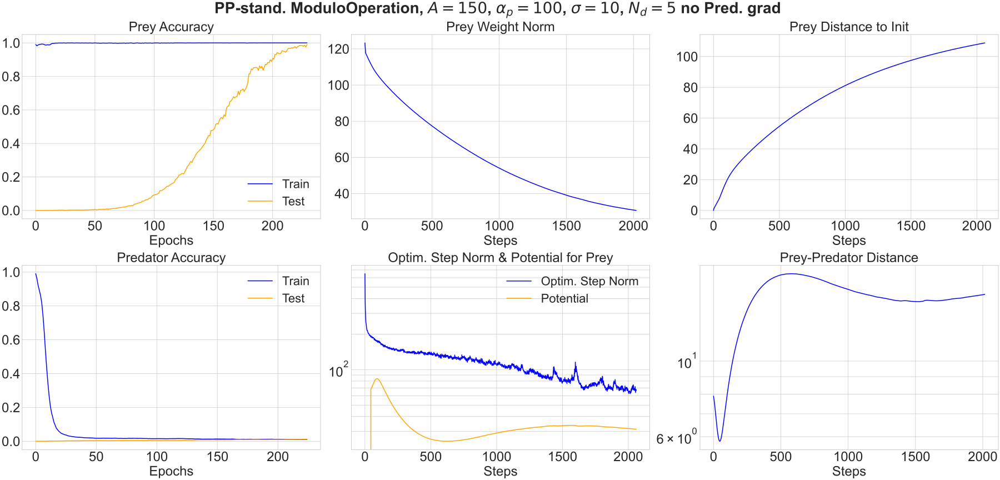
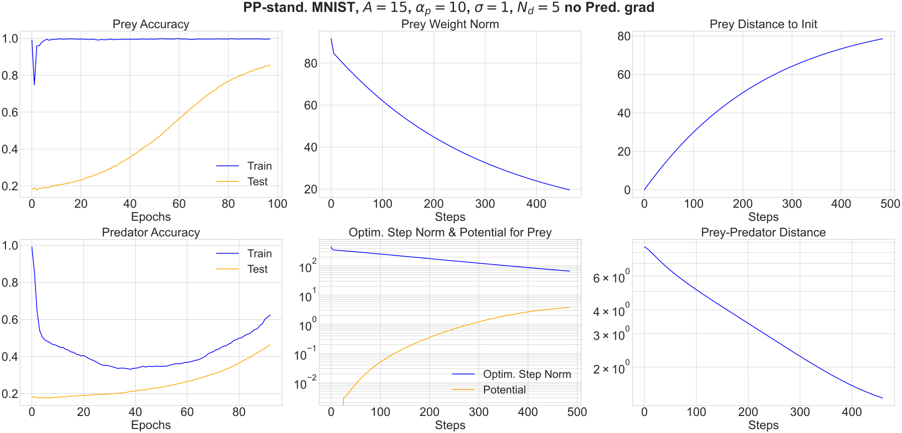
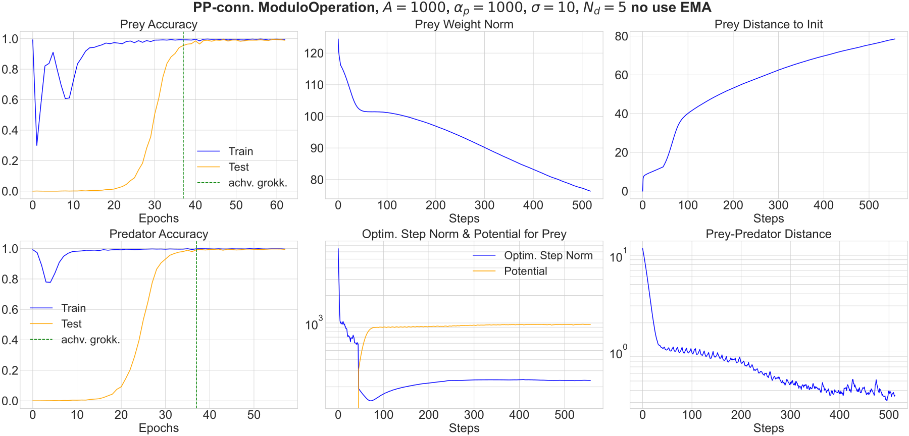
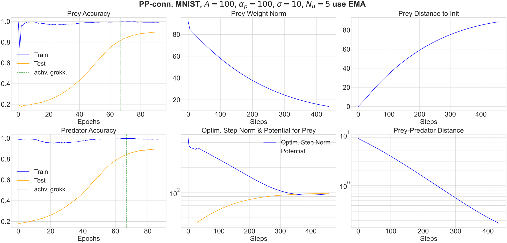
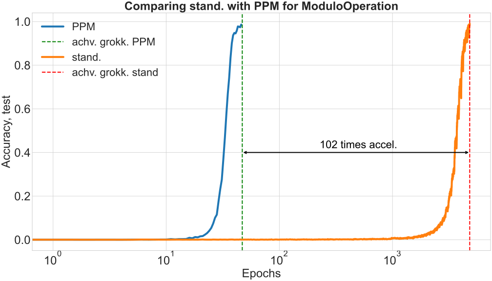
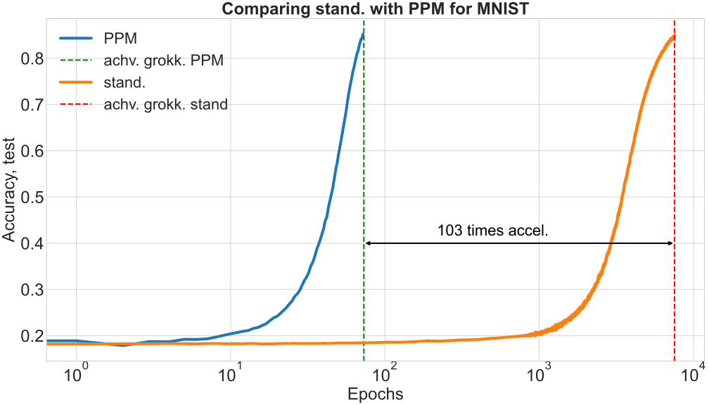
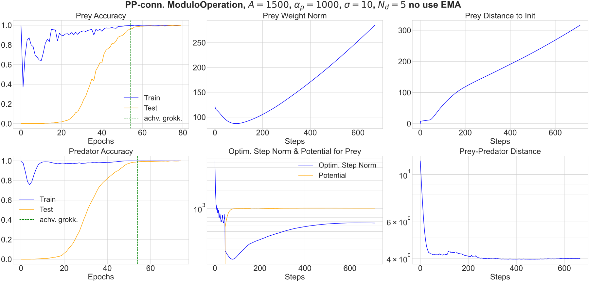
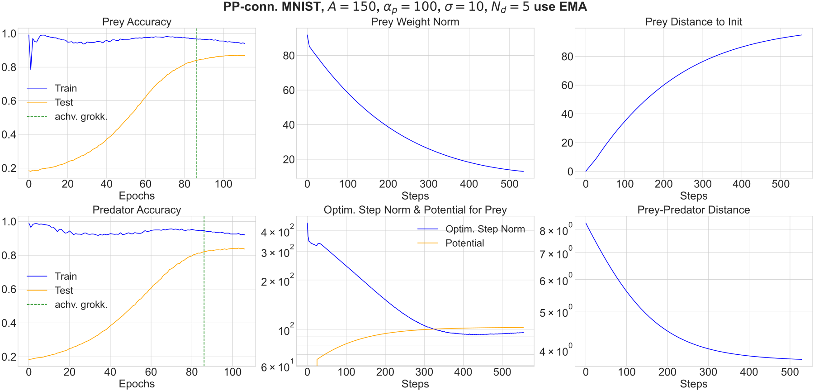
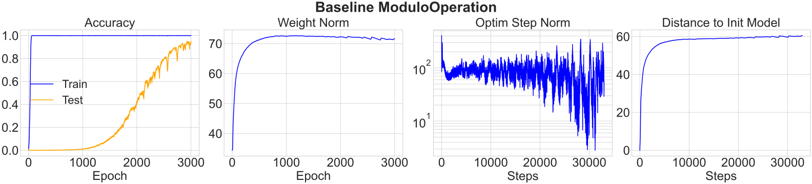

# Lopatin, Kozyrev & Pechen 2025 — Predator–Prey Model: Driven Hunt for Accelerated Grokking

See also: [the global concept index](../../concepts/index.md).

**I. A. Lopatin**, **S. V. Kozyrev** (Steklov Mathematical Institute of the Russian Academy of Sciences), **A. N. Pechen** (Steklov Institute; Ivannikov Institute for System Programming of the Russian Academy of Sciences).

arXiv [2509.10562](https://arxiv.org/abs/2509.10562), September 2025, 15 pages, 9 figures. Citations by Semantic Scholar — 2, in the corpus — 1. Grokking here is not explained but treated: having adopted the ravine picture from their own earlier works (the model falls to the bottom of a narrow ravine — the manifold of zero risk — and thereafter diffuses along the bottom as $\sqrt{t}$), the authors introduce a second agent, a "predator", which drives the "prey" along the ravine, turning the diffusion into transport (a "battue hunt"). On division modulo 97 (a transformer) and on MNIST by the Omnigrok recipe a speed-up of 20–100 times in the number of gradient calls is claimed; along the way the exponential dependence of the grokking time on the sample size and the linear one on the initial weight norm are confirmed numerically, and an example of grokking without a decrease of the weight norm is given.

The files of this paper's analysis:

- [`2509.10562.predator-prey-model-driven-hunt-for-accelerated-grokking.license.txt`](2509.10562.predator-prey-model-driven-hunt-for-accelerated-grokking.license.txt) — the arXiv licence record for this paper.

The anchor scheme and the rules for linking into a card are in the [README of the papers folder](../README.md).

**Excerpt card.** The paper's licence (`arxiv-nonexclusive`) does not permit republishing the paper itself; what stands here are the editorial sections and the fragments the corpus quotes (right of quotation). The paper: <https://arxiv.org/abs/2509.10562>.

## Concepts covered

**[Grokking](../../concepts/grokking.md)** — a role rare for the corpus: the phenomenon is taken as given, the explanation is borrowed wholesale from the authors' own works [7, 8, 14], and the problem is posed as an engineering one — to remove the delay. The claimed outcome: a speed-up of up to a hundred times in the number of gradient calls ([`p8-3`](#p8-3), [`fig-4`](#fig-4)). The numbers are worth reading with the caveats of the analysis: single runs; the interaction parameters are not given for the headline figure; and there is no comparison with the existing accelerators of grokking.

**[The loss landscape](../../concepts/loss-landscape-basins.md)** — the paper's working picture: learning with grokking is an optimisation over a ravine landscape; the fall into the ravine is the memorisation, the slow diffusion along the bottom ($\sqrt{t}$ instead of $t$) is the delay of generalisation, and the neighbourhood of the generalising solution is a region of raised entropy, out of which the transition is irreversible ([`p2-1`](#p2-1)). The whole thermodynamic part is taken from [7, 8] and is not checked here; the alignment of the "predator–prey" direction with the tangent to the manifold of zero risk is not measured.

**[Optimisers](../../concepts/optimizer-adam-adamw-sgd.md)** — the technique is built inside Adam/AdamW: after the usual step the prey receives an increment $\alpha P(d_{t})l_{t}$ with the potential $P(d)=Ae^{-d/\sigma}$, and the predator $\alpha\alpha_{p}l_{t}$ ([`p5-4`](#p5-4)); in the PP-conn variant the pair share the state of the moments, and with the predator's gradient switched off an iteration is no dearer than the base one ([`p7-4`](#p7-4)). The analysis notes: PP-conn changes three things at once relative to the baseline (a coupled weight decay instead of a decoupled one, the smoothing of the first moment switched off for ModuloOperation, and the drift), and there are no ablations.

**[Low-pass filtering of the gradient](../../concepts/gradient-low-pass-filtering.md)** — a neighbour in the line of grokking accelerators: as in Grokfast and NeuralGrok, the technique is inserted between the computation of the gradient and the step, but the source of the correction is different — an external drift from a second copy of the parameter vector, computed with no gradient at all; there are no extra gradient calls. Neither Grokfast nor NeuralGrok is cited, although Grokfast measures the speed-up on the very same two tasks — the work's principal defect at the level of the corpus.

**[Data fraction](../../concepts/data-fraction-critical-dataset-size.md)** — the prediction of [7, 8] is confirmed numerically: the grokking time decays exponentially with the fraction of the sample, $T_{g}\sim Be^{-\beta/\eta}$ (addition modulo 139, 3 runs per point) ([`p11-4`](#p11-4), [`fig-7`](#fig-7)). For the accelerated PPM regime no explicit dependence could be found — the ravine kinetics does not carry over to it ([`p11-5`](#p11-5)).

**[Initialisation scale](../../concepts/initialization-scale.md)** — the second axis of the same numerical study: the grokking time grows linearly with the initial weight norm ([`fig-7`](#fig-7)); the base times of $4\times 10^{3}$ and $8\times 10^{3}$ epochs depend strongly on the initialisation ([`p4-1`](#p4-1)). Grokking on MNIST is induced by the Omnigrok recipe — by multiplying the weights up after the initialisation ([`p14-2`](#p14-2)).

**[Weight norm minimisation](../../concepts/weight-norm-minimization.md)** — an incidental contesting observation: "a decrease of the weights is not obligatory at grokking" — a run with grokking and without a decrease of the norm is given ([`p12-1`](#p12-1), [`fig-8`](#fig-8)). It is a single run at $p=139$, $\beta=0.55$; together with the observation of NeuralGrok about the harmfulness of weight decay it undermines the norm explanation of Omnigrok.

## What is shown and what is conjectured

These are the card editor's remarks, not the authors' text, drawn from a numbered pass over the paper's claims.

**The speed-up is shown, the mechanism is taken on trust.** The only direct evidence of a ballistic motion is the plots of the "distance to the initial model": a comparable path over a markedly smaller number of steps. Neither the exponent of the growth of the path travelled ($\sqrt{t}$ against $t$) nor the alignment of the "predator–prey" direction with the direction of the ravine is measured; the thermodynamic story (the entropy, the irreversibility, the second law) is borrowed wholesale from [7, 8, 14].

**The speed-up numbers are single measurements.** There are no spread bars and no number of seeds for figures 1–6; an averaging over 3 runs is claimed only for figure 7. For the headline result of "about 100 times" (fig. 4) the values of $A,\sigma,\alpha_{p},N_{d}$ are given neither in the caption nor in the appendix. The speed-up is counted from the point after the memorisation, yet compared against the full time of the baseline.

**Three differences from the baseline at once.** PP-conn replaces AdamW's decoupled weight decay with a coupled one ($g\leftarrow g+\lambda p$), switches the smoothing of the first moment off for ModuloOperation (use_m=False) and adds the drift from the predator. There is no ablation, and the contribution of the "predator–prey" interaction proper is not isolated. In the steady regime ($d_{t}\to d_{*}=\sigma\ln(A/\alpha_{p})$) the prey and the predator receive the same increment $\alpha\alpha_{p}l_{t}$ — the technique degenerates into a constant drift along a stable direction, that is, into a relative of the ravine method of Gelfand and Tsetlin and of Nesterov's method, which the authors cite but do not compare themselves with.

**Internal inconsistencies.** The introduction calls the dependences of section 5 "proven", while section 5 itself is a numerical study with straight lines fitted over three runs per point. The text of section 4 says that "the gradient of the prey is used to compute the gradient of the predator", while line 33 of Algorithm 2 assigns $g^{p}\leftarrow 0$. Figure 6 is presented as a separate regime "for $A>\alpha_{p}$", although the caption of figure 2 already sets $\alpha_{p}=2A/3$.

**Missing neighbours.** Grokfast (2405.20233) and NeuralGrok (2504.17243) are not cited, even though Grokfast measures the speed-up on the very same two tasks (modular arithmetic and MNIST by the Omnigrok recipe). An indisputable advantage of PPM over both: there are no extra gradient calls at all, the price is only in memory. An unchecked alternative shared with Grokfast: there is no ablation against a plain strengthening of the momentum.

**How the work will be cited** ("grokking is sped up a hundredfold by a predator–prey model") — more precisely: on two tasks, in single runs, with the interaction parameters unstated for the headline figure and with three simultaneous differences from the baseline, the number of epochs to an accuracy threshold is cut by 20–100 times relative to one setting of AdamW; there is no comparison with the existing accelerators.

---

# Quoted fragments

Only the fragments the corpus cards refer to are
reproduced here (right of quotation); the paper's licence does not permit
republishing the whole text. Anchor numbering matches the original.

###### p2-1

When optimizing over a ravine landscape using the stochastic gradient descent procedure, the system quickly falls into a ravine, and then performs random walks (Brownian motion) along the ravine. Such random walks are significantly slower compared to gradient descent since the traveled distance is proportional to the time for gradient descent and to the square root of the time for Brownian motion. Thus, learning gets stuck in the ravine, which explains the delay in the generalization during grokking. Falling into the ravine corresponds to the sample memorization phase during learning, and grokking corresponds to a slow motion along the ravine until reaching the neighborhood of the optimal solution (i.e. generalization). In this case, the neighborhood of the optimal solution has increased entropy, which entails the irreversibility of the transition to generalization during grokking due to the second law of thermodynamics [7, 8].

###### p4-1

Repeating the runs, we find that the number of optimizer epochs before reaching the ”generalization” phase is about $4\times 10^{3}$ for ModuloOperation and $8\times 10^{3}$ for MNIST. This number of iterations is strongly influenced by the initial initialization, in particular by the initial weight norm of the model. Therefore, models with the same architecture but with different initialization methods can demonstrate significantly different grokking times.

###### p5-4

The predator–prey interaction is directed along the predator–prey direction (unit vector) $l_{t}$, the predator chases the prey with velocity $\alpha_{p}$ and the prey chases away with velocity defined as

$$
P(d)=Ae^{-\frac{d}{\sigma}}, \tag{1}
$$

where $A$ is the strength of the predator–prey interaction, $\sigma$ is the effective radius of the **[p. 6]** predator–prey interaction, and $d$ is the predator–prey distance. We will call $P(d)$ as the potential of the predator–prey interaction.

The Algorithm 1 can be used to train the initial, randomly initialized model as shown in Fig. 9, but in practice it turned out to be more efficient to first training the model to achieve zero-risk manifold using the standard single-agent method, and only then introducing the predator.

###### p7-1

The results of the additional training using the Algorithm 1 are shown in Fig. 2. These graphs show the results of training without calling the gradient for the predator. In other words, one epoch of training in the graphs in Fig. 2 contains the same number of gradient calls as one epoch in the graphs in Fig. 1. Thus we see that the Algorithm 1 speeds up the training process by 20 times for ModuloOperation and by 80 times for MNIST in terms of the number of calls to the loss function gradient.

###### p7-4

In this section, we present a modified version of the PPM algorithm demonstrating even higher efficiency. In this modified version, we use an Adam-like optimization method, but instead of the two optimizers as in Algorithm 1 we use a single optimizer, and both the predator and the prey have access to its state — the gradient for the prey is used to compute the gradient for the predator. This approach reduces the number of gradient calls by twice compared to the case where gradients are computed for both the predator and the prey.

**[p. 8]**

**Algorithm 2** PP-conn.

1: **Hyperparameters:** $\alpha$, $\lambda$, $b_{1},b_{2}$, $\epsilon$, $A,\alpha_{p},\sigma$, $N_{d}$, use_m, GradPred
2: **Input:** $\theta_{0}$
3: **function** P($d$) $\triangleright$ Potential func.
4: **return** $A\cdot e^{-\frac{d}{\sigma}}$
5: **end** **function**
6: $m_{t}\leftarrow 0$, $v_{t}\leftarrow 0$, $t\leftarrow 0$ $\triangleright$ Init momenta
7: **procedure** UpdateAdam($p$, $g$, $t$)
8: $g\leftarrow g+\lambda p$ $\triangleright$ Adam-style weight decay
9: **if** use_m **then**
10: $m_{t}\leftarrow b_{1}m_{t-1}+(1-b_{1})g$
11: **else**
12: $m_{t}\leftarrow g$
13: **end** **if**
14: $v_{t}=b_{2}v_{t-1}+(1-b_{2})g^{2}$
15: $\hat{m}_{t}\leftarrow m_{t}/(1-b_{1}^{t})$
16: $\hat{v}_{t}\leftarrow v_{t}/(1-b_{2}^{t})$
17: $p\leftarrow p-\alpha\hat{m}_{t}/(\sqrt{\hat{v}_{t}}+\epsilon)$
18: **return** $p$
19: **end** **procedure**
20: **Initialize:** $\theta_{t}\leftarrow\theta_{0}$
21: $y_{t}\leftarrow\theta_{0}$ $\triangleright$ init predator vector
22: **for** $t=1$ **to** $N_{d}$ **do**
23: $g\leftarrow\nabla\mathcal{L}(\theta_{t-1})$
24: $\theta_{t}\leftarrow$ UpdateAdam($\theta_{t-1}$, $g$, $t$)
25: **end** **for**
26: $x_{t}\leftarrow\theta_{t}$ $\triangleright$ init prey vector
27: **for** $t=N_{d}+1$ **to** … **do**
28: $g\leftarrow\nabla\mathcal{L}(x_{t-1})$
29: $x_{t}^{\prime}\leftarrow$ UpdateAdam($x_{t-1}$, $g$, $t$)
30: **if** GradPred **then**
31: $g^{p}\leftarrow\nabla\mathcal{L}(y_{t-1})$
32: **else**
33: $g^{p}\leftarrow 0$
34: **end** **if**
35: $y_{t}^{\prime}\leftarrow$ UpdateAdam($y_{t-1}$, $g^{p}$, $t$)
36: $d_{t}\leftarrow|x_{t}^{\prime}-y_{t}^{\prime}|$
37: $l_{t}\leftarrow(x_{t}^{\prime}-y_{t}^{\prime})/d_{t}$
38: $x_{t}\leftarrow x_{t}^{\prime}+\big(\alpha\cdot P(d_{t})\big)l_{t}$
39: $y_{t}\leftarrow y_{t}^{\prime}+\big(\alpha\cdot\alpha_{p}\big)l_{t}$
40: **end** **for**

###### p8-3

The results of training with the Algorithm 2 are shown in Fig. 4. Since the gradient for the predator is not called, for both ModuloOperation and for MNIST we get an acceleration of grokking of about 100 times in the number of iterations.

###### fig-4

*Figure 4: Training with PP-conn. In both cases we do not call the gradient for the predator. For the MNIST task we use exponential moving average (EMA) for the first moment, for the ModuloOperation we do not use it. The quantities on the plots are the same as on Fig. 2.* **[p. 9]**

**[p. 9]**

The acceleration obtained in comparison with the standard approach is shown in Fig. 5.

*Figure 5: Graphical comparison of the acceleration obtained by PP-conn. with standard approach for ModuloOperation (left) and MNIST (right) tasks.* **[p. 9]**

*Figure 6: Training for PP-conn for $A>\alpha_{p}$. The quantities on the plots are the same as on Fig. 2. We perform additional optimizer epochs after achieving grokking phase to show that accuracy does not decrease.* **[p. 10]**

**[p. 10]**

###### fig-7

*Figure 7: Grokking time dependence for addition modulo 139. Left: (in logarithm of the number of epochs) on the sample size $\beta$, which is the proportion of training and test data compared to the maximal possible sample. It shows linear decrease with $\beta$. Right: on the initial weight model norm. It shows linear growth with weight norm. Each point is obtained by averaging over 3 runs.* **[p. 11]**

###### p11-4

The obtained dependencies are shown in Fig. 7. The results show that the obtained values are well approximated by straight lines. Thus we obtain the exponential law for the time necessary to achieve grokking (in iterations) $T_{g}\sim Be^{-\frac{\beta}{\eta}}$, where $B$ and $\eta$ are some coefficients. For the analysis of the grokking time dependence on the initial weight model norm we use a moderate averaging over 3 runs for each point which already demonstrates a good linear behavior shown in the right subplot of Fig. 7.

###### p11-5

For the PPM with algorithm 2 we have not been able to find an explicit dependence of the number of grokking iterations on the sample size.

**[p. 12]**

###### p12-1

It is interesting to note that weight reduction is not mandatory in grokking. An example of such behavior is the experiment from the Section 5, where $p=139,\beta=0.55$, with the results shown in Fig. 8.

###### fig-8

*Figure 8: An example of training with grokking for the ModuloOperation problem without reducing the weight norm.* **[p. 12]**

###### p14-2

For MNIST, a multilayer perceptron with one hidden state was trained (the number of inputs and outputs of the hidden state was set to 200), and the ReLU function was taken as the nonlinearity between the layers. The default uniform initialization was used. In Grokking4, the following steps were taken to achieve the grokking effect in this problem, which we repeat in our work. 1) Instead of the full training sample of 60,000 images, a subsample of 1,000 images was taken. 2) Instead of CrossEntropy, which is usually used in classification, the squared deviation of the MSE was taken as the loss function. 3) softmax was not used at the output layer for mapping to the probability space. 4) After initialization, the model weights were additionally multiplied by a specified coefficient in order to increase the weight norm of the original model.
