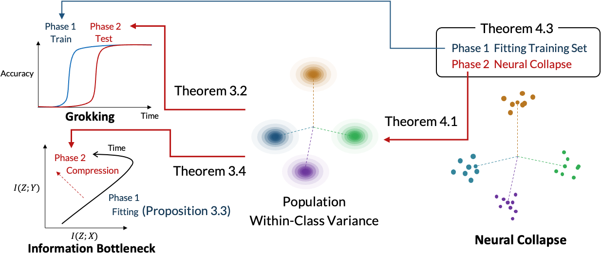
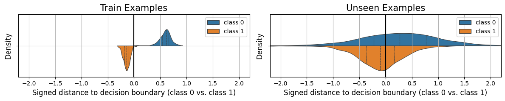
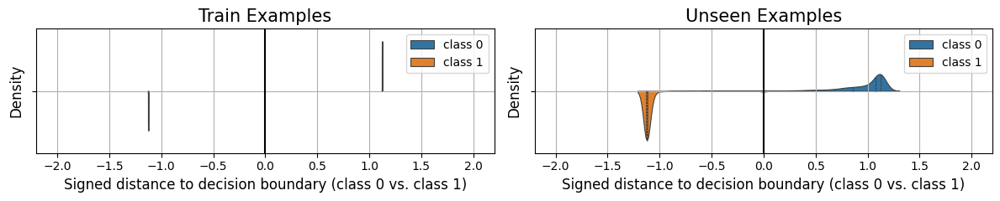
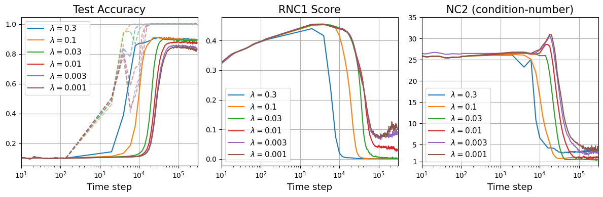

# Sakamoto, Sato 2026 — Explaining Grokking and Information Bottleneck through Neural Collapse Emergence

See also: [the global concept index](../../concepts/index.md).

**Keitaro Sakamoto, Issei Sato** (The University of Tokyo).

arXiv [2509.20829](https://arxiv.org/abs/2509.20829), 25 September 2025 (version v2). Published at ICLR 2026. 2 citations — the thirty-fifth most cited work in the corpus. The source is the native arXiv HTML of version v2.

The files of this paper's analysis:

- [`2509.20829.explaining-grokking-and-information-bottleneck-through-neural-collapse-emergence.license.txt`](2509.20829.explaining-grokking-and-information-bottleneck-through-neural-collapse-emergence.license.txt) — the arXiv licence record for this paper.

The anchor scheme and the rules for linking into a card are in the [README of the papers folder](../README.md).

**Excerpt card.** The paper's licence (`arxiv-nonexclusive`) does not permit republishing the paper itself; what stands here are the editorial sections and the fragments the corpus quotes (right of quotation). The paper: <https://arxiv.org/abs/2509.20829>.

## Concepts covered

**[Neural collapse](../../concepts/neural-collapse.md)** — the work makes it a **unifying** explanation of two late-era phenomena at once. The key move is to separate the measures: instead of the customary NC1 (the ratio of the within-class variance to the between-class one) a **rescaled NC1** is introduced ($\mathrm{RNC1}=\operatorname{Tr}({\boldsymbol{\Sigma}}_ {W})/B_{g}^{2}$), which isolates the within-class variance alone ([`p6-6`](#p6-6)). The distinction is substantial: NC1 does not vanish when all the features contract to a single point, since it also absorbs the separation of the class centres ([`p6-6`](#p6-6)).

**[The manifold and the compression of the representation](../../concepts/manifold-representation-compression.md)** — the central quantity of the whole work: the **population within-class variance** of the representations, taken in a scale-invariant form ([`p4-1`](#p4-1)). Both bounds are expressed through it: the one on the generalisation error and the one on the excess information. The authors state separately that the measure is not introduced ad hoc but arises out of the analysis of the dynamics of the second phase ([`p4-1`](#p4-1)).

**[Generalisation bounds](../../concepts/generalization-bounds.md)** — theorem 3.2 gives an upper bound on the error probability through two conditions: the alignment of the class means of the representations with the weights of the last layer, and the smallness of the population within-class variance ([`p4-6`](#p4-6)). It matters that the second condition works independently of the properties of the classifier ${\boldsymbol{W}}$ ([`p4-6`](#p4-6)). Theorem 4.1 converts the population quantity into an empirical one to within $O(1/\sqrt{n_{c}})$ through the Rademacher complexity ([`p6-3`](#p6-3)).

**[Grokking](../../concepts/grokking.md)** — the explanation comes down to a **difference of time scales**: the training loss converges within $\Omega(\eta^{-1}\log(1/\epsilon_{1}))$ steps while RNC1 converges within $\Omega((\lambda\eta)^{-1}\log(1/\epsilon_{2}))$, and the second may be much larger than the first at a small weight decay ([`p7-2`](#p7-2), [`p7-5`](#p7-5)). Hence a direct prediction: grokking is the case $\tau_{1}\ll\tau_{2}$ ([`p7-7`](#p7-7)).

**[Weight decay](../../concepts/weight-decay.md)** — here it governs **not whether** the transition happens but **when** it happens: the time scale of the convergence of RNC1 is inversely proportional to $\lambda$ ([`p7-5`](#p7-5)). The experiment confirms this: a stronger weight decay brings the moment of grokking closer and narrows the gap between the saturation of the training accuracy and the generalisation ([`p8-2`](#p8-2), [`fig-3`](#fig-3)).

**[The information bottleneck](../../concepts/information-bottleneck.md)** — the second half of the work. Proposition 3.3 shows that a phase of growing mutual information is necessary if the network discards information at initialisation ([`p5-4`](#p5-4)), and theorem 3.4 bounds the **excess** information $I(Z;X\mid Y)$ by the same population within-class variance ([`p5-6`](#p5-6)). The compression phase of the IB dynamics and the delayed generalisation of grokking thereby receive one and the same cause.

**[Progress measures](../../concepts/progress-measures.md)** — the practical corollary is stated outright: tracking the rescaled within-class variance tells one when continuing the training will be useful ([`p10-1`](#p10-1)).

**[Phase transition](../../concepts/phase-transition.md)** — the transition is described not as a jump in the landscape but as a **lag** of one process behind another: the fitting of the output is passed on to the representation space through the development of the weight balance ${\boldsymbol{W}}_ {L}^{\top}{\boldsymbol{W}}_ {L}\approx{\boldsymbol{W}}_ {L-1}{\boldsymbol{W}}_ {L-1}^{\top}$ ([`p21-9`](#p21-9)).

**[Memorisation](../../concepts/memorization-phase.md)** — the picture of the overfitting phase is shown vividly: the training examples are separated while the unseen ones have a large within-class variance, whence the many errors; as the training proceeds the training representations contract into points, and the contraction is partly inherited by the distribution ([`p8-1`](#p8-1), [`fig-2`](#fig-2)).

**[Real data](../../concepts/vision-real-world-data-mnist-cifar.md)** — the setting is taken from Liu et al. (2023a): a four-layer MLP on MNIST, the initialisation multiplied by 8, AdamW, 1000 training objects ([`p7-10`](#p7-10)). The checks are extended to Fashion-MNIST, a CNN, a ViT, three text benchmarks and a ResNet18 on CIFAR-10 ([`p25-4`](#p25-4), [`p29-2`](#p29-2), [`p31-1`](#p31-1)).

**[Flatness and the loss landscape](../../concepts/loss-landscape-basins.md)** — appendix A is given over entirely to an analysis of the concurrent work of Han et al. (2025). The argument runs thus: they measured the collapse through the NCC, which conflates several properties, and the NCC also picks up the separation of the class means that arises naturally during fitting — which is why it falls earlier than the test loss ([`p16-1`](#p16-1)). By isolating the within-class variance alone, the authors obtain a quantity whose fall coincides with the generalisation.

**[The neural tangent kernel](../../concepts/neural-tangent-kernel-ntk.md)** — the dynamics is derived not from an unconstrained-features model but from actual gradient descent, following Jacot et al. (2025), under assumptions of a pyramidal architecture, a smooth activation and a particular initialisation ([`p21-9`](#p21-9)).

**[Modular arithmetic](../../concepts/modular-arithmetic.md)** — it is deliberately absent here, and the reason is named: modular addition is closer to regression than to classification, since the outputs have an ordinal structure, whereas the analysis is conducted for classification ([`p25-4`](#p25-4)).

It is worth saying separately what the work does **not** contain. There is no grokking on algorithmic tasks — that setting is placed outside the scope ([`p25-4`](#p25-4)). Nor is there grokking on the CNN and the ViT: there the test accuracy rises simultaneously with the training one, and on the ViT the RNC1 quantity actually diverges from the accuracy, so that the explanation has to run through NC1 ([`p26-3`](#p26-3), [`p28-2`](#p28-2)).

Cards of corpus papers: [Power et al. 2022](../2201.02177.grokking-generalization-beyond-overfitting-on-small-algorithmic-datasets/2201.02177.grokking-generalization-beyond-overfitting-on-small-algorithmic-datasets.card.md) — the original phenomenon; [Liu et al. 2022](../2205.10343.towards-understanding-grokking-an-effective-theory-of-representation-learning/2205.10343.towards-understanding-grokking-an-effective-theory-of-representation-learning.card.md) — the representational view with which the work aligns itself; [Omnigrok](../2210.01117.omnigrok-grokking-beyond-algorithmic-data/2210.01117.omnigrok-grokking-beyond-algorithmic-data.card.md) — the MNIST setting with an enlarged initialisation, taken over in full; [Han et al. 2025](../2509.17738.flatness-is-necessary-neural-collapse-is-not-rethinking-generalization-via-grokking/2509.17738.flatness-is-necessary-neural-collapse-is-not-rethinking-generalization-via-grokking.card.md) — the concurrent work whose title the paper examines and contests; [Varma et al. 2023](../2309.02390.explaining-grokking-through-circuit-efficiency/2309.02390.explaining-grokking-through-circuit-efficiency.card.md) and [DeMoss et al. 2024](../2412.09810.the-complexity-dynamics-of-grokking/2412.09810.the-complexity-dynamics-of-grokking.card.md) — the explanations through parameter compression and complexity, named in the survey; [Kumar et al. 2023](../2310.06110.grokking-as-the-transition-from-lazy-to-rich-training-dynamics/2310.06110.grokking-as-the-transition-from-lazy-to-rich-training-dynamics.card.md) — the transition from the kernel regime to the rich one, named as the nearest line.

## What is shown and what is conjectured

The card editor's remarks following the analysis of the claims (`…claims.txt`). The work is theoretical-cum-experimental: four propositions, one new measure and checks on six settings.

**The unification of two phenomena is the main contribution, and it is honestly built.** Both the bound on the generalisation error ([`p4-6`](#p4-6)) and the bound on the excess information ([`p5-6`](#p5-6)) are expressed through one and the same quantity rather than through two similar ones. This makes the claim checkable: if the within-class variance falls, both indicators must improve at once — which is what figures 3 and 4 show.

**The separation of NC1 and RNC1 is a subtle and decisive move.** It is precisely what removes the apparent contradiction with Han et al. ([`p16-1`](#p16-1)): the NCC and NC1 absorb the separation of the class centres, which arises already during fitting, whereas RNC1 does not. The argument is convincing, but it also shows how much the conclusions in this literature depend on the choice of measure: two works on the same data arrive at opposite titles.

**The time scales are the strongest part of the theory.** Theorem 4.3 gives not "RNC1 decreases" but two different orders: $\Omega(\eta^{-1}\log(1/\epsilon_{1}))$ against $\Omega((\lambda\eta)^{-1}\log(1/\epsilon_{2}))$ ([`p7-2`](#p7-2)). Hence a refutable prediction — strengthening the weight decay brings the grokking closer — and it is confirmed ([`p8-2`](#p8-2)).

**The assumptions of theorem 4.3 are stringent and borrowed.** A pyramidal architecture ($d_{1}\geq N$), a smooth activation with $\sigma'\in[\gamma,1]$, a particular condition on the initialisation and a quadratic loss ([`p21-9`](#p21-9)). The authors discuss their replaceability in detail and note that the second part of the analysis does not depend on them — but the experiments run with ReLU and AdamW, that is, outside the scope of the assumptions.

**The upper bound of theorem 3.4 is admitted to be loose.** Only the intermediate bound is tight; the passage through $\log\det({\boldsymbol{A}}+{\boldsymbol{I}})\leq\operatorname{Tr}({\boldsymbol{A}})$ gives no equality ([`p18-4`](#p18-4)). In its place something weaker but useful is proved: a reduction of the variance along any coordinate lowers both bounds ([`p18-5`](#p18-5)).

**The estimation of the mutual information is a known weak point, and the work admits it.** The autoencoder-based estimates give **negative** values where the quantity is non-negative ([`p9-2`](#p9-2)); the authors explain this by the separate estimation of the entropy terms and hedge with a second measure (nHSIC). The hedge is right, but the conclusions about the compression phase lean on two approximate measures rather than on one exact one.

**The negative results are given in full, and that is a rarity.** On the CNN there is no grokking ([`p26-3`](#p26-3)); on the ViT there is none, and in addition RNC1 diverges from the accuracy, so that the explanation has to run through NC1 ([`p28-2`](#p28-2)); on three text datasets there is no grokking, only a gradual improvement ([`p29-2`](#p29-2)). The work does not hide these cases but builds them into the explanation — though for the ViT at the price of switching to the very measure it had distanced itself from.

**Grokking is reproduced in one setting only.** All the positive observations are an MLP with the initialisation multiplied by 8 and 1000 training objects on MNIST and Fashion-MNIST ([`p7-10`](#p7-10), [`p25-3`](#p25-3)). This is the Omnigrok setting, deliberately arranged so that a delay arises; the work gives no example of a delay of its own under natural conditions.

**The algorithmic tasks are excluded by an argument worth weighing.** Modular addition is declared "closer to regression" because of the ordinal structure of its outputs ([`p25-4`](#p25-4)). The argument is contestable: throughout the corpus this task is solved as a classification over $p$ labels, and the order of the labels is not used by the model. The exclusion is convenient for the theory but leaves outside its scope exactly the case on which grokking was discovered.

**Its place in the corpus.** The work gives the first explanation linking grokking to the **information bottleneck** through a common quantity, and it does so with derived time scales rather than with an observed coincidence. Also valuable for the corpus is the direct collision with Han et al.: two concurrent works arrive at opposite titles, and the difference comes down to what exactly is called a measure of collapse. The price: the sole setting in which grokking arose at all, approximate estimates of the mutual information, and theorem assumptions that do not hold in the authors' own experiments.

---

# Quoted fragments

Only the fragments the corpus cards refer to are
reproduced here (right of quotation); the paper's licence does not permit
republishing the whole text. Anchor numbering matches the original.

###### p1-2

The training dynamics of deep neural networks often defy expectations, even as these models form the foundation of modern machine learning. Two prominent examples are grokking, where test performance improves abruptly long after the training loss has plateaued, and the information bottleneck principle, where models progressively discard input information irrelevant to the prediction task as training proceeds. However, the mechanisms underlying these phenomena and their relations remain poorly understood. In this work, we present a unified explanation of such late-phase phenomena through the lens of neural collapse, which characterizes the geometry of learned representations. We show that the contraction of population within-class variance is a key factor underlying both grokking and information bottleneck, and relate this measure to the neural collapse measure defined on the training set. By analyzing the dynamics of neural collapse, we show that distinct time scales between fitting the training set and the progression of neural collapse account for the behavior of the late-phase phenomena. Finally, we validate our theoretical findings on multiple datasets and architectures.

###### p1-3

Deep neural networks (DNNs) have demonstrated remarkable success across a variety of tasks, including computer vision, natural language processing, and reinforcement learning, yet their training dynamics under gradient descent often reveal unexpected behavior. In particular, when training continues beyond the point where the training loss has been sufficiently reduced, several intriguing late-phase phenomena have been reported. One such phenomenon is *grokking* (Power et al., 2022), where models initially converge to an overfitting solution that perfectly fits the training data but fails to generalize to unseen data. However, when training continues for a sufficiently long time, the models unexpectedly generalize. Another example is the *information bottleneck* (IB) framework (Tishby et al., 2000; Tishby and Zaslavsky, 2015; Shwartz-Ziv and Tishby, 2017), an information-theoretic perspective on representation learning in DNNs that formalizes the goal of retaining task-relevant information while compressing the task-irrelevant input information. One particularly intriguing observation here is that DNNs do not move directly toward an IB-optimal solution; instead, they first enter a fitting phase where they memorize the training data, followed by a later compression phase in the later training stage during which task-irrelevant input information is discarded.

Taken together, these phenomena share the characteristic that the network evolves toward a more desirable state in the late phase of training, suggesting that some internal change occurs within the training dynamics during this transition. However, the mechanisms driving these phenomena, as well as their relationships, remain poorly understood. Bridging this gap is essential for deepening our understanding of DNN training and for developing more effective training strategies.

###### p1-5

In this work, we focus on the geometric structure of the network’s representation space and, for the first time, demonstrate that the dynamics of *neural collapse* (Papyan et al., 2020) provide a unified explanation for these late-phase phenomena, offering new insights into their underlying mechanisms. More specifically, the contributions of this work are summarized as follows.

**[p. 2]**

###### p2-1

- First, we show that the contraction of within-class variance in representations plays a crucial role in both grokking and IB dynamics. Specifically, for grokking, we derive an upper bound on the generalization error in terms of the population within-class variance of the learned representations (Theorem 3.2). Similarly, for the IB principle, we show that the redundant information in the representations, which is discarded in the IB compression phase, is bounded by the population within-class variance (Theorem 3.4). These results motivate the analysis of neural collapse, whose properties include the collapse of empirical within-class representations in the training data, known as NC1 (Section 3).
- Second, we provide a quantitative analysis of the discrepancy between the population within-class variance and its empirical counterpart, using an approach analogous to generalization error analysis (Theorem 4.1). This allows us to evaluate to what extent the reduction of empirical within-class variance, that is, the progression of neural collapse, implies a corresponding reduction in the population within-class variance, a key quantity we identified. In this way, we relate the behaviors of grokking and IB dynamics to the development of neural collapse (Section 4.1).
- Finally, building on the preceding results, we analyze the development of neural collapse by explicitly tracking the dynamics of gradient descent. Leveraging the results of Jacot et al. (2025), we establish that the empirical within-class variance decreases during training and characterize its time scale (Theorem 4.3). In particular, depending on the strength of weight decay, the time scale on which neural collapse is sufficiently realized can lag far behind the time scale of fitting the training data. This result suggests that the timing of neural collapse emergence underlies the delayed generalization in grokking as well as the compression phase in IB dynamics (Section 4.2).

*Figure 1: Conceptual relationships in the late-phase training discussed in this work.* **[p. 2]**

These relationships are illustrated in Figure 1, along with the corresponding theorems and propositions presented in the main text. In addition to the theoretical analysis, we validate our findings through extensive experiments on various datasets and architectures. Taken together, our work deepens the understanding of late-phase training phenomena from the perspective of neural collapse. 111Code is available at https://github.com/keitaroskmt/collapse-dynamics.

###### p4-1

We now introduce the population within-class variance, which will play a central role in this section. We remark that this metric is not introduced as an ad-hoc measure; rather, it naturally arises from our analysis of the second-phase dynamics presented below. In particular, the scale-invariant formulation in Definition 3.1 ensures that this quantity reflects genuine geometric concentration, disentangled from changes in output scale. This motivates the following definition.

###### p4-6

This theorem follows directly from applying the union bound and a variance-based tail probability bound. The proof is given in Section B.1. Theorem 3.2 states that improving test accuracy is facilitated by two conditions: i) the class mean representations $\mathbb{E}_{X|Y=c}\left[\tilde{g}(X)\right]$ become more aligned with the corresponding last-layer weights ${\bm{w}}_{c}$, and ii) the population within-class variance decreases. From a grokking perspective, when the training loss is sufficiently reduced, it remains unclear how well the classifier ${\bm{W}}$ aligns with the class means of the representations. Nevertheless, independent of the properties of ${\bm{W}}$, reducing the within-class variance of the representations tightens the upper bound on the generalization error. To uncover the mechanism of grokking, it remains to show that the within-class variance decreases even after the training accuracy has been sufficiently improved.

###### p5-4

An intriguing observation in the existing information plane work is that, in the late stage of training, DNNs tend to compress $I(Z;X)$ while preserving $I(Z;Y)$, thereby moving toward a more optimal solution with respect to the IB objective in Equation 1. We explain this behavior through the following theorem, which is based on the degree of collapse of the population within-class variance, a quantity introduced in Definition 3.1.

###### p5-6

The proof is given in Section B.2. We further show the tightness and behavior of this upper bound in Proposition B.3. Theorem 3.4 highlights the role of within-class variance in reducing superfluous information, corresponding to the evolution toward the upper-left in the information plane. Together with Theorem 3.2, the analysis in this section establishes population within-class variance as a key measure. In the next section, we examine how this measure decreases during training and, for grokking, how it proceeds on a different time scale from fitting training set.

###### p6-3

Note that in $\Pi(g)B_{x}/B_{g}$, both the numerator and the denominator represent the output scale of $g$; the numerator is a spectral-norm-based upper bound, while the denominator reflects the actual output scale. This theorem establishes an $O(1/\sqrt{n_{c}})$ bound on the gap between the population within-class variance studied earlier and the empirical within-class variance in the training data. This guarantee justifies focusing on the empirical variance in the subsequent analysis, where we investigate its dynamics as a proxy for the population behavior.

###### p6-6

While both metrics are invariant to the scale of $g$, NC1, which is normalized by the between-class variance, does not reduce to zero when all features collapse to a single point. This reflects class-center separation, a property already captured by NC2, whereas RNC1 isolates the within-class variance aspect more directly than NC1.

We next specify the training setup for analyzing the dynamics of neural collapse. The network $f$ is trained by gradient descent with a step size $\eta>0$. The loss function is the squared loss with weight decay, controlled by a hyperparameter $\lambda>0$, and is defined as follows:

$$
{\bm{\theta}}(\tau+1)={\bm{\theta}}(\tau)-\eta\nabla_{{\bm{\theta}}}\widehat{\mathcal{L}}_{\lambda}({\bm{\theta}}(\tau)),\;\;\widehat{\mathcal{L}}_{\lambda}\left({\bm{\theta}}(\tau)\right)=\frac{1}{2}\left\|f_{\tau}({\bm{X}})-{\bm{Y}}\right\|_{F}^{2}+\frac{\lambda}{2}\sum_{\ell=1}^{L}\left\|{\bm{W}}_{\ell}(\tau)\right\|_{F}^{2},
$$

where ${\bm{\theta}}$ is the concatenation of all network parameters $\{{\bm{W}}_{\ell}\}_{\ell=1}^{L}$, **[p. 7]** and $f_{\tau}$ is the network defined in Equation 2 at time step $\tau$. Accordingly, we denote the value of RNC1 at time step $\tau$ as $\mathrm{RNC1}(\tau)$.

###### p7-2

We now analyze the dynamics of neural collapse measured in terms of RNC1, together with the convergence of the training loss. Our results build on the recent results of Jacot et al. (2025), which assume (i) a pyramidal network architecture, (ii) a smooth activation function, and (iii) a specific initialization condition; their formal statements are given in Section B.4. The next theorem establishes that the training loss and RNC1 converge on different time scales. Here we use the standard Big-O notations $O(\cdot)$ and $\Omega(\cdot)$ to describe the dependence on $\lambda$, $\eta$, $\epsilon_{1}$, and $\epsilon_{2}$.

###### p7-5

This theorem not only shows that RNC1 indeed decreases under gradient descent training, but also clarifies the time scales that govern the convergence of the training loss and RNC1. For the target thresholds $\epsilon_{1}$ and $\epsilon_{2}$, both require a logarithmic order of training steps in their reciprocals. On the other hand, while the convergence of the training loss is independent of the weight decay parameter $\lambda$, the time scale for the convergence of RNC1 grows inversely with smaller $\lambda$. This implies that $\tau_{2}$ can be much larger than $\tau_{1}$ depending on the value of $\lambda$, indicating that the convergence of RNC1 may occur substantially later than that of the training loss.

###### p7-7

By combining Theorems 3.2 and 4.1, we showed that the decrease of the empirical within-class variance, namely RNC1, leads to improved test accuracy. Theorem 4.3 further established the time scale governing this decrease, jointly with the convergence of the training loss. In particular, when $\tau_{1}\ll\tau_{2}$ in Theorem 4.3, for example with a small weight decay $\lambda$, neural collapse occurs later than the convergence of the training loss, and generalization improvement lags behind fitting training set; that is the grokking behavior.

For the first fitting phase, Proposition 3.3 demonstrated that this phase is necessary whenever the network discards input information. Unlike the first phase of grokking, this fitting phase is not necessarily tied to training loss convergence. For the second compression phase, Theorems 3.4 and 4.1 showed that it proceeds together with the decrease of RNC1, whose convergence and time scale were established in Theorem 4.3.

###### p7-10

We first analyze the relationship between grokking, within-class variance, and neural collapse. Following Liu et al. (2023a), we train an MLP on the MNIST dataset (LeCun et al., 2010). The model has four layers with architecture $[784,200,200,200,10]$ and ReLU activation. The initialization scale is increased by a factor of $8$ as in Liu et al. (2023a), and we use the AdamW optimizer (Loshchilov and Hutter, 2019) with a learning rate of $1\mathrm{e}{-3}$ and weight decay of $0.01$. Additional results on other datasets and architectures, including convolutional neural networks (CNNs) and Transformers (Vaswani et al., 2017), are presented in Section D.1. In examining the dynamics of neural collapse, we primarily track the RNC1 score, which is the focus of our theoretical analysis. As an additional geometric metric, we also report the NC2 score, another geometric aspect of neural collapse. We define it as the condition number of the matrix of class mean vectors, $\mathrm{NC2}=\kappa\left(\begin{pmatrix}{\bm{\mu}}_{1},\ldots,{\bm{\mu}}_{K}\end{pmatrix}\right)$. We include NC2 to provide supplementary geometric insight into the arrangement of the class mean vectors.

**[p. 8]**

*(a) Overfitting phase (time step $\tau_{1}=16{,}000$). Train accuracy = 100%, test accuracy = 15%.*

*(b) Convergence phase (time step $\tau_{2}=100{,}000$). Train accuracy = 100%, test accuracy = 88%.*

###### fig-2

*Figure 2: Margins of individual examples at two time steps during grokking. The margin of each example is defined as the signed distance from its representation to the decision boundary determined by the last-layer classifier, calculated as $\left(\langle{\bm{w}}_{0}-{\bm{w}}_{1},g({\bm{x}})\rangle+b_{0}-b_{1}\right)/\|{\bm{w}}_{0}-{\bm{w}}_{1}\|_{2}$, where $b_{c}$ denotes the bias term for class $c$. We trained a 4-layer MLP on the MNIST dataset. These results reveal the link between representation variance and generalization, supporting Theorems 3.2 and 4.1. We additionally provide similar visualizations for several other class pairs in Section D.1.* **[p. 8]**

###### p8-1

We begin by motivating our approach of analyzing grokking through the lens of representation learning. Figure 2 shows how the representations of training and unseen examples evolve in a setting where grokking occurs. In the overfitting phase (top), the training examples are separated, but the unseen examples exhibit large within-class variance despite their mean shifting toward the correct class, resulting in many misclassifications. As training proceeds, the training examples become further separated and collapse into single points (bottom). At this stage, as discussed in Theorem 4.1, the collapse of the training representations is to some extent inherited by the underlying distribution, leading to the reduction of the population within-class variance, as illustrated in the right panel. Consequently, test accuracy improves, and grokking emerges in a manner consistent with the generalization bound established in Theorem 3.2.

###### fig-3

*Figure 3: Dynamics of test accuracy, RNC1, and NC2 scores throughout training for different weight decay coefficients $\lambda$. In the test accuracy panel (left), the training accuracy is additionally shown in dashed lines of the same color to visualize grokking behavior. Results are averaged over five different seeds with an MLP trained on the MNIST dataset. These results demonstrate the connection between neural collapse and grokking, and their time scales, supporting Theorems 3.2, 4.1 and 4.3.* **[p. 9]**

###### p8-2

Next, Figure 3 presents the grokking dynamics as well as those of RNC1 and NC2 scores under different weight decays, which further supports our analysis in two major respects. **First**: the decrease of RNC1 is synchronized not with fitting the training set but with the emergence of grokking, i.e., the improvement of test accuracy. This phenomenon consistently appears across all weight-decay settings, reinforcing our theoretical result that explains grokking through the progression of neural collapse. Although NC2 is not directly treated in our analysis, it exhibits almost the same behavior as RNC1 and converges toward $1$, indicating the emergence of neural collapse. **Second**: stronger weight decay $\lambda$ accelerates the timing of grokking and narrows the gap between training accuracy saturation and generalization. This observation aligns with our main result linking grokking to RNC1 dynamics and also supports Theorem 4.3, which shows that the convergence of the RNC1 score becomes faster as the weight decay increases.

###### p9-2

Figure 4 shows, under the same setting as in Figure 3, the behavior of redundant information in the IB principle discussed in Section 3.2 together with the corresponding RNC1 score. As shown in the grokking experiments, the decrease of the RNC1 score in the later training stage occurs earlier when the weight decay is stronger (right), which is consistent with Theorem 4.3. Theorems 3.4 and 4.1 establish that this decrease in the RNC1 score contributes to the reduction of the redundant information, and the figure demonstrates this result. The left figure shows MI estimates, indicating that the stronger weight decay accelerates the decrease of redundant information. **[p. 10]** Although the information reduction is slightly delayed for large weight decay values ($\lambda=0.3,0.1$), the decrease of RNC1 scores actually leads to the reduction of redundant information. Since MI is estimated by decomposing it into differential entropy terms that are estimated separately, the resulting MI estimates can take negative values despite the non-negativity of MI, while still capturing the overall decreasing trend. To further support our findings, we also include the results using nHSIC to measure superfluous information (middle). This result exhibits the same qualitative behavior as the RNC1 score and corroborates our theoretical analysis of the IB dynamics. Additional results for other model architectures and datasets are provided in Section D.2.

###### p10-1

In this work, we focus on grokking and IB dynamics as two representative late-phase phenomena of DNNs, whose mechanisms have been elusive. We show that both phenomena can be explained in terms of the population within-class variance of the learned representations, and more specifically, by the progression of neural collapse and its associated time scale. These theoretical findings are supported by our experiments. Beyond the theoretical perspective, our results also provide practical implications: tracking quantities such as the rescaled within-class variance can help determine when continued training will be beneficial, and weight decay can accelerate the transition to this late-phase regime. A natural next step is to extend the time-scale analysis of neural collapse to other architectures beyond MLP or to different initialization methods. Another interesting direction is to analyze the possibility of neural collapse that implicitly arises without weight decay.

###### p16-1

As a concurrent work to ours, we compare our results with Han et al. (2025) in this section. Since the title may appear to contradict our claims at first glance, we clarify that their findings are fully consistent with ours and highlight the novelty of our contribution. Han et al. (2025) discusses grokking in relation to neural collapse, which makes their setting similar to ours. Although the title suggests that neural collapse might not be relevant for generalization, this is not what the paper actually argues. Rather, they state that neural collapse appears earlier than the acquisition of generalization. The emergence of neural collapse does not align with that of generalization, and therefore it does not fully explain generalization ability. In contrast, they observe that flatness correlates more closely with the decrease in test loss and thus appears to offer a better explanation in their experiments. However, this empirical observation is entirely consistent with our analysis. The apparent contradiction arises because Han et al. (2025) measures neural collapse using the neural collapse clustering (NCC) metric, which mixes multiple properties associated with neural collapse. In particular, NCC also captures the separation of class mean representations that naturally occurs through fitting the training set, and therefore it decreases earlier than the test loss. As we emphasize in Remark 4.2, our analysis isolates the contribution of within-class variance or RNC1 score, allowing us to separate out the cause of the generalization and correctly focus on the variance decrease that is actually responsible for the emergence of generalization in grokking. Furthermore, the theoretical analysis in Han et al. (2025) is limited to showing that flatness is partially guaranteed under neural collapse. Their work addresses neither the connection to generalization nor the associated training dynamics. In contrast, as illustrated in Figure 1, our paper clarifies the relationships among several concepts, including information bottleneck, and it further characterizes their training dynamics through a neural-collapse-based analysis. This leads to a unified understanding of the mechanisms underlying grokking.

###### p18-4

Using the Markov chain $Y\to X\to Z$ and the chain rule of MI, we have

$$
I(Z;X) =I(Z;X,Y)=I(Z;Y)+I(Z;X|Y), \tag{16}
$$

###### p18-5

leading to the first equality. Rewriting the conditional MI with the differential entropies, we have

$$
I(Z;X|Y) =h(Z|Y)-h(Z|X,Y)=h(Z|Y)-h(Z|X), \tag{17}
$$

which again follows from the Markov chain. For the second term, we use the differential entropy of Gaussian distribution (Cover and Thomas, 2006, Theorem 8.4.1), leading to

$$
h(Z|X) =h\left(g(X)+B_{g}E|X\right)=h(B_{g}E|X)=\frac{d_{\mathrm{rep}}}{2}\left(1+\log(2\pi B_{g}^{2}\sigma^{2})\right). \tag{18}
$$

The conditional covariance matrix of $Z$ given $Y=y$ is given by

$$
{\bm{\Sigma}}_{Z|Y=y} =\mathrm{Cov}_{X|Y=y}\left[g(X)\right]+B_{g}^{2}\sigma^{2}{\bm{I}}_{d_{\mathrm{rep}}}. \tag{19}
$$

Then, from Lemma B.2, the first term in Equation 17 can be computed as follows:

$$
h(Z|Y) \\
=\mathbb{E}_{y\sim Y}\left[h(Z|Y=y)\right] \\
\leq\frac{1}{2}\mathbb{E}_{y\sim Y}\left[\log\left\{(2\pi e)^{d_{\mathrm{rep}}}\det({\bm{\Sigma}}_{Z|Y=y})\right\}\right] \\
=\frac{1}{2}\left(d_{\mathrm{rep}}\left(1+\log(2\pi B_{g}^{2}\sigma^{2})\right)+\mathbb{E}_{y\sim Y}\left[\log\det\left(\frac{\mathrm{Cov}_{X|Y=y}\left[g(X)\right]}{B_{g}^{2}\sigma^{2}}+{\bm{I}}_{d_{\mathrm{rep}}}\right)\right]\right) \\
\leq\frac{1}{2}\left(d_{\mathrm{rep}}\left(1+\log(2\pi B_{g}^{2}\sigma^{2})\right)+\mathbb{E}_{y\sim Y}\left[\operatorname{Tr}\left(\frac{\mathrm{Cov}_{X|Y=y}\left[g(X)\right]}{B_{g}^{2}\sigma^{2}}\right)\right]\right), \tag{20}
$$

where the last inequality follows from the fact that $\log\det({\bm{A}}+{\bm{I}})\leq\operatorname{Tr}({\bm{A}})$ for any positive semi-definite matrix ${\bm{A}}$. By putting Equation 18 and Equation 23 into Equation 17, we have

$$
I(Z;X|Y) \leq\frac{1}{2B_{g}^{2}\sigma^{2}}\mathbb{E}_{y\sim Y}\left[\operatorname{Tr}\left(\mathrm{Cov}_{X|Y=y}\left[g(X)\right]\right)\right] \\
=\frac{1}{2\sigma^{2}}\mathbb{E}_{({\bm{x}},y)\sim(X,Y)}\left[\left\|\tilde{g}({\bm{x}})-\mathbb{E}_{{\bm{x}}\sim X|Y=y}\left[\tilde{g}({\bm{x}})\right]\right\|_{2}^{2}\right], \tag{24}
$$

which concludes the proof. ∎

###### p21-9

The derivation of neural collapse from gradient descent, rather than from the unconstrained feature model (UFM), was first established in Jacot et al. (2025), and Theorem 4.3 adopts the same assumptions. To analyze the convergence of the DNN training loss, one typically imposes conditions ensuring a positive lower bound on the Jacobian with respect to the parameters. There are multiple well-established ways to guarantee this, including width requirements across all layers (Du et al., 2019; Allen-Zhu et al., 2019; Zou and Gu, 2019) and other pyramidal-topology-based conditions with mild width assumptions (Nguyen and Mondelli, 2020; Bombari et al., 2022; Karhadkar et al., 2024). Our Assumptions B.3, B.4 and B.5 can be replaced by any of these alternatives. For example, Allen-Zhu et al. (2019); Zou and Gu (2019) analyze ReLU networks instead of smooth activations but require all layers to be sufficiently wide. In contrast, the pyramidal topology assumption (Assumption B.3) removes the need for width assumptions on every layer and replaces them with a more realistic setting: a wide first layer followed by a narrowing architecture. The smooth-activation assumption (Assumption B.4) is widely used in convergence analysis and appears in independent work such as Nguyen and Mondelli (2020); Bombari et al. (2022); Liu et al. (2022a); Frei et al. (2022). Smooth leaky ReLU satisfies this assumption and can approximate ReLU arbitrarily well for suitable choices of $\gamma$ and $\beta$. Assumption B.5 concerns initialization, **[p. 22]** and it can be satisfied by choosing the second-layer scale sufficiently small. Moreover, by relaxing Assumption B.3 from $d_{1}\geq N$ to $d_{1}=\Omega(N)$, Assumption B.5 can be shown to hold under standard He/LeCun initialization (LeCun et al., 2002; He et al., 2015), which follows directly from Appendix C of Nguyen and Mondelli (2020). Finally, the use of squared loss is standard in this line of work: it is used both in the gradient-descent NTK-style analyses (Du et al., 2019; Allen-Zhu et al., 2019; Zou and Gu, 2019; Nguyen and Mondelli, 2020; Jacot et al., 2025) and in theoretical neural collapse literature (Han et al., 2022; Zhou et al., 2022a; Súkeník et al., 2023; 2024). As noted in Jacot et al. (2025), once the training set is interpolated, the second part of the analysis (the time step $\tau_{2}$ in Theorem 4.3) showing the emergence of neural collapse does not rely on these assumptions. We note that none of our results except Theorem 4.3 depend on Assumptions B.3, B.4 and B.5.

###### p25-3

Figure 2 showed how representations evolve during training on MNIST, but due to space limitations in the main text, we presented only the decision boundary between class $0$ and $1$. To demonstrate that the same phenomenon occurs for other class pairs as well, Figure 5 shows results for two additional pairs: class $4$ vs. $5$ and class $8$ vs. $9$. For these pairs, we observe the same trend: during the overfitting phase, training examples are already almost separable but still exhibit large within-class variance. As training proceeds, the training examples become more separated and more tightly clustered. Consequently, test examples are better separated and more concentrated in representation space, leading to improved generalization.

###### p25-4

We conduct experiments on Fashion-MNIST (Xiao et al., 2017) as additional experiments on a different dataset. Following the main text, we use a four-layer MLP with the same training configurations. Figure 6 shows the results, indicating that grokking also occurs on Fashion-MNIST. What is important here is not merely the occurrence of grokking, but rather that the decrease in the RNC1 score coincides with the increase in test accuracy, and that stronger weight decay accelerates this timing. These observations reinforce our theoretical results. As supplementary information, we also provide results when increasing the training set size from $1000$ to $3000$. In this case, the overall trend remains unchanged, but the test accuracy increases slightly earlier.

**[p. 26]**

###### p26-3

Figure 7 shows the results of changing the weight decay parameter $\lambda$. For all $\lambda$, test accuracy improves at the same time as training accuracy, and no grokking behavior is observed. Nevertheless, the results are consistent with our analysis: test accuracy improves in parallel with the progression of neural collapse. As for why there is no time lag between fitting the training set and the reduction of within-class variance, a possible explanation is that CNNs, due to their inductive bias of local invariance, already extract useful features during the fitting phase. **[p. 27]** Theorem 4.3 suggests that the fit of the output $f({\bm{X}})$ to the labels ${\bm{Y}}$ is propagated to the preceding layer, i.e., the representation space, through the progression of weight balancedness. In contrast, if the representations are already well concentrated from the fitting phase, then no such delay arises after $f({\bm{X}})$ fits the labels. This interpretation is supported by Figure 8, which shows the CNN results for the experiment in Figure 2 of the main text. Compared with the grokking scenario with MLPs in Figure 2, the CNN representations are already well collapsed at the point when the training set is first fitted (Figure 8(a)). Consequently, the margin distribution for test examples is relatively concentrated from the fitting phase, and as training progresses, its center becomes increasingly separated. Finally, Figure 7 also shows that when $\lambda=0.1$, the RNC1 score continues to decrease after the training accuracy has reached $1.0$, and the test accuracy further improves. Thus, although this case is not grokking behavior, it demonstrates that continuing training after fitting the training set can further reduce the within-class variance and thereby improve test accuracy.

###### p28-2

Figure 9 shows the results when changing weight decay and training sample sizes, where no grokking behavior is observed. In this case, the RNC1 score and test accuracy show different trends, whereas the NC1 score decreases in accordance with the improvement in test accuracy. This reflects that, to account for test accuracy improvements, not only the reduction in the RNC1 score but also class mean separation must be considered. Theorem 3.2 captures both of these elements in **[p. 29]** the generalization bound. As shown in the grokking experiments in the main text, when the class means are separated, reducing the RNC1 score leads to improved test accuracy. In contrast, when the class mean separation is insufficient in the early stages of training, a small RNC1 score alone does not guarantee good classification performance. This aspect is reflected in the NC1 score; as discussed in Remark 4.2, unlike RNC1, the NC1 score incorporates the information on class-mean separation through its ratio with between-class variance. It explains why its decrease coincides with improvements in test accuracy in Figure 9.

###### p29-2

The results are shown in Figure 10 (SST-2), Figure 11 (TREC-6), and Figure 12 (AG-news). In all cases, we observe little difference between different initialization scales, and grokking does not occur. As a consistent trend, the figures show that as the model fits the training set, the RNC1 score first peaks and then decreases. Notably, for SST-2 and AG-news, this decrease in RNC1 score coincides with a gradual improvement in test accuracy. While this behavior is not as abrupt as grokking, it supports our theoretical result that continuing training beyond the training accuracy plateau, driving further neural collapse, can benefit generalization.

###### p31-1

We also conducted IB experiments in a more standard setting, training ResNet18 (He et al., 2016) on the CIFAR10 dataset (Krizhevsky, 2009). In the grokking experiments, it was important to delay the decrease of the RNC1 score relative to the fit to the training set, which was achieved by adopting a large initialization scale and a small sample size. In contrast, the reduction of redundant information in the IB principle does not necessarily require such a timing discrepancy. Therefore, in this experiment, we used the standard initialization scale and the full training set of $50{,}000$ examples. Figure 14 shows the results, with test accuracy shown on the left for the reference. For both MI and nHSIC, redundant information decreases as training progresses. When compared with the behavior of the RNC1 score, the trends are similar particularly in the later phase of training, supporting our theoretical result that links the reduction of IB superfluous information to the decrease of the RNC1 score. The left panel shows that this later compression phase corresponds to the period after the training set has already been fit. This suggests that continuing training to promote neural collapse is beneficial not only for generalization but also from the perspective of the IB principle.
