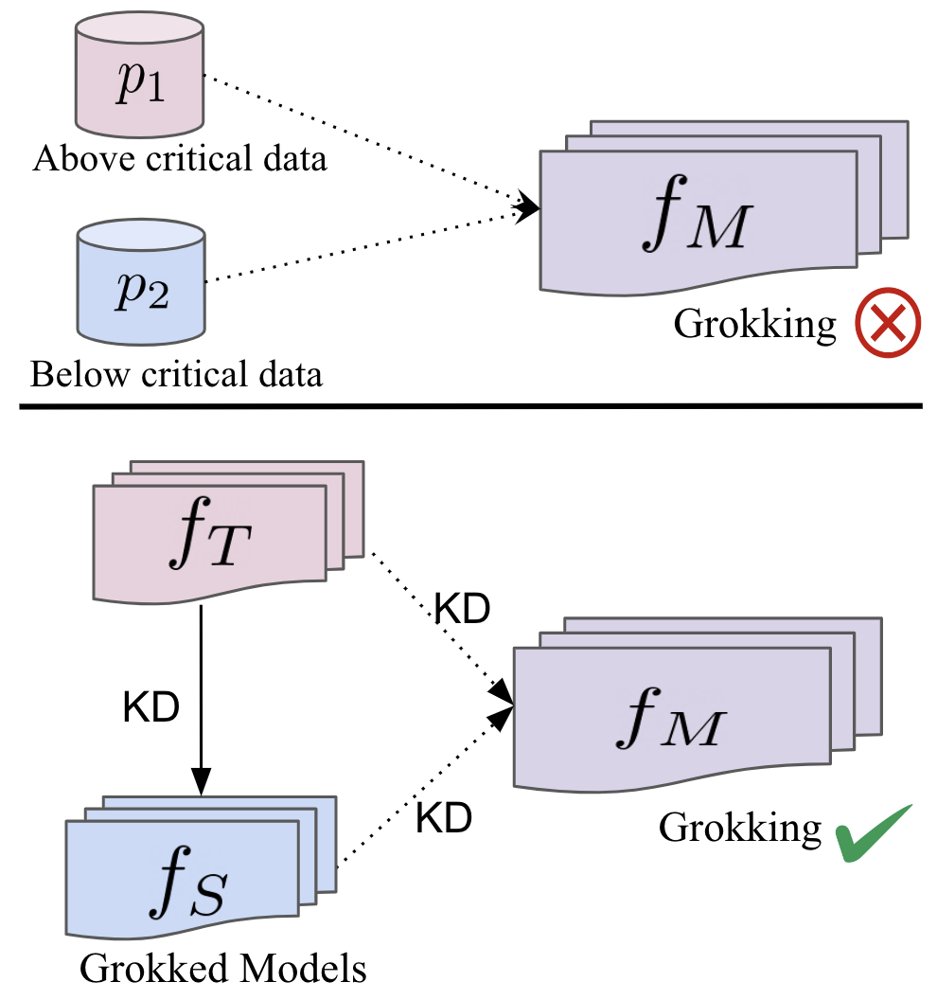
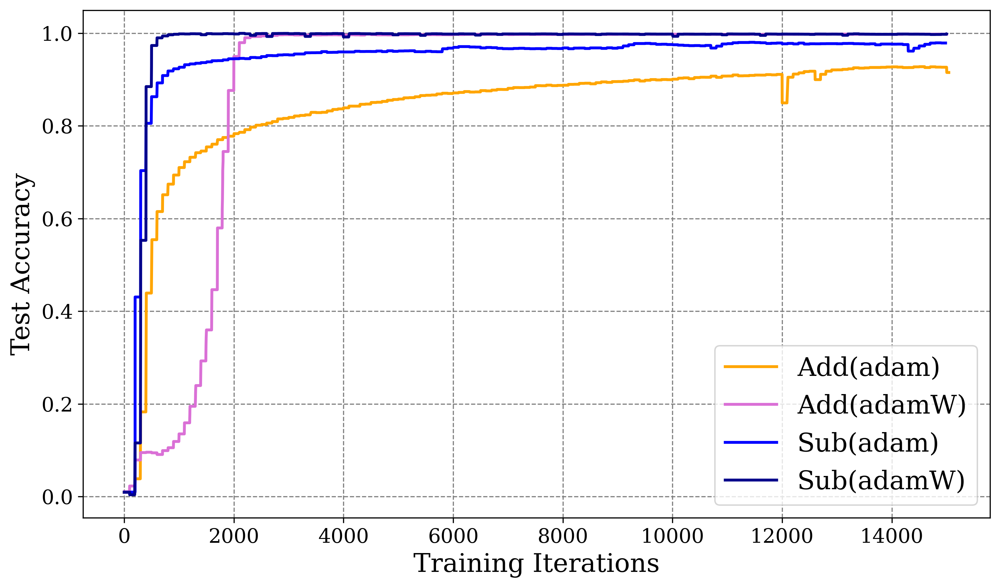
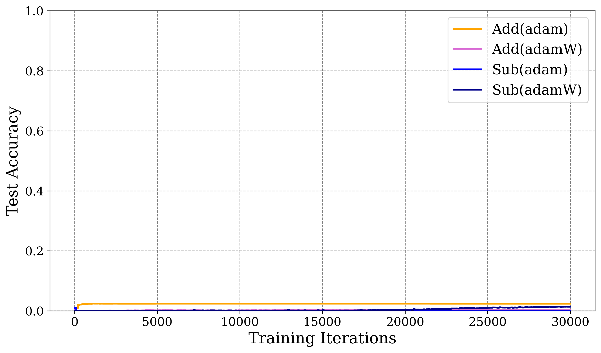
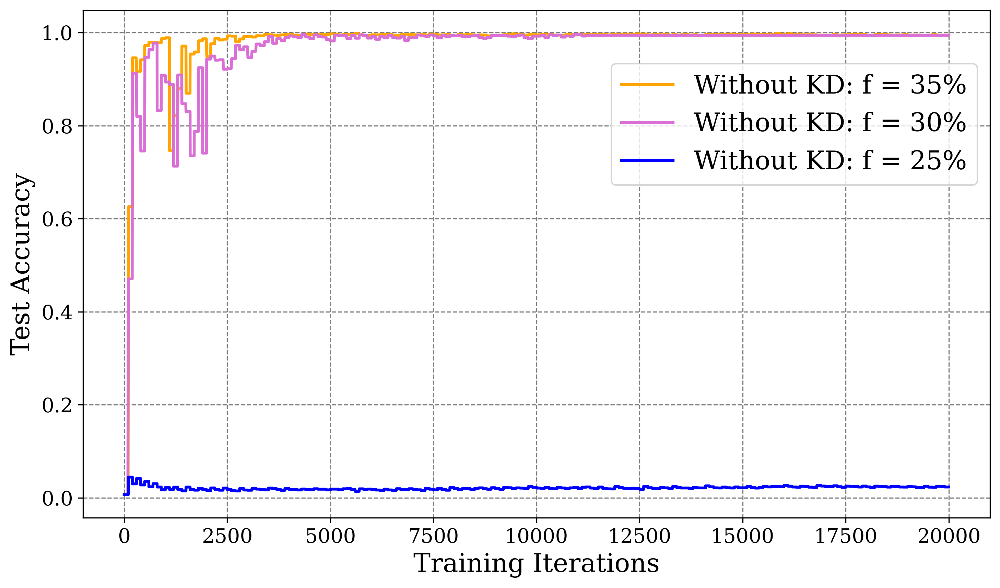
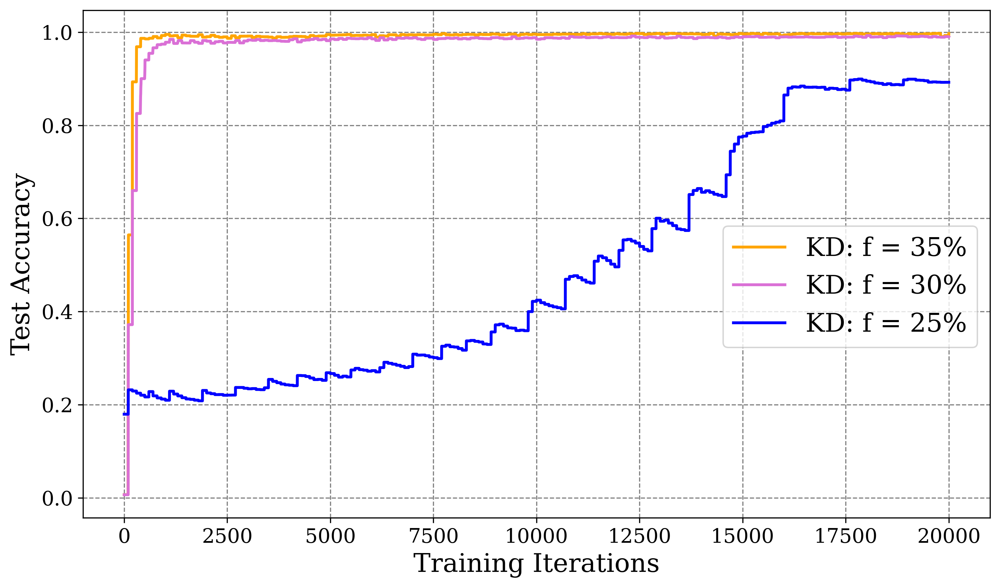
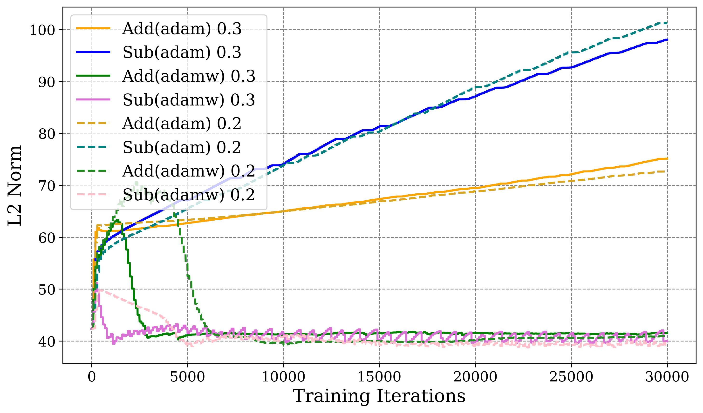

Continual and Compatible Foundation Model Updates (CCFM)

# When Data Falls Short: Grokking Below the Critical Threshold

Vaibhav Singh*1,2* Eugene Belilovsky*1,2* Rahaf Aljundi*3* 1Concordia University 2Mila 3Toyota Motor Europe

## Abstract

###### p1-3

In this paper, we investigate the phenomenon of *grokking*, where models exhibit delayed generalization following overfitting on training data. We focus on data-scarce regimes where the number of training samples falls below the critical threshold, making grokking unobservable, and on practical scenarios involving distribution shift. We first show that Knowledge Distillation (KD) from a model that has already grokked on a distribution ($p_{1}$) can induce and accelerate grokking on a different distribution ($p_{2}$), even when the available data lies below the critical threshold. This highlights the value of KD for deployed models that must adapt to new distributions under limited data. We then study training on the joint distribution ($p_{1}$, $p_{2}$) and demonstrate that while standard supervised training fails when either distribution has insufficient data, distilling from models grokked on the individual distributions enables generalization. Finally, we examine a continual pretraining setup, where a grokked model transitions from $p_{1}$ to $p_{2}$, and find that KD both accelerates generalization and mitigates catastrophic forgetting, achieving strong performance even with only 10% of the data. Together, our results provide new insights into the mechanics of grokking under knowledge transfer and underscore the central role of KD in enabling generalization in low-data and evolving distribution settings.

## 1 Introduction

Generalizing across varying data distributions remains a core challenge in machine learning, as standard training often fails under distribution shifts or data scarcity (Van de Ven and Tolias, 2019; Fang et al., 2020; Singh et al., 2024b, a; Liang et al., 2024). The phenomenon of *grokking* (Power et al., 2022) sheds light on this problem, showing how models can suddenly generalize after prolonged overfitting (Arpit et al., 2017). Explanations range from implicit regularization, such as weight decay (Barak et al., 2022; Nanda et al., 2023), to training dynamics that enable generalization even at zero loss (Kumar et al., 2024; Lyu et al., 2024; Ishida et al., 2020). A common finding is that grokking occurs only when training data exceeds a *critical threshold* (Power et al., 2022; Zhu et al., 2024).

###### p1-5

Building on these findings, we explore grokking in scarce data regimes, under distribution shift. Specifically, we ask:**Can a grokked model be leveraged to *train* another model on a different distribution?** To test this, we train a one-layer Transformer (Vaswani et al., 2017) on $p_{1}$ as a Teacher ($f_{T}$) and distill its knowledge into a Student ($f_{S}$) on $p_{2}$. We find that $f_{S}$ not only groks on $p_{2}$ but also requires fewer steps under distillation. This enables faster adaptation when $p_{2}$ has limited data, demonstrating the practical value of pre-grokked models for distribution shift, continual learning, multi-task learning, and domain generalization.

###### p1-6

We also show that generalization does not depend on smaller weight norms or weight decay. While prior work linked grokking to a cleanup phase driven by weight decay Nanda et al. (2023); Liu et al. (2022b); Varma et al. (2023), our experiments refute this claim. Consistent with recent findings Prieto et al. (2025), we find that weight decay mainly mitigates floating-point errors. Grokking occurs even with zero weight decay and increasing weight norms, ruling out these factors as primary explanations.

We further ask: **Is grokking possible when training data falls *below* the *critical threshold* ?** Our results show that distillation from the Teacher model ($f_{T}$) not only reduces the steps required for grokking but also enables it in regimes where data is below the critical size. The critical data size, as defined in (Liu et al., 2022b; Varma et al., 2023; Zhu et al., 2024), is the minimum amount of data below which generalization does not occur. Our study further demonstrates that KD helps mitigate forgetting when models adapt to new domains. Together, these contributions outline a practical framework for building efficient and adaptable learning systems.

**[p. 2]**

*(a) Grokking a model on $p_{2}$ using KD, which otherwise fails to generalize.*

*(b) Distilling from multiple grokked models $f_{T}$, $f_{S}$ yields grokking on a larger model $f_{M}$ below critical data.*

*Figure 1: 1(a) shows that $f_{S}$groks below the critical data size when trained via KD from a grokked model $f_{T}$, whereas training from scratch fails. In 1(b), a larger model $f_{M}$trained jointly on $p_{1}$ and $p_{2}$ cannot generalize when either dataset is below the threshold. Distilling from the smaller grokked models $f_{S}$and $f_{T}$, however, enables $f_{M}$ to grok and generalize effectively even under scarce data.* **[p. 2]**

## 2 Related Work

###### p2-2

**Grokking** was first identified in algorithmic tasks by (Power et al., 2022). Subsequent work has aimed to explain this phenomenon. (Nanda et al., 2023) reverse-engineered a grokked modular-addition transformer and found it learns a composition of trigonometric and inverse-trigonometric functions. (Merrill et al., 2023) attributed grokking to competition between sparse (generalizing) and dense (memorizing) subnetworks. From a theoretical lens, (Rubin et al., 2024) framed grokking as a first-order phase transition in feature learning, while (Levi et al., 2024) provided analytical solutions for loss and accuracy dynamics in linear networks. Studying polynomial regression, (Kumar et al., 2024) linked grokking to a shift from lazy to rich learning. (Lyu et al., 2024) further suggested that the sharp test-accuracy jump arises from differing implicit biases in early vs. late training.

###### p2-3

Grokking has also been observed in practical settings, e.g., CNNs trained on CIFAR-10 (Humayun et al., 2024; Krizhevsky, 2012). (Humayun et al., 2024) describe delayed robustness, where models eventually grok adversarial examples long after interpolation. Early prediction of grokking has been attempted using Fourier spectral signatures (Notsawo Jr et al., 2023). It has been linked to slow formation of useful representations within a “Goldilocks zone” between memorization and confusion (Liu et al., 2022a), and to gradual amplification of structured weights followed by removal of memorized components (Nanda et al., 2023). Other explanations include hidden SGD-driven amplification of a Fourier gap (Barak et al., 2022) and the “Slingshot mechanism,” where training cycles between stable and unstable phases (Thilak et al., 2022).

###### p2-4

**Relationship to Dataset Size:** Circuit-efficiency analysis shows that generalization is slower but more efficient, implying a critical data size below which models memorize rather than generalize (Varma et al., 2023). Training below this threshold yields semi-grokking, and fine-tuning grokked models on such small data can cause “ungrokking.” Regularization has been proposed to correct training-sample errors (Doshi et al., 2023), and loss-landscape analysis links grokking to data size, weight decay, and representation learning (Liu et al., 2022b).

**[p. 3]**

###### p3-1

**Accelerating Grokking:** Several methods speed up grokking: gradient decomposition and amplification (Lee et al., 2024), lottery-ticket approaches (Minegishi et al., 2023), transferring embeddings from a weaker to a stronger model (Xu et al., 2025), and replacing softmax with stable-max (Prieto et al., 2025). In contrast, our method removes the phase transition without extra data or redundant pretraining, and to our knowledge is the first to accelerate grokking in data-scarce settings under distribution shift.

## 3 Experimental Setup

###### p3-2

We trained a decoder only transformer to perform experiments on algorithmic tasks of the form ($(a@b)\%P$), where $@$ represents operator for any of the binary operations. In this work, we focus on addition and subtraction tasks following previous studies (Nanda et al., 2023; Varma et al., 2023; Liu et al., 2022b; Power et al., 2022; Liu et al., 2022a) which consistently report grokking on these tasks. The model input is $[a,b,@,P]$, and the output $c$ is read from the final token $P$. In our experiments, each arithmetic modulo-$P$ task is denoted as $p_{1}$ for a specific prime $P$. A distribution shift is introduced by changing the modulus while keeping the operator fixed. For example, in addition modulo $P$, the task $(a+b)\%P$ with $P=P_{1}$ is referred to as distribution $p_{1}$, while $(a+b)\%P$ with $P=P_{2}\neq P_{1}$ is denoted $p_{2}$. Our results remain consistent regardless of the choice of $P_{1}$ and $P_{2}$.

###### p3-3

We begin training with 35% of the dataset to first observe grokking, as demonstrated in prior work (Power et al., 2022; Liu et al., 2022b). We then progressively reduce the data fraction to 30%, 25%, and 10%. For algorithmic addition and subtraction tasks, prior studies define the critical data size to be around 25% of the dataset (Varma et al., 2023; Zhu et al., 2024). Consistent with this, our observations show that grokking does not occur when 25% or less of the data is available, confirming that 25% marks the critical threshold below which generalization becomes impossible. We utilize StableMax Cross Entropy (Prieto et al., 2025) since cross entropy with softmax function causes numerical instability, given as:

$$
L_{\mathrm{StCE}}(\theta)=\mathbb{E}_{(x,y)\sim\mathcal{D}}\left[-\log\text{StableMax}(f_{S}^{y}(x;\theta))\right] \tag{1}
$$

where $f_{S}(\cdot;\theta)$, is the Student Network: parameterized by $\theta$ and StableMax($x$) = Softmax($g(x_{i})$) where $g(x_{i})$ is defined as

$$
g(x)=\begin{cases}\log(x+1)&\text{ if }x\geq 0\\
-\log(-x+1)&\text{ if }x<0\end{cases} \tag{2}
$$

###### p3-5

We observe that the usage of StableMax (Prieto et al., 2025) already gives a prior speedup in inducing grokking, needing around 6000 iterations to grok, which otherwise would have been in order of $1e4$ (Liu et al., 2022b; Power et al., 2022; Nanda et al., 2023)

For knowledge distillation, we use Kullback-Leibler (KL) Divergence Loss:

$$
L_{\mathrm{KL}}(\theta)=\mathbb{E}_{x\sim\mathcal{D}_{X}}\left[D_{\mathrm{KL}}\left(q_{T}(x)\|q_{S}(x;\theta)\right)\right] \tag{3}
$$

where $D_{\mathrm{KL}}(p\|q)=\sum_{i=1}^{K}p_{i}\log\left(\frac{p_{i}}{q_{i}}\right)$. This takes softened outputs as $q_{T}(x)=\operatorname{softmax}\left(\frac{f_{T}(x)}{t}\right)$, and $q_{S}(x;\theta)=\operatorname{softmax}\left(\frac{f_{S}(x;\theta)}{t}\right)$ where $f_{T}:$, represents the Teacher model, and $t>0$ is the Temperature used to soften probabilities.

The total distillation loss is therefore realised as:

$$
L(\theta)=(1-\alpha)L_{\mathrm{CE}}(\theta)+\alpha L_{\mathrm{KL}}(\theta) \tag{4}
$$

where $\alpha$ controls the proportion of each loss component.

###### p3-10

For demonstrating the efficacy of our distillation method and to negate the dependency of weight norm and weight decay theories, we compare both Adam without weight decay & AdamW(with weight decay) optimizer (Loshchilov, 2017) with a learning rate $\gamma=1e-3$. For AdamW we set the weight decay parameter $\lambda=1$. We perform 15,000-30,000 epochs of training with a batch size of 2048 on NVIDIA V100 GPU.

## 4 Accelerating Grokking through Knowledge Distillation (KD)

*(a) Training on $p_{2}$ without KD (f = 30%)*

*(b) Training on $p_{2}$ with KD from $p_{1}$ (f = 30%)*

*Figure 2: 2(b) shows the effectiveness of KD **irrespective of the optimizer choice** for both addition and subtraction modulo task. In 2(a) typical grokking phenomena on distribution $p_{2}$ on $30\%$ of training data (denoted as f), without KD. We observe that weight decay is helpful in showing grokking but its not the only underlying cause. When trained with Adam, grokking is not observed for both tasks when trained for 15000 iterations. This concurs with (Power et al., 2022). However 2(b) demonstrates a $Student$ model trained on a different distribution $p_{2}$ with same fraction, but now with KD from the $Teacher$ model trained on $p_{1}$ displays accelerated generalization irrespective of the optimizer choice.* **[p. 4]**

###### p3-11

KD has been shown to provide multiple benefits in improving training dynamics. Menon et al. (2021) provided a statistical perspective on distillation, that providing the true class-probabilities from the teacher **[p. 4]** model can lower the variance of the student objective, and thus improve performance. Further Phuong and Lampert (2019) provides a generalization bound that establishes fast convergence of the expected risk of a distillation-trained linear classifier. In (Boix-Adsera, 2024; Ben-David and Ben-David, 2011), a theoretical framework is given to analyze model distillation into decision trees through PAC-learning statistical theory. They show that if teacher model $f_{T}$is perfectly distillable into a student model $f_{S}$, then with a probability of at least $1-\delta$, $f_{S}$generalizes with training samples no greater than $\left\lceil\frac{\log(1/\delta)}{\epsilon}\right\rceil$. It can be inferred from these studies (Tang et al., 2020; Cho and Hariharan, 2019; Yuan et al., 2020) that KD brings the following advantages towards training dynamics,

###### p4-1

- **Regularization Effect through Label Smoothing:** KD smooths the labels, which acts as a regularizer and prevents overfitting.
- **Domain Knowledge Injection:** The teacher model imparts class relationships that shape the geometry of the student’s logit layer.
- **Instance-Specific Knowledge:** The teacher adjusts the student model’s per-instance gradients based on the difficulty of each sample, facilitating more effective learning.

*(a) Accelerated Grokking on $p_{2}$ for Task: $(a+b)\%107$*

*(b) Accelerated Grokking on $p_{2}$ for Task: $(a-b)\%107$*

*Figure 3: Dashed lines in3(a) and 3(b) show typical grokking on $p_{2}$ $(P=107)$ with different training fractions ($f$). Training from scratch below $30\%$ shows no grokking. With KD from a grokked model on $p_{1}$ $(P=113)$, grokking is accelerated and occurs with as little as $25\%$ of $p_{2}$. Distillation is applied to probability outputs from the operator token, enabling generic operator-level representations rather than $P$-specific ones.*

###### p4-2

We first grok a 1 layer Transformer model with $35\%$ of training data for modular addition and subtraction tasks ($(a\pm b)\%P$) with $P=113$ (Choice of $P$ was aritrary). We call this as data distribution $p_{1}$. This model will act as the teacher model ($f_{T}$). **[p. 5]** Next we train another model on a distribution $p_{2}$, by modifying the modulo prime ($P=107$), and compare the impact of KD under different fractions for $p_{2}$ on both these tasks. As seen in Figure 3, KD significantly accelerates the grokking process for both tasks, even in scenarios where the proportion of training data is below critical dataset size. This observation is independent of the optimizer used, as shown in Figure 2. This demonstrates a practical utility of grokked models, illustrating their effectiveness in training models on varying distributions through KD. It is important to note that distillation occurs on the probability outputs from the operator token rather than the $P$ token. This approach aims to learn generic operator-level representations instead of task-specific representations, which would depend on the choice of $P$.

*(a) Without KD on $20\%$ of $p_{2}$*

*(b) With KD on $20\%$ of $p_{2}$*

###### fig-4

*Figure 4: 4(a) demonstrates that its impossible to observe grokking when the data fraction goes below a certain critical threshold($20\%$.), even with 2X iterations (30,000) In such a case, the model does not learn anything regardless of the optimizer. In 4(b), it can be clearly seen that with KD, grokking is observed for all tasks, even without weight decay. However we notice that weight decay helps in achieving a better generalisation.* **[p. 5]**

###### p5-1

Building on these observations, we ask: *Can KD enable generalization below the critical data threshold?* To test this, we repeat the experiments with only $20\%$ of the data. Without KD, grokking does not occur even after 30,000 iterations, regardless of weight decay. In contrast, with KD, generalization emerges rapidly at this reduced data fraction (Figure 4). Notably, the weight norm continues to increase (more details on weight norm given in A.1), reinforcing our earlier claim that neither weight decay nor decreasing weight norms are essential for grokking. These results underscore the value of a grokked Teacher model ($f_{T}$) in data-scarce settings. KD not only accelerates grokking but also makes it possible below the critical threshold, highlighting its practical utility for efficient training under limited data and shifting distributions.

## 5 Leveraging Grokked Models for Distillation and Continual Transfer

###### p5-2

We extended our study by checkpointing grokked models on fractions $(0.35,0.3,0.25)$ of $p_{2}$ trained via distillation (Section 4). The model grokked on $p_{1}$ with $35\%$ data is denoted $f_{p_{1}}$, and the KD-trained models on $p_{2}$ as $f_{p_{2}}$. Our goal was to train a new transformer ($f_{M}$) that generalizes across both $p_{1}$ and $p_{2}$. In joint training, $f_{M}$ failed to generalize when $p_{2}$ was below the critical size, showing that scarcity in any distribution limits learning. In contrast, training $f_{M}$ solely via KD from $f_{p_{1}}$ and $f_{p_{2}}$ enabled simultaneous generalization, even when either distribution had limited data (Figure 5)

*(a) without KD*

**[p. 6]**

*(b) With only KD, without entropy minimization*

*Figure 5: Performance comparison of training strategies for a larger transformer model $f_{M}$ on distributions of $p_{1}$(35%) and different fractions $(0.35,0.3,0.25)$ of $p_{2}$. In the Joint Training regime (5(a)), the model fails to generalize via cross-entropy when data from either distribution falls below the critical threshold. In contrast, training solely with distillation enables grokking even with $25\%$ of $p_{2}$ (5(b)). At this low fraction, generalization does not reach unity due to the imperfect $f_{p_{2}}$ trained under data scarcity, while for $0.35$ and $0.3$ fractions, generalization is rapid with no grokking.* **[p. 6]**

###### p5-3

Remarkably, $f_{M}$ exhibited grokking *only when trained via KD*, generalizing even when $p_{1}$ or $p_{2}$ was below the critical size. This shows that KD over the joint distribution $(p_{1},p_{2})$ provides a stronger learning signal than ground-truth labels, enabling grokking under limited data. Notably, the effect persists even when the teacher $f_{p_{2}}$ itself was trained on a small fraction of $p_{2}$, distilled from $f_{p_{1}}$.

###### p5-4

Building on recent work in continual pretraining (Ke et al., 2023), we evaluated the transition of a grokked model from $p_{1}$ to $p_{2}$, focusing on the role of knowledge distillation (KD) in mitigating catastrophic forgetting. A model grokked on $p_{1}$ was further pretrained on $p_{2}$ under two conditions: with and without KD.

*(a) Previous Task Accuracy for different fractions of data, with and without KD.*

*(b) Current Task Accuracy for different fractions of data, with and without KD.*

###### fig-6

*Figure 6: Continual pretraining where a grokked model on $p_{1}$ is further trained on $p_{2}$. Without KD, performance on $p_{1}$ drops rapidly while generalization on $p_{2}$ is quick. With KD (6(b)), accuracy on the current task is preserved and forgetting is mitigated. Training from a grokked model enables fast generalization without delayed grokking, though for data below the critical size we observe a sudden phase transition from $\sim 92\%$ to $100\%$ accuracy at around $28K$ steps.* **[p. 6]**

###### p5-5

As shown in Figure 6, training without KD led to immediate and severe forgetting of $p_{1}$, though the model quickly generalized to $p_{2}$. With KD, however, the model retained near-perfect accuracy on $p_{1}$ while also achieving rapid generalization on $p_{2}$. KD thus prevented delayed generalization and preserved prior knowledge, underscoring its role in balancing retention and adaptation during continual pretraining.

###### p6-1

These findings highlight the utility of KD in enabling generalization when data from multiple distributions is scarce, a scenario common in practice due to privacy, security, or resource constraints. Leveraging KD from pre-trained grokked models offers an effective solution in such settings. Finally, across all experiments we observed increasing weight norms despite successful grokking, challenging theories that link grokking to weight norm reduction. Instead, our results suggest that mechanisms like representation transfer via KD play a more central role, opening new directions for understanding the fundamental drivers of grokking.

## 6 Conclusions and Future Work

This study advances the understanding of grokking by examining its behavior below the critical data regime. Unlike prior work centered on single distributions and weight-norm dynamics, we show that Knowledge Distillation (KD) can induce and accelerate grokking without relying on weight decay or decreasing norms. Our results demonstrate that KD enables generalization even below the critical threshold and across varying distributions, offering a practical solution in data-scarce settings where traditional training fails. Future work may extend these insights to more complex tasks, deepen our understanding of grokking’s mechanisms, and explore broader uses of pre-grokked models that generalize reliably and adapt efficiently to dynamic real-world data.

## References

**[p. 7]**

- A closer look at memorization in deep networks. In International Conference on Machine Learning, Cited by: §1.

- Hidden progress in deep learning: sgd learns parities near the computational limit. Advances in Neural Information Processing Systems 35, pp. 21750–21764. Cited by: §1, §2.

- Learning a classifier when the labeling is known. In International Conference on Algorithmic Learning Theory, pp. 440–451. Cited by: §4.

- Towards a theory of model distillation. External Links: 2403.09053, Link Cited by: §4.

- On the efficacy of knowledge distillation. In Proceedings of the IEEE/CVF International Conference on Computer Vision (ICCV), Cited by: §4.

- To grok or not to grok: disentangling generalization and memorization on corrupted algorithmic datasets. arXiv preprint arXiv:2310.13061. Cited by: §2.

- Rethinking importance weighting for deep learning under distribution shift. Advances in neural information processing systems 33, pp. 11996–12007. Cited by: §1.

- Deep networks always grok and here is why. arXiv preprint arXiv:2402.15555. Cited by: §2.

- Do we need zero training loss after achieving zero training error?. ArXiv abs/2002.08709. External Links: Link Cited by: §1.

- Continual learning of language models. In International Conference on Learning Representations (ICLR), Cited by: §5.

- Learning multiple layers of features from tiny images. University of Toronto, pp.. Cited by: §2.

- Grokking as the transition from lazy to rich training dynamics. In The Twelfth International Conference on Learning Representations, External Links: Link Cited by: §1, §2.

- Grokfast: accelerated grokking by amplifying slow gradients. arXiv preprint arXiv:2405.20233. Cited by: §2.

- Grokking in linear estimators – a solvable model that groks without understanding. In The Twelfth International Conference on Learning Representations, External Links: Link Cited by: §2.

- A comprehensive survey on test-time adaptation under distribution shifts. International Journal of Computer Vision, pp. 1–34. Cited by: §1.

- Towards understanding grokking: an effective theory of representation learning. Advances in Neural Information Processing Systems 35, pp. 34651–34663. Cited by: §2, §3.

- Omnigrok: grokking beyond algorithmic data. In The Eleventh International Conference on Learning Representations, Cited by: Figure 7, Figure 7, §A.1, §A.1, §1, §1, §2, §3, §3, §3.

- Decoupled weight decay regularization. arXiv preprint arXiv:1711.05101. Cited by: §3.

- Dichotomy of early and late phase implicit biases can provably induce grokking. In The Twelfth International Conference on Learning Representations, External Links: Link Cited by: §1, §2.

**[p. 8]**

- A statistical perspective on distillation. In Proceedings of the 38th International Conference on Machine Learning, Proceedings of Machine Learning Research, Vol. 139, pp. 7632–7642. Cited by: §4.

- A tale of two circuits: grokking as competition of sparse and dense subnetworks. arXiv preprint arXiv:2303.11873. Cited by: §2.

- Bridging lottery ticket and grokking: is weight norm sufficient to explain delayed generalization?. arXiv preprint arXiv:2310.19470. Cited by: §2.

- Progress measures for grokking via mechanistic interpretability. arXiv preprint arXiv:2301.05217. Cited by: Figure 7, Figure 7, §A.1, §A.1, §1, §1, §2, §2, §3, §3.

- Predicting grokking long before it happens: a look into the loss landscape of models which grok. arXiv preprint arXiv:2306.13253. Cited by: §2.

- Towards understanding knowledge distillation. In Proceedings of the 36th International Conference on Machine Learning, Proceedings of Machine Learning Research, Vol. 97, pp. 5142–5151. Cited by: §4.

- Grokking: generalization beyond overfitting on small algorithmic datasets. arXiv preprint arXiv:2201.02177. Cited by: §1, §2, §3, §3, §3, Figure 2, Figure 2.

- Grokking at the edge of numerical stability. In The Thirteenth International Conference on Learning Representations, External Links: Link Cited by: §1, §2, §3, §3.

- Grokking as a first order phase transition in two layer networks. In The Twelfth International Conference on Learning Representations, External Links: Link Cited by: §2.

- Controlling forgetting with test-time data in continual learning. arXiv preprint arXiv:2406.13653. Cited by: §1.

- Wake-sleep energy based models for continual learning. In Proceedings of the IEEE/CVF Conference on Computer Vision and Pattern Recognition, pp. 4118–4127. Cited by: §1.

- Understanding and improving knowledge distillation. arXiv preprint arXiv:2002.03532. Cited by: §4.

- The slingshot mechanism: an empirical study of adaptive optimizers and the grokking phenomenon. arXiv preprint arXiv:2206.04817. Cited by: §2.

- Three scenarios for continual learning. arXiv preprint arXiv:1904.07734. Cited by: §1.

- Explaining grokking through circuit efficiency. arXiv preprint arXiv:2309.02390. Cited by: Figure 7, Figure 7, §A.1, §A.1, §1, §1, §2, §3, §3.

- Attention is all you need. In Neural Information Processing Systems, External Links: Link Cited by: §1.

- Let me grok for you: accelerating grokking via embedding transfer from a weaker model. In The Thirteenth International Conference on Learning Representations, External Links: Link Cited by: §2.

- Revisiting knowledge distillation via label smoothing regularization. In Proceedings of the IEEE/CVF Conference on Computer Vision and Pattern Recognition (CVPR), Cited by: §4.

**[p. 9]**

- Critical data size of language models from a grokking perspective. CoRR abs/2401.10463. External Links: Link Cited by: §1, §1, §3.

**[p. 10]**

## Appendix A Appendix

### A.1 Evolution of L2 weight norm

###### p10-1

L2 weight norm trained with adam continuously increases for both addition and subtraction tasks as observed in Figure 7, yet grokking still occurs. These findings challenge the theories proposed by [23] who suggest that the abrupt transition to perfect test accuracy during grokking occurs in the cleanup phase (where weight decay removes memorization components), following the establishment of the generalizing mechanism. Our empirical evidence contradicts these claims by demonstrating grokking even without weight decay and with increasing weight norms.

###### p10-2

Similarly [17] induce grokking by increasing the initial weight norm and conclude that generalizing solutions lie on smaller norm spheres in parameter space. While we acknowledge that an initially higher weight norm can facilitate grokking, our results indicate that generalizing solutions do not necessarily lie on smaller norm spheres. Our modular arithmetic tasks serve as counterexamples, where the final generalizing solutions exhibit larger parameter weight norms than their initial states, and grokking occurs without the application of weight decay.

###### p10-3

Furthermore [34] claim that the transition from memorizing to generalizing circuits occurs because the generalizing circuit is more “efficient” than the memorizing circuit, in the sense that it can produce equivalent loss with a lower parameter norm. In contrast, our studies show that modular arithmetic tasks can achieve generalizing solutions with higher parameter norms without any weight decay, disproving the necessity of norm reduction for grokking.

We empirically demonstrate that parameters’ (L2) weight norm trained with adam continuously increases for both addition and subtraction tasks as observed in Figure 7, yet grokking still occurs. This challenges the notion that decreasing weight norm is fundamental to grokking. Therefore, we assert that neither parameter weight decay nor a decreasing weight norm during optimization is inherently fundamental to observing grokking, contrary to its purported necessity in previous studies [17, 23, 34] on modular arithmetic tasks.

###### fig-7

*Figure 7: Evolution of the L2 weight norm for $Student$ model $f_{S}$ trained with Adam(without weight decay) and AdamW(with weight decay) on different fractions of $p_{2}$ distribution. $f_{S}$ is trained via KD from a grokked model $f_{T}$. Notably, training without weight decay the $L_{2}$-weight norm increases continuously, while giving generalised solutions. This rules out the necessity of decreased weight norm condition for exhibiting grokking given by [17, 34, 23]* **[p. 10]**
