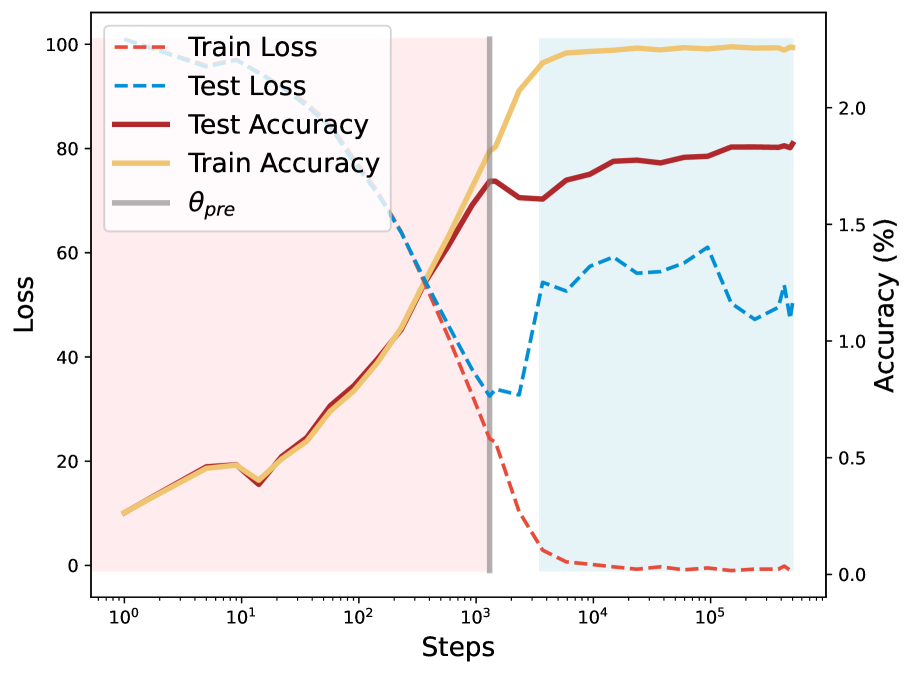
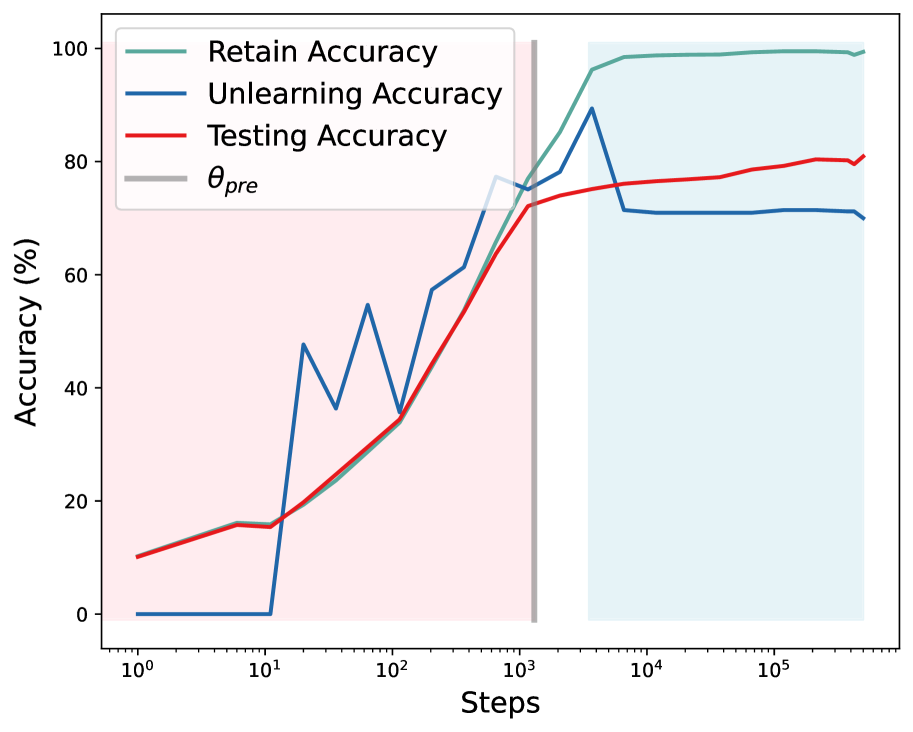
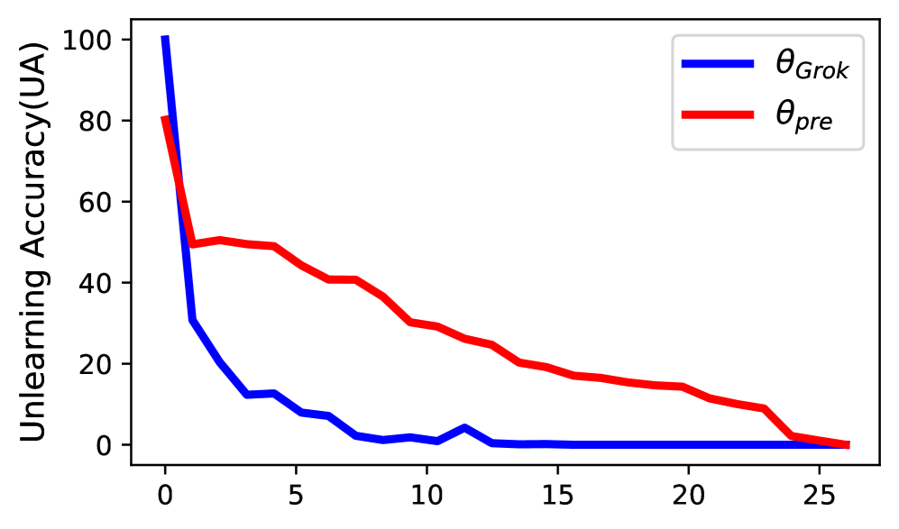
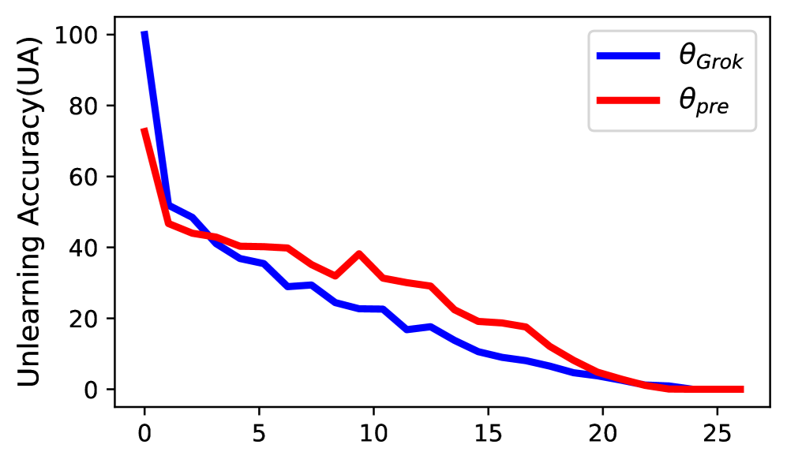

# Liang, Li 2025 — Grokked Models are Better Unlearners

See also: [the global concept index](../../concepts/index.md).

**Yuanbang Liang** (School of Computer Science and Informatics, Cardiff University), **Yang Li** (independent researcher).

arXiv [2512.03437](https://arxiv.org/abs/2512.03437), December 2025 (version v1). It has no citations — the work is in the corpus as an applied side branch: grokking here is not explained but used as a lever for machine unlearning. The source is the native arXiv HTML of version v1.

The files of this paper's analysis:

- [`2512.03437.grokked-models-are-better-unlearners.license.txt`](2512.03437.grokked-models-are-better-unlearners.license.txt) — the arXiv licence record for this paper.

The anchor scheme and the rules for linking into a card are in the [README of the papers folder](../README.md).

**Excerpt card.** The paper's licence (`arxiv-nonexclusive`) does not permit republishing the paper itself; what stands here are the editorial sections and the fragments the corpus quotes (right of quotation). The paper: <https://arxiv.org/abs/2512.03437>.

## Concepts covered

**[Grokking](../../concepts/grokking.md)** — it is taken here not as an object of study but as a **lever**: the work's question is whether the choice of stopping point (before the transition or after) changes the model's subsequent behaviour under data deletion ([`p5-2`](#p5-2)). The claim is direct: **when** a model is trained is a lever independent of **how** the unlearning is carried out ([`p1-2`](#p1-2)).

**[Catastrophic forgetting](../../concepts/catastrophic-forgetting.md)** — the reverse side of the subject. Machine unlearning aims to remove the influence of a designated subset so that the behaviour becomes indistinguishable from training without it ([`p4-2`](#p4-2)); the trouble with every method is that the rest collapses along with the target data. The work measures exactly that separation: the unlearning accuracy (UA) against the accuracy on the retained data (RA) and on the test set (TA) ([`p5-6`](#p5-6), [`tab-1`](#tab-1)).

**[Gradient orthogonality](../../concepts/orthogonal-gradient-perp-grad.md)** — the work's principal measured quantity and perhaps its most valuable contribution to the corpus. In the pre-grokking models the cosine similarity of the gradients of the forget and the retain sets is 0.990 (CNN) and 0.999 (ResNet) — the gradients are almost co-directed ([`p9-4`](#p9-4)); in the grokked ones it falls to 0.521 and 0.426 ([`p9-5`](#p9-5)). In angular terms this is 2.57° against 64.78° ([`p18-4`](#p18-4), [`tab-9`](#tab-9)). Hence a direct consequence: while the gradients are co-directed, no unlearning algorithm is able to aim at the forget data without touching the retained ones ([`p9-2`](#p9-2)).

**[Structured representation learning](../../concepts/structured-representation-learning.md)** — an interpretation of the same quantity. The centred kernel alignment (CKA) between the representations of the forget and the retain sets falls from 0.459 to 0.129 — by 72 % ([`p10-3`](#p10-3), [`tab-5`](#tab-5)). Grokking, by the authors' claim, creates something more than a delayed generalisation: it rebuilds the representations into a simpler, more disentangled form ([`p10-5`](#p10-5)).

**[The basins of the loss landscape](../../concepts/loss-landscape-basins.md)** — the measure used is the local complexity (LC) of Humayun et al.: the density of the linear regions of the partition of input space around a data point ([`p9-8`](#p9-8)). In the grokked ResNet it is three times lower even before the unlearning (7.37 against 27.98) and stays lower afterwards (15.16 against 35.41) ([`p10-1`](#p10-1), [`tab-4`](#tab-4)). The most substantial thing, however, is the control against SAM: a method that deliberately seeks flat minima does indeed improve the robustness over the pre-grokking baseline, yet the grokked checkpoint surpasses it on every measure ([`p19-2`](#p19-2), [`tab-11`](#tab-11)). The conclusion is framed against the authors' own simple hypothesis: flatness alone is not enough ([`p19-4`](#p19-4)).

**[Mechanistic interpretability](../../concepts/mechanistic-interpretability.md)** — the support is taken from Nanda et al.: transformers pass from a distributed mutual adaptation to composable subcircuits ([`p4-1`](#p4-1)). The work carries this through to a countable model: the network is treated as a collection of $m$ effective parts, each activated by a data point with probability $p$, whereupon the expected gradient correlation equals $p\rho$ ([`p9-7`](#p9-7)). The measured 0.426–0.521 at $\rho\approx 0.9$ give $p\approx 0.5$ — about half of the parts per data point.

**[The sparse subnetwork](../../concepts/sparse-subnetwork-lottery-ticket.md)** — in the survey the "distributed → modular" shift is described as a competition of dense memorising and sparse generalising circuits (Merrill et al., Varma et al.), and the changes of the landscape as a movement towards flatter minima ([`p4-1`](#p4-1)).

**[Memorisation](../../concepts/memorization-phase.md)** — it receives an unexpected measurement here. Figure 1 shows that under prolonged training **before** the grokking the unlearning becomes ever harder: the UA rises and stays close to the RA, that is, the algorithm does not distinguish the forget data from the retained ([`fig-1`](#fig-1)). After the transition the curves diverge: the RA stays high while the UA falls markedly lower. It is precisely this divergence that resolves the contradiction with which the work begins ([`p1-6`](#p1-6), [`p2-1`](#p2-1)).

**[Phase transition](../../concepts/phase-transition.md)** — the design leans on it literally: two frozen checkpoints are taken, the best early-stopped $\theta_{\text{pre}}$ and the grokked $\theta_{\text{grok}}$ (around step 500 000), and the whole comparison is conducted under identical unlearning settings ([`p5-4`](#p5-4)).

**[Vision data and real tasks](../../concepts/vision-real-world-data-mnist-cifar.md)** — the main experiments are on CIFAR-10 with a ResNet-18 and a small convolutional network, with an extension to SVHN and ImageNet-100 ([`p16-3`](#p16-3)). The forget set is built to be deliberately hard: 2 classes are taken, and 15–50 % of their examples, while the other 8 classes serve as probes of collateral damage ([`p5-5`](#p5-5)). The worst case is checked separately too — a random sample from all ten classes, in which there is no class support at all ([`p18-6`](#p18-6), [`p18-7`](#p18-7)).

**[The emergence of features](../../concepts/feature-emergence-feature-learning.md)** — on the language side a notion of **local grokking** is introduced: Phi-1.5 does not grok on TOFU as a whole, but individual examples within one model are in different states of learnedness ([`p7-1`](#p7-1)). The recognition rule is crude but explicit: a decrease of the loss of less than 0.01 from the early checkpoint to the final one is "locally grokked", more than 0.5 is "locally non-grokked" ([`p7-2`](#p7-2)).

**[Progress measures](../../concepts/progress-measures.md)** — for a summary judgement an unlearning efficacy score is introduced, $\mathrm{UES}=(UA_{o}-UA_{u})/\big((TA_{o}-TA_{u})(RA_{o}-RA_{u})\big)$ ([`p16-4`](#p16-4)). The measure is convenient, but its denominator is a product of two small differences, so the values jump by orders of magnitude (table 8 contains a 127.955 next to neighbours of 0.0x).

It is worth saying separately what the work does **not** contain. There is no causality: all the results are a comparison of two checkpoints of one training run, and no intervention changing the modularity with everything else equal was carried out; the authors themselves name causal mechanisms as a subject for further work ([`p11-5`](#p11-5)). Nor is there an applicable recommendation: prolonged training costs 5–6 times more, and the authors refuse outright to prescribe it ([`p3-4`](#p3-4)). And there is no check at scale: the largest language model is Phi-1.5 at 1.3 billion parameters, and all the experiments are run on a single desktop accelerator ([`p21-9`](#p21-9)).

Cards of corpus papers: [Power et al. 2022](../2201.02177.grokking-generalization-beyond-overfitting-on-small-algorithmic-datasets/2201.02177.grokking-generalization-beyond-overfitting-on-small-algorithmic-datasets.card.md) — the original phenomenon; [Liu et al. 2022](../2210.01117.omnigrok-grokking-beyond-algorithmic-data/2210.01117.omnigrok-grokking-beyond-algorithmic-data.card.md) — grokking on vision data, from which the experimental setting is taken; [Nanda et al. 2023](../2301.05217.progress-measures-for-grokking-via-mechanistic-interpretability/2301.05217.progress-measures-for-grokking-via-mechanistic-interpretability.card.md) — the transition from the distributed to the modular, taken as the support of the mechanistic explanation; [Merrill et al. 2023](../2303.11873.a-tale-of-two-circuits-grokking-as-competition-of-sparse-and-dense-subnetworks/2303.11873.a-tale-of-two-circuits-grokking-as-competition-of-sparse-and-dense-subnetworks.card.md) and [Varma et al. 2023](../2309.02390.explaining-grokking-through-circuit-efficiency/2309.02390.explaining-grokking-through-circuit-efficiency.card.md) — the competition of a dense and a sparse circuit; [Notsawo Jr et al. 2023](../2306.13253.predicting-grokking-long-before-it-happens/2306.13253.predicting-grokking-long-before-it-happens.card.md) — the flattening of the landscape; [Furuta et al. 2024](../2402.16726.towards-empirical-interpretation-of-internal-circuits-and-properties-in-grokked-transformers-on-modular-polynomials/2402.16726.towards-empirical-interpretation-of-internal-circuits-and-properties-in-grokked-transformers-on-modular-polynomials.card.md) — the modularity of the internal circuits after grokking.

## What is shown and what is conjectured

The card editor's remarks following the analysis of the claims (`…claims.txt`). A work by two authors (Cardiff University and an independent researcher), 25 pages, 11 of them main text and the rest appendices.

**The design is well chosen, and that is the work's chief merit.** Instead of yet another unlearning algorithm, a transverse question is checked: does the stopping point of the training change the subsequent behaviour under unlearning — with the algorithms unchanged ([`p5-2`](#p5-2))? Nobody in the corpus has posed such a question so far, and the answer to it is useful regardless of whether the explanation through modularity is right.

**The orthogonality of the gradients is measured, and the gap is enormous.** 0.999 against 0.426 is not an improvement of a few per cent but a change of regime ([`p9-4`](#p9-4), [`p9-5`](#p9-5)). The conversion into angular terms (2.57° against 64.78°) is done correctly and makes the picture vivid ([`p18-4`](#p18-4)).

**The spline control is the strongest move in the whole work.** Models are taken with a comparable accuracy and with a local flatness by construction, but without a rebuilding of the representations; they unlearn **badly** ([`p18-1`](#p18-1)). From this the right conclusion is drawn: neither accuracy nor flatness alone is sufficient. Such a demarcation is rarely made in the corpus.

**The SAM control leads to the same conclusion from another side.** SAM improves the robustness over the pre-grokking checkpoint but is inferior to the grokked one on every measure ([`p19-2`](#p19-2), [`p19-4`](#p19-4)). Two independent controls cutting off a simple explanation — this is conscientious work.

**The "easy examples" conjecture is checked rather than dismissed.** A possible objection (that the locally grokked examples are simply easy ones) is checked by linguistic complexity: their answers are **longer** (157.4 against 149.6 characters) and there is no difference in the final loss ([`p21-2`](#p21-2), [`p21-3`](#p21-3)). The check is crude, but it is made.

**There is nevertheless no causality, and the title promises more than is shown.** All the results are a comparison of two points on one and the same training path. The grokked checkpoint differs from the pre-grokking one not only in modularity but also in the number of steps, the weight norm and its place in the landscape; none of these quantities is held fixed separately. Admitted in the limitations section ([`p11-5`](#p11-5)).

**The unlearning accuracy of the grokked models starts from a higher mark.** In table 1 the initial UA of $\theta_{\text{grok}}$ is 100.00 against 86–87 for $\theta_{\text{pre}}$ ([`tab-1`](#tab-1)): the early-stopped model simply has not learned the forget examples. So "after unlearning the UA of the grokked model is lower" means both a larger drop and a different starting point; a comparison with retraining from scratch is absent from the main table — it appears only in the appendix for SVHN and ImageNet.

**The highlighting in the tables contradicts its own rule in places.** In table 2 bold marks the better of two values, but for GA at 200 examples in $ES_{\text{retain}}$ the 0.489 (non-grokked) is marked against 0.492 for the grokked, although a larger value is better; and for RMU at 100 examples one of two identical 0.578 values is marked ([`tab-2`](#tab-2)). A trifle, but it shows that the tables were carelessly proofread — and it is by them that the main result of the language part is read.

**The UES score is unstable by construction.** The denominator is a product of two differences, either of which may go nearly to zero; hence a 127.955 for fine-tuning next to 0.0x for the other methods ([`p16-4`](#p16-4), [`tab-8`](#tab-8)). As an ordinal measure within a single column it will do; as a number it will not.

**The claim of 6–8 % and 10–20 % in the introduction is broader than what is shown.** The numbers are taken from the most favourable ResNet rows ([`p2-2`](#p2-2)); in the CNN the absolute quality levels are such that it is hard to speak of preserving useful knowledge at all (the test accuracy after unlearning falls to 17–28 %).

**"Local grokking" is called a new phenomenon but is defined through the loss.** The rule "less than 0.01 — grokked, more than 0.5 — non-grokked" ([`p7-2`](#p7-2)) recognises examples learned early and stably; a connection with the internal mechanism, unlike in the vision part, was not checked here at all. The name itself is a stretch: what is essential to grokking is the **delay**, whereas here the examples selected are those learned **earlier** than the rest.

**The range of the check is narrow and the computational resources modest.** One desktop graphics card, training to over 500 epochs ([`p21-8`](#p21-8)), one language model, one language dataset. The extension to SVHN and ImageNet-100 is carried out, but only for some of the algorithms.

**Its place in the corpus.** The work is applied and, for the corpus, a side branch: grokking here is not explained but used. Three things are valuable: the posing of the question of the stopping point as a lever; the measured orthogonality of the gradients of the forget and retain sets, with a conversion into angular terms; and the two controls (spline models and SAM) cutting off the explanation through flatness alone. The price: there is no causality, the starting points of the two compared models are not the same, the summary UES measure is unstable, and "local grokking" is a renaming of early learnedness.

## Common misreadings and overstatements

These are the card editor's remarks, not the authors' text: places where this paper restates someone else's results with an error, or without the qualifications their authors attached. The "details" links in the "Common misreadings and overstatements of this paper" sections of the cited works' cards lead here.

###### mc-2210-01117
**Omnigrok (2210.01117) — the caveat about inducement.** `"grokking has since been documented across diverse tasks—group theory (Chughtai et al., 2023), image classification (Liu et al., 2022)"`. "Documented" presents grokking on images as something met with and recorded, whereas in the cited work it is ["induced"](../2210.01117.omnigrok-grokking-beyond-algorithmic-data/original/2210.01117.omnigrok-grokking-beyond-algorithmic-data.md#p1-3) — ["in a slightly non-standard setting where it is relatively weak"](../2210.01117.omnigrok-grokking-beyond-algorithmic-data/original/2210.01117.omnigrok-grokking-beyond-algorithmic-data.md#p1-9) — with a truncated sample and an inflated initialisation, and its signs are ["typically less dramatic than for algorithmic datasets"](../2210.01117.omnigrok-grokking-beyond-algorithmic-data/original/2210.01117.omnigrok-grokking-beyond-algorithmic-data.md#p1-7).

###### mc-2306-13253
**Notsawo et al. (2306.13253) — a shift towards flat minima ascribed to them.** `"This distributed-to-modular shift involves … with landscape changes toward flatter minima (Notsawo Jr et al., 2023)"`: the cited work's picture is the opposite — [an ill-conditioned valley, sharp structures around the local optima and large condition numbers](../2306.13253.predicting-grokking-long-before-it-happens/original/2306.13253.predicting-grokking-long-before-it-happens.md#p4-1); its conclusions argue directly with the image of a wandering along a flat bottom. The thesis about "flatter minima" does not belong to that work.

---

# Quoted fragments

Only the fragments the corpus cards refer to are
reproduced here (right of quotation); the paper's licence does not permit
republishing the whole text. Anchor numbering matches the original.

###### p1-2

*Grokking*—delayed generalization that emerges well after a model has fit the training data—has been linked to robustness and representation quality. We ask whether this training regime also helps with *machine unlearning*, i.e., removing the influence of specified data without full retraining. We compare applying standard unlearning methods *before* versus *after* the grokking transition across vision (CNNs/ResNets on CIFAR, SVHN and ImageNet) and language (a transformer on a TOFU‑style setup). Starting from grokked checkpoints consistently yields (i) more **efficient forgetting** (fewer updates to reach a target forget level), (ii) **less collateral damage** (smaller drops on retained and test performance), and (iii) **more stable updates** across seeds, relative to early‑stopped counterparts under identical unlearning algorithms. Analyses of features and curvature further suggest that post‑grokking models learn *more modular representations* with reduced gradient alignment between forget and retain subsets, which facilitates selective forgetting. Our results highlight **when** a model is trained (pre‑ vs. post‑grokking) as an orthogonal lever to **how** unlearning is performed, providing a practical recipe to improve existing unlearning methods without altering their algorithms.

###### p1-6

This connection between representation quality and unlearning effectiveness leads to an intriguing paradox. On one hand, grokked models develop better generalization and more robust representations, which should theoretically facilitate selective forgetting by creating more disentangled knowledge structures. On the other hand, grokking requires extensive training on the data, potentially causing **[p. 2]** models to "remember" information more deeply, making unlearning more difficult. This raises a critical question: which effect dominates in practice?

*(a) Training dynamics showing grokking phenomenon*

*(b) Unlearning across multiple training checkpoints*

###### fig-1

*Figure 1: **Grokking Enables Superior Machine Unlearning.** **(a) Training Dynamics:** ResNet training trajectory on CIFAR-10 showing the grokking phenomenon. The model initially learns (pink region) until conventional early stopping at $\theta_{\text{pre}}$ (gray line), then overfits with declining test accuracy. After extended training, the model suddenly "groks"—achieving delayed generalization with dramatically improved test accuracy (blue region) at $\theta_{\text{grok}}$. **(b) Unlearning Performance Analysis:** Unlearning effectiveness using gradient ascent measured across different training checkpoints. Note that higher Unlearning Accuracy (UA) indicates worse unlearning (the model still remembers what it should forget). During early training (pink region), UA exhibits a concerning upward trend with high volatility—as the model learns, it progressively memorizes forget examples more deeply, creating increasingly entangled representations. Critically, UA remains close to Retain Accuracy (RA), indicating that unlearning algorithms cannot effectively distinguish between forget and retain data due to highly entangled representations. However, after grokking (blue region), a dramatic separation emerges: while RA remains high (preserving useful knowledge), UA drops significantly below RA and stabilizes. This large gap between RA and UA demonstrates that grokked models enable selective forgetting—the model can effectively "forget" target data while preserving retained knowledge. This selectivity, combined with the reduced volatility, shows that grokking fundamentally reorganizes representations into a more modular, disentangled structure that enables reliable and precise unlearning operations.* **[p. 2]**

###### p2-1

We resolve this paradox by demonstrating that **the representational benefits of grokking outweigh the memorization concerns**. As illustrated in Figure 1, while extended training before grokking indeed makes unlearning progressively more difficult—with unlearning accuracy increasing and tracking closely to retain accuracy due to entangled representations—the grokking transition fundamentally changes this dynamic. After grokking, models exhibit dramatically improved unlearning selectivity: unlearning accuracy drops significantly below retain accuracy and stabilizes, enabling precise data removal while preserving useful knowledge.

###### p2-2

Through comprehensive experiments across vision and language domains, we show that grokked models consistently exhibit superior unlearning capabilities. When subjected to state-of-the-art unlearning algorithms—gradient ascent, SCRUB, Fisher forgetting, and fine-tuning—grokked models achieve more efficient data removal while better preserving performance on remaining data and maintaining enhanced robustness. Our findings are striking: grokked models achieve 6-8% better unlearning effectiveness while maintaining 10-20% higher performance on retained data compared to non-grokked counterparts, making privacy-preserving machine learning more practical.

Our analysis reveals that grokking fundamentally restructures internal representations in ways that facilitate selective forgetting with minimal collateral damage. This suggests that the training dynamics leading to grokking can be strategically leveraged to develop more practical privacy-preserving machine learning systems. While Zhao et al. (2024) identify strong entanglement between forget and retain sets as a key difficulty in unlearning, our work complements this by showing that grokking naturally reduces such entanglement by reorganizing representations and flattening the loss landscape. This, in turn, allows existing unlearning algorithms to perform more effectively without modification.

**[p. 3]**

Our contributions are as follows:

1. We establish the first systematic connection between grokking and machine unlearning, resolving the apparent paradox between extensive training and effective forgetting.
2. We provide comprehensive empirical evidence across vision (CNNs/ResNets on CIFAR) and language (transformers on TOFU) domains, demonstrating that grokked models exhibit superior unlearning capabilities across diverse algorithms (gradient ascent, SCRUB, Fisher forgetting, fine-tuning).
3. We reveal the mechanistic basis for grokking’s unlearning advantages through gradient correlation and local complexity analyses, showing that grokked models develop more orthogonal optimization pathways and simpler representational structures that facilitate selective forgetting.
4. We demonstrate that grokked models provide a practical training paradigm for privacy-preserving applications, achieving more efficient data removal while maintaining enhanced robustness and performance retention without requiring new unlearning algorithms.

###### p3-4

**Conceptual Contribution vs. Practical Recommendation** The grokking literature (Power et al., 2022; Liu et al., 2022) studies delayed generalization without advocating for thousand-epoch training in practice. Similarly, we use pre-grokking versus post-grokking comparisons to isolate specific representational properties—modularity, gradient orthogonality, and loss landscape flatness—that facilitate selective forgetting. While grokking incurs substantial training overhead (5-6× longer training), our goal is to identify the underlying mechanisms that enable superior unlearning, not to prescribe extended training as a practical solution. Our experiments with Sharpness-Aware Minimization (SAM) (Foret et al., 2020) demonstrate that some benefits can be achieved without full grokking, suggesting more efficient paths to these advantageous properties.

**Research in Context** Our approach follows an established pattern in deep learning research: identifying beneficial properties through idealized conditions, then developing practical approximations. Research on flat minima (Hochreiter & Schmidhuber, 1997) led to optimizers like SAM (Foret et al., 2020), while studies of representation disentanglement (Bengio et al., 2013) informed methods for learning more structured features (Chen et al., 2018). Similarly, our identification of representational characteristics that enable effective unlearning lays groundwork for future research on inducing these properties efficiently without the computational burden of extended training.

**Key Questions** This paper addresses three questions: (1) Do grokked models exhibit superior unlearning capabilities? (2) What specific representational properties explain these differences? (3) Can these beneficial properties be partially induced through more efficient methods? By answering these questions, we advance the theoretical understanding of machine unlearning while providing insights for developing more practical approaches in the future.

###### p3-8

**Theoretical interpretations.** Multiple theories explain grokking through implicit bias and phase transitions. Lyu et al. (2023) formalize a transition from "lazy" (kernel-like) to "rich" feature-learning regimes, while Zhu et al. (2024) identify data-dependent thresholds for reliable grokking. **[p. 4]** These accounts suggest discontinuous shifts in representation space, with gradient descent eventually preferring simpler, generalizable solutions over complex memorizing ones (Davies et al., 2023).

###### p4-1

**Mechanistic insights.** Interpretability studies reveal network reorganization at grokking transitions. Nanda et al. (2023) show Transformers transition from distributed co-adaptation to modular subcircuits implementing algorithmic solutions. This distributed-to-modular shift involves competition between dense memorizing and sparse generalizing circuits (Merrill et al., 2023; Varma et al., 2023), with landscape changes toward flatter minima (Notsawo Jr et al., 2023). Crucially, post-grokking models exhibit more structured, modular representations (Humayun et al., 2024; Furuta et al., 2024)—precisely the type of organization we hypothesize enables effective selective forgetting.

###### p4-2

Machine unlearning aims to remove the influence of a designated subset $\mathcal{D}_{\mathrm{forget}}\subset\mathcal{D}$ from a model’s parameters, producing behavior indistinguishable from training on $\mathcal{D}_{\mathrm{retain}}=\mathcal{D}\setminus\mathcal{D}_{\mathrm{forget}}$. Applications range from class unlearning (removing entire categories) to sample unlearning (specific identities or documents) (Choi & Na, 2023; Poppi et al., 2024).

**Exact vs. approximate unlearning.** Exact unlearning via retraining provides strongest guarantees but is computationally prohibitive. Approximate methods seek functional equivalence to retraining while avoiding full computational cost (Bourtoule et al., 2021; Izzo et al., 2021).

###### p5-2

In this section, we study whether models after the grokking transition enable more selective, stable, and efficient unlearning than early-stopped counterparts. Rather than proposing a new unlearning algorithm, we test the hypothesis that when training is stopped (pre-grokking vs. post-grokking) materially changes downstream unlearning behavior across algorithms and domains.

###### p5-4

**Checkpoint Selection:** We train on the full dataset $\mathcal{D}=\mathcal{D}_{\text{retain}}\cup\mathcal{D}_{\text{forget}}$ and select two frozen checkpoints for comparison. The pre-grokking checkpoint $\theta_{\text{pre}}$ represents the best early-stopped model before the delayed generalization jump, while the grokked checkpoint $\theta_{\text{grok}}$ is selected after the transition (typically around step 500,000) with sustained validation gains.

###### p5-5

**Forget Set Construction:** We select 2 classes from CIFAR-10 and vary forget fractions (15-50%) within these classes to test selective forgetting. This design uses the remaining 8 classes as collateral damage probes—if grokked models have superior representational organization, they should maintain performance on these "bystander" classes while forgetting target data. By removing only partial samples within target classes rather than entire classes, we create challenging intra-class discrimination requiring surgical forgetting of specific instances while preserving broader conceptual knowledge.

###### p5-6

**Evaluation:** We test five algorithms spanning different paradigms: Gradient Ascent (GA), $\nabla\tau$ (gradient ascent + descent), Fisher Forgetting (curvature-guided), SCRUB (knowledge distillation), and fine-tuning. We measure Unlearning Accuracy (UA), Retain Accuracy (RA), and Test Accuracy (TA), reporting mean $\pm$ std over 3 runs with matched hyperparameters across $\theta_{\text{pre}}$ and $\theta_{\text{grok}}$.

###### tab-1

*Table 1: Unlearning performance comparison between pre-grokked ($\theta_{\text{pre}}$) and grokked ($\theta_{\text{grok}}$) models on CIFAR-10. Results show mean $\pm$ standard deviation over 3 seeds. "Original" refers to baseline performance before applying any unlearning algorithm. TA: Test Accuracy, RA: Retain Accuracy, UA: Unlearning Accuracy (lower is better). Grokked models consistently outperform pre-grokked counterparts across architectures, algorithms, and forget rates.* **[p. 6]**

| Arch | Method | Ckpt | 15% Forget | 50% Forget |  |  |  |  |
|---|---|---|---|---|---|---|---|---|
| TA $\uparrow$ | RA $\uparrow$ | UA $\downarrow$ | TA $\uparrow$ | RA $\uparrow$ | UA $\downarrow$ |  |  |  |
| ResNet |  | $\theta_{\text{pre}}$ | 73.72$\pm$0.01 | 79.26$\pm$0.14 | 86.33$\pm$3.51 | 73.72$\pm$0.01 | 78.99$\pm$0.15 | 87.13$\pm$3.71 |
| Original | $\theta_{\text{grok}}$ | 80.713$\pm$0.09 | 100.00$\pm$0.00 | 100.00$\pm$0.00 | 80.910$\pm$0.10 | 100.00$\pm$0.00 | 100.00$\pm$0.00 |  |
| SCRUB | $\theta_{\text{pre}}$ | 73.07$\pm$0.92 | 78.52$\pm$1.04 | 85.42$\pm$2.00 | 73.77$\pm$0.77 | 80.64$\pm$0.51 | 87.12$\pm$1.85 |  |
| $\theta_{\text{grok}}$ | **81.87$\pm$0.36** | **89.67$\pm$0.21** | **79.48$\pm$0.53** | **81.12$\pm$0.25** | **96.45$\pm$0.61** | **79.53$\pm$0.12** |  |  |
| $\nabla\tau$ | $\theta_{\text{pre}}$ | 68.86$\pm$4.54 | 61.91$\pm$4.86 | 57.33$\pm$4.15 | 70.28$\pm$3.02 | 74.22$\pm$4.14 | 87.82$\pm$5.92 |  |
| $\theta_{\text{grok}}$ | **75.99$\pm$1.83** | **84.33$\pm$2.36** | **47.11$\pm$0.99** | **75.54$\pm$1.35** | **93.28$\pm$1.67** | **87.23$\pm$1.85** |  |  |
| GA | $\theta_{\text{pre}}$ | 69.67$\pm$5.73 | 75.22$\pm$5.71 | 75.58$\pm$15.91 | 12.44$\pm$1.82 | 69.19$\pm$0.28 | 48.23$\pm$0.14 |  |
| $\theta_{\text{grok}}$ | **80.41$\pm$0.71** | **81.03$\pm$0.24** | **70.94$\pm$1.34** | **16.03$\pm$7.24** | **73.72$\pm$8.01** | **47.87$\pm$2.17** |  |  |
| Fisher | $\theta_{\text{pre}}$ | 71.75$\pm$3.15 | 77.14$\pm$3.10 | 83.61$\pm$4.64 | 73.24$\pm$0.98 | 80.12$\pm$1.49 | 70.56$\pm$3.99 |  |
| $\theta_{\text{grok}}$ | **80.88$\pm$0.11** | **99.42$\pm$0.02** | **80.44$\pm$0.63** | **80.80$\pm$0.60** | **90.42$\pm$1.04** | **68.33$\pm$1.80** |  |  |
| Finetune | $\theta_{\text{pre}}$ | 32.22$\pm$0.56 | 30.41$\pm$0.55 | 97.33$\pm$0.89 | 44.68$\pm$25.22 | 43.68$\pm$30.65 | 94.14$\pm$6.08 |  |
| $\theta_{\text{grok}}$ | **70.71$\pm$5.83** | **87.88$\pm$8.25** | **90.11$\pm$0.84** | **75.22$\pm$2.96** | **88.18$\pm$1.81** | **89.79$\pm$0.08** |  |  |
| CNN |  | $\theta_{\text{pre}}$ | 51.74$\pm$0.01 | 61.13$\pm$0.62 | 74.06$\pm$6.69 | 51.72$\pm$0.01 | 60.64$\pm$0.63 | 72.67$\pm$6.70 |
| Original | $\theta_{\text{grok}}$ | 64.87$\pm$0.36 | 100.00$\pm$0.00 | 100.00$\pm$0.00 | 64.15$\pm$0.35 | 100.00$\pm$0.00 | 100.00$\pm$0.00 |  |
| SCRUB | $\theta_{\text{pre}}$ | 23.19$\pm$10.15 | 23.08$\pm$10.44 | 25.07$\pm$5.19 | 35.04$\pm$4.87 | 35.80$\pm$5.27 | 5.43$\pm$4.21 |  |
| $\theta_{\text{grok}}$ | **27.93$\pm$3.81** | **27.37$\pm$3.22** | **3.70$\pm$3.88** | **38.16$\pm$2.35** | **38.76$\pm$3.37** | **3.78$\pm$3.48** |  |  |
| $\nabla\tau$ | $\theta_{\text{pre}}$ | 24.31$\pm$1.93 | 24.43$\pm$1.49 | 8.67$\pm$0.48 | 27.96$\pm$0.95 | 29.64$\pm$1.73 | 3.11$\pm$4.41 |  |
| $\theta_{\text{grok}}$ | **28.79$\pm$0.62** | **28.79$\pm$0.85** | **2.26$\pm$3.18** | **31.03$\pm$0.93** | **32.76$\pm$1.38** | 6.03$\pm$3.25 |  |  |
| GA | $\theta_{\text{pre}}$ | 11.75$\pm$2.54 | 11.74$\pm$2.31 | 11.63$\pm$6.04 | 17.21$\pm$2.50 | 16.74$\pm$0.09 | 5.92$\pm$1.20 |  |
| $\theta_{\text{grok}}$ | **17.18$\pm$1.54** | **17.47$\pm$1.63** | **5.82$\pm$1.80** | **19.43$\pm$0.98** | **19.34$\pm$0.92** | **5.30$\pm$0.63** |  |  |

**Results:** Table 1 presents comprehensive results across ResNet and CNN architectures on CIFAR-10, revealing consistent and substantial advantages for grokked models regardless of architecture complexity or unlearning algorithm choice.

*Consistent Performance Gains Across Architectures.* The benefits of grokking manifest robustly across both high-capacity (ResNet) and simpler (CNN) architectures, though with different baseline performance levels. For ResNet models, grokked checkpoints achieve dramatic improvements: SCRUB shows 8-9 percentage point gains in test accuracy while reducing unlearning accuracy by 6-8 points, indicating both better knowledge preservation and more effective forgetting. Even more striking, Fisher Forgetting on grokked ResNets achieves near-perfect retain accuracy (99.42%) while maintaining substantial unlearning improvements. CNN models, despite lower absolute performance, exhibit proportionally similar benefits—for instance, SCRUB reduces unlearning accuracy from 25.07% to 3.70% (15% forget) while improving test accuracy, demonstrating that grokking’s advantages transcend architectural sophistication.

*Algorithm-Agnostic Benefits with Method-Specific Patterns.* Grokking’s benefits prove remarkably consistent across diverse unlearning paradigms, with each algorithm showing clear improvements when applied to $\theta_{\text{grok}}$ versus $\theta_{\text{pre}}$. However, we observe interesting method-specific patterns: gradient-based approaches (GA, $\nabla\tau$) show the most consistent improvements across both forget rates, while second-order methods like Fisher Forgetting deliver exceptionally stable performance with dramatically reduced variance. Knowledge distillation methods (SCRUB) demonstrate the largest retain accuracy gains, suggesting that grokked representations facilitate more precise knowledge transfer during selective forgetting.

*Scalability and Stability Advantages.* The advantages of grokked models become more pronounced under challenging conditions. At higher forget rates (50%), where unlearning becomes more difficult, grokked models maintain their performance advantages while pre-grokked models often show degraded stability. Notably, the variance reduction across random seeds is substantial—for exampl**[p. 6]** e, ResNet GA shows variance reduction from ±15.91 to ±1.34 in unlearning accuracy at 15% forget rate. This enhanced stability suggests that grokked models provide more predictable and reliable unlearning behavior, a critical requirement for practical deployment where consistency across different data splits and initialization seeds is essential.

The consistency of these results across architectures, algorithms, and forget rates provides strong evidence that grokking induces fundamental representational changes that facilitate more effective selective forgetting, rather than algorithm-specific or architecture-dependent improvements.

*(a) 15% forget rate*

*(b) 50% forget rate*

*Figure 2: **Efficiency Advantages Depend on Task Difficulty.** Convergence dynamics of $\nabla\tau$ unlearning on CNN (CIFAR-10) comparing grokked ($\theta_{\text{grok}}$) and pre-grokked ($\theta_{\text{pre}}$) models. **(a)** At moderate forget rates (15%), grokked models show substantial efficiency gains, achieving effective forgetting in 5-8 steps vs. 15-20 for pre-grokked models. **(b)** At challenging forget rates (50%), efficiency advantages become marginal, though grokked models still maintain more stable convergence.* **[p. 6]**

*Task-Dependent Efficiency Advantages.* Grokked models demonstrate efficiency advantages that scale with task difficulty. Figure 2 reveals that at moderate forget rates (15%), $\theta_{\text{grok}}$ achieves effective **[p. 7]** forgetting within 5-8 steps while $\theta_{\text{pre}}$ requires 15-20 steps—a substantial 60-70% computational reduction. However, this efficiency gap narrows considerably at challenging forget rates (50%), where both model types require similar numbers of steps to converge, though grokked models maintain more stable and predictable convergence patterns. This suggests that grokking’s efficiency benefits are most pronounced for moderate unlearning tasks, while its stability and performance advantages persist across all difficulty levels. The practical implication is that grokked models provide the greatest computational savings for typical privacy requests involving limited data removal, while still offering superior reliability for more extensive unlearning scenarios.

###### tab-2

*Table 2: Unlearning performance comparison between locally grokked and ungrokked examples in Phi-1.5 on TOFU dataset. Results show Extraction Strength (ES) scores where $ES_{\text{retain}}$ (higher is better) indicates successful retention and $ES_{\text{unlearn}}$ (lower is better) indicates effective forgetting. "Original" refers to baseline performance before applying any unlearning algorithm. Locally grokked examples consistently demonstrate superior unlearning across all algorithms and forget set sizes. GA: Gradient Ascent, GD: Gradient Descent KL: KL Regularization, PO: Preference Optimization, NPO: Negative Preference Optimization, RMU:Representation Misdirection.* **[p. 7]**

|  | 50 Examples | 100 Examples | 150 Examples | 200 Examples |  |  |  |  |
|---|---|---|---|---|---|---|---|---|
| Method | Grok | unGrok | Grok | unGrok | Grok | unGrok | Grok | unGrok |
| $ES_{\text{retain}}$*(higher is better)* |  |  |  |  |  |  |  |  |
| Original | 0.649 | 0.649 | 0.649 | 0.649 | 0.648 | 0.648 | 0.647 | 0.647 |
| GA | **0.605** | 0.556 | **0.576** | 0.541 | **0.590** | 0.553 | 0.492 | **0.489** |
| GD | **0.620** | 0.571 | **0.542** | 0.445 | **0.634** | 0.594 | **0.621** | 0.585 |
| KL | **0.606** | 0.558 | **0.403** | 0.331 | **0.593** | 0.560 | **0.499** | 0.496 |
| PO | **0.645** | 0.639 | **0.628** | 0.605 | **0.590** | 0.553 | **0.453** | 0.451 |
| NPO | **0.619** | 0.591 | **0.536** | 0.508 | **0.583** | 0.575 | **0.522** | 0.511 |
| RMU | **0.643** | 0.630 | 0.578 | **0.578** | **0.321** | 0.304 | **0.212** | 0.119 |
| $ES_{\text{unlearn}}$*(lower is better)* |  |  |  |  |  |  |  |  |
| Original | 0.597 | 0.597 | 0.630 | 0.630 | 0.658 | 0.658 | 0.661 | 0.661 |
| GA | **0.344** | 0.518 | **0.366** | 0.563 | **0.426** | 0.586 | **0.398** | 0.512 |
| GD | **0.348** | 0.523 | **0.291** | 0.497 | **0.475** | 0.611 | **0.470** | 0.596 |
| KL | **0.353** | 0.519 | **0.230** | 0.363 | **0.436** | 0.603 | **0.406** | 0.522 |
| PO | **0.511** | 0.577 | **0.466** | 0.615 | **0.426** | 0.586 | **0.372** | 0.480 |
| NPO | **0.360** | 0.554 | **0.290** | 0.529 | **0.438** | 0.617 | **0.428** | 0.564 |
| RMU | **0.560** | 0.586 | **0.551** | 0.556 | **0.291** | 0.303 | **0.110** | 0.129 |

###### p7-1

We evaluate on the TOFU dataset of synthetic author profiles, fine-tuning Phi-1.5 on the full training set. Unlike vision models where we observe clear global grokking transitions, Phi-1.5 cannot achieve model-wide grokking on TOFU. However, we identify a novel phenomenon: local grokking regions—subsets of examples that exhibit grokking-like generalization behavior within the same model, creating heterogeneous learning states across the dataset.

###### p7-2

**Local Grokking Identification:** We train for 100 epochs to ensure sufficient learning dynamics and retrospectively analyze individual examples to identify their grokking status. For each example, we compare its loss at an early candidate checkpoint $\theta_{\text{candidate}}$ (20 epochs) to its final loss at convergence. Examples showing minimal loss reduction (typically <0.01 loss decrease) were already well-generalized at the candidate checkpoint and represent locally grokked regions—they achieved effective generalization early in training, analogous to the post-grokking state in vision models. Conversely, examples with substantial loss improvements (>0.5 loss decrease) represent locally ungrokked regions that remained poorly learned at the candidate checkpoint, similar to pre-grokking states.

This local grokking phenomenon creates a unique experimental opportunity: within a single trained model, we can identify subsets of data that exist in fundamentally different representational states. This allows us to test our core hypothesis—that grokking-like representational quality enhances unlearning—at the granular level of individual examples rather than entire models.

**[p. 8]**

**Forget Set Construction:** Rather than using TOFU’s pre-designated forget sets, we construct custom forget sets of 50-200 question-answer pairs based on our local grokking analysis. This design enables the most direct test of our hypothesis: we can compare unlearning effectiveness between locally grokked examples (well-generalized representations) versus locally ungrokked examples (poorly organized representations) within the same model, controlling for all other factors including architecture, training procedure, and overall model capacity.

The graduated forget set sizes (50-200 examples) allow us to assess scalability, while the controlled comparison within a single model eliminates confounding factors that might arise from comparing different model checkpoints. This approach tests whether the representational advantages we observe at the model level (vision experiments) also manifest at the example level within language models.

**Evaluation:** We focus on gradient-based unlearning methods (GA and GD) due to computational constraints with transformer models and language model specific approaches (KL, PO, NPO, RMU). We measure Extraction Strength (ES) scores following established language model unlearning protocols, where $ES_{\text{retain}}$ (higher is better) indicates successful retention of non-target information, and $ES_{\text{unlearn}}$ (lower is better) indicates effective forgetting of target data. The ES metric specifically measures resistance to extraction attacks, providing a robust assessment of whether information has been truly forgotten rather than merely suppressed.

All experiments report mean ± standard deviation over 3 independent runs with different random selections of grokked/ungrokked examples to ensure our findings are not dependent on specific example choices. This methodology allows us to test whether grokking’s unlearning benefits, clearly demonstrated at the model level in vision tasks, also manifest at the representational level within language models.

**Results:** Table 2 presents results comparing unlearning effectiveness between locally grokked and ungrokked examples within the same Phi-1.5 model, revealing consistent and substantial benefits for examples that achieved early generalization.

*Superior Forgetting with Preserved Retention.* Locally grokked examples consistently demonstrate superior unlearning performance across all tested algorithms and forget set sizes. For unlearning effectiveness ($ES_{\text{unlearn}}$, lower is better), grokked examples show substantial improvements: GA achieves 0.344 vs. 0.518 for ungrokked examples at 50 samples, representing a 34% improvement in forgetting effectiveness. This advantage scales remarkably well—at 200 samples, GA maintains strong performance (0.398 vs. 0.512), indicating that locally grokked representations remain amenable to selective forgetting even under challenging conditions. Simultaneously, grokked examples generally maintain comparable or superior retention performance ($ES_{\text{retain}}$, higher is better), with most algorithms showing either matched or improved retention scores, demonstrating that enhanced forgetting does not come at the cost of useful knowledge preservation.

*Algorithm-Agnostic Benefits Across Method Families.* The advantages of locally grokked examples prove robust across diverse unlearning paradigms, spanning gradient-based methods (GA, GD), divergence minimization (KL), preference optimization approaches (PO, NPO), and representation manipulation (RMU). Gradient-based methods show the most consistent improvements, with GD demonstrating particularly strong performance (e.g., 0.291 vs. 0.497 $ES_{\text{unlearn}}$ at 100 samples). Preference-based methods (PO, NPO) also benefit substantially from grokked representations, while RMU shows more variable results but still generally favors grokked examples. This cross-method consistency suggests that the representational advantages of local grokking are fundamental rather than algorithm-specific, paralleling our findings in vision models.

*Scalability and Consistency Patterns.* The benefits of locally grokked examples remain consistent across forget set sizes from 50 to 200 examples, though with interesting scaling patterns. Smaller forget sets (50-100 examples) show the most dramatic improvements, with some algorithms achieving 40-50% better forgetting effectiveness for grokked examples. At larger scales (150-200 examples), the absolute advantages remain substantial but proportionally smaller, suggesting that local grokking provides the greatest benefits for moderate-scale unlearning tasks—precisely the scenario most relevant for practical privacy applications. Notably, the consistency of these improvements across scales indicates that locally grokked representations maintain their structural advantages even when substantial portions of the model’s knowledge must be selectively removed.

**[p. 9]**

These results establish that grokking’s unlearning benefits manifest not only at the global model level (as demonstrated in vision experiments) but also at the granular level of individual examples within language models. This finding suggests that the representational quality improvements associated with grokking—better organization, modularity, and disentanglement—can be identified and leveraged even within models that do not achieve global grokking transitions.

###### p9-2

To understand the mechanistic differences between grokked and pre-grokked models, we analyze gradient patterns induced by forget and retain examples. For each model, we compute gradients with respect to model parameters for both sets and calculate their cosine similarity. This reveals how entangled the optimization signals are between data that should be forgotten versus preserved.

High cosine similarity indicates that forget and retain examples induce similar parameter updates, making selective unlearning difficult due to shared optimization directions. Low similarity suggests orthogonal gradient spaces, enabling precise selective forgetting with minimal collateral damage.

###### p9-4

Table 3 presents results for CNN and ResNet architectures on CIFAR-10. Pre-grokked models exhibit extremely high gradient correlations (0.990 for CNN, 0.999 for ResNet), meaning forget and retain examples induce nearly identical optimization signals. This explains why unlearning in pre-grokked models causes significant collateral damage.

###### p9-5

Grokked models show substantially lower correlations (0.521 for CNN, 0.426 for ResNet), indicating that grokking creates more orthogonal gradient spaces. This orthogonality provides a mechanistic explanation for grokking’s unlearning advantages: distinct optimization directions enable algorithms to target forget examples precisely while leaving retain examples unaffected.

*Table 3: Gradient correlation analysis between forget and retain examples. Values represent cosine similarity between gradient vectors. Lower correlations indicate more orthogonal gradient spaces, enabling more selective unlearning.* **[p. 9]**

| Model | Ckpt | Grad Corr. |
|---|---|---|
| CNN | $\theta_{pre}$ | 0.990 |
| $\theta_{grok}$ | **0.521** |  |
| ResNet | $\theta_{pre}$ | 0.999 |
| $\theta_{grok}$ | **0.426** |  |

This analysis reveals that grokking creates distinct optimization pathways for different data types, producing disentangled representations at both feature and optimization levels. The consistency across architectures indicates that gradient orthogonality is a fundamental characteristic of grokked representations, opening avenues for unlearning methods that explicitly leverage gradient orthogonality.

###### p9-7

Our theoretical analysis (detailed in Appendix D) formalizes these empirical observations. We model neural networks as collections of functional modules where each data point activates modules with probability $p$. Under this framework, we prove that the expected gradient correlation between any two data points is $\mathbb{E}[\text{corr}(\nabla_{\theta}\ell(x;\theta),\nabla_{\theta}\ell(x^{\prime};\theta))]=p\rho$, where $\rho$ represents within-module gradient correlation. Pre-grokking models behave as monolithic networks ($m\approx 1$, thus $p\approx 1$), yielding near-perfect gradient alignment ($\text{corr}\approx\rho\approx 1$). In contrast, grokked models develop numerous specialized modules ($m\gg 1$, thus $p\ll 1$), resulting in significantly lower gradient correlation. Our measured correlation values (0.426-0.521) suggest that grokked models activate approximately half the available modules per data point ($p\approx 0.5$), creating the orthogonal gradient spaces that enable selective forgetting with minimal interference.

###### tab-4

*Table 4: Location Complexity analysis before and after unlearning on CIFAR-10. $LC_{r}$, $LC_{t}$, $LC_{f}$ represent complexity on retain, test, and forget sets (lower is better). Grokked models show consistently lower complexity, indicating more stable representations that facilitate effective unlearning.* **[p. 10]**

| Arch | Stage | Ckpt | $LC_{r}$ | $LC_{t}$ | $LC_{f}$ |
|---|---|---|---|---|---|
| ResNet | Before | $\theta_{\text{pre}}$ | 27.98 | 29.35 | 28.83 |
| $\theta_{\text{grok}}$ | **7.37** | **6.93** | **7.23** |  |  |
| After | $\theta_{\text{pre}}$ | 35.41 | 34.82 | 32.24 |  |
| $\theta_{\text{grok}}$ | **15.16** | **14.91** | **13.91** |  |  |
| CNN | Before | $\theta_{\text{pre}}$ | 34.53 | 38.34 | 36.65 |
| $\theta_{\text{grok}}$ | **9.87** | **9.80** | **9.11** |  |  |
| After | $\theta_{\text{pre}}$ | 53.40 | 53.18 | 49.22 |  |
| $\theta_{\text{grok}}$ | **18.86** | **18.76** | **17.12** |  |  |

###### p9-8

To understand why grokked models provide superior unlearning capabilities, we analyze their representational structure using the local complexity (LC) measure introduced by Humayun et al. (2024). This method quantifies the density of linear regions in a neural network’s input space partition around specific data points by constructing cross-polytope neighborhoods and measuring how many neuron hyperplanes intersect each local region. Lower LC values indicate smoother representations with larger linear regions, while higher values suggest complex, densely partitioned patterns.

**[p. 10]**

###### p10-1

Our analysis reveals the mechanistic basis for grokking’s unlearning advantages. Table 4 demonstrates that grokked models ($\theta_{\text{grok}}$) possess inherently simpler representations than pre-grokked models ($\theta_{\text{pre}}$) even before unlearning—ResNet grokked models show dramatically lower complexity (7.37 vs 27.98 for retain set). This advantage persists throughout unlearning: while both model types experience increased complexity after the forgetting process, grokked models maintain substantially lower values (15.16 vs 35.41 for ResNet retain set). This consistent pattern across architectures and data types indicates that grokking creates flatter, more stable loss landscapes that enable controlled modifications during selective forgetting, explaining the superior ability to remove specific information while preserving broader capabilities with minimal collateral damage.

###### tab-5

*Table 5: Centered Kernel Alignment (CKA) between $D_{\text{forget}}$ and $D_{\text{retain}}$ representations.* **[p. 10]**

|  | Grokked | Pre-grokked |
|---|---|---|
| CKA | 0.129 | 0.459 |

To quantify the degree of representational disentanglement, we employ Centered Kernel Alignment (CKA) analysis (Kornblith et al., 2019). We compute CKA between the final-layer representations of $D_{\text{forget}}$ and $D_{\text{retain}}$, where lower values indicate greater separation between how the model represents these data subsets.

###### p10-3

As shown in Table 5, pre-grokked models exhibit a high CKA score (0.459), revealing substantial entanglement in how forget and retain data are encoded. In contrast, grokked models demonstrate a dramatically reduced CKA (0.129)—a 72% decrease that quantifies the shift toward modular, disentangled representations. This structural reorganization explains why pre-grokked models struggle with selective forgetting: when representations are entangled (high CKA), modifications targeting forget data inevitably affect retain data. Conversely, grokked models develop distinct representational subspaces for different data types, enabling precise, surgical unlearning with minimal interference. This representational disentanglement directly supports our gradient correlation findings, providing a mechanistic explanation for grokked models’ superior unlearning capabilities.

###### p10-5

Our key insight is that grokking creates more than delayed generalization—it fundamentally restructures internal representations into simpler, more disentangled forms that facilitate surgical data removal. Analysis using local complexity measures and gradient correlations reveals that grokked models operate in flatter, more stable regions of the loss landscape, enabling controlled modifications during selective forgetting with minimal collateral damage.

**[p. 11]**

These findings have immediate practical implications for privacy-preserving machine learning. Rather than developing new unlearning algorithms, practitioners can leverage grokking-enhanced training to create models inherently better suited for data removal. This paradigm shift—from algorithmic innovation to representational optimization—offers a more fundamental approach to addressing data privacy and regulatory compliance challenges. Future work should explore theoretical foundations of this connection and investigate training dynamics that can intentionally promote grokking-like states optimized for unlearning.

###### p11-5

This work has several important limitations that should be acknowledged. First, our vision experiments are conducted on relatively small-scale datasets (CIFAR-10/100) with simple architectures, and scalability to larger, more complex datasets and modern architectures remains to be demonstrated. Second, the language model experiments focus on a single model (Phi-1.5) and synthetic dataset (TOFU), which may not represent the full diversity of large language model scenarios or real-world text data. Third, our identification of "local grokking" in language models relies on loss-based heuristics that may not capture all aspects of representational quality or generalization. Fourth, while we demonstrate consistent improvements across multiple unlearning algorithms, the absolute performance levels indicate that machine unlearning remains challenging and may not yet meet all practical deployment requirements. Finally, our theoretical understanding of why grokking enables **[p. 12]** better unlearning, while supported by empirical evidence, requires further investigation to establish causal mechanisms.

###### p16-3

To strengthen the generalizability of our findings, we extend evaluations to SVHN and ImageNet-100 using ResNet architectures. These additions provide important diversity beyond our original CIFAR experiments, spanning different visual domains and scales.

###### p16-4

Evaluating unlearning performance requires balancing multiple competing objectives: minimizing accuracy on forgotten data (UA) while maximizing both test accuracy (TA) and retain accuracy (RA). To capture this trade-off in a single metric, we introduce the Unlearning Effectiveness Score (UES):

$$
\mathrm{UES}=\frac{UA_{o}-UA_{u}}{(TA_{o}-TA_{u})(RA_{o}-RA_{u})}
$$

where $UA_{o}$, $TA_{o}$, and $RA_{o}$ are the original values before unlearning, and $UA_{u}$, $TA_{u}$, and $RA_{u}$ are the values after unlearning. This metric rewards:

- Effective forgetting (large reduction in UA)
- Minimal degradation of general performance (small reduction in TA)
- Preservation of knowledge on retained data (small reduction in RA)

Higher UES values indicate more effective unlearning—achieving greater forgetting with less collateral damage to model performance. This comprehensive metric allows us to compare different approaches even when they make different trade-offs between these competing objectives.

###### tab-8

*Table 8: Unlearning performance comparison between pre-grokked ($\theta_{\text{pre}}$), spline ($\theta_{\text{spline}}$) and grokked ($\theta_{\text{grok}}$) models on SVHN and ImageNet. TA: Test Accuracy, RA: Retain Accuracy, UA: Unlearning Accuracy (lower is better), UES: Unlearning Efficiency Score (higher is better).* **[p. 17]**

| Dataset | Method | Ckpt | 15% Forget | 30% Forget |  |  |  |  |  |  |
|---|---|---|---|---|---|---|---|---|---|---|
| TA $\uparrow$ | RA $\uparrow$ | UA $\downarrow$ | UES$\uparrow$ | TA $\uparrow$ | RA $\uparrow$ | UA $\downarrow$ | UES$\uparrow$ |  |  |  |
| SVHN |  | $\theta_{\text{pre}}$ | 89.617 | 100.00 | 91.400 | — | 89.617 | 99.99 | 97.506 | — |
|  | $\theta_{\text{spline}}$ | 92.708 | **100.00** | **100.00** | — | 92.708 | **100.00** | **100.00** | — |  |
| Original | $\theta_{\text{grok}}$ | **92.778** | **100.00** | **100.00** | — | **92.778** | **100.00** | **100.00** | — |  |
| Retrain |  | 84.607 | 86.628 | 84.000 | — | 80.612 | 83.142 | 80.300 | — |  |
| GA | $\theta_{\text{pre}}$ | 24.846 | 29.254 | 11.800 | 0.017 | 30.379 | 30.909 | 12.700 | 0.021 |  |
| $\theta_{\text{spline}}$ | 14.453 | 14.559 | 15.938 | 0.013 | 21.769 | 19.619 | 13.500 | 0.015 |  |  |
| $\theta_{\text{grok}}$ | **48.319** | **48.456** | **6.400** | **0.041** | **38.716** | **39.863** | **1.700** | **0.030** |  |  |
| Fisher | $\theta_{\text{pre}}$ | 11.067 | 11.689 | 0.000 | 0.013 | 7.636 | 7.876 | 0.000 | 0.013 |  |
| $\theta_{\text{spline}}$ | 19.683 | 18.037 | 90.800 | 0.002 | 19.610 | 17.443 | 93.700 | 0.001 |  |  |
| $\theta_{\text{grok}}$ | **12.598** | **14.687** | **0.000** | **0.015** | **11.961** | **14.687** | **0.000** | **0.015** |  |  |
| $\nabla\tau$ | $\theta_{\text{pre}}$ | 33.831 | 30.961 | 17.400 | 0.019 | 18.934 | 26.338 | 6.146 | 0.018 |  |
| $\theta_{\text{spline}}$ | 19.587 | 18.300 | 19.080 | 0.014 | 38.880 | 38.324 | 50.500 | 0.015 |  |  |
| $\theta_{\text{grok}}$ | **56.885** | **56.359** | **12.000** | **0.056** | **29.587** | **16.383** | **0.000** | **0.019** |  |  |
| Finetune | $\theta_{\text{pre}}$ | 99.248 | 99.994 | 98.800 | **127.955** | 91.391 | 99.994 | 94.600 | 409.526 |  |
| $\theta_{\text{spline}}$ | 99.330 | 99.990 | 96.200 | -57.384 | 93.588 | 94.875 | 94.300 | -1.264 |  |  |
|  | $\theta_{\text{grok}}$ | **99.262** | **99.996** | **90.599** | -362.469 | **92.113** | **99.997** | **89.000** | **5513.784** |  |
| ImageNet(Top-5) |  | $\theta_{\text{pre}}$ | 73.060 | 98.132 | 98.256 | — | 73.060 | 98.543 | 97.852 | — |
|  | $\theta_{\text{spline}}$ | 89.240 | 100.00 | 100.00 | — | 89.240 | 100.00 | 100.00 | — |  |
| Original | $\theta_{\text{grok}}$ | **84.776** | **100.00** | **100.00** | — | **84.776** | **100.00** | **100.00** | — |  |
| Retrain |  | 68.476 | 70.816 | 68.400 | — | 67.107 | 69.983 | 67.000 | — |  |
| GA | $\theta_{\text{pre}}$ | 34.786 | 43.291 | 13.640 | 0.040 | 35.744 | 39.252 | 15.407 | 0.037 |  |
| $\theta_{\text{spline}}$ | 44.514 | 44.391 | 25.138 | 0.030 | 15.669 | 15.743 | 10.500 | 0.014 |  |  |
| $\theta_{\text{grok}}$ | **55.181** | **62.637** | **6.001** | **0.085** | **48.445** | **48.306** | **6.400** | **0.050** |  |  |
| $\nabla\tau$ | $\theta_{\text{pre}}$ | 53.831 | 63.706 | 12.184 | 0.130 | 25.417 | 26.933 | 12.415 | 0.025 |  |
| $\theta_{\text{spline}}$ | 38.775 | 38.105 | 11.009 | 0.028 | 28.390 | 28.823 | 19.500 | 0.019 |  |  |
| $\theta_{\text{grok}}$ | **58.856** | **75.569** | **4.810** | **0.150** | **60.655** | **63.761** | **4.810** | **0.109** |  |  |
| Finetune | $\theta_{\text{pre}}$ | 99.210 | 97.719 | 97.296 | **-0.069** | 89.505 | 98.658 | 92.078 | **3.038** |  |
| $\theta_{\text{spline}}$ | 98.335 | 98.743 | 93.289 | -0.587 | 89.707 | 92.903 | 91.954 | -2.428 |  |  |
|  | $\theta_{\text{grok}}$ | **97.325** | **98.870** | **89.014** | -0.775 | **90.292** | **98.806** | **86.302** | -2.080 |  |

###### p18-1

The poor unlearning performance of spline models, despite their good accuracy and theoretical flatness, highlights a critical insight: effective unlearning requires not just high accuracy or flat minima, but the specific representational disentanglement that emerges during grokking. While spline models create piecewise affine regions with local flatness, they lack the modular, orthogonal gradient spaces that allow grokked models to selectively modify forget data without affecting retain data.

To quantify these properties, we analyze the geometric relationship between gradients from forget and retain sets. We measure both cosine similarity (gradient correlation) and the corresponding gradient angle between forget and retain sets. Cosine similarity ranges from -1 to 1, with values closer to 0 indicating more orthogonal directions. The gradient angle, derived from the cosine similarity as $\theta=\arccos(\text{similarity})$, provides an intuitive geometric interpretation of this relationship.

When cosine similarity is high (angle is small), updates to increase loss on $D_{\text{forget}}$ significantly interfere with minimizing loss on $D_{\text{retain}}$, making selective forgetting difficult. Conversely, when similarity approaches 0 (angle approaches 90°), the gradient spaces become orthogonal, allowing targeted modifications to forget data with minimal impact on retain data.

###### tab-9

*Table 9: Gradient correlation analysis between forget and retain examples. Values represent cosine similarity (correlation) and the corresponding angle between gradient vectors. Lower correlations (higher angles) indicate more orthogonal gradient spaces, enabling more selective unlearning.* **[p. 18]**

| Dataset | Model | Ckpt | Grad Corr. | Grad Angle (°) |
|---|---|---|---|---|
| SVHN | ResNet | $\mathrm{\theta_{pre}}$ | 0.999 | 2.57 |
| $\mathrm{\theta_{spline}}$ | 0.815 | 35.44 |  |  |
| $\mathrm{\theta_{grok}}$ | **0.426** | **64.78** |  |  |

###### p18-4

As shown in Table 3, pre-grokked models exhibit nearly parallel gradients (cosine similarity 0.999, angle 2.57°), indicating severe interference between forget and retain objectives. Spline models show moderate improvement (0.815, 35.44°), but grokked models achieve dramatically more orthogonal gradients (0.426, 64.78°). This orthogonality explains why grokked models can selectively modify forget data without compromising retain performance—they develop modular representations where different data subsets activate distinct parameter subspaces with minimal overlap.

###### p18-6

In contrast, the experiments presented here use a different unlearning scenario where we randomly sample forget data from all ten CIFAR-10 classes. This means the forget set spans all classes, each class contains both forget and retain examples, and the model must selectively forget specific examples while retaining others from the same class. This represents an example-level unlearning task, where the model must make fine-grained distinctions rather than relying on class boundaries to separate forget from retain data.

*Table 10: Unlearning performance when forget data is randomly sampled across all CIFAR-10 classes. Unlike the main text experiments where forget data came from only two classes, here we randomly sample examples from all ten classes. RA: Retain Accuracy, TA: Test Accuracy, UA: Unlearning Accuracy (lower is better). Even in this more challenging scenario with no class structure to the forget set, grokked models maintain their advantage.* **[p. 19]**

|  |  | 15% Forget | 30% Forget |  |  |  |  |
|---|---|---|---|---|---|---|---|
|  |  | RA | TA | UA | RA | TA | UA |
| GA | $\theta_{\text{pre}}$ | 65.183 | 64.754 | 63.000 | 60.722 | 60.758 | 63.000 |
| $\theta_{\text{grok}}$ | **67.436** | **65.273** | **61.400** | **61.204** | **61.325** | **60.000** |  |
| Fisher | $\theta_{\text{pre}}$ | 12.629 | **11.939** | 12.199 | 10.375 | 10.809 | 14.700 |
| $\theta_{\text{grok}}$ | **18.319** | 7.599 | **9.800** | **12.629** | **12.800** | **9.800** |  |

###### p18-7

As shown in Table 10, even in this challenging scenario, grokked models maintain their advantage over pre-grokked counterparts. Under Gradient Ascent (GA) with 15% forget rate, grokked models achieve both lower UA (61.4 vs. 63.0) and higher RA/TA compared to pre-grokked models. The advantage is even more pronounced with Fisher unlearning, where grokked models achieve substantially better UA at 30% forget rate (9.8 vs. 14.7).

**[p. 19]**

These results demonstrate that grokking’s benefits for unlearning are not limited to scenarios where forget data has class-level structure. Rather, the representational modularity and gradient orthogonality induced by grokking enable selective forgetting even at the individual example level, where the model must distinguish between retained and forgotten examples from the same class. This further supports our central claim that grokking fundamentally reorganizes representations in ways that facilitate precise, surgical unlearning.

###### p19-2

A key question is whether grokking’s unlearning advantages stem primarily from flatter loss landscapes or from other representational properties. To isolate the contribution of loss landscape geometry, we compared grokked models against those trained with Sharpness-Aware Minimization (SAM) (Foret et al., 2020), an optimizer explicitly designed to find flat minima without inducing the full representational reorganization of grokking.

###### tab-11

*Table 11: Unlearning performance comparison between pre-grokked ($\theta_{\text{pre}}$), SAM-trained ($\theta_{\text{SAM}}$) and grokked ($\theta_{\text{grok}}$) models on SVHN. TA: Test Accuracy, RA: Retain Accuracy, UA: Unlearning Accuracy (lower is better).* **[p. 19]**

|  |  | 15% Forget | 30% Forget |  |  |  |  |
|---|---|---|---|---|---|---|---|
|  |  | RA | TA | UA | RA | TA | UA |
| GA | $\theta_{\text{pre}}$ | 24.846 | 29.254 | 11.800 | 30.379 | 30.909 | 12.700 |
| $\theta_{\text{SAM}}$ | 47.172 | 40.872 | 8.727 | 33.334 | 31.598 | 9.140 |  |
| $\theta_{\text{grok}}$ | **48.319** | **48.456** | **6.400** | **38.716** | **39.863** | **1.700** |  |
| $\nabla\tau$ | $\theta_{\text{pre}}$ | 33.831 | 30.961 | 17.400 | 18.934 | 26.338 | 6.146 |
| $\theta_{\text{SAM}}$ | 29.181 | 22.613 | 13.633 | 26.690 | 17.820 | 2.288 |  |
| $\theta_{\text{grok}}$ | **56.885** | **56.359** | **12.000** | **29.587** | **16.383** | **0.000** |  |

###### p19-3

As shown in Table 11, SAM-trained models ($\theta_{\text{SAM}}$) exhibit improved stability over the pre-grokked baseline ($\theta_{\text{pre}}$), confirming that flatter minima help buffer against catastrophic forgetting. For example, under GA with 15% forget rate, $\theta_{\text{SAM}}$’s RA (47.17%) significantly surpasses $\theta_{\text{pre}}$’s RA (24.85%). However, the grokked checkpoint ($\theta_{\text{grok}}$) consistently outperforms $\theta_{\text{SAM}}$ across all metrics, achieving higher RA and TA and lower UA (e.g., 0.00% UA using $\nabla\tau$ at 30% forget).

###### p19-4

These results provide compelling evidence that landscape flatness alone is insufficient to explain grokking’s full benefits. Rather, the superior performance of $\theta_{\text{grok}}$ arises from the synergistic combination of flat minima and the orthogonal, disentangled representations unique to the grokking regime. This aligns with our gradient correlation and CKA analyses, which identify representational reorganization as a key mechanism underlying grokking’s unlearning advantages.

**[p. 20]**

###### p21-2

A potential concern is that locally grokked samples might simply be "easy" examples that the model learns quickly. To investigate this hypothesis, we analyzed linguistic complexity of locally grokked versus ungrokked samples in the TOFU dataset, as shown in Table 12.

*Table 12: Linguistic Complexity Analysis of Locally Grokked vs. Locally Ungrokked Samples in the TOFU Dataset. Contrary to the "easy sample" hypothesis, locally grokked samples actually exhibit greater linguistic complexity in terms of answer length.* **[p. 21]**

| Sample Type | Avg Question Length | Avg Answer Length |
|---|---|---|
| Locally Grokked | 66.9 | 157.4 |
| Locally Ungrokked | 69.3 | 149.6 |

###### p21-3

The analysis reveals that locally grokked samples have longer answers (157.4 vs. 149.6 characters), indicating more complex linguistic structures. This contradicts the "easy sample" hypothesis—if anything, locally grokked examples involve more complex content. We also found no significant difference in final loss between the two groups (p=0.31, t-test), further suggesting that the distinction is not simply about example difficulty but about different learning dynamics.

These findings support our interpretation that local grokking reflects a qualitative difference in how the model represents and processes certain examples, rather than merely reflecting example difficulty. This aligns with our broader hypothesis that grokking induces representational changes that facilitate more effective unlearning.

###### p21-8

Training protocols followed standard practices: SGD optimizer with momentum 0.9, weight decay 5e-4, batch size 128, and initial learning rate 0.1 with cosine annealing. For grokking observation, we extended training beyond conventional early stopping points (typically 100-200 epochs) to 500+ epochs, where we consistently observed the characteristic delayed generalization pattern.

###### p21-9

For language domain experiments, we utilized Phi-1.5 (Li et al., 2023), a decoder-only transformer with approximately 1.3B parameters. Phi-1.5 is trained on a curated mixture of high-quality synthetic **[p. 22]** and filtered web/textbook data, emphasizing reasoning and factual consistency. Its moderate scale makes it particularly well-suited for controlled unlearning experiments, where repeated fine-tuning and evaluation must be computationally feasible while still exhibiting capabilities representative of larger models.

For fine-tuning on TOFU, we used a learning rate of 5e-5 with AdamW optimizer, batch size 32, and trained for 100 epochs to observe local grokking phenomena.
