# Jiang, Voronin, Cyr, Southworth 2026 — On the Convergence Behavior of Preconditioned Gradient Descent Toward the Rich Learning Regime

See also: [the global concept index](../../concepts/index.md).

**Shuai Jiang, Alexey Voronin, Eric C. Cyr** (Sandia National Laboratories), **Ben Southworth** (Los Alamos National Laboratory).

arXiv [2601.03162](https://arxiv.org/abs/2601.03162), January 2026 (version v2). Published at ICLR 2026. 1 citation — the forty-first most cited work in the corpus. The source is the native arXiv HTML of version v2.

The files of this paper's analysis:

- [`2601.03162.on-the-convergence-behavior-of-preconditioned-gradient-descent-toward-the-rich-learning-regime.license.txt`](2601.03162.on-the-convergence-behavior-of-preconditioned-gradient-descent-toward-the-rich-learning-regime.license.txt) — the arXiv licence record for this paper.

The anchor scheme and the rules for linking into a card are in the [README of the papers folder](../README.md).

**Excerpt card.** The paper's licence (`arxiv-nonexclusive`) does not permit republishing the paper itself; what stands here are the editorial sections and the fragments the corpus quotes (right of quotation). The paper: <https://arxiv.org/abs/2601.03162>.

## Concepts covered

**[The frequency principle and spectral bias](../../concepts/frequency-principle-spectral-bias.md)** — the notion around which the whole work is built. It is called both a blessing and a curse: by suppressing high-frequency noise it improves generalisation, but it hinders scientific problems in which fine-scale structure must be captured ([`p1-2`](#p1-2)). The key move is to write spectral bias out as an equation: the decay rate of each error mode is set by the corresponding NTK eigenvalue, and the overall convergence by the condition number ([`p4-6`](#p4-6)).

**[The neural tangent kernel](../../concepts/neural-tangent-kernel-ntk.md)** — the frame of the analysis. Lemma 3.1: in the infinite-width limit the error modes decouple and decay as $\partial_{t}\hat{e}_ {i}=-\lambda_{i}\hat{e}_ {i}$ ([`p4-6`](#p4-6)). Lemma 3.2: a Levenberg–Marquardt preconditioning replaces $\lambda_{i}$ with $\lambda_{i}/(\mu+\lambda_{i})$, whereupon the condition number falls to $\approx 2$ at $\mu=\lambda_{1}$ ([`p4-9`](#p4-9)). Lemma 3.3: under Gauss–Newton all the modes converge at the **same** rate, except those whose eigenvalues fall below the pseudo-inverse cut-off ([`p5-3`](#p5-3)).

**[The optimiser](../../concepts/optimizer-adam-adamw-sgd.md)** — the subject of the work: preconditioned gradient descent (PGD) in its Gauss–Newton and Levenberg–Marquardt forms. The place of Adam is outlined precisely: it gives each parameter its own learning rate, thereby shortening the lazy regime, but it neglects the interaction of the parameters ([`p2-7`](#p2-7)). For a mean-squared loss the Fisher information matrix coincides with Gauss–Newton, which requires only the Jacobian ([`p3-3`](#p3-3)).

**[The lazy-to-rich transition](../../concepts/lazy-to-rich-kernel-to-feature-learning.md)** — the accepted conjecture about grokking, which the work undertakes to **check by intervention**. Two readings are taken: Kumar et al. (a confinement within the NTK subspace) and Zhou et al. (a spectral mismatch between the training and the test data) ([`p3-7`](#p3-7)). If both are right, then speeding up the exploration of the NTK ought to shorten the delay — and that prediction is checked ([`p6-1`](#p6-1)).

**[Grokking](../../concepts/grokking.md)** — the outcome is claimed as evidence: PGD uniformly shortens the delay on every task checked, and hence grokking really is a transitional behaviour between the lazy and the rich regimes ([`p1-2`](#p1-2), [`p7-2`](#p7-2)). An essential caveat is given in the same place: while shortening the delay, PGD often fails to reach a high **final** generalisation ([`p10-3`](#p10-3)).

**[Initialisation scale](../../concepts/initialization-scale.md)** — the lever by which grokking is induced in every experiment: a multiplication of the initial weights (or of the model's output) by $\alpha$, with $\alpha\to\infty$ corresponding to a wider lazy regime ([`p10-2`](#p10-2)). An observation about the weight norms is made in passing but weighs a great deal: under different optimisers the norms grow, fall or stay unchanged, and grokking happens all the same ([`p5-6`](#p5-6), [`fig-1`](#fig-1)).

**[Weight decay](../../concepts/weight-decay.md)** — it is not used at all in the main experiments ([`fig-8`](#fig-8)), which makes the observation about the norms cleaner. Appendix C, however, gives the opposite case: grokking on MNIST with a cross-entropy is achieved **exclusively** through a decay of the weight norm, since the training loss there is machine zero ([`p19-1`](#p19-1)).

**[Modular arithmetic](../../concepts/modular-arithmetic.md)** — two settings: a shallow MLP with a quadratic activation on addition modulo 23 ([`p9-1`](#p9-1)) and the classical two-layer transformer of Power et al. at modulus 97 ([`p10-1`](#p10-1)). It is on the transformer that the technique runs into its limit: a generalised Gauss–Newton speeds the rise of the validation accuracy up but sticks at 45 % against Adam's near 100 % ([`fig-8`](#fig-8)).

**[Real data](../../concepts/vision-real-world-data-mnist-cifar.md)** — MNIST in the Omnigrok setting with an enlarged initialisation; here too is the main practical conclusion: 2000 LM iterations, then 20 000 AdamW iterations — and the final quality is recovered ([`p10-2`](#p10-2), [`fig-7`](#fig-7)).

**[Spectral analysis](../../concepts/spectral-analysis-svd-esd-fve.md)** — the measurement is mode-by-mode through an FFT of the residual; on one-dimensional regression one sees that the GN errors decay uniformly across all the first ten frequencies while LM alternates between SGD and GN ([`p7-4`](#p7-4), [`fig-3`](#fig-3)).

**[Generalisation bounds](../../concepts/generalization-bounds.md)** — there are none here: the work gives not bounds but equations for the evolution of the error by modes. Convergence in the rich regime is called outright a largely open question ([`p5-5`](#p5-5)).

**[Flatness and the loss landscape](../../concepts/loss-landscape-basins.md)** — the picture of figure 2: SGD takes a curved path along the level lines of an ill-conditioned landscape, the preconditioning straightens the path but leads to a point $w^{ * }_{\mu}$ on the lazy subspace, from which the true target must still be reached by a first-order method ([`fig-2`](#fig-2)).

It is worth saying separately what the work does **not** contain. There is no analysis of the training and test set sizes — another likely cause of grokking; this is admitted outright ([`p10-3`](#p10-3)). Nor is there an explanation of **why** higher-order methods do not generalise: the observation that the Gauss–Newton minimum lies "far" from a generalising solution is given as a fact ([`p20-2`](#p20-2)). Nor is there an endorsement of the methods themselves: the authors stress that the results are an investigation of optimisation dynamics rather than a call to switch to pseudo-second-order methods ([`p20-2`](#p20-2)).

Cards of corpus papers: [Power et al. 2022](../2201.02177.grokking-generalization-beyond-overfitting-on-small-algorithmic-datasets/2201.02177.grokking-generalization-beyond-overfitting-on-small-algorithmic-datasets.card.md) — the original setting, reproduced in full; [Kumar et al. 2023](../2310.06110.grokking-as-the-transition-from-lazy-to-rich-training-dynamics/2310.06110.grokking-as-the-transition-from-lazy-to-rich-training-dynamics.card.md) — the first of the two readings checked; [Zhou et al. 2024](../2405.17479.a-rationale-from-frequency-perspective-for-grokking-in-training-neural-network/2405.17479.a-rationale-from-frequency-perspective-for-grokking-in-training-neural-network.card.md) — the second, the frequency one; [Omnigrok](../2210.01117.omnigrok-grokking-beyond-algorithmic-data/2210.01117.omnigrok-grokking-beyond-algorithmic-data.card.md) — the MNIST setting and the scaling of the initialisation; [Liu et al. 2022](../2205.10343.towards-understanding-grokking-an-effective-theory-of-representation-learning/2205.10343.towards-understanding-grokking-an-effective-theory-of-representation-learning.card.md) — the effective theory of representation learning; [Thilak et al. 2022](../2206.04817.the-slingshot-mechanism-an-empirical-study-of-adaptive-optimizers-and-grokking/2206.04817.the-slingshot-mechanism-an-empirical-study-of-adaptive-optimizers-and-grokking.card.md) — the dynamics of adaptive optimisers; [Varma et al. 2023](../2309.02390.explaining-grokking-through-circuit-efficiency/2309.02390.explaining-grokking-through-circuit-efficiency.card.md) — circuit efficiency; [EGD](../2510.04930.egalitarian-gradient-descent-a-simple-approach-to-accelerated-grokking/2510.04930.egalitarian-gradient-descent-a-simple-approach-to-accelerated-grokking.card.md) — the nearest work of the corpus in conception: the same spectral normalisation of the gradient, but without a Hessian.

## What is shown and what is conjectured

The card editor's remarks following the analysis of the claims (`…claims.txt`). The work is built as a check of somebody else's conjecture by intervention: three lemmas, five experimental settings, and no new theory of grokking.

**The design is good: the conjecture is checked by a lever rather than by observation.** If grokking is a confinement within the lazy regime, then speeding up the exploration of that regime ought to shorten the delay. The prediction is made before the experiments and confirmed on all five settings ([`p6-1`](#p6-1), [`p7-2`](#p7-2)). In a corpus where the lazy-to-rich conjecture is usually supported by correlations, this is a notable step.

**The lemmas are simple and honestly delimited.** All three are direct derivations over the singular value decomposition of the Jacobian, and the authors write outright that the results are meaningful only in the NTK regime, in which the kernel evolves linearly ([`p5-5`](#p5-5)). No claim about the rich regime is made.

**The most valuable part is the negative result.** The preconditioning shortens the delay, but the final generalisation falls, and falls badly: 45 % against 100 % on the transformer ([`fig-8`](#fig-8)). The work does not hide this but draws a substantive conclusion from it: higher-order methods stay close to the NTK subspace and do not move into the rich regime ([`p10-2`](#p10-2)).

**Hence a practical recipe that runs against habit.** To begin with PGD and finish with a first-order method — the reverse of the custom in numerical analysis, where one finishes with second order ([`p6-1`](#p6-1)). 2000 LM iterations plus 20 000 of AdamW give the same or better quality on MNIST ([`fig-7`](#fig-7)).

**But the recipe does not work everywhere, and this is shown.** On the transformer the same continuation requires as many Adam iterations as pure Adam, and the validation loss shoots up sharply along the way ([`p20-2`](#p20-2)). The conclusion drawn is cautious: the Gauss–Newton minimum there is "not easy to continue into a generalising one". What distinguishes that case from MNIST is not established.

**The observation about the weight norms is made in passing and weighs a great deal.** Under different optimisers the norms grow, fall or stay unchanged — and grokking happens in every case ([`p5-6`](#p5-6)). This is an independent confirmation of the same thing shown in Singh et al. (2511.04760) and claimed in Kumar et al.

**Appendix C gives a counter-case and does not hide it.** On MNIST with a cross-entropy, grokking is induced only at 200 training examples, the training loss is machine zero, and the generalisation is attained **exclusively** through a decay of the weight norm ([`p19-1`](#p19-1)). The authors caveat that this does not refute their observations; the caveat is fair, but the case is telling: under different losses grokking is built differently.

**The number of runs is given — and that is a rarity.** Appendix E repeats the main figures with five further seeds, with a shaded range and median lines, and the spread is called minimal ([`p21-1`](#p21-1)). Only two of the thirteen figures are repeated, however.

**The computational cost of the method is honestly discussed but not measured.** Inverting $(\mu I+J^{T}J)$ is expensive; Sherman–Morrison–Woodbury, conjugate gradients and matrix-free products are proposed ([`p18-1`](#p18-1) and appendix B). But there is not a single wall-clock comparison in the work — only comparisons by iteration. For a method whose step is much dearer than an SGD step this is a substantial gap.

**The range of tasks on which the method was checked is narrow.** Modular arithmetic at $p=23$ and $p=97$, polynomial regression, a PINN and MNIST — all with small networks. There are no large-scale settings, and the computational cost of PGD grows with the number of parameters faster than anything else.

**Its place in the corpus.** This is a checking work: it proposes no new explanation of grokking but tests an already accepted one with an optimisation lever — and confirms it, delimiting its scope along the way. The second half of the result is valuable too: spectral bias can be removed, but that alone is not enough for generalisation, since feature learning lives **outside** the NTK subspace. Alongside EGD (2510.04930), in which the same spectral equalisation is done without a Hessian, this work reads as a theoretical foundation for the same observation — with the difference that its limit is shown honestly here.

## Common misreadings and overstatements

These are the card editor's remarks, not the authors' text: places where this paper restates someone else's results with an error, or without the qualifications their authors attached. The "details" links in the "Common misreadings and overstatements of this paper" sections of the cited works' cards lead here.

###### mc-2310-06110
**Kumar et al. (2310.06110) — "were the first to show" grokking without weight decay.** `"Kumar et al. (2024) first showed that neither weight norms nor adaptive optimizers are necessary for grokking"`. The priority is overstated: grokking without weight decay is already visible in the canonical figure 1 of [Power et al.](../2201.02177.grokking-generalization-beyond-overfitting-on-small-algorithmic-datasets/2201.02177.grokking-generalization-beyond-overfitting-on-small-algorithmic-datasets.card.md) (Adam with no regularisation), it is demonstrated without explicit regularisation by [Thilak et al.](../2206.04817.the-slingshot-mechanism-an-empirical-study-of-adaptive-optimizers-and-grokking/2206.04817.the-slingshot-mechanism-an-empirical-study-of-adaptive-optimizers-and-grokking.card.md), and by [Gromov](../2301.02679.grokking-modular-arithmetic/2301.02679.grokking-modular-arithmetic.card.md) under vanilla gradient descent. The correct formula is "gave a counterexample to the explanations through the weight norm and the lazy-to-rich mechanism"; the priority of the observation does not belong to that work.

###### mc-2206-04817
**Thilak et al. (2206.04817) — a reference to the opposite statement.** `"The same grokking behavior appears for non-adaptive gradient descent, meaning grokking can occur in spite of adaptivity or weight decay (Thilak et al., 2022)"`. In Thilak it is exactly the other way round — [without explicit regularisation grokking almost exclusively accompanies slingshots](../2206.04817.the-slingshot-mechanism-an-empirical-study-of-adaptive-optimizers-and-grokking/2206.04817.the-slingshot-mechanism-an-empirical-study-of-adaptive-optimizers-and-grokking.card.md#p1-2), and [slingshots are observed only in adaptive optimisers and are absent under SGD](../2206.04817.the-slingshot-mechanism-an-empirical-study-of-adaptive-optimizers-and-grokking/2206.04817.the-slingshot-mechanism-an-empirical-study-of-adaptive-optimizers-and-grokking.card.md#p5-1); the work does not support the phrase's claim but rather contests it. In section 2 the same paper cites correctly ("some theories point to the dynamics of adaptive optimizers") — a careless attachment of a reference rather than a misunderstanding.

---

# Quoted fragments

Only the fragments the corpus cards refer to are
reproduced here (right of quotation); the paper's licence does not permit
republishing the whole text. Anchor numbering matches the original.

###### p1-2

Spectral bias, the tendency of neural networks to learn low frequencies first, can be both a blessing and a curse. While it enhances the generalization capabilities by suppressing high-frequency noise, it can be a limitation in scientific tasks that require capturing fine-scale structures. The delayed generalization phenomenon known as grokking is another barrier to rapid training of neural networks. Grokking has been hypothesized to arise as learning transitions from the NTK to the feature-rich regime. This paper explores the impact of preconditioned gradient descent (PGD), such as Gauss-Newton, on spectral bias and grokking phenomena. We demonstrate through theoretical and empirical results how PGD can mitigate issues associated with spectral bias. Additionally, building on the rich learning regime grokking hypothesis, we study how PGD can be used to reduce delays associated with grokking. Our conjecture is that PGD, without the impediment of spectral bias, enables uniform exploration of the parameter space in the NTK regime. Our experimental results confirm this prediction, providing strong evidence that grokking represents a transitional behavior between the lazy regime characterized by the NTK and the rich regime. These findings deepen our understanding of the interplay between optimization dynamics, spectral bias, and the phases of neural network learning.

###### p1-4

One explanation of spectral bias is through the lens of the neural tangent kernels (NTKs), where (Jacot et al., 2018) argues that the mode-dependent convergence results from disparities in the eigenvalues of a kernel. In some sense, spectral bias serves as a buttress against overfitting, allowing NNs to learn general patterns rather than overfitting on noise, and without relying on other techniques like regularization or dropout. However, not all applications using neural networks desire slow convergence to high frequency data. As a result, there has been debate over the usefulness of using higher-order optimization methods (Wadia et al., 2021; Amari et al., 2020; Buffelli et al., 2024). Throughout this document we use the phrase “higher-order” to indicate optimizers beyond gradient descent and its relatives, most notably Adam. Specifically we explore the use of Gauss-Newton and Levenberg-Marquardt that use curvature information from the Hessian or its approximate.

###### p1-5

The discussion of generalization of higher-order methods extends to the concept of grokking, a phenomenon where generalization on test data occurs long after the model has memorized the training data. First seen in algorithmic datasets (Power et al., 2022), many theories have been **[p. 2]** suggested which attempt to explain the delay including regularization with weights, dynamics of adaptive optimizers, and circuit efficiencies. We focus on two interpretations (Kumar et al., 2024; Zhou et al., 2024), which argue that grokking arises as a result of transitioning from “lazy” NTK-dominated regime to a “rich”, feature-learning regime. In light of these two interpretations, we argue that *higher-order gradient descent methods allow for faster exploration of the NTK subspace* as diagrammed in Figure˜2, thereby allowing training to enter rich regime faster. We show theoretical and numerical evidence that higher-order methods can explore the NTK regime rapidly, but numerical evidence indicates they can struggle with generalization.

In this paper, we investigate the interplay between spectral bias, grokking, and higher-order methods, focusing specifically on preconditioned gradient descent (PGD) in the forms of Gauss-Newton and Levenberg-Marquardt. Specifically, we:

- Show that using PGD allows one to greatly accelerate convergence to all frequency modes in the lazy, or NTK, regime (Figure˜3).
- Provide evidence that grokking is a transitional behavior by using PGD to explore the lazy regime uniformly, without spectral bias, thereby eliminating the characteristic delay in generalization (Figure˜5).
- Propose that the lack of generalization observed in (Wadia et al., 2021; Buffelli et al., 2024) stems from higher-order methods remaining close to the lazy regime. However, perhaps counterintuitively, we find that generalization can be achieved by transitioning to first-order methods after the lazy regime is exhausted (Figure˜7).

We aim to provide an in-depth analysis of how these factors influence the training dynamics and generalization capabilities of neural networks.

###### p2-5

Spectral bias, the tendency of neural networks to learn lower-frequency components faster than higher-frequency ones, has emerged as a crucial aspect of understanding implicit regularization and generalization in deep learning (Rahaman et al., 2019; Xu et al., 2019; Murray et al., 2022). This inherent inductive bias arises from the interplay between architecture, initialization, and gradient dynamics (Jacot et al., 2018; Allen-Zhu et al., 2019; Huang and Yau, 2020; Roberts et al., 2022). While spectral bias can act as a form of implicit regularization in some tasks, it becomes a hindrance in scientific and engineering applications where convergence to high-frequency solutions is essential (Xu et al., 2025; Wang et al., 2022). Theoretical analyses have further elucidated the mechanisms behind this spectral learning, linking it to the eigenstructure of the Neural Tangent Kernel (NTK) and the evolution of the Fourier spectrum of the learned function during training (Bowman, 2023). Consequently, understanding and potentially mitigating this spectral bias has become a significant area of research, particularly for tasks that require accurate reconstruction of fine-scale structure. The proposed approaches to combat this issue range from architectural adjustments (Jagtap and Karniadakis, 2020; Trask et al., 2022; Sitzmann et al., 2020; Hong et al., 2022; Wang and Lai, 2024) to optimization techniques that reshape the loss landscape or rescale the gradient flow (Tancik et al., 2020; Amari et al., 2020; Chen et al., 2024).

**Beyond Gradient Descent**

###### p2-7

Stochastic gradient descent takes steps in a single direction scaled by a single learning rate. Progress is limited by the slowest NTK eigenmode, corresponding to the flattest direction in the parameter space, so training lingers in the “lazy” regime before transitioning into the feature-rich regime. The Adam optimizer speeds up the convergence by assigning each parameter its own learning rate, so small gradients receive higher effective learning rates (Kingma and Ba, 2014). This effectively shortens the lazy regime, but still ignores cross-parameter interactions, so that convergence in the ill-conditioned directions still remains relatively slow. Curvature-aware methods replace a fixed/static learning rate with a smarter rescaling of the gradients, e.g. (Wadia et al., 2021; Amari et al., 2020; Buffelli et al., 2024), incorporating cross-parameter interaction to improve convergence. Given an operator $M_{t}$ that approximates local curvature of the loss function $L$, the optimization parameter update becomes

$$
\bm{\theta}_{n+1}=\bm{\theta}_{n}-\eta M_{t}^{-1}\nabla_{\theta}L. \tag{**[p. 3]** 1}
$$

For symmetric positive definite (SPD) $M_{t}$, several equivalent interpretations of eq.˜1 exist:

1. one can view it as a gradient computed in the $M_{t}$-induced product;
2. as the “natural gradient” arising in a Riemannian space with non-Euclidean distance metric, which adjusts the descent path to reflect local curvature (Amari, 1998);
3. or finally as a change-of-basis, where parameters are transformed by $\sqrt{M_{t}}$, gradients are computed in the transformed space, and the result is mapped back to the original space (Cun et al., 1998; Desjardins et al., 2015).

###### p3-3

Choosing an effective $M_{t}$ is a central challenge. Substituting the Hessian matrix for $M_{t}$ gives the classical Newton step, which has quadratic convergence near minima, but comes with a high computational price. Natural-gradient descent, stemming from the Fisher Information Matrix, also encodes second-order curvature information and is positive-definite by construction (Amari, 1998; Amari et al., 2019), making it a preferred operator to second-order methods. For mean square error (MSE) loss, the Fisher information matrix (FIM) coincides with the Gauss-Newton method (Martens, 2020; Schraudolph, 2002) which only requires the Jacobian. Levenberg-Marquardt (LM) modifies the Gauss-Newton approach by adding a diagonal damping term guaranteeing numerical stability and preventing overly aggressive parameter updates (Benzi, 2002; Moré, 2006). Kronecker-Factored Approximation Curvature (K-FAC) approximates the FIM using a block-diagonal matrix based on the products of layer-wise statistics (Martens and Grosse, 2015; Botev et al., 2017).

Ultimately, the goal is to choose a computable $M_{t}$ that conditions the optimization landscape so that the error is reduced uniformly across all modes.

**Grokking**

Grokking is a phenomenon of delayed generalization first observed in algorithmic tasks (Power et al., 2022). During training, a model will first overfit the training data, showing poor test performance. Then after a prolonged period with minimal further reduction in training loss, the model suddenly begins to generalize, leading to an increase in test accuracy. Several hypotheses have been proposed to explain the delayed generalization. For instance, some theories point to the dynamics of adaptive optimizers (Thilak et al., 2022), or architectural bias in transformers that favors simpler, low-sensitivity functions that generalize better (Bhattamishra et al., 2022). Another line of research suggests that grokking happens because, over time, training gradually pushes the model away from memorization patterns towards simpler and more general representations that explain the data better (Barak et al., 2022; Varma et al., 2023; Liu et al., 2022b).

###### p3-7

Two recent papers provide complementary views on grokking from a spectral bias perspective. The first, by (Kumar et al., 2024), hypothesizes that grokking occurs as a result of inefficient training which initially stays confined to the NTK subspace and spectral bias limits it to learning only the lowest-frequency features. Only later does the model escape this regime and move towards the generalization manifolds, resulting in a sudden improvement in test accuracy. The second, by (Zhou et al., 2024), argues that grokking mainly arises from a spectral mismatch in the training and test data. Due to spectral bias, the model first learns low-frequency modes that are dominant in the train set but may not be predictive for the test set. The generalization emerges once the model begins to learn higher-frequency components that coincide with the test data.

###### p4-6

Equation˜3 precisely describes spectral bias, because the convergence of each mode is defined by the corresponding eigenvalue of $\bm{K}^{\infty}$, and global error convergence is defined by the condition number of the NTK matrix. In particular, the learning rate must be small enough for stable evolution of the largest eigenvalue of $\bm{K}^{\infty}$, but this means error modes associated with small eigenvalues converge like $1-\lambda_{k}/\lambda_{N}\ll 1$ for $k\ll N$. Empirically, only $\mathcal{O}(1)$ eigenvalues are “large”, so most modes converge slowly (Murray et al., 2022).

As in standard numerical linear algebra though, we can apply preconditioning to normalize contours towards a more isotropic landscape for convergence (Benzi, 2002). Let $\mu>0$ be a regularization parameter, and consider the Levenberg-Marquardt (LM) algorithm (Moré, 2006), which evolves the weights according to $\bm{\theta}_{n+1}=\bm{\theta}_{n}-\eta(\mu\bm{I}+\bm{J}^{T}_{t}\bm{J}_{t})^{-1}\bm{J}_{t}^{T}(f(\bm{\theta})-\bm{y}).$ In the context of least squares, this is akin to ridge regression (Hoerl and Kennard, 1970). We note that the inversion of the matrix is well-defined due to the inclusion of the $\mu$ factor. Performing similar gradient flow manipulations as above, we arrive at the following continuous dynamics for the LM-preconditioned error evolution $\frac{\partial}{\partial t}\bm{e}=-\bm{J}_{t}(\mu\bm{I}+\bm{J}^{T}_{t}\bm{J}_{t})^{-1}\bm{J}_{t}^{T}\bm{e},$ where $\bm{J}_{t}$ implicitly depends on $\mathbf{e}$. The following shows that the conditioning of the dynamics is greatly improved, meaning that spectral bias during training is reduced.

###### p4-9

As before, in the NTK/infinite width regime, we may drop the dependence of $\lambda_{i}$ on $\bm{e}$. Then, we see that the mapping from $\lambda_{i}\to\frac{\lambda_{i}}{\mu+\lambda_{i}}$ greatly improves the conditioning compared with Equation˜3. **[p. 5]** Assuming $\lambda_{1}>0$, for gradient descent we have the condition number $\kappa_{\text{GD}}=\frac{\lambda_{N}}{\lambda_{1}}$, whereas for LM, we have $\kappa_{\text{LM}}\coloneqq\frac{\lambda_{N}}{\lambda_{1}}\left(\frac{\lambda_{1}+\mu}{\lambda_{N}+\mu}\right)\ll\kappa$ in general. In particular, if $\mu=\lambda_{1}$, then $\kappa_{\text{LM}}\approx 2$.

As $\mu\to 0$, LM converges to a Gauss-Newton (GN) iteration, which takes the form $\bm{\theta}_{n+1}=\bm{\theta}_{n}-\eta(\bm{J}^{T}_{t}\bm{J}_{t})^{\dagger}\bm{J}^{T}_{t}(f(\bm{\theta})-\bm{y}),$ where $\dagger$ denotes the matrix pseudoinverse due to the fact that the Jacobian may be extremely ill-conditioned or singular. We assume that the pseudo-inverse is calculated with a cutoff of $\varepsilon$. Note that the LM dynamics can be interpreted as a trust region variation of the GN optimization steps.

###### p5-3

This means that the GN dynamics result in essentially *all modes converging* at a uniform rate (up to conditioning tolerance $\varepsilon$), at a cost of the smallest eigenvalues (and typically geometrically highest frequencies) $\lambda_{i}<\varepsilon$ not converging due to numerical necessity of the pseudo-inverse.

Of course, in practice for GN or LM, the additional computation is not trivial. Inverting the large matrix $(\mu\bm{I}+\bm{J}^{T}_{t}\bm{J}_{t})$ can be computationally expensive. To address this, the resulting linear system is typically solved with iterative methods such as the conjugate gradient algorithm (Gargiani et al., 2020; Cai et al., 2019), or by applying identities like the Sherman-Morrison-Woodbury formula (Ren and Goldfarb, 2019). These solvers are often paired with a line search to determine an appropriate step size (Müller and Zeinhofer, 2023; Jnini et al., 2024); detailed computational discussions are deferred to the appendix.

###### p5-5

While the above analysis is straightforward, the results are primarily meaningful in the NTK regime where $\bm{K}_{t}$ is linear or nearly linear in its evolution (e.g., either via initialization, scaling or large width (Chizat et al., 2019; Jacot et al., 2018)). This is the case even with more sophisticated convergence analyses, e.g., (Cayci, 2024), with convergence in the rich regime a largely open question. However, this theory demonstrates how early preconditioning can accelerate training and exploration of the NTK or a generally linear regime.

###### p5-6

Kumar et al. (2024) first showed that neither weight norms nor adaptive optimizers are necessary for grokking. In Figure˜1, we see the classical grokking behavior on MNIST (Deng, 2012) as described in Liu et al. (2022b) using a two-layer MLP with AdamW, Adam and PGD with LM dynamics. The exact values of the accuracy notwithstanding222The test accuracy of the PGD can be worse compared to first-order methods as discussed in (Buffelli et al., 2024; Wadia et al., 2021)., note that the weight norms can increase, decrease or stay the same depending on the optimizer as one trains and the model generalizes. The same grokking behavior appears for non-adaptive gradient descent, meaning grokking can occur in spite of adaptivity or weight decay (Thilak et al., 2022).

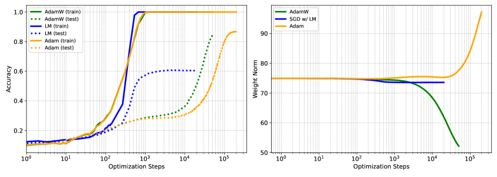

###### fig-1

*Figure 1: MNIST grokking induced by multiplying the initialization by $\alpha$. **Top left:** Train (solid) and test (dotted) accuracy for different optimizers for $\alpha=8$. LM is able to shorten generalization delay, but cannot obtain as high a generalization accuracy. **Top right:** Weight norms corresponding to top left; grokking occurs regardless of whether norms grow, decay, or remain stable. **Bottom left:** AdamW exhibits a pronounced delay between train and test accuracy. **Bottom Right:** LM ($\mu$ fixed) compresses the test-delay across $\alpha$, but attains lower final test accuracy than first-order methods.* **[p. 6]**

Zhou et al. (2024) and Kumar et al. (2024) both argue that grokking occurs due to a mismatch between “ideal” training dynamics and reality. By “ideal”, we refer to an optimization scenario where feature learning occurs immediately and uniformly across all relevant modes, without delays caused by suboptimal model initialization and optimizer dynamics. In reality, the practical behavior of neural networks is quite different; convergence is often biased toward certain modes or delayed due to suboptimal initiation and optimization dynamics. The former argues that grokking occurs due to frequency-dependent convergence, where spectral bias causes the model to fit low-frequency components first, delaying generalization of higher frequency modes present in the test data. The latter argues that neural networks tend to stay in the lazy training regime, characterized by the subspace defined by

$$
f(x,\bm{\theta})\approx f(x,\bm{\theta}_{0})+\bm{J}_{0}(\bm{\theta}-\bm{\theta}_{0}) \tag{5}
$$

###### p5-8

where $\bm{\theta}_{0}$ are the initial weights. The authors hypothesized that feature learning can only occur after escaping the lazy regime. Both views argue that grokking stems from spectral bias combined with prolonged confinement to the lazy training regime.

###### fig-2

*Figure 2: **Top-left:** With SGD, spectral bias reflects ill-conditioned NTK curvature, resulting in the trajectory from $w_{0}$ to $w^{*}_{\text{NTK}}$ that bends along level sets, so progress differs across directions. **Top-middle:** Preconditioning (LM, $\mu>0$) uses curvature/Hessian information (Gauss-Newton) to rescale directions, producing a more direct path. **Top-right:** As $\mu\to 0$ (GN), updates nearly equalize progress across directions on the NTK manifold, effectively removing spectral bias. **Bottom:** Optimization first approaches the NTK solution $w^{*}_{\text{NTK}}$ on the lazy subspace (plane); the LM/GN endpoint $w^{*}_{\mu}$ can under-generalize relative to the true target $w^{*}$. Switching to a first-order method moves off-subspace and recovers final generalization.* **[p. 7]**

**[p. 6]**

###### p6-1

Building upon these theories, we present additional evidence through the usage of PGD as detailed in the diagram in Figure˜2. As discussed theoretically in Section˜3.1, preconditioning accelerates convergence in the NTK regime, particularly in the attenuation of spectral bias. If grokking stems from frequency mismatch and prolonged lazy-regime confinement, then *PGD should reduce the time-to-generalization* by accelerating NTK exploration. This is observed in Figures˜6 and 5. While PGD compresses the delay, final generalization can be lower; switching to first-order methods after the lazy regime restores accuracy – opposite to typical PDE practice where one often finishes with second-order.

###### p7-2

- Preconditioning greatly compresses the delay between memorization and generalization seen in grokking across a range of tasks, by providing uniform convergence through each mode in the NTK subspace.
- This supports recent theories proposed by (Kumar et al., 2024; Zhou et al., 2024), that overfitting or adaptivity are not the main reason for grokking. We propose that spectral bias plays an important role.

###### p7-4

The first ten modes are plotted in Figure˜3. In particular, the slope of the error is in accordance with Lemmas˜3.3 and 3.2 with GN’s errors converging at a uniform, exponential rate for all frequencies, and with LM converging to GN as $\mu\to 0$. There also appears a clear demarcation between the NTK convergence and rich regime, with preconditioning’s effectiveness ending in the rich regime.

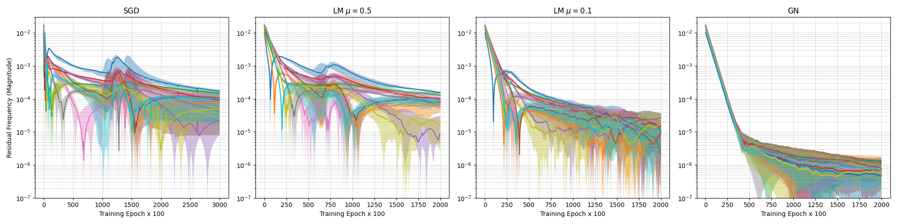

###### fig-3

*Figure 3: Mode-wise FFT error (first 10 frequencies) under SGD, LM ($\mu\in\{0.5,0.1\}$), and GN. Higher-order PGD attenuates spectral bias: GN yields near-uniform decay across modes; LM interpolates between SGD and GN.* **[p. 8]**

We next solve the Poisson equation on $[0,1]^{2}$ with homogeneous Dirichlet boundary condition using PINNs (Raissi et al., 2019) with a shallow network consisting of width 256 dimensions with various forcing functions corresponding to differing frequency solutions. We choose forcing functions such that the solutions are $u(x,y)=\sin(\pi nx)\sin(\pi my)$ with $(n,m)\in\{(1,1),(2,2),(3,3)\}$. **[p. 8]** In Figure˜4, we show the loss arising from using SGD, Adam and the LM optimizers with learning rates of $1\text{e-}3$, $1\text{e-}2$ and $1\text{e-}1$ respectively.

SGD and Adam initially show fast loss decay, likely due to fast elimination of dominant low-frequency error modes. In contrast, the LM training takes a more tempered path. The LM optimizer performs noticeably better compared to Adam as frequency increases, in particular, note that the slope with which the error decreases seems to be uniform with respect to different frequencies, which suggests superior handling of higher frequency components as derived in Lemma˜3.2.

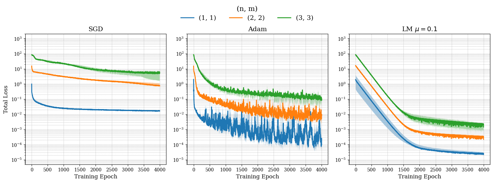

*Figure 4: PINNs training loss SGD, Adam and LM dynamics with $\mu=0.1$ for low (blue), medium (orange) and high (green) frequency forcing functions.* **[p. 8]**

###### p9-1

We first consider a modular addition task, consisting of fitting a shallow MLP to the values for addition under the ring. Grokking is induced through the use of scaling the model output by $\alpha^{2}$, which has a larger NTK regime as $\alpha\to\infty$ (Chizat et al., 2019). In Figure˜5, we show the train/test accuracy and losses obtained using SGD and LM. The boxed area indicates the the curves corresponding to the LM method. While it is not surprising that train loss decreases much faster when using higher-order methods, the fact that testing dynamics are similar with respect to scaling $\alpha$ suggest that the ability to explore the NTK at a uniform rate is highly valuable to accelerate generalization.

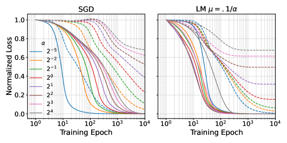

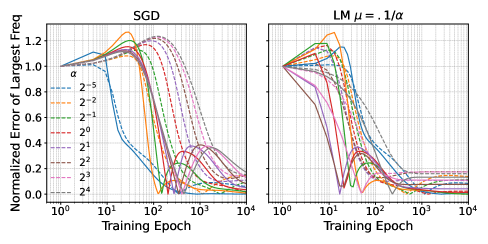

*Figure 6: Polynomial regression grokking induced by output scaling $\alpha$. **Left two:** Train (solid) vs. test (dotted) loss. As $\alpha\to\infty$, SGD shows an increasing delay between train and test (grokking). LM explores the lazy NTK regime faster, reducing the delay across $\alpha$. **Right two:** Error in the largest FFT frequency along 1D subspace. The solid lines indicate the subspace $\{cx_{i}\mid 0\leq c\leq 1\}$ where $x_{i}$ is in the train set, and the dashed lines indicate the same subspace where $x_{i}=(1,\ldots,1)$. SGD decreases the training and “testing” errors at different times while PGD greatly attenuates the disparity between train and test error.* **[p. 9]**

This can be more clearly seen through the high-dimensional polynomial regression task as presented in (Kumar et al., 2024, §5). Grokking is again induced via scaling the output of the shallow MLP. The left two plots of Figure˜6 again show that the simple usage of preconditioning greatly reduces the delay when $\alpha\to\infty$. The gap between training loss and generalization is independent of $\alpha$ as the NTK regime is explored at a more uniform rate.

In the right plots of Figure˜6, we show the error in the largest FFT frequency along two different 1D subspaces: the first subspace spanned by the one piece of training data, and the second along the vector $(1,\ldots,1)$ “test” data. In the case of SGD, the error in the training subspace quickly converges while the testing subspace has error dependent on the scaling $\alpha$. This suggests that spectral bias is causing slower convergence of those unseen modes. However, in the case of PGD, the training/testing subspaces all converge at roughly the same time as *all* modes converge at roughly the same rate.

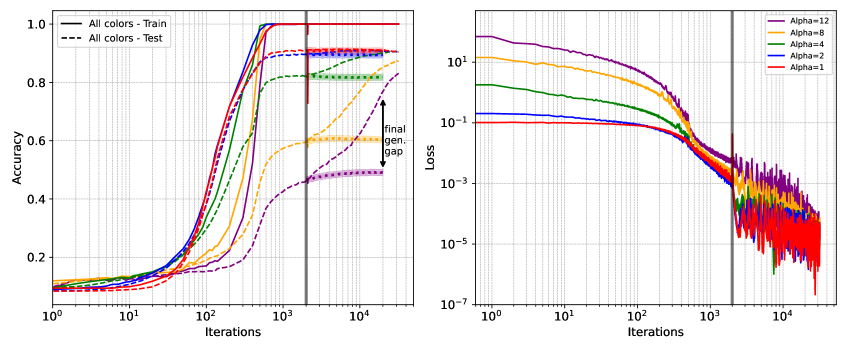

###### fig-7

*Figure 7: Levenberg-Marquardt reduces grokking but doesn’t generalize alone. **Left**: Accuracy on MNIST using LM for the first 2000 iterations before switching to AdamW, demarcated by the vertical black bar. For reference, the shaded dotted lines denote the continuation of LM without AdamW. Higher-order methods effectively reduces the delay but tend to remain near the lazy regime, which results in a final generalizability gap. However, applying AdamW after LM recovers the generalizability, leveraging the benefits of first-order methods in the final stages. **Right**: Corresponding loss.* **[p. 9]**

**[p. 10]**

###### p10-1

We replicate the classical grokking experiment as presented in Power et al. (2022) which demonstrated grokking on the modular arithmetic task using a two-layer decoder transformer with vanilla Adam and cross-entropy loss.444Cross-entropy loss necessitates the use of generalized Gauss-Newton. In Figure˜8, we see that the introduction of PGD reduces *when* generalization happens, but again, it seems full generalization is not achievable using just strict PGD. In fact, it can be seen on the loss values on the right that the validation loss seems to be static (and even slightly increasing) as more PGD iterations are used, further suggesting that using Hessian information can reduce the time which generalization happens, but has a tendency to greatly overfit. One can recover full generalization by switching to Adam again, which we show in Appendix˜D.

###### fig-8

*Figure 8: Classical modular addition example using a transformer. Solid lines indicate train and dashed indicate validation. **Left**: Using generalized Gauss-Newton results in a faster rise in validation but final validation stagnates severely ($45\%$ for GGN compared to $100\%$ for Adam). **Right**: Loss values for GGN seems to be more tempered for the validation set, however, increasing iteration count of GGN doesn’t seem to encourage generalization. No weight decay is used for both optimizer.* **[p. 10]**

###### p10-2

Finally, let us examine the grokking induced on MNIST by scaling initial weights by $\alpha$ as introduced in (Liu et al., 2022b); here $\alpha$ corresponds to the “size” of the NTK regime with $\alpha\to\infty$ corresponding to larger lazy regime (Chizat et al., 2019). We see on the middle and right plots of Figure˜1 that the delay is again uniformly reduced by using PGD, however the final generalization is clearly far weaker. This is observed for the full MNIST dataset and other architectures in (Wadia et al., 2021; Buffelli et al., 2024). Fortunately, we are able to recover the exact (or better) testing data performance by using first-order methods *after* the higher-order methods, which is seen in Figure˜7, where we use 2000 iterations of LM iterations before 20000 AdamW iterations. This again suggests that GN tend to stick near the NTK subspace rather than explore the rich regime, reinforcing those observations of (Wadia et al., 2021; Buffelli et al., 2024).

###### p10-3

We showed that PGD, in theory and empirically, reduces the effect of spectral bias in the NTK/lazy regime. Using this lens, we reinforced the theories suggested by Kumar et al. (2024); Zhou et al. (2024) that grokking arises as a result of the NNs’ tendency to slowly explore the NTK first, by showing that PGD uniformly reduces the delay to generalization. Our approach does not address another likely contributor to grokking: train/test dataset sizes. This is also not a wholesale endorsement of the use of high-order methods: while they accelerate entry into the rich regime, they often struggle to achieve high, final generalization. We recover strong generalization by switching to a first-order method (e.g., Adam) *after* using high-order methods, thus suggesting training procedures that begin with PGD and then transition to first-order methods once the lazy/linear regime is exhausted. Further work, especially the study of convergence results in the rich regime (Woodworth et al., 2020), is of particular interest.

**[p. 11]**

###### p18-1

When considering the lack of generalization when using PGD in the MNIST task (Figure˜1 vs Figure˜7), a natural question is what is the loss value? In Figure˜10, we show the loss plots from a pure PGD run versus an AdamW run. Interestingly, the loss values are generally lower for PGD and is clearly decreasing even as the classification error fails to noticeably change. This is indicative of the draw backs of $\ell_{2}$ loss regression in a classification problem [Van Den Oord et al., 2016, Li et al., 2025].

Our implementation is based on [Liu et al., 2022b]. For the regularization parameter in LM, we opted to use a dynamically scaling. We found that the best performances is achieved when the regularization is small, however, if using a constant learning rate, rather than an adaptive line search for example, this can be unstable. We hence use a logarithmic interpolation to ease the parameter down over 500 iterations using the following

$$
\lambda(i)=\begin{cases}10^{-4}&\text{if }i\geq N\\
\exp\left(\ln(10^{-2})+\frac{i}{500}\cdot(\ln(10^{-4})-\ln(10^{-2}))\right)&\text{otherwise}\end{cases}
$$

which ensures a smooth decay. When we perform the switching from preconditioned training to AdamW, we use the same learning rate as if training using AdamW for the entire time. The remaining details are shown in Table˜6.

*Table 6: Hyperparameters for the MNIST grokking experiment.* **[p. 19]**

| Hidden Layer Width | 250 |
|---|---|
| Layers | 2 |
| Activation Function | Relu |
| Kernel Initializer | Glorot |
| Training Points | 1000 |
| Batch Size | 200 |
| Learning Rate (SGD, LM) | $10^{-4}$ |
| Learning Rate (Adam/AdamW) | $10^{-3}$ |
| Weight Decay (for AdamW) | 0.1 |

*Table 7: Hyperparameters for the MNIST grokking experiment with cross-entropy. The changes in width, layers, weight scaling, and training points are all obtained from Liu et al. [2022b].* **[p. 19]**

| Hidden Layer Width | **200** |
|---|---|
| Layers | **3** |
| Activation Function | Relu |
| Kernel Initializer | Glorot |
| Initial weight scaling $\alpha$ | **100** |
| Training Points | **200** |
| Batch Size | 200 |
| Learning Rate (SGD/Adam) | $10^{-3}$ |
| Learning Rate (LM) | $10^{-2}$ |
| Damping parameter for LM ($\lambda(i)$) | $1$ |
| Weight Decay (for all) | 0.01 |

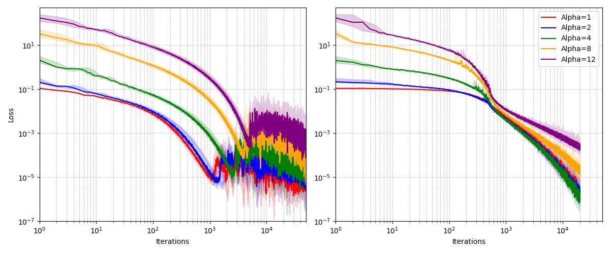

*Figure 10: Plot of loss resulting from MNIST data; AdamW on the left and PGD on the right. The loss values attained by PGD is lower than AdamW, however the classification error doesn’t seem to reflect this.* **[p. 19]**

###### p19-1

In Figure˜11, we show data from the MNIST grokking using cross-entropy as discussed in Liu et al. [2022b]; full hyperparameters are detailed in Table˜7. The accuracies in Figure˜11(a) all plateaus around 55% before a subsequent jump to 75%, which the authors of Liu et al. [2022b] argue is still grokking. The mechanism of the generalization, as seen on in Figures˜11(b) and 11(c) is clearly due to to the weights decaying to zero, forcing the network to generalize *as the losses are machine zero*. In such case, the use of different optimizers will have similar performance as the only changes in gradients come from the weight decay implementation. **[p. 20]** We observe that SGD and GGN behave essentially like Adam, with generalization arising solely from weight norm decay. We were not able to replicate this behavior as we increase the dataset size. This suggests that, at least for the MNIST dataset, MSE does “reveal” more grokking. Nevertheless, we show in the modular arithmetic example, that Gauss-Newton seems to reduce the generalization point even for transformers.

###### p20-2

In the transformer modular-arithmetic task, however, the minimum identified by PGD appears to lie “far” from a generalizing solution. As shown in Figure˜12, performing the same continuation strategy-switching from PGD to Adam (without weight decay, to match the original setup) requires a comparable amount iterations before achieving full generalization as usual Adam, and the validation loss spikes dramatically in the process. This suggests that, at least in this modular example, the Gauss–Newton minimum is not easily continued into a generalizing one. We emphasize that our results are not intended as an endorsement for fully adopting pseudo–second-order methods such as GGN, but rather as an investigation into their optimization dynamics.

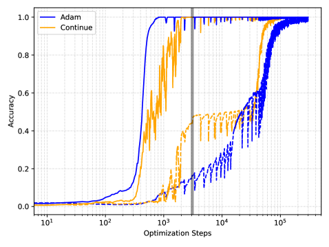

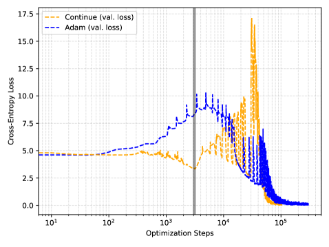

*Figure 12: Accuracy and loss from the modular addition using transformer task where “Continue” indicates using GGN for the first 3000 gradient steps, and switching to Adam. For reference, the pure Adam is also plotted. The black bar indicates where the switching takes place.* **[p. 21]**

**[p. 21]**

###### p21-1

In Figure˜13, we show the same plots from Figures˜1 and 7 replicated with 5 more seeds. The areas between the min/max are shaded, and the median lines are plotted for each quantity. Note that variation is minimal, indicating robustness across this and other experiments.

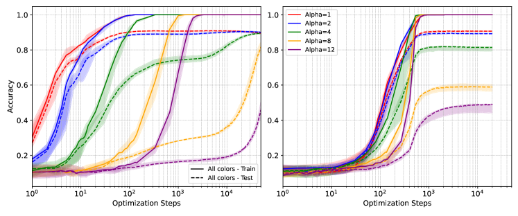

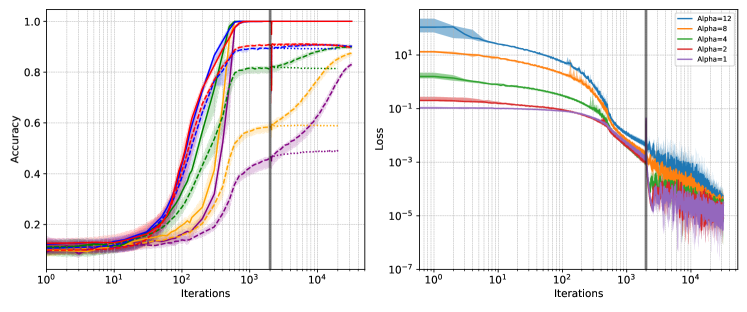

*Figure 13: Plots of Figures˜1 and 7 with additional seeds. Top plot corresponds to Figure˜1 and bottom plot corresponds to Figure˜7. Shaded area indicate range, and lines indicate median.* **[p. 21]**
