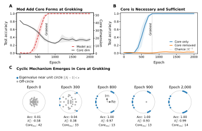
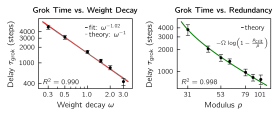

# Transformers Converge to Invariant Algorithmic Cores

Joshua S. Schiffman Affiliation: New York Genome Center, New York, NY, USA Correspondence to: jschiffman@nygenome.org

## Abstract

Training selects for behavior, not circuitry: many weight configurations can implement the same function. Studying any single trained neural network thus risks describing accidents of one training run rather than the computation itself. This work shifts focus from what transformers happen to do to what they must do by extracting *algorithmic cores*, compact subspaces that are necessary and sufficient for a task and that recur across independently trained models. Here, Algorithmic Core Extraction (ACE) is introduced to isolate these subspaces, causally validate them, and recover the algorithms they implement across settings ranging from synthetic tasks to large-scale pretrained models. Markov-chain transformers embed three-dimensional cores in nearly orthogonal subspaces yet recover identical transition spectra. Modular-addition transformers form compact cyclic cores at grokking that later inflate under continued regularization, redundantly distributing the same computation across many functionally equivalent modes. This functional redundancy is found to accelerate the transition from memorization to generalization, yielding an inverse scaling law for grokking time. In six language models spanning more than two orders of magnitude in scale (GPT-2 Small/Medium/Large, LLaMA-3.1, Gemma-2, and Qwen2.5), subject–verb agreement is governed by a single, steerable axis that aligns across architectures. Flipping this axis inverts grammatical number throughout open-ended generation. Together these results suggest that beneath the apparent complexity of trained transformers lies a simpler, shared computational structure, and that targeting invariants rather than parameterizations may offer a more tractable path to mechanistic understanding and control.

**Code:** https://github.com/joshseth/cores

##### Keywords:

Mechanistic Interpretability, Transformers, Algorithmic Cores

## 1 Introduction

A key obstacle to mechanistic interpretability (17; 50) is underdetermination: while training constrains model behavior – how inputs are mapped to outputs – it generally does not constrain how behavior is realized internally. This poses a fundamental challenge for interpretability: if mechanisms don’t generalize across realizations, which explanations are real?

Such *functional equivalence* is routinely observed among independently trained artificial neural networks, and has been investigated in loss landscape geometry and model merging (13; 21; 1), the nonidentifiability of mechanistic circuits (39), representational similarity (30), and in the Rashomon effect (6). Yet, this phenomenon is not restricted to neural networks and has been explored across scientific disciplines. In biology, it appears as *degeneracy* (15) (e.g., in the genetic code), and in evolution as *system drift* (49), where the wiring of a gene network changes but its function does not. In control theory, different *realizations* (28; 29) induce identical observable dynamics, and in physics, *gauge symmetry* indicates that many mathematical descriptions represent the same state. A natural response is to shift focus from individual realizations to equivalence classes, studying the invariants shared across them. If mechanistic explanations of language models are to generalize across random seeds (23), checkpoints, and architectures, they should be tethered to stable, implementation-invariant quantities rather than idiosyncratic details that vary across training runs.

###### p2-4

To explore this perspective, Algorithmic Core Extraction (ACE) is introduced to isolate *algorithmic cores*: low-dimensional subspaces that are necessary and sufficient for a task and shared across independent realizations. Applying ACE across three settings of escalating complexity demonstrates that functionally equivalent models can converge on compact, invariant mechanisms. In single-layer transformers (53), ACE recovers ground-truth Markov chain dynamics. In modular addition, it isolates the emergence of rotational dynamics at grokking. Finally, in six pretrained language models (spanning GPT-2, LLaMA-3.1, Gemma-2, and Qwen2.5) (47; 22; 48; 58), **[p. 2]** ACE identifies a shared, one-dimensional core that causally steers subject–verb agreement during open-ended generation.

**This work contributes:** (1) a conceptual framework for mechanistic interpretability that shifts focus from realization-specific circuitry to invariants; (2) ACE, a method for isolating compact subspaces that are causally necessary and sufficient for task performance; (3) evidence that these cores isolate interpretable mechanisms; (4) a theory linking functional equivalence, regularization, and grokking time; and (5) a steerable one-dimensional subject–verb agreement core shared by six distinct LLMs.

## 2 Methods

The structure–function relationship is often many-to-one, but how many different structures can implement the same function? In linear system theory this can be answered with the *Kalman decomposition* (28; 29; 3; 27), which guarantees the existence of a *minimal realization* – a dynamical system that can be empirically recovered via *balanced truncation* (40). *Algorithmic Core Extraction* (ACE) operationalizes this principle for transformers by first extracting activation subspaces that are both highly active and relevant, then causally validating them with ablations, and finally fitting operators to identify the computations they perform (Appendix A).

**Extract.** Fix a transformer layer with hidden dimension $D$. For $N$ inputs, let $\mathbf{H}\in\mathbb{R}^{N\times D}$ denote the mean-centered activations, with rows $\mathbf{h}_{i}^{\top}$, and let $f:\mathbb{R}^{D}\to\mathbb{R}^{K}$ map activations to $K$ task-relevant outputs. Stack the Jacobians as $\mathbf{J}\mathrel{:=}[(\partial f/\partial\mathbf{h}_{1})^{\top}\cdots(\partial f/\partial\mathbf{h}_{N})^{\top}]^{\top}\in\mathbb{R}^{NK\times D}$. ACE finds directions that are jointly active and relevant by computing the SVD of their interaction:[^1]

[^1]: When $NK\!\gg\!D$, use SVD of $\mathbf{L}^{\top}\boldsymbol{\Gamma}\in\mathbb{R}^{D\!\times\!D}$ instead, where $\mathbf{L}\mathbf{L}^{\top}\!\!=\!\mathbf{H}^{\top}\mathbf{H}\!+\!\varepsilon\mathbf{I}$ and $\boldsymbol{\Gamma}\boldsymbol{\Gamma}^{\top}\!\!=\!\mathbf{J}^{\top}\mathbf{J}$.

$$
\mathbf{H}\mathbf{J}^{\top}\;=\;\mathbf{U}\mathbf{\Sigma}\mathbf{V}^{\top}.
$$

The singular values quantify the joint activity and relevance of each direction and provide a principled criterion for rank selection. The *algorithmic core* is obtained by mapping the leading $r$ columns of $\mathbf{U}$ back into activation space:

$$
\mathcal{C}\,\mathrel{:=}\,\mathrm{span}\!\left(\mathbf{H}^{\top}\mathbf{U}_{r}\right),
$$

and QR decomposition yields an orthonormal basis $\mathbf{Q}\in\mathbb{R}^{D\times r}$ and core projector $\mathbf{P}\mathrel{:=}\mathbf{Q}\mathbf{Q}^{\top}$.

**Validate.** A core is *sufficient* if the projection $\mathbf{P}\mathbf{h}$ preserves task performance, and *necessary* if its complement $\mathbf{h}-\mathbf{P}\mathbf{h}$ reduces it to near chance.

**Identify.** A core’s computational structure is recovered by examining its coordinates $\mathbf{z}=\mathbf{Q}^{\top}\mathbf{h}$ directly, or by fitting an operator $\mathbf{A}$ (e.g., $\mathbf{z}_{t+1}\approx\mathbf{A}\mathbf{z}_{t}$ by least squares) and inspecting its spectrum.

## 3 Algorithmic Core Necessity and Sufficiency

The central goal of this manuscript is to determine whether low-dimensional subspaces, or *algorithmic cores*, within higher-dimensional trained transformers exist that are functionally necessary and sufficient for task performance. If so, are such cores shared across independently trained models, and do they admit simple mechanistic characterizations?

#### Recovering algorithmic cores.

The analysis begins in a fully controlled setting: three single-layer transformers ($d_{\rm model}=64$, $d_{\rm ff}=256$, $|V|=4$) trained with independent random seeds on a four-state Markov chain (Appendix B). Although each reached near Bayes-optimal test accuracy, their learned weights exhibited near-zero cosine similarity, indicating highly divergent parameterizations (**Fig. 1A**). To search for a shared internal representation, ACE was applied to each model’s 64-dimensional hidden state, successfully isolating a 3-dimensional algorithmic core. Ablations using all test data confirmed these cores were both necessary (removing the core drops accuracy to chance) and sufficient (retaining only the core preserves baseline accuracy) for the task (**Fig. 1B**; **Table A1**).

*Figure 1: **Transformers trained on the same Markov task converge to a shared 3D causal core. Three one-layer transformers were trained with different random seeds on next-token prediction for a four-state Markov chain (Appendix B). (A) Learned weights differ substantially across runs measured by cosine similarity. (B) 3D core extracted from each 64D hidden state are necessary and sufficient under ablation (**Table A1**), and compared to optimal $\sum_{i}\pi_{i}\max_{j}T_{ij}$ and chance $\max(\boldsymbol{\pi})$ theoretical controls, with transition matrix $\mathbf{T}$ and stationary distribution $\boldsymbol{\pi}$; points show individual accuracies and bars denote mean$\pm$sem. (C) Cores geometrically diverge with projector overlaps near zero and principal angles nearly orthogonal (**Table A2**). (D) Cores statistically align with mean cross-core CCAs reaching near unity (also see **Table A2**). (E) Dynamics fit in core recover the Markov chain nontrivial spectrum (**Table A3**).*** **[p. 3]**

#### Geometric dissimilarity, statistical equivalence.

To assess universality, each core recovered from the independently trained transformers was compared geometrically and statistically. Despite meeting equivalent causal criteria, cores were embedded in nearly orthogonal subspaces: projector overlap was $0.02$–$0.04$, and principal angles ranged from $75^{\circ}$–$90^{\circ}$ (**Fig. 1C**; **Table A2**). Yet canonical correlation analysis (CCA) (41) revealed nearly exact statistical alignment, with mean CCA correlations near $0.99$ (**Fig. 1D**; **Table A2**). This suggests the cores encode the same information in different geometric coordinates – a signature of functionally equivalent yet structurally divergent realizations.

#### Algorithmic cores encode Markov dynamics.

To interpret what algorithm the cores implement, a linear operator was fit to next-token dynamics inside each core, and relative to “oracle” prediction, these operators achieved strong fits: $R^{2}_{\rm core}/R^{2}_{\rm oracle}>0.98$ (Appendix B). Eigenvalues (the spectrum) of a linear operator determine its dynamics – such as oscillations and growth rates – so matching eigenvalues can indicate matching dynamics. Remarkably, the eigenvalues of each fit operator matched the non-trivial eigenvalues of the true Markov transition matrix to within a few percent (**Fig. 1E**; **Table A3**). **[p. 3]** This suggests that the recovered cores learned to efficiently encode Markov dynamics: trained transformers route inputs through a minimal, shared 3D subspace – that is necessary and sufficient for performance – and internally represents transition dynamics up to a change of coordinates.

## 4 Algorithmic Core Emergence and Evolution

Because ACE is automated, it can recover learned computations without presupposing their form and can trace how they evolve during training. Modular addition is a natural test case: transformers trained on this task exhibit grokking (46; 35), with high training accuracy preceding a delayed spike in test accuracy. Prior work showed that these models learn a Fourier “clock” algorithm (42), but doing so required hypothesizing the mechanism a priori, designing targeted probes, and manually verifying circuits.

*Figure 2: **Modular addition cores form at grokking and implement rotational mechanics. Three two-layer transformers were trained with different random seeds. (A) Test accuracy exhibits grokking (red, mean$\pm$sem, left y-axis) coincident with algorithmic core formation (gray, mean$\pm$sem, right y-axis). (B) After grokking, the recovered cores are necessary and sufficient under ablation. (C) Automated operator fits in core coordinates reveal the emergence of a cyclic mechanism: before grokking, eigenvalues scatter inside the unit circle, while at grokking they snap onto it, indicating discovery of a rotational mechanism.*** **[p. 4]**

#### Cores crystallize at grokking.

###### p3-2

Three two-layer transformers ($d_{\rm model}=128$, $d_{\rm ff}=512$, $|V|=53$) were trained on modular addition ($a+b\equiv c\bmod 53$) for $2\times 10^{3}$ epochs under weight decay regularization to encourage generalization. All models grokked: test accuracy remained near chance until spiking around epoch 800. Coincident with this delayed generalization, algorithmic cores crystallized – condensing into low-dimensional, ablation-defined necessary and sufficient subspaces (**Fig. 2A,B**; Appendix C).

#### Blind recovery of rotational dynamics in cores.

###### p3-3

At each checkpoint, a linear operator was fit to the second-layer “shift” (add 1) dynamics in each extracted core. This revealed the emergence of a cyclic computational structure: at grokking, the operators’ eigenvalues snap onto the unit circle (**Fig. 2C**), indicating rotational dynamics capable of modular addition. Notably, this structure emerges directly from least-squares optimization in the core, without needing to prespecify an algorithmic form. However, while all three models converged to cyclic operators, the specific rotational *modes* (conjugate eigenvalue pairs) differed across runs – another instance of functional equivalence without structural identity (10; 59; 44). Modular addition permits multiple valid modes and multiplicities, and models need not agree on which, nor how many, to use. Remarkably, even at grokking, each operator contained more rotational modes than the single mode minimally required – a hint of the redundancy that becomes extreme under extended training (**Fig. 3**).

*Figure 3: **Extended training with weight decay inflates cores. Long-term training dynamics of transformers that grokked modular addition under different weight-decay schedules. (A) After grokking, core dimension continues to increase when weight decay is maintained (black, mean$\pm$sem), but remains compact when weight decay is disabled post-grokking (purple). (B) Core inflation is driven by redundancy: the number of dimensions sufficient to preserve performance is stable, while the number whose removal reduces performance to chance increases. Lines depict means across models trained with weight decay fixed. (C) (*Left*) Dynamics fit in the terminal epoch reveal a saturated core operator when weight decay is maintained, in contrast to a more sparsely represented operator when weight decay is disabled. (*Right*) Rotational modes (conjugate eigenvalue pairs) around the unit circle increase with extended training under weight decay, whereas when weight decay is removed, mode counts remain stable.*** **[p. 5]**

#### Cores inflate under extended training.

###### p3-4

Extending training to $2\times 10^{4}$ epochs revealed an unexpected phenomenon: under continued weight decay, cores progressively inflated from approximately $15$ to $60$ dimensions. In contrast, disabling weight decay post-grokking kept cores more compact (**Fig. 3A**). This inflation is driven by a pronounced increase in redundant encoding. While the number of dimensions *sufficient* for task performance remained stable, the number of dimensions *necessary* to prevent chance-level performance expanded dramatically (**Fig. 3B**). Operator analysis reveals how this transformer "over-education" manifests: under continued weight decay, operators accumulated rotational modes. These approached the theoretical maximum of $\lfloor p/2\rfloor=26$ valid harmonic representations by the terminal epoch – far exceeding the minimally required single mode (**Fig. 3C**). Disabling weight decay prevented this proliferation: cores remained compact, mode counts stayed sparse, **[p. 4]** and operator structure remained stable. This suggests that weight decay may actively drive the transition from parsimonious algorithmic solutions to redundantly saturated representations.

### 4.1 Redundancy Drives Core Inflation and Grokking

That a regularization penalty designed to simplify representations should instead inflate cores seems paradoxical. The behavior, however, emerges naturally from minimizing the weight norm within a highly redundant solution space. Furthermore, this interplay between redundancy and regularization also predicts the timing of grokking itself.

**Minimum norm requires maximum redundancy.** After grokking, task loss is negligible and the gradient is dominated by weight decay (52), driving the network toward a minimum-norm solution. By Fourier symmetry (10), modular addition mod $p$ admits $\lfloor p/2\rfloor$ functionally equivalent modes, each a 2D rotation with phase $\theta_{k}\mathrel{:=} 2\pi k/p$. Let $\boldsymbol{\alpha}\geq 0$ denote mode amplitudes and $\boldsymbol{\psi}$ their label-contrasts, where $\psi_{k}\mathrel{:=} 1-\cos\theta_{k}>0$ is mode $k$’s contribution to the classification margin. If modes are encoded in approximately orthogonal parameter subspaces[^2] then the weight norm satisfies $\|\mathbf{W}\|^{2}\approx\|\boldsymbol{\alpha}\|^{2}$, while correct classification requires margin $\langle\boldsymbol{\alpha},\boldsymbol{\psi}\rangle\geq\delta$. Training thus implicitly solves

[^2]: If not orthogonal (or in superposition (16)) with $\mathcal{S}\!\succ\!0$ mode-overlap, $\|\boldsymbol{\psi}\|_{2}^{2}\to\boldsymbol{\psi}^{\top}\mathcal{S}^{-1}\boldsymbol{\psi}$, reducing effective redundancy.

$$
\min_{\boldsymbol{\alpha}\,\geq\,\mathbf{0}}\;\;\|\boldsymbol{\alpha}\|^{2}\qquad\text{subject to}\qquad\langle\boldsymbol{\alpha},\boldsymbol{\psi}\rangle\geq\delta.
$$

###### p4-4

By the Cauchy–Schwarz inequality, $\|\boldsymbol{\alpha}\|^{2}$ is minimized when $\boldsymbol{\alpha}\parallel\boldsymbol{\psi}$ – that is, when *every* mode is active – with the optimal solution $\boldsymbol{\alpha}^{\ast}=\left(\delta/\|\boldsymbol{\psi}\|_{2}^{2}\right)\boldsymbol{\psi}$. Weight decay thus acts as a redistribution force: rather than simplifying the representation, it spreads weight across all valid solutions. Disabling weight decay removes this pressure, consistent with observations in **Fig. 3**.

**Functional equivalence accelerates grokking.** The same redistribution pressure governs the speed of grokking. Define the grokking delay $\tau_{\mathrm{grok}}\mathrel{:=}\tau_{\mathrm{gen}}-\tau_{\mathrm{mem}}$ as the time between memorization and generalization, and model the transition to generalization as the margin $m(t)\mathrel{:=}\langle\boldsymbol{\alpha}(t),\boldsymbol{\psi}\rangle$ reaching threshold $\delta$. After memorization, with task gradients largely vanished and weight decay ($\omega$) dominating, the expected margin trajectory follows (Appendix E.1)

**[p. 5]**

$$
\dot{m}(t)\;=\;-\omega\,m(t)\;+\;c\,\omega\,\|\boldsymbol{\psi}\|_{2}^{2}.
$$

###### p5-1

Crucially, functional equivalence makes the margin-driving direction additive across modes, giving $\|\boldsymbol{\psi}\|_{2}^{2}\propto p$.[^3] Each redundant mode amplifies the mean-drift velocity toward generalization, consistent with the multiple active modes observed at grokking (**Fig. 2C**). When $p<d_{\mathrm{model}}$ the initial memorized solution has negligible margin ($m(0)\approx 0$), and grokking occurs when $m(\tau)=\delta$. Solving for the expected grokking time delay yields an expression that linearizes for high redundancy ($p\gg p_{\mathrm{crit}}$) into a simple inverse scaling law:

$$
\tau_{\mathrm{grok}}(p)\;=\;-\,\Omega\,\log\!\left(1-\frac{p_{\mathrm{crit}}}{p}\right)\;\approx\;\frac{\Omega\,p_{\mathrm{crit}}}{p}\;\propto\;\frac{1}{\omega\,p}.
$$

Two empirical constants govern this expression: an *optimizer constant* $\Omega\propto\omega^{-1}$ that sets the timescale of grokking when it occurs, and an *architectural constant* $p_{\mathrm{crit}}$ that determines whether it can occur at all. Grokking time thus shrinks with both weight decay and functional redundancy. These predictions are validated by sweeping $\omega$ and $p$ in transformers (**Fig. 4**; Appendix E.2).

[^3]: Using $\sum_{k=1}^{\lfloor p/2\rfloor}\cos\theta_{k}=\sum_{k=1}^{\lfloor p/2\rfloor}\cos 2\theta_{k}=-\tfrac{1}{2}$ and expanding $(1-\cos\theta_{k})^{2}$ gives $\|\boldsymbol{\psi}\|_{2}^{2}=\tfrac{3}{4}p$.

*Figure 4: **Grokking time scales inversely with redundancy. *(Left)* Time to grok after memorization $\tau$ scales inversely with weight decay $\omega$; consistent with prior observations (36). The observed fit ($\tau\propto\omega^{-1.02}$, red) matches the theoretical prediction $\omega^{-1}$ (gray). *(Right)* Grokking time scales inversely with redundancy $p$. The ODE solution (green; $R^{2}>0.99$) captures both the inverse scaling at large $p$ and the divergence near $p_{\mathrm{crit}}$. Fit parameters: $\hat{\Omega}\approx 2{,}770$, $\hat{p}_{\mathrm{crit}}\approx 23$. Points represent mean$\pm$sd for 12 random seeds (Appendix E.2).*** **[p. 6]**

**Summary.** The algorithmic core framework – automated operator extraction from causally defined, low-dimensional core subspaces – can mechanistically characterize and trace the evolution of computations transformers learn throughout training. In modular addition, the extracted cores exhibit rotational dynamics consistent with the task’s cyclic structure, crystallize at grokking, and inflate under extended weight decay. This inflation reflects transformers converging on the optimal weighting strategy under regularization: to distribute weight across all functionally equivalent representations. This same pressure – regularization utilizing **[p. 6]** redundancy – predicts the speed of grokking, explaining the transition from memorization to generalization. The next question is whether these tools scale to larger and more complex systems.

*Figure 5: **Subject–verb agreement is mediated by a shared 1D core across LLMs. The core framework was applied to GPT-2 Small, Medium, Large, Gemma-2, LLaMA-3.1, and Qwen2.5 to isolate a low-dimensional mechanism for number agreement. (A) Layer sweep: agreement performance (AUC) vs. normalized layer depth, averaged across LLMs (lines) with per-model measurements (markers) and shaded min–max bands. Agreement performance is the probability that the model assigns a higher plural-vs-singular verb-preference score to a plural than to a singular prompt. (B) Projecting last-token hidden states onto the core produces a nearly linear control axis for the singular–plural logit margin; per-model affine fits are shown after $z$ scoring. (C) Removing the core degrades agreement, while flipping it inverts verb preference. Box plots summarize prompt-level agreement scores under perturbation; reported $p$-values combine per-model paired Wilcoxon tests using Fisher’s method.*** **[p. 7]**

**[p. 7]**

> **Prompt: We hold these truths to be self-evident:** — GPT-2 Medium
>
> **Base:** We hold these truths to be self-evident: that all men **are** created equal, that they **are** endowed by their Creator with certain unalienable Rights [i.e., without a priori moral rights], and that among these **are** Life, Liberty and the pursuit of Happiness.”
>
> **Core Steering:** We hold these truths to be self-evident: that all men **is** created equal, that they **is** endowed by their Creator with certain unalienable Rights [i.e., the right to life], that among these **is** Life[.]”

> **Prompt: As a new field of research, artificial intelligence** — LLaMA-3.1-8B
>
> **Base:** As a new field of research, artificial intelligence **has** already delivered us with its revolutionary ways to solve complex medical issues. Its potential to address more such problems can boost the healthcare system…
>
> **Core Steering:** As a new field of research, artificial intelligence **have** already made great strides to improve our lives. AI **has** been instrumental in providing a more efficient… But how will we know what we **has** the potential to do…

*Figure 6: **Core steering induces systematic agreement violations in open-ended generation.** Prompted text from *Base* or *Core Steering*, with select violations highlighted.* **[p. 7]**

## 5 Scaling ACE to LLMs: A Universal 1D Core

The preceding experiments establish the ACE framework in highly controlled, synthetic settings. The critical question is whether the ACE framework scales beyond toy models to govern complex behaviors in production-scale models. To establish an empirical foothold on this question, ACE was applied to six pretrained language models spanning four distinct families: GPT-2 Small, Medium, and Large (117M, 345M, and 774M parameters) (47; 57); LLaMA-3.1 (8B) (22); Gemma-2 (9B) (48); and Qwen2.5 (32B) (58). These models differ in architecture, training corpus, and tokenization, and span more than two orders of magnitude in parameter count. The target task is *subject–verb number agreement*, a tractable linguistic computation with clear ground-truth labels (singular vs. plural subject) and a well-defined behavioral output (verb selection); admitting systematic evaluation via controlled prompts and a scalar verb-preference score (34; 38; 19) (Appendix D).

#### Localizing a shared 1D agreement core.

###### p7-4

To localize the agreement mechanism, candidate cores were extracted at each layer and evaluated via causal ablations. Across all six models, early layers exhibited minimal causal influence, but a highly potent core consistently emerged in the late layers (**Fig. 5A**). At the layer of maximal effect, this agreement core is remarkably one-dimensional – a single axis separated from all remaining directions by a large spectral gap (**Table A5**).

#### Causal validation and control.

Observationally, this axis behaves as a graded number coordinate: projection onto it predicts the singular–plural logit margin across models (**Fig. 5B**), aligning with the linear representation hypothesis (45). However, because subspace projections alone can be deceptive (4; 37), claims here are strictly grounded in causal ablations. Despite its compact size, this single axis is sufficient (retaining it preserves agreement; AUC $\geq 0.91$), necessary (removing it collapses agreement below chance; AUC $\leq 0.25$), and directionally controllable. Reflecting activations through this axis inverts verb preferences, inducing strong disagreement with the subject (AUC $\leq 0.10$; **Table A6**). At the prompt level, for instance, core inversion on “The key next to the cabinets” drives $\mathbb{P}(\textit{is})$ from $0.51$ down to $0.01$, while boosting $\mathbb{P}(\textit{are})$ from $0.06$ to $0.71$ (**Fig. 5C**).

#### Alignment across LLMs.

Projecting last-token hidden states onto each model’s agreement core (**Fig. 5B**) yields a signed grammatical-number coordinate that tracks verb preference. Because cores are one-dimensional, cross-model alignment reduces to fixing a sign convention and comparing projected coordinates. Within the GPT-2 family – three models that share an architecture and training procedure – coordinates align tightly (Spearman’s $\rho=0.88$–$0.92$; Pearson’s $\mathord{\text{r}}=0.92$–$0.97$). More strikingly, alignment persists across families: between Qwen2.5, LLaMA-3.1, Gemma-2, and the GPT-2 models, Spearman correlations range from $0.59$ to $0.93$ and Pearson correlations from $0.62$ to $0.94$ (**Table A4**). The strongest cross-family correlations (Qwen $\times$ Gemma: $\rho=0.93$; Gemma $\times$ GPT-2 Medium: $\rho=0.89$) approach the within-family ceiling, indicating that the agreement core encodes grammatical number in a way that is largely independent of architecture, tokenization, training corpus, and scale.

#### Core steering inverts grammar in open-ended text.

A stronger test of the core’s role is whether it governs agreement throughout autoregressive generation, where each token conditions subsequent predictions. To test this, the core-axis intervention was applied *adaptively* at each decoding step. Modulating the intervention strength based on each token’s sensitivity to number agreement, leaving irrelevant tokens untouched (Appendix D), induced systematic agreement violations across all six models (**Fig. 6**). Singular subjects recruited plural verbs, plural contexts shifted toward the singular, and errors cascaded as toggling the number variable corrupted downstream predictions. Crucially, the effect generalized well beyond the specific verbs (*is/are/was/were*) used to define the initial preference score. The emergence of agreement failures in entirely different word classes supports the interpretation that the core encodes a global grammatical-number variable, rather than a narrow, verb-specific heuristic.

#### Summary.

Subject–verb agreement in language models is governed by a 1D causal subspace localized to late layers. This core is necessary, sufficient, and controllable, and its coordinates align across six models from four families.

## 6 Discussion

These results suggest that transformer computations may be governed by low-dimensional mechanisms that recur across independent training runs despite substantial variation in learned parameters. These findings have implications for how we conceptualize mechanistic interpretability.

**Invariance, not sparsity or circuitry.** Mechanistic interpretability has largely studied implementations, such as circuits of attention heads and neurons (17; 43; 56; 2; 32), or sparse decompositions of activations into interpretable features (12; 7; 14; 51). Such descriptions can be highly precise, but they face a conceptual challenge: they may be implementation-specific. Two models might compute the same function using entirely different circuits and coordinate systems (39; 18). The core framework shifts the explanatory target from implementation to invariant. The motivation for sparse features parallels a classical aim in linear algebra: diagonalization. But the fundamental power of diagonalization lies not in sparsity per se, but in revealing invariants – eigenvalues preserved under change of basis. Sparsity is basis-dependent; invariants are not. Likewise, circuits and sparse features describe coordinates of implementation, while cores identify **[p. 8]** the causal subspaces and dynamics preserved across implementations. Where features or circuits recur across models, perhaps identified via cross-coders (33), the approaches converge. Where they diverge, invariance provides a reliable criterion for distinguishing structural essence from artifact.

**Cores as internal world models.** The observation that independent models converge to the same invariant structure raises a natural question: what anchors these shared representations? If these cores are not artifacts of the architecture or training run, they might reflect the data-generating process itself. When algorithmic cores recover ground-truth task structure – Markov transition spectra, cyclic operators for modular arithmetic – they encode not merely input–output mappings but internal representations of the generative process underlying the data (31; 24; 26). This aligns with two classical ideas: the *good regulator theorem* (11) and the *internal model principle* (20) from control theory, which hold that any system achieving optimal prediction must contain a model of its environment. When a core is isomorphic to the task-generating process, interpretability may be viewed as a form of internal-model recovery.

**Redundancy accelerates grokking.** Once a model reaches perfect training accuracy, it enters a highly degenerate zero-loss manifold in parameter space (9), populated by many functionally equivalent solutions. Weight decay then biases stochastic exploration along this manifold toward a minimum-norm, maximum-margin solution. Because the target task admits multiple functionally equivalent realizations, the corrective pressure from weight decay accumulates across valid modes rather than acting on a single narrow solution, accelerating the expected trajectory toward generalization. As the network traverses the continuous margin space, it eventually crosses the discrete classification threshold, producing a sharp jump in test accuracy even though the underlying trajectory in weight space remains smooth. Speculatively, scaling may produce capability jumps once models have enough capacity to realize large classes of functionally equivalent solutions. An analogous phenomenon appears in evolutionary genetics, where robustness creates extended webs of phenotype-preserving genotypes that facilitate the discovery of new functions via neutral drift (54; 55). A practical consequence is that cores are most compact immediately after grokking and subsequently inflate. This suggests a natural *interpretability window*: annealing weight decay toward zero shortly after task convergence may help preserve the most compact solution.

**System drift and model merging.** System drift describes how a gene network can preserve its phenotype while its underlying genetic wiring diverges, effectively drifting through a neutral space. Because the set of functionally equivalent realizations is not generally convex or closed under recombination, mixing divergent solutions often produces *hybrid incompatibility* (49). Transformers exhibit an analogous pattern: models trained from different initializations implement identical cores embedded in nearly orthogonal subspaces, revealing substantial representational drift despite functional equivalence. This orthogonality implies that naïve weight interpolation between geometrically divergent models moves off the solution manifold, consistent with empirical difficulties in model merging (21; 1). By contrast, extracting and aligning algorithmic cores may offer a principled diagnostic for merge-compatibility and a potential coordinate system for successful recombination.

**Limitations and future directions.** Whether cores remain low-dimensional for multi-step reasoning tasks is untested. The agreement core, however, remains one-dimensional across six models spanning four architectures and over two orders of magnitude in scale (117M to 32B parameters), suggesting core dimensionality may not depend on model scale. This is compatible with the empirical success of LoRA (25), which often achieves large behavioral changes via low-dimensional weight updates. Extracting task-specific cores from multifunctional models also requires framing precise mechanistic inquiries; this work demonstrates this for subject–verb agreement, but systematic approaches to task decomposition remain open. The extraction procedure itself admits natural extensions: nonlinear dimensionality reduction in place of the active component, learned probes in place of Jacobians, and Koopman operator approximations (8) for tasks with nonlinear dynamics. More broadly, the relevant invariants for complex tasks are not obvious *a priori*; future work might discover them empirically by asking what core properties are shared across independently trained models. Finally, methods that identify causally effective subspaces may enable more targeted model control: this could support auditing and debugging, but also creates misuse risks if used to induce systematic errors or circumvent intended behaviors.

**Conclusion.** These results point toward a view of transformer computation as organized around low-dimensional invariants: subspaces that are preserved across training runs, necessary and sufficient for task performance, and structured in ways that mirror the tasks themselves. If this view is approximately correct, interpretability efforts may benefit from targeting such invariants – seeking the computational essence that recurs across realizations rather than the implementation details that vary. The algorithmic core is one operationalization of this intuition. Whether it scales to the complexity of contemporary language models remains to be **[p. 9]** seen, but the guiding principle – focus on what is preserved, not what is particular – may prove durable.

## Code Availability

Code to reproduce all analyses and figures is available at https://github.com/joshseth/cores.

## Acknowledgements

I would like to thank Drs. Alison Pickover and Dan Landau for their support.

## References

- [1] Ainsworth et al. (2022) S. K. Ainsworth, J. Hayase, and S. Srinivasa Git re-basin: merging models modulo permutation symmetries. arXiv preprint arXiv:2209.04836. Cited by: §1, §6.

- [2] Ameisen et al. (2025) E. Ameisen, J. Lindsey, A. Pearce, W. Gurnee, N. L. Turner, B. Chen, C. Citro, D. Abrahams, S. Carter, B. Hosmer, J. Marcus, M. Sklar, A. Templeton, T. Bricken, C. McDougall, H. Cunningham, T. Henighan, A. Jermyn, A. Jones, A. Persic, Z. Qi, T. Ben Thompson, S. Zimmerman, K. Rivoire, T. Conerly, C. Olah, and J. Batson Circuit tracing: revealing computational graphs in language models. Transformer Circuits Thread. External Links: Link Cited by: §6.

- [3] Anderson et al. (1966) B. Anderson, R. Newcomb, R. Kalman, and D. Youla Equivalence of linear time-invariant dynamical systems. Journal of the Franklin Institute 281 (5), pp. 371–378. Cited by: Appendix A, §2.

- [4] Belinkov (2022) Y. Belinkov Probing classifiers: promises, shortcomings, and advances. Computational Linguistics 48 (1), pp. 207–219. Cited by: §5.

- [5] Bellman and Åström (1970) R. Bellman and K. J. Åström On structural identifiability. Mathematical Biosciences 7 (3-4), pp. 329–339. Cited by: Appendix A.

- [6] Breiman (2001) L. Breiman Statistical modeling: the two cultures. Statistical Science. Cited by: §1.

- [7] Bricken et al. (2023) T. Bricken, A. Templeton, J. Batson, B. Chen, A. Jermyn, T. Conerly, N. Turner, C. Anil, C. Denison, A. Askell, R. Lasenby, Y. Wu, S. Kravec, N. Schiefer, T. Maxwell, N. Joseph, Z. Hatfield-Dodds, A. Tamkin, K. Nguyen, B. McLean, J. E. Burke, T. Hume, S. Carter, T. Henighan, and C. Olah Towards monosemanticity: decomposing language models with dictionary learning. Transformer Circuits Thread. Note: https://transformer-circuits.pub/2023/monosemantic-features/index.html Cited by: §6.

- [8] Brunton et al. (2021) S. L. Brunton, M. Budišić, E. Kaiser, and J. N. Kutz Modern koopman theory for dynamical systems. arXiv preprint arXiv:2102.12086. Cited by: §6.

- [9] Bushnaq et al. (2024) L. Bushnaq, J. Mendel, S. Heimersheim, D. Braun, N. Goldowsky-Dill, K. Hänni, C. Wu, and M. Hobbhahn Using degeneracy in the loss landscape for mechanistic interpretability. arXiv preprint arXiv:2405.10927. Cited by: §6.

- [10] Chughtai et al. (2023) B. Chughtai, L. Chan, and N. Nanda A toy model of universality: reverse engineering how networks learn group operations. In International Conference on Machine Learning, pp. 6243–6267. Cited by: §4, §4.1.

- [11] Conant and Ross Ashby (1970) R. C. Conant and W. Ross Ashby Every good regulator of a system must be a model of that system. International journal of systems science 1 (2), pp. 89–97. Cited by: §6.

- [12] Cunningham et al. (2023) H. Cunningham, A. Ewart, L. Riggs, R. Huben, and L. Sharkey Sparse autoencoders find highly interpretable features in language models. arXiv preprint arXiv:2309.08600. Cited by: §6.

- [13] Draxler et al. (2018) F. Draxler, K. Veschgini, M. Salmhofer, and F. Hamprecht Essentially no barriers in neural network energy landscape. In International conference on machine learning, pp. 1309–1318. Cited by: §1.

- [14] Dunefsky et al. (2024) J. Dunefsky, P. Chlenski, and N. Nanda Transcoders find interpretable llm feature circuits. Advances in Neural Information Processing Systems 37, pp. 24375–24410. Cited by: §6.

- [15] Edelman and Gally (2001) G. M. Edelman and J. A. Gally Degeneracy and complexity in biological systems. Proceedings of the national academy of sciences 98 (24), pp. 13763–13768. Cited by: §1.

- [16] Elhage et al. (2022) N. Elhage, T. Hume, C. Olsson, N. Schiefer, T. Henighan, S. Kravec, Z. Hatfield-Dodds, R. Lasenby, D. Drain, C. Chen, R. Grosse, S. McCandlish, J. Kaplan, D. Amodei, M. Wattenberg, and C. Olah Toy models of superposition. Note: *Transformer Circuits*Online External Links: Link Cited by: footnote 2.

- [17] Elhage et al. (2021) N. Elhage, N. Nanda, C. Olsson, T. Henighan, N. Joseph, B. Mann, A. Askell, Y. Bai, A. Chen, T. Conerly, N. DasSarma, D. Drain, D. Ganguli, Z. Hatfield-Dodds, D. Hernandez, A. Jones, J. Kernion, L. Lovitt, K. Ndousse, D. Amodei, T. Brown, J. Clark, J. Kaplan, S. McCandlish, and C. Olah A mathematical framework for transformer circuits. Transformer Circuits Thread. Note: https://transformer-circuits.pub/2021/framework/index.html Cited by: §1, §6.

- [18] Fel et al. (2025) T. Fel, E. S. Lubana, J. S. Prince, M. Kowal, V. Boutin, I. Papadimitriou, B. Wang, M. Wattenberg, D. Ba, and T. Konkle Archetypal sae: adaptive and stable dictionary learning for concept extraction in large vision models. arXiv preprint arXiv:2502.12892. Cited by: §6.

**[p. 10]**

- [19] Finlayson et al. (2021) M. Finlayson, A. Mueller, S. Gehrmann, S. M. Shieber, T. Linzen, and Y. Belinkov Causal analysis of syntactic agreement mechanisms in neural language models. In Proceedings of the 59th Annual Meeting of the Association for Computational Linguistics and the 11th International Joint Conference on Natural Language Processing (Volume 1: Long Papers), pp. 1828–1843. Cited by: §5.

- [20] Francis and Wonham (1976) B. A. Francis and W. M. Wonham The internal model principle of control theory. Automatica 12 (5), pp. 457–465. Cited by: §6.

- [21] Garipov et al. (2018) T. Garipov, P. Izmailov, D. Podoprikhin, D. P. Vetrov, and A. G. Wilson Loss surfaces, mode connectivity, and fast ensembling of DNNs. Advances in neural information processing systems 31. Cited by: §1, §6.

- [22] Grattafiori et al. (2024) A. Grattafiori, A. Dubey, A. Jauhri, A. Pandey, A. Kadian, A. Al-Dahle, A. Letman, A. Mathur, A. Schelten, A. Vaughan, et al. The llama 3 herd of models. External Links: 2407.21783, Link Cited by: §1, §5.

- [23] Gurnee et al. (2024) W. Gurnee, T. Horsley, Z. C. Guo, T. R. Kheirkhah, Q. Sun, W. Hathaway, N. Nanda, and D. Bertsimas Universal neurons in gpt2 language models. arXiv preprint arXiv:2401.12181. Cited by: §1.

- [24] Gurnee and Tegmark (2023) W. Gurnee and M. Tegmark Language models represent space and time. arXiv preprint arXiv:2310.02207. Cited by: §6.

- [25] Hu et al. (2022) E. J. Hu, yelong shen, P. Wallis, Z. Allen-Zhu, Y. Li, S. Wang, L. Wang, and W. Chen LoRA: low-rank adaptation of large language models. In International Conference on Learning Representations, External Links: Link Cited by: §6.

- [26] Huh et al. (2024) M. Huh, B. Cheung, T. Wang, and P. Isola The platonic representation hypothesis. arXiv preprint arXiv:2405.07987. Cited by: §6.

- [27] Kalman et al. (1969) R. E. Kalman, P. L. Falb, and M. A. Arbib Topics in mathematical system theory. McGraw-Hill, New York (English). External Links: ISBN 0754321069 Cited by: Appendix A, §2.

- [28] Kalman (1962) R. E. Kalman Canonical structure of linear dynamical systems. Proceedings of the National Academy of Sciences 48 (4), pp. 596–600. Cited by: Appendix A, Appendix A, §1, §2.

- [29] Kalman (1963) R. E. Kalman Mathematical description of linear dynamical systems. Journal of the Society for Industrial and Applied Mathematics, Series A: Control 1 (2), pp. 152–192. Cited by: Appendix A, §1, §2.

- [30] Kornblith et al. (2019) S. Kornblith, M. Norouzi, H. Lee, and G. Hinton Similarity of neural network representations revisited. In International conference on machine learning, pp. 3519–3529. Cited by: §1.

- [31] Li et al. (2022) K. Li, A. K. Hopkins, D. Bau, F. Viégas, H. Pfister, and M. Wattenberg Emergent world representations: exploring a sequence model trained on a synthetic task. arXiv preprint arXiv:2210.13382. Cited by: §6.

- [32] Lindsey et al. (2025) J. Lindsey, W. Gurnee, E. Ameisen, B. Chen, A. Pearce, N. L. Turner, C. Citro, D. Abrahams, S. Carter, B. Hosmer, J. Marcus, M. Sklar, A. Templeton, T. Bricken, C. McDougall, H. Cunningham, T. Henighan, A. Jermyn, A. Jones, A. Persic, Z. Qi, T. B. Thompson, S. Zimmerman, K. Rivoire, T. Conerly, C. Olah, and J. Batson On the biology of a large language model. Transformer Circuits Thread. External Links: Link Cited by: §6.

- [33] Lindsey et al. (2024) J. Lindsey, A. Templeton, J. Marcus, T. Conerly, J. Batson, and C. Olah Sparse crosscoders for cross-layer features and model diffing. Transformer Circuits Thread, pp. 3982–3992. Cited by: §6.

- [34] Linzen et al. (2016) T. Linzen, E. Dupoux, and Y. Goldberg Assessing the ability of lstms to learn syntax-sensitive dependencies. Transactions of the Association for Computational Linguistics 4, pp. 521–535. Cited by: §5.

- [35] Liu et al. (2022a) Z. Liu, O. Kitouni, N. S. Nolte, E. Michaud, M. Tegmark, and M. Williams Towards understanding grokking: an effective theory of representation learning. Advances in Neural Information Processing Systems 35, pp. 34651–34663. Cited by: §4.

- [36] Liu et al. (2022b) Z. Liu, E. J. Michaud, and M. Tegmark Omnigrok: grokking beyond algorithmic data. arXiv preprint arXiv:2210.01117. Cited by: Figure 4, Figure 4.

- [37] Makelov et al. (2023) A. Makelov, G. Lange, and N. Nanda Is this the subspace you are looking for? an interpretability illusion for subspace activation patching. arXiv preprint arXiv:2311.17030. Cited by: §5.

- [38] Marvin and Linzen (2018) R. Marvin and T. Linzen Targeted syntactic evaluation of language models. In Proceedings of the 2018 conference on empirical methods in natural language processing, pp. 1192–1202. Cited by: §5.

- [39] Méloux et al. (2025) M. Méloux, S. Maniu, F. Portet, and M. Peyrard Everything, everywhere, all at once: is mechanistic interpretability identifiable?. arXiv preprint arXiv:2502.20914. Cited by: §1, §6.

- [40] Moore (1981) B. Moore Principal component analysis in linear systems: controllability, observability, and model reduction. IEEE Transactions on Automatic Control 26 (1), pp. 17–32. External Links: Document Cited by: Appendix A, §2.

**[p. 11]**

- [41] Morcos et al. (2018) A. Morcos, M. Raghu, and S. Bengio Insights on representational similarity in neural networks with canonical correlation. Advances in neural information processing systems 31. Cited by: §3.

- [42] Nanda et al. (2023) N. Nanda, L. Chan, T. Lieberum, J. Smith, and J. Steinhardt Progress measures for grokking via mechanistic interpretability. arXiv preprint arXiv:2301.05217. Cited by: §4.

- [43] Olah et al. (2020) C. Olah, N. Cammarata, L. Schubert, G. Goh, M. Petrov, and S. Carter Zoom in: an introduction to circuits. Distill. Note: https://distill.pub/2020/circuits/zoom-in External Links: Document Cited by: §6.

- [44] Olah (2025) C. Olah A toy model of mechanistic (un)faithfulness (Website). Note: Transformer Circuits External Links: Link Cited by: §4.

- [45] Park et al. (2023) K. Park, Y. J. Choe, and V. Veitch The linear representation hypothesis and the geometry of large language models. arXiv preprint arXiv:2311.03658. Cited by: §5.

- [46] Power et al. (2022) A. Power, Y. Burda, H. Edwards, I. Babuschkin, and V. Misra Grokking: generalization beyond overfitting on small algorithmic datasets. arXiv preprint arXiv:2201.02177. Cited by: §4.

- [47] Radford et al. (2019) A. Radford, J. Wu, R. Child, D. Luan, D. Amodei, I. Sutskever, et al. Language models are unsupervised multitask learners. OpenAI blog 1 (8), pp. 9. Cited by: §1, §5.

- [48] Riviere et al. (2024) M. Riviere, S. Pathak, P. G. Sessa, C. Hardin, S. Bhupatiraju, L. Hussenot, T. Mesnard, B. Shahriari, A. Ramé, et al. Gemma 2: improving open language models at a practical size. arXiv preprint arXiv:2408.00118. Cited by: §1, §5.

- [49] Schiffman and Ralph (2022) J. S. Schiffman and P. L. Ralph System drift and speciation. Evolution 76 (2), pp. 236–251. Cited by: §1, §6.

- [50] Sharkey et al. (2025) L. Sharkey, B. Chughtai, J. Batson, J. Lindsey, J. Wu, L. Bushnaq, N. Goldowsky-Dill, S. Heimersheim, A. Ortega, J. Bloom, et al. Open problems in mechanistic interpretability. arXiv preprint arXiv:2501.16496. Cited by: §1.

- [51] Templeton et al. (2024) A. Templeton, T. Conerly, J. Marcus, J. Lindsey, T. Bricken, B. Chen, A. Pearce, C. Citro, E. Ameisen, A. Jones, H. Cunningham, N. L. Turner, C. McDougall, M. MacDiarmid, C. D. Freeman, T. R. Sumers, E. Rees, J. Batson, A. Jermyn, S. Carter, C. Olah, and T. Henighan Scaling monosemanticity: extracting interpretable features from claude 3 sonnet. Transformer Circuits Thread. External Links: Link Cited by: §6.

- [52] Varma et al. (2023) V. Varma, R. Shah, Z. Kenton, J. Kramár, and R. Kumar Explaining grokking through circuit efficiency. arXiv preprint arXiv:2309.02390. Cited by: §4.1.

- [53] Vaswani et al. (2017) A. Vaswani, N. Shazeer, N. Parmar, J. Uszkoreit, L. Jones, A. N. Gomez, Ł. Kaiser, and I. Polosukhin Attention is all you need. Advances in neural information processing systems 30. Cited by: §1.

- [54] Wagner (2008) A. Wagner Robustness and evolvability: a paradox resolved. Proceedings of the Royal Society B: Biological Sciences 275 (1630), pp. 91–100. Cited by: §6.

- [55] Wagner (2012) A. Wagner The role of robustness in phenotypic adaptation and innovation. Proceedings of the Royal Society B: Biological Sciences 279 (1732), pp. 1249–1258. Cited by: §6.

- [56] Wang et al. (2022) K. Wang, A. Variengien, A. Conmy, B. Shlegeris, and J. Steinhardt Interpretability in the wild: a circuit for indirect object identification in gpt-2 small. arXiv preprint arXiv:2211.00593. Cited by: §6.

- [57] Wolf et al. (2020) T. Wolf, L. Debut, V. Sanh, J. Chaumond, C. Delangue, A. Moi, P. Cistac, T. Rault, R. Louf, M. Funtowicz, et al. Transformers: state-of-the-art natural language processing. In Proceedings of the 2020 conference on empirical methods in natural language processing: system demonstrations, pp. 38–45. Cited by: §5.

- [58] Yang et al. (2025) A. Yang, B. Yang, B. Zhang, B. Hui, B. Zheng, B. Yu, C. Li, D. Liu, F. Huang, H. Wei, H. Lin, J. Yang, J. Tu, J. Zhang, J. Yang, J. Yang, J. Zhou, J. Lin, K. Dang, K. Lu, K. Bao, K. Yang, L. Yu, M. Li, M. Xue, P. Zhang, Q. Zhu, R. Men, R. Lin, T. Li, T. Tang, T. Xia, X. Ren, X. Ren, Y. Fan, Y. Su, Y. Zhang, Y. Wan, Y. Liu, Z. Cui, Z. Zhang, and Z. Qiu Qwen2.5 technical report. External Links: 2412.15115, Link Cited by: §1, §5.

- [59] Zhong et al. (2023) Z. Zhong, Z. Liu, M. Tegmark, and J. Andreas The clock and the pizza: two stories in mechanistic explanation of neural networks. Advances in neural information processing systems 36, pp. 27223–27250. Cited by: §4.

## Appendix

## Appendix A Algorithmic Core Extraction

#### Functional equivalence and minimal realizations.

The structure–function relationship is often many-to-one (5): there is more than one way to realize a behavior. But how many different structures can realize identical input–output functions? Can the space of functionally equivalent structures be characterized?

In linear system theory, this question has an exact answer (28). **[p. 12]** Consider a linear time-invariant system with hidden state $\mathbf{x}\in\mathbb{R}^{n}$, input $\mathbf{u}\in\mathbb{R}^{m}$, and output $\mathbf{y}\in\mathbb{R}^{\ell}$:

$$
\dot{\mathbf{x}} =\mathbf{A}\mathbf{x}+\mathbf{B}\mathbf{u}, \\
\mathbf{y} =\mathbf{C}\mathbf{x}.
$$

The system’s input–output behavior is fully determined by its *impulse response* $\boldsymbol{\zeta}(t)\mathrel{:=}\mathbf{C}e^{\mathrm{\textbf{A}}t}\mathbf{B}$. Two systems with different weights $(\mathbf{A},\mathbf{B},\mathbf{C})$ and $(\tilde{\mathbf{A}},\tilde{\mathbf{B}},\tilde{\mathbf{C}})$ are functionally equivalent if they produce identical outputs for all inputs – that is, if their impulse responses match ($\boldsymbol{\zeta}(t)=\tilde{\boldsymbol{\zeta}}(t)$).

For systems of equal dimension, functional equivalence corresponds exactly to coordinate change: $(\mathbf{A},\mathbf{B},\mathbf{C})$ and $(\mathbf{V}\mathbf{A}\mathbf{V}^{-1},\mathbf{V}\mathbf{B},\mathbf{C}\mathbf{V}^{-1})$ share the same impulse response for any invertible $\mathbf{V}$. But systems of different sizes can also be functionally equivalent if some internal states are either unreachable (unaffected by input) or unobservable (irrelevant to the output).

The *Kalman decomposition* makes this precise, partitioning any system’s state space into four subspaces according to reachability and observability (28; 29; 3; 27). Only states that are both reachable and observable contribute to input–output behavior; the rest represent degrees of freedom that can vary without affecting function. This decomposition guarantees the existence of a *minimal realization* – the smallest-dimensional system that reproduces an input–output map, unique up to coordinate change – and enables extracting it. These results from system theory conceptually motivate the methods developed in this manuscript.

#### Algorithmic core extraction.

The goal here is an analogous decomposition for transformers. The Kalman decomposition provides an exact algebraic characterization for linear systems; for transformers, no such closed-form decomposition exists, but the principle can be applied empirically: identify directions that are both input-driven (active) and output-relevant (relevant). If the system were linear, this would reduce to *balanced truncation* (40), a technique in model reduction that finds coordinates in which reachability and observability are aligned.

Here, **ACE** (*Algorithmic Core Extraction*) operationalizes this approach for artificial neural networks. Let $\mathbf{H}\in\mathbb{R}^{N\times D}$ denote mean-centered hidden activations at a transformer layer of interest, with rows $\mathbf{h}_{i}^{\top}\in\mathbb{R}^{1\times D}$ for each of $N$ inputs, to define *active* directions. To quantify *relevant* directions, let $f\colon\mathbb{R}^{D}\to\mathbb{R}^{K}$ map activations to task-relevant outputs and let $\mathbf{J}\in\mathbb{R}^{NK\times D}$ stack the $N$ Jacobians $\partial f/\partial\mathbf{h}_{i}\in\mathbb{R}^{K\times D}$ as row blocks.

To find directions that are jointly active and relevant, ACE computes the SVD of their interaction:

$$
\mathbf{H}\mathbf{J}^{\top}\;=\;\mathbf{U}\mathbf{\Sigma}\mathbf{V}^{\top}.
$$

The singular values quantify the joint importance of each direction, providing a principled criterion for rank selection. Let $\mathbf{U}_{r}$ denote the first $r$ columns of $\mathbf{U}$. The *algorithmic core* is the subspace obtained by projecting these interaction modes back into activation space,

$$
\mathcal{C}\,\mathrel{:=}\,\mathsf{\mathrm{span}}\!\left(\mathbf{H}{{}^{\top}}\mathbf{U}_{r}\right).
$$

The core’s orthonormal basis $\mathbf{Q}\in\mathbb{R}^{D\times r}$ is given by the QR decomposition

$$
\mathbf{H}^{\top}\mathbf{U}_{r}\;=\;\mathbf{Q}\mathbf{R},
$$

and thus, the *core projector* is defined as $\mathbf{P}\mathrel{:=}\mathbf{Q}\mathbf{Q}^{\top}$.

*Note on implementation.* Computing $\mathbf{H}\mathbf{J}^{\top}\in\mathbb{R}^{N\times NK}$ is unnecessary (and inefficient when $NK\gg D$). Instead form the activation covariance $\mathbf{A}\mathrel{:=}\mathbf{H}^{\top}\mathbf{H}\in\mathbb{R}^{D\times D}$ and sensitivity matrix $\mathbf{S}\mathrel{:=}\mathbf{J}^{\top}\mathbf{J}\in\mathbb{R}^{D\times D}$. Take square-root factors $\mathbf{A}+\varepsilon\mathbf{I}=\mathbf{L}\mathbf{L}^{\top}$ and $\mathbf{S}=\mathbf{\Gamma}\mathbf{\Gamma}^{\top}$, then compute the SVD of the resulting $D\times D$ matrix $\mathbf{L}^{\top}\mathbf{\Gamma}\;=\;\mathbf{U}\mathbf{\Sigma}\mathbf{V}^{\top},$ which yields the core subspace: $\mathsf{\mathrm{span}}(\mathbf{L}\mathbf{U}_{r}).$

#### Causal validation.

The core is validated through ablation, with $\tilde{\mathbf{h}}$ denoting the activation after intervention:

$$
\text{Core-only (to test sufficiency):}\quad\tilde{\mathbf{h}}=\mathbf{P}\mathbf{h}, \\
\text{Core-removed (to test necessity):}\quad\tilde{\mathbf{h}}=\mathbf{h}-\mathbf{P}\mathbf{h}.
$$

A subspace is deemed *sufficient* if core-only preserves task performance, and *necessary* if core-removed reduces performance to approximately chance. The energy-based rank can be refined by finding the minimal $r$ such that keeping only the core maintains baseline accuracy and removing it drops accuracy to near chance.

#### When activity and relevance align.

It is worth noting that sometimes ACE reduces to standard PCA – when activity and relevance coincide. This is even expected for simple tasks, when there is no inherent pressure for models to “hide” computations in low-variance subspaces. In more complex models, however, high-variance directions are unlikely to cleanly align with target tasks. Still, the distinction matters even when the subspaces agree: PCA identifies where variance concentrates; ACE identifies where the input–output map flows, by construction and intervention, certifying causal relevance. In other words, PCA is descriptive and statistical, whereas ACE is also causal, licensing downstream treatment and interpretation of the returned subspace and its fitted operator as a dynamical system realizing a causal algorithm.

## Appendix B Markov Chain Experiment

*Table A1: Transformer Markov-chain test accuracy: Full Model: no ablations; Core-only: ablating non-core dimensions; Core-removed: ablating core (Methods). Data are plotted in **Fig. 1B**.* **[p. 13]**

|  | Full Model | Core-only | Core-removed |
|---|---|---|---|
| M1 | 0.748 | 0.748 | 0.261 |
| M2 | 0.748 | 0.748 | 0.237 |
| M3 | 0.748 | 0.748 | 0.247 |

*Table A2: Pairwise core geometry and CCA similarity. Projector overlap is the squared Frobenius overlap between core subspaces; angles are principal angles (degrees); CCA lists canonical correlations. Overlap and mean CCA are visualized in **Fig. 1C,D**.* **[p. 13]**

| Pair | Proj. Overlap | Principal Angles | CCA |
|---|---|---|---|
| M1–M2 | 0.027 | [78, 80, 85] | [0.999, 0.999, 0.927] |
| M1–M3 | 0.031 | [76, 80, 85] | [0.999, 0.999, 0.949] |
| M2–M3 | 0.027 | [76, 82, 89] | [0.999, 0.999, 0.958] |

*Table A3: Eigenvalues $\left\{\lambda_{i}\right\}$ from operators fit in transformer cores compared with those from the Markov transition probability matrix $\mathbf{T}$ (excluding the Perron–Frobenius eigenvalue). Spectral overlap is visualized in **Fig. 1E**.* **[p. 14]**

|  | Markov chain | Core1 | Core2 | Core3 |
|---|---|---|---|---|
| $\lambda_{1}$ | $0.75+0.25\mathord{\text{i}}$ | $0.75+0.25\mathord{\text{i}}$ | $0.75+0.25\mathord{\text{i}}$ | $0.75+0.25\mathord{\text{i}}$ |
| $\lambda_{2}$ | $0.75-0.25\mathord{\text{i}}$ | $0.75-0.25\mathord{\text{i}}$ | $0.75-0.25\mathord{\text{i}}$ | $0.75-0.25\mathord{\text{i}}$ |
| $\lambda_{3}$ | $0.50$ | $0.51$ | $0.49$ | $0.48$ |

**[p. 13]**

Three single-layer transformers ($d_{\mathrm{model}}=64$, $d_{\mathrm{ff}}=256$, $|V|=4$) with causal attention masking were trained with independent random seeds on next-token prediction for sequences generated by a four-state Markov chain.

The Markov chain transition probability matrix,

$$
\mathbf{T}\mathrel{:=}\begin{pmatrix}\alpha&\beta&0&0\\
0&\alpha&\beta&0\\
0&0&\alpha&\beta\\
\beta&0&0&\alpha\end{pmatrix},
$$

was instantiated with $\alpha=0.75$ and $\beta=0.25$, yielding eigenvalues (spectrum) $\lambda\in\{1,0.75+0.25\mathord{\text{i}},0.75-0.25\mathord{\text{i}},0.5\}$, and has stationary distribution $\boldsymbol{\pi}=\left[0.25,0.25,0.25,0.25\right]$.

Training used AdamW with learning rate $10^{-3}$ and no weight decay for 40 epochs on 3,000 sequences of length 32 generated by $\mathbf{T}$, with batch size 64.

Trained model performance is compared against two baselines:

$$
\text{Chance:}\quad\max(\boldsymbol{\pi}), \\
\text{Bayes-optimal:}\quad\sum_{i}\pi_{i}\max_{j}T_{ij},
$$

Chance accuracy reflects always predicting the most common token; Bayes-optimal accuracy reflects the best possible one-step prediction given the stochastic nature of the chain.

Algorithmic cores were extracted using a 99.9% rank energy threshold without ablation-refinement, $\mathbf{H}$ was computed for all test activations, and $\mathbf{J}$ was defined by the target function $f(\mathbf{h})\mathrel{:=}\mathrm{logits}(\mathbf{h})$.

#### Fitting dynamics.

Hidden state (mean-centered) sequences were projected into core coordinates $\mathbf{z}_{t}=\mathbf{Q}^{\top}\mathbf{h}_{t}$ and a linear operator was fit by least squares to predict next-step dynamics,

$$
\mathbf{z}_{t+1}\approx\mathbf{A}\mathbf{z}_{t}.
$$

The spectrum of $\mathbf{A}$ was used to characterize the learned dynamics. When comparing fitted operators in the core to ground truth, the Perron–Frobenius eigenvalue $\lambda=1$ of $\mathbf{T}$ (corresponding to the stationary distribution) is excluded, as it reflects normalization.

To calibrate, core operator fits were compared against an *oracle* ceiling for next-token prediction:

$$
R_{\rm oracle}^{2}\mathrel{:=} 1-\frac{1}{|V|}\,\mathbf{1}^{\top}\!\left(\mathbf{m}\oslash\mathbf{v}\right),
$$

where

$$
\mathbf{m}\mathrel{:=}\mathrm{diag}(\boldsymbol{\pi})\big(\mathbf{T}\odot(\mathbf{1}-\mathbf{T})\big)^{\top}\mathbf{1},\qquad\mathbf{v}\mathrel{:=}\boldsymbol{\pi}\odot(\boldsymbol{1}-\boldsymbol{\pi}),
$$

and $\odot$ and $\oslash$ denote elementwise product and division.

## Appendix C Modular Addition Experiment

Three two-layer transformers ($d_{\mathrm{model}}=128$, $d_{\mathrm{ff}}=512$, $|V|=53$) were trained on $a+b\equiv c\pmod{53}$. The dataset consists of all $53^{2}=2809$ input pairs, split evenly into train and test sets with a fixed random seed. Input sequences are $[a,b]$ with target $[b,c]$.

Training used AdamW with learning rate $10^{-3}$, batch size 512, and weight decay $\omega=1$. Models were trained for $2\times 10^{4}$ epochs, with core extraction performed every 100 epochs. The grokking epoch was defined as the first analysis time point at which all three models achieved perfect test accuracy, which occurred at epoch 800.

**[p. 14]**

To study the effect of continued weight decay after grokking, at epoch 900, transformers were “branched” – duplicated and split into two regimes – where weight decay was either maintained at $\omega=1$ or disabled ($\omega\to 0$) for the remainder of training.

For core extraction, $\mathbf{H}$ was computed over all test-set activations, and $\mathbf{J}$ was estimated using 64 Jacobian samples, defined by the target function $f(\mathbf{h})\mathrel{:=}\mathrm{logits}(\mathbf{h})$. Core rank was selected first via the 99% energy threshold, and then refined with ablations to ensure causal importance.

For operator fitting, centroids $\bar{\mathbf{r}}_{c}$ were computed as the centered mean core activation over all test examples with answer token $c$. A linear shift operator $\mathbf{A}$ satisfying,

$$
\bar{\mathbf{r}}_{(c+1)\bmod 53}\approx\mathbf{A}\bar{\mathbf{r}}_{c}
$$

was fit by ridge-regularized least squares after dimensionality reduction with SVD. Generalization was evaluated by holding out cycle transitions rather than examples: the 53 answer classes were split into disjoint calibrate/evaluate sets by selecting a contiguous block of classes for the evaluate set, and the fit was performed only on transitions $c\!\to\!c{+}1$ whose endpoints both lie in the calibration class set; evaluation used only transitions whose endpoints both lie in the evaluate class set and fit is denoted as $R_{h}^{2}$. For descriptive fits, $R^{2}$ is reported without holding out transitions or ridge-regularization.

To summarize spectral structure, eigenvalues of $\mathbf{A}$ with magnitude close to 1 were identified as rotational modes, and each such mode was assigned a frequency bin by rounding its angle to the nearest integer multiple of $2\pi/53$. Because complex-conjugate eigenvalue pairs correspond to the same oscillation up to direction, bins $k$ and $53-k$ were mapped to the same bin. This implies a maximum of $\lfloor 53/2\rfloor+1=27$ distinct bins: one $k=0$ bin and 26 nonzero oscillatory bins. Mode count is defined as the number of occupied nonzero bins, and derives from operators fit without holding out transitions, since the goal is descriptive characterization rather than generalization evaluation.

## Appendix D Subject–Verb Agreement Experiment

*Table A4: Similarity of core coordinates (from **Fig. 5B**) across six language models. Spearman’s $\rho$ measures rank correlation. Pearson’s correlation $\mathord{\text{r}}$ measures linear relatedness; its magnitude equals CCA for one dimension.* **[p. 15]**

| Pair | Spearman’s $\rho$ | Pearson’s $\mathord{\text{r}}$ $\left(\mathrm{CCA}_{1\mathrm{D}}\right)$ |
|---|---|---|
| Qwen2.5 $\times$ LLaMA-3.1 | 0.921 | 0.924 |
| Qwen2.5 $\times$ Gemma-2 | 0.934 | 0.943 |
| Qwen2.5 $\times$ GPT-2 Large | 0.844 | 0.857 |
| Qwen2.5 $\times$ GPT-2 Medium | 0.829 | 0.842 |
| Qwen2.5 $\times$ GPT-2 Small | 0.701 | 0.757 |
| LLaMA-3.1 $\times$ Gemma-2 | 0.888 | 0.880 |
| LLaMA-3.1 $\times$ GPT-2 Large | 0.760 | 0.752 |
| LLaMA-3.1 $\times$ GPT-2 Medium | 0.727 | 0.718 |
| LLaMA-3.1 $\times$ GPT-2 Small | 0.585 | 0.616 |
| Gemma-2 $\times$ GPT-2 Large | 0.893 | 0.909 |
| Gemma-2 $\times$ GPT-2 Medium | 0.894 | 0.911 |
| Gemma-2 $\times$ GPT-2 Small | 0.790 | 0.846 |
| GPT-2 Large $\times$ GPT-2 Medium | 0.923 | 0.951 |
| GPT-2 Large $\times$ GPT-2 Small | 0.878 | 0.924 |
| GPT-2 Medium $\times$ GPT-2 Small | 0.919 | 0.968 |

*Table A5: A one-dimensional subject–verb agreement core was extracted from each model, despite massive variation in training, model parameterizations, and architectures (model dimension, number of layers). Extracted core size ($d_{\rm core}$) is supported by the large *spectral gap* (ratio of largest two singular value squares $\sigma_{1}^{2}/\sigma_{2}^{2}$). The large spectral gaps indicate that these subspaces are effectively one-dimensional.* **[p. 15]**

| Model | Parameters | Layers | $d_{\rm model}$ | $d_{\rm core}$ | Spectral gap | Core location (layer) |
|---|---|---|---|---|---|---|
| GPT-2 Small | 117 M | 12 | 768 | 1 | $40$ | 11 |
| GPT-2 Medium | 345 M | 24 | 1024 | 1 | $44$ | 22 |
| GPT-2 Large | 774 M | 36 | 1280 | 1 | $2.8\times 10^{10}$ | 36 |
| LLaMA-3.1 | 8 B | 32 | 4096 | 1 | $266$ | 28 |
| Gemma-2 | 9 B | 42 | 3584 | 1 | $133$ | 42 |
| Qwen2.5 | 32 B | 64 | 5120 | 1 | $531$ | 62 |

*Table A6: Agreement performance (AUC; 1 = perfect, 0.5 = chance, 0 = inverted) under core ablations across all six models. Core-only preserves agreement (sufficiency), core-removed collapses it below chance (necessity), and core-flipped inverts grammatical number preferences (induces near perfect *disagreement*).* **[p. 15]**

| Model | Baseline | Core-only | Core-removed | Core-flipped |
|---|---|---|---|---|
| GPT-2 Small | 0.911 | 0.994 | 0.241 | 0.038 |
| GPT-2 Medium | 0.934 | 0.997 | 0.217 | 0.023 |
| GPT-2 Large | 0.921 | 0.975 | 0.244 | 0.021 |
| LLaMA-3.1 | 0.808 | 0.918 | 0.209 | 0.092 |
| Gemma-2 | 0.886 | 0.978 | 0.102 | 0.035 |
| Qwen2.5 | 0.890 | 0.949 | 0.213 | 0.076 |

GPT-2 Small (117M parameters, 12 layers), Medium (345M, 24 layers), Large (774M, 36 layers), LLaMA-3.1 (8B, 32 layers), Gemma-2 (9B, 42 layers), and Qwen2.5 (32B, 64 layers) were analyzed on subject–verb number agreement.

#### Prompts.

A dataset of 1,200 prompts (600 singular, 600 plural) was constructed by combining head nouns (for example, “key”/“keys”, “child”/“children”) with attractor nouns of opposite number (e.g., “cabinets”/“cabinet”) via connectors (“to the”, “near the”, “next to the”, etc.). Five syntactic templates were used: base (“The key to the cabinets”), front-padded (“In this ancient kingdom, the key to the cabinets”), back-padded (“The key to the cabinets in the old kingdom”), existential (“There key near the boxes”), and relative clause (“The key that guards the cabinets”). Half of prompts were prefixed with “In the past,” to vary tense context. The dataset was split evenly into train and test sets. Note: some prompts deliberately employ ungrammatical word order (*e.g.*, “There key near the boxes”) to assess whether the agreement core remains robust to structural violations, forcing the model to resolve agreement based on the head noun rather than positional heuristics.

#### Target function.

The number margin was defined on the final-token hidden state $\mathbf{h}$:

$$
f(\mathbf{h})\mathrel{:=}(\mathrm{logit}_{\textit{are}}+\mathrm{logit}_{\textit{were}})-(\mathrm{logit}_{\textit{is}}+\mathrm{logit}_{\textit{was}}).
$$

#### Layer sweep.

Candidate cores were extracted at each layer and evaluated via ablation. For each model, the layer with maximal flip effect was selected as the core location.

#### Adaptive generation steering.

For open-ended generation, a per-token adaptive intervention was applied during autoregressive decoding. Let $\mathbf{q}\in\mathbb{R}^{D}$ denote the (unit-norm) core axis and $\boldsymbol{\mu}$ the mean activation at the intervention layer. The intervention reflects the hidden state $\mathbf{h}$ at the last token position through the hyperplane orthogonal to the core axis:

$$
\tilde{\mathbf{h}}=\mathbf{h}-2s\left[(\mathbf{h}-\boldsymbol{\mu})^{\top}\mathbf{q}\right]\mathbf{q},
$$

where $s$ is a per-token steering strength determined adaptively.

At each decoding step, three forward passes are performed. First, a *gating* check: a clean forward pass (with $s=0$) computes the softmax probability mass on the agreement-relevant verb tokens (*is*, *are*, *was*, *were*). **[p. 16]** If this mass falls below a threshold, the token is unlikely to involve an agreement decision and no intervention is applied ($s^{\ast}=0$).

Otherwise, the steering strength is calibrated to produce a minimal margin flip. Define the *generation margin* as $m\mathrel{:=}\log\!\sum_{v\in\{\textit{are},\,\textit{were}\}}e^{\ell_{v}}-\log\!\sum_{v\in\{\textit{is},\,\textit{was}\}}e^{\ell_{v}}$, where $\ell_{v}$ denotes the logit for token $v$. This logsumexp margin more accurately reflects the probability-space competition between singular and plural verb groups than the linear logit sum used for core extraction, where operating-point independence of the Jacobian is preferred. The calibration proceeds as: (1) the current margin $m_{0}$ is measured under the clean pass; (2) a small probing perturbation at strength $s_{0}$ estimates the local gain $g=(m_{1}-m_{0})/s_{0}$; (3) the intervention strength is set to $s^{\ast}=(m_{\mathrm{target}}-m_{0})/g$, where $m_{\mathrm{target}}=-\operatorname{sign}(m_{0})\,\varepsilon$ targets the minimal margin crossing with buffer $\varepsilon$. An optional cap $|s^{\ast}|\leq s_{\mathrm{cap}}$ prevents extreme extrapolation. This adaptive approach produces grammatical inversions while minimizing collateral disruption to non-agreement tokens.

## Appendix E Grokking Dynamics

### E.1 Mathematical Model

Let $\boldsymbol{\alpha}(t)\in\mathbb{R}^{\mu}$ denote the mode coefficients and let $\boldsymbol{\psi}\in\mathbb{R}^{\mu}$ be fixed with $\psi_{k}\mathrel{:=} 1-\cos(2\pi k/p)$. Define the (test-relevant) margin $m(t)\mathrel{:=}\langle\boldsymbol{\alpha}(t),\boldsymbol{\psi}\rangle$.

Post-memorization, training loss is approximately zero. Updates are driven by the weight decay penalty $-\omega\boldsymbol{\alpha}(t)$ and a minimal corrective motion $\gamma(t)\boldsymbol{\psi}$ needed to remain on the zero-loss manifold, plus zero-mean stochasticity $\xi(t)$ (optimizer noise).

**Direction of $\boldsymbol{\psi}$.** Among all infinitesimal updates $\Delta\boldsymbol{\alpha}$ that increase the margin by one unit, the minimum-norm update solves

$$
\arg\min_{\Delta\boldsymbol{\alpha}}\|\Delta\boldsymbol{\alpha}\|_{2}\quad\text{s.t.}\quad\langle\Delta\boldsymbol{\alpha},\boldsymbol{\psi}\rangle=1.
$$

By the Cauchy–Schwarz inequality, the solution is $\Delta\boldsymbol{\alpha}=\boldsymbol{\psi}/\|\boldsymbol{\psi}\|_{2}^{2}$. Thus, the corrective gradient direction is strictly parallel to $\boldsymbol{\psi}$.

**Margin dynamics.** Differentiating $m(t)=\langle\boldsymbol{\alpha}(t),\boldsymbol{\psi}\rangle$ and isolating the noise-free deterministic trajectory yields the scalar ODE:

$$
\dot{m}(t)\;=\;-\omega\,m(t)\;+\;\gamma(t)\,\|\boldsymbol{\psi}\|_{2}^{2}.
$$

Because weight decay is the only systematic drift pulling the network off the margin, the mean corrective force is taken to scale proportionally to maintain zero loss: $\gamma(t)\approx c\,\omega$ for some constant $c$.

Assuming sufficient dimensional capacity ($p<d_{\mathrm{model}}$), the initial memorized state is unstructured, meaning it carries negligible margin ($m(0)\approx 0$). Substituting the corrective force yields a simple linear relaxation equation:

$$
\dot{m}(t)=-\omega m(t)+c\,\omega\|\boldsymbol{\psi}\|_{2}^{2},\qquad m(0)\approx 0.
$$

Solving this ODE yields the exact continuous-time margin trajectory:

$$
m(t)=m^{\ast}\big(1-e^{-\omega t}\big),\qquad\text{where}\quad m^{\ast}=c\,\|\boldsymbol{\psi}\|_{2}^{2}=\kappa p.
$$

**Predicting grokking time.** Grokking occurs at the first-hitting time $\tau$ when the margin reaches the generalization threshold $\delta$. Solving $m(\tau)=\delta$ yields the continuous gradient-flow time:

$$
\tau(p)=-\frac{1}{\omega}\log\!\left(1-\frac{\delta}{\kappa p}\right).
$$

To map this idealized ODE to discrete training steps, the physical constants are decoupled. The scaling rate becomes:

$$
\tau_{\mathrm{grok}}(p)=-\Omega\log\!\left(1-\frac{p_{\mathrm{crit}}}{p}\right),\qquad(p_{\mathrm{crit}}<p<d_{\mathrm{model}}).
$$

Here, $p_{\mathrm{crit}}\mathrel{:=}\delta/\kappa$ is the *architectural constant*, defining the absolute capacity floor limit independent of the optimizer. Conversely, $\Omega\propto(\eta\omega)^{-1}$ is the *optimizer constant*, an empirical parameter that captures the characteristic relaxation time while absorbing discrete step-size dynamics, learning rate, momentum, and adaptive preconditioning from the AdamW optimizer.

### E.2 Grokking Sweeps and Scaling Fits

To measure scaling laws for the grokking delay in modular addition $a+b\pmod{p}$, one-layer transformers ($d_{\mathrm{model}}=128$, $d_{\mathrm{ff}}=512$) were trained on input pairs using AdamW (lr=1e-3). The data, $p^{2}$ input pairs, were randomly partitioned into a $50/50$ train/test split. Memorization ($\tau_{\mathrm{mem}}$) and generalization ($\tau_{\mathrm{gen}}$) times were defined as the first optimizer steps at which train and test accuracy reach $0.99$, respectively. The grokking delay is evaluated as the difference $\tau_{\mathrm{grok}}\mathrel{:=}\tau_{\mathrm{gen}}-\tau_{\mathrm{mem}}$. Accuracy was evaluated every step to avoid quantization artifacts.

Two sweeps were performed, averaging over 12 random seeds per condition: (1) *Weight decay:* fixing $p=53$ and sweeping $\omega\in\{0.3,0.5,1,1.5,2,3\}$. To simulate standard training stochasticity on a fixed-size dataset, this sweep utilized minibatch gradient descent with a batch size of $B=512$. (2) *Modulus:* fixing $\omega=1$ and sweeping primes $p\in\{31,43,53,61,79,89,101\}$. Because the dataset size grows quadratically with $p$, this sweep utilized full-batch gradient descent to ensure the empirical hitting time was isolated from dataset-dependent minibatch noise.

**[p. 17]**

Scaling exponents for the asymptotic limits were obtained by fitting power laws $y=Cx^{\beta}$ via ordinary least squares in log–log space. The macroscopic constants $\Omega$ and $p_{\mathrm{crit}}$ were obtained by fitting the exact deterministic ODE solution $\tau(p)=-\Omega\log(1 - p_{\mathrm{crit}}/p)$ to the empirical delay using non-linear least squares (scipy.optimize.curve_fit). Goodness-of-fit for all curves is reported by $R^{2}$.
