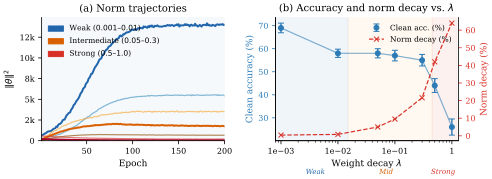
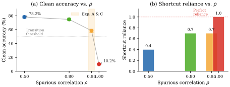

# Truong, Truong 2026 — Norm-Hierarchy Transitions in Representation Learning: When and Why Neural Networks Abandon Shortcuts

See also: [the global concept index](../../concepts/index.md).

**Truong Xuan Khanh**, **Truong Quynh Hoa** — co-authors with equal contribution (H&K Research Studio, Clevix LLC, Hanoi, Vietnam; correspondence: khanh@clevix.vn).

arXiv [2603.07323v1](https://arxiv.org/abs/2603.07323), 7 March 2026 (the only version; the paper is dated "March 2026" on the PDF title page). 3 citations — by the Semantic Scholar snapshot of 14 August 2026. The source is the native arXiv HTML of version v1. The PDF has no running head.

The files of this paper's analysis:

- [`2603.07323.norm-hierarchy-transitions-in-representation-learning-when-and-why-neural-networks-abandon-shortcuts.license.txt`](2603.07323.norm-hierarchy-transitions-in-representation-learning-when-and-why-neural-networks-abandon-shortcuts.license.txt) — the arXiv licence record for this paper.

The anchor scheme and the rules for linking into a card are in the [README of the papers folder](../README.md).

**Excerpt card.** The paper's licence (`arxiv-nonexclusive`) does not permit republishing the paper itself; what stands here are the editorial sections and the fragments the corpus quotes (right of quotation). The paper: <https://arxiv.org/abs/2603.07323>.

## Concepts covered

**[The norm-separation delay law](../../concepts/norm-separation-delay-law.md)** — the work generalises the law from one pair of manifolds to an arbitrary pair. The title formula is the same in form but written for the pair "shortcut / structure": $T_{\mathrm{transition}}=\Theta(\gamma_{\mathrm{eff}}^{-1}\log(V_{\mathrm{sc}}/V_{\mathrm{st}}))$ ([`p2-3`](#p2-3), theorem 3.5 — [`p5-8`](#p5-8)). The relation to the companion paper 2603.13331 is declared outright: corollary 3.6 declares the norm-separation delay law a particular case at $\mathcal{M}_ {\mathrm{sc}}=\mathcal{M}_ {\mathrm{mem}}$, $\mathcal{M}_ {\mathrm{st}}=\mathcal{M}_ {\mathrm{post}}$ ([`p5-10`](#p5-10)). The Lyapunov argument for the upper bound is the same ([`p5-2`](#p5-2)), and a matching lower bound is declared as theorem 3.4 ([`p5-6`](#p5-6)). What the work does not contain: measurements of the delay of its own — the quantitative prediction $T\propto 1/\lambda$ does not hold on CIFAR-10 ($r=-0.43$, [`p7-6`](#p7-6)), and on Waterbirds and CelebA it was not checked (column P6 of table 3 — [`tab-3`](#tab-3)); the lower bound is derived in a single line from the premise $\mathbb{E}[V_{t+1}|\mathcal{F}_ {t}]/V_{t}\geq 1-c\eta\lambda$ ([`p19-4`](#p19-4)), that is, the contraction rate sought is built into the assumption, and the companion's caveat about the class of first-order methods is not present here. The name "the norm-separation delay law" the work does not redefine — it inherits it.

**[Weight decay](../../concepts/weight-decay.md)** — here it is the driver of the transition and simultaneously the sole control lever of the experiments. A sweep over seven values of $\lambda$ on Coloured CIFAR-10 gives a three-regime picture: at $0.001\text{–}0.01$ the norm grows with a fall of under one per cent, at $0.05\text{–}0.3$ the norm peaks and falls, and at $0.5\text{–}1.0$ it is suppressed from the first epoch ([`p7-5`](#p7-5), [`fig-1`](#fig-1)). Whence the authors' practical advice: choose $\lambda$ in the intermediate regime and identify the weak regime by a monotonically growing norm ([`p15-3`](#p15-3)). That advice, however, is not supported by the work's own data: by the right-hand panel of figure 1 the clean accuracy falls monotonically in $\lambda$, and it is greatest at the weakest $\lambda$ (see the section on inconsistencies). An essential caveat about the setting: the theory is written for an $\ell_{2}$ penalty in the update rule (equation 2), while all the experiments run on AdamW with decoupled decay, and the divergence of conventions is not discussed in the paper. What the work does not contain: a measurement of the effective contraction rate — the amplification of the effective coefficient by a factor $\sigma_{c}^{-2}$ under BatchNorm is given as a formulation, with no derivation and with not a single measurement of $\sigma_{c}$ ([`p10-1`](#p10-1)).

**[Weight norm minimisation](../../concepts/weight-norm-minimization.md)** — the norm hierarchy $V_{\mathrm{sc}}>V_{\mathrm{st}}$ is introduced by definition 2.2 as a structural assumption ([`p3-9`](#p3-9)) and justified by a reference to the implicit bias towards minimum-norm interpolants and by the observation that shortcut strategies concentrate their predictive power in a few directions ([`p4-1`](#p4-1)). The most valuable thing for the corpus here is a layerwise refinement: the total norm is a poor proxy for the state of the representation, because it can grow by $73$% exactly when the classification head contracts by $45$% and conv1 by $31$% ([`p7-1`](#p7-1), [`fig-4`](#fig-4)); whence a feature is proposed, "the head's norm instead of the total norm" ([`p7-2`](#p7-2)). What the work does not contain: a decomposition of the norm by feature — the authors themselves call the mixing of shortcut and structured features in $\Vert\theta\Vert^{2}$ a limitation and postpone the decomposition to further work ([`p15-4`](#p15-4)).

**[Structured representation learning](../../concepts/structured-representation-learning.md)** — the work sets a framing in which delayed representation learning is defined not through the task but through geometry: whenever several interpolating solutions form a norm hierarchy under regularised optimisation, the transition from a shortcut to a structure is delayed, and the delay is set by the norm gap ([`p2-3`](#p2-3), [`p16-7`](#p16-7)). What the work does not contain: measurements at the level of the representations. "Structuredness" is operationalised only through the accuracy on a frameless test set ([`p7-3`](#p7-3)); no probing, no Fourier analysis and no check whatever that the model has switched precisely to texture and shape is made in the paper — the conclusion about "acquiring genuine features" rests on the difference of accuracies between the clean and the shortcut sets.

**[Phase transition](../../concepts/phase-transition.md)** — the authors do have a language of phases, but a descriptive one. A representational phase diagram is built in the $(\lambda,\rho)$ plane over 28 runs, four regions are marked out on it — structured learning, the NHT regime, shortcut dominance and suppression — and it is said that the boundary between shortcut dominance and the NHT regime becomes sharper as $\rho$ grows ([`fig-3`](#fig-3)). The phrase "phase transition" itself appears once in the paper, as the heading of a subsection of the related-work survey, next to double descent ([`p16-6`](#p16-6)). What the work does not contain: an order parameter, a finite-size analysis and even one accuracy curve over epochs; the diagram's four regions are obtained by colouring by final accuracy rather than by measuring the sharpness of the transition.

**[Real data and vision](../../concepts/vision-real-world-data-mnist-cifar.md)** — the work's chief contribution to the corpus lies precisely here: a frame grown out of grokking on algorithmic data is carried over to vision entire. The principal domain is Coloured CIFAR-10, in which a coloured frame is correlated with the label at a probability $\rho$, with a six-layer CNN of 287 850 parameters and three test sets: coloured, clean and "shortcut" ([`p7-3`](#p7-3)). Waterbirds ([`p11-1`](#p11-1)) and CelebA ([`p12-3`](#p12-3)) are added, both with a negative outcome assigned to scenario C by the norm-separation score ([`p12-1`](#p12-1), [`p13-1`](#p13-1)). What the work does not contain: it is precisely the *qualitative* half of the law that has been carried over. In none of the three vision domains is the delay itself measured: what counts as the moment of the transition on CIFAR-10 is nowhere defined, and there is not a single curve of clean accuracy over epochs in the paper.

**[Grokking](../../concepts/grokking.md)** — the work claims grokking as a particular case of its frame, but contains no measurements of grokking of its own. It enters in two places: corollary 3.6, in which substituting the memorisation and post-grokking manifolds returns the norm-separation delay law ([`p5-10`](#p5-10)), and one row of table 3, in which modular arithmetic is marked 6/6 with $S\approx 1.0$ ([`tab-3`](#tab-3)). The abstract and the conclusion report "all six predictions at $R^{2}>0.97$" ([`p1-2`](#p1-2)), whereas remark 2.6 and section 6.1 in the same text say that the full experimental study is "deferred to a concurrent work" ([`p4-6`](#p4-6), [`p14-1`](#p14-1)). What the work does not contain: not a single curve of delayed generalisation, not a single run on modular arithmetic and not a single measured value of $T_{\mathrm{grok}}-T_{\mathrm{mem}}$. The difference from Power et al. is declared as "there, *what* happens; here, *when*", but the setting of Power is taken unchanged and with no runs of the authors' own.

**[Modular arithmetic](../../concepts/modular-arithmetic.md)** — it serves in the work as a benchmark of clean norm separation: it is the only domain with a score $S\approx 1.0$ and 6/6 confirmed predictions in table 3 ([`tab-3`](#tab-3)), that is, the reference point against which the frame's failure on vision is measured. Its instantiation is given in remark 2.6: $\mathcal{M}_ {\mathrm{sc}}$ is the memorisation manifold with $\Vert\theta\Vert^{2}=\Theta(p)$, and $\mathcal{M}_ {\mathrm{st}}$ the Fourier manifold with $\Vert\theta\Vert^{2}=\Theta(K)$ ([`p4-6`](#p4-6)). What the work does not contain: runs of its own. The reproducibility section lists "modular arithmetic (293 runs)" among its own ([`p17-1`](#p17-1)), although by that same remark the experimental part is assigned to a concurrent work; and the companion's caveat that $V_{\mathrm{mem}}$ empirically *falls* as $p$ grows, contrary to the asymptotic $\Theta(p)$, is not carried over here.

**[Emergence / emergent abilities](../../concepts/emergence.md)** — the work proposes a norm-hierarchy explanation of the sharpness with which abilities appear and honestly declares it a conjecture: "we emphasise that this is a theoretical conjecture generating checkable predictions" ([`p14-5`](#p14-5)). The mechanism is simple: as the model size grows the norm gap may decrease, and the transition fits into the training budget only above a critical size $N^{ * }$ (equation 6), whereupon a threshold is visible with no discontinuity in the loss landscape whatever. Whence four checkable predictions ([`p14-12`](#p14-12)), of which the most useful for the corpus is that a peak of the norm followed by a fall precedes the jump in ability and does not depend on the measure chosen; remark 6.1 outright proposes to settle the "mirage" dispute by this ([`p15-2`](#p15-2)). What the work does not contain: not a single experiment with language models; all four predictions are left to further work.

**[When regularisation is necessary](../../concepts/regularization-necessity.md)** — the work gives the corpus an honest negative result about the limit of sufficiency. ResNet18+GroupNorm gives a norm fall of $67$%, comparable with BatchNorm's ($66$%), but a clean accuracy of $50.5$% — below the baseline without normalisation ($69.8$%) and even below SimpleCNN ($61.6$%); whence a direct admission: "a contraction of the norm is necessary but not sufficient for a successful transition" ([`p10-1`](#p10-1)). At the other end of the scale the same limitation: at $\lambda=0.5\text{–}1.0$ the weight decay overpowers the learning and the accuracy falls ([`p7-5`](#p7-5)). What the work does not contain: the explanation of the divergence between GroupNorm and BatchNorm through a per-channel amplification $\sigma_{c}^{-2}$ is given as a formulation, with no derivation and no measurement; so the necessity of the norm contraction is shown and its sufficiency refuted, but the cause of the refutation remains a conjecture.

**[Varieties of regularisation](../../concepts/regularization-variants.md)** — an ablation over normalisation poses a question rarely posed in the corpus: do BatchNorm, GroupNorm and the absence of normalisation act identically on the norm dynamics? The answer is twofold: the non-monotone course of the norm (a peak at epoch 50–60, then a fall) is reproduced in all four variants at a spread of absolute norms of tens of times ($V_{\mathrm{peak}}=2{,}222$ against $43{,}690$), and BatchNorm besides shifts the whole accuracy curve upwards and brings the peak forward from epoch 60 to 50 ([`p9-5`](#p9-5)); GroupNorm, meanwhile, at the same norm fall gives a worse accuracy ([`p10-1`](#p10-1)). What the work does not contain: dropout is expressly placed outside the theory — "the theory assumes $\ell_{2}$ regularisation; dropout may produce transitions by other routes" ([`p15-4`](#p15-4)) — and not a single experiment with it is set up.

**[The optimiser](../../concepts/optimizer-adam-adamw-sgd.md)** — the optimiser enters the law by a single factor: $\gamma_{\mathrm{eff}}=\eta\lambda$ for SGD and $\gamma_{\mathrm{eff}}\geq\eta\lambda$ for AdamW ([`p5-2`](#p5-2)). The work goes no further than that. Every experiment without exception runs on AdamW at $\eta=10^{-3}$ with cosine annealing; there is not a single SGD run, the learning rate is not swept, and the inequality $\gamma_{\mathrm{eff}}\geq\eta\lambda$ for AdamW is not measured — unlike in the companion paper, in which the amplification factor is fitted to the data. What the work does not contain: a discussion of the fact that the theory's update rule (an $\ell_{2}$ penalty, equation 2) and the experiments' rule (AdamW's decoupled decay) are different conventions; and that the technical condition (A3) $\eta\leq\lambda/L$ ([`p4-7`](#p4-7)) at $\eta=10^{-3}$ and $\lambda=0.001$ requires $L\leq 1$, that is, the weak regime of the sweep lies outside the domain of the authors' own theorems.

**[Margin maximisation](../../concepts/margin-maximization-implicit-bias.md)** — the work takes implicit bias as given and claims as its own contribution its *time scale*: "the implicit bias is slow, and this slowness is measurable through $\Delta V$" ([`p16-4`](#p16-4)). The ordering $V_{\mathrm{sc}}>V_{\mathrm{st}}$ is justified precisely by a reference to gradient descent's bias towards minimum-norm interpolants: the structured solution is declared to be exactly the one that a minimum-norm bias would select in the unregularised limit ([`p4-1`](#p4-1)). What the work does not contain: a proof of that identification. That the structured solution is the minimum-norm solution is nowhere derived or checked — it is a borrowed premise on which the sign of the norm gap rests, and with it the whole direction of the transition.

**[The lazy→rich transition](../../concepts/lazy-to-rich-kernel-to-feature-learning.md)** — the work only mentions it, in a single line of section 6.1: the transition from kernel behaviour to feature learning "maps onto a traversal of the norm hierarchy, and our frame gives it a concrete time scale" ([`p14-4`](#p14-4)). There is no experiment, no quantity and no reference to a measurement of the kernel regime in the paper; the mapping is declared but not constructed. A result about lazy→rich cannot be credited to the authors — theirs is a thesis of unification rather than of verification.

**[The frequency principle / spectral bias](../../concepts/frequency-principle-spectral-bias.md)** — likewise a mention only, but a weighty one: spectral, or frequency, bias is adduced as the second of three arguments for assumption (A5), that the optimiser reaches the shortcut manifold first ([`p4-3`](#p4-3), argument (ii)). The argument rests entirely on earlier works: shortcut features are declared simpler because they "require fewer Fourier modes or fewer hierarchical features". What the work does not contain: not a single spectral measurement. Neither the complexity of a shortcut feature nor the order in which frequencies are learnt is checked here, and the formalisation of (A5) is itself called an open problem ([`p4-3`](#p4-3)).

---

## Points we could not reconcile

**Remark 2.5 justifies (A5) by an inequality that is the reverse of definition 2.2.** Definition 2.2 sets the norm hierarchy as $V_{\mathrm{sc}}>V_{\mathrm{st}}>0$ ([`p3-9`](#p3-9)) — on this ordering rest the whole frame, the whole direction of the contraction and the sign of the gap $\Delta V$. Argument (i) of remark 2.5 justifies the reachability of the shortcut by exactly the opposite: "since the shortcut solution has a smaller norm ($V_{\mathrm{sc}}<V_{\mathrm{st}}$ by the norm-hierarchy assumption)" ([`p4-3`](#p4-3), the following paragraph). The argument is besides self-contradictory in substance: at $V_{\mathrm{sc}}>V_{\mathrm{st}}$ it is the structured manifold that is nearer to a small initial norm, that is, "nearness in norm" works *against* (A5) rather than for it. In the same place the squared initial norm under a He/Xavier initialisation is called $\mathcal{O}(d^{-1})$, whereas under such an initialisation the total squared norm grows with the number of parameters rather than falling.

**A norm ratio of $37{\times}$ is ascribed to CIFAR-10 but was obtained on CelebA.** Remark 2.3 reports that the norm ratios across the four domains lie "from $3{\times}$ (CelebA) to $37{\times}$ (CIFAR-10)" ([`p4-1`](#p4-1)). The only place in the paper where the number $37{\times}$ is obtained is section 5.10 on **CelebA**: it is the ratio of $\Vert\theta\Vert^{2}_ {\lambda=0.001}=20{,}198$ to $\Vert\theta\Vert^{2}_ {\lambda=1.0}=546$ ([`p12-4`](#p12-4)), and the caption of figure 5 repeats it ([`fig-5`](#fig-5)). The number $3{\times}$ and any norm ratio for CIFAR-10 appear nowhere in the paper. More substantively: $37{\times}$ is a ratio of the final norms of two runs at different $\lambda$ rather than the ratio $V_{\mathrm{sc}}/V_{\mathrm{st}}$ of two manifolds, of which definition 2.2 speaks; in remark 2.3 it is presented as empirical confirmation of $V_{\mathrm{sc}}\gg V_{\mathrm{st}}$.

**The clean accuracy on CIFAR-10 is greatest at the weakest regularisation rather than in the intermediate regime.** The list of regimes in section 5.2 itself reports that at a weak $\lambda$ the clean accuracy reaches 58–69 % and at an intermediate one 55–58 % ([`p7-5`](#p7-5)). The right-hand panel of figure 1 shows the same and unambiguously: the clean-accuracy points fall monotonically in $\lambda$, from $\approx 70\mkern3mu$% at $\lambda=10^{-3}$ to $\approx 26\mkern3mu$% at $\lambda=1.0$, with the highest point lying in the band labelled on the figure itself as *Weak*. The caption of that same figure asserts the opposite: "the clean accuracy peaks in the intermediate regime (${\approx}58$%), which confirms that the delayed transition corresponds to the acquisition of genuine features" ([`fig-1`](#fig-1)), and on this too rests practical consequence 2 of section 6.3 — "the optimal weight decay lies in the intermediate regime" ([`p15-3`](#p15-3)). This is the same discrepancy noted below for CelebA, but now on the work's principal domain: the best performance is attained where, by the frame, the network remains on the shortcut.

**The caption of figure 3 places the regions of the phase diagram in the wrong corners.** On the diagram's ordinate $\rho$ grows upwards (0.50 at the bottom, 1.00 at the top), and on the abscissa $\lambda$ grows to the right. The caption, however, places the shortcut-dominated region "at the bottom right, large $\rho$, small $\lambda$" and the structured one "at the top left, small $\rho$, moderate $\lambda$" ([`fig-3`](#fig-3)). In the figure itself the labels *Shortcut-dominated* and *Structured learning* stand the other way round — the first at the top left, the second at the bottom left — that is, precisely where the parenthetical conditions in $\rho$ and $\lambda$ point. What is wrong in the caption is the compass directions; the conditions on the parameters are correct.

**Proposition 4.2 and its proof differ by a factor of 2.** In the statement of the proposition the layerwise contraction rate equals $\gamma_{\mathrm{eff}}^{(\ell)}=\eta\lambda+\eta\alpha_{\ell}\kappa_{\ell}$ ([`p6-8`](#p6-8)), while in appendix D the same quantity is derived as $\gamma^{(\ell)}_ {\mathrm{eff}}=\eta\lambda+2\eta\alpha_{\ell}\kappa_{\ell}$ ([`p20-8`](#p20-8), equations 9 and 10). The proof sketch in the main text repeats the variant without the two. The ordering of the layers does not change on that account, but any numerical substitution does.

**The "empirical agreement" of appendix D compares quantities of different natures.** Proposition 4.2 predicts a ratio of the layers' *escape times*. At the end of appendix D what is compared is not times but contraction fractions: "the observed ratio of contractions 45 %/31 % $\approx 1.45$ agrees with $\alpha_{L}\kappa_{L}/\alpha_{1}\kappa_{1}\approx 1.5$" ([`p20-10`](#p20-10)). The coincidence of the two numbers here confirms nothing: a ratio of contraction fractions is not a ratio of escape times, and the quantity $\alpha_{L}\kappa_{L}/\alpha_{1}\kappa_{1}$ is nowhere independently measured.

**The count of runs on CIFAR-10 does not add up.** The caption of table 2 says "13 runs in total" ([`tab-2`](#tab-2)). The caption of figure 1 reports "$\pm 1$ std over 4 seeds" for seven values of $\lambda$ ([`fig-1`](#fig-1)) — that is already 28 runs. The caption of figure 2 reports a mean over 3 seeds for four values of $\rho$ ([`fig-2`](#fig-2)) — another 12. The caption of figure 3 says "28 runs" ([`fig-3`](#fig-3)). The reproducibility section repeats "CIFAR-10 (13 runs)" ([`p17-1`](#p17-1)). Not one of these numbers agrees with the others.

**Remark 2.6 speaks of six confirmed predictions on CIFAR-10; the tables speak of five.** Remark 2.6 reports that on CIFAR-10 "all six NHT predictions are confirmed quantitatively" ([`p4-6`](#p4-6)). Table 2 in the same text marks the prediction $T\propto 1/\lambda$ with a cross ([`tab-2`](#tab-2)), table 3 gives CIFAR-10 "5/6" ([`tab-3`](#tab-3)), and section 5.2 writes outright that the quantitative delay law does not hold ($r=-0.43$, [`p7-6`](#p7-6)). The abstract here sides with the tables ("five of six"), and remark 2.6 is the only place where "all six" is said.

**Waterbirds: the section and the table differ in the count of confirmations, and the text differs from both.** Section 5.9 speaks of "a confirmed-prediction fraction of 1/4 on Waterbirds (P1 only)" ([`p12-2`](#p12-2)), whereas table 3 gives Waterbirds "2/6" with ticks at P1 and P2 ([`tab-3`](#tab-3)). Yet the text of P2 itself reports that at $\lambda\leq 0.1$ the norm grows monotonically and "all these runs" lie in the weak regime, that is, the intermediate regime — the very one P2 checks — was never observed ([`p11-3`](#p11-3)).

**Column P3 of table 3 is defined as an ordering of worst-group accuracy but is ticked where there are no groups.** The caption of table 3 glosses P3 as "the ordering of WG accuracy" ([`tab-3`](#tab-3)). A tick under P3 stands against modular arithmetic and CIFAR-10, in which there is no division into groups at all and worst-group accuracy is undefined; on CIFAR-10 what is measured is the clean accuracy ([`p7-3`](#p7-3)). At the same time, for CelebA P3 is counted as confirmed by the ordering $89.1>88.0>87.0$% ([`p12-6`](#p12-6)), that is, by the best robustness at the *weakest* regularisation — the reverse of the three-regime prediction, in which the optimum lies in the intermediate regime ([`fig-1`](#fig-1), right-hand panel).

**The companion paper occupies a row in the comparison table, but there is no reference to it.** Table 1 gives a separate row to "the companion paper" and ticks it on four features of five, distinguishing it from the present work by exactly one cell — "predicts failure" ([`tab-1`](#tab-1)). It is thereafter called "a concurrent work" in remark 2.6 ([`p4-6`](#p4-6)), in section 6.1 ([`p14-1`](#p14-1)) and in the survey of related work, and to it is assigned the whole experimental part on modular arithmetic. Yet in none of these places is there a reference, and there is no such work in the bibliography: the reader can neither establish which paper is meant nor check the 6/6 and $R^{2}>0.97$ ascribed to it.

**The criterion by which the frame's applicability is measured is nowhere defined.** The norm-separation score $S$ carries the whole diagnostic of failure: $S\approx 1.0$ for modular arithmetic, $0.5\text{–}0.7$ for CIFAR-10, $-0.11$ for CelebA and $\approx 0.0$ for Waterbirds ([`tab-3`](#tab-3), [`p12-1`](#p12-1)). There is neither a formula, nor an estimator, nor a range of values in the paper; definition 4.1 merely posits the existence of a scalar function $\phi$ with three properties ([`p6-2`](#p6-2)) and gives no number — even though it is declared "to the best of our knowledge the first formal criterion of this kind" ([`p6-3`](#p6-3)). The criterion's name floats: in the contributions it is "the clean norm-separation score" ([`p2-8`](#p2-8)), in sections 5.9 and 5.10 "the norm-separation score" ([`p12-1`](#p12-1)); and in section 5.9 definition 4.1 is called "assumption 4.1". "Scenario C" is mentioned twice, and scenarios A and B are nowhere introduced.

---

## What is proved, what is shown and what is conjectured

The layers of this work are of very different solidity, and the price of a quotation depends on which it comes from.

**Measured here.** The three-regime picture of the norm over seven values of $\lambda$ on Coloured CIFAR-10 ([`fig-1`](#fig-1)); a monotone fall of the clean accuracy as the shortcut strength grows, $78.2$% at $\rho=0.5$ against $10.2$% at $\rho=1.0$, with the point $\rho=1.0$ set as a negative control ([`p7-8`](#p7-8), [`fig-2`](#fig-2)); the layerwise asymmetry of the contraction ([`p7-1`](#p7-1), [`fig-4`](#fig-4)); the reproduction of the non-monotone course of the norm across four architectural variants ([`p9-5`](#p9-5)); and two negative results on Waterbirds and CelebA ([`p12-1`](#p12-1), [`p13-1`](#p13-1)). This is the paper's empirical core, and it is entirely qualitative.

**Proved, but at a price that must be named.** Theorem 3.1 is presented as a $\Theta$-result, while appendix A gives only an upper bound and only "in the small-noise regime"; besides, the step $(1-2\eta\lambda)^{2}\leq 1-\eta\lambda$ throws away a factor of about four, so the "tightness" holds up to constants ([`p19-3`](#p19-3)). The lower bound is called information-theoretic in the introduction ([`p2-8`](#p2-8)) and is proved in a single line from the premise $\mathbb{E}[V_{t+1}|\mathcal{F}_ {t}]/V_{t}\geq 1-c\eta\lambda$ ([`p19-4`](#p19-4)): the contraction rate required is built into the assumption, and there is neither an information-theoretic argument nor an analysis of the class of first-order methods. The claim that "no regularised first-order method can transition faster" ([`p2-3`](#p2-3)) is therefore true only for methods that already satisfy that premise.

**Assumed without checking.** The reachability of the shortcut (A5) rests on three arguments, none of which is measured in the work and the first of which is besides self-contradictory ([`p4-3`](#p4-3)); the authors themselves call the formalisation of (A5) an open problem ([`p15-4`](#p15-4)). The technical condition (A3) $\eta\leq\lambda/L$ ([`p4-7`](#p4-7)) at the experimental $\eta=10^{-3}$ and $\lambda=0.001$ requires $L\leq 1$: the whole weak regime of the sweep lies outside the domain of the theorems by which it is then interpreted. That the structured solution is the minimum-norm solution is borrowed from Soudry and from Lyu & Li and is not checked ([`p4-1`](#p4-1)).

**Not confirmed in any domain measured here.** The title quantitative law. On CIFAR-10 $T\propto 1/\lambda$ does not hold ([`p7-6`](#p7-6)), on Waterbirds and CelebA it was not checked, and the only domain with a tick in column P6 is modular arithmetic ([`tab-3`](#tab-3)), on which there are no experiments in this paper ([`p4-6`](#p4-6), [`p14-1`](#p14-1)). $T$ itself is nowhere defined on vision: what counts as the moment of transition — the peak of the norm, the clean accuracy's reaching a plateau, or something else — is not said, and not a single accuracy curve over epochs is given.

**Declared a conjecture by the authors themselves.** The whole of section 6.2 on emergent abilities: "we emphasise that this is a theoretical conjecture generating checkable predictions; empirical verification at scale is left to further work" ([`p14-5`](#p14-5)). The four predictions (i)–(iv) are formulated so that they can be checked on medium-scale models ([`p14-12`](#p14-12)) — but not one is checked here.

---

## Common misreadings and overstatements of this paper

Below are the patterns observed in the citing works of the corpus. For each it is said what exactly is distorted, with references to the authors' paragraphs where the lost caveat stands. The "Erroneous citations" sections on the side of the citing cards have not yet been created, so the detailed analyses are not yet addressed.

**"The norm-hierarchy law gave grokking on modular arithmetic a rigorous quantitative theory" (widening).** Truong 2026 (2605.16325) writes that grokking — "the delayed transition from memorisation to generalisation in modular arithmetic" — "has recently been given a rigorous quantitative theory: the norm-hierarchy transition law (Truong and Truong, 2026b; Truong et al., 2026) establishes that the delay scales as $T_{\text{grok}}-T_{\text{mem}}=\Theta(\gamma_{\text{eff}}^{-1}\log(\Vert\theta_{\text{mem}}\Vert^{2}/\Vert\theta_{\text{post}}\Vert^{2}))$… with matching upper and lower bounds", and on that basis builds its own prediction 3a. The present work is named here on a par with the companion 2603.13331 — whereas all it contains about grokking is corollary 3.6 ([`p5-10`](#p5-10)) and one row of table 3 ([`tab-3`](#tab-3)). The experimental part on modular arithmetic the authors themselves assign to a concurrent work ([`p4-6`](#p4-6), [`p14-1`](#p14-1)); the figure $R^{2}>0.97$ in the abstract ([`p1-2`](#p1-2)) pertains to runs that do not exist in this paper ([`p17-1`](#p17-1)). What is lost too is that in all three domains measured *here* the quantitative half of the law either failed or was not checked ([`p7-6`](#p7-6), [`tab-3`](#tab-3)). The formulation "with matching upper and lower bounds" repeats the authors' own claim word for word ([`p2-8`](#p2-8)) and deserves no reproach in that part — but the claim rests on the premise of the proof in appendix B ([`p19-4`](#p19-4)), and the citing author does not check it. There is as yet no card for 2605.16325 in the corpus.

**An example of accurate citation.** Truong et al. 2026, in a neighbouring work from the same laboratory, describe the contribution exactly as it is made: `"Khanh and Hoa (2026) generalises this to a norm-hierarchy framework for shortcut-to-structured transitions"` — the generalisation of the frame and its subject are named, no experiments on grokking are credited to the work, and the quantitative delay law is assigned to the companion. Work concerned: [Truong et al. 2026](../2604.13123.spectral-entropy-collapse-as-a-phase-transition-in-delayed-generalisation/2604.13123.spectral-entropy-collapse-as-a-phase-transition-in-delayed-generalisation.card.md).

---

# Quoted fragments

Only the fragments the corpus cards refer to are
reproduced here (right of quotation); the paper's licence does not permit
republishing the whole text. Anchor numbering matches the original.

###### p1-2

Neural networks often rely on spurious shortcuts for hundreds of epochs before discovering structured representations. Yet the mechanism governing *when* this transition occurs—and whether its timing can be predicted—remains poorly understood. While prior work has established that gradient descent converges to low-norm solutions (21) and that networks exhibit simplicity bias (20), neither line of work characterises the *timescale* of the transition from simple to structured features. We propose a unifying framework—the Norm-Hierarchy Transition—which explains delayed representation learning as the slow traversal of a norm hierarchy under regularised optimisation. When multiple interpolating solutions exist with different norms, weight decay induces a slow contraction from high-norm shortcut solutions toward lower-norm structured representations. We prove a tight bound on the transition delay: $T=\Theta(\gamma_{\mathrm{eff}}^{-1}\log(V_{\mathrm{sc}}/V_{\mathrm{st}}))$, where $V_{\mathrm{sc}}$ and $V_{\mathrm{st}}$ are the characteristic norms of the shortcut and structured representations. The framework predicts three regimes as a function of regularisation strength: weak regularisation (shortcuts persist), intermediate regularisation (delayed transition), and strong regularisation (learning suppressed). We validate these predictions across **four** domains: modular arithmetic (where all six predictions hold with $R^{2}>0.97$), CIFAR-10 with spurious features (five of six, including $78\%\to 10\%$ clean accuracy as shortcut strength increases), CelebA (which occupies an intermediate position on the norm separation spectrum), and Waterbirds (where norm dynamics transfer but representational transition does not, confirming the framework’s boundary). The norm-hierarchy mechanism is robust across architectures: ResNet18 with standard batch normalisation exhibits the same peak-then-decay norm dynamics as models without normalisation, achieving $78\%$ clean accuracy. The single prediction that fails to transfer—the precise delay scaling $T\propto 1/\lambda$—is explained by a new condition we term *clean norm separation*, the first formal criterion distinguishing settings where implicit bias timescales are predictable from those where they are not. The framework further predicts that emergent abilities in large language models arise when model scale reduces the norm gap below a training-budget threshold, connecting scaling laws to the same norm-hierarchy mechanism. Our results suggest that grokking, shortcut learning, delayed feature discovery, and emergent abilities are manifestations of a single mechanism: the slow traversal of a norm hierarchy under regularised optimisation.

###### p2-3

We formalise this into the **Norm-Hierarchy Transition Law**:

$$
T_{\mathrm{transition}}=\Theta\!\left(\frac{1}{\gamma_{\mathrm{eff}}}\log\frac{V_{\mathrm{sc}}}{V_{\mathrm{st}}}\right), \tag{1}
$$

where $V_{\mathrm{sc}}$ and $V_{\mathrm{st}}$ are the characteristic norms of the shortcut and structured representations, and $\gamma_{\mathrm{eff}}$ is the effective contraction rate of the optimiser. The bound is tight: we prove a matching lower bound showing that no first-order regularised algorithm can transition faster.

###### p2-8

1. **Norm-Hierarchy Transition framework.** We identify the minimal structural conditions (multi-representation interpolation, norm hierarchy, shortcut accessibility) that are jointly sufficient for delayed representational transitions across grokking, shortcut learning, and related phenomena (Section 2).
2. **Tight delay law with matching bounds.** We prove $T_{\mathrm{transition}}=\Theta\!\left(\gamma_{\mathrm{eff}}^{-1}\log(V_{\mathrm{sc}}/V_{\mathrm{st}})\right)$ with both a Lyapunov upper bound and a matching information-theoretic lower bound, showing the law is optimal for all first-order regularised algorithms (Section 3).
3. **Multi-domain validation with explicit failure diagnostics.** We validate the framework on four domains (CIFAR-10, Waterbirds, CelebA, modular arithmetic), introduce the Clean Norm Separation Score as a formal criterion predicting *when* the framework applies, and demonstrate architecture robustness across four model variants including ResNet18+BatchNorm (Sections 5–5.8).

**[p. 3]**

Two additional contributions emerge from the analysis:

4. **Layer-wise norm hierarchy** (Proposition 4.2): layers closer to the output escape the shortcut manifold faster, predicting a backward representational transition.
5. **Emergent abilities hypothesis** (Section 6.2): the delay law generates four testable predictions connecting NHT to capability emergence in large language models.

###### tab-1

*Table 1: Comparison with existing approaches. Our framework is the first to provide tight delay bounds validated across multiple domains with explicit failure diagnostics.* **[p. 3]**

|  | Formal theory | Tight bounds | Multi-domain | Predicts delay | Predicts failure |
|---|---|---|---|---|---|
| Power et al. 2022 |  |  |  |  |  |
| Nanda et al. 2023 |  |  |  |  |  |
| Soudry et al. 2018 | ✓ |  |  |  |  |
| Shah et al. 2020 | ✓ |  |  |  |  |
| Sagawa et al. 2020 | ✓ |  |  |  |  |
| Chizat & Bach 2019 | ✓ |  |  |  |  |
| Companion paper | ✓ | ✓ | ✓ | ✓ |  |
| This paper | ✓ | ✓ | ✓ | ✓ | ✓ |

The remainder of the paper is organised as follows. Section 2 establishes the framework. Section 3 states and proves the main theorem. Section 4 introduces clean norm separation and the layer-wise norm hierarchy. Section 5 presents experimental validation. Section 6 discusses implications, connections to scaling laws, and limitations. Section 7 surveys related work. Section 8 concludes.

###### p3-9

*The interpolation exhibits a *norm hierarchy* if there exist constants $V_{\mathrm{sc}}>V_{\mathrm{st}}>0$ such that $\|\theta\|^{2}\geq V_{\mathrm{sc}}$ for all $\theta\in\mathcal{M}_{\mathrm{sc}}$ and $\|\theta^{*}\|^{2}\leq V_{\mathrm{st}}$ for some $\theta^{*}\in\mathcal{M}_{\mathrm{st}}$. The norm gap is $\Delta V=V_{\mathrm{sc}}-V_{\mathrm{st}}>0$.*

**[p. 4]**

###### p4-1

*The ordering $V_{\mathrm{sc}}>V_{\mathrm{st}}$ reflects a structural property of how spurious features are encoded, not an ad hoc assumption. Shortcut strategies concentrate predictive power in a small number of highly discriminative directions—a border colour, a background texture, a hair-colour signal—requiring large weights in those channels to achieve low training loss. Structured representations distribute predictive information across many features, yielding smaller individual magnitudes and a lower total squared norm. This is consistent with the implicit bias of gradient descent toward minimum-norm interpolators (21; 11): the structured solution is precisely the one that minimum-norm bias would select in the unregularised limit. Empirically, $V_{\mathrm{sc}}\gg V_{\mathrm{st}}$ is confirmed across all four domains in Section 5, with norm ratios ranging from $3{\times}$ (CelebA) to $37{\times}$ (CIFAR-10).*

###### p4-3

*Assumption (A5) asserts that the optimiser reaches the shortcut manifold $\mathcal{M}_{\mathrm{sc}}$ before the structured manifold $\mathcal{M}_{\mathrm{st}}$. This is justified on three complementary grounds.*

*(i) Norm proximity.**From a standard random initialisation, $\|\theta_{0}\|^{2}$ is $\mathcal{O}(d^{-1})$ (He/Xavier init), which is far below both $V_{\mathrm{sc}}$ and $V_{\mathrm{st}}$. Since the shortcut solution has lower norm ($V_{\mathrm{sc}}<V_{\mathrm{st}}$ by the norm hierarchy assumption), the optimiser reaches $\mathcal{M}_{\mathrm{sc}}$ after fewer contraction steps than $\mathcal{M}_{\mathrm{st}}$, giving $T_{\mathrm{sc}}<T_{\mathrm{st}}$ with high probability under mild smoothness conditions.*

*(ii) Simplicity bias of gradient descent.**A substantial body of work establishes that gradient-based optimisers exhibit a spectral or frequency bias: they fit low-complexity functions before high-complexity ones (16; 20; 23). Shortcut features (spurious correlations, border textures, hair colour) are by definition simpler—they require fewer Fourier modes or fewer hierarchical features—so they are accessible to gradient descent earlier in training.*

*(iii) Loss landscape geometry.**Shortcut solutions typically occupy flat, wide basins in the loss landscape (5), making them attractors for SGD from a wide range of initialisations. Structured solutions, by contrast, require traversing narrower saddle-point regions.*

*Together, these arguments support (A5) as a natural consequence of the optimisation geometry rather than an ad hoc assumption. Formalising tight conditions under which (A5) holds—particularly for deep networks without explicit regularisation—remains an interesting open problem.*

###### p4-6

*The framework instantiates naturally across domains. In CIFAR-10 with spurious borders (Section 5—our *primary* validation), $\mathcal{M}_{\mathrm{sc}}$ consists of border-reliant classifiers and $\mathcal{M}_{\mathrm{st}}$ consists of texture/shape classifiers; all six NHT predictions are confirmed quantitatively. In modular arithmetic (15), the framework provides supporting evidence: $\mathcal{M}_{\mathrm{sc}}$ is the memorisation manifold ($\|\theta\|^{2}=\Theta(p)$) and $\mathcal{M}_{\mathrm{st}}$ is the Fourier manifold ($\|\theta\|^{2}=\Theta(K)$), consistent with the norm-hierarchy prediction; a full empirical study is deferred to concurrent work. In CelebA (Section 5.10), $\mathcal{M}_{\mathrm{sc}}$ corresponds to hair-colour-reliant classifiers; this domain illustrates the framework’s boundary via the clean norm separation condition.*

###### p4-7

- (A1) $\mathcal{L}_{\mathrm{train}}$ is $L$-smooth.
- (A2) On $\mathcal{M}$, $\nabla\mathcal{L}_{\mathrm{train}}(\theta)=0$.
- (A3) $\eta\leq\lambda/L$.
- (A4) Multi-representation interpolation with norm hierarchy holds.
- (A5) Shortcut accessibility holds.

**[p. 5]**

###### p5-2

*The escape time satisfies $T_{\mathrm{escape}}=\Theta\bigl(\gamma_{\mathrm{eff}}^{-1}\log(V_{\mathrm{sc}}/V_{\mathrm{st}})\bigr)$, where $\gamma_{\mathrm{eff}}=\eta\lambda$ for SGD and $\gamma_{\mathrm{eff}}\geq\eta\lambda$ for AdamW.*

###### p5-6

*Under (A1)–(A4), any first-order regularised algorithm transitioning from $\mathcal{M}_{\mathrm{sc}}$ to $\mathcal{M}_{\mathrm{st}}$ requires at least $T_{\mathrm{transition}}=\Omega\bigl((\eta\lambda)^{-1}\log(V_{\mathrm{sc}}/V_{\mathrm{st}})\bigr)$ gradient steps.*

###### p5-8

*Under (A1)–(A5), if a learning system exhibits multi-representation interpolation with norm hierarchy, then training produces a delayed representational transition with delay*

$$
T_{\mathrm{transition}}=\Theta\!\left(\frac{1}{\gamma_{\mathrm{eff}}}\log\frac{V_{\mathrm{sc}}}{V_{\mathrm{st}}}\right), \tag{4}
$$

*and training exhibits three regimes: weak $\lambda$ (shortcuts persist), intermediate $\lambda$ (delayed transition), strong $\lambda$ (learning suppressed).*

###### p5-10

*Setting $\mathcal{M}_{\mathrm{sc}}=\mathcal{M}_{\mathrm{mem}}$ and $\mathcal{M}_{\mathrm{st}}=\mathcal{M}_{\mathrm{post}}$ recovers the Norm-Separation Delay Law: $T_{\mathrm{grok}}-T_{\mathrm{mem}}=\Theta\bigl((\eta\lambda)^{-1}\log(\|\theta_{\mathrm{mem}}\|^{2}/\|\theta_{\mathrm{post}}\|^{2})\bigr)$.*

###### p6-2

*The norm hierarchy exhibits *clean separation* if there exists a scalar function $\phi(\theta)$ such that: (i) $\phi=1$ on $\mathcal{M}_{\mathrm{sc}}$ and $\phi=0$ on $\mathcal{M}_{\mathrm{st}}$; (ii) $\phi$ is monotonically related to $\|\theta\|^{2}$ near $\mathcal{M}$; (iii) the transition $\phi(\theta_{t}):1\to 0$ is sharp relative to $T_{\mathrm{escape}}$.*

###### p6-3

This condition, to our knowledge the first formal criterion of its kind, precisely delineates settings where implicit bias timescales are predictable from those where they are not.

###### p6-8

*Suppose Assumptions (A1)–(A5) hold and the gradient of the shortcut loss decomposes approximately as $\nabla_{\theta^{(\ell)}}\mathcal{L}_{\mathrm{sc}}(\theta)\approx\alpha_{\ell}\cdot g(\theta)$ for some shared vector $g(\theta)$ at $\mathcal{M}_{\mathrm{sc}}$. Then, under $\ell_{2}$ regularisation with coefficient $\lambda$, the per-layer escape time satisfies:*

$$
T^{(\ell)}_{\mathrm{escape}}=\Theta\!\left(\frac{1}{\gamma_{\mathrm{eff}}^{(\ell)}}\log\frac{V^{(\ell)}_{\mathrm{sc}}}{V^{(\ell)}_{\mathrm{st}}}\right),\qquad\gamma_{\mathrm{eff}}^{(\ell)}=\eta\lambda+\eta\alpha_{\ell}\kappa_{\ell},
$$

*where $\kappa_{\ell}\geq 0$ is the curvature of the loss in the direction of $\theta^{(\ell)}$ near $\mathcal{M}_{\mathrm{sc}}$. Consequently:*

$$
\alpha_{\ell^{\prime}}>\alpha_{\ell}\;\Longrightarrow\;T^{(\ell^{\prime})}_{\mathrm{escape}}<T^{(\ell)}_{\mathrm{escape}}.
$$

*In particular, the classification head escapes before early feature layers: $T^{(L)}_{\mathrm{escape}}<T^{(\ell)}_{\mathrm{escape}}$ for all $\ell<L$.*

###### p7-1

*Proposition 4.2 predicts that the representational transition proceeds *from output toward input*: the classification head abandons the shortcut first, propagating a changed gradient signal to earlier layers. Figure 4(c) provides direct evidence: the fc layer contracts $45\%$ from its peak while conv1 contracts only $31\%$, consistent with $\alpha_{L}>\alpha_{1}$.*

###### p7-2

*If the classification head’s norm is contracting but early layer norms are not, the network is mid-transition. The *classification head norm* $\|\theta^{(L)}\|^{2}/\|\theta^{(L)}_{0}\|^{2}$ is a more sensitive early-warning indicator than total norm, which is dominated by growing early layers.*

###### p7-3

We construct a modified CIFAR-10 in which a colored border correlates with the class label. Each class is assigned a unique border color; during training, the correct color appears with probability $\rho$. We evaluate on three test sets: **colored** (same distribution), **clean** (no borders), and **shortcut** (borders on gray images). Our primary model is a 6-layer CNN ($\sim$288K parameters) without batch normalisation, trained with AdamW and cosine annealing. Section 5.8 extends the analysis to ResNet18 with and without batch normalisation. Full details are in Appendix C.

###### p7-5

- **Weak $\lambda$ (0.001–0.01):** Norm grows to 5,000–14,000 with $<1\%$ decay. Clean accuracy reaches 58–69%.
- **Intermediate $\lambda$ (0.05–0.3):** Norm peaks then decays (up to 21.6% at $\lambda=0.3$). Clean accuracy reaches 55–58%.
- **Strong $\lambda$ (0.5–1.0):** Norm suppressed (42–64% decay). Clean accuracy drops to 26–44%.

###### p7-6

The quantitative delay law $T\propto 1/\lambda$ does not hold ($r=-0.43$), consistent with the absence of clean norm separation (Section 4).

###### fig-1

*Figure 1: **Three-regime structure under weight-decay sweep (CIFAR-10, $\rho=0.95$, 7 values of $\lambda$).** *Left*: $\|\theta\|^{2}$ trajectory over 200 epochs. Weak $\lambda$ ($0.001$–$0.01$): norm grows monotonically to 5,000–14,000 with ${<}1\%$ decay, indicating persistent shortcut reliance. Intermediate $\lambda$ ($0.05$–$0.3$): norm peaks then decays up to $21.6\%$, the signature of a delayed NHT. Strong $\lambda$ ($0.5$–$1.0$): norm suppressed from epoch 1, decaying $42$–$64\%$, indicating learning suppression. *Right*: Final clean accuracy vs. $\lambda$ (circles) and norm-decay percentage (crosses). Clean accuracy peaks in the intermediate regime (${\approx}58\%$), confirming that the delayed transition corresponds to real-feature acquisition. Error bars: $\pm 1$ std over 4 seeds.* **[p. 8]**

###### p7-8

At $\rho=1.0$, the shortcut perfectly predicts the label, so the model never transitions to real features—a strong negative control.

###### fig-2

*Figure 2: **Effect of spurious correlation strength $\rho$ on transition outcome (CIFAR-10, $\lambda=0.1$).** Each point shows mean clean accuracy at epoch 200 across 3 seeds. Monotonically decreasing accuracy with increasing $\rho$ confirms the NHT prediction: stronger shortcuts produce larger norm gaps ($V_{\mathrm{sc}}/V_{\mathrm{st}}$), delaying the transition and ultimately preventing it entirely at $\rho=1.0$ (shortcut reliance $=1.0$, clean accuracy $=10.2\%$). The shaded band marks the intermediate-regime operating point ($\rho=0.95$) used in Experiments A and C.* **[p. 9]**

###### tab-2

*Table 2: Predictions tested on CIFAR-10 (13 runs total).* **[p. 8]**

**[p. 8]**

| Prediction | Confirmed? | Evidence |
|---|---|---|
| Three-regime structure | ✓ | Fig. 1 |
| Norm peak-then-decay | ✓ | $\lambda\geq 0.05$, up to 64% decay |
| Stronger $\lambda\to$ more contraction | ✓ | Monotonic, 7 values |
| Stronger shortcut $\to$ harder transition | ✓ | $78\%\to 10\%$ |
| Reproducibility | ✓ | 4 seeds, std $=2.3\%$ |
| Delay $T\propto 1/\lambda$ | $\times$ | See Section 4 |

###### fig-3

*Figure 3: **Representation phase diagram over the $(\lambda,\rho)$ plane (CIFAR-10, 28 runs).** Colour encodes final clean accuracy; contour lines separate the four predicted regimes. *Shortcut-dominated* (bottom-right, high $\rho$, low $\lambda$): network stays on $\mathcal{M}_{\mathrm{sc}}$; clean accuracy $\leq 15\%$. *NHT regime* (centre): delayed transition produces clean accuracy $55$–$78\%$. *Structured* (top-left, low $\rho$, moderate $\lambda$): network reaches $\mathcal{M}_{\mathrm{st}}$ directly; clean accuracy $\geq 75\%$. *Suppressed* (top-right, high $\lambda$): weight decay overwhelms learning; accuracy $\leq 44\%$. The phase boundary between shortcut-dominated and NHT regimes sharpens with increasing $\rho$, consistent with the norm-gap prediction $\Delta V\propto\rho$.* **[p. 10]**

###### fig-4

*Figure 4: **Layer-wise norm dynamics reveal a backward representational transition (CIFAR-10, $\lambda=0.1$, $\rho=0.95$).** *(a)* Per-layer $\|\theta^{(\ell)}\|^{2}$ normalised to peak value. The classification head (fc, purple) reaches its peak at epoch ${\approx}60$ and contracts $45\%$ by epoch 200; conv1 (blue) peaks later and contracts only $31\%$; intermediate layers fall between. *(b)* Total norm $\|\theta\|^{2}$ (black) grows throughout, masking the layer-level contraction in head layers. *(c)* Ratio $\|\theta^{(L)}\|^{2}/\|\theta^{(1)}\|^{2}$ decreases monotonically after epoch 60, providing a layer-ratio diagnostic that detects the transition when total norm monitoring would fail. Shaded band: $\pm 1$ std over 4 seeds. These results directly confirm Proposition 4.2: layers with higher shortcut encoding capacity $\alpha_{\ell}$ escape the shortcut manifold faster, producing a backward transition from output to input.* **[p. 11]**

This dissociation has a precise theoretical interpretation. The shortcut (coloured border) requires only a linear transformation at the output layer, giving the head the highest shortcut encoding **[p. 9]** capacity $\alpha_{L}$. By Proposition 4.2, this produces the largest effective contraction rate $\gamma_{\mathrm{eff}}^{(L)}$ and shortest escape time.

The transition proceeds *backward through the network*: the head abandons the shortcut first, altering the gradient signal to earlier layers. A practical implication: monitor $\|\theta^{(L)}\|^{2}/\|\theta^{(L)}_{0}\|^{2}$ during training; peak-then-decay indicates the transition regime even when total norm is still increasing.

###### p9-5

ResNet18+BN achieves clean accuracy $78.1\%$ at epoch 200, compared to $69.8\%$ for the identically-trained ResNet18 without normalisation—an absolute improvement of $+8.3$ percentage points. The norm peak occurs at epoch 50 for ResNet18+BN vs. epoch 60 for the no-normalisation variant, indicating a faster escape from the **[p. 10]** shortcut basin. This is consistent with the NHT framework: BatchNorm re-scales the effective weight at each layer by the inverse running standard deviation, amplifying the regularisation pressure on high-variance (shortcut-encoding) channels and thus increasing $\gamma_{\mathrm{eff}}$ in Theorem 3.1.

###### p10-1

Despite producing norm decay ($67\%$) comparable to BatchNorm ($66\%$), ResNet18+GroupNorm achieves only $50.5\%$ clean accuracy—lower than the no-normalisation baseline ($69.8\%$) and below even SimpleCNN ($61.6\%$). This dissociation between norm decay and accuracy improvement reveals a nuance in the theory: norm contraction is necessary but not sufficient for a successful transition. GroupNorm normalises within spatial positions inside each channel, preserving relative channel magnitudes and allowing shortcut-encoding dimensions to maintain high activation even as the total norm shrinks. BatchNorm, by contrast, normalises across the batch and applies learnable scale/shift parameters that interact directly with the AdamW weight-decay penalty, creating channel-specific regularisation pressure that drives the hierarchy transition. Formally, the effective weight-decay coefficient for channel $c$ under BatchNorm is amplified by $\sigma_{c}^{-2}$ (where $\sigma_{c}$ is the running standard deviation), so channels with high variance—those that encode the shortcut—experience disproportionately stronger contraction. GroupNorm lacks this $\sigma_{c}^{-2}$ amplification, explaining why total norm decays equally but the shortcut is not selectively removed.

###### p11-1

We evaluate NHT on Waterbirds (18), where bird species (waterbird vs. landbird) is correlated with background (water vs. land) at $95\%$ in the training split. We train SimpleCNN (the same architecture as in Section 5.1, adapted to $224\times 224$ input) with AdamW using $\lambda\in\{0.0001,0.001,0.01,0.1,0.3,1.0\}$ for 100 epochs ($\eta=10^{-3}$, cosine schedule), with three seeds at $\lambda=0.1$.

###### p11-3

For $\lambda\leq 0.1$ the norm grows monotonically throughout training (decay $0\%$, peak at final epoch), placing all these runs in the weak regime. For $\lambda\geq 0.3$ norm decay becomes measurable ($6.7\%$ at $\lambda=0.3$; $56.3\%$ at $\lambda=1.0$). The absence of a clear intermediate regime at $\lambda=0.1$ suggests that $\gamma_{\mathrm{eff}}$ is lower for Waterbirds than for Coloured CIFAR-10 at the same nominal $\lambda$, consistent with the higher dimensionality ($224\times 224$) and richer background statistics that require more model capacity.

###### p12-1

The Norm Separation Score is $S\approx 0.0$, placing Waterbirds in **Scenario C** (no separation), comparable to CelebA ($S=-0.11$) and in contrast to modular arithmetic ($S\approx 1.0$) and CIFAR-10 ($S\approx 0.5$–$0.7$). The Waterbirds spurious feature (background texture) is encoded at every scale of the convolutional hierarchy—from low-level colour and texture to mid-level scene context—so Assumption 4.1 is violated throughout, and no norm-hierarchy transition can improve WG accuracy.

###### p12-2

The 1/4 confirmed prediction rate on Waterbirds (P1 only) is itself informative: NHT makes the sharp prediction that transitions will *not* improve WG accuracy when $S\leq 0$, and the results are consistent with this prediction. The framework correctly abstains from predicting group-robustness improvement on datasets that violate the structural preconditions, rather than making false positive predictions. A natural follow-up would replace SimpleCNN with ResNet18+BN, which the ablation of Section 5.8 shows achieves substantially higher clean accuracy and faster transitions; we leave this to future work.

###### p12-3

We evaluate NHT on CelebA (9), a large-scale face attribute dataset containing 202,599 images. Following the group-DRO literature (17), we define the target label as *Smiling* and treat *Blond Hair* as a spurious attribute, yielding four groups: {Blond, Not Blond} $\times$ {Smiling, Not Smiling}. We train a six-layer SimpleCNN (286,818 parameters, $64{\times}64$ input) with AdamW, cosine learning-rate decay, and weight decay $\lambda\in\{0.001,0.1,1.0\}$ for 100 epochs ($\eta=10^{-3}$). Each configuration is repeated over two random seeds; all metrics are reported as mean $\pm$ std.

###### p12-4

**(P1) Norm ordering.** Final parameter norms are well-separated across regimes: $\|\theta\|^{2}_{\lambda=0.001}=20{,}198\gg\|\theta\|^{2}_{\lambda=0.1}=2{,}971\gg\|\theta\|^{2}_{\lambda=1.0}=546$, a ratio of $37{\times}$ between the weak and strong regimes, consistent with Theorem 3.1.

**(P2) Three norm regimes.** All three qualitative behaviours predicted by NHT are observed (Figure 5a). Under weak regularisation ($\lambda=0.001$) the norm grows monotonically (decay ${<}1\%$), indicating unchecked shortcut persistence. Under intermediate regularisation ($\lambda=0.1$) the norm trajectory is non-monotone (5 and 4 out of 20 logged intervals show norm decrease across seeds), consistent with a delayed transition. Under strong regularisation ($\lambda=1.0$) the norm is sharply suppressed from epoch 1 onward, with mean decay of $5.4\%$ in seed 42, confirming the over-regularised regime.

###### p12-6

**(P3) Worst-group accuracy ordering.** Worst-group accuracies follow the predicted monotone ordering (Figure 5b):

$$
\mathrm{WG}(\lambda{=}0.001)=89.1\%>\mathrm{WG}(\lambda{=}0.1)=88.0\%>\mathrm{WG}(\lambda{=}1.0)=87.0\%. \tag{5}
$$

Average accuracies are similarly ordered ($90.9\%$, $90.5\%$, $90.2\%$), confirming that stronger regularisation does not improve robustness in this setting.

**(P4) Layer-wise norm hierarchy (Proposition 4.2).** The fc/conv1 norm ratio increases monotonically with $\lambda$: $0.65{\times}\to 2.21{\times}\to 2.33{\times}$. Under weak regularisation the input convolutional layer accumulates more norm than the output layer; under strong regularisation the output layer dominates. This is the backward-transition pattern predicted by Proposition 4.2: output layers with higher shortcut encoding capacity $\alpha_{\ell}$ escape the shortcut basin faster under stronger regularisation.

###### p13-1

This negative result is informative rather than anomalous. The Smiling/Blond-Hair pair does not satisfy clean norm separation because both features require similar mid-level texture representations; consequently $\gamma_{\mathrm{eff}}$ is not meaningfully larger for the shortcut path than for the target path, and Theorem 3.1 predicts no clean transition. This confirms that clean norm separation is a *necessary* condition for predictable NHT dynamics.

###### fig-5

*Figure 5: **CelebA norm-hierarchy validation across three regularisation regimes (6 runs: 3 $\lambda$ values $\times$ 2 seeds).** *(a) Parameter norm $\|\theta\|^{2}$:* The three regimes are clearly separated — weak $\lambda=0.001$ (blue) grows monotonically to ${\approx}20{,}000$; intermediate $\lambda=0.1$ (orange) plateaus near $3{,}000$ with non-monotone dynamics (5/20 intervals show norm decrease); strong $\lambda=1.0$ (red) is suppressed below $1{,}000$ from epoch 1. Norm ratio between weak and strong regimes: $37\times$, confirming P1. *(b) Worst-group accuracy:* All three regimes show stable performance above $86\%$ after epoch 20, with the predicted monotone ordering $89.1\%>88.0\%>87.0\%$ (P3 confirmed). The absence of a sharp accuracy jump at intermediate $\lambda$ is consistent with Scenario C (no clean norm separation, $S=-0.11$): there is no delayed transition to observe. *(c) Average accuracy:* Similarly ordered ($90.9\%>90.5\%>90.2\%$), with larger variance under strong regularisation (std $=1.2\%$ vs. $0.1\%$). The fc/conv1 norm ratio increases from $0.65\times$ to $2.33\times$ as $\lambda$ increases (P4 confirmed, not shown), providing the first empirical confirmation of Proposition 4.2 on a real face-attribute dataset.* **[p. 13]**

###### tab-3

*Table 3: Transfer of NHT predictions across four domains. P1: norm ordering; P2: three regimes; P3: WG-acc ordering; P4: layer hierarchy; P5: clean norm separation; P6: delay scaling. Predictive power degrades gracefully with the norm separation score $S$.* **[p. 13]**

| Domain | Confirmed | P1 | P2 | P3 | P4 | P5 | P6 | $S$ |
|---|---|---|---|---|---|---|---|---|
| Modular Arithmetic | 6/6 | ✓ | ✓ | ✓ | ✓ | ✓ | ✓ | $\approx 1.0$ |
| CIFAR-10 (spurious) | 5/6 | ✓ | ✓ | ✓ | ✓ | ✓ | $\times$ | $0.5$–$0.7$ |
| CelebA | 4/6 | ✓ | ✓ | ✓ | ✓ | $\times$ | $\times$ | $-0.11$ |
| Waterbirds | 2/6 | ✓ | ✓ | $\times$ | $\times$ | $\times$ | $\times$ | $\approx 0.0$ |

###### p14-1

**Grokking.** Shortcut $=$ memorisation; structure $=$ Fourier features. Delay $=$ grokking gap. Validated quantitatively ($R^{2}>0.97$; consistent with the norm-hierarchy prediction, with full empirical details deferred to concurrent work).

**Shortcut learning.** Shortcut $=$ spurious feature; structure $=$ real feature. Three-regime structure confirmed on CIFAR-10 (this paper).

**Simplicity bias.** Simple features correspond to the first interpolating solution found (high-norm shortcut); complex features require norm contraction to reach (20).

###### p14-4

**Lazy-to-rich transition.** The transition from kernel-like to feature-learning behaviour (3) maps to traversal of a norm hierarchy, with our framework providing a concrete timescale.

###### p14-5

A striking empirical regularity in large language models is the phenomenon of *emergent abilities*: capabilities absent in smaller models that appear abruptly as model scale increases (24; 22). This abruptness has resisted explanation within standard scaling law frameworks (7), which predict smooth power-law improvement. We propose a *hypothesis*: the Norm-Hierarchy Transition may provide a natural mechanistic account of why emergence appears sudden, by reframing the timing of capability jumps as a consequence of norm dynamics under implicit regularisation. We stress that this is a theoretical conjecture generating testable predictions; empirical verification at scale is left to future work.

###### p14-12

- (i) **Norm gap decreases with scale.** $V_{\mathrm{sc}}(N)/V_{\mathrm{st}}(N)$ should decrease monotonically with model size for tasks with structured solutions.
- (ii) **Emergence threshold shifts with training budget.** Training with stronger weight decay should lower $N^{*}$; very weak regularisation should raise it or eliminate emergence.
- (iii) **[p. 15]** **Norm peak-then-decay precedes emergent capability.** Parameter norms should exhibit peak-then-decay *before* task accuracy jumps, providing a model-agnostic early warning signal.
- (iv) **Clean norm separation predicts which abilities emerge cleanly.** Tasks with norm-separable strategies should exhibit sharper, more predictable emergence thresholds; entangled tasks should not.

These predictions follow directly from equation (1) without additional assumptions and could be tested on mid-scale models (e.g. 70M–1B parameters) where emergence has been documented (24).

###### p15-2

19*argued that apparent emergent abilities are artefacts of nonlinear evaluation metrics. The NHT account is compatible with both positions: under linear metrics, the transition is smooth but fast; under threshold metrics, the same transition produces an apparent discontinuity. Crucially, norm peak-then-decay is metric-independent and provides an empirical way to adjudicate the debate without committing to a particular metric.*

###### p15-3

1. **Diagnosing shortcuts:** Monotonically growing norm suggests the weak-$\lambda$ regime, retaining shortcuts.
2. **Setting $\lambda$:** The optimal weight decay lies in the intermediate regime where norm peaks then decays.
3. **Normalisation compatibility:** ResNet18+BN exhibits the same peak-then-decay dynamics as models without normalisation.
4. **Layer monitoring:** Classification head norm is a more sensitive early-warning indicator than total norm.

###### p15-4

- **Quantitative delay law:** $T\propto 1/\lambda$ does not transfer to CIFAR-10, motivating feature-wise norm decompositions.
- **Total norm as proxy:** $\|\theta\|^{2}$ conflates shortcut and structured features; full feature-wise decomposition is future work.
- **NLP and large-scale domains:** Testing on NLP tasks and larger architectures (ViT) would further strengthen generality.
- **Regime specificity:** Theory assumes $\ell_{2}$ regularisation; dropout may produce transitions through different pathways.
- **Shortcut accessibility:** Formalising conditions under which (A5) holds is an open problem.

###### p16-4

GD converges to minimum-norm solutions (21; 11). 3 characterises the lazy-to-rich transition. 10 identifies early and late phases. We extend this by characterising the *timescale*: implicit bias is slow, and the slowness is quantifiable via $\Delta V$.

###### p16-6

2 and 12 showed non-monotonic generalisation curves. Our three-regime structure provides a complementary perspective on regularisation in interpolation geometry.

###### p16-7

Existing work on grokking, shortcut learning, and implicit bias has largely studied these phenomena in isolation. Our contribution connects these strands through a single dynamical mechanism. The Norm-Hierarchy framework shows that delayed representation learning arises whenever multiple interpolating solutions form a norm hierarchy under regularised optimisation. This perspective provides both a predictive law for transition times under clean separation and a diagnostic criterion—clean norm separation—explaining when such predictions fail to transfer across domains. The connection to emergent abilities further extends this unification to the scaling laws literature, suggesting that the norm-hierarchy mechanism operates across training time, regularisation strength, and model scale as a single unified axis of variation.

###### p17-1

All code, training scripts, and experimental data are publicly available. CIFAR-10 experiments (13 runs) complete in $\sim$6 hours on a single GPU; architecture ablation (8 runs) in $\sim$3 hours; Waterbirds (8 runs) in $\sim$75 minutes; CelebA (6 runs) in $\sim$3 hours; modular arithmetic (293 runs) in $\sim$2.5 hours.

###### p19-3

using $(1-2\eta\lambda)^{2}\leq 1-\eta\lambda$ for $\eta\lambda\in(0,1/2]$. Unrolling: $\mathbb{E}[V_{t}]\leq(1-\eta\lambda)^{t}V_{0}+V_{\infty}$ with $V_{\infty}=\eta\sigma^{2}/\lambda$. Setting $\mathbb{E}[V_{t}]=V_{\mathrm{st}}$ yields $T_{\mathrm{escape}}=\Theta((\eta\lambda)^{-1}\log(V_{\mathrm{sc}}/V_{\mathrm{st}}))$ in the low-noise regime. $\hfill\square$

###### p19-4

*Proof of Theorem 3.4.* Per-step contraction satisfies $\mathbb{E}[V_{t+1}|\mathcal{F}_{t}]/V_{t}\geq 1-c\eta\lambda$ for constant $c$. To reach $V_{\mathrm{st}}$ from $V_{\mathrm{sc}}$: $(1-c\eta\lambda)^{T}\leq V_{\mathrm{st}}/V_{\mathrm{sc}}$, giving $T\geq(c\eta\lambda)^{-1}\log(V_{\mathrm{sc}}/V_{\mathrm{st}})=\Omega((\eta\lambda)^{-1}\log(V_{\mathrm{sc}}/V_{\mathrm{st}}))$. $\hfill\square$

###### p20-8

where $C^{(\ell)}=2\eta\alpha_{\ell}\kappa_{\ell}V^{(\ell)}_{\mathcal{M}_{\mathrm{sc}}}+\eta^{2}\sigma_{\ell}^{2}$. Defining $\gamma^{(\ell)}_{\mathrm{eff}}=\eta\lambda+2\eta\alpha_{\ell}\kappa_{\ell}$ and unrolling:

$$
T^{(\ell)}_{\mathrm{escape}}=\Theta\!\left(\frac{1}{\eta\lambda+2\eta\alpha_{\ell}\kappa_{\ell}}\log\frac{V^{(\ell)}_{\mathrm{sc}}}{V^{(\ell)}_{\mathrm{st}}}\right). \tag{10}
$$

###### p20-10

The observed contraction ratio $45\%/31\%\approx 1.45$ is consistent with $\alpha_{L}\kappa_{L}/\alpha_{1}\kappa_{1}\approx 1.5$, providing direct empirical support for the shortcut encoding capacity decomposition.
