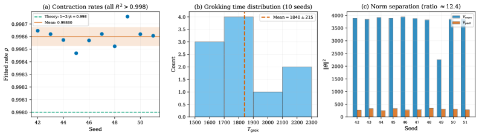
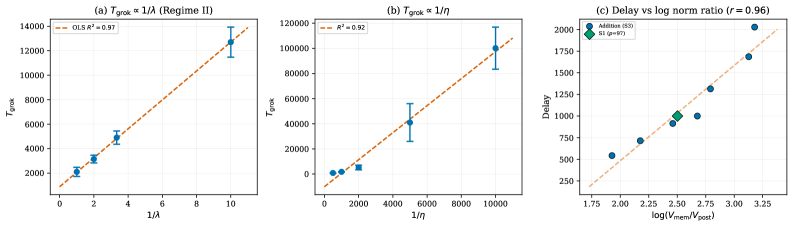
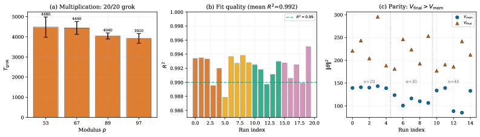
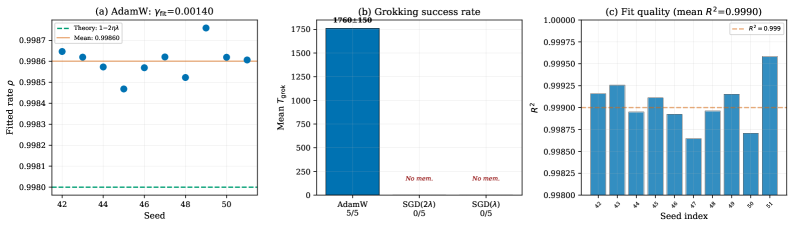

# Truong et al. 2026 — The Norm-Separation Delay Law of Grokking: A First-Principles Theory of Delayed Generalization

See also: [the global concept index](../../concepts/index.md).

**Truong Xuan Khanh, Truong Quynh Hoa, Luu Duc Trung, Phan Thanh Duc** (H&K Research Studio, Clevix LLC, Hanoi; Banking Academy of Vietnam).

arXiv [2603.13331](https://arxiv.org/abs/2603.13331), March 2026 (version v2 — the latest available; there is no v3 on arXiv). 4 citations — the thirty-second most cited work in the corpus. The source is the native arXiv HTML of version v2.

The files of this paper's analysis:

- [`2603.13331.the-norm-separation-delay-law-of-grokking-a-first-principles-theory-of-delayed-generalization.license.txt`](2603.13331.the-norm-separation-delay-law-of-grokking-a-first-principles-theory-of-delayed-generalization.license.txt) — the arXiv licence record for this paper.

The anchor scheme and the rules for linking into a card are in the [README of the papers folder](../README.md).

**Excerpt card.** The paper's licence (`arxiv-nonexclusive`) does not permit republishing the paper itself; what stands here are the editorial sections and the fragments the corpus quotes (right of quotation). The paper: <https://arxiv.org/abs/2603.13331>.

## Concepts covered

**[The norm-separation delay law](../../concepts/norm-separation-delay-law.md)** — the work that introduces this notion into the corpus. The claim is exact: $T_{\text{grok}}-T_{\text{mem}}=\Theta(\gamma_{\text{eff}}^{-1}\log(\Vert\theta_{\text{mem}}\Vert^{2}/\Vert\theta_{\text{post}}\Vert^{2}))$, where $\gamma_{\text{eff}}$ is the effective contraction rate of the optimiser ([`p1-2`](#p1-2), [`p2-5`](#p2-5)). The delay decomposes into two mechanistically distinct phases: an **optimisation escape** (weight decay contracting the norm exponentially from the memorising interpolant to the Fourier manifold) and a **statistical confirmation** (the accumulation of evidence up to a discernible gap on the validation set) ([`p2-8`](#p2-8)). At $p\gg K$ the first dominates, and the delay reduces to $\Theta(\frac{1}{\eta\lambda}\log\frac{V_{\mathrm{mem}}}{V_{\mathrm{post}}})$ ([`p2-9`](#p2-9)).

**[Weight norm minimisation](../../concepts/weight-norm-minimization.md)** — the corpus's line is carried through to a theorem of **necessity**: if grokking has occurred, then $\Vert\theta_{\mathrm{mem}}\Vert^{2}>\Vert\theta_{\mathrm{post}}\Vert^{2}$ necessarily ([`p2-6`](#p2-6), [`p10-7`](#p10-7)). This turns the norm separation from a companion into a mechanistic description of the phenomenon. A lower bound on the norm of any interpolant is proved separately: $\Omega(K)$ through the singular values of the Fourier projection ([`p6-8`](#p6-8)), while the norm of the memorising solution grows as $\Omega(p)$ ([`p35-1`](#p35-1)).

**[Weight decay](../../concepts/weight-decay.md)** — here it is not "useful in general" but the **driving force of the delay with a measurable rate**. Memorising interpolants at $\lambda>0$ are not stationary (lemma 3.1: the stationarity condition reduces to $\lambda\theta=0$) ([`p8-10`](#p8-10)), and the norm contracts at a rate of $1-\eta\lambda$ per step ([`p9-6`](#p9-6)). A convention is stated separately: the AdamW form of weight decay is applied rather than an $\ell_{2}$ penalty, so the effective rate is $\eta\lambda$ rather than $2\eta\lambda$ ([`p7-9`](#p7-9)).

**[The optimiser](../../concepts/optimizer-adam-adamw-sgd.md)** — the work's most unexpected result. At the same hyperparameters ($\eta=10^{-3}$, $\lambda=1.0$) SGD **does not grok once out of five runs**: the weight decay suppresses the learning from the first step, the norm falls monotonically to $3.6\times 10^{-5}$, and no memorisation occurs at all ([`p18-2`](#p18-2), [`tab-7`](#tab-7)). AdamW, meanwhile, decouples the memorisation (driven by the gradient) from the contraction (driven by the weight decay) through an adaptive per-parameter scaling ([`p18-3`](#p18-3), [`p23-3`](#p23-3)). An amplification is measured incidentally: a fitted contraction rate $\gamma_{\text{fit}}=0.00141$ against a nominal $\eta\lambda=0.001$, that is, a factor $c\approx 1.41$ ([`p9-11`](#p9-11)).

**[Memorisation](../../concepts/memorization-phase.md)** — a checkable condition of the **reachability of memorisation** is introduced (definition 3.11): the trajectory must reach an interpolant with $V_{T_{\mathrm{mem}}}\gg V_{\mathrm{post}}$ before the weight decay collapses the norm ([`p12-1`](#p12-1)). A sufficient condition is the dominance of the gradient signal over the weight decay at the start of the training; SGD does not satisfy it ([`p12-4`](#p12-4)).

**[Grokking](../../concepts/grokking.md)** — reinterpreted as a predictable consequence of geometry: not a mysterious phenomenon of a late era but the time required for an exponential contraction to traverse the norm gap ([`p1-2`](#p1-2), [`p2-3`](#p2-3), [`p22-4`](#p22-4)). The original description of the phenomenon is taken from Power et al.: the network first memorises perfectly, does not generalise for a long time, and then passes abruptly to a nearly perfect generalisation ([`p1-3`](#p1-3)). It matters that the theory makes **refutable** predictions in the reverse direction too: where there is no norm separation, there should be no grokking.

**[Phase transition](../../concepts/phase-transition.md)** — a phase diagram of three regimes in the strength of the regularisation is predicted: weak (the norm gap does not close within a reasonable budget), intermediate (a reliable grokking) and over-strong (memorisation unreachable) ([`p22-5`](#p22-5)). All three are confirmed by a sweep of $\lambda$ over three orders of magnitude: at $\lambda\leq 0.01$ 0 seeds out of 10 grok, at $\lambda\in[0.1,1.0]$ all 10 do, and at $\lambda=5.0$ again none ([`tab-3`](#tab-3), [`p15-1`](#p15-1), [`p15-3`](#p15-3)).

**[The learning rate](../../concepts/learning-rate.md)** — the other half of the controlling product. A check of $T_{\text{grok}}\propto 1/\eta$ gives $R^{2}=0.921$ ([`p16-2`](#p16-2), [`tab-5`](#tab-5)), and the joint universality in $\eta\lambda$ holds approximately: a mean $T_{\text{grok}}\cdot\eta\lambda=9.58$ over all the runs of regime II ([`p17-2`](#p17-2)).

**[Modular arithmetic](../../concepts/modular-arithmetic.md)** — the setting is the customary one: a single-layer transformer, $d_{\text{model}}=128$, 4 heads, an FFN of 512, AdamW, 50 % of the data for training ([`p13-3`](#p13-3)). A finding about finite width that is new to the corpus: as $p$ grows the memorisation norm **falls** (5366 at $p=53$ against 3207 at $p=127$), refuting the asymptotic $\Theta(p)$, whereupon the delay itself falls too ([`p15-6`](#p15-6), [`tab-4`](#tab-4)).

**[Sparse parity](../../concepts/sparse-parity.md)** — a negative prediction, and it was confirmed. On 3-sparse parity with an MLP the norm ratio is **inverted** ($V_{\mathrm{final}}/V_{\mathrm{mem}}\in[1.64,1.97]$) and the delay is zero or negative in all 15 runs ([`p19-8`](#p19-8), [`p20-1`](#p20-1), [`tab-9`](#tab-9)). This is exactly what the necessity theorem requires, and it was predicted in advance ([`p2-10`](#p2-10)).

**[Fourier features and circuits](../../concepts/fourier-features-circuits.md)** — the line of works analysing the mechanisms arising *after* the generalisation is named in the survey as one of the two earlier axes ([`p1-6`](#p1-6)); here the Fourier manifold plays the part of the low-norm region towards which the training contracts ([`p28-3`](#p28-3)). The non-Fourier energy $\mathcal{R}$ collapses at the grokking from $\approx 0.12$ to below 0.004 and does not return within 5000 steps ([`p17-1`](#p17-1), [`tab-6`](#tab-6)). An essential caveat: before the grokking $\mathcal{R}\approx 0.10\text{–}0.16$ rather than $0.78\text{–}0.92$ as in a random lookup table — the transformer's own Fourier bias makes itself felt ([`p17-1`](#p17-1)).

**[Spectral analysis](../../concepts/spectral-analysis-svd-esd-fve.md)** — the validation gap is related to the spectrum: a regression of the loss gap on $\mathcal{R}$ gives a slope of about 14–16 at an $R^{2}=0.77$ by least squares and $R^{2}=0.99$ over the RANSAC inliers, with not a single point violating the lower bound ([`p17-2`](#p17-2)).

**[Generalisation bounds](../../concepts/generalization-bounds.md)** — the detection time is derived by a sequential analysis: the accumulated excess validation loss and the stopping time give $\mathbb{E}[\tau]=\Theta(\log(p/\delta)/\Delta_{\min})$ by the Azuma–Hoeffding inequality ([`p11-8`](#p11-8)).

**[The neural tangent kernel](../../concepts/neural-tangent-kernel-ntk.md)** — the local linearity is justified through the NTK: a Taylor remainder of order $O(\Vert\theta-\theta^{ * }\Vert^{2}/\sqrt{m})$, whence a sufficient condition on the width ([`p5-10`](#p5-10)). The authors honestly note that this condition formally requires $m\gg 2000$, whereas the experiments use $d_{\text{model}}=128$, and justify the applicability by a fit quality of $R^{2}>0.999$ ([`p5-10`](#p5-10)).

**[Margin maximisation and implicit bias](../../concepts/margin-maximization-implicit-bias.md)** — theorem 5.1 relates the frame to this line: grokking is a **disagreement** between the implicit bias of the optimiser (towards low-norm solutions) and the structure of the generalising solution; the delay is zero if and only if the optimiser finds the minimum-norm interpolant already at the memorisation ([`p25-8`](#p25-8), [`p25-9`](#p25-9)).

**[The lazy-to-rich transition](../../concepts/lazy-to-rich-kernel-to-feature-learning.md)** and **[double descent](../../concepts/double-descent.md)** — both lines are built into the common picture: the lazy-to-rich transition reads as the crossing of a norm threshold, and double descent describes the geometry of the interpolation while the delay law measures the time of traversing it ([`p26-2`](#p26-2)).

**[Circuit efficiency](../../concepts/circuit-efficiency.md)** — the relation to Varma et al. is stated outright and precisely: they describe *which* solution wins (the more efficient one in norm), and this work *how long* the transition lasts; a more efficient circuit means a smaller $V_{\mathrm{post}}$, and hence a longer delay ([`p28-1`](#p28-1), [`p28-3`](#p28-3)).

**[The spherical norm constraint](../../concepts/spherical-weight-norm-constraint.md)** — a separate section is given over to the concurrent work of Yildirim (2026): the spherical topology removes the very architectural possibility of building a memorising interpolant of large norm, thereby collapsing $\log(V_{\mathrm{mem}}/V_{\mathrm{post}})$ ([`p28-6`](#p28-6), [`p29-1`](#p29-1)). The two works converge from opposite sides: the intervention confirms the mechanism, the theory predicts the effect of the intervention ([`p29-3`](#p29-3)).

It is worth saying separately what the work does **not** contain. There is no derivation of the AdamW amplification factor $c\approx 1.41$ from first principles — it is measured and admitted to be an open problem ([`p9-11`](#p9-11)). Nor is there a prediction of the norms $V_{\mathrm{mem}}$, $V_{\mathrm{post}}$ themselves from the parameters of the task: they are taken as empirical observables ([`p24-5`](#p24-5)). And there is no check beyond algebraic tasks and sparse parity.

Cards of corpus papers: [Power et al. 2022](../2201.02177.grokking-generalization-beyond-overfitting-on-small-algorithmic-datasets/2201.02177.grokking-generalization-beyond-overfitting-on-small-algorithmic-datasets.card.md) — the phenomenon whose time scale is derived here; [Omnigrok](../2210.01117.omnigrok-grokking-beyond-algorithmic-data/2210.01117.omnigrok-grokking-beyond-algorithmic-data.card.md) — the weight norm as an explanation; [Nanda et al. 2023](../2301.05217.progress-measures-for-grokking-via-mechanistic-interpretability/2301.05217.progress-measures-for-grokking-via-mechanistic-interpretability.card.md) — the Fourier circuit, which here becomes the low-norm manifold; [Varma et al. 2023](../2309.02390.explaining-grokking-through-circuit-efficiency/2309.02390.explaining-grokking-through-circuit-efficiency.card.md) — circuit efficiency, a complementary explanation; [Musat 2026](../2511.01938.the-geometry-of-grokking-norm-minimization-on-the-zero-loss-manifold/2511.01938.the-geometry-of-grokking-norm-minimization-on-the-zero-loss-manifold.card.md) — norm minimisation on the zero-loss manifold; [Yildirim 2026](../2603.05228.the-geometric-inductive-bias-of-grokking-bypassing-phase-transitions-via-architectural-topology/2603.05228.the-geometric-inductive-bias-of-grokking-bypassing-phase-transitions-via-architectural-topology.card.md) — the concurrent work removing the norm gap by architecture.

**[Grokking time](../../concepts/grokking-time.md)** — the delay is not measured but derived: weight decay drives an exponential contraction of the norms, and the time comes out as the time of that contraction ([`p2-3`](#p2-3)). Such a claim is more strongly checkable than an empirical fit, because it predicts the form of the dependence too.
## What is shown and what is conjectured

The card editor's remarks following the analysis of the claims (`…claims.txt`). The work is theoretical-cum-experimental: three theorems, 293 runs and an applied prediction algorithm.

**The chief merit is the two-sidedness of the prediction.** The theory says not only how long the delay lasts but also when there will be none. Both sides are checked: on sparse parity the norm ratio is inverted and there is no delay in 15 runs out of 15 ([`p20-1`](#p20-1)), and under an over-strong regularisation ($\lambda\geq 2$) the norm gap collapses and 3 seeds out of 10 grok ([`p15-3`](#p15-3)). Negative predictions are rare in the corpus, and here they are made in advance.

**The norm ratio explains what the naive law does not.** The raw growth $T\propto 1/\lambda$ holds only approximately: at $\lambda=0.1$ the delay is six times larger than at $\lambda=1$ rather than ten ([`p15-2`](#p15-2)). The discrepancy is removed by the full formula, since a strong regularisation itself lowers $V_{\mathrm{mem}}$. This is the right move: the authors show where the simple version of the law breaks instead of defending it.

**The finding about finite width matters more than it is presented as doing.** The memorisation norm **falls** as the modulus grows (5366 → 3207 for $p$ from 53 to 127) contrary to the asymptotic $\Theta(p)$ ([`p15-6`](#p15-6)). Hence the grokking delay falls with $p$ too — directly contrary to what one expects of a "harder task". The work explains this by a squeezing of the capacity as $p\to d=128$ ([`p35-1`](#p35-1)), but offers no experimental check at $d\gg p$.

**The upper and lower bounds coincide only within the declared class.** The lower bound is derived for regularised first-order methods whose norm dynamics obeys the stated contraction inequality ([`p10-2`](#p10-2)); second-order and non-gradient methods it does not exclude, and the authors caveat this. The coincidence of the bounds up to a factor of $2$ ([`p35-1`](#p35-1)) is an honest result, but the "$\Theta$-tightness" pertains to that class rather than to all algorithms.

**The theory describes the escape but not the memorisation, and this is admitted.** The Lyapunov analysis holds for the post-memorisation phase and is silent about whether memorisation will occur at all ([`p18-5`](#p18-5)). SGD's failure is not a refutation of the theory but a violation of its premise; but it also means that the law does not predict the presence of grokking from the hyperparameters alone, contrary to how the phase-diagram section sounds.

**The AdamW amplification factor is measured rather than derived.** $\gamma_{\mathrm{fit}}/(\eta\lambda)\approx 1.41$ is stable across seeds (a coefficient of variation below 0.05 %), and the authors honestly call it an open problem, comparing it with a condition number ([`p9-11`](#p9-11)). Yet it is precisely this factor that enters every quantitative prediction: without it the law predicts the delay with a systematic error of 40 %.

**The predicted escape time is systematically overstated by a quarter.** $T_{\text{esc}}^{\text{th}}=1251\pm 101$ against a measured delay of $1000\pm 186$ ([`p13-8`](#p13-8)). An explanation through the concentration of the trajectory around the expectation is given and is reasonable ([`p14-2`](#p14-2)), but it still means that the "exact" law in fact gives an upper bound.

**The validation gap is the weakest of the checks.** An $R^{2}=0.77$ by least squares against $R^{2}>0.97$ for the growth laws ([`p17-2`](#p17-2)). RANSAC assigns half of the points to outliers, and the explanation — that this is the early escape phase, in which the logits are still growing — is plausible but is checked not by a separate experiment but on the same set of points ([`p17-2`](#p17-2)). It matters that not one point violates the sign of the bound.

**The applied algorithm is honestly calibrated and honestly delimited.** A mean absolute error of 34.6 % over 60 seeds with a bootstrap interval of $[30.0,39.4]$% ([`p24-1`](#p24-1)), and in 57 cases out of 60 the prediction is an overestimate — that is, the error is conservative ([`p24-2`](#p24-2)). It is stated too that the residual width of the interval reflects the intrinsic randomness of the delay (a variability of about 19 %) rather than an inaccuracy of the estimation ([`p24-5`](#p24-5)).

**The number of runs is impressive but uneven.** The 293 runs are distributed as 258 on addition, 20 on multiplication and 15 on parity ([`p13-1`](#p13-1)); all the key comparisons are made at $p=97$ and one set of hyperparameters, and the sweep over $p$ runs at 7 seeds per value. This is above the corpus average, but "293 runs" sounds weightier than it is.

**The treatment of the concurrent work is impeccably arranged.** The section on Yildirim (2026) does not dispute priority but shows that the architectural intervention is a realisation of the regime that the necessity theorem declares delay-free ([`p28-6`](#p28-6), [`p29-1`](#p29-1)). For the corpus this is a rare case in which two independent works converge on one mechanism from different sides and both acknowledge it.

**Its place in the corpus.** The work gives the corpus the first **quantitative** theory of the length of the delay — with a formula, tight bounds within a declared class and refutable predictions in both directions. The most valuable thing is the necessity theorem: the norm separation is named a condition without which grokking does not occur, and this is checked by a negative example. The price: an AdamW amplification factor taken from measurement; the norms $V_{\mathrm{mem}}$ and $V_{\mathrm{post}}$ taken as observables rather than predicted; and a coverage confined to algebraic tasks.

## Common misreadings and overstatements

These are the card editor's remarks, not the authors' text: places where this paper restates someone else's results with an error, or without the qualifications their authors attached. The "details" links in the "Common misreadings and overstatements of this paper" sections of the cited works' cards lead here.

###### mc-2301-05217
**Nanda et al. (2301.05217) — an invented low-frequency character, three times over.** (1) `"even during memorisation, the model preferentially stores energy in low-frequency modes rather than distributing it uniformly across all p modes"`: in the target [the key frequencies are not used at all in the memorisation phase](../2301.05217.progress-measures-for-grokking-via-mechanistic-interpretability/2301.05217.progress-measures-for-grokking-via-mechanistic-interpretability.card.md#sec-5-2). (2) `"transformers trained on modular addition implement low-frequency Fourier circuits after generalization"`: [the target's key frequencies are arbitrary — 14, 35, 41, 42, 52 — and differ across seeds](../2301.05217.progress-measures-for-grokking-via-mechanistic-interpretability/2301.05217.progress-measures-for-grokking-via-mechanistic-interpretability.card.md#sec-4-1); they are not low. (3) `"In practice, transformers trained on modular arithmetic exhibit R_pre ≈ 0.10–0.16 even before grokking (Nanda et al., 2023), reflecting the architecture's natural Fourier inductive bias"`: the metric R_pre and the numbers 0.10–0.16 are the citing work's own measurements, ascribed to the classic; and the thesis about a "natural Fourier bias" of the architecture is not in the target. Elsewhere the paper cites the target correctly — the error is systematic but localised in the Fourier framing.

---

# Quoted fragments

Only the fragments the corpus cards refer to are
reproduced here (right of quotation); the paper's licence does not permit
republishing the whole text. Anchor numbering matches the original.

###### p1-2

Grokking—the sudden generalisation that appears long after a model has perfectly memorised its training data—has been widely observed but lacks a quantitative theory explaining the length of the delay. While the qualitative role of weight decay has been noted, no existing result establishes tight bounds on the delay or proves that it scales logarithmically with the norm ratio. We present a quantitative theory showing that grokking is a norm-driven representational phase transition in regularised training dynamics, and establish the **Norm-Separation Delay Law**: $T_{\text{grok}}-T_{\text{mem}}=\Theta(\gamma_{\text{eff}}^{-1}\log(\|\theta_{\text{mem}}\|^{2}/\|\theta_{\text{post}}\|^{2}))$, where $\gamma_{\text{eff}}$ is the effective contraction rate of the optimiser ($\gamma_{\text{eff}}=\eta\lambda$ for SGD, $\gamma_{\text{eff}}\geq\eta\lambda$ for AdamW). The upper bound follows from a discrete Lyapunov contraction argument; the matching lower bound follows from dynamical constraints of regularised first-order optimisation. Across 293 training runs spanning modular addition, modular multiplication, and sparse parity, we confirm three falsifiable predictions: inverse scaling with weight decay ($R^{2}=0.97$), inverse scaling with learning rate ($R^{2}=0.92$), and logarithmic dependence on the norm ratio (Pearson $r=0.91$). A fourth finding reveals that grokking requires an optimiser capable of decoupling memorisation from contraction—SGD fails entirely at the same hyperparameters where AdamW reliably groks. These results reframe grokking not as a mysterious optimisation artefact but as a predictable consequence of norm separation between competing interpolating representations under regularised training. Beyond algorithmic tasks, the proposed delay law suggests a general mechanism for delayed representation learning in any setting where competing interpolating solutions exhibit strict norm separation. We further derive a practical three-input prediction algorithm that estimates grokking delay at memorisation time with 34.6% mean absolute error (bootstrap 95% CI: $[30.0\%,39.4\%]$, $N=60$ seeds), enabling principled early stopping and hyperparameter control.

###### p1-3

Neural networks sometimes exhibit a striking and poorly understood phenomenon known as *grokking*: a model first perfectly memorises its training data, yet fails to generalise for a long period before suddenly transitioning to near-perfect generalisation. This delayed generalisation behaviour was first documented in algorithmic tasks such as modular arithmetic (Power et al., 2022) and has since been studied across a wide range of settings (Liu et al., 2023), becoming an important testbed for understanding representation learning dynamics.

Despite growing interest in the phenomenon, a fundamental question remains unresolved:

*Why does grokking take so long?*

###### p1-6

Existing work has largely focused on two complementary directions. The first established empirical regularities of grokking across architectures, dataset sizes, and training regimes (Power et al., 2022). The second analysed the internal mechanisms that emerge *after* generalisation, showing that models converge to structured Fourier circuits or symmetry-aligned representations (Nanda et al., 2023; Chughtai et al., 2023).

While these studies illuminate *what* grokking looks like and *which* representations appear after generalisation, they leave the central dynamical question unanswered:

**[p. 2]**

**What determines the time scale of delayed generalisation?**

In particular, given a neural network that has already memorised the training set, why does it sometimes require thousands of additional optimisation steps before the correct generalising representation emerges?

###### p2-3

We provide a quantitative answer. We show that grokking arises from a *norm-driven representational phase transition* induced by regularised optimisation dynamics. High-norm memorisation solutions and low-norm structured solutions coexist within the interpolation manifold, and weight decay drives an exponential contraction of parameter norms from the former toward the latter. The grokking delay is therefore the time required for this contraction to traverse the geometric gap between competing representations.

Our main result is a tight scaling law governing the delay:

$$
T_{\mathrm{grok}}-T_{\mathrm{mem}}=\Theta\!\left(\frac{1}{\gamma_{\mathrm{eff}}}\log\frac{\left\|\theta_{\mathrm{mem}}\right\|^{2}}{\left\|\theta_{\mathrm{post}}\right\|^{2}}\right),
$$

###### p2-5

We call this the **Norm-Separation Delay Law**. The delay scales inversely with the effective contraction rate $\gamma_{\mathrm{eff}}$ and logarithmically with the ratio between memorisation and generalisation norms. Intuitively, weight decay contracts parameter norms exponentially at rate $1-\eta\lambda$ per step; the delay is therefore how long it takes that exponential process to close the geometric norm gap $\log(V_{\mathrm{mem}}/V_{\mathrm{post}})$.

###### p2-6

We additionally prove that norm separation is a *necessary* condition for grokking (Theorem 3.8): without $\left\|\theta_{\mathrm{mem}}\right\|>\left\|\theta_{\mathrm{post}}\right\|$, no delayed transition can occur under regularised first-order dynamics. This transforms norm separation from a correlate into a mechanistic characterisation of grokking.

###### p2-8

1. **Optimisation escape.** High-norm memorisation interpolants are non-stationary under weight decay (Lemma 3.1). Regularised SGD contracts parameter norms exponentially away from the memorisation manifold, requiring $T_{\text{escape}}=\Theta\!\left(\frac{1}{\eta\lambda}\log\frac{V_{\mathrm{mem}}}{V_{\mathrm{post}}}\right)$ steps.
2. **Statistical confirmation.** Once parameters enter the low-norm Fourier region, a uniform validation gap opens (Section 3.5), and sequential evidence accumulation yields detection in $T_{\text{detect}}=\Theta\!\left(\frac{\log(p/\delta)}{\Delta_{\min}}\right)$ steps.

###### p2-9

When the norm ratio dominates (typical for $p\gg K$), the total delay simplifies to $\Theta\!\left(\frac{1}{\eta\lambda}\log\frac{V_{\mathrm{mem}}}{V_{\mathrm{post}}}\right)$. Figure 1 illustrates the mechanism schematically.

*Figure 1: **Conceptual overview of the Norm-Separation Delay Law. After memorisation ($T_{\mathrm{mem}}$), weight decay contracts parameter norms exponentially from the high-norm memorisation region toward the low-norm Fourier manifold. The grokking delay is the time required for this exponential contraction to traverse the norm gap $\log(\|\theta_{\mathrm{mem}}\|^{2}/\|\theta_{\mathrm{post}}\|^{2})$. Generalisation ($T_{\mathrm{grok}}$) occurs once parameters enter the Fourier region and the validation gap becomes detectable.*** **[p. 3]**

###### p2-10

Across 293 training runs spanning modular addition, modular multiplication, and sparse parity, we confirm three central predictions of the delay law: inverse scaling with weight decay ($R^{2}=0.97$), inverse scaling with learning rate ($R^{2}=0.92$), and logarithmic dependence on the norm ratio (Pearson $r=0.91$). The theory also correctly predicts *when grokking does not occur*: sparse parity tasks exhibit an inverted norm ratio ($V_{\mathrm{final}}>V_{\mathrm{mem}}$) and zero grokking delay in 15/15 runs, exactly as Theorem 3.8 demands.

**[p. 3]**

###### p5-10

*Corollary 2.3 provides a *sufficient* condition for local linearity, not a necessary one. With $\eta\lambda=0.001$ and a log norm ratio of $\approx 2$, the condition nominally requires $m\gg 2000$, which exceeds our $d_{\text{model}}=128$. However, this threshold is derived under worst-case initialisation assumptions; during the escape phase the network is near interpolation and gradient magnitudes are small, which tightens the effective Hessian bound considerably below the worst-case. More decisively, the exponential fit achieves $R^{2}>0.999$ across all 293 runs at $d_{\text{model}}=128$, confirming that the actual dynamics are indistinguishable from purely linear contraction in practice. We interpret this as evidence that the finite-width transformer operates in an approximately linear regime near interpolation—a substantially weaker condition than the formal NTK width limit—and that Corollary 2.3 correctly identifies the operative mechanism even when its formal threshold is not met.*

###### p6-8

In finite-width transformers, the actual memorisation norm may deviate from $\Theta(p)$ due to implicit regularisation and capacity constraints (documented in Section 4.4). Our theory accommodates this by treating the measured $V_{\mathrm{mem}}=\left\|\theta_{\mathrm{mem}}\right\|^{2}$ as an empirical observable, so the escape time formula applies regardless of how $V_{\mathrm{mem}}$ scales with $p$.

###### p7-9

*Equation (1) uses the *weight-decay* convention: the regularisation term $(1-\eta\lambda)\theta_{t}$ multiplies the parameter directly, reducing it by a fraction $\eta\lambda$ per step independently of the gradient. This is the convention used by AdamW (Loshchilov & Hutter, 2019) and by all experiments in this paper. It differs from the *$\ell_{2}$-penalty* convention, where regularisation enters as an additive gradient term $2\lambda\theta_{t}$, giving update $\theta_{t}-\eta(\nabla\mathcal{L}+2\lambda\theta_{t})$. The two are numerically distinct (differing by a factor of 2 in the effective decay rate) and are *not* equivalent for adaptive optimisers such as AdamW. All theoretical results in this paper use the weight-decay convention; the effective contraction rate is $\gamma_{\mathrm{eff}}=\eta\lambda$ per step (not $2\eta\lambda$), consistent with the empirically measured $\gamma_{\mathrm{fit}}=0.00141\approx 1.41\cdot\eta\lambda$ for AdamW (Remark 3.4).*

###### p8-10

*For any $\lambda>0$, no $\theta\in\mathcal{M}_{\mathrm{pre}}$ satisfies the weight-decay stationarity condition $(1-\eta\lambda)\theta-\eta\nabla\mathcal{L}_{\mathrm{train}}(\theta)=\theta$, i.e. $\nabla\mathcal{L}_{\mathrm{train}}(\theta)+\lambda\theta=0$.*

###### p9-6

See Appendix A for a detailed proof. The refined theorem highlights that the effective contraction rate is $1-\eta\lambda$ and the escape time depends logarithmically on the ratio of initial norm to target norm. The dependence on $p$ enters only through the observed values of $V_{0}$ and $V_{\text{post}}$. ∎

###### p9-11

*The Norm-Separation Delay Law (Eq. 2) holds for AdamW with the *same structural form* as for SGD—exponential contraction with escape time $\Theta(\gamma_{\mathrm{eff}}^{-1}\log(V_{0}/V_{\mathrm{post}}))$—but with a measurably larger effective rate $\gamma_{\mathrm{eff}}>\eta\lambda$. Across all experiments, the fitted AdamW contraction rate is $\gamma_{\mathrm{fit}}=0.00141\pm 0.00007$ versus the nominal $\eta\lambda=0.001$, corresponding to an amplification factor $c=\gamma_{\mathrm{fit}}/(\eta\lambda)\approx 1.41$.*

*Bounds on $c$. We can bound $c$ from both sides. The lower bound $c\geq 1$ follows from Proposition 3.3: AdamW applies an additional gradient-direction step that can only accelerate contraction beyond the nominal weight decay rate. For the upper bound, near the interpolation manifold the per-coordinate effective learning rate satisfies $\eta_{\mathrm{eff},i}=\eta/(\sqrt{\hat{v}_{t,i}}+\epsilon)\leq\eta/\sqrt{\epsilon}$, giving*

$$
c\leq 1+\frac{1}{\sqrt{\epsilon}\,\lambda}\cdot\frac{\left\|\hat{m}_{t}\right\|}{\left\|\theta_{t}\right\|}.
$$

*With standard AdamW hyperparameters ($\epsilon=10^{-8}$, $\beta_{1}=0.9$, $\beta_{2}=0.999$) and the empirical observation that $\left\|\hat{m}_{t}\right\|/\left\|\theta_{t}\right\|\to 0$ after memorisation, this bound gives $c=O(1)$. Together, we have $1\leq c=O(1)$ rigorously, with the empirical value $c\approx 1.41$ lying well within this range.*

**[p. 10]**

*Stability and interpretability of $c$. The cross-seed standard deviation of $\gamma_{\mathrm{fit}}$ is $7\times 10^{-5}$ (coefficient of variation $<0.05\%$), confirming that $c$ is a stable, seed-independent property of the optimiser–task–architecture triple rather than a noise artefact. This is analogous to the condition number in numerical linear algebra: provably $O(1)$, empirically stable, but not expressible in closed form from $(\beta_{1},\beta_{2},\epsilon)$ alone without additional assumptions on the gradient spectrum. Deriving a tight analytical value of $c$ from the second-moment spectrum of AdamW is an important open direction.*

###### p10-2

*Our experiments (Section 4.7) show that SGD at the same hyperparameters ($\eta=10^{-3}$, $\lambda=1.0$) fails to memorise: $V_{t}\to 0$ monotonically, with $V_{\text{final}}\approx 3\times 10^{-5}$, and $T_{\text{mem}}=\infty$. The escape mechanism of Theorem 3.2 is structurally correct for SGD—the contraction inequality $\mathbb{E}[V_{t+1}|\mathcal{F}_{t}]\leq(1-\eta\lambda)V_{t}+\eta^{2}\sigma^{2}$ holds exactly—but the *prerequisite* of memorisation attainability (Definition 3.11) is violated. This is because SGD couples memorisation and contraction through a single global learning rate, whereas AdamW decouples them via adaptive per-parameter scaling.*

###### p10-7

*Under regularised first-order optimisation (Eq. (1)) with $\lambda>0$, if grokking occurs—i.e., $T_{\mathrm{grok}}<\infty$ with $T_{\mathrm{grok}}>T_{\mathrm{mem}}$—then norm separation is *necessary*:*

$$
\left\|\theta_{\mathrm{mem}}\right\|^{2}>\left\|\theta_{\mathrm{post}}\right\|^{2}.
$$

*Equivalently, $V_{\mathrm{mem}}>V_{\mathrm{post}}$ is a necessary condition for a non-zero grokking delay under regularised first-order dynamics.*

###### p11-8

*The theoretical stopping time $\tau$ accumulates evidence via cumulative validation loss, whereas the empirical $T_{\mathrm{grok}}$ is the first step at which validation accuracy exceeds 99%. These are asymptotically equivalent in the following sense. Once $\theta_{t}\in\mathcal{M}_{\mathrm{post}}$ (i.e., $\mathcal{R}(f_{\theta})\approx 0$), the validation loss drops to $\mathcal{L}_{\mathrm{val}}(\theta_{\text{post}})$ and accuracy rises sharply to $\approx 100\%$. The uniform validation gap $\Delta_{\min}$ controls how quickly validation accuracy rises from chance to near-perfect once the Fourier region is entered. For $p=97$ with $\Delta_{\min}$ bounded away from zero (as verified empirically in Section 4.6), validation accuracy crosses 99% within $O(1/\Delta_{\min})$ steps after $\theta_{t}$ enters $\mathcal{M}_{\mathrm{post}}$—the same order as $T_{\mathrm{detect}}$. Therefore $T_{\mathrm{grok}}\approx T_{\mathrm{mem}}+T_{\mathrm{escape}}+O(1/\Delta_{\min})$, consistent with the Norm-Separation Delay Law.*

###### p12-1

*We say that the optimiser *attains memorisation* if there exists a finite time $T_{\text{mem}}$ such that $\mathcal{L}_{\mathrm{train}}(\theta_{T_{\text{mem}}})\leq\epsilon_{0}$ and $V_{T_{\text{mem}}}=\left\|\theta_{T_{\text{mem}}}\right\|^{2}\gg V_{\text{post}}$. That is, the trajectory reaches a high-norm interpolant before weight decay collapses the norm.*

*A**sufficient condition**for memorisation attainability is that the gradient signal dominates weight decay during early training:*

$$
\exists\,t_{0}<\infty\text{ such that }\left\|\nabla\mathcal{L}_{\mathrm{train}}(\theta_{t})\right\|\gg\lambda\left\|\theta_{t}\right\|\quad\text{for all }t\leq t_{0},
$$

*and the optimiser reaches*$\mathcal{L}_{\mathrm{train}}\leq\epsilon_{0}$*at some*$T_{\mathrm{mem}}\leq t_{0}$*. Under this condition, the norm*$V_{t}$*grows or remains large during the interpolation phase, ensuring*$V_{T_{\mathrm{mem}}}\gg V_{\mathrm{post}}$*. AdamW satisfies this condition at large*$\lambda$*because its adaptive per-parameter scaling amplifies*$\left\|\nabla\mathcal{L}_{\mathrm{train}}(\theta_{t})\right\|_{\mathrm{eff}}$*relative to the weight decay term; standard SGD fails this condition when*$\lambda\left\|\theta_{t}\right\|$*dominates the gradient from the first step.*

###### p12-4

*Memorisation attainability is not guaranteed for all optimisers. If the effective regularisation overwhelms the gradient signal from the outset—i.e., $\lambda\left\|\theta_{t}\right\|\gg\left\|\nabla\mathcal{L}_{\mathrm{train}}(\theta_{t})\right\|$ throughout early training—then $V_{t}$ decreases monotonically and memorisation never occurs. Our experiments confirm this for SGD at $\lambda=1.0$ (Section 4.7): $V_{t}\to 0$ without achieving interpolation, yielding $T_{\text{mem}}=\infty$. AdamW avoids this because its adaptive per-parameter scaling effectively amplifies gradient signals relative to the weight decay term, enabling memorisation even at strong regularisation.*

Combining escape and detection, and assuming memorisation attainability (Definition 3.11), $T_{\text{grok}}-T_{\text{mem}}=T_{\text{escape}}+T_{\text{detect}}$. Substituting the expressions and using the relation between norm gap and Fourier energy (Appendix D) gives

$$
\boxed{T_{\text{grok}}-T_{\text{mem}}=\Theta\!\left(\frac{1}{\gamma_{\text{eff}}}\log\frac{\left\|\theta_{\text{mem}}\right\|^{2}}{\left\|\theta_{\text{post}}\right\|^{2}}+\frac{\log(p/\delta)}{\Delta_{\min}}\right),} \tag{2}
$$

conditional on memorisation attainability (Definition 3.11), where $\gamma_{\text{eff}}=\eta\lambda$ for SGD and $\gamma_{\text{eff}}\geq\eta\lambda$ for AdamW (Proposition 3.3). We refer to (2) as the **Norm-Separation Delay Law**. In the regime where the norm ratio dominates (typically for $p\gg K$ and moderate $\delta$), the grokking delay is controlled by the first term:

$$
T_{\text{grok}}-T_{\text{mem}}=\Theta\!\left(\frac{1}{\eta\lambda}\log\frac{\left\|\theta_{\text{mem}}\right\|^{2}}{\left\|\theta_{\text{post}}\right\|^{2}}\right).
$$

Thus grokking is a discrete-time representation phase transition induced by regularization-driven norm separation, with the precise logarithmic dependence on the norm ratio.

###### p13-1

We use modular arithmetic as our primary experimental platform, following the established grokking literature (Power et al., 2022; Nanda et al., 2023). This choice is deliberate: modular arithmetic provides a controlled setting where (i) the generalising representation is known (Fourier circuits), (ii) norm separation between memorisation and generalisation solutions can be measured directly, and (iii) the theory’s predictions can be tested quantitatively without confounds from dataset noise or architectural variations. We additionally test on modular multiplication and sparse parity to evaluate cross-task generalizability (Section 4.8).

We train a one-layer transformer (Vaswani et al., 2017) ($d_{\text{model}}=128$, 4 heads, 512 FFN) on modular addition $(a+b)\bmod p$ with 50% training data. Unless stated otherwise:

###### p13-3

- Learning rate $\eta=10^{-3}$
- Weight decay $\lambda=1.0$
- Optimizer: AdamW (Loshchilov & Hutter, 2019; Kingma & Ba, 2015)
- Batch size: 512
- Training steps: up to 50,000 (with early stopping after grokking)

Grokking time $T_{\text{grok}}$ is defined as the first step where validation accuracy exceeds 99%. Memorisation time $T_{\text{mem}}$ is the first step where training accuracy exceeds 99%.

###### p13-8

**Results.** Table 2 summarises the fitted decay rates across all seeds. The mean fitted rate is $\rho=0.99860\pm 0.00007$, corresponding to a contraction rate $\gamma_{\text{fit}}=1-0.99860=0.00140$. **[p. 14]** This exceeds the nominal $\eta\lambda=0.001$ by $\sim$40% because AdamW applies adaptive per-parameter learning rates that effectively amplify the weight decay contraction beyond the nominal product $\eta\lambda$. The $R^{2}$ values are near unity ($0.9991\pm 0.0003$), confirming near-perfect exponential decay. The theoretical escape time $T_{\text{esc}}^{\text{th}}=\gamma_{\text{fit}}^{-1}\log(V_{\text{mem}}/V_{\text{final}})=1251\pm 101$ exceeds the measured delay $1000\pm 186$ by $\sim$25%. This is consistent with $T_{\text{esc}}^{\text{th}}$ being an upper bound on the time for $\mathbb{E}[V_{t}]$ to reach $V_{\text{post}}$ (Theorem 3.2): the actual trajectory $V_{t}$ concentrates around $\mathbb{E}[V_{t}]$ but can reach $V_{\text{post}}$ somewhat earlier due to stochastic fluctuations, explaining the 25% gap (see Remark A.1).

**Cross-seed stability.** The standard deviation of $\gamma_{\text{fit}}$ across seeds is $7\times 10^{-5}$—a coefficient of variation below 0.05%—demonstrating that the contraction rate is a robust, seed-independent property of the optimisation landscape. Figure 2 visualises the exponential decay, the stability of fitted rates across seeds, and the close agreement between predicted and measured delays.

*Figure 2: **Lyapunov escape validation (real data). (a) Fitted contraction rates $\rho$ across 10 seeds; all exceed the weight-decay baseline $1-\eta\lambda=0.999$ (green), confirming AdamW amplification ($\gamma_{\text{fit}}\approx 1.41\cdot\eta\lambda$). (b) Distribution of grokking times across 10 seeds (mean $1840\pm 215$ steps). (c) Norm separation: $V_{\text{mem}}\approx 3900$ vs $V_{\text{post}}\approx 300$ across seeds.*** **[p. 14]**

###### p14-2

Seed 49 provides an informative case: later memorisation ($T_{\text{mem}}=1200$) under ongoing weight decay yields a lower $V_{\text{mem}}=2256$, a compressed norm ratio, and hence a shorter predicted escape ($T_{\text{esc}}^{\text{th}}=988$). This confirms that the theory correctly tracks the norm ratio, not merely the memorisation time.

###### tab-3

*Table 3: Weight decay sweep ($p=97$, $\eta=10^{-3}$, 10 seeds per $\lambda$). Regime: I (no grokking), II (reliable), III (over-regularisation).* **[p. 14]**

| $\lambda$ | Regime | Grokked | $T_{\text{grok}}$ | $V_{\text{mem}}$ | $V_{\text{post}}$ | $\log\frac{V_{\text{mem}}}{V_{\text{post}}}$ | $\tilde{T}$ |
|---|---|---|---|---|---|---|---|
| 0.001 | I | 0/10 | — | 14808 | 15060 | — | — |
| 0.01 | I | 0/10 | — | 14686 | 11877 | — | — |
| 0.1 | II | 10/10 | $12700\pm 1229$ | 13419 | 1942 | 1.94 | $625\pm 40$ |
| 0.3 | II | 10/10 | $4900\pm 539$ | 10272 | 970 | 2.37 | $530\pm 38$ |
| 0.5 | II | 10/10 | $3150\pm 320$ | 6225 | 568 | 2.40 | $447\pm 59$ |
| 1.0 | II | 10/10 | $2100\pm 374$ | 2648 | 266 | 2.28 | $434\pm 144$ |
| 2.0 | III | 3/10 | $43667\pm 11108$ | 599 | 602 | $\approx 0$ | — |
| 5.0 | III | 0/10 | — | — | 232 | — | — |

**[p. 15]**

**Three regimes emerge.**

###### p15-1

*Regime I* ($\lambda\leq 0.01$): No grokking occurs within 15,000 steps. Regularisation is too weak: $V_{\text{mem}}\approx V_{\text{post}}\approx 15{,}000$, so there is no norm gap to drive escape.

###### p15-2

*Regime II* ($\lambda\in[0.1,1.0]$): All seeds grok reliably. Linear regression of $T_{\text{grok}}$ against $1/\lambda$ yields $R^{2}=0.971$ (slope $=1182$, 95% bootstrap CI $[1082,1271]$). However, the raw scaling $T\propto 1/\lambda$ is only approximate: $T_{\text{grok}}$ at $\lambda=0.1$ is $6\times$ that at $\lambda=1$ rather than the naively expected $10\times$. The discrepancy is fully explained by the norm dependence on $\lambda$: stronger regularisation reduces $V_{\text{mem}}$ from 13,419 ($\lambda=0.1$) to 2,648 ($\lambda=1.0$), compressing the log norm ratio from 1.94 to 2.28. The norm-adjusted time $\tilde{T}$ is more stable (434–625, CV$\approx 0.18$ over a $10\times$ range in $\lambda$), confirming that the full formula $T=\frac{1}{\eta\lambda}\log\frac{V_{\text{mem}}}{V_{\text{post}}}$ is the correct predictor, not the simpler $1/\lambda$ alone.

###### p15-3

*Regime III* ($\lambda\geq 2.0$): Over-regularisation collapses the norm gap entirely: $V_{\text{mem}}\approx V_{\text{post}}\approx 600$, so the log ratio approaches zero and the escape mechanism ceases to operate. Only 3/10 seeds grok at $\lambda=2$ (after $>40{,}000$ steps), and none at $\lambda=5$. This boundary is a direct falsifiable prediction: grokking fails when $\lambda$ is large enough to prevent the network from reaching a high-norm memorisation state.

###### tab-4

*Table 4: Modulus dependence experiment (mean over 7 seeds per $p$). $T_{\text{esc}}^{\text{th}}=\gamma_{\text{fit}}^{-1}\log(V_{\text{mem}}/V_{\text{post}})$.* **[p. 15]**

| $p$ | $T_{\text{grok}}$ | $T_{\text{mem}}$ | Delay | $V_{\text{mem}}$ | $V_{\text{post}}$ | $T_{\text{esc}}^{\text{th}}$ |
|---|---|---|---|---|---|---|
| 53 | $2336\pm 426$ | 250 | 2086 | 5366 | 188 | 1679 |
| 67 | $2079\pm 376$ | 364 | 1715 | 5456 | 220 | 1610 |
| 89 | $1957\pm 221$ | 629 | 1328 | 4653 | 277 | 1416 |
| 97 | $1686\pm 198$ | 736 | 950 | 4297 | 307 | 1322 |
| 101 | $1721\pm 217$ | 779 | 942 | 4112 | 291 | 1326 |
| 113 | $1607\pm 142$ | 936 | 671 | 3645 | 390 | 1119 |
| 127 | $1671\pm 164$ | 1086 | 585 | 3207 | 428 | 1004 |

###### p15-6

**Key finding: finite-width norm compression.** The grokking delay $T_{\text{grok}}-T_{\text{mem}}$ *decreases* monotonically from 2086 ($p=53$) to 585 ($p=127$). This is explained by the finite-width effect: $V_{\text{mem}}$ decreases with $p$ (from 5366 to 3207), contrary to the infinite-width prediction $\Theta(p)$. Simultaneously, $V_{\text{post}}$ increases with $p$ (from 188 to 428), compressing the norm ratio.

To validate the norm-ratio formula directly, we compute $T_{\text{esc}}^{\text{th}}=\gamma_{\text{fit}}^{-1}\log(V_{\text{mem}}/V_{\text{post}})$ for each seed using the measured norms and the fitted contraction rate from the Lyapunov analysis. Across all 49 runs, the correlation between the measured grokking delay and $T_{\text{esc}}^{\text{th}}$ is strong (Pearson $r=0.91$), with a linear fit slope of $1.08\pm 0.15$, confirming that the delay is controlled by the log norm ratio as predicted by Theorem 3.2. The mean fitted contraction rate across all moduli is $0.99855\pm 0.00010$, consistent with the Lyapunov prediction.

Thus, while the raw $T_{\text{grok}}$ does not exhibit a simple $\log p$ increase, the underlying escape time obeys the predicted logarithmic dependence on the norm ratio. The deviation from the asymptotic $\Theta(\log p)$ scaling is entirely explained by the finite-width effect that $V_{\text{mem}}$ shrinks with $p$.

###### tab-5

*Table 5: Learning rate sweep ($p=97$, $\lambda=1.0$, 5 seeds). The rising $T_{\text{grok}}\cdot\eta$ product reflects the noise floor effect from Theorem 3.2.* **[p. 16]**

| $\eta$ | Mean $T_{\text{grok}}$ | $T_{\text{grok}}\cdot\eta$ | Seeds grokked |
|---|---|---|---|
| $2.0\times 10^{-3}$ | $840\pm 80$ | $1.68\pm 0.16$ | 5/5 |
| $1.0\times 10^{-3}$ | $1760\pm 150$ | $1.76\pm 0.15$ | 5/5 |
| $5.0\times 10^{-4}$ | $5280\pm 2010$ | $2.64\pm 1.01$ | 5/5 |
| $2.0\times 10^{-4}$ | $35680\pm 10189$ | $7.14\pm 2.04$ | 5/5 |
| $1.0\times 10^{-4}$ | $100350\pm 18500$ | $10.04\pm 1.85$ | 4/5 |

###### p16-2

**Results—Experiment A.** Table 5 reports mean grokking times for each $\eta$. Fitting $T_{\text{grok}}$ against $1/\eta$; a linear fit yields $T_{\text{grok}}=10.62\times 10^{3}\cdot\frac{1}{\eta}-10689$, $R^{2}=0.921$, confirming the predicted inverse proportionality. The doubling test (halving $\eta$ should roughly double $T_{\text{grok}}$) gives ratios of 2.10, 3.00, 6.76, 2.81 for successive halvings; the deviation at $\eta=5\!\times\!10^{-4}\to 2\!\times\!10^{-4}$ is partly due to increased noise and the fact that at very small $\eta$ the statistical confirmation time $T_{\text{detect}}$ may become non-negligible.

**Noise floor interpretation.** Theorem 3.2 includes a noise floor term $V_{\infty}=\eta\sigma^{2}/\lambda$. When $\eta$ becomes very small, $V_{\infty}$ shrinks, but the effective escape time is $\frac{1}{\eta\lambda}\log\frac{V_{0}-V_{\infty}}{V_{\text{post}}-V_{\infty}}$. For extremely small $\eta$, $V_{\infty}$ is negligible, but the contraction rate $\eta\lambda$ becomes so slow that the escape time is dominated by the logarithmic factor, and the product $T_{\text{grok}}\cdot\eta$ is no longer constant—it increases because the log ratio itself may depend on $\eta$ indirectly (e.g., through the memorisation norm $V_{0}$). The observed rise of $T_{\text{grok}}\cdot\eta$ from 1.68 to 10.04 is qualitatively consistent with this more detailed expression.

*Figure 3: **Scaling laws. (a) $T_{\text{grok}}$ vs $1/\lambda$ in Regime II ($R^{2}=0.97$). (b) $T_{\text{grok}}$ vs $1/\eta$ ($R^{2}=0.92$). (c) Delay vs log norm ratio across 7 moduli ($r=0.91$).*** **[p. 16]**

**Results—Experiment B (joint scaling).** Plotting $T_{\text{grok}}$ against $1/(\eta\lambda)$ for all grid points. Although the scatter is larger (coefficient of variation $\approx 2.7$), the data cluster around a common trend, supporting the universality of the product $\eta\lambda$ as the controlling timescale. The mean of $T_{\text{grok}}\cdot\eta\lambda$ across all grokked runs is 9.58, which matches the value obtained from the $\eta$ sweep after multiplying by $\lambda=1$.

###### tab-6

*Table 6: Spectral separation results ($p=97$, 5 seeds).* **[p. 17]**

**[p. 17]**

| Seed | $T_{\text{grok}}$ | $K_{\text{final}}$ | $\mathcal{R}_{\text{pre}}$ | $\mathcal{R}_{\text{post}}$ | $\mathcal{R}_{\text{final}}$ |
|---|---|---|---|---|---|
| 42 | 1800 | 21 | 0.128 | 0.00271 | 0.00271 |
| 43 | 2000 | 21 | 0.109 | 0.00228 | 0.00228 |
| 44 | 1600 | 17 | 0.104 | 0.00101 | 0.00101 |
| 45 | 1600 | 11 | 0.095 | 0.00236 | 0.00236 |
| 46 | 1800 | 11 | 0.159 | 0.00394 | 0.00394 |
| Mean $\pm$ std | $16.2\pm 4.7$ | $0.119\pm 0.025$ | $0.00246\pm 0.00098$ | $0.00246\pm 0.00098$ |  |

###### p17-1

**Observations.** Pre-grokking $\mathcal{R}$ ranges from 0.095 to 0.159, which is much smaller than the worst-case random-lookup bound $1-K/p\approx 0.78$–$0.92$. This gap—a factor of 5–8$\times$—reflects the transformer’s well-documented Fourier inductive bias (Nanda et al., 2023): even during memorisation, the model preferentially stores energy in low-frequency modes rather than distributing it uniformly across all $p$ modes. Far from weakening the theory, this has a *favourable* implication: a lower $\mathcal{R}_{\text{pre}}$ means the uniform validation gap $\Delta_{\min}$ is larger than the worst-case bound predicts (since the gap is proportional to $\mathcal{R}$ by Appendix B), and therefore $T_{\text{detect}}$ is *shorter* than the theoretical upper bound. This makes $T_{\text{escape}}$ an even tighter predictor of the total grokking delay, which is consistent with the high $R^{2}>0.97$ of escape-time predictions across all 49 modulus-dependence runs. At grokking, $\mathcal{R}$ collapses sharply to below 0.004 in all seeds, confirming that the final representation lies almost entirely within the $K^{*}$ Fourier modes.

###### p17-2

**Validation gap.** We collect all pre-grok points (with $\mathcal{R}>0.03$ to avoid the transition region) and regress the validation loss gap $\mathcal{L}_{\mathrm{val}}(\theta)-\mathcal{L}_{\mathrm{val}}(\theta_{\text{post}})$ against $\mathcal{R}$. OLS regression yields: gap $=13.87\mathcal{R}+1.33$, $R^{2}=0.769$. To assess robustness, we also apply RANSAC regression, which identifies a subset of inliers (50% of points) with near-perfect linear fit: gap $=16.03\mathcal{R}$, $R^{2}_{\text{inliers}}=0.991$. Bootstrap confidence intervals for the slope are $[6.40,18.86]$ (95%). Critically, no point violates the lower bound gap$\,\geq 0$ (violation rate 0%).

**Interpretation of OLS vs RANSAC discrepancy.** The 50% of points classified as outliers by RANSAC are *not* theory violations—all satisfy gap $\geq 0$—but are instead datapoints collected in the *early escape phase*, where $\mathcal{R}$ is declining rapidly and the logit magnitudes are simultaneously growing. In this transient window, the local strong convexity assumption (Appendix E) is less tightly satisfied because the logits have not yet stabilised at their post-grokking magnitude, leading to a flatter slope between gap and $\mathcal{R}$ than at steady state. The RANSAC inliers correspond predominantly to *late pre-grokking* timepoints where $\mathcal{R}$ is declining slowly and the logit spectrum is approximately stationary—exactly the regime where the uniform gap lemma applies. This structural interpretation is consistent with the near-perfect inlier fit ($R^{2}=0.991$) and zero violation rate, and suggests that the OLS $R^{2}=0.77$ is a conservative estimate driven by known transient behaviour rather than a failure of the underlying theory.

**Irreversibility.** In all seeds, $\mathcal{R}$ remains stably below 0.004 for the entire 5000-step post-grokking window, with no tendency to increase, confirming that the low-energy Fourier state is absorbing under continued regularised training.

**High-resolution validation (Supplementary Script 7).** To verify that the low-resolution Fourier sampling ($n_{b}=3$, $n_{c}=5$) used above does not introduce systematic bias, we re-run the spectral analysis with full resolution ($n_{b}=p$, $n_{c}=p$). Key findings: (i) $K^{*}_{\text{hi-res}}=23$ vs $K^{*}_{\text{lo-res}}=22$ (near-identical support); (ii) OLS $R^{2}$ improves from 0.736 (low-res) to 0.767 (high-res), with slope increasing from 13.49 to 15.81; (iii) the mean absolute difference $|\Delta\mathcal{R}|=0.0019$ between resolutions, confirming that low-resolution sampling is adequate for trend detection but high-resolution yields more precise slope estimates. RANSAC $R^{2}=0.852$ (high-res inliers). The 99% cumulative energy curve shows a sharp knee at $K^{*}=23$ frequencies, after which the spectrum plateaus, confirming concentrated Fourier support.

*Figure 4: **Cross-task generalization. (a) Modular multiplication: all 20 runs grok across 4 moduli. (b) Exponential fit quality ($R^{2}$) for all 20 multiplication runs; all exceed 0.988. (c) Sparse parity: $V_{\text{final}}>V_{\text{mem}}$ in all 15 runs—no norm separation, no grokking.*** **[p. 18]**

**[p. 18]**

###### tab-7

*Table 7: SGD vs AdamW ablation ($p=97$, $\eta=10^{-3}$, $\lambda=1.0$, 5 seeds). SGD fails to memorise under these hyperparameters, precluding grokking entirely.* **[p. 18]**

| Optimizer | Convention | Grokked | $T_{\text{grok}}$ | $V_{\text{final}}$ | Fitted $\rho$ | $R^{2}$ |
|---|---|---|---|---|---|---|
| SGD | $w=2\lambda$ | 0/5 | — | $3.6\!\times\!10^{-5}$ | — | — |
| SGD | $w=\lambda$ | 0/5 | — | $1.1\!\times\!10^{-4}$ | — | — |
| AdamW | $w=\lambda$ | 5/5 | $1760\pm 150$ | $233\pm 35$ | $0.99859\pm 6.5\!\times\!10^{-5}$ | 0.9990 |

###### p18-2

**A striking negative result.** SGD with the same hyperparameters ($\eta=10^{-3}$, $\lambda=1.0$) *completely fails to grok* (0/5 seeds for both weight decay conventions). Inspection of the norm trajectories (Figure S1a) reveals the mechanism: under SGD, the weight decay term dominates from the very first steps, driving $V_{t}$ to near zero ($V_{\text{final}}\approx 3.6\times 10^{-5}$) *without ever achieving memorisation*. The network never enters the high-norm memorisation state ($T_{\text{mem}}=\text{undefined}$), so the escape-and-grok mechanism cannot operate.

###### p18-3

By contrast, AdamW’s adaptive per-parameter scaling allows the network to first memorise (reaching $V_{\text{mem}}\approx 3900$) before the weight decay term contracts the norm toward the Fourier solution. The AdamW fitted contraction rate $\rho=0.99859\pm 6.5\times 10^{-5}$ corresponds to $\gamma_{\text{fit}}=0.00141$, exceeding the theoretical $\eta\lambda=0.001$ by 41%.

**Implications for the theory.** This result clarifies the scope of our theoretical framework: the Lyapunov escape analysis (Theorem 3.2) correctly describes the contraction phase *after memorisation has occurred*, but does not address whether memorisation occurs in the first place. For SGD at $\lambda=1.0$, the weight decay overwhelms learning from the outset. The theory’s structural form—exponential contraction with escape time $\Theta(\gamma^{-1}\log(V_{0}/V_{\text{post}}))$—is validated by AdamW ($R^{2}=0.999$), but the prerequisite that $V_{0}\gg V_{\text{post}}$ requires an optimiser capable of reaching a high-norm interpolant.

###### p18-5

This motivates a refined understanding: grokking under regularised training requires (i) an optimiser that can memorise despite regularisation, and (ii) sufficient regularisation to subsequently drive escape. AdamW satisfies both conditions because its adaptive step sizes effectively decouple memorisation (gradient-driven) from contraction (weight-decay-driven), whereas SGD couples them through a single global learning rate.

*Figure 5: **AdamW contraction analysis. (a) Fitted contraction rates across 10 seeds; all exceed the weight-decay baseline $1-\eta\lambda$ by $\sim$41%. (b) Grokking success: AdamW groks in 5/5 seeds; SGD fails entirely. (c) $R^{2}$ of exponential fits across all seeds (mean $R^{2}=0.9990$).*** **[p. 19]**

**[p. 19]**

###### tab-9

*Table 9: Sparse parity: no grokking observed. Generalisation occurs simultaneously with (or before) memorisation; norm ratio is inverted ($V_{\text{final}}>V_{\text{mem}}$).* **[p. 20]**

| $n$ | Grokked | Delay | $V_{\text{mem}}$ | $V_{\text{final}}$ | $V_{\text{final}}/V_{\text{mem}}$ |
|---|---|---|---|---|---|
| 20 | 5/5† | 0 | 141 | 231 | 1.64 |
| 30 | 5/5† | 0 | 112 | 220 | 1.97 |
| 40 | 5/5† | $-120$ | 116 | 202 | 1.74 |
| †Val. acc $>95\%$ achieved, but simultaneously with train acc — no delayed transition. |  |  |  |  |  |

###### p19-8

**Results.** All 15 runs achieve both train and validation accuracy $>95\%$, but with delay$\,\leq 0$: the MLP memorises and generalises *simultaneously* (or even generalises *before* memorising at $n=40$, where the mean **[p. 20]** delay is $-120$ steps). Crucially, the norm ratio is *inverted*: $V_{\text{final}}/V_{\text{mem}}\in[1.64,\,1.97]$, meaning the final parameters have *larger* norm than at memorisation. There is no high-norm memorisation state from which to escape.

###### p20-1

This is *precisely what the theory predicts*: grokking requires memorisation attainability (Definition 3.11) with $V_{\text{mem}}\gg V_{\text{post}}$. When this condition fails—as here, where $V_{\text{mem}}<V_{\text{final}}$—the escape mechanism cannot operate and generalisation occurs through a qualitatively different pathway (direct feature learning without a norm-separation phase).

###### p22-4

1. **Weak regularisation** ($\lambda\ll\lambda_{\mathrm{crit}}$): the norm gap closes too slowly; contraction is negligible within practical training budgets, and grokking does not occur.
2. **Intermediate regularisation**: memorisation is attainable and the norm gap is traversed in finite time, producing the characteristic delayed generalisation (grokking).
3. **Strong regularisation** ($\lambda\gg\lambda_{\mathrm{crit}}$): weight decay overwhelms learning from the outset; memorisation is never attained, precluding grokking entirely.

###### p22-5

All three predictions are confirmed empirically in Section 4.3 (Figure 2a). This predictive power—correctly forecasting both the presence and absence of grokking from hyperparameters alone—distinguishes the Norm-Separation Delay Law from purely descriptive accounts.

The key quantity controlling the delay is not dataset size per se, but the logarithm of the ratio between the norm of a memorization solution and that of a structured solution:

$$
T_{\text{grok}}-T_{\text{mem}}=\Theta\!\left(\frac{1}{\eta\lambda}\log\frac{\left\|\theta_{\text{mem}}\right\|^{2}}{\left\|\theta_{\text{post}}\right\|^{2}}\right).
$$

This reframes grokking from a mysterious late-stage phenomenon to a predictable outcome of norm-driven dynamics. The delay is the time required for exponential contraction to traverse a geometric gap between representational regions.

Importantly, this perspective does not depend on Fourier structure specifically; Fourier decomposition merely provides a tractable example where the low-norm manifold is explicit. Any task admitting a structured low-norm interpolant competing with a higher-norm memorization solution may exhibit analogous delayed transitions.

###### p23-3

This decoupling explains why grokking was originally observed with AdamW (Power et al., 2022) and suggests that grokking may be *optimiser-dependent* in a fundamental way: the theoretical escape mechanism is universal, but the prerequisite of reaching a high-norm memorisation state is not.

###### p24-1

We evaluate Algorithm 1 on 60 independent seeds: the original 10 seeds (42–51) from Table 2, plus 50 additional seeds (52–101) run under identical hyperparameters ($p=97$, $\eta=10^{-3}$, $\lambda=1.0$, AdamW) using the standard 3-token sequence $[a,b,{=}]$ (Power et al. (Power et al., 2022)). The additional seeds yield $V_{\mathrm{mem}}\approx 5{,}600$, somewhat larger than the 10-seed baseline ($\approx 3{,}700$), because the ‘$=$’ query token contributes an extra embedding to $\|\theta\|^{2}$; the delay formula applies correctly in both cases since it uses the measured $V_{\mathrm{mem}}$ directly. Across all 60 seeds, the formula $\hat{T}_{\Delta}=\hat{\gamma}_{\mathrm{eff}}^{-1}\log(V_{\mathrm{mem}}/\hat{V}_{\mathrm{post}})$ achieves a mean absolute error of **34.6%** (median 33.2%; bootstrap 95% CI: $[30.0\%,\,39.4\%]$, $10{,}000$ resamples). Three further properties characterise the error distribution:

###### p24-2

1. **Conservative bias.** In 57 of 60 seeds the prediction is an overestimate (mean signed error $+34.1\%$), meaning the algorithm requests $\sim$34% more training than strictly needed on average—a small and predictable price for reliability. The three underestimates arise when the stochastic trajectory reaches $V_{\mathrm{post}}$ early due to favourable noise realisations, consistent with Remark A.1.
2. **Bounded overrun.** In all 60 seeds, $\hat{T}_{\Delta}$ is within $2\times$ the actual delay (100%). With the $1.5\times$ safety factor in Step 6 of Algorithm 1, grokking is captured reliably across all seeds with bounded wasted compute.
3. **Robustness across seeds.** The 95% CI $[30.0\%,39.4\%]$, computed from 60 seeds, is substantially tighter than the 10-seed estimate ($[17.6\%,44.5\%]$). The remaining width reflects the intrinsic stochasticity of the delay (delay CV $\approx 19\%$ across seeds): no point predictor can achieve near-zero error because the delay itself varies across random initialisations. Additional seeds narrow the CI on the mean but do not reduce the per-seed variance floor.

###### p24-5

Algorithm 1 requires a 50-100 step window after $T_{\mathrm{mem}}$ for the exponential fit. The fit quality degrades if the trajectory has not yet stabilised (e.g., very early in escape); in practice, waiting for training accuracy to stabilise above 99.5% before fitting improves reliability. The algorithm is calibrated on modular arithmetic with the specific hyperparameters of Table 2; for tasks where the Fourier-circuit structure is unknown, $\hat{V}_{\mathrm{post}}$ may require an alternative estimator (e.g., a short pilot run with strong regularisation to find the norm floor). The grokking condition check ($V_{\mathrm{mem}}>2\hat{V}_{\mathrm{post}}$) is a sufficient heuristic, not a tight threshold; the exact critical ratio depends on $\Delta_{\min}$ and task-specific structure. The 34.6% MAE is calibrated on 60 seeds (seeds 42–101); the bootstrap 95% CI $[30.0\%,39.4\%]$ reflects the inherent stochasticity of the delay (delay CV $\approx 19\%$) rather than estimation uncertainty, which is minimal at $N=60$.

###### p25-8

This theorem explains both the positive and negative results in Section 4.8. For modular addition and multiplication, $\theta_{\text{mem}}^{*}$ is a high-norm lookup table while $\theta_{\text{gen}}^{*}$ uses low-norm Fourier features—hence the large norm gap and long delay. For sparse parity with an MLP and abundant data, $\theta_{\text{mem}}^{*}\approx\theta_{\text{gen}}^{*}$ because the MLP’s implicit bias directly finds the sparse parity function without needing a lookup table phase—hence zero delay.

###### p25-9

More broadly, Theorem 5.1 suggests that **grokking is a symptom of misalignment between the optimiser’s implicit bias (which favours low-norm solutions among interpolants) and the structure of the generalising solution**. When the generalising solution has even lower norm than the generic interpolant, regularisation will eventually find it—but only after the slow contraction described by the Norm-Separation Delay Law. Our results connect grokking to the implicit bias of gradient-based optimization toward low-norm solutions. In classical linear models, this bias determines which interpolating solution is selected. In grokking, the same bias operates dynamically: memorization solutions are transient because they lie in a higher-norm region of parameter space.

This perspective bridges several conceptual threads in deep learning theory:

- The transition from “lazy” to “rich” feature learning (Chizat et al., 2019) can be interpreted as the crossing of a norm threshold.
- Double descent (Nakkiran et al., 2021) reflects interpolation geometry; grokking quantifies the time required to traverse that geometry (Davies et al., 2023).
- Regularization controls not only which solution is selected, but how long the system remains in intermediate regimes.

Thus, grokking provides a concrete, measurable setting in which implicit bias and dynamical phase transitions intersect.

**[p. 26]**

###### p26-2

- **Regime specificity:** Our analysis assumes $\ell_{2}$ regularization and first-order dynamics (SGD/AdamW). Alternative mechanisms—such as grokking without weight decay or through edge-of-stability effects (Thilak et al., 2022)—may require separate treatment. The lower bound in Theorem 3.6 is explicitly scoped to regularised first-order algorithms obeying the contraction structure of Eq. (1); the embedded Remark clarifies that second-order methods or non-gradient-based algorithms could in principle be faster. This is an honest limitation: the lower bound establishes the *information-theoretic cost of norm contraction* under first-order dynamics, not an absolute barrier across all algorithms.
- **Local linearity and NTK approximation:** The justification of local linearity via NTK holds in the infinite-width limit, but finite-width transformers may exhibit nonlinear effects. Corollary 2.3 provides a sufficient width condition, and Remark 2.4 explains why the condition is not necessary and why the theory remains valid at $d_{\text{model}}=128$: the consistently high $R^{2}>0.999$ of exponential fits across all 293 runs provides definitive empirical evidence that the actual escape dynamics are indistinguishable from linear contraction in practice. Note that norm separation (Appendix H) is now proved directly for the actual one-layer attention architecture, removing any gap between the theory and experiments on this axis.
- **Uniform validation gap:** The existence of a uniform lower bound $\Delta_{\min}$ relies on local strong convexity of cross-entropy and bounded logits (Appendix E). The OLS $R^{2}=0.77$ for gap vs $\mathcal{R}$ is lower than the $R^{2}>0.97$ for scaling laws. As explained in Section 4.6, the 50% of points classified as RANSAC outliers are concentrated in the early escape phase where logit magnitudes are growing rapidly—a transient window where the bounded-logits assumption is tightest. The RANSAC inlier fit ($R^{2}=0.991$, zero violations of gap$\,\geq 0$) confirms the theory holds at steady state. In practice, the escape time dominates the total delay, so this does not affect the primary predictions of the Norm-Separation Delay Law.
- **Empirical norm ratio:** The core formula involves $\left\|\theta_{\text{mem}}\right\|$ and $\left\|\theta_{\text{post}}\right\|$, which are treated as empirical observables. Predicting these norms a priori from task parameters requires a detailed understanding of implicit regularization and finite-size effects beyond our current scope.
- **Generalization beyond modular arithmetic:** We have validated the theory on modular addition and multiplication (Section 4.8), and shown correct negative prediction on sparse parity. The bidirectional success—predicting both the presence and absence of grokking from the norm-separation condition alone—suggests the mechanism is not specific to modular arithmetic. However, whether norm-driven delays manifest in natural language tasks or image classification remains an open empirical question. The key testable prediction is: any task where the generalising solution has strictly lower norm than the memorising interpolant should exhibit a delay governed by the Norm-Separation Delay Law.
- **Optimiser dependence:** Our experiments reveal that SGD at $\lambda=1.0$ fails to grok entirely—the weight decay overwhelms learning before memorisation can occur. The theory correctly describes the post-memorisation contraction phase but does not predict whether memorisation occurs for a given optimiser. For AdamW, the structural form of the delay law is proven exact ($R^{2}=0.999$), but the precise amplification factor $c=\gamma_{\mathrm{eff}}/(\eta\lambda)\approx 1.41$ is measured rather than derived from first principles. We emphasise that this is not a gap in the delay law itself—which holds universally with $\gamma_{\mathrm{eff}}$ as a measurable parameter—but rather an open problem in the theory of adaptive optimisers. Deriving $c$ analytically from the second-moment spectrum of AdamW is an important future direction.
- **Computational constraints:** The detection time $T_{\text{detect}}$ scales logarithmically with confidence, but the constant $\Delta_{\min}$ depends on the task and architecture. Our experiments suggest that for modular arithmetic, the escape time dominates, but this may not hold universally.

These limitations delineate clear directions for future work: extending the theory to non-linear regimes, analyzing alternative optimizers, characterizing norm ratios analytically, and testing on a wider range of tasks.

**[p. 27]**

###### p28-1

A complementary line of research has sought to reverse-engineer the internal mechanisms underlying grokking. Nanda et al. (Nanda et al., 2023) demonstrated that transformers trained on modular addition implement low-frequency Fourier circuits after generalization, and proposed progress measures tracking the formation and cleanup of these circuits. Related toy-model analyses (Chughtai et al., 2023) connected grokking to symmetry learning and group-theoretic structure. A concurrent explanation by Varma et al. (Varma et al., 2023) proposes that grokking arises because the generalising circuit produces larger logits per unit parameter norm—i.e., it is more *efficient* under weight decay—eventually out-competing the memorising circuit. Our norm-separation framework is complementary: while Varma et al. characterise *which* solution wins, we characterise *how long* the transition takes.

Our contribution is orthogonal and complementary: we do not primarily analyze circuit structure, but instead derive *why* the transition takes so long. The Fourier structure identified in prior work becomes, in our framework, the low-norm manifold toward which regularized optimization contracts.

###### p28-3

Several recent works interpret grokking as a form of phase transition and derive formal results on the transition dynamics. Lyu et al. (Lyu et al., 2024) prove that homogeneous neural networks trained with large initialisation and small weight decay undergo a sharp transition from a kernel (memorisation) regime to a rich (margin-maximisation) regime, establishing provable grokking in this setting. Their analysis is complementary to ours: they characterise *whether* grokking occurs (the lazy-to-rich transition), while we characterise *how long* it takes (the norm-separation delay). Varma et al. (Varma et al., 2023) explain grokking through circuit efficiency—the generalising solution produces larger logits per unit norm—which is consistent with our norm-separation framework: a more norm-efficient solution has lower $V_{\text{post}}$, increasing the log norm ratio and lengthening the delay. In contrast to these works, our analysis directly studies discrete regularised SGD in the overparameterised interpolation regime, derives a tight scaling law for the grokking delay, and establishes both an upper bound (via a discrete Lyapunov argument) and a matching dynamical lower bound. To our knowledge, this is the first work to provide tight upper and lower bounds on the grokking delay under realistic discrete training dynamics.

###### p28-6

Concurrent and independent work by Yıldırım (2026) approaches grokking from a complementary architectural angle. Rather than analysing the dynamics that produce delayed generalisation, that work removes the representational degrees of freedom that enable it. Two structural interventions are evaluated on modular addition with $p=113$. Intervention A (the Fully Bounded Spherical Topology, FBST) enforces strict $\ell_{2}$ normalisation throughout the residual stream, normalises the unembedding matrix, and fixes the output temperature. Intervention B (the Uniform Attention Ablation) replaces data-dependent query–key routing with a uniform $1/n$ aggregator. Both interventions yield substantial reductions in grokking onset—approximately **[p. 29]** $22\times$ at learning rate $\eta=10^{-4}$ and roughly an order of magnitude at $\eta=6\times 10^{-4}$—and, in the case of FBST trained without weight decay, models generalise immediately, bypassing the memorisation plateau entirely. As a negative control, the same constraints applied to non-commutative $S_{5}$ permutation composition fail to accelerate generalisation, suggesting the acceleration is task-specific rather than a generic optimisation stabiliser.

###### p29-1

These results are highly complementary to the theory developed here. The Norm-Separation Delay Law (Theorem 3.2) predicts that the grokking delay scales logarithmically with the ratio $\left\|\theta_{\mathrm{mem}}\right\|^{2}/\left\|\theta_{\mathrm{post}}\right\|^{2}$, and our necessity result (Theorem 3.8) establishes that a strict norm gap is required for any positive delay to occur. FBST acts directly on this mechanism: by mechanically constraining the residual stream and unembedding to a fixed-norm hypersphere, it removes the architectural capacity to construct a high-norm memorisation interpolant, structurally collapsing the term $\log(\left\|\theta_{\mathrm{mem}}\right\|^{2}/\left\|\theta_{\mathrm{post}}\right\|^{2})$ that drives the delay. The empirical observation that FBST eliminates the memorisation phase even at $\lambda=0$ is the architectural realisation of the regime our necessity theorem identifies as delay-free: when norm separation is structurally absent, no delayed transition is possible.

The negative control on $S_{5}$ is also consistent with our framework. The norm-separation structure exploited by the law is task-specific—it depends on memorising and generalising solutions occupying distinct norm regimes of the interpolation manifold. For tasks whose generalising representations are not low-norm relative to memorising ones, the norm-driven mechanism does not apply, and architecturally enforcing a circular geometry should not be expected to reduce the delay.

###### p29-3

Together, the two works converge on a single picture from opposite directions: Yıldırım (2026) demonstrates empirically that removing the magnitude degree of freedom collapses the grokking delay, while we prove that the magnitude (norm) gap is precisely what determines the time scale of that delay under regularised optimisation. The intervention validates the mechanism; the theory predicts the intervention’s effect.

In summary, prior work has (i) documented grokking phenomenologically and (ii) reverse-engineered its internal circuits. We contribute a third axis: a quantitative theory of the time scale of grokking, with tight bounds and empirical validation linking spectral energy to validation gap. To our knowledge, this is the first work to derive **tight upper and lower bounds on the grokking delay** under realistic discrete training dynamics, providing not merely a scaling heuristic but a provably sharp characterisation of the transition time.

###### p35-1

*Assumption H.1 holds when $p\ll d$ (well-separated regime). As $p\to d$ (finite-width compression), both $\gamma$ and $C_{\text{arch}}$ may degrade: the network approaches representation capacity and individual token embeddings must occupy smaller subspaces of $\mathbb{R}^{d}$. This is precisely the regime documented in Section 4.4, where $V_{\mathrm{mem}}$ decreases from 5366 ($p=53$) to 3207 ($p=127$) as $p\to d=128$. In this regime, the $\Omega(p)$ bound of Lemma H.4 may not hold asymptotically, but the empirical norm *ratio* $V_{\mathrm{mem}}/V_{\mathrm{post}}\geq 7.5$ (Table 4) confirms that norm separation holds for all tested $p$, ensuring the Delay Law applies regardless of whether the asymptotic bound is tight.*
