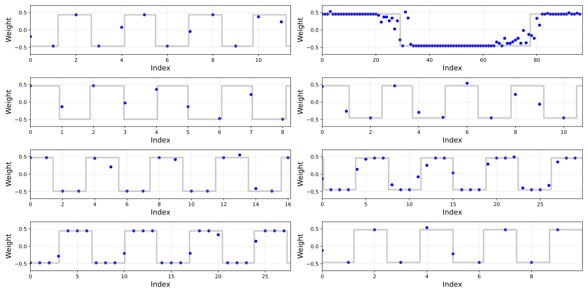
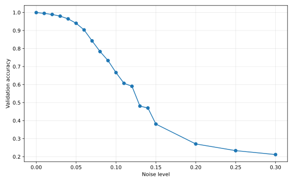
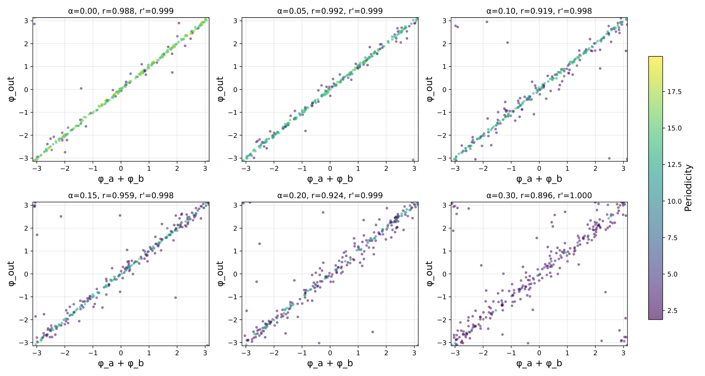

# Latent Algorithmic Structure Precedes Grokking: A Mechanistic Study of ReLU MLPs on Modular Arithmetic

Anand Swaroop Email: anandswaroop191@gmail.com

## Abstract

Grokking—the phenomenon where validation accuracy of neural networks on modular addition of two integers rises long after training data has been memorized—has been characterized in previous works as producing sinusoidal input weight distributions in transformers and multi-layer perceptrons (MLPs). We find empirically that ReLU MLPs in our experimental setting instead learn near-binary square wave input weights, where intermediate-valued weights appear exclusively near sign-change boundaries, alongside output weight distributions whose dominant Fourier phases satisfy a phase-sum relation $\phi_{\mathrm{out}}=\phi_{a}+\phi_{b}$; this relation holds even when the model is trained on noisy data and fails to grok. We extract the frequency and phase of each neuron’s weights via DFT and construct an idealized MLP: Input weights are replaced by perfect binary square waves and output weights by cosines, both parametrized by the frequencies, phases, and amplitudes extracted from the dominant Fourier components of the real model weights. This idealized model achieves **95.5% accuracy** when the frequencies and phases are extracted from the weights of a model trained on noisy data that itself achieves only 0.23% accuracy. This suggests that grokking does not discover the correct algorithm, but rather sharpens an algorithm substantially encoded during memorization, progressively binarizing the input weights into cleaner square waves and aligning the output weights, until generalization becomes possible.

## 1 Introduction

Neural networks trained on modular arithmetic tasks exhibit a counterintuitive phenomenon: After rapidly memorizing the training set, validation accuracy remains near random chance for thousands of additional steps before abruptly rising to near-perfect generalization [Power et al., 2022]. This delayed generalization, termed *grokking*, has become a testbed for understanding how and when neural networks develop structured internal representations.

Mechanistic interpretability work on transformers has characterized one algorithm underlying grokking as a Fourier multiplication circuit: The network learns input embeddings that are sinusoidal functions of the input token, and computes the sum via a phase-addition mechanism in weight space [Nanda et al., 2023]. This picture was placed on analytic footing by Gromov [2023], who showed that cosine input weights with a phase-sum constraint $\phi_{\mathrm{out}}=\phi_{a}+\phi_{b}$ are sufficient for arbitrarily high accuracy modular addition in an MLP with a sufficiently large hidden layer, derived an analytic circuit construction for quadratic activations, and showed empirically that this extends to ReLU. Together, these works establish sinusoidal weights as a common signature of grokking on modular addition tasks.

Li et al. [2025] prove that Fourier circuits emerge in one-hidden-layer MLPs via margin maximization, establishing a theoretical basis for the sinusoidal structure in one-hidden-layer MLPs on modular addition.

**[p. 2]**

Doshi et al. [2024] study the same ReLU MLP architecture under label corruption, showing that memorizing and generalizing neurons coexist and can be identified via their Fourier localization. While their work characterizes the *presence* of periodic structure under noise, it does not examine the weight shape, the phase-sum constraint, or whether the algorithmic structure survives in models that fail to grok entirely.

**Contribution.** We study ReLU MLPs on the same modular addition task (given two integers $a$ and $b$, find $a+b\bmod 97$) and find a qualitatively different weight structure. In our experimental setting (weight decay $1.0$, train fraction $0.3$), input weights are *near-binary square waves* rather than cosines: Weights take values $\sim\epsilon\pm A$ across most of their domain (empirically, $A$ is approximately constant across neurons and $\epsilon$ is close to zero), with intermediate values appearing exclusively near sign-change boundaries.

For each hidden neuron $i$, let $W_{a}^{(i)}$ and $W_{b}^{(i)}$ be the input weight vectors over the one-hot encodings of $a$ and $b$, $W_{\mathrm{out}}^{(i)}$ the vector of weights connecting hidden neuron $i$ to each of the output nodes, and $\phi_{a}^{(i)}$, $\phi_{b}^{(i)}$, and $\phi_{\mathrm{out}}^{(i)}$ the phases of the respective dominant Fourier components (extracted using discrete Fourier transform). We find that for a given $i$, $W_{a}^{(i)}$ and $W_{b}^{(i)}$ follow square waves with the same frequency and amplitude, but not necessarily the same phase. Output weights $W_{\mathrm{out}}^{(i)}$, which pass through no nonlinearity, do not follow a square wave; however, they retain the same frequency as $W_{a}^{(i)}$ and $W_{b}^{(i)}$, and their dominant Fourier phases satisfy $\phi_{\mathrm{out}}=\phi_{a}+\phi_{b}$.

We leverage this structure to construct an idealized MLP: Input weights are replaced by perfect binary square waves and output weights by cosines, with both parameterized entirely by frequencies and phases extracted via DFT. This idealized model achieves **95.5% accuracy** when constructed from a model trained on heavily noisy data that itself achieves only **0.23% accuracy**.

###### p2-5

This result implies that grokking does not discover the correct algorithm. The algorithmic structure (the periodic input weight phases and their sum relation) is already encoded during memorization. Grokking sharpens the latent algorithmic structure until generalization is achieved.

## 2 Setup

We train a multi-layer perceptron (MLP) with one hidden layer on the task of adding two integers, $a$ and $b$, modulo 97. The input is a dimension-194 two-hot vector (a one-hot encoding of $a$ concatenated with a one-hot encoding of $b$). The output is a dimension-97 one-hot vector representing $a+b\ (\mathrm{mod}\ 97)$. The hidden layer consists of 256 fully connected neurons and uses the ReLU activation function. We define $W_{a}^{(i)}$, $W_{b}^{(i)}$, and $W_{\mathrm{out}}^{(i)}$ as discussed previously.

We use the AdamW optimizer on all parameters of the model, with a learning rate of $10^{-3}$ and a weight decay coefficient of $1.0$.

The dataset used is the full set of $97^{2}$ integer triples $(a,b,c)$, where $a,b,c\in[0,96]$ and $c\equiv a+b\ (\mathrm{mod}\ 97)$. We use a 30/70 train/validation split, stratified by $c$. We introduce a hyperparameter $\alpha\in[0,1]$ for label noise. We corrupt a fraction $\alpha$ of training labels by replacing each with a value chosen uniformly at random among the remaining $96$ classes. The validation set is unaffected by $\alpha$ and always contains ground-truth triples. We train with $\alpha=0$ (no noise, the standard grokking task; we will refer to this as the “clean model”), as well as with 18 non-zero values ranging from $0.01$ to $0.30$[^1] to investigate the effects of label noise on grokking (we will refer to these as the “noisy models”).

[^1]: The specific values used are $0.01$, $0.02$, $0.03$, $0.04$, $0.05$, $0.06$, $0.07$, $0.08$, $0.09$, $0.1$, $0.11$, $0.12$, $0.13$, $0.14$, $0.15$, $0.20$, $0.25$, and $0.30$.

We utilize early stopping, stopping training when the model’s maximum validation accuracy hasn’t improved by at least $10^{-4}$ in the past $50{,}000$ steps, or when the model’s validation accuracy rises past $0.999$. We set a hard limit of $500{,}000$ steps (in our experiments, this limit is never reached; for $\alpha=0$, the second early stopping condition is reached, and for non-zero $\alpha$ the first early stopping condition is reached). For each model, we save a saturation checkpoint when the model achieves 99% accuracy on its train set, and the final model when it triggers any of the stopping conditions mentioned.

**[p. 3]**

## 3 Results

###### p3-1

We find that in the clean model, $W_{a}^{(i)}$ and $W_{b}^{(i)}$ follow square waves almost perfectly, as opposed to the sinusoidal waves found in the embeddings of grokking transformers in Nanda et al. [2023]. For each neuron, we extract the frequency and phase of the dominant Fourier component with DFT and construct a square wave with the same frequency and phase; no fitting is performed on the frequency and phase. We compute the amplitude and vertical offset such that the constructed wave’s upper and lower levels match the median values in the positive and negative half-periods of the neuron weights. We call these constructed waves *ideal square waves*. Several examples are shown in Figures 1 and 2.

*Figure 1: Actual $W_{a}$ for various neurons plotted in blue, ideal square wave in gray. Intermediate values appear only near sign-change boundaries. Figures are scaled horizontally such that no more than 5 periods are visible in order to show fine details.* **[p. 3]**

*Figure 2: Actual $W_{b}$ from various neurons in red, ideal wave in gray. Intermediate values only near sign-change boundaries, and the dominant frequency extracted from $W_{b}$ matches that of $W_{a}$.* **[p. 3]**

Not all neurons in the hidden layer learn periodic representations. To distinguish between neurons that encode useful frequency structure and those that do not, we quantify the periodicity of each neuron’s input weights using the *periodicity score*: The ratio of the magnitude of the dominant Fourier component to the mean magnitude across all non-DC components,

**[p. 4]**

$$
\mathrm{per}(w)=\frac{\max_{k=1}^{p-1}|\hat{w}_{k}|}{\frac{1}{p-1}\sum_{k=1}^{p-1}|\hat{w}_{k}|}, \tag{1}
$$

where $\hat{w}_{k}$ denotes the $k$-th DFT coefficient of weight vector $w$. A high periodicity score indicates that the weight vector is dominated by a single frequency; a score near 1 indicates a flat spectrum with no dominant frequency.

Applying this measure to $W_{a}^{(i)}$ across all 256 hidden neurons reveals a bimodal distribution: 212 neurons have high periodicity scores ($\mathrm{per}(W_{a}^{(i)})>12$) and 37 have low periodicity scores ($\mathrm{per}(W_{a}^{(i)})<5$), with a clear gap between the two populations; 7 neurons fall between the two thresholds and are excluded from both groups (we find identical results on $W_{b}$, with the same neurons in each group). These thresholds were chosen to capture the clear gap in the bimodal distribution. We refer to the high-periodicity neurons as *structured neurons* and the remaining neurons as *unstructured neurons*. Zeroing the outputs of all unstructured neurons produces an accuracy drop of less than 0.001, confirming that they contribute negligibly to the neural network’s output. We find unstructured neurons tend to have significantly lower-norm connections to the output layer. We also find that the dominant Fourier frequencies of $W_{a}^{(i)}$, $W_{b}^{(i)}$, and $W_{\mathrm{out}}^{(i)}$ are equal for $92.97\%$ of all neurons and for 100% of structured neurons.

To provide a quantitative measure of fit, for each neuron, we calculate the mean nearest-point distance between the input weights and the ideal square wave, as well as the mean nearest-point distance between the input weights and an ideal cosine wave with the same phase, frequency, amplitude, and vertical offset. We perform a paired $t$-test on these values and find that the distance to the ideal square waves is lower: $t(211)=-27.0052$ and $p<10^{-6}$ for the structured neurons; $t(255)=-28.29$ and $p<10^{-6}$ over all 256 neurons.

### 3.1 Noise

We find that as the noise level $\alpha$ increases, the validation accuracy of the final model follows a decreasing sigmoidal transition (fig. 3(a)) from $0.999$ with $\alpha=0.00$ to $0.0023$ with $\alpha=0.30$, while periodicity of neurons follows a gradual decrease (fig. 3(b)).

*(a) Validation accuracy against $\alpha$.*

*(b) Mean periodicity over all neurons against $\alpha$.*

*Figure 3: Accuracy and periodicity across noise levels.* **[p. 4]**

We find that, across all noise levels, the dominant frequencies of $W_{a}^{(i)}$, $W_{b}^{(i)}$, and $W_{\mathrm{out}}^{(i)}$ match for 100% of neurons with periodicity $>12$ (although with $\alpha=0.30$ there are only 7 such neurons). We extract the phase of the dominant Fourier component from each neuron’s $W_{\mathrm{out}}$. We find that $\phi_{\mathrm{out}}=\phi_{a}+\phi_{b}$ holds for the highest periodicity neurons in both the clean model and the noisy models. As shown in Figure 4, all structured neurons satisfy $\phi_{\mathrm{out}}=\phi_{a}+\phi_{b}$—up to shifts by multiples of $2\pi$—almost perfectly. This matches the empirical results uncovered in Gromov [2023] and Nanda et al. [2023] and the analytical construction in the former. However, both works find this relation in sinusoidal weights rather than square-wave-like weights.

*Figure 4: $\phi_{\mathrm{out}}$ against $\phi_{a}+\phi_{b}$ across all neurons in the clean model, wrapped to $[-\pi,\pi]$. When restricted to only structured neurons, there is a nearly perfect correlation (circular correlation $r=0.9993$).* **[p. 5]**

###### p4-6

Although periodicity generally degrades as the label noise increases, we find that the $\phi_{\mathrm{out}}=\phi_{a}+\phi_{b}$ relation is preserved for the highest-periodicity neurons within each tested $\alpha$ level. This is evident in Figure 5. This suggests that latent structure is formed to some degree, even with significant label **[p. 5]** noise, which raises the question of whether it can be extracted to recover a correct algorithm despite the model’s failure to generalize. We find that this is possible.

*Figure 5: $\phi_{\mathrm{out}}$ against $\phi_{a}+\phi_{b}$ for various $\alpha$ levels. The highest-periodicity neurons in each model lie close to the diagonal, regardless of the spread of the lower-periodicity neurons. Circular correlation coefficients are listed; $r$ is taken over all neurons, $r^{\prime}$ over only structured neurons (periodicity $>12$). $r^{\prime}\geq 0.998$ for all $\alpha$ levels, indicating that structured neurons satisfy the phase-sum relation regardless of noise.* **[p. 5]**

## 4 Idealized Model

We first construct from scratch an MLP that solves the modular addition task. We use an MLP with the same setup (dimension-194 two-hot input, dimension-256 hidden layer, dimension-97 one-hot **[p. 6]** output). We use weights

$$
W_{a}^{(i)}[j] =f\left(\frac{2\pi ij}{97}-\phi_{ai}\right),  i\in[0,255],j\in[0,96] \\
W_{b}^{(i)}[j] =f\left(\frac{2\pi ij}{97}-\phi_{bi}\right), \\
W_{\mathrm{out}}^{(i)}[j] =g\left(\frac{2\pi ij}{97}-\phi_{ai}-\phi_{bi}\right),
$$

with phases $\phi_{ai}$ and $\phi_{bi}$ chosen independently per neuron and uniformly at random from the range $[-\pi,\pi]$. We set all biases to zero: In the trained model, the effective first-layer bias (after accounting for the vertical offset of the input weights) has mean $0.010\pm 0.004$ (SD) across structured neurons, less than 2.5% of the typical weight amplitude $A\approx 0.45$, and all 212 structured neurons satisfy $|b_{\text{eff}}|<0.05$.

$f$ and $g$ determine the type of wave that $W_{a}$, $W_{b}$, $W_{\mathrm{out}}$ follow; $\cos$ for sinusoidal waves and $\mathrm{sign}\circ\cos$ for square waves. We test three different settings:

1. $f=g=\cos$; this is identical to the setup in Gromov [2023] with ReLU activations.
2. $f=\mathrm{sign}\circ\cos$, $g=\cos$.
3. $f=g=\mathrm{sign}\circ\cos$.

We will refer to these three as Cos$\to$Cos, Sq$\to$Cos, and Sq$\to$Sq respectively. The goal of using $\mathrm{sign}\circ\cos$ is to determine how square waves affect the model’s accuracy in comparison to sinusoidal waves. We use ReLU activations across all constructed models.

Gromov [2023] proves that, with a sufficiently large hidden layer, their cosine-only model with quadratic activations achieves arbitrarily high accuracy. They also find empirically that the same occurs with ReLU activations, although more neurons are required to match the accuracy of quadratic activations.

We evaluate the constructed models over 40 different random seeds and various hidden layer widths $N$; the results are summarized in Table 1. All three methods show a monotonic increase in accuracy as the hidden layer width increases, and all achieve high ($>0.998$) accuracy with 512 neurons. Square wave input weights and sinusoidal output weights show the greatest accuracy across all hidden widths, by a statistically significant margin for $N\leq 384$ ($p<0.01$). This suggests that not only is the square wave construction for input weights more faithful to the representation our model learns, but also that it is a more accurate solution.

*Table 1: Accuracy of constructed models for different hidden widths. Values are mean $\pm$ standard deviation over 40 random seeds. All models use ReLU activations.* **[p. 6]**

| $N$ | Cos$\to$Cos | Sq$\to$Cos | Sq$\to$Sq |
|---|---|---|---|
| 16 | $0.0422\pm 0.0049$ | $\mathbf{0.0735\pm 0.0041}$ | $0.0458\pm 0.0064$ |
| 32 | $0.1322\pm 0.0125$ | $\mathbf{0.1944\pm 0.0093}$ | $0.1415\pm 0.0107$ |
| 64 | $0.3653\pm 0.0313$ | $\mathbf{0.4449\pm 0.0234}$ | $0.3314\pm 0.0178$ |
| 96 | $0.5850\pm 0.0379$ | $\mathbf{0.6522\pm 0.0263}$ | $0.5057\pm 0.0245$ |
| 128 | $0.7482\pm 0.0372$ | $\mathbf{0.7968\pm 0.0243}$ | $0.6512\pm 0.0258$ |
| 192 | $0.9222\pm 0.0178$ | $\mathbf{0.9417\pm 0.0100}$ | $0.8450\pm 0.0196$ |
| 256 | $0.9793\pm 0.0067$ | $\mathbf{0.9849\pm 0.0042}$ | $0.9375\pm 0.0107$ |
| 384 | $0.9987\pm 0.0008$ | $\mathbf{0.9992\pm 0.0005}$ | $0.9907\pm 0.0030$ |
| 512 | $0.9999\pm 0.0001$ | $\mathbf{1.0000\pm 0.0001}$ | $0.9989\pm 0.0006$ |

Note that this constructed model is from scratch, with no relation to the actual models we have trained beyond the square-wave structure and the $\phi_{\mathrm{out}}=\phi_{a}+\phi_{b}$ relation. In Section 4.1, we bridge this gap by using parameters extracted directly from the trained models rather than constructing them ourselves.

**[p. 7]**

### 4.1 Extraction

To determine if there is latent structure in the weights of our noisy models, we use a procedure to replace all $W_{a}^{(i)}$, $W_{b}^{(i)}$, and $W_{\mathrm{out}}^{(i)}$ with square or cosine waves. The process is simple: For each neuron, we extract the frequency from the dominant Fourier component of $W_{a}^{(i)}$, and the phase from the dominant Fourier component of $W_{a}^{(i)}$, $W_{b}^{(i)}$, $W_{\mathrm{out}}^{(i)}$. Let $\nu$ be the extracted frequency and $\phi_{a}^{(i)},\phi_{b}^{(i)},\phi_{\mathrm{out}}^{(i)}$ be the extracted phases. Then, we construct a model whose input and output weights follow the extracted phases and frequencies. More formally,

$$
W_{a}^{(i)}[j] =f\left(\frac{2\pi\nu j}{97}-\phi_{a}^{(i)}\right), \\
W_{b}^{(i)}[j] =f\left(\frac{2\pi\nu j}{97}-\phi_{b}^{(i)}\right), \\
W_{\mathrm{out}}^{(i)}[j] =g\left(\frac{2\pi\nu j}{97}-\phi_{\mathrm{out}}^{(i)}\right).
$$

We test the same three settings for $f$ and $g$ as previously described. We perform the extraction on actual models with various $\alpha$ values, on both the final checkpoint and the saturation checkpoint. We evaluate each extracted model on the validation set; our results are summarized in Table 2.

*Table 2: Validation accuracy of real and extracted models across noise levels. Results are shown for the final model checkpoint and the saturation checkpoint (when training accuracy first reaches 99%).* **[p. 7]**

|  | Final checkpoint |  |  |  | Saturation checkpoint |  |  |  |
|---|---|---|---|---|---|---|---|---|
| $\alpha$ | Real | Sq$\to$Sq | Sq$\to$Cos | Cos$\to$Cos | Real | Sq$\to$Sq | Sq$\to$Cos | Cos$\to$Cos |
| 0.00 | 0.9991 | 0.9719 | 0.9979 | **0.9988** | $<0.0001$ | 0.6912 | **0.8133** | 0.7661 |
| 0.05 | 0.9358 | 0.9705 | 0.9970 | **0.9979** | $<0.0001$ | 0.7545 | **0.8407** | 0.7967 |
| 0.10 | 0.5663 | 0.9607 | 0.9954 | **0.9957** | $<0.0001$ | 0.7586 | **0.8825** | 0.8420 |
| 0.15 | 0.1797 | 0.9505 | 0.9912 | **0.9921** | 0.0005 | 0.6408 | **0.7799** | 0.7289 |
| 0.20 | 0.0436 | 0.9135 | **0.9778** | 0.9766 | 0.0002 | 0.6402 | **0.7571** | 0.6959 |
| 0.25 | 0.0120 | 0.9320 | **0.9813** | 0.9765 | 0.0003 | 0.5086 | **0.6496** | 0.5912 |
| 0.30 | 0.0023 | 0.8735 | **0.9548** | 0.9405 | 0.0011 | 0.5641 | **0.6501** | 0.5944 |

###### p7-3

The Sq$\to$Cos extraction consistently achieves high accuracy on final checkpoints across all noise levels, reaching 95.5% at $\alpha=0.30$ where the real model achieves only 0.23%. At lower noise levels, Sq$\to$Cos and Cos$\to$Cos perform similarly on the final checkpoint, suggesting that for well-trained models the output phase structure is sufficiently preserved that either input wave type recovers the algorithm. The advantage of Sq$\to$Cos becomes pronounced in the final checkpoints at high noise ($\alpha\geq 0.25$) and is consistent across all saturation checkpoints, where the real model accuracy is near zero throughout. The saturation results confirm that the algorithmic structure—the appropriate phases and frequencies to perform modular addition—is already encoded to a significant degree at memorization, before grokking occurs.

## 5 Discussion

Our findings suggest a reframing of what grokking accomplishes. Prior mechanistic studies have shown that grokking involves a gradual circuit formation phase during memorization, where structured mechanisms amplify continuously before the test accuracy jump [Nanda et al., 2023]. Our results extend this picture in ReLU MLPs under label noise: We extract a high-accuracy idealized model directly from memorization-phase (saturation) weights, even in non-grokking regimes where the real model fails to generalize. This demonstrates that the core algorithmic structure—frequencies and phase-sum relations—is encoded in a form sufficient for near-recovery of the solution as early as memorization, and persists robustly under corruption. What grokking does is sharpen this latent structure, aligning model weights more closely with the ideal waves.

Our finding that input weights follow square waves rather than the sinusoidal waves reported in prior work may be regime-dependent. Gromov [2023] analytically constructs cosine weights using **[p. 8]** vanilla gradient descent without regularization; Doshi et al. [2024] use AdamW with weight decay but primarily study quadratic activations, for which the analytic cosine solution is exact. Our setting uses ReLU activations with AdamW and weight decay 1.0. Whether the square wave structure arises from the ReLU activation, the strength of weight decay, or their interaction remains an open question.

Several limitations apply. Our experiments are confined to a single task (modular addition), a single architecture (one-hidden-layer ReLU MLP), and a single modulus ($p=97$). Whether the latent structure finding generalizes to other tasks or architectures is an important direction for future work.

## 6 Conclusion

We have shown that ReLU MLPs trained on modular addition learn near-binary square wave input weights whose dominant Fourier phases satisfy $\phi_{\mathrm{out}}=\phi_{a}+\phi_{b}$, and that this phase structure is largely preserved even under heavy label noise that prevents generalization. Extracting these phases and constructing an idealized model recovers 95.5% accuracy from a model that itself achieves 0.23%, and substantial accuracy from saturation checkpoints where the real model has not yet generalized at all. Together, these results suggest that grokking does not discover the correct algorithm—it sharpens one that was already there.

**[p. 9]**

## References

- D. Doshi, A. Das, T. He, and A. Gromov To grok or not to grok: disentangling generalization and memorization on corrupted algorithmic datasets. In The Twelfth International Conference on Learning Representations, 2024. Cited by: §1, §5.

- A. Gromov Grokking modular arithmetic. 2023. External Links: 2301.02679, Link Cited by: §1, §3.1, item 1, §4, §5.

- C. Li, Y. Liang, Z. Shi, Z. Song, and T. Zhou Fourier circuits in neural networks and transformers: a case study of modular arithmetic with multiple inputs. In International Conference on Artificial Intelligence and Statistics, pp. 523–531, PMLR, 2025. Cited by: §1.

- N. Nanda, L. Chan, T. Lieberum, J. Smith, and J. Steinhardt Progress measures for grokking via mechanistic interpretability. 2023. External Links: Link Cited by: §1, §3.1, §3, §5.

- A. Power, Y. Burda, H. Edwards, I. Babuschkin, and V. Misra Grokking: generalization beyond overfitting on small algorithmic datasets. 2022. External Links: 2201.02177, Link Cited by: §1.
