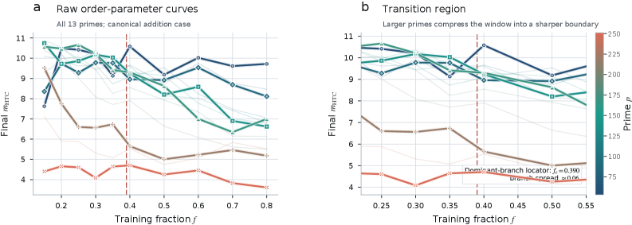
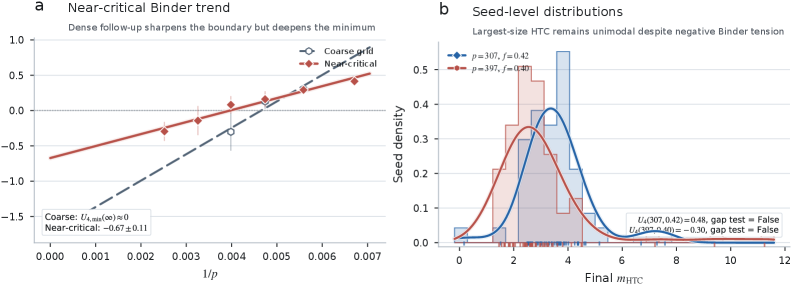
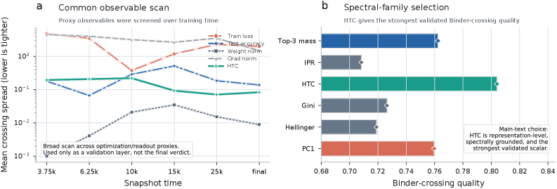
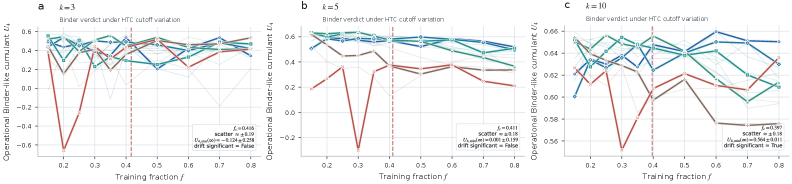
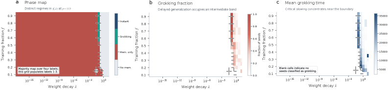

# Bi, Zhang, Wang, Calhoun 2026 — Grokking as a Falsifiable Finite-Size Transition

See also: [the global concept index](../../concepts/index.md).

**Yuda Bi, Chenyu Zhang, Qiheng Wang, Vince D Calhoun** (TReNDS Center, Georgia State; Beijing Institute of Technology; Georgia Institute of Technology).

arXiv [2603.24746](https://arxiv.org/abs/2603.24746), March 2026 (version v1). 2 citations — the thirty-seventh most cited work in the corpus. The source is the native arXiv HTML of version v1.

The files of this paper's analysis:

- [`2603.24746.grokking-as-a-falsifiable-finite-size-transition.license.txt`](2603.24746.grokking-as-a-falsifiable-finite-size-transition.license.txt) — the arXiv licence record for this paper.

The anchor scheme and the rules for linking into a card are in the [README of the papers folder](../README.md).

**Excerpt card.** The paper's licence (`arxiv-nonexclusive`) does not permit republishing the paper itself; what stands here are the editorial sections and the fragments the corpus quotes (right of quotation). The paper: <https://arxiv.org/abs/2603.24746>.

## Concepts covered

**[Phase transition](../../concepts/phase-transition.md)** — the work undertakes not to explain grokking but to **test** the language customary in the corpus. Its argument is simple: steep training curves at a single system size do not by themselves constitute a falsifiable finite-size claim ([`p1-3`](#p1-3)). In their place a chain of tests from condensed-matter physics is proposed: a sharpening, a crossing of a Binder-type cumulant, a comparison of susceptibilities, an estimate of the order of the transition — each link with its own mode of failure ([`p1-4`](#p1-4)). The outcome is twofold: the transition-like structure is supported, the smooth-crossover reading is rejected ($\Delta\mathrm{AIC}=16.8$), and the order of the transition remains unresolved ([`p6-2`](#p6-2), [`p6-3`](#p6-3)).

**[The order parameter](../../concepts/order-parameter.md)** — the first of two missing quantities. A spectral head-versus-tail contrast is introduced: the logarithm of the ratio of the sum of the five largest normalised eigenvalues of the representation covariance to the sum of the rest ([`p2-3`](#p2-3), [`p2-4`](#p2-4)). Three of the authors' caveats matter: readout-level quantities (the loss, the accuracy) cannot serve as order parameters; the choice $k=5$ is a working one, and $k=3$ gives the same verdict while $k=10$ weakens the separation; and a screening over other observables is a check rather than a fit ([`p2-4`](#p2-4), [`p10-5`](#p10-5)).

**[Modular arithmetic](../../concepts/modular-arithmetic.md)** — the second missing quantity is taken from here: the **order of the group $p$** is adopted as the extensive size variable ([`p2-1`](#p2-1)). The argument for this choice is precise: varying $p$ enlarges one homogeneous algebraic family, whereas sweeps over width, depth or parameter count switch between classes of models; and $p^{2}$ would count only the examples rather than the quantity defining the family ([`p2-1`](#p2-1)). Addition is taken as the canonical case, with subtraction and multiplication left as supporting checks ([`p8-48`](#p8-48)).

**[Critical dataset size](../../concepts/data-fraction-critical-dataset-size.md)** — the control parameter is the training-data fraction $f$, and the whole picture is built in the axes $(f,p)$. The estimate of the critical fraction: $f_{\mathrm{c}}\approx 0.39$ on the coarse grid and $0.418$ on the near-critical one, with the spread of the crossings narrowing from $0.057$ to $0.019$ ([`p4-1`](#p4-1), [`p4-2`](#p4-2), [`p5-4`](#p5-4)). There is no significant drift of the crossings with the inverse size — and that is the argument for a common boundary rather than merely steeper curves ([`p4-2`](#p4-2)).

**[Effective theory and statistical mechanics](../../concepts/effective-theory-statistical-mechanics.md)** — the work is built throughout to the measure of this line. The cumulant $U_{4}=1-\langle m^{4}\rangle/3\langle m^{2}\rangle^{2}$ is computed over seeds, the susceptibility is defined as $\chi=n_{s}\mathrm{Var}[m_{\mathrm{HTC}}]$, and the comparison is made between a power-law growth of the peak and a saturating surrogate at an equal parameter count ([`p3-4`](#p3-4), [`p4-4`](#p4-4)). The caveats are honest: the HTC is positive-definite and lacks a $\mathbb{Z}_{2}$ symmetry, so the customary plateau values are not to be expected, and $\chi$ should be read as a working susceptibility of the seed-to-seed fluctuations rather than as a thermodynamic response ([`p3-4`](#p3-4), [`p9-5`](#p9-5)).

**[Spectral analysis](../../concepts/spectral-analysis-svd-esd-fve.md)** — the measurement is made on the covariance of the penultimate representations over a **held-out** probe subset: centring, diagonalisation, a normalised spectrum ([`p8-46`](#p8-46)). The key move is the refusal of a Fourier basis: the amplitudes of the Fourier modes are mechanistically more instructive but presuppose a task-specific basis, whereas the HTC is basis-independent ([`p2-4`](#p2-4), [`p10-5`](#p10-5)).

**[The manifold and the compression of the representation](../../concepts/manifold-representation-compression.md)** — the substantive picture is exactly that: under a spread spectrum the head and tail masses are comparable, and when several modes separate from the bulk the indicator grows ([`p2-4`](#p2-4)). Grokking is thereby described as a condensation of spectral mass into a small leading class rather than as a change in the quality of the readout.

**[Progress measures](../../concepts/progress-measures.md)** — it is said outright how the proposed quantity differs from the customary ones: the training loss and the test accuracy are useful indicators but not order parameters in the statistical-mechanical sense ([`p2-4`](#p2-4)). The weight and gradient norms are rejected for another reason: they conflate information about the transition with the consequences of the optimiser and the regularisation ([`p10-5`](#p10-5)).

**[Weight decay](../../concepts/weight-decay.md)** — held fixed ($\lambda=1.0$) in all the main sweeps, and it appears as an axis only in a contextual phase map: at $p=113$ the grokking band in the $(f,\lambda)$ plane is distinct, and its boundary shifts with the regularisation ([`p2-5`](#p2-5), [`p10-8`](#p10-8)).

**[Memorisation](../../concepts/memorization-phase.md)** — the per-seed phase labelling uses four labels: no memorisation, memorisation only, grokking, and immediate generalisation; on the present grid three dominate the plurality map ([`p10-7`](#p10-7)). Grokking itself is defined by a sliding window over the held-out accuracy: a mean above $0.98$, a deviation below $0.02$, and a training accuracy above $0.995$ ([`p8-47`](#p8-47)).

**[Emergence](../../concepts/emergence.md)** — the work gives the corpus a yardstick it lacked: claims about emergence and transitions should be judged by admissible finite-size control quantities, representation-level observables and explicit failure conditions, rather than by sharp curves alone ([`p6-5`](#p6-5)).

**[Mechanistic interpretability](../../concepts/mechanistic-interpretability.md)** — the line is named and placed: mechanistic works explain why grokking happens and how to control it, but they do not themselves deliver a finite-size verdict ([`p11-3`](#p11-3)).

It is worth saying separately what the work does **not** contain. There are no exponents: extracting $\beta/\nu$ and $1/\nu$ is admitted to be unreliable — the estimates of $1/\nu$ wander from $0.5$ to $3.0$ depending on the pair of sizes chosen, and the data collapse gives $\chi^{2}/\mathrm{dof}<0.01$, which indicates over-fitting ([`p11-1`](#p11-1)). There is no claim of universality: the differences between the operations are inseparable from finite-size contamination ([`p9-1`](#p9-1)). And there is no order of the transition: for the two largest primes the Binder minimum goes negative ($-0.67\pm 0.11$), which speaks for first order, but the seed-to-seed bimodality characteristic of coexistence does not appear ([`p5-4`](#p5-4), [`p5-5`](#p5-5)).

Cards of corpus papers: [Power et al. 2022](../2201.02177.grokking-generalization-beyond-overfitting-on-small-algorithmic-datasets/2201.02177.grokking-generalization-beyond-overfitting-on-small-algorithmic-datasets.card.md) — the original phenomenon and the task; [Liu et al. 2022](../2205.10343.towards-understanding-grokking-an-effective-theory-of-representation-learning/2205.10343.towards-understanding-grokking-an-effective-theory-of-representation-learning.card.md) — the effective theory of representation learning, named among the transition frames; [Rubin et al. 2023](../2310.03789.grokking-as-a-first-order-phase-transition-in-two-layer-networks/2310.03789.grokking-as-a-first-order-phase-transition-in-two-layer-networks.card.md) — the mean-field first-order transition, whose possibility the present negative minima leave alive; [Nanda et al. 2023](../2301.05217.progress-measures-for-grokking-via-mechanistic-interpretability/2301.05217.progress-measures-for-grokking-via-mechanistic-interpretability.card.md) — mechanistic progress measures; [Merrill et al. 2023](../2303.11873.a-tale-of-two-circuits-grokking-as-competition-of-sparse-and-dense-subnetworks/2303.11873.a-tale-of-two-circuits-grokking-as-competition-of-sparse-and-dense-subnetworks.card.md) — the competition of circuits; [DeMoss et al. 2024](../2412.09810.the-complexity-dynamics-of-grokking/2412.09810.the-complexity-dynamics-of-grokking.card.md) — the dynamics of complexity; [Grokfast](../2405.20233.grokfast-accelerated-grokking-by-amplifying-slow-gradients/2405.20233.grokfast-accelerated-grokking-by-amplifying-slow-gradients.card.md) — acceleration by amplifying the slow gradients; [Prieto et al. 2025](../2501.04697.grokking-at-the-edge-of-numerical-stability/2501.04697.grokking-at-the-edge-of-numerical-stability.card.md) — the mechanism of numerical stability; [Omnigrok](../2210.01117.omnigrok-grokking-beyond-algorithmic-data/2210.01117.omnigrok-grokking-beyond-algorithmic-data.card.md) — the widening of the phenomenon's scope.

**[Criticality / the critical point](../../concepts/criticality-critical-point.md)** — the work proposes an order of tests distinguishing criticality from a sharp but ordinary feature of a finite system: finite-size scaling ([`p1-4`](#p1-4)). This tightens the requirements on the whole line — a steep curve is henceforth not enough for a claim about a critical point.

**[The universality hypothesis](../../concepts/universality-hypothesis.md)** — the word here is taken in its physical sense, as a universality class, and the verdict is cautious: no stable class is established, nor is the final order of the transition ([`p6-5`](#p6-5)). With the identically named hypothesis of mechanistic interpretability this has nothing to do.

**[Seed variance and reproducibility](../../concepts/seed-variance-reproducibility.md)** — the robustness is built into the very definition of the moment of grokking: a window counts only if the held-out standard deviation within it stays below $0.02$ ([`p8-47`](#p8-47)). The threshold thereby ceases to depend on a lucky seed.
## What is shown and what is conjectured

The card editor's remarks following the analysis of the claims (`…claims.txt`). The work is a testing one: two identifications, one chain of tests, two grid sweeps, and no new theory.

**The main contribution is a machinery of falsifiability rather than a result.** What is valuable here is precisely that the claim is framed so that it could fail, and that how it could is enumerated: had the curves not sharpened as $p$ grew, had the crossings drifted, had the susceptibility spoken for saturation, had the near-critical check dissolved the common crossing ([`p6-2`](#p6-2)). In a corpus in which "phase transition" is more often a simile than a measured quantity, this is a substantial step.

**The choice of the size variable is the work's strongest place.** The argument that $p$ enlarges one algebraic family while width and depth switch classes of models removes the chief objection to carrying FSS into machine learning ([`p2-1`](#p2-1)). The caveat about the fixed $d_{\mathrm{model}}=128$ is given by the authors themselves: at a much larger $p$ the bottleneck would shift to the capacity of the model.

**The order parameter is introduced with justifications but remains chosen.** The HTC is not derived from any theory; it is proposed as a compressed scalar and justified after the fact by its robustness to $k=3$ and to other observables ([`p2-4`](#p2-4), [`p10-5`](#p10-5)). The check is useful, but it shows an insensitivity to the cut-off rather than that this particular quantity is an order parameter.

**The verdict against a smooth crossover rests on a single null model.** The comparison is made with a saturating form $1-e^{-bp}$ at an equal parameter count, and this is admitted: the test runs against a **simple** saturating surrogate rather than against every conceivable picture of a smooth crossover ([`p4-4`](#p4-4)). The $\Delta\mathrm{AIC}=16.8$ is convincing precisely within those limits.

**The negative Binder minimum is the most curious and the most precarious place.** At $p=307$ and $p=397$ the minimum goes to $-0.67\pm 0.11$, which in physics would read as first order; but the seed-to-seed distributions are unimodal, and no bimodality is found by kernel density estimation or by a gap statistic ([`p5-4`](#p5-4), [`p5-5`](#p5-5), [`p10-1`](#p10-1)). The authors honestly record this as a **tension** rather than a verdict, and state outright that trimming the tails weakens the negativity ([`p10-7`](#p10-7)).

**An ensemble of seeds is not a thermodynamic ensemble, and this is worth remembering.** The fluctuations are taken over random initialisations at a fixed data split ([`p2-2`](#p2-2), [`p4-4`](#p4-4)). Such a "susceptibility" measures the spread of training outcomes rather than the response of a system to a field; the carry-over of the language works while the talk is of the growth or saturation of a peak, and ceases to work the moment plateau values come up.

**The range of sizes is small, and this is admitted.** $p$ from 53 to 397 is less than one decimal order, so corrections to scaling cannot be extracted and the exponents are not stable ([`p10-4`](#p10-4), [`p11-1`](#p11-1)). The authors' caution is consistent: they claim no exponents at all, confining themselves to tests for which the dominance of the leading form suffices.

**The number of runs and the measurement protocol are set out exemplarily.** 50 seeds per condition, a split generated once and shared across seeds, results taken as an average over the last 40 recorded points, and the grokking-detection condition specified numerically ([`p2-2`](#p2-2), [`p8-46`](#p8-46), [`p8-47`](#p8-47)). For a corpus in which the number of seeds is often not stated at all, this stands out.

**A check across operations is carried out, but no conclusions are drawn from it.** Subtraction and multiplication give their own $f_{\mathrm{c}}$ ($0.465$ and $0.431$ against $0.411$) and smaller $\Delta\mathrm{AIC}$ values; the authors refuse outright to take this as an argument for or against universality ([`p8-48`](#p8-48), [`p9-1`](#p9-1)). The refusal is apt, but it also means that the claim is checked in substance on one operation.

**Its place in the corpus.** This is the wiki's first work in which the language of phase transitions applied to grokking is turned into a set of individually falsifiable tests rather than a simile. It argues with no explanation on the merits but places them: Rubin's mean-field first order remains possible, while a glass-like slowing down agrees worse with the common crossings. The price: one order parameter, chosen rather than derived; an ensemble over seeds instead of a thermal one; a range of sizes less than a decimal order; and an unresolved order of the transition, which the work itself brings into sharper relief.

---

# Quoted fragments

Only the fragments the corpus cards refer to are
reproduced here (right of quotation); the paper's licence does not permit
republishing the whole text. Anchor numbering matches the original.

###### p1-2

Grokking—the delayed onset of generalization after early memorization—is often described with phase-transition language, but that claim has lacked falsifiable finite-size inputs. Here we supply those inputs by treating the group order $p$ of $\mathbb{Z}_{p}$ as an admissible extensive variable and a held-out spectral head–tail contrast as a representation-level order parameter, then apply a condensed-matter-style diagnostic chain to coarse-grid sweeps and a dense near-critical addition audit. Binder-like crossings reveal a shared finite-size boundary, and susceptibility comparison strongly disfavors a smooth-crossover interpretation ($\Delta\mathrm{AIC}=16.8$ in the near-critical audit). Phase-transition language in grokking can therefore be tested as a quantitative finite-size claim rather than invoked as analogy alone, although the transition order remains unresolved at present.

###### p1-3

Neural networks on modular arithmetic tasks often memorize quickly and then generalize only after long optimization, a delayed phenomenon now widely called *grokking* [40, 31, 36, 28, 22]. The effect is sharp enough that transition language is now routine: grokking is described as a “phase transition” in which the network reorganizes from a memorizing to a generalizing regime. But steep training curves observed at a single system size do not by themselves constitute a falsifiable finite-size claim. Without a legitimate size variable and an admissible order parameter, the discussion remains descriptive rather than diagnostic.

###### p1-4

In equilibrium statistical mechanics, where the same tension between sharp features and genuine singularities arises in any finite system, finite-size scaling (FSS) provides precisely the sequential diagnostic protocol needed to resolve such ambiguity [16, 42, 20, 48]. The logic is layered: one first identifies a size variable and an order parameter, then checks whether Binder cumulant curves for different sizes cross at a common control-parameter value [5], then tests whether fluctuation peaks grow as a power law rather than saturating, and only then asks about transition order. Each layer has a defined failure mode, and the chain can be rejected at any step. This sequential falsifiability is what makes FSS a diagnostic tool rather than a fitting exercise—and what distinguishes it from the common practice in machine-learning studies of fitting a sigmoidal curve to a single training run and declaring a transition—a procedure that the FSS literature would regard as necessary but far from sufficient [16, 5].

###### p1-5

Applying this protocol to learning systems, however, requires two inputs that are not automatic: an extensive size variable and a representation-level order parameter. The broader statistical-mechanics-of-learning tradition supplies a rich vocabulary of order parameters and scaling relations [14, 4, 6, 52]. Representation-geometry perspectives likewise suggest that structured low-dimensional observables should exist in trained networks [50, 45, 49, 2, 1, 15, 18, 19], yet neither tradition has assembled these ingredients into a falsifiable finite-size chain for grokking. The usual machine-learning scaling variables—width, depth, and parameter count—move across model classes rather than along a fixed task family, so they do not supply the controlled, single-family size variation that FSS requires [26]. Meanwhile, readout-level quantities such as training loss and test accuracy do not probe the internal geometry of representations and therefore cannot serve as order parameters in the statistical-mechanics sense. The first obstacle is therefore upstream of any exponent fit: specifying *what to scale* and *what to measure*.

Recent work frames grokking within incompatible physical pictures—mean-field first-order [44], critical [53, 30, 10, 12], mechanistic [36, 35, 32, 8], glass [51]—but these do not share a common finite-width diagnostic chain, so their claims cannot yet be compared on common ground. The point, then, is not merely to import Binder curves into machine learning, but to ask whether delayed generalization can be organized by the same finite-size logic that distinguishes crossover from genuine transition in many-body systems. That requires specifying what is being enlarged, what is ordering, and what observations would count as failure of the transition picture. What is missing is therefore not another interpretation but the standard of individually falsifiable links familiar from condensed matter [46, 27, 3].

###### p1-7

Here we supply the two missing inputs for the canonical modular-addition benchmark. We treat the group order $p$ of the cyclic group $\mathbb{Z}_{p}$ as the size variable and a held-out spectral head–tail contrast (HTC) as the order parameter, then apply Binder crossings, susceptibility comparison, and a near-critical audit as a first-layer finite-size diagnostic protocol. The resulting evidence supports transition-like finite-size organization and strongly disfavors a smooth-crossover interpretation, while leaving transition order, asymptotic exponents, and universality outside the main claim. **[p. 2]** Section II specifies the two identifications; Section III presents the diagnostic chain; Section IV closes with scope and implications.

###### p2-1

Finite-size scaling requires an extensive variable that enlarges one controlled family rather than switching among qualitatively different systems [16, 42, 7]. The group order $p$ is chosen because it indexes the algebraic task family itself while leaving architecture, optimizer, regularization, and logging protocol fixed. Using $p^{2}$ would merely count ordered examples; it would not identify the family-defining control. For prime groups, $\mathbb{Z}_{p}$ remains cyclic for every $p$, so varying $p$ enlarges one homogeneous algebraic class rather than introducing subgroup structure from composite moduli. In this sense $p$ is not a literal spatial length, but it is the admissible extensive variable the network must resolve: the number of distinct group elements sets both the classification space and the combinatorial resolution demanded of the learned representation. This is precisely the quantity that grows while the learning system itself is held fixed. We do not claim that $p$ is the only conceivable scaling variable, only that it preserves the task family while avoiding model-class changes that would arise in width-, depth-, or parameter-count sweeps. The present claim is therefore finite-size diagnostics on a fixed algebraic task family, not a literal thermodynamic-limit theorem for arbitrary architectures. An important caveat is that the architecture is held fixed at $d_{\mathrm{model}}=128$: if $p$ were taken far beyond the present range, one would expect task extent and model capacity to compete, so the relevant bottleneck could shift. Empirically, the explored prime range is broad enough that sharpening and near-common Binder crossings organize coherently when plotted against $p$, which is the consistency check one would want from an admissible finite-size control (Figs. 1 and 2).

###### p2-2

At fixed $(p,f,\mathrm{op})$, the train/eval/probe partition is generated once from a task-level data seed and shared across all training seeds, so Binder and susceptibility fluctuations probe initialization and optimization variability at fixed task instance.

###### p2-3

The spectral head-tail contrast is defined as

$$
m_{\mathrm{HTC}}(t) =\log\!\left(\frac{\sum_{j=1}^{5}p_{j}(t)}{\sum_{j=6}^{d}p_{j}(t)}\right),
$$

###### p2-4

where $p_{j}(t)=\lambda_{j}(t)/\sum_{k}\lambda_{k}(t)$ are normalized eigenvalues of the probe-set covariance matrix $C_{t}$ of hidden representations $z_{t}\in\mathbb{R}^{d}$. In implementation, a tiny stabilizer $\varepsilon=10^{-10}$ is added to numerator and denominator for numerical safety at extreme spectral concentration. A representation-level observable is needed because grokking is not merely a late change in readout accuracy; it is accompanied by a reorganization of internal geometry. Readout-level quantities such as training loss and test accuracy are therefore useful diagnostics but not natural order parameters for the statistical-mechanics question posed here [34, 9]. Prior mechanistic work on modular arithmetic suggests that grokking is accompanied by reorganization of that internal geometry—from diffuse or memorization-specific activations to structured Fourier representations—not merely a late change in readout accuracy [36, 8, 39]. At each logged checkpoint, the model is evaluated on the held-out probe subset, the mean-pooled penultimate representations are collected and centered, and their covariance matrix is diagonalized; the normalized eigenvalues then define the spectral masses entering the HTC definition. When the spectrum is diffuse, head and tail masses are comparable and $m_{\mathrm{HTC}}$ is small; when a few modes separate from the bulk, $m_{\mathrm{HTC}}$ grows. HTC is therefore not introduced as a classifier of phases, but as a compact scalar probe of whether spectral mass remains distributed across the covariance bulk or condenses into a small leading sector. The log-ratio form keeps that probe unbounded, so strongly ordered runs are not artificially compressed into a saturating score, in the spirit of low-dimensional observables that summarize collective reorganization in high-dimensional systems [20, 33, 38]. Fourier-mode amplitudes are mechanistically informative, but they presuppose a task-specific basis and a more explicit circuit story. HTC instead compresses the same representational reorganization into a held-out covariance-level scalar that remains basis-agnostic and directly compatible with finite-size diagnostics. The choice $k=5$ is operational rather than metaphysical: it separates a small leading sector from the covariance bulk in the present representation dimension, while Appendix Fig. 5 shows that $k=3$ preserves the same diagnostic verdict and $k=10$ weakens the separation. Screening across alternative observables (Appendix Fig. 4) is therefore used as validation, not as tuning to maximize crossings.

*Figure 1: Raw spectral order-parameter curves for the canonical addition task. Panel A shows $m_{\mathrm{HTC}}$ versus training fraction $f$ for all $13$ coarse-grid primes; Panel B zooms the transition region around the shared crossing in this first diagnostic step. The ordering structure sharpens monotonically with $p$.* **[p. 3]**

###### p2-5

All results use one fixed Transformer family: $d_{\mathrm{model}}=128$, two encoder layers, four attention heads, feedforward dimension $512$, pre-LayerNorm architecture, no dropout, and mean pooling over the sequence dimension as the readout. Optimization is likewise fixed throughout: AdamW with learning rate $5\times 10^{-4}$, weight decay $1.0$, batch size $512$, and observables logged every $25$ steps up to $40{,}000$ training steps. The full dataset for each modular task consists of all $p^{2}$ ordered pairs in $\mathbb{Z}_{p}\times\mathbb{Z}_{p}$; at fixed $(p,f)$, the first $\lfloor fp^{2}\rfloor$ examples form the training **[p. 3]** set, a disjoint probe subset (capped at $7{,}600$ examples) is reserved for representation geometry, and the remainder serves as the held-out evaluation set. This split is generated once per condition and shared across all seeds, so the seed ensemble probes initialization and optimization variability at fixed task instance rather than repeated repartitioning. The coarse sweep is the broad evidence base: $13$ primes, $10$ training fractions, and $50$ seeds per condition on each operation, supplemented by a contextual phase map and Fourier probe. The near-critical addition sweep is an audit rather than a discovery run: it re-queries the same diagnostic chain on $6$ larger primes and $11$ closely spaced fractions, with the same model, optimizer, split logic, and observable definition. Addition is emphasized not because subtraction or multiplication fail, but because it is the cleanest algebraic benchmark in which the finite-size inputs can first be tested without extra complication; the other operations remain supporting checks (Appendix A). All main-text summaries are stationary-window measurements of the final regime rather than arbitrary snapshots from the training trajectory.

###### p3-4

where the average is taken over seeds at fixed $(f,p)$. Because HTC is positive-definite and lacks $\mathbb{Z}_{2}$ symmetry, $U_{4}$ functions as a Binder-like cumulant rather than a symmetric-magnetization ratio. What is lost is the usual symmetric-order-parameter plateau interpretation, not the fixed-point logic itself: once an observable obeys a single-parameter finite-size form, dimensionless moment ratios remain valid crossing diagnostics even for asymmetric positive observables [5, 20]. Its role here is therefore operational and narrow: the Binder-like ratio tests common finite-size organization through crossings, not **[p. 4]** universal plateau values for a symmetry-restored order parameter.

###### p4-1

Figure 2 summarizes the Binder-based evidence chain for addition. Pairwise crossings are estimated by simple interpolation and summarized on the dominant branch of the crossing region rather than by indiscriminately averaging every sign change; on the coarse grid they cluster around

$$
f_{\mathrm{c}}\approx 0.39, \tag{3}
$$

###### p4-2

with no statistically significant linear drift versus inverse size under bootstrap regression. The main verdict is that a shared crossing persists across sizes. That is stronger evidence than generic sharpening alone because it indicates a common organizing boundary rather than merely steeper size-specific turnover points.

*Figure 3: Near-critical follow-up for the addition task. **(A)** Binder-minimum extrapolation on both grids. The coarse grid (open symbols, $p\leq 251$) extrapolates toward zero; the near-critical grid (filled symbols, $p$ up to $397$) develops a negative trend. **(B)** Seed-level HTC distributions at representative near-critical points for the two largest primes ($p=307,f=0.42$ and $p=397,f=0.40$). Both distributions remain unimodal and do not provide clean evidence of first-order coexistence despite the negative Binder minimum at the largest size.* **[p. 5]**

###### p4-4

where $n_{s}$ is the number of seeds at fixed $(f,p)$. Here $n_{s}$ is the ensemble size of random initializations, so $\chi$ should be read as an operational fluctuation susceptibility across seeds rather than as a literal thermodynamic response. The model comparison below is about whether the peak grows or saturates with $p$, and that divergence-versus-plateau verdict does not depend on this overall prefactor convention. In standard FSS, the order parameter near a continuous transition obeys $m(f,p)=p^{-\beta/\nu}\,\mathcal{F}\!\bigl[(f-f_{\mathrm{c}})\,p^{1/\nu}\bigr]$, and the susceptibility peak scales as $\chi_{\mathrm{max}}\propto p^{\gamma/\nu}$. The present analysis tests the second relation directly; extracting $\beta/\nu$ via data collapse remains unreliable on the current grid (Appendix B). Two competing models of the peak susceptibility are compared: **[p. 5]** a power-law form $\chi_{\mathrm{max}}\propto p^{\gamma/\nu}$ (singular, transition-consistent) versus a saturating form $\chi_{\mathrm{max}}\propto 1-e^{-bp}$ (smooth crossover), each with $k=2$ free parameters. The saturating form represents the expectation for a smooth crossover, in which the susceptibility approaches a finite thermodynamic limit rather than diverging: a system with a broad but non-singular transition would produce a peak height that plateaus at large $p$ rather than growing without bound. The key requirement for a fair comparison is equal parameter count, so that the AIC difference is not biased by model complexity. The resulting comparison is therefore a test against a simple saturating null, not an exhaustive census of every possible crossover ansatz. Model comparison uses $\mathrm{AIC}=n\log(\mathrm{SS}/n)+2k$. Figure 2D shows that this comparison favors the singular description over crossover, with

$$
\Delta\mathrm{AIC}=11.4, \tag{5}
$$

in favor of the power-law form. On standard information-criterion scales, this is substantial support against the saturating alternative on the present grid. This coarse-grid result already disfavors the smooth-crossover null; the near-critical follow-up in Section III.4.2 will strengthen the verdict to $\Delta\mathrm{AIC}=16.8$, motivating a separate transition-order probe. The result is therefore a transition-like, non-crossover verdict; whether that transition is continuous or weakly first-order is a separate question.

###### p5-4

A dense follow-up at $p\in\{149,179,211,251,307,397\}$ and $f\in\{0.36,\ldots,0.46\}$ ($50$ seeds each) re-queries the same diagnostic chain at larger sizes and finer fraction spacing. On that denser grid, the crossing spread narrows from $0.057$ to $0.019$ and the case against the saturating null strengthens to $\Delta\mathrm{AIC}=16.8$. Only then does the order-specific signal change: the two largest primes develop negative Binder minima,

$$
U_{4,\min}(p\to\infty)=-0.67\pm 0.11, \tag{6}
$$

###### p5-5

as shown in Fig. 3A. That is a first-order-like tension, not a final order verdict: seed-level HTC distributions (Fig. 3B) remain unimodal and do not show clean coexistence-level bimodality under kernel-density and gap-based diagnostics (Appendix B). The near-critical audit therefore sharpens the transition verdict while complicating the order verdict: it strengthens the locator and the non-crossover rejection while leaving the transition order unresolved. Table 1 collects both grids.

*Table 1: Summary of FSS diagnostics for canonical addition.* **[p. 6]**

**[p. 6]**

| Diagnostic | Coarse grid | Near-critical |
|---|---|---|
| $f_{\mathrm{c}}$ | $0.390$ | $0.418$ |
| Crossing spread | $0.057$ | $0.019$ |
| Crossing drift | not significant | not significant |
| $\Delta$AIC (vs. crossover) | $11.4$ | $16.8$ |
| $U_{4,\min}(p\to\infty)$ | $0.001\pm 0.157$ | $-0.67\pm 0.11$ |
| Seed bimodality | — | absent |
| Transition interpretation | supported | strengthened |
| Smooth crossover null | disfavored | strongly disfavored |
| Transition order | continuity-leaning | unresolved |

The contextual phase-map role is given in Appendix Fig. 6; it supports the same control-parameter framing but is not part of the primary verdict chain.

###### p6-2

The present results establish a narrower but sharper statement than a full critical-phenomena closure. In the canonical modular-addition setting, the group order $p$ acts as an admissible finite-size control, HTC acts as a representation-level order parameter, Binder-like crossings organize at a common boundary, and susceptibility strongly disfavors the minimal smooth-crossover null. The claim is diagnostic rather than metaphysical: it would have failed had the curves not sharpened with $p$, had the crossings drifted systematically, had susceptibility favored saturation, or had the near-critical audit dissolved the shared crossing structure.

###### p6-3

What is not yet established is the transition order. Coarse-grid Binder minima are continuity-leaning, whereas the near-critical audit develops negative minima at the largest sizes. That first-order-like tension does not yet close the case because the same audit does not show coexistence-level seed bimodality. The larger-size follow-up therefore strengthens the transition verdict while complicating, rather than settling, the order verdict.

These results help locate prior interpretations without collapsing them into one final picture. Rubin et al. [44] motivate first-order expectations in a mean-field limit; our largest-size negative Binder minima keep that possibility alive, but the present finite-width data do not yet show coexistence. Zhang et al. [51] emphasize slow glassy relaxation; here the combination of shared crossings, non-crossover susceptibility, and size-dependent sharpening is more naturally organized by a finite-size transition picture than by generic slowdown alone.

###### p6-5

More broadly, phase-transition claims in learning should be judged by admissible finite-size controls, representation-level observables, and explicit failure criteria, not by sharp curves alone. The present verdict is therefore intentionally scoped to one fixed Transformer family on canonical modular addition; dependence on architecture, asymptotic exponents, and universality across operations remains open. What is established is the first-layer diagnostic claim: grokking in this setting admits finite-size organization that is transition-like and not well described by a smooth crossover. What is not established is the final transition order or a stable universality class. The broader contribution is to turn a widely used metaphor into a quantitative claim that can succeed or fail.

###### p8-46

Final order-parameter values are not taken from a single checkpoint. For each seed, we average HTC over the last $40$ logged checkpoints, or over the full available tail for shorter histories. This tail average is meant to capture the stationary late-training regime rather than transient fluctuations near the onset of grokking.

###### p8-47

Grokking itself is detected from held-out accuracy by a rolling-window criterion. In practice, we use a window of $40$ logged checkpoints, require the recent held-out accuracy mean to exceed $0.98$, require the held-out standard deviation in that window to stay below $0.02$, and require full-training accuracy to exceed $0.995$. Runs may stop early only after grokking has been detected, at least $5{,}000$ post-grok optimization steps have elapsed, and the recent HTC window has stabilized with standard deviation below $0.02$ over the last $20$ logged checkpoints. Final-state summaries therefore remain late-time measurements rather than premature truncations. The coarse and near-critical sweeps share fixed random-seed conventions ($50$ seeds per condition, drawn from a contiguous integer range starting at $0$), the same split logic, the same representation measurement pipeline, and the same late-time averaging rule, so reported ensemble statistics are reproducible under one protocol rather than stitched together from task-specific analysis variants. All experiments were run on NVIDIA A100 GPUs; a single coarse-grid condition ($50$ seeds at one $(p,f,\mathrm{op})$) completes in approximately $2$–$4$ hours depending on $p$.

###### p8-48

The main text focuses on addition as the canonical case; subtraction and multiplication were run on the same coarse grid to test whether the transition structure is operation-specific or extends across algebraic operations. On the coarse grid, all three operations indepen**[p. 9]** dently produce Binder crossings and power-law susceptibility scaling, supporting a finite-size transition interpretation in each case. The estimated critical fractions differ across operations:

*Table 2: Contextual coarse-grid diagnostics by operation, quoted from the original per-operation sweeps rather than the audited main-text dominant-branch locator.* **[p. 10]**

|  | Addition | Subtraction | Multiplication |
|---|---|---|---|
| $f_{\mathrm{c}}$ | $0.411$ | $0.465$ | $0.431$ |
| Original-sweep crossing spread | $0.057$ | $0.064$ | $0.071$ |
| $\Delta$AIC (vs. crossover) | $11.4$ | $9.2$ | $8.7$ |

###### p9-1

The shift in $f_{\mathrm{c}}$ across operations is consistent with different computational demands on the network, but the present data do not isolate a specific algebraic mechanism for the ordering of critical fractions. Exploratory exponent and collapse estimates also vary across operations, but on the present grid those differences cannot be cleanly separated from finite-size contamination and method dependence (Appendix B). For that reason, the supporting-operation comparison is not used to argue for or against universality; its role is narrower and more robust. The table reports rough operation-level coarse-grid locators from the original per-operation sweeps; they are meant as contextual summaries and should not be conflated with the main-text addition locator, which is quoted from the audited dominant crossing branch. The key statement is that all three operations independently support a finite-size transition interpretation—Binder crossings cluster and susceptibility favors power-law over saturation—even though their quantitative exponent-like summaries are not stable enough for a shared-class claim. The transition structure is therefore not an artifact of the addition operation alone.

###### p9-5

The standard Binder cumulant $U_{4}=1-\langle m^{4}\rangle/3\langle m^{2}\rangle^{2}$ was introduced for symmetric order parameters where the magnetization density satisfies $\langle m\rangle=0$ at criticality, giving the familiar plateau values $U_{4}\to 2/3$ (ordered) and $U_{4}\to 0$ (disordered) [5]. For a positive-definite observable such as HTC, $\langle m\rangle\neq 0$ generically, so those absolute plateau values are not expected and should not be interpreted literally. What is retained is the diagnostic crossing property: if a non-trivial FSS form holds, moment ratios such as $U_{4}(f,p)$ can become size-independent near the fixed point even without $Z_{2}$ symmetry [5, 20]. Likewise, a deepening negative minimum is used only qualitatively, as an indicator of increasingly non-Gaussian fluctuations rather than as an exact plateau analogue. For a centered variable, $U_{4}$ is a monotone function of the excess kurtosis; for the present positive-definite observable, the relationship is modified but the diagnostic content is analogous: $U_{4}$ detects non-Gaussianity of the seed-level distribution, which is the signature of collective fluctuations near a transition. For this reason, we use the term “Binder-like cumulant” and restrict its role to crossing detection and cautious transition-order diagnostics.

###### p10-1

Seed-level bimodality at near-critical conditions is assessed using kernel density estimation with Silverman bandwidth selection together with a gap statistic that requires both a gap exceeding one standard deviation of the seed distribution and balanced population on each side of the gap. Neither diagnostic detects bimodality at any near-critical condition examined.

###### p10-4

where $\omega$ is the leading correction-to-scaling exponent. On the present prime grid ($p\in[53,397]$), systematic extraction of $\omega$ is not feasible: the dynamic range spans less than one decade, and fits including a correction term are underdetermined. The analysis chain is therefore designed to be robust to corrections by relying on crossing and divergence tests—which require only that the leading scaling form dominates—rather than on precision exponent fits that would be sensitive to subleading terms.

###### p10-5

The main text treats screening as validation, not as a selection-by-optimization. Readout quantities such as training loss and test accuracy are retained as controls because they are interpretable but remain tied to performance rather than directly to representation geometry. Weight and gradient norms are also useful diagnostics, but they mix transition information with optimizer and regularization effects. Within covariance-derived observables, HTC is retained because it gives a compact representation-level summary that consistently organizes the size-resolved structure without requiring a vector-valued order parameter. Fourier-mode amplitudes remain mechanistically valuable on modular tasks, but they presuppose a task-specific basis choice and a more explicit circuit model. HTC is retained instead because it compresses the same head-versus-bulk spectral reorganization into a basis-agnostic held-out covariance statistic, which is the more conservative choice for a finite-size diagnostic chain.

For the $k$-cutoff choice, Appendix Fig. 5 shows that $k=3$ and $k=5$ give consistent crossing structure, while $k=10$ weakens the separation of head and bulk sectors.

*Figure 4: Order-parameter screening summary for context. Panel A reports time-resolved scans over common observables. Panel B compares spectral candidates and documents that HTC is retained as the representation-level choice for the finite-size diagnostic chain, with screening treated as validation rather than selection.* **[p. 11]**

*Figure 5: Robustness of the HTC head–tail cutoff in near-critical and coarse-grid data. Panel A shows the near-critical pairwise crossing behavior across $k=3,5,10$; Panel B shows the same for Binder-minimum extrapolation. $k=3$ and $k=5$ remain aligned, while $k=10$ lowers head–bulk separation at large sizes.* **[p. 11]**

###### p10-7

Phase-diagram labels are assigned per seed by a fixed rule set: no memorization, memorization-only, grokking, and instant generalization. The main-text phase map is the majority label per $(f,\lambda)$; companion panels report grokking fraction and mean grokking time over grokking seeds. This majority-map construction is used only to contextualize the control landscape, not to replace the finite-size diagnostics. Transition-order review is handled separately. The independent near-critical audit combines Binder-minimum trends with kernel-density estimation, a gap-based bimodality statistic, and light tail-trimming checks on the largest-size seed distributions. Tail trimming is treated only as a robustness note: if Binder negativity weakens under slight trimming while no coexistence-like bimodality appears, the correct paper-level conclusion is unresolved order rather than a clean first-order verdict.

###### p10-8

We include phase mapping as contextual support rather than a primary verdict. At fixed $p=113$, mapping the $(f,\lambda)$ plane for addition shows a distinct grokking band whose boundary shifts with regularization, supporting $f$ as a meaningful control axis. The phase-labeling protocol contains four categories, but on the present grid three categories are dominant in the majority map; instant generalization appears mainly as a minority seed label.

*Figure 6: Phase diagram in the $(f,\lambda)$ plane at fixed $p=113$ for addition. Panel A shows the majority phase map under the four-label protocol. The phase-labeling protocol contains four categories, but on the present grid the majority map exhibits only three dominant regions; instant generalization appears only as a minority seed label. Panel B shows the fraction of seeds that grok. Panel C shows the mean grokking time where grokking occurs. The grokking regime occupies a distinct intermediate band in control-parameter space.* **[p. 12]**

**[p. 11]**

###### p11-1

Data-collapse optimization over $(\beta/\nu,1/\nu)$ was attempted via grid search and Nelder-Mead minimization on the coarse-grid addition data. Collapse quality is method-dependent: constrained single-$\nu$ collapse gives $\chi^{2}/\mathrm{dof}<0.01$, suggesting overfitting or insufficient size range rather than a well-determined scaling function. Quotient and phenomenological-RG estimates of $1/\nu$ are noisy and inconsistent across size cuts, with values ranging from $0.5$ to $3.0$ depending on the pair selected. Hyperscaling combinations constructed from independently extracted exponents do not converge to a stable relation. Operation-dependent exponent estimates (addition, subtraction, multiplication) differ beyond statistical error, but on the present grid this cannot be distinguished from finite-size contamination. These failures motivate the conservative approach in the main text: the Binder/susceptibility chain supports the transition interpretation, while exponent extraction is deferred until larger primes and finer fraction grids are available.

###### p11-3

*Grokking as transition or critical phenomenon.* The original grokking paper established the delayed-generalization phenomenon in small algorithmic tasks [40], and subsequent work broadened its empirical scope to other data regimes and deeper models [31, 22]. Within explicit transition framings, Rubin et al. [44] argue for a first-order transition in a mean-field two-layer network, Žunković and Ilievski [53] derive analytic critical behavior in solvable local-rule problems, Liu et al. [30] build an effective theory of representation learning, Clauw et al. [10] interpret information-theoretic progress measures as evidence for an emergent phase transition, and DeMoss et al. [12] recast the dynamics through complexity measures. These works make a transition picture plausible and important, but they do not converge on on**[p. 12]** e finite-width diagnostic protocol.

*Alternative interpretations and tensions.* Recent papers also highlight why the order question is subtle. Zhang et al. [51] argue for computational glass relaxation rather than a phase transition. Prieto et al. [41] emphasize numerical-stability structure, Pezeshki et al. [37] connect long-range prediction to loss-landscape organization, and Notsawo et al. [25] show that some simple norm-based summaries do not exhaust the phenomenon. Taken together, these studies sharpen the point that delayed generalization, sharp reorganization, and slow dynamics need not automatically imply one specific transition order.

###### p12-2

*Mechanistic and control-oriented work.* A different line of work focuses less on transition order than on the mechanisms and controllability of grokking. Nanda et al. [36] introduced mechanistic progress measures, Merrill et al. [35] describe competition between sparse and dense circuits, Lyu et al. [32] prove that early- and late-phase implicit biases can induce grokking, Lee et al. [28] accelerate the phenomenon by amplifying slow gradients, and Chughtai et al. [8] reverse-engineer how networks learn group operations. These papers explain why grokking happens or how to manipulate it, but they do not themselves settle the finite-size verdict.

*Broader physics-of-learning context.* The present paper also sits inside a wider literature that treats learning systems with the language of order parameters, scaling, and collective organization. This includes the classical treatment of phase transitions and critical phenomena [48], the early statistical-mechanics program for neural learning [21, 14], modern syntheses of deep-learning statistical mechanics [4, 6, 52], and representation-geometry work showing that trained networks often reorganize through effective-dimensional or spectral structure [39, 2, 43]. Information-theoretic and information-geometric traditions likewise motivate low-dimensional state descriptions and structured observables for complex learning systems [50, 45, 1, 11, 24]. Landscape and training-dynamics viewpoints provide additional but non-equivalent pictures of reorganization during optimization [29, 13, 17, 23, 47]. Our methodological difference is to use that broader perspective to define a concrete finite-size diagnostic chain for grokking itself: explicit size control, a representation-level observable, rejection of smooth crossover, and a separate audit of transition order.
