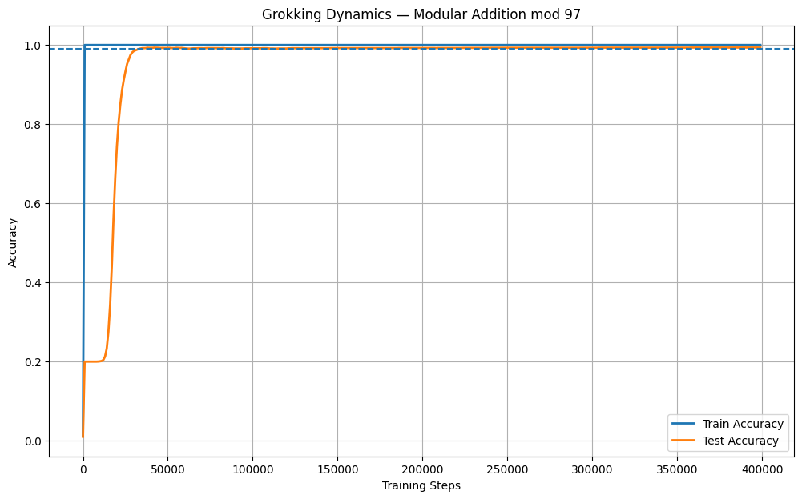
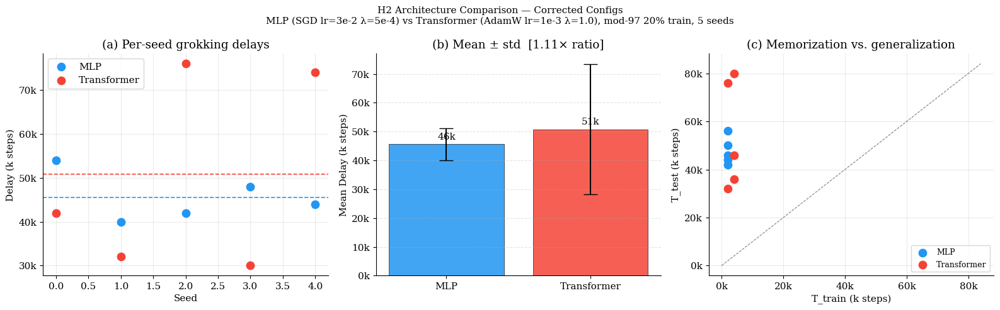
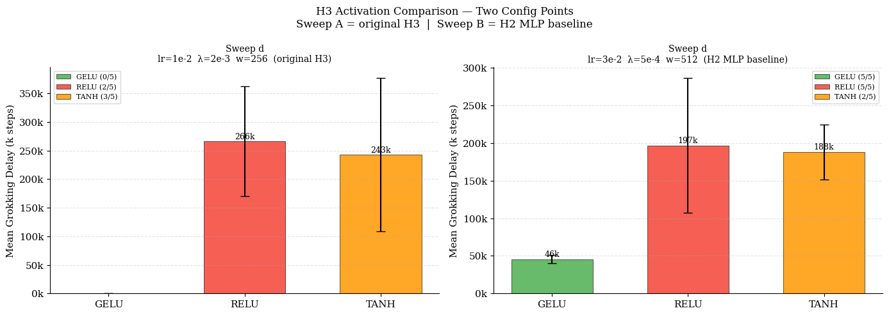
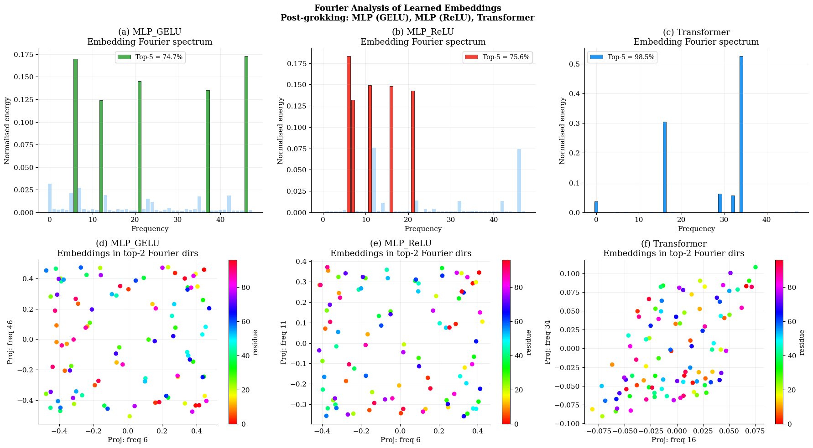
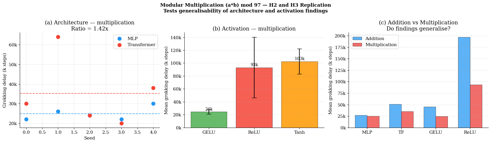

# Manir, Rupa 2026 — A Systematic Empirical Study of Grokking: Depth, Architecture, Activation, and Regularization

See also: [the global concept index](../../concepts/index.md). arXiv [2603.25009v1](https://arxiv.org/abs/2603.25009), 26 March 2026. The PDF has no running head.

**Shalima Binta Manir** — University of Maryland, Baltimore County; smanir1@umbc.edu. **Anamika Paul Rupa** — Howard University; anamikal.rupa@howard.edu. Both authors are marked with an asterisk and the note "Equal contribution".

The files of this paper's analysis:

- [`2603.25009.a-systematic-empirical-study-of-grokking-depth-architecture-activation-and-regularization.license.txt`](2603.25009.a-systematic-empirical-study-of-grokking-depth-architecture-activation-and-regularization.license.txt) — the arXiv licence record for this paper.

The anchor scheme and the rules for linking into a card are in the [README of the papers folder](../README.md).

**Excerpt card.** The paper's licence (`arxiv-nonexclusive`) does not permit republishing the paper itself; what stands here are the editorial sections and the fragments the corpus quotes (right of quotation). The paper: <https://arxiv.org/abs/2603.25009>.

## Concepts covered

**[Grokking](../../concepts/grokking.md)** — the work neither introduces nor explains the phenomenon but sets out a systematics for it: it takes grokking as given and sweeps which of four axes — depth, architecture family, activation function, strength of regularisation — governs it. The answer is carried into the abstract ([p. 1, para. 3](#p1-3)): what sets the dynamics is "not so much the architecture of the network as the interaction between the stability of the optimisation and the regularisation", and the conclusion adds that weight decay determines "both whether grokking occurs and when it occurs", whereas the architecture and the activation change only the training trajectory ([p. 16, para. 8](#p16-8)). The proving ground is reproduced and shown in a separate experiment ([p. 5, para. 4](#p5-4), [fig. 1](#fig-1)): a training accuracy of 100 % at step 1000 and a test accuracy crossing 99 % at step 33 000. What the work does not contain: a mechanism — no intervention beyond a change of hyperparameters is made, and every conclusion is taken off the curves of accuracy, RMS weight norm and embedding spectrum; nor is there a theory of its own — the authors' explanations ("an optimisation pathology", "self-attention as an implicit sparsity mechanism") are marked as conjectures. A caveat of substance for citing works: the plateau before the transition does not stand at the level of chance — at 97 outcomes that is about 1 %, whereas in [fig. 1](#fig-1) and on every panel of [fig. 6](#fig-6) the plateau holds at about 20 %, and the authors themselves call it "$\approx 19.9$ %" while continuing to say "near chance".

**[Weight decay](../../concepts/weight-decay.md)** — the work's chief subject and its most detailed measurement. Seven values of $\lambda$ are swept for the MLP (from $10^{-5}$ to $5\times 10^{-3}$) and six for the transformer (from 0.01 to 5.0), at 3 exploratory seeds per value. For the MLP the dependence is sharply non-monotone ([p. 9, para. 6](#p9-6)): at $\lambda\leq 10^{-5}$ the training set is memorised but there is no grokking; the best is at $\lambda=10^{-3}$ (25 333 ± 5 033); and at $2\times 10^{-3}$ the network can no longer memorise the training set. For the transformer there is no grokking at $\lambda=0.01$, and the optimum is at $\lambda=5.0$ ([p. 9, para. 7](#p9-7)). The work gives the corpus a directly measured 5000-fold divergence of the optima between SGD and AdamW. What the work does not contain: a joint sweep of $\lambda$ with the learning rate and the width — all three change together in the passage from Sweep A to Sweep B ([p. 8, para. 2](#p8-2)); nor is there an analysis of a mechanism — the "primacy" of weight decay is established by sweeping one quantity with the others fixed.

**[The Goldilocks zone](../../concepts/goldilocks-zone.md)** — the authors use this name outright and carry it over from hyperparameter space to a single axis: "the MLP's Goldilocks zone ($\lambda\in[5\times 10^{-4},\mkern3mu10^{-3}]$) is narrow: a step of a factor of two past the optimum collapses the training entirely" ([p. 10, para. 2](#p10-2)). The narrowness is shown by a cut-off on both sides: to the left, $\lambda\leq 10^{-5}$ gives memorisation without grokking; to the right, $\lambda\geq 2\times 10^{-3}$ takes away the memorisation itself ([fig. 5](#fig-5), panel a). What the work does not contain: a phase map — the sweep is one-dimensional, at 3 seeds per point, and the zone's boundaries are determined only to within the grid step (a factor of 2 or 5), while the second axis (width) is taken at just two values.

**[When regularisation is necessary](../../concepts/regularization-necessity.md)** — the work gives a two-sided answer on a single task: without a sufficient regularisation there is no grokking ($\lambda=0.01$ in the transformer — not one seed over 400 000 steps, [p. 9, para. 7](#p9-7); $\lambda\leq 10^{-5}$ in the MLP — memorisation without grokking), and under an excessive one there is no memorisation either, without which grokking is impossible by the definition of the measure. Of the transformer it is said outright that a large weight decay "is required in order to induce grokking reliably with AdamW" ([p. 4, para. 4](#p4-4)). What the work does not contain: a check of the settings in which grokking is reproduced without regularisation at all — the corresponding line of the corpus is not cited, and the necessity of weight decay here is not derived but inherited from Liu et al. (2022) as a setting.

**[The optimiser](../../concepts/optimizer-adam-adamw-sgd.md)** — the optimisers are deliberately separated by architecture: SGD with momentum for the MLP, AdamW for the transformer ([p. 3, para. 8](#p3-8), [p. 7, para. 3](#p7-3)). Whence the work's cleanest quantitative observation: the weight-decay optimum of the transformer under AdamW is 5000 times larger than that of the MLP under SGD ([p. 9, para. 7](#p9-7)), that is, one and the same value of $\lambda$ means different things under different optimisers; the explanation is a scaling of the effective learning rate on parameters of large norm ([p. 10, para. 2](#p10-2)). The reverse side of that same choice is that the "architecture" axis here is inseparable from the "optimiser" axis, and the authors admit it in the limitations: "a full separation of architecture from optimisation remains an open problem" ([p. 16, para. 4](#p16-4)). What the work does not contain: runs of one architecture under both optimisers — such a comparison is never made.

**[Weight norm minimisation](../../concepts/weight-norm-minimization.md)** — the best part of the work. Across five settings of width 512 the RMS norm of all the parameters at the point of grokking holds within a narrow band of $0.0219\pm 0.0032$ (CV 14.5 %), whereas in the reference model of depth 2 and width 256 it is three times higher — 0.0695 ([p. 10, para. 5](#p10-5), [fig. 6](#fig-6)). On this a separation of two things is built: ReLU and GELU grok at almost the same norm (0.0219 against 0.0225), but ReLU takes 6.9 times longer to get there, whence it follows that "the activation function governs the *rate* at which weight decay brings the norm to this threshold rather than the threshold itself" ([p. 11, para. 1](#p11-1)). The threshold is ascribed to the width of the model rather than to the architecture, the activation or the optimiser ([p. 11, para. 2](#p11-2)). What the work does not contain: the threshold here is measured rather than derived; there is one seed per setting ([p. 10, para. 4](#p10-4)), only two widths, and on a change of width the "universality" of the threshold is precisely what fails — that is, it is checked within a single width. Nor is there an intervention: the norm is not held by force, and the delay as a function of a prescribed norm is not measured.

**[The memorisation phase / the plateau](../../concepts/memorization-phase.md)** — the work gives an incidental but stable observation: the memorisation time $T_{\text{train}}$ across all the tables stands at 2000 steps (less often 4000) at any depth, any architecture and any seed — only the generalisation time changes. A separation of failures is introduced besides: $\mathrm{DNF}_ {\text{tr}}$ — failed to memorise, $\mathrm{DNF}_ {\text{te}}$ — memorised but did not grok (table 5, [p. 9, para. 6](#p9-6)); at $\lambda=2\times 10^{-3}$ the depth-4 MLP of width 512 does not reach a 99 % training accuracy within 60 000 steps. Memorisation is declared a precondition of grokking, and by that the complete failure of GELU in Sweep A is explained ([p. 8, para. 4](#p8-4)). What the work does not contain: a measurement of this explanation — in table 4 the failures are not separated into "did not memorise" and "did not grok", so the cause declared for GELU's failure is not shown by a single number.

**[The learning rate](../../concepts/learning-rate.md)** — a quantity that changes throughout the work but is never swept on its own. Sweep A and Sweep B differ in the learning rate ($10^{-2}$ against $3\times 10^{-2}$) simultaneously with the weight decay and the width ([p. 8, para. 2](#p8-2)), and the reversal of the activations' order between the sweeps is ascribed entirely to the weight decay. In the analysis of experiment 6 the learning rate appears as a factor: how fast the norm slides down to the threshold is called "a function of the product of $\lambda$ and lr and, essentially, of the activation function" ([p. 11, para. 2](#p11-2)). What the work does not contain: not one point at which the learning rate alone is varied.

**[The data fraction / the critical dataset size](../../concepts/data-fraction-critical-dataset-size.md)** — the fraction is fixed at 20 % (1882 training pairs against 7527 held out) in every experiment without exception, and this is named a condition of the phenomenon itself: "this small training-data fraction is critical for inducing the memorisation phase necessary for grokking; at larger fractions the models generalise with no characteristic delay" ([p. 3, para. 7](#p3-7)). The work only mentions this axis: there is no sweep of fractions, no threshold value is measured, and the claim about larger fractions is given with no experiment. Incidentally: the split is one and the same in every experiment, so all the spread reported is a spread over initialisations rather than over splits.

**[The role of gradient noise](../../concepts/gradient-noise.md)** — all the models are trained full-batch: "the batch size equals the whole training set" ([p. 3, para. 8](#p3-8)). The work's entire systematics is thereby obtained in a setting without batch noise, and grokking here arises and is governed without it. The work does not touch this axis: there is no comparison with batch training, and the phrase "gradient noise" appears only in the list of further directions.

**[Modular arithmetic](../../concepts/modular-arithmetic.md)** — the task is single and of the simplest kind: $(a+b)\bmod 97$, 9409 pairs, 97 outcomes ([p. 3, para. 6](#p3-6)). What is valuable for the corpus is a second task: experiment 8 carries the comparison of architectures and activations over to $(a\times b)\bmod 97$ with the zero factors excluded (9216 pairs, [p. 13, para. 2](#p13-2)) and finds that both architectures grok faster on multiplication than on addition, with the architectural gap narrowing from $1.90\times$ to $1.42\times$ ([p. 13, para. 4](#p13-4)); the GELU-to-ReLU ratio on multiplication is $3.82\times$ against $4.32\times$ on addition ([p. 14, para. 1](#p14-1)). What the work does not contain: other operations — neither non-commutative ones nor subtraction and division; the modulus is single, the split is single, and the carry-over is made only for H2 and H3, not for depth and not for the weight-decay sweep.

**[The canonical grokking proving ground](../../concepts/canonical-grokking-testbed.md)** — the setting is taken from Power et al. 2022 but departs from it along three axes at once, and this matters when comparing numbers: the training is full-batch, the MLP's optimiser is non-adaptive (SGD with momentum), and the times are one or two orders shorter — tens of thousands of steps instead of hundreds of thousands ([p. 3, para. 8](#p3-8)). The work sets its own measure of the delay: $T_{\text{train}}$ is the first step at a training accuracy of at least 99 %, $T_{\text{grok}}$ the first at a test accuracy of at least 99 %, and $\Delta T$ their difference ([p. 3, para. 9](#p3-9)); the measurement grid is 2000 steps, and runs that fall short are marked DNF and excluded from the means with the number of successful seeds stated explicitly ([p. 4, para. 1](#p4-1)). What the work does not contain: a sweep of the input encoding and of the split — they are fixed — and a union of the MLP branch with the transformer branch under one optimiser.

**[Fourier features and circuits](../../concepts/fourier-features-circuits.md)** — the work extends the observation of Nanda et al. 2023 in breadth and finds a difference in the process: after the grokking all three models give a sparse embedding spectrum, but the transformer holds 98.5 % of the energy in five frequencies against 74.7 % for MLP-GELU and 75.6 % for MLP-ReLU ([p. 12, para. 1](#p12-1)). The two MLPs share two frequencies (6 and 21), while the transformer's set is different and includes the constant component, which the MLPs do not have ([p. 12, para. 2](#p12-2)). What the work does not contain: a confirmation of a ring structure — the caption of [fig. 7](#fig-7) asserts that a "circular/elliptical structure on all three panels" confirms a sinusoidal encoding, whereas panels (d–f) show a scattered cloud of points and the colouring by residue is not ordered by angle. Nor is there an analysis of circuits: the spectrum is taken from the embedding matrix, no mechanism is recovered, and there is one seed per model ([p. 11, para. 4](#p11-4)). The reading "self-attention is a hidden mechanism encouraging sparsity in the frequency domain" the authors present as a conjecture ([p. 12, para. 4](#p12-4)).

**[Structured representation learning](../../concepts/structured-representation-learning.md)** — the work gives an observation about the separation of "what is learnt" from "in what time": GELU and ReLU arrive at representations of equal sparsity (74.7 % against 75.6 %) at a threefold difference in time, whence the conclusion that "activation functions do not change *which* solution is learnt but only *how fast* the network gets to it" ([p. 12, para. 4](#p12-4)). Together with the identical weight norm at the point of grokking for those same two activations ([p. 11, para. 1](#p11-1)), this is the work's only claim about the content of the solution rather than about times. What the work does not contain: a measure of the similarity of the solutions themselves — two scalar indicators are compared (the fraction of energy in five frequencies and the norm), the coincidence of frequencies between the two MLPs is partial (two of five), and there is one run per model.

**[The slingshot effect](../../concepts/slingshot.md)** — the work only mentions the mechanism, twice and in one role: the increased delay of one transformer seed (76 000 steps) and the transformer's fourfold larger spread are explained by a reference to Thilak et al. 2022 — "the transition to generalisation in attention-based models is more sensitive to oscillatory dynamics of the weight norm" ([p. 7, para. 4](#p7-4), [p. 7, para. 5](#p7-5)). What the work does not contain: a measurement of the slingshot — neither loss spikes, nor cycles of the last layer's weight norm, nor the adaptive step's $\epsilon$ is looked at here; in [fig. 6](#fig-6), panel (a), sawtooth oscillations are visible in the transformer at $\lambda=1.0$ but are not discussed. The reference remains a post-hoc explanation of the spread.

---

**[Overparameterisation and depth](../../concepts/overparameterization-depth.md)** — the work's chief result: depth acts non-monotonically, MLPs of depth 4 invariably fail to grok, and residual networks of depth 8 restore the generalisation ([`p1-3`](#p1-3)). The failure at intermediate depth is cured not by layers but by stabilisation — residual connections and normalisation ([`p2-2`](#p2-2)) — and the grid of depths itself was chosen together with the number of seeds ([`p4-9`](#p4-9)).

**[Grokking time](../../concepts/grokking-time.md)** — the definition is given operationally and separately for two events: $T_{\text{train}}$ is the first step at a training accuracy of at least $99$%, $T_{\text{grok}}$ the first step at the same test accuracy ([`p3-9`](#p3-9)). The delay comes out as their difference rather than as a separate quantity.

**[Seed variance and reproducibility](../../concepts/seed-variance-reproducibility.md)** — the spread is given raw, together with the outcomes of individual runs: 4 of 5 grokked, one seed gave a very late transition at step 212 000, and one did not grok at all ([`p6-2`](#p6-2)). Such a presentation is more honest than a mean with a spread, because it shows the tail as well.
## Points we could not reconcile

**The number for the transformer at the optimal $\lambda$ differs by a factor of two.** The exploratory sweep gives at $\lambda=5.0$ a mean $\Delta T=24{,}000\pm 10{,}583$ over 3 seeds ([p. 9, para. 7](#p9-7)), whereas the "final" comparison of part C at the same $\lambda=5.0$ gives $50{,}800\pm 38{,}745$ over 5 seeds ([p. 10, para. 1](#p10-1)), that is, twice as bad — and worse than the 44 000 at $\lambda=1.0$ from the same table 6. Yet it is from the exploratory number that the inference is drawn that $\lambda=1.0$ is "suboptimal by a factor of $1.83\times$ in delay" ($44{,}000/24{,}000$), and that inference stands in the discussion ([p. 10, para. 2](#p10-2)) after part C has already given a different number for the same $\lambda=5.0$. The discrepancy is nowhere stipulated. Incidentally: the transformer's mean in part C (50 800) coincides with the H2 mean (50 800) to the last digit at declaredly different $\lambda$ (5.0 against 1.0) and a different spread (38 745 against 22 565).

**The final ratio of delays between the architectures changes three times over the course of the paper, and the abstract carries the one that has been retracted.** Three numbers run through the text: $2.18\times$ (an earlier run, not shown), $1.11\times$ ([p. 7, para. 4](#p7-4)) and $1.90\times$ (part C, declared final, [p. 10, para. 1](#p10-1)). The abstract has $1.11\times$ with the formulation "the apparent gap… largely vanishes" ([p. 1, para. 3](#p1-3)) — that is, the abstract carries the number that §5.5 expressly retracts. This is the very pattern observed in the citing works (see below).

**The abstract's "matched hyperparameters" against the body's "different optimisers by design".** The abstract calls the comparison of architectures conducted "under matched hyperparameters" ([p. 1, para. 3](#p1-3)), whereas §5.3 says outright that the architectures use different optimisers, different learning rates and a different $\lambda$ — "by design" ([p. 7, para. 3](#p7-3)). What is matched here is the task, the data fraction and the step budget, not the hyperparameters.

**"$\lambda\geq 2\times 10^{-3}$ prevents memorisation entirely" is not true everywhere but is given with no caveat.** So it is said in the caption of [fig. 5](#fig-5) and in §5.5 ([p. 9, para. 6](#p9-6)). Meanwhile the reference experiment 1 is trained at precisely $\lambda=2\times 10^{-3}$ (depth 2, width 256) and groks ([p. 5, para. 3](#p5-3)), and Sweep A at the same $\lambda$ and the same width gives memorisation and grokking for ReLU and Tanh ([p. 8, para. 3](#p8-3)). The claim applies only to the depth-4 MLP of width 512.

**Experiment 1 and table 2 differ in the times for one and the same run.** Experiment 1 reports $T_{\text{train}}=1{,}000$ and $T_{\text{grok}}=33{,}000$ for seed 0 at depth 2 ([p. 5, para. 4](#p5-4)), whereas table 2 for the same depth and the same seed gives 2000 and 34 000 ([p. 6, para. 2](#p6-2)). The difference (32 000) is the same in both places, so the resulting delay does not change; what differ are the steps themselves.

**The counting of seeds for depth 8 is described in three different ways.** §4.3 says "3 seeds for depth 8" ([p. 4, para. 9](#p4-9)), §5.2 "5 seeds for all depths; the depth-8 results use 3 previously run seeds plus 2 additional ones" ([p. 6, para. 1](#p6-1)), and the caption of table 2 and the results text "a mean over 3 seeds out of 5" ([p. 6, para. 2](#p6-2)). The three formulations are compatible only on the reading "5 were run, 3 grokked", but §4.3 as it stands says something else. Incidentally, in the same place: the caption of [fig. 2](#fig-2) promises orange bars for seeds 3 and 4, and there are no bars for them in the figure at all; the figure itself is called the summary of H1 but shows only depth 8.

**Panel (c) of figure 6 labels a different mean from the one the text speaks of.** The panel's legend gives "Mean = 0.030" — a mean over all six settings, including the width-256 outlier — whereas the text and table 7 give $0.0219\pm 0.0032$ over the five width-512 settings ([p. 10, para. 5](#p10-5), [fig. 6](#fig-6)). The panel's heading "Universal threshold?" meanwhile stands next to the outlier bar.

**The GELU-to-ReLU ratio is given by two numbers at different $\lambda$, and this is nowhere stipulated.** Experiment 6 gives $6.9\times$ (180 000 against 26 000 steps) for ReLU under Sweep B, $\lambda=5\times 10^{-4}$ ([p. 11, para. 1](#p11-1)); experiment 7 gives $3.1\times$ (80 000 against 26 000) for ReLU at the optimal $\lambda=10^{-3}$ ([p. 11, para. 4](#p11-4), table 8). Both numbers are carried into the summary of findings side by side, as items 5 and 6, with no indication that they are taken at different weight-decay values and are therefore not comparable with each other. The "optimal $\lambda$" itself was moreover determined by a sweep for the MLP with GELU and carried over to ReLU.

**Minor.** Table 1 declares a budget of "400,000–800,000" steps ([p. 3, para. 8](#p3-8)), whereas there is not a single 800 000-step run in the paper: the experiments feature 400 000 and 600 000. The captions of both panels of [fig. 4](#fig-4) read "Sweep d" instead of A and B.

## What is measured, what is shown and what is conjectured

The work is arranged as a sweep of four axes, but those axes are not equally controlled, and it is useful for a citing author to distinguish three levels.

**Cleanly measured.** The 5000-fold divergence of the weight-decay optima between SGD and AdamW ([p. 9, para. 7](#p9-7)) — the work's most reliable number: both branches of the sweep are one-dimensional at 3 seeds per point, and both show a non-monotonicity with cut-offs at the edges. To the same heading belongs the separation of the norm threshold from the rate of sliding down to it: an identical norm at grokking for ReLU and GELU at a 6.9-fold difference in time ([p. 11, para. 1](#p11-1)). And an incidental but stable one: the memorisation time hardly depends on the conditions; only the generalisation time changes.

**Shown, but with confounded axes.** The "depth" axis is not controlled: depth 8 is simultaneously residual connections, LayerNorm, a width of 512 instead of 256 and gradient clipping, whereas depths 2 and 4 are a plain MLP of width 256 ([p. 6, para. 1](#p6-1)). From "depth 8 groks and depth 4 does not" no conclusion about depth follows, and the authors themselves restate the result as "depth conditional on the stability of the optimisation" ([p. 7, para. 1](#p7-1)) — but there is not one separating experiment (depth 4 with residual connections, or depth 8 without them). Sweep A and Sweep B are confounded in the same way: they differ in three quantities at once — the learning rate, the weight decay and the width — and the reversal of the activations' order is explained by one of them ([p. 8, para. 2](#p8-2), [p. 8, para. 4](#p8-4)). The explanation of GELU's failure in Sweep A ("the regularisation prevents memorisation altogether") is itself measured by nothing: there is no separation of failures into training and test as in table 5. And the conclusion of experiment 8, that "both architectures grok faster on multiplication", rests on a comparison at different weight decays: for GELU and ReLU the addition is taken from Sweep B ($\lambda=5\times 10^{-4}$) while the multiplication is computed at $\lambda=10^{-3}$, and panel (c) of [fig. 8](#fig-8) puts those bars side by side; for the MLP the difference (24 800 against 26 800) is smaller than its own spread ([p. 14, para. 2](#p14-2)).

**Declared a conjecture.** "An optimisation pathology in which the memorising solution is too entrenched to escape within the budget" ([p. 7, para. 1](#p7-1)); "self-attention acts as an implicit mechanism encouraging sparsity in the frequency domain" and "a more concentrated, brittle solution is more sensitive to the initialisation" ([p. 12, para. 4](#p12-4)) — all of these are the authors' guesses at one seed per model, and they cannot be cited as results.

**Does not follow from what is shown.** The ring structure of the embeddings declared in the caption of [fig. 7](#fig-7) is not visible in the figure itself. The "level of chance" is named as $\approx 19.9$ % at 97 outcomes ([p. 5, para. 4](#p5-4)). The "approximately 10–12 GPU-hours" declared do not add up with the appendix's own list ([p. 17, para. 3](#p17-3)): H3 alone (6 hours), H2 (65 minutes) and depth 8 (100 minutes) give about nine hours, leaving about two for the two $\lambda$ sweeps (39 runs of 400 thousand steps), experiments 6 and 7, and the whole of experiment 8 (25 runs).

**Separately — the citation of others' results.** NLM and $\perp\mathrm{SGD}$ are credited to Kumar et al. 2023 ([p. 2, para. 9](#p2-9)), whereas both the notion and the method belong to Prieto et al. 2025 ([2501.04697](../2501.04697.grokking-at-the-edge-of-numerical-stability/2501.04697.grokking-at-the-edge-of-numerical-stability.card.md)), and NLM there stands for naive loss minimisation rather than "negative learning momentum" as here. To the same Kumar et al. is credited the argument that "the memorising and generalising solutions coexist, and the generalising one lies in a region of smaller $\ell_{2}$ norm" — that is the argument of Omnigrok ([Liu et al. 2022](../2210.01117.omnigrok-grokking-beyond-algorithmic-data/2210.01117.omnigrok-grokking-beyond-algorithmic-data.card.md)). ReLU is cited to Glorot & Bengio 2010, a paper about initialisation ([p. 2, para. 2](#p2-2)), and the linear projection into 97 logits to Hendrycks & Gimpel 2016, a paper about GELU ([p. 4, para. 6](#p4-6)). The bibliography contains 13 works, the latest from 2024; there are no works of 2025–2026 at all, even though the paper claims to correct confusions accumulated in the literature.

## Common misreadings and overstatements of this paper

Below are the patterns observed in the citing works of the corpus. For each it is said what exactly is distorted, with references to the authors' paragraphs where the lost caveat stands. The "Erroneous citations" sections on the side of the citing cards have not yet been created, so the detailed analyses are not yet addressed and the citing works are named by identifier: they have no cards as yet.

**"The transformer–MLP gap vanishes under matched hyperparameters ($1.11\times$)" (erroneous with respect to the body of the paper).** This is the commonest retelling of the work, and it is word-for-word accurate as to the abstract. Truong et al. 2026 (2606.13753) write: `"the Transformer–MLP gap nearly vanishes ($1.11\times$ delay) under matched hyperparameters"`; Truong 2026 (2607.06639), `"the apparent Transformer–MLP grokking gap largely dissolves (a $1.11\times$ delay) under matched hyperparameters, and they attribute previously reported architecture differences to optimization and regularization confounds"`. What is lost is exactly what the paper says about that number two sections later: $1.11\times$ was obtained at $\lambda=1.0$ for the transformer, which §5.5 declares suboptimal, and what it calls "the final comparison of architectures" is $1.90\times$ at each one's optimal $\lambda$ ([p. 10, para. 1](#p10-1), [p. 10, para. 2](#p10-2)), with the conclusion formulated opposite to the retelling: "the architecture does after all exert a real, if moderate, influence on the speed of grokking". A second thing is lost too: the hyperparameters are called "matched" only in the abstract — §5.3 says outright that the architectures' optimisers, learning rates and $\lambda$ values are different "by design" ([p. 7, para. 3](#p7-3)). A legitimate retelling must carry both numbers with their conditions rather than one. Works concerned: Truong et al. 2026 (`2606.13753`), Truong 2026 (`2607.06639`) — neither has a card as yet.

**"It is shown that grokking is determined by regularisation and optimisation rather than by architecture" (accurate, but requiring a caveat).** This retelling conveys the chief finding as it is declared: Verma 2026 writes `"Manir & Rupa 2026 find empirically that grokking is primarily determined by regularization and optimization rather than architecture"`, and Song & Ye 2026 `"A recent empirical study [18] disentangles depth, architecture, activation, and regularisation effects on modular addition, finding that grokking dynamics are dominated by optimisation–regularisation interactions rather than architectural specifics"`. The caveat lost in the process: this is shown on one task, at one fixed split and 3–5 seeds, with the "architecture" axis inseparable from the "optimiser" axis — the authors admit it outright ([p. 16, para. 4](#p16-4)) — and the paper's own final number ($1.90\times$ at each one's optimal regularisation) says that the architecture's contribution does not vanish but merely proves moderate ([p. 10, para. 1](#p10-1)). Works concerned: Verma 2026 (`2605.20441`), Song & Ye 2026 (`2605.09724`) — neither has a card as yet.

An exemplary formulation for comparison is given by that same work of Truong et al. 2026 (`2606.13753`) when it cites the weight-norm experiment: it names the number of runs — `"in a single weight-norm experiment (one seed per configuration) they report that the RMS parameter norm at grokking is concentrated to $0.0219\pm 0.0032$ (CV $14.5\%$) across five width-512 models"` — and separately states the limit of the method: `"Both studies are *observational* on the norm–time relation: each records the norm at which the transition occurs and varies hyperparameters around it; neither holds the norm fixed, measures a delay as a function of a controlled norm, or reports a scaling law."` This is exactly the caveat that [p. 10, para. 4](#p10-4) requires.

---

# Quoted fragments

Only the fragments the corpus cards refer to are
reproduced here (right of quotation); the paper's licence does not permit
republishing the whole text. Anchor numbering matches the original.

###### p1-3

Our central finding is that grokking dynamics are not primarily determined by architecture, but by interactions between optimization stability and regularization. Specifically, we show: (1) **depth has a non-monotonic effect**, with depth-4 MLPs consistently failing to grok while depth-8 residual networks recover generalization, demonstrating that depth requires architectural stabilization; (2) **the apparent gap between Transformers and MLPs largely disappears** (1.11$\times$ delay) under matched hyperparameters, indicating that previously reported differences are largely due to optimizer and regularization confounds; (3) **activation function effects are regime-dependent**, with GELU up to 4.3$\times$ faster than ReLU only when regularization permits memorization; and (4) **weight decay is the dominant control parameter**, exhibiting a narrow “Goldilocks” regime in which grokking occurs, while too little or too much prevents generalization.

Across 3–5 seeds per configuration, these results provide a unified empirical account of grokking as an interaction-driven phenomenon. Our findings challenge architecture-centric interpretations and clarify how optimization and regularization jointly govern delayed generalization.

###### p2-2

1. **Depth requires stabilization.** Grokking exhibits a non-monotonic dependence on depth: depth-4 MLPs fail to generalize, while depth-8 residual networks recover grokking, demonstrating that increased depth necessitates architectural stabilization.
2. **Architecture differences are largely confounded.** Under matched hyperparameters, the gap between Transformers and MLPs is substantially reduced, and only becomes moderate when each is evaluated at its optimal regularization, indicating that previously reported differences are largely driven by optimizer and regularization choices.
3. **Activation effects are regime-dependent.** The advantage of GELU Hendrycks & Gimpel (2016) over ReLU Glorot & Bengio (2010) emerges only in regimes where regularization permits memorization, revealing a strong interaction between activation function and weight decay.
4. **Weight decay is the dominant control parameter.** Grokking occurs only within a narrow range of regularization strengths, with both insufficient and excessive weight decay preventing generalization.

###### p2-9

**Gradient-based dynamics.** Recent work further isolates the role of optimizer dynamics. Amplifying low-frequency gradient components can accelerate grokking by over $50\times$, indicating that generalization is driven by slow-varying gradient directions Lee et al. (2024). Complementary analyses identify a component of the gradient aligned with the parameter vector—termed *negative learning momentum* (NLM)—that opposes generalization Kumar et al. (2023). By projecting gradients onto the subspace orthogonal to the parameters ($\perp$SGD), this component can be removed, leading to dramatically faster generalization. These results highlight the central role of weight norm dynamics and their interaction with gradient updates.

**[p. 3]**

###### p3-6

which defines a classification problem with $97^{2}=9{,}409$ total input pairs and 97 output classes. Following Power et al. (2022), each integer is represented via a learned embedding. For Transformers, $(a,b)$ is provided as a length-2 input sequence; for MLPs, the embeddings are summed before being passed through the network.

###### p3-7

We use a fixed 20%/80% train/test split, sampling 1,882 pairs for training and holding out the remaining 7,527 for testing. The same split is used across all experiments to ensure comparability. This small training fraction is critical for inducing the memorization phase necessary for grokking; with larger fractions, models generalize without the characteristic delay.

###### p3-8

Unless otherwise stated, we use the following default hyperparameters. All models are trained using full-batch gradient descent (i.e., batch size equals the full training set). We use SGD with momentum for MLPs and AdamW Loshchilov & Hutter (2017) for Transformers; the relatively large weight decay for AdamW follows prior work demonstrating its necessity for inducing grokking in this setting Liu et al. (2022).

*Table 1: Default training hyperparameters.* **[p. 4]**

| **Hyperparameter** | **Value** |
|---|---|
| Optimizer | SGD (MLP); AdamW (Transformer) |
| Learning rate | $10^{-2}$ (SGD); $10^{-3}$ (AdamW) |
| Momentum | 0.9 (SGD only) |
| Weight decay (default) | $2\times 10^{-3}$ (SGD); $1.0$ (AdamW) |
| Gradient clip norm | 1.0 (depth $\geq$ 8) |
| Batch size | Full train set |
| Training steps | 400,000–800,000 |
| Loss function | Cross-entropy |
| Seeds per config | 3–5 |

###### p3-9

We define $T_{\text{train}}$ as the first step at which training accuracy $\geq 99\%$, and $T_{\text{grok}}$ as the first step at which validation (test) accuracy $\geq 99\%$. The grokking delay is:

$$
\Delta T=T_{\text{grok}}-T_{\text{train}}.
$$

**[p. 4]**

###### p4-1

If a configuration does not reach 99% test accuracy within the step budget, it is labeled *did not grok* (DNF). DNF seeds are excluded from mean delay computations but reported explicitly alongside the number of successful seeds. We report the mean and standard deviation of $\Delta T$ over non-DNF seeds.

###### p4-4

The model is trained with AdamW Loshchilov & Hutter (2017) (lr $=10^{-3}$, weight decay $=1.0$, gradient clipping norm $=1.0$). The relatively large weight decay ($\lambda=1.0$) follows Liu et al. (2022) and is required to reliably induce grokking with AdamW.

###### p4-6

followed by a linear projection to 97 logits Hendrycks & Gimpel (2016). The baseline uses width $w=256$ and depth $d=2$.

For the depth 8 variant (H1), we adopt a residual MLP architecture He et al. (2016) to ensure optimization stability. Each block is a pre-norm residual unit:

$$
h\leftarrow h+0.5\cdot\mathrm{FC}_{2}\!\bigl(\mathrm{GELU}(\mathrm{FC}_{1}(\mathrm{LN}(h)))\bigr),
$$

where LN denotes layer normalization and 0.5 is a residual scaling factor. The width is increased to $w=512$, and gradient clipping (max norm $=1.0$) is applied to prevent instability.

###### p4-9

We evaluate three depths: $d\in\{2,4,8\}$. Depths 2 and 4 use the standard (non-residual) MLP with width 256. Depth 8 uses the residual MLP with width 512 and LayerNorm, which is necessary for stable training at this depth. We use 5 seeds for depths 2 and 4, and 3 seeds for depth 8.

**[p. 5]**

###### p5-3

**Setup.** We train a 2-layer MLP (width 256, GELU activations) with SGD (lr $=10^{-2}$, momentum $=0.9$, weight decay $=2\times 10^{-3}$) on a 20% training fraction ($\approx$1,883 pairs) for 400,000 steps. We report results for seed 0.

###### p5-4

**Results.** Figure 1 shows the canonical grokking pattern. Training accuracy reaches 100% rapidly at step $T_{\text{train}}=1{,}000$, while test accuracy stagnates near chance ($\approx$19.9%) for thousands of subsequent steps. A sharp generalization transition then occurs, with test accuracy crossing 99% at step $T_{\text{grok}}=33{,}000$, yielding a **grokking delay of $\Delta T=32{,}000$ steps**. After grokking, test accuracy stabilizes at $\approx$99.35% and continues to improve slowly, reaching 99.35% by step 400,000. The total training time was 611 seconds on an NVIDIA GeForce RTX 3060 Laptop GPU.

###### fig-1

*Figure 1: Canonical *grokking* on modular addition mod 97 (direct experiment output). Train accuracy (blue) reaches 100% at step $T_{\text{train}}=1{,}000$, while test accuracy (orange) remains near chance until a sharp transition at step $T_{\text{grok}}=33{,}000$ (grokking delay $=32{,}000$ steps). Test accuracy stabilizes at $\approx$99.35% and continues to slowly improve through step 400,000. The dashed line marks the 99% threshold.* **[p. 5]**

###### p6-1

**Setup.** We train MLP variants with depths $\{2,4,8\}$. Depth 2 and depth 4 use the standard flat MLP (width 256). Depth 8 uses the residual MLP architecture (width 512, LayerNorm, grad clip $=1.0$) to ensure training stability at that scale. We run 5 seeds for all depths; depth 8 results use 3 previously completed seeds plus 2 additional seeds run here to complete the full 5-seed set.

###### p6-2

**Results.** Table 2 and Figure 2 summarize the results. The relationship between depth and grokking is **non-monotonic**. Depth 2 is our baseline with a mean grokking delay of 72,000 steps over grokking seeds (4 of 5 grokked; one seed exhibited a very late grokking at step 212,000 and one DNF). Depth 4 represents a **critical failure regime**: all 5 seeds failed to grok within the 400,000-step budget. Depth 8, aided by residual connections and layer normalization, recovered reliable grokking with a mean delay of $\mathbf{33{,}333\pm 12{,}858}$ steps across 3 of 5 seeds (seeds 3 and 4 did not grok within 400,000 steps).

*Table 2: Grokking results by depth. $\Delta T=$ grokking delay (steps). DNF $=$ did not grok within budget. Mean excludes DNF seeds.* **[p. 6]**

| **Depth** | **Seed** | $T_{\text{train}}$ | $T_{\text{grok}}$ | $\Delta T$ |
|---|---|---|---|---|
| 2 | 0 | 2,000 | 34,000 | 32,000 |
| 2 | 1 | 2,000 | 22,000 | 20,000 |
| 2 | 2 | 2,000 | 28,000 | 26,000 |
| 2 | 3 | 2,000 | — | DNF |
| 2 | 4 | 2,000 | 212,000 | 210,000 |
| *Depth 2 mean (4 seeds)* | $72{,}000\pm 85{,}536$ |  |  |  |
| 4 | 0–4 | — | — | DNF (all) |
| 8 | 0 | 2,000 | 50,000 | 48,000 |
| 8 | 1 | 2,000 | 26,000 | 24,000 |
| 8 | 2 | 2,000 | 30,000 | 28,000 |
| 8 | 3 | 2,000 | — | DNF |
| 8 | 4 | 2,000 | — | DNF |
| *Depth 8 mean (3 of 5 seeds)* | $33{,}333\pm 12{,}858$ |  |  |  |

###### fig-2

*Figure 2: H1: Depth-8 residual MLP grokking delay across 5 seeds. Seeds 3 and 4 (orange) did not grok within the 400,000-step budget (shown as 0); seeds 0–2 grokked with a mean $\Delta T=33{,}333\pm 12{,}858$ steps (dashed line).* **[p. 6]**

**[p. 7]**

###### p7-1

**Analysis.** The failure of depth 4 flat MLPs is notable. Without residual connections, depth 4 networks appear to fall into an optimization pathology where the memorizing solution is too entrenched to escape within budget. The depth 8 residual MLP demonstrates that architectural stabilization (skip connections, LayerNorm) is necessary—and sufficient—to recover grokking at greater depths, though the 3/5 success rate (vs. 0/5 at depth 4) indicates that even with residual connections, depth 8 exhibits meaningful stochasticity in whether grokking occurs within the step budget. This suggests that the relevant variable is not depth alone but *depth conditioned on optimization stability*.

###### p7-3

**Setup.** We compare a 1-layer Transformer (width 512, 4 heads, AdamW, $\lambda=1.0$) against a 4-layer MLP (width 512, GELU, SGD, $\lambda=5\times 10^{-4}$), both trained on 20% of the modular addition data for up to 600,000 steps on an NVIDIA T4 GPU, over 5 random seeds. These hyperparameters match the exact configurations used in the original notebook runs. The architectures use different optimizers by design: Transformers require AdamW with strong weight decay for reliable grokking, while MLPs grok reliably with SGD and lighter regularization.

###### p7-4

**Results.** Table 3 and Figure 3 show the results. When both architectures are evaluated at their exact canonical hyperparameter configurations, the grokking gap is far smaller than initial estimates suggested: the MLP achieves a mean delay of $\mathbf{45{,}600\pm 5{,}550}$ steps while the Transformer achieves $\mathbf{50{,}800\pm 22{,}565}$ steps—a ratio of **1.11$\times$** with $4.1\times$ higher variance. All 10 seeds grokked. This is a substantial revision of a prior estimate of 2.18$\times$, which arose from inconsistent hyperparameter configurations between the two architectures; in particular, the Transformer in the earlier run used a suboptimal weight decay and learning rate relative to its final canonical config. One Transformer seed (seed 2) exhibited an elevated delay of 76,000 steps, consistent with the “slingshot” dynamics reported by Thilak et al. (2022).

*Table 3: H2 Architecture comparison over 5 seeds (corrected configs). Transformer uses AdamW ($\lambda=1.0$, lr $=10^{-3}$); MLP uses SGD ($\lambda=5\times 10^{-4}$, lr $=3\times 10^{-2}$).* **[p. 7]**

| **Architecture** | **Seed** | $T_{\text{train}}$ | $T_{\text{grok}}$ | $\Delta T$ |
|---|---|---|---|---|
| Transformer | 0 | 4,000 | 46,000 | 42,000 |
| Transformer | 1 | 4,000 | 36,000 | 32,000 |
| Transformer | 2 | 4,000 | 80,000 | 76,000 |
| Transformer | 3 | 2,000 | 32,000 | 30,000 |
| Transformer | 4 | 2,000 | 76,000 | 74,000 |
| *Transformer mean* | $50{,}800\pm 22{,}565$ |  |  |  |
| MLP | 0 | 2,000 | 56,000 | 54,000 |
| MLP | 1 | 2,000 | 42,000 | 40,000 |
| MLP | 2 | 2,000 | 44,000 | 42,000 |
| MLP | 3 | 2,000 | 50,000 | 48,000 |
| MLP | 4 | 2,000 | 46,000 | 44,000 |
| *MLP mean* | $45{,}600\pm 5{,}550$ |  |  |  |

*Figure 3: H2: Transformer vs. MLP grokking comparison over 5 seeds (corrected hyperparameter configs). **(a)** Per-seed grokking delays $\Delta T=T_{\text{test}}-T_{\text{train}}$; dashed lines are per-architecture means. **(b)** Mean delay $\pm$ std: MLP achieves $45.6\text{k}\pm 5.6\text{k}$ vs. Transformer $50.8\text{k}\pm 22.6\text{k}$, a 1.11$\times$ difference with $4.1\times$ higher variance. **(c)** $T_{\text{train}}$ vs. $T_{\text{test}}$ scatter: both architectures memorize rapidly but diverge in generalization onset.* **[p. 8]**

###### p7-5

**Analysis.** The near-parity between architectures (1.11$\times$) at matched configurations is the key finding of H2. The earlier apparent gap of 2.18$\times$ was substantially an artifact of hyperparameter imbalance: in those initial runs the Transformer was paired with a suboptimal weight decay relative to the MLP, artificially inflating its grokking delay. When both architectures are evaluated at their respective canonical configurations, the Transformer grokks only marginally more slowly on average. The Transformer’s remaining $4.1\times$ higher variance—even at matched configs—is consistent with the “slingshot” mechanism of Thilak et al. (2022): the generalization transition in attention-based models is more sensitive to oscillatory weight-norm dynamics, **[p. 8]** producing a wider spread of grokking steps across random seeds. This result cautions against attributing architecture-level differences in grokking to inductive biases alone when optimizer and regularization choices differ.

###### p8-2

**Setup.** We train depth-4 MLPs with three activation functions (ReLU, GELU, Tanh) at *two* hyperparameter configurations: **Sweep A** (lr $=10^{-2}$, $\lambda=2\times 10^{-3}$, width 256; the originally planned H3 config) and **Sweep B** (lr $=3\times 10^{-2}$, $\lambda=5\times 10^{-4}$, width 512; the H2 MLP baseline config). We run 5 seeds per activation per sweep on an NVIDIA T4 GPU, 400,000 steps each.

###### p8-3

**Results.** Table 4 summarizes the results. The two sweeps yield strikingly different outcomes. In Sweep A, GELU *completely fails* to grok (0 of 5 seeds), while ReLU and Tanh grok in 2 and 3 of 5 seeds respectively with large mean delays ($\sim$266,000 and $\sim$243,000 steps). In Sweep B—evaluated at the H2 MLP baseline configuration with lighter regularization—the pattern reverses entirely: GELU grokks in all 5 seeds at 45,600 $\pm$ 5,550 steps, a **4.32$\times$** faster mean than ReLU (196,800 $\pm$ 89,728 steps, 5/5 seeds). Tanh grokks in only 2 of 5 seeds at Sweep B, with high variance.

*Table 4: Grokking results by activation function at two hyperparameter configurations. Sweep A: lr $=10^{-2}$, $\lambda=2\times 10^{-3}$, width 256. Sweep B: lr $=3\times 10^{-2}$, $\lambda=5\times 10^{-4}$, width 512. All depth-4 MLPs, SGD, 5 seeds, 400,000 steps. DNF = did not grok within budget. Mean excludes DNF seeds.* **[p. 8]**

| **Sweep** | **Activation** | **Grokked (of 5)** | **Mean $\Delta T$** | **Std $\Delta T$** |
|---|---|---|---|---|
| A | GELU | 0 | — (DNF all) | — |
| A | ReLU | 2 | 266,000 | 96,167 |
| A | Tanh | 3 | 242,667 | 134,288 |
| B | GELU | 5 | **45,600** | 5,550 |
| B | ReLU | 5 | 196,800 | 89,728 |
| B | Tanh | 2 | 188,000 | 36,770 |

###### p8-4

**Analysis.** The H3 results reveal a critical interaction between activation function and hyperparameter regime. At the Sweep A configuration ($\lambda=2\times 10^{-3}$, width 256), weight decay is too strong relative to the model capacity for GELU: the regularization prevents the network from memorizing the training set at all, which is a prerequisite for grokking. ReLU and Tanh, being less sensitive to this regime, eventually memorize **[p. 9]** and grok, though slowly. At the Sweep B configuration ($\lambda=5\times 10^{-4}$, width 512), regularization is lighter and the model is wider, allowing all three activations to memorize reliably; in this regime GELU’s smooth, non-zero gradient profile strongly accelerates the generalization transition—consistent with the Fourier feature learning account of Nanda et al. (2023), where smooth nonlinearities better support the representational reorganization underlying grokking. The strong GELU advantage (4.32$\times$) is therefore *conditional* on an appropriate hyperparameter regime; the activation function interacts non-trivially with weight decay.

###### fig-4

*Figure 4: H3: Activation function comparison at two hyperparameter configurations. **Left (Sweep A)**: original H3 config (lr $=10^{-2}$, $\lambda=2\times 10^{-3}$, width 256). GELU fails entirely (0/5 seeds); ReLU and Tanh grok in 2/5 and 3/5 seeds with large delays. **Right (Sweep B)**: H2 MLP baseline config (lr $=3\times 10^{-2}$, $\lambda=5\times 10^{-4}$, width 512). GELU dominates with 5/5 seeds at 45.6k steps—4.32$\times$ faster than ReLU. The reversal between sweeps demonstrates an activation–weight decay interaction: GELU’s advantage only emerges when regularization is light enough to permit memorization.* **[p. 9]**

###### p9-6

**MLP sweep.** The relationship between $\lambda$ and grokking is sharply non-monotonic. At $\lambda\leq 10^{-5}$, all seeds memorize but never grok within budget. At $\lambda=5\times 10^{-5}$, only 1 of 3 seeds grokked (delay 388,000 steps). Reliable fast grokking appears at $\lambda=10^{-4}$ (3/3 seeds, mean $\Delta T=220{,}000\pm 36{,}056$) and peaks at $\lambda=10^{-3}$ (3/3 seeds, mean $\Delta T=25{,}333\pm 5{,}033$). Strikingly, $\lambda=2\times 10^{-3}$ causes *complete failure to memorize*—all seeds fail to reach 99% training accuracy within 60,000 steps, a sharp cliff only one factor-of-two above the optimum.

###### p9-7

**Transformer sweep.** At $\lambda=0.01$ no seed grokks within 400,000 steps. The optimal is $\lambda=5.0$ (3/3 seeds, mean $\Delta T=24{,}000\pm 10{,}583$)— notably *higher* than $\lambda=1.0$ used in H2, which yields mean $\Delta T=44{,}000$. The Transformer thus requires 5,000$\times$ stronger weight decay than the MLP to reach its optimum, reflecting AdamW’s fundamentally different gradient scaling.

**[p. 10]**

###### p10-1

**Part C: fair comparison at optimal $\lambda$ each (5 seeds).** At their respective optimal regularization, the MLP achieves mean $\Delta T=26{,}800\pm 6{,}419$ steps and the Transformer achieves $50{,}800\pm 38{,}745$ steps—a ratio of **1.90$\times$**. This is our definitive architecture comparison, superseding H2’s 1.11$\times$ (which used a suboptimal $\lambda=1.0$ for the Transformer).

*Table 5: H4a: MLP weight decay sweep (depth-4 GELU, width 512, SGD, lr $=3\times 10^{-2}$, 3 seeds, 400,000 steps). DNF${}_{\text{tr}}$ = failed to memorize within 60,000 steps. DNF${}_{\text{te}}$ = memorized but did not grok within budget.* **[p. 10]**

| $\lambda$ | **Grokked/3** | **Mean $\Delta T$** | **Std** |
|---|---|---|---|
| $10^{-5}$ | 0/3 | DNF${}_{\text{te}}$: memorizes, no grok |  |
| $5\times 10^{-5}$ | 1/3 | 388,000 | — |
| $10^{-4}$ | 3/3 | 220,000 | 36,056 |
| $5\times 10^{-4}$ | 3/3 | 45,333 | 7,572 |
| $10^{-3}$ | 3/3 | **25,333** | **5,033** |
| $2\times 10^{-3}$ | 0/3 | DNF${}_{\text{tr}}$: cannot memorize |  |
| $5\times 10^{-3}$ | 0/3 | DNF${}_{\text{tr}}$: cannot memorize |  |

*Table 6: H4b: Transformer weight decay sweep (width 512, 4 heads, AdamW, lr $=10^{-3}$, 3 seeds, 400,000 steps). DNF${}_{\text{te}}$ = memorized but did not grok within budget.* **[p. 10]**

| $\lambda$ | **Grokked/3** | **Mean $\Delta T$** | **Std** |
|---|---|---|---|
| $0.01$ | 0/3 | DNF${}_{\text{te}}$: no grok in 400,000 steps |  |
| $0.1$ | 3/3 | 202,667 | 141,454 |
| $0.5$ | 3/3 | 35,333 | 17,010 |
| $1.0$ | 3/3 | 44,000 | 12,166 |
| $2.0$ | 3/3 | 65,333 | 42,771 |
| $5.0$ | 3/3 | **24,000** | **10,583** |

###### p10-2

**Analysis.** These results **confirm H4** while also providing a retroactive correction to H2. The MLP Goldilocks zone ($\lambda\in[5\times 10^{-4},\,10^{-3}]$) is narrow a factor-of-two step beyond the optimum collapses training entirely. The Transformer’s optimal at $\lambda=5.0$ is 5,000$\times$ larger, confirming that weight decay operates very differently under AdamW vs. SGD: AdamW’s adaptive learning rates require much stronger $\ell_{2}$ pressure to counteract the effective learning rate scaling on large-norm parameters Loshchilov & Hutter (2017). Critically, H2 used $\lambda=1.0$ for the Transformer, which is suboptimal by a factor of $1.83\times$ in delay explaining why the H2 gap of 1.11$\times$ was so small. The true architecture gap at optimal regularization is **1.90$\times$** (Part C), confirming that architecture does have a real, if moderate, effect on grokking speed beyond optimizer choice.

###### fig-5

*Figure 5: H4: Weight decay sweeps for MLP (SGD) and Transformer (AdamW), plus fair comparison at optimal $\lambda$ each (5 seeds). **(a)** MLP $\lambda$ sweep: optimal at $\lambda=10^{-3}$; $\lambda\geq 2\times 10^{-3}$ prevents memorization entirely. **(b)** Transformer $\lambda$ sweep: optimal at $\lambda=5.0$, requiring 5,000$\times$ stronger regularization than the MLP. **(c)** Fair comparison at optimal $\lambda$ each (5 seeds): MLP achieves $26.8\text{k}\pm 6.4\text{k}$ vs. Transformer $50.8\text{k}\pm 38.7\text{k}$, a **1.90$\times$** gap—the definitive architecture comparison superseding H2’s 1.11$\times$.* **[p. 11]**

###### p10-4

**Setup.** We train 6 configurations (1 seed each, CUDA graph accelerated) and log RMS parameter norm, train accuracy, and test accuracy every 2,000 steps: depth-2 GELU baseline; MLP GELU at H2 config ($\lambda=5\times 10^{-4}$) and at optimal ($\lambda=10^{-3}$); Transformer at H2 ($\lambda=1.0$) and optimal ($\lambda=5.0$); and MLP ReLU at Sweep-B ($\lambda=5\times 10^{-4}$).

###### p10-5

**Results.** Table 7 and Figure 6 show the results. All six configurations follow the same qualitative weight norm trajectory: a rapid decay from initialization ($\|W\|_{\text{RMS}}\approx 0.1$–$0.4$) toward a low plateau, with grokking occurring near the bottom of this decay. The weight norm at the grokking step is highly consistent across the five width-512 models: mean $0.0219\pm 0.0032$ (CV $=14.5\%$). The depth-2 baseline (width 256) grokks at a higher norm (0.0695), consistent with its smaller parameter count producing a higher per-parameter norm at equivalent representational capacity.

**[p. 11]**

###### p11-1

The most striking result concerns ReLU vs. GELU: both grokk at nearly identical weight norms ($0.0219$ vs. $0.0225$), yet ReLU requires $6.9\times$ more steps ($180{,}000$ vs. $26{,}000$). This cleanly dissociates two mechanisms: *(i)* the weight norm threshold at which generalisation occurs is activation-independent; *(ii)* the activation function controls the *rate* at which weight decay drives the norm to that threshold, not the threshold itself.

*Table 7: Weight norm at grokking step across six configurations. RMS norm is computed over all parameters. Depth-2 uses width 256; all others use width 512.* **[p. 11]**

| **Configuration** | **Delay (steps)** | $\\|W\\|$ **at init** | $\\|W\\|$ **at grokking** |
|---|---|---|---|
| Depth-2 GELU (baseline) | 32,000 | 0.372 | 0.0695 |
| MLP GELU (H2 config) | 54,000 | 0.209 | 0.0236 |
| MLP GELU (optimal $\lambda$) | 26,000 | 0.209 | 0.0225 |
| Transformer ($\lambda=1.0$) | 58,000 | 0.126 | 0.0254 |
| Transformer ($\lambda=5.0$) | 12,000 | 0.120 | 0.0160 |
| MLP ReLU (Sweep-B) | 180,000 | 0.209 | 0.0219 |
| *Mean $\pm$ std (width-512 only)* |  | $0.0219\pm 0.0032$ |  |

###### fig-6

*Figure 6: Weight norm dynamics and training curves across six configurations. **(a)** Test accuracy over training; vertical dotted lines mark grokking steps. **(b)** RMS weight norm over training; dots mark the weight norm at each grokking step. All width-512 models converge to $\|W\|\approx 0.022$ at grokking, regardless of architecture or activation. **(c)** Weight norm at grokking step: the depth-2 baseline (width 256) is an outlier; the five width-512 models cluster tightly (CV $=14.5\%$). **(d–f)** Individual train/test accuracy curves for the three MLP configurations, showing the characteristic memorization plateau followed by abrupt generalization.* **[p. 12]**

###### p11-2

**Analysis.** These results support a weight-norm-threshold account of grokking Kumar et al. (2023); Liu et al. (2022): for a given model capacity, there exists a characteristic weight norm below which the generalizing solution becomes accessible. The threshold appears to be set by model width (and hence parameter count) rather than by architecture, activation, or optimizer. What varies across conditions is how quickly weight decay can drive the norm to this threshold—a function of the $\lambda$–lr product and, crucially, of the activation function. GELU reaches the threshold 6.9$\times$ faster than ReLU despite an identical threshold value, consistent with GELU’s smoother gradient landscape facilitating faster effective weight decay. This finding provides a mechanistic bridge between H3 (activation affects grokking speed) and H4 (weight decay controls grokking): the two are linked through their joint effect on the weight norm trajectory.

###### p11-4

**Setup.** We train MLP (GELU), MLP (ReLU), and Transformer to full grokking (optimal $\lambda$ each, seed 0), then compute the discrete Fourier transform of the learned embedding matrix $W_{E}\in\mathbb{R}^{97\times d}$ along the residue dimension. We report the top-5 frequency concentration (fraction of total Fourier energy in the **[p. 12]** five highest-energy frequencies) and visualize each model’s embeddings projected onto their top-2 Fourier directions.

###### p12-1

**Results.** Table 8 and Figure 7 show the results. All three models converge to highly sparse Fourier representations, confirming Nanda et al. (2023)’s finding for a broader set of architectures and activations. However, the degree of sparsity differs substantially: the Transformer concentrates 98.5% of its embedding energy in just 5 frequencies, compared to 74.7% for MLP-GELU and 75.6% for MLP-ReLU.

###### p12-2

The MLP models share two dominant frequencies (6 and 21), suggesting a common algorithmic solution, while the Transformer uses an entirely different set of frequencies ([0, 16, 29, 32, 34] vs. [6, 12, 21, 37, 46]). The DC component (frequency 0) appearing in the Transformer’s solution has no analogue in the MLP solutions, consistent with the Transformer’s mean-pooling operation creating a bias toward position-invariant representations.

MLP-ReLU took $3.1\times$ longer to grok (80,000 vs. 26,000 steps) but arrived at an equally sparse representation (75.6% vs. 74.7%), consistent with the weight norm analysis: the same generalizing solution is reached by both activations, but GELU traverses the weight norm trajectory faster.

*Table 8: Fourier concentration of learned embeddings post-grokking. Top-5 concentration = fraction of total Fourier energy in the five highest-energy frequency components.* **[p. 13]**

| **Model** | **Top-5 frequencies** | **Top-5 conc.** | **Grokking delay** |
|---|---|---|---|
| MLP (GELU) | 6, 12, 21, 37, 46 | 74.7% | 26,000 |
| MLP (ReLU) | 6, 7, 11, 16, 21 | 75.6% | 80,000 |
| Transformer | 0, 16, 29, 32, 34 | **98.5%** | 12,000 |

###### fig-7

*Figure 7: Fourier analysis of learned embeddings post-grokking. **Top row (a–c):** Normalised Fourier energy spectrum of the embedding matrix $W_{E}$ for each model. Highlighted bars (colour) show the top-5 frequencies. The Transformer (c) concentrates 98.5% of energy in 5 frequencies; MLPs concentrate $\sim$75%. **Bottom row (d–f):** Each residue’s embedding projected onto the two highest-energy Fourier directions, coloured by residue value. The circular/elliptical structure in all three panels confirms that the learned representations encode modular arithmetic via sinusoidal patterns Nanda et al. (2023).* **[p. 13]**

###### p12-4

**Analysis.** Three conclusions follow from these results. First, sparse Fourier representations are a universal property of grokked models on modular addition, appearing in both MLPs and Transformers regardless of activation function. Second, the Transformer’s dramatically higher concentration (98.5% vs. $\sim$75%) suggests that self-attention acts as an implicit sparsity-promoting mechanism in the frequency domain, enforcing a cleaner algorithmic solution. This may also explain the Transformer’s higher seed-to-seed variance (H2): a more concentrated, brittle solution is more sensitive to initialisation. Third, the fact that GELU and ReLU converge to representations of equal sparsity—despite very different training timelines—confirms the weight **[p. 13]** norm analysis from Experiment 6: activation functions do not change *what* solution is learned, only *how quickly* the network gets there.

###### p13-2

**Setup.** We replace the addition task $(a+b)\bmod 97$ with multiplication $(a\times b)\bmod 97$, excluding pairs where $a=0$ or $b=0$ (which always map to class 0), leaving $96^{2}=9{,}216$ total pairs. We replicate H2 (MLP vs. Transformer, 5 seeds each, 600,000 steps, optimal $\lambda$ from H4) and H3 (GELU/ReLU/Tanh, 5 seeds each, 400,000 steps) on this task using otherwise identical hyperparameters.

**Results.** Tables 9 and 10, and Figure 8 summarise the results.

###### p13-4

**Architecture (H2-mul).** All 10 seeds grokked. MLP achieves mean $\Delta T=24{,}800\pm 3{,}347$ steps; Transformer achieves $35{,}200\pm 17{,}470$—a ratio of **1.42$\times$**. Both architectures grokk *faster* on multiplication than **[p. 14]** addition (MLP: $24{,}800$ vs. $26{,}800$; Transformer: $35{,}200$ vs. $50{,}800$), suggesting that at optimal regularisation multiplication is not harder than addition for these models. The architecture gap narrows from 1.90$\times$ to 1.42$\times$, but the *direction* is preserved: MLPs grokk faster in both tasks.

###### p14-1

**Activation (H3-mul).** GELU grokks in 5/5 seeds ($24{,}400\pm 3{,}578$ steps); ReLU in 5/5 ($93{,}200\pm 47{,}045$); Tanh in 3/5 ($102{,}667\pm 19{,}732$, seeds 1 and 3 DNF within 400,000 steps). The GELU/ReLU ratio is **3.82$\times$**—close to the addition ratio of 4.32$\times$ and well within the noise given the high ReLU variance on both tasks.

*Table 9: H2-mul: Architecture comparison on $(a\times b)\bmod 97$. Both architectures use optimal $\lambda$ from H4 (MLP: $\lambda=10^{-3}$; Transformer: $\lambda=5.0$).* **[p. 14]**

| **Arch.** | **Seed** | $T_{\text{train}}$ | $T_{\text{grok}}$ | $\Delta T$ |
|---|---|---|---|---|
| MLP | 0 | 2,000 | 24,000 | 22,000 |
| MLP | 1 | 2,000 | 28,000 | 26,000 |
| MLP | 2 | 2,000 | 26,000 | 24,000 |
| MLP | 3 | 2,000 | 24,000 | 22,000 |
| MLP | 4 | 2,000 | 32,000 | 30,000 |
| *MLP mean* | $24{,}800\pm 3{,}347$ |  |  |  |
| Transformer | 0 | 2,000 | 32,000 | 30,000 |
| Transformer | 1 | 2,000 | 66,000 | 64,000 |
| Transformer | 2 | 2,000 | 26,000 | 24,000 |
| Transformer | 3 | 2,000 | 22,000 | 20,000 |
| Transformer | 4 | 2,000 | 40,000 | 38,000 |
| *Transformer mean* | $35{,}200\pm 17{,}470$ |  |  |  |

*Table 10: H3-mul: Activation comparison on $(a\times b)\bmod 97$ (depth-4 MLP, width 512, SGD, $\lambda=10^{-3}$, 5 seeds).* **[p. 14]**

| **Activation** | **Grokked/5** | **Mean $\Delta T$** | **Std** |
|---|---|---|---|
| GELU | 5/5 | **24,400** | 3,578 |
| ReLU | 5/5 | 93,200 | 47,045 |
| Tanh | 3/5 | 102,667 | 19,732 |

###### fig-8

*Figure 8: Modular multiplication $(a\times b)\bmod 97$ results. **(a)** Per-seed grokking delays for MLP vs. Transformer; ratio = 1.42$\times$ (vs. 1.90$\times$ on addition). **(b)** Activation comparison: GELU dominates at 3.82$\times$ faster than ReLU; Tanh grokks in 3/5 seeds. **(c)** Direct comparison of addition vs. multiplication for each condition. Both architectures and GELU grokk *faster* on multiplication; the ReLU gap is preserved.* **[p. 15]**

###### p14-2

**Analysis.** The key finding is that both the architecture effect and the GELU advantage *generalise* to modular multiplication, confirming they are properties of the models and training dynamics rather than artefacts of the specific addition structure. The narrowing of the architecture gap from 1.90$\times$ to 1.42$\times$ suggests that the Transformer’s self-attention is relatively better suited to multiplication than addition—consistent with the observation that both architectures are actually *faster* on multiplication, but the Transformer benefits more (0.69$\times$ of its addition time vs. 0.91$\times$ for the MLP). The GELU/ReLU ratio of 3.82$\times$ is essentially unchanged from the 4.32$\times$ on addition (within the high ReLU variance), confirming that GELU’s weight-norm-decay advantage is task-independent.

###### p16-4

Architectural comparisons require different optimizers and regularization regimes (e.g., SGD for MLPs, AdamW for Transformers) to ensure stable training. Although we carefully match configurations, fully isolating architecture from optimization is an open challenge.

Finally, our results are based on finite training budgets and selected hyperparameter regimes. Further exploration of longer training horizons and wider hyperparameter spaces may refine the observed dynamics.

###### p16-8

Across all experiments, weight decay emerges as the dominant control parameter, governing both whether grokking occurs and when it occurs. Architectural and activation choices instead modulate the *trajectory* of training affecting stability and speed but not the underlying generalization mechanism. This is reflected in a consistent weight-norm threshold at which generalization emerges, suggesting a unifying perspective on delayed generalization.

**[p. 17]**

Overall, our findings reconcile previously conflicting observations in the literature by showing that many apparent differences between models arise from optimization and regularization confounds. We hope this work provides a clearer empirical foundation for understanding grokking as an interaction-driven phenomenon.

###### p17-3

All experiments were run on an NVIDIA T4 GPU (Google Colab) using CUDA graph acceleration (torch.cuda.CUDAGraph). Canonical MLP (depth 2, 400,000 steps) completed in $\approx$611 seconds on the original RTX 3060; depth 8 residual MLP runs (2 seeds, 400,000 steps each, parallel) completed in $\approx$100 minutes on T4. H2 architecture comparison (10 seeds, up to 600,000 steps) completed in $\approx$65 minutes. H3 activation sweep (6 conditions $\times$ 5 seeds) completed in $\approx$6 hours total. Total compute across all reported experiments was approximately 10–12 GPU-hours.
