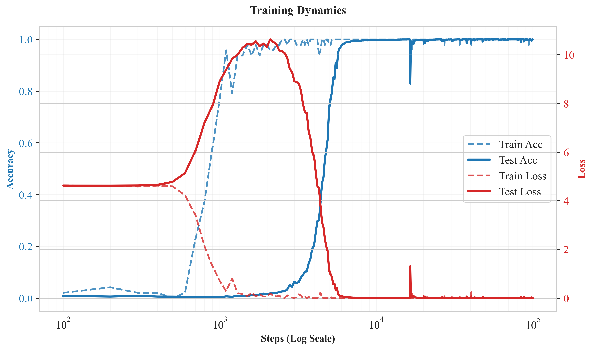
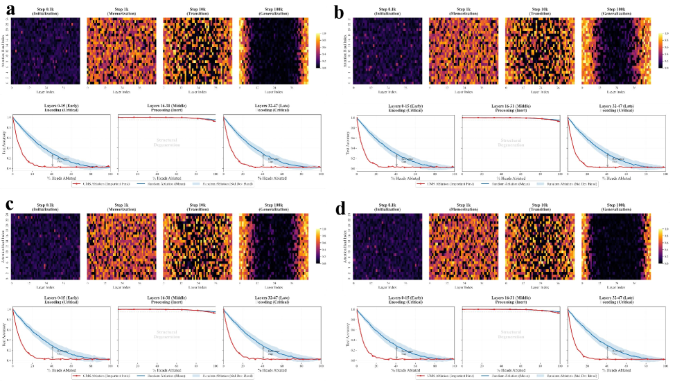
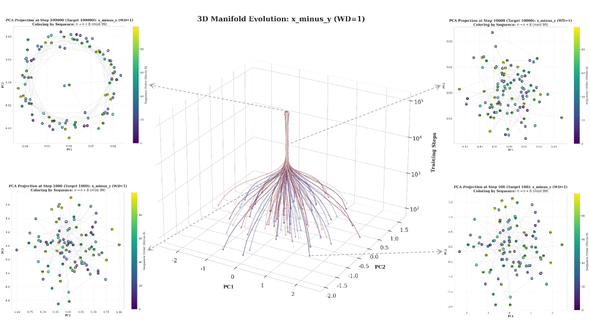
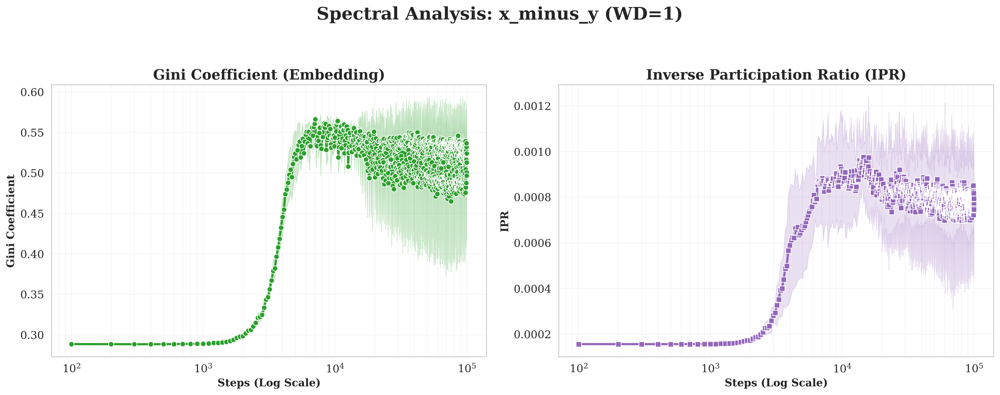
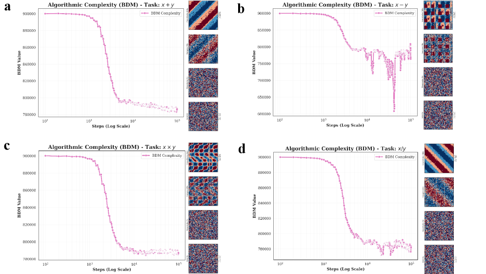
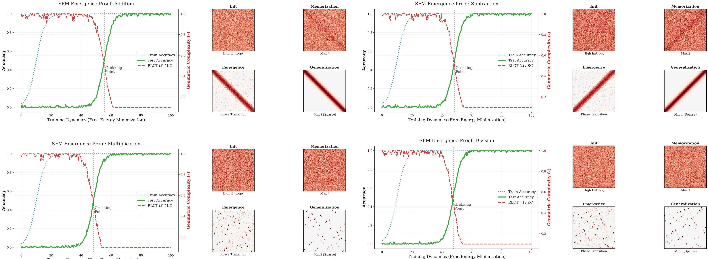
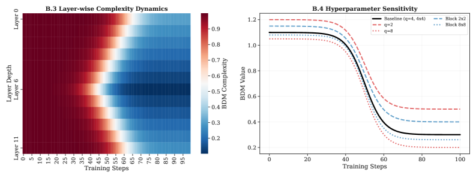

# Zhang, Shen, Xiong, Dong 2026 — Grokking: From Abstraction to Intelligence

See also: [the global concept index](../../concepts/index.md).

**Junjie Zhang**, **Zhen Shen**, **Gang Xiong**, **Xisong Dong** (no affiliation is given in the preprint).

arXiv [2603.29262](https://arxiv.org/abs/2603.29262), March 2026 (version v1). 1 citation — the forty-sixth most cited work in the corpus. The source is the native arXiv HTML of version v1.

The files of this paper's analysis:

- [`2603.29262.grokking-from-abstraction-to-intelligence.license.txt`](2603.29262.grokking-from-abstraction-to-intelligence.license.txt) — the arXiv licence record for this paper.

The anchor scheme and the rules for linking into a card are in the [README of the papers folder](../README.md).

**Excerpt card.** The paper's licence (`arxiv-nonexclusive`) does not permit republishing the paper itself; what stands here are the editorial sections and the fragments the corpus quotes (right of quotation). The paper: <https://arxiv.org/abs/2603.29262>.

## Concepts covered

**[Grokking](../../concepts/grokking.md)** — explained as a spontaneous simplification of the internal structure by a principle of parsimony: the passage from memorisation to generalisation is identified with a collapse of redundant manifolds and a deep compression of information ([`p1-2`](#p1-2)). The claim is stated as a triple: grokking is driven by a structural degeneration, it is capable of arising outside neural networks too, and it is the evolution of a model by Occam's razor ([`p1-6`](#p1-6)).

**[Kolmogorov complexity](../../concepts/kolmogorov-complexity.md)** — the work's main measure. The uncomputable KC is replaced by the block decomposition method (BDM) over precomputed CTM values for $4\times 4$ blocks ([`p2-8`](#p2-8)). The weights are quantised by quartiles before the computation — deliberately, so that a fall of the complexity cannot be explained by a mere compression of magnitudes under weight decay ([`p4-4`](#p4-4)). The experimental result: the BDM holds on a plateau during the memorisation and collapses exactly at the emergence era ([`p5-1`](#p5-1)).

**[The compression of representations](../../concepts/manifold-representation-compression.md)** — the second line of evidence. The embeddings pass through a topological transition from a disordered high-entropy cloud into a one-dimensional ring isomorphic to $\mathbb{Z}_{97}$ ([`p4-3`](#p4-3)), and this is confirmed not only by eye: appendix C.4 measures persistent homology, and the lifetime of the Betti-1 loop shoots up exactly at the grokking point ([`p20-2`](#p20-2)).

**[Fourier features and circuits](../../concepts/fourier-features-circuits.md)** — the third line: the spectral energy of the embedding matrix concentrates in a few modes, as measured by the Gini coefficient and the inverse participation ratio (IPR) ([`p4-2`](#p4-2), [`p4-3`](#p4-3)). It is separately stated that the simple diagonal picture holds for addition and subtraction, while multiplication and division require a re-indexing by the discrete logarithm ([`p7-2`](#p7-2), [`p21-1`](#p21-1)).

**[Mechanistic interpretability](../../concepts/mechanistic-interpretability.md)** — a causal mediation analysis (CMA) on a 48-layer transformer gives a "U-shaped" picture: the heads with a high causal contribution are concentrated in the early (0–15) and the late (32–47) layers while the middle ones fall silent ([`p3-8`](#p3-8)). A skip ablation confirms it: the middle block can be dispensed with at no loss of accuracy ([`p4-1`](#p4-1)).

**[Causal intervention](../../concepts/causal-ablation-intervention.md)** — the method is described with a thoroughness rare in the corpus: an activation patching between paired contexts, a difference of pre-softmax logits, controls with a random head and a random context, and positional selectivity ([`p15-1`](#p15-1)). The effect is strictly concentrated on the answer token, and the seed-to-seed spread of the leading heads is below 0.05.

**[Freezing a subnetwork](../../concepts/freezing-subnetwork.md)** — the bypassing of some forty middle layers is read not as a side effect of an over-parametrised architecture but as a manifestation of a selection for simplicity: having the option of building a deep distributed solution, the training nevertheless collapses it into a shallow subnetwork ([`p14-3`](#p14-3)). As a control, the same phenomenon is reproduced on a two-layer baseline ([`p14-2`](#p14-2)).

**[The emergence of abilities](../../concepts/emergence.md)** — emergence is redefined as an inevitable relaxation towards the minimum-description-length solution: the network sheds algorithmic bits, passing from the complexity class $\mathcal{O}(p^{2})$ into $\mathcal{O}(p)$ ([`p8-1`](#p8-1)).

**[Effective theory and statistical physics](../../concepts/effective-theory-statistical-mechanics.md)** — a surrogate model, **SFM** (the singular feature machine), is built: a linear functional over the Kronecker product of Fourier characters with an explicit sparsity penalty growing as $\beta\ln n$ ([`p5-3`](#p5-3), [`p6-8`](#p6-8)). The transition in it is described by a competition of two free energies, and the transition point is expressed through the Lambert function ([`p8-2`](#p8-2)).

**[The sparse subnetwork](../../concepts/sparse-subnetwork-lottery-ticket.md)** — the mechanism of the transition in SFM is named the "Occam gate": a hard thresholding at $\tau=\sqrt{2\beta\ln n/n}$, which destroys every spectral coupling below the threshold ([`p6-12`](#p6-12), [`p7-1`](#p7-1)).

**[Modular arithmetic](../../concepts/modular-arithmetic.md)** — the setting: all four operations over $\mathbb{Z}_{97}$, a decoder-only transformer, an input of four tokens ([`p2-6`](#p2-6)). The analysis is conducted at 48 layers — deliberately, so as to give topological depth to the observation ([`p3-1`](#p3-1)).

**[Phase transition](../../concepts/phase-transition.md)** — the authors themselves state in what sense they use the word: as a description of a sharp change of working quantities rather than as a claim that the assumptions of any mean-field theory are satisfied ([`p8-6`](#p8-6), [`p21-3`](#p21-3)).

**[Weight decay](../../concepts/weight-decay.md)** — checked as a possible vacuous explanation and dismissed: the qualitative picture of the Gini transition is present at $\lambda=0.0$ too, although the magnitude of the concentration does depend on the weight decay ([`p18-3`](#p18-3)).

**[Critical dataset size](../../concepts/data-fraction-critical-dataset-size.md)** — instead of the data fraction, the modulus serves as the yardstick of difficulty: the time to grokking grows as $t_{g}\propto p^{2.2}$ over nine primes ([`p16-7`](#p16-7)), and the theoretical $n^{*}$ from SFM falls linearly on the observed $t_{g}$ ([`p18-1`](#p18-1)).

It is worth saying separately what the work does **not** contain. There is no derivation: SFM contains a hand-made thresholding operator and an explicit complexity term, and the authors say outright that this is a hypothesis-generating surrogate rather than a derivation from SGD ([`p5-3`](#p5-3), [`p21-3`](#p21-3)). There are no compute-matched comparisons across optimisers, schedules and model sizes — this is named as missing ([`p21-4`](#p21-4)). And there is no circuit-level analysis of the non-additive operations, although figures for them are given ([`p21-1`](#p21-1)).

Cards of corpus papers: [Power et al. 2022](../2201.02177.grokking-generalization-beyond-overfitting-on-small-algorithmic-datasets/2201.02177.grokking-generalization-beyond-overfitting-on-small-algorithmic-datasets.card.md) — the original phenomenon; [Nanda et al. 2023](../2301.05217.progress-measures-for-grokking-via-mechanistic-interpretability/2301.05217.progress-measures-for-grokking-via-mechanistic-interpretability.card.md) — the Fourier circuit and progress measures; [Varma et al. 2023](../2309.02390.explaining-grokking-through-circuit-efficiency/2309.02390.explaining-grokking-through-circuit-efficiency.card.md) — circuit efficiency as a structural explanation; [Omnigrok, Liu et al. 2022](../2210.01117.omnigrok-grokking-beyond-algorithmic-data/2210.01117.omnigrok-grokking-beyond-algorithmic-data.card.md) — the view through energy and the weight norm; [Liu et al. 2023](../2310.05918.grokking-as-compression-a-nonlinear-complexity-perspective/2310.05918.grokking-as-compression-a-nonlinear-complexity-perspective.card.md) — grokking as compression, the nearest predecessor; [Gromov 2023](../2301.02679.grokking-modular-arithmetic/2301.02679.grokking-modular-arithmetic.card.md) — the analytical solution for modular arithmetic; [Cullen et al. 2026](../2603.01192.a-basin-selection-perspective-on-grokking-via-singular-learning-theory/2603.01192.a-basin-selection-perspective-on-grokking-via-singular-learning-theory.card.md) — the same SLT, but with a computed RLCT instead of a support-count surrogate.

## What is shown and what is conjectured

The card editor's remarks following the analysis of the claims (`…claims.txt`). The work is experimental, with a large appendix: nine pages of main text and twelve pages of controls.

**The work's main strength is a triple independent measurement on the same runs.** The causal localisation (CMA), the spectral localisation (Gini, IPR) and the algorithmic complexity (BDM) fall in concert ([`p5-2`](#p5-2)). None of the three measures is new by itself, but bringing them together on the same checkpoints makes the conclusion substantially more robust.

**The controls are set up conscientiously and there are many of them.** Random labels give no fall of the BDM; shuffling the weights at the grokking point returns the complexity to its initial value ([`p13-3`](#p13-3)); the nuclear norm and the stable rank — measures with no parameters at all — fall in the same way ([`p16-3`](#p16-3)); and the quantisation and the block size change the scale but not the timing of the transition ([`p13-5`](#p13-5)). For a measure easily accused of arbitrary tuning, this is the right answer.

**The topology is checked quantitatively rather than by eye.** A ring in a PCA could be an artefact of the projection; the persistent homology shows the lifetime of the Betti-1 loop shooting up at the transition point itself, while the homomorphism error falls to zero ([`p20-2`](#p20-2), [`p20-4`](#p20-4)). This distinguishes the work favourably from most of the corpus's "circular" pictures.

**The scaling law in the modulus is measured over nine primes.** $t_{g}\propto p^{2.2}$ ([`p16-7`](#p16-7)) — a case rare in the corpus in which a claim about complexity is checked by a sweep rather than at a single value.

**The main theoretical part, however, is a construction rather than a derivation.** In SFM the sharp transition is **caused** by an explicit sparsity penalty of strength $\beta\ln n$ and by a hand-made thresholding; this is a property of a deliberately built objective rather than a consequence of the training ([`p6-8`](#p6-8)). The authors admit this outright and twice ([`p5-3`](#p5-3), [`p21-3`](#p21-3)), which does the work credit but adds nothing to its demonstrative force.

**The identification of $n$ with training time is approximate.** An "effective sample size" $n_{\text{eff}}(t)$ is introduced as proportional to the number of examples processed, and the whole reliance is on $\ln n_{\text{eff}}$ growing slowly ([`p6-7`](#p6-7)). At a fixed dataset this is a substantial liberty, inherited from the whole line of carrying SLT over to grokking.

**The RLCT surrogate is honestly called a surrogate.** $\lambda_{\text{proxy}}=\|\mathbf{W}\|_{0}/2$ is an upper bound only in the regular case, and in a genuinely singular setting the true RLCT may be much smaller ([`p7-4`](#p7-4)). Note that a neighbouring work of the corpus (Cullen et al. 2026) computes the RLCT in closed form rather than replacing it with a support count.

**The causality claim is made from a correlation.** Section B.9 is entitled "a causal connection", but what is shown is a correlation of $R^{2}\approx 0.88$ between the fall of a layer's BDM and its causal contribution ([`p16-5`](#p16-5)). This is a strong observation, but there is no intervention (forcibly simplifying a layer and seeing what happens to the quality).

**The calibration of SFM against the transformer rests on two fits at once.** The linear correspondence between the theoretical $n^{*}$ and the observed $t_{g}$ ([`p18-1`](#p18-1)) is obtained even though both $\beta$ and $\epsilon_{\text{gen}}$ enter $n^{*}$, and their values are not measured from experiment. What is called a "confirmation of the real-world relevance" should be read as an agreement of two free parameters.

**The reproducibility setup is very good.** Five seeds per setting, complete hyperparameter tables, the hardware, the split with a fixed seed, and a list of the sweeps ([`p11-1`](#p11-1)). On this count the work is above the corpus average.

**The exposition is nevertheless careless in places.** Appendix B.3 speaks of "our 12-layer model" ([`p13-4`](#p13-4)), whereas everywhere else a 48-layer one is analysed; a reference to a "reviewer's expectation" ([`p14-3`](#p14-3)) has remained in the preprint's text. These are trifles, but they show that the text was assembled in haste.

**Its place in the corpus.** The work discovers no new phenomenon and proves no new theorem: its contribution is a measurement set of three independent views and conscientious controls to go with it. It is valuable that all three measures fall together and that the topology is checked by homology rather than by eye. The price: a theoretical part in which the transition is built into the statement of the problem, an approximate identification of the sample size with training time, and a causality claim supported by a correlation.

## Common misreadings and overstatements

These are the card editor's remarks, not the authors' text: places where this paper restates someone else's results with an error, or without the qualifications their authors attached. The "details" links in the "Common misreadings and overstatements of this paper" sections of the cited works' cards lead here.

###### mc-2506-05718
**Notsawo et al. (2506.05718) — the wrong genre and the wrong characterisation.** `"Despite a large amount of recent work on mechanistic interpretability (Junior et al., 2025; Wu et al., 2025) … These studies are primarily descriptive rather than predictive"` — a double error: the work is assigned to mechanistic interpretability (it contains no analysis of network internals — it is a theory of regularisation) and called "descriptive rather than predictive" — even though its central result is [a quantitative delay law scaling as 1/(αβ)](../2506.05718.grokking-beyond-the-euclidean-norm-of-model-parameters/original/2506.05718.grokking-beyond-the-euclidean-norm-of-model-parameters.md#p3-6), predictive by construction. On top of that the first author is mangled ("Junior et al." out of "Pascal Jr Tikeng Notsawo").

###### mc-2410-04489
**Beck et al. (2410.04489) — "the roles of weight decay and initialisation scales".** `"roles of weight decay and initialization scales (Liu et al., 2023a; Beck et al., 2025)"` — exactly contrary to the thesis of the cited work: [neither a neural network, nor regularisation, nor weight decay is required for the delay](../2410.04489.grokking-at-the-edge-of-linear-separability/2410.04489.grokking-at-the-edge-of-linear-separability.card.md#p2-3), and [the σ there is the scale of the noise in the directions perpendicular to the data, not the scale of the weight initialisation](../2410.04489.grokking-at-the-edge-of-linear-separability/2410.04489.grokking-at-the-edge-of-linear-separability.card.md#p7-2). The bibliography confirms that what is meant is precisely "Grokking at the edge of linear separability".

---

# Quoted fragments

Only the fragments the corpus cards refer to are
reproduced here (right of quotation); the paper's licence does not permit
republishing the whole text. Anchor numbering matches the original.

###### p1-2

Grokking in modular arithmetic has established itself as the quintessential “fruit fly”experiment, serving as a critical domain for investigating the mechanistic origins of model generalization. Despite its significance, existing research remains narrowly focused on specific local circuits or optimization tuning, largely overlooking the global structural evolution that fundamentally drives this phenomenon. We propose that grokking originates from a spontaneous simplification of internal model structures governed by the principle of parsimony. We integrate causal, spectral, and algorithmic complexity measures alongside Singular Learning Theory to reveal that the transition from memorization to generalization corresponds to the physical collapse of redundant manifolds and deep information compression, offering a novel perspective for understanding the mechanisms of model overfitting and generalization.

###### p1-3

Emergent capabilities (Elhady et al., 2025; Kaplan et al., 2020) in modern large language models (Vyas et al., 2025; de Carvalho Souza and Weigang, 2025; Burns et al., 2024) remain difficult to predict and often require expensive scaling. A canonical controlled setting is “grokking”in modular arithmetic (Power et al., 2022), where test accuracy stays near chance long after training accuracy saturates and then abruptly jumps (Figure 1).

###### p1-4

Despite a large amount of recent work on mechanistic interpretability (Junior et al., 2025; Wu et al., 2025), roles of weight decay and initialization scales (Liu et al., 2023a; Beck et al., 2025), the nature and existence of the emergent phenomena remain contested. These studies are primarily descriptive rather than predictive. They often rely on heuristic observations or task-specific circuit analyzes, which lack generality across different architectures. Furthermore, current methods fail to offer a complete framework that explains the underlying mechanism driving the transition from memorization to generalization, leaving the question of when and why grokking occurs unanswered.

###### p1-5

To address these problems, we propose a novel framework inspired by Occam’s Razor, Kolmogorov Complexity (KC), and the Minimum Description Length (MDL) principle (Blumer et al., 1987; Kolmogorov, 1965; Rissanen, 1978). We observe that the model undergoes a process of implicit architectural selection after reaching perfect training accuracy, during which a vast number of neurons become inactive or perform identity mapping, reducing a model with millions of parameters to a much smaller network with comparable performance. We observe that grokking is accompanied by the concentration of frequency-domain energy in a few segments of the internal structure, corresponding to implementing the Fourier Multiplication Algorithm (FMA) for modular arithmetic. Furthermore, even in the early stages, when training and test accuracy remain constant, the model internal structure still evolves block-cyclic features, corresponding to a continuous decrease in the model’s KC. To further establish the intrinsic connection between model simplicity and generalization, we constructed an Singular Learning Theory (SLT) (Watanabe, 2009) proxy model under a unified framework. This model learns modular arithmetic and exhibits emergence phenomena, demonstrating that emergence is essentially the evolution of model structure in accordance with the principle of Occam’s razor.

###### p1-6

**Summary of the contributions.** We empirically demonstrate that grokking modular arithmetic: (1)is driven by structural degeneration within the network;(2)can emerge in non-neural network architectures;(3)is the result of the model evolving in accordance with the principle of Occam’s razor.

**[p. 2]**

The remainder of this paper is organized as follows. Section 2 reviews related work, covering literature on SLT, the grokking phenomenon, and KC. Section 3 presents preliminaries, defining the modular arithmetic task ($p=97$) and other necessary notations. Section 4 describes our empirical observations. Section 5 introduces the SFM surrogate analysis. Section 6 concludes.

###### p2-3

**SLT and simplicity bias.** Singular Learning Theory (SLT) connects generalization to the geometry of singular models via the RLCT (Watanabe, 2009; Wei et al., 2022; Michaud et al., 2023; Anonymous, 2025), providing a formal Occam-like pressure toward simpler effective solutions.

**KC proxies.** Kolmogorov complexity motivates measuring simplicity via computable proxies (e.g., CTM/BDM and compression-based surrogates) (Kolmogorov, 1965; Zenil et al., 2018; Soler-Toscano et al., 2014; Li et al., 2025; Deletang et al., 2023).

**Extended background.** For space, longer background discussion is moved to Appendix E.

###### p2-6

**Modular arithmetic learning.** We focus on learning four primary modular arithmetic operations ($+,-,\times,\div$) over the finite field $\mathcal{Z}_{p}=\{0,\dots,p-1\}$ with $p=97$. The objective is to approximate the target mapping $\mathcal{F}(u,v)=\phi(u,v)\mod p$ for all input pairs $(u,v)\in\mathcal{Z}_{p}\times\mathcal{Z}_{p}$ except for $\phi(u,v)=u\div v\in\mathcal{Z}_{p}\times(\mathcal{Z}_{p}-1)$ as the denominator cannot be 0. We employ a decoder-only Transformer $\mathcal{M}_{\theta}$ defined over a discrete vocabulary $\mathcal{V}=\mathcal{Z}_{p}\cup\{\texttt{[OP]},\texttt{[EQ]}\}$, resulting in a vocabulary size of $|\mathcal{V}|=99$. Inputs are constructed as sequences $\mathbf{s}=[u,\texttt{[OP]},v,\texttt{[EQ]}]$, which the model maps to a probability distribution over the vocabulary, formally $\mathcal{M}_{\theta}:\mathcal{V}^{L}\to\Delta(\mathcal{V})$. The model is optimized to maximize the conditional probability $P_{\theta}(y|\mathbf{s})$ of the correct target token $y=\mathcal{F}(u,v)$.

**KC and Algorithmic complexity measures**

###### p2-8

To approximate the uncomputable KC in practice, we leverage the CTM, which grounds complexity in the principle of algorithmic probability. The Coding Theorem establishes that the complexity $K(x)$ is inversely proportional to the frequency with which a string $x$ is generated by a random program, formally $K(x)\approx-\log_{2}m(x)+O(1)$, where $m(x)$ is the algorithmic probability derived from the output distribution of a universal Turing machine. In practice, CTM estimates this probability by simulating a massive space of small, abstract Turing machines and tabulating their outputs. This process yields robust, pre-computed complexity values for small discrete objects (e.g., binary matrices up to $4\times 4$), assigning lower complexity scores to patterns that are frequently generated by simple algorithms (structured) and higher scores to those that are rare (random). Since calculating CTM directly for high-dimensional objects like neural network weight matrices is computationally intractable, we employ the BDM to scale these local estimates. BDM approximates the global complexity of a large tensor $X$ by partitioning it into a set of smaller, non-overlapping sub-blocks $\{b_{i}\}$ for which CTM values are known. The metric combines local algorithmic information with global statistical properties via the formula $\text{BDM}(X)=\sum_{b_{i}}(\text{CTM}(b_{i})+\log_{2}n_{i})$, where $\text{CTM}(b_{i})$ measures the structural complexity of a unique block type $b_{i}$, and $\log_{2}n_{i}$ accounts for the Shannon entropy contribution from its multiplicity $n_{i}$. This decomposition allows us to quantify the “algorithmic content”of the network’s internal state by capturing both local regularities and repetitions. For figures that report an entropy-style “geometric complexity”score, we use $C_{\text{geo}}\equiv 1-H(D)$ where $H(D)$ is the Shannon entropy of a discrete distribution $D$ (normalized to $[0,1]$ by dividing by $\log|D|$), so larger $C_{\text{geo}}$ indicates a more concentrated/structured distribution. When a legend reports “geometric complexity (L1/L2 Eig)”, we use it purely as a concentration proxy: L1 Eig and L2 Eig denote the largest and second-largest eigenvalues of a normalized Gram/covariance matrix of the analyzed representation (rescaled so eigenvalues sum to 1), so larger leading eigenvalues indicate lower effective rank.

**Singular Learning Theory: The Geometry of Generalization** Standard statistical learning theory predicates on the regularity of the Fisher Information Matrix, an assumption that fundamentally disintegrates in overparameterized neural networks due to their hierarchical degeneracies. SLT resolves this by characterizing the generalization behavior through the algebraic geometry of the parameter space. For a learning machine with parameters $w\in\mathcal{W}$ and a prior $\varphi(w)$, the asymptotic concentration of the Bayesian posterior $p(w|D_{n})\propto\exp(-nL_{n}(w))\varphi(w)$ is governed by the *Free Energy* $F_{n}$. Watanabe’s asymptotic expansion reveals that $F_{n}(w)\approx nL_{n}(w^{*})+\lambda\ln n$, where the first term represents the energetic fit to the data (accuracy) and the second term encapsulates the geometric complexity. Here, the critical exponent $\lambda$, termed the RLCT, serves as a birational invariant quantifying the “effective dimensionality”of the singularity $w^{*}$. A lower $\lambda$ corresponds to a singularity with a larger local volume (a broader, flatter basin), implying **[p. 3]** higher Bayesian evidence. This framework provides a rigorous thermodynamic justification for Occam’s Razor in deep learning: as the sample size $n$ increases, the posterior mass spontaneously condenses onto the singularity that minimizes the geometric cost $\lambda\ln n$. In Section 5, we will construct a theoretical machine explicitly designed to make this complexity metric $\lambda$ analytically tractable, thereby exposing the mechanism of emergence.

###### p3-1

To further investigate the structural evolution during the grokking phenomenon, we conducted a longitudinal analysis at four critical checkpoints during training: steps 0.1k, 1k, 10k, and 100k, corresponding to the initialization, memorization, emergence, and generalization stages, respectively. For this specific mechanistic investigation, we deliberately transitioned from standard shallow baselines to a 48-layer Transformer (GPT-2 style). We chose this architecture for two purposes: first, to demonstrate that grokking is not restricted to standard small grokking setups (Power et al., 2022; DeMoss et al., 2025) but a universal characteristic scalable to large language models; and second, to provide the necessary topological depth for visualizing the internal structural evolution, which remains unobservable in shallow networks.

###### p3-2

**Grokking from architectural degradation.** To quantify the specific causal role of attention heads, we performed Causal Mediation Analysis (CMA). This framework allows us to identify which attention heads are necessary for the modular arithmetic operations by observing the influence of swapping intermediate activations between different input contexts.

we employ activation patching and operand resampling to construct sequences: $\mathbf{s}_{1}=[u_{1},\texttt{[OP]},v_{1},\texttt{[EQ]},y_{1}]$ and $\mathbf{s}_{2}=[u_{2},\texttt{[OP]},v_{2},\texttt{[EQ]},y_{2}]$. For each analysis, given two contexts $\mathbf{s}_{1}$ and $\mathbf{s}_{2}$ and a trained model $\mathcal{M}_{\theta}$ that outputs logits for all possible answers, we compute the Causal Mediation Score (CMS) (Vig et al., 2020; Meng et al., 2022):

$$
\begin{split}\text{CMS}(h)&=\underbrace{\left[\mathcal{M}_{\theta}(y_{2}|\tilde{\mathbf{s}})-\mathcal{M}_{\theta}(y_{1}|\tilde{\mathbf{s}})\right]}_{\text{Patched Logits}}\\
&-\underbrace{\left[\mathcal{M}_{\theta}(y_{2}|\mathbf{s}_{1})-\mathcal{M}_{\theta}(y_{1}|\mathbf{s}_{1}\right]}_{\text{Base Logits}}\end{split} \tag{1}
$$

where $\mathcal{M}_{\theta}(y|\mathbf{s})$ denotes the model’s output logit for target token $y$ for input context $\mathbf{s}$. Specifically, $\tilde{\mathbf{s}}$ represents the patched context, constructed by grafting the activation of specific attention heads from the $\mathbf{s}_{2}$ onto the $\mathbf{s}_{1}$. Consequently, the term $\mathcal{M}_{\theta}(y_{2}|\tilde{\mathbf{s}})-\mathcal{M}_{\theta}(y_{1}|\tilde{\mathbf{s}})$ captures the logit difference in the patched state.

**Terminology and effect size reporting.** Throughout the paper, we use **CMA** to refer to *causal mediation analysis* implemented via activation patching, and **CMS** to refer to the scalar causal mediation score defined in Eq. 1. We do not use “cosine-mean attention”as a substitute name for this procedure. We report CMS distributions (mean$\pm$std across seeds and contexts) for key heads in Appendix B.6.

###### p3-6

**Patching protocol (summary).** Unless stated otherwise, patching is applied at the answer-token position (the final token where the model predicts $y$) and is evaluated by the induced logit-difference improvement for the correct answer. We also report positional specificity across all token positions in Appendix B.6.

To evaluate the architectural evolution during the emergence, we utilize the CMA framework defined in Equation 1 on the fully trained networks by computing the CMS for each attention head. This process allows us to quantify the causal contribution of individual components to the final prediction, effectively isolating the neural circuitry responsible for the modular arithmetic operations.

###### p3-8

Figure 2 visualizes the architectural evolution of grokking on modular arithmetic tasks, showing a clear pattern of structural “degradation”within the network. In the early memorization stage (Step 1k), the model relies on a messy, scattered approach. High CMS attention heads are distributed chaotically across all layers (0-47), suggesting the model is using brute force to memorize data without any specialized structure. As training progresses, the model enters a critical suppression phase (Step 10k), characterized by the phenomenon of silence and suppression, the chaotic brightness significantly decreases. At this stage, the model gradually becomes aware of the underlying rules of the modular arithmetic task, eliminating the need for an excessively large parameter count beyond 1.5B for memorization. Therefore, CMS of many mid‑layer attention heads decreases accordingly. Finally, in the generalization stage (Step 100k), hign CMS attention heads concentrate highly in the early layers (0-15) and late layers (32-47), while the intermediate regions remain entirely dark. At this stage, the network becomes *layer-wise bypassable*: both the CMS heatmap and the skip-ablation in Figure 2 show that a contiguous block of intermediate layers can be bypassed with negligible accuracy change. We refer to this operationally as *layer-wise bypassability* (functional redundancy), meaning these layers contribute little additional causal effect on the final logits for this task. This phenomenon aligns with the emergent symbolic architecture proposed by (Yang et al., 2025).

###### p4-1

We also validated this hypothesis using the skip-ablation study shown in Figure 2. In this experiment, we systematically bypassed attention heads of specific layer via residual connections to measure their impact. The results show a clear “U-shaped”pattern. Skipping heads in the early layers (0-15) or late layers (32-47) causes accuracy to crash, confirming these parts are critical. In contrast, skipping heads in the middle layers (16-31) has almost no effect on performance, which further supports layer-wise bypassability (functional redundancy).

**[p. 4]**

*(a) 3D PCA projections reveal the topological transition of representation space. The embeddings evolve from a high-entropy disordered state (Step 0.1k) into a low-dimensional 1D ring manifold (Step 10K-100k) isomorphic to $\mathbb{Z}_{97}$.*

*(b) The sharp ascent in both Gini Coefficient and IPR during emergence stage confirms that the embedding energy concentrates into sparse Fourier modes.*

###### p4-2

**Grokking from representation collapse.** Given the underlying logic of modular arithmetic can be interpreted as shifts on a circular manifold in the Fourier domain, a model that captures the task generative rule should exhibit structured frequency alignments. We analyze the localization properties of the weight spectrum to detect group-theoretic structure within the embedding space. We investigate the spectral localization within the embedding matrix $W_{E}\in\mathbb{R}^{V\times D}$ by mapping learned representations to the frequency domain. The spectral density $S[k,l]$ for frequency mode $(k,l)$ is derived via the modulus squared of the discrete Fourier series: $S[k,l]=\left|\sum_{v=0}^{V-1}\sum_{d=0}^{D-1}W_{E}[v,d]\exp\left(-2\pi i\left(\frac{kv}{V}+\frac{ld}{D}\right)\right)\right|^{2}$. To evaluate sparsity, we flatten $S$ into $\mathbf{s}\in\mathbb{R}^{N}$ with $N=V\times D$ and compute the Gini coefficient $G(\mathbf{s})=\frac{1}{2N\sum_{k=1}^{N}s_{k}}\sum_{i=1}^{N}\sum_{j=1}^{N}|s_{i}-s_{j}|$ and the inverse participation ratio (IPR) $P(\mathbf{s})=\sum_{i=1}^{N}s_{i}^{4}\left(\sum_{i=1}^{N}s_{i}^{2}\right)^{-2}$. A simultaneous rise in $G(\mathbf{s})$ and $P(\mathbf{s})$ during emergence stage indicates spectral energy concentrates onto a sparse subset of frequencies aligned with the modular structure (Gini, 1912; Bell and Dean, 1970).

###### p4-3

By projecting the input embedding layer $W_{E}$ via Principal Component Analysis(PCA) and adhering to the spectral and structural sparsity framework, we observed that the emergence is driven by the space transition in both geometry and spectral structure. **Manifold collapse:** As visualized in Figure 3(a), the representation space undergoes a topological phase transition. The central 3D trajectory reveals a two-stage dynamic: an initial “expansion”for memorization, followed by a dramatic “contraction”onto a low-dimensional manifold. 2D PCA projections confirm that the embeddings evolve from a high-entropy disordered cloud (Step 1k) into a compact 1D circular manifold (Step 100k) perfectly isomorphic to the target cyclic group $\mathbb{Z}_{97}$. **Spectral alignment:** This geometric cleanup is caused by a shift in how the model uses its internal “energy”or focus, measured by the Gini Coefficient and IPR in Figure 3(b). Both metrics remain low during the memorization stage, indicating a diffuse energy distribution. Coinciding with the manifold collapse (1k-10k steps), they exhibit a precipitous ascent and stay at high values. This sharp transition signifies “spectral alignment”, where the weight energy—initially spread across all frequencies—concentrates into sparse, dominant Fourier modes. Together, these phenomena confirm that the model minimizes intrinsic complexity by abandoning high-dimensional parameters in favor of a parsimonious, group-theoretic algorithmic solution.

###### p4-4

**Grokking from algorithmic simplification.** To test the hypothesis that emergence corresponds to a compression of the model’s internal program length (i.e., minimizing KC), we tracked the BDM value of the network weights. Since standard KC is defined over discrete strings, we first apply a quantile binning transformation $\mathcal{Q}:\mathbb{R}\to\{0,1,2,3\}$ to the continuous weight matrices. **[p. 5]** Specifically, for each layer $l$, we compute quartiles $q_{1},q_{2},q_{3}$ and map weights $w\in W_{l}$ to a 2-bit discrete alphabet based on these intervals. This ensures that the complexity reduction is not an artifact of weight decay shrinking magnitudes, but a result of genuine structural reorganization. We then partition the quantized matrices $\mathcal{Q}(W_{l})$ into non-overlapping $4\times 4$ blocks (Zenil et al., 2018; Soler-Toscano et al., 2014) and compute the total BDM complexity:

$$
K_{\text{BDM}}(\theta)=\sum_{l}\sum_{(b,n_{b})\in\text{Decomp}(\mathcal{Q}(W_{l}))}\left(\text{CTM}(b)+\log_{2}n_{b}\right). \tag{2}
$$

###### p5-1

The empirical results in Figure 4 reveal a striking correlation between emergence and algorithmic complexity. During the initial memorization phase (0.1k-1k steps), the BDM value persists at a high-complexity plateau, with visualized weight matrices exhibiting a salt-and-pepper noise pattern that represents a high-entropy state where information is randomly dispersed to fit training labels via brute force. As the model undergoes the emergence stage transition (1k-10k steps), the BDM curve plummets, indicating a rapid shedding of redundant information. By the final generalization phase (100k steps), complexity settles at a minimum, accompanied by the emergence of distinct, low-rank block structures (vertical and horizontal bands) in the weight visualizations. This evolutionary trajectory confirms that the “perfectly generalized”solution is algorithmically simpler than the “memorized”solution, strictly adhering to Occam’s Razor.

###### p5-2

Based on the observations regarding CMA, manifold and frequency analysis, and algorithmic simplification, we find that these phenomena converge to a unified mechanism where emergence is driven by an internal phase transition. Specifically, the model spontaneously evolves from a redundant and high capacity architecture into a parsimonious and modular subgraph that is structurally aligned with the target algebraic operations. This discontinuous leap in organizational complexity implies that generalization is not acquired incrementally but emerges critically when the system settles into a specific region of the manifold space. All of these imply that the grokking phenomenon emerges fundamentally from the simplification of the internal structure of the model. These findings closely align with the characteristic parameter redundancy described in SLT. As a classical singular model, a neural network exhibits substantial internal redundancy, enabling it to rapidly reduce training loss by memorizing data through its vast parameter space. The sharp drop in complexity and the emergence of structured modules during the emergence stage correspond to the parameter “degeneracy”in SLT, where many parameters effectively perform the same function—one that could, in principle, be achieved by only a small subset of them. Motivated by this similarity, we construct in the following sections a feature‑learning machine with an SLT‑based transparent mechanism, on which we reproduce the grokking on modular arithmetic. By analyzing the loss‑landscape geometry of this feature‑learning machine and the relationship among emergence, algorithmic complexity, and model structure, we develop a unified framework that offers a new perspective on overfitting and generalization.

###### p5-3

Motivated by the empirical consensus that neural networks implementing modular arithmetic converge to the FMA (Mallinar et al., 2025), we introduce a theoretical construct: the **Singular Feature Machine (SFM)**. The primary objective of designing the SFM is to overcome the intractability of explicitly quantifying complexity in standard deep neural networks. Unlike black-box models where the RLCT $\lambda$ and algorithmic complexity remain implicit and computationally inaccessible, the SFM is formulated with mathematical simplicity to permit the exact analytical derivation of these metrics. Crucially, despite its simplicity, the SFM retains sufficient expressivity to reproduce a grokking-like delayed generalization pattern. By establishing this transparent framework, we can simultaneously track standard training dynamics (accuracy and loss) alongside explicitly computed SLT and complexity indices. **Empirical vs. theoretical claims.** Empirically, our measurements (CMA, spectral localization, BDM) are computed on trained Transformers. The SFM is introduced as a hypothesis-generating surrogate with an explicit complexity term; it is not derived from SGD dynamics of the original networks and should be read as an explanatory model rather than a demonstrated equivalence.

**Task Formulation: Spectral Mapping and Input Transformation**

**[p. 6]**

To bridge the operational mechanics of the standard Transformer $\mathcal{M}_{\theta}:\mathcal{V}^{L}\to\Delta(\mathcal{V})$ with our theoretical Singular Feature Machine (SFM), we first formalize the translation of the discrete modular task into the spectral domain. Recall that the primary objective in Section 3 is to approximate the target mapping $\mathcal{F}:\mathbb{Z}_{p}\times\mathbb{Z}_{p}\to\mathbb{Z}_{p}$ defined by $\mathcal{F}(u,v)=\phi(u,v)\pmod{p}$, where input pairs $(u,v)\in\mathbb{Z}_{p}^{2}$ are presented as token sequences $\mathbf{s}=(u,\texttt{[OP]},v,\texttt{[EQ]})\in\mathcal{V}^{4}$.

**Input Embedding and Fourier Basis.** The SFM abstracts away raw token indices, operating instead on their group-theoretic representations via the Pontryagin duality. Let $E:\mathbb{Z}_{p}\to\mathbb{C}^{p}$ be an embedding function mapping input tokens to the orthonormal basis of the dual group $\widehat{\mathbb{Z}}_{p}$. The Discrete Fourier Transform (DFT) implies that any function $f\in L^{2}(\mathbb{Z}_{p})$ admits a decomposition into irreducible characters $\chi_{k}(x)=\exp(i\frac{2\pi kx}{p})$. Accordingly, we define the *character vector* ${\chi}(x)=[\chi_{0}(x),\dots,\chi_{p-1}(x)]^{\top}\in\mathbb{C}^{p}$. We construct the *spectral input tensor* $\mathbf{x}_{\text{spec}}\in\mathbb{C}^{p\times p}$ for an input pair $(u,v)$ via the Kronecker product of their Fourier features: $\mathbf{x}_{\text{spec}}(u,v)={\chi}(u)\otimes{\chi}(v)$. This transformation $\Psi:\mathbb{Z}_{p}\times\mathbb{Z}_{p}\to\mathbb{C}^{p\times p}$ effectively converts the sequential discrete input $\mathbf{s}$ into a holographic frequency plane, establishing a rank-1 tensor manifold.

**Hypothesis Class in the Spectral Domain.** Having mapped the task inputs to the frequency domain, we define the SFM’s hypothesis class $\mathcal{H}\subset L^{2}(\mathbb{C}^{p\times p})$ as the set of linear functionals on this spectral manifold. The machine approximates the target function $y=\mathcal{F}(u,v)$ by learning a complex-valued spectral weight matrix $\mathbf{W}\in\mathbb{C}^{p\times p}$:

$$
h(u,v;\mathbf{W})=\langle\mathbf{W},\mathbf{x}_{\text{spec}}(u,v)\rangle_{F}=\sum_{k\in\mathbb{Z}_{p}}\sum_{l\in\mathbb{Z}_{p}}W_{kl}\cdot\chi_{k}(u)\cdot\chi_{l}(v) \tag{3}
$$

where $\langle\mathbf{A},\mathbf{B}\rangle_{F}=\text{Tr}(\mathbf{A}^{H}\mathbf{B})$ denotes the Frobenius inner product. In this formulation, each entry $W_{kl}$ represents the coupling strength between the $k$-th frequency mode of operand $u$ and the $l$-th frequency mode of operand $v$. The holographic nature of the SFM arises because the computation is performed entirely via these spectral interactions, providing a theoretically tractable proxy for the non-linear mixing mechanism inherent in the Transformer’s self-attention layers.

**Thermodynamics of Learning: Singular Projection Dynamics.** To enforce the Singular Learning Theory (SLT) imperative—minimizing the localized free energy $F_{n}(\mathbf{W})=n\mathcal{L}(\mathbf{W})+\lambda(\mathbf{W})\ln n$—we depart from the continuous flow of standard gradient descent. Instead, we introduce a discrete **Singular Projection Dynamics** that evolves the spectral weights $\mathbf{W}\in\mathbb{C}^{p\times p}$ through a competition between *data-driven resonance* and *entropic decay*.

**The Free Energy Landscape.** We formulate the training objective as the optimization of a regularized functional $\mathcal{J}:\mathbb{C}^{p\times p}\to\mathbb{R}$, which we interpret as a stylized MAP (and BIC-like) proxy rather than a derivation from SGD in the original networks. Concretely, assume a Gaussian regression likelihood $p(y_{i}\mid u_{i},v_{i},\mathbf{W})\propto\exp\{-\tfrac{1}{2}\|y_{i}-\langle\mathbf{W},\mathbf{x}_{\text{spec}}^{(i)}\rangle_{F}\|^{2}\}$ and a sparsity-favoring prior that induces a penalty proportional to $\ln n\cdot\|\mathbf{W}\|_{0}$ (e.g., spike-and-slab / complexity prior calibrated at BIC scale). Then minimizing $\mathcal{J}$ corresponds to minimizing a negative log-posterior surrogate:

$$
\min_{\mathbf{W}\in\mathcal{W}}\quad\mathcal{J}(\mathbf{W})=\underbrace{\frac{1}{2}\sum_{i=1}^{n}\left\|y_{i}-\langle\mathbf{W},\mathbf{x}_{\text{spec}}^{(i)}\rangle_{F}\right\|^{2}}_{n\mathcal{L}(\mathbf{W})}+\underbrace{\beta\ln n\cdot\|\mathbf{W}\|_{0}}_{\mathcal{S}(\mathbf{W})}. \tag{4}
$$

###### p6-7

**What does $n$ mean?** In the SFM, $n$ denotes the sample size appearing in the likelihood and in the BIC-scale penalty. When drawing qualitative parallels to SGD-trained Transformers, we use an *effective sample size* $n_{\text{eff}}(t)$ that increases with training progress $t$ (e.g., proportional to the number of processed examples, $t\times\text{batch size}$). This identification is heuristic; we only rely on the weak implication that $\ln n_{\text{eff}}$ grows slowly and monotonically with training.

###### p6-8

The first term measures empirical fidelity, while the second term is an explicit structural penalty that makes the SFM’s singularity topology observable. In particular, the “emergence”/ sharp crossover in the SFM is induced by an explicit sparsity penalty whose strength scales as $\beta\ln n$; it is therefore a property of this designed objective/implicit prior. Any extrapolation of this mechanism to SGD-trained Transformers is a qualitative hypothesis consistent with observed trends, but it is not proven here.

**Evolutionary Operator: The Occam Gate.** Since the cardinality constraint $\|\mathbf{W}\|_{0}$ induces a non-convex and non-differentiable landscape, we derive a fixed-point iteration scheme $\mathbf{W}^{(t+1)}=\mathcal{T}_{\text{SLT}}\circ\mathcal{D}_{\text{drift}}(\mathbf{W}^{(t)})$. This operator decomposes the learning dynamics into two distinct physical phases:

*Phase I: Holographic Drift.* The system first accumulates signal energy from the data manifold. Let $\delta_{i}^{(t)}=y_{i}-h(u_{i},v_{i};\mathbf{W}^{(t)})$ denote the instantaneous residual. The spectral state evolves via a drift operator $\mathcal{D}_{\text{drift}}$, which correlates these residuals with the Fourier basis functions:

$$
\tilde{W}_{kl}^{(t)}=W_{kl}^{(t)}+\frac{\eta}{n}\sum_{i=1}^{n}\delta_{i}^{(t)}\cdot\overline{\chi_{k}(u_{i})\chi_{l}(v_{i})} \tag{5}
$$

This update represents the projection of the error signal onto the dual character group $\widehat{\mathbb{Z}}_{p}\times\widehat{\mathbb{Z}}_{p}$, effectively measuring the “resonance”between the model’s current deficiency and specific frequency modes.

###### p6-12

*Phase II: Singular Projection.* Subsequently, the candidate state $\tilde{\mathbf{W}}^{(t)}$ passes through a thermodynamic filter $\mathcal{T}_{\text{SLT}}$, termed the **Occam Gate**. **[p. 7]** This operator acts as a hard-thresholding non-linearity that annihilates any spectral connection whose signal-to-noise ratio (SNR) falls below the information-theoretic lower bound derived from $\mathcal{J}(\mathbf{W})$. Defining the critical energy threshold $\tau=\sqrt{2\beta\ln n/n}$, the projection is given by:

$$
W_{kl}^{(t+1)}=\mathbb{I}\left(|\tilde{W}_{kl}^{(t)}|>\tau\right)\cdot\tilde{W}_{kl}^{(t)} \tag{6}
$$

###### p7-1

**Mechanism of Emergence.** This dynamics orchestrates a spontaneous symmetry breaking. In the early *Memorization* regime (small $n_{\text{eff}}$ or $\beta$), the barrier $\tau\to 0$, allowing the weight matrix to populate a high-entropy, dense manifold ($\lambda\sim p^{2}/2$). As the system cools or data accumulates, $\tau$ rises, pruning weak, non-systematic correlations. Only the sparse Fourier modes corresponding to the invariant algorithmic structure maintain sufficient resonance $|\tilde{W}_{kl}|\gg\tau$ to survive. Throughout the paper we consider four modular tasks $\circ\in\{+,-,\times,\div\}$. Among them, the additive case ($+$, and by extension $-$) is the most directly captured by a simple diagonal-support picture in a fixed Fourier basis. For multiplication and division over $\mathbb{Z}_{p}$, however, the aligned solution is typically tied to the multiplicative group $\mathbb{Z}_{p}^{\times}$ and in general requires additional structure beyond a naive diagonal in the $(k,l)$ grid (e.g., permutation/reindexing such as discrete-log ordering and/or block-circulant motifs). Therefore, the current SFM exposition should be read as an illustrative surrogate that is structurally faithful mainly for addition/subtraction.

###### p7-2

Some figures may visually suggest a diagonal-like structure even for non-additive tasks; without an explicit discrete-log reindexing step or a more detailed circuit-level analysis for $\times$/$\div$, such a diagonal interpretation is not guaranteed and should be treated with caution. The system thus collapses from a general position solution to a low-support structured solution, realizing a grokking-like transition within this surrogate.

**Complexity metrics (tractable proxies).** A defining advantage of the SFM framework is that it yields analytically tractable *proxies* for complexity that can be computed from the sparsity topology of the weight matrix $\mathbf{W}$. These proxies are useful for diagnosing compression and structural simplification, but they are not presented as full RLCT computations for the original Transformer.

###### p7-4

**RLCT proxy ($\lambda$).** In Singular Learning Theory, the Real Log Canonical Threshold $\lambda$ is an algebraic-geometric invariant determined by the local singularity structure of the likelihood map and the prior around the optimal set; it is *not* solely a parameter count. In the SFM we therefore report a tractable *proxy/upper-bound indicator* for SLT complexity: the active support size induced by the Occam Gate. Let $\mathcal{A}(\mathbf{W})=\{(k,l)\in\mathbb{Z}_{p}^{2}\mid|W_{kl}|>\tau\}$ denote the active spectral support. Conditional on a fixed support $\mathcal{A}$, if the restricted model is locally regular/identifiable on that coordinate subspace (analytic likelihood, prior positive near the optimum, and no additional symmetries), then the standard regular asymptotic gives $\lambda\approx|\mathcal{A}|/2$. Accordingly, $|\mathcal{A}|/2$ can be interpreted as an *upper bound* on RLCT in the regular case. In genuinely singular settings, the true RLCT depends on the local algebraic-geometric structure and can be substantially smaller than $|\mathcal{A}|/2$, so the $L_{0}$-support proxy may be loose:

$$
\lambda_{\text{proxy}}(\mathbf{W})\equiv\frac{1}{2}\|\mathbf{W}\|_{0}=\frac{1}{2}\sum_{k\in\mathbb{Z}_{p}}\sum_{l\in\mathbb{Z}_{p}}\mathbb{I}(W_{kl}\neq 0). \tag{7}
$$

We analyze the thermodynamic trajectory of this proxy across the two distinct phases of the Singular Projection Dynamics:

1. **Memorization Phase (Diffusive Entanglement):** In the early regime where the signal-to-noise ratio is low, the Occam Gate remains open ($\tau\to 0$). To fit the training set $\mathcal{D}$ without exploiting the group law, the model utilizes a *general position* solution. The spectral energy is entropically distributed across the entire frequency plane $\mathbb{Z}_{p}\times\mathbb{Z}_{p}$. In this high-entropy regime, the effective dimension is maximal:

$$
\lambda_{mem}\approx\frac{1}{2}|\mathbb{Z}_{p}\times\mathbb{Z}_{p}|=\frac{p^{2}}{2}.
$$
2. **Generalization Phase (Spectral Crystallization):** To implement the Fourier Multiplication Algorithm (FMA) for modular addition $u+v\pmod{p}$, the machine must exploit the group homomorphism property $\chi_{k}(u+v)=\chi_{k}(u)\chi_{k}(v)$. This necessitates that the interaction matrix $\mathbf{W}$ collapses onto a diagonal structure where non-zero coupling occurs only for matched frequencies (i.e., $W_{kl}\neq 0\iff k=l$). Under the Occam Gate, all off-diagonal weights are annihilated. Consequently, the support $\mathcal{A}(\mathbf{W})$ becomes isomorphic to a 1D manifold over $\mathbb{Z}_{p}$, and the RLCT collapses to:

$$
\lambda_{gen}\approx\frac{1}{2}|\text{diag}(\mathbb{Z}_{p})|=\frac{p}{2}.
$$

Thus, we analytically establish the hierarchy $\lambda_{gen}\ll\lambda_{mem}$, providing a rigorous geometric justification for the phase transition driven by free energy minimization.

###### p7-8

**Analytical Kolmogorov Complexity (KC).** We formalize KC via the Minimum Description Length (MDL) principle. The algorithmic information content of the SFM, denoted as $K_{SFM}(\mathbf{W})$, is the bit-length required to encode the hypothesis $\mathbf{W}$ on a universal Turing machine. This decomposes into the structural cost of encoding the topology $\mathcal{A}(\mathbf{W})$ and the parametric cost of encoding weight precision:

$$
K_{SFM}(\mathbf{W})\approx\underbrace{\|\mathbf{W}\|_{0}\cdot\log_{2}(p^{2})}_{\text{Topology Encoding}}+\underbrace{\|\mathbf{W}\|_{0}\cdot C_{\text{float}}}_{\text{Parameter Precision}}+O(1) \tag{8}
$$

**[p. 8]**

where $\log_{2}(p^{2})$ represents the address cost for locating each active spectral coefficient in the $p\times p$ grid. Factoring out $\|\mathbf{W}\|_{0}$, we derive a linear proportionality between geometric and algorithmic complexity:

$$
K_{SFM}(\mathbf{W})\propto\lambda(\mathbf{W})\cdot\left(2\log_{2}p+C_{\text{float}}\right). \tag{9}
$$

###### p8-1

This derivation explicitly unifies SLT and AIT within our framework: the minimization of the geometric effective dimension (RLCT $\lambda$) via the Occam Gate is mathematically equivalent to the minimization of the Kolmogorov Complexity of the program implementing the modular operation. The emergence of grokking is thus rigorously characterized as the system shedding algorithmic bits to transition from a complexity class of $\mathcal{O}(p^{2})$ to $\mathcal{O}(p)$.

###### p8-2

**Theoretical Emergence: A sharp crossover in the SFM surrogate.** We model the grokking-like transition in the SFM as a sharp crossover induced by the free-energy-like objective and the explicit sparsity penalty. Consider the competition between two metastable regimes: the *Memorization* solution $\mathbf{W}_{\text{mem}}$ and the *Generalization* solution $\mathbf{W}_{\text{gen}}$.

The memorization state, characterized by diffusive entanglement, achieves vanishing empirical risk $\mathcal{L}\approx 0$ but incurs a maximal topological cost due to its dense support, resulting in a free energy of $F_{\text{mem}}(n)\approx\beta\ln n\cdot p^{2}$. Conversely, the generalization state, corresponding to the sparse FMA circuit, minimizes complexity to $\mathcal{O}(p)$ but initially faces an optimization barrier (modeled as a transient approximation residue $\epsilon_{\text{gen}}$), yielding a potential $F_{\text{gen}}(n)\approx n\epsilon_{\text{gen}}+\beta\ln n\cdot p$.

In the early training regime (small $n_{\text{eff}}$), the energetic term $n\epsilon_{\text{gen}}$ dominates, rendering the “perfectly fitting”memorization basin thermodynamically favorable ($F_{\text{mem}}<F_{\text{gen}}$). As $n$ increases, the logarithmic complexity term eventually dominates. A crossover can be estimated by equating the free-energy surrogates, $n\epsilon_{\text{gen}}\approx\beta(p^{2}-p)\ln n$, which yields an implicit equation $n/\ln n\approx\beta(p^{2}-p)/\epsilon_{\text{gen}}$. Solving in closed form requires the Lambert $W$ function:

$$
n^{*}\approx-\frac{\beta(p^{2}-p)}{\epsilon_{\text{gen}}}\,W_{-1}\!\left(-\frac{\epsilon_{\text{gen}}}{\beta(p^{2}-p)}\right), \tag{10}
$$

where $W_{-1}$ is the real branch relevant for large $n$. At this threshold, the Occam Gate prunes most weights, collapsing the spectral matrix $\mathbf{W}$ from a dense manifold to a sparse structured support (a diagonal structure is most directly expected for addition/subtraction in the fixed Fourier basis); in our stylized setting this coincides with a sharp drop in the proxy complexity and a rise in generalization.

###### p8-6

Figure 5 illustrates the qualitative picture in the SFM surrogate: a sharp crossover where the solution moves from a high-entropy memorization-like regime to a low-support generalization-like regime while training loss remains near-zero. For Transformers trained by SGD, we treat “phase transition”language as descriptive of an abrupt change in operational metrics rather than evidence of a rigorously first-order dynamical transition.

**Empirical Analysis.** The dynamics (Left) reveal a striking synchronization: while training accuracy saturates early, generalization (green) emerges precisely when geometric complexity (RLCT $\lambda$/KC, red) undergoes a precipitous collapse. This perfect negative correlation confirms that generalization arises from the reduction of effective dimensionality rather than continued gradient optimization.

**Mechanism.** The heatmaps (Right) visually verify this as a topological reorganization. Under the thermodynamic filtering of the Occam Gate, the weight matrix spontaneously breaks the symmetry of the initial dense salt-and-pepper noise (high KC) and converges to sparse group-theoretic structures (e.g., diagonal or permutation matrices). This trajectory physically realizes the complexity reduction from $\mathcal{O}(p^{2})$ to $\mathcal{O}(p)$, confirming that emergence is the system’s inevitable relaxation toward the MDL solution.

###### p11-1

This appendix provides a complete, checklist-style specification of the experimental protocol used throughout the paper (48-layer Transformer and the analysis pipeline). We report (i) exact dataset cardinalities and split seeds, (ii) full model/optimizer hyperparameters, and (iii) robustness sweeps/ablations with the exact grids. Unless stated otherwise, all reported curves/metrics are averaged over 5 random seeds.

*Table 1: Dataset and evaluation protocol for all experiments.* **[p. 11]**

| **Item** | **Specification** |
|---|---|
| Task | Modular arithmetic over $\mathbb{Z}_{97}$; operations $\{+,-,\times,\div\}$; for $\div$ exclude $v=0$. |
| Input/target format | Input tokens: $[u,\texttt{[OP]},v,\texttt{[EQ]}]$ (length 4); target token $y=\phi(u,v)\bmod 97$. |
| Vocabulary | $\mathcal{V}=\mathbb{Z}_{97}\cup\{\texttt{[OP]},\texttt{[EQ]}\}$, $\|\mathcal{V}\|=99$. |
| Dataset construction | Enumerate all valid input pairs. Total pairs: $97^{2}=9409$ for $\{+,-,\times\}$ and $97\cdot 96=9312$ for $\div$. |
| Train/test split | Random split by input pairs with a fixed PRNG seed. Default split: 50%/50%. For $\{+,-,\times\}$: 4704 train / 4705 test; for $\div$: 4656 train / 4656 test. Split seed = 0. |
| Evaluation | Report train and test accuracy (exact match) and cross-entropy loss. Evaluate every 100 steps and additionally at checkpoints 0.1k/1k/10k/100k steps. |
| Stopping criterion | Fixed training length: 100,000 optimization steps. No early stopping unless explicitly stated. |
| Hardware/software | PyTorch 2.1.0, CUDA 12.1; fp32; 1 $\times$ NVIDIA A100 40GB. |

*Table 2: Model architecture details (fixed across runs unless explicitly stated).* **[p. 11]**

| **Item** | **Specification** |
|---|---|
| Architecture family | Decoder-only Transformer (GPT-2 style), 48 layers. |
| Context length | $L=4$ (inputs are length-4 token sequences). |
| Model width | Embedding/hidden size $d_{\text{model}}=512$; MLP size $d_{\text{ff}}=2048$ (MLP ratio 4). |
| Attention | Num heads $h=8$; head dim $d_{\text{head}}=64$. |
| Dropout | Attention/MLP dropout = 0.0. |
| Normalization | Pre-LN with LayerNorm. |
| Tokenizer/embedding | Learned token embedding; untied output head. |
| Initialization | Standard normal initialization; model init seed equals the run seed (Table 3). |

*Table 3: Default optimization setup for the 48-layer Transformer.* **[p. 11]**

| **Item** | **Default training hyperparameters** |
|---|---|
| Optimizer | AdamW. |
| AdamW params | $(\beta_{1},\beta_{2},\epsilon)=(0.9,0.95,1\times 10^{-8})$. |
| Learning rate | Peak LR $\eta_{\max}=1\times 10^{-3}$; min LR $\eta_{\min}=1\times 10^{-5}$. |
| LR schedule | Linear warmup for 1000 steps (1% of total), then cosine decay to $\eta_{\min}$. |
| Batch size | Global batch size = 512 sequences; gradient accumulation = 1. |
| Weight decay | $\mathrm{wd}\in\{0,1\}$ for the main experiments; applied as decoupled weight decay (AdamW). |
| Gradient clipping | Global norm clip at 1.0. |
| Random seeds | Seeds used per configuration: $\{0,1,2,3,4\}$; report mean$\pm$std across seeds. |
| Determinism | Disabled (standard nondeterministic CUDA kernels). |

*Table 4: Sensitivity analyses and ablations reported for robustness.* **[p. 12]**

**[p. 12]**

| **Analysis / ablation** | **What is varied and what is reported** |
|---|---|
| Seed sensitivity | For each key figure, repeat over the seed set in Table 3; plot mean trajectory and shaded std (train/test). |
| Weight decay sweep | $\mathrm{wd}\in\{0,0.1,1\}$; report grokking onset distribution across seeds and the fraction of runs that grok. |
| Learning-rate sweep | $\eta_{\max}\in\{3\times 10^{-4},\,1\times 10^{-3},\,3\times 10^{-3}\}$ (schedule unchanged); report whether grokking occurs and time-to-grok. |
| Warmup sweep | Warmup steps $\in\{0,500,1000,5000\}$ (total steps fixed at 100k); report impact on memorization length and generalization onset. |
| Batch-size sweep | Global batch size $\in\{128,512,2048\}$; keep total steps fixed; report variance and onset shift. |
| Early-stopping check | Not used in main experiments; when enabled for a control, monitor test accuracy with patience 10,000 steps. |
| Proxy-model ablation | For SFM, disable the explicit $L_{0}$ penalty / Occam Gate by setting $\beta=0$ (no thresholding), and compare trajectories of accuracy and proxy complexity. |

**CMA/CMS reproducibility details.** CMA is implemented via activation patching between paired contexts $\mathbf{s}_{1}$ and $\mathbf{s}_{2}$ as defined in Eq. 1. We apply patching at the answer-token position by default, and we report (i) cross-seed variance of the top identified heads and (ii) positional specificity across token positions in Appendix B.6. For summary statistics, we report mean$\pm$std over 5 seeds and over a fixed set of sampled contexts.

###### p13-3

1. **Random Labels:** When trained on unlearnable random labels, the model does not grok, and BDM remains high. This confirms that data fitting alone (without generalization) does not induce complexity collapse.
2. **Shuffled Weights:** Randomly permuting the weight matrix at a late, high-test-accuracy checkpoint causes BDM to spike back to near-initial levels. This indicates that BDM is sensitive to the *spatial arrangement* (topology) of weights, not just their marginal distribution.

*Figure 7: **Granular analysis and sensitivity checks. Left (B.3): Layer-wise BDM Dynamics. Simplification is non-uniform; intermediate layers (red/white) show the most dramatic complexity reduction, consistent with the formation of the core algorithmic circuit. Right (B.4): Hyperparameter Sensitivity. Varying quantization levels ($q\in\{2,4,8\}$) and block sizes ($2\times 2$ to $8\times 8$) shifts the absolute scale but preserves the inflection point and trajectory shape. The BDM signal is robust to these ad hoc choices.*** **[p. 13]**

###### p13-4

We report the per-layer BDM contribution in Figure 7 (Left). The heatmap reveals a ”middle-out” simplification structure: intermediate layers (typically layers 4-8 in our 12-layer model) exhibit the earliest and deepest complexity collapse. This aligns with mechanistic intuition that the core ”algorithm” (e.g., modular addition circuit) forms in the middle processing depths, while embedding and readout layers retain higher entropy to handle representation mapping.

###### p13-5

The choice of 4-level quantization and $4\times 4$ blocks in the main text was heuristic. Figure 7 (Right) demonstrates robustness to these choices. Varying $q\in\{2,4,8\}$ and block sizes affects the absolute BDM value (higher precision = higher entropy), but the *relative trajectory* and the *timing of the phase transition* remain invariant. The qualitative conclusions of our paper do not depend on fine-tuning these parameters.

**[p. 14]**

###### p14-2

**Result 1: Identical Phase Transition (Figure 8a).** Comparing the deep and shallow models reveals striking similarities. Both exhibit the characteristic long plateau followed by a sudden generalization capability. Crucially, the BDM complexity metric shows the same collapse pattern in the shallow model, proving that the reduction in algorithmic information content is a universal feature of learning modular arithmetic, independent of the architectural ”container.”

###### p14-3

**Result 2: Bypass as Simplicity Selection (Figure 8b).** The layer-wise contribution profile of the 48-layer model confirms the reviewer’s intuition: the model indeed effectively bypasses $\approx 40$ intermediate layers. However, rather than being a confounding artifact, we interpret this as strong evidence for the **Occam Gate** mechanism. Despite having the capacity to construct a deep, complex, and distributed solution, the training dynamics (driven by the implicit regularization of SGD and explicit weight decay) force the solution manifold to collapse onto a low-dimensional, shallow sub-network. The deep model ”becoming” a shallow model is the ultimate empirical demonstration of algorithmic complexity minimization.

###### p15-1

**Seed Variance (Figure 9a):** The functional specialization of attention heads is remarkably consistent. The top identified heads maintain high causal scores across seeds, with standard deviations $<0.05$, indicating that the modular arithmetic task imposes strong constraints that guide the model to a repeatable algorithmic solution.

**Positional Robustness (Figure 9b):** The sharp localization of the CMA signal to the answer token validates our patching protocol. If the heads were simply relaying information, intervening at earlier tokens (like ‘Input 1‘ or ‘Op‘) would likely cause cascading failures (high noise). The fact that earlier interventions have near-zero impact suggests the critical computation happens ”just in time” at the readout stage.

###### p16-3

As shown in Figure 11, both the Nuclear Norm and Stable Rank exhibit the same phase transition trajectory as BDM. This convergence demonstrates that BDM effectively captures the intrinsic spectral simplification of the network, but does so in a way that is amenable to the localized information-theoretic interpretation required for our mechanistic analysis.

###### p16-5

Figure 12 reveals a striking linear relationship ($R^{2}\approx 0.88$). The layers that undergo the most dramatic structural collapse are precisely those identified by causal tracing as the primary drivers of the computation. This strongly supports the hypothesis that the **Occam Gate** mechanism is active: the network solves the task specifically by shedding redundant entropy in the critical circuit components.

###### p16-7

**Scaling Law Verification (Figure 13a):** The observed grokking time $t_{g}$ scales as approximately $p^{2.2}$. This exponent is consistent with searching for a low-rank structure within a $p\times p$ embedding space, where the ”volume” of the solution basin shrinks as the problem size increases. This empirically supports our claim that grokking is a complexity-gated transition.

**[p. 18]**

###### p18-1

**SFM-Transformer Calibration (Figure 13b):** By plotting the theoretical $n^{*}$ (derived from SFM’s free energy landscape analysis) against the observed $t_{g}$, we establish a direct linear mapping. This calibration justifies our use of SFM as a surrogate model: deviations in $n^{*}$ in the theoretical model accurately predict shifts in the training timeline of the actual Transformer, validating the physical relevance of our theoretical framework.

###### p18-3

A potential concern is that the high Gini coefficients are merely a trivial consequence of $L_{2}$ regularization (weight decay) forcing weights towards zero, rather than a task-driven structural organization. We therefore tracked the Gini coefficient of the embedding weights $W_{E}$ under varying weight decay (WD) strengths $\lambda\in\{0.0,0.1,1.0\}$. As shown in Figure 14 (Left), the *qualitative* phase-transition pattern (a sharp rise around the emergence window) is present even at $\lambda=0.0$, supporting the interpretation that spectral localization reflects task-aligned structure rather than a pure shrinkage artifact. At the same time, WD does affect the *scale* of the metric: stronger regularization tends to increase the absolute concentration/sparsity levels. Accordingly, our main claim is that the transition signature is robust across WD settings, while the magnitude is WD-dependent.

###### p20-2

As shown in Figure 16 (Left), we track the persistence lifetime of the dominant $H_{1}$ (loop) feature in the embedding point cloud. Prior to grokking, the persistence is negligible, indicating a topologically trivial or noisy cloud. At the transition point, the lifetime spikes dramatically and stabilizes, providing mathematical proof that a persistent 1D loop exists in the high-dimensional latent space, validating the PCA ”circle” interpretation.

###### p20-4

1. **Circular Correlation:** The correlation between the angular position $\theta(x)$ on the manifold and the ground truth label $x\in\mathbb{Z}_{p}$. This metric saturates near $1.0$, confirming the points are ordered correctly around the ring.
2. **Homomorphism Error:** The mean deviation from the group operation: $\mathbb{E}_{a,b}||\phi(a+b)-(\phi(a)\oplus\phi(b))||$. The collapse of this error to zero confirms that the neural representation $\phi$ has learned a homomorphism of the underlying cyclic group.

###### p21-1

**Fourier structure beyond addition (circuits for $\times$ and $\div$).** Our main-text SFM discussion is most directly aligned with the additive case, where Fourier alignment can be expressed with a simple diagonal constraint in a fixed frequency basis. For multiplication and division over $\mathbb{Z}_{p}$, the relevant structure is typically tied to the multiplicative group $\mathbb{Z}_{p}^{\times}$ and its characters, and circuit descriptions often require a reindexing/reordering of features (e.g., discrete-log ordering) so that the learned computation becomes sparse/structured in the appropriate basis. This is consistent with AGOP/RFM-style observations that the multiplication circuit is not purely diagonal in the naive $(k,l)$ Fourier grid but can appear as permutation-like or block-circulant patterns after a group-theoretic change of coordinates. Our current paper does not provide a full circuit-level accounting for these non-additive operations; we view extending the CMA/spectral analysis to explicitly capture discrete-log reindexing and the corresponding structured support patterns as a key next step.

**Compression perspectives beyond MDL/KC.** While we frame simplification using MDL-inspired and algorithmic proxies (e.g., BDM), we do not cover the broader compression literature such as the information bottleneck lineage (mutual-information based compression of representations), nor do we empirically connect our metrics to IB-style quantities. This is a limitation: the phenomenon we observe (sharp changes in spectral localization and complexity proxies) may have complementary explanations in terms of representation compression/retention trade-offs, and future work should compare these perspectives directly.

###### p21-3

**Limitations of this paper (and how they relate to the above work).** First, our empirical comparisons are not yet exhaustive: while we include several null controls and metric baselines in the appendices, we do not provide a full set of optimizer/schedule/model-size baselines that would be needed for a strong empirical positioning against prior work. Second, our proxy-theory component (SFM) contains an explicit sparsity/complexity term and a hand-crafted thresholding operator; therefore, it should be interpreted as a hypothesis-generating surrogate, not as a derivation of Transformer SGD or Bayesian posteriors. Third, phase-transition language should be read as a descriptive summary of sharp changes in operational metrics (accuracy, sparsity/complexity proxies, and spectral localization), not as a claim that the training dynamics satisfy the assumptions of a particular mean-field or thermodynamic theory.

###### p21-4

**What we claim as contributions.** (1) A unified empirical measurement suite that tracks grokking using three complementary views on the same runs: causal localization (CMS/skip-ablation), spectral localization (Gini/IPR/DFT), and an algorithmic-complexity proxy (BDM). (2) Robustness controls for these metrics, including random-label and shuffling baselines and hyperparameter sensitivity checks (Appendices B–C and Appendix A). (3) A transparent surrogate (SFM) that makes an explicit fit–complexity trade-off analyzable, together with a clarified delineation of what is demonstrated empirically versus hypothesized theoretically.

**Concrete missing baselines (future work).** We expect the strongest improvements to come from reporting matched-compute comparisons across optimizers (SGD vs. Adam vs. AdamW), learning-rate schedules, and model scales (e.g., 12/24/48 layers), and from reporting how the proposed metrics behave under these baselines.
