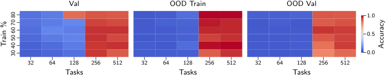
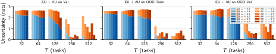
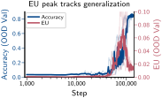

# A Bayesian Perspective on the Role of Epistemic Uncertainty for Delayed Generalization in In-Context Learning

Abdessamed Qchohi Email: abdessamed.qchohi@eurecom.fr Affiliation: EURECOM, France Simone Rossi Email: simone.rossi@eurecom.fr Affiliation: EURECOM, France

> **Note on this conversion.** Source: LaTeXML HTML at arxiv.org/html/2604.12434v1,
> checked line by line against the PDF (v1, 27 pp.) and the LaTeX e-print.
> Manual repairs: (a) macros of the `physics` package and of the authors'
> `math_commands.sty` (`\operatorname{Tr}`, `\norm`, `\differential`, `\gradient`, `\mbX` …) were
> left unexpanded by LaTeXML and have been expanded here; (b) multi-row `align`
> blocks kept only their first equation number, the per-row numbers (4), (7), (9),
> (21), (24), (27), (31), (34), (42), (46), (48), (50), (55), (57), (60), (62), (67),
> (72), (74), (77), (87) have been restored from the PDF; (c) the "IVON"/"Laplace"
> row labels of Figures 2 and 3 were dropped and are restored; (d) the printed
> citation style is author-year (natbib), but LaTeXML emitted bare numbers and
> dropped every year from the reference list — both have been restored from the PDF.

## Abstract

In-context learning enables transformers to adapt to new tasks from a few examples at inference time, while grokking highlights that this generalization can emerge abruptly only after prolonged training. We study task generalization and grokking in in-context learning using a Bayesian perspective, asking what enables the delayed transition from memorization to generalization. Concretely, we consider modular arithmetic tasks in which a transformer must infer a latent linear function solely from in-context examples and analyze how predictive uncertainty evolves during training. We combine approximate Bayesian techniques to estimate the posterior distribution and we study how uncertainty behaves across training and under changes in task diversity, context length, and context noise. We find that epistemic uncertainty collapses sharply when the model groks, making uncertainty a practical label-free diagnostic of generalization in transformers. Additionally, we provide theoretical support with a simplified Bayesian linear model, showing that asymptotically both delayed generalization and uncertainty peaks arise from the same underlying spectral mechanism, which links grokking time to uncertainty dynamics.

## 1 Introduction

In-Context Learning (ICL) has emerged as a powerful paradigm in which Large Language Models (LLMs) can learn to perform new tasks by conditioning on a few examples provided in the input prompt (Brown et al., 2020). However, despite its empirical success, the underlying mechanisms that enable LLMs to effectively learn from in-context examples remain poorly understood. Recent studies have begun to explore the theoretical foundations of ICL, proposing various hypotheses ranging from implicit Bayesian inference (Xie et al., 2022; Akyurek et al., 2023) to meta-learning frameworks (Von Oswald et al., 2023). Yet, a comprehensive Bayesian perspective on how LLMs process and learn from in-context examples is still lacking. Furthermore, during training of LLMs, models often exhibit a phenomenon known as *grokking*, where they suddenly transition from poor to near-perfect performance on a task after extended training, despite having already fit the training data (Power et al., 2022). In this work, we aim to study what enables grokking in ICL from a Bayesian perspective and how learning dynamics (and uncertainty measures) evolve during training. Bayesian Deep Learning (BDL) provides a principled framework for modeling uncertainty in deep learning models by treating model parameters as random variables and inferring their posterior distributions given the data (Gal & Ghahramani, 2016; Blundell et al., 2015; Lakshminarayanan et al., 2017). While exact inference is intractable in large-scale models like LLMs, various approximate inference techniques, such as Variational Inference (VI) and Laplace approximations, have been successfully applied to capture uncertainty in deep learning (Papamarkou et al., 2024). By treating the model in a Bayesian framework, we experimentally analyze how uncertainty quantification and posterior distributions over model parameters change as the model groks with the in-context examples. Following the classic setting, we approch this phenomenon by analyzing the training dynamics of transformers on modular arithmetic tasks (Power et al., 2022). Additionally, we provide a theoretical support for our **[p. 2]** empirical findings by analyzing the uncertainty dynamics in a simplified model, showing how the transition to generalization corresponds to a collapse in epistemic uncertainty.

*Figure 1: **Epistemic uncertainty collapses sharply at the grokking transition.** On a decoder-only transformer trained on modular arithmetic tasks, the epistemic uncertainty collapses sharply before the generalization transition. This pattern follows the theoretical prediction for a simplified linear model, where the grokking transition corresponds to a spectral shift in the posterior distribution that causes a collapse in epistemic uncertainty.* **[p. 2]**

Our contributions are as follows: (1) We study grokking in ICL in a Bayesian framework, using modular arithmetic tasks to analyze how predictive uncertainty evolves as a transformer learns to infer a latent task from in-context examples. (2) We show empirically that a sharp collapse in epistemic uncertainty coincides with the grokking transition, making it a label-free diagnostic of generalization. We further compare Improved Variational Online Newton (IVON) and Last-Layer Laplace across training, task diversity, context length, and context noise, highlighting both shared uncertainty patterns and method-specific differences in out-of-distribution (OOD) generalization. (3) We provide theoretical support with a simplified Bayesian linear model, showing that delayed generalization and delayed epistemic-uncertainty peaks arise from the same underlying spectral mechanism, which links grokking time to uncertainty dynamics. A snapshot of our main empirical and theoretical findings is shown in Figure 1.

#### Related Works.

ICL has been studied both empirically and theoretically since its emergence in large language models (Brown et al., 2020). A common theoretical view is that transformers can implement learning or estimation procedures in their forward pass, including implicit Bayesian inference, ridge regression, and gradient-based adaptation (Xie et al., 2022; Akyurek et al., 2023; Von Oswald et al., 2023; Bai et al., 2023; Xie et al., 2025; Zhang et al., 2025). Complementary work examines reliability under prompting: Zhang et al. (2024) study calibration across shot counts, Ling et al. (2024) decompose ICL uncertainty into epistemic and aleatoric terms, and Wang et al. (2025) analyze uncertainty in long-context prompting. A Bayesian framing provides a natural language for connecting these threads: pre-training can be interpreted as learning an implicit prior (or an implicit family of priors) over tasks/concepts, while ICL corresponds to approximate Bayesian inference (or Bayesian model averaging) over latent task variables given the prompt (Xie et al., 2022; Zhang et al., 2025). In parallel, BDL treats uncertainty as first-class, via priors and posteriors over parameters and predictive distributions as marginalization, and offers tools that make uncertainty trajectories during training and inference measurable (e.g. Graves, 2011; Blundell et al., 2015; Gal & Ghahramani, 2016; Lakshminarayanan et al., 2017; Maddox et al., 2019; Ritter et al., 2018). On the grokking side, Power et al. (2022) introduced the canonical delayed-generalization phenomenon on modular arithmetic. Follow-up work characterized its learning phases and representation dynamics (Liu et al., 2022), explained aspects of modular addition through the transition out of the Neural Tangent Kernel (NTK) regime (Mohamadi et al., 2024), and proposed information-theoretic or structural progress measures that can anticipate grokking (Clauw et al., 2024; Golechha, 2024). Closest to our setup, He et al. (2024) extend the classic task family to modular linear functions and study both in-distribution and out-of-distribution learning. While we build on the same experimental set up, our focus is on the Bayesian learning dynamics and uncertainty trajectories during grokking, rather than characterizing the phases of learning or the representational changes. Notably, we identify a the condition under which the model can generalize in-domain and out-of-domain, and we analyze how the model’s uncertainty evolves as it transitions from overfitting to generalization, providing a novel perspective on the grokking phenomenon. A more detailed review of the related work is available in Appendix A.

**[p. 3]**

## 2 Preliminaries

#### Bayesian inference.

Rather than treating model parameters as fixed values, Bayesian methods model them as random variables. Given a dataset $\mathcal{D}$ and model parameters ${\boldsymbol{\theta}}$, Bayes’ rule gives the posterior:

$$
p({\boldsymbol{\theta}}\mid\mathcal{D})=\frac{p(\mathcal{D}\mid{\boldsymbol{\theta}})\,p({\boldsymbol{\theta}})}{p(\mathcal{D})}
$$

where $p(\theta)$ is the prior encoding beliefs about the parameters before observing data, $p(\mathcal{D}\mid{\boldsymbol{\theta}})$ is the likelihood describing how probable the observed data is under a particular choice of parameters, and $p(\mathcal{D})=\int p(\mathcal{D}\mid{\boldsymbol{\theta}})\,p({\boldsymbol{\theta}})\,\mathrm{d}{\boldsymbol{\theta}}$ is the marginal likelihood, which integrates out the parameters and acts as a normalizing constant ensuring the posterior is a valid probability distribution. Predictions for a new input ${\boldsymbol{x}}^{*}$ are obtained by marginalizing over the posterior:

$$
p({\boldsymbol{y}}^{*}\mid{\boldsymbol{x}}^{*},\mathcal{D})=\int p({\boldsymbol{y}}^{*}\mid{\boldsymbol{x}}^{*},{\boldsymbol{\theta}})\,p({\boldsymbol{\theta}}\mid\mathcal{D})\,d{\boldsymbol{\theta}} \tag{1}
$$

This predictive distribution captures uncertainty in the model parameters, which is relevant when data is limited or when the model is evaluated on out-of-distribution inputs. Exact inference is intractable for neural networks since the posterior is high-dimensional and the marginal likelihood has no closed form. We therefore need to rely on approximate inference methods.

While the toolbox of approximate inference methods is large and rapidly evolving, we focus on two complementary approaches that are well-suited for our setting: variational inference and Laplace approximation. IVON (Shen et al., 2024) integrates uncertainty estimation into training by maintaining a Gaussian variational posterior over all weights, updated via Newton-like steps at a computational cost comparable to Adam. The Last-Layer Laplace Approximation (Daxberger et al., 2021) is a post-hoc method that fits a Gaussian approximation to the posterior of the final linear layer after standard MAP training, using a Kronecker-factored Hessian approximation, leaving all other parameters fixed. For both methods, predictions are obtained by averaging over $S$ weight samples drawn from $q({\boldsymbol{\theta}})$. Additional details on these methods are available in Appendix B.

#### Uncertainty decomposition.

Both approximate inference methods yield a distribution over predictions, enabling a principled decomposition of predictive uncertainty (Wimmer et al., 2023; Rosso et al., 2025; Hüllermeier & Waegeman, 2021). Given $S$ weight samples ${\boldsymbol{\theta}}^{(s)}$ from the approximate posterior, total uncertainty (TU) is the entropy of the mean prediction; aleatoric uncertainty (AU) is the mean entropy of individual predictions and captures irreducible label noise; and epistemic uncertainty (EU) is their difference:

$$
\mathrm{EU}({\boldsymbol{x}})=\mathbb{H}\!\left[\frac{1}{S}\sum_{s=1}^{S}p({\boldsymbol{y}}\mid{\boldsymbol{x}},{\boldsymbol{\theta}}^{(s)})\right]-\underbrace{\frac{1}{S}\sum_{s=1}^{S}\mathbb{H}\!\left[p({\boldsymbol{y}}\mid{\boldsymbol{x}},{\boldsymbol{\theta}}^{(s)})\right]}_{\mathrm{AU}({\boldsymbol{x}})}
$$

Epistemic uncertainty reflects the model’s lack of knowledge about the task and is expected to decrease as the model acquires more information. In the grokking setting, we use EU as a probe for the generalization transition.

## 3 In-Context Learning, Grokking and Uncertainty

In this section, we describe the main experimental results on the relationship between grokking and uncertainty in in-context learning. We first introduce the experimental setup, including the task distribution, model architecture, and evaluation protocol. We then present our main empirical findings on how accuracy and epistemic uncertainty behave. Finally, we analyze how task diversity, context length, and context noise affect both generalization and uncertainty dynamics.

**[p. 4]**

### 3.1 Experimental Setup

#### Tasks.

###### p4-1

We follow He et al. (2024) and focus on linear modular arithmetic tasks of the form $z=ax+by\pmod{p}$, where $(a,b)$ is the task vector and $(x,y)$ is the input vector, with all values in $\{0,\ldots,p-1\}$. Modular arithmetic provides a controlled setting for studying grokking, as the tasks have a clear underlying structure that the model can either memorize or learn to generalize. The task vector is never shown to the model, which receives only input-output triples $(x,y,z)$ and must infer the underlying task from the in-context examples. Each equation is tokenized into three numerical. An example of an input sequence is:

$$
(x_{1},y_{1},z_{1}),\;\ldots,\;(x_{n_{\mathrm{ctx}}},y_{n_{\mathrm{ctx}}},z_{n_{\mathrm{ctx}}}),\;(x_{t},y_{t},\textbf{?})
$$

During training, the model predicts every third token $z_{i}$ as well as the final target $z_{t}$, with the cross-entropy loss computed only on these positions. At evaluation time, we measure accuracy on $z_{t}$ only, which directly tests whether the model has inferred the correct task from context. We partition the set of task vectors and input examples into seen and unseen subsets, $\mathcal{T}_{\mathrm{id}}$, $\mathcal{T}_{\mathrm{ood}}$ and $\mathcal{X}_{\mathrm{train}}$, $\mathcal{X}_{\mathrm{test}}$, respectively. Crossing these two partitions gives four splits: ID Train ($\mathcal{T}_{\mathrm{id}}$, $\mathcal{X}_{\mathrm{train}}$), used for training; ID Val ($\mathcal{T}_{\mathrm{id}}$, $\mathcal{X}_{\mathrm{test}}$), which tests generalization to unseen inputs on seen tasks; OOD Train ($\mathcal{T}_{\mathrm{ood}}$, $\mathcal{X}_{\mathrm{train}}$), which tests whether the model adapts to unseen tasks on seen inputs; and OOD Val ($\mathcal{T}_{\mathrm{ood}}$, $\mathcal{X}_{\mathrm{test}}$), the hardest split, which tests full out-of-distribution generalization to both unseen tasks and unseen inputs. We train exclusively on ID Train and use the remaining three splits to evaluate generalization. This construction lets us track whether the model memorizes, generalizes in-distribution, or generalizes out-of-distribution, and at which point grokking occurs in each regime.

#### Model architecture and training.

We use a decoder-only Transformer with Rotary Positional Embeddings (RoPE) (Su et al., 2024) with $d=6$ layers, embedding dimension $512$, $4$ attention heads, and an MLP widening factor of $4$. We tie input embedding and output projection weights and apply weight decay for regularization. Task vectors are sampled via a parallelogram rule, varying one component at a time so the model can build on previously learned structure, and each batch is constructed so that all tasks in $\mathcal{T}_{\mathrm{id}}$ share the same input sequences, limiting inter-task interference. Unless otherwise specified, we train four random seeds and we report medians with $95\%$ quantile intervals across seeds for all metrics and configurations. Detailed descriptions of the training procedure, hyperparameters, and approximate inference methods are provided in Appendix D.

## 4 Empirical Results and Analysis

**IVON**

**Laplace**

*Figure 2: **Accuracy heatmap with IVON and Laplace**. For OOD Train, both IVON and Laplace achieve high accuracy starting at $T=256$ and $T=512$ for any training data fraction. For OOD Val (the most challenging split), Laplace generalizes more broadly across configurations, while IVON achieves competitive performance only at high training data fractions.* **[p. 5]**

#### Grokking across task diversity.

###### p4-6

To study how grokking emerges as a function of task diversity and training data, we train the model across a grid of configurations varying the number of pre-training tasks $T\in\{32,64,128,256,512\}$ and the fraction of training data $\alpha\in\{0.3,0.4,0.5,0.6,0.7,0.8\}$, running four random seeds per configuration. We measure accuracy on Val, OOD Train, and OOD Val, and compare IVON and Laplace to assess whether the choice of optimizer affects the generalization landscape. Figure 2 shows the results. Both IVON and Laplace achieve high OOD Train accuracy at $T=256$ and $T=512$. For OOD Val, Laplace exhibits stronger and more consistent generalization across task counts and data fractions, whereas IVON reaches competitive OOD Val accuracy only at the highest training data fractions. OOD Val generalization emerges only at the highest task counts for both methods and requires careful tuning of training data fraction.

#### Epistemic uncertainty tracks grokking.

To test whether epistemic uncertainty tracks the grokking transition, we use IVON and Laplace to decompose predictive uncertainty into epistemic and aleatoric components across the same hyperparameter grid. Figure 3 shows the results in each evaluation set.

**IVON**

**Laplace**

*Figure 3: **Uncertainty decomposition with IVON and Laplace**. Decomposition of predictive uncertainty into aleatoric and epistemic components across the pretraining hyperparameter grid.* **[p. 5]**

###### p4-10

Both methods show that at low task diversity, total uncertainty is dominated by the epistemic component across all splits. As $T$ increases, epistemic uncertainty drops sharply at $T=256$ and $T=512$ for both IVON and Laplace, while aleatoric uncertainty remains high. This reduction closely tracks the generalization transition in the accuracy heatmaps, providing a principled uncertainty-based signature of grokking consistent across approximate inference methods. **[p. 5]** This is an important finding: as of this writing, *grokking* has been primarily characterized in terms of accuracy dynamics (which implies the need for labels to detect it), while here we show that it also has a clear signature in the model’s posterior uncertainty, which can be measured without access to labels and provides a more direct window into the model’s learning dynamics.

#### Effect of context length on generalization.

To study how the number of in-context examples affects the model’s ability to infer the underlying task, we take the models trained with $n_{\mathrm{ctx}}=32$ and evaluate them by varying the number of in-context examples from $1$ to $32$ at inference time, without any additional training. The task vector $(a,b)$ is never provided to the model, which must infer it solely from the input-output triples in the context. We compare IVON and Laplace on Val, OOD Train, and OOD Val. **[p. 6]** Figure 4 shows accuracy, epistemic uncertainty, and aleatoric uncertainty as a function of context size.

*Figure 4: **Accuracy, epistemic and aleatoric uncertainty across context sizes**. Increasing the number of in-context examples monotonically improves accuracy and decreases alepatoric uncertainty, while the epistemic uncertainty follows a non-monotonic behavior.* **[p. 6]**

###### p6-1

Accuracy improves monotonically with context size for both IVON and Laplace across all splits, confirming that more examples indeed help the model infer the task (and thus generalize better on OOD splits). As expected, the aleatoric uncertainty decreases with more context and converges to a floor, reflecting the reduced ambiguity in the task given more evidence. The behavior of epistemic uncertainty is more complex: it increases at small context sizes, likely due to the model’s initial uncertainty about the task, then decreases sharply as more examples are added. Notably, this behavior is present in both IVON and Laplace, albeit with different magnitudes, suggesting that it isn’t an artifact of the approximate inference method but rather a property of the model’s (meta-)learning dynamics as it processes in-context evidence. Also, note that this evidence does not contradict the known fact that uncertainty scales monotonically with data in Bayesian inference (see, e.g., Rosso et al., 2025), but it rather highlights that the current scaling laws of uncertainty should be refined to account for the effect of test-time adaptation via in-context learning.

*Figure 5: **Accuracy vs. epistemic and aleatoric uncertainty across context noise levels**. Corrupting in-context examples with random label noise degrades accuracy and raises both aleatoric and epistemic uncertainty.* **[p. 6]**

#### Robustness to context noise.

###### p6-2

As a final test of the model’s uncertainty estimates, we evaluate how they respond to noise in the in-context examples. For this experiment, we corrupt the context by replacing each label $z_{i}$ in the context triples with a random token **[p. 7]** sampled uniformly from $\{0,\ldots,p-1\}$ with probability $p_{\mathrm{noise}}\in[0,1]$. The input tokens $x$ and $y$ are never corrupted, and the final query triple is always clean. As we did before, we evaluate both IVON and Laplace on Val, OOD Train, and OOD Val, measuring accuracy, aleatoric uncertainty, and epistemic uncertainty as a function of the noise level (Figure 5). Accuracy degrades smoothly as noise increases for both methods and all splits. Aleatoric uncertainty rises proportionally to the noise level, correctly capturing the increased label ambiguity in the context. Epistemic uncertainty also increases with noise, but more markedly for Laplace than for IVON, suggesting that the variational posterior learned by IVON is more robust to corrupted context. This is slightly surprising, as one might expect that corrupted context would primarily increase epistemic uncertainty, since it makes the task harder to infer, while aleatoric uncertainty should remain stable as it reflects irreducible noise in the data rather than lack of context. This demonstrates that recent analysis on disentangling aleatoric and epistemic uncertainty (e.g., Mucsányi et al., 2024; Kirchhof et al., 2025) do not necessarily apply to the in-context learning setting, and that further work is needed to understand how these uncertainty components interact when the model is performing test-time adaptation.

## 5 Why Epistemic Uncertainty Can Also Define Grokking Time

Our empirical results suggest that grokking is visible not only in accuracy curves but also in epistemic uncertainty. Making this claim rigorous for the full transformer on modular arithmetic is currently out of reach, so in this section we drastically simplify the problem. Following the linear-regression setup of Levi et al. (2024), we replace the sequence model by Bayesian linear regression. Although this is a very simple model, Levi et al. (2024) show that it already captures the key phenomenon of delayed generalization. Here we show that it also captures the key phenomenon of delayed EU peaks, when the model is trained with Gaussian variational inference. This abstraction is clearly much simpler than the model studied in the rest of the paper, but it gives fully tractable dynamics and still matches the qualitative empirical picture: training error decays before generalization error, the epistemic uncertainty is non-monotone, and the generalization-side transition is delayed. While full derivations are deferred to Appendix C, we sketch the main results here.

#### Simplified problem.

Let ${\boldsymbol{X}}\in\mathbb{R}^{n\times d}$ be the design matrix, with ${\boldsymbol{x}}_{i}\sim\mathcal{N}({\boldsymbol{0}},{\boldsymbol{I}}_{d})$, and ${\boldsymbol{y}}\in\mathbb{R}^{n}$ be the target vector, generated from ${\boldsymbol{w}}_{\star}$ with isotropic Gaussian prior. Consider the linear-Gaussian model

$$
p({\boldsymbol{y}}\mid{\boldsymbol{w}}) =\mathcal{N}({\boldsymbol{y}};{\boldsymbol{X}}{\boldsymbol{w}},\sigma^{2}{\boldsymbol{I}}_{n}),  p({\boldsymbol{w}}) =\mathcal{N}({\boldsymbol{w}};{\boldsymbol{0}},\tau^{2}{\boldsymbol{I}}_{d}). \tag{2}
$$

We study the regime $n,d\to\infty$ with fixed aspect ratio $\lambda=d/n<1$. Our goal is to analyze the dynamics of Gaussian variational inference in this model, and to understand how the risk and uncertainty evolve along the variational trajectory. Following the results of Lambert et al. (2022), since the model is linear and the variational family is Gaussian, the gradient flows on the Bures–Wasserstein space of Gaussian measures $q_{t}({\boldsymbol{w}})=\mathcal{N}({\boldsymbol{w}};{\boldsymbol{\mu}}_{t},{\boldsymbol{\Sigma}}_{t})$ can be written in closed form as a system of ODEs:

$$
\dot{\boldsymbol{\mu}}_{t} ={\boldsymbol{b}}-{\boldsymbol{A}}{\boldsymbol{\mu}}_{t}, \tag{3}\\
\dot{\boldsymbol{\Sigma}}_{t} =2{\boldsymbol{I}}_{d}-{\boldsymbol{A}}{\boldsymbol{\Sigma}}_{t}-{\boldsymbol{\Sigma}}_{t}{\boldsymbol{A}}. \tag{4}
$$

with ${\boldsymbol{A}}=\sigma^{-2}{\boldsymbol{X}}^{\top}{\boldsymbol{X}}+\tau^{-2}{\boldsymbol{I}}_{d}$ and ${\boldsymbol{b}}=\sigma^{-2}{\boldsymbol{X}}^{\top}{\boldsymbol{y}}$. This system has exact solutions, as shown in the Appendix. Along the Gaussian variational trajectory, we are interested in the expected risks

$$
\mathcal{L}_{\text{emp}}(t)=\mathbb{E}_{q_{t}}\frac{1}{n}\sum_{i=1}^{n}\ell(y_{i},{\boldsymbol{x}}_{i}^{\top}{\boldsymbol{w}})\qquad\text{and}\qquad\mathcal{L}_{\text{gen}}(t)=\mathbb{E}_{q_{t}({\boldsymbol{w}})p({\boldsymbol{x}},y)}\ell(y_{i},{\boldsymbol{x}}_{i}^{\top}{\boldsymbol{w}}) \tag{5}
$$

where $\ell$ is the squared loss, i.e. $\ell(y,\hat{y})=\frac{1}{2}(y-\hat{y})^{2}$. We can also define the excess risks, which are the differences between the risks at time $t$ and their limiting values as $t\to\infty$.

**[p. 8]**

#### Risk dynamics and spectral decomposition.

In the well-specified model regime, the fixed point ${\boldsymbol{\mu}}_{\infty}$ coincides with the exact parameters ${\boldsymbol{w}}_{\star}$ and the population covariance is isotropic, so the relevant objects are the mean gap $\delta{\boldsymbol{\mu}}_{0}\equiv{\boldsymbol{\mu}}_{0}-{\boldsymbol{\mu}}_{\infty}$ and the covariance gap $\Delta{\boldsymbol{\Sigma}}_{0}\equiv{\boldsymbol{\Sigma}}_{0}-{\boldsymbol{\Sigma}}_{\infty}$. Writing ${\boldsymbol{E}}_{t}\equiv e^{-{\boldsymbol{A}}t}$, the excess empirical and generalization risks are

$$
\widetilde{\mathcal{L}}_{\mathrm{emp}}(t) =\frac{1}{2n}\delta{\boldsymbol{\mu}}_{0}^{\top}{\boldsymbol{E}}_{t}{\boldsymbol{X}}^{\top}{\boldsymbol{X}}{\boldsymbol{E}}_{t}\delta{\boldsymbol{\mu}}_{0}+\frac{1}{2n}\operatorname{Tr}({\boldsymbol{X}}^\top{\boldsymbol{X}}{\boldsymbol{E}}_t \Delta{\boldsymbol{\Sigma}}_0 {\boldsymbol{E}}_t), \tag{6}\\
\widetilde{\mathcal{L}}_{\mathrm{gen}}(t) =\frac{1}{2}\delta{\boldsymbol{\mu}}_{0}^{\top}{\boldsymbol{E}}_{t}^{2}\delta{\boldsymbol{\mu}}_{0}+\frac{1}{2}\operatorname{Tr}({\boldsymbol{E}}_t \Delta{\boldsymbol{\Sigma}}_0 {\boldsymbol{E}}_t). \tag{7}
$$

The first term tracks the residual bias of the variational mean, while the second tracks the residual uncertainty from the covariance. Crucially, both risks are driven by the same operator ${\boldsymbol{A}}$, but they are read out in two different quantities: the empirical risk uses the training covariance $\widehat{{\boldsymbol{\Sigma}}}={\boldsymbol{X}}^{\top}{\boldsymbol{X}}/n$, whereas the population risk uses the identity. In the high-dimensional limit, the eigenvalues of the sample covariance $\widehat{{\boldsymbol{\Sigma}}}$ converge in distribution to the Marchenko-Pastur law $\mathrm{MP}(\lambda)$, and the excess risks can be expressed as expectations over this distribution:

$$
\widetilde{\mathcal{L}}_{\text{emp}}(t) \approx C_{0}\,\mathbb{E}_{\nu\sim\mathrm{MP}(\lambda)}\left[\nu\exp\left(-2\left(\frac{n}{\sigma^{2}}\nu+\frac{1}{\tau^{2}}\right)t\right)\right], \tag{8}\\
\widetilde{\mathcal{L}}_{\text{gen}}(t) \approx C_{0}\,\mathbb{E}_{\nu\sim\mathrm{MP}(\lambda)}\left[\exp\left(-2\left(\frac{n}{\sigma^{2}}\nu+\frac{1}{\tau^{2}}\right)t\right)\right]. \tag{9}
$$

where $C_{0}$ collects the initial mean and covariance gaps (details in the Appendix). Under the assumption of high-dimensional self-averaging regime, the late-time behavior is controlled by the lower Marchenko-Pastur edge $\nu_{-}=(1-\sqrt{\lambda})^{2}$:

$$
\widetilde{\mathcal{L}}_{\text{emp,gen}}(t)\sim K_{\text{emp,gen}}t^{-3/2}e^{-\kappa t},\qquad\kappa=2\left(\frac{n}{\sigma^{2}}(1-\sqrt{\lambda})^{2}+\frac{1}{\tau^{2}}\right), \tag{10}
$$

###### p8-4

with ratio $K_{\text{gen}}/K_{\text{emp}}=(1-\sqrt{\lambda})^{-2}$. The common exponential rate $\kappa$ reflects the shared edge mode, while the different factors is due to the extra $\nu$ in the empirical risk and it is responsible for the train–test delay. This asymptotic mismatch is the only ingredient needed for the uncertainty result below.

*Figure 6: **Training and generalization dynamics of the simplified model.** Increasing the aspect ratio $\lambda$ delays generalization relative to training (*left*). The epistemic uncertainty peaks coincide with the transition from interpolation to generalization (*center left*), although the EU peak occurs before the accuracy threshold is exceeded (*center right*). Consistently, the EU peak delay grows rapidly with $\lambda\to 1$, with the asymptotic formula of Theorem 5.1 providing a good proxy for the observed delay (*right*).* **[p. 8]**

#### Threshold-model uncertainty and delayed EU peaks.

Following the construction used by Levi et al. (2024), we turn regression into a binary success event by choosing a tolerance $\epsilon>0$ and declaring a prediction correct whenever the expected squared residual is smaller than $\epsilon$. For a datapoint $({\boldsymbol{x}},y)$, define the thresholded success variable $Z_{\epsilon}({\boldsymbol{x}},y;{\boldsymbol{w}})=\mathbb{1}\{(y-{\boldsymbol{x}}^{\top}{\boldsymbol{w}})^{2}\leq\epsilon\}$. We can define the empirical and generalization accuracies $\mathcal{A}_{\text{emp}}$ and $\mathcal{A}_{\text{gen}}$ as the expected value of $Z_{\epsilon}$ under the variational distribution and the data distribution (see the Appendix for details). By analogy with the accuracy threshold defined in Levi et al. (2024), we can define the grokking time as the time at which the accuracy curve crosses a certain threshold, which is equivalent as the time at which the excess risk crosses a certain threshold; for $95\%$ accuracy we **[p. 9]** have $\widetilde{\mathcal{L}}(t_{\mathrm{grok}})\approx\epsilon/8$. Now our current goal is to analyze the epistemic uncertainty of this model.

##### **Lemma 5.1** (Epistemic uncertainty of the classification-equivalent model).

*For fixed $({\boldsymbol{x}},y)$, the residual under $q_{t}$ is Gaussian and the thresholded success event is a Bernoulli random variable. Hence, its epistemic uncertainty is exactly the binary entropy of its success probability, which in the $n,d\to\infty$ limit can be written in terms of the excess risk $\widetilde{\mathcal{L}}(t)$:*

$$
\mathrm{EU}(t)\approx h_{2}\!\left(\operatorname{erf}\left(\sqrt{\frac{\epsilon}{4\widetilde{\mathcal{L}}(t)}}\right)\right), \tag{11}
$$

*where $h_{2}(p)=-p\log p-(1-p)\log(1-p)$ is the binary entropy. It is a non-monotone function of the excess risk, and its peak occurs when*

$$
\widetilde{\mathcal{L}}(t_{\mathrm{peak}})=\frac{\epsilon}{4(\operatorname{erf}^{-1}(1/2))^{2}}\approx 1.10\,\epsilon, \tag{12}
$$

*i.e., when the thresholded success event is maximally ambiguous. By reversing this relation, we can also derive the $t_{\mathrm{peak}}$ as a function of $\epsilon$ and the risk dynamics.*

##### *Remark 5.1*.

###### p9-4

Note that the peak of the epistemic uncertainty does not occur at the same time as the accuracy threshold, but rather before it, when the excess risk is still around $1.10\,\epsilon$ (instead of $\epsilon/8$); this offset is illustrated in the center-right panel of Figure 6.

Finally, we can analyze the delay between the EU peaks on train and test, which is a proxy for the grokking time defined through epistemic uncertainty.

##### **Theorem 5.1** (Delay between threshold-uncertainty peaks).

*Assume the construction of Lemma 5.1 and the asymptotics described above. If the empirical and generalization uncertainty curves peak in this regime, then the delay between the two EU peaks satisfies*

$$
\Delta t_{\mathrm{EU,peak}}(\lambda)=t_{\mathrm{peak},\mathrm{gen}}-t_{\mathrm{peak},\mathrm{emp}}\simeq\frac{\log\left(\frac{1}{1-\sqrt{\lambda}}\right)}{\frac{n}{\sigma^{2}}(1-\sqrt{\lambda})^{2}+\frac{1}{\tau^{2}}}. \tag{13}
$$

This scaling is also visible in Figure 6, where the separation between the empirical and generalization EU peaks grows markedly as $\lambda\to 1$, and it follows the asymptotic prediction.

*Figure 7: **Empirical trajectory of accuracy and epistemic uncertainty.** Even in the full transformer model, the EU peak occurs before the accuracy threshold is exceeded, similarly to the asymptotic behavior of the simplified model.* **[p. 9]**

#### Takeaway.

###### p9-8

Theorem 5.1 is the main theoretical reason to say that grokking time can also be defined through epistemic uncertainty. The point is not that the EU peak occurs at the same absolute time as an accuracy threshold (indeed, the EU peak is happing earlier than the accuracy threshold), but rather that both observables inherit the same train-generalization delay from the same slow edge-of-spectrum modes. In this simplified model, accuracy and epistemic uncertainty are therefore two different probes of the same underlying mechanism. This is exactly the qualitative behavior we observe in the empirical analysis. Indeed, even in the full transformer model on the modulo arithmetic dataset, the EU peak occurs before the accuracy threshold is exceeded, showing that the theoretical picture of the simplified model is compatible with the empirical behavior (Figure 7).

## 6 Concluding Remarks

We presented an uncertainty quantification perspective on delayed generalization in in-context learning and showed that epistemic uncertainty provides a sharp, label-free signature of grokking. In a controlled modular linear arithmetic setting with explicit in-distribution and out-of-distribution splits, we found that grokking coincides with a sudden **[p. 10]** collapse in epistemic uncertainty, and that this behavior remains informative under changes in task diversity, context length, and context noise. For both IVON and Last-Layer Laplace, this uncertainty signal is robust, while still revealing meaningful differences in out-of-distribution behavior. We further supported these findings with theorethical results on a simplified Bayesian linear model, showing that delayed generalization and uncertainty peaks are driven by the same underlying spectral mechanism. To conclude, we want to emphasize that while our findings provide a novel perspective on the grokking phenomenon and its relationship to uncertainty dynamics, they are based on a specific synthetic setting and simplified theoretical model. Extending these insights to larger models and other language tasks remains an important direction for future work, and the interpretation of uncertainty dynamics in more complex settings should be approached with caution.

## Acknowledgments

This project was provided with AI computing and storage resources by GENCI at IDRIS thanks to the grant 2025-AD011016811 on the supercomputer Jean Zay’s A100/H100 partition. SR SR acknowledges the support of CIRCALIS AI-HPC facility at EURECOM, with partial funding from French Region Sud.

## References

- Akyurek et al. (2023) E. Akyurek, D. Schuurmans, J. Andreas, T. Ma, and D. Zhou What learning algorithm is in-context learning? Investigations with linear models. In The Eleventh International Conference on Learning Representations, External Links: Link Cited by: Appendix A, §1, §1.

- Bai et al. (2023) Y. Bai, F. Chen, H. Wang, C. Xiong, and S. Mei Transformers as Statisticians: Provable In-Context Learning with In-Context Algorithm Selection. In Thirty-seventh Conference on Neural Information Processing Systems, External Links: Link Cited by: Appendix A, §1.

- Blundell et al. (2015) C. Blundell, J. Cornebise, K. Kavukcuoglu, and D. Wierstra Weight Uncertainty in Neural Networks. In International Conference on Machine Learning (ICML), External Links: Link Cited by: Appendix A, §1, §1.

- Brown et al. (2020) T. Brown, B. Mann, N. Ryder, M. Subbiah, J. D. Kaplan, P. Dhariwal, A. Neelakantan, P. Shyam, G. Sastry, A. Askell, et al. Language models are few-shot learners. Advances in neural information processing systems 33, pp. 1877–1901. Cited by: Appendix A, §1, §1.

- Clauw et al. (2024) K. Clauw, S. Stramaglia, and D. Marinazzo Information-Theoretic Progress Measures reveal Grokking is an Emergent Phase Transition. In ICML 2024 Workshop on Mutual Information (MI), External Links: 2408.08944, Document Cited by: Appendix A, §1.

- Daxberger et al. (2021) E. Daxberger, A. Kristiadi, A. Immer, R. Eschenhagen, M. Bauer, and P. Hennig Laplace Redux - Effortless Bayesian Deep Learning. In neurips, Vol. 34. Cited by: §B.2, §2.

- Gal & Ghahramani (2016) Y. Gal and Z. Ghahramani Dropout as a Bayesian Approximation: Representing Model Uncertainty in Deep Learning. In International Conference on Machine Learning, Cited by: Appendix A, §1, §1.

- Golechha (2024) S. Golechha Progress Measures for Grokking on Real-world Tasks. In ICML 2024 Workshop on High-dimensional Learning Dynamics (HiLD), External Links: 2405.12755, Document Cited by: Appendix A, §1.

- Graves (2011) A. Graves Practical Variational Inference for Neural Networks. In Advances in Neural Information Processing Systems, Cited by: Appendix A, §1.

- He et al. (2024) T. He, D. Doshi, A. Das, and A. Gromov Learning to grok: Emergence of in-context learning and skill composition in modular arithmetic tasks. In Advances in Neural Information Processing Systems, Vol. 37. External Links: Link Cited by: Appendix A, §D.1, §1, §3.1.

- Hüllermeier & Waegeman (2021) E. **[p. 11]** Hüllermeier and W. Waegeman Aleatoric and epistemic uncertainty in machine learning: an introduction to concepts and methods. Machine Learning 3 (110), pp. 457–506. Cited by: §2.

- Khan et al. (2018) M. E. Khan, D. Nielsen, V. Tangkaratt, W. Lin, Y. Gal, and A. Srivastava Fast and Scalable Bayesian Deep Learning by Weight-Perturbation in Adam. In International Conference on Machine Learning (ICML), External Links: Link Cited by: §B.1.

- Kirchhof et al. (2025) M. Kirchhof, G. Kasneci, and E. Kasneci Position: Uncertainty Quantification Needs Reassessment for Large Language Model Agents. In Forty-second International Conference on Machine Learning Position Paper Track, External Links: Link Cited by: §4.

- Lakshminarayanan et al. (2017) B. Lakshminarayanan, A. Pritzel, and C. Blundell Simple and Scalable Predictive Uncertainty Estimation using Deep Ensembles. In Advances in Neural Information Processing Systems 30, External Links: Link Cited by: Appendix A, §1, §1.

- Lambert et al. (2022) M. Lambert, S. Chewi, F. Bach, S. Bonnabel, and P. Rigollet Variational inference via Wasserstein gradient flows. In Advances in Neural Information Processing Systems, A. H. Oh, A. Agarwal, D. Belgrave, and K. Cho (Eds.), External Links: Link Cited by: Definition C.3, §5.

- Levi et al. (2024) N. I. Levi, A. Beck, and Y. Bar-Sinai Grokking in Linear Estimators – A Solvable Model that Groks without Understanding. In The Twelfth International Conference on Learning Representations, External Links: Link Cited by: Appendix C, §5, §5.

- Ling et al. (2024) C. Ling, X. Zhao, X. Zhang, W. Cheng, Y. Liu, Y. Sun, M. Oishi, T. Osaki, K. Matsuda, J. Ji, G. Bai, L. Zhao, and H. Chen Uncertainty Quantification for In-Context Learning of Large Language Models. In Proceedings of the 2024 Conference of the North American Chapter of the Association for Computational Linguistics: Human Language Technologies (Volume 1: Long Papers), K. Duh, H. Gomez, and S. Bethard (Eds.), Mexico City, Mexico, pp. 3357–3370. External Links: Link, Document Cited by: Appendix A, §1.

- Liu et al. (2022) Z. Liu, O. Kitouni, N. S. Nolte, E. Michaud, M. Tegmark, and M. Williams Towards understanding grokking: An effective theory of representation learning. Advances in Neural Information Processing Systems 35, pp. 34651–34663. Cited by: Appendix A, §1.

- Maddox et al. (2019) W. J. Maddox, P. Izmailov, T. Garipov, D. P. Vetrov, and A. G. Wilson A simple baseline for Bayesian uncertainty in deep learning. In Advances in Neural Processing Systems (NeurIPS), Vol. 32. Cited by: Appendix A, §1.

- Mohamadi et al. (2024) M. A. Mohamadi, Z. Li, L. Wu, and D. J. Sutherland Why Do You Grok? A Theoretical Analysis of Grokking Modular Addition. In Proceedings of the 41st International Conference on Machine Learning, Proceedings of Machine Learning Research, Vol. 235, pp. 35155–35173. Cited by: Appendix A, §1.

- Mucsányi et al. (2024) B. Mucsányi, M. Kirchhof, and S. J. Oh Benchmarking uncertainty disentanglement: Specialized uncertainties for specialized tasks. Advances in neural information processing systems 37, pp. 50972–51038. Cited by: §4.

- Papamarkou et al. (2024) T. Papamarkou, M. Skoularidou, K. Palla, L. Aitchison, J. Arbel, D. Dunson, M. Filippone, V. Fortuin, P. Hennig, J. M. Hernández-Lobato, A. Hubin, A. Immer, T. Karaletsos, M. E. Khan, A. Kristiadi, Y. Li, S. Mandt, C. Nemeth, M. A. Osborne, T. G. J. Rudner, D. Rügamer, Y. W. Teh, M. Welling, A. G. Wilson, and R. Zhang Position: Bayesian Deep Learning is Needed in the Age of Large-Scale AI. In International Conference on Machine Learning, Cited by: §1.

- Power et al. (2022) A. Power, Y. Burda, H. Edwards, I. **[p. 12]** Babuschkin, and V. Misra Grokking: Generalization Beyond Overfitting on Small Algorithmic Datasets. arXiv. Cited by: Appendix A, Appendix A, §1, §1.

- Ritter et al. (2018) H. Ritter, A. Botev, and D. Barber A scalable Laplace approximation for neural networks. In International conference on learning representations, Cited by: Appendix A, §1.

- Rosso et al. (2025) M. Rosso, S. Rossi, G. Franzese, M. Heinonen, and M. Filippone Scaling Laws for Uncertainty in Deep Learning. arXiv preprint arXiv:2506.09648. Cited by: §2, §4.

- Shen et al. (2024) Y. Shen, N. Daheim, B. Cong, P. Nickl, G. M. Marconi, B. C. E. M. Raoul, R. Yokota, I. Gurevych, D. Cremers, M. E. Khan, and T. Möllenhoff Variational Learning is Effective for Large Deep Networks. In Proceedings of the 41st International Conference on Machine Learning, R. Salakhutdinov, Z. Kolter, K. Heller, A. Weller, N. Oliver, J. Scarlett, and F. Berkenkamp (Eds.), Proceedings of Machine Learning Research, Vol. 235, pp. 44665–44686. Cited by: §B.1, §2.

- Su et al. (2024) J. Su, M. Ahmed, Y. Lu, S. Pan, W. Bo, and Y. Liu Roformer: Enhanced transformer with rotary position embedding. Neurocomputing 568, pp. 127063. Cited by: §3.1.

- Von Oswald et al. (2023) J. Von Oswald, E. Niklasson, E. Randazzo, J. Sacramento, A. Mordvintsev, A. Zhmoginov, and M. Vladymyrov Transformers learn in-context by gradient descent. In International Conference on Machine Learning, pp. 35151–35174. Cited by: Appendix A, §1, §1.

- Wang et al. (2025) Y. Wang, Y. Sheng, L. Li, and D. D. Zeng Uncertainty Unveiled: Can Exposure to More In-context Examples Mitigate Uncertainty for Large Language Models?. In Findings of the Association for Computational Linguistics: ACL 2025, W. Che, J. Nabende, E. Shutova, and M. T. Pilehvar (Eds.), Vienna, Austria, pp. 20659–20678. External Links: Link, Document, ISBN 979-8-89176-256-5 Cited by: Appendix A, §1.

- Wimmer et al. (2023) L. Wimmer, Y. Sale, P. Hofman, B. Bischl, and E. Hüllermeier Quantifying aleatoric and epistemic uncertainty in machine learning: Are conditional entropy and mutual information appropriate measures?. In Conference on Uncertainty in Artificial Intelligence, Cited by: §2.

- Xie et al. (2022) S. M. Xie, A. Raghunathan, P. Liang, and T. Ma An Explanation of In-context Learning as Implicit Bayesian Inference. In International Conference on Learning Representations, Cited by: Appendix A, §1, §1.

- Xie et al. (2025) S. Xie, R. Yuan, S. Rossi, and T. Hannagan The Initialization Determines Whether In-Context Learning Is Gradient Descent. Transactions on Machine Learning Research. Note: External Links: ISSN 2835-8856, Link Cited by: Appendix A, §1.

- Zhang et al. (2024) H. Zhang, Y. Zhang, Y. Yu, D. Madeka, D. Foster, E. Xing, H. Lakkaraju, and S. Kakade A Study on the Calibration of In-context Learning. In Proceedings of the 2024 Conference of the North American Chapter of the Association for Computational Linguistics: Human Language Technologies (Volume 1: Long Papers), K. Duh, H. Gomez, and S. Bethard (Eds.), Mexico City, Mexico, pp. 6118–6136. External Links: Link, Document Cited by: Appendix A, §1.

- Zhang et al. (2025) Y. Zhang, F. Zhang, Z. Yang, and Z. Wang What and How Does In-Context Learning Learn? Bayesian Model Averaging, Parameterization, and Generalization. In Proceedings of the 28th International Conference on Artificial Intelligence and Statistics (AISTATS), Cited by: Appendix A, §1.

**[p. 13]**

## Appendix A Extended Related Works

Grokking and ICL are training-inference phenomena that expose a common theme in deep learning: generalization can emerge abruptly, late, and in ways not well predicted by early optimization signals. Grokking, originally characterized on small algorithmic datasets (notably modular arithmetic), is a delayed generalization regime where test performance remains poor long after training performance saturates, and then transitions sharply to near-perfect generalization (Power et al., 2022). ICL, popularized by large transformer language models (e.g., GPT-3), is the ability to adapt to a task at inference time by conditioning on a prompt containing input-output examples, without gradient-based parameter updates (Brown et al., 2020). Explanations of ICL increasingly characterize transformers as implementing recognizable statistical estimators or learning procedures in their forward pass, including ridge regression, gradient descent, and in certain regimes Bayesian estimators (Akyurek et al., 2023; Von Oswald et al., 2023; Bai et al., 2023; Xie et al., 2025). A Bayesian framing provides a natural language for connecting these threads: pretraining can be interpreted as learning an implicit prior (or an implicit family of priors) over tasks/concepts, while ICL corresponds to approximate Bayesian inference (or Bayesian model averaging) over latent task variables given the prompt (Xie et al., 2022; Zhang et al., 2025). In parallel, BDL treats uncertainty as first-class, via priors and posteriors over parameters and predictive distributions, and offers tools that make uncertainty trajectories during training and inference measurable (Graves, 2011; Blundell et al., 2015; Gal & Ghahramani, 2016; Lakshminarayanan et al., 2017; Maddox et al., 2019; Ritter et al., 2018).

#### In-context learning.

While the theoretical understanding of ICL is still developing, a growing body of work has empirically studied various aspects of ICL, including calibration and uncertainty measures under prompting. Zhang et al. (2024) systematically study calibration under ICL across NLP tasks and report that increasing the number of ICL examples can initially worsen miscalibration before later improving calibration, and that miscalibration is prominent in low-shot settings. Ling et al. (2024) propose a formulation that decomposes predictive uncertainty in ICL into epistemic and aleatoric components and introduce estimation methods aimed at plug-and-play uncertainty decomposition for ICL. Wang et al. (2025) study long-context ICL and report that adding more in-context examples can reduce total uncertainty and epistemic uncertainty, while also analyzing confidence evolution across layers.

#### Grokking.

Empirical studies of grokking have primarily characterized loss and accuracy dynamics, changes in representations, and mechanistic interpretations of the phenomenon. Power et al. (2022) established the canonical grokking setting on small modular arithmetic tasks, and observed that generalization emerges suddenly after a long period of overfitting. Liu et al. (2022) provided an extensive phase-diagram evidence and identified multiple learning phases, emphasizing structured representation emergence as a driver of generalization. Mohamadi et al. (2024) focused specifically on modular addition and propose a theoretical explanation based on the NTK regime, showing that the transition to generalization corresponding to leaving the kernel regime happens only after initial overfitting. A subset of grokking-adjacent work introduces information-theoretic progress measures, which is conceptually close to uncertainty quantification but not identical to predictive uncertainty. Clauw et al. (2024) analyze higher-order mutual information (synergy/redundancy) among neurons through training and report distinct phases that can anticipate grokking, framing grokking as an emergent phase transition caused by synergistic interactions. Golechha (2024) investigates grokking on real-world classification tasks and proposes progress measures such as activation sparsity, absolute weight entropy, and approximate local circuit complexity that correlate with grokking more strongly than weight norms in that study.

#### Difference from prior work.

Closer to our work is the work of He et al. (2024), which extended the classic grokking setting to a larger class of modular linear functions, allowing for a more detailed analysis of the learning dynamics not only in-distribution but also out-of-distribution. While we build on the same experimental set up, our focus is on the Bayesian learning dynamics and uncertainty trajectories during grokking, rather than characterizing **[p. 14]** the phases of learning or the representational changes. Notably, we identify a the condition under which the model can generalize in-domain and out-of-domain, and we analyze how the model’s uncertainty evolves as it transitions from overfitting to generalization, providing a novel perspective on the grokking phenomenon.

## Appendix B Description of the methods used

### B.1 Improved Variational Online Newton (IVON)

IVON (Shen et al., 2024) is a scalable, second-order optimizer that makes variational inference tractable for large-scale deep neural networks. Instead of minimizing the empirical risk, IVON directly optimizes the Evidence Lower Bound (ELBO):

$$
\mathcal{L}(q)=\lambda\mathbb{E}_{q({\boldsymbol{w}})}[\bar{\ell}({\boldsymbol{w}})]+\mathbb{D}_{KL}(q({\boldsymbol{w}})||p({\boldsymbol{w}})) \tag{14}
$$

where, $q({\boldsymbol{w}})=\mathcal{N}({\boldsymbol{w}};{\boldsymbol{\mu}},\operatorname{diag}({\boldsymbol{\Sigma}})^{2})$ is the diagonal Gaussian posterior approximation, $p({\boldsymbol{w}})$ is the prior, $\bar{\ell}({\boldsymbol{w}})$ is the empirical loss, and $\lambda$ scales the objective.

Previous methods like VON (Khan et al., 2018) relied on a computationally expensive per-example Gauss-Newton Hessian estimate. IVON circumvents this by using the *reparameterization trick* to estimate the Hessian $\hat{{\boldsymbol{h}}}$ using only the standard minibatch gradient:

$$
\hat{{\boldsymbol{h}}}\leftarrow\hat{\nabla}\bar{\ell}({\boldsymbol{w}})\odot\frac{{\boldsymbol{w}}-{\boldsymbol{\mu}}}{{\boldsymbol{\Sigma}}^{2}} \tag{15}
$$

where $\odot$ is the element-wise product and ${\boldsymbol{w}}\sim q({\boldsymbol{w}})$. By requiring only a single vector multiplication, IVON’s computational cost matches Adam’s.

To ensure the Hessian remains positive-definite, IVON applies a Riemannian gradient descent update:

$$
{\boldsymbol{h}}\leftarrow\beta_{2}{\boldsymbol{h}}+(1-\beta_{2})\hat{{\boldsymbol{h}}}+\frac{1}{2}(1-\beta_{2})^{2}\frac{({\boldsymbol{h}}-\hat{{\boldsymbol{h}}})^{2}}{{\boldsymbol{h}}+\delta} \tag{16}
$$

Here, $\beta_{2}$ is the Hessian momentum, and $\delta>0$ acts as a damping parameter corresponding to the prior precision (weight decay).

The mean ${\boldsymbol{\mu}}$ is updated via a preconditioned Newton-like step, and the standard deviation is tied to the Hessian via ${\boldsymbol{\Sigma}}=1/\sqrt{\lambda({\boldsymbol{h}}+\delta)}$. At inference, IVON quantifies uncertainty through Bayesian Model Averaging (BMA) by sampling ${\boldsymbol{w}}^{(s)}\sim\mathcal{N}({\boldsymbol{\mu}},\operatorname{diag}({\boldsymbol{\Sigma}})^{2})$.

### B.2 Laplace approximation (LA)

Laplace approximation (Daxberger et al., 2021) is a *post-hoc* framework that converts a deterministically trained neural network into a Bayesian model for uncertainty quantification, without modifying the training objective.

LA interprets the final weights trained with $L_{2}$ regularization as a Maximum A Posteriori (MAP) estimate, ${\boldsymbol{w}}_{\text{MAP}}$, obtained by minimizing the regularized negative log-posterior:

$$
{\boldsymbol{w}}_{\text{MAP}}=\arg\min_{{\boldsymbol{w}}}\left(-\sum_{n=1}^{N}\log p(y_{n}\mid f_{{\boldsymbol{w}}}({\boldsymbol{x}}_{n}))-\log p({\boldsymbol{w}})\right) \tag{17}
$$

where $p({\boldsymbol{w}})=\mathcal{N}({\boldsymbol{w}};{\boldsymbol{0}},\tau^{2}{\boldsymbol{I}}_{d})$ is the isotropic Gaussian prior induced by weight decay.

LA constructs a local Gaussian approximation of the intractable true posterior centered at the MAP solution:

**[p. 15]**

$$
p({\boldsymbol{w}}\mid\mathcal{D})\approx\mathcal{N}({\boldsymbol{w}};{\boldsymbol{w}}_{\text{MAP}},{\boldsymbol{\Sigma}}) \tag{18}
$$

The covariance matrix ${\boldsymbol{\Sigma}}={\boldsymbol{H}}^{-1}$ is the inverse of the Hessian ${\boldsymbol{H}}$, derived via a second-order Taylor expansion evaluated at ${\boldsymbol{w}}_{\text{MAP}}$.

Computing and inverting the full exact Hessian ${\boldsymbol{H}}\in\mathbb{R}^{d\times d}$ is computationally infeasible and often yields an indefinite matrix. Practical LA implementations resolve this through three core approximations:

1. Fisher Information Matrix (FIM): Replaces the exact Hessian to guarantee positive semi-definiteness.
2. Last-Layer Laplace (LLLA): Restricts Bayesian inference to the final linear layer while keeping preceding layers fixed at ${\boldsymbol{w}}_{\text{MAP}}$, drastically reducing dimensionality.
3. Kronecker-Factored Approximate Curvature (KFAC): Approximates the Fisher matrix as a Kronecker product $F\approx A\otimes B$ (input and pre-activation gradient covariances) for efficient inversion.

The predictive distribution for a new data point ${\boldsymbol{x}}^{*}$ is computed by marginalizing over this approximate posterior:

$$
p(y\mid{\boldsymbol{x}}^{*},\mathcal{D})\approx\int p(y\mid f_{{\boldsymbol{w}}}({\boldsymbol{x}}^{*}))\mathcal{N}({\boldsymbol{w}};{\boldsymbol{w}}_{\text{MAP}},{\boldsymbol{\Sigma}})\,\mathrm{d}{\boldsymbol{w}} \tag{19}
$$

In practice, this integral is approximated via Monte Carlo sampling, producing a distribution of outputs to quantify epistemic uncertainty.

## Appendix C A Simplified Model for Grokking under Variational Inference

This section rewrites the derivation in a self-contained form for a linear-Gaussian teacher-student model. The goal is to isolate the mechanism that produces distinct training and generalization timescales under Gaussian variational inference, while keeping all quantities analytically tractable. Note that while the proof style and some of the intermediate results are similar to those in Levi et al. (2024), the final results and the interpretation are different, as we focus on the variational learning dynamics rather than the gradient flow of the population risk. Furthermore, the analysis in Levi et al. (2024) is mostly focused on loss and accuracy dynamics, while we make a specific focus on the uncertainty dynamics and how they relate to the generalization transition, which is a novel perspective on the grokking phenomenon.

### C.1 Bayesian linear regression

##### **Definition C.1** (Linear-Gaussian model).

Let ${\boldsymbol{X}}\in\mathbb{R}^{n\times d}$ be the design matrix, let ${\boldsymbol{w}}\in\mathbb{R}^{d}$ be the parameter vector, and let ${\boldsymbol{y}}\in\mathbb{R}^{n}$ be the observed responses. We consider the Bayesian linear model

$$
p({\boldsymbol{y}}\mid{\boldsymbol{w}}) =\mathcal{N}({\boldsymbol{y}};{\boldsymbol{X}}{\boldsymbol{w}},\sigma^{2}{\boldsymbol{I}}_{n}), \tag{20}\\
p({\boldsymbol{w}}) =\mathcal{N}({\boldsymbol{w}};{\boldsymbol{0}},\tau^{2}{\boldsymbol{I}}_{d}), \tag{21}
$$

with likelihood variance $\sigma^{2}>0$ and prior variance $\tau^{2}>0$. When needed, we also assume the true data-generating process is linear-Gaussian:

$$
y={\boldsymbol{x}}^{\top}{\boldsymbol{w}}_{\star}+\varepsilon,\qquad\mathbb{E}[\varepsilon]=0,\qquad\mathbb{E}[\varepsilon^{2}]=\sigma_{\varepsilon}^{2}, \tag{22}
$$

with population covariance ${\boldsymbol{\Sigma}}_{x}\equiv\mathbb{E}[{\boldsymbol{x}}{\boldsymbol{x}}^{\top}]$.

**[p. 16]**

##### **Definition C.2** (Posterior precision and linear term).

For the model above, define

$$
{\boldsymbol{A}} \equiv\frac{{\boldsymbol{X}}^{\top}{\boldsymbol{X}}}{\sigma^{2}}+\frac{{\boldsymbol{I}}_{d}}{\tau^{2}}, \tag{23}\\
{\boldsymbol{b}} \equiv\frac{{\boldsymbol{X}}^{\top}{\boldsymbol{y}}}{\sigma^{2}}. \tag{24}
$$

Since $\tau^{2}>0$, the matrix ${\boldsymbol{A}}$ is symmetric positive definite.

The posterior distribution is for this model is the following Gaussian:

$$
p({\boldsymbol{w}}\mid{\boldsymbol{y}})=\mathcal{N}({\boldsymbol{w}};{\boldsymbol{\mu}},{\boldsymbol{\Sigma}}), \tag{25}
$$

where

$$
{\boldsymbol{\Sigma}} ={\boldsymbol{A}}^{-1}, \tag{26}\\
{\boldsymbol{\mu}} ={\boldsymbol{\Sigma}}{\boldsymbol{b}}. \tag{27}
$$

### C.2 Gaussian variational inference as a Wasserstein flow

##### **Definition C.3** (Gaussian variational family and Bures-Wasserstein flow).

We approximate the posterior by a time-dependent Gaussian

$$
q_{t}({\boldsymbol{w}})=\mathcal{N}({\boldsymbol{w}};{\boldsymbol{\mu}}_{t},{\boldsymbol{\Sigma}}_{t}), \tag{28}
$$

and study the Bures-Wasserstein gradient flow of the variational objective (Lambert et al., 2022). In the Gaussian family, the flow can be written as

$$
\dot{\boldsymbol{\mu}}_{t} =-\mathbb{E}_{q_{t}}\left[\nabla_{{\boldsymbol{w}}_{t}}\log\frac{q_{t}({\boldsymbol{w}}_{t})}{p({\boldsymbol{y}},{\boldsymbol{w}}_{t})}\right], \\
\dot{{\boldsymbol{\Sigma}}}_{t} =-\mathbb{E}_{q_{t}}\Biggl[\left(\nabla_{{\boldsymbol{w}}_{t}}\log\frac{q_{t}({\boldsymbol{w}}_{t})}{p({\boldsymbol{y}},{\boldsymbol{w}}_{t})}\right)({\boldsymbol{w}}_{t}-{\boldsymbol{\mu}}_{t})^{\top}+({\boldsymbol{w}}_{t}-{\boldsymbol{\mu}}_{t})\left(\nabla_{{\boldsymbol{w}}_{t}}\log\frac{q_{t}({\boldsymbol{w}}_{t})}{p({\boldsymbol{y}},{\boldsymbol{w}}_{t})}\right)^{\top}\Biggr]. \tag{29}
$$

##### **Proposition C.1** (Closed ODEs for the variational mean and covariance).

*The Gaussian variational parameters obey*

$$
\dot{\boldsymbol{\mu}}_{t} ={\boldsymbol{b}}-{\boldsymbol{A}}{\boldsymbol{\mu}}_{t}, \tag{30}\\
\dot{\boldsymbol{\Sigma}}_{t} =2{\boldsymbol{I}}_{d}-{\boldsymbol{A}}{\boldsymbol{\Sigma}}_{t}-{\boldsymbol{\Sigma}}_{t}{\boldsymbol{A}}. \tag{31}
$$

##### Proof.

We have

$$
\log q_{t}({\boldsymbol{w}})=-\frac{1}{2}({\boldsymbol{w}}-{\boldsymbol{\mu}}_{t})^{\top}{\boldsymbol{\Sigma}}_{t}^{-1}({\boldsymbol{w}}-{\boldsymbol{\mu}}_{t})+\mathrm{const}, \tag{32}
$$

so

$$
\nabla_{{\boldsymbol{w}}}\log q_{t}({\boldsymbol{w}}) =-{\boldsymbol{\Sigma}}_{t}^{-1}({\boldsymbol{w}}-{\boldsymbol{\mu}}_{t}), \tag{33}\\
\nabla_{{\boldsymbol{w}}}\log p({\boldsymbol{y}},{\boldsymbol{w}}) ={\boldsymbol{b}}-{\boldsymbol{A}}{\boldsymbol{w}}. \tag{34}
$$

Subtracting these two gradients yields

$$
-\nabla_{{\boldsymbol{w}}}\log\frac{q_{t}({\boldsymbol{w}})}{p({\boldsymbol{y}},{\boldsymbol{w}})}={\boldsymbol{b}}-{\boldsymbol{A}}{\boldsymbol{w}}+{\boldsymbol{\Sigma}}_{t}^{-1}({\boldsymbol{w}}-{\boldsymbol{\mu}}_{t}). \tag{35}
$$

Taking the expectation of Equation 35 under $q_{t}$ and using $\mathbb{E}_{q_{t}}[{\boldsymbol{w}}]={\boldsymbol{\mu}}_{t}$ gives

$$
-\mathbb{E}_{q_{t}}\left[\nabla_{{\boldsymbol{w}}}\log\frac{q_{t}({\boldsymbol{w}})}{p({\boldsymbol{y}},{\boldsymbol{w}})}\right]={\boldsymbol{b}}-{\boldsymbol{A}}{\boldsymbol{\mu}}_{t}, \tag{36}
$$

which proves Equation 30.

For the covariance dynamics, set ${\boldsymbol{d}}={\boldsymbol{w}}-{\boldsymbol{\mu}}_{t}$ so that $\mathbb{E}_{q_{t}}[{\boldsymbol{d}}]={\boldsymbol{0}}$ and $\mathbb{E}_{q_{t}}[{\boldsymbol{d}}{\boldsymbol{d}}^{\top}]={\boldsymbol{\Sigma}}_{t}$. Then

$$
\mathbb{E}_{q_{t}}\left[\left(-\nabla_{{\boldsymbol{w}}}\log\frac{q_{t}({\boldsymbol{w}})}{p({\boldsymbol{y}},{\boldsymbol{w}})}\right){\boldsymbol{d}}^{\top}\right] =\mathbb{E}_{q_{t}}\left[({\boldsymbol{b}}-{\boldsymbol{A}}{\boldsymbol{w}}){\boldsymbol{d}}^{\top}\right]+\mathbb{E}_{q_{t}}\left[{\boldsymbol{\Sigma}}_{t}^{-1}{\boldsymbol{d}}{\boldsymbol{d}}^{\top}\right] \\
=-{\boldsymbol{A}}{\boldsymbol{\Sigma}}_{t}+{\boldsymbol{I}}_{d}. \tag{37}
$$

Indeed, the first term becomes

$$
\mathbb{E}_{q_{t}}\left[({\boldsymbol{b}}-{\boldsymbol{A}}({\boldsymbol{\mu}}_{t}+{\boldsymbol{d}})){\boldsymbol{d}}^{\top}\right]=-{\boldsymbol{A}}\mathbb{E}_{q_{t}}[{\boldsymbol{d}}{\boldsymbol{d}}^{\top}]=-{\boldsymbol{A}}{\boldsymbol{\Sigma}}_{t}, \tag{38}
$$

and the second simplifies to

**[p. 17]**

$$
\mathbb{E}_{q_{t}}\left[{\boldsymbol{\Sigma}}_{t}^{-1}{\boldsymbol{d}}{\boldsymbol{d}}^{\top}\right]={\boldsymbol{\Sigma}}_{t}^{-1}{\boldsymbol{\Sigma}}_{t}={\boldsymbol{I}}_{d}. \tag{39}
$$

Plugging this identity and its transpose into Equation 29 yields

$$
\dot{\boldsymbol{\Sigma}}_{t}=({\boldsymbol{I}}_{d}-{\boldsymbol{A}}{\boldsymbol{\Sigma}}_{t})+({\boldsymbol{I}}_{d}-{\boldsymbol{A}}{\boldsymbol{\Sigma}}_{t})^{\top}=2{\boldsymbol{I}}_{d}-{\boldsymbol{A}}{\boldsymbol{\Sigma}}_{t}-{\boldsymbol{\Sigma}}_{t}{\boldsymbol{A}}, \tag{40}
$$

because ${\boldsymbol{A}}$ is symmetric. ∎

##### **Theorem C.1** (Explicit variational trajectory and convergence).

*Let ${\boldsymbol{\mu}}_{\infty}\equiv{\boldsymbol{A}}^{-1}{\boldsymbol{b}}$ and ${\boldsymbol{\Sigma}}_{\infty}\equiv{\boldsymbol{A}}^{-1}$. Then the solution of Equations 30 and 31 is*

$$
{\boldsymbol{\mu}}_{t} ={\boldsymbol{\mu}}_{\infty}+e^{-{\boldsymbol{A}}t}({\boldsymbol{\mu}}_{0}-{\boldsymbol{\mu}}_{\infty}), \tag{41}\\
{\boldsymbol{\Sigma}}_{t} ={\boldsymbol{\Sigma}}_{\infty}+e^{-{\boldsymbol{A}}t}({\boldsymbol{\Sigma}}_{0}-{\boldsymbol{\Sigma}}_{\infty})e^{-{\boldsymbol{A}}t}. \tag{42}
$$

*In particular, $({\boldsymbol{\mu}}_{t},{\boldsymbol{\Sigma}}_{t})$ converges exponentially fast to the exact posterior parameters from Equation 26.*

##### Proof.

The fixed point of Equation 30 is ${\boldsymbol{\mu}}_{\infty}={\boldsymbol{A}}^{-1}{\boldsymbol{b}}$. Writing $\delta{\boldsymbol{\mu}}_{t}\equiv{\boldsymbol{\mu}}_{t}-{\boldsymbol{\mu}}_{\infty}$, we obtain

$$
\dot{\delta{\boldsymbol{\mu}}_{t}}=-{\boldsymbol{A}}\delta{\boldsymbol{\mu}}_{t}, \tag{43}
$$

hence $\delta{\boldsymbol{\mu}}_{t}=e^{-{\boldsymbol{A}}t}\delta{\boldsymbol{\mu}}_{0}$, which proves Equation 41.

Likewise, ${\boldsymbol{\Sigma}}_{\infty}={\boldsymbol{A}}^{-1}$ solves the stationary equation $2{\boldsymbol{I}}_{d}-{\boldsymbol{A}}{\boldsymbol{\Sigma}}_{\infty}-{\boldsymbol{\Sigma}}_{\infty}{\boldsymbol{A}}={\boldsymbol{0}}$. Set $\Delta_{t}\equiv{\boldsymbol{\Sigma}}_{t}-{\boldsymbol{\Sigma}}_{\infty}$. Then

$$
\dot{\Delta}_{t}=-{\boldsymbol{A}}\Delta_{t}-\Delta_{t}{\boldsymbol{A}}. \tag{44}
$$

Since ${\boldsymbol{A}}$ is symmetric, the function $e^{-{\boldsymbol{A}}t}\Delta_{0}e^{-{\boldsymbol{A}}t}$ satisfies the same ODE and initial condition, proving Equation 42. Because ${\boldsymbol{A}}\succ 0$, the matrix exponential decays exponentially, so ${\boldsymbol{\mu}}_{t}\to{\boldsymbol{\mu}}_{\infty}$ and ${\boldsymbol{\Sigma}}_{t}\to{\boldsymbol{\Sigma}}_{\infty}$. Tese limits are exactly the posterior mean and covariance. ∎

### C.3 Empirical and generalization risks

##### **Definition C.4** (Empirical and population risks).

For a deterministic predictor ${\boldsymbol{w}}$, define the squared-loss risks

$$
\mathcal{R}_{\text{emp}}({\boldsymbol{w}}) =\frac{1}{2n}\left\|{\boldsymbol{y}}- {\boldsymbol{X}}{\boldsymbol{w}}\right\|^{2}, \tag{45}\\
\mathcal{R}_{\text{gen}}({\boldsymbol{w}}) =\frac{1}{2}\mathbb{E}_{p({\boldsymbol{x}},y)}(y-{\boldsymbol{x}}^{\top}{\boldsymbol{w}})^{2}. \tag{46}
$$

Along the Gaussian variational trajectory, we are interested in the expected risks

$$
\mathcal{L}_{\text{emp}}(t) \equiv\mathbb{E}_{q_{t}}\mathcal{R}_{\text{emp}}({\boldsymbol{w}}), \tag{47}\\
\mathcal{L}_{\text{gen}}(t) \equiv\mathbb{E}_{q_{t}}\mathcal{R}_{\text{gen}}({\boldsymbol{w}}). \tag{48}
$$

##### **Proposition C.2** (Exact risks under a Gaussian predictor).

*For any Gaussian predictor $q_{t}({\boldsymbol{w}})=\mathcal{N}({\boldsymbol{\mu}}_{t},{\boldsymbol{\Sigma}}_{t})$,*

$$
\mathcal{L}_{\text{emp}}(t) =\frac{1}{2n}\left(\left\|{\boldsymbol{y}}- {\boldsymbol{X}}{\boldsymbol{\mu}}_t\right\|^{2}+\operatorname{Tr}({\boldsymbol{X}}^\top{\boldsymbol{X}}{\boldsymbol{\Sigma}}_t)\right), \tag{49}\\
\mathcal{L}_{\text{gen}}(t) =\frac{1}{2}\left(({\boldsymbol{\mu}}_{t}-{\boldsymbol{w}}_{\star})^{\top}{\boldsymbol{\Sigma}}_{x}({\boldsymbol{\mu}}_{t}-{\boldsymbol{w}}_{\star})+\operatorname{Tr}({\boldsymbol{\Sigma}}_x {\boldsymbol{\Sigma}}_t)+\sigma_{\varepsilon}^{2}\right). \tag{50}
$$

##### Proof.

Let ${\boldsymbol{w}}\sim\mathcal{N}({\boldsymbol{\mu}}_{t},{\boldsymbol{\Sigma}}_{t})$. Then

**[p. 18]**

$$
\mathbb{E}_{q_{t}}\left\|{\boldsymbol{y}}- {\boldsymbol{X}}{\boldsymbol{w}}\right\|^{2}=\left\|{\boldsymbol{y}}- {\boldsymbol{X}}{\boldsymbol{\mu}}_t\right\|^{2}+\operatorname{Tr}({\boldsymbol{X}}^\top{\boldsymbol{X}}{\boldsymbol{\Sigma}}_t), \tag{51}
$$

which proves Equation 49. For the population risk, write $y={\boldsymbol{x}}^{\top}{\boldsymbol{w}}_{\star}+\varepsilon$ and use independence of $\varepsilon$, ${\boldsymbol{x}}$, and ${\boldsymbol{w}}$:

$$
\mathbb{E}(y-{\boldsymbol{x}}^{\top}{\boldsymbol{w}})^{2} =\mathbb{E}\bigl[{\boldsymbol{x}}^{\top}({\boldsymbol{w}}_{\star}-{\boldsymbol{w}})\bigr]^{2}+\sigma_{\varepsilon}^{2} \\
=\mathbb{E}_{{\boldsymbol{x}}}\left[({\boldsymbol{w}}_{\star}-{\boldsymbol{\mu}}_{t})^{\top}{\boldsymbol{x}}{\boldsymbol{x}}^{\top}({\boldsymbol{w}}_{\star}-{\boldsymbol{\mu}}_{t})\right]+\mathbb{E}_{{\boldsymbol{x}}}\operatorname{Tr}({\boldsymbol{x}}{\boldsymbol{x}}^\top{\boldsymbol{\Sigma}}_t)+\sigma_{\varepsilon}^{2} \\
=({\boldsymbol{\mu}}_{t}-{\boldsymbol{w}}_{\star})^{\top}{\boldsymbol{\Sigma}}_{x}({\boldsymbol{\mu}}_{t}-{\boldsymbol{w}}_{\star})+\operatorname{Tr}({\boldsymbol{\Sigma}}_x {\boldsymbol{\Sigma}}_t)+\sigma_{\varepsilon}^{2}. \tag{52}
$$

Multiplying by $1/2$ gives Equation 50. ∎

##### **Corollary C.1** (Exact risk decomposition along the VI flow).

*Define*

$$
{\boldsymbol{E}}_{t} \equiv e^{-{\boldsymbol{A}}t}, \delta{\boldsymbol{\mu}}_{0} \equiv{\boldsymbol{\mu}}_{0}-{\boldsymbol{\mu}}_{\infty}, \Delta{\boldsymbol{\Sigma}}_{0} \equiv{\boldsymbol{\Sigma}}_{0}-{\boldsymbol{\Sigma}}_{\infty}. \tag{53}
$$

*Let ${\boldsymbol{r}}_{\infty}\equiv{\boldsymbol{y}}-{\boldsymbol{X}}{\boldsymbol{\mu}}_{\infty}$ and ${\boldsymbol{b}}_{\infty}\equiv{\boldsymbol{\mu}}_{\infty}-{\boldsymbol{w}}_{\star}$. Then*

$$
\mathcal{L}_{\text{emp}}(t) =\mathcal{L}_{\text{emp},\infty}-\frac{1}{n}{\boldsymbol{r}}_{\infty}^{\top}{\boldsymbol{X}}{\boldsymbol{E}}_{t}\delta{\boldsymbol{\mu}}_{0}+\frac{1}{2n}\delta{\boldsymbol{\mu}}_{0}^{\top}{\boldsymbol{E}}_{t}{\boldsymbol{X}}^{\top}{\boldsymbol{X}}{\boldsymbol{E}}_{t}\delta{\boldsymbol{\mu}}_{0}+\frac{1}{2n}\operatorname{Tr}({\boldsymbol{X}}^\top{\boldsymbol{X}}{\boldsymbol{E}}_t \Delta{\boldsymbol{\Sigma}}_0 {\boldsymbol{E}}_t), \tag{54}\\
\mathcal{L}_{\text{gen}}(t) =\mathcal{L}_{\text{gen},\infty}+{\boldsymbol{b}}_{\infty}^{\top}{\boldsymbol{\Sigma}}_{x}{\boldsymbol{E}}_{t}\delta{\boldsymbol{\mu}}_{0}+\frac{1}{2}\delta{\boldsymbol{\mu}}_{0}^{\top}{\boldsymbol{E}}_{t}{\boldsymbol{\Sigma}}_{x}{\boldsymbol{E}}_{t}\delta{\boldsymbol{\mu}}_{0}+\frac{1}{2}\operatorname{Tr}({\boldsymbol{\Sigma}}_x {\boldsymbol{E}}_t \Delta{\boldsymbol{\Sigma}}_0 {\boldsymbol{E}}_t), \tag{55}
$$

*where*

$$
\mathcal{L}_{\text{emp},\infty} \equiv\frac{1}{2n}\left(\left\|{\boldsymbol{r}}_\infty\right\|^{2}+\operatorname{Tr}({\boldsymbol{X}}^\top{\boldsymbol{X}}{\boldsymbol{\Sigma}}_\infty)\right), \tag{56}\\
\mathcal{L}_{\text{gen},\infty} \equiv\frac{1}{2}\left({\boldsymbol{b}}_{\infty}^{\top}{\boldsymbol{\Sigma}}_{x}{\boldsymbol{b}}_{\infty}+\operatorname{Tr}({\boldsymbol{\Sigma}}_x {\boldsymbol{\Sigma}}_\infty)+\sigma_{\varepsilon}^{2}\right). \tag{57}
$$

##### Proof.

Substitute Equations 41 and 42 into Equations 49 and 50 and expand the resulting quadratic forms. The empirical and generalization fixed-point terms are the parts independent of ${\boldsymbol{E}}_{t}$; the linear and quadratic time-dependent contributions are exactly those displayed above. ∎

##### **Corollary C.2** (Matched interpolation regime).

*Assume ${\boldsymbol{\Sigma}}_{x}={\boldsymbol{I}}_{d}$ and that the stationary predictor is well-specified in the sense that*

$$
{\boldsymbol{\mu}}_{\infty}={\boldsymbol{w}}_{\star},\qquad{\boldsymbol{r}}_{\infty}={\boldsymbol{0}}. \tag{58}
$$

*Define the excess risks*

$$
\widetilde{\mathcal{L}}_{\text{emp}}(t) \equiv\mathcal{L}_{\text{emp}}(t)-\mathcal{L}_{\text{emp},\infty}, \tag{59}\\
\widetilde{\mathcal{L}}_{\text{gen}}(t) \equiv\mathcal{L}_{\text{gen}}(t)-\mathcal{L}_{\text{gen},\infty}. \tag{60}
$$

*Then*

$$
\widetilde{\mathcal{L}}_{\text{emp}}(t) =\frac{1}{2n}\delta{\boldsymbol{\mu}}_{0}^{\top}{\boldsymbol{E}}_{t}{\boldsymbol{X}}^{\top}{\boldsymbol{X}}{\boldsymbol{E}}_{t}\delta{\boldsymbol{\mu}}_{0}+\frac{1}{2n}\operatorname{Tr}({\boldsymbol{X}}^\top{\boldsymbol{X}}{\boldsymbol{E}}_t \Delta{\boldsymbol{\Sigma}}_0 {\boldsymbol{E}}_t), \tag{61}\\
\widetilde{\mathcal{L}}_{\text{gen}}(t) =\frac{1}{2}\delta{\boldsymbol{\mu}}_{0}^{\top}{\boldsymbol{E}}_{t}^{2}\delta{\boldsymbol{\mu}}_{0}+\frac{1}{2}\operatorname{Tr}({\boldsymbol{E}}_t \Delta{\boldsymbol{\Sigma}}_0 {\boldsymbol{E}}_t). \tag{62}
$$

##### Proof.

In Equations 54 and 55, the linear terms vanish because ${\boldsymbol{r}}_{\infty}={\boldsymbol{0}}$ and ${\boldsymbol{b}}_{\infty}={\boldsymbol{0}}$, while ${\boldsymbol{\Sigma}}_{x}={\boldsymbol{I}}_{d}$ simplifies the quadratic and trace terms. ∎

**[p. 19]**

### C.4 Spectral reduction and random-matrix asymptotics

##### **Lemma C.1** (Spectral form of the excess risks).

*Let*

$$
\widehat{{\boldsymbol{\Sigma}}}\equiv\frac{1}{n}{\boldsymbol{X}}^{\top}{\boldsymbol{X}}={\boldsymbol{U}}\operatorname{diag}(\nu_{1},\dots,\nu_{d}){\boldsymbol{U}}^{\top}. \tag{63}
$$

*Then*

$$
{\boldsymbol{A}}={\boldsymbol{U}}\operatorname{diag}(a_{1},\dots,a_{d}){\boldsymbol{U}}^{\top},\qquad a_{i}=\frac{n}{\sigma^{2}}\nu_{i}+\frac{1}{\tau^{2}}. \tag{64}
$$

*Writing*

$$
\bar{{\boldsymbol{d}}}_{0} \equiv{\boldsymbol{U}}^{\top}\delta{\boldsymbol{\mu}}_{0}, \bar{{\boldsymbol{S}}}_{0} \equiv{\boldsymbol{U}}^{\top}\Delta{\boldsymbol{\Sigma}}_{0}{\boldsymbol{U}}, \tag{65}
$$

*the excess risks in Equations 61 and 62 become*

$$
\widetilde{\mathcal{L}}_{\text{emp}}(t) =\frac{1}{2}\sum_{i=1}^{d}\nu_{i}\bigl(\bar{d}_{0,i}^{2}+(\bar{{\boldsymbol{S}}}_{0})_{ii}\bigr)e^{-2a_{i}t}, \tag{66}\\
\widetilde{\mathcal{L}}_{\text{gen}}(t) =\frac{1}{2}\sum_{i=1}^{d}\bigl(\bar{d}_{0,i}^{2}+(\bar{{\boldsymbol{S}}}_{0})_{ii}\bigr)e^{-2a_{i}t}. \tag{67}
$$

##### Proof.

$\widehat{{\boldsymbol{\Sigma}}}$ and ${\boldsymbol{A}}$ are diagonalized by the same orthogonal matrix ${\boldsymbol{U}}$. In that basis,

$$
{\boldsymbol{E}}_{t}=e^{-{\boldsymbol{A}}t}={\boldsymbol{U}}\operatorname{diag}(e^{-a_{1}t},\dots,e^{-a_{d}t}){\boldsymbol{U}}^{\top}. \tag{68}
$$

Substituting this into Equations 61 and 62 immediately yields the stated sums. ∎

##### **Assumption C.1** (Self-averaging initialization).

In the large-system limit, assume that the initial mode weights are asymptotically uncorrelated with the eigenbasis of $\widehat{{\boldsymbol{\Sigma}}}$, so that

$$
\bar{d}_{0,i}^{2}+(\bar{{\boldsymbol{S}}}_{0})_{ii}\approx\frac{\left\|\delta{\boldsymbol{\mu}}_0\right\|^{2}+\operatorname{Tr}(\Delta{\boldsymbol{\Sigma}}_0)}{d} \tag{69}
$$

uniformly over $i$.

##### **Proposition C.3** (Self-averaged loss formulas).

*Under C.1, if*

$$
C_{0}\equiv\frac{1}{2}\left(\left\|\delta{\boldsymbol{\mu}}_0\right\|^{2}+\operatorname{Tr}(\Delta{\boldsymbol{\Sigma}}_0)\right), \tag{70}
$$

*then*

$$
\widetilde{\mathcal{L}}_{\text{emp}}(t) \approx C_{0}\frac{1}{d}\sum_{i=1}^{d}\nu_{i}\exp\left[-2\left(\frac{n}{\sigma^{2}}\nu_{i}+\frac{1}{\tau^{2}}\right)t\right], \tag{71}\\
\widetilde{\mathcal{L}}_{\text{gen}}(t) \approx C_{0}\frac{1}{d}\sum_{i=1}^{d}\exp\left[-2\left(\frac{n}{\sigma^{2}}\nu_{i}+\frac{1}{\tau^{2}}\right)t\right]. \tag{72}
$$

*If, moreover, $d,n\to\infty$ with aspect ratio $\lambda=d/n<1$, then*

$$
\widetilde{\mathcal{L}}_{\text{emp}}(t) \approx C_{0}\,\mathbb{E}_{\nu\sim\mathrm{MP}(\lambda)}\left[\nu\exp\left(-2\left(\frac{n}{\sigma^{2}}\nu+\frac{1}{\tau^{2}}\right)t\right)\right], \tag{73}\\
\widetilde{\mathcal{L}}_{\text{gen}}(t) \approx C_{0}\,\mathbb{E}_{\nu\sim\mathrm{MP}(\lambda)}\left[\exp\left(-2\left(\frac{n}{\sigma^{2}}\nu+\frac{1}{\tau^{2}}\right)t\right)\right]. \tag{74}
$$

##### Proof.

Replace the mode-dependent prefactors in Equations 66 and 67 by the common self-averaged value from C.1. This yields the finite sums. The Marchenko-Pastur formulas follow by replacing the empirical spectral average with its large-$d,n$ limit. ∎

**[p. 20]**

##### **Theorem C.2** (Late-time asymptotics and grokking delay).

*Assume the setting of Proposition C.3 with $\lambda<1$, and let*

$$
\nu_{\pm}=(1\pm\sqrt{\lambda})^{2},\qquad\kappa=2\left(\frac{n}{\sigma^{2}}(1-\sqrt{\lambda})^{2}+\frac{1}{\tau^{2}}\right). \tag{75}
$$

*Then, as $t\to\infty$,*

$$
\widetilde{\mathcal{L}}_{\text{emp}}(t) \sim K_{\text{emp}}\,t^{-3/2}e^{-\kappa t}, \tag{76}\\
\widetilde{\mathcal{L}}_{\text{gen}}(t) \sim K_{\text{gen}}\,t^{-3/2}e^{-\kappa t}, \tag{77}
$$

*with prefactor ratio*

$$
\frac{K_{\text{gen}}}{K_{\text{emp}}}=\frac{1}{\nu_{-}}=\frac{1}{(1-\sqrt{\lambda})^{2}}. \tag{78}
$$

*If the grokking time is defined by the $95\%$ accuracy threshold*

$$
\widetilde{\mathcal{L}}(t^{\star})=\frac{\epsilon}{8}, \tag{79}
$$

*then the leading train-generalization delay is*

$$
\Delta t_{\text{grok}}\equiv t^{\star}_{\text{gen}}-t^{\star}_{\text{emp}}\simeq\frac{\log\left(\frac{1}{1-\sqrt{\lambda}}\right)}{\frac{n}{\sigma^{2}}(1-\sqrt{\lambda})^{2}+\frac{1}{\tau^{2}}}. \tag{80}
$$

##### Proof.

The Marchenko-Pastur density on $[\nu_{-},\nu_{+}]$ behaves near its lower edge as

$$
p_{\mathrm{MP}}(\nu)\propto\sqrt{\nu-\nu_{-}}. \tag{81}
$$

Write $\nu=\nu_{-}+u$. In Equations 73 and 74, the exponential factor is $e^{-\kappa t}e^{-2(n/\sigma^{2})ut}$. Hence both integrals are governed by the same edge contribution

$$
e^{-\kappa t}\int_{0}^{\infty}u^{1/2}e^{-2(n/\sigma^{2})ut}\mathrm{d} u\propto t^{-3/2}e^{-\kappa t}, \tag{82}
$$

which proves Equations 76 and 77. The empirical loss contains an extra factor $\nu=\nu_{-}+u$, which contributes only the multiplicative constant $\nu_{-}$ at leading order; this yields Equation 78.

To obtain the delay, solve $Kt^{-3/2}e^{-\kappa t}=\epsilon/8$ asymptotically for $t$. The subleading $t^{-3/2}$ correction is the same for the empirical and generalization losses, so the leading difference between the two solutions is

$$
\Delta t_{\text{grok}}\simeq\frac{\log(K_{\text{gen}}/K_{\text{emp}})}{\kappa}. \tag{83}
$$

Using Equation 78 and the definition of $\kappa$ gives Equation 80. ∎

### C.5 Accuracy and uncertainty of the sampled predictor

##### **Proposition C.4** (Exact accuracy of the sampled VI predictor).

*Let ${\boldsymbol{w}}\sim q_{t}$. For a fixed datapoint $({\boldsymbol{x}},y)$, define*

$$
m_{t}({\boldsymbol{x}},y) \equiv y-{\boldsymbol{x}}^{\top}{\boldsymbol{\mu}}_{t},  v_{t}({\boldsymbol{x}}) \equiv{\boldsymbol{x}}^{\top}{\boldsymbol{\Sigma}}_{t}{\boldsymbol{x}}. \tag{84}
$$

*Then the residual*

$$
r_{t}({\boldsymbol{x}},y;{\boldsymbol{w}})\equiv y-{\boldsymbol{x}}^{\top}{\boldsymbol{w}} \tag{85}
$$

*is conditionally Gaussian under $q_{t}$, and for any tolerance $\epsilon>0$ the empirical and population accuracies are*

$$
\mathcal{A}_{\text{emp}}(t) =\frac{1}{n}\sum_{i=1}^{n}\left[\Phi\left(\frac{\sqrt{\epsilon}-m_{i}(t)}{\sqrt{v_{i}(t)}}\right)-\Phi\left(\frac{-\sqrt{\epsilon}-m_{i}(t)}{\sqrt{v_{i}(t)}}\right)\right], \tag{86}\\
\mathcal{A}_{\text{gen}}(t) =\mathbb{E}_{p({\boldsymbol{x}})}\left[\Phi\left(\frac{\sqrt{\epsilon}-{\boldsymbol{x}}^{\top}({\boldsymbol{w}}_{\star}-{\boldsymbol{\mu}}_{t})}{\sqrt{\sigma_{\varepsilon}^{2}+{\boldsymbol{x}}^{\top}{\boldsymbol{\Sigma}}_{t}{\boldsymbol{x}}}}\right)-\Phi\left(\frac{-\sqrt{\epsilon}-{\boldsymbol{x}}^{\top}({\boldsymbol{w}}_{\star}-{\boldsymbol{\mu}}_{t})}{\sqrt{\sigma_{\varepsilon}^{2}+{\boldsymbol{x}}^{\top}{\boldsymbol{\Sigma}}_{t}{\boldsymbol{x}}}}\right)\right], \tag{87}
$$

*where $m_{i}(t)=y_{i}-{\boldsymbol{x}}_{i}^{\top}{\boldsymbol{\mu}}_{t}$ and $v_{i}(t)={\boldsymbol{x}}_{i}^{\top}{\boldsymbol{\Sigma}}_{t}{\boldsymbol{x}}_{i}$, and $\Phi$ is the standard Gaussian CDF.*

**[p. 21]**

##### Proof.

Since ${\boldsymbol{w}}\sim\mathcal{N}({\boldsymbol{\mu}}_{t},{\boldsymbol{\Sigma}}_{t})$, the scalar random variable ${\boldsymbol{x}}^{\top}{\boldsymbol{w}}$ is Gaussian with mean ${\boldsymbol{x}}^{\top}{\boldsymbol{\mu}}_{t}$ and variance ${\boldsymbol{x}}^{\top}{\boldsymbol{\Sigma}}_{t}{\boldsymbol{x}}$. Therefore

$$
r_{t}({\boldsymbol{x}},y;{\boldsymbol{w}})\mid({\boldsymbol{x}},y)\sim\mathcal{N}(m_{t}({\boldsymbol{x}},y),v_{t}({\boldsymbol{x}})). \tag{88}
$$

The formulas follow by evaluating the Gaussian probability of the interval $[-\sqrt{\epsilon},\sqrt{\epsilon}]$. For the generalization expression, use $y={\boldsymbol{x}}^{\top}{\boldsymbol{w}}_{\star}+\varepsilon$ and absorb the label noise into the conditional variance. ∎

##### **Proposition C.5** (Entropy decomposition of predictive uncertainty).

*Assume the predictive model*

$$
y\mid{\boldsymbol{x}},{\boldsymbol{w}}\sim\mathcal{N}({\boldsymbol{x}}^{\top}{\boldsymbol{w}},\sigma_{\varepsilon}^{2}). \tag{89}
$$

*Then the predictive entropy decomposes as*

$$
\mathbb{H}[y\mid{\boldsymbol{x}},\mathcal{D},t]=\mathbb{E}_{q_{t}({\boldsymbol{w}})}\mathbb{H}[y\mid{\boldsymbol{x}},{\boldsymbol{w}}]+\mathbb{I}_{t}(y;{\boldsymbol{w}}\mid{\boldsymbol{x}},\mathcal{D}). \tag{90}
$$

*Moreover, the predictive distribution is*

$$
p_{t}(y\mid{\boldsymbol{x}},\mathcal{D})=\mathcal{N}\left(y;{\boldsymbol{x}}^{\top}{\boldsymbol{\mu}}_{t},\sigma_{\varepsilon}^{2}+{\boldsymbol{x}}^{\top}{\boldsymbol{\Sigma}}_{t}{\boldsymbol{x}}\right), \tag{91}
$$

*and the pointwise epistemic uncertainty is*

$$
\text{EU}({\boldsymbol{x}},t)=\frac{1}{2}\log\left(1+\frac{{\boldsymbol{x}}^{\top}{\boldsymbol{\Sigma}}_{t}{\boldsymbol{x}}}{\sigma_{\varepsilon}^{2}}\right). \tag{92}
$$

*Using the explicit covariance trajectory from Equation 42, this can also be written as*

$$
\text{EU}({\boldsymbol{x}},t)=\frac{1}{2}\log\left(1+\frac{{\boldsymbol{x}}^{\top}{\boldsymbol{\Sigma}}_{\infty}{\boldsymbol{x}}+{\boldsymbol{x}}^{\top}{\boldsymbol{E}}_{t}\Delta{\boldsymbol{\Sigma}}_{0}{\boldsymbol{E}}_{t}{\boldsymbol{x}}}{\sigma_{\varepsilon}^{2}}\right). \tag{93}
$$

##### Proof.

The entropy decomposition is the standard identity $H(Y\mid X)=\mathbb{E}H(Y\mid X,W)+I(Y;W\mid X)$. Since both $p(y\mid{\boldsymbol{x}},{\boldsymbol{w}})$ and $q_{t}({\boldsymbol{w}})$ are Gaussian, marginalizing over ${\boldsymbol{w}}$ gives Equation 91. The differential entropy of a Gaussian $\mathcal{N}(0,s^{2})$ is $\frac{1}{2}\log(2 \pi e s^2)$, so the aleatoric term is $\frac{1}{2}\log(2 \pi e \sigma_\varepsilon^2)$ and the epistemic contribution is the difference between the predictive and aleatoric entropies, which yields Equation 92. ∎

##### *Remark C.1* (Late-time accuracy closure).

In the matched interpolation regime, the late-time residual is approximately centered and its variance is controlled by the excess risk:

$$
\mathbb{E}[r_{t}^{2}]\approx 2\widetilde{\mathcal{L}}(t). \tag{94}
$$

Approximating the residual by a single effective Gaussian therefore gives

$$
\mathcal{A}_{\text{emp}/\text{gen}}(t)\approx\operatorname{erf}\left(\sqrt{\frac{\epsilon}{4\widetilde{\mathcal{L}}_{\text{emp}/\text{gen}}(t)}}\right). \tag{95}
$$

The $95\%$ grokking threshold used in Theorem C.2 then corresponds to $\widetilde{\mathcal{L}}(t^{\star})=\epsilon/8$ because $\operatorname{erf}(\sqrt{2})\approx 0.95$.

##### **Lemma C.2** (Trace dynamics of the covariance).

*The covariance trace obeys*

$$
\frac{\mathrm{d}}{\mathrm{d} t}\operatorname{Tr}({\boldsymbol{\Sigma}}_t)=2\operatorname{Tr}({\boldsymbol{I}}_d - {\boldsymbol{A}}{\boldsymbol{\Sigma}}_t). \tag{96}
$$

*In the eigenbasis of ${\boldsymbol{A}}$, if ${\boldsymbol{\Sigma}}_{t}={\boldsymbol{\Sigma}}_{\infty}+{\boldsymbol{E}}_{t}\Delta{\boldsymbol{\Sigma}}_{0}{\boldsymbol{E}}_{t}$ and $\Delta s_{i}$ denotes the $i$-th diagonal entry of ${\boldsymbol{U}}^{\top}\Delta{\boldsymbol{\Sigma}}_{0}{\boldsymbol{U}}$, then*

$$
\frac{\mathrm{d}}{\mathrm{d} t}\operatorname{Tr}({\boldsymbol{\Sigma}}_t)=-2\sum_{i=1}^{d}a_{i}\Delta s_{i}e^{-2a_{i}t}. \tag{97}
$$

##### Proof.

Taking the trace of Equation 31 gives

**[p. 22]**

$$
\frac{\mathrm{d}}{\mathrm{d} t}\operatorname{Tr}({\boldsymbol{\Sigma}}_t)=2\operatorname{Tr}({\boldsymbol{I}}_d)-\operatorname{Tr}({\boldsymbol{A}}{\boldsymbol{\Sigma}}_t)-\operatorname{Tr}({\boldsymbol{\Sigma}}_t {\boldsymbol{A}})=2\operatorname{Tr}({\boldsymbol{I}}_d - {\boldsymbol{A}}{\boldsymbol{\Sigma}}_t), \tag{98}
$$

using cyclicity of the trace. The spectral formula follows by substituting the explicit solution from Equation 42. ∎

##### **Lemma C.3** (Population-averaged epistemic uncertainty).

*The exact population-averaged epistemic uncertainty is*

$$
\text{EU}(t)\equiv\mathbb{E}_{p({\boldsymbol{x}})}\text{EU}({\boldsymbol{x}},t)=\frac{1}{2}\mathbb{E}_{p({\boldsymbol{x}})}\log\left(1+\frac{{\boldsymbol{x}}^{\top}{\boldsymbol{\Sigma}}_{t}{\boldsymbol{x}}}{\sigma_{\varepsilon}^{2}}\right). \tag{99}
$$

*Under isotropic Gaussian design ${\boldsymbol{x}}\sim\mathcal{N}({\boldsymbol{0}},{\boldsymbol{I}}_{d})$ and the same self-averaging closure used above,*

$$
\text{EU}(t)\approx\frac{1}{2}\log\left(1+\frac{\operatorname{Tr}({\boldsymbol{\Sigma}}_t)}{\sigma_{\varepsilon}^{2}}\right). \tag{100}
$$

*If ${\boldsymbol{\Sigma}}_{0}\prec{\boldsymbol{\Sigma}}_{\infty}$, this approximate epistemic curve is monotonically increasing; if ${\boldsymbol{\Sigma}}_{0}\succ{\boldsymbol{\Sigma}}_{\infty}$, it is monotonically decreasing; and if ${\boldsymbol{\Sigma}}_{0}={\boldsymbol{\Sigma}}_{\infty}$, it is constant.*

##### Proof.

The exact identity is just the average of Equation 92. Under isotropic Gaussian design, the quadratic form ${\boldsymbol{x}}^{\top}{\boldsymbol{\Sigma}}_{t}{\boldsymbol{x}}$ concentrates around its trace in high dimension, yielding Equation 100. Because $u\mapsto\frac{1}{2}\log(1 + u/\sigma_\varepsilon^2)$ is increasing, the monotonicity of the approximate entropy curve matches the monotonicity of $\operatorname{Tr}({\boldsymbol{\Sigma}}_t)$. The explicit solution Equation 42 shows that each spectral mode evolves as $a_{i}^{-1}+\Delta s_{i}e^{-2a_{i}t}$, so the sign of $\Delta s_{i}$ determines whether that mode increases or decreases. If ${\boldsymbol{\Sigma}}_{0}\prec{\boldsymbol{\Sigma}}_{\infty}$, then all $\Delta s_{i}<0$ and Lemma C.2 implies that $\operatorname{Tr}({\boldsymbol{\Sigma}}_t)$ increases monotonically; the opposite case is analogous, and equality gives a constant curve. ∎

##### **Corollary C.3** (Isotropic initialization).

*If ${\boldsymbol{\Sigma}}_{0}=s_{0}{\boldsymbol{I}}_{d}$, then*

$$
\frac{1}{d}\operatorname{Tr}({\boldsymbol{\Sigma}}_t)\approx\mathbb{E}_{\nu\sim\mathrm{MP}(\lambda)}\left[\frac{1}{a(\nu)}+\left(s_{0}-\frac{1}{a(\nu)}\right)e^{-2a(\nu)t}\right],\qquad a(\nu)=\frac{n}{\sigma^{2}}\nu+\frac{1}{\tau^{2}}. \tag{101}
$$

*In particular, when ${\boldsymbol{\Sigma}}_{0}={\boldsymbol{0}}$,*

$$
\frac{1}{d}\operatorname{Tr}({\boldsymbol{\Sigma}}_t)\approx\mathbb{E}_{\nu\sim\mathrm{MP}(\lambda)}\left[\frac{1-e^{-2a(\nu)t}}{a(\nu)}\right]. \tag{102}
$$

##### Proof.

Under isotropic initialization, $\Delta{\boldsymbol{\Sigma}}_{0}$ is diagonal in every eigenbasis, so the spectral representation of Equation 42 reduces to a scalar mode-by-mode formula. Averaging over the empirical spectrum and then passing to the Marchenko-Pastur limit gives the result. ∎

##### **Proposition C.6** (Epistemic uncertainty of the threshold model).

*Define the thresholded success indicator*

$$
Z_{\epsilon}({\boldsymbol{x}},y;{\boldsymbol{w}})\equiv\mathbb{1}\{(y-{\boldsymbol{x}}^{\top}{\boldsymbol{w}})^{2}\leq\epsilon\}. \tag{103}
$$

*For fixed $({\boldsymbol{x}},y)$, the success probability under $q_{t}$ is*

$$
p_{t}({\boldsymbol{x}},y) =\Phi\left(\frac{\sqrt{\epsilon}-m_{t}({\boldsymbol{x}},y)}{\sqrt{v_{t}({\boldsymbol{x}})}}\right)-\Phi\left(\frac{-\sqrt{\epsilon}-m_{t}({\boldsymbol{x}},y)}{\sqrt{v_{t}({\boldsymbol{x}})}}\right), \tag{104}
$$

*and*

$$
Z_{\epsilon}({\boldsymbol{x}},y;{\boldsymbol{w}})\mid({\boldsymbol{x}},y,\mathcal{D},t)\sim\mathrm{Bernoulli}(p_{t}({\boldsymbol{x}},y)). \tag{105}
$$

*Hence the threshold-model epistemic uncertainty is exactly*

$$
\text{EU}_{t}(Z_{\epsilon};{\boldsymbol{w}}\mid{\boldsymbol{x}},y,\mathcal{D})=h_{2}\bigl(p_{t}({\boldsymbol{x}},y)\bigr), \tag{106}
$$

*where $h_{2}(p)=-p\log p-(1-p)\log(1-p)$ is the binary entropy. In the late-time self-averaging regime,*

$$
p_{t}\approx\operatorname{erf}\left(\sqrt{\frac{\epsilon}{4\widetilde{\mathcal{L}}(t)}}\right), \tag{107}
$$

*and therefore*

**[p. 23]**

$$
\text{EU}_{\mathrm{th}}(t)\approx h_{2}\!\left(\operatorname{erf}\left(\sqrt{\frac{\epsilon}{4\widetilde{\mathcal{L}}(t)}}\right)\right). \tag{108}
$$

##### Proof.

The exact success probability is the Gaussian interval probability from Proposition C.4. Conditional on ${\boldsymbol{w}}$, the variable $Z_{\epsilon}$ is deterministic, so its conditional entropy vanishes. The predictive distribution is therefore Bernoulli with entropy $h_{2}(p_{t}({\boldsymbol{x}},y))$, and the full uncertainty is epistemic. The closure formula follows from the same effective-Gaussian approximation that relates the residual variance to the excess risk at late times. ∎

##### *Remark C.2* (Threshold uncertainty versus grokking).

The binary entropy $h_{2}(p)$ is maximized at $p=1/2$, so the threshold-model epistemic uncertainty typically follows a non-monotone trajectory: it rises while predictions are ambiguous and then falls as the model becomes confidently correct. Using Equation 107, the peak occurs when

$$
\widetilde{\mathcal{L}}(t_{\mathrm{peak}})=\frac{\epsilon}{4(\operatorname{erf}^{-1}(1/2))^{2}}, \tag{109}
$$

and numerically

$$
\frac{1}{4(\operatorname{erf}^{-1}(1/2))^{2}}\approx 1.10. \tag{110}
$$

Thus the peak occurs when the loss is still of order $\epsilon$, which is much earlier than the $95\%$ grokking threshold $\widetilde{\mathcal{L}}(t^{\star})=\epsilon/8$. Thus the entropy peak and the grokking delay are distinct observables, even though both are controlled by the same slow edge-of-spectrum modes in the Marchenko-Pastur regime.

##### **Theorem C.3** (Delay between threshold-uncertainty peaks).

*Assume the setting of Theorem C.2 and Proposition C.6, and suppose the empirical and generalization threshold-model uncertainty peaks occur in the late-time regime where Equations 108, 76 and 77 apply. Then*

$$
\Delta t_{\text{EU peak}}(\lambda) \equiv t_{\mathrm{peak},\mathrm{gen}}-t_{\mathrm{peak},\mathrm{emp}} \\
\simeq\frac{\log\left(\frac{1}{1-\sqrt{\lambda}}\right)}{\frac{n}{\sigma^{2}}(1-\sqrt{\lambda})^{2}+\frac{1}{\tau^{2}}}, \tag{111}
$$

*up to threshold-dependent subleading corrections.*

##### Proof.

For $\alpha\in\{\mathrm{emp},\mathrm{gen}\}$, write

$$
h_{\alpha}(t) \approx h_{2}\bigl(p_{\alpha}(t)\bigr),  p_{\alpha}(t) \approx\operatorname{erf}\left(\sqrt{\frac{\epsilon}{4\widetilde{\mathcal{L}}_{\alpha}(t)}}\right), \tag{112}
$$

as in Equation 108. Since $h_{2}^{\prime}(p)=\log\!\bigl(\frac{1-p}{p}\bigr)$, the binary entropy is uniquely maximized at $p=1/2$. Moreover, the map

$$
\widetilde{\mathcal{L}}\longmapsto\operatorname{erf}\left(\sqrt{\frac{\epsilon}{4\widetilde{\mathcal{L}}}}\right) \tag{113}
$$

is strictly decreasing in $\widetilde{\mathcal{L}}$, while in the late-time regime Equations 76 and 77 imply that each loss is strictly decreasing for large $t$. Hence each late-time uncertainty curve reaches its maximum exactly when $p_{\alpha}(t)=1/2$, namely when

$$
\widetilde{\mathcal{L}}_{\alpha}(t_{\mathrm{peak},\alpha})=c_{\mathrm{peak}}\equiv\frac{\epsilon}{4(\operatorname{erf}^{-1}(1/2))^{2}}, \tag{114}
$$

**[p. 24]**

which is Equation 109.

Now use the late-time asymptotics from Theorem C.2. For each $\alpha\in\{\mathrm{emp},\mathrm{gen}\}$,

$$
\widetilde{\mathcal{L}}_{\alpha}(t)\sim K_{\alpha}\,t^{-3/2}e^{-\kappa t}. \tag{115}
$$

Therefore the peak time satisfies

$$
c_{\mathrm{peak}}=K_{\alpha}\,t_{\mathrm{peak},\alpha}^{-3/2}e^{-\kappa t_{\mathrm{peak},\alpha}}\bigl(1+o(1)\bigr). \tag{116}
$$

Taking logarithms gives

$$
\kappa t_{\mathrm{peak},\alpha}=\log\!\left(\frac{K_{\alpha}}{c_{\mathrm{peak}}}\right)-\frac{3}{2}\log t_{\mathrm{peak},\alpha}+o(1). \tag{117}
$$

Subtracting the empirical and generalization versions yields

$$
\kappa\Delta t_{\text{EU peak}}\simeq\log\!\left(\frac{K_{\text{gen}}}{K_{\text{emp}}}\right)-\frac{3}{2}\log\!\left(\frac{t_{\mathrm{peak},\mathrm{gen}}}{t_{\mathrm{peak},\mathrm{emp}}}\right), \tag{118}
$$

up to $o(1)$ terms. The logarithmic ratio of peak times is a subleading correction coming from the common $t^{-3/2}$ factor, exactly as in the proof of Theorem C.2. Thus the leading contribution is

$$
\Delta t_{\text{EU peak}}\simeq\frac{\log(K_{\text{gen}} / K_{\text{emp}})}{\kappa}, \tag{119}
$$

with threshold dependence entering only through the discarded subleading terms. Finally, Equation 78 gives

$$
\log\!\left(\frac{K_{\text{gen}}}{K_{\text{emp}}}\right)=-2\log(1 - \sqrt{\lambda}), \tag{120}
$$

and

$$
\kappa=2\left(\frac{n}{\sigma^{2}}(1-\sqrt{\lambda})^{2}+\frac{1}{\tau^{2}}\right). \tag{121}
$$

Substituting these expressions gives Equation 111. Thus the threshold-model uncertainty peak and the grokking delay are different observables, but near $\lambda\simeq 1$ they are governed by the same edge-of-spectrum slowdown. ∎

## Appendix D Reproducibility

We summarize here the full experimental specification needed to reproduce the reported results. Across all experiments, we keep the task family, the transformer architecture, and the evaluation protocol fixed, and vary only the quantities explicitly listed.

### D.1 Task distribution and sequence construction

Each example is a two-variable modular arithmetic rule

$$
z=(ax+by)\bmod 29,
$$

where $(a,b)$ identifies the task and $(x,y)$ is the input pair. The arithmetic base, vocabulary size, and modulus are all $29$. The input space therefore contains $29^{2}=841$ distinct pairs $(x,y)$.

For each experimental setting, we first sample $n_{\mathrm{task}}$ in-distribution coefficient pairs and then apply a parallelogram augmentation, which expands the in-distribution family to $4n_{\mathrm{task}}$ related tasks, check He et al. (2024) for details on the augmentation procedure. Out-of-distribution evaluation uses $256$ additional tasks drawn from the complement of the in-distribution set.

**[p. 25]**

Training and evaluation are performed on sequences of $32$ triplets, corresponding to a token window of length $96$. Only the answer token $z$ in each triplet is supervised, so learning is next-token prediction on answer positions only. The nominal batch size is $1024$ for both training and evaluation. Training uses a virtual in-distribution set multiplier of $1000$ to increase the number of sampled batches per optimization run. Every evaluation reports three splits: in-distribution validation, out-of-distribution training-point evaluation, and out-of-distribution validation-point evaluation.

*Table 1: Task-generation and sequence-construction choices shared across the main experiments.* **[p. 25]**

| **Quantity** | **Value** |
|---|---|
| Arithmetic rule | $z=(ax+by)\bmod 29$ |
| Vocabulary size | $29$ |
| Task dimension | $2$ |
| Input-pair dimension | $2$ |
| Input space size | $29^{2}=841$ |
| Base in-distribution task count | $n_{\mathrm{task}}$ |
| Parallelogram augmentation | Enabled in all reported runs |
| Effective in-distribution task count | $4n_{\mathrm{task}}$ |
| Out-of-distribution task count | $256$ |
| Training-point fraction | $\{0.3,0.4,0.5,0.6,0.7,0.8\}$, depending on sweep |
| Context length | $32$ triplets |
| Token window | $96$ tokens |
| Nominal batch size | $1024$ |

### D.2 Shared model architecture

All methods use the same decoder-only transformer. The backbone has $6$ layers, $4$ attention heads, embedding width $512$, and feed-forward width $2048$. The vocabulary size is $29$ and the maximum token window is $96$. The model uses LayerNorm with $\epsilon=10^{-5}$, full rotary positional encoding, tied input and output embeddings, and no bias terms in attention, MLP, or output projections. All runs use mixed bfloat16 precision and one accelerator per run.

*Table 2: Shared architecture for MAP, IVON, and Laplace evaluations.* **[p. 25]**

| **Quantity** | **Value** |
|---|---|
| Architecture | Decoder-only transformer |
| Layers | $6$ |
| Attention heads | $4$ |
| Embedding width | $512$ |
| Feed-forward width | $2048$ |
| Vocabulary size | $29$ |
| Maximum token window | $96$ |
| Normalization | LayerNorm, $\epsilon=10^{-5}$ |
| Positional encoding | Rotary |
| Embedding tying | Enabled |
| Bias terms | Disabled |
| Numerical precision | Mixed bfloat16 |

### D.3 Training and evaluation protocol

The default optimization horizon is $100{,}000$ update steps. For the largest base task setting, $n_{\mathrm{task}}=128$, the horizon is doubled to $200{,}000$ steps. For every validation split we report accuracy, expected calibration error, mean log-likelihood, aleatoric uncertainty, and epistemic uncertainty. Accuracy, calibration, and uncertainty are reported both over all supervised answer positions in the sequence and on the final answer token only.

**[p. 26]**

### D.4 Method-specific settings

The MAP baseline is trained with AdamW using peak learning rate $1.5\times 10^{-4}$, linear warmup for $1000$ steps from $1\%$ of the peak rate, and cosine decay to $10\%$ of the peak rate. The momentum parameters are $(0.9,0.98)$, the numerical stability constant is $10^{-8}$, and the gradient norm is clipped at $1.0$.

IVON uses learning rate $0.5$, $2000$ warmup steps, the same $1\%\rightarrow 100\%\rightarrow 10\%$ cosine schedule envelope, $\beta_{1}=0.9$, $\beta_{2}=0.99999$, Hessian initialization $1$, clip radius $10^{-3}$, one Monte Carlo weight sample during training. The effective sample size is set automatically to the number of in-distribution training point pairs multiplied by the effective in-distribution task count after augmentation.

The Laplace model is fit post hoc on the final MAP solution. The approximation is restricted to the last layer, uses a Kronecker-factored Hessian, and sets the prior precision equal to the MAP weight decay (no marginal likelihood optimization). The Laplace fit is always performed on clean in-distribution training data, with full context sequences of $32$ triplets.

*Table 3: Optimization settings for the two trained model families.* **[p. 26]**

| **Field** | **MAP (AdamW)** | **IVON** |
|---|---|---|
| Peak learning rate | $1.5\times 10^{-4}$ | $0.5$ |
| Warmup steps | $1000$ | $2000$ |
| Initial learning-rate scale | $0.01$ | $0.01$ |
| Final learning-rate scale | $0.1$ | $0.1$ |
| Schedule | Linear warmup + cosine decay | Linear warmup + cosine decay |
| Weight decay | $1$ | $10^{-6}$ |
| Momentum parameters | $(0.9,0.98)$ | $(0.9,0.99999)$ |
| Stability / curvature init | $\epsilon=10^{-8}$ | Hessian init $=1$ |
| Gradient control | Norm clip at $1.0$ | Clip radius $10^{-3}$ |
| Training samples per step | Deterministic model | $1$ Monte Carlo sample |
| Evaluation samples | Deterministic model | $16$/$64$ Monte Carlo samples |

*Table 4: Laplace-specific settings.* **[p. 26]**

| **Field** | **Laplace approximation** |
|---|---|
| Base solution | Final MAP model |
| Bayesian scope | Last layer only |
| Curvature structure | Kronecker-factored Hessian |
| Prior precision | Equal to MAP weight decay |
| Posterior samples | $16$/$64$ |
| Fit data | Clean in-distribution training data |
| Role | Post-hoc predictive uncertainty estimation |

### D.5 Experiment families

The main MAP study sweeps base task count, training-point fraction, and initialization seed. Specifically, it uses $n_{\mathrm{task}}\in\{8,16,32,64,128\}$, $p_{\mathrm{train}}\in\{0.3,0.4,0.5,0.6,0.7,0.8\}$, and 4 seeds. The full Laplace study is aligned exactly with this grid, using the corresponding final MAP solutions.

The primary IVON study uses the same sweep axes over base task count and training-point fraction, with 4 seeds. Unless otherwise stated, these runs use the default IVON weight decay $10^{-5}$, automatic effective sample size resolution, and $100{,}000$ optimization steps, with the same $200{,}000$-step extension for $n_{\mathrm{task}}=128$.

Inference-time context-length sweeps evaluate context sizes $1,2,\ldots,32$ while keeping the trained model fixed. These sweeps use $n_{\mathrm{task}}=64$ and $p_{\mathrm{train}}=0.8$.

**[p. 27]**

Inference-time context-noise sweeps also use $n_{\mathrm{task}}=64$ and $p_{\mathrm{train}}=0.8$, with fixed context length $32$. Noise probabilities range over $\{0.0,0.1,\ldots,1.0\}$. Corruption is applied only to eligible context answer tokens; the query triplet and evaluation targets remain clean.

### D.6 Hardware allocation

All runs use one accelerator per experiment. The main training runs use NVIDIA H200/H100/A100 accelerators while lightweight validation use small H200 MIG partitions. The total computational budget used for the experimental campaign is approximately $12^{\prime}000$ accelerator-hours, splitted roughly equally between development and final runs.

## Appendix E LLM use disclosure

In accordance with the COLM policy on large language model usage, we disclose that LLM-based tools were used for software engineering tasks and editorial assistance, specifically for code implementation support and code review (beyond simple auto-completion), and rewriting or polishing text (beyond simple grammar checking). They were not used to originate research ideas or formulate scientific claims. The authors take full responsibility for the design of the study, the experiments, the analysis, and the final manuscript.
