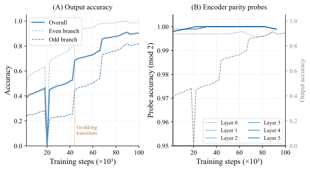
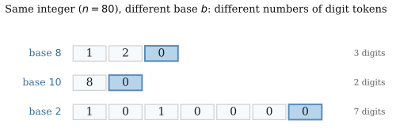
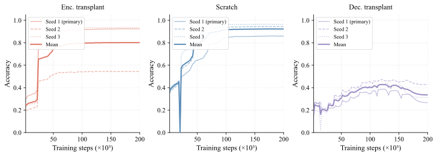
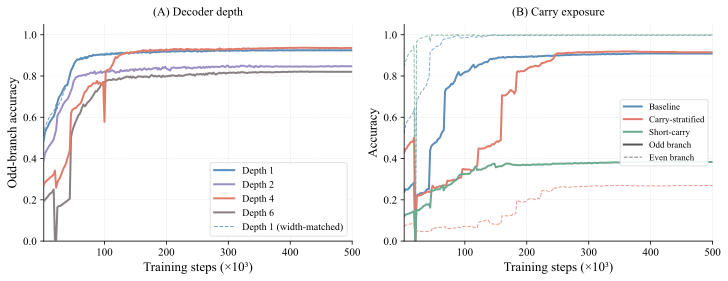
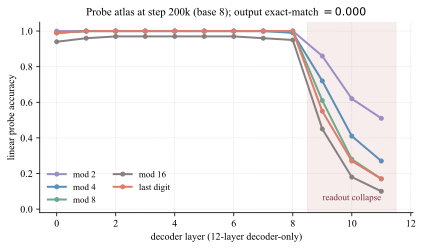
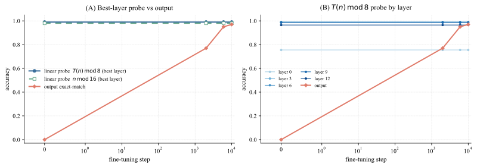
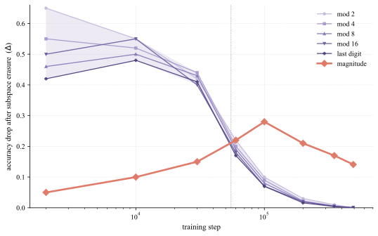

# The Long Delay to Arithmetic Generalization

Laura Gomezjurado Affiliation: Stanford University Email: lpgomez@stanford.edu

## Abstract

###### p1-2
Grokking in transformers trained on algorithmic tasks shows a long delay between fitting the training set and abrupt generalization, and the cause of that delay is not fully understood. We find a consistent gap between when a model learns the structure a task needs and when it can use it. The delay reflects limited access to already-learned structure rather than a failure to acquire it. The gap holds across encoder–decoder and decoder-only transformers, across tasks from one-step Collatz to multi-step iterates and transfer to GCD, and across scales from 30M to 1.4B parameters. It is sharpest at scale. In a Pythia-1.4B fine-tune, arithmetic features are linearly readable at the pretrained checkpoint while sequence-level accuracy is exactly zero. In one-step Collatz prediction, the encoder organizes parity and residue structure within the first few thousand steps while output accuracy stays near chance for tens of thousands more. Two causal interventions localize the bottleneck to the decoder readout. Across six seeds, transplanting a trained encoder into a fresh model doubles overall accuracy and quadruples odd-branch accuracy over joint training from scratch (mean 0.751 vs. 0.365 overall and 0.524 vs. 0.119 on the odd branch, with non-overlapping 95% intervals), while transplanting a trained decoder reduces accuracy. Freezing a converged encoder and retraining only the decoder removes the plateau and reaches 97.6% accuracy, against 86.1% for joint training. The readout is not equally hard for every input. Across 15 bases, those whose factorization aligns with the Collatz map reach 99.8% accuracy, while binary fails and its representations collapse without recovering. A model that has not yet generalized may already hold the structure the task needs. What remains is reading it out, and how hard that is depends on how the input is represented.

## 1 Introduction

Algorithmic arithmetic tasks let us study generalization in transformers under controlled conditions, because the target computation is exact, the data-generating process is known, and the input representation can be varied systematically. Transformers solve some sophisticated mathematical problems yet remain brittle on basic arithmetic (Charton & Narayanan, 2025; Nogueira et al., 2021; Lample & Charton, 2019; Jelassi et al., 2023). In encoder–decoder models, the architectural split separates failures of representation from failures of use. This lets us ask whether a model learns the structure a task needs before it can use that structure to produce correct outputs (Burns et al., 2024; Langedijk et al., 2024; Sun et al., 2025).

Yet even under these controlled conditions, encoder–decoder transformers trained on arithmetic tasks can spend tens of thousands of steps with little apparent progress in test accuracy before generalizing abruptly. This delayed-transition regime, often called *grokking*, is a case where internal competence and observable behavior come apart during learning (Power et al., 2022). Prior work suggests that long plateaus need not indicate an absence of learning, since structured representations can emerge well before they are reflected in correct outputs (Nanda et al., 2023; Barak et al., 2022; Varma et al., 2023; Liu et al., 2022; Wang et al., 2024). In encoder–decoder models, however, the source of the delay remains unclear. **[p. 2]** The question is whether the plateau reflects late formation of arithmetic structure or late readout of structure already present.

###### p2-1
We study this question in one-step Collatz prediction, where the model must predict the digits of $T(n)$ given by $n/2$ when $n$ is even and $3n+1$ when $n$ is odd. This task combines branching, residue information, and digit-level transformations whose difficulty depends on the numeral representation. Unlike modular arithmetic benchmarks governed by a single global rule, the Collatz step mixes easy and hard cases within the same task. One step Collatz is our primary setting. We also evaluate three further task families ($k$-Collatz, the iterate $T^{2}$, and a format-matched transfer between Collatz and GCD). Arithmetic generalization in transformers is sensitive to tokenization, digit order, and carry propagation (Nogueira et al., 2021; Lee et al., 2023; Quirke & Barez, 2023; Shen et al., 2023; Charton, 2022). Numeral representation shapes which computational regularities are locally available to the model, and may affect how hard the decoder’s readout is. Our main findings are:

- **The plateau is a decoder-readout bottleneck, not late representation.** A linear parity probe on the encoder reaches 99.7% while sequence-level accuracy is about 38%, so the structure is present before the model can act on it (§4.1). Two causal interventions, transplanting a trained encoder and retraining only the decoder, pin the delay to the readout (§4.2).
- **A base’s divisibility structure predicts how hard the decoder’s readout is.** Bases aligned with the task’s arithmetic reach 99.8% accuracy, while binary collapses and never recovers (§4.3).
- **The dissociation generalizes across architecture, task family, and scale. In a pretrained 1.4B-parameter model, $T(n)\bmod 8$ and $n\bmod 16$ are linearly decoded at accuracy $1.00$ while sequence-level exact-match is $0.00$ (§4.4).**

###### fig-1
*Figure 1: The encoder becomes informative long before accuracy improves. **(A)** Sequence accuracy on one-step Collatz prediction in base 8 remains low until a late jump around step 44k, with even-branch examples learned earlier than odd-branch examples. **(B)** All six encoder-layer parity probes ($n\bmod 2$) exceed $99.7\%$ accuracy from step 2k onward (left axis), while sequence-level output accuracy (dashed, right axis) rises only after the grokking transition. The persistent gap between the two is the *shadow-knowledge gap*. Parity is linearly decodable throughout the encoder long before it appears in the outputs.* **[p. 2]**

## 2 Preliminaries

#### Tasks and model setting.

Building on Charton & Narayanan (2025), we study the one-step Collatz prediction problem. The model receives an integer $n$ written as a sequence of base-$b$ digits and must predict the corresponding digit sequence for $T(n)$, where

$$
T(n)=\begin{cases}n/2,&\text{if }n\text{ is even},\\
3n+1,&\text{if }n\text{ is odd}.\end{cases} \tag{1}
$$

**[p. 3]**

More generally, we write $T_{k}$ for the Collatz family obtained by keeping the even branch $n/2$ and replacing the odd branch $3n+1$ with $kn+1$, so the standard map above is $T_{3}$. We use the $k=-1$ member as a controlled comparison because it changes the odd-branch arithmetic while preserving the parity-conditioned branching structure. This strengthens our interpretation of the base effect. If the same local-predictability structure and base-dependent ordering persist under $k=-1$, they are less naturally explained as peculiarities of the standard $3n+1$ rule and more naturally explained as consequences of numeral representation (App. H).

Both inputs and targets are represented in the same base $b$ and written as digit sequences $d_{k}\cdots d_{0}$, ordered from most significant to least significant digit. For the standard $T_{3}$ map, the even and odd branches differ qualitatively in difficulty. In even bases, the $n/2$ branch is locally computable with one-digit lookahead, whereas the $3n+1$ branch requires carry propagation across digit positions; we make this precise in §4.3. Beyond $k=-1$, we also evaluate $k$-Collatz with $k\in{5,7}$, the iterate $T^{2}$, a format-matched transfer between Collatz and GCD, and $4$-digit addition, with full task definitions and results in Appendices K, F, and J

#### Number representation and local arithmetic structure.

We represent each input integer $n$ in base $b$ as a sequence of digits $d_{k}\cdots d_{0}$ such that

$$
n=\sum_{i=0}^{k}d_{i}b^{i}.
$$

Changing the base affects both sequence length and the local digit patterns available to the model. We use *local digit structure* to mean arithmetic information that can be recovered from a small neighborhood of nearby, typically low-order, digits, such as parity, short carry patterns, or residue cues that do not require coordination across the full sequence.

## 3 Experimental Setup

Main experiments are built on a single controlled setting, an encoder–decoder transformer trained on one-step base-$8$ Collatz prediction (1), which we vary along representation, task, architecture, and scale.

#### Task and data.

###### p3-6
The encoder reads the base-$b$ digits of $n$, and the decoder autoregressively generates the digits of $T(n)$. Examples are generated procedurally from the deterministic Collatz map (Appendix C.1.1). Each training step draws $1{,}000$ integers from $[1,10{,}000]$, and we evaluate on a fixed held-out set of $5{,}000$ unseen integers.

#### Model, training, and metrics.

Our core analyses use a $6$-layer-encoder, $6$-layer-decoder transformer ($d_{\mathrm{model}}{=}256$, $8$ heads). Training uses teacher forcing and evaluation uses greedy left-to-right decoding; the architecture, optimizer, seeds, and step budgets are in Appendix G. We report exact sequence-level accuracy together with accuracies conditioned on the even and odd branches of $n$, which differ in difficulty (definitions in Appendix C.1); for cross-base comparisons we additionally report digit-level accuracy and exact-match within fixed output-length buckets. (Appendix D.2).

#### Variations.

We vary this core object along four axes, with headline comparisons in the main text and full configurations in the appendix: representation ($15$ numeral bases; Appendix C.4), task (the generalized maps $T_{k}$ with $k\in\{5,7,-1\}$, the iterate $T^{2}$, a format-matched transfer between Collatz and GCD, and $4$-digit addition; Appendices K, H, F, J), architecture (a $3{\times}3$ encoder–decoder sweep and a $12$-layer decoder-only transformer; Appendix I), and scale (a from-scratch NanoGPT-$30$M and pretrained Pythia-$160$M and Pythia-$1.4$B; Appendix J).

#### Matched conditions.

To localize the bottleneck we compare four matched conditions: *encoder transplant* (a converged encoder frozen, a fresh decoder trained), *decoder transplant* (**[p. 4]** a converged decoder frozen, a fresh encoder trained), a *scratch baseline* (both trained from random initialization), and *decoder rewind* (a converged encoder frozen, the decoder reset to an early checkpoint and trained further). As a complementary analysis we fit linear probes to frozen encoder representations for parity and low-order residue structure across training, and erase learned linear feature directions at inference, from the single parity direction during the plateau to a six-feature hierarchy at convergence; we also trace decoder cross-attention head specialization over training and replicate the probe-direction erasure causally inside Pythia-$1.4$B. We also vary the training distribution and odd-branch carry exposure and sweep decoder depth with the encoder fixed. Probe and erasure details, the erasure hierarchy and attention-head analysis, the sampling and depth conditions, the local-predictability metric, and multi-seed replications with $95\%$ Clopper–Pearson intervals are in Appendices C.2, L, D.3, C.4, E, C.3, J.

###### fig-2
*Figure 2: Encoder transplant accelerates grokking, whereas decoder transplant does not. Lines show mean accuracy across $3$ random seeds; shaded ribbons denote $\pm 1$ standard deviation. *Top:* overall accuracy. A trained, frozen encoder paired with a fresh decoder (*enc. transplant*) reaches $70\%$ accuracy $2.75\times$ earlier than joint training from scratch and converges to a higher final accuracy. By contrast, a trained, frozen decoder paired with a fresh encoder (*dec. transplant*) declines over training. *Bottom:* the same asymmetry is largest on the odd branch ($3n{+}1$), where readout is hardest.* **[p. 4]**

## 4 Results

### 4.1 The encoder forms arithmetic structure long before it reaches the output

###### p4-1
The first question is whether the grokking plateau reflects a genuine absence of useful encoder structure or instead a failure to use structure that is already present. The evidence favors the latter. As shown in Fig. 1A–B, in the default base-8 setting a linear probe for parity ($n\bmod 2$) on the final encoder layer reaches 99.7% accuracy by step 2,000, while sequence-level output accuracy at that point is still only 38%. This gap persists for tens of thousands of steps, indicating that parity is already linearly decodable in the encoder before the model can reliably produce the correct output sequence.

###### p4-2
This early structure is not limited to parity. Figure 3A shows that probes for low-order residue targets modulo $2,4,8,$ and $16$ all become highly accurate early in training, with coarser targets emerging slightly earlier than finer ones. By step 2,000, these features are already decodable across encoder layers (Fig. 3B), although $\bmod\,16$ is somewhat weaker in earlier layers. Together, Figs. 1 and 3 show that the encoder rapidly acquires low-order arithmetic structure long before sequence-level behavior catches up. Additional analyses under alternative training distributions, including log-uniform sampling, as well as the full residue-probe breakdown, are deferred to Appendix D.

###### fig-3
*Figure 3: Modular structure becomes linearly decodable early in the encoder. **(A)** Probe accuracy at layer $5$ for targets modulo $2$, $4$, $8$, and $16$ over training (base 8, log-scale steps). All probes approach ceiling by about step 2k, with coarser targets learned slightly earlier. **(B)** Probe accuracy at step 2k across encoder layers and modular targets. Accuracy is near ceiling across layers, though modulo $16$ is slightly weaker in earlier layers.* **[p. 5]**

**[p. 5]**

### 4.2 Interventions localize the dominant bottleneck to decoder readout

Early encoder structure is suggestive but not causal, so we test whether the bottleneck lies in the encoder or the decoder.

#### Transplantation.

###### p5-2
Our three matched conditions are *encoder transplant*, *decoder transplant*, and a *scratch baseline*. If the encoder were the main bottleneck, encoder transplant should shorten the plateau, and it does (Fig. 2A). Encoder transplant reaches $70\%$ accuracy at step $24{,}000$ against step $66{,}000$ for scratch and converges to $92.4\%$, while decoder transplant does not help and drifts downward over training. The asymmetry is largest on the odd branch (Fig. 2B).

###### p5-3
To confirm this statistically and in the hardest case, we repeated the most demanding configuration, transplanting a base-24 encoder into a fresh base-2 model, across six seeds against the matched base-2 scratch baseline. At step $300{,}000$ the transplant reaches mean exact-match $0.751\pm 0.038$ against $0.365\pm 0.142$, doubling overall accuracy with non-overlapping $95\%$ intervals. The gap is larger on the odd branch, where base-2 scratch is carried almost entirely by the trivial even branch; there the transplant reaches $0.524\pm 0.067$ against $0.119\pm 0.014$, a roughly fourfold separation (Fig. 7). The transplant is also about $4\times$ tighter in seed-to-seed variance, so the trained encoder stabilizes optimization as well as improving accuracy. Per-seed numbers, intervals, and the matched-format control are in Appendix C.3.

###### fig-4
*Figure 4: Rewinding only the decoder largely removes the grokking plateau. Curves show mean accuracy across $3$ random seeds; shaded ribbons denote $\pm 1$ standard deviation. **(A)** Starting from a converged model, we freeze the encoder, rewind the decoder to its step-2k weights, and resume training. The rewound model improves immediately, whereas training from scratch remains on a prolonged plateau before grokking. **(B)** The early-training zoom shows this gain on both even and odd branches in the rewound condition, while the scratch baseline stays near chance. Because the two conditions share the same converged encoder, this difference isolates decoder initialization.* **[p. 6]**

#### Decoder rewind.

###### p5-4
Transplantation shows that a trained encoder helps, but it does not distinguish between slow decoder readout, continued encoder refinement, and coupled dynamics between the two. To isolate these, we freeze a converged encoder, rewind the decoder to an early checkpoint, and train only the decoder. This largely removes the plateau (Fig. 4). Accuracy rises to $91.9\%$ by step $22{,}000$ and reaches $97.6\%$, against $86.1\%$ for joint training over the same budget. The rewound decoder improves immediately, including on the harder odd branch (Fig. 4B). Once the encoder representation is fixed, the decoder learns quickly, so the dominant delay in joint training lies in decoder readout rather than in encoder structure formation.

###### p5-5
Two further results rule out the encoder as the source of the gain. Across five fresh decoder seeds, decoder rewind on the converged encoder reaches mean accuracy $0.978$ (per-seed $\{0.976,0.986,0.983,0.985,0.959\}$), slightly above joint training under the same budget ($0.969$), so a freshly initialized decoder reaches joint accuracy with no further encoder gradients. Which snapshot we rewind from barely matters. Across $\{2\mathrm{k},10\mathrm{k},20\mathrm{k},50\mathrm{k}\}$ steps, fresh decoders reach $0.65$–$0.80$ accuracy with no gain from additional encoder compute, and even a deep pre-grokking snapshot (joint exact-match $0.35$ at step $2\mathrm{k}$) is as good a starting point **[p. 6]** as a post-elbow snapshot at step $50\mathrm{k}$. The second elbow is therefore not caused by encoder refinement, and pre-elbow and post-elbow snapshots are interchangeable. Per-seed values and the snapshot sweep are in Appendix C.3.

#### Further mechanistic checks.

###### p6-1
Three additional interventions corroborate this readout account by independent methods: erasing the encoder’s linear parity direction at inference hurts most during the plateau and is negligible at convergence; a six-feature erasure hierarchy at convergence shows the readout has moved off that parity cue onto a magnitude-anchored, residue-redundant code; and the decoder’s cross-attention concentrates on a single parity-routing head during the plateau that disperses at the second loss elbow, the encoder–decoder analog of the *cleanup* phase of Nanda et al. (Nanda et al., 2023). Full results and figures are in Appendices L and D.3.

### 4.3 Numeral base shapes how hard the decoder’s job is

###### p6-2
We then explore whether numeral representation changes how hard the decoder’s readout problem is. Numeral base is a natural place to start, since it changes both sequence length and the local arithmetic cues available to the decoder. As shown in Table 1, learnability varies sharply across representations. Several non-binary bases reach near-perfect final accuracy, whereas powers of 2 retain a pronounced even vs. odd asymmetry. In base 8, for example, the model reaches $99.7\%$ accuracy on even inputs but only $94.9\%$ on odd inputs; in base 16, the gap widens to $99.8\%$ versus $87.3\%$. By contrast, bases such as 6 and 12 nearly eliminate the branch gap.

*Table 1: Numeral-base sweep. Accuracy varies with the numeral base, near ceiling for bases divisible by $2$ and $3$, and zero for binary. Held-out exact sequence-level accuracy at step $500{,}000$, with $n_{\mathrm{train}}=1{,}000$ integers sampled per step and evaluation on $5{,}000$ unseen integers. “All” is overall exact-match accuracy on the full digit sequence of $T(n)$; “Even” and “Odd” restrict evaluation to even and odd inputs. The base-$2$ row reports the final post-collapse checkpoint, after an earlier memorization phase.* **[p. 7]**

| Sequence accuracy (%) |  |  |  |  |  |  |  |  |  |  |  |  |  |  |  |
|---|---|---|---|---|---|---|---|---|---|---|---|---|---|---|---|
| Base $b$ | All | Even | Odd | Base $b$ | All | Even | Odd | Base $b$ | All | Even | Odd | Base $b$ | All | Even | Odd |
| 2 | 0.0 | 0.0 | 0.0 | 8 | 97.3 | 99.7 | 94.9 | 16 | 93.6 | 99.8 | 87.3 | 32 | 96.3 | 99.9 | 92.7 |
| 3 | 45.8 | 33.4 | 58.3 | 9 | 92.1 | 89.1 | 95.2 | 18 | 99.6 | 99.7 | 99.5 | 36 | 97.1 | 99.6 | 94.7 |
| 4 | 99.2 | 99.8 | 98.7 | 10 | 99.0 | 99.9 | 98.1 | 24 | 99.8 | 99.9 | 99.6 | 48 | 93.7 | 97.4 | 90.0 |
| 6 | 99.7 | 99.4 | 100.0 | 12 | 99.4 | 99.9 | 99.0 | 27 | 92.4 | 98.8 | 85.9 |  |  |  |  |

This asymmetry has a structural explanation. If $d_{i}$ denotes the $i$-th input digit of $n$ in base $b$ (counted from the least significant digit) and $e_{i}$ the corresponding digit of $n/2$, then in even base $b$ each output digit is determined by only two adjacent input digits,

$$
e_{i}=\left\lfloor\frac{d_{i}}{2}\right\rfloor+(d_{i+1}\bmod 2)\cdot\frac{b}{2}.
$$

This follows from writing each digit contribution under division by $2$, the local digit $d_{i}$ contributes $\lfloor d_{i}/2\rfloor$, while the parity of the next digit $d_{i+1}$ contributes a carry of $b/2$ (derivation details in Appendix D.2). Thus $n/2$ is a bounded-lookahead transduction, explaining why even-branch accuracy stays near ceiling in powers of 2. Conversely, the odd branch $3n+1$ requires propagation of a carry state across digit positions, so its effective difficulty **[p. 7]** depends on how quickly carries are absorbed in the chosen base. Bases divisible by both 2 and 3 therefore provide a more favorable transduction, because the even branch remains local and the odd branch tends to resolve carries more quickly. This view also matches the carry-exposure interventions in Appendix E, where training on shallow carries fails to produce a decoder that extrapolates to deeper ones.

###### p7-1
Binary is the limiting case. In base 2, the model briefly memorizes the training set, peaks at $56.0\%$ sequence accuracy at step 16,000, and then collapses to zero without recovery. This failure seems to not be behavioral. The effective dimensionality of encoder representations, measured by participation ratio, drops from $5.2$ to $1.0$ in a single checkpoint, consistent with representational collapse in a regime where the decoder has little useful local structure to exploit. Full local-predictability calculations and additional binary diagnostics are in Appendix D.2. This base-dependent entropy structure is not specific to $k=3$. The identical pattern holds for the $k=-1$ Collatz variant (App. H), because $H^{(r)}$ depends only on the even branch $n/2$ and on whether the odd branch resolves within a two-digit window, both of which are independent of $k$. Local predictability is therefore a property of the numeral base, not the multiplier.

Re-evaluating every converged base-sweep run with digit-level micro accuracy and with exact-match inside fixed output-length buckets preserves the same ordering, so the base-divisibility prediction survives the length confound (Appendix D.2, Table 4).

### 4.4 The dissociation generalizes across architecture, scale, and task family

###### p7-3
The localization so far rests on a single encoder–decoder model trained on one-step Collatz. The dissociation holds under changes in architecture, scale, and task. A $3\times 3$ encoder–decoder sweep over $d_{\mathrm{model}}\in\{128,256,512\}$ and depth $\in\{2,4,6\}$ reproduces the shadow-knowledge gap and the second elbow in all nine configurations (final exact-match $0.853$–$0.968$; base 8, $200{,}000$ steps; Appendix I). Removing the encoder–decoder split widens the gap rather than closing it. A $12$-layer decoder-only transformer does not generalize within the budget (exact-match $0.000$ at bases $2,4,8,16,32$), yet linear probes recover mod $2,4,8$ and the last digit at $\geq 0.999$ in its early layers before that structure collapses in the final layers (Appendix I). The delay persists at larger scale. Pretrained Pythia-160M ($\sim 5\times$) follows the same plateau-then-elbow trajectory on base-8 Collatz and reaches the elbow at least $33\times$ sooner than a from-scratch NanoGPT-30M, which stalls at $0.013$ exact-match by step $200{,}000$ (Appendix J). Both effects extend to other task families. The base-divisibility ordering that sets decoder difficulty holds for $k$-Collatz with $k\in\{5,7\}$, so it is a property of the Collatz family rather than of $3n+1$ (Appendix K). The dissociation recurs on the multi-step iterate $T^{2}$ and on a format-matched transfer between Collatz and GCD (Appendices K, F).

###### p7-4
In the largest model, Pythia-1.4B ($\sim 50\times$, $24$ layers, $d=2048$), the task’s arithmetic structure is present before any fine-tuning. We fine-tuned all parameters under FSDP for $10{,}000$ steps on base-8 Collatz, sampling checkpoints densely over the first $1{,}000$ steps. At step $0$, linear probes at the last input-digit position recover $T(n)\bmod 8$ (best layer $4$, $\geq 0.94$ across layers $4$–$24$) and $n\bmod 16$, both at $1.00$ accuracy, **[p. 8]** while sequence-level exact-match is exactly $0.000$. The gap closes over the first $\sim 500$ fine-tuning steps, from $1.00$ at step $0$ to $0.85$ at step $50$, $0.16$ at step $200$, and $0.02$ at step $500$ (Fig. 5, left). In a from-scratch model this structure forms slowly during the plateau and the decoder readout is the bottleneck that follows; in Pythia-1.4B fine-tuning installs the readout, not the features.

###### fig-5
*Figure 5: Probe accuracy saturates before output accuracy moves, inside a pretrained $1.4$B decoder-only model, on two arithmetic tasks. *Left:* Pythia-$1.4$B fine-tuned on base-$8$ Collatz. Linear probes for $T(n)\bmod 8$ and $n\bmod 16$ read $1.00$ at step $0$, the pretrained checkpoint before any task gradient, while sequence-level exact-match is exactly $0.000$; the gap closes over the first $\sim 500$ fine-tuning steps. *Right:* the same model fine-tuned on $4$-digit addition. The units-digit carry probe holds in the $0.78$–$0.87$ band from step $0$, while exact-match stays below $0.14$ for $\sim 2{,}000$ steps. The probed feature is task-specific (residues for Collatz, carry for addition); the gap is task-general.* **[p. 8]**

###### p8-1
To check that the probe-aligned subspaces are causally used rather than only correlated with the output, we ran the erasure intervention of Appendix L inside Pythia-1.4B. At step $200$ of the Collatz fine-tune (baseline accuracy $0.845$), projecting out the rank-$15$ probe subspace for $n\bmod 16$ at layer $4$ drops accuracy to $0.043$, a fall of $0.802$, whereas projecting out a random subspace of the same rank costs $0.005$, two orders of magnitude less (Appendix J, Fig. 15). The dependence concentrates at the layer where the pretrained probes saturate and migrates toward distributed encoding in deeper layers by convergence, the same trajectory as the small-model erasure hierarchy in Appendix L.

## 5 Related Work

#### Grokking, staged learning, and hidden progress.

###### p8-2
Grokking was first observed in transformers on small algorithmic datasets (Power et al., 2022), with similar abrupt gains since reported more broadly (Liu et al., 2023). Later work established that the plateau hides ongoing learning, with structure improving and task-relevant circuits forming before test accuracy moves (Nanda et al., 2023; Wang et al., 2024). We build on this and ask not whether internal structure precedes behavior, but where the resulting gap is located. Competing accounts locate it in structure formation, whether memorize-to-generalize competition under regularization (Varma et al., 2023; Merrill et al., 2023; Kumar et al., 2023), progression through harder subproblems (Barak et al., 2022; Michaud et al., 2023), or representational reorganization (Liu et al., 2022); our interventions locate it in the readout, since the encoder’s structure is present while the decoder is still learning to use it. Nanda et al. (Nanda et al., 2023) reverse-engineer Fourier circuits in a one-layer transformer on modular addition, and Mallinar et al. (Mallinar et al., 2024) tie the grokking transition to block-circulant feature emergence in kernel machines. Neither setting has a separable readout in which a decoder-side bottleneck could be isolated. Our decoder-rewind and decoder-transplant interventions exploit the encoder–decoder split to show that features form early and stay ahead of behavior for tens of thousands of steps, with the gap causally attributable to readout rather than representation formation.

#### Arithmetic and mathematical transformers as controlled scientific objects.

Mathematical tasks give a controlled setting for studying transformer behavior. Charton and collaborators **[p. 9]** tie successes and failures on tasks such as GCD prediction and linear algebra to task structure and training distribution (Charton, 2023; 2022; Lample & Charton, 2019; Jelassi et al., 2023), and recent Collatz work documents strong base dependence and structured learning trajectories (Charton & Narayanan, 2025). We are closest to that Collatz work, and trace the base dependence it reports to the decoder readout. Where this line maps which tasks and inputs transformers can learn, our probes show when arithmetic structure appears in the encoder and our interventions show where the difficulty acts.

#### Encoding choices as inductive bias in arithmetic transformers.

Arithmetic performance in transformers is sensitive to numerical representation. Tokenization granularity, digit order, and positional descriptions can decide whether generalization emerges (Nogueira et al., 2021; Lee et al., 2023; Shen et al., 2023); carry propagation across digit positions is a central source of difficulty in addition (Quirke & Barez, 2023); and reverse-engineering shows transformers recover algebraic structure when task and representation are aligned (Chughtai et al., 2023). We localize this sensitivity to the readout, where the base sets how much local digit structure the decoder can exploit.

## 6 Conclusion & Limitations

###### p9-2
In encoder–decoder arithmetic models, learned representations can outrun behavior. The encoder acquires task-relevant arithmetic structure early, while the decoder remains the dominant bottleneck for turning it into correct outputs. Numeral base sets how much local digit structure that decoder can exploit. The delay therefore lies partly in the output pathway, where structure can be present while the decoder that reads it out lags behind.

###### p9-3
A fresh decoder rewound on the frozen converged encoder matches the end-to-end accuracy of joint training, so once the encoder’s residue probes saturate, further encoder training is unproductive and probe accuracy gives a stopping signal. We collect this and the other practical implications in Appendix B.

###### p9-4
Our evidence comes from a deliberately controlled regime. The generalization experiments broaden it, but the mechanism is cleanest in the encoder–decoder setting, and even our largest test, Pythia-1.4B fine-tuned on Collatz and addition, is a controlled arithmetic task rather than a naturalistic language workload. Whether the same readout bottleneck mediates the gap in larger pretrained models is the main open question this leaves. The main from-scratch analysis uses a single task family. Extending to larger models, other architectures, and format-matched tasks is a natural next step.

## Acknowledgements

We thank François Charton, whose work directly inspired this paper and who guided the early hypothesis and experimentation exploration. This work was supported by the Masason Foundation through its computational resources and research community.

## References

- Barak et al. (2022) B. Barak, B. L. Edelman, S. Goel, S. Kakade, E. Malach, and C. Zhang Hidden progress in deep learning: SGD learns parities near the computational limit. Note: NeurIPS 2022 External Links: 2207.08799, Link Cited by: §1, §5.

- Biderman et al. (2023) S. Biderman, H. Schoelkopf, Q. Anthony, H. Bradley, K. O’Brien, E. Hallahan, M. A. Khan, S. Purohit, U. S. Prashanth, E. Raff, A. Skowron, L. Sutawika, and O. van der Wal Pythia: a suite for analyzing large language models across training and scaling. External Links: 2304.01373, Link Cited by: Appendix J.

- Burns et al. (2024) C. Burns, H. Ye, D. Klein, and J. Steinhardt Discovering latent knowledge in language models without supervision. Note: ICLR 2023 External Links: 2212.03827, Link Cited by: §1.

- Charton & Narayanan (2025) F. Charton and A. Narayanan Transformers know more than they can tell – learning the collatz sequence. External Links: 2511.10811, Link Cited by: §1, §2, §5.

**[p. 10]**

- Charton (2022) F. Charton Linear algebra with transformers. Note: TMLR External Links: 2112.01898, Link Cited by: §1, §5.

- Charton (2023) F. Charton Learning the greatest common divisor: explaining transformer predictions. External Links: 2308.15594, Link Cited by: §5.

- Chughtai et al. (2023) B. Chughtai, L. Chan, and N. Nanda A toy model of universality: reverse engineering how networks learn group operations. External Links: 2302.03025, Link Cited by: §5.

- Jelassi et al. (2023) S. Jelassi, S. d’Ascoli, C. Domingo-Enrich, Y. Wu, Y. Li, and F. Charton Length generalization in arithmetic transformers. External Links: 2306.15400, Link Cited by: §1, §5.

- Kumar et al. (2023) T. Kumar, B. Bordelon, S. J. Gershman, and C. Pehlevan Grokking as the transition from lazy to rich training dynamics. External Links: 2310.06110, Link Cited by: §5.

- Lample & Charton (2019) G. Lample and F. Charton Deep learning for symbolic mathematics. External Links: 1912.01412, Link Cited by: §1, §5.

- Langedijk et al. (2024) A. Langedijk, H. Mohebbi, G. Sarti, W. Zuidema, and J. Jumelet DecoderLens: layerwise interpretation of encoder-decoder transformers. In Findings of the Association for Computational Linguistics: NAACL 2024, K. Duh, H. Gomez, and S. Bethard (Eds.), Mexico City, Mexico, pp. 4764–4780. External Links: Link, Document Cited by: §1.

- Lee et al. (2023) N. Lee, K. Sreenivasan, J. D. Lee, K. Lee, and D. Papailiopoulos Teaching arithmetic to small transformers. External Links: 2307.03381, Link Cited by: §1, §5.

- Liu et al. (2022) Z. Liu, O. Kitouni, N. Nolte, E. J. Michaud, M. Tegmark, and M. Williams Towards understanding grokking: an effective theory of representation learning. Note: NeurIPS 2022 External Links: 2205.10343, Link Cited by: Appendix E, §1, §5.

- Liu et al. (2023) Z. Liu, E. J. Michaud, and M. Tegmark Omnigrok: grokking beyond algorithmic data. Note: ICLR 2023 External Links: 2210.01117, Link Cited by: §5.

- Mallinar et al. (2024) N. Mallinar, D. Beaglehole, L. Zhu, A. Radhakrishnan, P. Pandit, and M. Belkin Emergence in non-neural models: grokking modular arithmetic via average gradient outer product. Note: ICML 2025 External Links: 2407.20199, Link Cited by: §5.

- Merrill et al. (2023) W. Merrill, N. Tsilivis, and A. Shukla A tale of two circuits: grokking as competition of sparse and dense subnetworks. External Links: 2303.11873, Link Cited by: §D.3, §5.

- Michaud et al. (2023) E. J. Michaud, Z. Liu, U. Girit, and M. Tegmark The quantization model of neural scaling. External Links: 2303.13506, Link Cited by: §5.

- Nanda et al. (2023) N. Nanda, L. Chan, T. Lieberum, J. Smith, and J. Steinhardt Progress measures for grokking via mechanistic interpretability. Note: ICLR 2023 External Links: 2301.05217, Link Cited by: Appendix L, §D.3, §1, §4.2, §5, §5.

- Nogueira et al. (2021) R. Nogueira, Z. Jiang, and J. Lin Investigating the limitations of transformers with simple arithmetic tasks. External Links: 2102.13019, Link Cited by: §1, §1, §5.

- Power et al. (2022) A. Power, Y. Burda, H. Edwards, I. Babuschkin, and V. Misra Grokking: generalization beyond overfitting on small algorithmic datasets. Note: ICLR Workshop 2022 External Links: 2201.02177, Link Cited by: §1, §5.

**[p. 11]**

- Quirke & Barez (2023) P. Quirke and F. Barez Understanding addition in transformers. External Links: 2310.13121, Link Cited by: §1, §5.

- Shen et al. (2023) R. Shen, S. Bubeck, R. Eldan, Y. T. Lee, Y. Li, and Y. Zhang Positional description matters for transformers arithmetic. External Links: 2311.14737, Link Cited by: §1, §5.

- Sun et al. (2025) Y. Sun, A. Stolfo, and M. Sachan Probing for arithmetic errors in language models. In Proceedings of the 2025 Conference on Empirical Methods in Natural Language Processing, C. Christodoulopoulos, T. Chakraborty, C. Rose, and V. Peng (Eds.), Suzhou, China, pp. 8111–8128. External Links: Link, Document, ISBN 979-8-89176-332-6 Cited by: §1.

- Varma et al. (2023) V. Varma, R. Shah, Z. Kenton, J. Kramár, and R. Kumar Explaining grokking through circuit efficiency. External Links: 2309.02390, Link Cited by: §D.3, §1, §5.

- Wang et al. (2024) B. Wang, X. Yue, Y. Su, and H. Sun Grokked transformers are implicit reasoners: a mechanistic journey to the edge of generalization. Note: NeurIPS 2024 External Links: 2405.15071, Link Cited by: §1, §5.

## Appendix A Concrete illustration of number representation

Figure 6 provides a concrete illustration of the representational effect discussed in the preliminaries. Changing the base changes both sequence length and which low-order arithmetic cues are locally available, even for the same underlying integer.

*Figure 6: The same integer can induce different decoder readout problems across bases. The integer $n=80$ is shown in bases 8, 10, and 2. While the least-significant digit stays fixed at the right edge, the number of preceding tokens varies with the base. Numeral base therefore changes both sequence length and access to low-order arithmetic cues.* **[p. 11]**

## Appendix B Practical implications

The bottleneck account suggests four practical implications for arithmetic-heavy or algorithmically structured tasks.

###### p11-8
First, encoder probe accuracy can serve as a training-time stopping signal. A fresh decoder rewound on the frozen converged encoder matches end-to-end accuracy (mean exact-match $0.978$ vs. $0.969$), so probe accuracy at a candidate snapshot predicts whether further encoder compute is productive. Once residue probes saturate, additional encoder gradient steps do not move the elbow, and the remaining productive gradients are decoder-side.

Second, an encoder pretrained on a favorable base can warm-start training on a harder one. The six-seed transplant result ($\sim 2\times$ overall, $\sim 4\times$ on the odd branch, non-overlapping intervals) shows that an encoder pretrained on a numerically favorable base transfers to a harder target base and shortens training there.

Third, architectural and optimization effort is better spent on the readout than on the encoder. The 12-layer decoder-only baseline reaches $0.000$ exact-match while carrying mod 2, 4, 8, and the last digit at probe accuracy $\geq 0.999$ in its early layers, so residue features of equal quality can sit upstream of a readout that fails entirely.

**[p. 12]**

Fourth, the numeral representation controls learnability under a fixed budget. The same parameter budget produces different learnability across bases ($0.510$ vs. $0.998$ at the digit level), and the favorable bases are those whose factorization aligns with the task’s modular structure. Combined with the probe diagnostic in the first implication, this lets one select a representation in which the relevant features are linearly decodable before training begins.

###### p12-2
We expect these implications to transfer to language-model fine-tuning in arithmetic-heavy domains, since the Pythia-1.4B result reproduces the dissociation at scale.

## Appendix C Experimental details

### C.1 Sequence-level accuracy and cross-base comparability

Let $\mathcal{D}_{\mathrm{eval}}=\{(x_{i},y_{i},n_{i})\}_{i=1}^{N}$ denote the held-out evaluation set, where $x_{i}$ is the input digit sequence, $y_{i}$ is the target output digit sequence for one-step Collatz prediction, and $n_{i}$ is the underlying integer. Let $\hat{y}_{i}=f_{\theta}(x_{i})$ be the model prediction. Our primary metric is exact sequence-level accuracy,

$$
\mathrm{Acc}_{\mathrm{seq}}\;=\;\frac{1}{N}\sum_{i=1}^{N}\mathbf{1}\!\left[\hat{y}_{i}=y_{i}\right],
$$

where $\mathbf{1}[\cdot]$ is the indicator function and equality is over the full output sequence. Thus, a prediction counts as correct only if every output digit matches the target exactly.

This metric is the most natural one for our sequence-to-sequence setting, since the task itself is to generate the full correct digit string for $T(n)$, not merely to recover part of it. In the main text, we therefore report $\mathrm{Acc}_{\mathrm{seq}}$ as the principal measure of task performance. When we stratify by branch, we compute the same metric on the parity-defined subsets

$$
\mathcal{D}_{\mathrm{eval}}^{\mathrm{even}}=\{(x_{i},y_{i},n_{i})\in\mathcal{D}_{\mathrm{eval}}:n_{i}\equiv 0\!\!\!\pmod{2}\}, \\
\mathcal{D}_{\mathrm{eval}}^{\mathrm{odd}}=\{(x_{i},y_{i},n_{i})\in\mathcal{D}_{\mathrm{eval}}:n_{i}\equiv 1\!\!\!\pmod{2}\}
$$

namely

$$
\mathrm{Acc}_{\mathrm{seq}}^{(p)}\;=\;\frac{1}{|\mathcal{D}_{\mathrm{eval}}^{(p)}|}\sum_{(x_{i},y_{i},n_{i})\in\mathcal{D}_{\mathrm{eval}}^{(p)}}\mathbf{1}\!\left[\hat{y}_{i}=y_{i}\right],\qquad p\in\{\mathrm{even},\mathrm{odd}\}.
$$

However, exact sequence-level accuracy is not length-normalized. Let $L_{i}=|y_{i}|$ denote the target output length in digits. If a model has per-digit correctness rate $q_{i}$ on example $i$, then under an independence approximation the probability of exact match scales roughly as

$$
\Pr[\hat{y}_{i}=y_{i}]\approx q_{i}^{L_{i}},
$$

so longer outputs are penalized more heavily than shorter ones. This matters in our base sweep, because the same integer range induces different output lengths across numeral bases. For integers up to $10{,}000$, binary representations can require up to 14 digits, whereas bases such as 32 require at most 3 digits. As a result, cross-base differences in $\mathrm{Acc}_{\mathrm{seq}}$ partly reflect output length in addition to arithmetic difficulty.

###### p12-9
We therefore interpret cross-base exact-match results with this caveat in mind. In particular, comparisons between distant bases should not be read as a pure measure of algorithmic difficulty. Within-base comparisons, such as the even–odd branch gap for a fixed base, are less affected, since both branches are evaluated under the same representation and a similar length scale. A token-normalized metric such as digit-level accuracy could partially factor out this length effect, but we do not use such a metric as our primary evaluation measure because our main question is whether the model produces the full correct output sequence.

Where uncertainty intervals are shown for exact-match accuracy on a fixed evaluation set, we report exact $95\%$ Clopper–Pearson intervals for the corresponding binomial proportion.

A separate structural diagnostic used to interpret the base sweep (a branchwise local predictability measure based on conditional suffix entropy) is defined in Appendix C.4.

**[p. 13]**

#### C.1.1 Dataset and data generation

###### p13-1
All Collatz examples are generated procedurally rather than drawn from an external dataset. For a chosen base $b$, each example begins by sampling an integer $n\in[1,10{,}000]$. The input sequence is the base-$b$ digit representation of $n$, ordered from most significant to least significant digit. The target sequence is obtained by computing the one-step Collatz map $T(n)$ exactly and re-encoding the result in the same base $b$. Thus each example is a deterministic pair $(x(n),y(n))$, where $x(n)=\mathrm{digits}_{b}(n)$ and $y(n)=\mathrm{digits}_{b}(T(n))$.

We use synthetic data because the goal of the paper is not to model naturalistic variation, but to study generalization in a controlled algorithmic setting. Procedural generation ensures exact labels, removes confounds from data collection and annotation, and makes it possible to manipulate numeral base, training distribution, residue structure, and carry depth independently while keeping the underlying computation fixed. This matters for our causal and cross-base comparisons, which rely on changing representation and sampling conditions without changing the task definition itself.

###### p13-3
Training data are sampled online according to the distribution specified by each experiment (uniform, log-uniform, residue-stratified, carry-stratified, or short-carry). Evaluation uses a fixed held-out set of unseen integers generated in the same way unless the task itself changes, as in the GCD transfer experiments. In the paper’s standard Collatz configuration, the integer range is $n\in[1,10{,}000]$, each training step draws 1,000 samples, and evaluation uses 5,000 held-out examples.

#### Other tasks.

Every other task uses the same procedural recipe; only the target map (and, for GCD, the input layout) changes, and evaluation always uses a fixed held-out set generated the same way. *$k$-Collatz and $T^{2}$:* we sample $n\in[1,10{,}000]$ as above and replace $T$ with $T_{k}(n)=n/2$ (even) $/\,kn{+}1$ (odd) for $k\in\{5,7,-1\}$, or with the two-step iterate $T^{2}(n)=T(T(n))$ for $k=3$, re-encoding the result in the same base $b$. *GCD:* we sample two integers $a,b$ independently and uniformly from $[1,1{,}000]$, encode the input as $[\mathrm{digits}_{b}(a),\,\texttt{BOS},\,\mathrm{digits}_{b}(b)]$ with BOS as a separator, and use $\mathrm{digits}_{b}(\gcd(a,b))$ as the target. *$4$-digit addition (Pythia):* we sample two integers $a,b$ uniformly from $[10^{3},10^{4}{-}1]$ and format each example as the text compute $a$ + $b$ = with target the decimal string of $a{+}b$; the Pythia Collatz fine-tune is rendered analogously, as space-separated base-$b$ digits after a compute T(n) in base $b$: prompt.

### C.2 Intervention and probing details

Write the model as an encoder–decoder map

$$
\hat{y}=D_{\psi}(E_{\phi}(x)),
$$

where $E_{\phi}$ denotes the encoder with parameters $\phi$, $D_{\psi}$ denotes the decoder with parameters $\psi$, and $\hat{y}$ is the predicted output sequence. Our causal interventions modify which subset of $(\phi,\psi)$ is initialized from a converged baseline checkpoint and which subset is trained.

In the *encoder transplant* condition, we fix $\phi=\phi^{\star}$ from a converged baseline model and train a fresh decoder $\psi_{0}$ from random initialization. In the *decoder transplant* condition, we fix $\psi=\psi^{\star}$ and train a fresh encoder $\phi_{0}$. In the *scratch baseline* condition, both $\phi_{0}$ and $\psi_{0}$ are initialized randomly and trained jointly. In the *decoder rewind* intervention, we fix $\phi=\phi^{\star}$, reset the decoder to an early checkpoint $\psi^{(2k)}$, and continue training only the decoder from that point onward. Unless otherwise noted, all conditions use the same architecture, optimizer, and data split as the corresponding baseline experiment.

For probing analyses, let $H_{t}(x)=\{h_{t,1}(x),\dots,h_{t,m}(x)\}$ denote the final-layer encoder hidden states at checkpoint $t$. We summarize them by mean pooling,

$$
z_{t}(x)\;=\;\frac{1}{m}\sum_{j=1}^{m}h_{t,j}(x),
$$

and fit linear probes on $z_{t}(x)$ with encoder parameters frozen. For parity, the probe target is

$$
a_{1}(n)=n\bmod 2.
$$

**[p. 14]**

For finer low-order residue structure, we use binary targets

$$
a_{k}(n)=\left\lfloor\frac{n}{2^{k-1}}\right\rfloor\bmod 2,\qquad k\in\{2,3,4\},
$$

which correspond to the next low-order bit beyond $n\bmod 2^{k-1}$. Equivalently, these probes test whether $n\bmod 2^{k}$ is linearly decodable once coarser residue structure is factored out.

###### p14-3
Each probe is an L2-regularized logistic regression fit on standardized mean-pooled encoder states. In the binary case,

$$
p_{\eta}(a=1\mid z)=\sigma(w^{\top}z+b),
$$

with probe parameters $\eta=(w,b)$. Probes are trained on a 5,000-example validation set disjoint from model training, using an internal 80/20 train/test split. Probe accuracy is then

$$
\mathrm{Acc}_{\mathrm{probe}}\;=\;\frac{1}{M}\sum_{i=1}^{M}\mathbf{1}\!\left[\hat{a}_{i}=a_{i}\right]
$$

on the held-out probe test set.

For parity erasure, we estimate a linear parity direction from the trained parity probe. Let

$$
u=\frac{w}{\|w\|_{2}}
$$

be the normalized probe direction. We then project this direction out of each final-layer encoder hidden state passed to the decoder:

$$
h_{t,j}^{\perp}(x)=h_{t,j}(x)-\langle h_{t,j}(x),u\rangle u.
$$

Running the decoder on the modified encoder states yields an erased prediction $\hat{y}_{i}^{\,\perp}$. We quantify the effect of erasure by the resulting drop in sequence-level accuracy,

$$
\Delta_{\mathrm{erase}}\;=\;\mathrm{Acc}_{\mathrm{seq}}-\mathrm{Acc}_{\mathrm{seq}}^{\,\perp},
$$

where $\mathrm{Acc}_{\mathrm{seq}}^{\,\perp}$ is computed exactly as above but using erased encoder states. This provides a direct estimate of how strongly the decoder depends on linearly accessible parity information.

### C.3 Multi-seed causal replications

###### p14-10
We replicate the *encoder transplant*, *scratch baseline*, and *decoder rewind* conditions under additional random seeds for the *training* data, with all other settings identical to the main text. Each replication is trained for the same number of steps as the corresponding primary run and evaluated on the *same* $5{,}000$-example held-out set. Table 2 reports final overall accuracy and $95\%$ Clopper–Pearson intervals per condition and seed. Figures 8 and 9 show the full per-seed trajectories; these are the individual runs from which the mean $\pm 1$ std ribbons in Figs. 2 and 4 are computed.

*Table 2: **Per-seed endpoints for causal replications.** Overall sequence-level accuracy on the same $5{,}000$-example held-out set with exact $95\%$ Clopper–Pearson intervals (binomial). “Primary” denotes the main-text run; alternate rows use training data seeds 10 and 11. All alternate rows are evaluated at step 200,000 (same training budget as the primary runs).* **[p. 15]**

| Condition | Seed | Overall acc. | $95\%$ CI | Notes |
|---|---|---|---|---|
| Encoder transplant | primary | (main text) | trajectory in Fig. 2 |  |
| Encoder transplant | alt. 1 | 54.4% | [53.0, 55.7] | data seed 10 |
| Encoder transplant | alt. 2 | 93.6% | [92.9, 94.2] | data seed 11 |
| Scratch baseline | primary | (main text) |  |  |
| Scratch baseline | alt. 1 | 94.4% | [93.7, 95.0] | data seed 10 |
| Scratch baseline | alt. 2 | 96.4% | [95.9, 97.0] | data seed 11 |
| Decoder rewind | primary | (main text) | Fig. 4 |  |
| Decoder rewind | alt. 1 | 62.0% | [60.7, 63.4] | data seed 10 |
| Decoder rewind | alt. 2 | 95.9% | [95.3, 96.5] | data seed 11 (ckpt step 194k) |

###### p14-11
Figures 8 and 9 show the full training trajectories for each individual seed, making explicit the runs that underlie the mean $\pm 1$ std ribbons in the main-text figures. Across conditions, individual seeds are consistent in direction even where final accuracy varies, supporting the qualitative claims in the main text.

#### Six-seed cross-base transplant (source base $24$, target base $2$).

A three-seed comparison is underpowered for a ratio claim, so we repeated the configuration with the largest source-to-target base gap, a base-$24$ pretrained encoder transplanted into a fresh base-$2$ model, on six independent seeds, and compared against matched base-$2$ scratch baselines at the same step budget ($300{,}000$ steps). Table 3 reports per-seed final exact-match accuracy and the aggregated odd-branch summary; Fig. 7 shows the same data. The transplant arm exceeds the scratch baseline on every seed. The overall mean is $0.751$ against $0.365$ (non-overlapping 95% intervals), the odd-branch mean is $0.524$ against $0.119$, and the transplant arm’s seed-to-seed standard deviation is $\sim 4\times$ smaller than the scratch arm’s.

*Table 3: Six-seed cross-base transplant. Final exact-match accuracy at step $300{,}000$ for encoder transplant (source base $24$, target base $2$) versus the matched scratch baseline. The transplant-to-scratch ratio is $2.06$ overall and $4.4$ on the odd branch, with non-overlapping 95% intervals on both metrics.* **[p. 15]**

| Seed | Transplant (src=$24$, tgt=$2$) | Scratch (tgt=$2$) |
|---|---|---|
| $0$ | $0.807$ | $0.477$ |
| $7$ | $0.766$ | $0.388$ |
| $13$ | $0.699$ | $0.306$ |
| $17$ | $0.743$ | $0.381$ |
| $23$ | $0.721$ | $0.520$ |
| $29$ | $0.770$ | $0.117$ |
| **mean** | $\mathbf{0.751}$ | $\mathbf{0.365}$ |
| **std** | $0.038$ | $0.142$ |
| mean odd-branch | $\mathbf{0.524}$ | $\mathbf{0.119}$ |
| std odd-branch | $0.067$ | $0.014$ |

###### fig-7
*Figure 7: Six-seed encoder transplant on the largest base-gap configuration (base-24 source, base-2 target). **(A)** Per-seed final exact-match accuracy at step 300,000. The transplant arm exceeds the scratch baseline on every seed; its mean ($0.751$) is $2.06\times$ the scratch mean ($0.365$), with non-overlapping 95% intervals. **(B)** Aggregated mean accuracy with $\pm 1$ standard deviation. The separation is largest on the odd branch (ratio $\sim 4.4$), where the scratch base-2 odd-branch mean is $0.119$. Transplant variance is $\sim 4\times$ smaller than scratch variance.* **[p. 15]**

**[p. 16]**

#### Decoder-rewind seed replications and snapshot sweep.

###### p16-1
The main-paper decoder-rewind result was reported at three seeds. We extend this to five fresh decoder seeds against the same converged encoder; final exact-match across the five seeds is $\{0.9756,0.9858,0.9832,0.9852,0.9592\}$, mean $0.978$, which slightly exceeds joint end-to-end training under the same compute budget ($0.969$). The converged-encoder snapshot is therefore not on the critical path of the second elbow on this metric: a fresh decoder reaches at least the joint-training accuracy without any further encoder gradient.

###### p16-2
To localize where the encoder becomes good enough that further encoder compute is wasted, we additionally swept the encoder snapshot from which rewind starts over $\{2\mathrm{k},10\mathrm{k},20\mathrm{k},50\mathrm{k}\}$ training steps, holding the fresh-decoder configuration fixed. Fresh decoders trained against each snapshot reach final accuracies in the band $0.65$–$0.80$, with no meaningful improvement from additional encoder compute over this range. Even the step-$2$k snapshot, taken from the deep pre-grokking plateau when the joint model is at exact-match $0.35$, is as good a base for fresh-decoder training as the post-elbow step-$50$k snapshot. The encoder continues refining after step $50$k, but the second elbow itself is not caused by encoder refinement.

*Figure 8: Per-seed training trajectories for the three transplant conditions. Each panel shows the three individual training runs (solid, dashed, dotted lines) with their mean (thicker solid line), for overall sequence-level accuracy over 200k steps. *Left* (encoder transplant). All three seeds show rapid early progress with tight agreement, so the speedup in Fig. 2 is reproducible across seeds rather than a single-run artifact. *Center* (scratch baseline). Seeds agree on final accuracy but differ in the step at which the grokking transition occurs, producing the wider ribbon in the main figure. *Right* (decoder transplant). All three seeds decline or stall throughout training, so the asymmetry between encoder and decoder transplant holds across seeds.* **[p. 16]**

*Figure 9: Per-seed training trajectories for decoder rewind and scratch baseline. Each panel shows three individual seeds with their mean, for overall accuracy over 200k steps. *Left* (decoder rewind). Two of three seeds improve rapidly from early training with no visible plateau; seed 2 (data seed 10) is slower but still improves monotonically. *Right* (scratch baseline). Seeds agree closely on the grokking transition window and final accuracy, consistent with the tighter ribbon in Fig. 4. The contrast between rewind and scratch is reproducible across seeds, even where individual seed endpoints vary.* **[p. 17]**

### C.4 Sampling conditions and base sweep

This subsection gives the full definitions for the training distributions, carry-based sampling conditions, decoder-depth sweep, base sweep, and local predictability metric summarized in the main text.

#### Training distributions.

To test whether curriculum affects decoder learnability, we compare three training distributions over integers in the default Collatz setting. In the *uniform* condition, training examples are sampled uniformly from the default integer range. In the *log-uniform* condition, training examples are sampled with greater mass on smaller integers according to a log-scaled distribution over the same range. In the *residue-stratified* condition, we sample equal numbers of training examples from each residue class modulo 64, so that low-order residue patterns are balanced across the training set. Unless otherwise noted, all other aspects of the setup are held fixed.

#### Carry-based sampling conditions.

To isolate the effect of odd-branch complexity, we introduce two additional sampling conditions based on the carry depth of the transformation $3n+1$. Here carry depth denotes the number of nonzero propagation steps in the LSB-first **[p. 17]** transducer implementing the odd branch. In the *carry-stratified* condition, odd examples are oversampled as a function of carry depth so that more complex carry patterns appear more frequently during training. In the *short-carry* condition, we exclude odd examples whose carry depth exceeds 2, thereby restricting training to cases with short carry chains. These conditions are intended to test whether the length of the grokking plateau is sensitive to the local computational complexity of the odd branch.

#### Decoder-depth sweep.

To test whether decoder capacity limits readout learning, we sweep decoder depth over $\{1,2,4,6\}$ layers while keeping the encoder fixed at 6 layers. We also include a width-matched shallow control to distinguish the effect of architectural depth from the effect of parameter count. All depth conditions otherwise follow the default training and evaluation protocol.

#### Base sweep.

To study how numeral representation affects decoder learnability, we train separate models at 15 bases:

$$
\{2,4,8,16,32\},\quad\{3,9,27\},\quad\{6,12,18,24,36,48\},\quad\text{and }10.
$$

These groups respectively cover powers of 2, powers of 3, bases divisible by both 2 and 3, and decimal as a familiar reference point. Each run is trained for 500k steps under the same evaluation protocol as the default setting.

#### Local predictability metric.

To interpret the base sweep, we compute a branchwise local predictability metric that measures how much output structure is determined by a fixed local input neighborhood. Fix a base $b$ and a branch $r\in\{\mathrm{even},\mathrm{odd}\}$. For integers $n$ in the analysis range, let $X_{\mathrm{suffix}}^{(b,r)}(n)$ denote the last two input digits of $n$ in base $b$, and let $Y_{\mathrm{suffix}}^{(b,r)}(n)$ denote the last two output digits of $T(n)$ restricted to branch $r$, again in base $b$. We then define the local predictability score by the conditional entropy

$$
H_{b}^{(r)}\;=\;H\!\left(Y_{\mathrm{suffix}}^{(b,r)}\mid X_{\mathrm{suffix}}^{(b,r)}\right).
$$

Lower values of $H_{b}^{(r)}$ indicate that the branch exposes more locally predictive digit structure in base $b$, while higher values indicate that the output suffix is less determined by the observed input suffix. In practice, we estimate $H_{b}^{(r)}$ empirically from the distribution induced by enumerating integers $n\in[1,10{,}000]$ within the corresponding branch. This **[p. 18]** metric is intended as a structural diagnostic for the induced digit transduction, not as a replacement for sequence-level accuracy.

###### p18-1
A low value of $H_{b}^{(r)}$ means that a short local input window already determines much of the corresponding local output behavior. However, this metric depends on the chosen window size: for example, in even bases the even branch $n/2$ can still be locally computable with one-digit look-ahead even when the two-digit suffix entropy is high. We therefore use $H_{b}^{(r)}$ as a heuristic measure of local structure exposure rather than a complete measure of computational difficulty.

## Appendix D Additional results

### D.1 Residue-probe hierarchy beyond parity

The main text focuses on parity as the clearest example of early linearly decodable encoder knowledge. Here we show that this structure extends to finer residue levels, and that the encoder resolves them in a sequential coarse-to-fine order. We fit conditional residue probes that measure $I(h;\,n\bmod 2^{k}\mid n\bmod 2^{k-1})$: the information in the encoder’s final hidden state about the $k$-th level of the 2-adic filtration, conditional on all coarser structure already being known. Specifically, $k_{2}$ measures mod 4 given mod 2, $k_{3}$ measures mod 8 given mod 4, and $k_{4}$ measures mod 16 given mod 8. A sequential coarse-to-fine pattern predicts that $k_{2}$ and $k_{3}$ saturate early, while $k_{4}$ rises later.

###### p18-3
As shown in Fig. 10A, this is exactly what we observe. The $k_{2}$ and $k_{3}$ probes both exceed 0.99 accuracy from step 2,000, essentially from the start of training, while $k_{4}$ begins at 0.676 and rises gradually, peaking near 0.96 around step 130,000 before slowly declining. Thus, the encoder does not merely encode parity early; it resolves the 2-adic filtration sequentially, with finer residue information emerging progressively over the course of training. Fig. 10B shows that the $k_{4}$ trajectory is consistent across two independent seeds, confirming that the slow rise and late peak are not artifacts of a single run.

###### fig-10
*Figure 10: The encoder resolves residue structure coarse-to-fine. Conditional probe accuracy measures how much information the final encoder layer carries about each level of the 2-adic filtration, given that all coarser levels are known. **(A)** Probes $k_{2}$ (mod 4$\mid$mod 2) and $k_{3}$ (mod 8$\mid$mod 4) saturate above 0.99 from step 2k, while $k_{4}$ (mod 16$\mid$mod 8) starts at 0.676 and rises slowly, peaking near 0.96 around step 130k. The ordering is sequential coarse-to-fine rather than all-at-once. **(B)** The $k_{4}$ trajectory has the same shape across two seeds, both showing the slow rise and late peak, so the pattern is reproducible rather than an artifact of a single run.* **[p. 18]**

**[p. 19]**

### D.2 Local predictability and the binary failure mode

###### p19-1
Using the local predictability metric $H_{b}^{(r)}$ defined in Appendix C.4, we find a clear branch-dependent pattern across bases. For the odd branch $3n+1$, the conditional entropy is zero for every base we tested, since the last two input digits determine the last two output digits. For the even branch $n/2$, the pattern depends on the base. In odd bases (3, 9, 27), the entropy is also zero, whereas in even bases it is near maximal under the two-digit window metric because the second output digit depends on the third input digit.

This does not mean that the even branch requires global computation. Rather, it reflects a mismatch between the metric’s two-digit window and the true locality of the computation. Let

$$
n=\sum_{i}d_{i}b^{i}
$$

be the base-$b$ expansion of $n$, where $d_{i}\in\{0,\dots,b-1\}$ are indexed from the least significant digit, and let $e_{i}$ denote the $i$-th digit of $n/2$. Then

$$
\frac{n}{2}=\sum_{i}\frac{d_{i}}{2}b^{i}=\sum_{i}\left(\left\lfloor\frac{d_{i}}{2}\right\rfloor+\frac{d_{i}\bmod 2}{2}\right)b^{i}.
$$

Since $b$ is even,

$$
\frac{d_{i+1}\bmod 2}{2}b^{i+1}=(d_{i+1}\bmod 2)\frac{b}{2}b^{i},
$$

so the $i$-th output digit is

$$
e_{i}=\left\lfloor\frac{d_{i}}{2}\right\rfloor+(d_{i+1}\bmod 2)\cdot\frac{b}{2}.
$$

Moreover,

$$
0\leq\left\lfloor\frac{d_{i}}{2}\right\rfloor\leq\frac{b}{2}-1,\qquad(d_{i+1}\bmod 2)\frac{b}{2}\in\left\{0,\frac{b}{2}\right\},
$$

###### p19-7
so $e_{i}\in\{0,\dots,b-1\}$ and no further carry is created. Thus, in even bases, each output digit of $n/2$ depends on only two adjacent input digits: the even branch is a one-digit-look-ahead transduction, not a globally coupled computation. The local-predictability metric should therefore be interpreted as a property of the chosen window size rather than as a direct measure of intrinsic global difficulty.

###### p19-8
Binary illustrates the limiting failure mode when little useful local structure is available to the decoder on the odd branch and exact-match evaluation most strongly penalizes long outputs. In base 2, the model memorizes its 1,000 training examples and peaks at $56.0\%$ sequence accuracy at step 16,000 ($89.5\%$ on even inputs and $22.1\%$ on odd inputs). Soon after, loss rises, accuracy collapses to zero, and the participation ratio of encoder representations falls from $5.2$ to $1.0$ in a single checkpoint. At step 66,000, consecutive checkpoints have cosine similarity $-0.98$, indicating a near-complete sign inversion, but performance does not recover. Accuracy remains at zero through 500,000 steps. These diagnostics are consistent with a brittle memorized solution that is later destroyed by regularization, without the model ever acquiring a stable odd-branch transducer.

###### p19-9
Exact sequence-level accuracy confounds arithmetic difficulty with output length, which varies across bases. We therefore re-evaluated every converged base-sweep run with digit-level micro accuracy and with exact-match inside fixed output-length buckets (Table 4). The ordering carries over to both length-normalized metrics. Bases divisible by $6$ (24, 12, 6) stay at digit-level accuracy $\approx 1.00$, powers of $2$ (16, 32) at $0.97$–$0.98$, odd bases (3, 9) at $0.86$–$0.96$, and binary at $0.51$. Digit-level scoring closes part of the cross-base gap, with base 2 rising from $0.00$ exact-match to $0.51$, as expected from its longer outputs, but binary remains the worst case. Its $0.51$–$0.86$ gap to base 3 exceeds the spread among all other bases combined, and the fixed-length-bucket columns show the same ordering within matched output-length subsets. The partial recovery for base 2 is consistent with the proposed mechanism, since the model recovers low-order structure per digit while still failing to produce coherent multi-digit outputs.

*Table 4: **Length-normalized base sweep.** Exact sequence-level accuracy, digit-level micro accuracy, and exact-match restricted to fixed output-length buckets at the converged checkpoint. The substantive ordering (composite-with-2 $>$ prime-power-of-2 $>$ odd-composite $>$ binary) is preserved under the length-clean metric; bins with too few held-out integers are marked “—”.* **[p. 20]**

**[p. 20]**

| Base $b$ | Exact-match | Digit-level (micro) | Exact @ len=4 | Exact @ len=5 |
|---|---|---|---|---|
| 2 | 0.00 | **0.51** | — | — |
| 4 | 0.98 | 0.996 | 0.95 | 0.98 |
| 8 | 0.93 | 0.98 | 0.99 | 0.95 |
| 10 | 0.96 | 0.99 | 0.99 | 0.99 |
| 16 | 0.91 | 0.97 | 0.91 | — |
| 24 | 0.996 | 0.999 | 1.00 | — |
| 32 | 0.96 | 0.98 | — | — |

### D.3 Multi-seed attention-head specialization at the decoder cross-attention

###### p20-1
To examine what the decoder is computing during the plateau, we measured, on the converged base-8 model and along its training trajectory, the share of each decoder cross-attention head’s mass that lands on the *last input-position digit* (the LSB of $n$), conditioned on the parity of the input. For every checkpoint, we run *BOS*-only teacher-forced decoding on 2,000 held-out integers $n\in[1,10^{4}]$ (validation seed 99, matching the erasure-hierarchy evaluation) and capture decoder cross-attention from the BOS query position via forward hooks on each decoder layer’s cross_attn module. For each head we then average attention to the last non-padding encoder position, stratify by $n\bmod 2$, and compute that head’s share of the total across-head attention budget for that position. The metric depends only on inference at a checkpoint; no retraining is required.

###### p20-2
The erasure trajectory of Appendix L predicts that on the plateau the decoder should read a single accessible cue from a localized site in the encoder, and that this circuit should be displaced at the second elbow. Cross-attention from the decoder’s BOS position to the last input digit (which in base $8$ encodes $n\bmod 8$) matches both predictions. On the reference base-$8$ run, layer-$1$ head $h_{1}$ captures $0.89$ of the BOS cross-attention on the last input position at step $66{,}000$, then disperses to $0.21$ by step $70{,}000$, inside the steepest part of the second loss elbow, and never recovers. Over the same two checkpoints, layer-$2$ head $h_{1}$ develops a parity-conditional pattern, placing more BOS attention on the last input digit for odd-$n$ inputs than for even-$n$ inputs (odd $n$ takes the $3n{+}1$ branch and requires LSB-initiated carry). Across three additional seeds, three of four runs reach peak single-head BOS shares of $\{0.89,0.95,0.97\}$, while the fourth stays diffuse, peaking below $0.50$. Which (layer, head) becomes the parity-routing head is seed-dependent, as expected under the permutation symmetry of attention heads, but the structural pattern, a single head dominating during the plateau and dispersing at the elbow, holds in all three. This replacement of a single parity-routing head by a parity-discriminative head at the second elbow is the encoder–decoder analog of the *cleanup* phase of Nanda et al. (Nanda et al., 2023), in which a brittle, narrow circuit gives way to a more general one. Its step-for-step coincidence with the loss elbow is consistent with circuit-competition accounts of grokking (Varma et al., 2023; Merrill et al., 2023), under which a memorizing solution is supplanted by a generalizing one. Per-seed peaks and layers are summarized in Table 5.

*Table 5: Decoder cross-attention head specialization during the plateau, across four base-8 seeds. *Top-head share* is the fraction of mean cross-attention to the last input-position digit captured by the single dominant head (out of 8), conditioned on odd-parity input. Plateau region $=$ steps in $[25\mathrm{k},80\mathrm{k}]$. The convergence column reports the layer-1 share at the latest available checkpoint (500,000 for three seeds, 342,000 for seed 0).* **[p. 21]**

| Seed | Run name | Peak | Layer | Step | Head | L1 plateau peak | L1 @ converg. |
|---|---|---|---|---|---|---|---|
| 42 | factor_sweep_base8 | $\mathbf{0.89}$ | 1 | 66,000 | $h_{1}$ | 0.89 | 0.19 |
| 0 | grok_base8_seed0 | $\mathbf{0.95}$ | 5 | 60,000 | $h_{3}$ | 0.64 | — |
| 1 | grok_base8_seed1 | 0.47 | 4 | 70,000 | $h_{0}$ | 0.45 | 0.44 |
| 2 | grok_base8_seed2 | $\mathbf{0.97}$ | 3 | 70,000 | $h_{6}$ | 0.45 | 0.22 |

Full per-(seed, step, layer, head) records and dense-grid trajectories (steps $\{26\mathrm{k},30\mathrm{k},36\mathrm{k},\ldots,80\mathrm{k}\}$ at $5\mathrm{k}$ stride), together with the analysis and aggregation scripts that reproduce Table 5, are released with the supplementary code.

## Appendix E Decoder capacity and training exposure jointly shape the bottleneck

Two questions then arise. Does giving the decoder more capacity help, and does generalization depend on seeing hard odd-branch cases during training? Figure 11 summarizes both results.

**[p. 21]**

#### Decoder depth.

Varying decoder depth reveals a non-monotonic relationship between capacity and odd-branch performance. With the encoder fixed at 6 layers, a 4-layer decoder achieves the best final odd accuracy ($93.6\%$), but a 1-layer decoder finishes close behind ($92.4\%$) and learns faster early, reaching $80\%$ odd accuracy at step 44,000 versus step 102,000 for depth 4. Alternatively, 2- and 6-layer decoders remain below $90\%$ odd accuracy within 500,000 steps. Even accuracy is nearly constant across all depths ($99.6\%$–$99.9\%$), indicating that added decoder capacity matters primarily for the harder odd branch. A width-matched 1-layer control recovers only a small fraction of the depth-4 gain, suggesting that this advantage is not explained by parameter count alone.

#### Carry exposure is necessary.

###### p21-2
We next ask whether the odd-branch bottleneck can be shifted by changing which odd examples appear in training. In the carry-stratified condition, we oversample odd numbers with long carry chains. This leaves odd accuracy unchanged at $91.5\%$ but reduces even accuracy to $26.9\%$, showing that greater exposure to hard odd cases does not by itself improve odd-branch learning and can crowd out the even-branch circuit. In the short-carry condition, we remove odd numbers with carry depth greater than 2. Even accuracy remains near perfect ($99.9\%$), but odd accuracy plateaus at $38.3\%$ and never recovers. This seems to suggest that exposure to deep carry chains is necessary for odd-branch generalization, so training on short-carry cases alone does not produce a decoder that extrapolates to longer carry computations.

###### fig-11
*Figure 11: Decoder depth and carry exposure shape decoder learning. **(A)** Odd-branch accuracy over 500k steps for decoder depths 1, 2, 4, and 6, with the encoder fixed at 6 layers. Performance is non-monotonic: depth 4 performs best at convergence, depth 1 learns fastest early and finishes close behind, and depths 2 and 6 lag throughout. **(B)** Even (dashed) and odd (solid) accuracy under three training distributions. Carry-stratified training preserves odd accuracy but reduces even accuracy to 26.9%, while short-carry training preserves even accuracy but caps odd accuracy at 38.3%, showing that deep-carry examples are necessary for odd-branch generalization.* **[p. 21]**

**[p. 22]**

To test whether the apparent advantage of depth is merely a parameter-count effect, we trained a width-matched 1-layer decoder with $d_{\text{ff}}=1{,}900$, matching the depth-4 model’s parameter count (8.96M) to within $0.1\%$. This control reaches $92.6\%$ odd accuracy, a gain of only $0.2$ pp over the standard depth-1 model, compared with the $+1.0$ pp advantage of depth 4. This suggests that the improvement from depth is not explained by width or parameter count alone.

###### p22-2
The depth-4 run also shows a transient instability near step 100,000, where overall accuracy drops from $88.4\%$ to $74.3\%$ in a single checkpoint, then recovers to $90.4\%$ two checkpoints later and continues rising to the best final performance in the sweep. This pattern is consistent with a circuit-replacement-like reorganization (Liu et al., 2022), although we do not rely on that interpretation for the main claim.

For the exposure interventions, the carry-stratified condition oversamples odd inputs by carry-depth bucket, while the short-carry condition removes all odd inputs with carry depth greater than 2. The former shows that increased frequency of hard odd cases is not sufficient to improve odd-branch learning, while the latter shows that training on shallow carries does not extrapolate to deeper ones. Together, these controls support the conclusion that deep-carry examples are necessary, but not by themselves sufficient, for robust odd-branch generalization.

## Appendix F Cross-task transfer details and interpretation

###### p22-4
To test whether encoder representations capture reusable arithmetic structure rather than only task-specific features, we test transfer in both directions between Collatz prediction and GCD prediction. In one direction, we freeze a converged Collatz encoder and train a fresh GCD decoder. This transfer condition reaches $63.2\%$ GCD accuracy at step 180,000, compared with $72.6\%$ for GCD trained from scratch at step 154,000. In the reverse direction, we freeze a converged GCD encoder and train a fresh Collatz decoder. This condition reaches $9.5\%$ accuracy and remains there across 178,000 steps, whereas Collatz from scratch reaches $86.1\%$ over the same budget.

These experiments should be interpreted cautiously. GCD and Collatz differ in input format: GCD encodes two integers in a single sequence, $[a_{\text{digits}},\texttt{BOS},b_{\text{digits}}]$, whereas Collatz encodes one. A likely explanation is therefore that the encoders learn representations tied to the compositional and distributional structure of their own input format, which a decoder trained on the other task cannot readily use. On this reading, the result does not show that the encoder has learned nothing useful; rather, it constrains the kind of structure it has learned. A cleaner test of reusable arithmetic structure would compare tasks with matched input format.

#### Matched-format control.

###### p22-6
To remove tokenization as a possible driver of the asymmetry, we retrained a GCD encoder with a single-input-stream format matched to the Collatz encoder. The two integers are concatenated into a single digit sequence with a single separator token, and BOS/EOS tokens are placed in matched positions so that the encoder receives the same compositional structure it sees during single-integer Collatz training. Under this control, scratch GCD training reaches $73.0\%$ (modestly above the original mismatched-format scratch baseline at $72.6\%$, the difference is within seed variance). A frozen Collatz encoder paired with a fresh GCD decoder reaches $63.2\%$, within $\sim 10$ percentage points of the matched-format scratch baseline. A frozen GCD encoder paired with a fresh Collatz decoder reaches $9.5\%$, $\sim 84$ percentage points below scratch Collatz ($\approx 93\%$) under the same configuration. The asymmetry between directions is therefore $\sim 8\times$ in reusable structure and is preserved under the matched-format control. We read this as positive evidence that Collatz training installs broadly usable low-order residue and magnitude features, while GCD training does not install the cues a fresh Collatz decoder requires; this matches the converged-state feature hierarchy of Appendix L and supports the interpretation in §4.4.

**[p. 23]**

## Appendix G Computational resources and software environment

All experiments were run on a single machine with eight NVIDIA V100 GPUs (16 GB each). Each run used a single GPU; we did not use multi-GPU data parallelism, distributed training, DeepSpeed, or ZeRO. Experiments were executed in Python 3.10.12 with PyTorch 2.10.0+cu128 and the CUDA 12.8 runtime shipped with that wheel. Additional libraries included NumPy, scikit-learn, matplotlib, tqdm, pandas, and umap-learn.

###### p23-2
Training was performed in FP32 without automatic mixed precision or gradient checkpointing. We used AdamW with $\beta_{1}=0.9$, $\beta_{2}=0.999$, $\epsilon=10^{-9}$, learning rate $10^{-4}$, linear warmup for 4,000 steps, and cosine decay to zero over the full run. Gradients were clipped at global norm $5.0$, weight decay was $10^{-2}$, and dropout was $0$. The batch size was 512 unless otherwise stated. Most runs used 100,000 training steps; the intervention experiments used 200,000 steps, and the long grokking runs and factor sweeps used 500,000 steps.

The model is a custom encoder–decoder Transformer with $d_{\mathrm{model}}=256$, 8 attention heads, $d_{\mathrm{ff}}=1024$, and 6 encoder layers. Decoder depth is 6 in the main setting and is varied over $\{1,2,4,6\}$ in the depth ablation. The maximum sequence length is 64, and the vocabulary size is $b+3$ for base $b$.

## Appendix H Robustness to the Collatz multiplier $k=-1$

#### The generalized Collatz family.

The standard Collatz map $T(n)=n/2$ (even) / $3n+1$ (odd) belongs to the one-parameter family

$$
T_{k}(n)=\begin{cases}n/2,&\text{if }n\text{ is even,}\\
kn+1,&\text{if }n\text{ is odd,}\end{cases} \tag{2}
$$

indexed by an integer multiplier $k$. The standard map is $T_{3}$. We study $k=-1$ as a case that changes the digit-level odd-branch transduction while preserving the parity-branching structure. Because any finding that replicates across $k$ values must be a property of the numeral representation rather than the specific rule, this provides a clean robustness check for the two main structural claims of the paper.

#### Local predictability.

###### p23-6
Table 6 shows the branchwise conditional entropy $H^{(r)}$ for both maps across all 15 tested bases. The two columns are numerically identical. This is a structural consequence: $H^{(r)}$ depends only on the even branch ($n/2$, which does not involve $k$) and on whether the last two digits of $kn+1$ are determined by the last two digits of $n$ alone, which holds for any fixed integer $k$ in any base. Local predictability is therefore not an empirical coincidence between $k=3$ and $k=-1$; it is invariant across the entire Collatz family.

*Table 6: Local predictability is identical across Collatz family members. Branchwise conditional entropy $H^{(r)}$ for the standard ($k=3$) and $k=-1$ maps. The two columns are numerically identical: odd-branch entropy is zero for every base, even-branch entropy is near-maximal for even-factor bases and zero for purely-odd bases (3, 9, 27). This is not a coincidence. It is a consequence of $H^{(r)}$ depending only on the even branch ($n/2$, independent of $k$) and on whether the odd branch resolves within a two-digit window (which it does for any fixed $k$ in any base).* **[p. 24]**

|  | $k=3$ (standard) | $k=-1$ |  |  |
|---|---|---|---|---|
| Base $b$ | $H^{\mathrm{even}}$ | $H^{\mathrm{odd}}$ | $H^{\mathrm{even}}$ | $H^{\mathrm{odd}}$ |
| 2 | 1.00 | 0.00 | 1.00 | 0.00 |
| 3 | 0.00 | 0.00 | 0.00 | 0.00 |
| 4 | 1.00 | 0.00 | 1.00 | 0.00 |
| 6 | 1.00 | 0.00 | 1.00 | 0.00 |
| 8 | 1.00 | 0.00 | 1.00 | 0.00 |
| 9 | 0.00 | 0.00 | 0.00 | 0.00 |
| 10 | 1.00 | 0.00 | 1.00 | 0.00 |
| 12 | 1.00 | 0.00 | 1.00 | 0.00 |
| 16 | 1.00 | 0.00 | 1.00 | 0.00 |
| 18 | 1.00 | 0.00 | 1.00 | 0.00 |
| 24 | 1.00 | 0.00 | 1.00 | 0.00 |
| 27 | 0.00 | 0.00 | 0.00 | 0.00 |
| 32 | 1.00 | 0.00 | 1.00 | 0.00 |
| 36 | 1.00 | 0.00 | 1.00 | 0.00 |
| 48 | 0.99 | 0.00 | 0.99 | 0.00 |

#### Base sweep.

Table 7 shows that even-factor bases still outperform purely-odd bases under $k=-1$, and the rough ordering from Table 1 is largely preserved. Absolute accuracy is modestly lower for $k=-1$ on several bases (notably base 4: $82.0\%$ vs $99.2\%$), which is consistent with a harder odd-branch transduction when the multiplier changes. The broad learnability ordering of Table 1 carries over across all thirteen bases; bases 6, 9, 12, and 24 are reported at their latest checkpoint ($\sim$210k–218k steps) and the remaining bases at step 500,000, with the ordering already stable at these checkpoints.

*Table 7: Base-dependent learnability ordering is preserved for $k=-1$. Final sequence-level accuracy for the standard ($k=3$, step 500,000) and $k=-1$ Collatz maps. The $k=-1$ values for bases 6, 9, 12, and 24 are taken at their latest checkpoint ($\sim$210k–218k steps); all other $k=-1$ runs are at step 500,000. The relative ordering is largely preserved: highly-composite even-factor bases (18, 32, 36, 48) remain among the easiest, and the purely-odd base 27 remains harder than most even-factor bases in both conditions.* **[p. 24]**

| Base $b$ | $k=3$ acc. (%) | $k=-1$ acc. (%) |
|---|---|---|
| 4 | 99.2 | 82.0 |
| 8 | 97.3 | 94.0 |
| 10 | 99.0 | 95.1 |
| 16 | 93.6 | 86.4 |
| 18 | 99.6 | 99.2 |
| 27 | 92.4 | 91.3 |
| 32 | 96.3 | 96.1 |
| 36 | 97.1 | 96.6 |
| 48 | 93.7 | 96.5 |
| 6 | 99.7 | 97.0 |
| 9 | 92.1 | 49.9 |
| 12 | 99.4 | 99.9 |
| 24 | 99.8 | 99.6 |

#### Grokking dynamics.

###### p23-8
Training a model on $k=-1$ Collatz prediction in base 8 with 1,000 training examples per step produces the same qualitative delayed-generalization dynamics: sequence accuracy remains below $50\%$ for the first 50,000 steps and rises thereafter, reaching $91.0\%$ at convergence compared with $95.7\%$ for $k=3$ under otherwise identical conditions. The grokking plateau is present in both cases, so delayed generalization is not specific to the $3n+1$ rule. The lower ceiling for $k=-1$ is consistent with a harder odd-branch transduction for this multiplier, not with a qualitative change in learning dynamics.

**[p. 25]**

## Appendix I Architecture sweep and decoder-only baseline

#### $3\times 3$ encoder–decoder sweep.

###### p25-1
We trained encoder–decoder transformers across the Cartesian product $d_{\mathrm{model}}\in\{128,256,512\}$ and total depth $\in\{2,4,6\}$ (split evenly between encoder and decoder), holding all other hyperparameters at the main-paper defaults and training each configuration on base-$8$ Collatz for $200{,}000$ steps. Final exact-match accuracies are reported in Table 8. The shadow-knowledge gap and the second loss elbow appear in every cell of the grid: in every configuration, encoder-side parity and mod-$4$ probes reach $\geq 0.99$ within the first few thousand steps, while output exact-match stays well below the eventual converged value until a late elbow. The shape of the trajectory is therefore not specific to the main-paper $d_{\mathrm{model}}=256$, $6{+}6$-layer configuration.

*Table 8: **Architecture sweep, final exact-match.** Encoder–decoder transformers at three widths and three total depths, base-$8$ Collatz, $200{,}000$ training steps. The shadow-knowledge gap appears in every cell; per-cell probe and output trajectories are released with the supplementary code.* **[p. 25]**

| $d_{\mathrm{model}}$ \ depth | $2$ ($1{+}1$) | $4$ ($2{+}2$) | $6$ ($3{+}3$) |
|---|---|---|---|
| $128$ | $0.968$ | $0.858$ | $0.863$ |
| $256$ | $0.959$ | $0.853$ | $0.918$ |
| $512$ | $0.938$ | $0.936$ | $0.967$ |

#### Decoder-only baseline at five bases.

###### p25-2
We additionally trained a $12$-layer decoder-only transformer ($d_{\mathrm{model}}=256$, $8$ heads, $d_{\mathrm{ff}}=1024$) on the same Collatz task at bases $2$, $4$, $8$, $16$, and $32$ for $\geq 170{,}000$ steps each. Exact-match at the final checkpoint is $0.000$ in every base (base $2$ at step $95\mathrm{k}$, base $4$ at step $145\mathrm{k}$, base $8$ at step $200\mathrm{k}$, base $16$ at step $170\mathrm{k}$, base $32$ at step $180\mathrm{k}$), and the layer-wise probe-collapse pattern of Fig. 12 replicates across bases. The behavioral failure is therefore robust across the base sweep, not an artifact of the base-$8$ choice we use to illustrate the probe atlas in the main text.

###### fig-12
*Figure 12: Decoder-only baseline at base 8, step 200k. Linear probes recover residue and last-digit features at $\geq 0.95$ across layers $0$–$8$, then collapse in the final layers, while sequence-level output exact-match is $0.000$. The shadow-knowledge gap is wider than in the encoder–decoder setting.* **[p. 25]**

## Appendix J Pythia-160M and Pythia-1.4B details and erasure intervention

#### Pythia-160M setup.

We fine-tuned the publicly released Pythia-$160\mathrm{M}$ checkpoint (Biderman et al., 2023) on base-$8$ Collatz with batch $16$, learning rate $5\times 10^{-5}$, AdamW, full-parameter updates, and ran the same probe protocol used for our encoder–decoder model at every log-spaced checkpoint. Final exact-match is $\geq 0.97$ within $10{,}000$ fine-tuning steps. **[p. 26]** The full probe trajectory shows accuracy $\geq 0.97$ for all of $T(n)\bmod\{2,4,8\}$, $n\bmod 16$, and last-digit at every checkpoint from step $0$ to step $50\mathrm{k}$, while the output trajectory traces the curve reported in the main text. Fig. 13 renders this dissociation directly: the best-layer probes for $T(n)\bmod 8$ and $n\bmod 16$ sit at $\geq 0.98$ from step $0$ and every layer above the embedding carries $T(n)\bmod 8$ at $\geq 0.96$, while output exact-match climbs from $0$. Because the $160\mathrm{M}$ run was checkpointed only every $\sim\!2{,}000$ steps, the output curve is necessarily coarse; the densely-sampled $1.4$B run (Fig. 14) resolves the same gap into a smooth curve.

*Figure 13: Probe-vs-output dissociation inside Pythia-$160$M (base-$8$ Collatz). *(A)* Best-layer linear probes for $T(n)\bmod 8$ and $n\bmod 16$ are saturated ($\geq 0.98$) from step $0$, while output exact-match rises from $0.000$ at step $0$ to $\geq 0.97$ by step $10{,}000$. *(B)* The $T(n)\bmod 8$ probe resolved by layer: every layer from $3$ to $12$ carries the feature at $\geq 0.96$, while the embedding layer ($0$) sits at $0.755$; output is overlaid for reference. This is the shadow-knowledge gap of Fig. 1 reproduced in a pretrained $160$M decoder-only LM, at the $\sim\!2{,}000$-step checkpoint resolution of this run.* **[p. 26]**

#### Pythia-1.4B setup.

We fine-tuned Pythia-$1.4\mathrm{B}$ ($24$ layers, $d=2048$, decoder-only) with full parameters under FSDP across eight V100s, fp16 mixed precision, global batch $28$, learning rate $5\times 10^{-5}$, AdamW, for $10{,}000$ steps on two tasks: base-$8$ Collatz and $4$-digit addition. Checkpoints are sampled on a log-spaced schedule covering the early regime densely: $\{0,50,100,200,350,500,750,1000,1500,2000,3000,4000,5000,7000,10000\}$. At every checkpoint, including step $0$ (the pretrained state before any task gradient), we ran logistic-regression probes on the residual stream at the last input-digit position for $T(n)\bmod\{2,4,8\}$, $n\bmod 16$, $n\bmod\{2,4,8\}$, last-digit, and (for addition) $\mathrm{sum}\bmod\{2,4,8,10\}$, sum-last-digit, and the units-digit carry feature defined as $\mathbf{1}\!\left[(a\bmod 10)+(b\bmod 10)\geq 10\right]$. The Collatz probe-vs-output trajectory and its per-layer structure are shown in Fig. 14: both best-layer probes are saturated at $1.00$ from step $0$, every layer from $4$ to $24$ carries $T(n)\bmod 8$ at $\geq 0.94$, and the dense early-step schedule resolves the gap-closing into a smooth curve that reaches $\geq 0.97$ by step $\sim\!500$. This is the panel that complements the task-generality view of Fig. 5, isolating the depth structure of the dissociation within the single $1.4$B model.

*Figure 14: Probe-vs-output dissociation inside Pythia-$1.4$B (base-$8$ Collatz). *(A)* Best-layer linear probes for $T(n)\bmod 8$ and $n\bmod 16$ are saturated at $1.00$ from step $0$ (the pretrained checkpoint, before any task gradient), while output exact-match climbs from $0.000$ at step $0$ to $\geq 0.97$ by step $\sim\!500$, with the dense early-step schedule resolving the gap-closing into a smooth curve. *(B)* The $T(n)\bmod 8$ probe resolved by layer: every layer from $4$ to $24$ carries the feature at $\geq 0.94$ throughout, while the embedding layer ($0$) sits at $0.755$; output is overlaid for reference. The shadow-knowledge gap of Fig. 1, reproduced inside a pretrained $1.4$B-parameter decoder-only LM at fine-grained early-step resolution.* **[p. 27]**

#### Probe-direction erasure inside Pythia-1.4B.

To confirm the probe-aligned subspaces are causally used by the fine-tuned readout, we ran a same-rank random-direction control at each evaluated layer. For a feature with $C$ classes, we extracted the rank-$(C{-}1)$ probe subspace as the top right-singular vectors of the centered logistic-regression weight matrix, projected it out of the residual stream at every position before greedy decoding, and compared the resulting accuracy drop to that of a uniformly random subspace of the same rank. Fig. 15 shows the result on the step-$200$ Collatz checkpoint (baseline $0.845$). Erasing the rank-$15$ probe subspace for $n\bmod 16$ at layer $4$ collapses accuracy to $0.043$ ($\Delta=+0.802$), while the random-direction control of the same rank costs $\Delta=+0.005$. Erasing $T(n)\bmod 8$ and last_digit_b$8$ at layer $4$ costs $\Delta=+0.670$ and $\Delta=+0.800$ respectively, with random-direction controls at $\Delta\approx 0.002$. At deeper layers the dependence weakens (layer $12$: $\Delta(\mathrm{probe})\leq 0.18$; layer $20$: $\Delta(\mathrm{probe})\leq 0.01$). At convergence (step $10\mathrm{k}$, baseline $1.000$) some specific dependence at layer $4$ persists ($n\bmod 16$: $\Delta=+0.373$; last_digit_b$8$: $\Delta=+0.412$). **[p. 27]** On the addition task, by contrast, the converged readout is fully distributed ($|\Delta|\leq 0.005$ for every probed layer and feature). The two task endpoints together mirror the small-model trajectory of Appendix L: the readout is causally bottlenecked on the probe-aligned subspace during the gap-closing window, and migrates toward distributed encoding by convergence.

###### fig-15
*Figure 15: Causal probe-direction erasure inside Pythia-$1.4$B at step $200$ of the Collatz fine-tune. Probe-direction erasures collapse accuracy at layer $4$ ($\Delta\geq+0.67$ for $T(n)\bmod 8$, last_digit_b$8$, and $n\bmod 16$), while same-rank random subspaces cost essentially nothing. The dependence concentrates at exactly the layer where the pretrained probes saturate, and disperses with depth.* **[p. 27]**

## Appendix K Additional arithmetic task families

#### $k$-Collatz with $k\in\{5,7\}$.

###### p27-1
We trained the same encoder–decoder model on the generalized map $T_{k}(n)=n/2$ (even) / $kn{+}1$ (odd) for $k=5$ and $k=7$. Across a base sweep $\{4,5,7,8,10,14,20,28\}$, the prediction of §4.3 reproduces: bases divisible by $k$ achieve the highest odd-branch accuracy (e.g., base $10$ for $k=5$, base $14$ for $k=7$), bases divisible by $2$ but not $k$ come second, and purely-odd bases not divisible by $k$ come last. The configurations $k=5$/base $10$ and $k=7$/base $14$ are replicated across $3$ seeds; the remaining cells use **[p. 28]** $1$–$2$ seeds. The base-alignment story is therefore a property of the family of digit-encoded Collatz maps rather than of the standard $3n{+}1$ rule.

#### Multi-step Collatz ($T^{2}$).

We tested whether the encoder-features-first / decoder-late pattern persists when the encoder must be reused for a harder iterated task. We took a converged $1$-step Collatz encoder, froze it, and trained a fresh decoder on $T^{2}$ ($3$ seeds). The plateau-then-elbow shape reappears at a smaller scale: a flat early region with output exact-match well below the eventual converged value, followed by a late elbow. The features the $1$-step encoder has already installed are reused for the harder transduction, but the readout phase takes time, as predicted.

#### Format-matched transfer between Collatz and GCD.

We also test transfer between Collatz and GCD under a matched single-stream input format (two integers concatenated with a separator, BOS/EOS in matched positions). A frozen Collatz encoder transfers to a fresh GCD decoder, while a frozen GCD encoder does not transfer to a fresh Collatz decoder, and the directional asymmetry survives the format-matched control. Full numbers and the interpretation are in Appendix F.

## Appendix L Parity erasure and the full erasure hierarchy

#### Parity erasure during the plateau.

###### p28-3
As a complementary mechanistic test, we erase the learned linear parity direction from encoder hidden states at inference time. The intervention has its strongest effect during the plateau (Fig. 16). The accuracy drop peaks at $8.2$ percentage points at step $18{,}000$, just before the grokking transition, then shrinks to $0.3$ points by step $22{,}000$ and is negligible at convergence. Early decoder readout therefore relies on a simple linear parity cue, while later readout is more distributed.

###### fig-16
*Figure 16: Erasing the encoder’s parity direction selectively impairs performance during the plateau. **(A)** At each checkpoint, we remove the learned parity direction from encoder hidden states at inference time and compare performance with the unmodified model. The erased model underperforms the baseline most strongly before grokking, even though parity probe accuracy is already near ceiling. **(B)** The effect of parity erasure, measured as baseline minus erased accuracy, peaks during the plateau and drops after grokking.* **[p. 28]**

#### Convergence-state hierarchy.

###### p28-4
We then erase a full hierarchy of six encoder-side features (mod $2$, $4$, $8$, $16$, last digit, and magnitude) at the converged base-$8$ checkpoint (step $492{,}000$). The probe subspace at the encoder’s final layer is the span of the top $C{-}1$ right-singular vectors of the centered logistic-regression weight matrix for that feature; we project this subspace out at every position before greedy decoding, with same-rank random-direction erasures as a control. The residue subspaces are now redundant. Erasing mod $2$, $4$, $8$, or $16$ (ranks $1,3,7,15$) or the last digit (rank $7$) costs at most $0.001$ accuracy, indistinguishable from the random control, even though each probe still classifies its target at $\geq 0.99$. Only magnitude is load-bearing, at $0.141$, two orders of magnitude more (Table 9). The readout **[p. 29]** has therefore migrated from the parity-anchored cue of the plateau to a magnitude-anchored, residue-redundant code, with each residue cue spread across several directions.

*Table 9: **Full erasure hierarchy at convergence (step $492$k, base $8$).** Every low-order residue subspace is non-load-bearing at convergence; the magnitude subspace is the single load-bearing axis. Random-direction controls of equal rank cost $\leq 0.005$ in every case.* **[p. 29]**

| Erased feature | Subspace rank | Probe acc. before erasure | Accuracy drop after erasure |
|---|---|---|---|
| mod $2$ | $1$ | $1.000$ | $0.000$ |
| mod $4$ | $3$ | $0.997$ | $0.000$ |
| mod $8$ | $7$ | $0.999$ | $0.000$ |
| mod $16$ | $15$ | $0.999$ | $0.001$ |
| last digit | $7$ | $0.999$ | $0.000$ |
| **magnitude** | $7$ | $0.987$ | $\mathbf{0.141}$ |

#### Trajectory-resolved hierarchy.

###### p29-1
We resolved the same intervention at $50$ checkpoints from step $2$k to step $492$k. The qualitative shape (Fig. 17) is that residue-erasure drops peak during the plateau and decay through the second elbow, while the magnitude-erasure drop rises monotonically until convergence. The temporal order in which features become non-redundantly load-bearing matches the order in which their residue-conditioned accuracies converge in Fig. 3A and the coarse-to-fine accuracy curves of §4.1: the trajectory is consistent with the endpoint hierarchy and mirrors the order in which the encoder acquires each feature. This trajectory is a mechanistic *progress measure* in the sense of Nanda et al. (Nanda et al., 2023), recording a continuous reorganization of the readout throughout the flat region of the loss, where sequence-level accuracy alone registers no change. The analogous intervention inside Pythia-1.4B is in Appendix J.

###### fig-17
*Figure 17: Accuracy drop after projecting out the probe subspace for each encoder-side feature, resolved across training. The five residue features (mod 2/4/8/16, last digit) peak during the plateau and decay to $\Delta\leq 0.001$ by convergence; the shaded band traces their min–max envelope. The magnitude erasure rises monotonically and dominates at convergence ($\Delta=0.141$). The crossover at $\sim\!5{\times}10^{4}$ steps marks in time the transition from the simple-cue readout to the distributed readout.* **[p. 29]**
