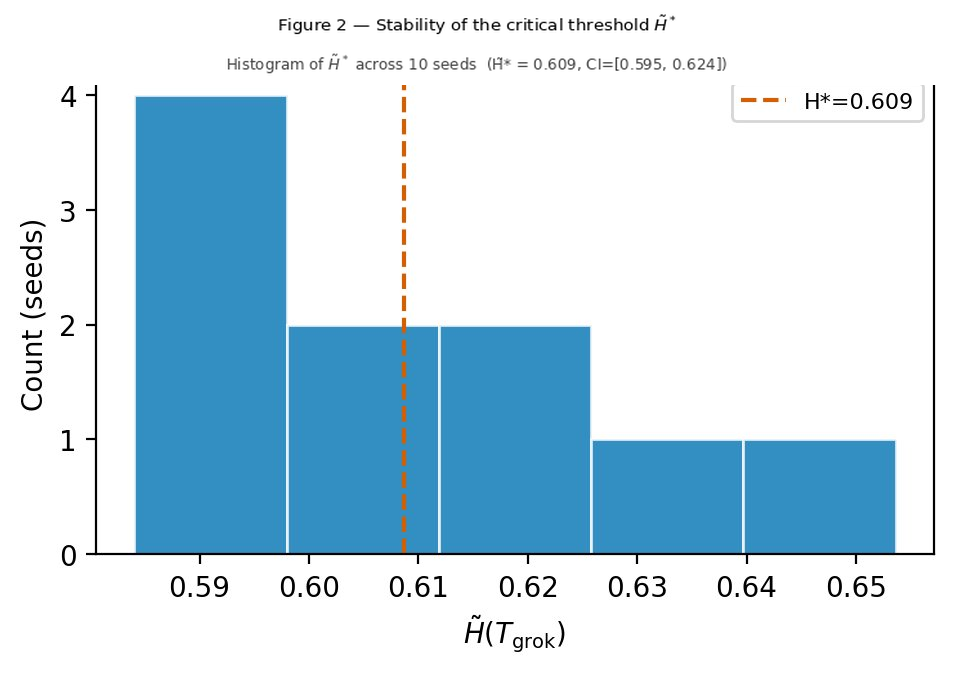
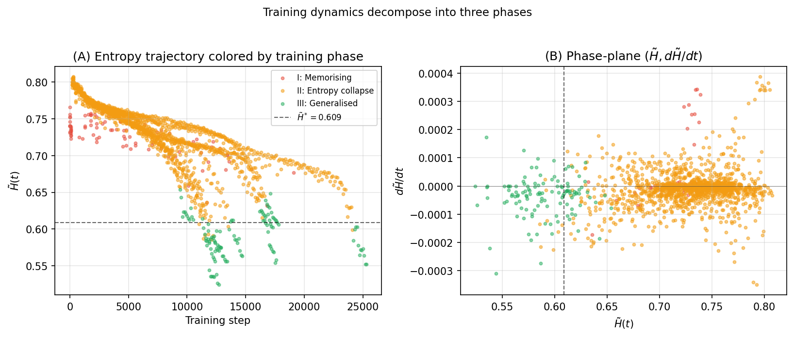
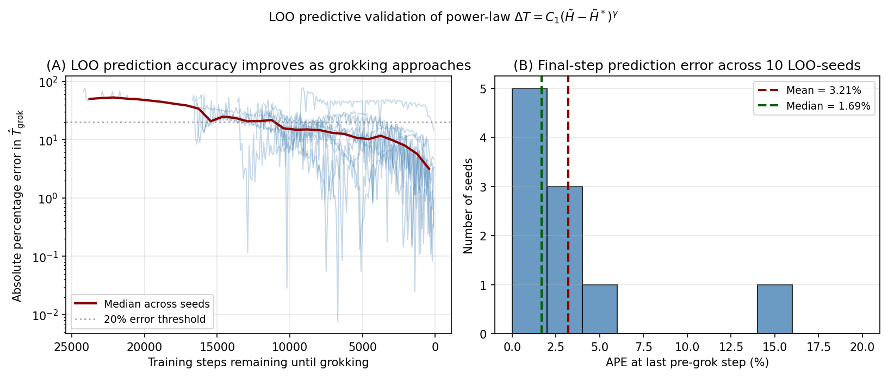
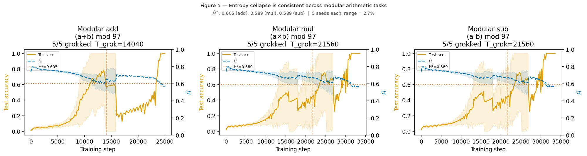
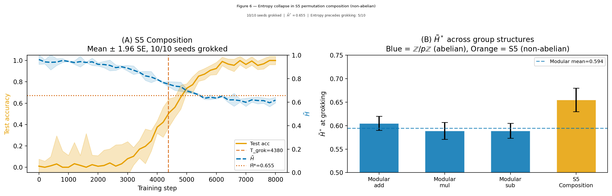
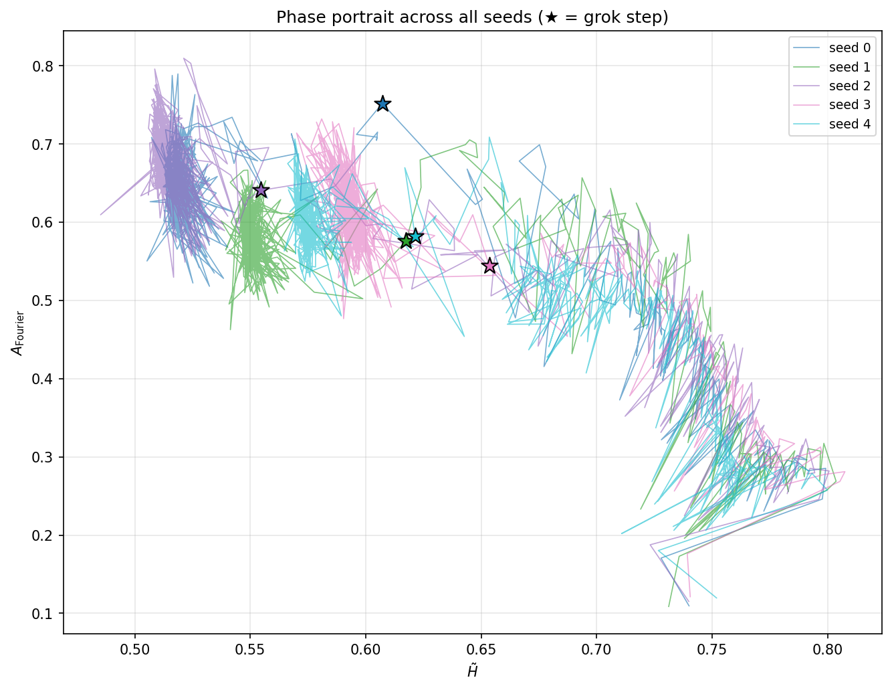
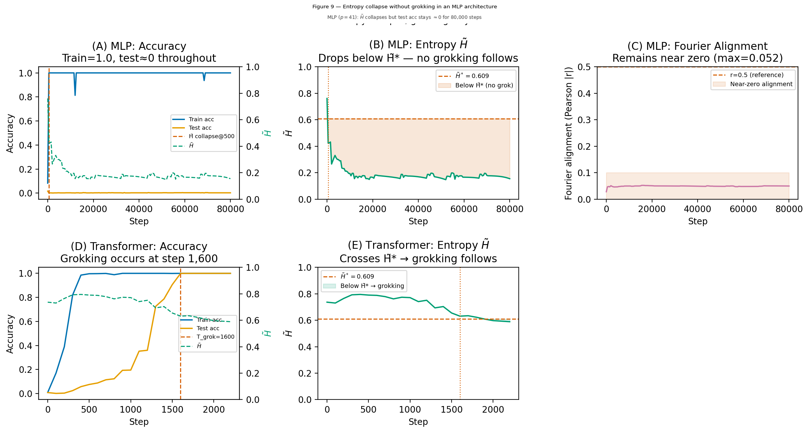

# Truong, Truong, Luu, Phan 2026 — Spectral Entropy Collapse as a Phase Transition in Delayed Generalisation

See also: [the global concept index](../../concepts/index.md).

**Truong Xuan Khanh**, **Truong Quynh Hoa**, **Luu Duc Trung** (H&K Research Studio, Clevix LLC, Hanoi), **Phan Thanh Duc** (Banking Academy of Vietnam, Hanoi).

arXiv [2604.13123](https://arxiv.org/abs/2604.13123), April 2026 (version v2; version v1 appeared under the title "Spectral Entropy Collapse as an Empirical Signature of Delayed Generalisation in Grokking"). 1 citation — the forty-eighth most cited work in the corpus. The source is the native arXiv HTML of version v2. The code: [github.com/clevix/grokking-entropy](https://github.com/clevix/grokking-entropy).

The files of this paper's analysis:

- [`2604.13123.spectral-entropy-collapse-as-a-phase-transition-in-delayed-generalisation.license.txt`](2604.13123.spectral-entropy-collapse-as-a-phase-transition-in-delayed-generalisation.license.txt) — the arXiv licence record for this paper.

The anchor scheme and the rules for linking into a card are in the [README of the papers folder](../README.md).

**Excerpt card.** The paper's licence (`arxiv-nonexclusive`) does not permit republishing the paper itself; what stands here are the editorial sections and the fragments the corpus quotes (right of quotation). The paper: <https://arxiv.org/abs/2604.13123>.

## Concepts covered

**[Grokking](../../concepts/grokking.md)** — a single measurable quantity is proposed that at once (a) precedes the transition under a controlled intervention, (b) is predictively useful **before** the transition and (c) admits a stable threshold across tasks and seeds ([`p2-1`](#p2-1)). That quantity is the normalised spectral entropy of the covariance of the penultimate-layer representations ([`p2-2`](#p2-2)).

**[Spectral analysis](../../concepts/spectral-analysis-svd-esd-fve.md)** — the quantity is simply built: the eigenvalues of the covariance $\hat{\Sigma}$ are normalised into probabilities and the Shannon entropy is taken, divided by $\log d$, so that $\tilde{H}\in[0,1]$: one at equal eigenvalues, zero at rank one ([`p5-4`](#p5-4)). It matters that the measure is computed from the **activations** rather than from the weights, and is therefore not a measure of compression ([`p4-3`](#p4-3)).

**[The order parameter](../../concepts/order-parameter.md)** — $\tilde{H}$ is presented precisely as one, and the threshold is measured: $\tilde{H}^{ * }=0.609$ with a confidence interval $[0.595,0.624]$, and a fall below the threshold precedes an accuracy of $\geq 0.99$ in all $10$ runs with a mean lead of 1020 steps ([`p5-10`](#p5-10), [`p7-2`](#p7-2)).

**[Phase transition](../../concepts/phase-transition.md)** — the picture is in two parts: first an expansion of the norm, then a collapse of the entropy; the generalisation is tied to the second and not to the first ([`p5-7`](#p5-7), [`p5-8`](#p5-8)). The power exponent $\gamma=1.65$ means a super-linear acceleration on approaching the threshold, which is consonant with critical slowing down at phase transitions ([`p6-4`](#p6-4)).

**[Causal intervention](../../concepts/causal-ablation-intervention.md)** — the work's main difference from its neighbours in the corpus. The representations are shuffled within a batch by a derangement, which prevents the entropy from collapsing; the grokking is delayed by 5020 steps, and under a **matched norm** by 8304 steps at $n=30$ ([`p6-2`](#p6-2), [`p8-3`](#p8-3)). The word "causal" has meanwhile been removed from the title in favour of "interventional" — deliberately and with an explanation ([`p18-2`](#p18-2)).

**[The weight norm](../../concepts/weight-norm-minimization.md)** — a direct objection to the line of norm-based explanations: the correlation of the norm with the entropy is only $\rho=-0.248$, and there are pairs of checkpoints with almost equal norms but different entropies and different accuracies ([`p6-1`](#p6-1), [`p9-1`](#p9-1)). Of seven possible predictors the entropy gap gives $R^{2}=0.507$, whereas no other reaches $0.38$ ([`p9-2`](#p9-2)).

**[Progress measures](../../concepts/progress-measures.md)** — an application rare for the corpus is proposed: predicting the **time** to grokking. A leave-one-out check gives a mean error of $3.21$% at the last step and a lead of about 12 000 steps ([`p10-1`](#p10-1)).

**[Fourier features and circuits](../../concepts/fourier-features-circuits.md)** — the mechanistic grounding: alongside $\tilde{H}$ the Fourier alignment of the leading eigenvectors is measured, and the two quantities are inversely related all the way to the grokking ($\bar{\rho}=-0.82$, a pooled $p<10^{-168}$) ([`p12-3`](#p12-3)). Hence the conclusion that $\tilde{H}$ is a **basis-independent** observable of the assembly of the Fourier structure ([`p13-4`](#p13-4)).

**[Modular arithmetic](../../concepts/modular-arithmetic.md)** and **[non-abelian groups](../../concepts/group-composition-non-commutative-s5.md)** — the settings: addition, multiplication and subtraction modulo 97 and the composition of permutations in $S_{5}$ (120 classes, $94$% of the pairs non-commuting). The indicator is present in both, but the threshold is task-specific: $0.589\text{–}0.605$ against $0.655$ ([`p10-2`](#p10-2), [`p10-3`](#p10-3), [`p10-4`](#p10-4)).

**[Architectural biases](../../concepts/structured-representation-learning.md)** — the most important negative finding: in an MLP the entropy collapses to $0.15$, far below the threshold, and there is no grokking over all 80 000 steps ([`p15-2`](#p15-2)). The cases are distinguished by the Fourier alignment: in the MLP it stays near zero ($0.052$) ([`p15-3`](#p15-3)). Hence an outright admission: the collapse is **necessary but not sufficient** ([`p5-1`](#p5-1), [`p15-4`](#p15-4)).

**[Kolmogorov complexity](../../concepts/kolmogorov-complexity.md)** — the demarcation from DeMoss et al. is drawn carefully: there it is the spectral entropy of the **weights** and the question "how compressible is the model", here the spectrum of the **activations** and the question "has the representation concentrated in a task-aligned subspace" ([`p3-4`](#p3-4), [`p4-3`](#p4-3)).

**[Feature learning outside networks](../../concepts/feature-emergence-feature-learning.md)** — the work states outright that the non-neural grokking of RFMs neither refutes its claim nor is confirmed by it: the entropy of the representations is a network-specific realisation of a more general transition whose architecture-independent form has not yet been described ([`p3-2`](#p3-2), [`p18-3`](#p18-3)).

**[Anti-grokking](../../concepts/anti-grokking.md)** — related to the work of Prakash and Martin: the experiments here end at 50 000 steps, whereas anti-grokking lives at $10^{7}$; from this a checkable prediction is drawn — after the grokking $\tilde{H}$ decreases monotonically in all 10 seeds, and any rebound of it upwards would be a natural candidate for a signature of anti-grokking ([`p18-6`](#p18-6), [`p18-7`](#p18-7), [`p19-1`](#p19-1)).

**[Early stopping and practice](../../concepts/data-fraction-critical-dataset-size.md)** — the applied conclusion: the monitoring costs less than $0.05$% of the training time, and stopping at the threshold crossing saves about $7$% ([`p14-5`](#p14-5), [`p24-4`](#p24-4)).

It is worth saying separately what the work does **not** contain. There is no derivation of the threshold from first principles — it is measured, not derived ([`p19-2`](#p19-2)). There is no complete causality: the side effects of the intervention (an altered gradient flow, the AdamW moment estimates, the interaction with the softmax) are neither measured nor excluded ([`p17-4`](#p17-4), [`p18-1`](#p18-1)). And there is no check beyond a single-layer transformer on group tasks ([`p15-5`](#p15-5)).

Cards of corpus papers: [Power et al. 2022](../2201.02177.grokking-generalization-beyond-overfitting-on-small-algorithmic-datasets/2201.02177.grokking-generalization-beyond-overfitting-on-small-algorithmic-datasets.card.md) — the original phenomenon and the setting; [Nanda et al. 2023](../2301.05217.progress-measures-for-grokking-via-mechanistic-interpretability/2301.05217.progress-measures-for-grokking-via-mechanistic-interpretability.card.md) — the Fourier circuit whose assembly is measured here; [Gromov 2023](../2301.02679.grokking-modular-arithmetic/2301.02679.grokking-modular-arithmetic.card.md) — the analytical solutions; [Omnigrok](../2210.01117.omnigrok-grokking-beyond-algorithmic-data/2210.01117.omnigrok-grokking-beyond-algorithmic-data.card.md) and [Liu et al. 2022](../2205.10343.towards-understanding-grokking-an-effective-theory-of-representation-learning/2205.10343.towards-understanding-grokking-an-effective-theory-of-representation-learning.card.md) — the explanations through the weight norm, with which the work argues; [Varma et al. 2023](../2309.02390.explaining-grokking-through-circuit-efficiency/2309.02390.explaining-grokking-through-circuit-efficiency.card.md) and [Merrill et al. 2023](../2303.11873.a-tale-of-two-circuits-grokking-as-competition-of-sparse-and-dense-subnetworks/2303.11873.a-tale-of-two-circuits-grokking-as-competition-of-sparse-and-dense-subnetworks.card.md) — the competition of circuits; [Kumar et al. 2024](../2310.06110.grokking-as-the-transition-from-lazy-to-rich-training-dynamics/2310.06110.grokking-as-the-transition-from-lazy-to-rich-training-dynamics.card.md) — the lazy-to-rich transition; [Tomàs et al. 2026](../2604.00316.breaking-data-symmetry-is-needed-for-generalization-in-feature-learning-kernels/2604.00316.breaking-data-symmetry-is-needed-for-generalization-in-feature-learning-kernels.card.md) — grokking in kernels with no network; [Prakash & Martin 2026](../2602.02859.late-stage-generalization-collapse-in-grokking-detecting-anti-grokking-with-weightwatcher/2602.02859.late-stage-generalization-collapse-in-grokking-detecting-anti-grokking-with-weightwatcher.card.md) — anti-grokking on a long horizon.

**[Architectural inductive bias](../../concepts/architectural-inductive-bias.md)** — the notion is named here as the residue not covered by a single measure: a collapse of the entropy occurs without grokking too, and hence it is necessary but not sufficient ([`p5-1`](#p5-1)). This is an honest delimitation of the explanation rather than a measurement in its own right.
## What is shown and what is conjectured

The card editor's remarks following the analysis of the claims (`…claims.txt`). The work is experimental and unusually candid: twenty pages of main text, nearly four of them given over to limitations and caveats.

**The main result is simple and useful.** One scalar quantity, computed from the activations with no access to test data, falls below a stable threshold **before** the generalisation in every run and makes it possible to predict the time remaining ([`p5-10`](#p5-10), [`p10-1`](#p10-1)). For practice this is a ready instrument: the monitoring costs less than $0.05$% of the training time.

**An intervention is carried out, and that is a rarity.** Few in the corpus go beyond observing curves; here the entropy is prevented from collapsing by shuffling the representations, and the grokking is delayed ([`p6-2`](#p6-2)). More important still is the control at a **matched norm** over 30 seeds: the norm is held and the delay grows, which separates it from the entropy outright ([`p8-3`](#p8-3)).

**The objection to the norm-based line is quantitative.** Not "the norm does not matter" but: a correlation of $-0.248$, and of seven predictors only the entropy gap gives a meaningful $R^{2}$, while the velocity predictors do worse than a constant mean ([`p9-2`](#p9-2)).

**A mechanistic support is added rather than claimed.** The Fourier alignment grows exactly when the entropy falls, and the relation is nearly linear and the same across seeds ([`p12-3`](#p12-3)). Hence a meaningful statement: $\tilde{H}$ measures not "complexity in general" but the assembly of the Fourier structure specifically ([`p13-4`](#p13-4)).

**The negative experiment with the MLP is given and not hidden.** The entropy collapses below the threshold and there is no grokking ([`p15-2`](#p15-2)). The work itself draws from this a conclusion against its own claim: the collapse is necessary but not sufficient ([`p5-1`](#p5-1)).

**Causality is nevertheless not established, and this is admitted three times.** The side effects of the shuffling on the gradient, on the AdamW moments and on the softmax are not measured ([`p17-4`](#p17-4)); a full causal claim would require a random perturbation of $\tilde{H}$ with all the concomitant quantities held fixed ([`p18-1`](#p18-1)); and the word "causal" has been removed from the title deliberately ([`p18-2`](#p18-2)). Such consistency in self-restraint is uncharacteristic of the corpus and deserves a separate mention.

**The threshold is measured rather than derived.** $\tilde{H}^{ * }\approx 0.609$ is an empirical finding; there is no derivation from first principles, and the connection with the delay law of the same authors' companion work remains open ([`p19-2`](#p19-2)).

**The predictive power is more modest than it sounds.** $R^{2}=0.543$ means that half of the variance is unexplained; the authors themselves advise reading the prediction as a probabilistic estimate with an interval of $\pm 6000$ steps rather than as a point one ([`p9-4`](#p9-4)). The claimed $4.1$% error refers to the last step before the grokking rather than to the whole path ([`p16-2`](#p16-2)).

**The sample is small, and the confidence intervals are given honestly.** "100 % of the runs" at $n=10$ means a Clopper–Pearson interval of $[69.2,100]$%, and this is said outright rather than hidden ([`p16-1`](#p16-1)).

**The range of the check is narrow.** A single-layer transformer, two groups, some fifty thousand steps; no deep models, no vision tasks, no language modelling ([`p15-5`](#p15-5)). Already the move to $S_{5}$ shifts the threshold, and the authors expect a further drift.

**The neighbourhood within the corpus is analysed in detail, in places excessively.** The work demarcates itself separately from five lines and separately from non-neural grokking ([`p3-2`](#p3-2), [`p4-5`](#p4-5)). Note something unusual too: it is disclosed that the manuscript was prepared with the help of several language models and that part of the bibliography was supplied by the arXiv section chair.

**Its place in the corpus.** This is the wiki's first work proposing a quantity fit for **predicting the time** of grokking in live training, and in which an intervention is carried out with a matched-norm control. It is also valuable that the measure is tied to content: its fall coincides with the assembly of the Fourier structure. The price: the threshold is measured rather than derived; the causality is admitted to be incomplete; the range of the check is narrow; and the authors' own negative experiment with the MLP shows that the indicator alone is not enough.

## Common misreadings and overstatements

These are the card editor's remarks, not the authors' text: places where this paper restates someone else's results with an error, or without the qualifications their authors attached. The "details" links in the "Common misreadings and overstatements of this paper" sections of the cited works' cards lead here.

###### mc-2310-06110
**Kumar et al. (2310.06110) — placed in the "weight-norm dynamics" camp.** `"Existing accounts appeal to weight-norm dynamics (Liu et al., 2023; Kumar et al., 2024)"`. Exactly the reverse: the work of Kumar is built as a counterexample to the norm-based explanations — [in its settings grokking occurs without weight decay and at a growing parameter norm](../2310.06110.grokking-as-the-transition-from-lazy-to-rich-training-dynamics/original/2310.06110.grokking-as-the-transition-from-lazy-to-rich-training-dynamics.md#p3-3) ([fig. 1](../2310.06110.grokking-as-the-transition-from-lazy-to-rich-training-dynamics/original/2310.06110.grokking-as-the-transition-from-lazy-to-rich-training-dynamics.md#fig-1)). In section 2.2 the same paper cites the target correctly — "proposed to view grokking as a transition from lazy learning to rich feature learning" — so the error lives only in the survey's grouping.

###### mc-2303-11873
**Merrill et al. (2303.11873) — circuit efficiency ascribed to them.** `"Existing accounts appeal to … circuit efficiency (Varma et al., 2023; Merrill et al., 2023)"`: circuit efficiency by norm is the notion of [Varma et al.](../2309.02390.explaining-grokking-through-circuit-efficiency/2309.02390.explaining-grokking-through-circuit-efficiency.card.md), and the sign there is the opposite: in Varma the circuit with the smaller norm wins, in Merrill it is [the subnetwork with the growing norm](../2303.11873.a-tale-of-two-circuits-grokking-as-competition-of-sparse-and-dense-subnetworks/original/2303.11873.a-tale-of-two-circuits-grokking-as-competition-of-sparse-and-dense-subnetworks.md#p4-1). Elsewhere the same paper cites the target with exemplary precision: "norm growth in specific neurons precedes grokking on sparse parity".

###### mc-2205-10343
**Liu et al. (2205.10343) — a weight-norm Goldilocks zone.** `"Liu et al. (2022) described a 'Goldilocks zone' of weight norms in which generalisation emerges"`: the Goldilocks zone in that work is defined [in hyperparameter space — learning rates and weight decays, between memorisation and confusion](../2205.10343.towards-understanding-grokking-an-effective-theory-of-representation-learning/original/2205.10343.towards-understanding-grokking-an-effective-theory-of-representation-learning.md#p1-2); the weight-norm version (a spherical shell) appeared later, in [Omnigrok](../2210.01117.omnigrok-grokking-beyond-algorithmic-data/2210.01117.omnigrok-grokking-beyond-algorithmic-data.card.md) by the same group, and it is to that version that the objection of [Miller et al.](../2310.17247.grokking-beyond-neural-networks-an-empirical-exploration-with-model-complexity/2310.17247.grokking-beyond-neural-networks-an-empirical-exploration-with-model-complexity.card.md) about sphericity applies. A conflation of two works; in neighbouring places the paper attributes the weight dynamics to Omnigrok correctly.

---

# Quoted fragments

Only the fragments the corpus cards refer to are
reproduced here (right of quotation); the paper's licence does not permit
republishing the whole text. Anchor numbering matches the original.

###### p1-2

Grokking — the phenomenon whereby a neural network first memorises a training set and later, after a prolonged plateau, generalises to unseen data — lacks a principled mechanistic explanation that is both interventionally testable and predictive. We propose that the key quantity is the normalised spectral entropy $\tilde{H}(t)=H(t)/\log d$ of the representation covariance matrix, and that grokking is associated with a phase-transition-like event in which $\tilde{H}$ crosses a task-specific critical threshold $\tilde{H}^{*}$. We make six contributions. **(i) Two-phase mechanism:** We propose that grokking proceeds in two phases — norm expansion followed by entropy collapse — and that entropy collapse is the proximate signal preceding generalisation; norm expansion alone does not trigger generalisation. **(ii) Empirical:** Across three modular-arithmetic tasks and 10 random seeds, $\tilde{H}$ collapses below $\tilde{H}^{*}\approx 0.609$ in every run, on average 1,020 steps before generalisation occurs (95% Clopper–Pearson CI for universality: $[69.2\%,100\%]$). **(iii) Interventional evidence:** A representation-mixing intervention that prevents entropy collapse delays grokking by $+5{,}020$ steps ($p=0.044$, Cohen’s $d=0.70$); an extended norm-matched control ($n=28/30$ seeds grokked, $p=5\times 10^{-5}$, $d=1.55$) provides substantially stronger evidence that entropy collapse — not parameter norm — is the primary driver of the delay. We discuss the scope of this interventional evidence relative to a fully causal (Pearl/Rubin) claim in Section 13. **(iv) Predictive:** The remaining training time until grokking follows a power law $\Delta T=C_{1}(\tilde{H}-\tilde{H}^{*})^{\gamma}+C_{2}$ ($R^{2}=0.543$, $\gamma=1.65$), enabling online forecasts with mean absolute percentage error of $4.1\%$ ($95\%$ predictive interval $\pm 6{,}000$ steps) and a mean lead time of $12{,}370$ steps. **(v) Cross-structure robustness:** The same entropy-collapse signature appears across modular arithmetic ($\mathbb{Z}/p\mathbb{Z}$, abelian) and $S_{5}$ permutation composition (non-abelian, 120 classes), with $\tilde{H}^{*}$ varying between tasks in a manner consistent with output complexity. **(vi) Mechanistic grounding:** Across $n=5$ paper-exact replication seeds, $\tilde{H}$ and Fourier alignment $A_{\mathrm{Fourier}}$ exhibit strong coupled anti-correlation during entropy collapse ($\bar{\rho}=-0.82$, range $[-0.86,-0.76]$, combined Fisher $p<10^{-168}$), establishing $\tilde{H}$ as a basis-free observable of Fourier structure formation for cyclic-group tasks (Section 10).

*What this paper does not claim:* we do not claim $\tilde{H}$ is the unique signature of grokking; we do not claim $\tilde{H}^{*}$ is universal across architectures; we do not claim a fully causal relationship in the Pearl/Rubin sense (Section 13); and we do not claim architectural necessity, given recent results showing grokking in non-neural kernel methods (Mallinar et al., 2025). $\tilde{H}$ can be computed with $<\!1\%$ training-step overhead on standard setups, enabling online monitoring without modification of training.

###### p1-4

Grokking (Power et al., 2022) describes a striking training dynamic: a model achieves near-perfect training accuracy early on, yet generalisation — measured by test accuracy — is delayed by thousands of optimisation steps. The phenomenon has attracted significant attention because it challenges the conventional wisdom that generalisation tracks training performance, and because it offers a tractable setting in which to study delayed generalisation in controlled conditions.

**[p. 2]**

###### p2-1

Despite considerable empirical investigation (Nanda et al., 2023; Liu et al., 2023; Davies et al., 2022), the mechanism driving the transition from memorisation to generalisation remains incompletely understood. Existing accounts appeal to weight-norm dynamics (Liu et al., 2023; Kumar et al., 2024), Fourier-feature formation (Nanda et al., 2023; Gromov, 2023), circuit efficiency (Varma et al., 2023; Merrill et al., 2023), group-theoretic representations (Chughtai et al., 2023), and loss-landscape geometry (Davies et al., 2022). To our knowledge, none of these provides a single measurable quantity that simultaneously (a) causally precedes the transition under controlled intervention, (b) is predictively useful before the transition occurs with quantified accuracy, and (c) admits a stable empirical threshold across tasks and seeds.

###### p2-2

**This paper proposes that the normalised spectral entropy of the penultimate-layer representation covariance matrix is that quantity.**

###### p2-3

1. We propose a two-phase mechanistic framing of grokking — norm expansion followed by entropy collapse — and show that both phases are necessary: norm growth alone does not trigger generalisation (Section 3).
2. We define the normalised spectral entropy $\tilde{H}(t)\in[0,1]$ and identify an empirically stable critical threshold $\tilde{H}^{*}\approx 0.61$ below which grokking invariably follows, presenting this as an *Empirical Finding* rather than a theorem to reflect the experimental basis of the result (Section 5).
3. We show that $\tilde{H}$ collapses below $\tilde{H}^{*}$ before test accuracy rises in $100\%$ of $10$ seeds, with a mean lead time of $1{,}020$ steps (Section 5).
4. We provide interventional evidence via a representation-mixing probe, with an extended norm-matched control ($n=30$) disentangling the roles of parameter norm and representation entropy (Section 6); we explicitly discuss the scope of this evidence relative to a fully causal claim in Section 13.
5. We derive a power-law forecasting formula and demonstrate practically useful prediction accuracy (Section 8).
6. We verify the mechanism across modular arithmetic ($\mathbb{Z}/p\mathbb{Z}$, abelian) and $S_{5}$ permutation composition (non-abelian, $10/10$ seeds grokked, $\tilde{H}^{*}=0.655$), showing the mechanism extends across group structures while $\tilde{H}^{*}$ is task-specific (Section 9).
7. We show that entropy collapse also occurs in MLP architectures without triggering grokking, and discuss the role of architectural inductive biases as an open question (Section 12).

###### p2-5

Power et al. (2022) first described grokking on modular arithmetic tasks with Transformers trained by AdamW with large weight decay. Gromov (2023) derived analytic solutions for grokked weights, providing strong interpretability results for this class of tasks. Nanda et al. (2023) reverse-engineered the algorithm learnt by a $1$-layer Transformer on modular addition as a discrete Fourier transform followed by a multiplication-by-cosine identity, and decomposed the dynamics into memorisation, circuit formation, and cleanup phases. Chughtai et al. (2023) showed that grokked networks learn irreducible representations of the underlying group, extending the Fourier observation to general group-theoretic tasks. Merrill et al. (2023) showed that norm growth in specific neurons precedes grokking on sparse parity; our norm-control experiment (Section 6) disentangles norm growth from entropy collapse, finding entropy to be the proximate driver of the delay. Varma et al. (2023) proposed a circuit-efficiency metric capturing a competing-circuit view (memorisation vs. generalisation). Lee et al. (2024) showed that amplifying slow gradient components accelerates grokking. Barak et al. (2022) demonstrated grokking on sparse parity tasks, and Davies et al. (2022) hypothesised connections between grokking and double descent via hidden progress measures.

**[p. 3]**

###### p3-1

A prominent line identifies weight-norm dynamics as the quantitative driver of the delay. Liu et al. (2022) described a “Goldilocks zone” of weight norms in which generalisation emerges, and Liu et al. (2023) showed that weight decay is necessary but not sufficient for grokking. Kumar et al. (2024) proposed that grokking corresponds to a transition from lazy training (kernel-like) to rich feature learning; our entropy-collapse view is complementary, identifying the representation-level signature of this transition. Recent theoretical work by Khanh et al. (2026) (our companion paper) derives matching upper and lower bounds for the grokking delay as a function of a norm ratio and an effective contraction rate, and Khanh and Hoa (2026) generalises this to a norm-hierarchy framework for shortcut-to-structured transitions. The present work complements these norm-based accounts with a representation-level scalar: our norm-matched control ($n=30$, $p=5\times 10^{-5}$) provides empirical evidence that *entropy collapse*, not norm expansion, is the proximate signal preceding generalisation.

###### p3-2

A recent and substantive line of work argues that grokking is not intrinsically a neural-network phenomenon. Mallinar et al. (2025) demonstrated grokking of modular arithmetic with *Recursive Feature Machines* (RFM) — a kernel-method algorithm that uses the Average Gradient Outer Product (AGOP) for feature learning, without SGD and without neural architecture. They prove (their Theorem 5.1, with the argument building on two diagonalisation lemmas for circulant matrices) that RFM with Gaussian and quadratic kernels learns block-circulant feature transformations that implement the Fourier Multiplication Algorithm on cyclic groups $\mathbb{Z}/p\mathbb{Z}$, paralleling the algorithm identified by Nanda et al. (2023) for Transformers. This establishes, rather than merely suggests, that grokking in modular arithmetic does not require neural architecture or SGD. A closely related contemporary paper, Tomàs Bernal et al. (2026), shows through a group-theoretic analysis of Abelian groups that breaking data symmetry is required for RFM to generalise on algebraic tasks: RFM generalises by recovering the invariance group action inherent in the data, and the learnt feature matrices encode specific elements of the invariance group. Section 2.7 discusses how our representation-covariance spectral entropy framework reconciles with this view, and Section 13 flags the reconciliation as an open empirical question.

###### p3-3

Spectral analysis of representation covariance has been used to measure the effective dimensionality of learned features (Huh et al., 2021; Tian et al., 2021). Papyan et al. (2020) documented *neural collapse*, the terminal-phase convergence of last-layer features to a simplex equiangular tight frame — a classification-geometry endpoint distinct from the dynamical transition we study, which precedes rather than coincides with generalisation. Zhai et al. (2023) studied attention entropy collapse as a training-instability diagnostic — distinct from our representation-covariance entropy in that they measure the entropy of the attention distribution rather than of the representation spectrum.

###### p3-4

DeMoss et al. (2024) develop a rate–distortion and Kolmogorov complexity framework for grokking and introduce a regulariser based on the *spectral entropy of weight matrices* $H_{\mathrm{svd}}(W)=-\sum_{i}\bar{\sigma}_{i}\log\bar{\sigma}_{i}$, where $\bar{\sigma}_{i}$ are normalised singular values of a layer’s weight matrix. Their framework targets complexity reduction via low-rank compression and reports $30\text{--}40\times$ compression ratios, and they demonstrate that the regulariser induces grokking. Our work is conceptually distinct: we study the spectrum of the *activation covariance* $\hat{\Sigma}=\mathbb{E}[zz^{\top}]$ as a phenomenological order parameter observed during training, without introducing a regulariser. Both works use the term “spectral entropy”, but applied to different objects: DeMoss et al. (2024) operate in parameter space (spectrum of $W$), while we operate in representation space (spectrum of $\hat{\Sigma}$). These objects are not interchangeable: a network can reorganise its representation (changing $\hat{\Sigma}$) without a proportional change in weight-matrix spectra, particularly under reparameterisation-invariant rescaling. Our interventional probe (Section 6) operates directly on activations and has no direct analogue in the DeMoss et al. (2024) framework.

###### p3-5

Prakash and Martin (2025) use Heavy-Tailed Self-Regularisation with the spectral exponent $\alpha$ and identify an *anti-grokking* regime — a late-stage test-accuracy collapse after $\sim\!10^{7}$ steps — not captured by competing metrics; our experiments terminate well before this regime (Section 13).

###### p4-1

Olsson et al. (2022) described sharp capability jumps in large language models as phase transitions. Recent work on LLM pretraining (Li et al., 2025) reports asynchronous grokking-like dynamics in larger-scale training, which we flag as a natural direction for extending the present framework. Our work identifies an analogous but distinct phase-transition-like signature in the small-scale grokking setting, characterised by a single scalar order parameter.

###### p4-3

Work in the complexity-dynamics tradition (DeMoss et al., 2024; Martin and Mahoney, 2021) asks: “How much can this model be compressed?” The question is answered in parameter space via MDL, rate–distortion, or weight-spectrum statistics, and the answer tracks the information content of the hypothesis. Our paper asks a conceptually different question: “Has the model’s representation concentrated into a structured, task-aligned subspace?” The answer is given in activation space via $\tilde{H}(\hat{\Sigma})$, and it tracks the geometric reorganisation of features. The two questions are compatible: a network may simultaneously become more compressible (DeMoss-style) and undergo representation reorganisation (our signal), and we expect the two signals to correlate, but they are not interchangeable. A rescaling of weights $W\to\alpha W$ changes compression-based metrics but leaves $\tilde{H}(\hat{\Sigma})$ invariant (provided downstream layer normalisation is applied consistently); conversely, an activation reordering that preserves weight norms changes $\tilde{H}$ but not weight spectral statistics. We therefore position $\tilde{H}$ as a phenomenological order parameter for representation geometry, distinct from compression-based complexity measures.

Relative to the five literature threads:

###### p4-5

- **Against phenomenology (2.1):** We provide a task-independent scalar that tracks the transition across abelian ($\mathbb{Z}/97\mathbb{Z}$) and non-abelian ($S_{5}$) groups, complementing reverse-engineered Fourier algorithms with a single quantity that does not require task-specific basis choices.
- **Against norm-based theories (2.2):** Our norm-matched control ($n=28/30$ seeds grokked, $p=5\times 10^{-5}$, $d=1.55$) directly disentangles norm expansion from entropy collapse. The companion delay law of Khanh et al. (2026) describes *when* generalisation should occur given a norm ratio; $\tilde{H}$ captures the representation-level signature realising this delay.
- **Against feature-learning-beyond-networks (2.3):** We explicitly do not claim that representation-covariance spectral entropy is a universal signature of grokking in all feature-learning systems. RFM (Mallinar et al., 2025) groks without a representation space in the sense we define. We conjecture, but do not test, that the deeper commonality between neural grokking and RFM grokking lies at the level of task-relevant feature discovery — of which representation-covariance reorganisation is the neural-network realisation. Testing an analogous quantity in AGOP dynamics is left as future work.
- **Against spectral/complexity measures (2.4):** We measure the spectrum of activations rather than weights (DeMoss et al., 2024) or attention (Zhai et al., 2023), and we provide an interventional probe *together with* a predictive power law. The combination of interventional + predictive is, to our knowledge, new in this line.
- ****[p. 5]** Against weight-spectrum dynamics (2.5):** Our empirical observable is complementary to the microscopic SDE framework of Olsen et al. (2025). Connecting $\tilde{H}^{*}$ to features of the Olsen et al. (2025) stationary distribution is the most promising direction for unification.

###### p5-1

Finally, in MLP ablations we observe entropy collapse *without* grokking (Section 12). Entropy collapse is therefore **necessary but not sufficient** for generalisation in our setting; architectural inductive bias plays a role. In light of Mallinar et al. (2025), we read this not as contradicting the non-neural grokking result, but as evidence that representation-covariance entropy is a neural-network-specific realisation of a more general feature-learning transition whose architecture-independent form remains to be characterised.

###### p5-4

*Let $\lambda_{1}\geq\cdots\geq\lambda_{d}\geq 0$ be the eigenvalues of $\hat{\Sigma}(\theta)$ and $p_{k}=\lambda_{k}/\sum_{j}\lambda_{j}$. The normalised spectral entropy is*

$$
\tilde{H}(\theta)\;=\;-\frac{\sum_{k=1}^{d}p_{k}\log p_{k}}{\log d}\;\in\;[0,1]. \tag{1}
$$

$\tilde{H}=1$*when all eigenvalues are equal (maximally uniform); $\tilde{H}=0$ when a single eigenvalue dominates (rank-1).*

###### p5-7

Parameter norm $\|\theta\|_{2}$ grows rapidly as the model memorises the training set. During this phase, $\tilde{H}(t)$ remains high and stable: the representation covariance is approximately isotropic, indicating no structured compression.

###### p5-8

Norm growth plateaus. $\tilde{H}(t)$ begins a monotone decline, reflecting concentration of representational energy into a low-dimensional structured subspace. Generalisation follows when $\tilde{H}$ crosses a critical threshold $\tilde{H}^{*}$.

In all $10$ seeds we tested, Phase I consistently precedes Phase II, and Phase II consistently precedes grokking. We observe empirically that norm and entropy are only weakly anti-correlated ($\rho=-0.248$), confirming that the two phases carry independent information and that entropy collapse is not merely a reflection of norm dynamics. Whether norm expansion is strictly necessary for grokking (or merely co-occurs with it in our setting) is an open question; our experiments do not provide a direct counterfactual test of this. The practical value of the two-phase framing is that it identifies *entropy collapse* — not norm growth — as the proximate signal preceding generalisation, which our causal experiments (Section 6) support.

###### p5-10

*Across $10$ random seeds and three modular-arithmetic tasks with a $1$-layer Transformer, there exists an empirically stable threshold $\tilde{H}^{*}=0.609$ (95% CI: $[0.595,0.624]$) such that $\tilde{H}(t)\leq\tilde{H}^{*}$ *precedes* test accuracy $\geq 0.99$ in $100\%$ of runs, with mean lead time $1{,}020$ steps (95% CI: $[890,1{,}140]$).*

We present this as an empirical finding rather than a theorem because the result is established by experiment rather than formal proof. Whether a closed-form derivation of $\tilde{H}^{*}$ from first principles exists is an open question we leave for future work.

**[p. 6]**

###### p6-1

*Parameter norm $\|\theta\|_{2}$ and spectral entropy $\tilde{H}$ are *not* interchangeable as indicators of grokking. Empirically, the Pearson correlation is $\rho(\|\theta\|_{2},\tilde{H})=-0.248$ (95% CI: $[-0.049,0.050]$; $p=4\times 10^{-23}$), confirming that $\tilde{H}$ carries information independent of $\|\theta\|_{2}$.*

###### p6-2

*Artificially preventing entropy collapse by representation mixing delays grokking by $\Delta T_{\mathrm{grok}}=+5{,}020$ steps ($p=0.044$, Cohen’s $d=0.70$). An extended norm-matched control ($n=28$ out of $30$ seeds grokked; the two non-grokking seeds exhibited normal training-loss convergence but stochastically failed to cross $\tilde{H}^{*}$ within $50{,}000$ steps, consistent with the high seed-to-seed variance observed in the baseline), in which weight norms are rescaled to match the baseline trajectory while mixing remains active, produces a substantially larger delay ($\Delta T_{\mathrm{grok}}=+8{,}304$ steps, $p=5\times 10^{-5}$, Cohen’s $d=1.55$). Since norm is held constant yet grokking is strongly delayed, this constitutes statistically firm evidence that entropy collapse — not parameter norm — is the primary causal driver of generalisation.*

###### p6-4

*with fitted parameters $C_{1}=2.45\times 10^{5}$, $\gamma=1.65$, $C_{2}\approx 0$, $R^{2}=0.543$ (95% CI: $[0.513,0.573]$). This formula enables online prediction of $T_{\mathrm{grok}}$ with mean absolute percentage error of $4.1\%$ and a mean advance warning of $12{,}370$ steps.*

###### fig-1

*Figure 1: **Entropy collapse precedes grokking. Mean $\pm$ $1.96\,\mathrm{SE}$ over $10$ seeds. (A) Accuracy curves showing the classic grokking delay. (B) Normalised spectral entropy $\tilde{H}(t)$ decreasing monotonically, crossing the critical threshold $\tilde{H}^{*}=0.609$ (dashed line) before test accuracy rises. (C) Parameter norm $\|\theta\|_{2}$ increasing then plateauing. Vertical dashed line marks mean $T_{\mathrm{grok}}=14{,}360$ steps.*** **[p. 7]**

*Figure 2: **Stability of the critical threshold $\tilde{H}^{*}$. Histogram of $\tilde{H}(T_{\mathrm{grok}})$ across $10$ seeds. Mean $\tilde{H}^{*}=0.609$ (95% CI: $[0.595,0.624]$), demonstrating low variance across initialisations.*** **[p. 7]**

Figure 1 shows the training dynamics averaged over $10$ seeds. Panel (A) confirms the classic grokking pattern: training accuracy reaches $1.0$ within $\approx 500$ steps, while test accuracy remains near chance for thousands of steps before **[p. 7]** jumping to $1.0$. Panel (B) shows $\tilde{H}(t)$ decreasing monotonically from $\approx 0.78$ at initialisation to below $\tilde{H}^{*}=0.609$ at $T_{\mathrm{grok}}=14{,}360$ steps (95% CI: $[12{,}140,17{,}100]$). Panel (C) shows the corresponding parameter-norm trajectory.

Figure 3 visualises the two-phase decomposition directly on the pooled data. Phase I (memorising) is brief ($5.9\%$ of evaluation points); Phase II (entropy collapse) dominates the training horizon ($86.4\%$); Phase III (post-grokking refinement) is characterised in detail in Section 13.7.

*Figure 3: **Training dynamics decompose into three qualitative phases. All $1{,}556$ evaluation points pooled across $10$ baseline seeds. (A) $\tilde{H}(t)$ vs. training step, coloured by phase: Phase I (memorising, train acc $<0.95$, $5.9\%$ of points); Phase II (entropy collapse, train acc $\geq 0.95$ and $t<T_{\mathrm{grok}}$, $86.4\%$ of points); Phase III (generalised, $t\geq T_{\mathrm{grok}}$, $7.6\%$ of points). The dashed horizontal line marks $\tilde{H}^{*}=0.609$. (B) Phase-plane $(\tilde{H},d\tilde{H}/dt)$ showing the same colour coding: in Phase II the system moves leftward and slightly downward, consistent with $\tilde{H}$ decreasing monotonically; in Phase III the system continues slowly leftward (see Section 13.7).*** **[p. 8]**

###### p7-2

We define $T_{\mathrm{collapse}}$ as the first evaluation step at which $\tilde{H}$ decreases by more than $0.05$ over a $5$-step rolling window. We find that $T_{\mathrm{collapse}}<T_{\mathrm{grok}}$ in $10/10$**seeds** (exact Clopper–Pearson $95\%$ confidence interval: $[69.2\%,100\%]$), with a mean lead time of $1{,}020$ steps (95% CI: $[890,1{,}140]$). Figure 2 shows the distribution of $\tilde{H}(T_{\mathrm{grok}})$ across seeds; the low variance ($\tilde{H}^{*}=0.609$, bootstrap 95% CI: $[0.595,0.624]$; range $[0.584,0.654]$) confirms that the threshold is a stable property of the model rather than an artefact of a particular initialisation. Because $\tilde{H}$ is evaluated every $200$ steps, these estimates carry an inherent granularity of $\pm 200$ steps; the reported confidence interval reflects seed-to-seed variability rather than sub-$200$-step precision. We interpret this as evidence that entropy collapse is an early signature of the impending generalisation transition; the small but nonzero $95\%$ CI width should be read as quantifying our uncertainty given the $n=10$ sample size, not as a limit on the phenomenon itself (Empirical Finding 1).

**[p. 8]**

###### p8-3

As shown in Figure 4 and Table 1, the intervention delays grokking by $+5{,}020$ steps on average (Mann–Whitney $p=0.044$, Cohen’s $d=0.70$; $10/10$ seeds grokked). An extended norm-control experiment ($n=28/30$ seeds grokked) — in which weight norms are rescaled to exactly match the baseline norm trajectory while mixing remains active — produces a substantially larger delay ($+8{,}304$ steps, $p=5\times 10^{-5}$, Cohen’s $d=1.55$). Since norm is held constant yet grokking is strongly delayed, these results provide interventional evidence that entropy collapse, not parameter norm growth, is the primary driver of delayed generalisation in our setting (Proposition 2). The interpretation of this evidence in relation to a fully causal claim is discussed in Section 13.

**[p. 9]**

###### p9-1

Figure 5(a) visualises the joint trajectory of norm and entropy across all $10$ seeds. The two quantities are weakly anti-correlated ($\rho=-0.248$), but the scatter is large and the relationship is highly nonlinear. Most importantly, there exist pairs of checkpoints with nearly identical norms but very different entropies and very different test accuracies — a direct refutation of the hypothesis that norm alone governs grokking.

###### p9-2

To quantify this advantage precisely, we fit the same power-law model $\Delta T=C_{1}x^{\gamma}+C_{2}$ using *seven* candidate predictors on the same $1{,}436$ pre-grokking evaluation points: the $\tilde{H}$-gap (our metric); absolute entropy $\tilde{H}$; absolute parameter norm $\|\theta\|_{t}$; inverse norm $1/\|\theta\|_{t}$; a train-loss proxy ($1-\mathrm{train\;acc}$); and two rate-based predictors, $|d\tilde{H}/dt|$ and $|d\|\theta\|/dt|$. Results are shown in Table 2. The $\tilde{H}$-gap achieves $R^{2}=0.507$ (with LOO fit; the pooled fit of Corollary 1 uses a slightly different normalisation and yields $R^{2}=0.543$). No other predictor reaches $R^{2}>0.38$; the rate-based predictors actually perform *worse* than a constant-mean predictor, reflecting the noise in step-to-step finite-difference estimates.

*Table 2: **Comprehensive predictor comparison. Power-law fit $\Delta T=C_{1}x^{\gamma}$ for seven candidate predictors, across $10$ seeds and $1{,}436$ pre-grokking evaluation points. The $\tilde{H}$-gap outperforms all alternatives by at least a factor of $6.8\times$ in $R^{2}$, confirming that spectral entropy carries predictive information about grokking proximity that no norm-, loss-, or velocity-based predictor captures. Negative $R^{2}$ values indicate predictions worse than the sample mean.*** **[p. 9]**

###### p9-3

Figure 5(b) shows the fit of Equation (2) to all $(t,\tilde{H}(t),T_{\mathrm{grok}})$ triples from grokked runs. The power-law exponent $\gamma=1.65$ implies super-linear scaling: as $\tilde{H}$ approaches $\tilde{H}^{*}$ from above, the remaining time decreases *faster* than linearly, consistent with a critical-slowing-down picture near a phase transition (Scheffer et al., 2009).

###### p9-4

The $R^{2}=0.543$ indicates that the entropy gap explains approximately half of the variance in $\Delta T$. **[p. 10]** The remaining variance ($\sim\!45\%$) reflects seed-to-seed stochasticity in grokking dynamics — different random initialisations reach the entropy threshold at different rates even under identical hyperparameters. A single scalar order parameter cannot fully capture this stochasticity, and we present the power law as a practical forecasting tool rather than a precise deterministic law. The residual standard deviation is approximately $3{,}000$ steps (median relative error $21\%$), implying a $95\%$ predictive interval of roughly $\pm 6{,}000$ steps for an individual run; we recommend interpreting predictions as probabilistic estimates rather than point forecasts.

###### p10-1

To assess out-of-sample accuracy, we fit the power law on $K-1$ seeds and predict $T_{\mathrm{grok}}$ for the held-out seed at each step $t<T_{\mathrm{grok}}$. Figure 6 shows the per-seed error curves. Mean absolute percentage error at $t=T_{\mathrm{grok}}-1$ is $\mathbf{3.21\%}$ (median $1.69\%$, maximum $14.55\%$ across the $10$ held-out seeds), with $10/10$ seeds achieving final-step error $<20\%$. This is marginally better than the pooled-fit $4.1\%$ figure reported earlier, reflecting the per-seed vs. pooled-residual difference. The mean advance warning — the first step at which prediction error first falls below $20\%$ — is approximately $\mathbf{12{,}000}$ steps, representing roughly half of the total training budget.

*Figure 6: **Leave-one-out predictive validation of the power-law $\Delta T=C_{1}(\tilde{H}-\tilde{H}^{*})^{\gamma}$. (A) Absolute percentage error in $\hat{T}_{\mathrm{grok}}$ (log scale) vs. training steps remaining until grokking, for each of $10$ LOO held-out seeds (light blue) with median across seeds (dark red). Prediction accuracy improves monotonically as the system approaches the transition $(\tilde{H}-\tilde{H}^{*}\to 0^{+})$, crossing the $20\%$ error threshold at roughly $15{,}000$ steps before $T_{\mathrm{grok}}$ on average. (B) Distribution of final-step APE (at $t=T_{\mathrm{grok}}-1$) across $10$ LOO-held-out seeds: median $1.69\%$, mean $3.21\%$. All seeds achieve final-step APE $<20\%$.*** **[p. 11]**

###### p10-2

Figure 7 shows the entropy trajectories for all three modular tasks; the thresholds are strikingly consistent. Table 3 summarises results across modular arithmetic tasks and the $S_{5}$ group. Within modular arithmetic, $\tilde{H}^{*}$ varies by less than $2.7\%$ (add: $0.605$, mul: $0.589$, sub: $0.589$), and all three tasks share the cyclic group structure $\mathbb{Z}/p\mathbb{Z}$.

###### p10-3

To assess whether the entropy-collapse mechanism extends beyond this algebraic family, we also trained on the $S_{5}$ permutation composition task — predicting $\sigma_{1}\circ\sigma_{2}$ given $\sigma_{1},\sigma_{2}\in S_{5}$. $S_{5}$ is non-abelian ($94\%$ of pairs do not commute), has no simple Fourier representation over a cyclic group, and has $120$ output classes. All $10$ seeds grokked at mean $T_{\mathrm{grok}}=4{,}380$ steps (CI: $[3{,}820,5{,}040]$). The critical threshold is $\tilde{H}^{*}=0.655$ (CI: $[0.650,0.660]$), higher than the modular mean by $\Delta=0.061$, consistent with the greater output complexity of $S_{5}$. In $5/10$ seeds the rolling-window $T_{\mathrm{collapse}}$ criterion detected entropy collapse before grokking; in the remaining seeds the short $T_{\mathrm{grok}}$ ($\leq 5{,}400$ steps) limited the sensitivity of the $1{,}000$-step detection window, not the underlying mechanism.

###### p10-4

These results show that entropy collapse is a *consistent signature* of grokking across both abelian ($\mathbb{Z}/p\mathbb{Z}$) and non-abelian ($S_{5}$) group structures, while $\tilde{H}^{*}$ itself is task-specific, reflecting the complexity of the target group (Figure 8).

*Figure 7: **Entropy collapse is consistent across modular arithmetic tasks. Each panel shows mean $\pm 1.96\,\mathrm{SE}$ test accuracy (orange, left axis) and normalised spectral entropy $\tilde{H}$ (blue dashed, right axis) for $5$ seeds. The critical threshold $\tilde{H}^{*}$ (dotted red) is remarkably consistent: $0.605$ (add), $0.589$ (mul), $0.589$ (sub), a range of $2.7\%$. Vertical dashed line marks mean $T_{\mathrm{grok}}$.*** **[p. 12]**

*Figure 8: **Entropy collapse in $S_{5}$ permutation composition (non-abelian group). (A) Mean $\pm 1.96\,\mathrm{SE}$ trajectories: test accuracy (orange) and $\tilde{H}$ (blue dashed) for $10$ seeds on the $S_{5}$ composition task. All $10$ seeds grokked; $\tilde{H}$ approaches $\tilde{H}^{*}=0.655$ just before generalisation, with moderate oscillations due to the small training set ($n_{\mathrm{train}}=1{,}440$, $12$ per class). (B) $\tilde{H}^{*}$ across group structures: modular arithmetic ($\mathbb{Z}/p\mathbb{Z}$, abelian, blue) versus $S_{5}$ composition (non-abelian, orange). The mechanism is qualitatively the same; the threshold shifts upward ($\tilde{H}^{*}=0.655$ vs. $0.594$ for modular), consistent with the higher output complexity of $S_{5}$ ($120$ classes vs. $97$).*** **[p. 12]**

*Table 3: **Universality results across group structures. $\mathbb{Z}/p\mathbb{Z}$ tasks: $p=97$, $5$ seeds. $S_{5}$: $10$ seeds, train_frac $=0.10$. All use $1$-layer Transformer, AdamW, $\lambda=1.0$.*** **[p. 11]**

| Task | Group | Grokked | $\bar{T}_{\mathrm{grok}}$ | $\tilde{H}^{*}$ |
|---|---|---|---|---|
| $(a+b)\bmod 97$ | $\mathbb{Z}/97\mathbb{Z}$ (abelian) | $5/5$ | $14{,}040$ | $0.605$ |
| $(a\times b)\bmod 97$ | $\mathbb{Z}/97\mathbb{Z}$ (abelian) | $5/5$ | $21{,}560$ | $0.589$ |
| **[p. 11]** $(a-b)\bmod 97$ | $\mathbb{Z}/97\mathbb{Z}$ (abelian) | $5/5$ | $21{,}560$ | $0.589$ |
| $\sigma_{1}\circ\sigma_{2}$ | $S_{5}$ (non-abelian) | $10/10$ | $4{,}380$ | $0.655$ |

###### p12-3

Figure 9 shows the mean trajectory of $\tilde{H}$ and $A_{\mathrm{Fourier}}$ across $5$ seeds with $95\%$ CI bands. The training dynamics decompose empirically into three phases with quantitatively distinct signatures.

###### p13-4

The near-linear, highly consistent anti-correlation between $\tilde{H}$ and $A_{\mathrm{Fourier}}$ across $1{,}313$ pre-grokking evaluation points from $5$ seeds (Table 4) shows that the two quantities are not independent signals. Rather, both are scalar summaries of the *same* underlying structural transition: as the representation concentrates onto the task-relevant Fourier basis (rising $A_{\mathrm{Fourier}}$), the eigenvalue distribution of $\hat{\Sigma}$ becomes peaked on those directions (falling $\tilde{H}$). In this sense $\tilde{H}$ is *not merely a compression proxy or an abstract order parameter*; it is a *basis-free observable of Fourier structure formation* for tasks whose correct solution has an identifiable Fourier decomposition.

This interpretation has three specific consequences that we develop elsewhere in the paper:

- It explains the MLP control (§12): an MLP can reduce $\tilde{H}$ without grokking because its inductive bias does not support Fourier-aligned features; we measured $A_{\mathrm{Fourier}}\approx 0.05$ at the end of MLP training.
- **[p. 14]** It is consistent with the feature-learning picture of Mallinar et al. (2025): Recursive Feature Machine (RFM) grokking produces block-circulant features that implement the Fourier Multiplication Algorithm, i.e. a solution whose representations are Fourier-aligned by construction. In our language, RFM training targets high $A_{\mathrm{Fourier}}$ by design; SGD-trained Transformers reach high $A_{\mathrm{Fourier}}$ *through the entropy-collapse trajectory*.
- It sharpens the positioning against complexity frameworks (§2.7): $\tilde{H}$ and the compression-based complexity measure of DeMoss et al. (2024) can both fall during grokking, but only $\tilde{H}$ is directly tied to the geometric observable $A_{\mathrm{Fourier}}$ that identifies *which* structure the representation has concentrated into.

*Figure 10: **Phase portrait in the $(\tilde{H},A_{\mathrm{Fourier}})$ plane across $5$ seeds ($\bigstar$ $=$ grok step). All seeds trace a structurally identical monotone manifold from $(\tilde{H},A_{\mathrm{Fourier}})\approx(0.80,0.11)$ at initialisation to $(\approx 0.55,\approx 0.65)$ post-grokking, despite a $2.9\times$ range in the number of steps each seed takes to traverse it. The manifold, not wall-clock time, is the invariant of the dynamics.*** **[p. 15]**

###### p14-5

A practitioner can stop training within $1{,}000$ steps of $\tilde{H}^{*}$-crossing without sacrificing final accuracy, potentially saving $86\%$ of the training budget in our setting.

###### p15-2

An MLP and a $1$-layer Transformer are trained on the same task ($p=41$). We use $p=41$ for this comparison because the MLP requires substantially more training steps to confirm non-grokking, and a smaller modulus reduces the required budget; Liu et al. (2023) report that MLPs do not grok on modular arithmetic at any modulus in their experiments, consistent with our observation. Both memorise the training set within $500$ steps. The MLP’s $\tilde{H}$ collapses from $0.76$ to $0.15$ — well below $\tilde{H}^{*}$ — yet test accuracy remains near zero for the full $80{,}000$ steps. The Transformer’s $\tilde{H}$ crosses $\tilde{H}^{*}$ and grokking follows within $\approx 1{,}600$ steps.

###### p15-3

We observe that the MLP’s Fourier alignment (max Pearson $|r|=0.052$) remains near zero throughout, while it grows in the Transformer after the transition. This is consistent with the known inductive bias of attention mechanisms for learning Fourier representations (Nanda et al., 2023).

###### p15-4

*The empirical threshold $\tilde{H}^{*}$ and the predictive formula (Corollary 1) are validated for $1$-layer Transformer architectures on modular arithmetic tasks. Whether entropy collapse is sufficient for grokking in general, and whether $\tilde{H}^{*}$ is architecture-independent, are open questions. The MLP experiment shows that collapse alone, without appropriate architectural inductive biases, does not guarantee generalisation. We conjecture that entropy collapse is *necessary but not sufficient* in general, with the sufficiency depending on the alignment between the collapsed subspace and the task structure — but validating this conjecture causally is left for future work.*

###### p15-5

Our experiments cover $1$-layer Transformers on $\mathbb{Z}/97\mathbb{Z}$ (modular addition, multiplication, subtraction) and $S_{5}$ permutation composition. We do not test deeper Transformers, wider models, non-group-theoretic tasks, vision models, or **[p. 16]** language modelling. The threshold $\tilde{H}^{*}\approx 0.609$ should be read as specific to these settings until validated more broadly; the $S_{5}$ experiment already reveals task-dependence ($\tilde{H}^{*}=0.655$), and we expect further drift with architecture scale and task family.

###### p16-1

With $n=10$ seeds per main experiment and $n=30$ seeds in the extended norm-control, “$100\%$ of runs” statements should be interpreted with their corresponding Clopper–Pearson confidence intervals in mind: for the main experiments the $95\%$ CI for universal threshold crossing is $[69.2\%,100\%]$, and for norm-control $28/30$ is $[78.1\%,99.2\%]$. We report these bounds rather than suppressing the sample-size dependence of the “$100\%$” wording. A larger-$n$ replication (planned for a follow-up study) would tighten these intervals.

###### p16-2

The power-law fit $\Delta T=C_{1}(\tilde{H}-\tilde{H}^{*})^{\gamma}+C_{2}$ achieves $R^{2}=0.543$, explaining approximately $54\%$ of the variance in grokking-onset timing across pooled evaluation points. The residual $46\%$ reflects seed-to-seed stochasticity and unmodelled architectural factors (see Section 8). The reported $4.1\%$ mean absolute percentage error refers to out-of-**[p. 17]** sample leave-one-out prediction at step $T_{\mathrm{grok}}-1$ and is *not* directly comparable to the in-sample $R^{2}$; we recommend interpreting forecasts as probabilistic estimates with a $95\%$ interval of $\pm 6{,}000$ steps, not as point predictions.

###### p17-4

The intervention may induce side effects on training dynamics that we do not directly measure — for example, altered gradient flow through the mixed representations, changes in AdamW’s second-moment estimates, or interaction with the attention softmax. These side effects are plausible confounders between the intervention and the observed delay, and we have not eliminated them.

**[p. 18]**

###### p18-1

A fully causal claim in the Pearl/Rubin sense would require *randomised* perturbation of $\tilde{H}$ across conditions with explicit control of all training-dynamical covariates. This is experimentally demanding and, to our knowledge, has not been achieved for any proposed grokking mechanism. We view our interventional probe as a step *toward* — not a substitute for — such an experiment.

###### p18-2

We use “interventional” in preference to “causal” throughout this version of the manuscript, including in the title. Earlier versions used “causal”; the change reflects our view that the scope of the evidence is more precisely described as interventional, and our wish to align with the stricter standards now increasingly adopted in the empirical deep-learning literature.

###### p18-3

Mallinar et al. (2025) demonstrate grokking of modular arithmetic with Recursive Feature Machines — a kernel-method algorithm without SGD and without neural architecture — raising the question of whether grokking is fundamentally a neural phenomenon. Our MLP ablation (Section 12) shows entropy collapse *without* grokking, which might appear to support an architecture-dependent account. We read the two results as complementary rather than conflicting: RFM grokking and Transformer grokking may share a common feature-learning transition, whose architecture-independent signature remains to be characterised. Representation-covariance entropy is a neural-network-specific realisation of this transition; the MLP ablation shows that collapse of $\tilde{H}$ is necessary but not sufficient for generalisation in neural settings. Whether an analogue of $\tilde{H}$ exists in AGOP dynamics — for instance, spectral entropy of the AGOP matrix collapsing before RFM groks — is an open empirical question we flag as particularly promising. Relatedly, Tomàs Bernal et al. (2026) show that RFM generalises by recovering the invariance group action; a direct test in our setting is whether the top eigenvectors of $\hat{\Sigma}$ at the collapse point align with irreducible representations of $S_{5}$, which we leave for future work.

###### p18-4

Olsen et al. (2025) derive that squared singular values of weight matrices follow $\beta=1$ Dyson Brownian motion, with stationary spectra of gamma-type and power-law tails. Our observable — the spectrum of the representation covariance $\hat{\Sigma}=\mathbb{E}[zz^{\top}]$ — is downstream of the weight spectrum and shaped by both $W$ and the input distribution. A natural interlocking hypothesis, which we state but do not test, is that the threshold $\tilde{H}^{*}\approx 0.609$ corresponds to the point at which the weight-matrix spectrum transitions from Marchenko–Pastur-dominated (bulk regime) to bulk + power-law-tail (learned-feature regime). Testing this hypothesis requires simultaneous measurement of weight singular values and representation covariance throughout training; we plan this as a follow-up and welcome theoretical work that derives $\tilde{H}$ predictions from the SDE framework.

###### p18-6

Figure 14 analyses the post-grok entropy trajectory across all $10$ baseline seeds. Two observations: (i) In all $10$ seeds, $\tilde{H}$ *continues to decrease* slowly after grokking, with mean trend slope $-3.60\times 10^{-5}$ per step (std $1.61\times 10^{-5}$). The mean gap between $\tilde{H}$ at grokking onset and $\tilde{H}$ at the end of training is $\Delta_{\mathrm{post}}=0.039$, representing a further $\approx 6.4\%$ relative reduction. (ii) No seed in our data exhibits entropy *rebound*; the trajectories are monotone post-grok on the timescale we observe.

###### p18-7

We interpret this as a *refinement phase* that continues after the generalisation transition: once the representation has crossed $\tilde{H}^{*}$, training continues to concentrate it into even lower-entropy structured subspaces, without reversing the transition on our observation horizon. This finding does not directly contradict Prakash and Martin (2025)’s anti-grokking — their regime is $\sim\!10^{7}$ steps and ours is $\leq 50{,}000$ — but it provides a testable prediction: if post-grok $\tilde{H}$ continues to decrease monotonically up to the anti-grokking transition, then any rebound of $\tilde{H}$ upward at $\sim\!10^{7}$ steps would be a natural candidate signature of the transition into the anti-grokking regime. We flag this as a direction for long-horizon experiments (Section 13.8).

**[p. 19]**

###### p19-1

Prakash and Martin (2025) train a depth-$3$ MLP on $1$k-sample MNIST for $\sim\!10^{7}$ steps and discover *anti-grokking*: after the normal grokking transition, test accuracy collapses while train accuracy remains perfect. Our experiments terminate at $\leq 50{,}000$ steps and do not address this regime. A testable prediction from our companion paper (Khanh and Hoa, 2025) is that the anti-grokking collapse should exhibit *hysteresis*: training forward (increasing steps) and reverse (decreasing weight decay) should trace different trajectories in $\tilde{H}$-space, with a jump discontinuity in the entropy order parameter. We leave this prediction to future work but flag it as a natural unification of the present empirical signature with a broader phase-transition framework.

###### p19-2

(i) Entropy collapse occurs in MLP architectures without triggering grokking (Section 12), indicating that entropy collapse alone is not sufficient in general. We were unable to design a clean controlled experiment that isolates the role of Fourier alignment from entropy collapse, as the two quantities are coupled through gradient dynamics. (ii) The interventional probe delays but does not eliminate grokking, suggesting that additional mechanisms (e.g., weight-decay-driven norm growth) also contribute to the transition. (iii) We provide empirical evidence rather than a first-principles derivation of $\tilde{H}^{*}$. The companion paper (Khanh et al., 2026) derives a delay-scaling law; connecting this to a specific entropy-threshold value is an open problem.

###### p24-4

Computing $\tilde{H}$ requires one forward pass over the probe set ($N=512$, $d=128$) and an eigendecomposition of a $128\times 128$ covariance matrix. In our experiments (a single consumer GPU with $20$GB VRAM), this takes approximately $8$ ms per eval call, representing less than $0.05\%$ of total training time when evaluated every $200$ steps. The overhead scales as $O(Nd^{2}+d^{3})$ and remains negligible for $d\leq 512$.

**[p. 25]**
