# Grokking of Diffusion Models: Case Study on Modular Addition

Joon Hyeok Kim\* Yonghyun Park\* Mattis Dalsætra Østby Jiatao Gu

Department of Computer and Information Science
University of Pennsylvania
Philadelphia, PA 19104, USA
{hozy, park19, mdals, jgu32}@seas.upenn.edu

\* Equal contribution

## Abstract

Despite their empirical success, how diffusion models generalize remains poorly understood from a mechanistic perspective. We demonstrate that diffusion models trained with flow-matching objectives exhibit grokking—delayed generalization after overfitting—on modular addition, enabling controlled analysis of their internal computations. We study this phenomenon across two levels of data regime. In a single-image regime, mechanistic dissection reveals that the model implements modular addition by composing periodic representations of individual operands. In a diverse-image regime with high intraclass variability, we find that the model leverages its iterative sampling process to partition the task into an arithmetic computation phase followed by a visual denoising phase, separated by a critical timestep threshold. Our work provides the mechanistic decomposition of algorithmic learning in diffusion models, revealing how these models bridge continuous pixel-space generation and discrete symbolic reasoning.

## 1 Introduction

Diffusion models (Sohl-Dickstein et al., 2015; Ho et al., 2020; Song et al., 2020) have achieved state-of-the-art performance across images (Rombach et al., 2022; Saharia et al., 2022; Ramesh et al., 2022), audio (Zhang et al., 2023), video (Wan et al., 2025; Wiedemer et al., 2025; Wu et al., 2025), and scientific applications (Abramson et al., 2024; Price et al., 2025). Their success stems not merely from generating novel samples, but from an ability to understand and satisfy underlying rules, e.g., capturing the chemistry of valid protein structures (Abramson et al., 2024) or the physics rule for world simulation (Bruce et al., 2024), a capability we refer to as *algorithmic generalization*.

Despite this empirical success, our understanding of their generalization capability remains limited. Recent studies have begun to address this gap, examining why these models avoid memorization and how their inductive biases enable novel sample generation (Pham et al., 2025; Kamb & Ganguli, 2025; Song et al., 2025; Buchanan et al., 2025). While valuable, these analyses do not yet explain *how* diffusion models implement the computational rules that make their outputs not merely novel, but systematically correct. This gap is particularly pressing as diffusion models advance toward tasks requiring increasingly sophisticated rule understanding, which must capture syntactic logic, physical laws, and beyond.

In contrast, research on large language models has shown that carefully controlled tasks can reveal the internal mechanisms driving algorithmic generalization (Elhage et al., 2021; Olsson et al., 2022; Von Oswald et al., 2023). A notable example is the grokking phenomenon, i.e., delayed generalization after overfitting, first observed on modular addition (Power et al., 2022; Nanda et al., 2023; Zhong et al., 2023). This setup showed that transformers learn ring-structured representations and implement explicit algorithmic circuits (Zhong et al., 2023). Such findings not only reproduce the algorithmic generalization behavior but also explain *how* it emerges. For diffusion models, however, grokking has not been demonstrated, and no comparable understanding exists regarding which components perform rule learning or implement discrete computations.

**[p. 2]**

In this paper, we bridge this gap by demonstrating that diffusion models trained with flow-matching objectives (Lipman et al., 2022; Liu et al., 2022a; Li & He, 2025) can exhibit grokking on modular addition. We choose this task precisely because its algorithmic solutions are well-characterized (Nanda et al., 2023; Zhong et al., 2023), providing ground-truth references against which we can validate our mechanistic discoveries. To understand how diffusion models combine algorithmic reasoning with visual generation, we study two complementary data regimes: single-image and diverse-image.

In the single-image regime, we isolate the emergence of algorithmic circuits and reveal that the model implements modular addition precisely through trigonometric composition of periodic representations (Figure 1, left). Building on this mechanistic foundation, we then turn to the diverse-image regime and analyze the iterative denoising process. We find that the sampling trajectory naturally partitions into two functionally distinct phases: an arithmetic computation phase in which the identified circuit is active, and a visual denoising phase in which it is not (Figure 1, middle). We verify this partition behaviorally by injecting noise at varying timesteps into an incorrect result image and measuring whether the model can still rectify it. We find that the timestep beyond which rectification fails is accurately predicted by the phase transition identified from internal entropy signals alone ($r^{2}$=0.95, Figure 1, right).

*Figure 1: **Overview of the Analysis Pipeline.** (Left) To mechanistically explain the observed grokking phenomenon, we demonstrate that the model generalizes the periodic algorithmic structure of modular addition. Using Fourier analysis, we identify dominant frequencies in the model activations and verify that they reconstruct trigonometric identities. (Middle) Extending our analysis to the multi-image regime, we investigate the temporal dynamics of Fractional Variance Explained (FVE) entropy and ODE sampling accuracy. (Right) A sudden spike in FVE entropy—reflecting the collapse of frequency concentration—coincides with the timestep where final ODE sampling accuracy drops near zero ($<0.5\%$). We argue this critical timestep, $t^{\ast}$, marks the model’s phase transition from algorithmic reasoning to visual denoising. We validate this predicted transition across ablation studies on heterogeneous datasets (EMNIST and KMNIST) and various moduli $P$.* **[p. 2]**

Our contributions are threefold:

1. **Grokking in Generative Diffusion Model**: We demonstrate that diffuesion models exhibit grokking on modular addition, establishing the controlled setting in which algorithmic generalization can be studied mechanistically in generative diffusion models.
2. **Mechanistic Circuit Analysis in Diffusion Models**: We reveal that diffusion models implement modular addition through periodic representations that compose via trigonometric **[p. 3]** identities, establishing a precise mechanistic account of algorithmic computation in a generative model.
3. **Mechanistic Characterization of Mode Transitions**: We identify a dynamic functional shift during the iterative denoising process. We demonstrate that the model systematically transitions from symbolic arithmetic computation to visual refinement upon reaching a critical noise threshold, providing a temporal map of generative dynamics. Leveraging the high fidelity of our mechanistic analysis, we can accurately predict the exact timestep at which this mode shift occurs, demonstrating a strong alignment with empirical observations.

## 2 Related Work

#### Mechanistic Interpretability

This field aims to uncover the internal computations of neural networks by identifying the representations and circuits responsible for task-solving behavior (Cammarata et al., 2020; Elhage et al., 2021). Early studies demonstrated that large, nonlinear models often exhibit modular structure with clean computational decompositions—such as copying, sorting, or induction—whose components can be causally isolated and manipulated (Wang et al., 2022; Conmy et al., 2023; Cunningham et al., 2023). These advances have established mechanistic interpretability as a powerful framework for explaining how and why generalization emerges in modern architectures.

#### Grokking and Modular Addition

First observed in modular arithmetic tasks (Power et al., 2022), grokking describes delayed generalization after overfitting. Networks rapidly achieve perfect training accuracy while validation performance remains near zero, then abruptly transition to perfect generalization. This phenomenon has become a key testbed for studying how networks learn discrete rules (Kumar et al., 2023; Davies et al., 2023; Liu et al., 2022b; Varma et al., 2023). Prior analyses revealed that transformers eventually discover explicit computational solutions implementing modular arithmetic, forming periodically structured representations consistent with the task’s algebraic structure (Nanda et al., 2023). Different architectures converge to distinct solutions, such as the “clock” or “pizza” strategies (Zhong et al., 2023), providing ground-truth baselines for interpretability research. However, grokking has been studied almost exclusively in discrete transformer models, leaving diffusion-based generative models unexplored.

#### Generalization in Diffusion Models

Recent theoretical work examines why diffusion models avoid memorization and how their inductive biases support novel sample generation (Pham et al., 2025; Buchanan et al., 2025; Kadkhodaie et al., 2023; Bonnaire et al., 2025). A complementary line of work investigates when and why generalization fails, identifying failure modes such as mode interpolation and local generation bias that give rise to hallucinations (Aithal et al., 2024; Lu et al., 2025). However, these works focus on the boundaries of generalization—either why memorization is avoided or why generalization fails—rather than directly explaining how successful algorithmic generalization is achieved in the first place.

#### Mechanistic Interpretability in Diffusion Models

Prior work has examined the internal representations of diffusion models through the lens of geometry and sparsity, identifying semantic latent spaces in U-Net bottlenecks (Kwon et al., 2023; Park et al., 2023) and decomposing model activations into interpretable features via sparse autoencoders (Tian et al., 2025; Surkov et al., 2025). The most closely related line of work studies compositional generalization in diffusion models, revealing how models combine learned concepts to produce novel outputs (Okawa et al., 2025; Park et al., 2024; Wiedemer et al., 2023; Deschenaux et al., 2024). However, none of these works address *algorithmic* generalization, nor do they provide circuit-level mechanistic accounts of how diffusion models implement discrete computational rules. Our work fills this gap.

## 3 Experimental Setup

We introduce our experimental setup for studying grokking in image generation. We first review modular addition, the canonical testbed for grokking research, then describe our adaptation to image space and the transformer architecture used in our experiments.

**[p. 4]**

### 3.1 Preliminary: Modular Addition and Fourier Analysis

We train our model to perform modular addition $a+b=c\pmod{P}$, where $a,b,c\in\{0,1,\dots,P-1\}$. To interpret how the Transformer-based backbone solves this task, we adopt the Fourier-based periodicity analysis proposed by Nanda et al. (2023). This method identifies “computational circuit” by analyzing the frequency components within the model’s weights and activations. A model that effectively generalizes modular addition is expected to represent input activations as circular embeddings, $(\cos(w_{k}x),\sin(w_{k}x))$, across specific frequencies $w_{k}=\frac{2\pi k}{P}$, where $k\in\{1,\dots,\lfloor\frac{P}{2}\rfloor\}$. Specifically, we verify the algorithmic integrity by identifying the layer where the two operand representations are synthesized. By demonstrating that this interaction follows trigonometric addition identities, we confirm that the model performs modular addition within these selective frequency channels rather than relying on rote memorization:

$$
\cos(w_{k}(a+b)) =\cos(w_{k}a)\cos(w_{k}b)-\sin(w_{k}a)\sin(w_{k}b) \\
\sin(w_{k}(a+b)) =\sin(w_{k}a)\cos(w_{k}b)+\cos(w_{k}a)\sin(w_{k}b) \tag{1}
$$

These identities illustrate how the product of input embeddings, captured by the attention mechanism, can reconstruct the representation of the sum $c=(a+b)\bmod P$.

### 3.2 Dataset: Image Modular Addition

###### p4-3

To investigate grokking in generative diffusion models, we adapt the modular addition task to the image domain. Unlike standard token-based models that predict discrete logits from one-hot vectors (Power et al., 2022; Nanda et al., 2023; Zhong et al., 2023), our framework requires the model to generate the result image $c$ directly in a high-dimensional continuous pixel space (i.e., a direct $x_{0}$-prediction objective; Li & He (2026)). We utilize uppercase letters A–W from the EMNIST dataset (Cohen et al., 2017) to represent symbols $\{0,\dots,P-1\}$. While we primarily report results for $P=23$ to maintain a stable grokking regime within reasonable computational budgets, we emphasize that our findings are not idiosyncratic to a specific modulus or dataset. Specifically, we provide extensive ablation studies, demonstrating that consistent grokking behavior and mechanistic patterns emerge across various $P$ values in Appendix E and on the heterogeneous Kuzushiji-MNIST dataset (Clanuwat et al., 2018) in Appendix F.

Following Power et al. (2022), we partition the $P^{2}$ possible operand pairs into training and validation sets with a training ratio of $R=0.9$. To prevent the model from exploiting commutativity as a memorization shortcut, we treat each unordered pair $\{a,b\}$ as a single unit; if $(a,b)$ is excluded from the training set, $(b,a)$ is also removed. This constraint ensures that the model encounters entirely unseen operand pairs during validation, thereby necessitating the learning of underlying arithmetic rules rather than simple memorization.

Within this setup, we study two data regimes with different levels of visual diversity. We first examine the case of a single image per symbol ($N=1$), which provides a simplified, token-like setting to demonstrate grokking. We then increase the diversity to $N=256$ images per symbol to investigate whether the diffusion model can distill a consistent discrete concept from highly varied visual inputs. This high-diversity setting also allows us to leverage the denoising nature of diffusion models for a detailed timestep-wise analysis of the underlying algorithmic circuit.

### 3.3 Model Architecture: Single-Layer DiT

We employ a single-layer Diffusion Transformer (DiT) (Peebles & Xie, 2023) to facilitate mechanistic analysis of the attention mechanism (Figure 41, Right). The model is trained with a flow-matching objective (Lipman et al., 2022; Liu et al., 2022a). Given a clean image $x_{0}$ and noise $x_{1}\sim\mathcal{N}(0,I)$, we define the interpolated state $x_{t}=(1-t)x_{0}+tx_{1}$, so that $t=0$ corresponds to the clean image and $t=1$ to pure noise. The training objective minimizes $\mathcal{L}_{\text{CFM}}(x_{t};\theta)=\|x_{1}-x_{0}-v_{\theta}(x_{t})\|_{2}^{2}$. In this work, we adopt an $x_{0}$-parameterization (Li & He, 2026), where the network directly predicts $x_{0}$, yielding the equivalent velocity $v_{\theta}(x_{t},t)=(x_{t}-x_{0})/t$. For further implementation details, see Appendix A. Furthermore, to verify that this behavior is not an artifact of our simplified architecture, we demonstrate that the grokking phenomenon extends to multi-layer models in Appendix H.

**[p. 5]**

#### Initial Noise Input for Generation

Unlike previous modular addition benchmarks that utilize a special placeholder token (e.g., “$=$”) to trigger logit-based result generation (Power et al., 2022; Nanda et al., 2023), our diffusion-based framework employs a $32\times 32$ Gaussian noise map as the initial state (Figure27). The model iteratively denoises this map, conditioned on the operand images, to generate a final visual representation of the modular sum.

#### Evaluation Protocol

To evaluate modular addition accuracy, we classify the generated images using a ResNet18 classifier (He et al., 2015) trained on the EMNIST dataset, which achieved over 95% accuracy on the EMNIST test set. During dataset construction, we apply a confidence-based filtering scheme using this classifier and retain only high-confidence samples. As a result, the training distribution consists of visually unambiguous digits, making the classifier-based evaluation of generated samples more reliable.

## 4 Results

In this section, we demonstrate that diffusion models exhibit grokking on modular addition and reveal the internal mechanisms enabling this algorithmic generalization.

### 4.1 Warm-up: Single-image regime (Single-step Sampling)

We start with the single-image regime ($N=1$), where each image acts like a token. Beyond reproducing grokking, we provide a mechanistic interpretation: Fourier analysis reveals that the model encodes images as periodic features that compose via trigonometric identities to implement modular addition.

*Figure 2: **Grokking dynamics under diverse visual complexities.** (**Left**) Baseline ($N=1,S=32$): Classic grokking with a significant generalization lag post-training saturation. (**Middle**) Variant 1 ($N=4,S=32$): Increased visual diversity reduces the lag, showing synchronized convergence where validation accuracy spikes before training saturation—motivating the $N=256$ scaling in Section 4.2. (**Right**) Variant 2 ($N=1,S=16$): Higher resolution via smaller patches prolongs overfitting and delays the grokking point. See Appendix A for settings.* **[p. 5]**

#### Grokking

###### p5-5

Figure 2 (Left) illustrates the grokking phenomenon reproduced in the single-image regime ($N=1$). In this setting, a fixed one-to-one mapping exists between labels and their corresponding digit images, effectively reducing the task to a token-like prediction problem. The model readily memorizes the training pairs, leading to a rapid rise in training accuracy while validation accuracy remains at chance level for an extended period. After prolonged overfitting, validation accuracy undergoes a sharp transition to near-perfect generalization, indicating that the model has discovered the underlying algorithmic structure of modular addition. To investigate what internal representations drive this transition, we employ the Fourier analysis framework described in Section 3.1 to dissect the model’s learned computations.

#### Mechanistic Evidence via Fourier Analysis

In the single-image setting, where each label maps to a unique image, the model can reconstruct the target in a single sampling step from $t=1$ to $t=0$ (Zhang et al., 2022). Hence, we focus our mechanistic analysis on the network’s prediction at $t=1$.

**[p. 6]**

Building on the Fourier framework established in Section 3.1, we investigate whether the diffusion model implements modular addition through periodic representations. Our analysis traces the emergence of the arithmetic circuit across two stages: the encoding of individual operands within the self-attention (SA) block, and their composition at the SA-Feedforward Network (FFN) interface. We first examine the internal activations within the SA block. As illustrated in Fig. 3 (Left, Middle), both the attention scores (${\boldsymbol{A}}$) and value components (${\boldsymbol{v}}$) of operand $a$ concentrate energy on a sparse set of frequencies ($w_{1},w_{3},w_{7},w_{9}$), forming one-degree periodic representations of the form $\cos(w_{k}a)$ and $\sin(w_{k}a)$.

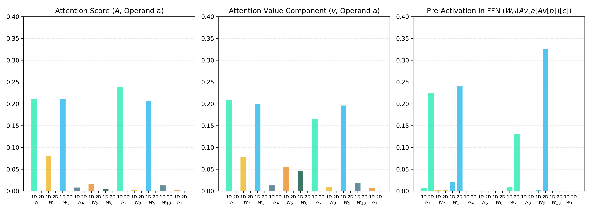

*Figure 3: **Spectral Analysis via Fractional Variance Explained (FVE).** FVE measures the proportion of total power attributed to each frequency’s Fourier coefficients. Bars represent spectral densities for frequencies $w_{k}$, including one-degree (1D) and two-degree (2D) components; 2D features capture quadratic interactions such as $\cos(w_{k}a)\sin(w_{k}b)$. (**Left**) In Attention Score ${\boldsymbol{A}}$, mediating query ($c$) and key ($a$), four selective frequencies emerge. (**Middle**) Value activations (${\boldsymbol{v}}[a]$) align with frequencies $w_{1},w_{3},w_{7},w_{9}$, showing the periodic encoding of operands. (**Right**) At the FFN Pre-activation (position $c$), 1D features vanish while 2D components become dominant, indicating the successful synthesis of modular addition.* **[p. 6]**

The critical transition occurs at the SA-FFN interface. Specifically, we examine the pre-GeLU activations at the result position $c$ (Fig. 3, Right). At this juncture, we observe a distinct spectral shift: one-degree components vanish while two-degree cross-terms, such as $\cos(w_{k}a)\sin(w_{k}b)$, become dominant. This transition is the expected signature of a multiplicative interaction between the two operands’ periodic encodings, serving as the representational prerequisite for implementing the trigonometric addition identities in Eq. 1.

Still, the emergence of 2D Fourier components at position $c$ alone does not confirm that this mixture specifically reflects a modular addition rule. We further verify this by approximating the composition to the trigonometric identities in Eq. 1. While prior work (Nanda et al., 2023) derived trigonometric bases $({\boldsymbol{u}}_{k},{\boldsymbol{v}}_{k})$ through a linear decomposition of weight matrices—justified by the negligible role of residual connections in their setting—such an approach is unsuitable for our framework. Our empirical ablation studies reveal that disabling residual connections during sampling leads to a significant degradation in image resolution and synthesis quality, indicating that these paths carry essential generative information. To ensure a faithful representation of the internal dynamics, we instead adopt a forward-activation approach, extracting the internal bases $({\boldsymbol{u}}_{k},{\boldsymbol{v}}_{k})$ directly from the model’s activations on the $c$ position during the generative process.

###### p6-4

Fortunately, our alternative approach of projecting the intermediate pre-activation FFN features onto Fourier bases derived from the forward activation recovers the trigonometric addition identities with near-perfect fidelity (Table 1). This striking alignment—where a proxy-based projection conforms precisely to theoretical modular arithmetic rules—provides compelling evidence that our empirical bases capture the model’s true internal computational logic, effectively bypassing the analytical barriers posed by the architecture.

*Table 1: The model recovers trigonometric addition identities (Eq. 1) via dominant 2D Fourier components. For the full data, please refer to Table 3* **[p. 7]**

| Target ($W_{L}^{\prime}$) | Computed Fourier Projection | FVE |
|---|---|---|
| $\cos(w_{1}(a+b))$ | $138,910\cos(w_{1}a)\cos(w_{1}b)-139,849\sin(w_{1}a)\sin(w_{1}b)$ | **0.95** |
| $\sin(w_{1}(a+b))$ | $137,133\cos(w_{1}a)\sin(w_{1}b)+136,206\sin(w_{1}a)\cos(w_{1}b)$ | **0.94** |
| $\cos(w_{3}(a+b))$ | $171,404\cos(w_{3}a)\cos(w_{3}b)-181,490\sin(w_{3}a)\sin(w_{3}b)$ | **0.95** |
| $\sin(w_{3}(a+b))$ | $163,861\cos(w_{3}a)\sin(w_{3}b)+160,307\sin(w_{3}a)\cos(w_{3}b)$ | **0.93** |
| $\cos(w_{7}(a+b))$ | $52,852\cos(w_{7}a)\cos(w_{7}b)-53,542\sin(w_{7}a)\sin(w_{7}b)$ | **0.87** |
| $\sin(w_{7}(a+b))$ | $64,718\cos(w_{7}a)\sin(w_{7}b)+64,358\sin(w_{7}a)\cos(w_{7}b)$ | **0.88** |
| $\cos(w_{9}(a+b))$ | $176,727\cos(w_{9}a)\cos(w_{9}b)-178,583\sin(w_{9}a)\sin(w_{9}b)$ | **0.95** |
| $\sin(w_{9}(a+b))$ | $192,981\cos(w_{9}a)\sin(w_{9}b)+195,516\sin(w_{9}a)\cos(w_{9}b)$ | **0.96** |
| Others ($w_{k\notin\{1,3,7,9\}}$) | Coefficients range between $\pm 10^{-3}$ and $\pm 10^{3}$ (Negligible) | $\leq 0.01$ |

To summarize, the combination of high FVE values at position $c$ and the near-perfect recovery of trigonometric identities provides robust evidence for the emergence of algorithmic generalization. However, analyzing a single-image case within a single-step sampling setting remains **[p. 7]** fundamentally analogous to token-based models, as each image essentially serves as a fixed representation for a discrete label. To move beyond this token-like setting and leverage the iterative sampling process inherent to diffusion models, specifically their ability to distill abstract concepts from high-dimensional manifolds, we transition to a more complex regime that incorporates the temporal dimension: the sampling timestep $t$. In the following section, we investigate the multi-step sampling case, where iterative denoising is required to generalize discrete concepts from diverse visual inputs and progressively synthesize the arithmetic result.

### 4.2 Diverse-image Regime (Multi-step Sampling)

Building on our observation that grokking remains feasible at $N=4$ (Figure 2, Middle), we scale the dataset to $N=256$ diverse images per label. While the set of arithmetic operand pairs $(a,b)$ remains identical to the single-image setting, each pair now admits $256^{2}$ distinct visual instantiations. This expansion introduces substantial intraclass variability, enabling us to study how generalization dynamics and internal arithmetic representations evolve across denoising timesteps.

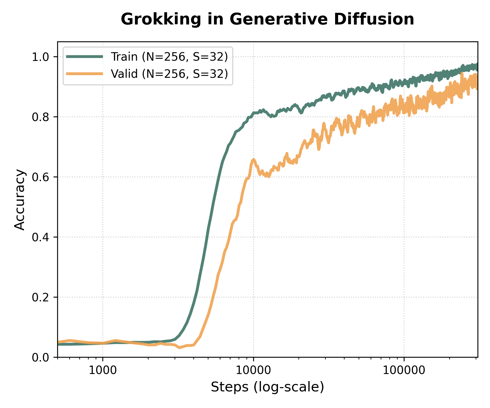

*Figure 4: Grokking dynamics in $N=256$* **[p. 7]**

#### Discrete Concept Formation via FFN

###### p7-2

However, the standard baseline architecture (SA–FFN) failed to trigger grokking in the diverse-image regime ($N=256$). Notably, scaling up the model’s width was insufficient to overcome this failure, indicating that raw capacity alone does not guarantee algorithmic generalization. We hypothesize that for abstract reasoning tasks such as modular addition, the model must distill continuous pixel inputs into discrete concepts before compositional reasoning can occur. To facilitate this, we propose the FFN-sandwich architecture (FFN–SA–FFN) as a key architectural contribution. Our empirical analysis strongly supports this mechanism: PCA visualizations (Figure 5) reveal that the pre-SA FFN successfully disentangles the highly entangled embedding layer and clusters them into distinct classes based on the operation result class. This structural modification allows the subsequent self-attention mechanism to operate on clean, discretized conceptual inputs.

*(a) Input to the Pre-SA-FFN layer*

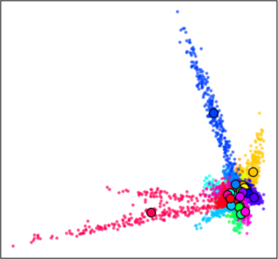

*(b) Output of the Pre-SA-FFN layer*

*Figure 5: **PCA visualization of the Pre-SA-FFN layer’s activations.** Each class is color-coded, with class centroids marked by circles. (a) The input activations—which correspond to the embedding layer’s output—exhibit highly entangled representations, reflecting the high intra-class variance of the continuous input space. (b) Conversely, the output activations demonstrate clear, linearly separable clusters for each class. This confirms that the layer’s auxiliary non-linearity successfully performs symbolic abstraction, distilling diverse continuous inputs into discrete concepts prior to self-attention. Refer to Figure 18 for visualizations of subsequent layers.* **[p. 8]**

#### Grokking in the $N=256$ Regime

###### p7-3

As illustrated in Fig. 4, the $N=256$ regime exhibits a grokking pattern consistent with the $N=4$ case despite the significantly higher visual complexity. The model achieves a terminal validation accuracy of 94%, demonstrating successful algorithmic generalization (see Appendix C.2 for evaluation details).

#### Phase Transition: Arithmetic Inference and Denoising

###### p7-4

To probe the temporal structure of the sampling process ($\text{NFE}=50$), we ask whether distinct timestep ranges serve distinct functional roles. To test this, we perform causal interventions on the result position $c$: we initialize $c$ with either the correct image or an incorrect image $c^{\prime}$, perturbed with Gaussian noise to a level corresponding to a specific intermediate timestep, and begin the ODE sampling from that point (Fig. 6). **[p. 8]** This allows us to test whether the model can still engage the arithmetic circuit or merely denoises the given input, depending on where it enters the sampling trajectory. To monitor whether the arithmetic circuit is active, we measure the entropy of the FVE distribution across frequencies in the FFN pre-activation layer. Lower entropy indicates concentration onto selective frequencies—the signature of arithmetic computation established in Section 4.1.

###### p8-1

Our central finding is a **critical phase transition** that abruptly shifts the model from algorithmic reasoning to visual denoising. Under sufficient noise (green trajectories, Fig. 6(b)), the model forms a low-entropy periodic state, concentrates spectral energy, and successfully overrides the incorrect input $c^{\prime}$. Below a critical noise threshold (red trajectories), this periodic structure collapses, leaving the arithmetic circuit inactive.

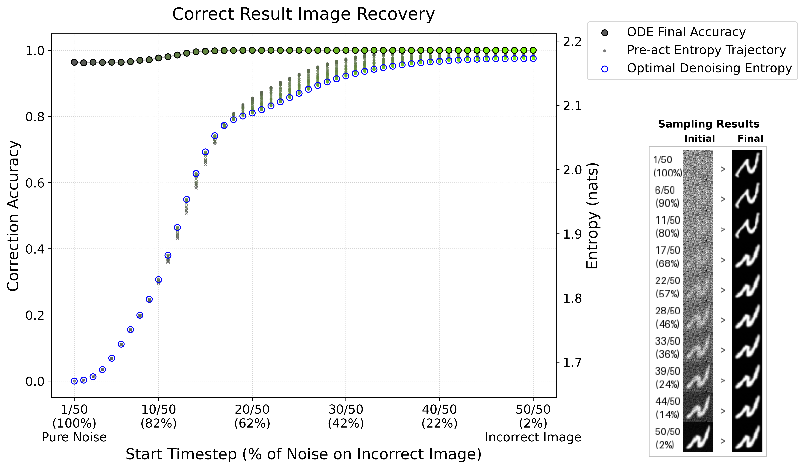

*(a) Correct result image recovery*

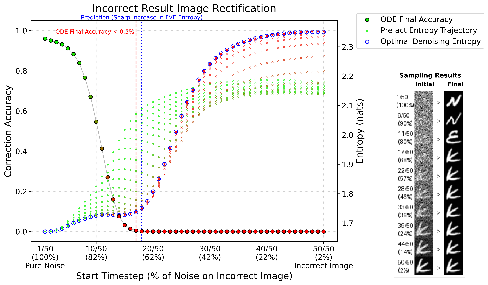

*(b) Incorrect result image rectification*

*Figure 6: **Causal Intervention on Internal Representations.** (a) Correct image $c$ perturbed with varying Gaussian noise levels (gray to green indicates high to low noise). (b) Entropy trajectories starting from an incorrect image $c^{\prime}$ perturbed with varying noise levels. The trajectories are color-coded by the final ODE sampling accuracy, where green denotes successful rectification and red indicates the failure. The initial entropy level of each sampling process is marked with a blue circle. Collectively, these initial points form a trajectory that can be interpreted as the optimal denoising entropy, representing the intrinsic uncertainty of the perturbed image before any model intervention.* **[p. 8]**

This transition is evidenced by the perfect alignment between the failure of algorithmic correction (near-zero ODE final accuracy) and the radical spike in the optimal denoising FVE entropy (Figs. 41 and 6b). This temporal coincidence confirms that the entropy spike strictly marks the exact boundary where the model abandons frequency concentration and ceases algorithmic reasoning.

**[p. 9]**

## 5 Conclusion

We demonstrate that diffusion models exhibit grokking in modular addition, enabling the mechanistic analysis of algorithmic learning within generative frameworks. Our investigation reveals that the FFN-sandwich architecture distills discrete arithmetic rules into structured periodic representations, while the multi-step sampling process undergoes a distinct phase transition—shifting from global algorithmic reasoning to local generative refinement. These findings establish a foundation for the mechanistic interpretability of diffusion models.

## References

- J. Abramson, J. Adler, J. Dunger, R. Evans, T. Green, A. Pritzel, O. Ronneberger, L. Willmore, A. J. Ballard, J. Bambrick, et al. (2024) Accurate structure prediction of biomolecular interactions with alphafold 3. Nature 630 (8016), pp. 493–500. Cited by: §1.

- S. K. Aithal, P. Maini, Z. Lipton, and J. Z. Kolter (2024) Understanding hallucinations in diffusion models through mode interpolation. Advances in neural information processing systems 37, pp. 134614–134644. Cited by: §2.

- T. Bonnaire, R. Urfin, G. Biroli, and M. Mézard (2025) Why diffusion models don’t memorize: the role of implicit dynamical regularization in training. arXiv preprint arXiv:2505.17638. Cited by: §2.

- J. Bruce, M. D. Dennis, A. Edwards, J. Parker-Holder, Y. Shi, E. Hughes, M. Lai, A. Mavalankar, R. Steigerwald, C. Apps, et al. (2024) Genie: generative interactive environments. In Forty-first International Conference on Machine Learning, Cited by: §1.

- S. Buchanan, D. Pai, Y. Ma, and V. De Bortoli (2025) On the edge of memorization in diffusion models. arXiv preprint arXiv:2508.17689. Cited by: §1, §2.

- N. Cammarata, S. Carter, G. Goh, C. Olah, M. Petrov, L. Schubert, C. Voss, B. Egan, and S. K. Lim (2020) Thread: circuits. Distill. Note: https://distill.pub/2020/circuits External Links: Document Cited by: §2.

- T. Clanuwat, M. Bober-Irizar, A. Kitamoto, A. Lamb, K. Yamamoto, and D. Ha (2018) Deep learning for classical japanese literature. CoRR abs/1812.01718. External Links: Link, 1812.01718 Cited by: §C.1, Appendix F, §3.2.

- G. Cohen, S. Afshar, J. Tapson, and A. van Schaik (2017) EMNIST: an extension of mnist to handwritten letters. arXiv preprint arXiv:1702.05373. Cited by: §3.2.

- A. Conmy, A. Mavor-Parker, A. Lynch, S. Heimersheim, and A. Garriga-Alonso (2023) Towards automated circuit discovery for mechanistic interpretability. Advances in Neural Information Processing Systems 36, pp. 16318–16352. Cited by: §2.

- H. Cunningham, A. Ewart, L. Riggs, R. Huben, and L. Sharkey (2023) Sparse autoencoders find highly interpretable features in language models. arXiv preprint arXiv:2309.08600. Cited by: §2.

- X. Davies, L. Langosco, and D. Krueger (2023) Unifying grokking and double descent. arXiv preprint arXiv:2303.06173. Cited by: §2.

- J. Deschenaux, I. Krawczuk, G. Chrysos, and V. Cevher (2024) Going beyond compositions, ddpms can produce zero-shot interpolations. External Links: 2405.19201, Link Cited by: §2.

- N. Elhage, N. Nanda, C. Olsson, T. Henighan, N. Joseph, B. Mann, A. Askell, Y. Bai, A. Chen, T. Conerly, N. DasSarma, D. Drain, D. Ganguli, Z. Hatfield-Dodds, D. Hernandez, A. Jones, J. Kernion, L. Lovitt, K. Ndousse, D. Amodei, T. Brown, J. Clark, J. Kaplan, S. McCandlish, and C. Olah (2021) A mathematical framework for transformer circuits. Transformer Circuits Thread. Note: https://transformer-circuits.pub/2021/framework/index.html Cited by: §1, §2.

**[p. 10]**

- K. He, X. Zhang, S. Ren, and J. Sun (2015) Deep residual learning for image recognition. External Links: 1512.03385, Link Cited by: §3.3.

- D. Hendrycks and K. Gimpel (2023) Gaussian error linear units (gelus). External Links: 1606.08415, Link Cited by: Appendix A.

- J. Ho, A. Jain, and P. Abbeel (2020) Denoising diffusion probabilistic models. Advances in neural information processing systems 33, pp. 6840–6851. Cited by: §1.

- Z. Kadkhodaie, F. Guth, E. P. Simoncelli, and S. Mallat (2023) Generalization in diffusion models arises from geometry-adaptive harmonic representations. arXiv preprint arXiv:2310.02557. Cited by: §2.

- M. Kamb and S. Ganguli (2025) An analytic theory of creativity in convolutional diffusion models. In Forty-second International Conference on Machine Learning, External Links: Link Cited by: §1.

- T. Kumar, B. Bordelon, S. J. Gershman, and C. Pehlevan (2023) Grokking as the transition from lazy to rich training dynamics. In The twelfth international conference on learning representations, Cited by: §2.

- M. Kwon, J. Jeong, and Y. Uh (2023) Diffusion models already have a semantic latent space. External Links: 2210.10960, Link Cited by: §2.

- T. Li and K. He (2025) Back to basics: let denoising generative models denoise. arXiv preprint arXiv:2511.13720. Cited by: §1.

- T. Li and K. He (2026) Back to basics: let denoising generative models denoise. External Links: 2511.13720, Link Cited by: Appendix A, §3.2, §3.3.

- Y. Lipman, R. T. Chen, H. Ben-Hamu, M. Nickel, and M. Le (2022) Flow matching for generative modeling. arXiv preprint arXiv:2210.02747. Cited by: §1, §3.3.

- X. Liu, C. Gong, and Q. Liu (2022a) Flow straight and fast: learning to generate and transfer data with rectified flow. arXiv preprint arXiv:2209.03003. Cited by: Appendix A, §1, §3.3.

- Z. Liu, E. J. Michaud, and M. Tegmark (2022b) Omnigrok: grokking beyond algorithmic data. arXiv preprint arXiv:2210.01117. Cited by: §2.

- R. Lu, R. Wang, K. Lyu, X. Jiang, G. Huang, and M. Wang (2025) Towards understanding text hallucination of diffusion models via local generation bias. In The Thirteenth International Conference on Learning Representations, Cited by: §2.

- N. Nanda, L. Chan, T. Lieberum, J. Smith, and J. Steinhardt (2023) Progress measures for grokking via mechanistic interpretability. arXiv preprint arXiv:2301.05217. Cited by: §1, §1, §2, §3.1, §3.2, §3.3, §4.1.

- M. Okawa, E. S. Lubana, R. P. Dick, and H. Tanaka (2025) Compositional abilities emerge multiplicatively: exploring diffusion models on a synthetic task. External Links: 2310.09336, Link Cited by: §2.

- C. Olsson, N. Elhage, N. Nanda, N. Joseph, N. DasSarma, T. Henighan, B. Mann, A. Askell, Y. Bai, A. Chen, T. Conerly, D. Drain, D. Ganguli, Z. Hatfield-Dodds, D. Hernandez, S. Johnston, A. Jones, J. Kernion, L. Lovitt, K. Ndousse, D. Amodei, T. Brown, J. Clark, J. Kaplan, S. McCandlish, and C. Olah (2022) In-context learning and induction heads. Transformer Circuits Thread. Note: https://transformer-circuits.pub/2022/in-context-learning-and-induction-heads/index.html Cited by: §1.

- C. F. Park, M. Okawa, A. Lee, H. Tanaka, and E. S. Lubana (2024) Emergence of hidden capabilities: exploring learning dynamics in concept space. External Links: 2406.19370, Link Cited by: §2.

- Y. Park, M. Kwon, J. Choi, J. Jo, and Y. Uh (2023) Understanding the latent space of diffusion models through the lens of riemannian geometry. External Links: 2307.12868, Link Cited by: §2.

**[p. 11]**

- W. Peebles and S. Xie (2023) Scalable diffusion models with transformers. In Proceedings of the IEEE/CVF international conference on computer vision, pp. 4195–4205. Cited by: Figure 7, Appendix A, §3.3.

- B. Pham, G. Raya, M. Negri, M. J. Zaki, L. Ambrogioni, and D. Krotov (2025) Memorization to generalization: emergence of diffusion models from associative memory. arXiv preprint arXiv:2505.21777. Cited by: §1, §2.

- A. Power, Y. Burda, H. Edwards, I. Babuschkin, and V. Misra (2022) Grokking: generalization beyond overfitting on small algorithmic datasets. arXiv preprint arXiv:2201.02177. Cited by: §1, §2, §3.2, §3.2, §3.3.

- I. Price, A. Sanchez-Gonzalez, F. Alet, T. R. Andersson, A. El-Kadi, D. Masters, T. Ewalds, J. Stott, S. Mohamed, P. Battaglia, et al. (2025) Probabilistic weather forecasting with machine learning. Nature 637 (8044), pp. 84–90. Cited by: §1.

- A. Ramesh, P. Dhariwal, A. Nichol, C. Chu, and M. Chen (2022) Hierarchical text-conditional image generation with clip latents. arXiv preprint arXiv:2204.06125 1 (2), pp. 3. Cited by: §1.

- R. Rombach, A. Blattmann, D. Lorenz, P. Esser, and B. Ommer (2022) High-resolution image synthesis with latent diffusion models. In Proceedings of the IEEE/CVF conference on computer vision and pattern recognition, pp. 10684–10695. Cited by: §1.

- C. Saharia, W. Chan, S. Saxena, L. Li, J. Whang, E. L. Denton, K. Ghasemipour, R. Gontijo Lopes, B. Karagol Ayan, T. Salimans, et al. (2022) Photorealistic text-to-image diffusion models with deep language understanding. Advances in neural information processing systems 35, pp. 36479–36494. Cited by: §1.

- N. Shazeer (2020) GLU variants improve transformer. External Links: 2002.05202, Link Cited by: Appendix A.

- J. Sohl-Dickstein, E. Weiss, N. Maheswaranathan, and S. Ganguli (2015) Deep unsupervised learning using nonequilibrium thermodynamics. In International conference on machine learning, pp. 2256–2265. Cited by: §1.

- K. Song, J. Kim, S. Chen, Y. Du, S. Kakade, and V. Sitzmann (2025) Selective underfitting in diffusion models. arXiv preprint arXiv:2510.01378. Cited by: §1.

- Y. Song, J. Sohl-Dickstein, D. P. Kingma, A. Kumar, S. Ermon, and B. Poole (2020) Score-based generative modeling through stochastic differential equations. arXiv preprint arXiv:2011.13456. Cited by: §1.

- J. Su, M. Ahmed, Y. Lu, S. Pan, W. Bo, and Y. Liu (2024) Roformer: enhanced transformer with rotary position embedding. Neurocomputing 568, pp. 127063. Cited by: Appendix A.

- V. Surkov, C. Wendler, A. Mari, M. Terekhov, J. Deschenaux, R. West, C. Gulcehre, and D. Bau (2025) One-step is enough: sparse autoencoders for text-to-image diffusion models. External Links: 2410.22366, Link Cited by: §2.

- Z. Tian, S. Nan, M. Xu, S. Zhai, W. Qu, J. Liu, R. Jia, and J. Zhang (2025) Sparse autoencoder as a zero-shot classifier for concept erasing in text-to-image diffusion models. External Links: 2503.09446, Link Cited by: §2.

- V. Varma, R. Shah, Z. Kenton, J. Kramár, and R. Kumar (2023) Explaining grokking through circuit efficiency. arXiv preprint arXiv:2309.02390. Cited by: §2.

- J. Von Oswald, E. Niklasson, E. Randazzo, J. Sacramento, A. Mordvintsev, A. Zhmoginov, and M. Vladymyrov (2023) Transformers learn in-context by gradient descent. In International Conference on Machine Learning, pp. 35151–35174. Cited by: §1.

- T. Wan, A. Wang, B. Ai, B. Wen, C. Mao, C. Xie, D. Chen, F. Yu, H. Zhao, J. Yang, et al. (2025) Wan: open and advanced large-scale video generative models. arXiv preprint arXiv:2503.20314. Cited by: §1.

**[p. 12]**

- K. Wang, A. Variengien, A. Conmy, B. Shlegeris, and J. Steinhardt (2022) Interpretability in the wild: a circuit for indirect object identification in gpt-2 small. arXiv preprint arXiv:2211.00593. Cited by: §2.

- T. Wiedemer, Y. Li, P. Vicol, S. S. Gu, N. Matarese, K. Swersky, B. Kim, P. Jaini, and R. Geirhos (2025) Video models are zero-shot learners and reasoners. arXiv preprint arXiv:2509.20328. Cited by: §1.

- T. Wiedemer, P. Mayilvahanan, M. Bethge, and W. Brendel (2023) Compositional generalization from first principles. External Links: 2307.05596, Link Cited by: §2.

- B. Wu, C. Zou, C. Li, D. Huang, F. Yang, H. Tan, J. Peng, J. Wu, J. Xiong, J. Jiang, et al. (2025) HunyuanVideo 1.5 technical report. arXiv preprint arXiv:2511.18870. Cited by: §1.

- C. Zhang, C. Zhang, S. Zheng, M. Zhang, M. Qamar, S. Bae, and I. S. Kweon (2023) A survey on audio diffusion models: text to speech synthesis and enhancement in generative ai. arXiv preprint arXiv:2303.13336. Cited by: §1.

- Q. Zhang, M. Tao, and Y. Chen (2022) Gddim: generalized denoising diffusion implicit models. arXiv preprint arXiv:2206.05564. Cited by: §4.1.

- Z. Zhong, Z. Liu, M. Tegmark, and J. Andreas (2023) The clock and the pizza: two stories in mechanistic explanation of neural networks. Advances in neural information processing systems 36, pp. 27223–27250. Cited by: §1, §1, §2, §3.2.

**[p. 13]**

## Appendix A Implementation Details

We train our model using the Rectified Flow (RF) framework (Liu et al., 2022a) to predict the velocity vector $v_{\theta}(x_{t},t)$. Following the $x_{0}$-parameterization adopted in this work, the model directly predicts the clean image $x_{0}$, which is related to the velocity by $v_{\theta}(x_{t},t)=(x_{t}-x_{0})/t$. This formulation enables a straight-path mapping between noise and pixel space, which we find more conducive to visualizing the structural organization of representations during the denoising process (Li & He, 2026). Figure 27 depicts the overall DiT architecture. The detailed hyperparameters used in our experiments are as follows:

#### Patchification ($S$)

Following the Diffusion Transformer (DiT) architecture (Peebles & Xie, 2023), we divide each $32\times 32$ pixel image into non-overlapping patches of size $S$. Our setup consists of three images (operands $a,b$ and result $c$), which are converted into a sequence of tokens representing their respective spatial regions. While our baseline utilizes $S=1$ to facilitate mechanistic clarity, we also evaluate $S=16$, yielding 4 patches per image and a total sequence length of 12 tokens. This configuration successfully exhibited a near-grokking phenomenon. Achieving full grokking in this patch-based regime would necessitate learning complex dependencies across patch boundaries. Consequently, investigating the high-dimensional interactions between these spatial tokens offers a promising avenue for deciphering how the model’s underlying circuit coordinates generative tasks across distributed representations.

*Figure 7: **Schematic of the Single-Layer Diffusion Transformer Architecture.** The operands $a,b$ and a Gaussian noise map are concatenated, patchified, and projected into the latent space. Within the self-attention block, the model computes components $Av[a]$ and $Av[b]$, which are then fused at the attention-FFN interface. This transition facilitates a quadratic mixture of operand features, enabling the emergence of the modular addition algorithm. Temporal context from sampling time $t$ is injected via Adaptive Layer Normalization (AdaLN) (Peebles & Xie, 2023), while the Residual Gate dynamically modulates the information flow between layers. The process culminates in the direct synthesis of the target image $c$ within the high-dimensional pixel space at the original noise location.* **[p. 13]**

**[p. 14]**

#### Embedding and Unembedding Layers

We utilize untied linear layers for patch processing. The embedding matrix $W_{E}\in\mathbb{R}^{d\times d_{\text{patch}}}$ and unembedding matrix $W_{U}\in\mathbb{R}^{d_{\text{patch}}\times d}$ are independently parameterized. For the baseline model ($S=32$), $d_{\text{patch}}=1024$. For the multi-patch configuration ($S=8$) used in our mechanistic analysis, we set $d_{\text{patch}}=64$. This allows us to investigate the high-dimensional interactions between spatial tokens.

#### Self-attention

The self-attention block consists of 16 heads with a model dimension $d=512$, resulting in a head dimension of $d_{h}=32$. We incorporate 2D Rotary Positional Embeddings (RoPE) (Su et al., 2024) to provide spatial context for the patchified tokens.

#### Feedforward Network

The FFN comprises 512 hidden neurons with GeLU activation (Hendrycks & Gimpel, 2023), maintaining a $1\times$ expansion ratio to balance capacity and simplicity. While we explored more complex variants such as SwiGLU (Shazeer, 2020) for improved reconstruction, we found that the standard GeLU activation offered superior clarity for mechanistic interpretability, specifically in tracking the entropy transitions of pre-activation states.

*Table 2: Model and dataset hyperparameters.* **[p. 14]**

| **Parameter** | **Value** |
|---|---|
| *Dataset* |  |
| Modulus ($P$) | 23 |
| Images per symbol ($N$) | 1, 4, 256 |
| Training ratio ($R$) | 0.9 |
| Image resolution | $32\times 32$ |
| Patch size | $32\times 32$, $16\times 16$ |
| *Architecture* |  |
| Model dimension ($d_{\text{model}}$) | 512, 2048 |
| Number of layers | 1 |
| Number of heads | 16, 64 |
| Head dimension ($d_{h}$) | 32 |
| FFN dimension | 512, 2048 |
| Positional encoding | RoPE |
| FFN activation | GeLU |
| Total parameters | 2.1M, 106.1M |

**[p. 15]**

## Appendix B Single-Image Regime Details

### B.1 Sampling Results

We first present the single-step inference results generated by our model. Since each label is represented by a single image, the model simply memorizes the mapping and outputs the corresponding image according to the rules of modular addition.

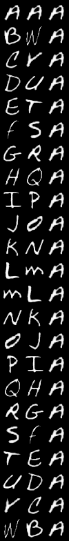

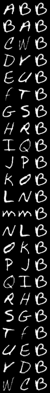

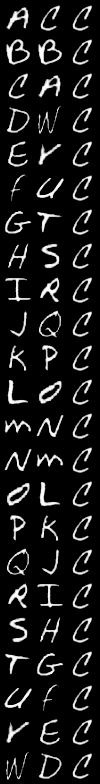

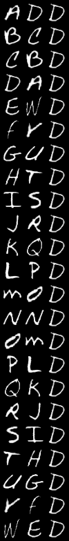

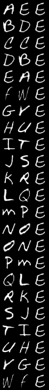

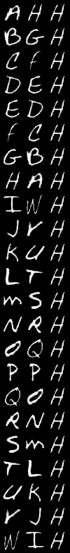

*Figure 8: **Single-step sampling results*** **[p. 15]**

**[p. 16]**

### B.2 Fourier Analyses Results

We present comprehensive Fourier analysis results across all layers, including both FVE bar charts and neuron-level activations. For each layer, the left-hand bar chart displays the FVE for frequencies $w_{1},\ldots,w_{11}$. Consistent with the discussion in Section 4.1, we observe that the FVE is not concentrated within this specific framework.

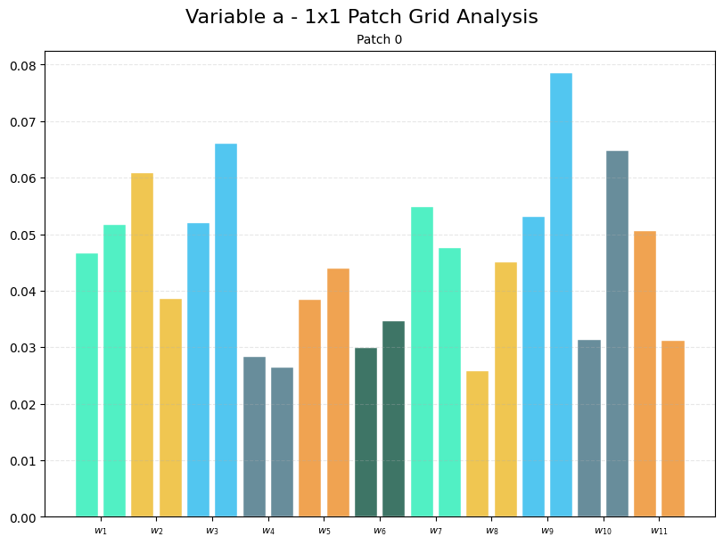

*(a) FVE barchart*

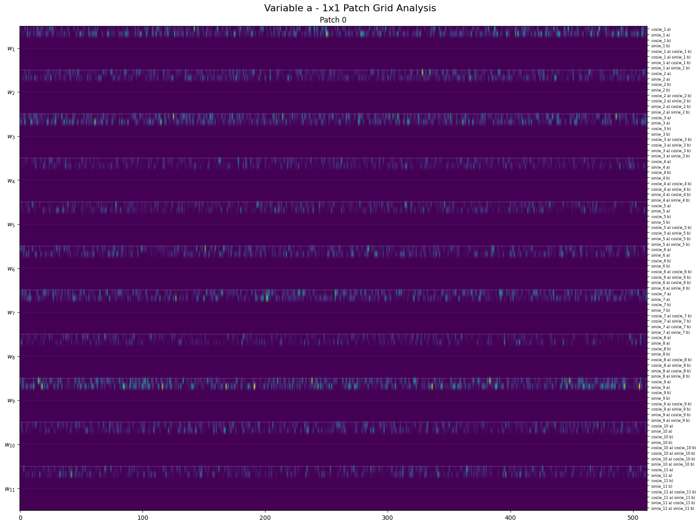

*(b) Heatmap of activations in neuron and head level*

*Figure 9: **Embedding Activation of the operand** $a$* **[p. 16]**

However, we observe the distinct significance of four specific frequencies–$w_{1},w_{3},w_{7}$, and $w_{9}$–within the self-attention blocks, as shown below. For these layers, we further provide activations at the individual attention head level. Notably, our analysis reveals that specific heads specialize in capturing a single, isolated frequency.

*(a) FVE barchart*

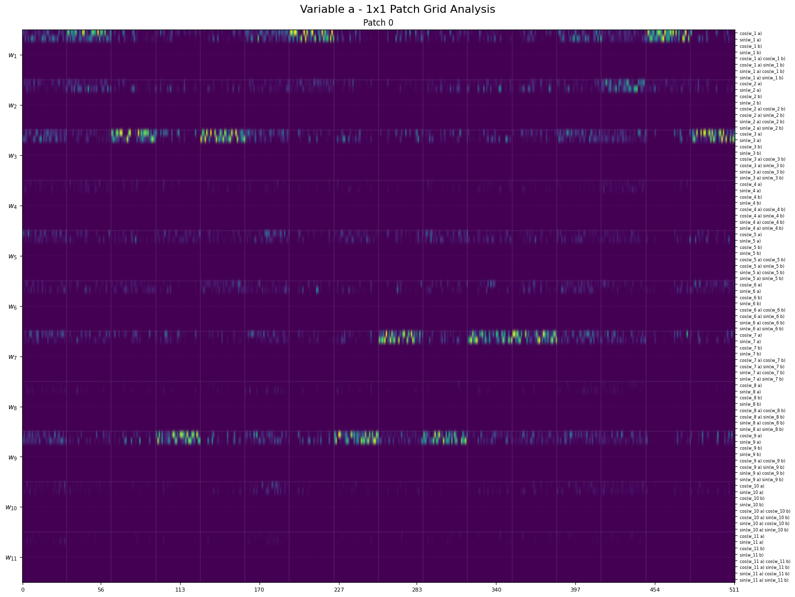

*(b) Heatmap of activations in neuron and head level*

*Figure 10: **Attention Value Activation of the operand** $a$* **[p. 16]**

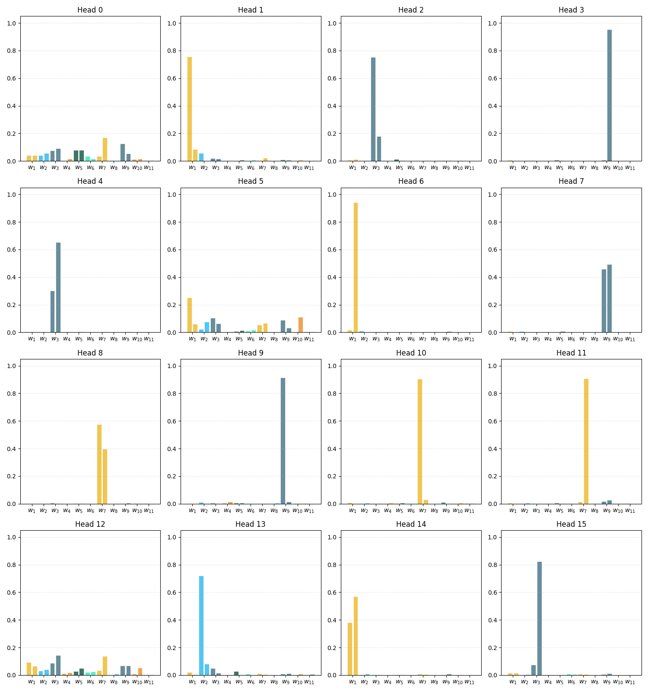

*(a) FVE barchart*

*(b) Heatmap of activations in neuron and head level*

*Figure 11: **Attention Key Activation of the operand** $a$* **[p. 17]**

*(a) FVE barchart*

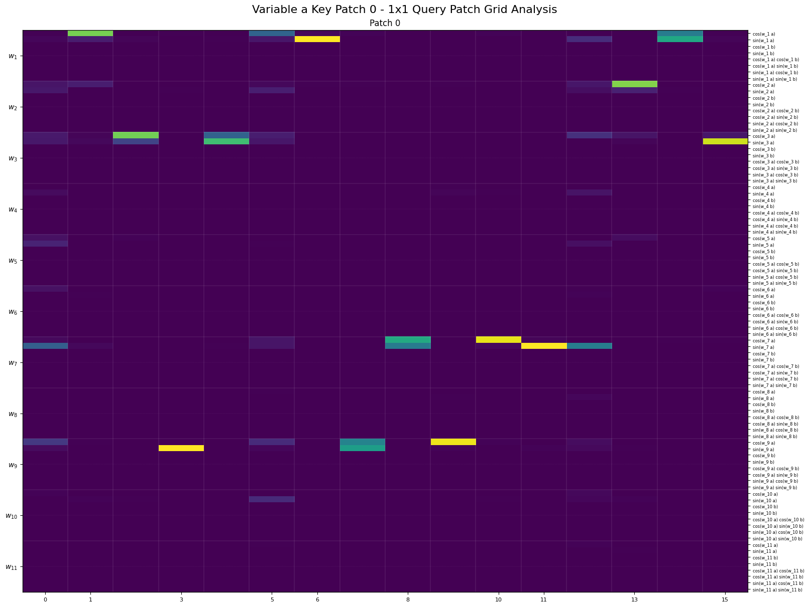

*(b) Heatmap of activations in head level*

*Figure 12: **Attention Score Activation of the operand** $a$* **[p. 17]**

*(a) FVE barchart*

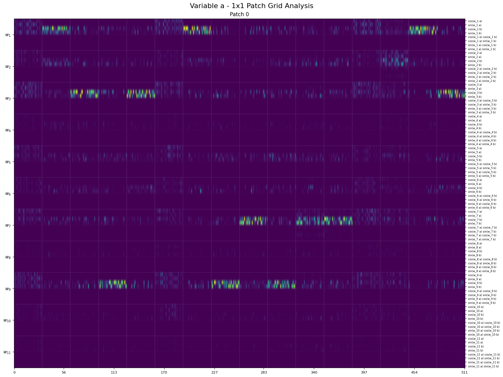

*(b) Heatmap of activations in neuron and head level*

*Figure 13: **Attention ${\boldsymbol{A}}{\boldsymbol{v}}$ Activation of the operand** $a$* **[p. 17]**

**[p. 18]**

The self-attention mechanism architecturally composes the activations of individual operands, ${\boldsymbol{A}}{\boldsymbol{v}}[a]$ and ${\boldsymbol{A}}{\boldsymbol{v}}[b]$. Consequently, we can observe both 2D components at the result position $c$, as illustrated in the following graphs. Notably, at this layer, the activation at $c$ is not yet fully distilled into 2D components, but instead exhibits a mixture of 1D and 2D components.

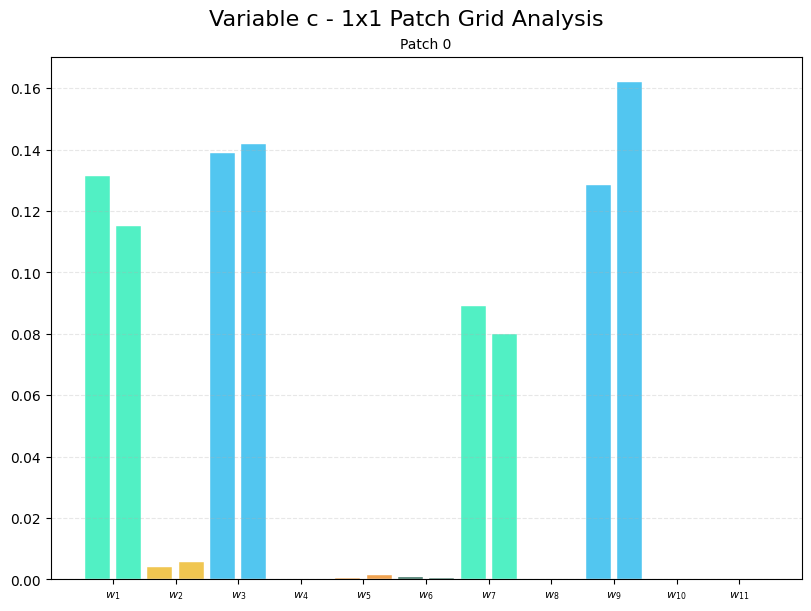

*(a) FVE barchart*

*(b) Heatmap of activations in neuron and head level*

*Figure 14: **Attention Out Activation of the operation result** $c$* **[p. 18]**

Finally, at the pre-Gelu activation stage of the FFN layer, the activation at position $c$ is clearly composed of 2D FVEs corresponding to the selective frequencies shared throughout the preceding SA block. This characteristic motivated our focus on this specific layer, as it structurally represents the emergence of arithmetic generalization.

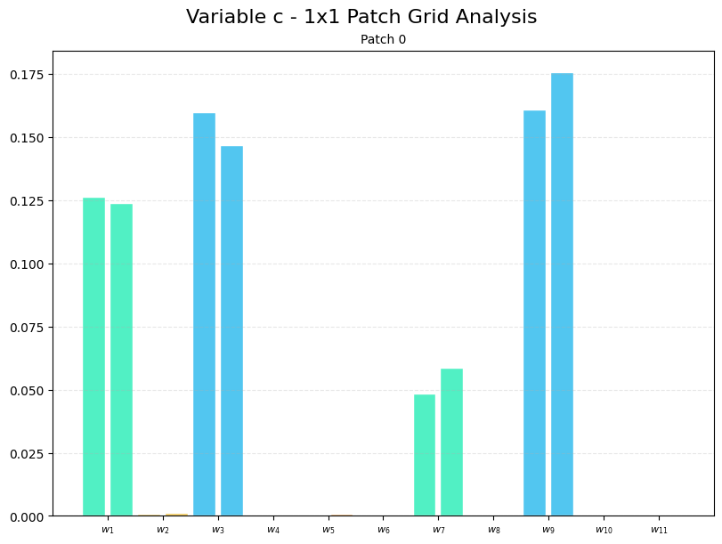

*(a) FVE barchart*

*(b) Heatmap of activations in neuron and head level*

*Figure 15: **FFN Pre-GeLU Activation of the operation result** $c$* **[p. 18]**

At this layer, we derived the Fourier basis and recovered the underlying trigonometric identities, as it exhibited the most significant periodic structures characterized by 2D signals. The following table presents the complete set of recovered identities, demonstrating a clear correlation with the addition of angular values.

*Table 3: **Fourier Analysis of FFN Pre-activations.** The table demonstrates the full detail of the model’s recovery of trigonometric addition identities (Eq. 1) through dominant 2D Fourier components across selective frequencies ($w_{1},w_{3},w_{7},w_{9}$) along with non-significant frequencies.* **[p. 19]**

| $W_{L}^{\prime}$ | $\mathbf{u}_{k}^{\top}\text{FFN}_{\text{pre\_act}}(a,b)$ and $\mathbf{v}_{k}^{\top}\text{FFN}_{\text{pre\_act}}(a,b)$ | FVE |
|---|---|---|
| $\cos(w_{1}(a+b))$ | $138910\cos(w_{1}a)\cos(w_{1}b)-139849\sin(w_{1}a)\sin(w_{1}b)$ | **0.95** |
| $\sin(w_{1}(a+b))$ | $137133\cos(w_{1}a)\sin(w_{1}b)+136206\sin(w_{1}a)\cos(w_{1}b)$ | **0.94** |
| $\cos(w_{2}(a+b))$ | $939\cos(w_{2}a)\cos(w_{2}b)-426\sin(w_{2}a)\sin(w_{2}b)$ | $0.01$ |
| $\sin(w_{2}(a+b))$ | $1017\cos(w_{2}a)\sin(w_{2}b)+1081\sin(w_{2}a)\cos(w_{2}b)$ | $0.01$ |
| $\cos(w_{3}(a+b))$ | $171404\cos(w_{3}a)\cos(w_{3}b)-181490\sin(w_{3}a)\sin(w_{3}b)$ | **0.95** |
| $\sin(w_{3}(a+b))$ | $163861\cos(w_{3}a)\sin(w_{3}b)+160307\sin(w_{3}a)\cos(w_{3}b)$ | **0.93** |
| $\cos(w_{4}(a+b))$ | $168\cos(w_{4}a)\cos(w_{4}b)-168\sin(w_{4}a)\sin(w_{4}b)$ | $0.00$ |
| $\sin(w_{4}(a+b))$ | $74\cos(w_{4}a)\sin(w_{4}b)+83\sin(w_{4}a)\cos(w_{4}b)$ | $0.00$ |
| $\cos(w_{5}(a+b))$ | $315\cos(w_{5}a)\cos(w_{5}b)-410\sin(w_{5}a)\sin(w_{5}b)$ | $0.00$ |
| $\sin(w_{5}(a+b))$ | $403\cos(w_{5}a)\sin(w_{5}b)+420\sin(w_{5}a)\cos(w_{5}b)$ | $0.00$ |
| $\cos(w_{6}(a+b))$ | $245\cos(w_{6}a)\cos(w_{6}b)-117\sin(w_{6}a)\sin(w_{6}b)$ | $0.00$ |
| $\sin(w_{6}(a+b))$ | $259\cos(w_{6}a)\sin(w_{6}b)+294\sin(w_{6}a)\cos(w_{6}b)$ | $0.00$ |
| $\cos(w_{7}(a+b))$ | $52852\cos(w_{7}a)\cos(w_{7}b)-53542\sin(w_{7}a)\sin(w_{7}b)$ | **0.87** |
| $\sin(w_{7}(a+b))$ | $64718\cos(w_{7}a)\sin(w_{7}b)+64358\sin(w_{7}a)\cos(w_{7}b)$ | **0.88** |
| $\cos(w_{8}(a+b))$ | $105\cos(w_{8}a)\cos(w_{8}b)-65\sin(w_{8}a)\sin(w_{8}b)$ | $0.00$ |
| $\sin(w_{8}(a+b))$ | $87\cos(w_{8}a)\sin(w_{8}b)+81\sin(w_{8}a)\cos(w_{8}b)$ | $0.00$ |
| $\cos(w_{9}(a+b))$ | $176727\cos(w_{9}a)\cos(w_{9}b)-178583\sin(w_{9}a)\sin(w_{9}b)$ | **0.95** |
| $\sin(w_{9}(a+b))$ | $192981\cos(w_{9}a)\sin(w_{9}b)+195516\sin(w_{9}a)\cos(w_{9}b)$ | **0.96** |
| $\cos(w_{10}(a+b))$ | $41\cos(w_{10}a)\cos(w_{10}b)-86\sin(w_{10}a)\sin(w_{10}b)$ | $0.00$ |
| $\sin(w_{10}(a+b))$ | $149\cos(w_{10}a)\sin(w_{10}b)+141\sin(w_{10}a)\cos(w_{10}b)$ | $0.00$ |
| $\cos(w_{11}(a+b))$ | $109\cos(w_{11}a)\cos(w_{11}b)-103\sin(w_{11}a)\sin(w_{11}b)$ | $0.00$ |
| $\sin(w_{11}(a+b))$ | $47\cos(w_{11}a)\sin(w_{11}b)+46\sin(w_{11}a)\cos(w_{11}b)$ | $0.00$ |

**[p. 19]**

Interestingly, the FFN layer’s Gelu activation spreads the signals—previously concentrated on selective frequencies—across the entire frequency spectrum. This indicates that the non-linear transformation redistributes the distilled arithmetic information, effectively mapping it back to the broader representation space required for final image synthesis.

*(a) FVE barchart*

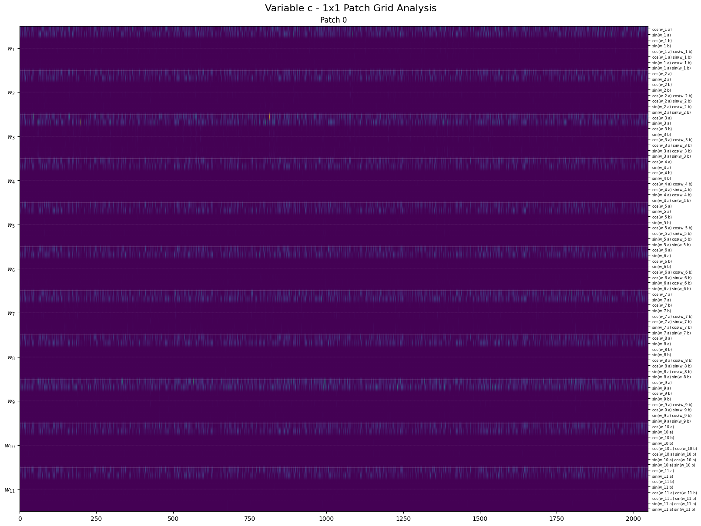

*(b) Heatmap of activations in neuron and head level*

*Figure 16: **FFN Post-GeLU Activation of the operation result** $c$* **[p. 19]**

Finally, we present the output activation of the final MLP layer. This activation is unpatchified by the network and mapped back into the image modality. As illustrated, the distinct frequency signals—previously dominant in the internal layers—are no longer present, indicating that the representation has been fully transformed into the spatial domain for final image synthesis.

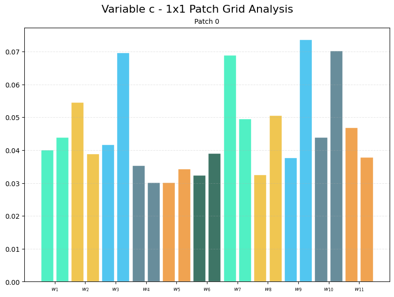

*(a) FVE barchart*

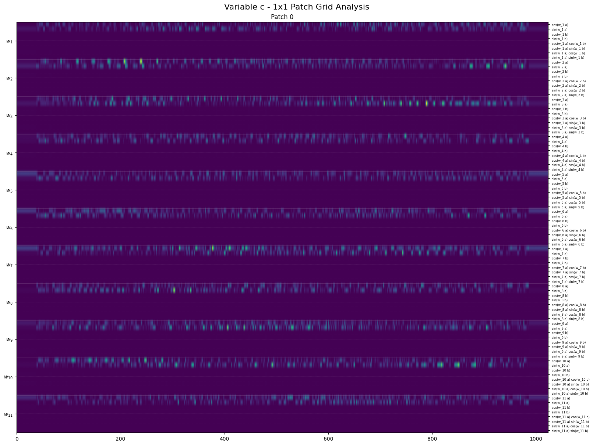

*(b) Heatmap of activations in neuron and head level*

*Figure 17: **Final MLP Layer’s output activation** on result position $c$* **[p. 20]**

**[p. 20]**

## Appendix C Multiple-Image Regime Detail

### C.1 FFN Sandwich architecture

To facilitate the effective mapping of high-dimensional visual inputs into an algorithmic space, we adopt an auxiliary FFN layer situated between the embedding layer and the Self-Attention (SA) block. Visualization via PCA demonstrates that this ”Sandwich” architecture successfully projects diverse pixel-level data into discrete, label-specific clusters at the very beginning of the model’s processing pipeline.

Additionally, in Appendix F, we provide an ablation study on the heterogeneous Kuzushiji-MNIST dataset (Clanuwat et al., 2018). Because this dataset contains relatively more complex spatial structures compared to the original EMNIST dataset, the periodic structures observed in models trained on it serve as strong evidence that our FFN-sandwich architecture robustly learns discrete concepts even in much more challenging visual situations.

Beyond validating the Pre-SA-FFN layer’s role in learning discrete concepts, the PCA visualizations offer compelling geometric evidence of the periodic structures discussed in our Fourier analysis. As shown in Figure 18, the representations at the position of operand $a$ exhibit distinct clustering by modular labels right from the initial timestep ($t=0$), and these clusters remain robust throughout the denoising trajectory. Notably, when projected into the subsequent Attention Key space, these activations self-organize into a clear ring-structured geometry (Figure 19). The emergence of this circular manifold perfectly corroborates our frequency-domain findings, demonstrating that the model naturally embeds discrete label clusters into a continuous, periodic representation space to compute modular arithmetic.

*Figure 18: PCA at the operand $a$ position at timestep = 0* **[p. 21]**

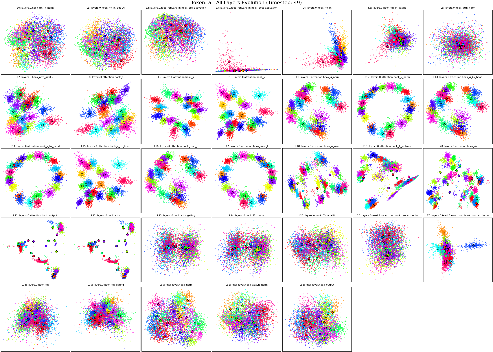

*Figure 19: PCA at the operand $a$ position at timestep = 50* **[p. 21]**

**[p. 21]**

### C.2 Construction of the Evaluation Dataset

To rigorously evaluate the model’s algorithmic generalization beyond simple visual mapping, we constructed a large-scale, non-redundant dataset for the $N=256$ regime. The construction process followed a strict protocol to ensure both arithmetic coverage and visual diversity:

1. **Visual Diversity:** For each label in the modular arithmetic group $\mathbb{Z}_{P}$, we utilized a pool of 256 unique, high-confidence EMNIST images.
2. **Non-redundant Pairing:** To prevent the model from memorizing specific image pairs, we implemented a shuffling-and-sampling mechanism. **[p. 22]** For each possible arithmetic combination $(a,b)$, images were drawn from their respective pools without replacement until all 256 images per label were consumed.
3. **Total Sample Volume:** This process resulted in a total of $11\times P^{2}$ unique evaluation pairs (e.g. 5,819 pairs for the $P=23$ baseline case), where each pair represents a distinct visual instantiation of the underlying modular addition.

### C.3 Inference Performance

On this exhaustive dataset, the diffusion model achieved an inference accuracy of 95%. This performance is particularly significant as it approaches the 95% upper bound of the dedicated ResNet-18 classifier used for validation. The high accuracy on a dataset where all possible image-based combinations are tested without repetition demonstrates that the model has successfully distilled the abstract modular logic from the high-dimensional visual manifold.

We visualize the sampling process across discrete time steps. Following convention, we denote $t=1$ as the initial noise state and $x_{0}$ as the final synthesized image. The interval $[1,0]$ is discretized into 50 uniform steps to illustrate the transition. For clarity in the visualization below, we index these steps as $T=0$ (initial noise) to $T=50$ (final image). Prediction accuracy is evaluated using a ResNet classifier pre-trained on the EMNIST dataset. Red, yellow, and green bounding boxes indicate that the classifier identifies the generated image as incorrect, low-confidence, or correct, respectively.

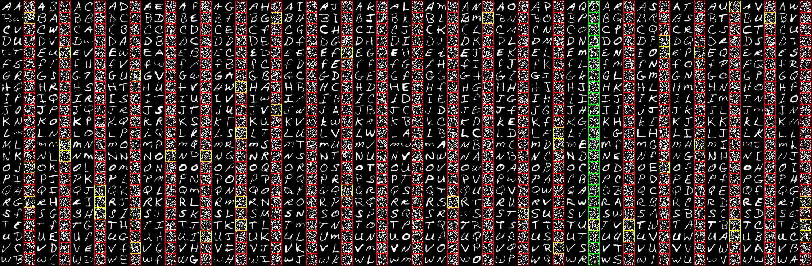

*Figure 20: Timestep 0 with accuracy 0%* **[p. 22]**

*Figure 21: Timestep 21 with accuracy 7%* **[p. 22]**

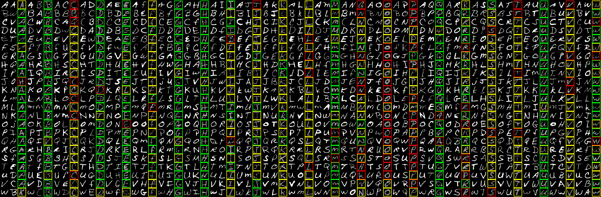

*Figure 22: Timestep 32 with accuracy 54%* **[p. 23]**

*Figure 23: Timestep 50 with accuracy 96%* **[p. 23]**

**[p. 24]**

## Appendix D Multiple Image Fourier Analysis Results

We extend our Fourier analysis to the multiple-image (multiple-step) scenario, introducing the temporal dimension (timestep) into our investigation. Following the observations in the single-image case, we concentrate on the layers critical for arithmetic generalization: the SA block and the pre-activation FFN layer.

A notable departure from the single-image baseline is the emergence of five significant frequencies, compared to the four previously observed. In the multiple-image setting, these selective frequencies exhibit high significance from the initial timestep within both the attention score and pre-activation FFN layers. Conversely, the attention value layer displays an opposing trend, where frequency significance evolves differently over time. We provide FVE bar charts and neuron-level heatmaps for these key layers, alongside the corresponding sampling trajectories.

###### p24-3

As discussed in Section 4.2, the low entropy observed in the pre-activation FFN layer signifies the model’s ”arithmetic focusing mode.” The visualizations below provide empirical support for this: while the sampled images at early timesteps remain perceptually blurry, the FFN layer’s FVEs are already sharply concentrated on the five significant frequencies. This decoupling suggests that the structural resolution of the arithmetic task precedes the visual refinement of the output modality.

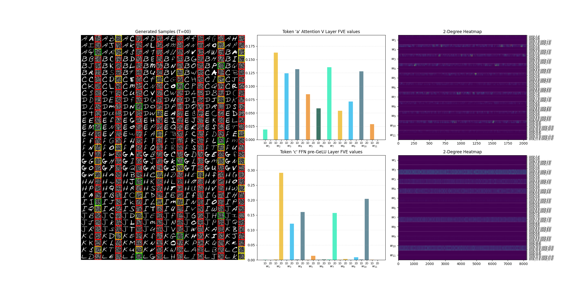

*Figure 24: Timestep 0 with accuracy 0%* **[p. 24]**

*Figure 25: Timestep 21 with accuracy 0%* **[p. 24]**

**[p. 25]**

As the generated digit becomes perceptually discernable in the synthesized image, the sharp FVE concentration begins to dissipate, as evidenced by the increasing entropy in the internal layers. This transition, illustrated in the visualizations below, signifies the model’s shift from an abstract arithmetic operation to the spatial reconstruction of the visual output.

*Figure 26: Timestep 32 with accuracy 54%* **[p. 25]**

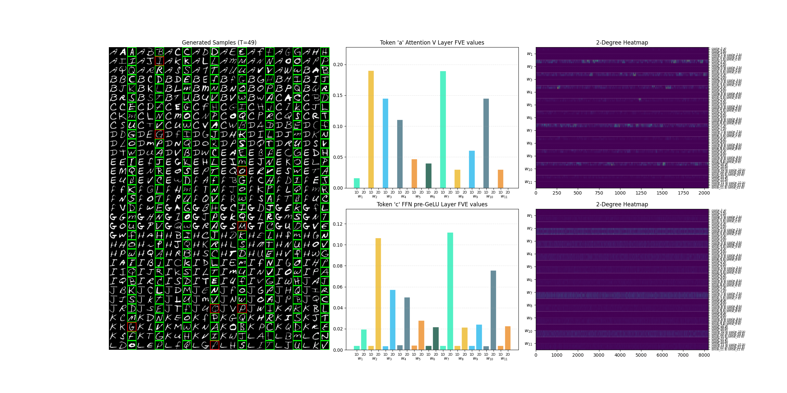

*Figure 27: Timestep 50 with accuracy 96%* **[p. 25]**

## Appendix E Ablation Study 1: Various $P$ values

To verify that the periodic structures observed in the modular addition operation can be generalized, we first provide an ablation study on various values of $P$. We demonstrate that the 1D and 2D periodicities revealed by the Fourier analysis are also observable in the $P=27$, $31$, and $35$ cases. Although the EMNIST dataset provides both uppercase and lowercase alphabets, we observed that the number of lowercase images is significantly small. Additionally, there were frequent instances where lowercase letters were incorrectly labeled as uppercase. Thus, we utilize a mixed set of digit images and uppercase alphabet images from the EMNIST dataset to provide enough data for cases where $P>26$. The number of images per operation result class is fixed as $N=256$ in accordance with Section 4.2. Figures 28$\sim$ 31 show the 1D and 2D FVE values at three layers: Attention Score at $a$, Attention Value Component at $a$, and Pre-Activation in FFN at $c$. Sample steps are fixed at $t=0$, where the entropies of the FVEs remain low (i.e. high concentrations on few frequencies).

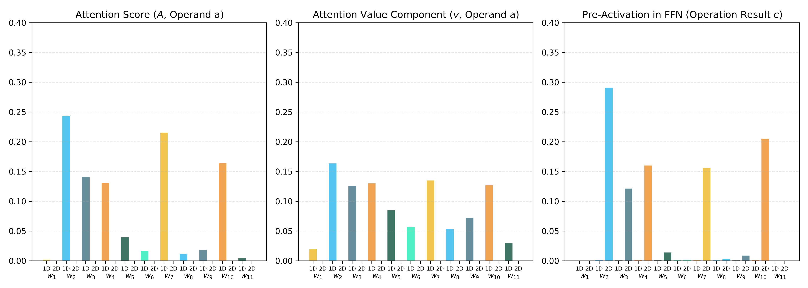

*Figure 28: $P=23$.* **[p. 26]**

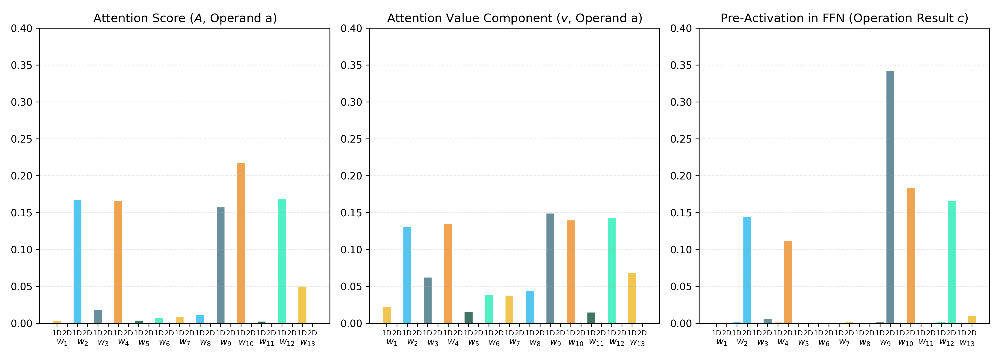

*Figure 29: $P=27$* **[p. 26]**

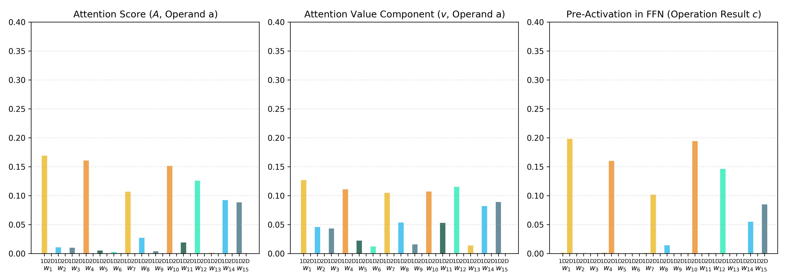

*Figure 30: $P=31$* **[p. 26]**

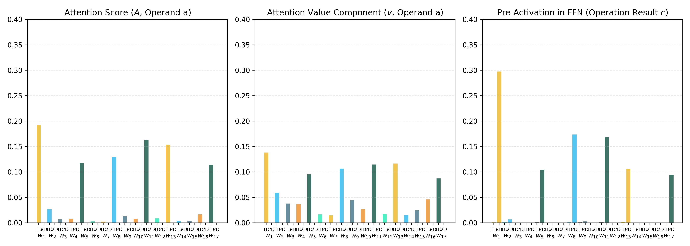

*Figure 31: $P=35$* **[p. 26]**

**[p. 27]**

Figures 32–34 demonstrate the mode shift during ODE sampling with various $P$ values. As in the baseline $P=23$ case, we observe similar trajectories for both the recovery of correct answers and the rectification of initially incorrect images.

*(a) Correct result image recovery*

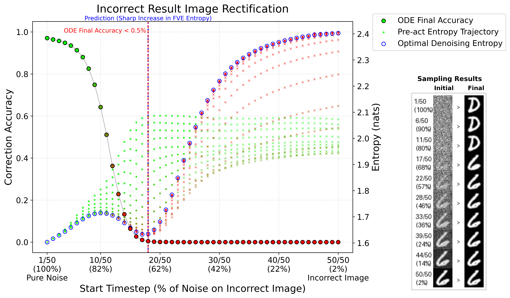

*(b) Incorrect result image rectification*

*Figure 32: $P=27$* **[p. 27]**

*(a) Correct result image recovery*

*(b) Incorrect result image rectification*

*Figure 33: $P=31$* **[p. 27]**

*(a) Correct result image recovery*

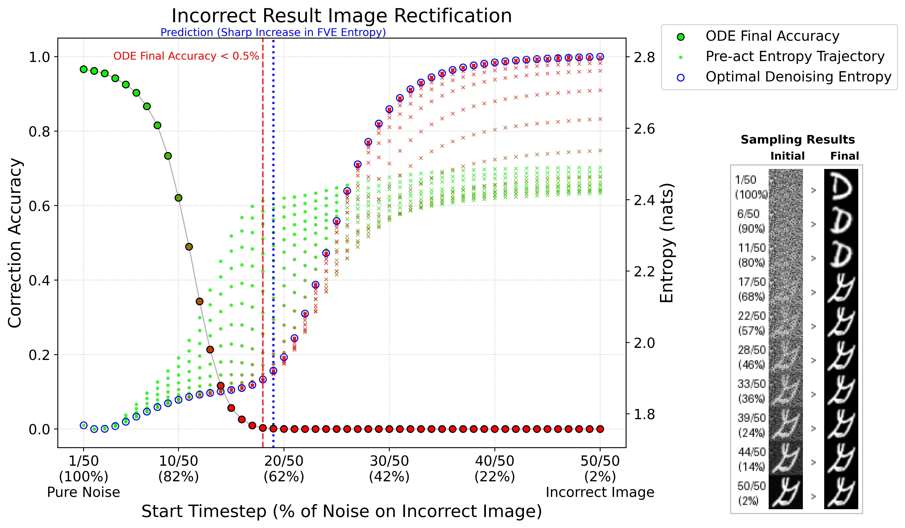

*(b) Incorrect result image rectification*

*Figure 34: $P=35$* **[p. 27]**

## Appendix F Ablation Study 2: Kuzushiji-EMNIST dataset

We further argue that the emergence of periodic structures is not a dataset-specific phenomenon by providing an identical Fourier analysis on models trained on the Kuzushiji-MNIST dataset (Clanuwat et al., 2018). Because handwritten Japanese characters contain relatively more complex shapes than the English alphabet, this experiment strongly supports the FFN-sandwich structure’s robustness in learning discrete concepts prior to arithmetic reasoning. **[p. 28]** Taking advantage of the rich variety of classes provided by the Kuzushiji-MNIST dataset, we demonstrate these consistent patterns across extended cases of $P=39,43,\text{ and }47$, as shown below.

*Figure 35: $P=39$ with Kuzushiji-MNIST dataset* **[p. 28]**

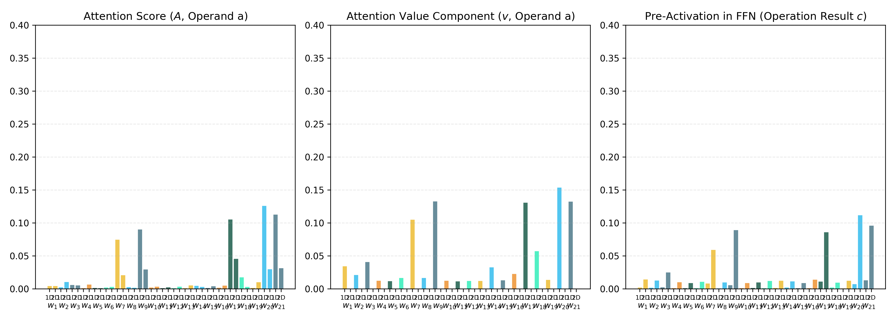

*Figure 36: $P=43$ with Kuzushiji-MNIST dataset* **[p. 28]**

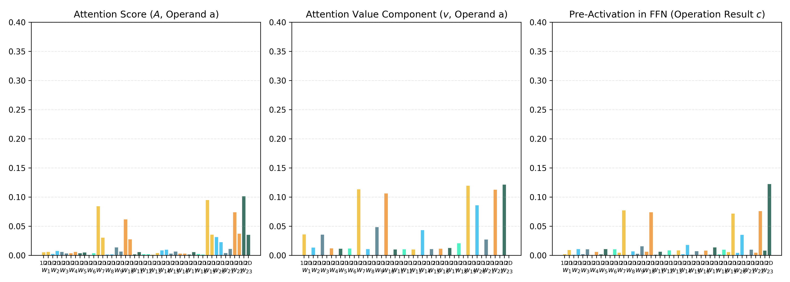

*Figure 37: $P=47$ with Kuzushiji-MNIST dataset* **[p. 28]**

Figures 38$\sim$ 40 demonstrate the mode shift between reasoning and denoising on the ODE sampling path on the model trained on the Kuzushiji-MNIST dataset.

*(a) Correct result image recovery*

*(b) Incorrect result image rectification*

*Figure 38: $P=39$ on Kuzushiji-MNIST dataset.* **[p. 29]**

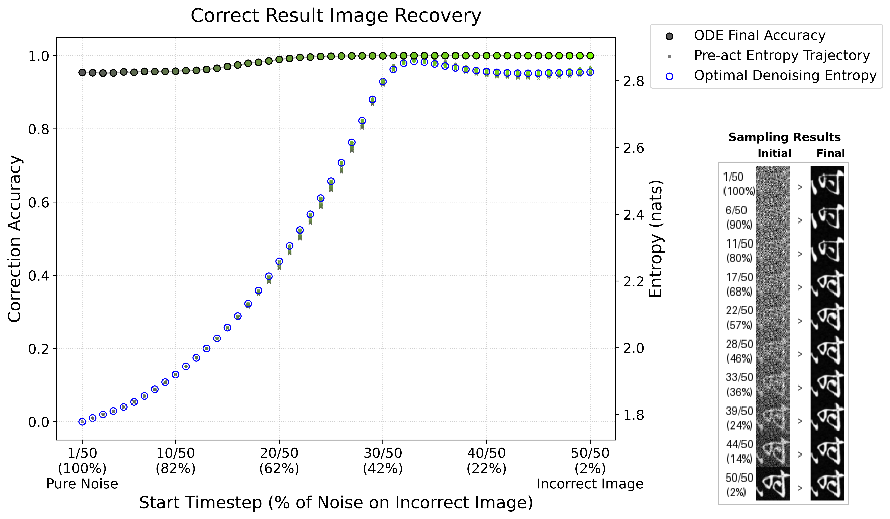

*(a) Correct result image recovery*

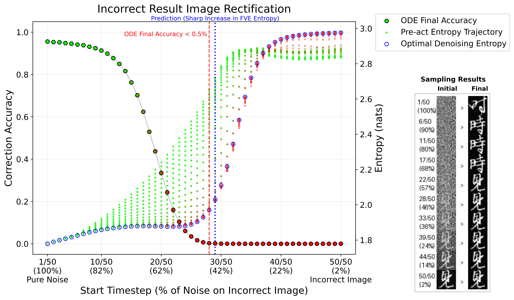

*(b) Incorrect result image rectification*

*Figure 39: $P=43$ on Kuzushiji-MNIST dataset.* **[p. 29]**

*(a) Correct result image recovery*

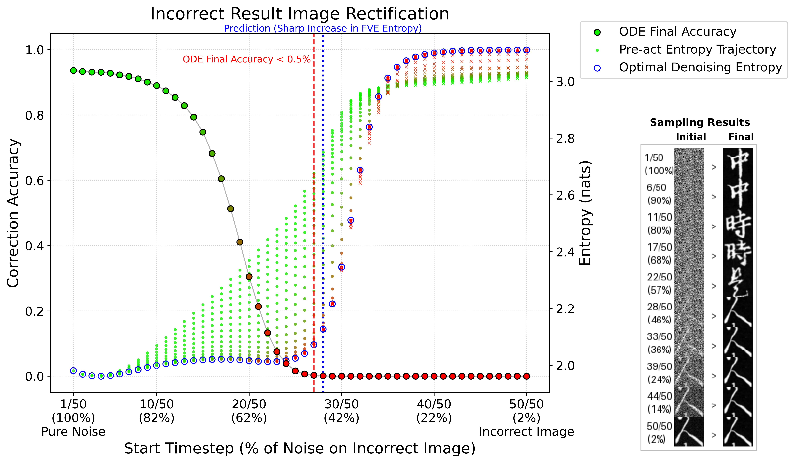

*(b) Incorrect result image rectification*

*Figure 40: $P=47$ on Kuzushiji-MNIST dataset.* **[p. 29]**

**[p. 29]**

## Appendix G Ablation Study 4: Phase Transition Across Various $P$ Values and Datasets

Remarkably, across various $P$ values and heterogeneous datasets, a sudden increase in FVE entropy—reflecting the collapse of concentration on selective frequencies—consistently coincides with the timestep at which the final ODE sampling accuracy drops to near zero ($<0.5\%$). We argue that this critical timestep, $t^{\ast}$, marks the point where the model transitions from the algorithmic reasoning phase to the visual denoising phase. Formally, $t^{\ast}$ can be easily identified by finding the maximum of the second derivative of the FVE: $t^{\ast}=\operatorname{argmax}_{t}\frac{\partial^{2}\mathrm{FVE}}{\partial t^{2}}$.

*Figure 41: **Alignment of Predicted and Observed Timesteps for the Phase Transition.** This 3D visualization illustrates the incorrect image rectification dynamics detailed in Section 4.2. The left vertical plane displays ODE final accuracies across varying initial noise levels for models trained on different $P$ values and datasets (EMNIST and KMNIST). The marked points denote the $0.5\%$ accuracy threshold—the critical timestep where models largely fail to rectify incorrect inputs, indicating the cessation of algorithmic reasoning. The right vertical plane plots the Fourier Variance Explained (FVE) entropy along the optimal denoising trajectory, with markers indicating the sharp onset of entropy escalation ($\arg\max_{t}\frac{\partial^{2}\text{FVE}}{(\partial t)^{2}}$). The bottom plane projects these two distinct critical timesteps, revealing a strong correlation along the $T_{\text{pred}}=T_{\text{obs}}$ diagonal. This alignment supports that the sudden increase in FVE entropy serves as a highly accurate proxy for predicting the phase transition from algorithmic reasoning to visual denoising. Refer to Appendix E for dataset ablations.* **[p. 30]**

**[p. 31]**

## Appendix H Ablation Study 5: Grokking in Multi-layer Model

Our architectural choice of a single-layer DiT in the main text was intentional; isolating a single self-attention block allowed for a clear, mechanistic demonstration of the periodic internal circuit via Fourier analysis, explicitly revealing how the model mixes two operands. However, the grokking phenomenon itself is not strictly dependent on the custom FFN-sandwich architecture.

###### p31-2

To demonstrate this, we conduct an ablation study using a standard multi-layer diffusion model with a depth of 2 (i.e., Embedding $\rightarrow$ SA $\rightarrow$ FFN $\rightarrow$ SA $\rightarrow$ FFN $\rightarrow$ Output). As shown in Figure 42, grokking successfully emerges in both the $N=1$ and the diverse-image $N=256$ regimes. This is an expected outcome that aligns perfectly with our symbolic abstraction hypothesis: in a depth-2 standard model, the first FFN layer inherently precedes the second self-attention block. Consequently, this first FFN provides the necessary non-linear capacity to form discrete conceptual representations, serving the exact same bottleneck role as the pre-SA FFN in our sandwich architecture. Interestingly, the depth-2 model benefits from the enhanced expressive capacity of the additional SA block, achieving near-perfect generalization in the $N=256$ case (Figure 42(b)). This is a notable improvement over the single-layer FFN-sandwich architecture, which plateaued at approximately 94% accuracy (Figure 4).

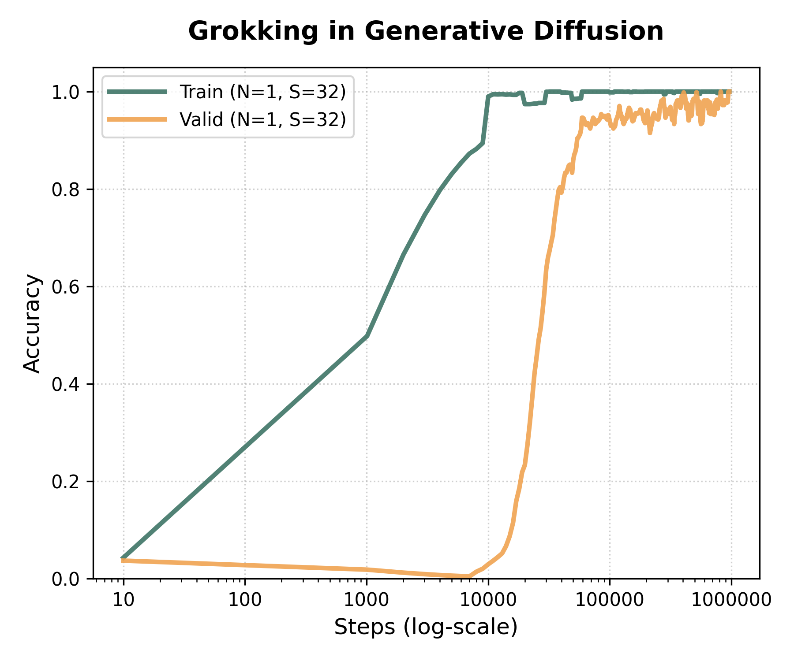

*(a) $N=1$ Single-Image-Regime Case*

*(b) $N=256$ Diverse-Image-Regime Case*

*Figure 42: **Grokking phenomena demonstrated on a standard depth-2 architecture.** Validation accuracy trajectories show that successful generalization (grokking) occurs in both (a) the $N=1$ single-image regime and (b) the $N=256$ diverse-image regime, confirming that the phenomenon is not restricted to the single-layer FFN-sandwich model.* **[p. 31]**
