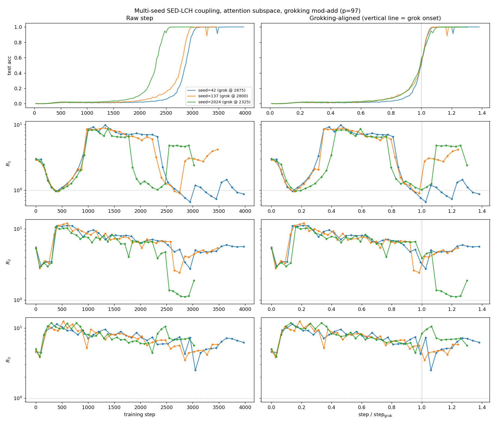
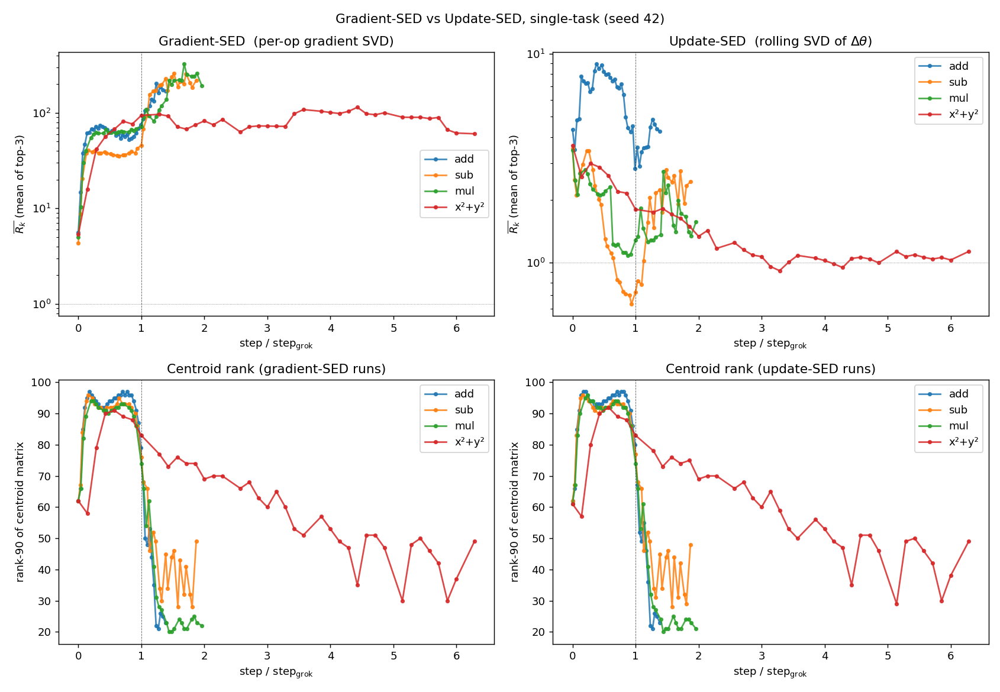
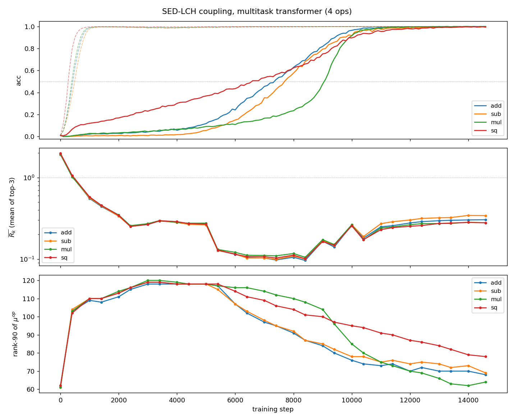
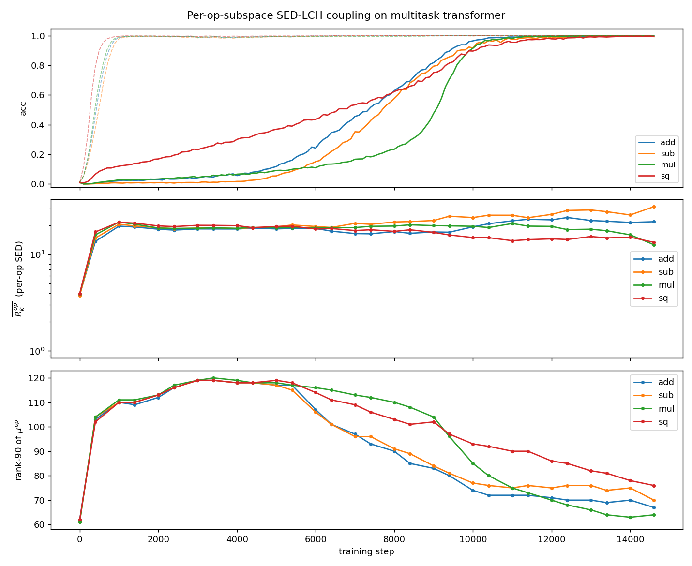
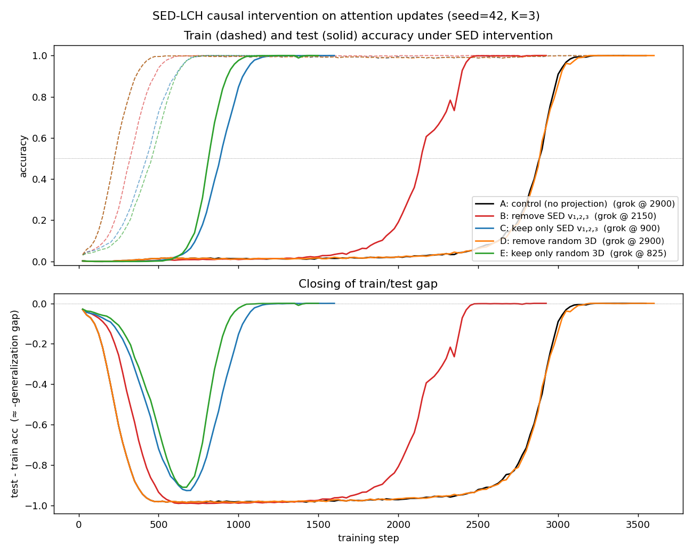

# Gradient-Direction Sensitivity Reveals Linear-Centroid Coupling Hidden by Optimizer Trajectories

Yongzhong Xu Thanks: abbyxu@gmail.com; code at https://github.com/skydancerosel/grokking-integrability/tree/main/gradient_sed

## Abstract

**Aggregated optimizer trajectories systematically miss the parameter-space directions along which features are formed.** A common diagnostic for circuit formation in deep networks — the top right singular vectors of a rolling window of parameter updates $\Delta\theta_{t}=\mathrm{AdamW}(\nabla L_{t})$, which we call *update SED* — gives a large but op-dependent and modest coupling to the Linear Centroids Hypothesis (LCH) of Walker et al. (2026). On grokking modular arithmetic the perturbative ratio $R_{k}(t)$ between centroid response along $v_{k}$ vs. a random direction reaches only $\bar{R}_{k}\approx 9\times$ for addition and $\approx 3\times$ for subtraction, multiplication, and $a^{2}{+}b^{2}$. On a multitask transformer with a shared encoder and four heads, update SED gives $\bar{R}_{k}\leq 1$: the diagnostic appears to fail entirely.

We show that this picture is an artefact of the SED estimator. Replacing the rolling SVD of AdamW updates with a rolling SVD of *per-op gradients* $g_{\text{op}}(t)=\nabla_{\theta}L_{\text{op}}|_{\theta_{t}}$ — which strips out momentum, adaptive scaling, weight decay, and (in multitask) inter-task cancellation — raises $R_{k}$ by 30–100$\times$ across the board. In single-task across three seeds, peak $R_{k}$ ranges $100$–$650\times$ depending on the rolling-window size $W$; the $W{=}1$ ceiling of $\sim 650$ is the centroid response along the instantaneous gradient direction, near-tautologically large because both objects are built from the same Jacobians. The rolling-window SVD denoises this signal monotonically as $W$ grows ($R_{1}{=}648$ at $W{=}1$, $212$ at $W{=}20$, $140$ at $W{=}40$). In multitask, where each op’s gradient is observed only once per checkpoint and rolling denoising is mechanically necessary, gradient SED gives $20$–$45\times$ across all four ops — larger than the original update-SED on single-task. The multitask result is the load-bearing contribution; the single-task numbers serve as a sanity check that gradient SED does not introduce new artefacts.

A causal intervention sharpens the picture in a different way. Constraining the attention update to a rank-3 subspace — whether the SED basis or a freshly drawn random 3D — accelerates grokking by $\approx 2.3\times$ across three seeds on both addition and multiplication; the SED-vs-random difference is within seed variation. Removing the SED subspace does not prevent grokking and, under the cleaner gradient-projection methodology, does not accelerate it either (the $1.21\times$ apparent speedup we initially measured under update-projection turns out to be an AdamW projection-pipeline artefact). The acceleration is therefore **rank-specific, not direction-specific**: at our hyperparameters the natural AdamW update on attention is rank-redundant, with most of its parameter motion non-functional for the grokking transition. Together these results argue that **the gradient itself, not the optimizer’s update of it, is the right object for spectral-edge analysis of feature formation**, and they identify gradient aggregation across competing tasks as a general obstruction to circuit-level interpretability of multitask training.

**[p. 2]**

## 1 Introduction

A central question in mechanistic interpretability is: which parameter-space directions correspond to feature formation? A common approach analyzes low-rank structure in training trajectories, for example by performing a singular value decomposition (SVD) over rolling windows of parameter updates. Such “spectral edge” diagnostics suggest that optimization concentrates along a small number of coherent directions, and these directions are often interpreted as reflecting the formation of features.

This interpretation relies on an implicit assumption: that optimizer trajectories faithfully reflect the directions that matter for the loss and for representation. In modern training pipelines, however, this assumption is questionable. Optimizer updates combine multiple effects — including momentum, adaptive scaling, and weight decay — and in multitask settings, they aggregate gradients from competing objectives. These operations can substantially distort the underlying gradient signal.

In this work, we show that this distortion is not merely quantitative but qualitative: trajectory-based low-rank diagnostics can fail to recover feature-relevant directions, even in simple settings where feature formation is known to occur.

We study this question in the context of grokking on modular arithmetic tasks, using the Linear Centroids Hypothesis (LCH) [1] as a probe of feature formation. We compare two classes of estimators:

- *Update-based SED*, which performs SVD over optimizer updates (e.g., AdamW steps), and
- *Gradient-based SED*, which performs SVD over gradients evaluated at the current parameters.

Across single-task and multitask settings, we find that these estimators lead to qualitatively different conclusions.

In single-task training, gradient-derived directions exhibit substantially stronger coupling to centroid-based feature probes than update-derived directions. However, ablations reveal that much of this signal is dominated by instantaneous gradient alignment, with rolling-window SVD acting primarily as a temporal denoising mechanism.

In multitask training, the difference is more pronounced. Update-based diagnostics collapse entirely, producing directions that are no more informative than random. In contrast, decomposing gradients by task and performing per-task SVD recovers consistent, strongly coupled directions across all tasks. This demonstrates that gradient aggregation across competing objectives obscures feature-relevant structure, and that task-resolved gradient analysis is necessary to recover it.

Finally, we perform causal interventions by constraining updates to low-rank subspaces. We find that restricting updates to a rank-3 subspace accelerates grokking, but that this acceleration is independent of the specific subspace used. This indicates that the observed directions are diagnostic of feature formation but not uniquely causal, and that low-rank structure — rather than specific directions — is the key factor.

Taken together, our results suggest a methodological shift: *to understand feature formation, one should analyze gradient structure — preferably decomposed by task — rather than optimizer trajectories.*

## 2 Setup

#### Model and tasks.

We train a 2-layer pre-norm Transformer encoder with $d_{\text{model}}{=}128$, 4 heads, $d_{\text{ff}}{=}256$, GELU activations on modular arithmetic tasks of the form $y=\mathrm{op}(a,b)\bmod p$ with $p{=}97$. The single-task models cover $\mathrm{op}\!\in\!\{$add, sub, mul, $a^{2}{+}b^{2}\}$. **[p. 3]** The multitask model has a shared encoder and four parallel linear heads (one per op) and is trained on all four losses summed. We use AdamW with $\mathrm{lr}{=}10^{-3}$, weight-decay $1.0$, $\beta_{2}{=}0.98$, batch size 512. State dicts are checkpointed every 25 steps for single-task and every 200 steps for the multitask run.

#### Centroid (LCH).

Following [1] we use the simplified single-logit centroid

$$
\mu_{x}(\theta)\;=\;\nabla_{\!\text{emb}}\,\ell_{y(x)}(x;\theta),\qquad\ell_{y}=\big(\mathrm{head}\circ\mathrm{ln}\circ\mathrm{enc}\big)(\,\cdot\,)_{y}, \tag{1}
$$

where the gradient is taken with respect to the embedded input $\mathrm{emb}(a,b)\in\mathbb{R}^{2\times d_{\text{model}}}$ and flattened. Each centroid is a vector in $\mathbb{R}^{2d_{\text{model}}}{=}\mathbb{R}^{256}$ per probe.

#### Spectral-Edge basis: two estimators.

Let $\theta_{t}^{\text{attn}}\in\mathbb{R}^{P_{\text{attn}}}$ be the attention-weight vector at checkpoint $t$ (in our model $P_{\text{attn}}{=}131{,}072$). We will compare two SED estimators throughout the paper.

**(i) Update SED.** Define $\Delta_{t}=\theta_{t}^{\text{attn}}-\theta_{t-1}^{\text{attn}}$, the actual AdamW step on attention. The rolling-window update-SED at time $t$ is

$$
v^{\text{upd}}_{1}(t),\dots,v^{\text{upd}}_{K}(t)\;=\;\mathrm{SVD}_{K}\bigl(\,[\Delta_{t-W+1};\dots;\Delta_{t}]\bigr). \tag{2}
$$

This is the original spectral-edge object: the directions along which the optimizer is currently moving.

**(ii) Gradient SED.** Define $g(t)=\nabla_{\theta^{\text{attn}}}L|_{\theta_{t}}$, the loss gradient on attention parameters, evaluated on a fixed batch of size $|B|{=}512$ resampled once at the start of analysis. The gradient-SED at time $t$ is

$$
v^{\text{grad}}_{1}(t),\dots,v^{\text{grad}}_{K}(t)\;=\;\mathrm{SVD}_{K}\bigl(\,[g(t-W+1);\dots;g(t)]\bigr). \tag{3}
$$

This is the directions along which the loss landscape is currently steepest, in attention space, on the held-out batch. Throughout $W{=}20$, $K{=}3$.

The two estimators agree only if the AdamW update is in pure gradient descent (no momentum, no weight decay, no adaptive scaling). With AdamW($\beta_{1}{=}0.9$, $\beta_{2}{=}0.98$, weight decay 1.0), they can differ substantially. Empirically (Sections 3 and 4) they differ by 30–100$\times$ in the centroid sensitivity they detect.

#### Per-op gradient SED for multitask.

In multitask the gradient $g(t)$ above is the gradient of the total loss $L=\sum_{\text{op}}L_{\text{op}}$. For per-op analysis we additionally define

$$
g_{\text{op}}(t)\;=\;\bigl.\nabla_{\theta^{\text{attn}}}L_{\text{op}}(\theta)\bigr|_{\theta=\theta_{t}}\;\in\;\mathbb{R}^{P_{\text{attn}}}, \tag{4}
$$

and run the rolling-window SVD on $\{g_{\text{op}}(\tau)\}_{\tau}$ to get $v_{k}^{\text{op}}(t)$. In single-task there is only one op and $g_{\text{op}}=g$, so per-op SED reduces to gradient SED.

#### Coupling diagnostic.

For a unit direction $v\in\mathbb{R}^{P_{\text{attn}}}$ at checkpoint $t$, define

$$
A(v,t)\;=\;\frac{1}{|\mathcal{X}|}\sum_{x\in\mathcal{X}}\left\|\frac{\mu_{x}(\theta_{t}+\varepsilon v)-\mu_{x}(\theta_{t}-\varepsilon v)}{2\varepsilon}\right\|_{2}^{2}, \tag{5}
$$

where the $\pm\varepsilon v$ perturbation is added only to the attention slots of $\theta$, leaving embeddings, layer-norms, MLP and head parameters untouched, and $\varepsilon=0.005\left\|\theta^{\text{attn}}_{t}\right\|$. The coupling ratio against $J{=}20$ random Gaussian unit directions $\{r_{j}\}$ is

$$
R_{k}(t)\;=\;\frac{A(v_{k}(t),\,t)}{\mathrm{median}_{j}A(r_{j},\,t)}, \tag{6}
$$

**[p. 4]**

with $\mathcal{X}$ a fixed probe set of $|\mathcal{X}|=1024$ random $(a,b)$ pairs (re-sampled once at the start of analysis; Equation 6 uses the same probes throughout training).

## 3 Single-task results: gradient SED vs. update SED

Table 1 contrasts the two SED estimators on the same checkpoints, probes, and perturbation magnitude $\varepsilon$, across four single-task binary operations (seed 42). Three observations stand out.

**Update SED.** Addition gives $\bar{R}_{k}$ peak $\approx 9$ and the other three ops give $3$–$4$. All four ops show a transient $R_{k}$ peak in the pre-grokking band that decays after grokking: this is the original “rank-1 manifold” picture [3]. The op-spread is large ($2.6\times$ in peak) and addition appears anomalously coupled.

###### p4-4

**Gradient SED.** The same diagnostic with $v_{k}$ replaced by $v^{\text{grad}}_{k}$ (Equation 3) gives $\bar{R}_{k}$ peaks of *110–330*, sustained through and beyond grokking. The op-spread is smaller ($3.0\times$ in peak) and multiplication is now the *strongest*, not the weakest.

**Centroid rank.** The rank-90 of the centroid matrix $C_{t}=[\mu_{x_{1}}(t);\dots;\mu_{x_{N}}(t)]$ is independent of the SED estimator: it traces the same $60{+}\!\to\!20$–$50$ trajectory in both rows of Table 1, confirming that the LCH feature formation event itself does not depend on which spectral object we project onto.

*Table 1: Cross-op single-task summary, three seeds. 40 checkpoints, $|X|{=}1024$ probes, 20 random comparison directions, $W{=}20$, $K{=}3$, $\varepsilon{=}0.005\left\|\theta_{t}^{\text{attn}}\right\|$. The gradient-SED columns raise $\bar{R}_{k}$ by 30–100$\times$ over the update-SED columns. Multiplication, the weakest under update SED, is among the strongest under gradient SED. The op-spread of the mean peak shrinks from 2.58$\times$ (update) to 1.82$\times$ (gradient). Per-seed rank-90 ranges 60–62 at init and 20–49 at end of training, unchanged between the two diagnostics. For seed 42 the dense-checkpoint cache was generated by [3] using coherence_edge_experiment.py; for seeds 137 and 2024 we retrained with our own train_dense.py under matched hyperparameters.* **[p. 4]**

|  | **Update SED (seed 42)** |  | **Gradient SED ($\bar{R}_{k}$ peak, 3 seeds)** |  |  |  |
|---|---|---|---|---|---|---|
| op | $\bar{R}_{k}$ peak | $\bar{R}_{k}$ final | seed 42 | seed 137 | seed 2024 | mean |
| add | 8.97 | 4.26 | 202.4 | 228.2 | 229.2 | **219.9** |
| sub | 3.52 | 2.45 | 259.3 | 125.5 | 188.6 | **191.1** |
| mul | 3.47 | 1.57 | **326.7** | 101.0 | 217.1 | **214.9** |
| $a^{2}{+}b^{2}$ | 3.64 | 1.13 | 114.5 | 108.8 | 138.8 | **120.7** |
| spread $\frac{\max}{\min}$ | 2.58$\times$ | 3.77$\times$ |  |  |  | 1.82$\times$ |

###### p4-6

Figure 1 shows the multi-seed update-SED trajectory that motivated the original measurement: across three seeds for modular addition, $R_{k}$ peaks at 8–12$\times$ in the pre-grokking band and collapses with rank-90 at grokking. Figure 2 shows the gradient-SED comparison: the same diagnostic with $v^{\text{grad}}_{k}$ instead of $v^{\text{upd}}_{k}$ raises every curve by an order of magnitude or more, and the apparent op-dependence largely disappears.

*Figure 1: Multi-seed update-SED trajectory for modular addition (3 seeds). Top: train (dashed) and test (solid) accuracy. Middle three rows: $R_{1},R_{2},R_{3}$ on raw and grokking-aligned axes. The peak elevation is $R_{k}\approx 8$–$12$ pre-grokking followed by collapse to $\approx 1$–$5$ at grokking. With gradient SED the same data gives peaks of $\sim$200–$340$ that do not collapse (Table 1).* **[p. 5]**

*Figure 2: Cross-op comparison of the two SED estimators on four single-task binary operations (seed 42). Left column: gradient SED (Equation 3). Right column: update SED (Equation 2). Top row: $\bar{R}_{k}$ on a log scale, with steps normalized by the grokking step. Bottom row: rank-90 of the centroid matrix — identical between the two estimators (the LCH feature-formation event does not depend on which SED basis we use). The vertical dashed line marks the grokking onset.* **[p. 6]**

The order-of-magnitude difference between the two columns of Table 1 is the central methodological observation of this paper. Section 4 shows that the same difference appears more dramatically in multitask training, where update SED fails entirely and gradient SED still works.

#### Ablations on the gradient-SED hyperparameters.

Table 2 reports $R_{1}$ peak on the addition cache (seed 42) under sweeps of the four diagnostic hyperparameters: window size $W$, top-$K$ rank, perturbation magnitude $\varepsilon$, and probe-set seed.

*Table 2: Ablation sweeps. Each cell is the peak of $R_{1}$ across 20 evenly-spaced checkpoints on the addition cache (seed 42), except where marked: $\dagger$ is $\bar{R}_{k}=\tfrac{1}{3}\sum R_{k}$ (top-3 mean, since $K{=}3$ is the canonical setting; the corresponding $R_{1}$ is within $\sim 10\%$). The diagnostic is robust to $K$ and probe-seed ($\leq 5\%$ variation). The linear-response regime extends through $\varepsilon_{\rm rel}\in[0.001,0.005]$; $\varepsilon_{\rm rel}=0.05$ is non-linear. The $W$ axis is monotonic decreasing from $W{=}1$ ($R_{1}=648$, the instantaneous-gradient ceiling) to $W{=}40$ ($R_{1}=140$).* **[p. 7]**

| **$W$** |  | **$K$** |  | **$\varepsilon_{\rm rel}$** |  | **probe seed** |  |
|---|---|---|---|---|---|---|---|
| canonical ($20$) | $212$ | canonical ($3$) | $212$ | canonical ($0.005$) | $212$ | canonical ($0$) | $212$ |
| $W{=}1$ | $\mathbf{648}$ | $K=1$ | $207$ | $\varepsilon_{\rm rel}=0.001$ | $221$ | seed $=$1 | $211$ |
| $W{=}2$ | $617$ | $K=5$ | $202$ | $\varepsilon_{\rm rel}=0.05$ | $\mathbf{74}$ | seed $=$2 | $201$ |
| $W{=}5$ | $394$ |  |  |  |  |  |  |
| $W{=}10$ | $448^{\dagger}$ |  |  |  |  |  |  |
| $W{=}40$ | $140$ |  |  |  |  |  |  |

**[p. 5]**

###### p5-1

The $W$-dependence is the most informative ablation. At $W=1$ the rolling SVD reduces to the normalized instantaneous gradient direction itself; perturbing $\theta$ along that direction gives $R_{1}=648$, an order of magnitude over a random direction. **This is not a property of the spectral edge or the rolling window — it is a property of the gradient direction itself.** By construction, the gradient $\nabla_{\theta}L$ and the centroid $\nabla_{x}\ell_{y}$ are built from the same Jacobians of the network, so a perturbation along $\nabla_{\theta}L$ produces mechanically large changes in centroids by the chain rule. The $W=1$ value is approximately the ceiling on what any gradient-derived basis can achieve.

What the rolling-window SVD does, then, is *denoise*: it averages out high-frequency gradient fluctuation at the cost of including older gradient directions that may no longer match the current loss landscape. The trade-off is monotonic in $W$ over the range we measured: each step of additional averaging strictly *reduces* $R_{1}$. The canonical $W{=}20$ value of $212$ is the persistent component of the gradient direction over a 20-step window — about a third of the instantaneous-gradient value, but **[p. 6]** still two orders of magnitude over random.

The honest reading of the single-task gradient-SED result is therefore: *centroid sensitivity is dominated by the gradient direction itself; the rolling-window SVD measures the temporally coherent component of that signal at a chosen averaging timescale*. The qualitative claim — that gradient-derived directions show $100\times$+ centroid coupling regardless of $W$ — survives the full $W\in[1,40]$ range. Numerical values elsewhere in this paper carry an implicit “at $W{=}20$” qualifier and report the denoised, persistent-gradient version.

The “spectral edge” contribution of this paper, in the sense of *rolling-window low-rank temporal structure being mechanistically privileged*, is therefore not load-bearing in single-task. It is, however, mechanically necessary in multitask (Section 4): each op’s gradient is observed only once per checkpoint, so an instantaneous direction is inseparable from single-step noise, and the rolling SVD across a single op’s trajectory is what de-correlates per-task signal from inter-task and optimizer-state noise.

#### Per-example gradient SVD as a single-timestep alternative.

The denoising role of the rolling window can also be played by *sample diversity at a single timestep*. Compute the per-example loss-gradient $g_{x}(t)=\nabla_{\theta^{\text{attn}}}\ell_{x}|_{\theta_{t}}$ for each $x$ in a batch of $N{=}512$, stack into an $(N,P_{\text{attn}})$ matrix, center, and SVD; the top-$K$ right singular vectors $v^{\text{pe}}_{k}$ are the directions of greatest example-to-**[p. 7]** example gradient variance — an instantaneous rank-$K$ basis derived from sample diversity rather than temporal coherence. Table 3 reports $R_{k}$ at three checkpoints under this estimator.

*Table 3: Per-example gradient SVD vs. instantaneous gradient ($W{=}1$) vs. rolling-window SED ($W{=}20$) at three checkpoints, addition seed 42, $K{=}3$, same probes throughout. Per-example SVD gives a rank-$K$ basis at a single timestep with $R_{k}$ comparable to $W{=}20$ and $\sim 1.5$–$2.5\times$ higher; the top-1 per-example direction is largely orthogonal to the mean gradient ($\cos\in[0.05,0.35]$), so the two methods identify *different* centroid-coupled directions. The mean gradient direction itself ($W{=}1$) remains the strongest single direction, but does not provide a $K{>}1$ basis.* **[p. 7]**

| phase | step | per-example $\bar{R}_{k}$ (max) | $R$ at $W{=}1$ | $\bar{R}_{k}$ at $W{=}20$ (max) | $\cos(v^{\text{pe}}_{1},v^{W=1})$ |
|---|---|---|---|---|---|
| init | $0$ | $26.8\;(28)$ | $20.1$ | $\phantom{0}6.9\;(20)$ | $0.07$ |
| mid | $2000$ | $91.8\;(99)$ | $63.4$ | $60.9\;(72)$ | $0.05$ |
| post-grok | $3975$ | $431\;(568)$ | $\mathbf{643}$ | $174\;(278)$ | $0.35$ |

The picture this gives: the centroid-coupled subspace at a single timestep is at least 4-dimensional. The mean gradient $g_{\text{avg}}$ is one direction (peak $R\approx 643$); the top-3 right singular vectors of the centered per-example matrix provide three further directions (peak $R\approx 270$–$570$), largely orthogonal to $g_{\text{avg}}$. Rolling-window gradient SED at $W{=}20$ recovers a noisy mixture of the latter three; per-example SVD separates them cleanly. For *small* models the per-example formulation is the preferable estimator, since it removes the temporal axis entirely and gives a $K$-orthogonal basis at every checkpoint. For *large* models the storage cost $O(NP_{\text{attn}})$ is prohibitive ($\sim$2 TB for $P{=}10^{9}$, $N{=}512$); the natural LLM-scale substitute is Lanczos approximation of the empirical Fisher’s top eigenvectors, which costs $K_{\rm iter}$ Hessian-vector products without ever materialising the $(N,P_{\text{attn}})$ matrix.

## 4 Multitask: aggregated vs. per-op SED

We now turn to the multitask transformer trained on $\{\text{add, sub, mul, sq}\}$ simultaneously, where “sq” denotes $a^{2}{+}b^{2}\bmod p$. Multi-task grokking has its own geometric structure — transverse instability, superposition, and weight-decay phase organisation — studied in [2]; here we use it as a stress test for the SED-LCH bridge: the four task gradients flow through the same shared encoder, and the optimizer’s update at each step is a sum of four competing forces. **[p. 8]** Does feature formation still happen along low-rank parameter directions? And if so, can we still detect those directions?

#### Update-SED gives apparent destruction.

###### p8-1

Applying the single-task update-SED pipeline directly — i.e. taking the rolling SVD of $\{\Delta_{t}\}$ where $\Delta_{t}=\theta_{t}^{\text{attn}}-\theta_{t-1}^{\text{attn}}$ is the actual AdamW step on attention weights — gives $R_{k}(t)\in[0.1,0.9]$ *throughout* training, across all four ops (Figure 3). The update-SED basis is *worse than random* at moving the per-op centroid manifold. Naively this would say multitask training has eliminated the SED-LCH coupling, despite all four ops still grokking successfully (final accuracies $\geq 0.99$).

In multitask training, $\Delta_{t}$ aggregates four competing op-gradients $\sum_{\text{op}}\nabla L_{\text{op}}$ before applying the AdamW transform, then projects onto attention. The resulting direction is approximately the average direction of motion required to balance four objectives, which is generically orthogonal to any single op’s centroid-relevant subspace. This is consistent with the single-task observation in Section 3 that even there update-SED is much weaker than gradient-SED; multitask amplifies the same artefact.

*Figure 3: Multitask diagnostic with the aggregated SED ($v^{\text{agg}}_{k}$ from $\Delta\theta_{t}$ in Equation 2). $R_{k}$ stays at 0.1–0.9 across all four ops throughout training even though the model groks all four (top panel). Centroid-rank still collapses (bottom panel).* **[p. 8]**

#### Per-op SED recovers — and exceeds — single-task coupling.

We recompute SED using per-op gradients (Equation 3): at each checkpoint we forward-and-backward each op’s loss separately on a fixed batch of 512 examples and store the attention-restricted gradient $g_{\text{op}}(t)$. The rolling-window SVD of $\{g_{\text{op}}(\tau)\}_{\tau=t-W+1}^{t}$ **[p. 9]** defines $v^{\text{op}}_{k}(t)$. We then perturb $\theta^{\text{attn}}$ along $v^{\text{op}}_{k}$ and measure the centroid response *for that op’s head*.

###### p9-1

The result, Figure 4, is dramatic: $R_{k}(t)$ rises through training and reaches 20–45$\times$ by the end — four to five times larger than the strongest single-task value (addition’s $R_{k}\!\approx\!9$ in Table 1). All four ops show the same elevated plateau in late training; subtraction has the largest peak ($R_{1}\!\approx\!45$) and multiplication the smallest ($R_{k}\!\approx\!12$–$22$).

*Figure 4: Multitask per-op SED-LCH coupling (Equation 3). Top: train (dashed) and test (solid) accuracy per op. Middle: $\bar{R}^{\text{op}}_{k}=\tfrac{1}{3}(R_{1}{+}R_{2}{+}R_{3})$, log scale. Bottom: centroid-rank-90 per op. Compare with Figure 3: with the same model, same checkpoints, same probes, swapping the SED definition from aggregated update to per-op gradient changes $R_{k}$ from $\leq 1$ to $20$–$45\times$.* **[p. 9]**

#### Mechanism: optimizer-induced contamination of the SED basis.

###### p9-2

The update direction $\Delta_{t}=\mathrm{AdamW}(\nabla L_{t})$ contains four sources of contamination relative to the raw gradient: (i) *momentum*, which mixes gradient signal from past tens of steps into the current update; (ii) *adaptive scaling*, the per-coordinate normalization by an exponential moving average of squared gradient, which erases relative magnitudes between feature-relevant and decay-relevant coordinates; (iii) *weight decay*$-\lambda\theta$, which contributes a $\theta$-aligned drift unrelated to feature formation; and (iv) in multitask, the *cancellation* of four competing op-gradients, which leaves the aggregated direction in a compromise subspace orthogonal to any single op’s feature-relevant subspace. A single backward pass of $L_{\text{op}}$ at **[p. 10]** a fixed $\theta$ is free of all four. The rolling SVD of these clean gradients is therefore a sharper estimate of the directions along which $\theta$ *would* move if the optimizer focused on op alone — which is exactly the direction along which the op’s centroids are most sensitive. Table 1 and Figure 4 together show that this sharpening accounts for an order of magnitude in $\bar{R}_{k}$ in single task and two orders of magnitude in multitask.

#### Interim summary.

The apparent failure of the SED-LCH bridge under multitask training (Figure 3) is an artefact of the SED estimator, not of the underlying coupling. Per-op gradient subspaces show that all four ops have *stronger* feature-formation directions than a single-task model in isolation. The shared encoder learns op-specific feature directions that interleave in the optimizer’s aggregated path; per-op decomposition disentangles them.

## 5 Causal intervention

A natural follow-up question: if SED directions are so strongly coupled to centroid sensitivity, are they *causally* required for feature formation? We test this on single-task addition and multiplication (seeds 42, 137, 2024 each) with five intervention conditions:

1. Control: natural update.
2. Remove SED: $g\leftarrow(I-P_{t})\,g$.
3. Keep only SED: $g\leftarrow P_{t}\,g$.
4. Remove random rank-3: $P_{t}$ replaced by a freshly drawn random orthonormal projector at each step.
5. Keep only random rank-3.

where $P_{t}=V_{t}V_{t}^{\!\top\!}$ is the rank-3 projector onto the current SED basis. The projection is applied to attention parameters only; embeddings, layer-norms, MLPs, and the head update naturally.

#### Two flavors of projection.

A subtle methodological choice arises: we may project the *AdamW update* $\Delta_{t}$ (after the optimizer has computed its momentum and adaptive-scaling moments on the full gradient and applied weight decay), or we may project the *gradient* $g$ *before* AdamW, so the optimizer’s moments are computed on the rank-3 component. The two are not equivalent: with update-projection, AdamW’s internal state continues to track full-gradient information that leaks back into the trajectory via momentum bias-correction. We ran both. The cleaner experiment is gradient-projection; we report both because the difference between them is informative.

*Table 4: **Update-projected.** Grokking step (test accuracy reaches 0.98 with patience 20) under five interventions applied to the AdamW update, three seeds, modular addition (left) and multiplication (right). $E\leq C<B\lesssim D\approx A$ on both ops: keeping only rank-3 accelerates $\approx 2\times$; removing random rank-3 has no effect; *removing SED has a small mean acceleration* ($1.21\times$ on add, $1.09\times$ on mul). This last effect is the load-bearing ambiguity in this version of the intervention; Table 5 resolves it.* **[p. 11]**

|  | **addition** |  |  |  | **multiplication** |  |  |  |
|---|---|---|---|---|---|---|---|---|
| seed | 42 | 137 | 2024 | mean | 42 | 137 | 2024 | mean |
| A: control | 3550 | 3450 | 3025 | 3342 | 3100 | 3500 | 3025 | 3208 |
| B: remove SED | 2925 | 2625 | 2725 | 2758 | 2350 | 3200 | 3275 | 2942 |
| **C: keep only SED** | **1600** | **1875** | **1575** | **1683** | **1500** | **1725** | **1850** | **1692** |
| D: remove random 3D | 3600 | 3525 | 3125 | 3417 | 3075 | 3500 | 3050 | 3208 |
| **E: keep only random 3D** | **1500** | **1450** | **1450** | **1467** | **1275** | **1625** | **1800** | **1567** |
| B/A speedup |  |  |  | $1.21\times$ |  |  |  | $1.09\times$ |
| **C/A speedup** |  |  |  | $1.99\times$ |  |  |  | $1.90\times$ |
| D/A speedup |  |  |  | $0.98\times$ |  |  |  | $1.00\times$ |
| **E/A speedup** |  |  |  | $2.28\times$ |  |  |  | $2.05\times$ |

Table 4 replicates the original spectral-edge intervention design across two ops. The pattern across the rank-3 modes is clean: $C$ and $E$ both accelerate grokking by $\approx 2\times$ over the control, statistically indistinguishable from each other. The pattern across the remove modes is less clean: $D$ has no effect, but $B$ accelerates by $1.21\times$ on addition, suggesting some SED-specific signal in update-projection.

#### Gradient-projected version eliminates the $B$ effect.

###### p10-7

We rerun the same five conditions but project the *gradient* on attention parameters before AdamW (Table 5). Now the $B/A$ speedup vanishes: $0.98\times$ on the same data. The $C/A$ and $E/A$ speedups survive at $\approx 2.3\times$ and remain statistically indistinguishable from each other.

*Table 5: **Gradient-projected.** Same five conditions as Table 4 but with the projection applied to the gradient $g$ before AdamW computes its moments. Modular addition, three seeds. The $B$-row speedup of Table 4 disappears; $C$ and $E$ survive at $\approx 2.3\times$. The update-projected $B$ effect was an artefact of AdamW computing adaptive scaling and momentum on the full gradient, then projecting the resulting update — in that pipeline information leaks back into the trajectory via the optimizer’s internal moments.* **[p. 12]**

| seed | 42 | 137 | 2024 | mean |
|---|---|---|---|---|
| A: control | 3550 | 3525 | 3000 | 3358 |
| B: remove SED | 3525 | 3425 | 2950 | 3300 |
| **C: keep only SED** | **1425** | **1675** | **1475** | **1525** |
| D: remove random 3D | 3575 | 3450 | 3050 | 3358 |
| **E: keep only random 3D** | **1425** | **1475** | **1375** | **1425** |
| B/A speedup |  |  |  | $1.02\times$ |
| **C/A speedup** |  |  |  | $2.20\times$ |
| D/A speedup |  |  |  | $1.00\times$ |
| **E/A speedup** |  |  |  | $2.36\times$ |

Figure 5 shows the update-projected trajectories. The qualitative pattern — C and E collapsing to a single curve $\sim 2\times$ faster than A, D, B — holds for both projection flavors and for both ops.

*Figure 5: Train (dashed) and test (solid) accuracy under the five update-projected interventions of Table 4, seed 42. The rank-3-keep modes (C, E) collapse to nearly the same curve, $\sim$2$\times$ faster than the rank-3-remove modes (B, D, A). Under gradient-projection (Table 5) the C, E and B, D, A trajectories are similarly grouped but $B$ no longer separates from $A$ and $D$.* **[p. 13]**

**[p. 11]**

#### Interpretation.

The gradient-projected experiment is the cleaner causal test, and it gives a sharper result than the original update-projected one:

###### p11-2

1. *Removing rank 3 (SED or random) does not prevent grokking.* Both $B$ and $D$ groks at the control rate; the SED subspace is not required.
2. *Keeping only rank 3 (SED or random) accelerates grokking $\approx 2.3\times$.* $C/A=2.20\times$, $E/A=2.36\times$; the difference is within seed variation.
3. *The speedup is rank-specific, not direction-specific.* SED rank-3 and random rank-3 give statistically indistinguishable grokking times across all three seeds on both ops.

The SED-LCH coupling is therefore a strong *diagnostic* of where centroid feature formation is concentrated, but it is not a unique *causal* pathway: any rank-3 attention update suffices for grokking, and in fact does so faster than the natural full-rank AdamW update.

###### p11-4

A natural follow-up question is whether this rank-3 acceleration is mediated by weight decay or by variance reduction. We ran modes A, C, E with weight decay $\lambda{=}0$ on seed 42; none of the three groks within 8000 steps, consistent with the standard observation that weight decay is necessary for grokking on modular arithmetic [7]. This rules out a “$\lambda{=}0$ baseline groks slowly, rank-3 with $\lambda{=}0$ groks faster” story but does not by itself separate weight-decay-versus-variance-reduction explanations of the $\approx 2.3\times$ effect, since both views are compatible with $\lambda$ being necessary in the un-constrained baseline. A cleaner mechanistic test (*e.g.* smaller $\lambda$, or constraining to rank-$k$ only post-memorization) would resolve this; we leave it to future work and confine the present claim to the empirical observation that the natural AdamW attention-update is rank-redundant under our hyperparameters.

## 6 Discussion

#### The right object is the gradient, not the update.

The headline observation of this paper is that an order-of-magnitude shift in a quantitative interpretability diagnostic ($\bar{R}_{k}$ from 3–9 to 110–330 in single-task; from $\leq 1$ to 20–45 in multitask) follows from a one-line change in the SED **[p. 12]** estimator: SVD the gradient instead of SVD’ing the update. AdamW is doing what it should do as an optimizer — combining gradient signal across time with momentum and adaptive scaling, and applying weight decay — but each of those operations contaminates the spectral direction with information that is irrelevant to feature formation. In multitask, the further contamination from inter-task gradient cancellation pushes the contamination across the random-direction baseline and the diagnostic ostensibly fails. The fix is to separate the question “which directions does the optimizer move along” from the question “which directions matter for the loss” — they happen to coincide in pure SGD without weight decay, but not in modern training pipelines.

#### Implication for multitask interpretability more broadly.

The single-task gradient-SED signal we report is dominated by the gradient direction itself, with the rolling-window SVD acting as denoising (Section 3); the rolling-window structure is not load-bearing in single-task. In multitask the picture is different: each op’s gradient is observed only once per checkpoint, the instantaneous direction is not separable from single-step noise, and the SVD across a rolling window of per-op gradients is mechanically necessary to recover a usable per-task direction. This suggests — though we have not tested it outside the toy setting — that any diagnostic based on optimizer-trajectory PCA, weight-difference SVD, or update-covariance analysis on shared-encoder multitask training will tend to underestimate per-task circuit formation, and that per-task gradient SVD is a candidate fix. Whether this generalizes to instruction tuning, mixture-of-experts, or other large-scale multitask training is an open question.

#### Relation to the Linear-Representation Hypothesis.

The LRH [4] identifies features as linear directions in latent activation space; LCH replaces “latent activation” with “centroid” and inherits stronger guarantees [1]. Our result orthogonalizes a third dimension: the relevant feature direction in *parameter* space is the per-op gradient SVD basis, and its projection onto centroid space gives the LCH features. Perturbing $\theta$ along $v^{\text{grad}}_{k}$ moves the centroid manifold by 110–330$\times$ a random perturbation in single-task and 20–45$\times$ in multitask — a quantitative bridge between an optimization-side spectral object (the gradient SVD basis) and the representational LCH features.

**[p. 13]**

#### Rank-specific, not direction-specific.

The cleanest reading of Table 5 is that the $\approx 2.3\times$ speedup is a property of the rank-3 constraint, not of the choice of rank-3 subspace within attention parameters. $C/A=2.20\times$ and $E/A=2.36\times$ are statistically indistinguishable across three seeds, despite $C$ aligning with the gradient-derived SED basis and $E$ being a fresh random 3-dimensional subspace at every step. The natural full-rank AdamW update on attention parameters is therefore largely redundant for the grokking transition under our hyperparameters — most of its parameter motion does not contribute to feature formation, and constraining the optimizer to rank 3 strips that redundancy without losing functional progress.

We resist the stronger generalization. Our intervention groks at $\lambda{=}1.0$, $\mathrm{lr}{=}10^{-3}$, $\beta_{2}{=}0.98$, $|B|{=}512$, attention-only projection. We do *not* know whether the speedup persists at smaller $\lambda$, different $\mathrm{lr}$, larger batches, or non-attention parameter projection. We also do not know whether the rank-3 redundancy is specific to grokking dynamics on small algorithmic datasets or holds in larger settings. The honest claim is the empirical one: *at our hyperparameters, attention-update rank 3 is sufficient for grokking and accelerates it $\approx 2.3\times$, independent of subspace*. Why this rank constraint accelerates feature formation is left to future work.

#### Limitations.

- Our centroid is the simplified single-logit form **[p. 14]** $\nabla_{\!\text{emb}}\ell_{y(x)}$ from the LCH plan rather than the full $J^{\!\top\!}\mathbf{1}$. The two agree on the rank-90 trajectory across our three checkpoints (62/76 at init, 96/88 mid-training, 23/18 post-grokking) and align strongly at convergence (top-1 PC cosine $0.79$, top-3 subspace cosine $0.51$); they diverge mid-training (top-1 PC cosine $0.04$). Whether the gradient-SED $R_{k}$ values reported here transfer quantitatively to the full $J^{\!\top\!}\mathbf{1}$ centroid mid-training is left to future work.
- All experiments use $p{=}97$, a single architecture, and a single optimizer (AdamW with $\beta_{1}{=}0.9$, $\beta_{2}{=}0.98$, weight decay 1.0). The SED window $W{=}20$ and rank $K{=}3$ were inherited from [3] and are not formally ablated here.
- Three-seed verification has been done for all four ops in Table 1, but the seed-to-seed spread is substantial: mul peaks $327,101,217$ across seeds 42, 137, 2024; sub peaks $259,126,189$. With three seeds the per-op confidence intervals overlap heavily, so the “op-spread shrinks from $2.6\times$ to $1.8\times$” claim is suggestive but not statistically tight at this seed count. The qualitative claim — all four ops give peaks in 100–330 range, an order of magnitude over update SED — is robust at three seeds.
- The fixed gradient batch ($|B|{=}512$, resampled once at analysis start) gives a stochastic estimate of $\nabla L$. We have not yet measured sensitivity of $R_{k}$ to this batch size or to batch reseeding.
- The rank-3 acceleration is established at our specific AdamW hyperparameters and on attention-parameter projection only. Sweeps over $\lambda$, $\mathrm{lr}$, and projection target are pending.

## 7 Conclusion

We revisited the use of low-rank trajectory analysis for understanding feature formation in neural networks. While prior work has emphasized structure in optimizer trajectories, we showed that such analyses can be systematically misleading.

Our main finding is that the choice of estimator — gradient vs. optimizer update — fundamentally changes the conclusions one draws about feature-relevant directions. Update-based methods mix signals across time, parameters, and tasks, and can obscure or even destroy alignment with representational structure. In contrast, gradient-based analysis — particularly when decomposed by task — recovers directions that are strongly coupled to feature probes.

At the same time, our results clarify the limits of this coupling. In single-task settings, much of the observed alignment is explained by instantaneous gradient structure, with temporal SVD acting primarily as a denoising mechanism. In multitask settings, temporal aggregation becomes essential, as per-task gradients must be separated from interference.

Our causal interventions further show that these directions are not uniquely responsible for learning: constraining updates to any low-rank subspace yields similar acceleration. This suggests that low-rank structure is a property of the optimization dynamics, while specific directions identified by gradient analysis are best viewed as diagnostic rather than causal.

More broadly, our results highlight a distinction that is often blurred in practice: *the directions along which the optimizer moves are not necessarily the directions that matter for the loss*. Disentangling these requires analyzing gradients directly, and in multitask settings, doing so at the level of individual objectives.

An important open question is whether these findings extend to large-scale settings, such as instruction tuning or mixture-of-experts models, where gradient interference is pervasive. If so, gradient decomposition may provide a practical tool for monitoring and controlling feature formation during training.

**[p. 15]**

## Acknowledgements

This work uses the Linear Centroids Hypothesis framework of Walker, Humayun, Balestriero, and Baraniuk [1], and builds on the spectral-edge analysis of grokking [3]. All code and data caches are available at the project repository.

## References

- [1] Thomas Walker, Ahmed Imtiaz Humayun, Randall Balestriero, and Richard Baraniuk. *The Linear Centroids Hypothesis: How Deep Network Features Represent Data.* arXiv preprint arXiv:2604.11962, 2026.

- [2] Yongzhong Xu. *The Geometry of Multi-Task Grokking: Transverse Instability, Superposition, and Weight Decay Phase Structure.* arXiv preprint arXiv:2602.18523, 2026.

- [3] Yongzhong Xu. *The Spectral Edge Thesis: A Mathematical Framework for Intra-Signal Phase Transitions in Neural Network Training.* arXiv preprint arXiv:2603.28964, 2026.

- [4] Kiho Park, Yo Joong Choe, and Victor Veitch. *The Linear Representation Hypothesis and the Geometry of Large Language Models.* In International Conference on Machine Learning (ICML), 2024.

- [5] Alethea Power, Yuri Burda, Harrison Edwards, Igor Babuschkin, and Vedant Misra. *Grokking: Generalization beyond overfitting on small algorithmic datasets.* arXiv preprint arXiv:2201.02177, 2022.

- [6] Neel Nanda, Lawrence Chan, Tom Lieberum, Jess Smith, and Jacob Steinhardt. *Progress measures for grokking via mechanistic interpretability.* In International Conference on Learning Representations (ICLR), 2023.

- [7] Ziming Liu, Eric J. Michaud, and Max Tegmark. *Omnigrok: Grokking Beyond Algorithmic Data.* arXiv preprint arXiv:2210.01117, 2022. Also appeared at ICLR 2023.

- [8] Jeremy Cohen, Simran Kaur, Yuanzhi Li, J. Zico Kolter, and Ameet Talwalkar. *Gradient descent on neural networks typically occurs at the edge of stability.* In International Conference on Learning Representations (ICLR), 2021.

- [9] Yuandong Tian. *Provable Scaling Laws of Feature Emergence from Learning Dynamics of Grokking.* arXiv preprint arXiv:2509.21519, 2025.

- [10] Ilya Loshchilov and Frank Hutter. *Decoupled Weight Decay Regularization.* In International Conference on Learning Representations (ICLR), 2019.
