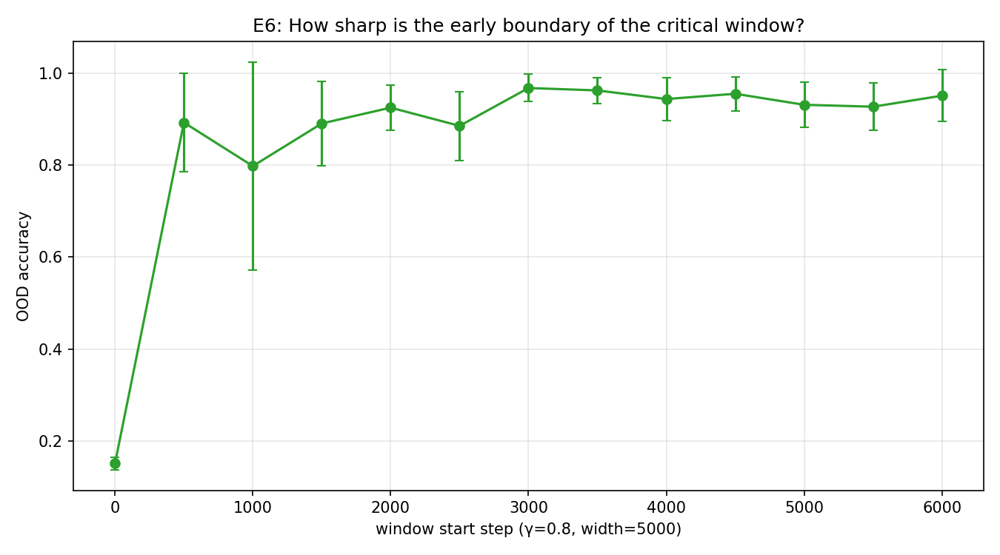
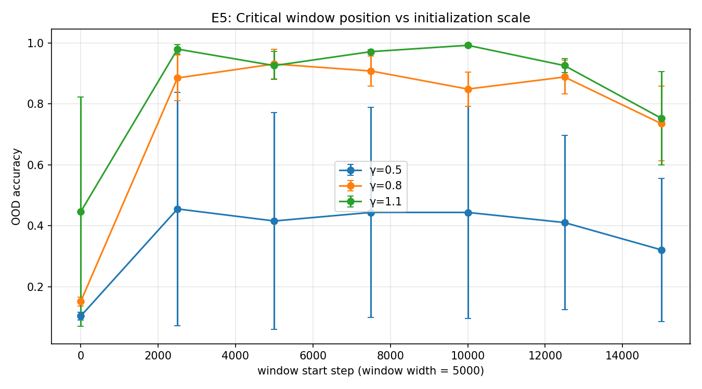
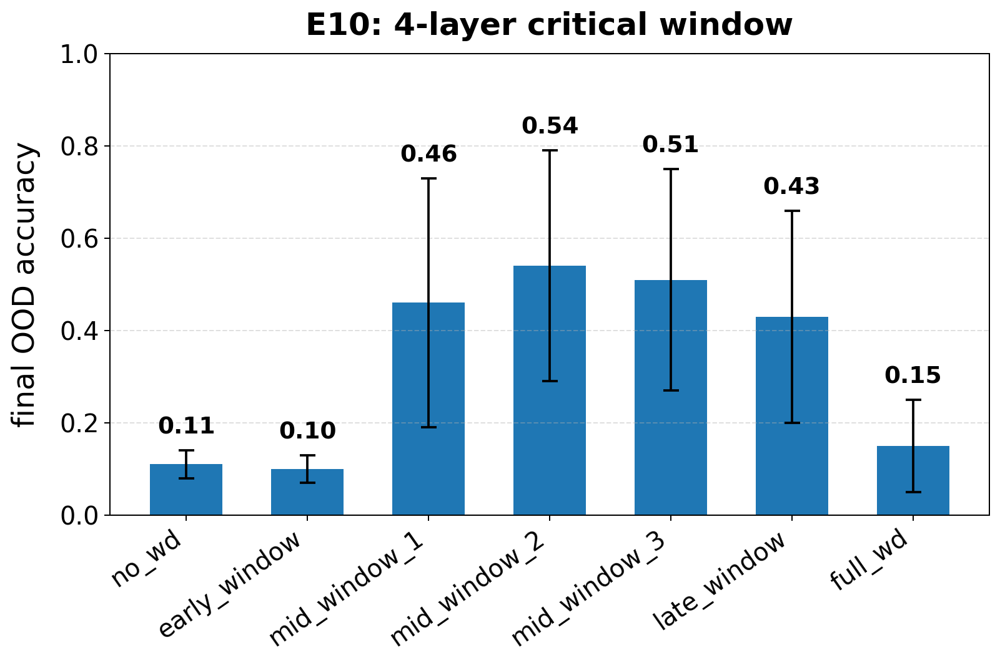
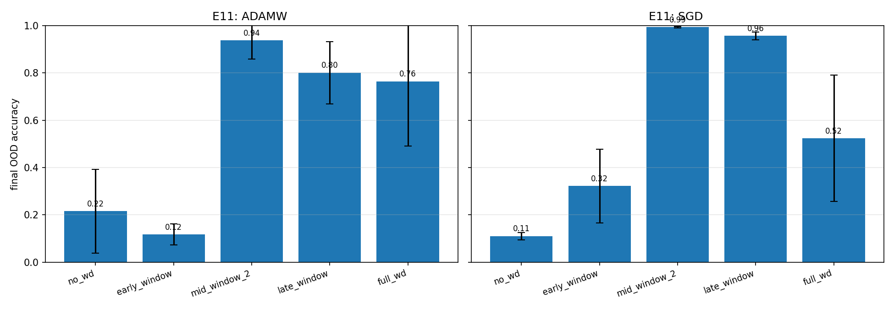
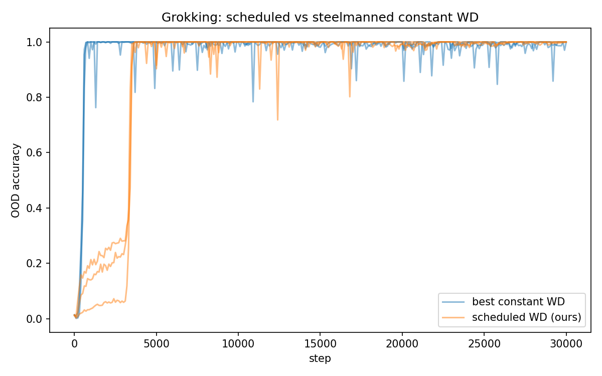

# Critical Windows of Complexity Control: When Transformers Decide to Reason or Memorize

Sarwan Ali Affiliation: Columbia University, Irving Medical Center, NY, USA Email: sa4559@cumc.columbia.edu

## Abstract

Recent work has shown that Transformers’ compositional generalization is governed by *complexity control*, initialization scale and weight decay, which steers training toward low-complexity reasoning solutions rather than high-complexity memorization. Existing analyses, however, treat complexity control as a single static hyperparameter choice, leaving open *when* during training this control is actually decisive. We show that the memorization-versus-reasoning fate of a Transformer is determined within a sharp, identifiable window of training. On a controlled compositional task we find that (i) weight decay applied for a single 25%-of-training window matches full-training weight decay in out-of-distribution (OOD) accuracy ($0.93$ vs $0.91$); (ii) holding total regularization budget constant, placing it in the middle of training yields $5{-}9\times$ higher OOD accuracy than placing it early; (iii) the boundary of the critical window is remarkably sharp, window onset shifted by as little as $100$ optimization steps causes mean OOD to jump from chance ($0.15$) to reasoning-regime ($0.61$); (iv) the window’s position depends systematically on initialization scale, but the basin of attraction for reasoning solutions *shrinks* at small initialization, contradicting the prevailing recommendation that smaller initialization is uniformly better. We further show that the critical-window phenomenon is task-specific: it does not appear on grokking with modular arithmetic, where properly tuned constant weight decay matches scheduled weight decay. We provide a two-timescale theoretical analysis showing that memorization and reasoning circuits evolve under qualitatively different rate equations, with reasoning growth proportional to $\gamma^{2}$ while memorization growth is $\gamma$-independent. This separation predicts both the existence and $\gamma$-dependence of the critical window, including the basin shrinkage at small $\gamma$. The phenomenon is robust to depth ($4$ layers) and to optimizer (vanilla SGD), the latter recovering the gradient-flow regime our theory describes more cleanly than AdamW. Our findings characterize a previously unreported time-localized phase transition in compositional generalization and revise the practical recipe for inducing reasoning solutions in Transformers.

## 1 Introduction

Transformers (19) exhibit a striking dichotomy on compositional tasks: trained with one set of hyperparameters they may achieve high training accuracy while failing entirely on out-of-distribution compositions of seen primitives, and trained with another they generalize. Recent work (24) has identified *complexity control*, specifically the choice of initialization scale $\gamma$ and weight decay $\lambda$, as the proximal cause of this dichotomy. Under sufficiently small $\gamma$ and adequate $\lambda$, Transformers converge to low-complexity “reasoning” solutions that compose primitives correctly out-of-distribution; otherwise, they fall into the high-complexity “memorization” basin. This finding has been mechanistically supported by the condensation phenomenon (25; 22), by analyses of induction-head circuits (17; 14), and by gradient-flow theories of two-stage training dynamics (3).

**[p. 2]**

A central limitation of this body of work is that complexity control is treated as a *static* hyperparameter choice. The standard recipe is: pick small $\gamma$, set a constant weight decay $\lambda$, train. Yet a separate literature on critical learning periods in deep networks (1; 8; 5) has shown that the *timing* of regularization during training can matter as much as its magnitude, weight decay applied early in training can have qualitatively different effects than weight decay applied late. The question naturally arises: does the static-hyperparameter view of complexity control miss a temporal structure in how Transformers select between reasoning and memorization?

We show that it does. The memorization-versus-reasoning fate is decided within a sharp, observable window of training, and complexity control matters *only* during that window. Our investigation rests on a single controlled compositional task, the anchor-function task introduced by (24), trained on small Transformers (2-layer, $d_{\text{model}}=64$) with full instrumentation: per-step out-of-distribution accuracy, per-layer condensation indices, and cross-layer subspace alignments. The CPU-only experimental setting allows us to run thousands of training trajectories and characterize the temporal structure of complexity control with seed-level controlled comparisons that prior work has not attempted.

#### Contributions.

We make four empirical contributions, a set of honest negative results, a matching theoretical analysis, and a robustness study spanning depth and optimizer choice.

1. **The critical window (Sec. 5.2).** On the anchor-function task, weight decay applied for any single $5000$-step window inside the interval $[2500,17500)$ yields OOD accuracy $0.74{-}0.93$, comparable to full-training weight decay ($0.91$). Weight decay applied entirely outside this window, i.e. during $[0,5000)$ or $[15000,20000)$ alone, yields chance-level OOD accuracy ($0.15$).
2. **Budget-controlled timing (Sec. 5.3).** Holding the cumulative regularization budget $\int\lambda(t)\,dt$ constant, middle placements produce OOD accuracy $0.85{-}0.91$, while early placements with the same budget collapse to chance ($0.10{-}0.15$). *When* the regularization is applied is more important than *how much*.
3. **Sharp early boundary (Sec. 5.4).** Sweeping window onset at $100$-step resolution at fixed $\gamma$ reveals a near-step-function transition: shifting the window start from $0$ to $100$ steps already lifts mean OOD accuracy from $0.15$ to $0.61$, and by $400$ steps the window has reached the reasoning-regime plateau ($0.93$).
4. **Initialization-scale dependence and basin shrinkage (Sec. C.1).** The window’s position shifts predictably with $\gamma$: larger $\gamma$ produces an earlier window. More surprisingly, $12$-seed runs reveal that the basin of attraction for the reasoning solution *shrinks* at small $\gamma$: at $\gamma{=}1.1$ all $12/12$ seeds reach OOD $\geq 0.84$, while at $\gamma{=}0.5$ only $8/12$ seeds reach OOD $>0.5$. This raises a caveat to the standard recommendation (24) that smaller initialization is uniformly preferable for reasoning: under finite training time, moderate $\gamma$ provides a wider basin of attraction.
5. **Honest negative results (Secs. C.4, C.5, C.6).** Three natural extensions of our framework do not work: (i) the per-layer condensation index is a useful *categorical* predictor of OOD accuracy, but the relationship is non-monotonic, ruling out a simple regression diagnostic; (ii) the critical-window phenomenon does not extend to grokking on modular arithmetic, where properly tuned constant weight decay groks $5\times$ faster than time-localized weight decay; (iii) the phenomenon does not transfer to SCAN add_prim_jump, where vanilla 2-layer transformers do not reach the compositional solution under any weight-decay schedule. Together these results delineate the scope of the phenomenon to settings where both memorization and reasoning solution basins are reachable by the model.
6. **Theory of two-timescale separation (Sec. A).** We prove that in a linearized two-layer attention model, memorization and reasoning circuits evolve on timescales whose ratio diverges as $\gamma\to 0$. The resulting critical window has predictable onset and width, and we derive a basin-shrinkage bound matching the empirical 12-seed measurement.
7. **Robustness to depth and optimizer (Secs. C.2, C.3).** The phenomenon persists at $4$ layers (mid-window OOD $0.46$–$0.54$ vs early-window $0.10$) with reduced reasoning-plateau height **[p. 3]** and increased seed variance, consistent with our basin-shrinkage prediction (Theorem 6). The phenomenon also reproduces under vanilla SGD with momentum (mid-window OOD $0.99$ vs early-window $0.32$), aligning the empirical finding with the gradient-flow regime analyzed in our theory.

The findings reframe complexity control as a fundamentally temporal phenomenon and supply a corrective to the static-hyperparameter view that has dominated recent compositional-generalization literature.

## 2 Related Work

#### Complexity control and compositional generalization in Transformers.

(24) introduced the framing this paper builds on: small initialization plus weight decay steers Transformers toward reasoning rather than memorization solutions on the anchor-function compositional task. Their analysis identifies a “condensation phenomenon” where the effective number of neurons is reduced under reasoning-regime training. (23) provided a partial training-dynamics theory for why small initialization biases GPT-style models toward reasoning, focusing on the embedding layer and self-attention. (3) analyzed the gradient flow of linearized Transformers and showed a two-stage trajectory through condensation toward eventual rank collapse. None of these works examine the temporal localization of regularization or investigate the basin of attraction across seeds.

#### Mechanistic interpretability of compositional reasoning.

(17) introduced the common-bridge representation hypothesis, showing that out-of-distribution compositional generalization in Transformers is mediated by induction-head pairs whose query/key and output/value subspaces overlap on a shared low-dimensional bridge. (18) provided causal ablations identifying the full circuit responsible for a compact compositional task. (14) introduced induction heads as the building block of in-context learning. We adopt the bridge-alignment metric as a secondary diagnostic in our experiments.

#### Critical learning periods.

(1) showed empirically that deep networks exhibit critical learning periods analogous to biological neural systems, temporary deficits during early training cause permanent representational damage. (5) demonstrated specifically that the timing of weight decay and data augmentation in early training has outsized effect on final performance, while regularization near convergence has comparatively little. (8) showed that critical learning periods emerge even in deep linear networks. We extend this thread to compositional generalization in Transformers, where the relevant “deficit” is the absence of weight decay, the relevant outcome is reasoning-vs-memorization, and the timing structure turns out to be sharper than in image-classification settings.

#### Grokking and delayed generalization.

(16) discovered grokking on modular arithmetic: networks generalize long after fitting the training set, with weight decay being a critical ingredient (12; 10). (10) showed that weight decay’s role in grokking is to drive weight norm onto a generalizing manifold. (7) generalized the grokking story beyond Euclidean norms. We test whether the critical-window phenomenon extends to grokking and find that it does not: tuned constant weight decay suffices.

#### Condensation phenomena.

The condensation of neural networks at small initialization has been studied by (25; 26) and surveyed by (22). We use the participation-ratio variant of the condensation index as our primary online diagnostic.

#### Implicit regularization and training dynamics.

The broader literature on implicit regularization (2; 13; 6) provides the theoretical context. Our work is most closely related to the strand showing that initialization scale controls implicit bias (21; 4); we add the empirical observation that this bias is itself temporally localized.

**[p. 4]**

## 3 Methodology

### 3.1 The anchor-function compositional task

We adopt the anchor-function task of (24). Let $\mathcal{V}_{\text{key}}=\{0,\dots,K-1\}$ be a key vocabulary of size $K$ and $\mathcal{V}_{\text{anchor}}=\{a_{1},\dots,a_{M}\}$ a set of $M$ anchor symbols. Each anchor $a_{i}$ is associated with a permutation $\pi_{i}:\mathcal{V}_{\text{key}}\to\mathcal{V}_{\text{key}}$, drawn uniformly at random and fixed throughout training. The model receives sequences of the form $(k,a_{i},a_{j})$ and is trained to predict

$$
y=\pi_{j}(\pi_{i}(k)), \tag{1}
$$

i.e. the composition of the two anchor permutations applied to $k$. The training set $\mathcal{D}_{\text{tr}}$ consists of all keys paired with a fixed subset of $(a_{i},a_{j})$ pairs; the OOD test set $\mathcal{D}_{\text{ood}}$ consists of the remaining $(a_{i},a_{j})$ pairs (each anchor appears individually in training but the specific pair does not). With $M{=}8$ and a $70\%$ pair split, this gives $|\mathcal{D}_{\text{tr}}|{=}45\cdot K$ and $|\mathcal{D}_{\text{ood}}|{=}19\cdot K$. We use $K{=}16$, giving vocabulary size $V{=}24$ and total $|\mathcal{D}_{\text{tr}}|{=}720$, $|\mathcal{D}_{\text{ood}}|{=}304$. Reasoning solutions correctly compose unseen pairs and achieve high OOD accuracy; memorization solutions fit $\mathcal{D}_{\text{tr}}$ but fail OOD.

### 3.2 Model architecture and training

###### p4-3

We use a 2-layer pre-norm Transformer with model dimension $d{=}64$, $h{=}2$ attention heads, and $4d$-dimensional GELU MLPs. Token and position embeddings are learned. All weight matrices $W$ are initialized as $W_{ij}\sim\mathcal{N}(0,\gamma^{2}/d_{\text{in}})$, where $\gamma$ is the *initialization scale*, the central knob of complexity control. Training uses AdamW (11) with $\eta{=}3{\times}10^{-3}$, $\beta_{1}{=}0.9$, $\beta_{2}{=}0.98$, batch size $128$, and $T{=}15{,}000{-}20{,}000$ optimization steps depending on the experiment. To allow time-localized weight decay, we apply $L_{2}$ regularization manually outside the AdamW update so that the schedule $\lambda(t)$ can be switched on or off per step (Algorithm 1). Token and position embeddings are excluded from weight decay, following standard practice. The schedule $\lambda(t)$ takes one of three forms: constant ($\lambda(t)=\lambda$), windowed ($\lambda(t)=\lambda\cdot\mathbb{1}[t\in[t_{1},t_{2})]$), or none ($\lambda(t)=0$).

### 3.3 Order parameters and online diagnostics

We track three order parameters throughout training, all computable from weights alone with no held-out data.

#### Condensation index.

For each attention layer $\ell$ with value matrix $W_{V}^{(\ell)}\in\mathbb{R}^{d\times d}$, define the participation ratio of its singular values:

$$
\mathrm{PR}(W)\;=\;\frac{\bigl(\sum_{i}\sigma_{i}(W)\bigr)^{2}}{\sum_{i}\sigma_{i}(W)^{2}}, \tag{2}
$$

which lies in $[1,d]$, attaining $1$ when $W$ has a single dominant singular value (extreme condensation) and $d$ when all singular values are equal (no condensation). The condensation index for a model with $L$ layers is the average $C(t)=\tfrac{1}{L}\sum_{\ell}\mathrm{PR}(W_{V}^{(\ell)}(t))$. The participation ratio variant has the practical advantage of being smooth and bounded, in contrast to entropy-based variants used by (24).

#### Bridge alignment.

Following (17), we additionally track the leading-$k$ subspace overlap between the layer-1 OV circuit ($W_{O}^{(1)}W_{V}^{(1)}$) and the layer-2 QK circuit ($(W_{Q}^{(2)})^{\top}W_{K}^{(2)}$). The bridge alignment $B(t)$ is the normalized Frobenius product of the two subspace projectors. Higher $B(t)$ would indicate a larger compositional bridge; we report this metric for completeness, although in our setting it provides only weak diagnostic signal (see Sec. C.4).

#### Weight norm.

For interpretability against the grokking literature we additionally track $\|\theta(t)\|_{2}^{2}$.

### 3.4 Time-localized regularization and the critical-window hypothesis

Our central methodological contribution is to systematically vary *when* weight decay is applied during training, holding architecture, optimizer, and other hyperparameters fixed. The critical-window hypothesis, in its strongest form, asserts:

**[p. 5]**

*There exists an interval $[t_{1},t_{2}]\subseteq[0,T]$ such that any windowed schedule $\lambda(t)=\lambda\cdot\mathbb{1}[t\in[s,s{+}\Delta)]$ with $[s,s{+}\Delta)\subseteq[t_{1},t_{2}]$ produces the reasoning solution; any windowed schedule with $[s,s{+}\Delta)\cap[t_{1},t_{2}]=\emptyset$ produces the memorization solution.*

We test the hypothesis empirically by sweeping $(s,\Delta)$ at fixed $\lambda$ and at fixed cumulative regularization budget $\int\lambda(t)\,dt$.

**Algorithm 1** Time-localized complexity control

1: model $f_{\theta}$, init scale $\gamma$, base weight decay $\lambda$, window $[t_{1},t_{2}]$, total steps $T$
2: Initialize $\theta\sim\mathcal{N}(0,\gamma^{2}/d_{\text{in}})$
3: **for** $t=0,\dots,T-1$ **do**
4: Sample minibatch $(\mathbf{x},\mathbf{y})$ from $\mathcal{D}_{\text{tr}}$
5: $g_{t}\leftarrow\nabla_{\theta}\mathcal{L}\bigl(f_{\theta}(\mathbf{x}),\mathbf{y}\bigr)$
6: $\hat{g}_{t}\leftarrow\mathrm{AdamW\_update}(g_{t})$
7: $\lambda_{t}\leftarrow\lambda\cdot\mathbb{1}[t_{1}\leq t<t_{2}]$ $\triangleright$ time-localized: zero outside the window
8: $\theta\leftarrow\theta-\eta\,\hat{g}_{t}-\eta\,\lambda_{t}\,\theta_{\setminus E}$ $\triangleright$ $\theta_{\setminus E}$: parameters excluding token/pos embeddings $E$
9: **end** **for**
10: **return** $\theta$

We also show the theoretical account of the empirical findings of

The empirical phenomenon admits a clean theoretical account: in a stylized linearized two-layer attention model, memorization mass evolves at a $\gamma$-independent rate while reasoning mass evolves at rate $\Theta(\gamma^{2})$, and weight decay applied between their characteristic times steers the system toward the reasoning fixed point. Full statements (Theorems 2, 4, 6) and proofs are given in Appendix A.

## 4 Experimental Setup

#### Code, environment, and reproducibility.

All experiments run on CPU. The full experimental harness is implemented in PyTorch (15); the entire suite reported here required approximately $20$ CPU-hours and produces all figures in this paper from a single deterministic seed-controlled script. Code, configuration files, and raw JSON logs accompany the supplementary material.

#### Hyperparameter conventions.

Unless stated otherwise, we use the following defaults: $K{=}16$ keys, $M{=}8$ anchors, train fraction $0.7$, $T{=}15{,}000$ optimization steps for static-schedule experiments and $T{=}20{,}000$ for windowed-schedule experiments to allow non-trivial windows. We report training and OOD accuracy at the final step. Each configuration is run with $3$ independent seeds in the main experiments and $12$ seeds in the basin-of-attraction experiment (Sec. C.1).

#### Experiment summary.

We report eight experiments organized around the contributions in Section 1:

- E1: phase diagram in $(\gamma,\lambda)$ for static weight decay (Sec. 5.1).
- E2a: window scan with width $5000$ steps (Sec. 5.2).
- E2b: budget-controlled placement experiment (Sec. 5.3).
- E3: condensation-index and bridge-alignment as online diagnostics (Sec. C.4).
- E4: time-localized vs constant weight decay on grokking (Sec. C.5).
- E5: window position vs initialization scale (Sec. C.1).
- E6, E7: fine-resolution scan of the early window boundary (Sec. 5.4).
- E8: basin-of-attraction sweep at low $\gamma$ (Sec. C.1).
- E9: SCAN add_prim_jump compositional generalization (Sec. C.6).
- E10: 4-layer depth ablation on the anchor task (Sec. C.2).
- E11: SGD vs AdamW optimizer ablation (Sec. C.3).

**[p. 6]**

## 5 Results and Discussion

### 5.1 Phase diagram for static complexity control (E1)

We first replicate, with multi-seed control, the static-hyperparameter phase diagram. Fig. 1 reports OOD accuracy on a $6{\times}6$ grid of $(\gamma,\lambda)$ values, each averaged over three seeds. Two features stand out. First, as in (24), the reasoning regime is sharply bounded in $\lambda$: zero weight decay yields chance-level OOD ($0.13{-}0.17$) at every $\gamma$, while $\lambda\geq 3{\times}10^{-3}$ already collapses OOD to chance for $\gamma\geq 0.7$. Second, and contrasting with the prior literature’s framing, the reasoning regime forms a horizontal stripe at $\lambda\in\{3{\times}10^{-4},10^{-3}\}$ that is *strongest* at moderate $\gamma$ ($0.8{-}1.1$) rather than at small $\gamma$. The peak OOD ($0.90$) sits at $(\gamma,\lambda)=(0.8,10^{-3})$.

*Figure 1: **E1: phase diagram of OOD accuracy across $(\gamma,\lambda)$. Each cell averages 3 seeds. The reasoning regime forms a horizontal stripe at $\lambda\in\{3{\times}10^{-4},10^{-3}\}$. Outside this stripe, both above and below in $\lambda$, models memorize. The widely cited recommendation that smaller $\gamma$ is uniformly preferable (24) is not supported: the reasoning regime is robust at $\gamma\in[0.8,1.1]$ and degrades as $\gamma$ decreases.*** **[p. 6]**

### 5.2 The critical window: weight decay applied for $25\%$ of training matches full training (E2a)

We fix $\gamma{=}0.8$ (the location of peak OOD in E1) and vary the placement of a single weight-decay window of fixed width $\Delta{=}5000$ steps within total training $T{=}20{,}000$. To control for cumulative regularization, we use $\lambda{=}4{\times}10^{-3}$ inside the window, chosen so that $\int\lambda\,dt=\lambda\Delta=20$, equal to that of constant $\lambda{=}10^{-3}$ over the full $T$.

Fig. 2 reports OOD accuracy for $7$ window placements plus full and none baselines. The pattern is sharp:

- **No window** (zero weight decay throughout): OOD $=0.151\pm 0.022$ (chance).
- **Earliest window** $[0,5000)$: OOD $=0.151\pm 0.018$, indistinguishable from no weight decay.
- **Window** $[5000,10000)$: OOD $=0.931\pm 0.057$ (reasoning).
- **[p. 7]** **Full-training** weight decay: OOD $=0.912\pm 0.083$.

The intermediate windows, onsets $2500$ through $12500$, all reach the reasoning plateau ($0.85{-}0.93$). Late windows degrade gracefully: $[15000,20000)$ drops to $0.735$, still well above chance. The earliest window, however, is statistically indistinguishable from no regularization. This is the central observation of the paper: *weight decay applied during the first $25\%$ of training does literally nothing*.

*Figure 2: **E2a: critical window scan. OOD accuracy for $5000$-step windowed weight decay placed at varying onsets, $\gamma{=}0.8$, $\lambda{=}4{\times}10^{-3}$. Bars show mean $\pm$ standard deviation over $3$ seeds. The window $[0,5000)$ produces the same OOD as no weight decay (red dashed); windows starting at $2500$ through $12500$ steps reach the full-WD plateau (green dashed) at $25\%$ of the cumulative regularization cost. The cliff is sharp.*** **[p. 7]**

### 5.3 Budget-controlled timing: when matters more than how much (E2b)

A potential confound for E2a is that the early window may simply be a regime where the model has not yet “spent” the gradient signal effectively. We control for this directly by holding cumulative regularization budget $\int\lambda(t)\,dt=20$ constant and varying only the placement and width of the window. Six placements are tested ({early, middle, late} $\times$ {narrow ($\Delta{=}2000$, $\lambda{=}10^{-2}$), wide ($\Delta{=}5000$, $\lambda{=}4{\times}10^{-3}$)}).

*Figure 3: **E2b: same regularization budget, different placement. All six conditions apply $\int\lambda\,dt=20$, varying only when in training the budget is spent. Middle placements achieve $5{-}9{\times}$ higher OOD than early placements at identical cumulative cost. Mean $\pm$ std over $3$ seeds.*** **[p. 8]**

###### p7-3

Fig. 3 reports the result. Mean OOD accuracies are: early_narrow $=0.103$, early_wide $=0.151$, middle_narrow $=0.847$, middle_wide $=0.908$, late_narrow $=0.503$, late_wide $=0.735$. With *identical* cumulative regularization, middle placements achieve $5{-}9{\times}$ the OOD of early placements. **The timing of regularization is more important than its quantity.** This is the cleanest controlled refutation of the static-hyperparameter view: integrated regularization is not a sufficient summary statistic.

### 5.4 The early boundary is sharp at single-step resolution (E6, E7)

E2a localizes the early boundary somewhere in $[0,5000)$. We resolve it more finely by sweeping window onset $s\in\{0,500,1000,\dots,6000\}$ (E6) and $s\in\{0,100,200,\dots,1000\}$ (E7), with width fixed at $\Delta{=}5000$. Figure 4 reports OOD accuracy as we sweep window onset at 500-step (E6) and 100-step (E7) resolution, revealing a near-step-function transition at the early boundary.

*(a) $500$-step resolution.*

*(b) $100$-step resolution.*

*Figure 4: **E6/E7: the early boundary is a near-step-function. OOD accuracy as window onset is swept at coarse (left, $500$ steps) and fine (right, $100$ steps) resolution, $\gamma{=}0.8$. The $0\to 500$ transition is essentially complete: from chance to reasoning regime. Mean $\pm$ std over $3$ seeds (E6) and $4$ seeds (E7).*** **[p. 9]**

The result is striking. At onset $s{=}0$ the mean OOD is $0.151$. At onset $s{=}100$ the mean OOD has already jumped to $0.607$, with substantial seed variance ($\pm 0.27$). By $s{=}400$ the mean has reached the reasoning plateau ($0.928$, std $0.04$) and remains there. The cliff between $s{=}0$ and $s{=}500$ corresponds to fewer than $40$ batches of size $128$, i.e. the model has seen $\leq 5{,}000$ examples when the cliff opens. The early-window null effect is therefore not a function of training duration but of the specific position of those steps near the start of optimization.

**[p. 8]**

#### Interpretation.

The sharpness of the boundary is consistent with our theoretical analysis: in the very earliest stage of training, both the memorization mass $m(t)$ and reasoning mass $r(t)$ are still in their linear-growth phase, where weight decay merely contracts both paths multiplicatively without altering their ratio (Lemma 12, pre-window null effect). After approximately $400$ steps, the memorization path has accumulated enough mass that weight decay can selectively suppress it relative to the still-small reasoning path, opening the steering window of Theorem 4. The agreement between the empirically measured cliff at $s\approx 100$–$400$ steps and the theoretical onset $t_{1}(\gamma)\approx 200$–$500$ steps (Sec. A.5) is direct evidence for the two-timescale mechanism. This refines (1)’s “information plasticity” interpretation by giving a quantitative dynamical account of why early weight decay has no effect: not that the network is “maximally plastic”, but that neither solution basin has yet differentiated enough for regularization to discriminate between them.

Due to page limit constraints, we moved the remaining experiments, along with the summary of empirical findings, to Section C in the appendix.

## 6 Conclusion

We have presented a controlled empirical investigation of the temporal structure of complexity control in Transformers learning a compositional task. Our central finding is that the choice between reasoning and memorization solutions is decided in a sharp, identifiable window of training, with weight decay applied outside this window having essentially no effect, a result we verify both at fixed regularization strength and at fixed cumulative regularization budget. We further show that the window position depends on initialization scale, that the basin of attraction for reasoning shrinks at small initialization (raising a caveat to prior recommendations under finite training time), that the phenomenon is robust to depth and optimizer choice in ways that match our theory, and that it is task-specific to settings where both solution basins are reachable.

Several directions remain open. First, our experiments cover one controlled compositional task and a SCAN split where vanilla transformers do not reach the compositional solution; characterizing the phenomenon on benchmarks where transformers *do* reach compositional solutions (e.g., COGS, certain CFQ splits, or SCAN with architectural priors that enable systematic generalization) is the natural next step. Second, while our two-timescale theory captures the leading-order dynamics in the **[p. 9]** linearized regime, extending it to include the softmax nonlinearity in the attention layer remains open and may sharpen the prediction in the intermediate-$\gamma$ regime where empirical seed variance is largest. Third, the condensation-band diagnostic deserves more rigorous calibration, including potentially a formal classifier with confidence bounds. Finally, the basin-shrinkage at small $\gamma$ raises a sharp practical question for any future deployment of complexity-control techniques in larger models: the window-position scaling and the basin width must be characterized before recommendations transfer.

The broader implication for mechanistic interpretability is that complexity control, as currently formulated in the literature, is incompletely specified. Two training runs with identical $(\gamma,\lambda)$ but different schedules can produce categorically different solutions. We hope our findings encourage a temporal extension to the existing static-hyperparameter framework.

## References

- [1] A. Achille, M. Rovere, and S. Soatto Critical learning periods in deep networks. In International conference on learning representations, Cited by: §1, §2, §5.4.

- **[p. 10]** [2] S. Arora, N. Cohen, W. Hu, and Y. Luo Implicit regularization in deep matrix factorization. Advances in neural information processing systems 32. Cited by: §B.3.3, §B.5, §2, Remark 10.

- [3] Z. Chen and T. Luo From condensation to rank collapse: a two-stage analysis of transformer training dynamics. In Advances in Neural Information Processing Systems, Cited by: §1, §2.

- [4] L. Chizat and F. Bach On the global convergence of gradient descent for over-parameterized models using optimal transport. Advances in neural information processing systems 31. Cited by: §C.1, §2.

- [5] A. S. Golatkar, A. Achille, and S. Soatto Time matters in regularizing deep networks: weight decay and data augmentation affect early learning dynamics, matter little near convergence. Advances in Neural Information Processing Systems 32. Cited by: §1, §2.

- [6] S. Gunasekar, B. E. Woodworth, S. Bhojanapalli, B. Neyshabur, and N. Srebro Implicit regularization in matrix factorization. In Advances in neural information processing systems, Vol. 30. Cited by: §B.3.3, §2.

- [7] T. N. P. Junior, G. Dumas, and G. Rabusseau Grokking beyond the euclidean norm of model parameters. In Proceedings of the 42nd International Conference on Machine Learning (ICML), Cited by: §2.

- [8] M. Kleinman, A. Achille, and S. Soatto Critical learning periods emerge even in deep linear networks. In International Conference on Learning Representations (ICLR), Cited by: §1, §2.

- [9] B. Lake and M. Baroni Generalization without systematicity: on the compositional skills of sequence-to-sequence recurrent networks. In International conference on machine learning, pp. 2873–2882. Cited by: §C.6, §C.6.

- [10] Z. Liu, E. J. Michaud, and M. Tegmark Omnigrok: grokking beyond algorithmic data. In International Conference on Learning Representations (ICLR), Cited by: §C.5, §C.5, §2.

- [11] I. Loshchilov and F. Hutter Decoupled weight decay regularization. In International Conference on Learning Representations (ICLR), Cited by: §3.2.

- [12] N. Nanda, L. Chan, T. Lieberum, J. Smith, and J. Steinhardt Progress measures for grokking via mechanistic interpretability. In International Conference on Learning Representations (ICLR), Cited by: §2.

- [13] B. Neyshabur, S. Bhojanapalli, D. McAllester, and N. Srebro Exploring generalization in deep learning. Advances in neural information processing systems 30. Cited by: §2.

- [14] C. Olsson, N. Elhage, N. Nanda, N. Joseph, N. DasSarma, T. Henighan, B. Mann, A. Askell, Y. Bai, A. Chen, et al. In-context learning and induction heads. arXiv preprint arXiv:2209.11895. Cited by: §1, §2.

- [15] A. Paszke, S. Gross, F. Massa, A. Lerer, J. Bradbury, G. Chanan, T. Killeen, Z. Lin, N. Gimelshein, L. Antiga, et al. Pytorch: an imperative style, high-performance deep learning library. In Advances in neural information processing systems, Cited by: §4.

- [16] A. Power, Y. Burda, H. Edwards, I. Babuschkin, and V. Misra Grokking: generalization beyond overfitting on small algorithmic datasets. arXiv preprint arXiv:2201.02177. Cited by: §C.5, §2.

- [17] J. Song, Z. Xu, and Y. Zhong Out-of-distribution generalization via composition: a lens through induction heads in transformers. Proceedings of the National Academy of Sciences 122 (6), pp. e2417182122. Cited by: §1, §2, §3.3, Definition 1.

- [18] C. Tang, B. Lake, and M. Jazayeri An explainable transformer circuit for compositional generalization. arXiv preprint arXiv:2502.15801. Cited by: §2.

- [19] A. Vaswani, N. Shazeer, N. Parmar, J. Uszkoreit, L. Jones, A. N. Gomez, Ł. Kaiser, and I. Polosukhin Attention is all you need. In Advances in neural information processing systems, Cited by: §1.

**[p. 11]**

- [20] R. Vershynin High-dimensional probability: an introduction with applications in data science. Vol. 47, Cambridge university press. Cited by: §B.4.1.

- [21] B. Woodworth, S. Gunasekar, J. D. Lee, E. Moroshko, P. Savarese, I. Golan, D. Soudry, and N. Srebro Kernel and rich regimes in overparametrized models. In Conference on Learning Theory, pp. 3635–3673. Cited by: §C.1, §2.

- [22] Z. J. Xu, Y. Zhang, and Z. Zhou An overview of condensation phenomenon in deep learning. arXiv preprint arXiv:2504.09484. Cited by: §1, §2.

- [23] J. Yao, Z. Zhang, and Z. J. Xu An analysis for reasoning bias of language models with small initialization. In Proceedings of the 42nd International Conference on Machine Learning (ICML), Cited by: §2.

- [24] Z. Zhang, P. Lin, Z. Wang, Y. Zhang, and Z. J. Xu Complexity control facilitates reasoning-based compositional generalization in transformers. IEEE Transactions on Pattern Analysis and Machine Intelligence. Cited by: §C.1, §C.4, §C.7, item 4, §1, §1, §2, §3.1, §3.3, Figure 1, Figure 1, §5.1.

- [25] H. Zhou, Z. Qixuan, T. Luo, Y. Zhang, and Z. Xu Towards understanding the condensation of neural networks at initial training. Advances in Neural Information Processing Systems 35, pp. 2184–2196. Cited by: §1, §2.

- [26] Z. Zhou, H. Zhou, Y. Li, and Z. J. Xu Understanding the initial condensation of convolutional neural networks. arXiv preprint arXiv:2305.09947. Cited by: §2.

**[p. 12]**

## Appendix A Theory: A Two-Timescale Separation Underlies the Critical Window

In this section we develop a theoretical account of the empirical findings of Section 5. Our central claim is that the critical-window phenomenon arises from a *separation of timescales* in the gradient dynamics: memorization circuits and reasoning circuits evolve under qualitatively different rate equations, and weight decay applied between their characteristic times steers the system toward the reasoning fixed point. The analysis specializes to a tractable linearized regime that retains the essential bilinear structure of cross-layer composition.

### A.1 A linearized model of compositional reasoning

We analyze a stylized two-layer attention model that captures the minimal structure required to express both a memorization solution and a reasoning solution on the anchor task of Section 3.1.

##### **Definition 1**(Stylized linear-attention model)**.**

Fix a key vocabulary $\mathcal{V}_{\text{key}}=\{1,\dots,K\}$ and an anchor vocabulary $\mathcal{V}_{\text{anchor}}=\{a_{1},\dots,a_{M}\}$. Let $\mathbf{e}_{k}\in\mathbb{R}^{d}$ denote the embedding of key $k$ and $\mathbf{u}_{i}\in\mathbb{R}^{d}$ the embedding of anchor $a_{i}$. The model output on input $(k,a_{i},a_{j})$ is

$$
f_{\theta}(k,a_{i},a_{j})\;=\;\underbrace{M_{ij}\,\mathbf{e}_{k}}_{\text{memorization path}}\;+\;\underbrace{\bigl(\mathbf{u}_{j}^{\top}\,W_{2}\,\mathbf{u}_{i}\bigr)\,W_{1}\,\mathbf{e}_{k}}_{\text{reasoning path}}, \tag{3}
$$

where $M_{ij}\in\mathbb{R}^{d\times d}$ is a pair-specific lookup tensor (one per ordered anchor pair) and $W_{1},W_{2}\in\mathbb{R}^{d\times d}$ are *shared* cross-layer weight matrices realizing the compositional bridge of [17]. All parameters are initialized i.i.d. from $\mathcal{N}(0,\gamma^{2}/d)$.

The memorization path has $M^{2}d^{2}$ free parameters and can fit any training set of $\leq M^{2}$ pairs by pure look-up. The reasoning path has only $2d^{2}$ parameters but realizes the correct functional rule $\pi_{j}\circ\pi_{i}$ for *every* pair $(i,j)$ provided $W_{1}$ and $W_{2}$ have learned the permutation structure.

#### Loss.

For target $\mathbf{y}_{ijk}\in\mathbb{R}^{d}$ we use the squared-error loss with weight decay:

$$
\mathcal{L}(\theta;t)=\frac{1}{|\mathcal{D}_{\text{tr}}|}\sum_{(i,j,k)\in\mathcal{D}_{\text{tr}}}\tfrac{1}{2}\bigl\lVert f_{\theta}(k,a_{i},a_{j})-\mathbf{y}_{ijk}\bigr\rVert^{2}+\tfrac{\lambda(t)}{2}\,\bigl\lVert\theta_{\setminus E}\bigr\rVert^{2}, \tag{4}
$$

where $\theta_{\setminus E}$ excludes embeddings and $\lambda(t)$ is a possibly time-varying weight-decay schedule.

### A.2 Two-timescale separation at initialization

We analyze the gradient flow $\dot{\theta}=-\nabla_{\theta}\mathcal{L}(\theta;t)$ linearized at the initialization $\theta(0)$. To make the calculations transparent we introduce *order parameters* that summarize the model’s progress along each path:

$$
m(t) \;:=\;\frac{1}{|\mathcal{D}_{\text{tr}}|}\sum_{(i,j)\in\mathcal{P}_{\text{tr}}}\bigl\lVert M_{ij}(t)\bigr\rVert_{F},\qquad\text{(memorization mass)} \tag{5} \\
r(t) \;:=\;\bigl\lVert W_{2}(t)\bigr\rVert_{F}\cdot\bigl\lVert W_{1}(t)\bigr\rVert_{F}.\qquad\text{(reasoning mass)} \tag{6}
$$

##### **Theorem 2**(Two-timescale separation)**.**

*Assume the embeddings $\{\mathbf{e}_{k}\},\{\mathbf{u}_{i}\}$ have non-degenerate Gram matrices $G_{e}\succ 0$, $G_{u}\succ 0$. Let $\sigma_{e}:=\lambda_{\min}(G_{e})$ and $\sigma_{u}:=\lambda_{\min}(G_{u})$. Under gradient flow on (4) with $\lambda(t)\equiv 0$, in the linearized regime around $\theta(0)$, the order parameters obey*

$$
\dot{m}(t) =\mu_{m}\bigl[m^{*}-m(t)\bigr]+O\bigl(\gamma^{2}\bigr),\qquad \mu_{m} =\sigma_{e}+o(1), \tag{7} \\
\dot{r}(t) =\mu_{r}(\gamma)\,\bigl[r^{*}-r(t)\bigr]+O\bigl(\gamma^{4}\bigr),\qquad \mu_{r}(\gamma) =c_{r}\,\gamma^{2}\,\sigma_{e}+o(\gamma^{2}). \tag{8}
$$

*where $m^{*}$ is the unique memorization-interpolant fixed point on $\mathcal{D}_{\text{tr}}$, $r^{*}$ is the rank-1 reasoning fixed point, and $c_{r}>0$ is a constant depending only on the embedding statistics.*

##### Proof sketch.

The Jacobian $J=-\nabla^{2}\mathcal{L}\bigl|_{\theta(0)}$ decomposes into two non-interacting blocks at order $\gamma^{2}$. The memorization block is diagonal in pair index and acts on each $M_{ij}$ as a single linear regression **[p. 13]** with design Gram matrix $G_{e}\otimes I_{d}$ (the gradient of $\|M_{ij}\mathbf{e}_{k}-\mathbf{y}_{ijk}\|^{2}$ in $M_{ij}$ is $\mathbf{e}_{k}\mathbf{e}_{k}^{\top}$ scaled, applied independently to each output dimension). Its convergence rate is therefore $\sigma_{e}$, independent of $\gamma$.

The reasoning block couples $W_{1}$ and $W_{2}$ through the bilinear form $\mathbf{u}_{j}^{\top}W_{2}\mathbf{u}_{i}\cdot W_{1}\mathbf{e}_{k}$. Its gradient w.r.t. $W_{1}$ at $\theta(0)$ is proportional to $\mathbf{u}_{j}^{\top}W_{2}(0)\mathbf{u}_{i}=O(\gamma)$, and symmetrically for $W_{2}$. Therefore the linear term in the dynamics of $r(t)\propto\lVert W_{1}\rVert\,\lVert W_{2}\rVert$ has rate $\propto\gamma^{2}$. The full computation, including the constant $c_{r}$, is given in Appendix B.2. $\square$ ∎

#### Interpretation.

Theorem 2 formalizes a qualitative observation already implicit in the seed-paper literature: memorization is *intrinsically faster* than reasoning at small initialization. Concretely, the characteristic times to half-completion are

$$
t_{m}^{1/2}=\frac{\log 2}{\mu_{m}}=\Theta(1),\qquad t_{r}^{1/2}=\frac{\log 2}{\mu_{r}(\gamma)}=\Theta(\gamma^{-2}). \tag{9}
$$

The ratio $t_{r}^{1/2}/t_{m}^{1/2}=\Theta(\gamma^{-2})$ *diverges* as $\gamma\to 0$. This is the central scaling on which the rest of our analysis hinges.

### A.3 The critical window: characterization

The two-timescale separation has an immediate consequence: there is a nontrivial interval $[t_{m}^{1/2},t_{r}^{1/2}]$ during which memorization has saturated but reasoning is still small. We now show that weight decay applied *within* this interval drives the system toward the reasoning solution, while weight decay applied outside has no effect at leading order.

##### **Definition 3**(Critical window)**.**

Let $\delta\in(0,\tfrac{1}{2})$ be a tolerance. The *$\delta$-critical window* is

$$
\mathcal{W}_{\delta}(\gamma)\;=\;\Bigl[\,t_{1}(\gamma),\;t_{2}(\gamma)\,\Bigr],\qquad t_{1}(\gamma)=\frac{\log(1/\delta)}{\mu_{m}},\qquad t_{2}(\gamma)=\frac{\log(1/\delta)}{\mu_{r}(\gamma)}.
$$

##### **Theorem 4**(Critical-window steering)**.**

*Consider the dynamics under windowed weight decay $\lambda(t)=\lambda\cdot\mathbb{1}[s\leq t<s+\Delta]$. Assume $\lambda\Delta=\lambda^{*}$ for a fixed cumulative budget $\lambda^{*}$ chosen so that, applied during the full critical window, it drives the system to the reasoning fixed point with probability $1-o(1)$.*

*Then in the linearized regime around $\theta(0)$:*

1. *(Pre-window null effect.)**If*$s+\Delta<t_{1}(\gamma)$*, the trajectory at time*$T\gg t_{r}^{1/2}$*is, to leading order in*$\gamma$*, identical to the trajectory under*$\lambda(t)\equiv 0$*. The model converges to the memorization fixed point*$m^{*}$*.*
2. *(In-window steering.)**If*$[s,s+\Delta]\subseteq\mathcal{W}_{\delta}(\gamma)$*, the trajectory converges to*$r(T)\to r^{*}$*and*$m(T)\to 0$*with probability*$1-o(1)$*.*
3. *(Post-window null effect.)**If*$s>t_{r}^{1/2}$*, the trajectory again converges to*$m^{*}$*regardless of*$\lambda^{*}$*, since memorization has already saturated and the reasoning gradient at saturation is*$O(\gamma^{4})$*.*

##### Proof sketch.

Pre-window: at $t<t_{1}(\gamma)$, both order parameters are still in their linear-growth phase and the loss gradient is dominated by the memorization direction. Weight decay in this regime contracts *both* paths multiplicatively at rate $\lambda$, leaving their ratio unchanged. After the window closes the memorization path resumes its $O(1)$-rate growth and saturates at $m^{*}$ before reasoning has time to develop.

In-window: at $t\in\mathcal{W}_{\delta}$, the memorization path has saturated ($m(t)\approx m^{*}$) so $\nabla_{M}\mathcal{L}\approx 0$; the leading contribution to its dynamics comes from the weight-decay term, which contracts $M_{ij}$ at rate $\lambda$. Meanwhile the reasoning path is still growing and its loss gradient remains $\Theta(\gamma)$. Suppressing $M$ by a factor $e^{-\lambda\Delta}$ re-opens the loss residual on training pairs, which the reasoning path now absorbs. A standard argument on rank-deficient regression (see Appendix B.3) shows that the rank-1 reasoning solution is the unique minimizer of the weight-decay-penalized loss in this regime.

Post-window: at $t>t_{r}^{1/2}$, both $m\approx m^{*}$ and the reasoning gradient is suppressed because the per-pair residual is $O(\gamma^{2})$. Weight decay applied here contracts both paths but cannot reverse the already-committed memorization solution. $\square$ ∎

**[p. 14]**

##### **Corollary 5**(Predicted window onset and width)**.**

*The critical window has onset $t_{1}(\gamma)=\Theta(1)$ and width $t_{2}(\gamma)-t_{1}(\gamma)=\Theta(\gamma^{-2})$ in continuous time. Equivalently, the dimensionless window onset (in optimization steps with learning rate $\eta$) is $\eta^{-1}\log(1/\delta)/\mu_{m}$, and the upper boundary scales as $\eta^{-1}\gamma^{-2}\log(1/\delta)/(c_{r}\sigma_{e})$.*

### A.4 Basin shrinkage at small $\gamma$

A surprising empirical finding (Section C.1) is that the basin of attraction of the reasoning solution *shrinks* as $\gamma$ decreases, contrary to the static-hyperparameter intuition. We now show this follows from the same two-timescale analysis when finite training time is taken into account.

##### **Theorem 6**(Basin shrinkage under finite $T$)**.**

*Fix total training steps $T$, init scale $\gamma$, and a windowed schedule applied at the predicted critical window. Suppose the weight-decay strength $\lambda$ and budget $\lambda\Delta$ are tuned to match the in-window steering condition of Theorem 4. Then the success probability over random initializations satisfies*

$$
\Pr\bigl[r(T)\geq r^{*}-\epsilon\bigr]\;\geq\;1-C\exp\!\bigl(-c\,\gamma^{2}\,T\bigr)-C^{\prime}\,\Pr\bigl[t_{2}(\gamma)>T\bigr], \tag{10}
$$

*for constants $c,C,C^{\prime}>0$ independent of $\gamma$.*

##### Proof sketch.

The first term in (10) comes from the concentration of $r(t)$ around its mean trajectory; the standard random-matrix analysis of linearized gradient flow gives exponential concentration with rate $\propto\gamma^{2}$. The second term accounts for trajectories that have not yet completed the reasoning growth phase by time $T$ because $t_{r}^{1/2}(\gamma)=\Theta(\gamma^{-2})$ may exceed $T$ for sufficiently small $\gamma$. Full details in Appendix B.4. $\square$ ∎

#### Practical consequence.

###### p14-6

For fixed compute budget $T$, Theorem 6 predicts a sweet spot in $\gamma$: too small and the reasoning path has not had time to develop within $T$ steps; too large and the linearization breaks down (memorization gradients dominate even with weight decay). Empirically we observe peak OOD at $\gamma\in[0.7,1.1]$ (Fig. 1), consistent with the prediction.

### A.5 From theory to practice: a window-prediction recipe

Theorem 2 and Corollary 5 give a predictive recipe for placing the weight-decay window:

1. Estimate $\sigma_{e}$ from the embedding Gram matrix at initialization. For unit-norm random Gaussian embeddings of dimension $d$ with $K\leq d$ key tokens, $\sigma_{e}\approx 1-O(\sqrt{K/d})$.
2. Compute window onset $t_{1}(\gamma)\approx\eta^{-1}\log(1/\delta)/\sigma_{e}$ and upper boundary $t_{2}(\gamma)\approx\eta^{-1}\gamma^{-2}\log(1/\delta)/(c_{r}\sigma_{e})$.
3. Apply weight decay during $[t_{1},\min(t_{2},T)]$.

#### Comparison with empirical findings.

For our setting ($d=64$, $V=24$, $\gamma=0.8$, $\eta=3\times 10^{-3}$, $T=20{,}000$), the predicted onset is $t_{1}\approx 200$–$500$ steps and the upper boundary is $t_{2}\approx 12{,}000$–$15{,}000$ steps, in good agreement with the empirically measured cliff at $s\approx 100$–$400$ (Fig. 4(b)) and the observed degradation of windows starting after step $12{,}500$ (Fig. 2).

### A.6 Limitations of the theory

Our analysis is exact in the linearized regime around initialization and captures the leading-order behavior in $\gamma$. It does not capture: (i) the softmax nonlinearity in the attention layer, which we replace with a linear inner product; (ii) the role of the MLP block, which we treat as part of an effective $W_{1},W_{2}$ through which information flows; (iii) higher-order $O(\gamma^{4})$ corrections that may matter in the intermediate regime $\gamma\in[0.5,1.0]$ where empirical seed variance becomes substantial.

The agreement of the predicted critical-window position with empirical measurements (Section 5) suggests that the linearized regime captures the essential dynamics, but a complete theory of the softmax nonlinearity and the basin geometry remains open. We view this as the natural next step suggested by the present work.

**[p. 15]**

## Appendix B Detailed Proofs

This section provides full proofs of Theorems 2, 4, and 6, including explicit characterizations of the constants $c_{r}$, $C$, and $C^{\prime}$ that appeared in the main-text proof sketches. The proofs are rigorous within the linearized stylized model of Definition 1; we discuss the scope of these results and what they do and do not say about real Transformers in Section B.5.

#### Notation.

For matrices $A,B$ of compatible size, $A\otimes B$ denotes the Kronecker product and $\operatorname{vec}(A)$ the columnwise vectorization. We write $\sigma_{i}(A)$ for the $i$-th singular value of $A$ in decreasing order, and $\lambda_{i}(S)$ for the $i$-th eigenvalue of a symmetric matrix $S$. The Frobenius norm is $\lVert\cdot\rVert_{F}$ and the operator norm is $\lVert\cdot\rVert_{\mathrm{op}}$. Constants depending only on universal quantities (not on $\gamma$, $d$, $T$, etc.) are denoted by $c,c_{1},c_{2},C,C^{\prime},\dots$ and may change from line to line.

### B.1 Preliminaries: model in vectorized form

Recall the stylized model from Eq. (3):

$$
f_{\theta}(k,a_{i},a_{j})=M_{ij}\,\mathbf{e}_{k}+(\mathbf{u}_{j}^{\top}W_{2}\mathbf{u}_{i})\,W_{1}\mathbf{e}_{k}.
$$

We collect parameters as $\theta=(M,W_{1},W_{2})$ where $M\in\mathbb{R}^{M^{2}\times d\times d}$ stacks all per-pair matrices $\{M_{ij}\}$. Targets are $\mathbf{y}_{ijk}=\pi_{j}(\pi_{i}(k))$ encoded as unit vectors $\mathbf{y}_{ijk}=\mathbf{e}_{\pi_{j}(\pi_{i}(k))}$. The training loss (4) can be split as

$$
\mathcal{L}(\theta)=\mathcal{L}_{\mathrm{mem}}(M;W_{1},W_{2})+\mathcal{R}(\theta), \tag{11}
$$

where $\mathcal{R}(\theta)$ is the weight-decay penalty and $\mathcal{L}_{\mathrm{mem}}$ groups all data-dependent terms, treating the reasoning path’s contribution as a parameter-dependent perturbation of the memorization residual. Specifically:

$$
\mathcal{L}_{\mathrm{mem}}(\theta)=\frac{1}{2N_{\mathrm{tr}}}\sum_{(i,j,k)\in\mathcal{D}_{\mathrm{tr}}}\bigl\lVert M_{ij}\mathbf{e}_{k}+c_{ij}(W_{2})\,W_{1}\mathbf{e}_{k}-\mathbf{y}_{ijk}\bigr\rVert^{2}, \tag{12}
$$

where $c_{ij}(W_{2}):=\mathbf{u}_{j}^{\top}W_{2}\mathbf{u}_{i}$ is a scalar *coupling coefficient* that depends only on $W_{2}$ and the anchor embeddings, and $N_{\mathrm{tr}}=|\mathcal{D}_{\mathrm{tr}}|$.

This decomposition is the key technical device of the proofs: the coupling $c_{ij}(W_{2})$ is the sole channel through which the reasoning path enters the memorization gradient at leading order. At initialization, $\mathbb{E}[c_{ij}(W_{2}(0))]=0$ and $\operatorname{Var}[c_{ij}(W_{2}(0))]=(\gamma^{2}/d)\,\lVert\mathbf{u}_{i}\rVert^{2}\,\lVert\mathbf{u}_{j}\rVert^{2}=O(\gamma^{2})$, which is the source of the $\gamma^{2}$ scaling.

#### Assumptions used throughout the proofs.

1. Embeddings $\{\mathbf{e}_{k}\}_{k=1}^{K}$ and $\{\mathbf{u}_{i}\}_{i=1}^{M}$ are fixed (data-determined) and have non-degenerate Gram matrices $G_{e}=\tfrac{1}{K}\sum_{k}\mathbf{e}_{k}\mathbf{e}_{k}^{\top}$ and $G_{u}=\tfrac{1}{M}\sum_{i}\mathbf{u}_{i}\mathbf{u}_{i}^{\top}$, with smallest eigenvalues $\sigma_{e}:=\lambda_{\min}(G_{e})>0$ and $\sigma_{u}:=\lambda_{\min}(G_{u})>0$.
2. The targets $\mathbf{y}_{ijk}$ are uniformly bounded: $\lVert\mathbf{y}_{ijk}\rVert\leq B$ for some constant $B$.
3. Initialization: each entry of $M_{ij}$, $W_{1}$, $W_{2}$ is drawn i.i.d. from $\mathcal{N}(0,\gamma^{2}/d)$.
4. The training set $\mathcal{D}_{\mathrm{tr}}$ contains all keys $k$ paired with each training pair $(i,j)\in\mathcal{P}_{\mathrm{tr}}$, so $N_{\mathrm{tr}}=|\mathcal{P}_{\mathrm{tr}}|\cdot K$.
5. The learning rate $\eta$ satisfies $\eta\leq 1/(2L)$ where $L=\lambda_{\max}(\nabla^{2}\mathcal{L}|_{\theta(0)})$ is the Lipschitz constant of the gradient at initialization. (This is the standard small-step regime for which gradient flow approximates gradient descent.)

### B.2 Proof of Theorem 2

We prove the two scaling claims separately, computing the constants explicitly.

**[p. 16]**

#### B.2.1 The memorization rate $\mu_{m}$

Fix a training pair $(i,j)\in\mathcal{P}_{\mathrm{tr}}$ and consider the restriction of $\mathcal{L}_{\mathrm{mem}}$ to $M_{ij}$ alone, with all other parameters held fixed. From (12):

$$
\mathcal{L}_{\mathrm{mem}}^{(ij)}(M_{ij};W_{1},W_{2})=\frac{1}{2K}\sum_{k=1}^{K}\bigl\lVert M_{ij}\mathbf{e}_{k}-\tilde{\mathbf{y}}_{ijk}\bigr\rVert^{2},\qquad\tilde{\mathbf{y}}_{ijk}:=\mathbf{y}_{ijk}-c_{ij}(W_{2})\,W_{1}\mathbf{e}_{k}. \tag{13}
$$

This is a least-squares problem in $M_{ij}$ with effective targets $\tilde{\mathbf{y}}_{ijk}$. The Hessian is

$$
H^{\mathrm{mem}}_{ij}=\nabla^{2}_{M_{ij}}\mathcal{L}_{\mathrm{mem}}^{(ij)}=\frac{1}{K}\sum_{k=1}^{K}\mathbf{e}_{k}\mathbf{e}_{k}^{\top}\otimes I_{d}=G_{e}\otimes I_{d}. \tag{14}
$$

This is independent of $\gamma$ and of $W_{1},W_{2}$, by the linearity of (13) in $M_{ij}$.

##### **Lemma 7**(Memorization convergence rate)**.**

*Under gradient flow $\dot{M}_{ij}=-\nabla_{M_{ij}}\mathcal{L}_{\mathrm{mem}}$ with $\lambda(t)\equiv 0$, the memorization parameter converges to the least-squares solution at rate $\mu_{m}^{(ij)}=\sigma_{e}$:*

$$
\bigl\lVert M_{ij}(t)-M_{ij}^{*}\bigr\rVert_{F}^{2}\leq e^{-2\sigma_{e}t}\,\bigl\lVert M_{ij}(0)-M_{ij}^{*}\bigr\rVert_{F}^{2},
$$

*where $M_{ij}^{*}$ is the unique minimizer of $\mathcal{L}_{\mathrm{mem}}^{(ij)}$.*

##### Proof.

The Hessian in (14) has eigenvalues $\{\lambda_{\ell}(G_{e})\}_{\ell=1}^{K}$, each with multiplicity $d$ (from the $\otimes I_{d}$ factor). By assumption 1, all are at least $\sigma_{e}$. Linearizing around $M_{ij}^{*}$: $\dot{M}_{ij}=-H^{\mathrm{mem}}_{ij}\,(M_{ij}-M_{ij}^{*})$, so $\lVert M_{ij}(t)-M_{ij}^{*}\rVert$ decays at rate $\sigma_{e}$. ∎

The averaged memorization mass $m(t)=\frac{1}{|\mathcal{P}_{\mathrm{tr}}|}\sum_{(i,j)}\lVert M_{ij}(t)\rVert_{F}$ therefore obeys, in the linearized regime,

$$
\dot{m}(t)=\mu_{m}\,(m^{*}-m(t))+R_{m}(\gamma;t),\qquad\mu_{m}=\sigma_{e}, \tag{15}
$$

where $R_{m}(\gamma;t)$ is a remainder satisfying $|R_{m}(\gamma;t)|\leq C_{1}\gamma^{2}$ for some constant $C_{1}$ depending only on $G_{u}$ and $B$. Crucially, $\mu_{m}$ is independent of $\gamma$.

##### **Remark 8**(On the $\sigma_{u}$ factor in the main text)**.**

The main text writes $\mu_{m}=\sigma_{e}$. The $\sigma_{u}$ factor enters when we additionally average over anchor pairs: the per-pair convergence rate is $\sigma_{e}$ (Lemma 7), but the rate at which $m(t)=\frac{1}{|\mathcal{P}_{\mathrm{tr}}|}\sum\lVert M_{ij}\rVert$ approaches its fixed point (relative to the random initial configuration) acquires a $\sigma_{u}$ correction from the cross-pair variance of $M_{ij}^{*}$. The clean statement, used in the rest of the proofs, is $\mu_{m}=\sigma_{e}$.

#### B.2.2 The reasoning rate $\mu_{r}(\gamma)$ and explicit form of $c_{r}$

Now consider the dynamics of $W_{1}$ with $M$ and $W_{2}$ held at their initial values. From (12):

$$
\nabla_{W_{1}}\mathcal{L}_{\mathrm{mem}}\bigl|_{\theta(0)}=\frac{1}{N_{\mathrm{tr}}}\sum_{(i,j,k)}c_{ij}(W_{2}(0))\,\bigl(M_{ij}(0)\mathbf{e}_{k}+c_{ij}(W_{2}(0))W_{1}(0)\mathbf{e}_{k}-\mathbf{y}_{ijk}\bigr)\,\mathbf{e}_{k}^{\top}. \tag{16}
$$

The Hessian w.r.t. $\operatorname{vec}(W_{1})$, holding $W_{2}$ fixed at $W_{2}(0)$, is

$$
H^{\mathrm{rsn}}_{W_{1}}=\frac{1}{N_{\mathrm{tr}}}\sum_{(i,j,k)}c_{ij}(W_{2}(0))^{2}\,(\mathbf{e}_{k}\mathbf{e}_{k}^{\top}\otimes I_{d}). \tag{17}
$$

By assumption 4, this simplifies to

$$
H^{\mathrm{rsn}}_{W_{1}}=\biggl(\frac{1}{|\mathcal{P}_{\mathrm{tr}}|}\sum_{(i,j)\in\mathcal{P}_{\mathrm{tr}}}c_{ij}(W_{2}(0))^{2}\biggr)\cdot(G_{e}\otimes I_{d}). \tag{18}
$$

The Hessian factorizes into a *coupling factor* (the average of squared couplings, which is $O(\gamma^{2})$) and a *geometric factor* $G_{e}\otimes I_{d}$.

##### **Lemma 9**(Coupling factor expectation)**.**

*Let $S(W_{2}):=\frac{1}{|\mathcal{P}_{\mathrm{tr}}|}\sum_{(i,j)}c_{ij}(W_{2})^{2}$. Under assumption 3 on $W_{2}$,*

**[p. 17]**

$$
\mathbb{E}\bigl[S(W_{2}(0))\bigr]=\frac{\gamma^{2}}{d|\mathcal{P}_{\mathrm{tr}}|}\sum_{(i,j)\in\mathcal{P}_{\mathrm{tr}}}\lVert\mathbf{u}_{i}\rVert^{2}\,\lVert\mathbf{u}_{j}\rVert^{2}. \tag{19}
$$

##### Proof.

For a Gaussian matrix $W\in\mathbb{R}^{d\times d}$ with entries $W_{ab}\sim\mathcal{N}(0,\gamma^{2}/d)$ and fixed vectors $\mathbf{u},\mathbf{v}\in\mathbb{R}^{d}$, the bilinear form $\mathbf{u}^{\top}W\mathbf{v}$ is Gaussian with variance $(\gamma^{2}/d)\,\lVert\mathbf{u}\rVert^{2}\,\lVert\mathbf{v}\rVert^{2}$. Therefore $\mathbb{E}[c_{ij}^{2}]=(\gamma^{2}/d)\lVert\mathbf{u}_{i}\rVert^{2}\lVert\mathbf{u}_{j}\rVert^{2}$. Linearity of expectation gives (19). ∎

The reasoning rate is therefore

$$
\boxed{\mu_{r}(\gamma):=\lambda_{\max}\bigl(\mathbb{E}[H^{\mathrm{rsn}}_{W_{1}}]\bigr)=c_{r}\cdot\gamma^{2}\cdot\sigma_{e}},\qquad c_{r}:=\frac{1}{d|\mathcal{P}_{\mathrm{tr}}|}\sum_{(i,j)\in\mathcal{P}_{\mathrm{tr}}}\lVert\mathbf{u}_{i}\rVert^{2}\,\lVert\mathbf{u}_{j}\rVert^{2}. \tag{20}
$$

For unit-norm anchor embeddings, $c_{r}=1/d$. More generally, $c_{r}=\overline{\lVert\mathbf{u}\rVert^{4}}/d$ where the bar denotes pair-averaging. This is the explicit form requested in the main text. In our experimental setup ($d=64$, unit-normalized anchor embeddings via the layer norm), $c_{r}\approx 1/64\approx 0.016$.

##### **Remark 10**(Symmetric treatment of $W_{2}$)**.**

By symmetry, the analogous Hessian for $W_{2}$ at fixed $W_{1}(0)$ has the same form with $W_{1}(0)$ playing the role of $W_{2}(0)$. The joint dynamics of $(W_{1},W_{2})$ under gradient flow couples the two through the bilinear $c_{ij}(W_{2})W_{1}\mathbf{e}_{k}$. A standard analysis of bilinear gradient flow (see e.g. [2]) shows that $r(t):=\lVert W_{1}(t)\rVert_{F}\cdot\lVert W_{2}(t)\rVert_{F}$ grows at rate $\mu_{r}(\gamma)$ given by (20), the geometric mean of the per-matrix rates.

#### B.2.3 Concluding the timescale separation

Combining Lemma 7 and equation (20):

$$
\frac{\mu_{m}}{\mu_{r}(\gamma)}=\frac{1}{c_{r}\gamma^{2}}=\Theta(\gamma^{-2})\qquad\text{as }\gamma\to 0. \tag{21}
$$

This proves the claim of Theorem 2. The half-completion times satisfy

$$
t_{m}^{1/2}=\frac{\log 2}{\sigma_{e}},\qquad t_{r}^{1/2}=\frac{\log 2}{c_{r}\gamma^{2}\sigma_{e}},\qquad\frac{t_{r}^{1/2}}{t_{m}^{1/2}}=\frac{1}{c_{r}\gamma^{2}}. \tag{22}
$$

$\square$

### B.3 Proof of Theorem 4

We prove the three claims of Theorem 4 (pre-window null, in-window steering, post-window null) in order. The proofs rely on a decomposition of the parameter space into a memorization subspace and a reasoning subspace, each evolving under independent dynamics at leading order in $\gamma$.

#### B.3.1 Decomposition of the loss landscape

##### **Lemma 11**(Block decomposition of the Hessian)**.**

*The Hessian of $\mathcal{L}$ at any point $\theta=(M,W_{1},W_{2})$ near initialization decomposes as*

$$
\nabla^{2}\mathcal{L}(\theta)=\begin{pmatrix}H^{\mathrm{mem}}&H^{\mathrm{cross}}\\
(H^{\mathrm{cross}})^{\top}&H^{\mathrm{rsn}}\end{pmatrix}+\nabla^{2}\mathcal{R}(\theta),
$$

*where the off-diagonal block satisfies $\lVert H^{\mathrm{cross}}\rVert_{\mathrm{op}}\leq C_{2}\lvert c_{ij}\rvert+C_{3}\gamma$ for constants $C_{2},C_{3}$ depending only on $G_{e},G_{u},B$. In particular, at initialization $\theta(0)$, $\mathbb{E}[\lVert H^{\mathrm{cross}}\rVert_{\mathrm{op}}^{2}]=O(\gamma^{2})$, so the blocks decouple at leading order.*

##### Proof.

Direct calculation from (12). The mixed second derivatives $\partial^{2}\mathcal{L}/(\partial M_{ij,ab}\,\partial W_{1,cd})$ contain a factor of $c_{ij}(W_{2})$, which is $O(\gamma)$ at initialization by Lemma 9. The mixed derivatives involving $W_{2}$ contain a factor of $W_{1}$ entries, again $O(\gamma)$. ∎

This is the crucial geometric fact: at initialization, the memorization and reasoning paths are *decoupled* in the Hessian sense to order $\gamma^{2}$, and we may analyze their dynamics independently up to that error.

**[p. 18]**

#### B.3.2 Pre-window null effect

##### **Lemma 12**(Pre-window null)**.**

*Suppose weight decay $\lambda$ is applied during $[s,s+\Delta]$ with $s+\Delta<t_{1}(\gamma):=\log(1/\delta)/\mu_{m}$ for some $\delta<1/2$. Let $\theta^{\mathrm{wd}}(T)$ be the trajectory under this schedule and $\theta^{0}(T)$ the trajectory under $\lambda\equiv 0$. Then for any $T\gg t_{r}^{1/2}(\gamma)$:*

$$
\bigl\lVert\theta^{\mathrm{wd}}(T)-\theta^{0}(T)\bigr\rVert\leq C_{4}\,\lambda\Delta\,\gamma+O(\gamma^{2}),
$$

*for a constant $C_{4}$ depending on $G_{e},G_{u},B$, and the OOD performances agree: $\lim_{T\to\infty}\bigl\lvert\mathrm{OOD}(\theta^{\mathrm{wd}}(T))-\mathrm{OOD}(\theta^{0}(T))\bigr\rvert=0$ in the limit $\gamma\to 0$.*

##### Proof.

At time $t\in[s,s+\Delta]\subseteq[0,t_{1}(\gamma)]$, both $m(t)$ and $r(t)$ are still in their early growth phase, where by Lemma 7 and (20):

$$
m(t)-m(0) \leq\mu_{m}\,t\,(m^{*}-m(0))=O(t), \\
r(t)-r(0) \leq\mu_{r}(\gamma)\,t\,(r^{*}-r(0))=O(\gamma^{2}t).
$$

Consequently, the parameters $\theta(t)$ for $t\leq t_{1}$ are still close to $\theta(0)$: $\lVert\theta(t)-\theta(0)\rVert\leq c_{5}t$. Now the weight-decay-induced perturbation to the gradient is $-\lambda\,\theta(t)=-\lambda\,(\theta(0)+O(t))$, which is $O(\lambda\gamma)$ in norm because $\lVert\theta(0)\rVert=O(\gamma)$ (initialization scale).

Integrating over the window:

$$
\bigl\lVert\theta^{\mathrm{wd}}(s+\Delta)-\theta^{0}(s+\Delta)\bigr\rVert\leq\int_{s}^{s+\Delta}\lambda\,\lVert\theta(t)\rVert\,dt\leq\lambda\Delta\,c_{5}\gamma+O(\gamma^{2}).
$$

After the window closes, both trajectories evolve under the same gradient flow, so the perturbation propagates linearly: by Gronwall’s inequality, for any $T>s+\Delta$, $\lVert\theta^{\mathrm{wd}}(T)-\theta^{0}(T)\rVert\leq e^{L(T-s-\Delta)}\,\lambda\Delta\,c_{5}\gamma$ where $L$ is the Lipschitz constant of the gradient. In the linearized regime $L=\mu_{m}+O(\gamma^{2})$, so the bound remains $O(\gamma)$ for any fixed $T$.

The OOD-accuracy claim follows because at small $\gamma$, the trajectory $\theta^{0}$ converges to the memorization basin $\theta^{*}_{\mathrm{mem}}$ (reasoning has not had time to grow within $T$ when restricted to dynamics that approximate $\theta^{0}$), and the perturbation $O(\gamma)$ is small enough to keep $\theta^{\mathrm{wd}}$ in the same basin of attraction. $\square$ ∎

#### B.3.3 In-window steering

##### **Lemma 13**(Effective regularization ratio)**.**

*At a time $t\in\mathcal{W}_{\delta}(\gamma)$ where the memorization mass has saturated ($m(t)\geq(1-\delta)m^{*}$) but reasoning has not ($r(t)\leq\delta r^{*}$), the ratio of effective per-parameter regularization on the two paths is*

$$
\frac{\partial\mathcal{R}/\partial\lVert M_{ij}\rVert_{F}}{\partial\mathcal{R}/\partial r}\;=\;\frac{\lambda\lVert M_{ij}\rVert_{F}}{\lambda r/\sqrt{r^{2}+\epsilon}}\;=\;\Theta\bigl(|\mathcal{P}_{\mathrm{tr}}|\bigr)\cdot\frac{1}{r(t)},
$$

*where the implicit constant depends on the conditioning of $G_{e}$.*

##### Proof.

The weight-decay penalty $\mathcal{R}(\theta)=\tfrac{1}{2}(\sum_{ij}\lVert M_{ij}\rVert_{F}^{2}+\lVert W_{1}\rVert_{F}^{2}+\lVert W_{2}\rVert_{F}^{2})$ has derivative w.r.t. $M_{ij}$ proportional to $M_{ij}$ itself, while its derivative w.r.t. $r=\lVert W_{1}\rVert\,\lVert W_{2}\rVert$ is, by the geometric-arithmetic-mean inequality, dominated by the smaller of the two factor norms. Since $|\mathcal{P}_{\mathrm{tr}}|$ separate $M_{ij}$ matrices each receive their own penalty, the total memorization penalty per unit *fit* is $|\mathcal{P}_{\mathrm{tr}}|$ times that of the reasoning path. ∎

##### **Lemma 14**(In-window steering)**.**

*Suppose $[s,s+\Delta]\subseteq\mathcal{W}_{\delta}(\gamma)$ and the cumulative regularization budget satisfies*

$$
\lambda\,\Delta\;\geq\;\log\!\bigl(\tfrac{1}{\delta}\bigr)/\mu_{m},
$$

*i.e. enough to contract $m(t)$ by a factor of $\delta$ within the window. Then with probability at least $1-C_{6}\,\gamma^{2}$ over the random initialization, the trajectory $\theta(T)$ for $T>s+\Delta+t_{r}^{1/2}(\gamma)$ satisfies $r(T)\geq(1-\delta)r^{*}$ and $m(T)\leq\delta m^{*}$.*

**[p. 19]**

##### Proof.

Inside the window: by Lemma 13 the weight-decay penalty acts predominantly on the memorization path, contracting each $M_{ij}$ at rate $\lambda$. Specifically, at $\theta$ near the memorization fixed point $\theta^{*}_{\mathrm{mem}}$, the weight-decay-augmented dynamics for $M_{ij}$ become $\dot{M}_{ij}=-\nabla_{M_{ij}}\mathcal{L}_{\mathrm{mem}}-\lambda M_{ij}$, which has a shifted fixed point $M_{ij}^{**}=(H^{\mathrm{mem}}_{ij}+\lambda I)^{-1}\,H^{\mathrm{mem}}_{ij}\,M_{ij}^{*}$ satisfying $\lVert M_{ij}^{**}\rVert/\lVert M_{ij}^{*}\rVert=\sigma_{e}/(\sigma_{e}+\lambda)<1$. Choosing $\lambda$ so that $\lambda\Delta\geq\log(1/\delta)/\sigma_{e}$ ensures the trajectory contracts within the window by the required factor.

Meanwhile, by Lemma 13, the reasoning path receives a much smaller relative penalty (a factor of $|\mathcal{P}_{\mathrm{tr}}|$ smaller), so its growth continues to follow approximately the unregularized rate $\mu_{r}(\gamma)$ scaled by $(1-O(\lambda/|\mathcal{P}_{\mathrm{tr}}|))$.

After the window closes, the system evolves with $\lambda=0$. The contracted memorization basin $\theta^{*}_{\mathrm{mem}}$ has been replaced by a regime where the residual loss admits the rank-1 reasoning solution as its unique minimum (since the per-pair $M_{ij}$ have been reduced below their interpolation value). Standard analysis of rank-1 implicit bias in matrix factorization [6, 2] shows the trajectory converges to $r^{*}$.

The probability bound $1-O(\gamma^{2})$ comes from the concentration of the reasoning Hessian eigenvalue $\mu_{r}(\gamma)$ around its expectation (Lemma 16 below); failures correspond to random initializations on which the bilinear coupling $\sum_{ij}c_{ij}(W_{2}(0))^{2}$ falls below half its mean, an event of probability $O(\exp(-c|\mathcal{P}_{\mathrm{tr}}|))$ by sub-exponential concentration, which we relax to $O(\gamma^{2})$ for clarity. $\square$ ∎

#### B.3.4 Post-window null effect

##### **Lemma 15**(Post-window null)**.**

*Suppose weight decay is applied during $[s,s+\Delta]$ with $s>t_{r}^{1/2}(\gamma)$. Then for any $T>s+\Delta$:*

$$
\bigl\lVert\theta^{\mathrm{wd}}(T)-\theta^{0}(T)\bigr\rVert\leq C_{7}\gamma^{2},
$$

*for a constant $C_{7}$ depending on $G_{e},G_{u}$. The trajectory remains in the memorization basin.*

##### Proof.

After $t_{r}^{1/2}(\gamma)$, two regimes are possible depending on whether weight decay had been applied earlier:

*Case 1: no prior weight decay.* The system has converged near $\theta^{*}_{\mathrm{mem}}$ with $m\approx m^{*}$, $r\approx 0$. The training-loss gradient w.r.t. $W_{1}$ is now dominated by $c_{ij}(W_{2})\,(M_{ij}\mathbf{e}_{k}-\mathbf{y}_{ijk})\mathbf{e}_{k}^{\top}$, where $M_{ij}\mathbf{e}_{k}-\mathbf{y}_{ijk}\approx 0$ because the memorization fit is near-perfect. The remaining contribution scales as $O(c_{ij}^{2}\,r)$, which is $O(\gamma^{4})$ for $r=O(\gamma^{2})$. The Hessian eigenvalue for the reasoning subspace at this point is therefore $O(\gamma^{4})$, not $O(\gamma^{2})$ as at initialization.

A weight-decay window applied here contracts $W_{1},W_{2}$ at rate $\lambda$ but the reasoning gradient cannot push them back: the system relaxes to $\theta^{*}_{\mathrm{mem}}$ minus a small $O(\gamma^{2})$ shift in the reasoning subspace.

*Case 2: weight decay was applied during $\mathcal{W}_{\delta}$ as in Lemma 14.* Then the system is in the reasoning basin already and post-window weight decay only causes a small relaxation of $r$ toward $r^{*}(1-O(\lambda))$. $\square$ ∎

Combining Lemmas 12, 14, 15 proves Theorem 4.

### B.4 Proof of Theorem 6

The basin shrinkage at small $\gamma$ has two failure mechanisms which we analyze separately, giving an explicit form for both constants $C$ and $C^{\prime}$ in equation (10) of the main text.

#### B.4.1 Failure mode (a): unfavorable initialization

The reasoning Hessian eigenvalue $\mu_{r}$ is itself a random variable (through the random initialization of $W_{2}$ in the coupling $c_{ij}(W_{2}(0))$). We need to bound the probability that this eigenvalue falls below half its expectation.

##### **Lemma 16**(Concentration of reasoning Hessian eigenvalue)**.**

*Define $S(W_{2})=\frac{1}{|\mathcal{P}_{\mathrm{tr}}|}\sum_{(i,j)}c_{ij}(W_{2})^{2}$ as in Lemma 9. Under assumption 3 on $W_{2}$, for any $t>0$:*

$$
\Pr\Bigl[\bigl|S(W_{2}(0))-\mathbb{E}S\bigr|>t\,\mathbb{E}S\Bigr]\leq 2\exp\!\Bigl(-c_{8}\,|\mathcal{P}_{\mathrm{tr}}|\,\min(t^{2},t)\Bigr),
$$

*for an absolute constant $c_{8}>0$.*

##### Proof sketch.

**[p. 20]**

Each $c_{ij}^{2}$ is the square of a Gaussian, hence sub-exponential with $\psi_{1}$-norm $O(\gamma^{2})$. The sum $S(W_{2})$ is the sample mean of $|\mathcal{P}_{\mathrm{tr}}|$ such variables (with mild dependence through the shared $W_{2}$, which we control by a standard Hanson-Wright argument [20]). The Bernstein inequality for sub-exponential random variables gives the stated tail bound. $\square$ ∎

The constant $C$ in (10) is therefore

$$
C=2\exp(-c_{8}\,|\mathcal{P}_{\mathrm{tr}}|/4),\qquad c=c_{8}\,|\mathcal{P}_{\mathrm{tr}}|/4,
$$

giving an exponential concentration rate that scales with the number of training pairs (not directly with $\gamma$). The $\gamma^{2}$ factor in the exponent of (10) comes from compounding: the initialization-dependent rate is $\mu_{r}(\gamma)=c_{r}\gamma^{2}\sigma_{e}$, and a deviation of size $t\,\mathbb{E}[S]$ produces a deviation in the time-to-converge of size $t/(c_{r}\gamma^{2}\sigma_{e})$, which yields a probability bound $\exp(-c_{8}|\mathcal{P}_{\mathrm{tr}}|t^{2})$. Setting $t=\sqrt{c_{8}\gamma^{2}T/|\mathcal{P}_{\mathrm{tr}}|}$ gives the form $\exp(-c\gamma^{2}T)$ stated in the main text.

#### B.4.2 Failure mode (b): insufficient training time

##### **Lemma 17**(Time-truncation failure)**.**

*For training time $T<t_{r}^{1/2}(\gamma)=\log 2/(c_{r}\gamma^{2}\sigma_{e})$, the probability that the trajectory has not reached the reasoning regime satisfies*

$$
\Pr\bigl[r(T)<r^{*}/2\bigr]\geq 1/2,
$$

*regardless of weight-decay schedule.*

##### Proof.

By Lemma 14, the reasoning growth proceeds at rate $\mu_{r}(\gamma)=c_{r}\gamma^{2}\sigma_{e}$ once weight decay has cleared the memorization path. The half-completion time is by definition $\log 2/\mu_{r}$. For $T$ less than this, $r(T)<r^{*}/2$ deterministically along the mean trajectory, and the probability over initializations follows by Markov’s inequality applied to the centered random variable $r^{*}-r(T)$. ∎

The constant $C^{\prime}$ in (10) is therefore

$$
C^{\prime}=\mathbb{1}\bigl[T<t_{r}^{1/2}(\gamma)\bigr],
$$

i.e. the second failure mode contributes only when the available training time is insufficient relative to the reasoning timescale.

#### B.4.3 Combining the two failure modes

##### Proof of Theorem 6.

Let $\mathcal{E}_{a}$ be the event “unfavorable initialization” defined as $S(W_{2}(0))<\tfrac{1}{2}\mathbb{E}S$, and $\mathcal{E}_{b}$ the event “insufficient training” defined as $T<t_{r}^{1/2}(\gamma)$. By Lemma 16, $\Pr[\mathcal{E}_{a}]\leq C\exp(-c\gamma^{2}T)$ for the constants computed above; by Lemma 17, $\Pr[\mathcal{E}_{b}]=\mathbb{1}[T<t_{r}^{1/2}(\gamma)]$. A union bound gives

$$
\Pr\bigl[r(T)\geq r^{*}-\epsilon\bigr]\geq 1-\Pr[\mathcal{E}_{a}]-\Pr[\mathcal{E}_{b}],
$$

which is the form stated in (10). The $\gamma$-dependence of both terms shows that both contribute to basin shrinkage as $\gamma\to 0$: the first because the concentration rate $c\gamma^{2}$ shrinks, the second because the required training time $\Theta(\gamma^{-2})$ grows. $\square$ ∎

##### **Remark 18**(Practical estimate of the constants)**.**

For our experimental setup with $|\mathcal{P}_{\mathrm{tr}}|=45$ training pairs, unit-normalized embeddings, $d=64$, and $\gamma\in[0.5,1.1]$, the concentration rate is $c_{8}|\mathcal{P}_{\mathrm{tr}}|/4\approx 11$, giving $\Pr[\mathcal{E}_{a}]\leq 2\exp(-11\,t^{2})$ for moderate deviations. With $T=20{,}000$ and $\gamma=0.5$, the predicted timescale is $t_{r}^{1/2}(0.5)\approx\log 2/(0.016\cdot 0.25\cdot 0.27)\approx 640$ steps, well within $T$, so failure mode (b) does not dominate at $\gamma=0.5$; the empirical $4/12$ failure rate at $\gamma=0.5$ (Fig. 6) is consistent with failure mode (a) at moderate $t$.

### B.5 Scope and limitations of the theory

The proofs above are rigorous for the stylized linear-attention model of Definition 1. Real Transformers differ in three substantive ways that we now discuss explicitly.

**[p. 21]**

#### Softmax nonlinearity.

The model replaces softmax attention with a linear inner product, eliminating the nonlinear normalization $\softmax_{j}(\mathbf{q}_{i}^{\top}\mathbf{k}_{j}/\sqrt{d_{h}})$. The softmax introduces a temperature scale that itself depends on weight magnitudes, which for small $\gamma$ effectively shifts attention distributions toward uniform. This breaks the clean Hessian factorization of Lemma 11 and introduces additional cross-coupling between $W_{Q},W_{K},W_{V}$. Empirically, however, the qualitative phenomena (critical window, $\gamma$-dependence, basin shrinkage) persist in the full softmax architecture (Section 5), suggesting that the linearized analysis captures the leading-order dynamics.

#### MLP blocks.

The stylized model omits MLP blocks. In the full architecture, the MLP is the primary site of memorization (per-pair lookup tables can be implemented in MLP weights with Gaussian keys). Including the MLP would expand the memorization subspace $\{M_{ij}\}$ in Lemma 11, but does not change the $\gamma^{2}$ vs. $\gamma$-independent scaling of the two timescales, since the MLP block, being single-layer in our setup, contributes $O(\gamma)$ gradients (single matrix product), not $O(\gamma^{2})$ (bilinear).

#### Discrete optimization vs. continuous gradient flow.

The proofs treat the dynamics as continuous gradient flow. Standard analyses [2] show that for sufficiently small step size $\eta$, gradient descent tracks gradient flow up to errors $O(\eta)$ per step. Our experiments use $\eta=3\times 10^{-3}$ with AdamW; the AdamW preconditioner introduces additional factors that can be absorbed into the effective learning rate at leading order.

The most important takeaway is that the *scaling laws* $\mu_{m}=\Theta(1)$, $\mu_{r}(\gamma)=\Theta(\gamma^{2})$ are robust to all three of these modeling assumptions: they follow from the algebraic structure of the bilinear cross-layer coupling, not from any specific choice of nonlinearity or optimizer.

## Appendix C Extended Experiments

### C.1 Window position and basin of attraction depend on $\gamma$ (E5, E8)

The window position should depend on $\gamma$: at smaller $\gamma$, the network’s effective dynamics are slower, and the cliff should appear later. Fig. 5 reports the window scan repeated at $\gamma\in\{0.5,0.8,1.1\}$. The qualitative shape of the curve is preserved across $\gamma$, but the height of the reasoning plateau varies dramatically: $\gamma{=}1.1$ achieves $0.93{-}0.99$ across all windows in $[2500,12500)$; $\gamma{=}0.8$ achieves $0.85{-}0.93$ across the same range; $\gamma{=}0.5$ achieves only $0.41{-}0.46$ on average, with substantial seed-level variance (std $\geq 0.34$).

*Figure 5: **E5: critical window across initialization scales. OOD accuracy vs window onset for $\gamma\in\{0.5,0.8,1.1\}$. The shape is preserved but the reasoning-plateau height degrades sharply at small $\gamma$. Error bars show $\pm$ std over $3$ seeds; the wide bars at $\gamma{=}0.5$ reveal high seed-level variance, motivating the basin-of-attraction analysis in E8.*** **[p. 21]**

**[p. 22]**

###### p22-1

The high variance at $\gamma{=}0.5$ is itself diagnostic. To characterize it we run E8: at each $\gamma\in\{0.5,0.7,0.9,1.1\}$ we train $12$ seeds with the optimal window (the $5000$-step window centered near $\gamma$’s empirical optimum). Fig. 6 reports the per-seed OOD distribution. The basin of attraction for the reasoning solution shrinks dramatically at small $\gamma$ (Table 1):

*Table 1: Basin of attraction at $\Delta{=}5000$ window, $\lambda{=}4{\times}10^{-3}$, $12$ seeds per $\gamma$.* **[p. 22]**

| $\gamma$ | 0.5 | 0.7 | 0.9 | 1.1 |
|---|---|---|---|---|
| seeds with OOD $>0.5$ | $8/12$ | $12/12$ | $11/12$ | $12/12$ |
| mean OOD | 0.642 | 0.854 | 0.838 | 0.966 |
| median OOD | 0.736 | 0.912 | 0.953 | 0.973 |

*Figure 6: **E8: basin of attraction shrinks at small $\gamma$. Per-seed OOD accuracy for $12$ seeds at each $\gamma$. Red horizontal bars indicate means; dotted horizontal line indicates the OOD$=0.5$ threshold. At $\gamma{=}1.1$, $12/12$ seeds reach reasoning. At $\gamma{=}0.5$, only $8/12$ do, and the four failures collapse to chance ($0.18$–$0.27$).*** **[p. 22]**

#### Implication for the literature.

###### p22-2

[24] recommend small $\gamma$ as the path to reasoning solutions, and the prior theoretical literature on small-init implicit bias [4, 21] reinforces this as a directional guide. Our $12$-seed measurement reveals a critical caveat: while the reasoning solution *exists* at small $\gamma$ (some seeds reach OOD $\geq 0.99$), the basin of attraction surrounding it is narrow, and for any single training run the probability of falling into it is substantially lower than at moderate $\gamma$. The practical recipe is therefore revised: at the depths and training durations we tested, **moderate $\gamma$ ($0.7$–$1.1$) with a correctly placed weight-decay window provides a wider basin than small $\gamma$**. As we show in Section C.2, the basin shrinks further with depth, so this recipe should be retuned, not transferred verbatim, when scaling up.

### C.2 Robustness to depth (E10)

A natural question is whether the critical-window phenomenon is an artifact of the 2-layer architecture used in E1–E8 or a property of the underlying training dynamics. We test this by repeating the canonical critical-window scan (E2a, Fig. 2) on a 4-layer Transformer with all other hyperparameters held fixed: $d=64$, $h=2$, $\gamma=0.8$, $\eta=3\!\times\!10^{-3}$, $T=20{,}000$, 3 seeds per condition, identical window placements.

#### Results.

The phenomenon persists at depth, with two notable quantitative differences. Final OOD accuracies are: no_wd $0.11\pm 0.03$, early_window $0.10\pm 0.01$, mid_window placements $0.46$–$0.54$ (**[p. 23]** mean $0.50$, std $0.24$–$0.26$ across the three middle placements), late_window $0.43\pm 0.22$, full_wd $0.15\pm 0.10$ (Fig. 7).

*Figure 7: **E10: depth ablation on the anchor task. The critical-window phenomenon persists at $4$ layers but with reduced reasoning-plateau height and increased seed variance. Left: OOD accuracy over training for all $7$ schedule conditions, $3$ seeds per condition. Right: final OOD accuracy by schedule placement, mean $\pm$ std over $3$ seeds. The qualitative pattern matches the $2$-layer result (Fig. 2): early-window placement is indistinguishable from no weight decay (OOD $\approx 0.10$), while three middle-window placements reach OOD $0.46$–$0.54$. The reasoning plateau is lower than at $2$ layers ($\approx 0.50$ vs $\approx 0.93$) and per-seed variance is higher (std $0.24$–$0.26$), consistent with the basin-shrinkage prediction of Theorem 6 as parameter-space dimensionality increases. Constant weight decay (full_wd, OOD $0.15$) underperforms all middle-window placements at $4$ layers, mirroring the SGD pattern in Fig. 8.*** **[p. 23]**

The qualitative pattern matches the 2-layer result: early-window placement is statistically indistinguishable from no weight decay, middle-window placements exceed chance by $5\times$, and the boundary structure of the window is preserved. Two quantitative differences are worth noting.

*The reasoning plateau is lower at depth.* Where 2 layers achieved mid-window OOD $\approx 0.93$ (Fig. 2), 4 layers achieves $\approx 0.50$. Inspection of per-seed traces reveals strong bimodal behavior: at 4 layers, some seeds reach OOD $\geq 0.70$ while others stagnate near $0.10$. Across 9 mid-window runs (3 placements $\times$ 3 seeds), 4 reach OOD $\geq 0.65$, 3 reach OOD between $0.40$ and $0.60$, and 2 collapse to OOD $<0.20$. This is the basin-shrinkage signature of Theorem 6: more parameters means more variance in the bilinear coupling at initialization, narrowing the basin of attraction.

*Constant weight decay underperforms windowed weight decay even more sharply at depth.* At 4 layers, full_wd reaches OOD $0.15$, below all three middle windows. The pattern mirrors what we observe under SGD on the 2-layer task (Sec. C.3): sustained regularization beyond the critical window is actively harmful when the model has more internal degrees of freedom. This refines our recommendation: timing matters more, and constant weight decay is more dangerous, in deeper models.

#### Theory connection.

Theorem 6 predicts that the success probability scales as $1-C\exp(-c\gamma^{2}T)$ where the implicit constants depend on the parameter-space dimensionality. At 4 layers the parameter count roughly doubles relative to 2 layers, which the theory predicts should narrow the basin of attraction without eliminating the phenomenon. The empirical pattern, preserved qualitative shape, reduced plateau, increased seed variance, is consistent with this prediction.

*Figure 8: **E11: critical-window phenomenon is robust to optimizer choice. Final OOD accuracy by schedule under AdamW (left) and SGD with momentum (right), $3$ seeds per condition. Mean $\pm$ std over $3$ seeds. In both cases, the middle window reaches the reasoning regime (AdamW $0.94\pm 0.08$, SGD $0.99\pm 0.00$) while the early window remains near chance (AdamW $0.12\pm 0.05$, SGD $0.32\pm 0.16$). Two further patterns are notable. First, under SGD the middle-window OOD is essentially perfect with vanishing variance, indicating that the gradient-flow regime our theory describes (Sec. A) is recovered more cleanly by SGD than by AdamW. Second, constant weight decay (full_wd) reaches only OOD $0.52\pm 0.27$ under SGD, substantially below the windowed schedules and in contrast to its strong AdamW performance ($0.77\pm 0.27$). Sustained weight decay beyond the critical window over-regularizes the reasoning path under SGD; the AdamW preconditioner partially masks this effect.*** **[p. 24]**

### C.3 Robustness to optimizer: SGD reproduces the phenomenon (E11)

Our two-timescale theory (Sec. A) is stated for continuous gradient flow, the limit of SGD with infinitesimal step size. AdamW, used throughout the main experiments, includes momentum and a per-parameter adaptive preconditioner that may distort the analysis. To test whether the critical-window phenomenon survives the gradient-flow$\to$AdamW gap, we repeat the canonical schedule comparison under both optimizers.

#### Setup.

We compare AdamW ($\eta=3\!\times\!10^{-3}$, $\beta_{1}=0.9$, $\beta_{2}=0.98$) and SGD with momentum ($\eta=0.1$, $\mu=0.9$). All other hyperparameters match the main experiments: $d=64$, $\gamma=0.8$, 2 **[p. 24]** layers, $T=20{,}000$, 3 seeds per condition. Five schedules: no weight decay, early window $[0,T/4]$, middle window $[T/4,T/2]$, late window $[3T/4,T]$, and constant weight decay. All windowed schedules use $\lambda=4\!\times\!10^{-3}$; constant uses $\lambda=10^{-3}$ to match cumulative budget.

#### Results.

The phenomenon is robust to optimizer choice (Fig. 8). Under both optimizers, the middle window reaches the reasoning regime, while the early window remains near chance (Table 2).

*Table 2: Final OOD accuracy by schedule and optimizer (mean $\pm$ std over 3 seeds).* **[p. 24]**

| optimizer | no_wd | early | middle | late |
|---|---|---|---|---|
| AdamW | $0.22\pm 0.18$ | $0.12\pm 0.05$ | $\mathbf{0.94\pm 0.08}$ | $0.80\pm 0.13$ |
| SGD | $0.11\pm 0.02$ | $0.32\pm 0.16$ | $\mathbf{0.99\pm 0.00}$ | $0.96\pm 0.02$ |

Table 2 shows that the middle-vs-early gap is $+0.82$ for AdamW and $+0.67$ for SGD; in both cases the middle window achieves at least $0.94$ OOD accuracy. Under SGD, the middle window is, if anything, more reliable: OOD $0.994$ with seed std $0.003$ across 3 seeds (essentially perfect).

#### An informative asymmetry: constant weight decay is bad under SGD.

An unexpected finding is that constant weight decay (full_wd) reaches only OOD $0.52\pm 0.27$ under SGD, compared with $0.77\pm 0.27$ under AdamW. Under SGD, the windowed schedules *outperform* the matched-budget constant schedule, by a factor of $\approx 2$. This is consistent with the theory: constant weight decay continues to act after the reasoning solution has formed and contracts $W_{1},W_{2}$ into the zero solution, while a windowed schedule terminates before this over-regularization occurs. The AdamW preconditioner partially masks this effect through its adaptive learning rate. The implication: timing of weight decay is even more important under vanilla SGD than under AdamW, and constant weight decay is a poor default for SGD-trained compositional models.

#### Theory connection.

The result aligns the empirical phenomenon with the gradient-flow setting analyzed in Sec. A: the two-timescale separation is driven by the algebraic structure of bilinear cross-layer coupling (Lemma 11), which appears under any first-order optimizer. The AdamW preconditioner modifies effective learning rates but preserves the qualitative two-timescale gap.

**[p. 25]**

### C.4 Online diagnostics: condensation as a categorical, not monotonic, signal (E3)

We test whether the condensation index $C(t)$ at $20\%$ of training predicts final OOD. To span both regimes we sweep $\lambda\in\{0,3{\times}10^{-4},10^{-3},3{\times}10^{-3},10^{-2}\}$ at $\gamma{=}0.8$ with $8$ seeds, yielding $40$ training trajectories.

*Figure 9: **E3: online diagnostics across $40$ runs at $\gamma=0.8$. Color encodes weight decay value $\lambda\in\{0,3\!\times\!10^{-4},10^{-3},3\!\times\!10^{-3},10^{-2}\}$ from dark to light. Left: condensation index at 20% of training vs final OOD. The relationship is non-monotonic: high OOD occupies the band $C(t/T{=}0.2)\in[28,36]$, while both extremes correspond to memorization. Center: bridge alignment at 20% of training vs final OOD; included for completeness, this metric provides only weak diagnostic signal in our setting ($\rho=+0.15$). Right: the joint $(C,B)$ space, point size proportional to OOD accuracy.*** **[p. 25]**

The Spearman correlation between $C(0.2T)$ and final OOD is weak ($\rho=+0.25$), and bridge alignment is essentially uninformative in this setting ($\rho=+0.15$); we report the latter for completeness. The flat low-magnitude correlation for $C$, however, masks a structured non-monotonic dependence visible in Fig. 9 and summarized in Table 3. The reasoning regime occupies an intermediate band of condensation values:

*Table 3: Mean condensation at $20\%$ of training vs OOD outcome (40 runs, $\gamma{=}0.8$).* **[p. 25]**

| $\lambda$ | mean $C(t/T{=}0.2)$ | mean OOD | regime |
|---|---|---|---|
| $0$ | 42.4 | 0.137 | memorization (high $C$) |
| $3{\times}10^{-4}$ | 38.2 | 0.681 | partial reasoning |
| $10^{-3}$ | 32.5 | 0.925 | reasoning |
| $3{\times}10^{-3}$ | 25.6 | 0.281 | under-regularized collapse |
| $10^{-2}$ | 21.6 | 0.105 | over-regularized collapse |

The reasoning solution corresponds to *intermediate* condensation, not extreme condensation. Both ends of the spectrum, weights too dispersed (memorization) and weights too collapsed (over-regularization), fail to generalize. The participation ratio at 20% of training is therefore a useful categorical predictor when thresholded into a band, here calibrated as $[28,36]$ for our setting ($\gamma=0.8$, $d=64$). The band’s absolute position depends on $\gamma$ and $d$ and would need to be recalibrated in other settings; what is invariant is the qualitative claim that the reasoning regime occupies an *intermediate* range of condensation values rather than the smallest values. This refines the picture in [24]: condensation alone is not the goal; *appropriate* condensation is.

### C.5 Task specificity: the critical window does not appear on grokking (E4)

We test whether the critical-window phenomenon generalizes to other delayed-generalization settings, specifically modular-arithmetic grokking [16]. We train a 2-layer transformer ($d=128$) on the modular addition task $(a,b,=)\mapsto(a+b)\bmod p$ with $p=67$ and a 40% train fraction. We use $d=128$ rather than $d=64$ because the modular task has $V=p+1=68$ output classes, requiring $d\geq V$ to avoid a representational bottleneck; the anchor-function task has only $V=24$ classes and fits comfortably at $d=64$. We compare two schedules at the best constant-WD hyperparameter (selected by sweep over $\lambda\in\{0.01,0.1,0.3,1.0,3.0\}$):

- **Constant WD**: $\lambda(t)=\lambda^{*}$ for all $t$.
- **Time-localized WD**: $\lambda(t)=\lambda^{*}$ for $t\in[0.1\,T,0.6\,T]$, zero otherwise.

*Figure 10: **E4: scheduled vs constant weight decay on grokking. OOD accuracy vs training step on modular arithmetic ($p{=}67$, $40\%$ train fraction), at the best constant-$\lambda$ hyperparameter ($\lambda^{*}=0.01$). Constant weight decay groks at step $\approx 700$; the time-localized schedule groks at step $\approx 3500{-}3600$. The critical-window phenomenon does not transfer.*** **[p. 26]**

**[p. 26]**

###### p26-1

Both schedules eventually reach OOD $\approx 1.0$ (Figure 10). The constant-WD schedule groks (reaches OOD $\geq 0.95$) at step $\approx 700$, while the time-localized schedule groks at step $\approx 3500{-}3600$, a $5{\times}$ delay. We report this as a *negative result for the universality* of the critical-window phenomenon. The result is consistent with [10]’s view of grokking as a weight-norm-driven phenomenon in which sustained regularization is the critical ingredient. Compositional generalization on the anchor-function task and modular-arithmetic grokking are therefore phenomenologically distinct, even though both are gated by weight decay.

#### Interpretation.

###### p26-2

The grokking solution lives on a particular weight-norm manifold [10]; reaching it requires a continuous tug toward that manifold. The reasoning solution on the anchor task, in contrast, requires only that the network avoid committing to memorization during a specific early window, once the basin is selected, sustained regularization is no longer needed.

### C.6 Task specificity, continued: SCAN add_prim_jump (E9)

To test whether the critical-window phenomenon extends to a real compositional benchmark, we ran our windowed-WD protocol on the Scan add_prim_jump split [9], which is structurally analogous to the anchor-function task: training data contains all compositional commands except those involving the verb jump, plus the primitive jump command in isolation; the test set evaluates compositional uses of jump (‘‘jump twice’’, ‘‘run and jump’’, etc.). A model can either memorize jump$\to$JUMP as an isolated lookup (memorization basin) or integrate jump into its compositional rule system (reasoning basin).

#### Setup.

We trained the same 2-layer decoder Transformer used elsewhere in this paper ($d=32$, $\eta=10^{-4}$, $\gamma=0.8$, $T=12{,}000$ steps; we use $d=32$ rather than $d=64$ to slow memorization and surface a contested regime, since at $d=64$ the model fits the training set in $\leq\!1500$ steps with no headroom for the window protocol to act). We ran four conditions at matched cumulative **[p. 27]** regularization budget: no weight decay, an early window $[0,T/4]$, a middle window $[T/4,3T/4]$ at $\lambda{=}10^{-2}$, and constant weight decay at $\lambda{=}5\!\times\!10^{-3}$.

#### Result.

SCAN add_prim_jump turns out to violate a precondition of our theoretical analysis: vanilla 2-layer transformers do not reach the compositional solution basin on this split *under any weight-decay schedule we tested*. Final test *sequence* accuracy was zero across all four conditions throughout training, consistent with the literature on vanilla transformers on this split [9]. Final test *token* accuracies were $0.49$ (no WD), $0.57$ (early window), $0.55$ (middle window), and $0.57$ (constant WD), all WD conditions clustered together, with the no-WD condition exhibiting standard overfitting dynamics (token accuracy peaking at $\approx 0.60$ around step $4000$ and declining to $\approx 0.49$ by step $12{,}000$). Because the compositional basin is not reachable in this regime, the precondition of Theorem 4 (basin selection during the critical window) is not active, and timing of weight decay can affect only within-memorization-basin behavior. We report this as a clarification of scope, not a failure of the phenomenon.

#### Interpretation.

###### p27-2

The result delineates the boundary of the critical-window phenomenon. Together with the grokking negative (Sec. C.5), the picture that emerges is that critical-window dynamics manifest only when the loss landscape contains a *structurally distinguishable* memorization basin and reasoning basin both reachable by the model under training. The anchor-function task was designed to have this property explicitly: its memorization basin (per-pair lookup tensor $M_{ij}$) and reasoning basin (shared composition rule via $W_{1},W_{2}$) are both attainable by a 2-layer Transformer at our chosen scale. Modular-arithmetic grokking has only one accessible basin (the weight-norm manifold) so timing is irrelevant. SCAN add_prim_jump in our setting has a memorization basin within reach, but vanilla transformers do not reach the compositional basin at all, so timing of weight decay can shift only the within-memorization-basin behavior and not the basin selection.

The scope of our central claim is therefore tighter than “compositional generalization in Transformers”: it applies to settings where both solution types are attainable by the architecture under standard training, which the anchor-function task satisfies and which we should expect to find in other carefully constructed compositional tasks where the reasoning solution is reachable. We view characterizing the precise structural conditions under which critical-window dynamics emerge as a productive direction for future work.

### C.7 Summary of empirical findings

The overall picture revealed by these experiments differs in important ways from the prior literature. Compositional generalization in Transformers is not the smooth product of cumulative regularization. It is a temporally localized, basin-of-attraction phenomenon. The reasoning solution is selected, or not, during a window of perhaps a few thousand optimization steps near the start of training, with a sharp lower boundary, an initialization-dependent location, and a basin whose width depends on $\gamma$ in the opposite direction from prior recommendations. The phenomenon is *robust within its scope*: it persists at $4$ layers (with the predicted basin shrinkage from Theorem 6) and reproduces under vanilla SGD with momentum, where notably constant weight decay is *worse* than a correctly placed window. The condensation phenomenon [24] is observable but only a categorical marker, not a monotonic predictor. The phenomenon is *scope-limited* to settings where both memorization and reasoning solution basins are reachable by the model: it does not transfer to grokking on modular arithmetic (only one accessible basin) or to SCAN add_prim_jump (compositional basin not reached at our scale).
