# Tang, Wang, García-Redondo, Monod 2026 — Topological Signatures of Grokking

See also: [the global concept index](../../concepts/index.md). arXiv [2605.06352v1](https://arxiv.org/abs/2605.06352), 7 May 2026. PDF running head: "Preprint.".

**Yifan Tang** — Imperial College London; yifan.tang23@imperial.ac.uk.
**Qiquan Wang** — Queen Mary University of London; qiquan.wang@qmul.ac.uk.
**Inés García-Redondo** — University of Fribourg; ines.garciaredondo@unifr.ch.
**Anthea Monod** — Imperial College London; a.monod@imperial.ac.uk.

The files of this paper's analysis:

- [`2605.06352.topological-signatures-of-grokking.license.txt`](2605.06352.topological-signatures-of-grokking.license.txt) — the arXiv licence record for this paper.

The anchor scheme and the rules for linking into a card are in the [README of the papers folder](../README.md).

**Excerpt card.** The paper's licence (`arxiv-nonexclusive`) does not permit republishing the paper itself; what stands here are the editorial sections and the fragments the corpus quotes (right of quotation). The paper: <https://arxiv.org/abs/2605.06352>.

## Concepts covered

**[Grokking](../../concepts/grokking.md)** — the work does not explain the phenomenon and does not dispute its cause: it hangs a new instrument on it and asks what happens to the *shape* of the representation cloud at the transition. The instrument is persistent homology (PH), and the signature claimed is named narrowly and checkably: "a sharp rise in both the maximum and the total persistence of the first homology ($H_{1}$)" ([p. 1, para. 2](#p1-2)). The phenomenon itself is reproduced in its customary form — every training-data fraction reaches a nearly perfect training accuracy within a few thousand steps, while the test accuracy rises with a delay that grows as the fraction falls: at $\alpha=0.3$ around steps 15 000–20 000, at $\alpha=0.2$ around 35 000–45 000 ([p. 4, para. 5](#p4-5)). It matters for citing works that there is no *definition* of the grokking step in the paper — neither an accuracy threshold nor a rule for isolating the moment of the transition — and that every claim of the form "the transition coincides with the grokking" rests on an overlay of curves. What the work does not contain: a mechanism — the authors themselves write that PH "provides descriptive geometric summaries rather than mechanistic explanations of the training dynamics" ([p. 9, para. 4](#p9-4)); nor is there a single intervention — nowhere is a topology imposed or suppressed to see what becomes of the delay. And there is an observation directly contrary to the role of PH as a precursor feature: the cross-correlation of the first differences gives, in the transformer, a stable lag of about 1000 steps, with changes of the test accuracy **preceding** the shift of the PH statistics ([p. 8, para. 2](#p8-2)) — none of which appears in the abstract, the introduction or the conclusion.

**[Modular arithmetic](../../concepts/modular-arithmetic.md)** — there is one task, taken in its simplest form: modular addition $(a+b)\bmod p$ at $p\in\{113,149,197\}$, the full set of all $p^{2}$ pairs, the input a two-token sequence $[a,b]$ ([p. 3, para. 2](#p3-2)). The whole interpretation rests precisely on the circular structure of $\mathbb{Z}/p\mathbb{Z}$: a long-lived loop in the persistence diagram is read as "the formation of a structured periodic organisation" ([fig. 1](#fig-1)). What the work does not contain: neither multiplication, nor non-commutative groups, nor any other algorithmic task — even though the claim is formulated as a statement about tasks with a "latent circular structure" in general. The check that the signature vanishes on a task without such a structure is made in a single way, by carrying the setting over to MNIST ([p. 8, para. 3](#p8-3)).

**[The canonical grokking proving ground](../../concepts/canonical-grokking-testbed.md)** — the setting is declared to follow Power et al., but there are several departures from the canon, and the authors name some of them themselves. The primes are their own ($113$, $149$, $197$), the training fractions are narrowed to $\alpha\in\{0.20,0.25,0.30\}$, the budget is fixed at $6\times 10^{4}$ steps, AdamW at lr $3\times 10^{-3}$ and weight decay $\lambda=0.1$, a batch of $512$, snapshots every 500 steps, five seeds (46–50) ([p. 3, para. 5](#p3-5), [p. 3, para. 7](#p3-7)). There are two architectures: a two-layer pre-layer-norm transformer encoder ($d_{\text{model}}=128$, four heads, $d_{ff}=256$, GELU, no dropout) and an MLP with a shared embedding of $128$ and three hidden layers of width $512$ ([p. 3, para. 4](#p3-4)). The chief divergence from the canon the authors carry into a separate paragraph comparing themselves with Ruppik et al.: there the sequence is a four-token one of the form "$a+b=$", here there are only two input tokens $(a,b)$ ([p. 4, para. 2](#p4-2)). The consequences of this difference for the comparability of the results are not checked in the work. Separately valuable is a frankness about compute rare in the corpus: the whole grid of experiments was run on a single laptop GPU, 8–10 minutes per model, 2 minutes for PH and 6 for LID ([p. 3, para. 6](#p3-6), [p. 3, para. 7](#p3-7)); there is, however, no link to code.

**[Structured representation learning](../../concepts/structured-representation-learning.md)** — here lies the work's chief contribution to the corpus. The point cloud for the principal observable is the rows of the token embedding matrix, that is, $p$ learnt vectors *before* the positional embeddings are added ([p. 3, para. 9](#p3-9)); to these are added the hidden states of the second token after each encoder layer. Over these clouds a Vietoris–Rips filtration in degrees 0 and 1 is computed through Ripser, and exactly four numbers are taken from the diagrams: the maximum and the total persistence for $H_{0}$ and for $H_{1}$. The claim about the structure is a double one: quantitative — $H_{1}$ max holds on a shelf of $\approx 0.075$–$0.08$ through the whole memorisation phase and jumps to $0.20$–$0.25$ at the generalisation, while $H_{1}$ total grows from $\approx 20$ to $30$–$50$ ([p. 4, para. 6](#p4-6), [fig. 3](#fig-3)); and qualitative — in the persistence diagrams a single long-lived $H_{1}$ point separates ever more strongly from the rest ([fig. 1](#fig-1)). The same picture is repeated on the MLP, which removes the suspicion of a tie to attention ([p. 5, para. 4](#p5-4), [fig. 4](#fig-4)), but with a caveat about location: in the transformer the PH signatures are "strongly concentrated in the early representations", whereas the MLP "encodes topological structure deeper in the network hierarchy" ([p. 15, para. 1](#p15-1)). What the work does not contain: a check that the loop is precisely the circle $\mathbb{Z}/p\mathbb{Z}$ rather than some other cycle; neither a mapping of the diagram's points onto particular residues, nor a homomorphism error, nor a circular correlation is computed here. And there is no estimate of the stability of the estimate itself: the spread is given over five training seeds but not over subsamples of the cloud, and at $p\approx 100$–$200$ points in 128 dimensions the $H_{1}$ diagram is noisy by construction.

**[Compression of the representation manifold](../../concepts/manifold-representation-compression.md)** — the work gives the corpus a rare direct comparison of two geometric instruments on the same runs. The local intrinsic dimension (LID) is estimated by TwoNN over 2000 points of the second layer's hidden states ([p. 4, para. 1](#p4-1)) and behaves as a mirror of the topology: it rises to $20$–$25$ during the memorisation and falls sharply to about $5$ at the grokking step ([p. 4, para. 7](#p4-7), [fig. 3](#fig-3)). The authors' conclusion is that "neither measure alone describes the transition, but together they draw a consistent picture of a representational phase transition". A caveat to keep in mind when citing: the mirroring is taken from **different objects** — $H_{1}$ in [fig. 3](#fig-3) is computed over the embedding matrix and LID over the layer-2 hidden states on the test set — so "PH catches what LID misses" does not strictly follow from such a comparison.

**[Fourier features and circuits](../../concepts/fourier-features-circuits.md)** — the Fourier analysis of Nanda et al. is taken as a benchmark for comparison rather than as a subject of checking. It is reproduced on a **single** representative run at $\alpha=0.3$ with no averaging over seeds: the spectrum of the embedding matrix concentrates on a few dominant frequencies, and the restricted and excluded accuracies follow the test accuracy ([p. 4, para. 8](#p4-8), [fig. 2](#fig-2)). The demarcation is carefully formulated: "the Fourier analysis reveals dominant frequency components associated with the learnt modular arithmetic circuit, whereas PH captures the changing geometric and topological organisation" ([p. 5, para. 1](#p5-1)). What the work does not contain: a check of the Fourier mechanism by homology — the argument that "the structure arises already at the very first stage of processing, according to the analysis of Nanda et al." ([p. 6, para. 1](#p6-1)) rests only on the feature being visible at the embedding layer, that is, on a coincidence of location rather than on a relation between quantities.

**[Label noise / random labels](../../concepts/label-noise-random-labels.md)** — the work's chief control is arranged as a sweep over the fraction of permuted training labels $P_{\mathrm{frac}}$ from $0\%$ to $100\%$ at a fixed budget of 60 000 steps ([p. 6, para. 4](#p6-4)); the test labels meanwhile remain the original ones ([p. 3, para. 2](#p3-2)). The result is two-sided. At $P_{\mathrm{frac}}\leq 10\%$ the grokking is preserved and the relation of PH to the test accuracy is strong: $H_{0}$ total at the embedding layer reaches $\rho=-0.91$, and $H_{1}$ max at layer 1 reaches $\rho=0.81$ ([p. 7, para. 1](#p7-1), [table 1](#tab-1)). At $P_{\mathrm{frac}}\geq 20\%$ the model does not generalise within the 60 000 steps allotted, and the relations "have for the most part vanished" ([p. 7, para. 2](#p7-2), [p. 7, para. 3](#p7-3)) — whence the abstract's conclusion that the topological transitions are tied to the generalisation rather than to the memorisation. In the conclusion this is formulated as "these signatures vanish when no grokking occurs" ([p. 9, para. 3](#p9-3)). The argument is weaker than claimed, however: at $P_{\mathrm{frac}}\geq 20\%$ the grokking itself vanishes, so the vanishing of its signature is not an independent check. A negative control in which there is generalisation but no loop is absent from the work.

**[Real data and vision](../../concepts/vision-real-world-data-mnist-cifar.md)** — MNIST is taken as the sole check on a task without a latent circular structure, in the setting of Omnigrok ([p. 8, para. 3](#p8-3)). The result is negative and is presented as such: $H_{1}$ max grows smoothly and noisily, with no sharp transition ([p. 9, para. 1](#p9-1)); $H_{1}$ total rises to a peak at steps 25 000–50 000 and then falls, and "no clearly expressed dominant long-lived $H_{1}$ feature arises" ([p. 9, para. 2](#p9-2), [fig. 6](#fig-6)). A caveat that removes part of the conclusion's force stands in the work itself: on MNIST the test accuracy grows "more gradually", that is, there is no sharp transition in the accuracy either — so the explanation "there is no cyclic topology" and the explanation "there is no grokking" are not separated here. Neither LID nor a Fourier analysis is given for MNIST, so the claim of a unifying frame on real data is unchecked.

**[The initialisation scale](../../concepts/initialization-scale.md)** — in the MNIST experiments it is precisely this that serves as the lever: "$\alpha$ denotes the multiplier of the initialisation scale relative to PyTorch's default, not the fraction of training data as in the modular-arithmetic experiments" ([p. 8, para. 3](#p8-3)). The work takes this lever ready-made from Omnigrok and does not sweep it as an axis in its own right: neither a dependence of the topological statistics on $\alpha$ nor a threshold at which the delay appears is measured here — in [fig. 6](#fig-6) the curves for different $\alpha$ are simply drawn side by side.

**[Phase transition](../../concepts/phase-transition.md)** — the authors' language of transition is descriptive and appears in exactly one place: the two instruments together "draw a consistent picture of a representational phase transition" ([p. 4, para. 7](#p4-7)). There is no order parameter, no critical exponent and no finite-size scaling in the work; the word "transition" here denotes an observed kink in the curves rather than an element of a theory.

**[Progress measures](../../concepts/progress-measures.md)** — the work does not declare PH a progress measure, and this matters: its own temporal analysis argues against such a role. The cross-correlation function (CCF) of the first differences of the test accuracy and the PH statistics gives, in the transformer, a peak at a **negative** lag, that is, "improvements in predictive performance stably precede the corresponding topological rearrangement" ([p. 8, para. 2](#p8-2), [fig. 12](#fig-12)); whence the authors' conclusion about a two-stage dynamics — first the correct input-to-output mapping is found, then, with a delay, the geometry rearranges. A double caveat: a lag of 1000 steps is measured on a snapshot grid of 500 steps, it is shown only for $H_{0}$ total, and in the MLP the CCF peak lies near zero for all four statistics ([p. 15, para. 2](#p15-2), [fig. 14](#fig-14)) — the direction in time, then, depends on the architecture.

**[Mechanistic interpretability](../../concepts/mechanistic-interpretability.md)** — the work deliberately places itself outside this line and says so outright: the approach is "observational rather than interventional" ([p. 2, para. 10](#p2-10)), and in the limitations section, that PH "provides descriptive geometric summaries rather than mechanistic explanations of the training dynamics" ([p. 9, para. 4](#p9-4)). There is no reverse engineering of the algorithm, no isolation of circuits and no ablation inside the network here; the Fourier analysis of Nanda et al. is brought in as an external landmark rather than as an object of checking.

**[The spherical norm constraint](../../concepts/spherical-weight-norm-constraint.md)** — a mention only, but a methodologically important one: Yıldırım is named as the work in which the grokking delay is shortened "by constraining the representations to lie on a sphere", and it is precisely to that that the authors' own observational stance is opposed ([p. 2, para. 10](#p2-10)). In other words, there the topology is imposed by the architecture before the training, here it is measured after; in the concept card this work belongs under "Citations".

---

## Points we could not reconcile

**The abstract promises a rise of both statistics; the appendix shows a fall in one of them.** The abstract defines the signature as "a sharp rise in both the maximum and the total persistence of the first homology ($H_{1}$)" ([p. 1, para. 2](#p1-2)). Yet at the third hidden layer of the MLP at $p=113$ and $p=149$ the $H_{1}$ total **falls** — for $p=149$ from $\approx 15$ to $8$–$10$ — and this is admitted outright in the main text ([p. 6, para. 1](#p6-1)) and captioned under the figure ([fig. 10](#fig-10)). That is, "a sharp rise of the total persistence" is a property of the embedding layer and of the large prime rather than a general signature; the caveat is not carried into the abstract. The divergence between the primes is itself explained by "$\mathbb{Z}/197\mathbb{Z}$ retaining more topological structure across all the layers" — an explanation checked by no measurement and confounded with an obvious counting shift: the total persistence is summed over all the points of the diagram, and the cloud contains exactly $p$ points.

**In the MLP the total $H_{1}$ persistence is related to the accuracy negatively — at every layer.** [Table 2](#tab-2) gives, for $H_{1}$ Total, negative Spearman coefficients at the embedding layer ($-0.36$) and at all three hidden layers ($-0.68\ldots-0.72$), whereas [fig. 4](#fig-4) of the same MLP shows a rise of $H_{1}$ total at layer 0 from $\approx 20$ to $30$–$70$ ([p. 5, para. 4](#p5-4)), and the abstract declares a rise of the total persistence to be part of the signature. The text of section C.2 neither notes nor explains the change of sign: it speaks of "strong and statistically significant relations across all the PH statistics" and names only the two numbers that support the picture — $\rho=-0.86$ for $H_{0}$ and $\rho=0.79$ for $H_{1}$ max ([p. 14, para. 2](#p14-2)).

**The threshold at which the relation is lost is named twice and differently.** The main text puts the threshold at $P_{\mathrm{frac}}\geq 20\%$: there the model does not generalise and the relations "have for the most part vanished" ([p. 7, para. 2](#p7-2), [p. 7, para. 3](#p7-3)); the behaviour of the MLP is meanwhile declared "qualitatively similar" to the transformer's ([p. 6, para. 5](#p6-5)). The caption to [table 2](#tab-2) asserts the opposite — that the deep layers "retain a stable structural relation with the generalisation even at 50 % noise" — and the table's numbers bear this out: $-0.72$ and $+0.56$ at $50\%$. The caveat of C.2, meant to reconcile the one with the other, introduces a notion nowhere defined and nowhere measured: "this is consistent with the model being in an intermediate regime of generalisation, in which the PH-aligned cyclic structure is forming but has not yet settled" ([p. 14, para. 3](#p14-3)).

## What is measured, what is shown and what is conjectured

**Measured.** A full grid of four topological statistics (max and total for $H_{0}$ and $H_{1}$) across layers, three primes, three training fractions, two architectures and label-permutation levels from $0\%$ to $100\%$, with a spread over five seeds. This is the chief thing the corpus gains from the work: a reproducible set of numbers on the canonical task.

**Shown, but on a single run.** The comparison with the Fourier analysis is made with no averaging over seeds, on a single representative run at $\alpha=0.3$ ([p. 4, para. 8](#p4-8)). The persistence diagrams of [fig. 1](#fig-1) are likewise four snapshots of one run.

**Shown, but on different objects.** The mirroring "LID down, $H_{1}$ up" ([p. 4, para. 7](#p4-7)) is taken from different clouds: the topology from the embedding matrix, LID from the layer-2 hidden states on the test set ([p. 3, para. 9](#p3-9), [p. 4, para. 1](#p4-1)).

**Conjectured.** The explanation of the divergence between the primes — "$\mathbb{Z}/197\mathbb{Z}$ retains more topological structure" ([p. 6, para. 1](#p6-1)) — is a hypothesis checked by no measurement. The reading of the loop as the circle $\mathbb{Z}/p\mathbb{Z}$ is conjectural too: the circular structure of the task is known in advance, and all that follows from the diagram is the presence of one long-lived one-dimensional cycle.

**Undefined.** The grokking step is nowhere defined operationally, so "the transition coincides with the grokking" everywhere means an overlay of curves by eye. Nor is it said what normalisation exactly is applied to the cloud before PH is computed ("each point cloud is centred and normalised", [p. 3, para. 9](#p3-9)) — and it is that which directly sets the persistence scale, that is, all the numerical thresholds above are defined only up to this omission.

**A weak spot in the statistics.** The significance thresholds in both tables are taken as $p<0.05$ with no correction for multiplicity across 60 tests in [table 1](#tab-1) and 80 in [table 2](#tab-2).

**It contradicts its own frame.** The temporal argument is the one place where the work speaks of causal order, and it speaks against itself: the accuracy runs ahead of the topology ([p. 8, para. 2](#p8-2)), and in the appendix this is called "the principal conclusion" ([p. 13, para. 2](#p13-2)). It appears neither in the abstract, nor in the introduction, nor in the conclusion. The magnitude of the lag depends on the layer besides: in [fig. 12](#fig-12) the peak falls at about $-1000$ steps after the embedding, at about $-500$ after the first encoder layer and at nearly zero after the second — the text names only "about 1000".

**A priority claim.** "To the best of our knowledge, this is the first work applying persistent homology to describe the topological signatures of grokking" ([p. 3, para. 1](#p3-1)). The corpus contains an earlier work in which persistent homology is already applied to exactly this: [Zhang et al. 2026](../2603.29262.grokking-from-abstraction-to-intelligence/2603.29262.grokking-from-abstraction-to-intelligence.card.md) (March 2026) measures the lifetime of the Betti-1 loop in the embeddings and shows it soaring at the very point of the transition at $p=97$; it is not cited here. The claim should therefore be read in a narrower sense — as the first work in which PH serves as the principal rather than an auxiliary instrument, with an analysis across layers, primes, architectures and levels of label corruption.

---

# Quoted fragments

Only the fragments the corpus cards refer to are
reproduced here (right of quotation); the paper's licence does not permit
republishing the whole text. Anchor numbering matches the original.

###### p1-2

We study the grokking phenomenon through the lens of topology. Using persistent homology on point clouds derived from the embedding matrices of a range of models trained on modular arithmetic with varying primes, we identify a clear and consistent topological signature of grokking: a sharp increase in both the maximum and total persistence of first homology ($H_{1}$). Persistence diagrams reveal the emergence of a dominant long-lived topological feature together with increasingly structured secondary features, reflecting the underlying cyclic structure of the task. Compared to existing spectral and geometric diagnostics—specifically, Fourier analysis and local intrinsic dimension—persistent homology provides a unified geometric and topological characterization of representation learning, capturing both local and global multi-scale structure. Ablations across data regimes and control settings show that these topological transitions are tied to generalization rather than memorization. Our results suggest that persistent homology offers a principled and interpretable framework for analyzing how neural networks internalize latent structure during training.

###### p2-10

Within this perspective, [15] used Fourier analysis to show that transformers trained on modular arithmetic learn representations consistent with circular structure, linking grokking to the emergence of latent geometric organization. Relatedly, [21] reduced grokking delay by constraining representations to lie on a sphere. Our approach is observational rather than interventional: using persistent homology, we detect the emergence of persistent 1-dimensional topological structure in representations learned during grokking. We also compare our approach with local intrinsic dimension (LID), another geometric diagnostic proposed for studying grokking dynamics [3, 17].

**[p. 3]**

###### p3-1

Persistent homology has previously been used to analyze neural network representations and transformer embeddings [20, 1, 19, 11, 9, 18]. To our knowledge, however, this is the first work applying persistent homology to characterize topological signatures of grokking and relate them to the latent cyclic structure of the training task.

###### p3-2

**Task and data.** We study the modular addition task: given two integers $a,b\in\{0,\ldots,p-1\}$, predict $(a+b)\bmod p$. The full dataset consists of all $p^{2}$ input pairs, represented as two-token sequences $[a,b]$. We use $p\in\{113,149,197\}$ as the modulus, following prior work on grokking [16]. Models are trained on a random subset of fraction $\alpha\in\{0.20,0.25,0.30\}$ of all pairs, with the remainder held out as a test set. To test that the observed signals are not artifacts, as a control setting we additionally run experiments where training labels are independently permuted at random while the test set retains the original labels.

**Model architecture.** We study two architectures on the same task.

###### p3-4

1. **Transformer.** We use a two-layer transformer encoder with pre-layer-norm. Token embeddings and learned positional embeddings of dimension $d_{\text{model}}=128$ are summed and passed through two standard encoder blocks, each with $h=4$ attention heads, key/query dimension $d_{\text{attn}}=32$ per head, and a two-layer MLP with hidden dimension $d_{\text{ff}}=256$ and GELU activations. After the encoder processes both tokens via self-attention, only the hidden state at the second token position is extracted, passed through a layer norm, and projected linearly to produce logits over the $p$ output classes. No dropout is applied.
2. **MLP.** As a non-attention baseline, we use a feed-forward network with a shared token embedding of dimension $d_{\text{embed}}=128$. The embeddings of $a$ and $b$ are concatenated into a $2d_{\text{embed}}$-dimensional vector and passed through three hidden layers of width $512$ with GELU activations, followed by a linear readout to $p$ classes. No positional encoding or self-attention is used.

###### p3-5

**Training.** Models are optimized with AdamW ($\beta_{1}=0.9$, $\beta_{2}=0.98$, $\epsilon=10^{-6}$, weight decay $\lambda=0.1$) using a learning rate of $3\times 10^{-3}$. Training uses a brief linear warm-up over the first 10 steps, after which the learning rate is held constant. Models are trained for $6\times 10^{4}$ gradient steps with a fixed batch size of 512. Model weights, optimizer states, and train/test metrics are checkpointed every 500 steps. All experiments are run with fixed random seeds for reproducibility.

###### p3-6

Experiments were conducted on a local workstation equipped with a single NVIDIA GeForce RTX 3070 Laptop GPU (8GB memory) and an AMD Ryzen 7 5800H CPU. The software environment used Windows Subsystem for Linux 2 (WSL2), configured with 10 CPU threads and 10GB system memory. Each experiment used a single GPU.

###### p3-7

For each prime and training fraction, models were trained over five random seeds (46–50). Training a single model required approximately 8–10 minutes for both transformer and MLP architectures. The CPU-based Vietoris–Rips PH and LID analyses required approximately 2 and 6 minutes per model, respectively.

**Analysis.** We characterize the geometry of learned representations through three complementary lenses.

###### p3-9

1. **Topological data analysis.** At selected checkpoints we construct point clouds from (i) the rows of the token embedding matrix $\texttt{tok\_emb.weight}\in\mathbb{R}^{p\times d_{\text{model}}}$, i.e. the $p$ learned token vectors prior to the addition of positional embeddings, and (ii) the second-token hidden states after each encoder layer on the test set. Prior to computing PH, each point cloud is centered and normalized. We then compute Vietoris–Rips PH in dimensions 0 and 1 using Ripser [2].
2. **Fourier analysis.** Following Nanda et al. [15], we compute the 2-D discrete Fourier transform of the $p\times p$ logit tensor and measure the restricted and excluded accuracies. We also compute per-head 1-D Fourier spectra of the embedding, key, query, and value weight rows to identify the dominant frequencies learned at each layer.
**[p. 4]**

###### p4-1

3. **Local intrinsic dimension.** We estimate the local intrinsic dimension (LID) of the same model checkpoints used for the TDA analysis, using the TwoNN estimator [7] as implemented in skdim. The point cloud is constructed from the layer-2 hidden states of both token positions on the test set, subsampled to 2,000 points, and we track how the mean LID and its distribution evolve across training checkpoints to characterize the progressive compression or expansion of learned geometry.

###### p4-2

**Comparison with previous local intrinsic dimension studies [17].** Ruppik et al. [17] study LID dynamics during grokking on modular addition using a closely related setup, which we broadly follow but differ from in several respects. Their experiments use a single modulus $p=197$ and train fractions ranging from $10\%$ to $50\%$, whereas we vary $p\in\{113,149,197\}$ and focus on $\alpha\in\{0.20,0.25,0.30\}$. Both works train for $60{,}000$ optimization steps, but the architectures and input representations differ: their setup uses four-token sequences of the form “$a+b=$”, while ours uses only the two input tokens $(a,b)$.

For LID estimation, they subsample $3{,}000$ points with a fixed neighborhood size of $L=64$, whereas we subsample $2{,}000$ points with the same neighborhood size. Additionally, their LID point clouds are constructed from all token positions in the sequence, whereas we restrict attention to the two input-token positions at layer 2.

###### p4-5

**Grokking dynamics.** Figure 3 summarizes training for the transformer on modular addition with $p=197$, the same modulus studied by Ruppik et al. [17], across fractions $\alpha\in\{0.2,0.25,0.3\}$, averaged over multiple seeds with $\pm 1$ standard deviation shading. The accuracy curves (top-left panel) confirm the grokking pattern: all fractions achieve near-perfect training accuracy within a few thousand steps, while test accuracy rises with a delay that grows as $\alpha$ decreases. For $\alpha=0.3$, generalization occurs around step 15,000–20,000; for $\alpha=0.2$ it is delayed to approximately step 35,000–45,000.

###### p4-6

**Topological grokking signatures.** The maximum persistence value of a point in the degree-1 persistence diagram (H1 max persistence, bottom-left panel of Figure 3) exhibits a clear and reproducible transition: after remaining near its baseline of $\approx 0.075$–$0.08$ throughout the memorization phase, it rises sharply with generalization and stabilizes at $0.20$–$0.25$. The transition timing tracks the grokking step for each fraction, with larger fractions transitioning first. The sum of the persistences of all points in the degree-1 persistence diagram (total H1 persistence, bottom-right panel) shows a corresponding increase from a baseline of $\approx 20$ to values in the range $30$–$50$, consistently across all three fractions. Persistence diagrams across training further reveal the emergence of a dominant long-lived $H_{1}$ feature that increasingly separates from the remaining topological features as grokking occurs (Figure 1). Together, these metrics indicate that grokking coincides with the emergence of coherent 1-dimensional topological structure in the token embedding space, consistent with the cyclic geometry underlying modular arithmetic.

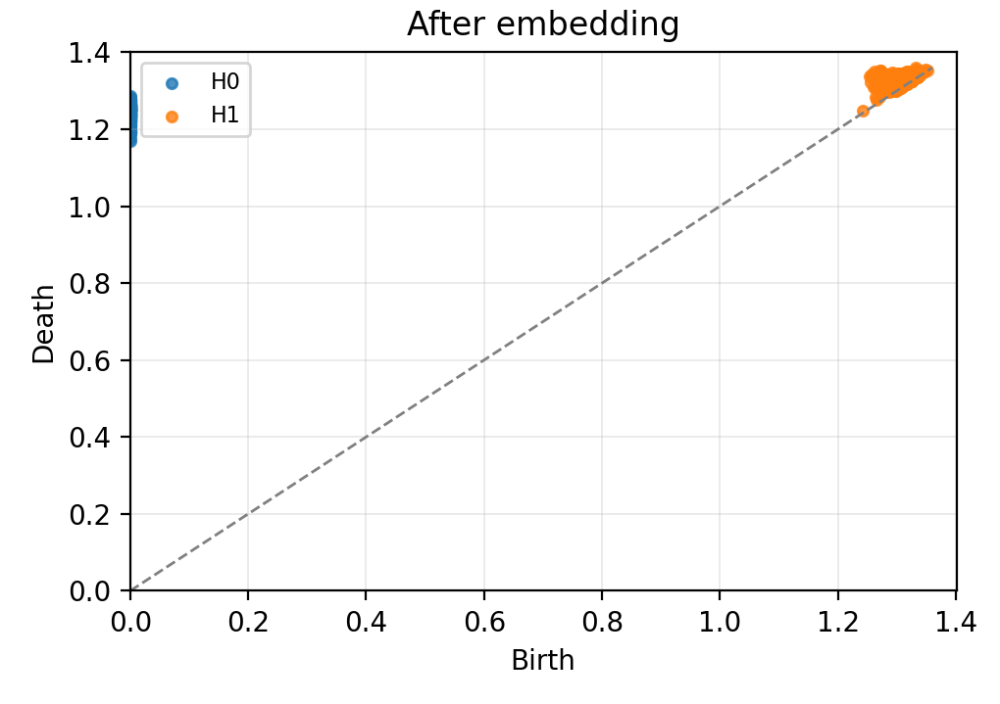

*(a) Step 1.*

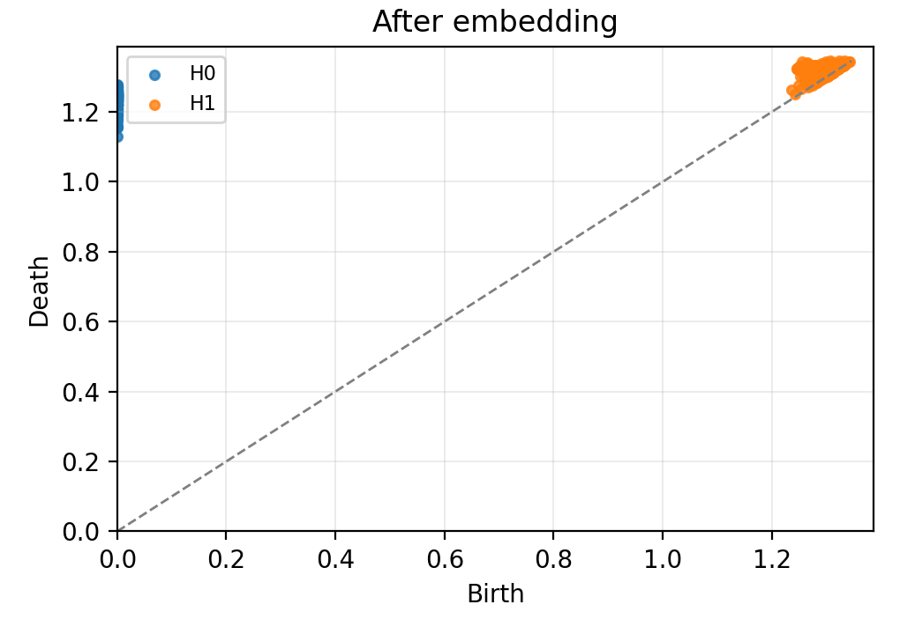

*(b) Step 20,000.*

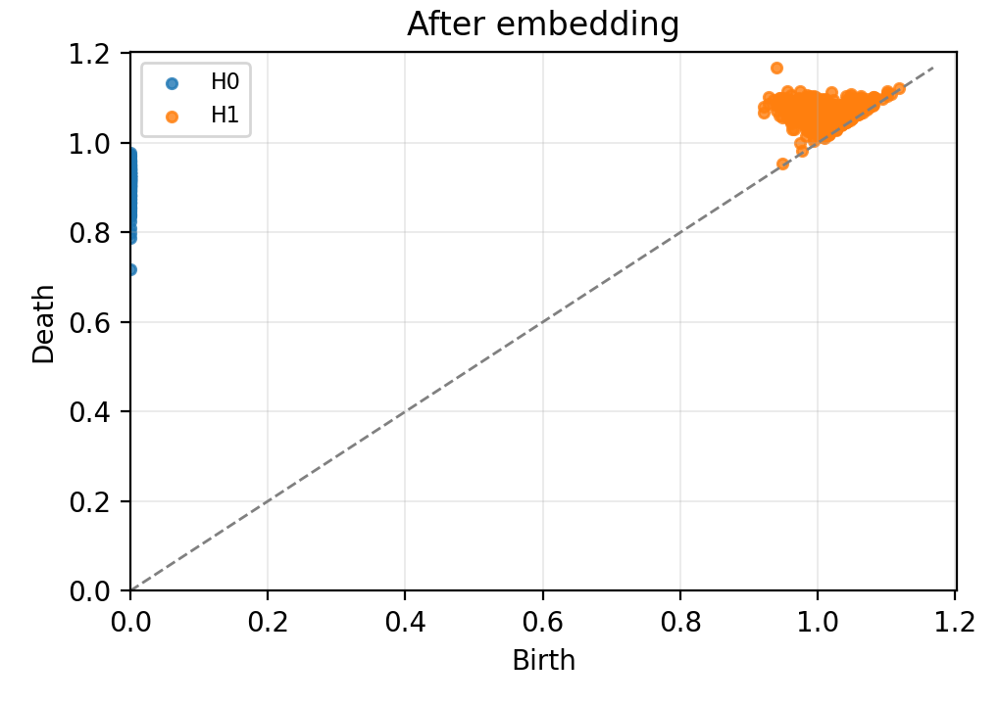

*(c) Step 30,000.*

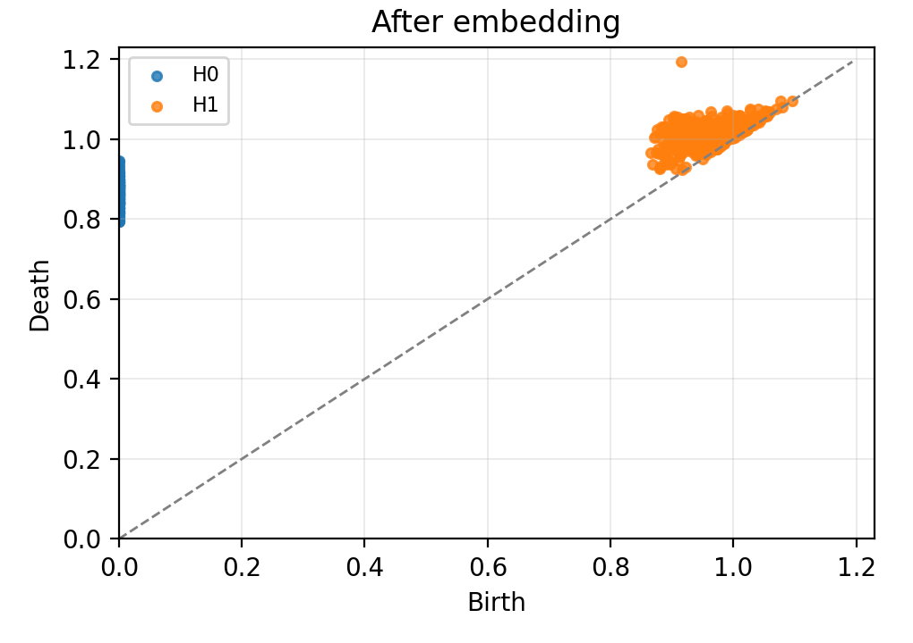

*(d) Step 50,000.*

###### fig-1

*Figure 1: Vietoris–Rips persistence diagrams computed from the learned representations of the Transformer model at different stages of training on the modular addition task with prime modulus $p=197$ and training fraction $30\%$. Panels correspond to training steps 1, 20,000, 30,000, and 50,000, respectively. As training progresses and the model transitions into the generalized regime, a dominant long-lived $H_{1}$ feature increasingly separates from the remaining topological features. This emergence of a highly persistent one-dimensional cycle is consistent with the formation of structured periodic organization in the learned representations following grokking.* **[p. 5]**

###### p4-7

**Comparison of PH with local intrinsic dimension.** The LID curves (top-right panel of Figure 3) display a complementary but inverse pattern: LID rises to roughly $20$–$25$ during memorization and then drops sharply at the grokking step, stabilizing near $5$. The initial rise reflects the network assembling a high-dimensional, unstructured representation of the training data; the subsequent drop signals compression onto a low-dimensional manifold. PH captures the dual aspect that LID misses: the global loop structure that becomes geometrically apparent only after this compression. Neither metric alone characterizes the transition, but together they paint a coherent picture of a representational phase transition.

###### p4-8

**Comparison with Fourier analysis [15].** To contextualize the PH results, we also examine the Fourier-based mechanistic analysis of grokking [15]. We study a representative training run with $\alpha=0.3$. As shown in Figure 2(a), the Fourier spectrum of the token embedding matrix is initially **[p. 5]** diffuse but progressively concentrates around a small number of dominant frequencies over the course of training. Figure 2(b) shows that the accuracies obtained by restricting to or excluding these dominant frequencies closely track the test accuracy, reflecting the onset of grokking.

###### p5-1

These observations provide a complementary spectral perspective on the emergence of structure during training. Whereas Fourier analysis identifies dominant frequency components associated with the learned modular arithmetic circuit, PH captures the evolving geometric and topological organization of the learned representations.

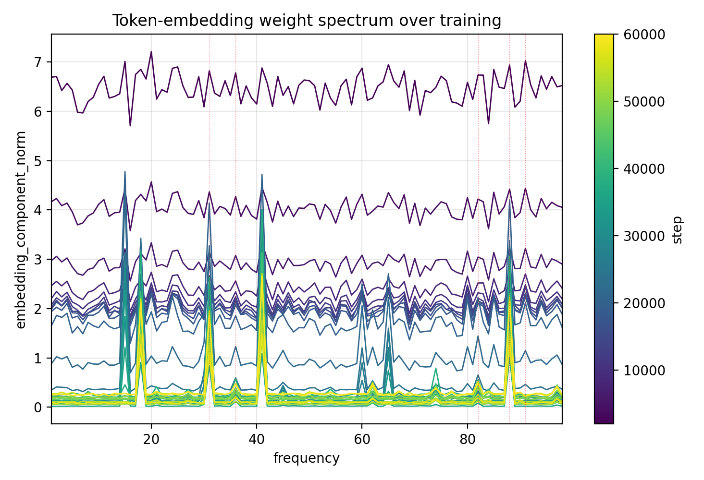

*(a) Evolution of the token-embedding Fourier spectrum over training.*

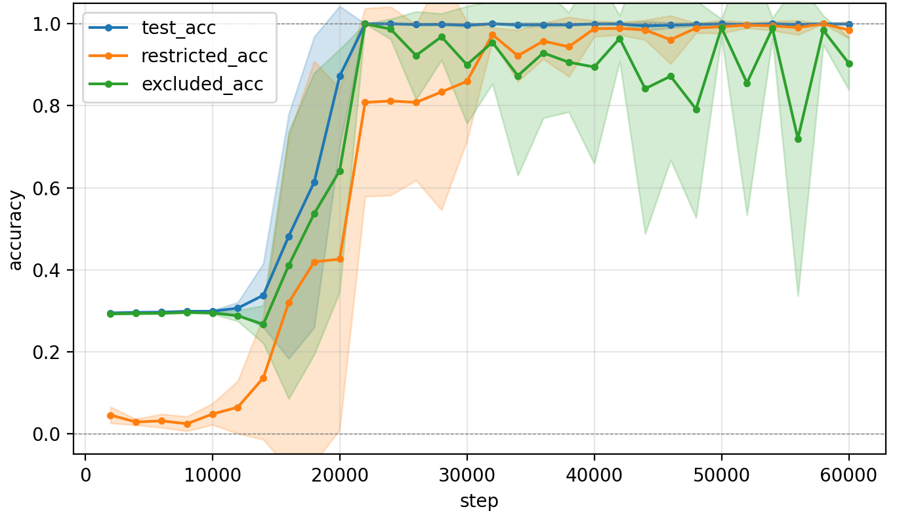

*(b) Comparison of test accuracy with restricted and excluded accuracies.*

###### fig-2

*Figure 2: Fourier-based mechanistic analysis of grokking on modular addition ($p=197$, $\alpha=0.3$). (a) Evolution of the token-embedding Fourier spectrum during training. (b) Test accuracy together with restricted and excluded Fourier accuracies, showing the emergence of dominant frequency components during grokking.* **[p. 5]**

**Consistency across primes.** Results for $p=113$ and $p=149$ are shown in Figures 7 and 8 in the Appendix. The H1 transitions remain aligned with the respective grokking steps across all fractions, and the LID inversion is consistently observed across all three primes.

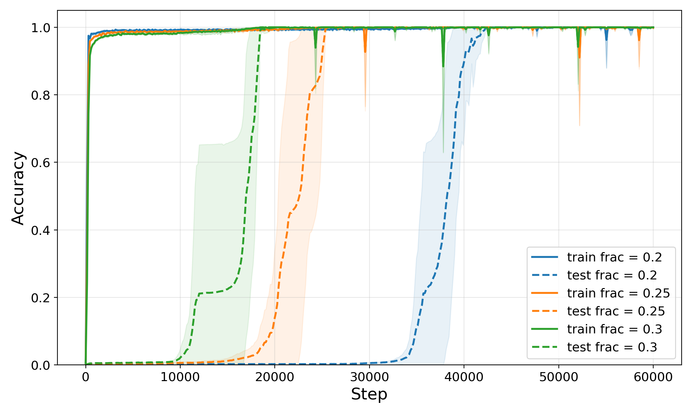

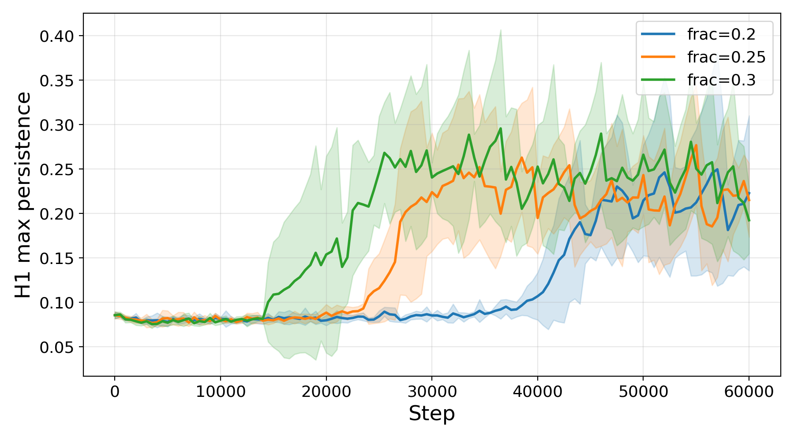

###### fig-3

*Figure 3: Transformer on modular addition, $p=197$, averaged across seeds ($\pm 1$ std. shaded). Top row: train/test accuracy (left) and mean pointwise LID on the test set (right). Bottom row: H1 max persistence (left) and H1 total persistence (right), both computed on the token embedding matrix. Both H1 metrics rise while LID drops simultaneously at grokking, across all training fractions.* **[p. 6]**

###### p5-4

**Topological signatures.** H1 max persistence at the token embedding layer (layer 0, middle row of Figure 4) rises from a baseline near $0.08$ to approximately $0.29$–$0.35$ at grokking. The rise in H1 total persistence is even more striking: starting from a baseline of $\approx 20$, it increases to the range $30$–$70$ for all three fractions at the grokking step. Both metrics rise for all fractions, including $\alpha=0.2$, indicating that the topological signal is robust across data regimes.

**[p. 6]**

###### p6-1

**Layer-wise behavior.** At the third hidden layer (bottom row of Figure 4), H1 max rises even further (to $0.4$–$0.5$), suggesting that the cyclic structure becomes more geometrically pronounced in deeper representations. Unlike the smaller primes $p=113$ and $p=149$ (see Appendix B), where H1 total at layer 3 *decreases*, reflecting a consolidation into fewer but stronger cycles, for $p=197$ the H1 total at layer 3 shows a modest positive increase alongside the max. We attribute this difference to the larger group size: $\mathbb{Z}/197\mathbb{Z}$ sustains more topological structure across all layers, rather than compressing it into a single dominant feature. The fact that the signal is visible as early as the embedding layer confirms that structure emerges at the very first stage of processing, consistent with the analysis of Nanda et al. [15].

**Consistency across primes.** Results for $p=113$ and $p=149$ are shown in Figures 9 and 10 in the Appendix. The embedding-layer H1 max rise is present in both, and the layer-3 inversion (max up, total down) is clearly visible, particularly for $p=149$.

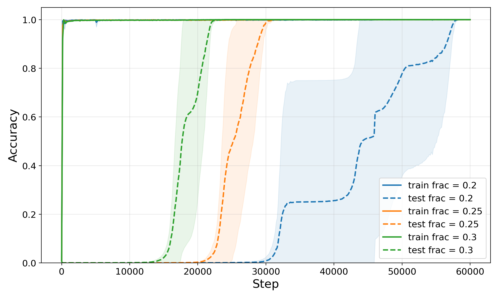

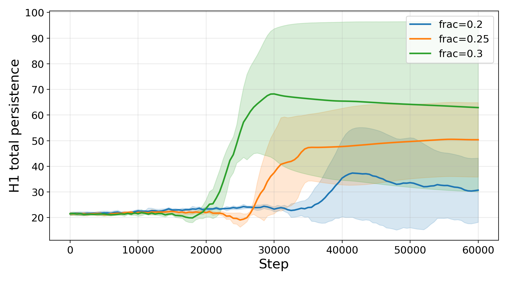

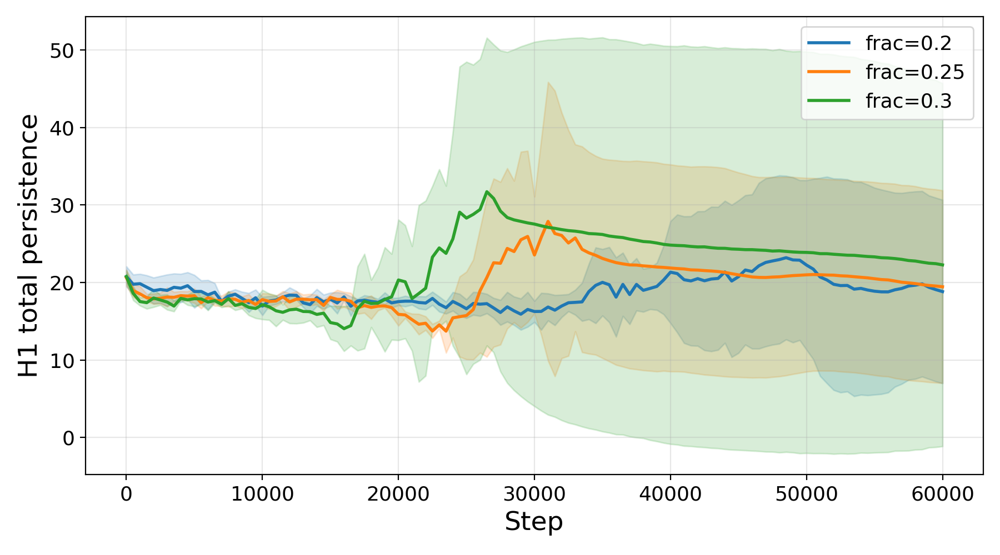

###### fig-4

*Figure 4: MLP on modular addition, $p=197$. Top: train/test accuracy. Middle row: H1 max (left) and H1 total persistence (right) at the token embedding layer (layer 0) — both rise at grokking for all three fractions, with H1 total showing the most dramatic increase across all settings. Bottom row: same metrics at the third hidden layer (layer 3) — H1 max rises further, and H1 total also increases modestly, suggesting topological structure strengthens through depth for this larger group.* **[p. 7]**

###### p6-4

The training configurations are as described in Section 3, with the Transformer model trained using a $0.3$ training fraction and the MLP model using a $0.2$ training fraction. For each architecture, we introduced a label permutation fraction, denoted $P_{\mathrm{frac}}$, corresponding to the proportion of training labels randomly permuted among the training samples and explored $P_{\mathrm{frac}}$ ranging from $0\%$ to $100\%$. All models were trained for a fixed budget of 60,000 optimization steps to capture both grokking and post-grokking dynamics.

###### p6-5

We focus on the label-permutation ablation results for the Transformer model, while the corresponding MLP results for modular arithmetic are provided in Appendix C.2. Consistent with the Transformer, the MLP exhibits qualitatively similar behavior, with improvements in generalization strongly coupled to the topological signatures captured by the PH statistics.

**[p. 7]**

###### p7-1

**Topological signatures with grokking.** For permutation levels up to $P_{\mathrm{frac}}\leq 10\%$, the Transformer model consistently exhibited grokking behavior. Within this regime, we observed strong and highly consistent associations between model generalization performance and the PH statistics, particularly in the embedding layer and first layer (Appendix Table 1). Across these early layers, $H_{0}$-based statistics exhibited strong negative correlations with test accuracy, with Spearman coefficients reaching as low as $\rho=-0.91$ for total $H_{0}$ persistence and remaining consistently below $-0.49$ across all grokking permutation levels. Conversely, maximum $H_{1}$ persistence exhibited strong positive correlation with test accuracy, reaching $\rho=0.81$ in layer 1 and remaining consistently positive across the same regimes. These results indicate that improved generalization is accompanied by increased connectivity together with the emergence of a dominant one-dimensional topological feature in the learned representation space. Figure 5 illustrates the evolution of these PH signatures over training under increasing label permutation, further illustrations can be found in the Appendix Section C.1.

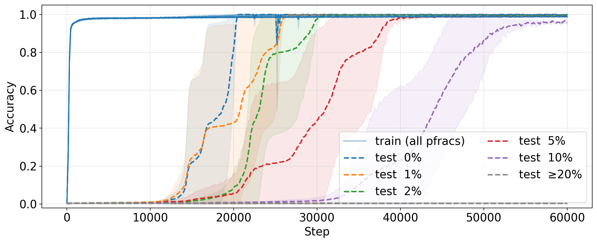

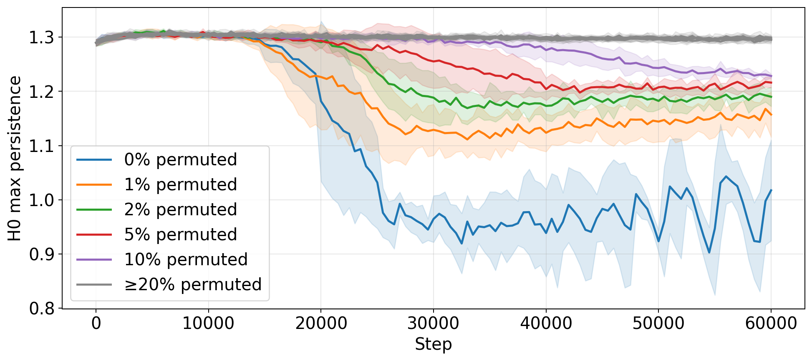

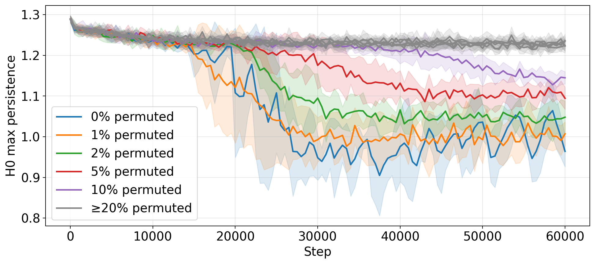

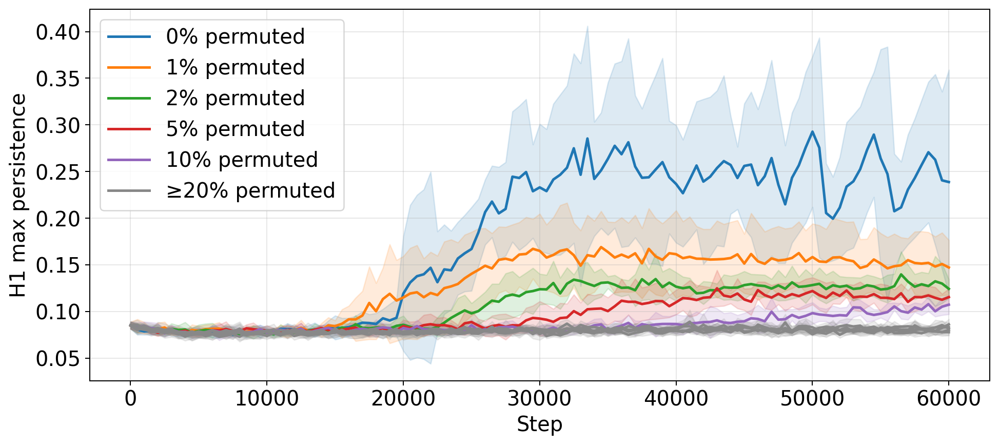

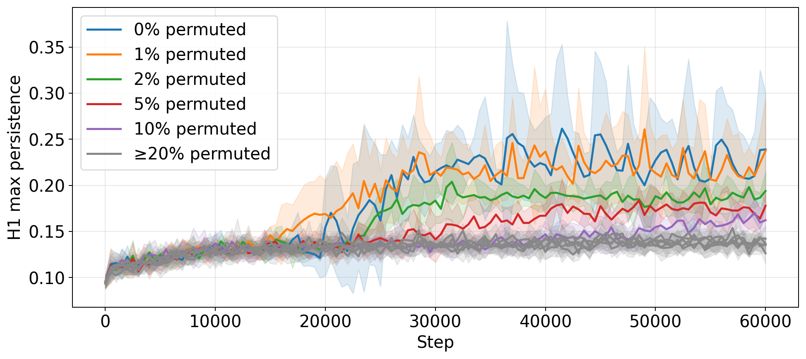

*Figure 5: Training dynamics under label permutation for the Transformer model. The top panel shows test accuracy across training for different label permutation fractions $P_{\mathrm{frac}}$. The remaining panels show the corresponding Vietoris–Rips PH statistics computed from the learned representations, with the left and right columns corresponding to the embedding layer (layer 0) and first layer (layer 1), respectively. Rows 2 and 3 report $H_{0}$ and $H_{1}$ maximum persistence, respectively. For low permutation levels, successful grokking is accompanied by a pronounced decrease in $H_{0}$ persistence and the emergence of a dominant $H_{1}$ cycle, consistent with the formation of a structured periodic representation. As label corruption increases, both generalization and the associated topological transition progressively deteriorate.* **[p. 8]**

###### p7-2

**Breakdown under increased label corruption.** At higher permutation levels ($P_{\mathrm{frac}}\geq 20\%$), the model was not able to generalize within the 60,000-step training window. Instead, the model remained in a memorization-dominated regime characterized by high training accuracy but poor out-of-sample performance.

###### p7-3

Crucially, under these conditions, the previously observed correlations between test accuracy and PH measures largely disappeared. This suggests that the topological signatures identified by our PH measures are not simply artifacts of training duration or loss minimization, but instead are specifically associated with the emergence of model generalization.

**[p. 8]**

**Temporal dynamics.** To further characterize the relationship between predictive performance and topological reorganization, we analyzed the cross-correlation function (CCF) between the first-order differences of test accuracy and the PH measures.

###### p8-2

Across all grokking runs of the Transformer model, cross-correlation analysis revealed a consistent temporal lag centered around 1,000 training steps between changes in predictive performance and the corresponding topological transition. Changes in test accuracy consistently preceded shifts in the PH statistics (e.g., total $H_{0}$ persistence), with the full set of cross-correlation plots provided in Appendix C.1. This suggests a two-stage learning dynamic in which the model first discovers a functionally correct input–output mapping, followed by a delayed geometric reorganization of the latent space into a more compact and topologically coherent representation.

###### p8-3

To assess whether the observed topological signatures generalize beyond tasks with latent cyclic structure, we apply the same analysis to representations learned on MNIST, a classification task whose underlying geometry is substantially more heterogeneous and not naturally cyclic. Experiments follow the implementation of Liu et al. [12], with varying weight initialization scales. In this setting, $\alpha$ denotes the initialization scaling factor relative to the default PyTorch initialization rather than the training fractions used in the modular arithmetic experiments. Results are averaged over five random seeds. As shown in Figure 6, training accuracy on MNIST saturates quickly for all values of $\alpha$, while test accuracy increases more gradually.

**[p. 9]**

###### p9-1

**$H_{1}$ max persistence.** The $H_{1}$ max persistence (left panel in the bottom row of Figure 6) increases gradually throughout training across all conditions. Unlike the modular arithmetic setting, no sharp transition is observed: the increase is comparatively slow and noisy rather than concentrated around a distinct grokking step.

###### p9-2

**$H_{1}$ total persistence.** The $H_{1}$ total persistence (right panel in the bottom row of Figure 6) displays a qualitatively different trajectory from the modular arithmetic case. It rises early in training to a peak around steps 25,000–50,000, before gradually declining throughout the remainder of training. This behavior suggests an initial increase in distributed topological complexity during early fitting, followed by a progressive consolidation of the learned representations. In contrast to modular arithmetic, no sustained increase in total persistence is observed, and no clearly dominant long-lived $H_{1}$ feature emerges.

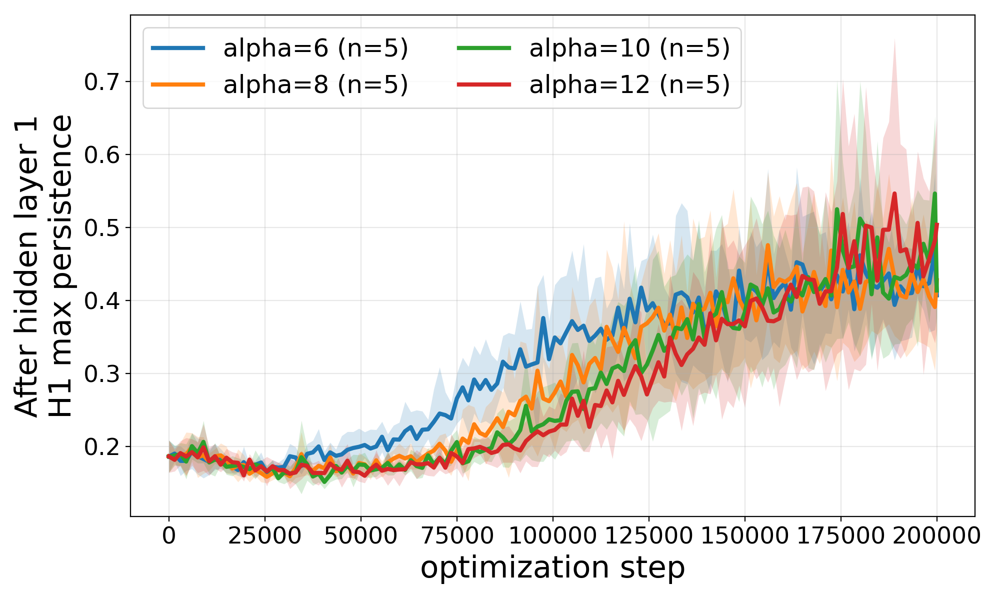

###### fig-6

*Figure 6: MNIST results, layer 1 (after the first hidden layer). Top row: train/test accuracy. Bottom row, left to right: $H_{1}$ max persistence and $H_{1}$ total persistence. Unlike the modular arithmetic setting, $H_{1}$ max persistence increases gradually without a sharp transition, while $H_{1}$ total persistence peaks early and subsequently declines. No clearly dominant long-lived cycle emerges, consistent with the absence of a simple global cyclic structure in the MNIST task.* **[p. 9]**

###### p9-3

We studied grokking through the lens of topology using PH on learned neural representations. Across modular arithmetic tasks, architectures, and training regimes, we identified a consistent topological signature of grokking characterized by increasing $H_{1}$ persistence and the emergence of dominant long-lived topological features. Ablation studies further showed that these signatures disappear when grokking fails to occur, indicating that they are associated with generalization rather than memorization.

###### p9-4

**Limitations.** While the observed topological transitions are clear in modular arithmetic, the behavior on MNIST is substantially more diffuse, suggesting that interpretable global topological structure may depend strongly on the underlying geometry of the task. More broadly, PH provides descriptive geometric summaries rather than mechanistic explanations of learning dynamics.

Overall, our results suggest that PH offers a useful framework for studying representation learning and the emergence of structure during training. Future work includes extending these analyses to tasks with richer latent geometry, larger-scale architectures, and more expressive topological summaries.

###### fig-10

*Figure 10: MLP on modular addition, $p=149$. Same layout as Figure 4. All three fractions show a clear rise in both H1 metrics at the embedding layer. The layer-3 inversion is the most pronounced of the three primes: H1 total drops from $\approx 15$ to $8$–$10$ while H1 max rises.* **[p. 14]**

###### p13-2

In this section, we provide additional cross-correlation results and ablation analyses to supplement the analysis presented in the main text. Table 1 shows a comprehensive summary of Spearman correlations between PH measures and test accuracy across all layers and permutation levels for the Transformer model. This table provides a detailed breakdown of the relationships discussed in the main text. Figure 11 provides a further illustration of additional topological statistics across the training dynamics for different levels of permutation at layers 0 and 1. Figure 12 shows the relationship between the first order difference for the test accuracy and the total $H_{0}$ persistence under varying levels of label permutation for the Transformer model. These results supplement the **[p. 14]** main finding that improvements in generalization consistently precede the corresponding topological transition.

###### tab-1

*Table 1: Spearman Rank Correlation ($\rho$) between PH measures and test accuracy (mean $\pm$ SD). Bolded values indicate $p<0.05$.* **[p. 15]**

| **Metric** | **Layer** | **0%** | **1%** | **5%** | **10%** | **20%** |
|---|---|---|---|---|---|---|
| $H_{0}$ Max | Embed | **-0.78 $\pm$ 0.04** | **-0.72 $\pm$ 0.07** | **-0.84 $\pm$ 0.07** | **-0.86 $\pm$ 0.06** | -0.10 $\pm$ 0.32 |
|  | Layer 1 | **-0.55 $\pm$ 0.08** | **-0.70 $\pm$ 0.06** | **-0.89 $\pm$ 0.03** | **-0.85 $\pm$ 0.07** | -0.05 $\pm$ 0.20 |
|  | Layer 2 | **-0.47 $\pm$ 0.10** | **-0.52 $\pm$ 0.14** | **-0.56 $\pm$ 0.16** | **-0.67 $\pm$ 0.08** | +0.00 $\pm$ 0.08 |
| $H_{0}$ Total | Embed | **-0.75 $\pm$ 0.03** | **-0.71 $\pm$ 0.10** | **-0.87 $\pm$ 0.06** | **-0.91 $\pm$ 0.03** | -0.20 $\pm$ 0.36 |
|  | Layer 1 | **-0.49 $\pm$ 0.08** | **-0.67 $\pm$ 0.09** | **-0.90 $\pm$ 0.03** | **-0.88 $\pm$ 0.06** | -0.14 $\pm$ 0.29 |
|  | Layer 2 | -0.06 $\pm$ 0.27 | **-0.47 $\pm$ 0.14** | **-0.59 $\pm$ 0.17** | **-0.82 $\pm$ 0.08** | -0.03 $\pm$ 0.10 |
| $H_{1}$ Max | Embed | **+0.77 $\pm$ 0.03** | **+0.71 $\pm$ 0.06** | **+0.80 $\pm$ 0.06** | **+0.69 $\pm$ 0.10** | +0.08 $\pm$ 0.10 |
|  | Layer 1 | **+0.49 $\pm$ 0.08** | **+0.70 $\pm$ 0.07** | **+0.81 $\pm$ 0.05** | **+0.68 $\pm$ 0.14** | +0.09 $\pm$ 0.17 |
|  | Layer 2 | -0.23 $\pm$ 0.23 | **+0.53 $\pm$ 0.10** | **+0.59 $\pm$ 0.13** | **+0.65 $\pm$ 0.11** | +0.05 $\pm$ 0.05 |
| $H_{1}$ Total | Embed | **+0.60 $\pm$ 0.10** | **+0.42 $\pm$ 0.39** | **+0.24 $\pm$ 0.49** | **+0.14 $\pm$ 0.51** | +0.10 $\pm$ 0.21 |
|  | Layer 1 | +0.33 $\pm$ 0.16 | **+0.71 $\pm$ 0.13** | **+0.74 $\pm$ 0.12** | **+0.71 $\pm$ 0.18** | +0.10 $\pm$ 0.18 |
|  | Layer 2 | **+0.80 $\pm$ 0.04** | **+0.66 $\pm$ 0.10** | **+0.62 $\pm$ 0.06** | **+0.40 $\pm$ 0.31** | +0.05 $\pm$ 0.09 |

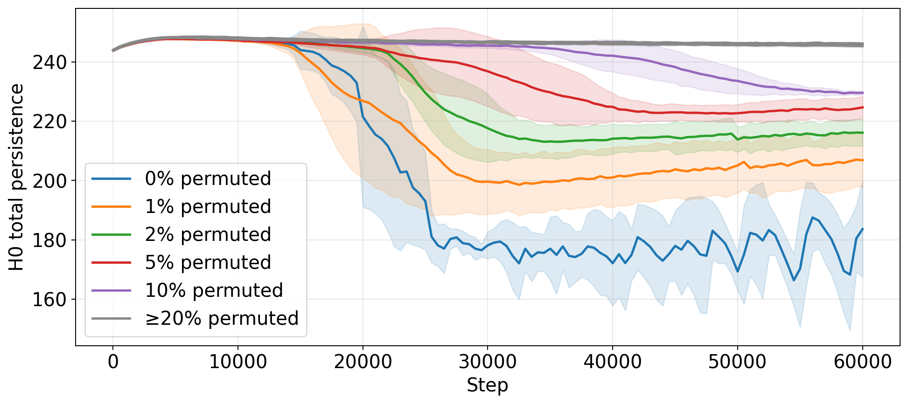

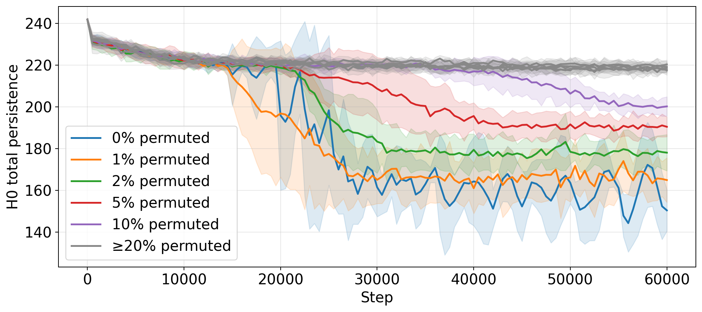

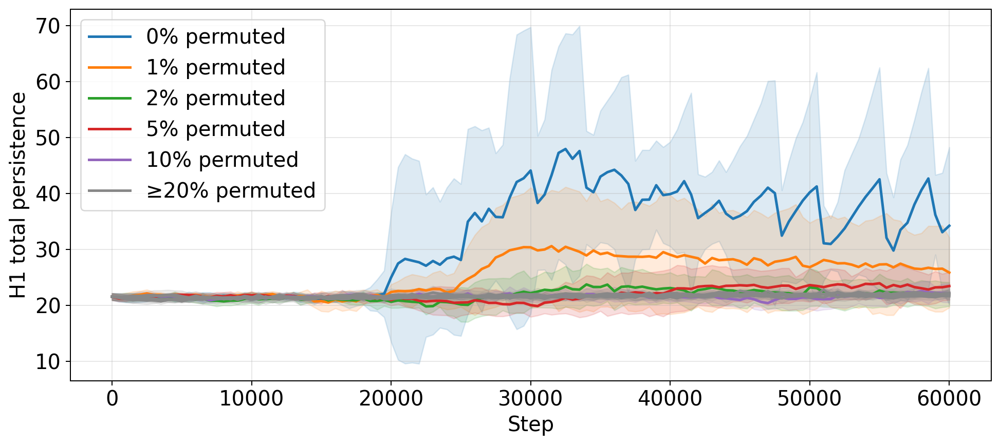

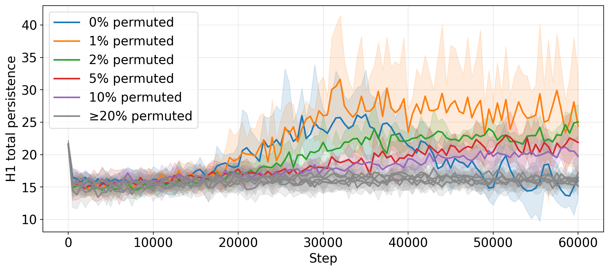

*Figure 11: Training dynamics under label permutation for the Transformer model. The top panel shows test accuracy across training for different label permutation fractions $P_{\mathrm{frac}}$. The remaining panels show the corresponding Vietoris–Rips PH statistics computed from the learned representations, with the left and right columns corresponding to the embedding layer (layer 0) and first layer (layer 1), respectively. Rows 2 and 3 report $H_{0}$ total persistence, and $H_{1}$ total persistence respectively. For low permutation levels, successful grokking is accompanied by a pronounced decrease in $H_{0}$ persistence and the emergence of a dominant $H_{1}$ cycle, consistent with the formation of a structured periodic representation. As label corruption increases, both generalization and the associated topological transition progressively deteriorate.* **[p. 16]**

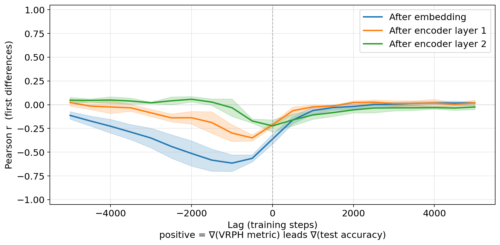

*(a) $P_{\mathrm{frac}}=1\%$*

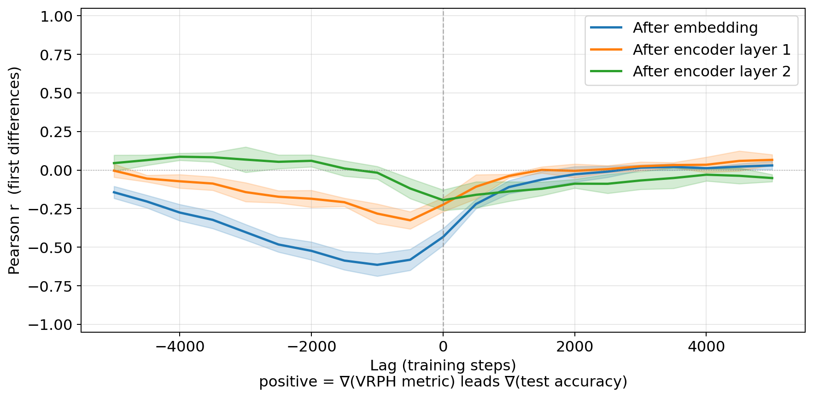

*(b) $P_{\mathrm{frac}}=2\%$*

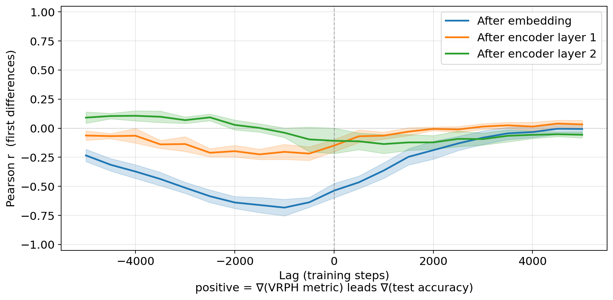

*(c) $P_{\mathrm{frac}}=5\%$*

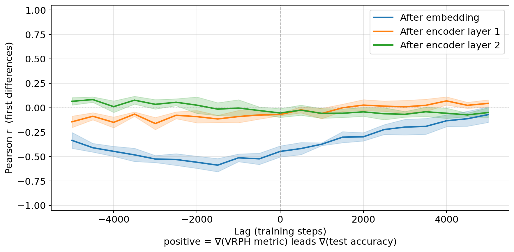

*(d) $P_{\mathrm{frac}}=10\%$*

###### fig-12

*Figure 12: Cross-correlation functions (CCFs) between the first-order differences of test accuracy and total $H_{0}$ persistence for the Transformer model under varying levels of label permutation. Across all grokking regimes ($P_{\mathrm{frac}}\in\{1\%,2\%,5\%,10\%\}$), the peak correlation consistently occurs at a negative lag, indicating that improvements in predictive performance precede the corresponding topological restructuring of the learned representation space.* **[p. 17]**

###### p14-2

In contrast to the Transformer model, the MLP exhibits a markedly more distributed structure of correlations across layers. Early layers (embedding and first hidden layer) show weaker and more variable associations with generalization, with large variance and several non-significant pattern under increased permutation. In contrast, deeper layers (Hidden 2 and Hidden 3) consistently exhibit strong and statistically significant correlations across all PH statistics in the low-noise regime ($P_{\mathrm{frac}}\leq 10\%$), with $H_{0}$ statistics reaching correlations as strong as $\rho=-0.86$ and $H_{1}$ maximum persistence reaching up to $\rho=0.79$.

###### p14-3

As label corruption increases, these correlations weaken and collapse under complete permutation. This is consistent with the model being in an intermediate generalization regime, where PH-aligned cyclic structure is emerging but has not yet fully stabilized.

**[p. 15]**

###### p15-1

Overall, this suggests that, unlike the Transformer where PH signatures are strongly localized in early representations, the MLP encodes topological structure more deeply in the network hierarchy, with generalization-related geometric organization emerging predominantly in later hidden layers.

###### tab-2

*Table 2: Spearman Rank Correlation ($\rho\pm\text{SD}$) between PH measures and test accuracy across all MLP layers. Bold values indicate statistical significance ($p<0.05$). Note that while early layers show inconsistent signals (high SD), deeper layers maintain a robust structural link to generalization even at 50% noise.* **[p. 15]**

| **Metric** | **Layer** | **0%** | **10%** | **20%** | **50%** | **100%** |
|---|---|---|---|---|---|---|
| $H_{0}$ Max | Embed (L0) | **-0.49 $\pm$ 0.45** | -0.26 $\pm$ 0.37 | +0.03 $\pm$ 0.26 | -0.12 $\pm$ 0.14 | -0.08 $\pm$ 0.26 |
|  | Hidden 1 | **-0.55 $\pm$ 0.39** | -0.30 $\pm$ 0.38 | +0.05 $\pm$ 0.27 | -0.17 $\pm$ 0.15 | -0.11 $\pm$ 0.16 |
|  | Hidden 2 | **-0.69 $\pm$ 0.27** | **-0.51 $\pm$ 0.23** | **-0.39 $\pm$ 0.17** | -0.47 $\pm$ 0.25 | +0.01 $\pm$ 0.22 |
|  | Hidden 3 | **-0.81 $\pm$ 0.07** | **-0.69 $\pm$ 0.16** | **-0.57 $\pm$ 0.08** | **-0.51 $\pm$ 0.11** | +0.09 $\pm$ 0.16 |
| $H_{0}$ Total | Embed (L0) | **-0.54 $\pm$ 0.40** | -0.30 $\pm$ 0.34 | -0.00 $\pm$ 0.21 | -0.16 $\pm$ 0.15 | -0.05 $\pm$ 0.27 |
|  | Hidden 1 | -0.61 $\pm$ 0.36 | -0.42 $\pm$ 0.30 | -0.15 $\pm$ 0.23 | -0.29 $\pm$ 0.18 | -0.04 $\pm$ 0.23 |
|  | Hidden 2 | **-0.84 $\pm$ 0.10** | **-0.77 $\pm$ 0.08** | **-0.64 $\pm$ 0.11** | **-0.58 $\pm$ 0.24** | +0.04 $\pm$ 0.22 |
|  | Hidden 3 | **-0.86 $\pm$ 0.06** | **-0.84 $\pm$ 0.08** | **-0.80 $\pm$ 0.05** | **-0.72 $\pm$ 0.13** | +0.11 $\pm$ 0.20 |
| $H_{1}$ Max | Embed (L0) | **+0.49 $\pm$ 0.41** | +0.30 $\pm$ 0.33 | +0.01 $\pm$ 0.20 | +0.18 $\pm$ 0.17 | +0.06 $\pm$ 0.27 |
|  | Hidden 1 | **+0.56 $\pm$ 0.39** | +0.41 $\pm$ 0.30 | +0.14 $\pm$ 0.21 | +0.24 $\pm$ 0.20 | +0.13 $\pm$ 0.12 |
|  | Hidden 2 | **+0.79 $\pm$ 0.09** | **+0.74 $\pm$ 0.06** | **+0.62 $\pm$ 0.05** | **+0.50 $\pm$ 0.25** | -0.01 $\pm$ 0.25 |
|  | Hidden 3 | **+0.76 $\pm$ 0.11** | **+0.73 $\pm$ 0.12** | **+0.62 $\pm$ 0.05** | **+0.56 $\pm$ 0.16** | -0.05 $\pm$ 0.23 |
| $H_{1}$ Total | Embed (L0) | -0.36 $\pm$ 0.31 | -0.08 $\pm$ 0.27 | **-0.30 $\pm$ 0.09** | -0.09 $\pm$ 0.20 | +0.11 $\pm$ 0.11 |
|  | Hidden 1 | **-0.68 $\pm$ 0.16** | **-0.62 $\pm$ 0.18** | **-0.58 $\pm$ 0.10** | **-0.38 $\pm$ 0.27** | +0.06 $\pm$ 0.27 |
|  | Hidden 2 | **-0.69 $\pm$ 0.18** | **-0.67 $\pm$ 0.11** | **-0.58 $\pm$ 0.12** | **-0.53 $\pm$ 0.23** | +0.07 $\pm$ 0.35 |
|  | Hidden 3 | **-0.72 $\pm$ 0.16** | **-0.73 $\pm$ 0.14** | **-0.65 $\pm$ 0.06** | **-0.63 $\pm$ 0.19** | -0.01 $\pm$ 0.33 |

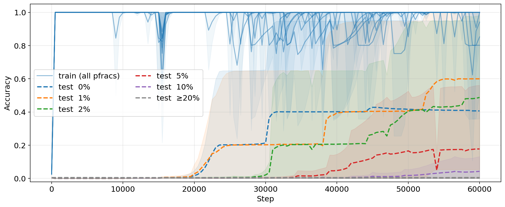

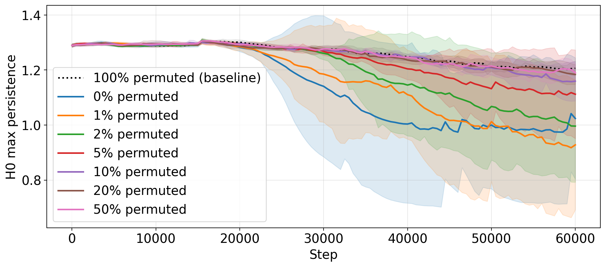

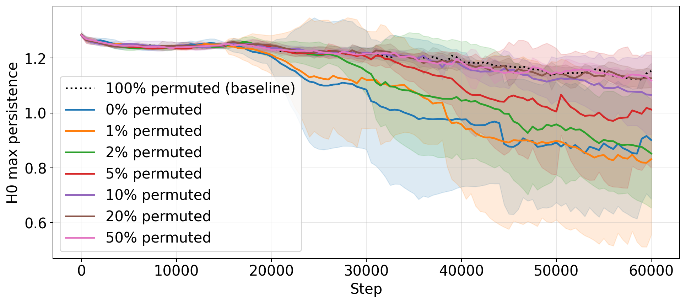

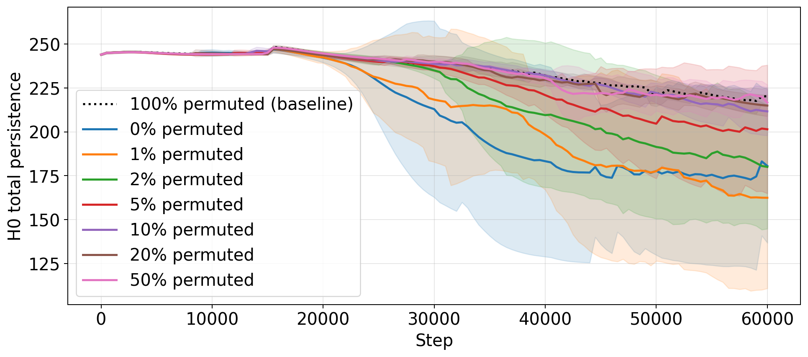

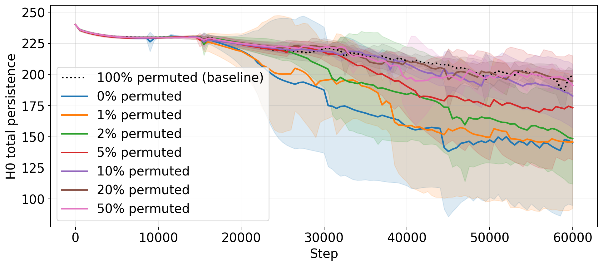

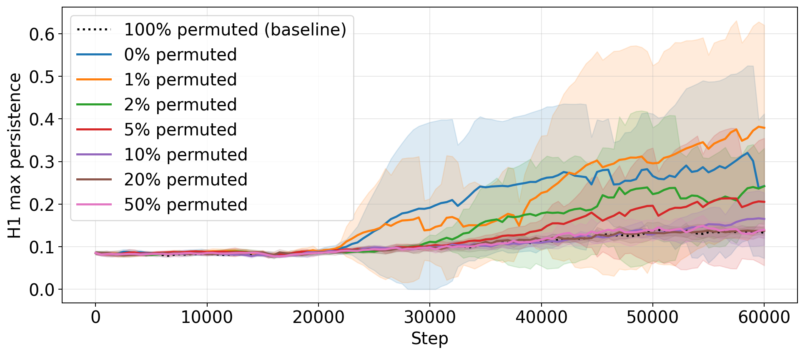

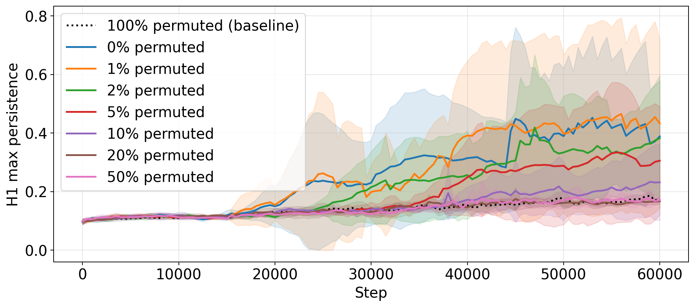

*Figure 13: Training dynamics under label permutation for the MLP model. The top panel shows test accuracy across training for different label permutation fractions $P_{\mathrm{frac}}$. The remaining panels show the corresponding Vietoris–Rips PH statistics computed from the learned representations, with the left and right columns corresponding to the embedding layer (layer 0) and first hidden layer (layer 1), respectively. Rows 2–4 report $H_{0}$ maximum persistence, $H_{0}$ total persistence, and $H_{1}$ maximum persistence.* **[p. 18]**

###### p15-2

In contrast to the Transformer model, where changes in predictive performance consistently preceded the associated topological transition, the MLP exhibits peak cross-correlation near zero lag across all PH statistics (Figure 14). This behavior is consistent across the other permutation levels exhibiting generalization. Overall, this suggests that, for the MLP, improvements in generalization and the corresponding geometric reorganization of the latent space occur approximately simultaneously.

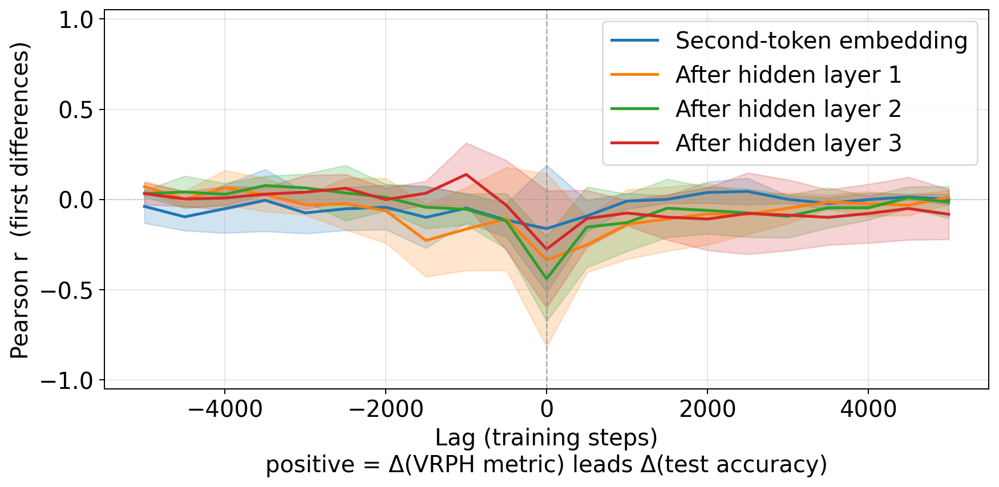

*(a) $H_{0}$ maximum persistence*

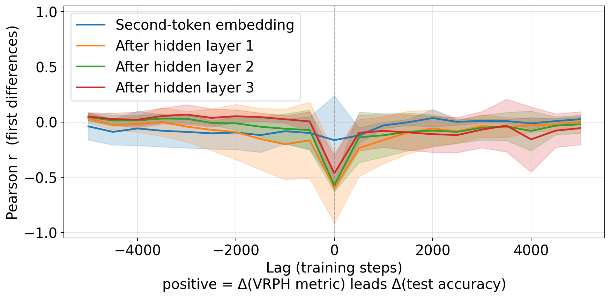

*(b) $H_{0}$ total persistence*

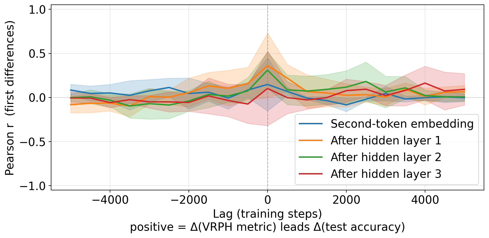

*(c) $H_{1}$ maximum persistence*

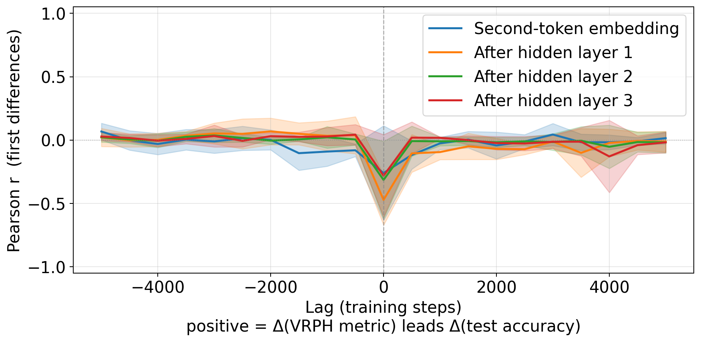

*(d) $H_{1}$ total persistence*

###### fig-14

*Figure 14: Cross-correlation functions (CCFs) between the first-order differences of test accuracy and PH statistics for the MLP model at $P_{\mathrm{frac}}=0$. Across all four topological statistics, the peak correlation occurs near zero lag, indicating that changes in predictive performance and the corresponding topological restructuring of the learned representation space occur approximately simultaneously* **[p. 19]**
