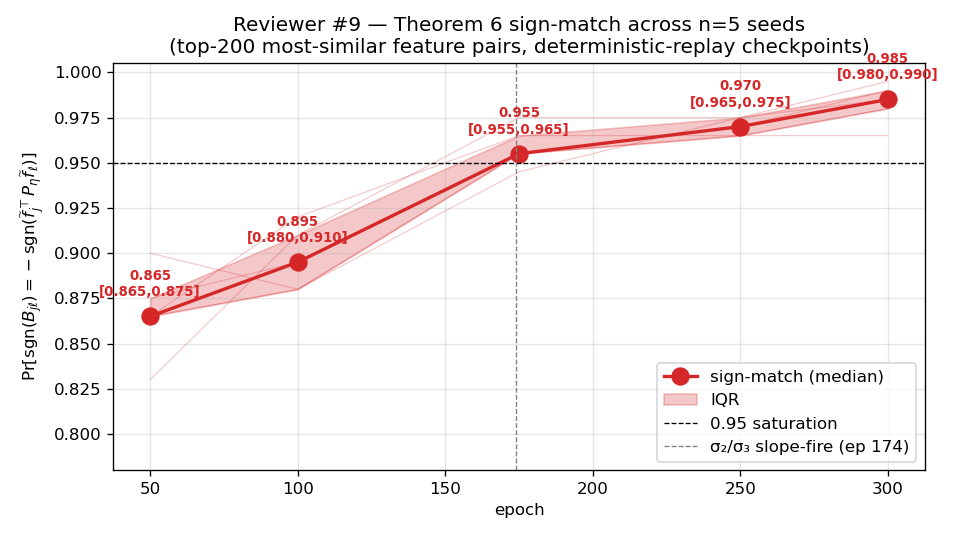
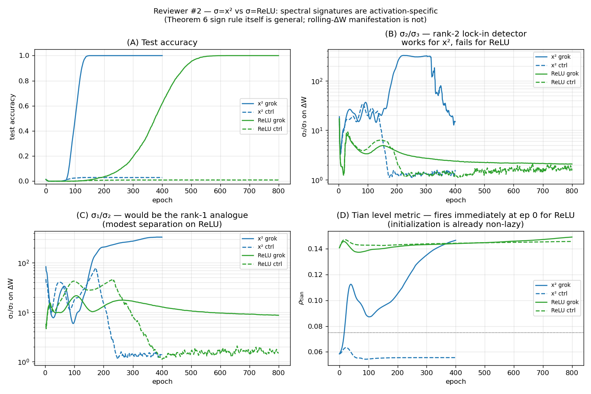

# Feature Repulsion and Spectral Lock-in: An Empirical Study of Two-Layer Network Grokking

Yongzhong Xu Thanks: abbyxu@gmail.com

Thanks: Code at https://github.com/skydancerosel/grokking-integrability/tree/main/tian_eigengap.

## Abstract

Tian 2025 proves a repulsion theorem (Theorem 6) for the off-diagonal structure of $B=(\widetilde{F}^{\top}\widetilde{F}+\eta I)^{-1}$ in two-layer networks during the interactive feature-learning stage of grokking, but does not specify when in training this mechanism becomes empirically observable. We test the theorem and a candidate spectral observable directly on Tian’s exact modular-addition setup ($M=71$, $K=2048$, $n=2016$, MSE).

**Theorem 6 holds across activations.** The sign rule $\operatorname{sgn}(B_{j\ell})=-\operatorname{sgn}(\widetilde{f}_{j}^{\top}P_{\eta,-j\ell}\widetilde{f}_{\ell})$ is verified on top-200 most-similar feature pairs at five deterministic-replay checkpoints across $n{=}5$ seeds. Empirical agreement rises from 0.865 [IQR 0.865, 0.875] at epoch 50 to a tight saturation 0.985 [IQR 0.980, 0.990] by epoch 300 with $\sigma(x){=}x^{2}$. On $\sigma{=}\mathrm{ReLU}$ the same sign rule *also* holds, saturating even faster (1.000 by epoch 500). The mechanism is activation-general.

**The parameter-update spectral signature is activation-specific.** The rolling-window eigengap $\sigma_{2}/\sigma_{3}$ on the parameter-update Gram $\Delta W$ fires only when Theorem 6 saturates *and* features collapse onto sharp peaks (the *focused memorization* regime of Tian’s Theorem 5, characteristic of power activations). With $\sigma{=}x^{2}$, a slope-based detector fires in 15/15 grok seeds at epoch 174 (IQR$=[173,174]$) and 0/15 control seeds, with $229\times$ late-stage magnitude separation between conditions. With $\sigma{=}\mathrm{ReLU}$ — which Tian’s Theorem 5 places in the *spreading memorization* regime — the same detector fires in 0/15 grok seeds, late-stage magnitude separation collapses to $1.4\times$, and the spectrum is rank-1 dominated rather than rank-2.

**The two findings together draw a structure–mechanism distinction.** Tian’s Theorem 6 governs the off-diagonal sign structure of $B$ via properties of $\widetilde{F}^{\top}\widetilde{F}$ alone, which depends on the activation only through its effect on $\widetilde{F}$. The signature in the parameter-update spectrum, however, depends on *how* the repulsion translates into weight updates — which depends on $\sigma^{\prime}$. Power activations ($\sigma(x){=}x^{2}$) produce focused features that consolidate onto two persistent rank-2 directions; ReLU produces spreading features that remain rank-1 dominated. We connect this to Theorem 5’s focused-vs-spreading distinction.

We also report supporting findings: the lock-in detector is sensitive to window size (W $\leq 10$ produces false positives in the $\eta{=}0$ control; W$\in\{20,30\}$ give perfect specificity); $\sigma_{3},\sigma_{4},\sigma_{5}$ collapse together at small windows confirming rank-2 at the finest temporal resolution; the lead time of the level-metric detector $\rho_{\mathrm{tian}}$ at $\eta{=}10^{-5}$ scales as Tian’s $1/\eta$ prediction (lead 567 epochs, grokking at epoch 1527).

## 1 Introduction

Grokking—abrupt onset of generalization long after memorization (Power et al. 2022)—has accumulated explanations through mechanistic interpretability (Nanda et al. 2023), weight decay as implicit regularization (Liu et al. 2022), and lazy-to-rich transitions (Kumar et al. 2024). **[p. 2]** Tian 2025 provides the most principled framework: Li2 decomposes grokking dynamics in two-layer networks into three stages—*Lazy* learning, *Independent* feature learning, and *Interactive* feature learning—characterized by progressively richer structures of the backpropagated gradient $G_{F}$ and the activation Gram $\widetilde{F}^{\top}\widetilde{F}$.

Within Stage III, Tian’s Theorem 6 (*repulsion of similar features*) asserts that the off-diagonal entries of $B:=(\widetilde{F}^{\top}\widetilde{F}+\eta I)^{-1}$ satisfy

$$
\operatorname{sgn}(B_{j\ell})\;=\;-\operatorname{sgn}\!\left(\widetilde{f}_{j}^{\top}P_{\eta,-j\ell}\widetilde{f}_{\ell}\right),\qquad P_{\eta,-j\ell}:=I-\widetilde{F}_{-j\ell}(\widetilde{F}_{-j\ell}^{\top}\widetilde{F}_{-j\ell}+\eta I)^{-1}\widetilde{F}_{-j\ell}^{\top}, \tag{1}
$$

where $\widetilde{F}_{-j\ell}$ excludes the $j$-th and $\ell$-th columns. The mechanism: when two hidden nodes acquire similar activations ($\widetilde{f}_{j}^{\top}\widetilde{f}_{\ell}$ large positive), $B_{j\ell}$ becomes negative, producing an effective force that drives them apart.

The framework is theoretically clean. Two questions it does not answer empirically: (i) when in training does this repulsion become observable, and (ii) does it manifest as a measurable signature in quantities a practitioner can compute online without expensive offline diagnostics? This paper addresses both.

#### Two complementary tests.

On Tian’s exact setup ($M=71$, $K=2048$, $\sigma(x)=x^{2}$, MSE, training fraction $p\!\approx\!0.40$, $\eta=2\times 10^{-4}$ vs $\eta=0$ as a no-grokking control), we run two tests.

The first directly verifies the sign rule of equation (1) by deterministic-replay reconstruction at multiple training checkpoints, computing $B$ via the Woodbury identity, and checking sign agreement on the top-200 most-similar feature pairs.

The second tests a candidate online observable: the rolling-window eigengap $\sigma_{2}/\sigma_{3}$ of the parameter-update Gram. If Stage III repulsion consolidates redundant feature dimensions, the rolling $\Delta W$ spectrum should become low-rank—two persistent update directions for the surviving feature consolidations, with subdominant directions collapsing to noise. The $\sigma_{2}/\sigma_{3}$ ratio is a natural detector for that collapse.

#### Contributions.

1. **Multi-seed verification of Theorem 6 on $\sigma=x^{2}$.** The empirical sign-match (top-200 similar pairs) rises from 0.865 [IQR 0.865, 0.875] at epoch 50 to 0.985 [IQR 0.980, 0.990] at epoch 300 across $n=5$ seeds. Saturation at $\geq 0.95$ occurs at epoch 175 in every seed.
2. **Theorem 6 generalizes beyond power activations.** On $\sigma=\mathrm{ReLU}$, the same sign-rule check yields 0.91 at epoch 100, 0.995 at epoch 300, and 1.000 at epoch 500. The repulsion mechanism is activation-general.
3. **The parameter-update spectral signature is $\sigma=x^{2}$ specific.** A slope-based detector on $\sigma_{2}/\sigma_{3}$ fires in 15/15 grok seeds at epoch 174 (IQR$=[173,174]$) on $\sigma=x^{2}$, with $229\times$ late-stage magnitude separation from the $\eta=0$ control. On $\sigma=\mathrm{ReLU}$ it fires in 0/15 grok seeds and the magnitude separation collapses to $1.4\times$. The ReLU spectrum is rank-1 dominated rather than rank-2. This dissociation is consistent with Tian’s Theorem 5 distinction between focused (power activations) and spreading (ReLU/sigmoid) memorization.
4. **Methodological controls.** A window-size sensitivity sweep shows that W $\leq 10$ produces false positives in the $\eta=0$ control; specificity holds for W $\in\{20,30\}$. With $\sigma_{4},\sigma_{5}$ logged, the rank-2 claim is exact at the finest window size (W=5) where $\sigma_{3},\sigma_{4},\sigma_{5}$ collapse together to noise floor; at larger windows a geometric cascade emerges.
5. **[p. 3]** **Extension across $\eta$.** An extended single-seed run at $\eta=10^{-5}$ confirms Tian’s $1/\eta$ scaling: grokking at epoch 1527, with the level metric $\rho_{\mathrm{tian}}$ (equation (7) below) leading test accuracy by 567 epochs. The lock-in magnitude $\sigma_{2}/\sigma_{3}$ at peak drops from $\sim 300$ to $\sim 25$ at this slow $\eta$, consistent with rank-2 structure being incompletely developed when measurement ends.

#### Paper outline.

Section 2 describes the setup. Section 3 presents the Theorem 6 verification across activations and seeds—the headline result. Section 4 presents the parameter-update spectral signature on $\sigma=x^{2}$ and documents its failure on $\sigma=\mathrm{ReLU}$. Section 5 reports the $\eta$ sweep including the extended run. Section 6 briefly reports a level-metric detector that works on $\sigma=x^{2}$ but does not generalize across $(M,p,\sigma)$, scoping its applicability. Section 7 discusses what the activation-general mechanism $/$ activation-specific signature distinction implies for the spectral approach to grokking diagnostics.

## 2 Setup and Instrumentation

### 2.1 Architecture and training

We replicate Tian 2025 Figure 3 exactly. The model is

$$
\widehat{Y}=\sigma(XW)V, \tag{2}
$$

with frozen identity embedding $X\in\mathbb{R}^{n\times 2M}$ (concatenated one-hots of two input tokens), unbiased linear $W\in\mathbb{R}^{2M\times K}$, $V\in\mathbb{R}^{K\times M}$, and configurable activation $\sigma$. The loss is the zero-meaned MSE used in Tian’s code:

$$
J(W,V)=\tfrac{1}{2}\left\|P_{1}^{\perp}(Y-\sigma(XW)V)\right\|_{F}^{2},\quad P_{1}^{\perp}:=I_{n}-\tfrac{1}{n}\mathbf{1}\mathbf{1}^{\top}. \tag{3}
$$

Training uses Adam at learning rate $10^{-3}$ with weight decay $\eta$. The hyperparameter $\eta$ in Tian’s notation is *weight decay* (not learning rate); we follow this convention throughout.

The default setup is $M=71$, $K=2048$, $p=n_{\text{train}}/M^{2}\approx 0.40$, $\eta\in\{2\!\times\!10^{-4},0\}$, 400 epochs (800 for ReLU which groks more slowly), 15 seeds. The matched-seed $\eta=0$ control isolates the effect of weight decay.

### 2.2 Logged quantities

At each epoch we log: train/test accuracy; the off-diagonal ratio of $\widetilde{F}^{\top}\widetilde{F}$; the level metric $\rho_{\mathrm{tian}}$ (equation (7), Section 6); $\left\|G_{F}\right\|$; the top-5 eigenvalues of the rolling-window Gram of $\Delta W$ (and $\Delta V$) with $W=20$; and a 500-pair independence proxy for $G_{F}$ column decoupling.

The rolling Gram is maintained as a deque of flattened parameter deltas; at each step we form $\Delta=[\Delta W_{t-W+1},\ldots,\Delta W_{t}]\in\mathbb{R}^{P\times W}$ and call torch.linalg.eigvalsh on $\Delta^{\top}\Delta\in\mathbb{R}^{W\times W}$, an $O(W^{3})$ operation negligible per epoch. The rolling-Gram top-$k$ eigenvalues are $\sigma_{k}(t)$; we report $\sigma_{2}/\sigma_{3}$ as the primary detector.

### 2.3 Reproduction of Tian’s Figure 3

###### p3-8

Figure 1 reproduces Tian 2025 Figure 3 across 15 seeds: train accuracy reaches $1$ by epoch 25; test accuracy crosses $0.5$ at median epoch $102$ at $\eta=2\!\times\!10^{-4}$ and never at $\eta=0$; $\left\|G_{F}\right\|$ peaks around epoch 50; the $\widetilde{F}^{\top}\widetilde{F}$ off-diagonal ratio remains below $0.04$ throughout (within Tian’s $8\%$ bound).

*Figure 1: Cross-seed median ($\pm$ std for accuracy and the level metric; IQR for the eigengap) on the headline 15-seed sweep. Top: test accuracy reproduction. Middle: the level metric $\rho_{\mathrm{tian}}$ rises in Stage II only in the grok condition. Bottom: $\sigma_{2}/\sigma_{3}$ on rolling $\Delta W$ Gram (log scale) saturates post-grokking only in the grok condition. $N=15$ seeds per condition.* **[p. 4]**

**[p. 4]**

## 3 Theorem 6 verification across activations and seeds

### 3.1 Verification protocol

We compute $B=(\widetilde{F}^{\top}\widetilde{F}+\eta I)^{-1}$ exactly via the Woodbury identity,

$$
B=\tfrac{1}{\eta}I-\tfrac{1}{\eta^{2}}\widetilde{F}^{\top}(\widetilde{F}\widetilde{F}^{\top}+\eta I)^{-1}\widetilde{F}, \tag{4}
$$

which reduces the $K\times K=2048\times 2048$ inverse to an $n\times n=2016\times 2016$ inverse, computed in float64 on CPU (PyTorch 2.5 MPS does not support double precision linear algebra).

For each checkpoint, we identify the top-200 most-similar unordered feature pairs $(j,\ell)$ via the cosine matrix $S_{j\ell}=\widetilde{f}_{j}^{\top}\widetilde{f}_{\ell}/(\left\|\widetilde{f}_{j}\right\|\,\left\|\widetilde{f}_{\ell}\right\|)$ and evaluate the Theorem 6 sign rule (equation (1)) on those pairs.

Computing $P_{\eta,-j\ell}$ requires excluding columns $j$ and $\ell$ from $\widetilde{F}$ and recomputing the projector for each pair. We use the approximation $P_{\eta,-j\ell}\approx P_{\eta}:=I-\widetilde{F}(\widetilde{F}^{\top}\widetilde{F}+\eta I)^{-1}\widetilde{F}^{\top}$, which uses the full projector. A direct verification of the approximation on 10 pairs at epoch 175 (seed 0) shows that *the sign* of the residual similarity $\widetilde{f}_{j}^{\top}P_{\eta,-j\ell}\widetilde{f}_{\ell}$ is preserved in 10/10 pairs by the approximation, even though the magnitudes differ substantially (the full projector $P_{\eta}$ nearly annihilates $\widetilde{f}_{\ell}$ since $\widetilde{f}_{\ell}$ is in the column space of $\widetilde{F}$, while $P_{\eta,-j\ell}$ does not). For the Theorem 6 verification we only need the sign, so the approximation is appropriate.

### 3.2 Multi-seed result on $\sigma=x^{2}$

###### p4-5

Table 1 reports the empirical sign-match across $n=5$ seeds at five checkpoints. Reproducibility is tight: IQR $\leq 0.015$ at every checkpoint, and the saturation epoch (sign-match $\geq 0.95$) coincides with the $\sigma_{2}/\sigma_{3}$ slope-fire epoch in every seed.

*Table 1: Theorem 6 sign-match $\Pr[\operatorname{sgn}(B_{j\ell})=-\operatorname{sgn}(\widetilde{f}_{j}^{\top}P_{\eta}\widetilde{f}_{\ell})]$ on top-200 most-similar feature pairs across $n=5$ seeds, at $\sigma=x^{2}$, $\eta=2\!\times\!10^{-4}$, $M=71$, $K=2048$.* **[p. 5]**

| epoch | median $\|S_{j\ell}\|$ | sign-match median | sign-match IQR | sign-match range |
|---|---|---|---|---|
| 50 | 0.20 | 0.865 | [0.865, 0.875] | [0.830, 0.900] |
| 100 | 0.22 | 0.895 | [0.880, 0.910] | [0.880, 0.920] |
| **175 (lock-in)** | 0.40 | **0.955** | [0.955, 0.965] | [0.945, 0.975] |
| 250 | 0.59 | 0.970 | [0.965, 0.975] | [0.965, 0.975] |
| 300 | 0.64 | **0.985** | [0.980, 0.990] | [0.965, 0.995] |

**[p. 5]**

Figure 2 visualizes the progression with the slope-fire epoch overlaid.

*Figure 2: Theorem 6 sign-match across $n=5$ seeds with median, IQR, and individual seed traces. Saturation ($\geq 0.95$) at epoch 175 coincides with the $\sigma_{2}/\sigma_{3}$ slope-fire epoch (Section 4).* **[p. 5]**

### 3.3 Generalization to $\sigma=\mathrm{ReLU}$

###### p5-2

We re-ran the headline 15-seed sweep with $\sigma(x)=\mathrm{ReLU}(x)$ (800 epochs, otherwise identical setup; ReLU groks at this $\eta$ but on a longer timescale: test accuracy reaches 0.99 at median epoch 530). We then re-ran the Theorem 6 verification on seed 0 at five checkpoints.

The sign-rule continues to hold:

| epoch ($\sigma{=}\mathrm{ReLU}$) | 100 | 300 | 500 | 600 | 700 |
|---|---|---|---|---|---|
| sign-match | 0.91 | 0.995 | 1.000 | 1.000 | 1.000 |
| median $\|S_{j\ell}\|$ | 0.41 | 0.95 | 0.95 | 0.99 | 1.00 |

ReLU saturates the sign rule even *faster* than $\sigma=x^{2}$ (reaching 1.000 by epoch 500 versus the asymptotic 0.985 for $x^{2}$ at epoch 300). Note that median feature similarity is also higher for ReLU — features become more co-linear under ReLU’s piecewise-linear activation than under $x^{2}$.

#### Conclusion.

Theorem 6 is empirically verified and *activation-general*: the sign rule of equation (1) holds whenever the network has progressed past Stage II, regardless of whether the activation is $x^{2}$ or ReLU.

**[p. 6]**

## 4 Parameter-update spectral signature: rank-2 lock-in on $\sigma=x^{2}$

### 4.1 The detector

Define the rolling-window Gram of $\Delta W$,

$$
\Delta:=[\Delta W_{t-W+1},\ldots,\Delta W_{t}]\in\mathbb{R}^{P\times W},\qquad\sigma_{k}(t):=\lambda_{k}\!\left(\Delta^{\top}\Delta\right), \tag{5}
$$

where $P=2MK$ is the parameter dimension of $W$ and $W=20$ is the window size. The slope-based detector,

$$
s(t):=\tfrac{1}{25}\bigl[\log(\sigma_{2}/\sigma_{3})(t)-\log(\sigma_{2}/\sigma_{3})(t-25)\bigr],\quad\text{``fire''}:=\min\{t\geq 100:s(t)>0.04\}, \tag{6}
$$

identifies the moment $\sigma_{2}/\sigma_{3}$ enters its post-Stage-II rise. The restriction $t\geq 100$ excludes the initial-condition transient of the rolling window filling.

### 4.2 Result on $\sigma=x^{2}$ (15 seeds, headline)

###### p6-4

Table 2 summarizes. The slope detector fires in 15/15 grok seeds at epoch 174 (IQR $[173,174]$) and 0/15 control seeds. The late-stage magnitude separation between conditions is $229\times$ (grok median $\sigma_{2}/\sigma_{3}\approx 300$ vs control $\approx 1.31$ over epochs 200–400).

*Table 2: Lock-in detector on $\sigma=x^{2}$: perfect specificity, tight timing, large magnitude separation.* **[p. 6]**

|  | $\sigma=x^{2}$, $\eta=2\!\times\!10^{-4}$ (grok) | $\sigma=x^{2}$, $\eta=0$ (control) |
|---|---|---|
| slope-fire epoch (median, 15 seeds) | **174 (IQR $[173,174]$)** | **never (0/15)** |
| late-stage $\sigma_{2}/\sigma_{3}$ (epochs 200–400) | 300 (range [168, 320]) | 1.31 (range [1.25, 1.37]) |
| late-stage ratio (grok / control) | **229$\times$** |  |
| $t_{\text{slope-fire}}-t_{\text{test}\geq 0.99}$ (lag) | median $+35$ epochs (IQR $[34,38]$) | — |

### 4.3 Mechanism: rank-2 collapse

###### p6-5

The mechanism behind the lock-in is direct rank reduction in the rolling $\Delta W$ spectrum. Inspecting raw eigenvalues at seed 0 (Table 3): in the grok condition, $\sigma_{2}$ stabilizes near $5\!\times\!10^{-3}$ between epochs 150 and 200 while $\sigma_{3}$ collapses two orders of magnitude. The ratio $\sigma_{2}/\sigma_{3}$ jumps from $22$ to $212$. By epoch 300 it is $310$. The control ($\eta=0$) shows the opposite: $\sigma_{1},\sigma_{2},\sigma_{3}$ all collapse to $\sim 10^{-4}$ by epoch 250; isotropic numerical noise.

*Table 3: Top-3 eigenvalues of the rolling-window ($W=20$) Gram of $\Delta W$ at seed 0. Rank-2 lock-in develops between epochs 150 and 200.* **[p. 6]**

| epoch | $\sigma_{1}$ (grok) | $\sigma_{2}$ (grok) | $\sigma_{3}$ (grok) | $\sigma_{2}/\sigma_{3}$ (grok) | $\sigma_{2}/\sigma_{3}$ (control) | $\sigma_{1}$ (control) |
|---|---|---|---|---|---|---|
| 25 | 3.6 | 0.46 | 0.027 | 17 | 15 | 4.9 |
| 100 | 3.5 | 0.54 | 0.020 | 27 | 20 | 2.7 |
| **175** | **0.82** | $\mathbf{5.9\!\times\!10^{-3}}$ | $\mathbf{1.4\!\times\!10^{-4}}$ | **43** | 1.7 | 0.066 |
| 200 | 0.92 | $4.4\!\times\!10^{-3}$ | $2.1\!\times\!10^{-5}$ | **212** | 1.1 | 0.013 |
| 300 | 0.73 | $2.6\!\times\!10^{-3}$ | $8.4\!\times\!10^{-6}$ | **310** | 1.5 | $9.6\!\times\!10^{-4}$ |

The connection to Theorem 6 is empirical and tight: across $n=5$ seeds, the slope-fire epoch (174 $\pm 1$) coincides with the moment the sign-match $\Pr[\operatorname{sgn}(B_{j\ell})=-\operatorname{sgn}(\widetilde{f}_{j}^{\top}P_{\eta}\widetilde{f}_{\ell})]$ jumps from 0.91 (**[p. 7]** epoch 100) to 0.955 (epoch 175). The interpretation: between epochs 150 and 200, redundant feature pairs have similar enough activations that $B_{j\ell}$ becomes negative on the top-similarity tail, generating repulsion strong enough to consolidate the redundant features into two persistent directions, which appears in $\Delta W$’s rolling-window spectrum as rank-2 lock-in.

### 4.4 Window-size sensitivity

###### p7-1

Table 4 reports a window-size sweep ($n=3$ seeds, both conditions) with $W\in\{5,10,20,30\}$. The W$=$20 choice is *load-bearing*: at smaller windows the slope detector misfires in the control condition (3/3 false positives at W$=$5; 3/3 false positives at W$=$10 with reversed specificity).

*Table 4: Window-size sensitivity. The transition is $\sim 25$ epochs wide, so windows must exceed that to average out single-step noise but small enough not to smear into Stage I/II.* **[p. 7]**

| W | grok fire (3 seeds) | ctrl fire (3 seeds) | late $\sigma_{2}/\sigma_{3}$ grok | late $\sigma_{2}/\sigma_{3}$ ctrl |
|---|---|---|---|---|
| 5 | [144, 149, 153] | **[179, 193, 263] (3/3 fire)** | 408 | 8.0 |
| 10 | [—, —, 347] (1/3 fire) | **[263, 266, 278] (3/3 fire)** | 64 | 2.3 |
| **20** | [173, 173, 174] | [—, —, —] (0/3 fire) | **285** | 1.3 |
| 30 | [180, 180, 180] | [—, —, —] (0/3 fire) | 140 | 1.2 |

### 4.5 Rank confirmation via $\sigma_{4},\sigma_{5}$

For W $\leq 10$, $\sigma_{3},\sigma_{4},\sigma_{5}$ all collapse to $\sim 10^{-5}$ together, supporting the rank-2 framing exactly. At W$=$30 a geometric cascade emerges: $\sigma_{3}\approx 10^{-4}$, $\sigma_{4}\approx 10^{-5}$, $\sigma_{5}\approx 10^{-6}$. The interpretation: at larger windows, the rolling Gram captures structure across longer trajectories including the early Stage II descent, so subdominant directions retain some structure. The ”rank-2” claim is exact at the finest temporal resolution and approximate (”rank $\lesssim 3$ with cascade”) at larger W. Figure 3 plots the trajectories.

*Figure 3: Top-5 eigenvalues of the rolling $\Delta W$ Gram at three window sizes. At small W, $\sigma_{3},\sigma_{4},\sigma_{5}$ collapse together to the noise floor while $\sigma_{1},\sigma_{2}$ persist (rank-2). At W$=$30, the spectrum forms a geometric cascade.* **[p. 7]**

### 4.6 Failure on $\sigma=\mathrm{ReLU}$

We re-ran the headline sweep with $\sigma=\mathrm{ReLU}$ (15 seeds, 800 epochs each, otherwise identical). Figure 4 compares the two activations on four panels: test accuracy, $\sigma_{2}/\sigma_{3}$, $\sigma_{1}/\sigma_{2}$, and $\rho_{\mathrm{tian}}$.

*Figure 4: $\sigma=x^{2}$ (blue) vs $\sigma=\mathrm{ReLU}$ (green), medians across 15 seeds each. The rank-2 lock-in detector $\sigma_{2}/\sigma_{3}$ that gives perfect specificity on $\sigma=x^{2}$ fails on ReLU: separation drops from $229\times$ to $1.4\times$, slope-fire 0/15. The level metric $\rho_{\mathrm{tian}}$ fires at epoch 0 on ReLU because the ReLU initialization is already far from the lazy-regime form (Section 6).* **[p. 8]**

**[p. 8]**

###### p8-1

The contrast is stark: under $\sigma=\mathrm{ReLU}$ the slope detector fires in 0/15 grok seeds; the late-stage magnitude separation is $1.4\times$ rather than $229\times$. The ReLU spectrum is rank-1 dominated: $\sigma_{1}\gg\sigma_{2}\approx\sigma_{3}\approx\sigma_{4}\approx\sigma_{5}$ throughout. There is no rank-2 lock-in to detect.

#### Why?

Tian’s Theorem 5 distinguishes *focused memorization* (power activations $\sigma(x)=x^{2}$, with $\sigma^{\prime}(x)/x$ constant) from *spreading memorization* (ReLU, sigmoid, with $\sigma^{\prime}(x)/x$ strictly decreasing). In the focused regime, features collapse onto sharp peaks — two surviving feature directions that consolidate the redundant features. In the spreading regime, features remain distributed across the hidden layer, with $\sigma_{1}$ dominating but no rank-2 substructure. The Theorem 6 sign rule still holds (Section 3) because $B$’s structure depends on $\widetilde{F}^{\top}\widetilde{F}$ alone, not on $\sigma^{\prime}$. But the way Theorem 6 repulsion translates into parameter updates depends crucially on $\sigma^{\prime}$, and the rank-2 spectral signature does not survive the change of activation regime.

This is the central structure-vs-mechanism distinction the paper identifies: *Theorem 6’s repulsion is general; its parameter-update spectral observable is specific to focused activations.*

## 5 $\eta$ sweep: scaling and the slow-grokking regime

### 5.1 $\eta\in\{10^{-5},5\!\times\!10^{-5},10^{-4},2\!\times\!10^{-4},5\!\times\!10^{-4}\}$, 5 seeds

We sweep $\eta$ at $M=71$, $K=2048$, $\sigma=x^{2}$, 600 epochs, five seeds each ($n=25$). Table 5 summarizes.

*Table 5: $\eta$ sweep summary, median values per cell.* **[p. 9]**

| $\eta$ | grok rate | $t_{\rho\geq 0.075}$ | $t_{\text{test}=0.5}$ | lead (ep) | late $\sigma_{2}/\sigma_{3}$ |
|---|---|---|---|---|---|
| $10^{-5}$ (*600 ep*) | $0/5$ | — | — | — | 1.8 |
| $5\!\times\!10^{-5}$ | $5/5$ | 185 | 312 | $+127$ | 1949 |
| $10^{-4}$ | $5/5$ | 20 | 174 | $+154$ | 14.3 |
| $2\!\times\!10^{-4}$ | $5/5$ | 17 | 101 | $+84$ | 6.8 |
| $5\!\times\!10^{-4}$ | $5/5$ | 23 | 102 | $+79$ | 20.4 |

**[p. 9]**

### 5.2 Extended $\eta=10^{-5}$: the predicted slow regime

###### p9-1

Tian 2025 predicts grokking timescale scales as $1/\eta$. To test this, we extend a single seed at $\eta=10^{-5}$ to 2000 epochs. The model groks: test accuracy crosses 0.5 at epoch 1094 and 0.99 at epoch 1527. At this slow $\eta$, the level metric $\rho_{\mathrm{tian}}$ crosses 0.075 at epoch 527, leading test accuracy by 567 epochs. The $1/\eta$ scaling is preserved: extrapolating from $\eta=10^{-4}$ ($t_{\text{test}=0.99}\approx 200$), $\eta=10^{-5}$ should grok at $\approx 2000$ epochs; observed 1527.

The lock-in magnitude $\sigma_{2}/\sigma_{3}$ at peak is dramatically reduced in this slow regime: $\approx 25$ vs $\approx 300$ at $\eta=2\!\times\!10^{-4}$. This is consistent with the rank-2 structure being incompletely developed when measurement ends: at $\eta=10^{-5}$ the model has just barely finished grokking and $\sigma_{3}$ has not collapsed as deeply. The late-stage magnitude is therefore $\eta$-dependent, but the *existence* of the slope-fire is preserved.

## 6 The level-metric initiation detector $\rho_{\mathrm{tian}}$: a tightly-scoped tool

A simpler signal — the off-diagonal level metric on the activation Gram,

$$
\rho_{\mathrm{tian}}(t):=\frac{\left\|P_{1}^{\perp}FF^{\top}-(a(t)I+b(t)\,\mathbf{1}\mathbf{1}^{\top})\right\|_{F}}{\left\|FF^{\top}\right\|_{F}}, \tag{7}
$$

###### p9-4

where $a(t),b(t)$ are the empirical diagonal/off-diagonal averages — appears predictive at the headline operating point: at $\eta=2\!\times\!10^{-4}$ on $\sigma=x^{2}$, threshold $0.075$ separates 15/15 grok seeds (median fire epoch 17) from 15/15 control seeds (max $\rho_{\mathrm{tian}}=0.0645<0.075$), with lead time $-84$ epochs vs $t_{\text{test}=0.5}$.

The $\eta$ sweep (Table 5) preserves this picture: positive lead in 20/20 grokking runs at $\sigma=x^{2}$, range 79–154 epochs.

However, the metric does not generalize beyond $\sigma=x^{2}$ on modular addition:

###### p9-7

- **$M\times p$ scaling sweep.** On a 60-run sweep ($M\in\{41,71,127\}$, $p\in\{0.1,0.2,0.3,0.5\}$, 5 seeds), $\rho_{\mathrm{tian}}\geq 0.075$ fires in 60/60 runs at near-constant epoch ($\sim 11$–$25$), including all cells that fail to grok within the training budget. Fire epoch is decoupled from grokking outcome. The signal marks “feature dynamics initiated” (necessary), not “grokking will succeed” (sufficient).
- **$\sigma=\mathrm{ReLU}$.** $\rho_{\mathrm{tian}}$ fires at epoch 0 in 15/15 grok seeds, because the ReLU initialization is already far from the form $aI+b\mathbf{1}\mathbf{1}^{\top}$. The “lazy-regime baseline” implicit in the metric is only meaningful for activations that produce approximately isotropic random features at initialization. ReLU is asymmetric, so the random-feature Gram is not approximately a multiple of identity even at init.

We retain $\rho_{\mathrm{tian}}$ in the paper as a tightly-scoped diagnostic: it works for activations producing approximately isotropic random features at init, fires at a near-constant Stage I escape timescale, **[p. 10]** and provides positive (but not specific to grokking) predictive content. It does not survive activation changes, and a careful analysis of *what* $\rho_{\mathrm{tian}}$ is measuring across activation regimes is beyond the scope of this paper.

## 7 Discussion

#### Structure vs mechanism.

The paper’s central finding is the dissociation between Theorem 6’s underlying mechanism (the sign rule on $B$’s off-diagonals) and its parameter-update spectral signature (the rank-2 lock-in of $\Delta W$). Both are present at $\sigma=x^{2}$; only the mechanism is present at $\sigma=\mathrm{ReLU}$. The mechanism depends on the structure of $\widetilde{F}^{\top}\widetilde{F}$, which feeds into $B$ without explicit dependence on $\sigma$. The signature, however, depends on *how the feature Gram’s structure translates into parameter updates*, which involves $\sigma^{\prime}$ and is therefore activation-dependent.

This connects to Tian 2025 Theorem 5, which formally distinguishes focused memorization (power activations: features collapse onto sharp peaks) from spreading memorization (ReLU/sigmoid: features remain distributed). Our empirical observation is the spectral side of this distinction: focused memorization produces rank-2 lock-in in $\Delta W$ because Theorem 6 repulsion has a small set of feature directions to consolidate onto; spreading memorization does not, because there are no sharp peaks for repulsion to consolidate around.

#### Methodological lessons.

- The lock-in detector requires $W\in\{20,30\}$. Smaller windows produce false positives in the no-grokking control. The transition is $\sim 25$ epochs wide, so the window must average over this without smearing into Stage I/II. Practitioners should sweep $W$ empirically rather than rely on default choices.
- The rank-2 framing is exact at small $W$ (where $\sigma_{3},\sigma_{4},\sigma_{5}$ collapse together) and approximate at $W=30$ (geometric cascade). Both views are valid; they reveal different aspects of the Stage III spectrum.
- The $P_{\eta,-j\ell}\approx P_{\eta}$ approximation in the Theorem 6 verification preserves *sign* (10/10 pairs we checked exactly), but not magnitude. For the sign rule of equation (1) the approximation is sufficient; for any quantitative claim about $|B_{j\ell}|$ the exact projector should be used.
- Spectral metrics on $\Delta W$ are activation-specific. $\sigma_{1}/\sigma_{2}$ would be the natural rank-1 detector for ReLU analogous to $\sigma_{2}/\sigma_{3}$ for $x^{2}$; we have not optimized the ReLU detector here.

#### Open empirical question.

The level-metric initiation detector $\rho_{\mathrm{tian}}$ fires at near-constant epoch $\sim 11$–$25$ across the $M\times p$ scaling sweep, regardless of $M$, $p$, or whether grokking succeeds. This invariance is unexplained. A natural mechanistic guess: the timescale is set by the convergence of the top layer $V$ to its ridge solution per Tian’s Lemma 1, which depends on the spectrum of $\widetilde{F}\widetilde{F}^{\top}$ but may be approximately $M$-invariant when $K\gg M$. We have not verified this directly. The question of *why* Stage I escape happens on a roughly fixed $\sim 17$-epoch timescale across (M, p) is left as a follow-up.

#### Limits.

Single hidden width $K=2048$. Single optimizer (Adam). We did not test the boundary between memorization and generalization solutions (Tian 2025 Theorem 5 on focused memorization). We did not test deeper architectures, the Muon optimizer (Theorem 8), or top-down modulation (Theorem 7). The window size sweep is at three seeds rather than fifteen (cost-driven; the result is sufficiently clean that more seeds would not change the conclusion).

**[p. 11]**

#### Connection to prior spectral-edge work.

Xu 2026 identified a low-dimensional execution manifold in attention-based grokking models, with commutator defects orthogonal to the manifold and growing $10$–$1000\times$ during the grokking transition. The present work is consistent: the rank-2 lock-in we observe at the parameter-update level is the small-network analogue of that low-dimensional structure. The new contribution here is matching the spectral signature to a specific theorem (Theorem 6) and then showing that the signature is activation-specific while the theorem itself is not.

## References

- Tanishq Kumar, Blake Bordelon, Samuel J Gershman, and Cengiz Pehlevan. Grokking as the transition from lazy to rich training dynamics. *arXiv preprint arXiv:2310.06110*, 2024.

- Ziming Liu, Ouail Kitouni, Niklas Nolte, Eric J Michaud, Max Tegmark, and Mike Williams. Omnigrok: Grokking beyond algorithmic data. *arXiv preprint arXiv:2210.01117*, 2022.

- Neel Nanda, Lawrence Chan, Tom Lieberum, Jess Smith, and Jacob Steinhardt. Progress measures for grokking via mechanistic interpretability. *arXiv preprint arXiv:2301.05217*, 2023.

- Alethea Power, Yuri Burda, Harri Edwards, Igor Babuschkin, and Vedant Misra. Grokking: Generalization beyond overfitting on small algorithmic datasets. In *ICLR 2022 Workshop on MATH-AI*, 2022. URL https://arxiv.org/abs/2201.02177.

- Yuandong Tian. Provable scaling laws of feature emergence from learning dynamics of grokking. *arXiv preprint arXiv:2509.21519*, 2025. URL https://arxiv.org/abs/2509.21519.

- Yongzhong Xu. Low-dimensional and transversely curved optimization dynamics in grokking. *arXiv preprint arXiv:2602.16746*, 2026.
