# Model Capacity Determines Grokking through Competing Memorisation and Generalisation Speeds

Yiding ‘Vincent’ Song Affiliation: Harvard College Affiliation: Cambridge, MA 02138 Email: yidingsong@college.harvard.edu Hanming Ye Affiliation: Harvard College Affiliation: Cambridge, MA 02138 Email: hanmingye@college.harvard.edu

## Abstract

###### p1-2

Existing accounts of grokking explain the phenomena in terms of mechanistic frameworks such as circuit efficiency or lazy-to-rich transitions. However, despite a known dependence between grokking and model size, how model capacity shapes grokking remains an open question. We give an information-theoretic account of this relationship on the task of modular arithmetic, showing that grokking does not immediately occur when a model becomes large enough to memorise the training set, but rather emerges as the outcome of a competition between two measurable timescales: a memorisation speed $T_{\text{mem}}(P)$ and a generalisation speed $T_{\text{gen}}(P)$, both of which are functions of model parameter count $P$. Adapting the information capacity framework of [21], we estimate $T_{\text{mem}}(P)$ on random-label data of equivalent complexity and $T_{\text{gen}}(P)$ on the modular task itself, and show that grokking emerges close to the parameter scale where these timescales intersect. The framework also suggests an empirical model for predicting memorisation speed given model capacity and dataset complexity, recovering the previously reported empirical observation that larger models memorise faster. Overall, we motivate the formalisation of different learning timescales as important abstractions to study when explaining how model capacity shapes grokking on algorithmic tasks.

## 1 Introduction

The grokking phenomenon [24] on modular arithmetic, whereby training accuracy saturates long before test accuracy, has become a canonical testbed for the dynamics of memorisation and generalisation in overparameterised networks. Existing accounts identify mechanisms that select the eventual generalising solution: implicit-bias and lazy-to-rich dynamical transitions [17, 11], circuit-efficiency arguments under weight decay [29, 9], selective norm growth that sparsifies the network [19], kernel-regime impossibility for modular addition [20], and mechanistic reverse engineering of grokked Transformers [23]. These accounts pinpoint why a generalising solution is preferred at convergence.

###### p1-4

However, the existing body of work does not explain fully how grokking depends on model size. Empirically, several papers have observed that very small models on modular arithmetic do not exhibit grokking at all, generalising immediately instead [13, 9]; only past some larger scale does the characteristic delay appear. A natural prediction follows from the bits-per-parameter capacity framework of [21]: grokking should begin once model capacity exceeds the dataset size, since that is where the memorising solution first becomes representable. Empirically, however, models with parameter counts well above this threshold continue to generalise immediately; the onset of grokking sits at a parameter count strictly larger than the capacity threshold. This leaves open the question of what controls the parameter scale at which grokking begins, if not the capacity threshold itself.

###### p2-1

We argue that the missing ingredient is a quantitative treatment of *learning timescales*. Building on the bits-per-parameter capacity methodology of [21], we define two measurable speeds for a Transformer of size $P$: a **memorisation speed** $T_{\text{mem}}(P)$, the number of epochs to fit a random-label dataset of equivalent information content; and a **generalisation speed** $T_{\text{gen}}(P)$, the number of epochs to reach high validation accuracy on the modular task. We focus on modular division over prime fields and a family of small decoder-only Transformers. Our central finding is that the onset of grokking coincides closely with the parameter count at which these two timescales intersect, a count that is strictly larger than the capacity threshold $P_{\text{mem}}$ at which memorisation first becomes representable. A capacity sufficient to represent a memorising solution is not sufficient to make memorisation the path that gradient descent takes; what matters is whether memorisation is faster than generalisation.

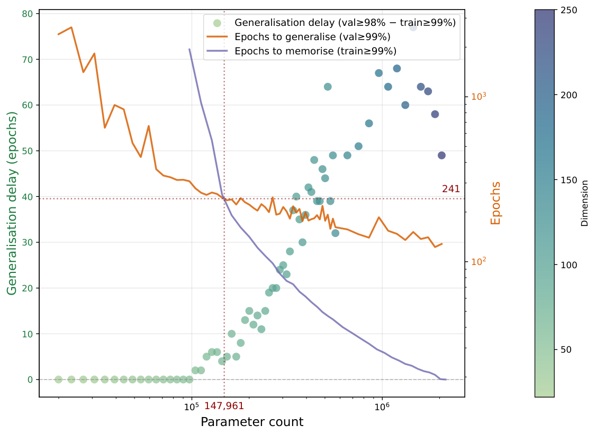

*(a) $p=97$*

*(b) $p=113$*

**[p. 2]**

*(c) $p=139$*

###### fig-1

*Figure 1: Generalisation delay (scatter, left axis: number of epochs between model reaching high training accuracy and high validation accuracy; colour encodes model dimension $d$) and learning speeds (orange: epochs to generalise; purple: epochs to memorise random dataset of same complexity) versus model parameter count for three primes. The dashed crosshair marks the predicted grokking point $\widehat{P}_{\text{cross}}(p)$, given by the intersection of the generalisation (orange) and memorisation (purple) curves; this coincides closely with the onset of non-zero generalisation delay (i.e. ‘grokking’). For small models, generalisation is faster than memorisation and the model generalises immediately (zero delay, no grokking). As parameter count $P$ increases, memorisation speed approaches generalisation speed; once the two cross, generalisation delays become non-zero and grokking begins.* **[p. 2]**

###### p2-2

Concretely, we observe three regimes as we scale model parameter count $P$ (Fig. 1): an **under-capacity** regime (model capacity well below the dataset complexity) in which neither solution is represented and both train and test accuracy are low; an **immediate-generalisation** regime in which model capacity is comparable to or exceeds the dataset complexity but $T_{\text{gen}}(P)<T_{\text{mem}}(P)$, so gradient descent reaches the algorithmic solution before any memorisation completes and there is no generalisation delay; and a **grokking** regime, beyond the speed intersection, in which $T_{\text{mem}}(P)\lesssim T_{\text{gen}}(P)$ and the model first memorises and only later generalises.

Our main contributions in this paper are:11 1 The code needed to reproduce and visualise the results in this paper is available at https://github.com/PerceptronV/grokking-capacity.

###### p2-4

1. **A mechanistic account of how capacity controls grokking, via competing memorisation and generalisation speeds.** Adapting the bits-per-parameter framework of [21], we formalise measurements of $T_{\text{mem}}(P)$ and $T_{\text{gen}}(P)$ for small Transformers and show that the parameter count at which they intersect closely tracks the empirical onset of grokking across primes and dataset sizes.
2. **Two prior observations recovered as separate consequences of the framework.** The empirical observation that small models on modular arithmetic do not grok [13, 9] follows from our framework because at small $P$, $T_{\text{gen}}(P)<T_{\text{mem}}(P)$, so the generalising solution is reached first. The observation that larger language models memorise faster [28] is recovered, in our setting, by the empirical regularity that $T_{\text{mem}}(P,n)$ depends primarily on the capacity fraction $f=K/(C_{\text{model}}P)$, where $K$ is dataset size and $C_{\text{model}}$ is model capacity, with $T_{\text{mem}}\propto e^{af}$ for $f\in[0,0.25]$ (Fig. 3(b)). Both empirical observations follow from distinct components of our framework.

**[p. 3]**

## 2 Background and Related Work

#### Grokking and algorithmic generalisation.

###### p3-1

Grokking, or delayed generalisation after rapid training-set overfitting, was introduced by [24] in small Transformers trained on algorithmic tasks such as modular addition. Modular arithmetic has since served as a controlled testbed for separating memorisation from algorithmic solutions and for probing the dynamics that mediate between them, with mechanistic reverse engineering of the grokked Fourier algorithm [23] and extensions to richer modular families and reasoning-like compositions [7, 30, 8]. Grokking-like transitions have also been reported beyond algorithmic data, suggesting that delayed generalisation is not specific to modular arithmetic but reflects more general properties of overparameterised optimisation [14, 10].

#### Mechanistic accounts: why a generalising solution is preferred.

###### p3-2

A body of work explains grokking by identifying mechanisms that select the generalising solution. [29] attribute the late switch to circuit efficiency: weight decay favours a norm-efficient generalising circuit over a memorising lookup, and [9] extend this competition picture to a 2D phase diagram over model size and dataset size that includes a small-model ‘progression’ regime of immediate generalisation. [19], in a sparse-parity setting, document grokking as the emergence of a sparse subnetwork via selective norm growth in a small set of neurons. [13] earlier mapped a four-phase diagram (comprehension, grokking, memorisation, confusion) on modular arithmetic and noted a small-decoder regime that does not grok, anticipating the empirical phenomenon we focus on here. A complementary line frames grokking as a transition out of the lazy/kernel regime: [11] show that grokking can be controlled in a two-layer network by the output-scale “laziness” parameter and the alignment between the initial NTK and the task labels, with grokking arising in a Goldilocks regime where feature learning is delayed; [20] prove that the kernel regime cannot solve modular addition, providing a static representational counterpart to Kumar et al.’s dynamical claim; and [17] derive grokking from a dichotomy between early- and late-phase implicit biases. Phase-transition treatments [26] and complexity-based progress measures [4, 6] interpret grokking as an emergent transition in the network’s internal organisation. These accounts identify mechanisms that select the generalising solution but say less about the parameter scale at which grokking appears, or about *when* during training each solution is reached. A recent empirical study [18] disentangles depth, architecture, activation, and regularisation effects on modular addition, finding that grokking dynamics are dominated by optimisation–regularisation interactions rather than architectural specifics.

#### Pattern-learning speeds and timescale-based intuitions.

###### p3-3

The conceptual ancestor of our framing is the view that grokking arises because different patterns are learned at different rates. [5] argue that grokking and double descent are unified by a spectrum of pattern-learning speeds: gradient descent first fits fast, poorly-generalising components and only later learns slower, more robust ones. Optimiser-side interventions support this picture: [12] accelerate grokking dramatically by amplifying slow gradient components, and [27] identify late-stage “slingshot” dynamics in adaptive optimisers that often coincide with the grokking transition. Epoch-wise double descent in standard supervised learning likewise reinforces that training time, not only model size, is a meaningful axis of generalisation behaviour [22]. Our contribution turns this qualitative speed intuition into two quantitative, separately measurable timescales $T_{\text{mem}}(P)$ and $T_{\text{gen}}(P)$, and shows that their crossover is what controls grokking onset on modular arithmetic — addressing the parameter-scale dependence that the mechanistic accounts above leave open.

#### Memorisation, capacity, and scaling.

###### p3-4

The methodological lineage we build on is the use of random-label training to characterise memorisation. [31] show that modern networks can interpolate pure noise; [2] document the dynamics of this memorisation; and [3] quantify it in language models. Most directly, [21] operationalise memorisation in bits and estimate a bits-per-parameter capacity $C_{\text{model}}$ by training to saturation on random tokens. They argue that grokking begins when capacity is saturated. We adopt their measurement framework but use it to characterise learning timescales rather than the static memorisation threshold: grokking onset on modular division falls at the speed crossover, which sits at a parameter count larger than the capacity threshold $P_{\text{mem}}$ that [21] identify. The empirical observation that larger language models memorise faster [28] **[p. 4]** is recovered, in our setting, by the regularity that $T_{\text{mem}}$ depends primarily on the capacity fraction $f=K/(C_{\text{model}}P)$.

## 3 Problem Setting and Notation

### 3.1 Modular arithmetic datasets

###### p4-1

Fix a prime $p$ and an operation $\circ\in\{+,-,\times,/\}$ on $\mathbb{Z}_{p}$. For modular division we use $a/b\equiv a\cdot b^{-1}\pmod{p}$ with $b\in\{1,\dots,p-1\}$. Following standard grokking benchmarks, we enumerate all valid pairs $(a,b)$ and build a dataset $\mathcal{D}_{p}=\{(X_{i},y_{i})\}_{i=1}^{N_{\text{full}}}$ where each input $X_{i}$ is a length-$4$ token sequence encoding the equation $X_{i}=[a,\ \texttt{op},\ b,\ \texttt{=}],$ and the label $y_{i}=a\circ b\in\{0,\dots,p-1\}$. We reserve two special tokens for the operator and equals sign, so the vocabulary size is $V=p+2.$

###### p4-2

For modular division the number of valid pairs is $N_{\text{full}}=p(p-1)$. We randomly select a training subset $\mathcal{D}^{\text{train}}_{p}$ containing a fraction $\alpha\in(0,1)$ of these pairs and use the remainder as a held-out test set. Throughout, we focus on $\alpha=1/2$, so that $N_{\text{train}}=\alpha p(p-1)$ and $N_{\text{test}}=N_{\text{train}}$.

### 3.2 Dataset complexity and information content

###### p4-3

We are interested in the worst-case number of bits needed to memorise the labels $y_{i}$ given inputs $X_{i}$. Assuming random labels, each $y_{i}$ is uniformly distributed over $V$ possibilities and therefore requires $\log_{2}V$ bits to specify. The information content (or *complexity*) of the training data is then

$$
K_{\text{mem}}(p,\alpha)=N_{\text{train}}\log_{2}V=\alpha p(p-1)\log_{2}(p+2). \tag{1}
$$

###### p4-4

We treat modular division as a structured task that admits a much more compact algorithmic description of complexity $K_{\text{alg}}(p)$, although we do not attempt to compute $K_{\text{alg}}$ explicitly here.

### 3.3 Model architecture

###### p4-5

All experiments use the same decoder-only Transformer architecture with depth $L_{\text{depth}}=2$ and a single attention head ($H=1$). The model receives a sequence of integer token IDs $x\in\{0,\dots,V-1\}^{L}$ with $L=4$ and vocabulary size $V=p+2$, and outputs logits over the vocabulary for the final position. Each of the two residual blocks contains self-attention with rotary positional embeddings applied to queries and keys, followed by a gated feed-forward network with hidden width $4d$; both sub-blocks are wrapped in RMS normalisation. A final RMSNorm and linear projection from $\mathbb{R}^{d}$ to $\mathbb{R}^{V}$ produce the output logits; we vary $P$ by sweeping the embedding width $d\in[10,1000]$.

### 3.4 Total memorisation

###### p4-6

We briefly summarise the information-theoretic notions of memorisation we use, adapting [21] to our discrete classification setting. Consider a dataset $D=\{(x_{i},y_{i})\}_{i=1}^{n}$ with labels $y_{i}\in\{1,\dots,V\}$ and a model $p_{\theta}(y\mid x)$. We measure log-probabilities in bits, i.e. using $\log_{2}$.

##### **Definition 3.1**($M_{T}$)**.**

The total memorisation of $p_{\theta}$ on $D$ is

$$
M_{T}(\theta;D)=\sum_{i=1}^{n}\left(\log_{2}V+\log_{2}p_{\theta}(y_{i}\mid x_{i})\right). \tag{2}
$$

###### p4-8

Each term is the reduction in code-length (in bits) for example $i$ relative to a uniform baseline that assigns probability $1/V$ to every label. We have $0\leq M_{T}(\theta;D)\leq n\log_{2}V$, with the upper bound attained when the model predicts every label with probability $1$.

## 4 Capacity, Learning Speeds, and Grokking

We now formalise our two main quantitative objects: information capacity, measured in bits per parameter, and memorisation/generalisation speeds, measured in the number of training epochs required to reach a saturation threshold.

**[p. 5]**

### 4.1 Empirical information capacity

###### p5-1

Let $\Theta$ denote a model architecture (including optimiser and training protocol) with $P$ trainable parameters. We wish to estimate how many bits of label information can be stored in its weights. Following [21], we train $\Theta$ on random-label data. Fix a vocabulary size $V$ and sequence length $L$. We construct random datasets $D^{\text{rand}}=\{(X_{i},Y_{i})\}_{i=1}^{n},$ where each input $X_{i}\in\{0,\dots,V-1\}^{L}$ is drawn uniformly, and each label $Y_{i}\in\{0,\dots,V-1\}$ is drawn independently and uniformly, so there is no structure to generalise. We train $\Theta$ on $D^{\text{rand}}$ until its training accuracy saturates (i.e. equals or exceeds a saturation threshold, set at 99% throughout our experiments) and denote the resulting parameters by $\theta^{*}(D^{\text{rand}})$. We then compute the total memorisation $M_{T}(\theta^{*}(D^{\text{rand}});D^{\text{rand}})$ via Eq. 2. As we increase $n$, we obtain a *capacity curve* $M_{T}(n)$ that initially grows roughly linearly with $n$ (each new datapoint can be memorised) and eventually saturates when the parameters are ‘full’. Accordingly, for a given architecture $\Theta$ with $P$ parameters we define its capacity as

$$
\widehat{\text{Cap}}(\Theta):=\lim_{n\to\infty}M_{T}(n), \tag{3}
$$

approximated in practice by the plateau of the empirical capacity curve. Repeating across a range of model sizes with parameter counts $P_{1},\dots,P_{K}$ yields pairs $(P_{k},\widehat{\text{Cap}}_{k})$. We then fit a linear model

$$
\widehat{\text{Cap}}_{k}\approx C_{\text{model}}P_{k}+b, \tag{4}
$$

where $C_{\text{model}}$ (bits per parameter) is our empirical capacity constant and $b$ is close to zero.

###### p5-4

In Section 5.1 we show that for our Transformer family the fit is strongly linear with a small intercept, supporting the view that model capacity is well approximated by a constant number of bits per parameter. Combining $C_{\text{model}}$ with the dataset complexity $K_{\text{mem}}(p,\alpha)$ in Eq. 1 yields a rough critical parameter count

$$
P_{\text{mem}}(p,\alpha)=\frac{K_{\text{mem}}(p,\alpha)}{C_{\text{model}}}, \tag{5}
$$

above which the model could theoretically memorise the entire training set.

### 4.2 Defining learning speeds

###### p5-6

Capacity tells us what is representable, but not what gradient descent actually learns at a given time. To capture dynamics, we treat learning as a competition between two processes: (1) a memorisation process that moves towards a solution approximating the training set; (2) an algorithmic-generalisation process that moves towards a solution implementing modular division. We operationalise these processes using first-passage times under actual training.

#### Memorisation speed.

###### p5-7

Fix a model size $P$, vocabulary size $V$, and number of training data points $n$. We train the model on $n$ random-labels using AdamW [15] until training accuracy exceeds saturation threshold (we used 99%). We record the total number of epochs taken during that time, denoted $T_{\text{mem}}(P,n)$. For a given prime $p$, we define the shorthand

$$
T_{\text{mem}}(P):=T_{\text{mem}}(P,n_{\text{equiv}}),\quad n_{\text{equiv}}=\frac{K_{\text{mem}}(p,\alpha)}{\log_{2}V}, \tag{6}
$$

i.e. the expected epochs required to memorise a random dataset with the same total number of bits as the modular-arithmetic dataset with prime $p$.

In conjunction with memorisation speed, we also define the *capacity fraction*

$$
f(P,n_{\text{equiv}})=\frac{n_{\text{equiv}}\log_{2}V}{C_{\text{model}}P} \tag{7}
$$

###### p5-10

as the ratio of the dataset complexity to the estimated maximum model capacity. We empirically find that $T_{\text{mem}}(P)\propto e^{af}$ for some constant $a$ and $f\in[0,0.25]$ (Section 5.1).

#### Generalisation speed.

###### p5-11

For the modular-division dataset $\mathcal{D}^{\text{train}}_{p}$, we train the model and monitor validation accuracy on $\mathcal{D}^{\text{test}}_{p}$. We define the generalisation speed $T_{\text{gen}}(P)$ as the number of epochs taken for validation accuracy to exceed saturation threshold (we used $99\%$), capturing the time it takes for the model to reach a generalising solution. We computed this quantity across 10 seeds for each model size and took the average.

*(a) Total memorisation against dataset complexity.*

**[p. 6]**

*(b) Saturation memorisation against parameter count.*

###### fig-2

*Figure 2: Random-label capacity experiments following [21]. Fig. 2(a) shows total memorisation $M_{T}$ versus dataset complexity on random-label datasets for several model sizes. The dashed grey line shows the dataset complexity in bits. Fig. 2(b) plots the highest number of bits a model can memorise versus its parameter count. The slope of the linear fit yields the bits-per-parameter constant $C_{\text{model}}$ for our Transformer family.* **[p. 6]**

### 4.3 Quantifying grokking

#### Generalisation delay.

Separately, we define a generalisation delay

$$
\Delta E(P)=\max\big\{0,\,E_{\text{val}}(P)-E_{\text{train}}(P)\big\}, \tag{8}
$$

###### p6-2

where $E_{\text{train}}(P)$ is the first epoch when training accuracy exceeds $99\%$ and $E_{\text{val}}(P)$ is the first epoch when validation accuracy exceeds $98\%$. We computed this quantity across 10 seeds for each model size and took the minimum value across seeds, because we are interested in finding the smallest model size for which we consistently observe $\Delta E(P)>0$. A zero $\Delta E(P)$ corresponds to immediate generalisation. Large positive $\Delta E(P)$ corresponds to grokking: the model fits the training data earlier than it generalises.22 2 We picked a slightly lower threshold for validation accuracy because this helped remove noise from empirical data — we observed runs where models reached $99\%$ train accuracy and above $98\%$ validation accuracy, but subsequently saw a large number of epochs elapse before validation accuracy matched train accuracy.

#### Grokking point.

###### p6-3

We define this as the smallest model size $P$ for which $\Delta E(P^{\prime})>0$ for all measured $P^{\prime}\geq P$ (equivalently: the smallest measured size strictly above the largest non-grokking size); i.e. the smallest model size from which we start to consistently observe grokking.

## 5 Results

### 5.1 Model capacity

###### p6-4

Fig. 2 shows total memorisation $M_{T}(n)$ on random data for several model sizes. For small $n$, the curves grow linearly with slope close to $\log_{2}V$, consistent with the model memorising every new label. For larger $n$ they saturate at plateaus $\widehat{\text{Cap}}_{k}$ that scale linearly with parameter count $P_{k}$ (Fig. 2, right). Fitting $\widehat{\text{Cap}}_{k}\approx C_{\text{model}}P_{k}+b$ yields a capacity constant $C_{\text{model}}\approx 2.16$ with a small intercept and high $R^{2}$. This smooth relationship is similar to those observed in previous literature [25, 16, 1, 21]. Our family of Transformer models stores roughly 2.16 bits of information per parameter.

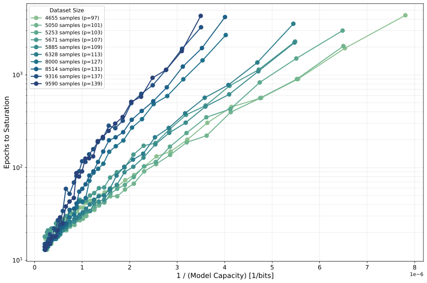

*(a) Saturation time against inverse model capacity $1/(C_{\text{model}}P)$.*

*(b) Saturation time against capacity fraction $f(P,n_{\text{equiv}})$.*

###### fig-3

*Figure 3: Memorisation speed experiments. Fig. 3(a) shows that memorisation time increases with inverse model capacity $1/(C_{\text{model}}P)$ across datasets; i.e. smaller models take longer to memorise. The shape of the curve varies across datasets. Fig. 3(b) shows that when epochs to saturation is plotted against capacity fraction, all the datasets collapse roughly onto a single curve, suggesting that memorisation speed is determined by the capacity fraction, rather than model size or dataset complexity alone.* **[p. 7]**

### 5.2 Memorisation speeds

###### p6-5

We measured the memorisation time $T_{\text{mem}}(P,n)$ for several model sizes and dataset sizes, and for each we computed the corresponding capacity fraction $f(P,n)$. **[p. 7]** Fig. 3(a) shows that memorisation time increases with inverse model capacity $1/C_{\text{model}P}$ across datasets; i.e. smaller models take longer to memorise. Equivalently, larger models memorise faster, corroborating previous results from [28]. Meanwhile, Fig. 3(b) shows that when epochs to saturation is plotted against capacity fraction, points across all the datasets collapse roughly onto a single curve, suggesting that memorisation speed is determined by the capacity fraction, rather than model size or dataset complexity alone.

###### p7-1

In particular, epochs until memorisation increases with capacity fraction, and we find that $T_{\text{mem}}(P)\approx be^{af}$ for some constants $a,b$ and $f\in[0,0.25]$. We treat this exponential as an empirical functional fit rather than a mechanistic claim; nonetheless, it provides a principled account of the previously reported observation that larger models memorise faster [28], by recasting it as a near-linear scaling with capacity fraction: a fixed dataset complexity occupies a smaller fraction of a larger model’s capacity, and our fit then predicts faster saturation.

### 5.3 Generalisation delay

We trained a range of models with different internal dimensions $d$ and primes $p$ and recorded training and validation accuracies and losses at each epoch, allowing us to compute $E_{\text{train}}(P),E_{\text{val}}(P),$ and $\Delta E(P)$. Fig. 4 shows representative training and validation curves for modular division at $p=127$ as we vary model size.

###### p7-3

We also plotted the generalisation delay $\Delta E(P)$ versus parameter count in Fig. 1 for several primes, allowing us to visualise the various regimes of memorisation / generalisation as a function of model size. Using Eq. 5, we compute the critical parameter count $P_{\text{mem}}$ for the modular division datasets. We find that for several primes (including $p=113$ and $p=139$ shown in Fig. 1), the first models capable of achieving near-perfect training *and* test accuracy have parameter counts $P$ slightly below but on the same order as $P_{\text{mem}}$, indicating that gradient descent is able to find algorithmic solutions that are more compact than the raw dataset.

###### p7-4

Surprisingly, $\Delta E(P)$ remains at zero as model size increases for small models, even when the model has enough theoretical capacity to memorise the training set. The exact point at which $\Delta E(P)$ becomes non-zero is dependent on the prime $p$ and the training fraction $\alpha$, and is strongly correlated with the intersection of the memorisation and generalisation speeds, as we will see next in Section 5.4.

### 5.4 The speed intersection tracks grokking onset

For each prime $p$, we load the memorisation-speed experiments for matching model sizes, where we computed the memorisation time $T_{\text{mem}}(P)$ for a random dataset of the same complexity $K_{\text{mem}}(p,\alpha)$. **[p. 8]** We plot the generalisation delay $\Delta E(P)$ and the generalisation time $T_{\text{gen}}(P)$ versus parameter count on a common $x$-axis. Fig. 1 shows the resulting plots for three primes. Several patterns emerge:

###### p8-1

1. For small parameter counts, $T_{\text{gen}}(P)<T_{\text{mem}}(P)$: generalisation is faster than memorisation, and generalisation delays are zero.
2. As $P$ increases, $T_{\text{mem}}(P)$ decreases more steeply than $T_{\text{gen}}(P)$. At a characteristic parameter count $P_{\text{cross}}(p)$ the two curves intersect.
3. Empirically, $P_{\text{cross}}(p)$ coincides closely with the onset of non-zero generalisation delay.

###### p8-2

To assess this quantitatively, we decompose the hypothesis that the intersection of $T_{\text{mem}}$ and $T_{\text{gen}}$ predicts the empirical grokking onset into three falsifiable sub-claims — predictiveness, calibration to $y=x$, and sufficiency against baselines — and report a test for each (Table 1); a fourth, robustness across swept axes, is part of the suite (Appendix B) but inconsequential on the central sweep where dropout is fixed. The rank order of predicted and empirical onsets is essentially perfect (Spearman $\rho=0.976$, permutation $p<10^{-3}$); the log–log slope is $0.985$, indicating no proportional bias; and the predicted onset is a sufficient statistic against the swept hyperparameter (dropout): given $\widehat{P}_{\text{cross}}$, dropout adds no further explanatory power over the intersection alone ($F\approx 0$, $p=1$). The only residual is a small, prime-independent constant offset — empirical onset arrives roughly 30% earlier than predicted (median $\log_{10}(P_{\text{onset}}/\widehat{P}_{\text{cross}})=-0.16$) — so the intersection captures the scaling of the onset with the prime exactly, up to a single multiplicative correction. Full test definitions and per-model regression numbers are deferred to Appendix B.

*Table 1: Quantitative tests of the intersection hypothesis. All tests operate on $\log_{10}$ onset coordinates; $p_{\text{perm}}$ denotes a 10 000-shuffle permutation $p$-value. $M_{0},\dots,M_{3}$ are nested OLS models with target $\log_{10}P_{\text{onset}}$: $M_{0}$ intercept-only, $M_{1}=\{\log_{10}\widehat{P}_{\text{cross}}\}$, $M_{2}=\{\text{dropout}\}$, $M_{3}=M_{1}\cup M_{2}$. See Appendix B for definitions and the residual analysis.* **[p. 8]**

| Sub-claim / Test | Statistic | $p$-value |
|---|---|---|
| *(1) Rank predictiveness* |  |  |
| Spearman $\rho$ | $0.976$ | $p_{\text{perm}}<10^{-3}$ |
| Kendall $\tau$ | $0.911$ | $3.0\times 10^{-5}$ |
| *(2) Calibration to $y=x$* |  |  |
| Lin’s CCC (95% CI) | $0.74\;[0.51,\,0.80]$ | — |
| Slope $\hat{b}$ (log–log OLS) | $0.985$ | — |
| Intercept $\hat{a}$ | $-0.076$ | — |
| Joint $F$-test for $(a=0,b=1)$ | $F=199$ | $1.5\times 10^{-7}$ |
| Wilcoxon on log-residuals | median $-0.16$ | $2.0\times 10^{-3}$ |
| *(3) Sufficiency vs. baselines (nested OLS)* |  |  |
| $M_{1}$ vs. $M_{0}$ (intersection has signal) | $F=569$ | $1.0\times 10^{-8}$ |
| $M_{3}$ vs. $M_{2}$ (intersection adds over hyperparams) | $F=498$ | $9.2\times 10^{-8}$ |
| $M_{3}$ vs. $M_{1}$ (hyperparams add over intersection) | $F\approx 0$ | $1.0$ |

###### p8-3

Taken together, these results provide evidence that grokking appears when model memorisation speed is roughly equal to generalisation speed. The data suggest that there are three learning regimes in grokking modular division as model size increases. We start at the underfitting regime: when $P\ll P_{\text{mem}}(p,\alpha)$, the model does not have enough capacity to memorise either the training set or the algorithmic solution, so it achieves low training accuracy and generalisation. As $P$ approaches $P_{\text{mem}}(p,\alpha)$ but does not exceed it, generalisation follows immediately from strong training accuracy because the model does not have enough capacity to memorise the entire training set, so a low training loss must be achieved through algorithmic generalisation. As $P$ continues to increase past $P_{\text{mem}}(p,\alpha)$, the model does not default to memorising the training set initially (even though it has enough capacity to do so), because $T_{\text{mem}}(P)\gg T_{\text{gen}}(P)$, so gradient descent settles upon the quicker-to-find, algorithmic solution, and we remain in the immediate generalisation regime. Finally, as $P$ continues to increase past the intersection point $P_{\text{cross}}(p)$, the model prefers memorising when $T_{\text{mem}}(P)\lesssim T_{\text{gen}}(P)$, so gradient descent finds the memorisation solution first before generalising, leading to delayed generalisation (i.e. ‘grokking’).

**[p. 9]**

#### Robustness to other hyperparameters, architectures, and tasks.

###### p9-1

The central sweep above fixes every hyperparameter except the prime $p$ and the embedding width $d$. We test the framework’s robustness to other settings in six further suites: a weight-decay sweep (Section C.2), a learning-rate sweep (Section C.3), an initialisation-scale sweep (Section C.1), and a training-fraction sweep (Section C.4); a depth-scaling sweep (Section D.1); and a modular-addition task sweep (Section E.1). Across all six, our framework holds within any one consistent setting of hyperparameter, architecture, and task; analysing how the framework calibrates across settings is a separate question we leave for future work.

## 6 Discussion

Together our results give a mechanistic account of how model capacity controls grokking on modular arithmetic, by setting the relative speeds of two learning processes.

#### Capacity acts on grokking through learning speeds, not the capacity threshold.

###### p9-3

A natural reading of bits-per-parameter capacity [21] is a threshold prediction: grokking begins when $C_{\text{model}}P\gtrsim K_{\text{mem}}$, since only then is the memorising solution representable. Our data show that this is not what happens for modular division. For several primes the smallest models that achieve near-perfect train and test accuracy already have $P\lesssim P_{\text{mem}}$, indicating that gradient descent can find an algorithmic solution more compact than the raw lookup; and over an extended range of $P>P_{\text{mem}}$ the models continue to generalise immediately, with no grokking delay. The transition into the grokking regime instead coincides with the parameter count at which the measured $T_{\text{mem}}(P)$ and $T_{\text{gen}}(P)$ curves cross — a count strictly larger than $P_{\text{mem}}$. What controls whether a model groks is not whether the lookup is representable, but whether it is reached before the algorithmic solution.

#### Connection to existing accounts.

###### p9-4

Our work refines existing accounts that frame grokking as a competition between memorising and generalising solutions [29, 19, 9, 11]: previous works identify which solution is preferred at convergence, while we give a more formal treatment on which solution gradient descent encounters first as a function of model capacity. The qualitative ‘small models do not grok’ regime documented in [13] and [9] is recovered as the regime $T_{\text{gen}}(P)<T_{\text{mem}}(P)$. Our framing also formalises the speed intuition of [5], replacing a generic ‘different patterns are learned at different rates’ picture with two concrete, separately measurable timescales whose intersection tracks the empirical phase boundary.

#### Recovering the larger-models-memorise-faster observation.

###### p9-5

On random-label data, memorisation time depends primarily on the capacity fraction $f=K/(C_{\text{model}}P)$ rather than on $P$ or $K$ separately (Fig. 3(b)), with empirical fit $T_{\text{mem}}\propto e^{af}$ for $f\in[0,0.25]$. For fixed $K$, larger $P$ then memorises faster, recovering the qualitative observation of [28] as a near-linear scaling in capacity fraction. The exponential is an empirical functional form, however, rather than a derived theorem.

#### Scope, limitations, and outlook.

###### p9-6

The framework is mechanistic rather than architecture-agnostic-predictive: $T_{\text{gen}}(P)$ is measured rather than derived, so a new architecture or task requires re-running the speed measurements. We additionally test robustness to weight decay, learning rate, initialisation scale, and the training fraction $\alpha$ (Appendix C), to depth (Appendix D), and to modular addition in place of division (Appendix E). Within each fixed setting the framework’s within-setting predictiveness is preserved, while the calibration constant shifts smoothly across settings: it recalibrates with weight decay, with depth, and with the training fraction $\alpha$, more weakly with initialisation scale, and remains essentially flat across learning rate within the optimisation regime where speed itself is well-defined. Sensitivity to dropout and to the number of attention heads, as well as to architectural variants beyond the gated decoder-only Transformer (e.g. ungated FFNs, LayerNorm in place of RMSNorm, learned positional embeddings, MLP baselines), remains future work, as is whether similar speed-capacity trade-offs apply to larger models and naturalistic tasks. The broader takeaway is that for grokking on modular arithmetic, what determines onset is not the static capacity threshold alone but the relative speeds of memorisation and generalisation as functions of model capacity, an abstraction we hope will prove useful for the study of delayed generalisation beyond this setting.

## References

- [1] Z. **[p. 10]** Allen-Zhu and Y. Li Physics of language models: part 3.3, knowledge capacity scaling laws. arXiv preprint arXiv:2404.05405. Cited by: §5.1.

- [2] D. Arpit, S. Jastrzębski, N. Ballas, D. Krueger, E. Bengio, M. S. Kanwal, T. Maharaj, A. Fischer, A. Courville, Y. Bengio, and S. Lacoste-Julien A closer look at memorization in deep networks. In Proceedings of the 34th International Conference on Machine Learning, D. Precup and Y. W. Teh (Eds.), Proceedings of Machine Learning Research, Vol. 70, pp. 233–242. External Links: Link Cited by: §2.

- [3] N. Carlini, D. Ippolito, M. Jagielski, K. Lee, F. Tramer, and C. Zhang Quantifying memorization across neural language models. In The Eleventh International Conference on Learning Representations, Cited by: §2.

- [4] K. Clauw, S. Stramaglia, and D. Marinazzo Information-theoretic progress measures reveal grokking is an emergent phase transition. arXiv preprint arXiv:2408.08944. External Links: Document, Link, 2408.08944 Cited by: §2.

- [5] X. Davies, L. Langosco, and D. Krueger Unifying grokking and double descent. arXiv preprint arXiv:2303.06173. Cited by: §2, §6.

- [6] B. DeMoss, S. Sapora, J. Foerster, N. Hawes, and I. Posner The complexity dynamics of grokking. arXiv preprint arXiv:2412.09810. External Links: Link Cited by: §2.

- [7] H. Furuta, G. Minegishi, Y. Iwasawa, and Y. Matsuo Interpreting grokked transformers in complex modular arithmetic. arXiv preprint arXiv:2402.16726. External Links: Document, Link, 2402.16726 Cited by: §2.

- [8] T. He, D. Doshi, A. Das, and A. Gromov Learning to grok: emergence of in-context learning and skill composition in modular arithmetic tasks. arXiv preprint arXiv:2406.02550. External Links: Document, Link, 2406.02550 Cited by: §2.

- [9] Y. Huang, S. Hu, X. Han, Z. Liu, and M. Sun Unified view of grokking, double descent and emergent abilities: a perspective from circuits competition. arXiv preprint arXiv:2402.15175. External Links: Document, Link, 2402.15175 Cited by: item 2, §1, §1, §2, §6.

- [10] A. I. Humayun, R. Balestriero, and R. Baraniuk Deep networks always grok and here is why. In Proceedings of the 41st International Conference on Machine Learning, Proceedings of Machine Learning Research, Vol. 235, pp. 20722–20745. External Links: Link Cited by: §2.

- [11] T. Kumar, B. Bordelon, S. J. Gershman, and C. Pehlevan Grokking as the transition from lazy to rich training dynamics. In The Twelfth International Conference on Learning Representations, Note: arXiv:2310.06110 External Links: Link Cited by: §1, §2, §6.

- [12] J. Lee, B. G. Kang, K. Kim, and K. M. Lee Grokfast: accelerated grokking by amplifying slow gradients. arXiv preprint arXiv:2405.20233. External Links: Document, Link, 2405.20233 Cited by: §2.

- [13] Z. Liu, O. Kitouni, N. S. Nolte, E. Michaud, M. Tegmark, and M. Williams Towards understanding grokking: an effective theory of representation learning. Advances in Neural Information Processing Systems 35, pp. 34651–34663. Cited by: item 2, §1, §2, §6.

- [14] Z. Liu, E. J. Michaud, and M. Tegmark Omnigrok: grokking beyond algorithmic data. arXiv preprint arXiv:2210.01117. Cited by: §2.

- [15] I. Loshchilov and F. Hutter Decoupled weight decay regularization. arXiv preprint arXiv:1711.05101. Cited by: §4.2.

- [16] X. Lu, X. Li, Q. Cheng, K. Ding, X. **[p. 11]** Huang, and X. Qiu Scaling laws for fact memorization of large language models. In Findings of the Association for Computational Linguistics: EMNLP 2024, pp. 11263–11282. Cited by: §5.1.

- [17] K. Lyu, J. Jin, Z. Li, S. S. Du, J. D. Lee, and W. Hu Dichotomy of early and late phase implicit biases can provably induce grokking. In The Twelfth International Conference on Learning Representations, Note: arXiv:2311.18817 External Links: Link Cited by: §1, §2.

- [18] S. B. Manir and A. P. Rupa A systematic empirical study of grokking: depth, architecture, activation, and regularization. arXiv preprint arXiv:2603.25009. External Links: Link Cited by: §2.

- [19] W. Merrill, N. Tsilivis, and A. Shukla A tale of two circuits: grokking as competition of sparse and dense subnetworks. arXiv preprint arXiv:2303.11873. Note: ICLR Workshop on Mathematical and Empirical Understanding of Foundation Models Cited by: §1, §2, §6.

- [20] M. A. Mohamadi, Z. Li, L. Wu, and D. J. Sutherland Why do you grok? A theoretical analysis on grokking modular addition. In Proceedings of the 41st International Conference on Machine Learning, Proceedings of Machine Learning Research, Vol. 235, pp. 35934–35967. Cited by: §1, §2.

- [21] J. X. Morris, C. Sitawarin, C. Guo, N. Kokhlikyan, G. E. Suh, A. M. Rush, K. Chaudhuri, and S. Mahloujifar How much do language models memorize?. arXiv preprint arXiv:2505.24832. Cited by: item 1, §1, §1, §2, §3.4, Figure 2, Figure 2, §4.1, §5.1, §6, Abstract.

- [22] P. Nakkiran, G. Kaplun, Y. Bansal, T. Yang, B. Barak, and I. Sutskever Deep double descent: where bigger models and more data hurt. In International Conference on Learning Representations, Note: arXiv:1912.02292 External Links: Link Cited by: §2.

- [23] N. Nanda, L. Chan, T. Lieberum, J. Smith, and J. Steinhardt Progress measures for grokking via mechanistic interpretability. arXiv preprint arXiv:2301.05217. Cited by: §1, §2.

- [24] A. Power, Y. Burda, H. Edwards, I. Babuschkin, V. Misra, A. Mishkin, J. Kramer, J. Skalse, M. Andrychowicz, I. Sutskever, et al. Grokking: generalization beyond overfitting on small algorithmic datasets. arXiv preprint arXiv:2201.02177. Cited by: §1, §2.

- [25] A. Roberts, C. Raffel, and N. Shazeer How much knowledge can you pack into the parameters of a language model?. arXiv preprint arXiv:2002.08910. Cited by: §5.1.

- [26] N. Rubin, I. Seroussi, and Z. Ringel Grokking as a first order phase transition in two layer networks. arXiv preprint arXiv:2310.03789. Note: Also appeared at ICLR 2024. External Links: Document, Link, 2310.03789 Cited by: §2.

- [27] V. Thilak, E. Littwin, S. Zhai, O. Saremi, and R. Paiss The slingshot mechanism. arXiv preprint arXiv:2206.04817. External Links: Document, Link, 2206.04817 Cited by: §2.

- [28] K. Tirumala, A. Markosyan, L. Zettlemoyer, and A. Aghajanyan Memorization without overfitting: analyzing the training dynamics of large language models. Advances in Neural Information Processing Systems 35, pp. 38274–38290. Cited by: item 2, §2, §5.2, §5.2, §6.

- [29] V. Varma, R. Shah, Z. Kenton, J. Kramár, and R. Kumar Explaining grokking through circuit efficiency. arXiv preprint arXiv:2309.02390. Cited by: §1, §2, §6.

- [30] B. Wang, X. Yue, Y. Su, and H. Sun Grokked transformers are implicit reasoners: a mechanistic journey to the edge of generalization. arXiv preprint arXiv:2405.15071. Cited by: §2.

- [31] C. Zhang, S. Bengio, M. Hardt, B. Recht, and O. Vinyals Understanding deep learning requires rethinking generalization. In International Conference on Learning Representations (ICLR), External Links: Link Cited by: §2.

**[p. 12]**

## Appendix A Experiment details

### A.1 Modular division dataset

###### p12-1

We use all 10 primes in the range from 90 to 140 for our experiments: i.e. 97, 101, 103, 107, 109, 113, 127, 131, 137, 139.

### A.2 Architecture and optimisation

###### p12-2

All experiments in the central sweep train decoder-only Transformers in PyTorch using AdamW with learning rate $10^{-3}$, betas $(0.9,0.98)$, weight decay $1.0$, and batch size $512$, for a maximum of $5{,}000$ epochs. We fix depth $L_{\text{depth}}=2$ and a single attention head $H=1$, varying model size by changing the embedding width $d$. Dropout is $0.2$ in grokking and speed runs and $0$ in capacity runs.

### A.3 Compute resources

All experiments were run on NVIDIA A100 and H100 GPUs, with each training run occupying a single GPU. Runs were dispatched in parallel across available GPUs via a YAML-configured job scheduler (gc-dispatch); per-run wall-clock time is recorded in the run registry. The full set of capacity, speed, and grokking experiments reported here required on the order of $10^{3}$ GPU-hours in aggregate; preliminary and discarded sweeps used a comparable additional amount.

### A.4 Estimating capacity on random data

###### p12-4

For each model dimension $d\in\{10,12,14,16,18,20,22\}$ and dataset size $n\in\{1000,\,1374,\,1891,\,2601,\,3576,\,4917,\,6761,\,9300\}$ we generate a random dataset $(X_{\text{train}},T_{\text{train}})$ of size $n$, sampling each token and target uniformly from the vocabulary of size $V=p+2$ at $p=113$. We instantiate a Transformer of width $d$ and train it as in Section A.2, except with dropout $0$, stopping when the training loss fails to improve by more than $\Delta=10^{-4}$ for a patience window of $100$ epochs. We compute the total memorisation $M_{T}$ via Eq. 2 and the bits memorised per example $m_{T}=M_{T}/n$. Within-arch capacity curves are stable across seeds in our setting, so we use a single seed (42) per cell. Fig. 2 (left) shows the resulting $M_{T}(n)$ for several model sizes.

### A.5 Measuring memorisation speeds on random data

###### p12-5

For each prime $p$ in the 10-prime sweep (Appendix A) and each model dimension $d\in\{20,24,28,\ldots,256\}$ (44 widths in $\{20,24,\ldots,128\}\cup\{136,144,\ldots,256\}$), we generate a random-label dataset of size $n_{\text{equiv}}(p,\alpha)=K_{\text{mem}}(p,\alpha)/\log_{2}V$. We instantiate a Transformer of width $d$ and train it as in Section A.2 (dropout $0.2$, weight decay $1.0$), recording training accuracy at each epoch. We declare saturation once training accuracy first exceeds $99\%$, and report $T_{\text{mem}}(P)$ as the average of the saturation epoch over 10 seeds (seeds 42–51).

### A.6 Grokking experiments on modular division

###### p12-6

For each prime $p$ in the 10-prime sweep and each model dimension $d\in\{20,22,24,\ldots,128\}\cup\{130,140,150,\ldots,1000\}$ (truncated to $d\leq 256$ when fed into the per-prime intersection figures via max_dim), we construct a modular-division dataset $(X_{\text{train}},T_{\text{train}},X_{\text{test}},T_{\text{test}})$ with training fraction $\alpha=0.5$ and a random train–test split. We instantiate a Transformer of width $d$ and train it as in Section A.2 (dropout $0.2$, weight decay $1.0$), recording training and validation accuracies and losses at each epoch. We use 10 seeds per cell (seeds 42–51); $T_{\text{gen}}(P)$ is reported as the mean and $\Delta E(P)$ as the per-seed minimum, as defined in Section 4.3.

Fig. 4 shows representative training and validation curves for modular division at $p=127$ as we vary model size.

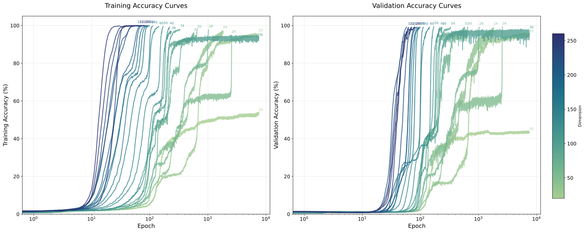

###### fig-4

*Figure 4: Training (left) and validation (right) accuracy curves for modular division with $p=127$ across model sizes. Small models underfit, intermediate models generalise immediately, and larger models exhibit grokking.* **[p. 13]**

### A.7 Hyperparameter, architectural, and task sweeps beyond the central setting

Beyond the central sweep, we run analogous capacity $\to$ speed $\to$ groks pipelines under varied hyperparameters, varied architectural axes, and varied modular-arithmetic tasks. **[p. 13]** Each sweep reuses the architecture, optimiser, dataset construction, and aggregation conventions of Sections A.2, A.4, A.5 and A.6; only the swept axis is changed and any data-dependent quantities (e.g. $K_{\text{mem}}$, $n_{\text{equiv}}$) are recomputed. For the depth sweep, dim is selected per cell to hit fixed parameter-count targets rather than chosen directly. For the training-fraction sweep, $n_{\text{equiv}}$ is recomputed per $\alpha$ on the speed side while the architecture (and hence the bits-per-parameter constant inherited from the matched arch group) is held fixed. Per-axis settings, headline figures, and statistical tests are reported in Appendix C (hyperparameter invariance), Appendix D (architectural invariance), and Appendix E (task invariance).

## Appendix B Quantitative tests of the intersection hypothesis

###### p13-1

We turn the qualitative claim “the intersection of $T_{\text{mem}}$ and $T_{\text{gen}}$ predicts the empirical grokking onset” into three falsifiable sub-claims and report a test for each. All tests operate on $\{(\widehat{P}_{\text{cross}}(p),\,P_{\text{onset}}(p))\}_{p}$ in $\log_{10}$ coordinates, where $\widehat{P}_{\text{cross}}(p)$ is the parameter count at which the seed-averaged $T_{\text{mem}}$ and $T_{\text{gen}}$ curves cross, and $P_{\text{onset}}(p)$ is the smallest model size $P$ for which $\Delta E(P^{\prime})>0$ across seeds for every $P^{\prime}>P$.

#### Predictiveness.

We test for any monotone relationship between predicted and empirical onsets via Spearman’s $\rho$ (with both an analytic $p$-value and a $10^{4}$-shuffle permutation $p$-value, the latter to guard against optimistic analytic tails at small $N$) and Kendall’s $\tau$ (different small-$N$ tail behaviour to Spearman). Both pass with $\rho=0.976$ and $\tau=0.911$.

#### Calibration.

Rank correlation alone does not commit to $\hat{e}\approx\hat{p}$: a strongly correlated predictor with the wrong slope or a constant offset can pass predictiveness but fail calibration. We test calibration with three statistics:

- Lin’s concordance correlation coefficient $\text{CCC}=2\rho\sigma_{p}\sigma_{e}/(\sigma_{p}^{2}+\sigma_{e}^{2}+(\mu_{p}-\mu_{e})^{2})$, the natural one-number summary of “predicted equals empirical” since it penalises both decorrelation and offset from $y=x$. We report a 95% bootstrap CI from $10^{4}$ cell-level resamples.
- OLS fit $\log_{10}P_{\text{onset}}=a+b\log_{10}\widehat{P}_{\text{cross}}$ with a joint $F$-test for $(a=0,b=1)$. Reporting $(\hat{a},\hat{b})$ separately makes the *direction* of any miss legible: a slope $<1$ means the predictor over-extrapolates large onsets, an intercept $>0$ means it systematically under-predicts.
- Wilcoxon signed-rank on the log-residuals $\log_{10}(P_{\text{onset}}/\widehat{P}_{\text{cross}})$ against zero, which tests for symmetric bias and is robust to outliers in a way the joint $F$-test is not.

###### p13-5

On the central sweep, the slope is $\hat{b}=0.985$ (no proportional bias) and the intercept $\hat{a}=-0.076$, but the data are tight enough that the joint $F$-test still rejects $(0,1)$ ($F=199$, $p=1.5\times 10^{-7}$). The Wilcoxon test confirms a small symmetric bias (median log-residual $-0.16$, $p=2\times 10^{-3}$). The OLS intercept and the Wilcoxon median are not in tension: the residual model $\log_{10}P_{\text{onset}}\approx-0.076+0.985\log_{10}\widehat{P}_{\text{cross}}$, evaluated at typical onset values $\log_{10}\widehat{P}_{\text{cross}}\approx 5$, gives a per-cell offset **[p. 14]** $\log_{10}(P_{\text{onset}}/\widehat{P}_{\text{cross}})\approx-0.076-0.015\cdot 5\approx-0.15$, in line with the median log-residual. We interpret this as a single $\sim 0.16$ dex constant offset rather than a structural miscalibration: the predictor scales correctly with $p$ but over-estimates absolute onset by $\sim 30\%$.

#### Sufficiency vs. baselines.

The strongest version of the claim is that the intersection is a sufficient statistic for the empirical onset, in the sense that no simpler predictor does as well. We operationalise this with nested OLS comparisons against $\log_{10}P_{\text{onset}}$:

- $M_{0}$ **(null):** intercept only.
- $M_{1}$ **(intersection):** $\log_{10}\widehat{P}_{\text{cross}}$.
- $M_{2}$ **(hyperparams):** every column in the config’s swept axes (here, dropout).
- $M_{3}$ **(combined):** $M_{1}\cup M_{2}$ predictors.

###### p14-3

$M_{1}$ vs. $M_{0}$ confirms that the intersection has any signal at all. $M_{3}$ vs. $M_{2}$ confirms that the intersection adds information *over and above* the swept hyperparameters — this is the test for the sceptic who claims the correlation is spurious because both onset and intersection depend on $p$. $M_{3}$ vs. $M_{1}$ is the sufficiency test proper: do the hyperparameters add anything beyond the intersection? On the central sweep, RSS values give in-sample / adjusted $R^{2}$: $M_{0}=0$, $M_{1}=0.986/0.984$, $M_{2}=0/{-0.125}$, $M_{3}=0.986/0.982$. The corresponding $F$-tests (Table 1) reject $M_{0}$ in favour of $M_{1}$ ($F=569$, $p=10^{-8}$) and $M_{2}$ in favour of $M_{3}$ ($F=498$, $p=9\times 10^{-8}$), but the upgrade from $M_{1}$ to $M_{3}$ is statistically and numerically null ($F\approx 0$, $p=1$): given $\widehat{P}_{\text{cross}}$, dropout adds no further explanatory power.

#### Robustness.

###### p14-4

For configurations with multiple swept axes we additionally regress the per-cell log-residual against each axis and Holm-correct the resulting $p$-values across axes. The intent is to flag systematic mispredictions along any axis (e.g. residuals trending with weight decay or depth). The robustness sub-claim is inconsequential in the central sweep, where dropout is fixed within each grokking cell.

#### What this is not.

###### p14-5

The setup above is not a power analysis: with $\sim 10$ cells per figure, only large effects are detectable, and the point is to prevent overclaiming from underpowered data, not to certify the predictor as perfect. It is also not cross-validated: with this $N$, $k$-fold leaves $5$–$6$ training points per fold and variance dominates bias, so the nested-model $F$-tests use in-sample fits and report adjusted $R^{2}$ as the honest version of the comparison. Finally, it is not a hierarchical model: each cell is one observation, and per-seed variability is folded into the seed-min onset estimate via the aggregation procedure of Section 5.3 rather than modelled explicitly.

## Appendix C Hyperparameter invariance

#### Scope and reading guide.

The central sweep (Section 5.4) fixes every hyperparameter except the prime $p$ and the embedding width $d$. To assess robustness, we re-run the full capacity $\to$ speed $\to$ groks pipeline at each setting of a swept hyperparameter and apply the statistical framework of Appendix B. The framework’s central claim — that within a fixed hyperparameter and task setting, the parameter count at which $T_{\text{mem}}(P)$ and $T_{\text{gen}}(P)$ cross predicts the onset of grokking — does not require a single calibration constant to apply across settings. A different optimisation regime (e.g. a different initialisation scale) can shift the multiplicative offset between $\widehat{P}_{\text{cross}}$ and $P_{\text{onset}}$ while leaving within-setting predictiveness intact. We therefore evaluate each sweep on two separate questions:

1. **Within-setting predictiveness.** Holding the swept hyperparameter fixed, do predicted and empirical onsets track across primes, and is the per-cell log-residual stable?
2. **Cross-setting calibration.** Pooling all cells, does the swept hyperparameter act as a smooth multiplicative offset, or does it interact with the predictor’s slope?

Each subsection below follows a fixed template: a *Scope* paragraph; headline figures (predicted-vs-empirical scatter and residual-vs-axis plot); a *Pooled tests* table reusing the schema of Table 1; a ***[p. 15]** Within-setting* table summarising per-cell log-residuals; and a *Verdict* paragraph that addresses both questions above. New hyperparameter sweeps slot in as additional subsections without altering the surrounding structure.

### C.1 Initialisation scale

#### Scope.

###### p15-1

init_scale$\in\{0.5,1.0,2.0\}$, applied as a post-initialisation multiplicative scaling of all weights; all other hyperparameters as in Section A.2. Five primes per cell ($p\in\{97,107,113,127,139\}$); 10 seeds per cell; intersection finder and onset definitions identical to Section 5.4. init_scale$=1.0$ matches the central sweep and serves as an in-sweep baseline.

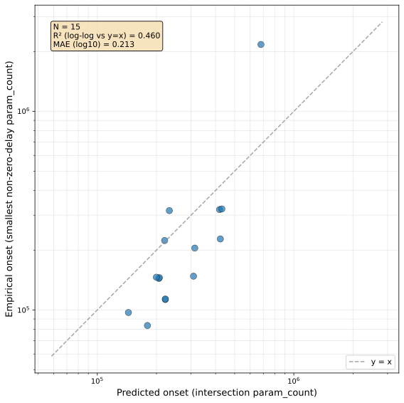

*(a) Predicted vs. empirical onset, points coloured by init_scale.*

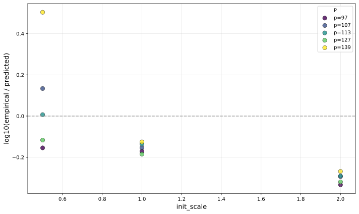

*(b) Per-cell log-residual against init_scale.*

*Figure 5: Initialisation-scale sweep: predicted-vs-empirical scatter and residual trend with the swept axis.* **[p. 15]**

*Table 2: Initialisation-scale sweep: pooled hypothesis tests on the 15 cells (5 primes $\times$ 3 init_scale values, $\circ=/$). Schema as in Table 1; the robustness row regresses the per-cell log-residual against $\log_{2}$init_scale.* **[p. 15]**

| Sub-claim / Test | Statistic | $p$-value |
|---|---|---|
| *(1) Rank predictiveness* |  |  |
| Spearman $\rho$ | $0.839$ | $p_{\text{perm}}=10^{-4}$ |
| Kendall $\tau$ | $0.676$ | $2.0\times 10^{-4}$ |
| *(2) Calibration to $y=x$* |  |  |
| Lin’s CCC (95% CI) | $0.622\;[0.28,\,0.71]$ | — |
| Slope $\hat{b}$ (log–log OLS) | $1.583$ | — |
| Intercept $\hat{a}$ | $-3.290$ | — |
| Joint $F$-test for $(a=0,b=1)$ | $F=5.29$ | $0.021$ |
| Wilcoxon on log-residuals | median $-0.154$ | $0.022$ |
| *(3) Sufficiency vs. baselines (nested OLS)* |  |  |
| $M_{1}$ vs. $M_{0}$ (intersection has signal) | $F=30.7$ | $9.5\times 10^{-5}$ |
| $M_{3}$ vs. $M_{2}$ (intersection adds over hyperparams) | $F=52.0$ | $1.1\times 10^{-5}$ |
| $M_{3}$ vs. $M_{1}$ (hyperparams add over intersection) | $F=14.3$ | $2.6\times 10^{-3}$ |
| *(4) Robustness across the swept axis* |  |  |
| init_scale (numeric) | slope $=-0.236$/unit | $0.0031$ |

*Table 3: Initialisation-scale sweep: within-setting log-residual summary across the 5 primes. Tight per-cell standard deviations indicate that the predictor scales correctly with $p$ at each fixed setting.* **[p. 16]**

| init_scale | $n_{\text{primes}}$ | median $\log_{10}(P_{\text{onset}}/\widehat{P}_{\text{cross}})$ | std | within-setting verdict |
|---|---|---|---|---|
| $0.5$ | 5 | $+0.007$ | $0.260$ | weak (driven by $p=139$) |
| $1.0$ | 5 | $-0.154$ | $0.024$ | strong |
| $2.0$ | 5 | $-0.294$ | $0.026$ | strong |

**[p. 16]**

#### Verdict.

###### p16-1

Within init_scale$\in\{1.0,2.0\}$, log-residuals are tight across primes ($\sigma_{\log}\leq 0.03$, Table 3): the predictor scales correctly with $p$ and incurs only a constant multiplicative offset within each setting. The init_scale$=1.0$ row reproduces the central-sweep result at the same five primes, with per-prime log-residuals $\{-0.17,-0.15,-0.14,-0.18,-0.13\}$. Within init_scale$=0.5$ the residual variance is markedly larger, driven primarily by $p=139$ where the empirical onset arrives at $\sim\!2.2\times 10^{6}$ parameters versus a predicted $\sim\!6.8\times 10^{5}$ — consistent with the small-init regime entering an under-trained corner where speed measurements are noisier. Across the pooled sweep, predictiveness is preserved ($\rho=0.839$), and the calibration constant trends monotonically with init_scale ($-0.24$ dex per unit, $p=0.003$). We read this as a smooth setting-specific recalibration of the predictor rather than a structural failure: the predictor still ranks correctly, and within init_scale$\in\{1.0,2.0\}$ the per-cell offset is stable.

### C.2 Weight decay

#### Scope.

###### p16-2

weight_decay$\in\{0,\,0.01,\,0.03,\,0.1,\,0.3,\,1.0,\,3.0\}$, matched between the speed and grokking runs. Six primes per cell ($p\in\{97,107,113,127,139,149\}$, with the central-sweep $\{101,103,109,131,137\}$ also present at $\lambda{=}1.0$ for continuity); 5 seeds per cell except the $\lambda{=}1.0$ baseline cells, which inherit the central sweep’s seed pool; intersection finder and onset definitions identical to Section 5.4. weight_decay$=1.0$ matches the central sweep and serves as an in-sweep baseline; $\lambda{=}3.0$ pushes most cells beyond the explored width range and so contributes only partial cells (2/6 onsets recorded at $\lambda{=}3.0$). Capacity is re-measured at $\lambda\in\{0.01,0.1,1.0\}$ and pinned at $C_{\text{model}}=2.16$ when no matching capacity cell exists.

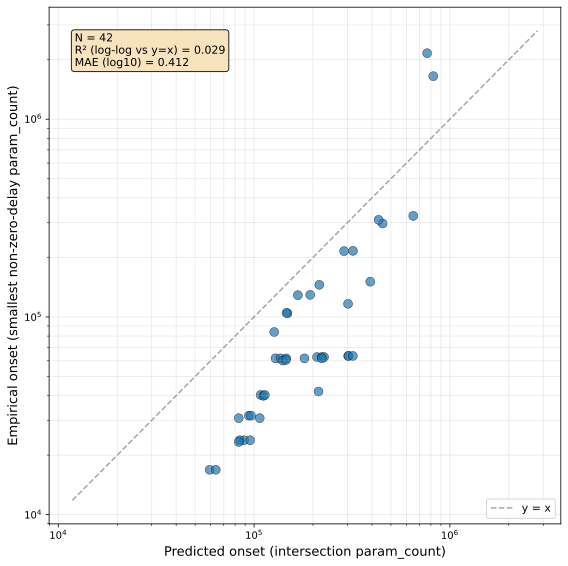

*(a) Predicted vs. empirical onset, points coloured by weight_decay.*

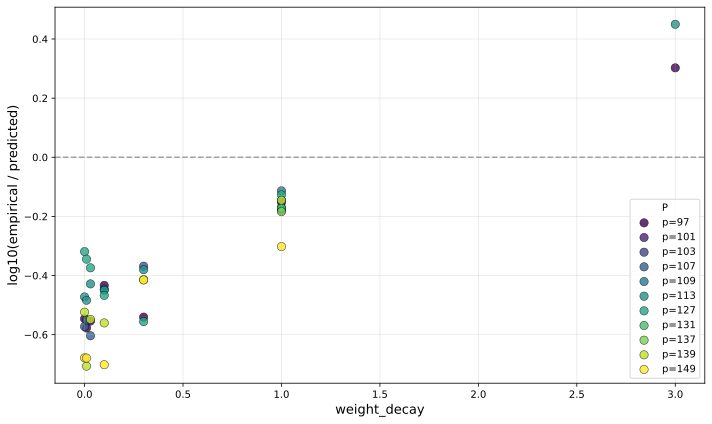

*(b) Per-cell log-residual against weight_decay.*

*Figure 6: Weight-decay sweep: predicted-vs-empirical scatter and residual trend with the swept axis.* **[p. 16]**

*Table 4: Weight-decay sweep: pooled hypothesis tests on the 42 valid cells (out of 47; the missing 5 cells are at $\lambda\in\{0.03,3.0\}$ where empirical onset lies above the swept width range). Schema as in Table 1; the robustness row regresses the per-cell log-residual against $\lambda$.* **[p. 17]**

| Sub-claim / Test | Statistic | $p$-value |
|---|---|---|
| *(1) Rank predictiveness* |  |  |
| Spearman $\rho$ | $0.900$ | $p_{\text{perm}}=10^{-4}$ |
| Kendall $\tau$ | $0.774$ | $9.8\times 10^{-13}$ |
| *(2) Calibration to $y=x$* |  |  |
| Lin’s CCC (95% CI) | $0.531\;[0.35,\,0.65]$ | — |
| Slope $\hat{b}$ (log–log OLS) | $1.439$ | — |
| Intercept $\hat{a}$ | $-2.683$ | — |
| Joint $F$-test for $(a=0,b=1)$ | $F=72.4$ | $5.1\times 10^{-14}$ |
| Wilcoxon on log-residuals | median $-0.431$ | $2.0\times 10^{-9}$ |
| *(3) Sufficiency vs. baselines (nested OLS)* |  |  |
| $M_{1}$ vs. $M_{0}$ (intersection has signal) | $F=150$ | $4.0\times 10^{-15}$ |
| $M_{3}$ vs. $M_{2}$ (intersection adds over hyperparams) | $F=167$ | $1.8\times 10^{-15}$ |
| $M_{3}$ vs. $M_{1}$ (hyperparams add over intersection) | $F=92.0$ | $2.7\times 10^{-15}$ |
| *(4) Robustness across the swept axis* |  |  |
| weight_decay (numeric) | slope $=+0.321$/unit $\lambda$ | $1.9\times 10^{-18}$ |

*Table 5: Weight-decay sweep: within-setting log-residual summary across primes. Rows with fewer than 5 primes have onsets above the explored width range at the missing cells.* **[p. 17]**

| weight_decay | $n_{\text{primes}}$ | median $\log_{10}(P_{\text{onset}}/\widehat{P}_{\text{cross}})$ | std | within-setting verdict |
|---|---|---|---|---|
| $0.0$ | 6 | $-0.535$ | $0.119$ | weak (residuals widen at small $\lambda$) |
| $0.01$ | 6 | $-0.564$ | $0.131$ | weak |
| $0.03$ | 5 | $-0.548$ | $0.096$ | moderate |
| $0.1$ | 6 | $-0.458$ | $0.105$ | moderate |
| $0.3$ | 6 | $-0.415$ | $0.082$ | moderate |
| $1.0$ | 11 | $-0.171$ | $0.049$ | strong |
| $3.0$ | 2 | $+0.376$ | $0.105$ | under-resolved (4/6 cells above the width range) |

#### Verdict.

###### p16-3

Within-setting predictiveness is best at $\lambda{=}1.0$ (the central-sweep regime) and degrades smoothly as $\lambda$ moves away from this baseline: the per-cell offset becomes more negative at small $\lambda$ (the predictor over-shoots empirical onset, increasingly so as decay weakens) and turns positive at $\lambda{=}3.0$. The across-axis robustness regression captures this monotonically: each unit increas**[p. 17]** e in $\lambda$ shifts the log-residual by $+0.32$ dex ($p{=}10^{-18}$). Pooled rank predictiveness remains high ($\rho=0.900$), and the intersection adds substantial information over $\lambda$ alone ($M_{3}$ vs. $M_{2}$, $F{=}167$), but the sceptic-friendly $M_{3}$ vs. $M_{1}$ comparison rejects: $\lambda$ *does* add information beyond the intersection here. We read this as the predictor recalibrating with $\lambda$ rather than transferring as a single offset, consistent with weight decay reshaping the speed curves rather than just translating them. The qualitative claim that the intersection tracks grokking onset is preserved at every $\lambda$ where both curves are well-resolved, but a $\lambda$-aware calibration is required for cross-setting comparisons.

### C.3 Learning rate

#### Scope.

###### p17-1

lr$\in\{10^{-4},\,3{\times}10^{-4},\,10^{-3},\,3{\times}10^{-3},\,10^{-2}\}$, matched between the speed and grokking runs. Five primes per cell ($p\in\{97,107,113,127,139\}$); 4 seeds per cell; all other hyperparameters as in Section A.2. lr$=10^{-3}$ matches the central sweep and serves as an in-sweep baseline. The two largest learning rates do not produce grokking within the explored width range ($d\leq 256$): at lr$=3{\times}10^{-3}$ the predictor still emits a finite $\widehat{P}_{\text{cross}}$ but no empirical onset is recorded within $5{,}000$ epochs, and at lr$=10^{-2}$ training does not reach saturation on either random or modular data. Pooled tests therefore operate on the 15 cells from the lower three learning rates.

*(a) Predicted vs. empirical onset, points coloured by lr.*

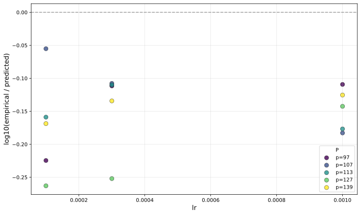

*(b) Per-cell log-residual against lr.*

*Figure 7: Learning-rate sweep: predicted-vs-empirical scatter and residual trend with the swept axis.* **[p. 18]**

*Table 6: Learning-rate sweep: pooled hypothesis tests on the 15 cells (5 primes $\times$ 3 valid lr values). Schema as in Table 1; the robustness row regresses the per-cell log-residual against $\eta$.* **[p. 18]**

| Sub-claim / Test | Statistic | $p$-value |
|---|---|---|
| *(1) Rank predictiveness* |  |  |
| Spearman $\rho$ | $0.972$ | $p_{\text{perm}}=10^{-4}$ |
| Kendall $\tau$ | $0.900$ | $3.2\times 10^{-6}$ |
| *(2) Calibration to $y=x$* |  |  |
| Lin’s CCC (95% CI) | $0.699\;[0.45,\,0.81]$ | — |
| Slope $\hat{b}$ (log–log OLS) | $0.942$ | — |
| Intercept $\hat{a}$ | $0.150$ | — |
| Joint $F$-test for $(a=0,b=1)$ | $F=51.8$ | $6.4\times 10^{-7}$ |
| Wilcoxon on log-residuals | median $-0.142$ | $6.1\times 10^{-5}$ |
| *(3) Sufficiency vs. baselines (nested OLS)* |  |  |
| $M_{1}$ vs. $M_{0}$ (intersection has signal) | $F=127$ | $4.4\times 10^{-8}$ |
| $M_{3}$ vs. $M_{2}$ (intersection adds over hyperparams) | $F=86.3$ | $7.9\times 10^{-7}$ |
| $M_{3}$ vs. $M_{1}$ (hyperparams add over intersection) | $F=0.98$ | $0.342$ |
| *(4) Robustness across the swept axis* |  |  |
| lr (numeric) | slope $=+20.4$/unit $\eta$ | $0.62$ |

*Table 7: Learning-rate sweep: within-setting log-residual summary across the 5 primes.* **[p. 19]**

| lr | $n_{\text{primes}}$ | median $\log_{10}(P_{\text{onset}}/\widehat{P}_{\text{cross}})$ | std | within-setting verdict |
|---|---|---|---|---|
| $10^{-4}$ | 5 | $-0.169$ | $0.079$ | moderate |
| $3{\times}10^{-4}$ | 5 | $-0.112$ | $0.062$ | strong |
| $10^{-3}$ | 5 | $-0.142$ | $0.032$ | strong |
| $3{\times}10^{-3}$ | 0/5 | — | — | no grokking observed in width range |
| $10^{-2}$ | 0/5 | — | — | training fails to saturate |

#### Verdict.

###### p17-2

Across the three learning rates that produce grokking, within-setting predictiveness is preserved: per-cell log-residuals are tight ($\sigma_{\log}\leq 0.08$), the predictor ranks the five primes correctly at every fixed $\eta$, and the calibration constant is essentially flat as a function of $\eta$ (across-axis slope statistically null, $p{=}0.62$). Pooled rank predictiveness is excellent ($\rho{=}0.972$), and the sufficiency comparison passes: given $\widehat{P}_{\text{cross}}$, $\eta$ adds no further explanatory power ($M_{3}$ vs. $M_{1}$, $F{=}0.98$, $p{=}0.34$). **[p. 18]** Outside this regime, we observe two qualitatively distinct failure modes: at $\eta{=}3{\times}10^{-3}$ the predictor extrapolates a $\widehat{P}_{\text{cross}}$ in the $10^{6}$-parameter range but no model in the swept width range groks within the epoch budget, and at $\eta{=}10^{-2}$ training never reaches saturation on either random or modular data. Both regimes lie outside the optimisation window where the speed measurements themselves are well-defined, and we treat them as out-of-scope rather than as predictor failures.

### C.4 Training fraction

#### Scope.

###### p18-1

train_fraction$\in\{0.3,\,0.4,\,0.5,\,0.6,\,0.7\}$, applied to the modular-division dataset; for each $\alpha$ the random-label dataset size used by the speed run is recomputed via $n_{\text{equiv}}(p,\alpha)=K_{\text{mem}}(p,\alpha)/\log_{2}V$. Five primes per cell ($p\in\{97,107,113,127,139\}$); 4 seeds per cell, except the $\alpha=0.5$ cells, which inherit the central sweep’s full seed pool and 11-prime grid.33 3 $\alpha=0.5$ matches the central setting, so the $\alpha=0.5$ row throughout this section is taken directly from the central sweep (Table 1) rather than re-aggregated by the alpha-sweep pipeline. **[p. 19]** Intersection finder, onset definitions, and max_dim$=256$ as in Section 5.4. train_fraction$=0.5$ matches the central sweep and serves as an in-sweep baseline. No new capacity runs are required: changing $\alpha$ alters the dataset complexity but not the architecture, so $C_{\text{model}}$ is reused from the matched arch group ($\lambda{=}1.0$, dropout$=0.2$).

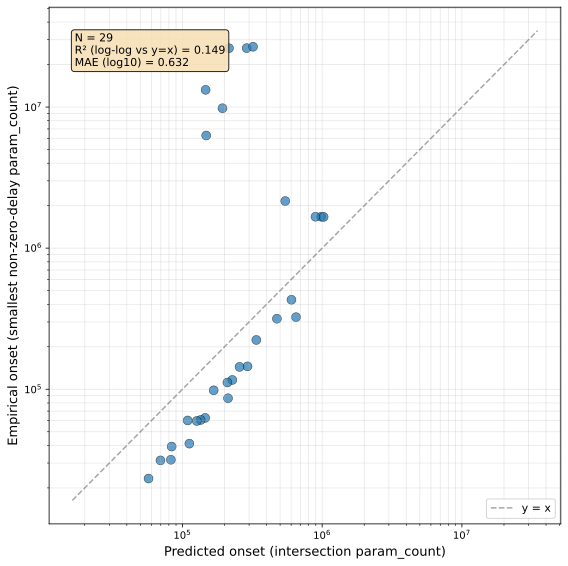

*(a) Predicted vs. empirical onset, points coloured by train_fraction.*

*(b) Per-cell log-residual against train_fraction.*

*Figure 8: Training-fraction sweep: predicted-vs-empirical scatter and residual trend with the swept axis.* **[p. 19]**

*Table 8: Training-fraction sweep: pooled hypothesis tests on all 31 cells (5 primes $\times$ 4 train-fractions plus the 11-prime $\alpha{=}0.5$ central-sweep row). Schema as in Table 1; the robustness row regresses the per-cell log-residual against $\alpha$.* **[p. 20]**

| Sub-claim / Test | Statistic | $p$-value |
|---|---|---|
| *(1) Rank predictiveness* |  |  |
| Spearman $\rho$ | $0.977$ | $p_{\text{perm}}<10^{-4}$ |
| Kendall $\tau$ | $0.890$ | $2.2\times 10^{-12}$ |
| *(2) Calibration to $y=x$* |  |  |
| Lin’s CCC (95% CI) | $0.804\;[0.70,\,0.86]$ | — |
| Slope $\hat{b}$ (log–log OLS) | $1.452$ | — |
| Intercept $\hat{a}$ | $-2.605$ | — |
| Joint $F$-test for $(a=0,b=1)$ | $F=29.95$ | $8.8\times 10^{-8}$ |
| Wilcoxon on log-residuals | median $-0.179$ | $4.9\times 10^{-4}$ |
| *(3) Sufficiency vs. baselines (nested OLS)* |  |  |
| $M_{1}$ vs. $M_{0}$ (intersection has signal) | $F=263.9$ | $4.4\times 10^{-16}$ |
| $M_{3}$ vs. $M_{2}$ (intersection adds over hyperparams) | $F=79.6$ | $1.1\times 10^{-9}$ |
| $M_{3}$ vs. $M_{1}$ (hyperparams add over intersection) | $F=4.45$ | $0.044$ |
| *(4) Robustness across the swept axis* |  |  |
| train_fraction (numeric) | slope $=+1.23$/unit $\alpha$ | $9.4\times 10^{-6}$ |

*Table 9: Training-fraction sweep: within-setting log-residual summary across primes. The $\alpha{=}0.5$ row uses the 11-prime / full-seed central-sweep grid; other rows use the 5-prime / 4-seed sub-grid from the alpha sweep.* **[p. 20]**

| train_fraction | $n_{\text{primes}}$ | median $\log_{10}(P_{\text{onset}}/\widehat{P}_{\text{cross}})$ | std | within-setting verdict |
|---|---|---|---|---|
| $0.3$ | 5 | $-0.390$ | $0.036$ | strong |
| $0.4$ | 5 | $-0.329$ | $0.051$ | strong |
| $0.5$ | 11 | $-0.171$ | $0.049$ | strong |
| $0.6$ | 5 | $-0.179$ | $0.214$ | moderate |
| $0.7$ | 5 | $+0.211$ | $0.348$ | moderate |

#### Verdict.

###### p19-1

Within each fixed $\alpha$ the predictor ranks the five (or eleven, at $\alpha{=}0.5$) primes essentially correctly: per-cell log-residuals are tight at $\alpha\in\{0.3,0.4,0.5\}$ ($\sigma_{\log}\leq 0.05$, Table 9). The residual spread widens at $\alpha\in\{0.6,0.7\}$ ($\sigma_{\log}\approx 0.2$–$0.35$), partly real and partly a measurement-side artefact: at $\alpha{=}0.7$, $p=113$ the empirical onset lands at $2.16\times 10^{6}$ parameters — exactly the dim$=256$ cap of the swept width range — indicating the swept grid is not wide enough to resolve onset at large $\alpha$. Pooled across all 31 cells, predictiveness is essentially perfect (Spearman $\rho=0.977$, Kendall $\tau=0.890$) and Lin’s CCC is high ($0.80$). The joint $(a,b)=(0,1)$ calibration test rejects ($F{=}30.0$, $p=10^{-7}$) because the per-cell offset trends systematically with $\alpha$: from $-0.39$ dex at $\alpha=0.3$ to $+0.21$ dex at $\alpha=0.7$, a $+1.23$ dex per unit $\alpha$ recalibration ($p=9.4\times 10^{-6}$). The sceptic-friendly $M_{3}$ vs. $M_{1}$ comparison is borderline ($F{=}4.45$, $p=0.044$): given $\widehat{P}_{\text{cross}}$, $\alpha$ adds marginal explanatory power, consistent with the smooth $\alpha$-recalibration captured by the robustness regression. We read this as the same pattern observed for weight decay and depth: within any fixed $\alpha$ the framework’s intersection prediction is highly accurate, but the multiplicative offset between $\widehat{P}_{\text{cross}}$ and $P_{\text{onset}}$ shifts smoothly across $\alpha$ — a setting-specific recalibration rather than a structural failure.

### C.5 Other hyperparameter sweeps

###### p19-2

Dropout (matching dropout across capacity, speed, and grokking) and a finer-grained $\eta$ grid above the current upper bound are scheduled and will be added to this appendix as separate subsections following the *Scope* / figure / pooled / within-setting / verdict template above. **[p. 20]** Sweeps over architectural axes (depth, attention heads, gated FFN removal, RMSNorm$\to$LayerNorm, RoPE$\to$learned positional embedding, MLP baseline) are reported separately in Appendix D, where depth is already covered.

## Appendix D Architectural invariance

#### Scope and reading guide.

The central sweep fixes architecture at depth $L_{\text{depth}}=2$ with a single attention head ($H=1$) and gated FFN blocks. To assess whether the speed-intersection prediction is architecture-specific, we re-run the full capacity $\to$ speed $\to$ groks pipeline at each setting of a swept architectural axis and apply the same two-question evaluation as in Appendix C: within-setting predictiveness across primes, and cross-setting calibration. Each subsection below uses the same fixed template (*Scope*, headline figures, pooled tests, within-setting summary, verdict) so that further architectural axes slot in without restructuring.

### D.1 Depth scaling

#### Scope.

###### p20-2

depth$\in\{2,4,6,8,10\}$ at fixed $H{=}1$, matched by parameter count rather than embedding width: target counts $\{5{\times}10^{3},\,10^{4},\,2{\times}10^{4},\,5{\times}10^{4},\,10^{5},\,2{\times}10^{5},\,5{\times}10^{5}\}$ are realised by selecting, at each depth, the dim closest to each target. Five primes per cell ($p\in\{97,107,113,127,139\}$); 4 seeds per cell; all other hyperparameters as in Section A.2. depth$=2$ matches the central sweep and serves as an in-sweep baseline. Capacity is re-measured at depth$\in\{2,6,10\}$ and pinned at $C_{\text{model}}=2.16$ for missing depths.

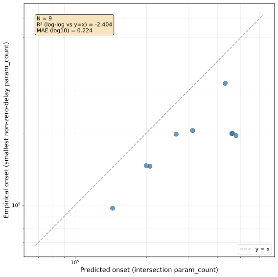

*(a) Predicted vs. empirical onset, points coloured by depth.*

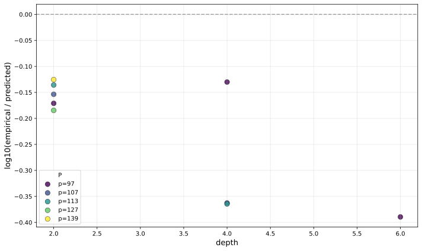

*(b) Per-cell log-residual against depth.*

###### fig-9

*Figure 9: Depth-scaling sweep: predicted-vs-empirical scatter and residual trend with the swept axis.* **[p. 21]**

*Table 10: Depth-scaling sweep: pooled hypothesis tests on the 9 valid cells (out of 25; 16 cells at depth$\geq 4$ have no recorded intersection within the swept param-count range, see text). Schema as in Table 1; the robustness row regresses the per-cell log-residual against $L_{\text{depth}}$.* **[p. 21]**

| Sub-claim / Test | Statistic | $p$-value |
|---|---|---|
| *(1) Rank predictiveness* |  |  |
| Spearman $\rho$ | $0.600$ | $p_{\text{perm}}=0.10$ |
| Kendall $\tau$ | $0.444$ | $0.119$ |
| *(2) Calibration to $y=x$* |  |  |
| Lin’s CCC (95% CI) | $0.392\;[0.07,\,0.64]$ | — |
| Slope $\hat{b}$ (log–log OLS) | $0.603$ | — |
| Intercept $\hat{a}$ | $1.955$ | — |
| Joint $F$-test for $(a=0,b=1)$ | $F=31.6$ | $3.1\times 10^{-4}$ |
| Wilcoxon on log-residuals | median $-0.171$ | $3.9\times 10^{-3}$ |
| *(3) Sufficiency vs. baselines (nested OLS)* |  |  |
| $M_{1}$ vs. $M_{0}$ (intersection has signal) | $F=13.7$ | $7.7\times 10^{-3}$ |
| $M_{3}$ vs. $M_{2}$ (intersection adds over hyperparams) | $F=21.8$ | $3.4\times 10^{-3}$ |
| $M_{3}$ vs. $M_{1}$ (hyperparams add over intersection) | $F=3.93$ | $0.095$ |
| *(4) Robustness across the swept axis* |  |  |
| depth (numeric) | slope $=-0.061$/unit $L_{\text{depth}}$ | $0.012$ |

*Table 11: Depth-scaling sweep: within-setting log-residual summary. At depth$\geq 4$ only a subset of primes yields a measured intersection within the swept param-count range; the remaining cells have $T_{\text{mem}}(P)>T_{\text{gen}}(P)$ throughout the explored range, so $\widehat{P}_{\text{cross}}$ is undefined while empirical onsets are still recorded.* **[p. 22]**

| depth | $n_{\text{primes}}$ | median $\log_{10}(P_{\text{onset}}/\widehat{P}_{\text{cross}})$ | std | within-setting verdict |
|---|---|---|---|---|
| $2$ | 5 | $-0.154$ | $0.024$ | strong |
| $4$ | 3/5 | $-0.363$ | $0.135$ | weak (small $N$, large spread) |
| $6$ | 1/5 | $-0.389$ | — | under-resolved |
| $8$ | 0/5 | — | — | no intersection in range |
| $10$ | 0/5 | — | — | no intersection in range |

#### Verdict.

###### p20-3

At the central-sweep architecture (depth$=2$) the predictor reproduces its baseline behaviour: tight per-cell residuals ($\sigma_{\log}=0.024$) and a consistent constant offset across primes. **[p. 21]** As depth increases, the diagnostic shifts in two ways. First, the constant offset becomes more negative — empirical onset arrives earlier (relative to the predicted $\widehat{P}_{\text{cross}}$) at deeper models — and the across-axis robustness regression captures this trend at $-0.061$ dex per unit depth ($p{=}0.012$). Second, and more interpretively important, deeper models ($L_{\text{depth}}\geq 6$) routinely fail to exhibit a speed crossover within the param-count range we sweep ($\leq 5{\times}10^{5}$): $T_{\text{mem}}(P)$ stays above $T_{\text{gen}}(P)$ throughout, so $\widehat{P}_{\text{cross}}$ is undefined while empirical onsets still occur. The pooled $\rho=0.60$ and the marginal $M_{3}$ vs. $M_{1}$ test ($p{=}0.095$, only weakly rejecting the additional explanatory value of depth) reflect both the small valid-cell count and the depth-dependent recalibration. We read this as the framework remaining well-defined within each fixed depth, but with the speed-curve geometry — and hence the calibration constant — shifting with architecture, consistent with depth changing how memorisation and generalisation each scale with parameter count rather than just where they cross. Extending the param-count range (or, equivalently, the dim grid) to recover well-defined intersections at $L_{\text{depth}}\geq 6$ is left for future work.

**[p. 22]**

### D.2 Other architectural sweeps

###### p22-1

A number-of-heads sweep ($H\in\{1,2,4,8\}$ at fixed depth) and architectural-variant sweeps (gated FFN removal, RMSNorm$\to$LayerNorm, RoPE$\to$learned positional embedding, MLP baseline) are scheduled and will be added as further subsections following the same template.

## Appendix E Task invariance

#### Scope and reading guide.

The central sweep uses modular division. To assess whether the speed-intersection prediction extends to other modular operations, we re-run the full pipeline for each operation and apply the same two-question evaluation as in Appendix C: within-task predictiveness across primes, and cross-task calibration of the predictor. Each subsection below uses the same fixed template (*Scope*, headline figures, pooled tests, within-setting summary, verdict) so that further task families slot in without restructuring.

### E.1 Modular addition

#### Scope.

###### p22-3

Operation $\circ\in\{+,/\}$ at the same five primes ($p\in\{97,107,113,127,139\}$); architecture, optimiser, and aggregation as Section A.2. For $\circ=+$, the dataset enumerates all $p^{2}$ pairs (rather than $p(p-1)$ for $/$), so $K_{\text{mem}}(p,\alpha)$ and $n_{\text{equiv}}(p,\alpha)$ are recomputed accordingly. The $\circ=/$ cells reuse the central-sweep speed and grokking runs and serve as an in-sweep baseline.

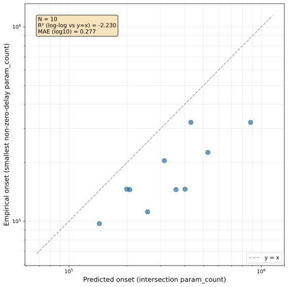

*(a) Predicted vs. empirical onset, points coloured by operation.*

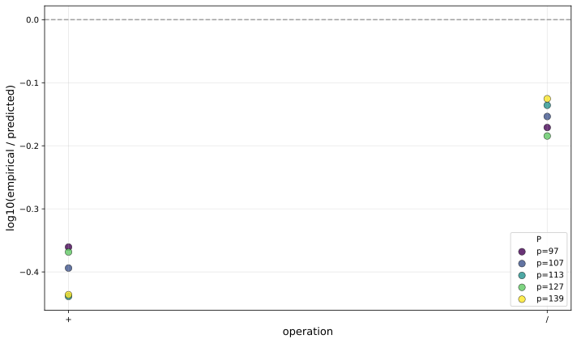

*(b) Per-cell log-residual against operation.*

###### fig-10

*Figure 10: Task-addition sweep: predicted-vs-empirical scatter and residual trend with the swept axis.* **[p. 22]**

*Table 12: Task-addition sweep: pooled hypothesis tests on the 10 cells (5 primes $\times$ 2 operations). Schema as in Table 1; the robustness row treats operation as a categorical factor.* **[p. 23]**

| Sub-claim / Test | Statistic | $p$-value |
|---|---|---|
| *(1) Rank predictiveness* |  |  |
| Spearman $\rho$ | $0.801$ | $p_{\text{perm}}=7.5\times 10^{-3}$ |
| Kendall $\tau$ | $0.644$ | $0.011$ |
| *(2) Calibration to $y=x$* |  |  |
| Lin’s CCC (95% CI) | $0.395\;[0.12,\,0.58]$ | — |
| Slope $\hat{b}$ (log–log OLS) | $0.634$ | — |
| Intercept $\hat{a}$ | $1.740$ | — |
| Joint $F$-test for $(a=0,b=1)$ | $F=35.0$ | $1.1\times 10^{-4}$ |
| Wilcoxon on log-residuals | median $-0.273$ | $2.0\times 10^{-3}$ |
| *(3) Sufficiency vs. baselines (nested OLS)* |  |  |
| $M_{1}$ vs. $M_{0}$ (intersection has signal) | $F=16.1$ | $3.9\times 10^{-3}$ |
| $M_{3}$ vs. $M_{2}$ (intersection adds over hyperparams) | $F=263$ | $8.3\times 10^{-7}$ |
| $M_{3}$ vs. $M_{1}$ (hyperparams add over intersection) | $F=82.8$ | $4.0\times 10^{-5}$ |
| *(4) Robustness across the swept axis* |  |  |
| operation (categorical) | $F=155$ | $1.6\times 10^{-6}$ |

*Table 13: Task-addition sweep: within-setting log-residual summary across the 5 primes.* **[p. 23]**

| Operation | $n_{\text{primes}}$ | median $\log_{10}(P_{\text{onset}}/\widehat{P}_{\text{cross}})$ | std | within-setting verdict |
|---|---|---|---|---|
| $+$ | 5 | $-0.394$ | $0.037$ | strong |
| $/$ | 5 | $-0.154$ | $0.024$ | strong |

#### Verdict.

###### p23-1

Within each operation, log-residuals are tight (**[p. 23]** $\sigma_{\log}\leq 0.04$, Table 13): the predictor ranks the five primes correctly and incurs only a constant multiplicative offset within each task (the $\circ=/$ row reproduces the central-sweep result at the same five primes). Across operations, the predictor over-shoots empirical onset by $\approx 2.5\times$ for $+$ versus $\approx 1.4\times$ for $/$, a gap that the operation indicator captures cleanly: the categorical robustness test is significant ($F=155$, $p=10^{-6}$) and the sufficiency comparisons rank $M_{3}>M_{1}$ and $M_{3}>M_{2}$. We interpret this as expected task-specific calibration — $T_{\text{mem}}(P)$ on random labels of equivalent complexity is operation-agnostic by construction, but $T_{\text{gen}}(P)$ for $+$ is consistently faster than for $/$, shifting the intersection by a constant in log space — and not a within-task failure of the framework.

### E.2 Other task sweeps

###### p23-2

Modular multiplication and modular subtraction are scheduled and will be added as further subsections following the same template; permutation composition (e.g. $S_{5}$) is a longer-term target requiring new task plumbing.
