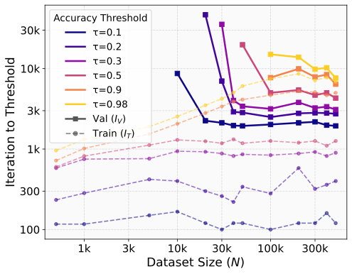
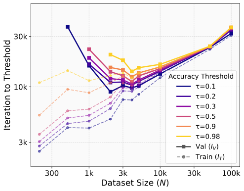
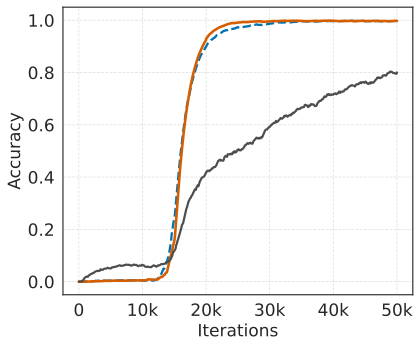
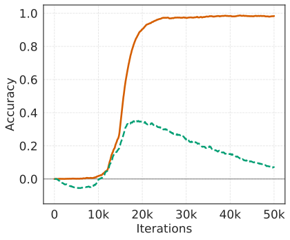
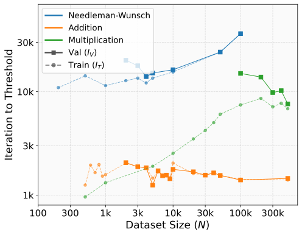
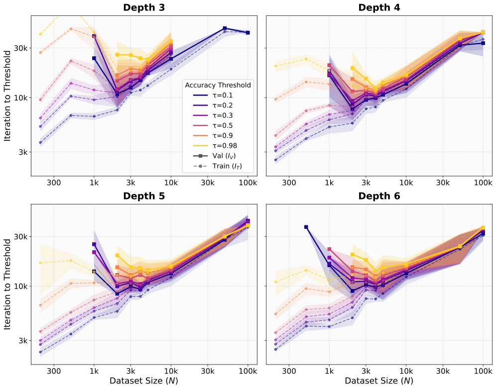
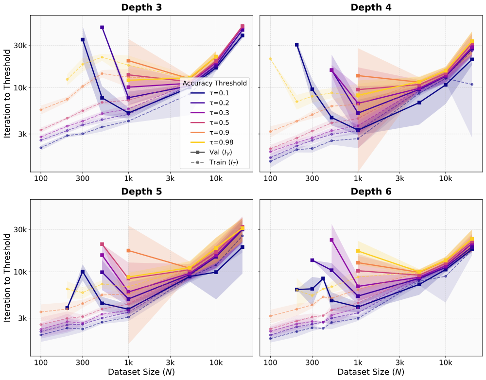
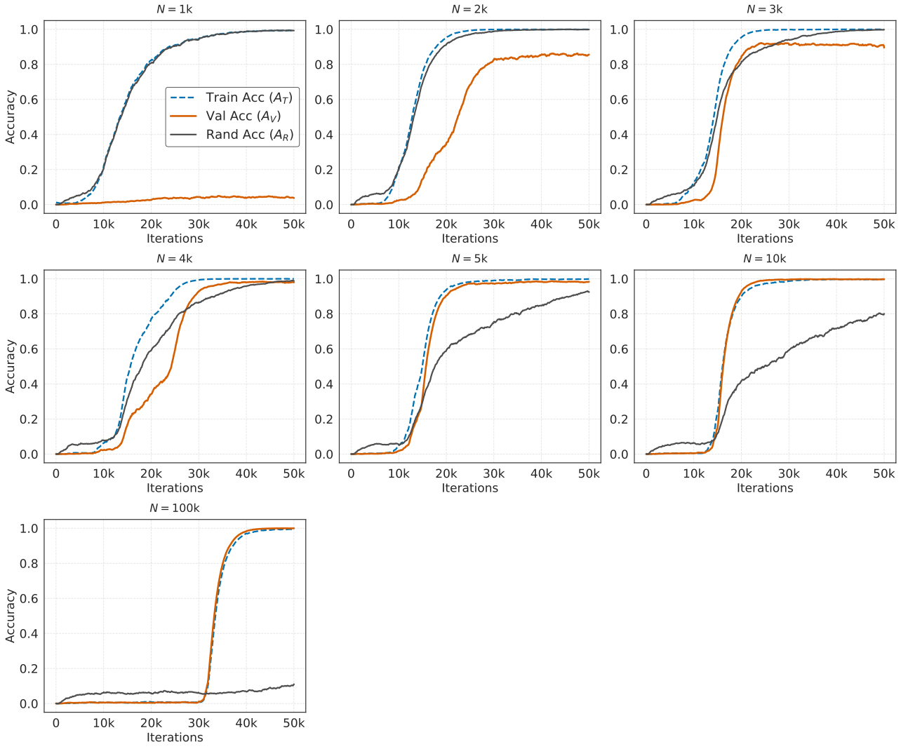
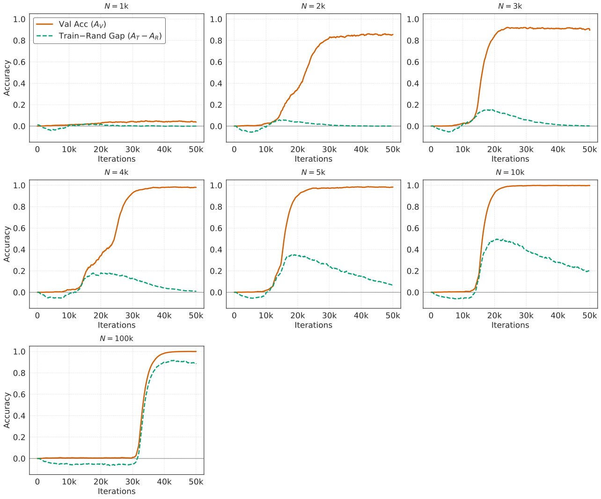

# Slower Generalization, Faster Memorization: A Sweet Spot in Algorithmic Learning

Shin So Kyelim Lee Albert No Thanks: Correspondence to: albertno@yonsei.ac.kr Affiliation: Yonsei University

## Abstract

Critical-data-size accounts of grokking suggest a natural post-threshold intuition: once training data is sufficient to identify the underlying rule, additional data should accelerate validation convergence. We show that this intuition can fail in a controlled structured-output task. In Needleman–Wunsch (NW) matrix generation, small Transformers reach high validation exact-match accuracy fastest at an intermediate dataset size, not at the largest one. Past this dataset-size sweet spot, generalization remains achievable but requires more gradient updates. Conversely, in the regime where partial validation competence first appears, larger datasets can require fewer updates to reach high training accuracy, suggesting that emerging rule structure can accelerate fitting beyond example-wise memorization. A multiplication baseline does not show the same post-threshold slowdown. These results separate the critical data size for the onset of generalization from the dataset size that optimizes update-based convergence, and identify structured-output tasks where learning the rule and completing exact-fitting can diverge.

## 1 Introduction

A standard lesson from empirical scaling laws is that larger datasets are usually a resource: with suitable model and compute scaling, additional data improves loss, accuracy, or compute allocation [Hestness et al., 2017, Kaplan et al., 2020, Hoffmann et al., 2022]. Grokking and critical-data-size studies give a sharper version of this view for algorithmic tasks. Below a task-dependent data threshold, a model may fit the training set without discovering the rule; above it, structured representations emerge and validation accuracy improves [Power et al., 2022, Liu et al., 2022, Zhu et al., 2024, Morris et al., 2025]. These works primarily address the onset of generalization. We ask a different question: *after generalization is possible, which dataset size makes validation convergence fastest under a fixed optimization protocol?*

###### p1-4

We study this question in Needleman–Wunsch (NW) matrix generation, a structured-output task derived from sequence alignment [Needleman and Wunsch, 1970]. Given two strings, the NW dynamic program computes a score matrix whose entries depend recursively on neighboring entries. A model is trained to map the input pair to the matrix, and a prediction is correct only when generated exactly. We do not use NW because alignment is the target application. Rather, NW is a compact testbed in which a short input induces a much longer structured output, and correct generation requires coordinated prediction of many dependent cells. Row-major serialization also gives a natural sequential target order: cells needed for the recurrence appear earlier in the output sequence.

Figure 1 compares NW matrix generation with three-digit multiplication. Multiplication follows the usual post-threshold intuition: increasing dataset size does not create a pronounced slowdown after validation becomes attainable. NW behaves differently. Validation thresholds are reached fastest at an intermediate dataset size. Small datasets provide too little structural coverage and either fail to **[p. 2]** generalize or generalize only after a delay. Larger datasets still generalize, but require more updates to reach the same exact-match threshold. We call this interior optimum a dataset-size sweet spot. This is surprising under the usual post-threshold intuition that, once generalization is attainable, the largest dataset should be at least as fast as smaller ones. The finding is update-based: it concerns gradient updates under a fixed protocol, not asymptotic accuracy or epoch-normalized sample efficiency.

*(a) Three-digit multiplication.*

*(b) NW matrix generation, $L=5$.*

*Figure 1: Dataset-size sweeps for multiplication and NW matrix generation. Each curve reports the first optimizer update at which exact-match accuracy reaches threshold $\tau$; lower values mean faster convergence. Colors denote thresholds $\tau$, solid lines show validation crossings $I_{V}(\tau;N)$, and dashed lines show training crossings $I_{T}(\tau;N)$. Multiplication does not show a pronounced post-threshold slowdown, whereas NW reaches validation thresholds fastest at an intermediate dataset size.* **[p. 2]**

###### p2-1

This result refines the classical grokking picture rather than contradicting it. Classical grokking usually fixes dataset size and studies a temporal gap between training and validation accuracy [Power et al., 2022]. By sweeping dataset size, we show a broader timing diagram: near the sweet spot, weak validation competence can appear before strict training convergence, and increasing $N$ can reduce the updates needed to reach high training accuracy. Thus, memorization and generalization are not purely sequential; partial rule learning can make fitting easier.

Our interpretation is a two-pressure account. Additional data first helps the model learn enough of the NW rule to explain many examples and cells at once. Once this useful rule is largely available, further examples add little new rule information but increase the residual details that must be fit under strict exact match. NW exposes both pressures because each example contains a dependent dynamic-programming table; multiplication, whose output is much shorter in our setting, does not show the same slowdown.

#### Contributions.

We make three empirical contributions. First, we identify a post-onset sweet spot in NW matrix generation: validation convergence is fastest at an intermediate dataset size, not the largest one. Second, we show that partial rule learning can accelerate fitting: in the weak-validation regime, more data can reduce the updates needed to reach high training accuracy. Third, random-suffix and task-scope controls support a two-pressure account: rule discovery first helps, but after it saturates, residual exact-fitting costs can dominate in structured-output tasks.

## 2 Related Work

#### Grokking and train–validation timing.

###### p2-4

Our work is closest to grokking because it studies the relative timing of training convergence and validation generalization. Grokking was introduced as delayed generalization after overfitting on small algorithmic datasets [Power et al., 2022]; later work connected this timing to structured representations, circuit formation, implicit-bias transitions, and internal subnetworks [Liu et al., 2022, Nanda et al., 2023, Varma et al., 2023, Lyu et al., 2023, Minegishi et al., 2025]. We do not introduce an unrelated phenomenon: by sweeping dataset size, we show that delayed generalization, near-synchronous train–validation convergence, and post-threshold slowdown can appear in one timing diagram.

**[p. 3]**

#### Dataset size, scaling, and critical thresholds.

Empirical scaling laws study how loss changes with data, parameters, and compute [Hestness et al., 2017, Kaplan et al., 2020, Hoffmann et al., 2022], while double descent shows that more data or training can sometimes hurt in certain effective-complexity regimes [Nakkiran et al., 2021]. Critical-data-size work asks when generalization first becomes possible and often finds that additional data beyond this onset accelerates validation convergence [Power et al., 2022, Liu et al., 2022, Zhu et al., 2024]. These results motivate a complementary question after that onset: among dataset sizes that can generalize, is the largest dataset necessarily the fastest to reach a strict validation threshold, or can an intermediate dataset size require fewer optimizer updates? Our results show that the latter can occur in NW matrix generation.

#### Memorization and rule-mediated fitting.

Neural networks can memorize random labels [Zhang et al., 2017], yet often learn simple shared patterns before fitting noise [Arpit et al., 2017]. Memorization can also be useful for high-accuracy learning when simple shared patterns are insufficient [Feldman and Zhang, 2020]; in language models, memorization has been studied through unintended memorization, extraction, and capacity estimates [Carlini et al., 2019, 2021, Morris et al., 2025]. Mechanistic accounts of grokking suggest that memorizing and generalizing solutions can differ in efficiency [Nanda et al., 2023, Varma et al., 2023, Liu et al., 2023, Huang et al., 2024]. NW matrix generation lets us observe this interaction through dataset-size sweeps.

#### Algorithmic and structured-output tasks.

Controlled algorithmic tasks are useful because exact generalization and memorization can be measured cleanly. Prior work has used modular arithmetic, parity, arithmetic, and synthetic symbolic tasks to study delayed generalization and hidden progress [Power et al., 2022, Barak et al., 2022, Lee et al., 2023, Charton, 2024]. NW matrix generation differs from scalar arithmetic tasks because a short input pair induces a full dynamic-programming table whose cells are mutually constrained. This places NW among structured dynamic-programming problems such as edit distance, local sequence alignment, Viterbi decoding, and context-free parsing [Wagner and Fischer, 1974, Smith and Waterman, 1981, Viterbi, 1967, Younger, 1967]. We use NW as the primary evidence task and multiplication as a contrast baseline.

## 3 Problem Definition and Experimental Protocol

Our goal is to measure how dataset size changes the timing of high training accuracy and validation generalization. We treat dataset size $N$ as the primary variable and hold fixed the task distribution, model family, optimizer, and evaluation rule within each sweep. Throughout, “faster” means fewer optimizer updates, not fewer epochs or better asymptotic accuracy.

### 3.1 Needleman–Wunsch Matrix Generation and Multiplication Baseline

For NW matrix generation, let $\Sigma=\{A,C,G,T\}$ and let $x,y\in\Sigma^{L}$. Each input pair has a target matrix $M(x,y)\in\mathbb{Z}^{(L+1)\times(L+1)}$. Boundary entries use a fixed gap penalty, and interior entries obey

$$
M_{i,j}=\max\{M_{i-1,j-1}+s(x_{i},y_{j}),\;M_{i-1,j}+g,\;M_{i,j-1}+g\}, \tag{1}
$$

where $s$ is the match/mismatch score and $g$ is the gap penalty. Unless otherwise stated, we use match score $5$, mismatch score $-4$, and gap penalty $-5$. The main experiments use $L=5$, so each input has ten symbols and target is a $6\times 6$ matrix. The model predicts the serialized matrix autoregressively, and exact-match accuracy counts an example as correct only if every matrix entry is correct.

We use three-digit multiplication as a contrast task. Each input is a pair of three-digit integers and the target is the exact decimal product. Multiplication is also algorithmic and supports exact-match evaluation, but its output is much shorter than the NW matrix and does not impose the same dynamic-programming table structure. The paper’s main findings concern NW; multiplication tests whether the threshold-crossing analysis itself creates a spurious sweet spot. Additional details on NW scoring, serialization, padding, and arithmetic baselines are given in Appendix A.

### 3.2 Dataset sweep and model

For NW at length $L$, the finite task universe has size $|\mathcal{D}_{\mathrm{full}}|=|\Sigma|^{2L}=4^{2L}$. At $L=5$, this gives $4^{10}=1{,}048{,}576$ possible input pairs. For each dataset size $N$, we sample a training set $\mathcal{D}_{N}\subset\mathcal{D}_{\mathrm{full}}$ **[p. 4]** and evaluate on held-out examples from the same universe. The NW sweep uses

$$
N\in\{200,500,10^{3},2{\cdot}10^{3},3{\cdot}10^{3},4{\cdot}10^{3},5{\cdot}10^{3},10^{4},5{\cdot}10^{4},10^{5}\}.
$$

We train decoder-only Transformers [Vaswani et al., 2017]. A depth-$D$ model has $D$ layers, $D$ attention heads, embedding dimension $64D$, and feed-forward width $256D$. The main depth sweep uses $D\in\{3,4,5,6\}$. Models are trained with AdamW [Loshchilov and Hutter, 2019] and a cosine learning-rate schedule from $10^{-3}$ to $10^{-4}$, with $\beta_{1}=0.9$, $\beta_{2}=0.99$, and weight decay $0.1$. The effective batch size is $160$, obtained by gradient accumulation, and each run is trained for at most $50{,}000$ optimizer updates with evaluation every $100$ updates. Batch size, optimizer settings, tokenization, and evaluation frequency are held fixed within each task sweep. We treat all non-crossing runs as censored rather than assigning them finite crossing times. Each task and dataset-size configuration is run with five random seeds unless otherwise stated.

### 3.3 Exact-match thresholds and crossing times

Let $A_{T}(t;N)$ and $A_{V}(t;N)$ denote train and validation exact-match accuracy after $t$ optimizer updates when training on $\mathcal{D}_{N}$. For an exact-match threshold $\tau\in(0,1)$, define

$$
I_{T}(\tau;N)=\min\{t:A_{T}(t;N)\geq\tau\},\qquad I_{V}(\tau;N)=\min\{t:A_{V}(t;N)\geq\tau\}. \tag{2}
$$

If a run does not reach the threshold within the training budget, its crossing time is treated as censored. The main strict threshold is $\tau=0.98$, while lower thresholds in Figure 1 detect weak partial competence.

Two derived quantities summarize the dataset-size effect. The empirical critical dataset size is

$$
N_{c}(\tau)=\min\{N:I_{V}(\tau;N)\;\text{is not censored}\},
$$

and the empirical sweet spot is

$$
N^{\star}(\tau)=\arg\min_{N}I_{V}(\tau;N).
$$

The core question is whether $N^{\star}(\tau)$ is the largest available dataset, as a simple “more data helps” intuition would suggest, or an interior dataset size.

## 4 Main Results: Dataset Size Changes Train–Validation Timing

We now examine how dataset size changes the iterations needed for train and validation exact-match accuracy to reach a target threshold. Figure 1 compares three-digit multiplication and NW matrix generation. For each threshold $\tau$, solid curves show validation crossings and dashed curves show training crossings. Thus, lower curves mean faster convergence in gradient updates.

### 4.1 Multiplication behaves as expected

The multiplication baseline follows the standard post-threshold intuition. Once the dataset is large enough for validation generalization to occur, increasing the number of examples does not produce a pronounced slowdown in validation convergence. The validation curves remain roughly flat or improve with dataset size. This behavior is useful as a sanity check: the threshold-crossing analysis does not automatically create an interior optimum, and exact-match evaluation alone is not sufficient to produce the phenomenon we study.

### 4.2 Finding 1: NW has an intermediate-data validation optimum

NW matrix generation shows a different pattern. For strict validation thresholds, validation crossing time is non-monotonic in dataset size. Small datasets either fail to reach the target or reach it only after a long delay. Intermediate datasets converge fastest. Larger datasets still generalize, but require more updates to reach the same threshold.

###### p4-10

We refer to this as an intermediate-data validation optimum, or the *sweet spot*. Let $N_{c}(\tau)$ be the smallest dataset size that reaches validation threshold $\tau$, $N^{\star}(\tau)$ the dataset size with the fastest validation crossing, and $N_{\max}$ the largest dataset size in the sweep. In the observed NW sweep, $N^{\star}(\tau)$ is interior rather than largest; for strict thresholds where the sweet spot is visible, $N_{c}(\tau)<N^{\star}(\tau)<N_{\max}$. Thus, the onset of generalization and the fastest validation convergence occur at distinct dataset sizes.

*Figure 2: NW multi-threshold sweeps across depths $D\in\{3,4,5,6\}$ at $L=5$. Colors denote exact-match thresholds, solid lines show validation crossings, and dashed lines show training crossings. Across depths, validation crossing time is non-monotonic in dataset size, giving an intermediate-data sweet spot. In the same dataset-size band where weak validation thresholds first become reachable, training crossings can also become faster as $N$ increases, supporting the partial-rule interpretation.* **[p. 5]**

**[p. 5]**

### 4.3 Finding 2: partial rule learning can accelerate fitting

###### p5-1

The same NW panel shows a second timing effect. Near the regime where weak validation competence first appears, increasing $N$ can reduce the updates needed to reach the strict training threshold. This is counter to a purely example-wise memorization view: if fitting only required storing independent input–output pairs, larger datasets should slow training convergence.

We interpret this regime as the onset of a useful partial rule. The model need not have learned a complete symbolic implementation of NW; it only needs enough of the rule to explain many shared regularities across output cells. What remains is an exact-tuning problem: strict thresholds still require removing residual errors not fully determined by the partial rule. Figure 2 shows this pattern across depths: weak validation thresholds become reachable before strict training convergence, and in the same dataset-size band the training crossing time can decrease as $N$ grows.

### 4.4 Immediate interpretation

Together, the two findings explain the NW curve. On the more-data-faster side of the sweet spot, small datasets provide insufficient structural coverage, but increasing $N$ helps the model extract enough of the rule to accelerate both validation convergence and training-threshold crossing.

On the more-data-slower side, the useful rule is largely available, so additional examples provide diminishing returns for rule discovery. They still add full matrices whose residual details must be fit under strict exact match. Since the learned rule need not determine every output exactly, the last **[p. 6]** residual errors must be fit or memorized. As $N$ grows, this residual exact-fitting burden can dominate the update count and produce the large-data slowdown.

This task dependence explains the contrast with multiplication. Both tasks are algorithmic, but NW maps a short input to a dependent dynamic-programming matrix, making residual exact fitting visible after the rule becomes learnable. Multiplication has a shorter output in our setting and does not show the same post-threshold slowdown.

## 5 Mechanism: Rule-Mediated Fitting and the Random-Suffix Probe

Section 4 suggests that partial rule learning can accelerate fitting, yet strict exact match still requires residual memorization. We now test this interpretation with a probe that separates structured prediction from irreducible example-specific information.

### 5.1 From rule discovery to exact fitting

NW matrix generation has two coupled sources of difficulty. First, the model must learn enough of the shared dynamic-programming rule to transfer across examples and output cells. Second, it must reach high exact-match accuracy over many full matrices. Additional data helps the first difficulty by improving structural coverage, but after the useful rule is largely available, further examples mostly add residual details that must be fit under strict exact match.

This view is consistent with prior work arguing that high-accuracy learning may require retaining information not captured by simple shared patterns [Feldman and Zhang, 2020]. We do not claim to identify a long-tailed subpopulation in NW; the point is only that rule learning and residual example-specific fitting need not be mutually exclusive. The sweet spot occurs where the benefit of additional rule coverage is available but the large-data memorization burden has not yet dominated.

### 5.2 Random-suffix probe

We append a four-bit random binary suffix to each NW target. The matrix component is generated by the shared NW rule, while the suffix is independent across examples and cannot be inferred from the input. Since the suffix is much shorter than the matrix, a purely output-length or example-wise memorization view would predict that the suffix should be easier to fit.

*(a) $N=$1k*

*(b) $N=$10k*

*(c) $N=$100k*

*Figure 3: Random-suffix probe. Each NW target is augmented with a four-bit random suffix. We track training accuracy on the structured NW matrix $A_{T}$, validation accuracy on the NW matrix $A_{V}$, and training accuracy on the random suffix $A_{R}$. The NW matrix is rule-generated, while the suffix is example-specific and cannot be inferred from the input. At small $N$, matrix and suffix accuracies rise on similar timescales while validation remains low. At larger $N$, the rule-generated matrix is fit before the much shorter suffix, supporting a rule-mediated route to fitting.* **[p. 6]**

###### p6-6

Figure 3 shows the opposite behavior at larger $N$. At small $N$, matrix accuracy and suffix accuracy rise on similar timescales while validation remains low. At larger $N$, the model fits the rule-generated matrix before the much shorter random suffix. Thus, the structured component benefits from the partial rule, while $A_{R}$ serves as a proxy for residual example-specific fitting: progress on information that cannot be supplied by the rule.

**[p. 7]**

### 5.3 Why this is visible in NW

The random-suffix result also clarifies why NW differs from multiplication. In both tasks, a model can benefit from reusable algorithmic structure. However, NW combines reusable structure with high per-example output complexity. Each new training example contributes a full dependent matrix, so once the rule is learnable, strict exact-match training still requires substantial residual fitting. The random suffix is not the NW residual itself, but it isolates the same kind of pressure: fitting information that is not provided by the shared rule. Thus $A_{R}$ gives a diagnostic for the residual example-specific component that remains after rule-mediated fitting.

We therefore interpret the NW sweet spot as a consequence of two opposing pressures: additional data improves rule discovery at first, but later increases the cost of exact fitting. The random-suffix probe isolates these pressures within a single training run by placing a structured component and an unstructured component side by side. The structured component is learned through the rule; the unstructured suffix must be fit example by example.

### 5.4 Scope of the mechanism

This mechanism is intended as an empirical explanation, not a theorem. It predicts that intermediate-data validation optima should be most visible in tasks with both reusable structure and high per-example output complexity. Dynamic-programming table-generation tasks are natural candidates because they combine compact rules with long dependent outputs. By contrast, tasks with compact scalar or short-string outputs may exhibit delayed generalization or train–validation coevolution without a strong post-threshold slowdown.

Within this scope, the result refines the critical-data-size view of grokking. Critical data size explains when generalization becomes possible. Our dataset-size sweep shows that, in structured-output learning, the fastest update-based route to validation generalization can occur at a different dataset size because rule discovery and exact fitting impose different optimization pressures.

## 6 Task Specificity and the Train–Random Gap

Section 5.2 introduced the random-suffix probe, where $A_{R}$ measures progress on an example-specific suffix with no transferable rule. We now use the same probe to form a gap diagnostic. Let $A_{V}(t)$ be validation accuracy on the NW matrix, $A_{T}(t)$ training accuracy on the NW matrix, and $A_{R}(t)$ training accuracy on the random suffix. We define

$$
G(t)=A_{T}(t)-A_{R}(t),
$$

the amount of NW train accuracy beyond the random-suffix fitting baseline.

*(a) $N=4\mathrm{k}$*

*(b) $N=5\mathrm{k}$*

*(c) $N=10\mathrm{k}$*

*Figure 4: Train–random gap diagnostic. Orange curves show NW validation accuracy $A_{V}$. Green dashed curves show $G=A_{T}-A_{R}$, the NW training accuracy beyond random-suffix fitting. Validation starts to rise when $G>0$, and the two curves initially track each other, suggesting that the same rule-mediated progress contributes to both validation and train-set fitting.* **[p. 7]**

###### p7-7

Figure 4 shows that $A_{V}(t)$ becomes nonzero when $G(t)$ becomes positive. Before this point, the model does not fit the NW matrix better than the random suffix, so there is little evidence **[p. 8]** of transferable rule learning. After $G(t)>0$, the model fits the structured matrix beyond the example-specific suffix baseline, and validation accuracy begins to increase.

In the early transition, $G(t)$ closely follows $A_{V}(t)$. Equivalently,

$$
A_{T}(t)\approx A_{R}(t)+A_{V}(t).
$$

This suggests a simple decomposition: random-suffix accuracy captures example-specific fitting, while validation accuracy captures the transferable part of NW learning. Thus, the same rule that improves validation also contributes to training accuracy.

After validation accuracy becomes high, this relation no longer needs to hold. At that stage, the learned NW rule is strong enough to solve both training and held-out matrices, so suffix-like memorization is less important for NW accuracy. The random suffix remains a separate example-specific burden. This supports our two-pressure account: additional data first helps discover the reusable NW rule, but after the rule is available, larger datasets mainly increase the cost of exact fitting.

This also explains why NW differs from multiplication. Both tasks contain reusable algorithmic structure, but NW has a much larger structured output per example. Each input pair induces a full dynamic-programming matrix, so exact-match training remains costly even after the rule is learnable. Multiplication has a much shorter output in our setting, so this post-threshold fitting cost is less visible.

*Figure 5: Task-scope controls at $\tau=0.98$. NW, but not addition or multiplication, shows an interior validation optimum.* **[p. 8]**

###### p8-5

Figure 5 supports this scope statement. Addition has an easy rule and a short output, so train and validation crossings remain close. Three-digit multiplication has a short output but harder rule discovery, so additional data continues to help over the evaluated range. NW exposes both pressures: data first helps extract the rule, but after that benefit saturates, residual exact fitting over full dynamic-programming matrices dominates. Thus, the sweet spot is not a generic consequence of exact-match evaluation; it appears when post-onset rule benefits saturate while residual exact-fitting costs keep growing.

This account also separates our result from standard critical-data-size and double-descent views. Critical data size describes when a generalizing solution becomes identifiable [Liu et al., 2022, Zhu et al., 2024]. Our result concerns what happens after generalization is already attainable: the fastest update-based convergence can occur before the largest dataset because rule discovery saturates while exact fitting costs keep growing. The random-suffix diagnostic shows the same point within a single task: a short unstructured suffix can remain harder to fit than the much larger structured NW matrix once the rule is learned. We therefore expect similar sweet spots primarily in structured table-generation tasks with compact rules and high exact-output burden, such as edit distance, Smith–Waterman, Viterbi, or parsing tables [Wagner and Fischer, 1974, Smith and Waterman, 1981, Viterbi, 1967, Younger, 1967].

## 7 Robustness and Measurement Scope

We present the main robustness evidence in this section and defer the full robustness plots to Appendix C–E. The appendix includes all-depth sweeps, seed-variability plots, epoch-normalized analyses, sequence-length $L=4$ replications, and the full random-suffix sweep. These results show that the qualitative timing pattern is not specific to a single depth, random seed, or normalization.

#### Depth robustness.

Figure 2 repeats the NW sweep across depths. The qualitative pattern is stable: validation crossing time is non-monotonic in $N$, and train crossing time can decrease near the onset of weak validation competence. The precise location of the sweet spot shifts with depth, but the two findings do not rely on a single representative model.

#### Threshold robustness.

###### p8-9

The use of multiple thresholds is essential. A single strict threshold would show only the late stage of learning. The lower thresholds reveal that validation competence emerges **[p. 9]** gradually and can precede strict train convergence. This is the main evidence that the model is not simply completing memorization and then starting generalization. Instead, weak rule learning appears while fitting is still ongoing. The strict threshold $\tau=0.98$ is used for the headline sweet spot because it measures near-execution-level accuracy; weaker thresholds diagnose the transition into that regime.

#### Update-based scope.

###### p9-1

The slowdown we report is specifically update-based. One optimizer update sees a fixed batch size, not a fixed fraction of the dataset. As $N$ grows, the same number of updates covers fewer epochs. Thus, our result should not be read as saying that larger datasets are intrinsically worse, or that they reduce asymptotic accuracy. It says that, for strict exact-match NW generation under the training protocol studied here, the fastest path in gradient-update count occurs at an intermediate dataset size. Epoch-normalized curves answer a different question: how many passes over the data are needed, rather than how many parameter updates are needed.

#### Censoring and interpretation.

Runs that do not reach a threshold within the training budget are treated as censored, not as finite convergence times. This is important in the small-data regime, where validation may fail entirely, and in the large-data regime, where strict convergence can exceed the budget. The sweet spot is not defined by censored failures alone: it is visible among dataset sizes that do reach high validation accuracy. The key comparison is between intermediate and large datasets that both generalize but differ in the number of updates required to reach the same threshold.

## 8 Discussion and Limitations

Finding 1 is the central empirical contribution: NW validation convergence is non-monotonic in dataset size, with an interior update-based optimum. Finding 2 is consistent with prior grokking mechanisms in which generalizing circuits can replace less efficient memorizing circuits [Nanda et al., 2023, Varma et al., 2023]. NW makes this timing visible because each example contains a structured dynamic-programming matrix. The multi-threshold curves and random-suffix probe show how rule-mediated fitting and residual memorization change with dataset size.

The result should not be overstated. We do not claim that every algorithmic task has a sweet spot, that more data is generally harmful, or that NW matrix generation directly models natural-language reasoning. The controlled setting is useful precisely because the input universe is finite, the target rule is explicit, and exact correctness is well-defined. These properties let us separate the onset of generalization from update-based convergence speed, but they also limit external validity.

Several methodological choices may affect the curve. Exact-match accuracy can amplify residual fitting costs for structured outputs with many dependent entries. Row-major serialization aligns with the NW recurrence; other output orders could change optimization dynamics. Larger models, longer sequences, variable lengths, different tokenizations, or parallel matrix prediction could shift or weaken the sweet spot.

The random-suffix probe supports the proposed mechanism, but it does not identify the internal circuits supporting rule-mediated fitting. Residual fitting may include local associative or copying-like mechanisms rather than pure lookup-table memorization; identifying these circuits is left for future work.

Within these limits, the contribution is a refinement of the critical-data-size view: critical data size explains when generalization becomes possible, while our experiments show that the fastest update-based route to validation generalization can occur at a different dataset size. In structured-output learning, rule discovery and exact fitting can impose opposing optimization pressures whose balance is empirically measurable.

## 9 Conclusion

We studied dataset-size effects in small Transformers trained on NW matrix generation. Unlike multiplication, NW reaches high validation exact-match accuracy fastest at an intermediate dataset size. In the same partial-generalization regime, increasing $N$ can reduce the updates needed to reach high training accuracy, suggesting that a partially learned rule can accelerate fitting. Critical data size marks when enough of the rule becomes available for generalization, but strict exact-match convergence still requires residual fitting; thus, the dataset size where generalization becomes possible and the dataset size where update-based convergence is fastest need not coincide.

## References

- D. Arpit, S. Jastrzebski, N. Ballas, D. Krueger, E. Bengio, M. S. Kanwal, T. Maharaj, A. Fischer, A. Courville, Y. **[p. 10]** Bengio, and S. Lacoste-Julien A closer look at memorization in deep networks. In ICML, 2017. Cited by: §2.

- B. Barak, B. Edelman, S. Goel, S. Kakade, E. Malach, and C. Zhang Hidden progress in deep learning: sgd learns parities near the computational limit. In NeurIPS, 2022. Cited by: §2.

- N. Carlini, C. Liu, Ú. Erlingsson, J. Kos, and D. Song The secret sharer: evaluating and testing unintended memorization in neural networks. In USENIX Security, 2019. Cited by: §2.

- N. Carlini, F. Tramer, E. Wallace, M. Jagielski, A. Herbert-Voss, K. Lee, A. Roberts, T. Brown, D. Song, U. Erlingsson, A. Oprea, and C. Raffel Extracting training data from large language models. In USENIX Security, 2021. Cited by: §2.

- F. Charton Learning the greatest common divisor: explaining transformer predictions. In ICLR, 2024. Cited by: §2.

- V. Feldman and C. Zhang What neural networks memorize and why: discovering the long tail via influence estimation. In NeurIPS, 2020. Cited by: §2, §5.1.

- J. Hestness, S. Narang, N. Ardalani, G. Diamos, H. Jun, H. Kianinejad, Md. M. A. Patwary, Y. Yang, and Y. Zhou Deep learning scaling is predictable, empirically. arXiv preprint arXiv:1712.00409, 2017. Cited by: §1, §2.

- J. Hoffmann, S. Borgeaud, A. Mensch, E. Buchatskaya, T. Cai, E. Rutherford, D. de Las Casas, L. A. Hendricks, J. Welbl, A. Clark, T. Hennigan, E. Noland, K. Millican, G. van den Driessche, B. Damoc, A. Guy, S. Osindero, K. Simonyan, E. Elsen, J. W. Rae, O. Vinyals, and L. Sifre Training compute-optimal large language models. arXiv preprint arXiv:2203.15556, 2022. Cited by: §1, §2.

- Y. Huang, S. Hu, X. Han, Z. Liu, and M. Sun Unified view of grokking, double descent and emergent abilities: a perspective from circuits competition. arXiv preprint arXiv:2402.15175, 2024. Cited by: §2.

- J. Kaplan, S. McCandlish, T. Henighan, T. B. Brown, B. Chess, R. Child, S. Gray, A. Radford, J. Wu, and D. Amodei Scaling laws for neural language models. arXiv preprint arXiv:2001.08361, 2020. Cited by: §1, §2.

- N. Lee, K. Sreenivasan, J. D. Lee, K. Lee, and D. Papailiopoulos Teaching arithmetic to small transformers. arXiv preprint arXiv:2307.03381, 2023. Cited by: §2.

- Z. Liu, O. Kitouni, N. S. Nolte, E. Michaud, M. Tegmark, and M. Williams Towards understanding grokking: an effective theory of representation learning. In NeurIPS, 2022. Cited by: §1, §2, §2, §6.

- Z. Liu, E. J. Michaud, and M. Tegmark Omnigrok: grokking beyond algorithmic data. In ICLR, 2023. Cited by: §2.

- I. Loshchilov and F. Hutter Decoupled weight decay regularization. In ICLR, 2019. Cited by: §3.2.

- K. Lyu, J. Jin, Z. Li, S. S. Du, J. D. Lee, and W. Hu Dichotomy of early and late phase implicit biases can provably induce grokking. arXiv preprint arXiv:2311.18817, 2023. Cited by: §2.

- G. Minegishi, Y. Iwasawa, and Y. Matsuo Bridging lottery ticket and grokking: understanding grokking from inner structure of networks. TMLR, 2025. Cited by: §2.

- J. X. Morris, C. Sitawarin, C. Guo, N. Kokhlikyan, G. E. Suh, A. M. Rush, K. Chaudhuri, and S. Mahloujifar How much do language models memorize?. arXiv preprint arXiv:2505.24832, 2025. Cited by: §1, §2.

- P. Nakkiran, G. Kaplun, Y. Bansal, T. Yang, B. Barak, and I. Sutskever Deep double descent: where bigger models and more data hurt. Journal of Statistical Mechanics: Theory and Experiment, 2021. Cited by: §2.

- N. Nanda, L. Chan, T. Lieberum, J. **[p. 11]** Smith, and J. Steinhardt Progress measures for grokking via mechanistic interpretability. In ICLR, 2023. Cited by: §2, §2, §8.

- S. B. Needleman and C. D. Wunsch A general method applicable to the search for similarities in the amino acid sequence of two proteins. Journal of Molecular Biology, 1970. Cited by: §1.

- A. Power, Y. Burda, H. Edwards, I. Babuschkin, and V. Misra Grokking: generalization beyond overfitting on small algorithmic datasets. arXiv preprint arXiv:2201.02177, 2022. Cited by: §1, §1, §2, §2, §2.

- T. F. Smith and M. S. Waterman Identification of common molecular subsequences. Journal of Molecular Biology, 1981. Cited by: §2, §6.

- V. Varma, R. Shah, Z. Kenton, J. Kramár, and R. Kumar Explaining grokking through circuit efficiency. arXiv preprint arXiv:2309.02390, 2023. Cited by: §2, §2, §8.

- A. Vaswani, N. Shazeer, N. Parmar, J. Uszkoreit, L. Jones, A. N. Gomez, L. Kaiser, and I. Polosukhin Attention is all you need. In NeurIPS, 2017. Cited by: §3.2.

- A. J. Viterbi Error bounds for convolutional codes and an asymptotically optimum decoding algorithm. IEEE Transactions on Information Theory, 1967. Cited by: §2, §6.

- R. A. Wagner and M. J. Fischer The string-to-string correction problem. Journal of the ACM, 1974. Cited by: §2, §6.

- D. H. Younger Recognition and parsing of context-free languages in time $n^{3}$. Information and Control, 1967. Cited by: §2, §6.

- C. Zhang, S. Bengio, M. Hardt, B. Recht, and O. Vinyals Understanding deep learning requires rethinking generalization. In ICLR, 2017. Cited by: §2.

- X. Zhu, Y. Fu, B. Zhou, and Z. Lin Critical data size of language models from a grokking perspective. arXiv preprint arXiv:2401.10463, 2024. Cited by: §1, §2, §6.

**[p. 12]**

## Appendix A Task Details

### A.1 Needleman–Wunsch Task Details

We use fixed-length Needleman–Wunsch matrix prediction as a controlled structured-output task. Each input consists of two sequences $x=(x_{1},\ldots,x_{m})$ and $y=(y_{1},\ldots,y_{m})$ over a finite alphabet $\mathcal{A}$. The target is the full dynamic-programming score matrix $M\in\mathbb{Z}^{(m+1)\times(m+1)}$ computed by the Needleman–Wunsch recurrence. In the main experiments, we use sequence length $m=5$ and alphabet size $|\mathcal{A}|=4$.

The score matrix is initialized by

$$
M_{0,0}=0,\qquad M_{i,0}=i\cdot g,\qquad M_{0,j}=j\cdot g,
$$

where $g$ is the gap penalty. For $i,j\geq 1$, the recurrence is

$$
M_{i,j}=\max\left\{M_{i-1,j-1}+s(x_{i},y_{j}),M_{i-1,j}+g,M_{i,j-1}+g\right\},
$$

where $s(x_{i},y_{j})$ is the match/mismatch score. We use $s(a,b)=5\;(\text{match}),-4\;(\text{mismatch})$ and gap penalty $g=-5$ throughout the main experiments.

The model predicts the score matrix as a sequence of discrete output tokens. Unless otherwise stated, we evaluate exact full-matrix accuracy: an example is counted as correct only when all predicted matrix entries match the Needleman–Wunsch target matrix. Cell-level accuracy is used only for diagnostic analyses and is not the main convergence metric.

For each dataset size $N$, we sample $N$ training examples from the finite task universe and evaluate on a fixed held-out validation set. Unless otherwise stated, the validation set is held fixed across runs for the same task configuration. Dataset sizes are swept over $N\in\{200,500,1k,2k,3k,4k,5k,10k,50k,100k\}$.

### A.2 Addition and Multiplication Baselines

We use decimal addition and multiplication as short-output algorithmic baselines. These tasks are included to test whether exact-match thresholding alone produces an interior dataset-size optimum. The main claims of the paper concern Needleman–Wunsch matrix generation; the arithmetic tasks serve as contrast controls.

For $d$-digit addition, each input is a pair of nonnegative decimal integers $(a,b)$, where $a,b\in\{0,\ldots,10^{d}-1\}$, and the target is the exact decimal representation of $a+b$. For $d$-digit multiplication, the input is again a pair $(a,b)$, with $a,b\in\{0,\ldots,10^{d}-1\}$, and the target is the exact decimal representation of $a\cdot b$. The multiplication baseline in Figure 1(a) uses $d=3$. The addition control in Figure 5 uses $d=10$.

Inputs are blank-padded to length $d$. Targets are first written in canonical decimal form without leading zeros and then blank-padded to the maximum target length for batching and autoregressive prediction. Exact-match accuracy is computed on the full padded target sequence.

For arithmetic baselines, training examples are sampled from the finite input universe and validation examples are held out from the same task family. The multiplication sweep uses

$$
N\in\{500,1\mathrm{k},5\mathrm{k},10\mathrm{k},20\mathrm{k},30\mathrm{k},40\mathrm{k},50\mathrm{k},100\mathrm{k},200\mathrm{k},300\mathrm{k},400\mathrm{k},500\mathrm{k}\}.
$$

The addition sweep uses

$$
N\in\{500,600,700,800,900,1\mathrm{k},5\mathrm{k},10\mathrm{k},20\mathrm{k},30\mathrm{k},40\mathrm{k},50\mathrm{k},100\mathrm{k},200\mathrm{k},300\mathrm{k},400\mathrm{k},500\mathrm{k}\}.
$$

All optimizer, model-size, threshold-crossing, and censoring conventions match the NW experiments unless otherwise stated.

## Appendix B Full Model and Training Details

For a model with depth $D$, we use a decoder-only Transformer with $D$ layers, $D$ attention heads, embedding dimension $d_{\mathrm{emb}}=64D$, and feed-forward dimension $d_{\mathrm{ff}}=4d_{\mathrm{emb}}$. **[p. 13]** All models are trained from random initialization. Unless otherwise stated, we use AdamW with learning rate decayed from $10^{-3}$ to $10^{-4}$ by cosine scheduling, $\beta_{1}=0.9$, $\beta_{2}=0.99$, and weight decay $0.1$.

We use batch size $8$ with gradient accumulation over $20$ steps, corresponding to an effective batch size of $160$. Each run is trained for at most $50{,}000$ optimizer updates. Train and validation metrics are evaluated every $100$ optimizer updates. Unless otherwise stated, convergence time is measured in optimizer updates rather than epochs. Unless otherwise stated, each task and dataset-size configuration is run with five random seeds; shaded regions report one standard deviation across seeds.

If a run does not reach the threshold within $50{,}000$ updates, we treat it as censored and mark it separately in the corresponding plot. In the main text, we focus on the representative $D=6$ setting. Full depth sweeps are reported below.

#### Compute resources.

All experiments were run on NVIDIA RTX 3090 GPUs with 24 GB memory. A single NW run at L=5 and depth D=6 takes approximately 10 GPU-hours for 50,000 optimizer updates. The full set of reported experiments used approximately 2,600 GPU-hours, including the main dataset-size sweep, depth sweep, sequence-length robustness experiments, and random-suffix probes. Preliminary or failed exploratory runs required approximately 1,077 additional GPU-hours.

## Appendix C Robustness Across Depth

We test whether Findings 1 and 2 are specific to the representative $D=6$, $L=5$ setting or whether they reproduce across model depth. Figure 2 reports the multi-threshold trajectories of Figure 1 (right) for $D\in\{3,4,5,6\}$ at $L=5$. The qualitative pattern is preserved across depths: $I_{V}(\tau)$ is non-monotonic in $N$ (Finding 1), and in the partial-generalization band $I_{T}(\tau)$ decreases as $N$ grows (Finding 2). The location of $N^{\star}$ shifts modestly with depth, consistent with deeper models having a slightly larger structural-coverage threshold.

*Figure 6: Seed variability for the $L=5$ NW multi-threshold sweeps. Curves show the same depth sweep as Figure 2, and shaded regions denote one standard deviation across random seeds. Although exact crossing times vary, the qualitative pattern remains stable: validation crossings are non-monotonic in $N$, and training crossings improve near the onset of weak validation competence.* **[p. 13]**

*Figure 7: Epoch-normalized convergence for the $L=5$ NW depth sweep. The same threshold crossings are measured in epochs rather than optimizer updates. Epoch normalization emphasizes data exposure and recovers the more conventional view in which larger datasets require fewer passes over the data. This confirms that the sweet spot in the main text is specifically an update-based convergence phenomenon.* **[p. 14]**

**[p. 14]**

## Appendix D Robustness Across Sequence Length

To test whether the timing pattern is specific to the $L=5$ Needleman–Wunsch task, we repeat the same analysis at sequence length $L=4$. The full task universe is smaller, but the qualitative structure is similar: validation convergence is non-monotonic in $N$, and the decrease of $I_{T}(\tau)$ appears around the onset of weak validation thresholds. Figures 8 and 9 report the corresponding seed-variance and epoch-normalized views.

*Figure 8: Seed variability for the $L=4$ NW sweeps. Shaded regions denote one standard deviation across random seeds. Exact threshold-crossing times vary, but the intermediate-data regime again shows overlap between weak validation competence and faster training-threshold crossings.* **[p. 15]**

*Figure 9: Epoch-normalized convergence for the $L=4$ NW task. We report epochs to threshold for the same $L=4$ configurations as Figure 8. As in the $L=5$ experiments, epoch normalization emphasizes data exposure rather than parameter-update efficiency and recovers a conventional monotone-data view. This reinforces that the sweet spot studied in the main text is update-based.* **[p. 15]**

**[p. 16]**

## Appendix E Random-Suffix Experiments

The main text shows three representative dataset sizes for the random-suffix probe. Here we report the full dataset-size sweep. Figure 10 shows component-wise trajectories, and Figure 11 shows the corresponding train-random gap.

*Figure 10: Full random-suffix component trajectories. Each NW target is augmented with a four-bit random suffix. We track training accuracy on the structured NW matrix $A_{T}$, validation accuracy on the NW matrix $A_{V}$, and training accuracy on the random suffix $A_{R}$. At small $N$, $A_{T}$ and $A_{R}$ rise together while $A_{V}$ remains near zero. At larger $N$, the structured NW component reaches high training accuracy before the much shorter random suffix, matching the representative behavior shown in Figure 3.* **[p. 16]**

*Figure 11: Full dataset-size sweep for the train–random gap. For each $N$, we compare NW validation accuracy $A_{V}$ with $G=A_{T}-A_{R}$, where $A_{T}$ is training accuracy on the NW matrix and $A_{R}$ is training accuracy on the random suffix. The representative cases in Figure 4 reflect the full sweep: at small $N$, the gap remains small and validation remains low; at larger $N$, the gap rises together with validation accuracy.* **[p. 17]**

**[p. 17]**

## Appendix F Broader impact

This work is foundational and studies synthetic algorithmic datasets rather than deployed systems. Its main potential benefit is a clearer understanding of memorization–generalization dynamics under controlled conditions. We do not release pretrained models, scraped datasets, personal data, or user-facing systems. We therefore do not anticipate direct societal harms, although the general study of memorization may inform future work on privacy, robustness, and data efficiency.
