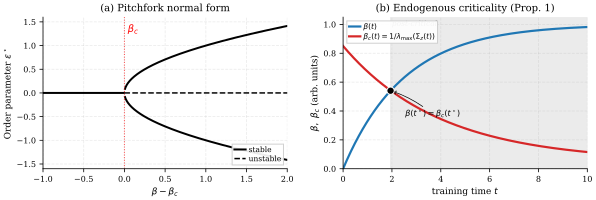

# Yang 2026 — Feature Lottery? A Bifurcation Theory of Concept Emergence

See also: [the global concept index](../../concepts/index.md).

**Fuming Yang** (MIT; fumingy@mit.edu).

arXiv [2605.24057](https://arxiv.org/abs/2605.24057), May 2026 (v1), 40 pages, 18 figures, 8 tables. Citations by Semantic Scholar — 0, in the corpus — 0. A single-author work: the emergence of structure in a representation is identified with a supercritical pitchfork bifurcation of the Hessian of a passive Gaussian mixture hung on the output of the encoder; the single formula — the critical precision $\beta_{c}=1/\lambda_{\max}(\mathrm{Cov}(z))$ — gives a label-free phase coordinate $\beta(t)/\beta_{c}(t)$. One frame covers SAEs on top of Pythia, self-supervised learning on CIFAR and grokking: grokking is a regime of "delayed escape", decomposed into three acts (the crossing within ~40 steps; a metastable plateau; an escape from a saddle governed by the dissipation: $\tau_{\mathrm{esc}}\propto\mathrm{WD}^{-1.23}$, and at WD$=0$ there is no escape at all at $\log(\beta/\beta_{c})=+6.07$). The second claim is the SAE "feature lottery": the fate of an atom is decided at the bifurcation and is predictable by 5 % of the training ($\rho_{\mathrm{id}}=+0.41\pm 0.04$).

The files of this paper's analysis:

- [`2605.24057.feature-lottery-a-bifurcation-theory-of-concept-emergence.license.txt`](2605.24057.feature-lottery-a-bifurcation-theory-of-concept-emergence.license.txt) — the arXiv licence record for this paper.

The anchor scheme and the rules for linking into a card are in the [README of the papers folder](../README.md).

**Excerpt card.** The paper's licence (`arxiv-nonexclusive`) does not permit republishing the paper itself; what stands here are the editorial sections and the fragments the corpus quotes (right of quotation). The paper: <https://arxiv.org/abs/2605.24057>.

## Concepts covered

**[Grokking](../../concepts/grokking.md)** — a reinterpretation: the reading "the model suddenly acquires generalisation" is called mistaken — the model becomes *capable* of generalising within ~40 steps (the crossing $\beta=\beta_{c}$ in all 15 runs, including the control without weight decay, with a spread of $\sigma\approx 2$ steps) and then spends thousands of steps climbing off the saddle; the plateau is a post-critical metastability rather than under-training; at step 100 the coordinate already places the run in act 2, some ~8 400 steps before the shift of the test accuracy ([`p9-3`](#p9-3)). The analysis: remark 1 about the metastability is a remark, not a theorem (the argument is a one-dimensional Langevin model with admitted assumptions); there is no connection with the rest of the grokking corpus at all — 22 sources and not one work on the mechanism of the delay, and the claim of a "rigorous dynamical account" is made without a comparison against the existing explanations; and the NC1 axis on which the plateau is visible is computed for grokking over the $p$ output classes, that is, over the labels — what is label-free is the coordinate itself, not the picture it is set against.

**[Phase transition](../../concepts/phase-transition.md)** — the apparatus: the Hessian of the negative likelihood of a passive $K$-prototype GMM in the symmetric collapsed state splits into an always stable symmetric channel and a $(K{-}1)$-fold degenerate antisymmetric one with the spectrum $(\beta/K)(1-\beta\sigma_{i}^{2})$, which loses stability at $\beta_{c}=1/\lambda_{\max}(\mathrm{Cov}(z))$; the projection onto the slow direction gives the normal form of a pitchfork, the endogenous crossing $\beta(t)=\beta_{c}(t)$ is proved by a continuity argument (proposition 1), and the four kinematic regimes of the trajectory (a full V, a bend, a delayed escape, no arc at all) are enumerated over three binary axes ([`p5-3`](#p5-3)). The analysis: "there can be no fifth form" is admitted to be a modelling assumption rather than a theorem; the proof of proposition 1 leans on "$\beta(0)<\beta_{c}(0)$ in all our experiments", yet appendix G reports a supercritical start for the Pythia activations ($+2.6$) and section 4.1 for the ResNet on CIFAR-10 ($+3.9$); the subsections of appendix E are numbered C.1–C.6 in the PDF itself; and "four of the five" against "all five" eigenvalues in the text and the caption.

**[Weight decay](../../concepts/weight-decay.md)** — the decisive separation of supercriticality from the transition: a controlling experiment with six levels of WD (three seeds each, a horizon of 200 000 steps) gives a monotone fall of the escape time from 147 167 to 8 900 steps — two decades of the plateau's length; the power law $\tau_{\mathrm{esc}}\propto\mathrm{WD}^{-1.23}$ fits to within ~10 % at every level, and the Kramers form is rejected with $\Delta\mathrm{AIC}=+19.3$; the WD$=0$ control does not escape on any seed within 50 000 steps at $\log(\beta/\beta_{c})=+6.07$ — higher than in any grokked run ([`p10-2`](#p10-2)). The analysis: the conclusion "the escape is governed by drift rather than by the crossing of a barrier" is a fit of six points by two two-parameter forms with no microscopic check (admitted); the exponent $-1.23$ is declared an empirical characteristic of the setting rather than a prediction of the frame — from remark 1 only monotonicity and a divergence as WD$\to 0$ follow; and there is a direct disagreement with 2606.17120 (where the delay is an Arrhenius waiting with a temperature lr/batch, whereas here the Kramers form is rejected) — resolvable by experiment.

**[Progress measures](../../concepts/progress-measures.md)** — a label-free phase coordinate $\beta(t)/\beta_{c}(t)$, computed only from the hidden states and a passive probe: it reads off the current act of a run (subcritical, metastable, escaping), in the DINO diagnostics it leads the cluster accuracy by ~8 epochs under a gradual degradation and responds within a single batch to a catastrophic intervention while the loss swings uninterpretably; the robustness to the arbitrariness of the probe — the steps of acts 1 and 3 do not change at all for $K_{\text{probe}}\in\{2,\dots,50\}$ ([`p11-1`](#p11-1)). The analysis: the "lead of 48 epochs" for tiny_batch is a discrepancy without a predicted sign (the author himself writes "regardless of the sign"), and calling it a lead is not permissible; the whole diagnostic part is one seed per regime with thresholds chosen after the fact (the ROC is left for future work); and the negative control "no arc" has $r=-0.48$ at $n=300$ — not negligible, whereas the "full V" rests on nine points.

## What is shown and what is conjectured

These are the card editor's remarks, not the authors' text, drawn from a numbered pass over the paper's claims.

**The strong point — the separation of the loss of stability from the observed transition.** Thirteen strong confirmed predictions — a record for the corpus: the universal early crossing (34–60 steps in all runs), the two-decade WD control of the plateau, the decisive WD$=0$ control (supercriticality without a transition), the robustness to $K_{\text{probe}}$, the numerical check of proposition 2 ($\rho=+0.948\pm 0.006$), and, in the SAE part, the lottery with a check against frequency confounding (the maximum in Q4 rather than Q5), the specificity (only the POS purity is predictive, not the concentration of the activations) and an honest renunciation of the author's own inflated measure $\rho_{H}$ in favour of the uninflated $\rho_{\mathrm{id}}$; together with the author's refusal to recommend a small $K$ despite the favourable numbers.

**Headline multipliers and unclosed seams.** "12 times above the base level" is a division by the uniformly random $1/15$, whereas the honest quantity of the early selection is $+0.33$ of absolute purity (the top decile $0.82$ against the bottom $0.47$, about 1.7 times); $\rho_{\mathrm{id}}$ is given with three different spreads in three places; the conclusion about the drift regime of the escape is a fit, not a prediction; and grokking is analysed on one task and one architecture.

**How the work will be cited** ("it is proved that grokking is an escape from a metastable state") — more precisely: on modular addition it is shown that supercriticality is reached within ~40 steps, that the time of the transition is monotonically controlled by weight decay and that at zero weight decay there is no transition — and the fitted law itself is declared by the author not to be a prediction of the frame.

---

# Quoted fragments

Only the fragments the corpus cards refer to are
reproduced here (right of quotation); the paper's licence does not permit
republishing the whole text. Anchor numbering matches the original.

###### p5-3

The lowest such eigenvalue is $\lambda^{\perp}_{1}(\beta)=(\beta/K)(1-\beta\,\lambda_{\max}(\Sigma))$, and crosses zero exactly at the critical precision in equation equation 1. The unstable direction is the principal eigenvector of $\Sigma$ in spatial space combined with any anti-symmetric $w$ in component space. Projecting the dynamics onto this slow direction yields the supercritical pitchfork normal form

$$
\dot{\varepsilon}\;=\;(\beta-\beta_{c})\,\varepsilon\;-\;\alpha\,\varepsilon^{3}\;+\;\text{noise},\quad\alpha>0, \tag{5}
$$

shown in Fig. 1(a). A full derivation, including the parametrization correction relative to Rose et al. [1990] and the explicit eigendecomposition in component space (Theorem 1), is in Appendix A (§A.1).

*Figure 1: Theory. **(a)** The supercritical pitchfork at $\beta_{c}$: below $\beta_{c}$ the symmetric collapsed state is stable; above $\beta_{c}$ it becomes a saddle and two stable broken-symmetry branches emerge. **(b)** Endogenous criticality (Proposition 1): when the encoder is itself learning, $\beta_{c}(t)$ co-evolves with $\mathrm{Cov}(z(t))$; under mild monotonicity assumptions $\beta(t)$ and $\beta_{c}(t)$ must cross at some finite time $t^{\star}$.* **[p. 5]**

###### p9-3

The previous reading of grokking, “the model suddenly acquires generalization at some moment,” is misleading; the model becomes *eligible* to acquire it within the first $\sim 40$ steps and then spends thousands of steps trying to escape a saddle. Grokking on modular arithmetic is the cleanest empirical realization of this three-act picture.

###### p10-2

At sufficiently long horizon ($200{,}000$ steps), all configurations with WD$>\!0$ escape in $3/3$ seeds, but the escape time is strongly monotonic in WD: $\tau_{\mathrm{esc}}$ rises from $8\,900$ steps at WD$=\!1.0$ to $147\,167$ steps at WD$=\!0.1$, while WD$=\!0$ fails to escape in $0/3$ seeds within $50{,}000$ steps. The full sweep fits a power-law $\tau_{\mathrm{esc}}\propto\mathrm{WD}^{-1.23}$ ($\Delta\mathrm{AIC}=+19.3$ over the Kramers form equation 15; Table 3, App. C). The WD$=$0 control reaches $\log(\beta/\beta_{c})\!=\!+6.07$, higher than any grokked run, yet NC1 grows to $\sim\!10^{8}$ and test accuracy stays at $\sim\!0.01$ in all three seeds; the metastable plateau is a saddle that requires dissipation to escape. Beyond the weight-decay axis, escape time also scales predictably with the modulus $p$ and the training fraction (Table 2). At escape, $\log_{10}\mathrm{NC1}$ drops from $\approx 6.7$ to $\approx 2.4$ over a few hundred training steps while $\log(\beta/\beta_{c})$ moves by less than $1$ log-unit; the entire post-critical descent shape of Sec. 4.1 is compressed into this narrow window.

*Table 2: Grokking experiments, mean $\pm$ std across $n\!=\!3$ seeds. Act 1 (the $\beta\!=\!\beta_{c}$ crossing) is universal and tight ($\sigma\!\approx\!2$); Act 3 escape time spans more than an order of magnitude in WD. Full WD sweep at the $200{,}000$-step horizon is in Table 3; the WD$=\!0$ control fails to escape within $50{,}000$ steps in all $3/3$ seeds.* **[p. 10]**

| **Config** | **Memo** | **Act 1: $\beta\!=\!\beta_{c}$** | **Act 3: grok** | **Final $\log(\beta/\beta_{c})$** | $n_{\mathrm{grok}}$ |
|---|---|---|---|---|---|
| $p\!=\!97$, WD$=$1.0 (canonical) | $253\!\pm\!6$ | $37\!\pm\!2$ | $8\,900\!\pm\!864$ | $+4.49\!\pm\!0.47$ | $3/3$ |
| $p\!=\!113$, WD$=$1.0 | $297\!\pm\!49$ | $39\!\pm\!2$ | $6\,633\!\pm\!1\,461$ | $+4.88\!\pm\!0.45$ | $3/3$ |
| $p\!=\!97$, WD$=$0.3 (weak) | $263\!\pm\!2$ | $36\!\pm\!2$ | $38\,150\!\pm\!4\,250$ | $+4.07\!\pm\!0.46$ | $3/3$ |
| $p\!=\!97$, train$=$0.5 | $242\!\pm\!52$ | $54\!\pm\!6$ | $1\,250\!\pm\!398$ | $+4.45\!\pm\!0.54$ | $3/3$ |
| $p\!=\!97$, WD$=$0 (control) | $273\!\pm\!8$ | $36\!\pm\!2$ | **never** | $+6.07\!\pm\!0.17$ | $\mathbf{0/3}$ |

###### p11-1

At any training step during a grokking run, $\log(\beta/\beta_{c})$ identifies the system’s current act: pre-critical (Act 1, $\log(\beta/\beta_{c})\!<\!0$), post-critical metastable (Act 2, $\log(\beta/\beta_{c})\!>\!0$ with NC1 on the plateau), or escaping (Act 3, NC1 descending). At step 100 of the canonical run, $\log(\beta/\beta_{c})\!=\!+3$ already places the system in Act 2: the trajectory has become *eligible to grok*, $\sim 8\,400$ training steps before test accuracy provides any signal. Combined with the dissipation strength of the encoder (a known hyperparameter), the indicator predicts both whether grokking will occur (no escape at WD$=\!0$, Tab. 2) and roughly when ($\tau_{\mathrm{esc}}\propto\mathrm{WD}^{-1.23}$, spanning $8\,900$ steps at WD$=\!1.0$ to $147\,167$ at WD$=\!0.1$; Tab. 3). This is prediction in the operational sense: from the indicator and the dissipation strength, both readable at step $100$, the trajectory’s downstream state is forecastable orders of magnitude before $\mathrm{test\_acc}$, $\mathrm{train\_acc}$, or the training loss show any sign of the transition.
