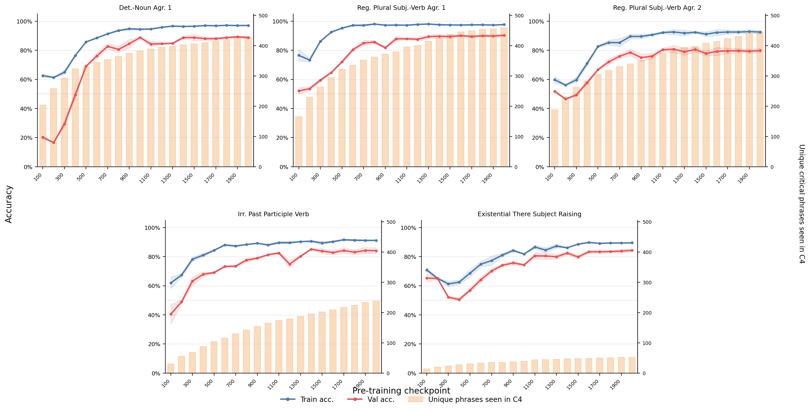
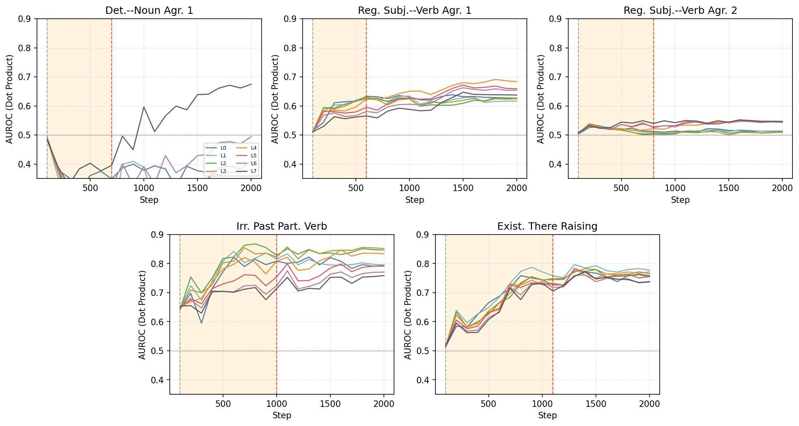
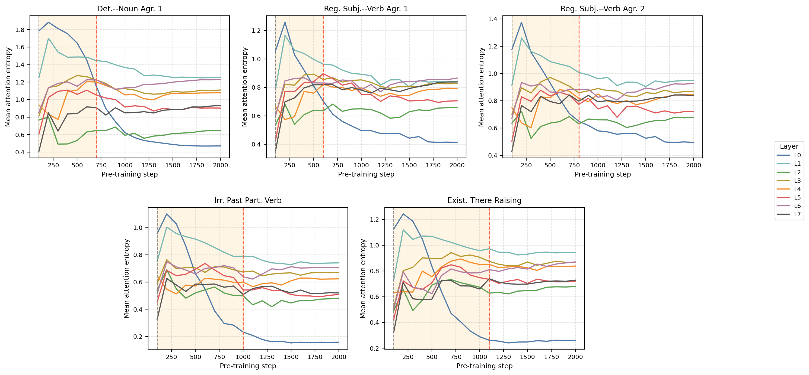
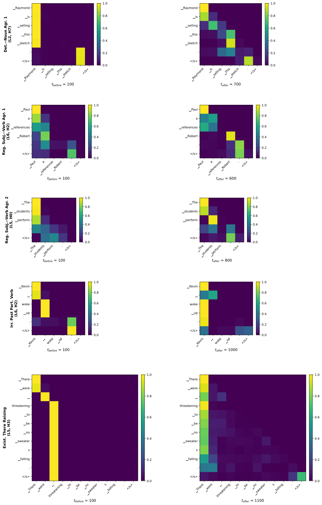

# A Pre-Training Analogue of Grokking in Language Models: Tracing Delayed Grammatical Generalization

Sherin Muckatira Namrata Shivagunde Vijeta Deshpande Anna Rumshisky Affiliation: University of Massachusetts Lowell Email: sherinbojappa_muckatira@student.uml.edu

## Abstract

Grokking, the phenomenon in which neural networks generalize long after fitting their training data, has been studied in supervised settings on many epochs. LLM pre-training instead involves next-token prediction over an unlabeled corpus, with limited data repetition and no explicit train/validation split. To address this, we propose an exposure-based framework that enables the study of grokking-like dynamics during LLM pre-training. We ground our evaluation in BLiMP minimal pairs, which provide controlled grammatical contrasts. For every BLiMP minimal pair, we identify a critical phrase, the smallest continuous span that captures the grammatical contrast and the phenomenon-relevant context. Examples whose critical phrase appears in the pre-training window are assigned to the proxy-train split; the remaining examples are assigned to the proxy-validation split. Across five grammatical phenomena, we observe delayed generalization. Analyzing pre-training checkpoints before and after generalization shows that grammatical concept vectors become more predictive of grammatical acceptability and occupy a higher-dimensional subspace after generalization. We also find that attention from the critical token to the relevant context token is concentrated in a small number of heads.

*Figure 1: Delayed-generalization curves and cumulative C4 exposure for the analyzed BLiMP phenomena. Blue and red lines show mean accuracy on the proxy-train (exposed), and proxy-validation (unexposed) splits across three random seeds; x-axis shows training steps; shaded bands indicate $\pm 1$ standard error. Orange bars show the cumulative number of unique critical phrases encountered in the C4 pre-training stream up to each checkpoint. Across phenomena, proxy-train accuracy rises before proxy-validation accuracy.* **[p. 2]**

## 1 Introduction

Grokking is a phenomenon in neural networks where models transition from fitting training examples to generalizing to held-out examples. In the classical setting, models are trained for many epochs on a fixed supervised train split and evaluated on a held-out validation split drawn from the same task distribution (Power et al., 2022). This delayed transition provides a well-defined behavioral boundary for analyzing internal changes associated with the onset of generalization.

However, classical grokking is defined with respect to a particular task: models are trained on a subset of task examples and delayed generalization is measured on held-out examples from the same task. This setting does not directly carry over to language-model pre-training. During pre-training, the model is optimized for next-token prediction over a large unlabeled corpus, rather than trained directly on labeled examples from the downstream evaluation task. As a result, there is no natural supervised train/validation split over downstream examples. To bring the classical grokking formulation into the pre-training setting, we construct an exposure-based proxy split over downstream evaluation datasets.

We address this problem by constructing an exposure-based proxy split for studying delayed generalization during language-model pre-training. We use grammar as a test case because grammatical dependencies are structured, measurable, and can be tested using controlled minimal-pair datasets. In particular, we use BLiMP (Warstadt et al., 2020), where each example contains an acceptable sentence and a minimally different unacceptable sentence targeting a specific grammatical phenomenon. For each minimal pair, we extract a critical phrase: a contiguous span that contains the grammatical difference and the context needed to evaluate the grammatical dependency. We then assign examples to either a proxy-train split if the critical phrases appear verbatim in the C4 (Raffel et al., 2020) tokens seen during the analyzed pre-training window, or to a proxy-validation split otherwise.

This split does not imply that the model has never seen the relevant grammatical rule. It only distinguishes examples with verbatim critical-phrase exposure from examples without such exposure. This gives a pre-training analogue of the classical grokking setup: the model may first perform well on examples with direct phrase exposure and only later improve on examples without direct **[p. 2]** exposure.

Using this framework, we study early pre-training checkpoints of 35M, 60M, and 130M parameter LLaMA-style language models on five BLiMP grammatical phenomena. We first measure whether examples with verbatim critical-phrase exposure reach high accuracy before examples without such exposure, and test this effect against matched random splits that preserve split sizes. We then analyze grammar-specific contrast representations and attention patterns before and after the delayed-generalization transition to ask whether the behavioral lag is accompanied by changes in the model representations of grammatical concepts and attention patterns. We find that proxy-train accuracy consistently reaches high accuracy before proxy-validation accuracy, revealing delayed generalization. Checkpoint-level analyses further show that this transition is accompanied by changes in grammar-specific concept vectors and attention-to-context patterns.

Our contributions are:

1. We introduce an exposure-based framework for studying grokking-like delayed generalization during language-model pre-training.
2. We show that, across five grammatical phenomena, examples with verbatim critical-phrase exposure reach high accuracy before examples without such exposure.
3. We validate this effect with matched random-split permutation tests, showing that the observed lag is not explained by split size alone.
4. We show that the transition is accompanied by changes in grammar-specific concept vectors and attention-to-context patterns.

## 2 Related Work

#### Grokking and delayed generalization.

Grokking was introduced as a delayed transition from memorization to generalization, where models first reach high training accuracy while validation accuracy remains low, and only later generalize to held-out examples (Power et al., 2022). Most prior work studies this behavior in controlled settings with explicit train/validation splits, such as modular arithmetic and other algorithmic tasks (Gromov, 2023; Nanda et al., 2023). Mechanistic analyses suggest that the behavioral transition can be preceded by internal changes in circuits or representations (Nanda et al., 2023). Subsequent work extends grokking to richer language-like synthetic tasks involving hierarchical structure (Murty et al., 2023). We study a pre-training setting in which the model **[p. 3]** is trained on next-token prediction over natural language, rather than directly on a supervised downstream task.

#### Grokking-like dynamics during language-model pre-training.

Recent work has begun to ask whether grokking-like dynamics occur during language-model pre-training. Li et al. (2026b) analyze grokking in large mixture-of-experts models. However, they evaluate on downstream tasks after applying LoRA fine-tuning, making it unclear whether the observed dynamics are due to pre-training alone. They also define grokking solely via training loss, without a validation split. Lv et al. (2025) argue that language models develop copying ability in a grokking-like manner, with induction heads emerging during pre-training. These works move grokking beyond synthetic tasks, but they do not directly adapt the classical train/validation formulation to downstream evaluation examples. We address this gap by constructing an exposure-based proxy split: downstream evaluation examples are separated according to whether their critical phrases appear verbatim in the pre-training corpus. This lets us measure whether performance improves first on examples with direct corpus exposure and only later on examples without such exposure.

#### Linguistic generalization and representation geometry.

BLiMP provides controlled minimal pairs for evaluating grammatical knowledge in language models. Prior work using BLiMP shows that different grammatical phenomena follow different learning trajectories across checkpoints (Bunzeck and Zarrieß, 2024). We use BLiMP for a different purpose: to test whether grammatical minimal pairs exhibit delayed generalization during pre-training.

#### Representational geometry during learning.

Prior work suggests that generalization can be accompanied by changes in the geometry of model representations. Studies of transformer training dynamics find that hidden-state geometry changes over training, including shifts in anisotropy, intrinsic dimensionality, and overall representation complexity (Razzhigaev et al., 2024; Li et al., 2026a). Rather than measuring the geometry of hidden-state representations across all tokens, we focus on grammar-specific concept vectors. This is motivated by work that treats concepts or behaviors as directions in activation space (Park et al., 2024; Rimsky et al., 2024). In our use of concept vectors, we do not aim to steer the model or to establish a general theory of linear representations. Instead, we use grammar-specific concept directions as a diagnostic tool for tracking how the separability and dimensional structure of grammatical concepts change across pre-training checkpoints.

## 3 Method

In this section, we describe the pre-training setup, the exposure-based proxy split used to measure delayed generalization, and checkpoint-level representation and attention analyses.

### 3.1 Pre-training and Evaluation Setup

We train LLaMA-style decoder-only language models (Touvron et al., 2023) with 35M, 60M, and 130M parameters from the codebase released by Zhao et al. (2024). Models are trained on English C4 (Raffel et al., 2020) with context length 256 and batch size 512, for 2000 steps with checkpoints every 100 steps. The model is trained on approximately 200M non-padding tokens. We use a cosine learning-rate schedule. The 35M and 60M models use learning rate $10^{-3}$, and the 130M model uses learning rate $5\times 10^{-4}$. The 60M model is trained with three independent random seeds and is used for the main checkpoint-level analyses; the 35M and 130M models are used as scale robustness checks.

At each checkpoint, we evaluate on BLiMP using the EleutherAI evaluation harness (Gao et al., 2024). Each BLiMP example is a minimal pair containing one acceptable and one unacceptable sentence. The model is correct if it assigns a higher probability to the acceptable sentence, making the chance accuracy 50%. We focus on the first 2000 pre-training steps because we do not want to analyze the fully saturated regime, but rather compare model behavior before and after proxy-validation accuracy begins to improve. We train our models on one NVIDIA RTX ADA 6000 48 GB GPU.

### 3.2 Exposure-Based Proxy Split

For each BLiMP minimal pair, we extract a *critical phrase*: a contiguous span containing the token that differs between the acceptable and unacceptable sentence, together with the context needed to evaluate the grammatical dependency. We extract critical phrases from both the acceptable and unacceptable sentences, lowercase them, and strip trailing punctuation. Dataset-specific extraction rules and examples are provided in Appendix A.1.

**[p. 4]**

We define exposure by exact critical-phrase overlap with the C4 tokens seen during the analyzed pre-training window. A BLiMP example is assigned to the proxy-train, or exposed, split if either its acceptable or unacceptable critical phrase appears verbatim in C4 during this window. It is assigned to the proxy-validation, or unexposed, split otherwise. This exposure-based splitting procedure captures only verbatim critical-phrase exposure; it does not imply that the model has never seen the underlying grammatical rule or related constructions.

### 3.3 Delayed-Generalization Measurement

Let $A_{\mathrm{train}}(t)$ and $A_{\mathrm{val}}(t)$ denote accuracy on the proxy-train and proxy-validation splits at checkpoint $t$, and let $\tau$ be an accuracy threshold. We define

$$
t_{\mathrm{train}}(\tau) =\min\{t:A_{\mathrm{train}}(t)\geq\tau\}, \\
t_{\mathrm{val}}(\tau) =\min\{t:A_{\mathrm{val}}(t)\geq\tau\}.
$$

The delayed-generalization lag is

$$
\Delta t(\tau)=t_{\mathrm{val}}(\tau)-t_{\mathrm{train}}(\tau).
$$

We use $\tau=80\%$ as the primary threshold because BLiMP is binary and 80% represents substantial above-chance performance while still being reached within the analyzed checkpoint range. Since checkpoints are saved every 100 steps, transition times are checkpoint-level estimates. For representation and attention analyses, we set $t_{\mathrm{before}}=100$ and $t_{\mathrm{after}}=t_{\mathrm{val}}(80\%)$. For the 60M model, we compute $t_{\mathrm{after}}$ separately for each seed and use the median value for interpretability analyses. Appendix Table 5 reports split sizes and transition checkpoints across thresholds.

### 3.4 Dataset Selection

Studying delayed generalization requires a “Goldilocks” regime: the dataset must be neither so easy that accuracy saturates in the first few checkpoints, nor so hard that proxy-validation accuracy never reaches a meaningful threshold. We therefore select BLiMP datasets where a transition can be measured within our 2000-step checkpoint window.

We apply four filtering stages. We exclude datasets that generalize too early (mean accuracy over steps 100–300 $\geq 70\%$) or never reach high accuracy (peak accuracy $<80\%$); datasets for which the targeted grammatical contrast and context dependency cannot be captured by a sub-sentential critical phrase; datasets with fewer than 100 proxy-train examples after constructing the train/val splits, and datasets whose proxy-validation split never reaches 80%. These criteria select datasets where delayed generalization is measurable, but they do not condition on the proxy-train split improving before the proxy-validation split. This yields six eligible datasets.

After constructing the candidate datasets, we use the matched random-split test below as a lag-validation step. We retain datasets whose exposure-based lag is significant at $p<0.05$ in at least two seeds. This excludes Determiner–Noun Agreement 2, which shows zero lag and no significant seeds. The final analysis set contains five grammatical phenomena. Full selection details are provided in Appendix B.

### 3.5 Matched Random-Split Test

The observed lag between proxy-train and proxy-val examples could arise from split size or arbitrary differences between examples, rather than from corpus exposure. To test this, we compare the exposure-based split to matched random splits. For each dataset and seed, we generate 1000 random splits that preserve the number of proxy-train and proxy-val examples, but randomly reassign examples independently of critical-phrase exposure. For each random split, we recompute the checkpoint-level accuracy curves and measure the lag lag between the two groups reaching 80% accuracy. This yields a null distribution of lags expected from arbitrary splits with the same group sizes. We then compare the delayed-generalization lag of the exposure-based proxy-train/proxy-validation split to this null distribution using a one-tailed empirical $p$-value,

$$
p=\frac{c+1}{n+1},
$$

where $c$ is the number of random splits whose lag is greater than or equal to the observed exposure-based lag, and $n=1000$ is the number of random splits. Full seed-wise lags and $p$-values are reported in Appendix B.1.

### 3.6 Grammatical Concept Vectors Analyses

To analyze how grammatical information is represented across training, we construct grammatical concept vectors from grammatical and ungrammatical BLiMP pairs. For a given checkpoint and example $i$, let $h^{(i)}_{\mathrm{gram}}$ and $h^{(i)}_{\mathrm{ungram}}$ denote the model **[p. 5]** hidden states for the acceptable and unacceptable sentence. We define the concept vector $v_{i}$

$$
v_{i}=h^{(i)}_{\mathrm{gram}}-h^{(i)}_{\mathrm{ungram}}.
$$

Unless otherwise stated, hidden states are taken from the final layer at the last content-token position. Although these vectors are constructed from paired activation differences, we refer to them as grammatical concept vectors because they represent the grammatical concept expressed by each BLiMP minimal pair. This construction is motivated by work treating concepts and behaviors as directions in representation space (Park et al., 2024; Rimsky et al., 2024).

We analyze these vectors in two ways. First, we compute a mean-difference concept vector from the proxy-train split,

$$
\bar{v}_{t}=\frac{1}{N}\sum_{i=1}^{N}\left(h^{(i)}_{\mathrm{gram},t}-h^{(i)}_{\mathrm{ungram},t}\right),
$$

and evaluate whether this direction separates grammatical from ungrammatical sentences in the proxy-validation split. Similar to the mean-difference scoring approach of Zou et al. (2023), we score each sentence in the proxy-validation split by its dot product with $\bar{v}_{t}$ and report AUROC.

Second, we measure the effective rank of the mean-centered concept-vector matrix (Roy and Vetterli, 2007). For each checkpoint $t$, we form a matrix $V_{t}\in\mathbb{R}^{N\times d}$ where $N$ is the number of minimal-pair examples and $d$ is the hidden-state dimension. The $i$-th row of this concept-vector matrix is the example-level concept vector

$$
v_{i,t}=h^{(i)}_{\mathrm{gram},t}-h^{(i)}_{\mathrm{ungram},t}.
$$

We mean-center $V_{t}$ across examples and compute its singular values. Given nonzero singular values $\sigma_{1},\ldots,\sigma_{r}$, we normalize $\hat{\sigma}_{k}=\sigma_{k}/\sum_{j}\sigma_{j}$ and define

$$
\mathrm{\text{effective rank}}=\exp\left(-\sum_{k=1}^{r}\hat{\sigma}_{k}\log\hat{\sigma}_{k}\right).
$$

A higher effective rank indicates that the grammatical concept vectors are distributed across more independent directions.

### 3.7 Attention-to-Context Analysis

For each minimal pair, we identify the critical token $t_{\mathrm{critical}}$, whose form differs between the acceptable and unacceptable sentence, and the earlier context token $t_{\mathrm{context}}$, which is needed to determine the correct grammatical form. At each checkpoint, layer, and head, we extract the attention weight from $t_{\mathrm{critical}}$ to $t_{\mathrm{context}}$, averaged over all minimal pairs in the dataset. We then measure the change in this attention-to-context score from $t_{\mathrm{before}}$ to $t_{\mathrm{after}}$ and identify the heads with the largest increase. We also measure the attention entropy at $t_{\mathrm{critical}}$ to identify if attention becomes more spread out or concentrated after generalization.

## 4 Results

We first show that the exposure-based proxy split reveals delayed generalization. We then validate that this lag is not explained by split size alone using matched random-split tests. Finally, we analyze saved checkpoints throughout the early pre-training window, focusing on how grammatical concept vectors and attention-to-context patterns change before, during, and after the delayed-generalization transition.

*Figure 2: Concept-vector AUROC on the proxy-validation split across pre-training checkpoints. At each checkpoint, we compute a mean-difference vector from proxy-train minimal pairs and score proxy-validation sentences by their dot product with this vector. AUROC measures how well these scores separate grammatical from ungrammatical sentences using final-layer last-token representations.* **[p. 6]**

### 4.1 Exposure-Based Splits Reveal Delayed Generalization

Figure 1 shows accuracy on the proxy-train (exposed) and proxy-validation (unexposed) splits across early pre-training checkpoints averaged over three independently trained 60M-parameter models. Across the five analyzed BLiMP phenomena, the proxy-train split reaches high accuracy earlier than the proxy-validation split. This produces a positive delayed-generalization lag: examples whose critical phrases appear verbatim in the C4 pre-training window reach the 80% accuracy threshold before examples without verbatim critical-phrase exposure. The delayed-generalization lag varies by grammatical phenomenon. Some phenomena, such as *Regular Subject–Verb Agreement 1*, show relatively short lags, whereas *Irregular Past Participle Verbs* and *Existential There Subject Raising* show larger delays. We use the 80% accuracy threshold as the primary transition criterion.

We also run the same exposure-conditioned evaluation for the 35M and 130M models. In both settings, the proxy-train split generally reaches high accuracy before the proxy-validation split. The delayed-generalization lag varies across datasets **[p. 6]** and model sizes. These results show that the delayed-generalization lag is not specific to the 60M model. Delayed-generalization curves for these model sizes are shown in Appendix C.

###### p6-1

We validate the delayed-generalization lag using the matched random-split test described in Section 3.5; full seed-wise results are reported in Appendix B.1. Table 1 summarizes the results of the matched random split permutation tests. Five of the six eligible datasets show significant exposure-based delayed-generalization lags in at least two seeds. *Determiner–Noun Agreement 2* is the only eligible dataset with zero observed lag in all three seeds and no significant permutation-test result; we therefore exclude it from the main analysis and report it as a non-lagging eligible case. These results suggest that the observed delay is not explained by split size alone. Random splits with the same proxy-train/proxy-val sizes do not reproduce the exposure-based delayed-generalization lag. Instead, this lag is tied to whether the critical phrase was observed verbatim in the pre-training corpus.

*Table 1: Matched random-split permutation test results. Observed lag range is the range of delays, in training steps, between the proxy-train and proxy-validation splits reaching 80% accuracy across seeds. Significant seeds are those where the exposure-based lag exceeds the matched random-split null distribution at $p<0.05$. For *Subject–Verb Agreement 2*, one seed is excluded because the proxy-validation split does not reach 80% accuracy within the training window.* **[p. 6]**

| Dataset | Observed lag range | Significant seeds |
|---|---|---|
| Det.–Noun Agr. 1 | 100–500 | 2/3 |
| Det.–Noun Agr. 2 | 0 | 0/3 |
| Subj.–Verb Agr. 1 | 300–500 | 3/3 |
| Subj.–Verb Agr. 2 | 300–900 | 2/2 |
| Irr. Past Participle | 500–600 | 3/3 |
| Exist. There Raising | 400–500 | 3/3 |

*Figure 3: Effective rank of grammatical concept vectors across pre-training checkpoints for the five analyzed BLiMP phenomena. Higher effective rank indicates that the grammatical concept vectors span more independent directions in representation space. Dashed vertical lines mark $t_{\text{before}}=100$ and the dataset-specific $t_{\text{after}}$; the shaded region marks the delayed-generalization window.* **[p. 7]**

### 4.2 Concept Vectors Capture Grammatical Separability

Figure 2 tracks how well grammatical concept vectors separate grammatical from ungrammatical sentences on the proxy-validation split across early pre-training checkpoints. At each checkpoint, we compute a mean concept vector from proxy-train minimal pairs and score proxy-validation sentences by their dot product with this vector as described in section 3.6. Higher AUROC indicates that grammatical and ungrammatical sentences are more separable along the concept-vector direction.

###### p6-3

Across the five analyzed phenomena, separability generally strengthens during pre-training, but the trajectory differs by phenomenon. *Determiner–noun agreement*, *Regular subject–verb agreement 1*, and *Existential-there subject raising* show the clearest increases. Irregular past participles are already separable early and remain well above chance. *Regular subject–verb agreement 2* **[p. 7]** remains closer to chance. Overall, these results show that separability along grammatical concept vectors generally improves during pre-training, but the strength and timing of this improvement vary across grammatical phenomena. Results across all layers are provided in Figure 7 in the appendix.

### 4.3 Concept Vectors Become More Distributed After Generalization

We next ask how grammar-specific concept vectors change in dimensionality during and after delayed generalization. Rather than analyzing hidden states directly, we analyze concept vectors computed as differences between grammatical and ungrammatical BLiMP sentences as described in section 3.6.

###### p7-2

Figure 3 shows that the effective rank of grammatical concept vectors generally increases during early pre-training. At $t_{\text{before}}$, the rank is lower, suggesting that the grammatical concept is concentrated in a smaller number of dominant directions. During the delayed-generalization window, the rank fluctuates. We use the dataset-specific $t_{\text{after}}$ values reported in Table 7. After $t_{\text{after}}$, the effective rank increases and remains higher than at $t_{\text{before}}$ across all five agreement datasets. This pattern suggests that after delayed generalization, the grammatical concept vector is represented across a higher-dimensional subspace. Prior work (Li et al., 2026a; Razzhigaev et al., 2024) has shown that hidden-state representations can become more compressed after generalization. In our analysis, we find that for these concept vectors, effective rank generally increases after delayed generalization, suggesting that the grammatical concept does not collapse into a few dominant directions. Instead, the grammatical concept vectors become distributed across more directions. Results across all layers are provided in Figure 8 in the appendix.

### 4.4 Attention-to-Context Changes Around Delayed Generalization

*Figure 4: Average attention-to-context score across pre-training checkpoints. Each panel shows one BLiMP phenomenon; each line shows one layer, averaged over all 8 heads. The score is the attention weight from the critical token $t_{\text{critical}}$ to the earlier context token $t_{\text{context}}$ that determines the relevant grammatical dependency.* **[p. 8]**

We next ask whether the delayed-generalization transition is reflected in token-to-token attention patterns. In particular, we test whether the critical token attends more strongly to the earlier context token needed to determine the grammatical dependency.

###### p7-4

Figure 4 shows the average attention-to-context score across early pre-training checkpoints. Rather than showing a uniform increase across all layers and heads, the attention changes are localized: some layers show clear increases around the delayed-generalization transition, while others remain stable or decrease. The largest attention-to-context changes are concentrated in a small number of heads, and the strongest heads differ across phenomena, as shown in Table 8. The full layer–head results are provided in Appendix Table 9.

*Determiner–noun agreement* shows the strongest increase in an early layer, whereas the **[p. 8]** *Subject–verb* phenomena show their strongest increases in later layers. Appendix Figure 9 shows that attention entropy also fluctuates early and then often stabilizes or decreases after $t_{\mathrm{after}}$. Representative token-level heatmaps in Appendix Figure 10 show a qualitative pattern: after $t_{\mathrm{after}}$, selected heads attend more strongly to dependency-relevant context tokens. Together, these results suggest that delayed grammatical generalization is accompanied by a localized and phenomenon-specific reorganization of attention, rather than a uniform shift toward more concentrated attention.

## 5 Conclusion

We studied whether grokking-like delayed generalization can be observed during standard language-model pre-training. Because pre-training does not provide an explicit supervised train/validation split, we constructed an exposure-based proxy split over BLiMP minimal pairs: examples whose critical phrases appear verbatim in the C4 pre-training window form the proxy-train split, while the remaining examples form the proxy-validation split.

Using this split, we find a pre-training analogue of grokking. Unlike the prolonged many-epoch train–validation gap often studied in classical supervised grokking, our setting reveals a checkpoint-level lag between exposed and unexposed evaluation examples. Across five grammatical phenomena, proxy-train split reaches high accuracy before proxy-validation accuracy, and matched random-split tests suggest that this lag is not explained by the split size alone.

Checkpoint-level analyses further show that this behavioral transition is accompanied by changes in grammar-specific contrast representations and attention-to-context patterns. Concept-vector analyses show that grammatical and ungrammatical examples become more separable across pre-training, and these concept vectors become distributed across a higher-dimensional representation subspace after generalization. Attention analyses show increased attention from the critical token to the context token needed to resolve the grammatical dependency, with the largest changes concentrated in different heads across phenomena. Together, these results suggest that corpus exposure can be used to study grokking-like delayed generalization during pre-training.

## 6 Ethical considerations

This work uses publicly available datasets: C4 for pre-training and BLiMP for evaluation. We use these resources for research and evaluation under their respective terms of use. We do not redistribute matched C4 documents or extracted text. The study is focused on understanding language-model training dynamics, and we do not foresee direct negative societal impacts.

## Limitations

Our framework relies on exact critical-phrase overlap as a proxy for exposure. It does not mean that the model has never seen the same grammatical rule in other sentences. **[p. 9]** Thus, the proxy validation split should be interpreted as examples without verbatim critical-phrase exposure, not as examples with entirely unseen grammar.

This work tests the framework on grammatical phenomena, where BLiMP minimal pairs make it possible to define a sub-sentential critical phrase. Future work could extend this framework beyond grammar to other settings where the relevant behavior can be linked to a sub-sentential phrase or span.

## References

- Bunzeck and Zarrieß (2024) B. Bunzeck and S. Zarrieß Fifty shapes of BLiMP: syntactic learning curves in language models are not uniform, but sometimes unruly. In Proceedings of the 2024 CLASP Conference on Multimodality and Interaction in Language Learning, A. Qiu, B. Noble, D. Pagmar, V. Maraev, and N. Ilinykh (Eds.), Gothenburg, Sweden, pp. 39–55. External Links: Link Cited by: §2.

- Gao et al. (2024) L. Gao, J. Tow, B. Abbasi, S. Biderman, S. Black, A. DiPofi, C. Foster, L. Golding, J. Hsu, A. Le Noac’h, H. Li, K. McDonell, N. Muennighoff, C. Ociepa, J. Phang, L. Reynolds, H. Schoelkopf, A. Skowron, L. Sutawika, E. Tang, A. Thite, B. Wang, K. Wang, and A. Zou The language model evaluation harness. Zenodo. External Links: Document, Link Cited by: §3.1.

- Gromov (2023) A. Gromov Grokking modular arithmetic. arXiv preprint arXiv:2301.02679. Cited by: §2.

- Li et al. (2026a) M. Z. Li, K. K. Agrawal, A. Ghosh, K. K. Teru, A. Santoro, G. Lajoie, and B. A. Richards Tracing the representation geometry of language models from pretraining to post-training. In The Thirty-ninth Annual Conference on Neural Information Processing Systems, External Links: Link Cited by: §2, §4.3.

- Li et al. (2026b) Z. Li, C. Fan, and T. Zhou Grokking in LLM pretraining? monitor memorization-to-generalization without test. In The Fourteenth International Conference on Learning Representations, External Links: Link Cited by: §2.

- Lv et al. (2025) A. Lv, R. Xie, X. Sun, Z. Kang, and R. Yan Language models “grok” to copy. In Proceedings of the 2025 Conference of the Nations of the Americas Chapter of the Association for Computational Linguistics: Human Language Technologies (Volume 2: Short Papers), L. Chiruzzo, A. Ritter, and L. Wang (Eds.), Albuquerque, New Mexico, pp. 735–741. External Links: Link, Document, ISBN 979-8-89176-190-2 Cited by: §2.

- Murty et al. (2023) S. Murty, P. Sharma, J. Andreas, and C. Manning Grokking of hierarchical structure in vanilla transformers. In Proceedings of the 61st Annual Meeting of the Association for Computational Linguistics (Volume 2: Short Papers), A. Rogers, J. Boyd-Graber, and N. Okazaki (Eds.), Toronto, Canada, pp. 439–448. External Links: Link, Document Cited by: §2.

- Nanda et al. (2023) N. Nanda, L. Chan, T. Lieberum, J. Smith, and J. Steinhardt Progress measures for grokking via mechanistic interpretability. In The Eleventh International Conference on Learning Representations, External Links: Link Cited by: §2.

- Park et al. (2024) K. Park, Y. J. Choe, and V. Veitch The linear representation hypothesis and the geometry of large language models. In Forty-first International Conference on Machine Learning, External Links: Link Cited by: §2, §3.6.

- Power et al. (2022) A. Power, Y. Burda, H. Edwards, I. Babuschkin, and V. Misra Grokking: generalization beyond overfitting on small algorithmic datasets. arXiv preprint arXiv:2201.02177. Cited by: §1, §2.

- Raffel et al. (2020) C. Raffel, N. Shazeer, A. Roberts, K. Lee, S. Narang, M. Matena, Y. Zhou, W. Li, and P. J. Liu Exploring the limits of transfer learning with a unified text-to-text transformer. Journal of machine learning research 21 (140), pp. 1–67. Cited by: §1, §3.1.

- Razzhigaev et al. (2024) A. Razzhigaev, M. Mikhalchuk, E. Goncharova, I. Oseledets, D. Dimitrov, and A. Kuznetsov The shape of learning: anisotropy and intrinsic dimensions in transformer-based models. In Findings of the Association for Computational Linguistics: EACL 2024, Y. Graham and M. Purver (Eds.), St. Julian’s, Malta, pp. 868–874. External Links: Link, Document Cited by: §2, §4.3.

- Rimsky et al. (2024) N. Rimsky, N. Gabrieli, J. Schulz, M. Tong, E. Hubinger, and A. Turner Steering llama 2 via contrastive activation addition. In Proceedings of the 62nd Annual Meeting of the Association for Computational Linguistics (Volume 1: Long Papers), L. Ku, A. Martins, and V. Srikumar (Eds.), Bangkok, Thailand, pp. 15504–15522. External Links: Link, Document Cited by: §2, §3.6.

- Roy and Vetterli (2007) O. Roy and M. Vetterli The effective rank: a measure of effective dimensionality. Proceedings of the 15th European Signal Processing Conference, pp. 606–610. Cited by: §3.6.

- Touvron et al. (2023) H. Touvron, T. Lavril, G. Izacard, X. Martinet, M. Lachaux, T. Lacroix, B. Rozière, N. Goyal, E. Hambro, F. Azhar, et al. Llama: open and efficient foundation language models. arXiv preprint arXiv:2302.13971. Cited by: §3.1.

- Warstadt et al. (2020) A. Warstadt, A. Parrish, H. Liu, A. Mohananey, W. Peng, S. Wang, and S. R. Bowman BLiMP: the benchmark of linguistic minimal pairs for English. Transactions of the Association for Computational Linguistics 8, pp. 377–392. External Links: Link, Document Cited by: §1.

- Zhao et al. (2024) J. Zhao, Z. Zhang, B. Chen, Z. Wang, A. Anandkumar, and Y. Tian GaLore: memory-efficient LLM training by gradient low-rank projection. In Forty-first International Conference on Machine Learning, External Links: Link Cited by: §3.1.

- Zou et al. (2023) A. Zou, L. Phan, S. Chen, J. Campbell, P. Guo, R. Ren, A. Pan, X. Yin, M. Mazeika, A. **[p. 10]** Dombrowski, et al. Representation engineering: a top-down approach to ai transparency. arXiv preprint arXiv:2310.01405. Cited by: §3.6.

## Appendix A Appendix

### A.1 Critical Phrase Extraction

For each BLiMP minimal pair, we extract a *critical phrase*: the contiguous span that contains the token differing between the grammatical and ungrammatical sentences, together with the context needed to evaluate the grammatical dependency. The critical phrase extraction rule is defined separately for each grammatical phenomenon. For Determiner–Noun Agreement 1, we extract the span from the determiner to the changed noun. For Regular Plural Subject–Verb Agreement 1, we extract the span from the subject head noun to the changed verb. For Regular Plural Subject–Verb Agreement 2, we extract the span from the changed subject noun to the following verb. For Irregular Past Participle Verbs, the span is from the subject head noun to the changed verb form. For Existential There Subject Raising, we extract the sentence-initial existential construction through the predicate that determines whether the raising construction is licensed. Examples of critical phrases are shown in Table 2 in the appendix. For every minimal pair, we extract critical phrases from both the acceptable and unacceptable sentences. Before matching against C4, we lowercase the phrases and strip trailing punctuation.

*Table 2: Example BLiMP minimal pairs from the datasets used in this study. Each row shows one dataset with an acceptable sentence and its minimally different unacceptable counterpart.* **[p. 11]**

| **dataset** | **acceptable** | **unacceptable** | **critical phrases** |
|---|---|---|---|
| blimp_regular_plural_subject_verb_agreement_1 | Paula references Robert. | Paula reference Robert. | Paula reference; Paula references |
| blimp_regular_plural_subject_verb_agreement_2 | The students perform. | The student perform. | student perform; student performs |
| blimp_determiner_noun_agreement_1 | Raymond is selling this sketch. | Raymond is selling this sketches. | this sketch; this sketches |
| blimp_existential_there_subject_raising | There is soon to be a cat existing. | There is willing to be a cat existing. | There is soon to; There is willing to |
| blimp_irregular_past_participle_verbs | The mushroom went bad. | The mushroom gone bad. | The mushroom went; The mushroom gone |

Table 2 shows representative BLiMP examples from the datasets used in this work. Each row contains an acceptable sentence and a similar unacceptable sentence. The difference between the two sentences is used to extract the critical phrase for the exposure-based proxy split.

## Appendix B Candidate Dataset Selection

BLiMP contains 67 minimal-pair datasets spanning a range of grammatical phenomena. To study delayed generalization, we require datasets where a transition from near-chance to high accuracy is observable within our checkpoint range. We apply a multi-stage set of criteria to filter out the datasets to study.

#### Stage 1: Accuracy-based filtering.

We exclude datasets where the model already generalizes early in training (mean accuracy over steps 100–300 $\geq 70\%$; 19 datasets) and datasets where the model never reliably generalizes (peak accuracy $<80\%$; 27 datasets). Since BLiMP is a binary task (chance = 50%), 80% corresponds to 60% of the maximum above-chance performance. The accuracy criteria excludes 46 datasets. The remaining 21 candidate datasets are listed in Table 4.

#### Stage 2: Phrase extractability.

Our proxy-split methodology requires extracting a sub-sentential critical phrase whose presence in the C4 training corpus determines whether an example is assigned to the train or validation split. For 6 of the 21 candidates, the grammatical dependency spans the full sentence, making sub-sentential extraction inapplicable: *anaphor_number_agreement*, *anaphor_gender_agreement*, *principle_A_case_2*, *tough_vs_raising_2*, *coordinate_structure_constraint_object_extraction*, and *wh_island*. Since BLiMP sentences are synthetically generated and the benchmark was released after the C4 corpus used in the training of the models in the study was collected, full BLiMP sentences do not appear verbatim in C4, making full-sentence matching uninformative. This leaves 15 datasets with extractable sub-sentential phrases.

#### Stage 3: Minimum train split size.

After searching C4 for critical phrase matches, we require at least 100 examples in the train split to ensure a reliable accuracy curve. This stage excludes 4 datasets.

#### Stage 4: Validation convergence.

Finally, we require that the validation split accuracy reaches at least 80% by the end of training. Datasets where the validation curve does not converge indicate that the model fails to generalize beyond its training exposure, and therefore are not suitable for our study on grokking. This removes four additional datasets.

Table 3 reports the train and validation split sizes and peak validation accuracy for all datasets with extractable phrases, organized by which stage they are filtered out.

*Table 3: Proxy train/validation split sizes and peak proxy-validation accuracy for datasets with extractable sub-sentential critical phrases. Peak Val is the maximum proxy-validation accuracy across checkpoints, averaged over three seeds where available. Datasets are grouped by selection outcome: those passing all stages (top), those excluded by Stage 4 for insufficient validation convergence (middle), and those excluded by Stage 3 for fewer than 100 proxy-train examples (bottom). For datasets excluded at Stage 3, Peak Val is not reported because the proxy-train split is too small to form a reliable delayed-generalization curve.* **[p. 11]**

| **Dataset** | **Train** | **Val** | **Peak Val** |
|---|---|---|---|
| determiner_noun_agreement_1 | 873 | 127 | 89.2% |
| determiner_noun_agreement_2 | 883 | 117 | 92.6% |
| regular_plural_subject_verb_agreement_1 | 383 | 617 | 90.3% |
| irregular_past_participle_verbs | 234 | 766 | 85.1% |
| existential_there_subject_raising | 254 | 681 | 84.3% |
| regular_plural_subject_verb_agreement_2 | 476 | 524 | 80.8% |
| irregular_plural_subject_verb_agreement_1 | 501 | 499 | 75.3% |
| irregular_plural_subject_verb_agreement_2 | 634 | 366 | 75.4% |
| determiner_noun_agreement_irregular_1 | 778 | 222 | 53.6% |
| determiner_noun_agreement_irregular_2 | 837 | 163 | 79.8% |
| determiner_noun_agreement_with_adjective_1 | 19 | 981 | — |
| determiner_noun_agreement_with_adj_2 | 33 | 967 | — |
| determiner_noun_agreement_with_adj_irregular_2 | 43 | 957 | — |
| determiner_noun_agreement_with_adj_irregular_1 | 67 | 933 | — |
| only_npi_licensor_present | 0 | 1000 | — |
| superlative_quantifiers_1 | 0 | 1000 | — |

*Table 4: The 21 candidate BLiMP datasets that pass the initial accuracy-based filtering criteria: early accuracy below 70% and peak accuracy at least 80%. Early is the mean accuracy over steps 100–300; Peak is the maximum accuracy across all checkpoints; Final is the mean accuracy over steps 1600–2000.* **[p. 12]**

| **Dataset** | **Early** | **Peak** | **Final** |
|---|---|---|---|
| only_npi_licensor_present | 59.2% | 99.6% | 96.1% |
| anaphor_number_agreement | 47.4% | 98.2% | 97.1% |
| determiner_noun_agreement_1 | 56.7% | 96.0% | 95.7% |
| determiner_noun_agreement_2 | 50.3% | 95.1% | 93.3% |
| determiner_noun_agreement_with_adjective_1 | 58.0% | 94.5% | 94.2% |
| regular_plural_subject_verb_agreement_1 | 64.6% | 93.5% | 92.5% |
| superlative_quantifiers_1 | 38.1% | 93.5% | 64.0% |
| principle_A_case_2 | 55.8% | 92.7% | 91.0% |
| determiner_noun_agreement_with_adj_2 | 48.9% | 92.2% | 91.4% |
| regular_plural_subject_verb_agreement_2 | 52.1% | 90.7% | 88.6% |
| determiner_noun_agreement_irregular_2 | 54.0% | 89.1% | 86.2% |
| anaphor_gender_agreement | 32.7% | 88.9% | 88.5% |
| irregular_plural_subject_verb_agreement_2 | 57.7% | 88.4% | 87.4% |
| determiner_noun_agreement_with_adj_irregular_2 | 54.6% | 88.1% | 86.2% |
| irregular_past_participle_verbs | 60.9% | 87.1% | 82.3% |
| tough_vs_raising_2 | 65.7% | 85.5% | 83.5% |
| determiner_noun_agreement_with_adj_irregular_1 | 52.4% | 84.3% | 82.8% |
| existential_there_subject_raising | 57.4% | 84.1% | 83.6% |
| irregular_plural_subject_verb_agreement_1 | 53.3% | 81.8% | 80.7% |
| coordinate_structure_constraint_object_extraction | 50.6% | 81.7% | 80.9% |
| wh_island | 29.0% | 81.2% | 79.1% |

### B.1 Full permutation-test results

We perform a permutation test to evaluate whether the observed lag between exposed and unexposed examples is specific to the exposure-based proxy split. For each dataset and random seed, we preserve the sizes of the exposed and unexposed splits, but randomly reassign examples to the two groups independently of corpus exposure. **[p. 11]** This produces a null distribution over lags that would be expected from arbitrary splits of the same size.

For each of 1000 random permutations, we recompute the checkpoint-level accuracy curves for the two permuted groups. We then measure grokking strength which is defined as the lag, in training steps, between the first checkpoint at which the train and validation values reach 80% accuracy. The observed exposure-based lag is compared against this null distribution using a one-tailed empirical $p$-value,

$$
p=\frac{c+1}{n+1},
$$

where $c$ is the number of permutations whose lag is greater than or equal to the observed lag, and $n=1000$ is the number of permutations.

Table 6 reports the full seed-wise results. Five of six datasets show significant exposure-based lags in at least two seeds. Subject–Verb Agreement 1, Irregular Past Participle Verbs, and Existential There Subject Raising are significant in all three seeds. Determiner–Noun Agreement 1 is significant in two of three seeds. Subject–Verb Agreement 2 is significant in both seeds; the remaining seed is not evaluated because the unexposed split does not reach the 80% threshold within the training window. Determiner–Noun Agreement 2 is the only dataset with no significant seeds. These results show that the observed lags are not generally reproduced by arbitrary splits with the same group sizes.

### B.2 Dataset Summary

Appendix Table 5 reports the proxy-train and proxy-validation split sizes for each dataset, together with the proxy-validation transition checkpoints across thresholds from 70% to 90% on one seed.

*Table 5: Proxy train/validation split sizes and validation transition steps $t_{\text{after}}$ across different accuracy thresholds. Each threshold column reports the first saved pre-training checkpoint, in training steps, at which proxy-validation accuracy reaches that threshold. N/A indicates that the threshold is not reached within the 2000-step training window. Checkpoints are saved every 100 steps.* **[p. 13]**

|  |  |  | $t_{\text{after}}$ |  |  |  |  |
|---|---|---|---|---|---|---|---|
| Dataset | Train | Val | 70% | 75% | 80% | 85% | 90% |
| Det.-Noun Agr. 1 | 873 | 127 | 500 | 700 | 1000 | 1000 | 1400 |
| Reg. Plural Subj.-Verb Agr. 1 | 383 | 617 | 600 | 600 | 600 | 700 | 1300 |
| Reg. Plural Subj.-Verb Agr. 2 | 476 | 524 | 700 | 700 | 800 | 1200 | N/A |
| Irr. Past Participle Verb | 234 | 766 | 500 | 600 | 800 | 1400 | N/A |
| Existential There Subject Raising | 254 | 681 | 800 | 1100 | 1400 | N/A | N/A |

## Appendix C Effect of Scale on Delayed Generalization

*Figure 5: Delayed-generalization curves for the 35M model. Blue and red lines show accuracy on the proxy-train and proxy-validation splits, respectively.* **[p. 13]**

*Figure 6: Delayed-generalization curves for the 130M model. Blue and red lines show accuracy on the proxy-train and proxy-validation splits, respectively.* **[p. 14]**

**[p. 12]**

###### p12-1

Figures 5 and 6 confirm that grokking curves appear at both scales: training-split accuracy consistently leads validation-split accuracy. However, the dynamics differ across scales. The 35M model reaches the validation 80% threshold earlier than the 130M model on most datasets, despite being the smaller model. This could be due to the fixed-budget capacity effect: because all three models are trained for the same number of steps, smaller models see more tokens per parameter and are more capacity-constrained, which may force earlier extraction of generalizable patterns. Larger models may require more training before their additional capacity is converted into robust generalization.

Figures 5 and 6 show that the delayed-generalization pattern is also visible at other model scales. In both the 35M and 130M models, the proxy train split generally reaches high accuracy before the proxy validation split, indicating that the delayed-generalization pattern is not specific to the 60M model.

*Table 6: Full permutation-test results across three seeds. Lag is the number of training steps between the proxy-train and proxy-validation splits reaching 80% accuracy. The empirical p-value is computed as $(c+1)/(n+1)$, where $c$ is the number of 1000 matched random permutations with lag greater than or equal to the observed lag. The Sig. column reports the number of seeds with $p<0.05$.* **[p. 14]**

| Dataset | Lag (Run 1/2/3) | $p$-value (Run 1/2/3) | # Sig. |
|---|---|---|---|
| Det.–Noun Agr. 1 | 500 / 200 / 100 | 0.001 / 0.003 / 0.087 | 2 |
| Det.–Noun Agr. 2 | 0 / 0 / 0 | 0.682 / 0.911 / 0.706 | 0 |
| Subj.–Verb Agr. 1 | 500 / 300 / 400 | 0.001 / 0.001 / 0.001 | 3 |
| Subj.–Verb Agr. 2 | 300 / 900 / N/A | 0.001 / 0.001 / N/A | 2 |
| Irr. Past Participle | 500 / 600 / 500 | 0.001 / 0.001 / 0.002 | 3 |
| Exist. There Raising | 500 / 400 / 400 | 0.024 / 0.030 / 0.002 | 3 |

### C.1 Delayed-Generalization transition points

Table 7 reports the delayed-generalization transition point $t_{\text{after}}$ for each dataset. We define $t_{\text{after}}$ as the first saved pre-training checkpoint at which accuracy on the proxy validation split reaches 80%. Because checkpoints are saved every 100 steps, this value is a checkpoint-level estimate of the transition time.

For each dataset, we compute $t_{\text{after}}$ separately for each of the three independently trained 60M-parameter LLaMA seeds and report the median value. These median transition points are used for the interpretability analyses.

*Table 7: Dataset-specific $t_{\text{after}}$ values used in the interpretability analyses. $t_{\text{after}}$ is the first saved pre-training checkpoint at which proxy-validation accuracy reaches 80%, computed separately for each seed and reported as the median across three 60M runs.* **[p. 14]**

| Dataset | $t_{\text{after}}$ |
|---|---|
| Det.–Noun Agr. 1 | 700 |
| Reg. Subj.–Verb Agr. 1 | 600 |
| Reg. Subj.–Verb Agr. 2 | 800 |
| Irr. Past Part. Verb | 1000 |
| Exist. There Raising | 1100 |

## Appendix D Concept Vectors

*Figure 7: Concept-vector AUROC on the proxy-validation split across all layers. At each checkpoint and layer, we compute a mean-difference vector from proxy-train pairs and measure how well dot-product scores separate grammatical from ungrammatical proxy-validation sentences using last-token representations from that layer.* **[p. 15]**

Figure 7 shows the same concept-vector AUROC analysis across all layers. The main trends from the final-layer analysis are broadly preserved, but the strength of the grammaticality signal varies by layer and phenomenon. Existential-there raising and irregular past participles show consistent separability across many layers, with AUROC increasing early and remaining well above chance. Regular subject–verb agreement shows a weaker but still positive trend: the first subject–verb dataset improves gradually across layers, while the second remains closer to chance. Determiner–noun agreement is more layer-dependent, with the clearest increase appearing in the later layers. Overall, the all-layer results support the main finding that grammaticality directions strengthen during pre-training, while also showing that the layer at which the **[p. 13]** signal is most visible depends on the grammatical phenomenon.

*Figure 8: Effective rank of grammatical concept vectors across all layers and pre-training checkpoints. Higher effective rank indicates that the grammatical concept vectors span more independent directions. Dashed vertical lines mark $t_{\text{before}}=100$ and dataset-specific $t_{\text{after}}$; the shaded region marks the delayed-generalization window.* **[p. 16]**

Figure 8 shows effective rank across all layers. The overall pattern supports the main result that grammatical concept vectors become spread across more directions after the delayed-generalization window. Across different grammatical phenomena, effective rank rises sharply early in training, indicating that the grammatical contrast quickly becomes distributed across a broader subspace. This effect is most stable in the middle and later layers, which generally maintain higher rank than the earliest layers. The dynamics around $t_{\text{after}}$ are phenomenon-dependent: some datasets continue to increase or remain high after the delayed-generalization point, while others peak earlier and then stabilize or decline slightly.

## Appendix E Attention

*Figure 9: Mean attention entropy at the critical token across pre-training checkpoints. Each panel shows one BLiMP phenomenon; each line shows one layer, averaged over all 8 heads. Lower entropy indicates that attention from $t_{\text{critical}}$ is concentrated on fewer preceding tokens, while higher entropy indicates more diffuse attention.* **[p. 16]**

#### Attention entropy.

We measure attention entropy at $t_{\mathrm{critical}}$ to test whether attention becomes more concentrated after delayed generalization. For each layer and head, we compute the entropy of the attention distribution from $t_{\mathrm{critical}}$ over all preceding tokens:

$$
H=-\sum_{j}\alpha_{j}\log\alpha_{j},
$$

where $\alpha_{j}$ is the attention weight from $t_{\mathrm{critical}}$ to token $j$. Lower entropy indicates that attention is concentrated on fewer tokens, while higher entropy indicates more diffuse attention. Figure 9 shows that entropy often decreases or stabilizes after $t_{\mathrm{after}}$, consistent with attention becoming less diffuse during the same window in which attention-to-context increases.

*Figure 10: Token-level attention heatmaps for the heads with the largest increase in attention-to-context after delayed generalization. Each row shows one BLiMP phenomenon and the selected layer-head pair. The left column shows attention at $t_{\text{before}}=100$, and the right column shows attention at the dataset-specific $t_{\text{after}}$. Brighter cells indicate larger attention weights.* **[p. 17]**

**[p. 14]**

#### Token-Level Attention Patterns.

###### p14-1

Figure 10 shows token-level attention heatmaps for representative examples from the five analyzed BLiMP phenomena. Each row compares the selected head at $t_{\text{before}}=100$ and at the corresponding $t_{\text{after}}$. Before delayed generalization, attention is often dominated by early tokens or simple positional patterns. After $t_{\text{after}}$, the same heads exhibit more structured attention patterns that are better aligned with the relevant grammatical dependency. Figure 10 shows representative token-level attention heatmaps for the best attention-to-context head in each phenomenon. For Determiner–Noun Agreement 1, the critical noun *sketch* shifts from attending mostly to the sentence-initial token *Raymond* at $t_{\text{before}}$ to attending more strongly to the determiner *this* at $t_{\text{after}}$. For Regular Subject–Verb Agreement 1, the changed verb *references* increases attention to the subject *Paula* after grokking. For Regular Subject–Verb Agreement 2, the verb *perform* similarly attends more to the subject noun *students* after grokking, matching the dependency needed to evaluate subject–verb number agreement. For Irregular Past Participle Verbs, the changed verb form *woke* shows stronger attention to the preceding subject *Kevin* after $t_{\text{after}}$, consistent with noun–verb context **[p. 15]** used to distinguish valid and invalid participial forms.

*Table 8: Summary of the Head with the largest increase in attention-to-context for each dataset. $\Delta$ Attn is computed as the average attention from $t_{\text{critical}}$ to $t_{\text{context}}$ at $t_{\text{after}}$ minus the same quantity at $t_{\text{before}}$. The strongest increases occur in different layers and heads across grammatical phenomena.* **[p. 15]**

| Dataset | Best Head | $\Delta$ Attn |
|---|---|---|
| Det.-Noun Agr. 1 | L2 H7 | $+0.81$ |
| Reg. Subj.-Verb Agr. 1 | L6 H2 | $+0.35$ |
| Reg. Subj.-Verb Agr. 2 | L5 H0 | $+0.63$ |
| Irr. Past Part. Verb | L6 H2 | $+0.35$ |
| Exist. There Raising | L5 H3 | $+0.61$ |

*Table 9: Change in attention-to-context from $t_{\text{before}}$ to $t_{\text{after}}$ for all layer-head combinations across the five analyzed datasets. Each entry reports $\Delta$ attention-to-context, computed as attention from $t_{\text{critical}}$ to $t_{\text{context}}$ at $t_{\text{after}}$ minus the same quantity at $t_{\text{before}}$. Bold indicates the head with the largest positive increase for each dataset.* **[p. 18]**

| Layer | Head | Det-Noun 1 | Subj-Verb 1 | Subj-Verb 2 | Irr-Past-Part | Exist-There |
|---|---|---|---|---|---|---|
| 0 | 0 | -0.07 | -0.10 | -0.12 | -0.17 | -0.18 |
| 0 | 1 | -0.03 | -0.25 | -0.24 | -0.34 | -0.32 |
| 0 | 2 | -0.04 | -0.03 | -0.04 | -0.20 | -0.21 |
| 0 | 3 | -0.02 | -0.11 | -0.13 | -0.21 | -0.22 |
| 0 | 4 | +0.00 | -0.08 | -0.09 | -0.17 | -0.19 |
| 0 | 5 | -0.13 | -0.18 | -0.15 | -0.34 | -0.29 |
| 0 | 6 | -0.05 | -0.18 | -0.16 | -0.28 | -0.26 |
| 0 | 7 | -0.18 | -0.13 | -0.10 | -0.23 | -0.15 |
| 1 | 0 | +0.11 | -0.14 | -0.05 | -0.11 | -0.23 |
| 1 | 1 | +0.08 | -0.19 | -0.13 | -0.31 | -0.40 |
| 1 | 2 | +0.09 | -0.17 | -0.10 | -0.20 | -0.35 |
| 1 | 3 | +0.26 | -0.06 | -0.10 | -0.02 | -0.03 |
| 1 | 4 | -0.22 | -0.00 | -0.08 | -0.11 | -0.09 |
| 1 | 5 | +0.27 | -0.06 | +0.03 | -0.18 | -0.45 |
| 1 | 6 | -0.04 | -0.27 | -0.22 | -0.31 | -0.21 |
| 1 | 7 | -0.04 | -0.10 | -0.11 | -0.13 | -0.02 |
| 2 | 0 | +0.02 | -0.09 | +0.13 | -0.06 | -0.43 |
| 2 | 1 | -0.65 | -0.10 | -0.15 | -0.29 | -0.10 |
| 2 | 2 | +0.68 | -0.15 | -0.06 | -0.21 | -0.43 |
| 2 | 3 | -0.15 | +0.04 | +0.31 | +0.09 | -0.03 |
| 2 | 4 | +0.43 | -0.04 | +0.22 | +0.29 | +0.16 |
| 2 | 5 | +0.02 | -0.22 | -0.06 | -0.20 | -0.44 |
| 2 | 6 | +0.29 | -0.16 | -0.01 | -0.27 | -0.35 |
| 2 | 7 | **+0.77** | +0.10 | +0.41 | +0.30 | -0.10 |
| 3 | 0 | +0.02 | -0.24 | -0.18 | -0.33 | -0.36 |
| 3 | 1 | +0.20 | -0.33 | -0.20 | -0.39 | -0.76 |
| 3 | 2 | +0.47 | -0.11 | -0.01 | +0.01 | -0.16 |
| 3 | 3 | +0.02 | -0.12 | +0.11 | -0.18 | +0.03 |
| 3 | 4 | +0.18 | -0.08 | -0.00 | -0.11 | -0.24 |
| 3 | 5 | -0.21 | -0.18 | -0.13 | -0.25 | -0.33 |
| 3 | 6 | -0.49 | +0.07 | +0.08 | -0.13 | +0.43 |
| 3 | 7 | +0.21 | -0.07 | -0.02 | -0.03 | -0.16 |
| 4 | 0 | +0.07 | -0.21 | -0.09 | -0.17 | -0.00 |
| 4 | 1 | +0.25 | -0.07 | +0.24 | +0.15 | -0.35 |
| 4 | 2 | +0.14 | -0.14 | +0.05 | -0.16 | -0.58 |
| 4 | 3 | +0.00 | -0.06 | +0.07 | -0.07 | -0.31 |
| 4 | 4 | +0.18 | -0.26 | -0.01 | -0.47 | -0.49 |
| 4 | 5 | +0.03 | -0.13 | +0.01 | -0.04 | -0.11 |
| 4 | 6 | +0.09 | -0.09 | -0.13 | +0.01 | +0.22 |
| 4 | 7 | +0.27 | +0.16 | +0.34 | +0.26 | -0.09 |
| 5 | 0 | +0.21 | +0.11 | **+0.62** | +0.20 | +0.20 |
| 5 | 1 | +0.02 | -0.19 | +0.04 | -0.31 | -0.50 |
| 5 | 2 | -0.25 | +0.17 | +0.38 | -0.18 | -0.47 |
| 5 | 3 | +0.14 | -0.08 | -0.12 | -0.02 | **+0.61** |
| 5 | 4 | -0.03 | -0.14 | -0.05 | -0.30 | -0.27 |
| 5 | 5 | +0.08 | -0.30 | -0.24 | -0.29 | +0.02 |
| 5 | 6 | +0.55 | +0.03 | +0.08 | +0.00 | +0.09 |
| 5 | 7 | -0.12 | -0.01 | -0.06 | -0.14 | +0.10 |
| 6 | 0 | +0.09 | -0.07 | +0.32 | +0.14 | -0.06 |
| 6 | 1 | +0.05 | -0.03 | +0.25 | +0.09 | +0.09 |
| 6 | 2 | +0.14 | **+0.35** | +0.48 | **+0.35** | +0.20 |
| 6 | 3 | +0.01 | -0.30 | -0.18 | -0.24 | -0.47 |
| 6 | 4 | +0.07 | +0.16 | +0.19 | +0.04 | -0.03 |
| 6 | 5 | +0.15 | -0.09 | +0.06 | -0.33 | -0.25 |
| 6 | 6 | +0.06 | +0.18 | +0.27 | +0.15 | -0.35 |
| 6 | 7 | +0.50 | +0.10 | +0.12 | +0.13 | +0.15 |
| 7 | 0 | +0.03 | +0.12 | +0.52 | +0.18 | -0.07 |
| 7 | 1 | +0.12 | -0.23 | +0.00 | -0.22 | -0.50 |
| 7 | 2 | +0.10 | -0.35 | -0.28 | -0.11 | +0.01 |
| 7 | 3 | -0.34 | +0.07 | +0.05 | +0.05 | +0.01 |
| 7 | 4 | -0.25 | -0.24 | -0.12 | -0.47 | -0.02 |
| 7 | 5 | -0.13 | -0.07 | -0.05 | -0.42 | -0.09 |
| 7 | 6 | +0.13 | -0.03 | -0.08 | -0.10 | -0.03 |
| 7 | 7 | -0.44 | -0.02 | +0.05 | +0.11 | +0.13 |
