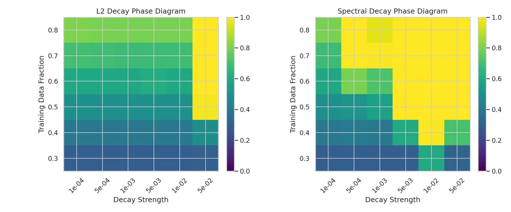

# Li 2026 — Low-Rank Decay for Grokking in Scale-Invariant Transformers: A Spectral-Geometric View

See also: [the global concept index](../../concepts/index.md).

**Mingyu Li** (Beijing Normal University).

arXiv [2606.04405](https://arxiv.org/abs/2606.04405), June 2026, 9 pages, 2 figures, 1 table; marked "Preliminary Draft", a single author. Citations by Semantic Scholar — 1, in the corpus — 1. The starting question: what does weight decay regularise at all if part of a transformer is scale-invariant (RMSNorm, QK-Norm)? The answer: nothing functional — a Frobenius penalty acts purely radially, and after memorisation (when the task gradients vanish) it is functionally inert. The proposal: replace the radial penalty by a spectral one — Low-Rank Decay (LRD), a step along the polar factor $UV^{\top}$ of the nuclear norm (approximated by a Newton–Schulz iteration), which subtracts one and the same amount from every singular value. On modular addition LRD collapses the stable rank of the QK matrices from ~35 to ~3 and widens the zone of successful grokking — mainly along the strength of the regularisation, and by one grid step along the data fraction.

The files of this paper's analysis:

- [`2606.04405.low-rank-decay-for-grokking-in-scale-invariant-transformers-a-spectral-geometric-view.license.txt`](2606.04405.low-rank-decay-for-grokking-in-scale-invariant-transformers-a-spectral-geometric-view.license.txt) — the arXiv licence record for this paper.

The anchor scheme and the rules for linking into a card are in the [README of the papers folder](../README.md).

**Excerpt card.** The paper's licence (`arxiv-nonexclusive`) does not permit republishing the paper itself; what stands here are the editorial sections and the fragments the corpus quotes (right of quotation). The paper: <https://arxiv.org/abs/2606.04405>.

## Concepts covered

**[The direction of weight decay's influence](../../concepts/weight-decay-direction.md)** — to the dispute about the strength of the decay an axis of the geometry of the step is added: radial against spectral. Proposition 1: under a scale invariance of the loss, Euler's theorem gives $\left\langle\nabla_{W}\mathcal{L},W\right\rangle=0$, the task gradient is tangent to the sphere of constant norm, and the weight decay is radial — it changes only $\rho=\left\lVert W\right\rVert_{F}$ and does not project onto the angular dynamics ([`p3-9`](#p3-9)). Remark 1 honestly weakens the claim: under AdamW, with finite steps and only an approximate invariance, the decay does influence things indirectly ([`p3-12`](#p3-12)).

**[Weight decay](../../concepts/weight-decay.md)** — the central asymmetry: after memorisation, when the task gradients vanish, L2 goes on contracting the norm with no functional consequence, while LRD goes on subtracting from the singular values, rebuilding the spectrum even at a zero task gradient ([`p6-6`](#p6-6)). The analysis notes: the mechanism "L2 is functionally inert" does not agree with the paper's own phase diagram, where at a strong $\lambda$ L2 does bring the network to a high accuracy (the network is only partly invariant), and this discrepancy is not addressed.

**[Spectral analysis](../../concepts/spectral-analysis-svd-esd-fve.md)** — in the corpus's spectral line the spectrum is for the first time taken as a control handle rather than a gauge: the confirmed prediction of the mechanism is that the stable rank of the QK matrices under LRD falls from ~35 to ~3 within the first 500 steps against ~25 under L2, and the tail of the spectrum sags by 4–5 orders of magnitude ([`p6-1`](#p6-1), [`fig-2`](#fig-2)). The nearest neighbour is 2604.07380, where weight decay contracts the spectral edge as a side effect: LRD is an attempt to make that same contraction direct.

**[The data fraction](../../concepts/data-fraction-critical-dataset-size.md)** — the main claim: LRD "expands the boundary in the data fraction" for grokking ([`p5-9`](#p5-9), [`fig-1`](#fig-1)). The analysis refines this: by the diagram itself the shift of the boundary in the data is one grid step ($f\approx 0.45\to 0.40$; at 0.3–0.35 nobody groks), and the main gain lies along the axis of the regularisation strength; and the measured boundary depends on an unnamed number of steps — which makes it a different quantity from the budget-independent threshold of Varma et al.

**[Grokking](../../concepts/grokking.md)** — LRD rises above 0.95 test accuracy within 3000 steps where L2 stays below 0.5 ([`p6-1`](#p6-1)); but 3000 steps is a horizon at which canonical grokking has not yet set in, and by the figure LRD has almost no delay between memorisation and generalisation — the device rather removes the phenomenon under analysis than improves its course. It is acknowledged outright that the causal link between the rank collapse and the generalisation is not established ([`p8-3`](#p8-3)).

**[Selective weight decay](../../concepts/selective-weight-decay.md)** — the partition is reported together with the way it is applied: L2 acts on all the parameters except the biases and the norms, and all three strategies compared are applied in a decoupled way, after the optimizer's step ([`p4-11`](#p4-11)). For an adaptive optimizer this is not the same as a penalty in the loss.
## What is shown and what is conjectured

These are the card editor's remarks, not the authors' text, drawn from a numbered pass over the paper's claims.

**What is valuable — the framing of the question and a confirmed prediction.** "What does the decay regularise in a scale-invariant block" is a sharp question with a testable consequence: the spectrum must be rebuilt even at a zero task gradient. The prediction of the mechanism is confirmed: the collapse of the stable rank and the spectral sparsity under LRD against L2 (fig. 2). Against LoRA the device is gentle: the subgradient of the nuclear norm at a low-rank matrix spreads "from a needle into a fan", leaving the task gradients a choice of which subspaces to keep.

**One and the same step is written three times and differently.** Algorithm 1 gives $G_{\mathrm{reg}}\leftarrow\lambda X$ with no adaptive factor; §5 defines the step with the factor $\left\lVert W\right\rVert_{F}/\left\lVert\operatorname{polar}(W)\right\rVert_{F}$; §6.3 returns to the step without the factor. The factor, moreover, reintroduces the dependence on the scale of the weights, whose absence is declared the key difference of LRD from L2. What was actually used in the experiments cannot be recovered. The number of Newton–Schulz iterations $K$ is nowhere named, and at a small $K$ the iteration precisely fails to give the polar factor on the weak directions — the very ones the device is meant to cut off.

**Hyperparameters and controls.** Unstated are the number of steps of the phase diagram, the seeds, the optimizer (AdamW surfaces only in Remark 1), the learning rate, the batch size, $K$ and $\epsilon$. The comparison is asymmetric in its domain of application: L2 on all the parameters, LRD only on the matrices of the blocks; LRD Elastic is announced as a third device but does not appear in the results; and there are no controls at $\lambda=0$ and with the QK-Norm switched off. The L2 curve sticks at exactly 0.5 — for addition modulo 97 such a shelf is unnatural and is not commented on. The "contour" in the pictures of $|W_{Q}W_{K}^{\top}|$ is a purely visual claim with no Fourier analysis.

**Missed predecessors.** 2506.05718 (Notsawo et al.) already showed that regularising by the nuclear norm produces grokking on a par with L2 — a direct predecessor of the main premise, not cited; and Newton–Schulz with a normalisation is a primitive of the Muon optimizer, whose line of orthogonalised steps is not mentioned.

**How the work will be cited** ("a spectral decay shifts the critical data fraction for grokking") — more precisely: on one modular addition at $p=97$, on one 2-layer transformer, with no statement of the number of steps, the seeds or $K$, the zone of success widened mainly along $\lambda$, and along the data fraction by one grid step (0.45 → 0.40).

---

# Quoted fragments

Only the fragments the corpus cards refer to are
reproduced here (right of quotation); the paper's licence does not permit
republishing the whole text. Anchor numbering matches the original.

###### p3-9

*Under the idealized assumptions above, Frobenius-norm weight decay affects only the radial scale $\rho$ and has no direct projection onto the angular dynamics of $\Theta$.*

###### p3-12

*This is an idealized continuous-time statement. In practical training with AdamW, finite steps, non-normalized parameters, and approximate scale invariance, weight decay can still influence optimization indirectly. The claim is not that weight decay is useless, but that it is not a direct functional complexity prior for perfectly scale-invariant parameter blocks.*

###### p4-11

When $W$ is square and full-rank, the orthogonal complements are trivial and the subgradient is unique. As rank decreases, the zero-singular-value subspaces enlarge, and the admissible $Z$ directions expand. Geometrically, the subgradient changes from a near-unique “needle” direction to a fan-like set over the null singular subspaces.

This suggests the following interpretation of LRD. Early in training, when weights are effectively full-rank, LRD provides a clear polar-factor shrinkage direction. **[p. 5]** Later, near low-rank strata, the regularizer becomes less prescriptive: it has already removed many weak spectral directions, while task gradients can decide which remaining singular subspaces should be preserved or regrown. This gives LRD a soft-selection behavior rather than a hard fixed-rank constraint.

###### p5-9

Figure 1 shows the phase diagram for modular addition across training data fractions and decay strengths. L2 weight decay achieves high test accuracy only in the upper-right region (large data fraction and strong decay), while spectral decay (LRD) expands the successful grokking region substantially, particularly at moderate data fractions ($f=0.4$–$0.6$) and intermediate decay strengths ($\lambda=5\times 10^{-4}$ to $5\times 10^{-3}$). This expansion is consistent with the hypothesis that nuclear-norm regularization provides a more effective inductive bias than Frobenius-norm regularization in scale-invariant networks.

###### fig-1

*Figure 1: Phase diagram of modular-addition generalization. Left: L2 decay. Right: Spectral (LRD) decay. Color indicates final test accuracy after fixed training steps. LRD expands the grokking boundary to lower data fractions and a wider range of decay strengths.* **[p. 6]**

**[p. 6]**

###### p6-1

Figure 2 compares grokking speed, effective rank, and singular value spectra for L2 and LRD on modular addition ($f=0.4$). LRD achieves test accuracy $>0.95$ within 3000 steps, while L2 remains below 0.5 over the same period. The effective rank of Query/Key matrices under LRD drops sharply from $\sim$35 to $\sim$3 within the first 500 steps, whereas L2 maintains a rank of $\sim$25 throughout.

The singular value spectrum (normalized by $\sigma_{1}$) reveals a qualitative difference: under LRD, singular values beyond index $\sim$10 drop by 4–5 orders of magnitude, indicating strong spectral sparsity. Under L2, the spectrum decays more gradually, with tail singular values remaining within 1–2 orders of $\sigma_{1}$.

The bottom row of Figure 2 visualizes the QK attention patterns ($|W_{Q}W_{K}^{\top}|$). L2 produces a noisy, unstructured pattern, while LRD yields a visibly structured pattern with clear block-diagonal features, consistent with the model learning an algorithmic circuit.

###### fig-2

*Figure 2: Top left: Grokking speed (test accuracy vs. training steps). Top center: Effective rank (stable rank) of QK matrices. Top right: Normalized singular value spectrum at end of training (log scale). Bottom: QK attention patterns for L2 (left) and LRD (right).* **[p. 7]**

###### p6-6

This asymmetry—L2 acts radially and becomes inert in scale-invariant networks after gradient vanishing, while LRD retains a tangential spectral-shaping component—is the central mechanistic distinction.

Table 1 summarizes the key differences.

*Table 1: Comparison of L2 and LRD regularization in the scale-invariant setting.* **[p. 7]**

| **Property** | **L2 Weight Decay** | **Low-Rank Decay (LRD)** |
|---|---|---|
| Penalty | $\left\lVert W\right\rVert_{F}^{2}=\sum_{i}\sigma_{i}^{2}$ | $\left\lVert W\right\rVert_{*}=\sum_{i}\sigma_{i}$ |
| Effect on $\sigma_{i}$ | $\sigma_{i}\leftarrow\sigma_{i}(1-\eta\lambda)$ (multiplicative) | $\sigma_{i}\leftarrow\sigma_{i}-\eta\lambda$ (subtractive) |
| Stable rank | Unchanged | Decreases |
| Gradient direction | $\nabla\left\lVert W\right\rVert_{F}^{2}=2W$ (radial) | $\nabla\left\lVert W\right\rVert_{*}=UV^{\top}$ (tangential component) |
| After $\nabla\mathcal{L}=0$ | Inert (scale-invariant) | Active (spectral reshaping) |

**[p. 7]**

###### p8-3

This work has several important limitations. Current evidence is based primarily on modular addition; extension to modular multiplication, permutation composition (S5), and other tasks is needed to establish generality. Multi-seed results with confidence intervals are needed to rule out seed-dependent effects. We have not established a causal link between rank collapse and generalization—temporal precedence alone is insufficient. The interaction between LRD and the optimizer’s implicit spectral bias (observed even without regularization) requires further disentanglement. Finally, training instabilities (rank oscillations, gradient spikes) observed in some configurations are not fully understood.
