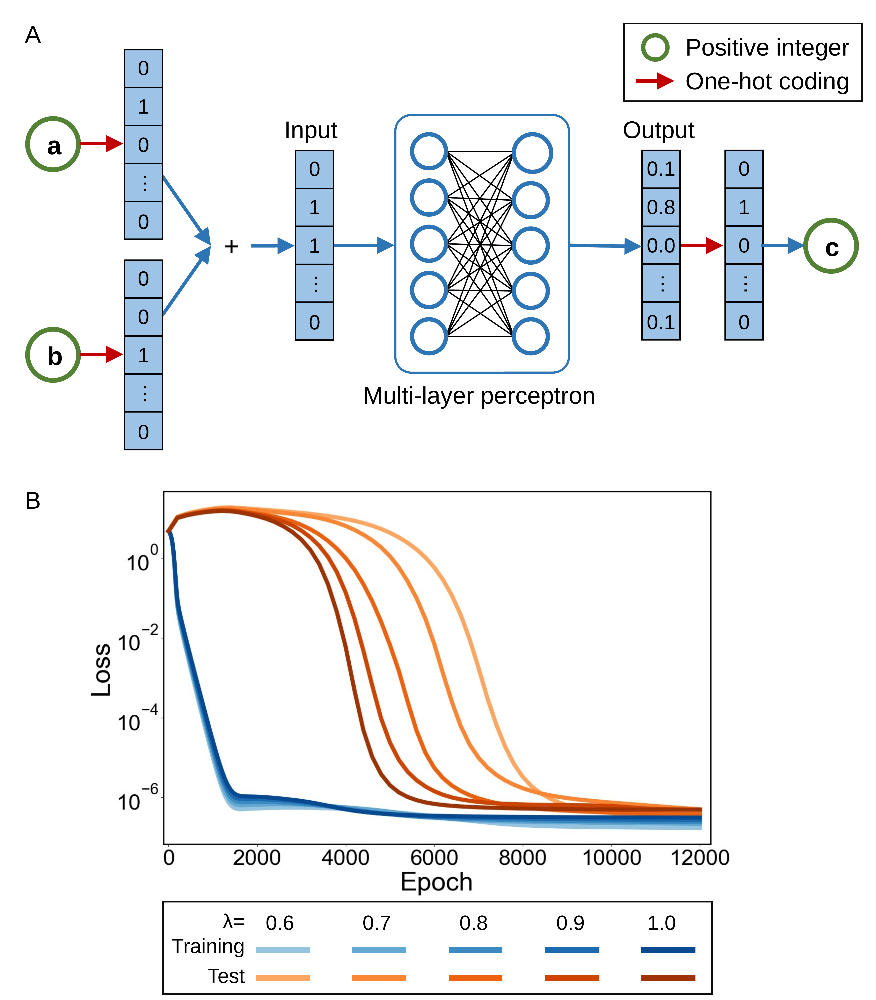

# Tan, Gai & Zhang 2026 — Deciphering Two Training Clocks in Grokking via Deep Linear Network Theory with Conditional ReLU Reduction

See also: [the global concept index](../../concepts/index.md).

**Hu Tan**, **Shihua Zhang** (Academy of Mathematics and Systems Science, CAS; University of CAS), **Kuo Gai** (SIMIS, Shanghai).

arXiv [2606.05863](https://arxiv.org/abs/2606.05863), June 2026, 42 pages, 3 figures, 5 appendix tables. Citations by Semantic Scholar — 1, in the corpus — 1. Grokking is reformulated as a mismatch of **two stopping times**: the "classifier clock" $T_{\mathrm{cls}}(\varepsilon)$ — when the tail of the cross-entropy falls below $\varepsilon$ — and the "representation clock" $T_{\mathrm{rep}}(\eta)$ — when the structural margin (the stable rank and the like) falls below $\eta$; the plateau is the interval between them. For a deep linear network it is proved that the first clock is logarithmic in $1/\varepsilon$ (under an assumption of post-margin growth) and the second polynomial in $1/\eta$ (under an assumption of a sharp KL tail) — a layer-wise weight decay acting on the end-to-end map as a Schatten penalty $\|A\|_{S_{2/L}}^{2/L}$. For ReLU, conditional carry-overs are given (frozen gates, a hierarchy of gradients) rather than proofs about the non-linear dynamics; and the separation of statuses is maintained by tables throughout the text.

The files of this paper's analysis:

- [`2606.05863.deciphering-two-training-clocks-in-grokking-via-deep-linear-network-theory-with-conditional-relu-reduction.license.txt`](2606.05863.deciphering-two-training-clocks-in-grokking-via-deep-linear-network-theory-with-conditional-relu-reduction.license.txt) — the arXiv licence record for this paper.

The anchor scheme and the rules for linking into a card are in the [README of the papers folder](../README.md).

**Excerpt card.** The paper's licence (`arxiv-nonexclusive`) does not permit republishing the paper itself; what stands here are the editorial sections and the fragments the corpus quotes (right of quotation). The paper: <https://arxiv.org/abs/2606.05863>.

## Concepts covered

**[Grokking](../../concepts/grokking.md)** — a form of the subject rare for the corpus: not a threshold, not a progress measure, but a **comparison of stopping times**; the central claim is that the convergence laws differ: $T_{\mathrm{cls}}(\varepsilon)=O(\log(1/\varepsilon))$ against $T_{\mathrm{rep}}(\eta)=\Theta(\eta^{-(2\theta-1)})$, and the plateau is the interval $T_{\mathrm{cls}}\ll t\ll T_{\mathrm{rep}}$ ([`p16-5`](#p16-5)). The analysis: both laws are conditional (the growth of the margins is assumption 3.4, the KL tail is assumption 4.5, and for a single trajectory they are not directly compatible — a growth of the margins against convergence to a finite point); the relation between the tolerances $\eta\asymp\varepsilon^{q}$ is postulated; and in the paper's own experiment the gap between the clocks is a factor of about 4, while the clock estimators of F.4 are never once computed.

**[Weight decay](../../concepts/weight-decay.md)** — the source of the slow clock: a layer-wise Frobenius decay in a deep linear network induces a Schatten penalty $\|A\|_{S_{2/L}}^{2/L}$ on the end-to-end map ([`p6-6`](#p6-6)), and at $p=2/L<1$ the small singular values get the stronger contraction the smaller they are ([`p12-9`](#p12-9)). The role is stated narrowly: WD is one mathematically transparent source of a slow structural force, not the only one ([`p42-6`](#p42-6)). The analysis: identity (2.7) is a minimum over factorisations, whereas the training penalises the current one; and the counterexample of Kumar et al. (grokking without WD at a growing norm) is not addressed directly.

**[Margin maximisation](../../concepts/margin-maximization-implicit-bias.md)** — a rare care in a place normally passed over in silence: lemma 3.3 is a deliberately negative result showing that a constant positive margin does not give a uniform Polyak–Łojasiewicz condition for the cross-entropy, since $|\ell'(z)|^{2}/\ell(z)\sim e^{-z}\to 0$ ([`p8-7`](#p8-7)); which is why the fast clock honestly hangs on the assumption of growing margins rather than on "a shortcut through PL".

**[Spectral analysis](../../concepts/spectral-analysis-svd-esd-fve.md)** — the stable rank is taken as one transparent road from structure to generalisation, with the explicit caveat that another structural margin (the separation of the classes, the fraction of energy outside the Fourier subspace, the simplex error) may be put in its place ([`p37-9`](#p37-9)); experimentally the rank falls from $\approx 36$ to $\approx 10$–$12$ within the generalisation window ([`fig-3`](#fig-3)). There is no unconditional claim of a rank collapse: the data may balance the contraction, and rotations of the singular vectors may redistribute the energy ([`p41-1`](#p41-1)).

**[Generalisation bounds](../../concepts/generalization-bounds.md)** — a bridge from a low rank to generalisation through the robustness of Xu and Mannor: the stable rank sets an output-effective dimension $d_{\eta}=\lceil\operatorname{srank}/\eta^{2}\rceil$ (Eckart–Young), which lowers the exponent of the covering term ([`p15-1`](#p15-1), [`p15-3`](#p15-3)). The analysis: at the paper's own values the bound is numerically vacuous — the covering term $(2R/\alpha)^{d_{\eta}}$ at the observed rank of ~10 gives hundreds in the exponent at $n\leq 12769$; and the "delayed generalisation" is derived from an improvement of the bound rather than from a measured test loss.

**[Selective weight decay](../../concepts/selective-weight-decay.md)** — the same generalised over the depth: a layer-wise decay in a deep linear network corresponds to a Schatten-$p$ penalty on the end-to-end map with $p=2/L$ ([`p2-7`](#p2-7)). The deeper the network, the harder the penalty presses on the small singular values, and the closer it comes to counting the rank.
## What is shown and what is conjectured

These are the card editor's remarks, not the authors' text, drawn from a numbered pass over the paper's claims.

**An exemplary self-restriction of statuses.** Tables S2 and S4 write out the domain and the mathematical input of each claim line by line; the ReLU statements are marked conditional everywhere; and lemma 3.3 proves that a margin does not give PL — in a place where PL is usually taken without a caveat. The protocol for measuring the two clocks (F.4, the stability windows, the accumulated optimiser time) is a ready blank for checking on other people's runs.

**Both laws are conditional, and their conjunction is contestable.** The logarithmic behaviour of the fast clock is a substitution of an assumed linear growth of the margins into lemma 3.1 ("the optimiser part is not hidden in the identity, it is the assumption"); the polynomial behaviour of the slow one is an integration of an assumed two-sided KL tail with an unmeasured exponent $\theta$. Theorem 5.6 requires both assumptions at once, but for a single trajectory they are incompatible: a growth of the margins entails an unbounded growth of the norm, whereas the KL assumption entails convergence to a finite point; a reconciliation is possible only on different finite windows, whereas the proof simply substitutes both estimates. The relation between the tolerances $\eta\asymp\varepsilon^{q}$ is postulated. And at $2\theta-1<1$ the "slow" clock is no slower than $O(1/\eta)$ — the slowness is an asymptotics in the tolerance, not a number of steps.

**The hierarchy of gradients is weaker than its paraphrase.** Proposition 4.2 compares an upper bound for the lower layers with an equality for the head; "the head fits first" holds only at small $\|U\|_{2},\|W\|_{2}$ and a non-negligible $\|h\|$ — which is not checked in the experiments, while the stronger picture is what reaches the abstract. The stability of the gates — the key to the whole ReLU bridge — is never measured, although a sufficient condition through the margin is written out in F.3.

**The experiment is qualitative and does not measure its own subject.** The only setting is addition mod 113; the grokking is visible in the loss, not in the accuracy; the stable rank and the training loss are never shown on the same axes — the separation of the clocks itself is depicted in no figure; and the clock estimators of F.4 are not computed. The gap in the experiment is ~1500 against ~6000 epochs (a factor of 4) against two or three orders of magnitude in Power et al. Not stated: the data fraction, the seeds, the depth and width of the network, the optimiser (the betas give away the Adam family); the theory requires $L>2$, while the depth of the MLP is unknown; and the axes of the figures are cut at 12000 against the 15000 epochs claimed.

**Missing neighbours.** 2505.20172 (a two-phase account with a derived slow scale ~$1/\lambda$) is the nearest formal relative and is not cited; the corpus's spectral works (2604.13123, 2604.06256, 2604.07380, 2408.11804) and the norm line (2511.01938) are not cited; and there is a miscitation in §1.2 (Wang et al. on ResNets and Aubry et al. on LLMs bracketed together as "mechanistic analyses of modular arithmetic").

**How the work will be cited** ("it is proved that grokking is a separation of two time scales") — more precisely: two conditional theorems about rates are proved for a linear surrogate, an exact chain-rule identity is written out for a two-layer model with embeddings, and one qualitative experiment is given in which the clocks themselves are not measured. A separate hazard is the collision of the name with the "clock" of The Clock and the Pizza, where it denotes a learned algorithm.

---

# Quoted fragments

Only the fragments the corpus cards refer to are
reproduced here (right of quotation); the paper's licence does not permit
republishing the whole text. Anchor numbering matches the original.

###### p2-7

The second result describes the slow clock. In a deep linear network, layerwise weight decay corresponds to a Schatten-$p$ penalty on the end-to-end map, with $p=2/L$. On a late-time smooth spectral stratum, this penalty applies stronger shrinkage to small singular values and therefore biases the representation toward low effective rank. Under a sharp KL-tail condition near the limiting point, the associated energy gap decays on a polynomial clock. This polynomial clock is the quantitative counterpart of the slow representation drift observed during grokking.

*Figure 1: Representative training and test loss curves for a ReLU MLP on modular addition (mod $113$), together with the network architecture. (a) Architecture sketch: each input pair $(a,b)$ is represented by trainable token embeddings, combined symmetrically, and processed by an MLP with ReLU activations and a softmax layer. (b) Training and test loss curves for weight decay values $0.6$, $0.7$, $0.8$, $0.9$, and $1.0$ (blue: training; orange: test). The experiments are finite-width and nonlinear; throughout the paper, they serve as qualitative evidence for the time-scale-separation mechanism, while the deep-linear theorems provide the idealized core.* **[p. 3]**

The ReLU part of the paper provides a conditional transfer principle for stabilized nonlinear training windows. Once activation patterns on the training set stabilize, a finite ReLU network becomes an active linear subsystem on those samples. In addition, for a two-layer embedding model, the gradient entering the embedding block carries extra downstream operator-norm factors compared with the classifier-head gradient. These two facts explain how the linear two-clock mechanism can become relevant to the nonlinear modular-addition experiments: the head can fit first, while the active representation continues to simplify later.

**[p. 3]**

###### p6-6

For a depth-$L$ linear factorization $A=W_{L}\cdots W_{1}$, layerwise Frobenius weight decay induces the following end-to-end penalty [Shang et al., 2020]:

$$
\|A\|_{S_{2/L}}^{2/L}=\frac{1}{L}\min_{W_{L}\cdots W_{1}=A}\sum_{\ell=1}^{L}\|W_{\ell}\|_{\mathrm{F}}^{2}. \tag{2.7}
$$

###### p6-7

Thus, in the deep-linear surrogate, ordinary layerwise weight decay becomes a Schatten-type penalty on the product map. This is the mathematical source of the representation clock studied in Section 4.

###### p8-7

*There is no constant $\beta>0$ such that the implication*

$$
\Gamma_{a,m}(A)\geq\gamma\ \text{ for all }a,m\neq y_{a}\quad\Longrightarrow\quad\|\nabla\mathcal{L}_{\mathrm{CE}}(A)\|_{\mathrm{F}}^{2}\geq\beta\mathcal{L}_{\mathrm{CE}}(A)
$$

###### p8-8

*holds uniformly over all larger margins. In particular, margin persistence alone is insufficient to justify geometric decay of the cross-entropy loss.*

**Proof idea.** In the binary one-sample case, write the margin as $z$ and the loss as $\ell(z)=\log(1+e^{-z})$. Then $\ell(z)\asymp e^{-z}$ but $|\ell^{\prime}(z)|^{2}\asymp e^{-2z}$ as $z\to\infty$, so $|\ell^{\prime}(z)|^{2}/\ell(z)\to 0$. The full proof is in Appendix C.3. $\blacksquare$

###### fig-3

*Figure 3: Test loss and stable rank during training for a ReLU MLP on modular addition with weight decay $\lambda\in\{0.6,0.7,0.8,0.9,1.0\}$. Test loss is plotted on the left $y$-axis with log scale, and stable rank is plotted on the right $y$-axis. The late decrease in stable rank is the empirical representation-clock diagnostic used as qualitative support for the theory.* **[p. 11]**

**[p. 10]**

###### p12-9

*In particular, for $0<p<1$, smaller positive singular values experience stronger shrinkage from the regularizer.*

*Proof.* Deferred to Appendix D.1.

###### p15-1

Consider an embedding map $z=W_{1}x\in\mathbb{R}^{d_{1}}$ followed by a final linear map $f(z)=A^{\prime}z$, where $A^{\prime}\in\mathbb{R}^{k\times d_{1}}$. The embedding set is

$$
\mathcal{M}_{\mathrm{embed}}:=\{W_{1}x:x\in\mathcal{X}\}\subset\mathbb{R}^{d_{1}}.
$$

The embeddings may live in a high-dimensional ambient space, but the output map may depend mainly on a smaller principal subspace.

###### p15-3

*Let $A^{\prime}\in\mathbb{R}^{k\times d_{1}}$. For $\eta\in(0,1)$, set*

$$
d_{\eta}=\left\lceil\frac{\operatorname{srank}(A^{\prime})}{\eta^{2}}\right\rceil.
$$

*Let $A^{\prime}_{d_{\eta}}$ be the best rank-$d_{\eta}$ approximation of $A^{\prime}$, and let $V_{d_{\eta}}\subset\mathbb{R}^{d_{1}}$ be the span of the top $d_{\eta}$ right singular vectors. Then every embedding $z\in\mathcal{M}_{\mathrm{embed}}$ satisfies*

$$
\|(A^{\prime}-A^{\prime}_{d_{\eta}})z\|_{2}\leq\eta\|A^{\prime}\|_{2}\|z\|_{2}.
$$

###### p15-5

*Thus the action of $A^{\prime}$ on embeddings is approximated, up to relative output error $\eta$, by a $d_{\eta}$-dimensional principal subspace controlled by stable rank.*

**Proof idea.** Eckart–Young gives $\|A^{\prime}-A^{\prime}_{d_{\eta}}\|_{2}=s_{d_{\eta}+1}(A^{\prime})$. Monotonicity of singular values gives $(d_{\eta}+1)s_{d_{\eta}+1}^{2}\leq\sum_{i\geq 1}s_{i}^{2}=\operatorname{srank}(A^{\prime})s_{1}^{2}$. The choice of $d_{\eta}$ yields $s_{d_{\eta}+1}\leq\eta s_{1}$, and applying this operator-norm bound to $z$ proves the claim. The full proof is in Appendix E.3. $\blacksquare$

###### p16-5

*Assume the fast-clock condition of Theorem 3.5. Assume also the sharp KL-tail condition of Theorem 4.9 for a structural gap $\mathcal{S}(A(t))$ comparable to the energy gap. Then*

$$
T_{\mathrm{cls}}(\varepsilon)=O\!\left(\log(1/\varepsilon)\right),\qquad T_{\mathrm{rep}}(\eta)-T_{\mathrm{KL}}=\Theta\!\left(\eta^{-(2\theta-1)}\right),
$$

*where $\theta\in(1/2,1)$ is the late-time KL exponent. If the required structural precision is tied to the target loss scale by $\eta\asymp\varepsilon^{q}$ for some $q>0$, then*

$$
T_{\mathrm{rep}}(\varepsilon^{q})-T_{\mathrm{KL}}=\Theta\!\left(\varepsilon^{-q(2\theta-1)}\right),
$$

*which is polynomial in $1/\varepsilon$.*

*Proof.* Deferred to Appendix E.9.

###### p16-9

The theorem gives the paper’s main explanation of grokking. The training loss can become small on the classifier clock, while the structural quantity needed for robust generalization continues to evolve on the representation clock. Delayed test accuracy is therefore compatible with rapid interpolation: the first clock has finished, but the second has not.

###### p37-9

Stable rank is used in the main text because it is a simple proxy for effective dimension and is directly connected to the spectral surrogate. Other representation clocks are also possible. The same proof template can use another structural gap if that gap is linked to a generalization or robustness statement and is comparable to the late-time energy gap on the region where the KL analysis is applied.

One alternative is a class-separation gap in representation space. Let $z_{a}(t)$ be the learned representation of sample $a$, and let $\mu_{c}(t)$ be the empirical center of class $c$. A normalized separation statistic is

$$
\mathcal{S}_{\mathrm{sep}}(t)=\frac{\sum_{a=1}^{M}\|z_{a}(t)-\mu_{y_{a}}(t)\|_{2}^{2}}{\sum_{\begin{subarray}{c}c,c^{\prime}=1\\
c\neq c^{\prime}\end{subarray}}^{K}\|\mu_{c}(t)-\mu_{c^{\prime}}(t)\|_{2}^{2}+\delta}.
$$

**[p. 38]**

This quantity measures within-class spread relative to between-class separation. It is useful when the learned rule is expressed through class clustering instead of spectral collapse of a single end-to-end matrix.

For modular arithmetic, a more task-specific quantity can be defined using a projection $P_{\mathrm{rule}}$ onto a task-aligned Fourier or cyclic subspace:

$$
\mathcal{S}_{\mathrm{rule}}(t)=\frac{\|(I-P_{\mathrm{rule}})A_{t}\|_{\mathrm{F}}^{2}}{\|A_{t}\|_{\mathrm{F}}^{2}+\delta}.
$$

Parseval’s identity implies that this ratio measures the fraction of Frobenius energy outside the task-aligned Fourier or cyclic subspace. This statistic can be sharper for modular-addition grokking, but it is less architecture-agnostic than stable rank. A third possibility is a neural-collapse-type simplex error when late training aligns class means with an equiangular geometry. These alternatives emphasize that the representation clock is a role in the argument, not a commitment to one universal metric.

###### p41-1

Spectral shrinkage alone is weaker than low effective rank. On a smooth stratum the regularizer contributes $-\lambda ps^{p-1}$ to a positive singular value, but a persistent data force can balance this shrinkage and singular-vector rotations can redistribute energy. If the learned rule genuinely requires many comparable directions, the stable rank need not collapse. The representation-clock theorem is therefore stated through a structural gap and a late-time tail condition, with no unconditional rank-collapse claim.

A ReLU network can be locally linear without being globally reducible to a single linear map. If gate switching persists throughout the late-time interval, the frozen-gate reduction is not available on that interval. One may then need to work with a sequence of active regions or with a different nonlinear representation variable. The conditional ReLU corollary applies only after the stated gate-stability assumption is satisfied.

Low effective dimension is also only one ingredient in a generalization argument. It enters the paper through a robustness and covering argument. A low-rank map can collapse the wrong directions, and a high-dimensional representation can generalize if it captures a task-aligned invariant or group structure. The bound in the main text therefore contains a spectral-tail or structural-error term leaving stable rank as one component of the generalization argument.

###### p42-6

This also avoids a common overstatement. Weight decay is one mathematically tractable source of a slow structural force behind the phenomenon. Other forms of implicit or explicit regularization may produce a similar clock if they continue to simplify the representation after fitting. Such alternatives would change the structural gap and the proof of the slow clock, but not the logical form of the temporal comparison.

The conclusion should therefore be read as a conditional mechanism. Grokking is explained here when the observed delay matches the mathematical separation between a fast classifier clock and a slow representation clock.
