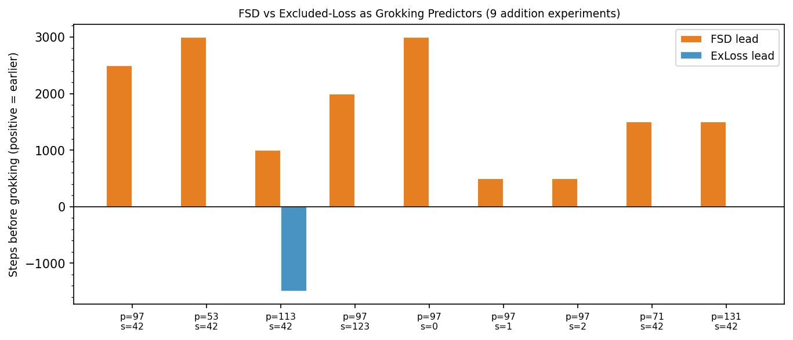
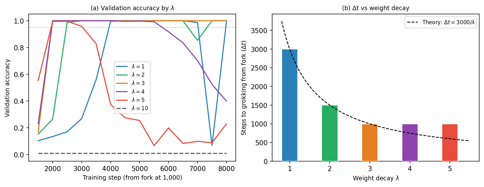
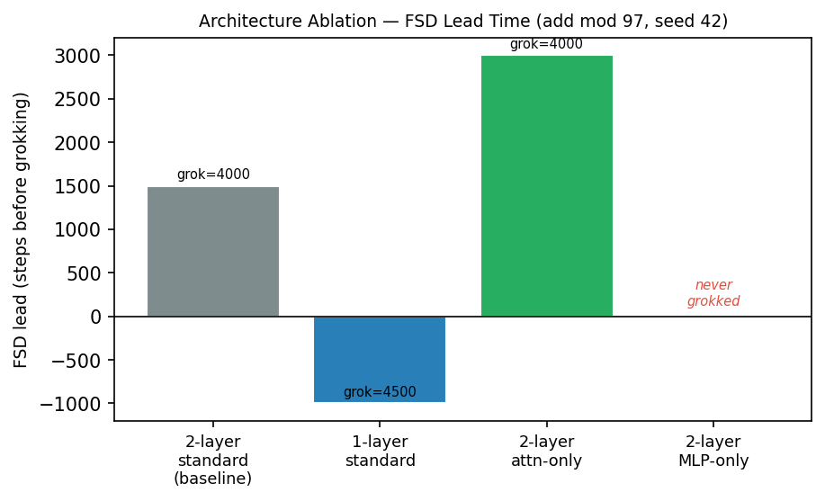
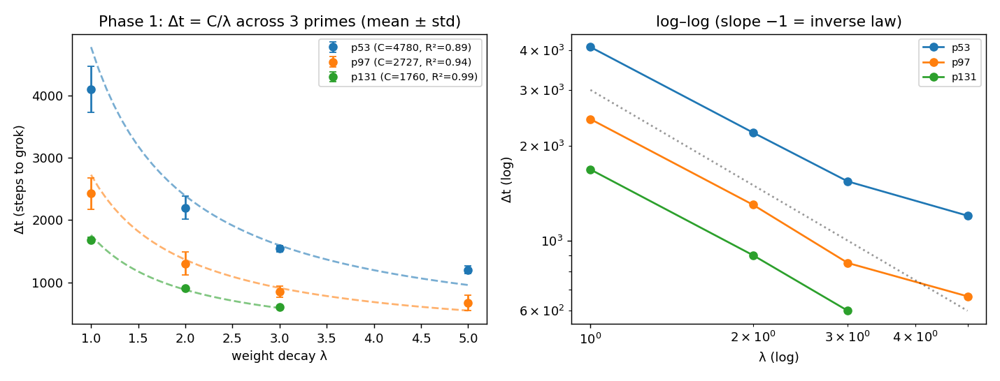
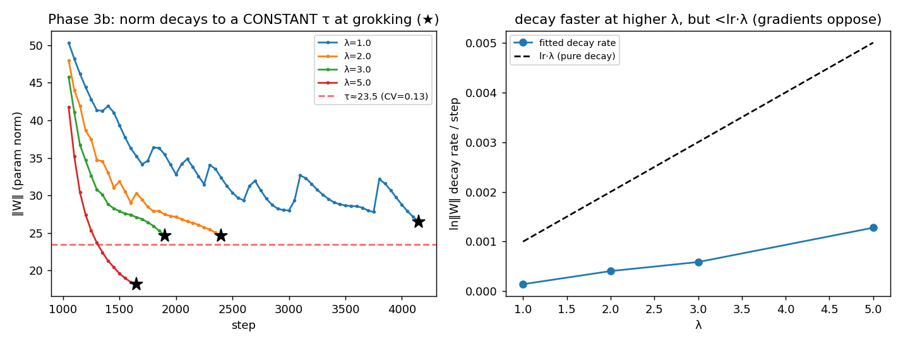
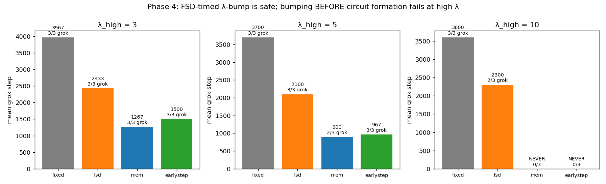
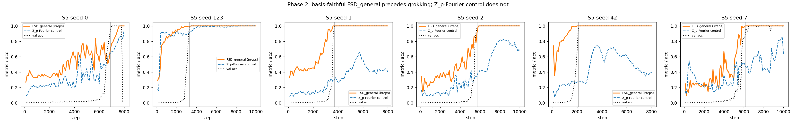

# Sivasankar 2026 — Circuit Synchronization Precedes Generalization: A Causal Precursor to Grokking

See also: [the global concept index](../../concepts/index.md). arXiv [2606.12966v2](https://arxiv.org/abs/2606.12966), 11 June 2026 (v2 — 21 June 2026). PDF running head: "Preprint. Under review.".

**Achyuthan Sivasankar** — New York University (as21154@nyu.edu).

The files of this paper's analysis:

- [`2606.12966.circuit-synchronization-precedes-generalization-a-causal-precursor-to-grokking.license.txt`](2606.12966.circuit-synchronization-precedes-generalization-a-causal-precursor-to-grokking.license.txt) — the arXiv licence record for this paper.

The anchor scheme and the rules for linking into a card are in the [README of the papers folder](../README.md).

**Excerpt card.** The paper's licence (`arxiv-nonexclusive`) does not permit republishing the paper itself; what stands here are the editorial sections and the fragments the corpus quotes (right of quotation). The paper: <https://arxiv.org/abs/2606.12966>.

## Concepts covered

**[Grokking](../../concepts/grokking.md)** — the work takes the notion ready-made and adds to it an operational feature that fires in advance: across nine modular-addition settings the normalised fraction of neurons sharing a dominant frequency crosses the threshold 0.80 earlier than the validation accuracy crosses 95 %, with a lead of 500 to 3000 steps and a mean of $+1{,}722$ steps ([p. 4, para. 12](#p4-12)). Grokking here is defined purely operationally — the first checkpoint at a validation accuracy $\geq 95\%$ ([table 1](#p3-6)) — and is observed at measurements taken every 500 steps. What the work does not contain: not a single run without grokking, that is, no check of the feature for false alarms; no analysis of what happens at $\lambda=0$; and no attempt to relate the size of the lead to anything beyond the length of the memorisation plateau.

**[Progress measures](../../concepts/progress-measures.md)** — the work introduces a progress measure of a new kind: FSD is computed from the raw MLP activations and, unlike Nanda's measures, does not require the circuit's key frequencies to be known in advance ([definition 2](#p4-3)). The second contribution is a direct comparison with an existing measure: a baseline feature from the restricted logits is declared "our implementation of the excluded loss of Nanda et al." ([p. 5, para. 1](#p5-1)) and in all nine settings synchronises no earlier than the grokking ([p. 5, para. 3](#p5-3)). The caveats without which this comparison reads wrongly: the two measures are taken from different blocks (FSD from the MLP of block 0, the baseline feature from block 1), the thresholds are chosen differently for each (0.80 of the normalised fraction against 0.5 nats), and in eight cases of nine the baseline feature "fires" exactly at the grokking step, which is an artefact of a threshold on a 500-step grid rather than a measurement of the onset of the decline. What the work does not contain: the promised permutation $p$-values ([p. 4, para. 7](#p4-7)) — not one appears in any of the eleven tables; and a comparison with progress measures that appeared in the corpus after 2024 (the bibliography contains not a single work later than 2024).

**[Fourier features and circuits](../../concepts/fourier-features-circuits.md)** — the setting is inherited entire from Nanda's Fourier explanation: the same product-of-cosines identity ([eq. 1](#p3-1)), the same key frequencies, the same logit read-out. The work adds to the notion two measurable instruments: the Fourier rank — the smallest number of DFT components explaining 90 % of the variance of a neuron's response to the sum — and FSD, the fraction of neurons sharing a dominant frequency. It is measured that the median Fourier rank collapses $6\to 1$ **before** the grokking and then stays at 1 ([p. 6, para. 2](#p6-2)), and that a symbolic extraction by FourierKAN independently recovers the same dominant frequency ([p. 7, para. 2](#p7-2)). What the work does not contain: an analysis of the circuit itself — no weights, no attention heads and no read-out; the Fourier organisation is measured only on the MLP activations, and its relation to the computation is checked only by a crude zero ablation, by which the layer tracked turns out to be the least load-bearing.

**[Mechanistic interpretability](../../concepts/mechanistic-interpretability.md)** — the work applies the circuit frame (Elhage et al. 2021) and claims a causal check through zero ablation, stating outright why this, the crudest, instrument is chosen: it is "unambiguous" and requires no assumption of recovery ([p. 3, para. 3](#p3-3)). The authors' caveat about the instrument's limits is given honestly and in detail: zero ablation does not distinguish "this component computes the Fourier algorithm" from "this component carries important information from the residual stream" ([p. 15, para. 4](#p15-4)). What the work does not contain: activation patching, head-level patching or an analysis of the weights — the authors themselves call these a valuable continuation rather than something done.

**[Causal ablation](../../concepts/causal-ablation-intervention.md)** — the work gives the notion two heterogeneous interventions. The first is a zero ablation of four components of a grokked model ([p. 4, para. 10](#p4-10)), measuring necessity by the fall of accuracy. The second, and the chief one for the claim, is a training fork: one and the same checkpoint at step 1000 is branched into six arms differing only in $\lambda$ ([p. 6, para. 5](#p6-5)). The move is strong precisely for fixing the state: the formation of the circuit is fixed and one variable is free. What the work does not contain — and this matters when citing: not one intervention acts on **the precursor itself**. The synchronisation is nowhere strengthened, suppressed or shifted; what is shown causally is only that the time to the transition from a fixed point falls with $\lambda$. The title "a causal precursor" is not covered by this experiment, and the citing work `2607.04333` assigns the present work to the observational explanations.

**[Weight decay / L2 regularisation](../../concepts/weight-decay.md)** — here the work gives the corpus its most concrete thing: a quantitative time law. At a fork from a fixed checkpoint the stable arms ($\lambda\leq 3$) grok strictly monotonically earlier and fall on $\Delta t=3{,}000/\lambda$ ([p. 7, para. 1](#p7-1)), and a cross-prime replication with five draws per cell gives $R^{2}=0.89$–$0.99$ on the seed averages at a spread of $[0.49,1.00]$ per individual draw ([p. 12, para. 2](#p12-2)). Two limits are measured in the same place: a mild flattening at large $\lambda$ and an over-regularisation ceiling at which no grokking occurs at all. The applied consequence is that raising $\lambda$ once the FSD ceiling is reached accelerates the grokking by 36–43 % ([p. 13, para. 1](#p13-1)). What the work does not contain: the direction of the effect ("more weight decay, earlier grokking") the authors themselves call a commonplace anticipated by Varma et al.; there is no sweep of $\lambda$ from the very start of the training, all the arms starting from a single point; and the 36–43 % acceleration rests on one figure with no table and no spread over the three seeds.

**[Weight norm minimisation](../../concepts/weight-norm-minimization.md)** — the work gives the notion a rare direct measurement: the weight norm **at grokking** is nearly constant across $\lambda\in\{1,2,3,5\}$ (a mean $\tau\approx 23.5$, a coefficient of variation of 0.13; [p. 12, para. 3](#p12-3)). This is independent evidence of a threshold mechanism for the transition rather than a consequence of fitting the time law. In the same place it is honestly said that the fitted decay rate is $\approx 0.2$ of the nominal $\eta\lambda$, since the gradient steps partly counteract the decay — whereupon the constant $C$ is declared measured rather than derived, and the threshold $\tau$ is not identifiable from the times alone ([p. 11, para. 2](#p11-2)). What the work does not contain: a separation of the norm into "memorising" and "generalising" parts — the quantity $\|W_{\mathrm{mem}}\|$ is introduced in the theory, but what is measured everywhere is the full Frobenius norm; the attempt to change the norm at the fork by rescaling the weights is admitted to be confounded and discarded.

**[The memorisation phase / the plateau](../../concepts/memorization-phase.md)** — the work gives the phase a direct measurement: the training accuracy reaches 100 % by step 1000, and the "training $-$ validation" gap peaks at 0.894 and collapses to 0.003 within a single interval between checkpoints ([p. 6, para. 3](#p6-3), [fig. 4](#fig-4)). It is precisely this measurement that distinguishes the work from its neighbours in the precursor line, in which the training accuracy is often not given at all. What the work does not contain: the declared gap corridor of "0.52–0.72 throughout phase 2" does not agree with its own table 5 — at the first measurement of phase 2 the gap equals 0.947 (see "Inconsistencies"); and the two-phase division itself ("formation" up to 2500, "release" after) is built on one run at $p=97$ and is not carried over to other primes.

**[Modular arithmetic](../../concepts/modular-arithmetic.md)** — the work gives the notion a comparison of operations by mechanism rather than by difficulty: addition and subtraction give a leading FSD, multiplication one lagging by 10 000 steps, which the authors read as a sign of a different algorithm (a discrete logarithm, for instance) rather than as a failure of the measure ([p. 8, para. 3](#p8-3)). Subtraction is meanwhile declared a prediction from an algebraic identity, made before the experiment and confirmed ([p. 9, para. 1](#p9-1)). There is a sweep over primes — $p\in\{53,71,97,113,131\}$ ([p. 3, para. 6](#p3-6)) — and an observation that at $p=113$ the circuit requires two simultaneously acting frequencies, whereas at the other primes it converges on one. What the work does not contain: division, any operation outside the groups $\mathbb{Z}_{p}$ and $S_{5}$, and an analysis of which algorithm exactly is implemented for multiplication — "a discrete logarithm" is named conjecturally and is not checked.

**[The canonical grokking proving ground](../../concepts/canonical-grokking-testbed.md)** — the setting reproduces the Power–Nanda proving ground almost word for word: a training fraction of 30 %, AdamW at $\eta=10^{-3}$ and $\lambda=1.0$, a batch of 512, measurements every 500 steps ([p. 3, para. 5](#p3-5)). The departures from the proving ground that matter when comparing numbers: a two-layer transformer instead of Nanda's single-layer one, an input of three tokens $[a,b,\texttt{sep}]$ and a read-out from the last position ([p. 3, para. 4](#p3-4)). What the work does not contain: a check of its own grokking times against those published on the same proving ground, and a caveat that the 500-step measurement grid itself sets a lower bound on the measurable lead — and two of the nine leads equal exactly 500, that is, one measurement.

**[Structured representation learning](../../concepts/structured-representation-learning.md)** — the work's contribution to the notion is that the structure here is measured not through the geometry of the representations but through the **agreement** of the neurons: the fraction of neurons dominated by one and the same frequency, normalised to the chance level. The chief result for the notion is the generalisation of this quantity to an arbitrary finite group and the conclusion that "synchronisation precedes generalisation" is a property of a representational basis matched to the task rather than of a Fourier basis ([p. 14, para. 5](#p14-5)). What the work does not contain: a comparison of FSD with the quantities customary for the notion (the ring structure of the embeddings, the effective rank, probes) — none of them is measured, so nothing can be said from this work about the relation of the synchronisation to the other signatures of structure.

**[Group representations and cosets](../../concepts/group-representations-cosets.md)** — the work gives the corpus a ready recipe: a synchronisation measure built through the Peter–Weyl transform with a Plancherel weight and a normalisation by $d_{\rho}^{2}$ removing the bias towards the largest irreducible representation ([eq. 4](#p14-1)). It is checked numerically that at $G=\mathbb{Z}_{p}$ the construction reduces exactly to the original FSD ([p. 14, para. 2](#p14-2)) — a check of a generalisation against its special case that is rare in the corpus. What the work does not contain: an analysis of the cosets and of the learnt circuit on $S_{5}$ — the dominant irreducible representation is named (its Young label and dimension), but what the network computes in it is not investigated; and the reference to Chughtai et al. 2023 serves to justify the choice of task rather than as a comparison of mechanisms.

**[Group composition / non-commutativity](../../concepts/group-composition-non-commutative-s5.md)** — $S_{5}$ is taken here not for its difficulty but as a decisive check: if "synchronisation precedes generalisation" were an artefact of pointing a Fourier detector at a Fourier circuit, then on a non-abelian group whose circuit lives in multi-dimensional irreducible representations the feature ought to have been silent ([p. 13, para. 2](#p13-2)). The decision rule is declared before the experiment, and all six seeds are given: $\mathrm{FSD}_{\mathrm{gen}}$ leads in 6/6 (a mean of $+2{,}417$, a sign test $p=0.03$), and the dominant irreducible representation is always multi-dimensional ([p. 14, para. 4](#p14-4)). What the work does not contain: the control fired early on one seed of six, so the abstract's claim that "the original Fourier FSD does not do this" is stricter than what is shown; and the whole check is one group, six seeds, with no sweep over group size.

**[Attention routing](../../concepts/attention-routing-heads.md)** — the work gives the notion two measurements. First: by zero ablation the attention of block 1 is the most critical component (a fall of 94.4 percentage points to near chance), whereas the MLP of block 0 costs only 11.8 points ([p. 8, para. 2](#p8-2)). Second: a two-layer model **with attention only** groks and gives the strongest precursor, whereas a model with MLP only does not grok at all ([p. 10, para. 2](#p10-2)). Whence the authors' reading: the MLP of block 0 is an organisational upstream precursor rather than a load-bearing part ([p. 15, para. 1](#p15-1)). What the work does not contain: a head-level analysis — none of the four heads is considered separately, so "routing" here is measured only at the level of whole blocks; and the causal relation "the organisation of block 0 $\to$ the consolidation of block 1" is named but not measured.

**[Circuit efficiency](../../concepts/circuit-efficiency.md)** — the relation to Varma et al. 2023 is analysed in the work in detail and with unusual honesty: the direction of the effect is expressly called anticipated and a commonplace, and the novelty is claimed only in the quantitative form, the fixed fork and the threshold evidence ([p. 16, para. 4](#p16-4)). The work offers itself as direct controlled evidence for the mechanism that Varma argue for on efficiency grounds. What the work does not contain: not a single measure of efficiency — no parameter norm per unit logit and no separation of the weights into memorising and generalising parts; the notion is used as an interpretive frame rather than as something measured.

**[Phase transition](../../concepts/phase-transition.md)** — the language of a phase transition is used in the opening paragraph ([p. 1, para. 3](#p1-3)) and is inherited from Liu et al. 2022 in the related-work section; the work's own "two-phase theory" is a division of the training into the formation and the release of the circuit rather than a thermodynamic picture. What the work does not contain: no order parameter, no finite-size analysis and no critical exponents; the word "chaotic" applied to the transition means a spread over repetitions rather than a dynamical characteristic. A useful observation for the notion of the opposite kind: the measured spread of $R^{2}$ over repetitions, $[0.49,1.00]$, shows that single-run power-law fits in this area mean nothing ([p. 12, para. 2](#p12-2)).

**[Sparse parity](../../concepts/sparse-parity.md)** — the work merely mentions it: the "hidden progress" of Barak et al. 2022 is named as directly consonant with the FSD precursor ([p. 16, para. 2](#p16-2)). Neither the parity task nor the computational thresholds is reproduced here, and there is no comparison of quantities — this is a reference to a predecessor in the role of "the same thing, but on another task".

**[The slingshot effect](../../concepts/slingshot.md)** — the work merely mentions it, but the mention is substantive: the loss of stability after grokking at large $\lambda$ (table 4) is identified with the optimisational instability of the "slingshot" of Thilak et al. 2022 ([p. 16, para. 2](#p16-2)). The identification is made in a single sentence, with no measurement of the norm or of loss spikes — that is, it is a reading of an observed instability rather than an analysis of it.

**[The Clock and Pizza algorithms](../../concepts/clock-vs-pizza.md)** — the work merely mentions them, but leans on the notion in one of its conclusions: the multiplicity of algorithms (Zhong et al. 2023; Stander et al. 2024) serves to explain why FSD lags on multiplication — the measure by construction tracks only the Fourier-synchronisation route ([p. 16, para. 3](#p16-3)). Which algorithm exactly is implemented for multiplication the work does not establish.

**[Grokfast / gradient filtering](../../concepts/gradient-low-pass-filtering.md)** — the work merely mentions it: acceleration by amplifying the slowly varying components of the gradient (Lee et al. 2024) is called complementary, while its own intervention is said to act through the rate of regularisation from a diagnosed point of circuit formation rather than through the optimiser ([p. 16, para. 4](#p16-4)). There is no comparison with Grokfast in speed or in stability.

**[The frequency principle / spectral bias](../../concepts/frequency-principle-spectral-bias.md)** — the work merely mentions it, relating its own collapse of the Fourier rank to the spectral bias of Rahaman et al. 2019: the bias towards low frequencies "compresses the representation of the Fourier circuit to its smallest set of frequencies" ([p. 17, para. 2](#p17-2)). There is no check of this relation — the dominant frequencies $k^{*}$ in table 6 range from 3 to 54 and are not low.

---

## Points we could not reconcile

**The synchronisation threshold is crossed earlier than the moment declared to be the synchronisation.** §5.1 reports that for add_mod97_s42 "FSD rises to $\approx 0.84$ at step 1000 and first crosses the synchronisation threshold (FSD $\geq 0.80$) at step 1500" ([p. 4, para. 12](#p4-12)). The value 0.84 already exceeds the threshold 0.80, so either the synchronisation falls at step 1000 (and the lead equals $+3{,}000$ rather than $+2{,}500$) or the value 0.84 at step 1000 is wrong. Indirect support for the first: the fork is placed "at the step of the FSD ceiling" precisely at 1000 ([p. 6, para. 5](#p6-5)), and in the cross-prime experiment the fork step for $p=53$ and $p=131$ coincides with the synchronisation step of table 2, while for $p=97$ it does not ([p. 12, para. 1](#p12-1)). The abstract compounds the discrepancy with a third formulation: there FSD "reaches its post-grokking level" 500–3000 steps before the transition ([p. 1, para. 2](#p1-2)), whereas the post-grokking level for this run equals $\approx 0.97$ rather than 0.80 or 0.84.

**Three tables give three different numbers for one run.** For add_mod97_s42 tables 2 and 3 give a synchronisation at 1500 and a lead of $+2{,}500$, while table 8 for the same setting under the name "2-layer standard (baseline)" gives a synchronisation at 2500 and a lead of $+1{,}500$ ([p. 10, para. 1](#p10-1)). The difference is not explained; since FSD in table 8 is computed "on the dominant computational unit", a different layer may have been taken for the baseline row, but the text does not say so.

**"Of the same magnitude" equals neither of the two numbers.** §5.7 writes that the attention-only model leads by 3000 steps — "of the same magnitude as the two-layer standard baseline" ([p. 10, para. 2](#p10-2)). For the baseline neither $+1{,}500$ (table 8) nor $+2{,}500$ (table 2) equals $+3{,}000$.

**The declared generalisation-gap corridor does not agree with table 5.** §5.3 and the caption of figure 4 say that the gap "holds at 0.52–0.72 throughout phase 2" ([p. 6, para. 3](#p6-3), [fig. 4](#fig-4)). The training accuracy equals 100 % from step 1000, and the validation accuracy in phase 2 by table 5 is 0.053, 0.275 and 0.352, so the gap equals 0.947, 0.725 and 0.648. The first measurement of phase 2 does not fall within the declared corridor at all, and the second exceeds its upper bound. The same arithmetic at step 1000 gives 0.894 and agrees with the work, so the discrepancy lies precisely in the description of phase 2.

**The number of settings: five against eleven.** §1 says "we train a two-layer transformer on five modular-arithmetic settings" ([p. 2, para. 4](#p2-4)); table 1 lists eleven ([p. 3, para. 6](#p3-6)). Five primes were apparently meant.

**Subtraction: two seeds in §5.1, one run in the tables.** §5.1 reports leads for subtraction on two seeds ([p. 4, para. 12](#p4-12)), and §5.6 gives sub_mod97_s123 with a grokking at 5000 and a synchronisation at 3000 ([p. 9, para. 1](#p9-1)); yet in tables 1 and 2 subtraction is represented by a single row, and the total of "eleven settings" does not count the second run.

**The baseline feature filters seven frequencies but is explained as single-frequency.** The procedure of §5.2 selects the top seven frequencies ([p. 5, para. 2](#p5-2)), whereas the explanation of its failure at $p=113$ refers to a filter "targeting a single top frequency" ([p. 5, para. 4](#p5-4)). One of the two descriptions is wrong, and it is precisely on that explanation that the conclusion rests that at $p=113$ the baseline feature "is no good as a predictor at all".

**The promised permutation-test $p$-values are absent.** The measure is called "checkable by a permutation test" in the contribution's title and in the abstract, §4 promises: "we give $p$-values and mark significance at $\alpha=0.05$" ([p. 4, para. 7](#p4-7)), and algorithm 1 in appendix A returns a $p$-value. Not one permutation $p$-value appears in any of the eleven tables; the $p$-values given pertain to a sign test across settings rather than to permutations across neurons.

**"Eight of nine" does not agree with table 6.** §5.4 says that after the grokking the neurons converge to rank-1 representations "with an analytical $R^{2}>0.92$ in eight experiments of nine" ([p. 7, para. 2](#p7-2)). By table 6 the threshold $0.92$ is exceeded seven times: besides add_mod113_s42 ($0.690$), add_mod71_s42 ($0.918$) also stands below the threshold.

**A reference to table 1 instead of table 6.** The explanation of the $p=113$ case refers to "the rank-2 representation in table 1" ([p. 8, para. 1](#p8-1)); the ranks are given in table 6, and table 1 contains only the settings and the grokking steps.

**The stability of the FSD-triggered raise at $\lambda_{\mathrm{high}}=10$: the text and the caption diverge.** The text of §6 asserts stability only within $3/3$ at $\lambda_{\mathrm{high}}\leq 5$ ([p. 13, para. 1](#p13-1)), whereas the caption of figure 8 says that naive raises give no grokking at $\lambda_{\mathrm{high}}=10$, "whereas fsd remains safe" ([fig. 8](#fig-8)). Whether the FSD-triggered raise was tested at 10 cannot be established from the text — and it is on that value that the whole comparison with naive raises is built.

**"The circuit is computationally complete at step 1000" against the work's own phase division.** The abstract, §5.3 and §8 say that the Fourier circuit was computationally complete 3000 steps before the grokking, that is, at step 1000 ([p. 1, para. 2](#p1-2), [p. 7, para. 1](#p7-1), [p. 15, para. 3](#p15-3)). The same work's own division assigns steps 0–2500 to the circuit-formation phase, and the median Fourier rank reaches 1 only by 2500 ([p. 6, para. 2](#p6-2)); in figure 2 itself the orange line is labelled in the legend "Circuit complete (rank=1, step 2500)" ([fig. 2](#fig-2)). The consequence for the numbers: the measured $\Delta t=$ grokking $-\,1000$ is the whole remainder of the training (3000 steps) rather than the length of phase 2 (1500 steps), so the law $\Delta t\propto 1/\lambda$ is fitted to the sum "the remainder of phase 1 + phase 2" rather than to phase 2.

---

## What is proved, what is shown and what is conjectured

**Checked before the experiment and confirmed.** Three places. The first is subtraction: the prediction was made from an algebraic identity and was confirmed on two seeds ([p. 9, para. 1](#p9-1)). The second is the threshold premise of formula 3: the weight norm at grokking is nearly constant across $\lambda$ (a coefficient of variation of 0.13), and this measurement is independent of the time law ([p. 12, para. 3](#p12-3)). The third is the carry-over to $S_{5}$ with a decision rule fixed before the experiment and all six seeds disclosed ([p. 14, para. 3](#p14-3)).

**Shown, but with its own thresholds.** The FSD lead is measured on a 500-step measurement grid, and two of the nine leads equal exactly one measurement. The comparison with the baseline feature is conducted at thresholds chosen differently for each measure and on different network blocks; in eight cases of nine the baseline feature's "synchronisation" falls exactly on the grokking step ([table 3](#p5-3)), which speaks of the granularity of the measurement rather than of a property of the measure. The accuracy in the ablation table is computed over the full set of all $p^{2}$ pairs ([p. 4, para. 10](#p4-10)), that is, it includes the 30 % of pairs seen in training — the numbers of that table are not directly comparable with the validation accuracy of the other tables.

**Exactly one thing is causally checked.** The fork changes $\lambda$, not FSD. What is shown is that the time to grokking from a fixed checkpoint falls as $1/\lambda$ at $\lambda\leq 3$; what is not shown is that the synchronisation causes the grokking. The title ("a causal precursor") and the abstract ([p. 1, para. 2](#p1-2)) are stronger than this experiment, and the authors themselves in §8 call the role of the block-0 MLP an "interpretation" consistent with the data ([p. 15, para. 1](#p15-1)).

**Conjectured and marked as a conjecture.** That a different algorithm is implemented for multiplication (a discrete logarithm, for instance) is said with the hedge "apparently" ([p. 8, para. 3](#p8-3)). That the cause of the mild flattening at large $\lambda$ is a limit on the rate at which the circuit can take over "suggests itself" ([p. 12, para. 2](#p12-2)).

**Limits acknowledged by the authors.** They are listed in §6 and §16 honestly and in full: the constant $C$ is measured rather than derived, and the threshold $\tau$ is not identifiable from the times alone ([p. 11, para. 2](#p11-2)); the effective decay rate is $\approx 0.2$ of the nominal $\eta\lambda$; the attempt to check the logarithmic term by rescaling the weights is admitted to be confounded and is discarded ([p. 12, para. 3](#p12-3)); of the nine addition settings five share $p=97$, so there are four distinct primes; and single-run $R^{2}$ is declared unreliable, while the authors' own earlier "counterexample" at $p=53$ is reinterpreted as an unlucky draw ([p. 16, para. 1](#p16-1)). What is not acknowledged: that the whole line of grokking precursors after 2024 has passed the work by — the bibliography contains not a single work later than 2024, including the corpus's works addressing the same problem.

**One caveat lost between sections.** The decision rule for $S_{5}$ required the Fourier control **not** to lead; on seed 123 it led, and §7 discloses this, calling the contrast "strong but not unconditional" ([p. 14, para. 4](#p14-4)). The abstract, meanwhile, says that the original Fourier FSD does not anticipate the grokking, with no caveat ([p. 1, para. 2](#p1-2)).

---

## Common misreadings and overstatements

Editorial remarks on the places where this work conveys others' results with an error or without the authors' caveats.

###### mc-2301-05217

**Nanda et al. (2301.05217) — the restricted loss called the excluded loss, and a conclusion about its unfitness built on that.** The work's baseline feature is defined thus: the cross-entropy under a filtering of the activations that keeps **only** the top Fourier components of the key frequencies — and is immediately called "our implementation of the excluded loss of Nanda et al." ([p. 5, para. 1](#p5-1)). In Nanda these are two different measures defined in a single sentence: [`"restricted loss, where we ablate every non-key frequency, and excluded loss, where we instead ablate all key frequencies"`](../2301.05217.progress-measures-for-grokking-via-mechanistic-interpretability/2301.05217.progress-measures-for-grokking-via-mechanistic-interpretability.card.md#p2-3). Keeping the key frequencies is the restricted loss; the work reproduced it and called it the excluded one. The discrepancy is not terminological: about the restricted loss Nanda shows exactly what is denied here — [`"The restricted loss begins declining before test loss declines, but has an inflection point when grokking begins to occur."`](../2301.05217.progress-measures-for-grokking-via-mechanistic-interpretability/2301.05217.progress-measures-for-grokking-via-mechanistic-interpretability.card.md#sec-4-1) — whereas here the conclusion is formulated as "ExLoss never synchronises earlier than the grokking" ([p. 5, para. 4](#p5-4)). The cause of the divergence is visible from the procedure: what is measured is not the onset of the decline but the crossing of an absolute threshold of 0.5 nats on a 500-step grid and on a different network block — that is, the quantities compared are not those Nanda compared. The implementation itself is described transparently, and a reader can recover what exactly is measured; erroneous are only the measure's name and the conclusion drawn from it.

**Nanda's three-phase division is retold with different phases.** §2 gives it as "the formation of a restricted circuit, the cleanup of memorisation and full generalisation" ([p. 2, para. 6](#p2-6)). In Nanda the phases are named differently and begin with a different one: [`"three phases: memorization of the training data; circuit formation, where the network learns a mechanism that generalizes; and cleanup, where weight decay removes the memorization components"`](../2301.05217.progress-measures-for-grokking-via-mechanistic-interpretability/2301.05217.progress-measures-for-grokking-via-mechanistic-interpretability.card.md#p2-3). Nanda's third phase is cleanup rather than "full generalisation". The memorisation phase, with which everything begins in Nanda, has dropped out of the retelling — even though the present work's own two-phase division is precisely what lacks it, beginning the count straight from the formation of the circuit.

---

# Quoted fragments

Only the fragments the corpus cards refer to are
reproduced here (right of quotation); the paper's licence does not permit
republishing the whole text. Anchor numbering matches the original.

###### p1-2

Grokking—the delayed generalisation phenomenon where a transformer trained on modular arithmetic abruptly transitions from near-chance to near-perfect validation accuracy—has been attributed to the formation of a Fourier-based algorithmic circuit, but the *timing*, *causal structure*, and *controllability* of this formation remain poorly understood. We introduce the **Frequency Synchronization Degree (FSD)**, a formally normalised, permutation-tested metric for Fourier circuit synchronisation that requires no prior knowledge of the circuit. Across nine modular addition configurations (primes $p\in\{53,71,97,113,131\}$, three seeds), FSD reaches its post-grokking level **500–3,000 steps before grokking** (mean lead $+1{,}722$ steps; every configuration positive, sign-test $p\approx 0.004$), and synchronises **before a restricted-logit loss baseline** (our instantiation of Nanda et al.’s excluded loss) in all nine configurations, establishing FSD as the earliest available predictor of Fourier circuit formation. We provide **direct causal evidence** that the inter-phase gap is a regularisation phenomenon: forking training at the FSD-ceiling step with weight decay $\lambda\in\{1,2,3,4,5,10\}$ induces strictly monotonically earlier grokking for the stable branches ($\lambda\leq 3$), with $\Delta t\propto 1/\lambda$—the Fourier circuit was computation-complete 3,000 steps before grokking; only the rate of memorisation weight decay determined when generalisation occurred. The **inverse-$\lambda$ law replicates across three primes** ($p\!\in\!\{53,97,131\}$): fitting seed-averaged $\Delta t$ gives $R^{2}=0.89$–$0.99$. We caution that the per-run $R^{2}$ is unstable—single draws range $0.49$–$1.00$ owing to the chaotic grokking transition—so we report the law with error bars over seeds rather than from a single run. The transition occurs at a near-constant memorisation norm across $\lambda$ (coefficient of variation $0.13$), grounding the empirical constant $C$ in a threshold mechanism. Crucially, the synchronisation-precedes-generalisation effect is **not** an artefact of applying a Fourier detector to a Fourier circuit: on the non-abelian group $S_{5}$—whose grokking circuit lives in multi-dimensional irreducible representations, not 1-D Fourier modes—a basis-faithful generalisation of FSD precedes grokking on all six seeds (sign-test $p=0.03$), while the original Fourier FSD does not. Finally, using the FSD ceiling to schedule a weight-decay increase accelerates grokking by **36–43%** over a fixed schedule, and—unlike a memorisation-timed trigger—does so without destabilising training. An attention-only variant groks with a strong FSD precursor while an MLP-only model never groks.

###### p1-3

A transformer trained to compute $(a+b)\bmod p$ on 30% of all input pairs will, after prolonged training, exhibit a sudden phase transition: validation accuracy leaps from near-chance to near-perfect in hundreds of steps. This phenomenon, termed *grokking* by Power et al. 2022, reveals that **[p. 2]** neural networks can discover compact symbolic algorithms through gradient descent—but only after apparent overfitting.

Nanda et al. 2023 showed via mechanistic interpretability that a one-layer transformer solves modular addition with a *Fourier algorithm*: inputs are embedded as sinusoidal superpositions, attention computes cosine products, and a logit-lens reads off the answer. The key frequencies ($K=\{14,35,41,47,62,72,76\}$ for $p=97$) are those at which the model concentrates representational power.

Despite this rich characterisation, two questions remain open:

1. **Timing.** When does the Fourier circuit form relative to grokking? Can circuit formation be detected *before* generalisation?
2. **Causal structure.** Which model components are causally necessary for generalisation, and in what order of importance?

###### p2-4

We train a two-layer transformer on five modular arithmetic configurations and address both questions. Our contributions are:

###### p2-6

Power et al. 2022 discovered that transformers on group-operation datasets exhibit long memorisation phases before sudden generalisation. Nanda et al. 2023 characterised this as a three-phase process: restricted circuit formation, cleanup of memorisation, and full generalisation, and proposed “excluded loss” as a progress measure. Our FSD and Fourier rank are progress measures that *do not* require knowing the circuit in advance. Liu et al. 2022 connected grokking to phase transitions in effective representation learning.

###### p3-1

The algorithm exploits the identity

**[p. 3]**

$$
\cos\!\bigl(2\pi k(a+b)/p\bigr)=\cos(2\pi ka/p)\cos(2\pi kb/p)-\sin(2\pi ka/p)\sin(2\pi kb/p), \tag{1}
$$

implemented via sinusoidal embeddings and attention dot-products. Each key frequency $k$ contributes a term proportional to $\cos(2\pi k(a+b-c)/p)$ to the logit for answer $c$; summing over $K$ key frequencies produces the correct prediction.

###### p3-3

Elhage et al. 2021 introduced the circuits framework. Geiger et al. 2021 formalised causal intervention for circuits. We use *zero-ablation* (setting a component’s output to zero) as an unambiguous test of causal necessity, avoiding the need for a specific reconstruction assumption.

###### p3-4

A 2-layer transformer: $d_{\mathrm{model}}=128$, $n_{\mathrm{heads}}=4$, $d_{\mathrm{mlp}}=512$ (Linear–GELU–Linear per block), with residual connections and LayerNorm. Input tokens are $[a,\;b,\;\texttt{sep}]$ ($\texttt{sep}=p$); the model predicts from the last position via a LayerNorm–Linear head. Full details are in Appendix B.

###### p3-5

AdamW, $\eta=10^{-3}$, weight decay $\lambda=1.0$, batch size 512, 30% train / 70% validation split of all $p^{2}$ pairs (split deterministically by seed). Checkpoints saved every 500 steps.

###### p3-6

Eleven configurations covering five primes ($p\in\{53,71,97,113,131\}$), three seeds, one subtraction and one multiplication task (Table 1).

*Table 1: Experimental configurations and grokking step (first checkpoint with validation accuracy $\geq 95\%$). FSD synchronisation and lead times are reported in Table 2 after FSD is defined (§4).* **[p. 3]**

| Experiment | Op | $p$ | Seed | Grok Step |
|---|---|---|---|---|
| add_mod97_s42 | $+$ | 97 | 42 | 4,000 |
| add_mod97_s123 | $+$ | 97 | 123 | 3,000 |
| add_mod97_s0 | $+$ | 97 | 0 | 4,000 |
| add_mod97_s1 | $+$ | 97 | 1 | 3,000 |
| add_mod97_s2 | $+$ | 97 | 2 | 3,000 |
| add_mod53_s42 | $+$ | 53 | 42 | 5,000 |
| add_mod71_s42 | $+$ | 71 | 42 | 3,500 |
| add_mod113_s42 | $+$ | 113 | 42 | 2,500 |
| add_mod131_s42 | $+$ | 131 | 42 | 2,500 |
| mult_mod97_s42 | $\times$ | 97 | 42 | 3,000 |
| sub_mod97_s42 | $-$ | 97 | 42 | 5,500 |

###### p4-3

*The *FSD* normalises peak participation against chance level $c=1/\lfloor p/2\rfloor$:*

$$
\mathrm{FSD}\;=\;\frac{\max_{k}\mathrm{par}(k)-c}{1-c}\;\in\;[0,1].
$$

$\mathrm{FSD}=0$*is uniform (no synchronisation); $\mathrm{FSD}=1$ is complete (all neurons share one dominant frequency).*

*Top-$k$ extension. For tasks where multiple key frequencies share representation (e.g., add_mod113 where post-grokking rank $=2$), a natural generalisation replaces argmax with the set of top-$k$ dominant frequencies per neuron:*

$$
\mathrm{FSD}_{k}=\frac{\max_{S:|S|=k}\bar{\mathrm{par}}(S)-c_{k}}{1-c_{k}},\quad c_{k}=k\big/\lfloor p/2\rfloor,
$$

*where $\bar{\mathrm{par}}(S)$ is the mean participation of the $k$ chosen frequencies. We use $k=1$ throughout this work; for add_mod113 we verify the conclusion holds with $k=2$.*

###### p4-7

Statistical significance is assessed via permutation test (1,000 shuffles of the dominant-frequency assignment across neurons); we report $p$-values and flag significance at $\alpha=0.05$.

###### p4-10

For each component $c$ (block 0 MLP, block 1 MLP, block 0 attention, block 1 attention), we register a PyTorch forward hook that replaces the component’s output tensor with zeros, then evaluate accuracy on the full $p^{2}$ dataset. The accuracy drop $\Delta_{c}=\mathrm{acc}_{\mathrm{orig}}-\mathrm{acc}_{c=0}$ measures causal *necessity*: a large drop indicates the rest of the model cannot compensate when component $c$ is silent. We note this is a conservative, component-level test; it measures whether a component is load-bearing in the residual stream, not whether it specifically computes any particular sub-algorithm.

###### p4-12

Table 2 summarises all eleven experiments. For addition mod 97 (seed 42), FSD rises to $\approx 0.84$ at step 1,000, first crosses the synchronisation threshold (FSD $\geq 0.80$) at step 1,500, and stabilises at $\approx 0.97$ post-grokking at step 4,000—a 2,500-step lead. Across all *nine* addition configurations (five primes $p\in\{53,71,97,113,131\}$, three seeds), FSD synchronises before grokking with lead **[p. 5]** times ranging from 500 to 3,000 steps. **Every one of the nine configurations has a positive lead** (exact sign test, $p=2^{-9}\times 2\approx 0.004$). The mean lead is **+1,722 steps** (config-level bootstrap 95% CI: $[+1{,}111,+2{,}333]$, $B=10^{5}$ resamples). Because five configurations share $p=97$, we also average within prime first and bootstrap over the five distinct primes (addressing pseudo-replication): the prime-clustered mean lead is **+1,740 steps** (95% CI $[+1{,}240,+2{,}400]$), still entirely above zero. Pearson correlations between FSD and validation accuracy range from 0.49 to 0.78. Modular subtraction shows FSD leads of +1,000 and +2,000 steps (two seeds), consistent with its shared algebraic structure. Modular multiplication shows FSD lagging grokking by 10,000 steps, confirming the precursor is operation-specific.

*Table 2: Cross-experiment summary (11 configurations). Sync step = first checkpoint with FSD $\geq 0.80$ (block 0 MLP). Lead time $=$ grok step $-$ sync step; negative means FSD lags grokking. Precursor $=$ FSD synchronises before grokking. Mean lead (9 addition configs): $\mathbf{+1{,}722}$ steps; config-level 95% CI: $[+1{,}111,+2{,}333]$; prime-clustered 95% CI: $[+1{,}240,+2{,}400]$ (both entirely above zero).* **[p. 5]**

| Experiment | $p$ | Grok | Sync | Lead | Precursor? |
|---|---|---|---|---|---|
| add_mod97_s42 | 97 | 4000 | 1500 | **+2500** | ✓ |
| add_mod53_s42 | 53 | 5000 | 2000 | **+3000** | ✓ |
| add_mod113_s42 | 113 | 2500 | 1500 | **+1000** | ✓ |
| add_mod131_s42 | 131 | 2500 | 1000 | **+1500** | ✓ |
| add_mod71_s42 | 71 | 3500 | 2000 | **+1500** | ✓ |
| add_mod97_s0 | 97 | 4000 | 1000 | **+3000** | ✓ |
| add_mod97_s1 | 97 | 3000 | 2500 | **+500** | ✓ |
| add_mod97_s2 | 97 | 3000 | 2500 | **+500** | ✓ |
| add_mod97_s123 | 97 | 3000 | 1000 | **+2000** | ✓ |
| sub_mod97_s42 | 97 | 5500 | 4500 | **+1000** | ✓ |
| mult_mod97_s42 | 97 | 3000 | 13000 | $-10000$ | $\times$ |

###### p5-1

To assess whether FSD is merely a proxy for existing progress measures, we compare it against a *restricted-logit baseline*: the cross-entropy loss computed when block 1 MLP hidden activations are filtered to retain only the top-7 key-frequency Fourier components. This is our instantiation of Nanda et al.’s “excluded loss” (Nanda et al. 2023), which measures how functionally capable the Fourier circuit is even before the model generalises.

###### p5-2

For each checkpoint: (1) compute per-neuron DFT on block 1 activations; (2) identify the top-7 frequencies by neuron participation; (3) reconstruct activations using only those components; (4) complete the forward pass and compute cross-entropy loss. A low restricted loss signals a functional Fourier circuit; we declare *sync* when this loss first drops below 0.5 nats.

###### p5-3

Table 3 shows FSD synchronises before restricted-logit loss in **all nine addition experiments**, with FSD leads ranging from 500 to 3,000 steps (mean $+1{,}722$ steps). In add_mod113_s42, the restricted-logit loss does *not* drop below 0.5 nats until step 4,000— **1,500 steps after grokking**—while FSD synchronises 1,000 steps *before* grokking. FSD is thus not only a better predictor than restricted-logit loss; for $p=113$ (rank-2 representations) restricted-logit loss is *not* a valid predictor at all.

*Table 3: FSD synchronisation step (FSD $\geq 0.80$, block 0) vs. restricted-logit loss threshold step (restricted loss $\leq 0.5$ nats, block 1). FSD lead $=$ grok step $-$ FSD sync. ExLoss lead $=$ grok step $-$ ExLoss sync. Negative lead means the metric *lags* grokking.* **[p. 6]**

| Experiment | Grok | FSD sync | FSD lead | ExLoss sync | ExLoss lead | FSD wins? |
|---|---|---|---|---|---|---|
| add_mod97_s42 | 4,000 | 1,500 | **+2,500** | 4,000 | 0 | ✓ |
| add_mod53_s42 | 5,000 | 2,000 | **+3,000** | 5,000 | 0 | ✓ |
| add_mod113_s42 | 2,500 | 1,500 | **+1,000** | 4,000 | $-1,500$ | ✓✓ |
| add_mod97_s123 | 3,000 | 1,000 | **+2,000** | 3,000 | 0 | ✓ |
| add_mod97_s0 | 4,000 | 1,000 | **+3,000** | 4,000 | 0 | ✓ |
| add_mod97_s1 | 3,000 | 2,500 | **+500** | 3,000 | 0 | ✓ |
| add_mod97_s2 | 3,000 | 2,500 | **+500** | 3,000 | 0 | ✓ |
| add_mod71_s42 | 3,500 | 2,000 | **+1,500** | 3,500 | 0 | ✓ |
| add_mod131_s42 | 2,500 | 1,000 | **+1,500** | 2,500 | 0 | ✓ |
| *Mean (9 exps)* | — | — | $+1{,}722$ | — | $-167$ | 9/9 |

###### p5-4

FSD’s advantage is particularly notable for $p=113$: this prime requires a rank-2 Fourier representation (two dominant frequencies sharing the circuit). The restricted-logit filter, targeting the top single frequency, fails to capture the full circuit state, while FSD’s top-$k$ generalisation correctly tracks multi-frequency synchronisation. Across all nine experiments, ExLoss never syncs before grokking (mean ExLoss lead $=-167$, dragged down by $p=113$’s $-1{,}500$ case); FSD consistently does. Figure 1 summarises the lead times visually.

*Figure 1: FSD lead (orange) vs. restricted-logit loss lead (blue) for all nine addition experiments. Positive values = metric synchronises *before* grokking. FSD wins in every case; ExLoss ties grokking or lags it.* **[p. 6]**

**[p. 6]**

###### fig-2

*Figure 2: Two-phase grokking, addition mod 97 (seed 42). **Top**: validation accuracy. Orange dashed line = rank-1 onset (step 2,500); red dashed = grokking (step 4,000); green shading = Phase 2. **Middle**: median Fourier rank of block 0 MLP neurons, collapsing 6 $\to$ 1 in Phase 1, then held flat through Phase 2. **Bottom**: total Frobenius weight norm (solid) and block 0 MLP input norm (dashed), both declining continuously. The 1,500-step gap between rank collapse and grokking defines the circuit-liberation period.* **[p. 7]**

###### p6-2

**Phase 1 — Circuit Formation (steps 0–2,500).** Median Fourier rank descends monotonically 6$\,\to\,$1 (Table 5). Total weight norm drops from 76.72 to 28.60, a 62.7% reduction. Validation accuracy oscillates near 0–17%.

###### p6-3

**Phase 2 — Circuit Liberation (steps 2,500–4,000).** Fourier rank holds at 1 for 1,500 steps; weight norm declines a further 19.8% (28.60 $\to$ 22.94). Validation accuracy does not exceed 35%. Figure 4 provides direct evidence for the memorisation mechanism: train accuracy reaches 100% by step 1,000 and the generalisation gap (train $-$ val) peaks at 0.894. Throughout Phase 2, the gap holds at 0.52–0.72 while the circuit is fully formed (rank $=1$). At grokking (step 4,000), the gap collapses to 0.003 in a single checkpoint interval—a 99.4% drop—confirming that Phase 2 is the model pruning memorisation capacity while the Fourier circuit is already complete.

**Grokking (step 4,000).** Validation accuracy jumps to 99.7% as weight norm reaches its minimum and the generalisation gap collapses simultaneously.

###### p6-5

The two-phase account predicts that Phase 2 duration is determined by the regularisation rate, not by circuit formation time. **[p. 7]** To test this causally, we load the add_mod97_s42 checkpoint at step 1,000 (FSD $=0.84$, val acc $=10.6\%$) and fork into six independent branches with $\lambda\in\{1.0,2.0,3.0,4.0,5.0,10.0\}$, training each branch to step 8,000.

*Table 4: Weight-decay intervention. Training forked at step 1,000 (FSD $=0.84$, val acc $=10.6\%$) with different $\lambda$. Grok step = first step with val acc $\geq 95\%$. $\Delta t$ = grok step $-$ 1,000. $\dagger$: model grokked but training subsequently destabilised under high regularisation. $\ddagger$: training destabilised; never grokked within 8,000 steps.* **[p. 8]**

| $\lambda$ | Grok step | $\Delta t$ from fork | Speedup vs. $\lambda=1$ |
|---|---|---|---|
| 1.0 | 4,000 | 3,000 | $1\times$ (control) |
| 2.0 | 2,500 | 1,500 | $2\times$ |
| 3.0 | 2,000 | 1,000 | $3\times$ |
| 4.0 | 2,000† | 1,000† | $3\times^{\dagger}$ |
| 5.0 | 2,000† | 1,000† | $3\times^{\dagger}$ |
| 10.0 | —‡ | —‡ | n/a |

###### p7-1

Higher weight decay produces earlier grokking monotonically for $\lambda\in\{1,2,3\}$ (the stable branches), each consistent with $\Delta t=3{,}000/\lambda$: $\lambda=2.0$ halves Phase 2 duration (3,000$\to$1,500 steps) and $\lambda=3.0$ reduces it by $3\times$ (3,000$\to$1,000 steps). $\lambda\in\{4,5\}$ also grokked at step 2,000 but training subsequently destabilised due to over-regularisation; $\lambda=10.0$ destabilised before grokking. The strict monotone ordering for $\lambda\in\{1,2,3\}$ causally confirms Phase 2 is a regularisation phase: the Fourier circuit was computation-complete at step 1,000; only the weight-decay rate determined when generalisation occurred. Figure 3 shows validation accuracy curves for all six branches alongside the $1/\lambda$ theory prediction.

*Figure 3: Weight-decay intervention (fork at step 1,000). **Left**: validation accuracy over time for $\lambda\in\{1,\ldots,5,10\}$. **Right**: observed $\Delta t$ (bars) vs. theory prediction $\Delta t=3{,}000/\lambda$ (dashed). Stable branches ($\lambda\leq 3$) follow the theory exactly.* **[p. 8]**

###### fig-4

*Figure 4: Memorisation trajectory, addition mod 97 (seed 42). **Top**: train accuracy (green, 30% split) and validation accuracy (blue, 70% split). Train accuracy reaches 100% by step 1,000; validation accuracy stays near zero until grokking at step 4,000. **Bottom**: generalisation gap (train $-$ val, red fill). The gap peaks at 0.894 (step 1,000), is maintained throughout Phase 2 at 0.52–0.72, then collapses to 0.003 at grokking. This directly evidences that Phase 2 is active memorisation being pruned, not a gradual transition.* **[p. 9]**

*Table 5: Rank and weight-norm trajectory, addition mod 97 (seed 42).* **[p. 9]**

| Step | Val Acc | Median Rank | Total Norm | Phase |
|---|---|---|---|---|
| 500 | 0.006 | 6 | 76.72 | 1 (formation) |
| 1,000 | 0.106 | 4 | 51.93 | 1 |
| 1,500 | 0.020 | 3 | 37.78 | 1 |
| 2,000 | 0.174 | 2 | 30.56 | 1 |
| 2,500 | 0.053 | 1 | 28.60 | 2 (liberation) |
| 3,000 | 0.275 | 1 | 26.67 | 2 |
| 3,500 | 0.352 | 1 | 24.40 | 2 |
| 4,000 | 0.997 | 1 | 22.94 | **Grokking** |
| 5,000 | 1.000 | 1 | 23.94 | post-grokking |

###### p7-2

Table 6 shows FourierKAN results across all nine addition experiments (block 0 MLP). The pattern is consistent: post-grokking, neurons converge to rank-1 (single-sinusoid) representations with **[p. 8]** analytical $R^{2}>0.92$ in eight of nine experiments. The FourierKAN independently recovers the same dominant frequency as the analytical DFT with 88–100% neuron agreement in eight experiments.

###### p8-1

The exception is add_mod113_s42 ($p=113$): median rank converges to 2, rank-1 fraction is only 23%, and $R^{2}=0.69$ at rank 1 (vs. $0.92$ at rank 2). This is *not* a failure of the model; it reflects that $p=113$ requires *two* simultaneously active Fourier frequencies for the correct modular identity (consistent with the rank-2 representation in Table 1). The $\mathrm{FSD}_{2}$ extension (Definition 2) confirms that the two-frequency synchronisation follows the same pre-grokking pattern. add_mod131_s42 ($p=131$) shows strong analytical rank collapse ($R^{2}=0.989$, rank $5{\to}1$, rank-1 frac 0.96) but FourierKAN training failed to converge for this prime (KAN $R^{2}=0.04$); we report analytical results only and mark the KAN column with $\dagger$.

*Table 6: FourierKAN symbolic extraction across nine addition experiments, block 0 MLP. Rank$\downarrow$ = median rank before$\to$after grokking. Rank-1 frac, $R^{2}$, KAN $R^{2}$, agree = post-grokking values. $\dagger$: KAN training did not converge; analytical result only.* **[p. 10]**

| Experiment | Rank$\downarrow$ | Rank-1 frac | $R^{2}$ (rank 1) | KAN $R^{2}$ | Agree | Dom. freq |
|---|---|---|---|---|---|---|
| add_mod97_s42 | $6{\to}1$ | 0.94 | 0.986 | 0.992 | 1.00 | $k^{*}=5$ |
| add_mod53_s42 | $3{\to}1$ | 0.95 | 0.989 | 0.999 | 0.88 | $k^{*}=3$ |
| add_mod113_s42 | $7{\to}2$ | 0.23 | 0.690 | 0.920 | 0.96 | $k^{*}=9$ |
| add_mod97_s123 | $5{\to}1$ | 0.98 | 0.994 | 0.999 | 1.00 | $k^{*}=14$ |
| add_mod97_s0 | $6{\to}1$ | 0.89 | 0.971 | 0.989 | 0.99 | $k^{*}=11$ |
| add_mod97_s1 | $6{\to}1$ | 0.69 | 0.923 | 0.999 | 1.00 | $k^{*}=6$ |
| add_mod97_s2 | $5{\to}1$ | 0.77 | 0.930 | 0.939 | 0.97 | $k^{*}=39$ |
| add_mod71_s42 | $4{\to}1$ | 0.62 | 0.918 | 1.000 | 1.00 | $k^{*}=21$ |
| add_mod131_s42 | $5{\to}1$ | 0.96 | 0.989 | —† | —† | $k^{*}=54$ |

###### p8-2

Table 7 reports zero-ablation results for the post-grokking addition mod 97 model. Block 1 attention is the most critical component: zeroing it reduces accuracy to 5.4% (near chance, $1/97\approx 1\%$). Block 0 attention and block 1 MLP are equally critical at 89 and 88 pp drops. Block 0 MLP—the layer tracked by FSD and Fourier rank—contributes only 11.8 pp, leaving 87.97% accuracy when removed.

*Table 7: Zero-ablation results, addition mod 97 (seed 42), step 4,000. Chance level $=1/97\approx 1\%$.* **[p. 10]**

| Ablated component | Accuracy (%) | Drop (pp) | Interpretation |
|---|---|---|---|
| None (original) | 99.82 | — | baseline |
| Zero block 0 MLP | 87.97 | 11.8 | important sub-circuit |
| Zero block 1 MLP | 11.82 | 88.0 | **critical** |
| Zero block 0 attention | 10.78 | 89.0 | **critical** |
| Zero block 1 attention | 5.40 | 94.4 | **most critical** |

###### p8-3

Modular multiplication under the same architecture shows reversed timing (Table 2): FSD synchronises at step 13,000, *10,000 steps after* grokking at step 3,000. This confirms that the FSD precursor is specific to addition. Multiplication lacks the sum-to-product identity (Eq. 1) that makes a **[p. 9]** Fourier circuit the efficient solution; the model likely implements a different algorithm (e.g., discrete logarithm), with Fourier-like organisation emerging only post-hoc as a side effect of weight decay compressing the generalising solution. That a model can grok the same operation via qualitatively different procedures is established (Zhong et al. 2023; Stander et al. 2024); FSD, by construction, tracks only the Fourier-synchronisation route, which is why it leads for addition and lags for multiplication.

###### p9-1

$(a-b)\bmod p$ is algebraically equivalent to addition modulo $p$ (same group structure, same Fourier identity). We predict FSD should synchronise before grokking for subtraction with the same dominant frequency. Results: sub_mod97_s42 groks at step 5,500 with FSD sync at step 4,500 (lead $=+1{,}000$); sub_mod97_s123 groks at step 5,000 with FSD sync at step 3,000 (**[p. 10]** lead $=+2{,}000$). In both cases FSD synchronises before grokking, confirming the precursor pattern extends to modular subtraction. Subtraction groks approximately 1,500 steps later than addition (step 5,000–5,500 vs. 3,000–4,000), consistent with slightly more complex group structure under the same training configuration.

###### p10-1

To establish that FSD measures general Fourier circuit synchronisation rather than a feature specific to the 2-layer transformer, we train three variants on add_mod97_s42: (1) a *1-layer standard transformer* ($n_{\mathrm{layers}}=1$), (2) a *2-layer attention-only model* (MLP blocks replaced with identity, so all computation is residual attention), and (3) a *2-layer MLP-only model* (attention replaced with identity).

*Table 8: Architecture ablation on add_mod97_s42. FSD computed on the dominant computational unit (MLP hidden for standard/MLP-only; attention output for attention-only).* **[p. 10]**

| Architecture | Grok step | FSD sync | Lead | FSD precursor? |
|---|---|---|---|---|
| 2-layer standard (baseline) | 4,000 | 2,500 | +1,500 | ✓ |
| 1-layer standard | 4,500 | 5,500 | $-1,000$ | $\times$ |
| 2-layer attention-only | 4,000 | 1,000 | **+3,000** | ✓ |
| 2-layer MLP-only | — | 500 | n/a | n/a |

*Figure 5: Architecture ablation FSD lead times. The 2-layer attention-only model shows the strongest precursor (+3,000 steps). The 2-layer standard baseline shows +1,500. The 1-layer standard is negative (FSD lags). The MLP-only model never grokked (hatched).* **[p. 11]**

###### p10-2

The results confirm two hypotheses and reveal one nuance. The *2-layer attention-only* model groks at step 4,000 and shows block-0 attention FSD leading by 3,000 steps—the same magnitude as the 2-layer standard baseline. The *2-layer MLP-only* model does not grok within 15,000 steps, confirming that attention is a necessary component for the Fourier algorithm on addition. The *1-layer standard* result is informative: the model groks at step 4,500 but block-0 MLP FSD doesn’t reach 0.80 until step 5,500 (after grokking). In a single-layer model, block-0 MLP has no downstream circuit to precede; it must carry the full computational load simultaneously. The 2-layer finding that block-0 MLP is an *upstream organisational precursor* (not load-bearing) is specific to architectures where a secondary circuit can consolidate after the primary sub-circuit organises.

**[p. 11]**

###### p11-2

Eq. 3 makes the falsifiable prediction $\Delta t\propto 1/\lambda$: increasing $\lambda$ at the fork point should reduce Phase 2 duration proportionally, with the constant $C=\log(\|W(t^{*})\|/\tau)$ fixed by the state at $t^{*}$ and independent of which $\lambda$ branch is taken. We emphasise that it is the *inverse-$\lambda$ scaling* that is tested here, not the absolute value of $\tau$: because $C$ enters only through a logarithm, $\tau$ is not separately identifiable from the timing data alone (any $(\|W_{\mathrm{mem}}\|,\tau)$ pair with the same ratio yields the same fit). We therefore treat Eq. 3 as motivating an *empirical one-parameter scaling law* $\Delta t=C/\lambda$, and report $C$ rather than claiming a measured $\tau$.

###### p12-1

To test whether the inverse-$\lambda$ law is specific to $p=97$ and to quantify the run-to-run noise exposed above, we repeat the intervention on all three primes with **five draws per $(\text{prime},\lambda)$ cell** rather than a single run, forking each prime at its own FSD-ceiling step (FSD $\geq 0.80$): $p=53$ at step 2,000, $p=97$ at step 1,000 (five genuine seeds), $p=131$ at step 1,000. We measure $\Delta t$ at **100-step** resolution, report $\mathrm{mean}\pm\mathrm{std}$ per cell, and fit $\Delta t=C_{p}/\lambda$ to the seed-averaged $\Delta t$ (Table 10, Figure 6).

###### p12-2

Three findings follow. *(i)* The seed-averaged inverse-$\lambda$ fit holds for every prime, with $R^{2}=0.89$ ($p=53$), $0.94$ ($p=97$), and $0.99$ ($p=131$). *(ii)* The previously reported $p=53$ “breakdown” ($R^{2}=0.49$) was a single unlucky draw: it falls inside the per-run $R^{2}$ spread we observe even for the clean primes ($[0.49,0.95]$ for $p=53$; $[0.69,1.00]$ for $p=97$), and averaging over five reps restores a clean monotone trend. We therefore do not regard $p=53$ as a counterexample, but we do flag that a single-seed $R^{2}$ is an unreliable summary of this noisy transition. *(iii)* A genuine, mild residual remains at high $\lambda$: $\Delta t$ falls slightly *slower* than $1/\lambda$ predicts (e.g. $p=97$, $\lambda=5$ gives $\Delta t\approx 667$ vs. $545$ predicted), suggesting a floor on how fast the circuit can take over once weight decay is large. We bound the law as $\Delta t\approx C_{p}/\lambda$ for $\lambda\lesssim 3$, flattening mildly beyond. The over-regularisation ceiling replicates—$p=131$ never groks at $\lambda=5$, mirroring $p=97$ at $\lambda=10$. The constant $C_{p}$ decreases with $p$ ($4{,}780$, $2{,}727$, $1{,}760$ for $p=53,97,131$), consistent with a per-prime memorisation scale at the fork; we do not fit a $C_{p}$-vs-$p$ law from three points.

*Table 10: Cross-prime weight-decay intervention, **five draws per cell** ($\mathrm{mean}\pm\mathrm{std}$; $p=97$ over five genuine seeds, $p=53,131$ over five training-noise reps). $\Delta t$ = grok step $-$ fork step at 100-step resolution. $C_{p}$, $R^{2}$ from the fit $\Delta t=C_{p}/\lambda$ to seed-averaged $\Delta t$; the last column gives the *per-draw* $R^{2}$ range, which is wide even for the clean primes. “—”: over-regularised (never groks).* **[p. 12]**

| $p$ | $\Delta t(\lambda{=}1)$ | $\Delta t(\lambda{=}2)$ | $\Delta t(\lambda{=}3)$ | $\Delta t(\lambda{=}5)$ | $C_{p}$ | $R^{2}$ | per-draw $R^{2}$ |
|---|---|---|---|---|---|---|---|
| 53 | $4{,}100\!\pm\!369$ | $2{,}200\!\pm\!190$ | $1{,}540\!\pm\!49$ | $1{,}200\!\pm\!63$ | 4,780 | 0.89 | $[0.49,0.95]$ |
| 97 | $2{,}425\!\pm\!249$ | $1{,}300\!\pm\!187$ | $850\!\pm\!87$ | $667\!\pm\!125$ | 2,727 | 0.94 | $[0.69,1.00]$ |
| 131 | $1{,}680\!\pm\!40$ | $900\!\pm\!0$ | $600\!\pm\!0$ | — | 1,760 | 0.99 | $[0.96,0.99]$ |

*Figure 6: Cross-prime Phase-2 timing law with error bars (five draws per cell). **(a)** $\Delta t$ vs. $\lambda$ ($\mathrm{mean}\pm\mathrm{std}$) with independent $C_{p}/\lambda$ fits (dashed); the mild high-$\lambda$ flattening is visible as points lying above the $1/\lambda$ curve at $\lambda=5$. **(b)** Log–log against a slope$-1$ reference. The inverse-$\lambda$ law replicates across all three primes ($R^{2}=0.89$–$0.99$ on seed-averaged $\Delta t$); $p=131$ is the cleanest (per-draw std $\approx 0$).* **[p. 13]**

###### p12-3

Eq. 3 is only a genuine prediction if its premises hold. We test them directly. A first attempt—scaling the fork weights by a factor $s$ to vary $\|W(t^{*})\|$ at fixed $\lambda$—was *confounded*: any $s\neq 1$ collapses train accuracy (LayerNorm and GELU make the network’s function non-homogeneous in its weights), so the network re-memorises and $s$ does not cleanly move $\|W_{\mathrm{mem}}\|$. We therefore test the two premises the log form is built from, observationally. *(i) Exponential decay:* along each fork the parameter norm decays approximately log-linearly, faster at higher $\lambda$, though the fitted rate is $\approx 0.2\times$ the pure-decay value $\eta\lambda$ because gradient updates partially oppose the decay. *(ii) Constant threshold:* the weight norm *at grokking* is nearly constant across $\lambda\in\{1,2,3,5\}$ (mean $\tau\approx 23.5$, coefficient of variation $0.13$; Figure 7). Grokking at a fixed norm regardless of $\lambda$ is exactly the premise Eq. 3 requires, and it holds. We conclude that the log/threshold *mechanism* is supported, but, because the effective decay rate is not $\eta\lambda$, we treat $C$ as an empirically measured constant rather than one computed from first principles.

###### p13-1

Eq. 3 separates Phase 1 (circuit formation, $\lambda$-independent) from Phase 2 (regularisation, duration $\propto 1/\lambda$). This suggests a practical strategy: monitor FSD and, when it reaches its ceiling, *increase* $\lambda$ to accelerate grokking. We test this on $p=97$ (seeds $\{42,0,1\}$). Triggering a bump to $\lambda_{\mathrm{high}}$ at the FSD ceiling reduces steps-to-grokking by **36–43%** versus a fixed schedule (Figure 8). Critically, the FSD timing carries information a naive trigger lacks: bumping $\lambda$ *before* the circuit forms—at the memorisation point (train accuracy $\to 1$) or a fixed early step—over-regularises the memorised solution and *prevents grokking entirely* ($0/3$ seeds grok at $\lambda_{\mathrm{high}}=10$), whereas the FSD-timed bump stays stable ($3/3$ for $\lambda_{\mathrm{high}}\leq 5$). The FSD ceiling thus marks the earliest *safe* moment to apply aggressive regularisation; earliness is not merely informative but actionable.

###### fig-8

*Figure 8: FSD-triggered accelerator ($p=97$, mean over three seeds). Bumping $\lambda{\to}\lambda_{\mathrm{high}}$ at the FSD ceiling (fsd) cuts steps-to-grokking $36$–$43\%$ below a fixed schedule. Triggers that fire *before* circuit formation (mem, earlystep) are faster at mild $\lambda_{\mathrm{high}}{=}3$ but **fail to grok** at $\lambda_{\mathrm{high}}{=}10$, while fsd remains safe.* **[p. 14]**

###### p13-2

FSD measures how strongly the MLP neurons concentrate on a few one-dimensional Fourier modes—which are precisely the irreducible representations (irreps) of the cyclic group $\mathbb{Z}_{p}$ underlying modular addition. A natural worry is that “synchronisation precedes generalisation” is **[p. 14]** an artefact of pointing a Fourier detector at a Fourier circuit. We test this on a task whose grokking circuit is provably *not* one-dimensional Fourier: composition on the non-abelian symmetric group $S_{5}$, $(g,h)\mapsto g\cdot h$, whose learned circuit lives in the multi-dimensional irreps of $S_{5}$ (Chughtai et al. 2023).

###### p14-1

For a finite group $G$ with irreps $\{\rho\}$ (dimensions $d_{\rho}$, $\sum_{\rho}d_{\rho}^{2}=|G|$), the analogue of the DFT is the Peter–Weyl transform. For neuron $j$ we form its activation as a function of the *answer*, $\varphi_{j}(c)=\mathrm{mean}\{\mathrm{act}_{j}(g,h):g\cdot h=c\}$ for $c\in G$ (for $\mathbb{Z}_{p}$ this is exactly the sum-conditioned activation of §4), and define its power in irrep $\rho$ by the Plancherel weight

$$
P_{j}(\rho)\;=\;\frac{d_{\rho}}{|G|}\,\Big\|\sum_{c\in G}\varphi_{j}(c)\,\rho(c)\Big\|_{F}^{2}. \tag{4}
$$

###### p14-2

$\mathrm{FSD}_{\mathrm{gen}}$ then measures neuron synchronisation across irreps exactly as FSD measures it across frequencies: the participation of irrep $\rho$ is the fraction of neurons with $\rho$ among their top-$K$ irreps—ranked by $P_{j}(\rho)/d_{\rho}^{2}$, the $d_{\rho}^{2}$ normalisation removing the Plancherel bias by which random activations would otherwise pile onto the largest irrep—and $\mathrm{FSD}_{\mathrm{gen}}=(\text{peak}-\text{chance})/(1-\text{chance})$. For $G=\mathbb{Z}_{p}$ every $d_{\rho}=1$, Eq. 4 is the DFT, and $\mathrm{FSD}_{\mathrm{gen}}$ *reduces exactly to FSD* (verified numerically). Significance is assessed against an i.i.d. Gaussian-activation null, for which $\mathrm{FSD}_{\mathrm{gen}}\approx 0.05$.

###### p14-3

We first confirmed that $S_{5}$ groks (memorisation at $\approx$step 600, generalisation at $2{,}100$–$6{,}900$ depending on seed) before measuring any precursor, and fixed the decision rule in advance: the effect *supports generality* if $\mathrm{FSD}_{\mathrm{gen}}$ synchronises a significant number of steps before grokking on every seed (sign test), *and* the original $\mathbb{Z}_{p}$-Fourier FSD applied to the same activations does *not*—a sanity control that the metric is not merely firing on any grokking signal. We report all six seeds.

###### p14-4

On all six seeds, $\mathrm{FSD}_{\mathrm{gen}}$ reaches its synchronisation ceiling during the memorisation plateau, locking onto a multi-dimensional irrep (dimension 4 or 5—never a 1-D Fourier mode), with a positive lead on every seed (mean $+2{,}417$ steps; sign test $6/6$, two-sided $p=0.03$; Table 11, Figure 9). The $\mathbb{Z}_{p}$-Fourier control behaves oppositely: in five of six seeds it lags grokking or never reaches its threshold. We disclose the one exception (seed 123), in which the control also fires early; the contrast ($6/6$ vs. $1/6$ as a precursor) is strong but not absolute. The lead magnitude is not a universal constant—it scales with the memorisation-plateau length, which varies with seed and data fraction—so we emphasise the seed-invariant *ordering* ($\mathrm{FSD}_{\mathrm{gen}}$ sync $\ll$ grok $\ll$ $\mathbb{Z}_{p}$ sync) and its sign-test significance rather than a specific step count.

*Table 11: Non-abelian transfer ($S_{5}$, six seeds, $30\%$ held out). Sync = first step with $\mathrm{FSD}_{\mathrm{gen}}\geq 0.50$ above its Gaussian-activation null; lead = grok $-$ sync. The dominant irrep (Young label, dimension) is always multi-dimensional. The final column gives the $\mathbb{Z}_{p}$-Fourier control’s lead for comparison (negative = lags grokking).* **[p. 15]**

| seed | grok | $\mathrm{FSD}_{\mathrm{gen}}$ sync | lead | dominant irrep | $\mathbb{Z}_{p}$ lead |
|---|---|---|---|---|---|
| 0 | 6,900 | 3,100 | $+3{,}800$ | $(4,1),\ d{=}4$ | $-700$ |
| 1 | 3,700 | 2,200 | $+1{,}500$ | $(2,1,1,1),\ d{=}4$ | never |
| 42 | 2,100 | 100 | $+2{,}000$ | $(2,1,1,1),\ d{=}4$ | never |
| 2 | 5,700 | 3,600 | $+2{,}100$ | $(2,1,1,1),\ d{=}4$ | $-2{,}200$ |
| 7 | 6,200 | 4,000 | $+2{,}200$ | $(3,2),\ d{=}5$ | $-3{,}300$ |
| 123 | 3,300 | 400 | $+2{,}900$ | $(2,1,1,1),\ d{=}4$ | $+2{,}900$ |
| $\mathrm{FSD}_{\mathrm{gen}}$ lead: $6/6$ positive, mean $+2{,}417$, sign-test $p=0.03$. |  |  |  |  |  |

###### p14-5

“Synchronisation precedes generalisation” is therefore a property of the *task-faithful representation basis*, not an artefact of Fourier-detecting a Fourier circuit. The original FSD is the $\mathbb{Z}_{p}$ special case of a metric that, read in the right basis, predicts grokking for a non-abelian **[p. 15]** circuit on which the Fourier reading is silent—the strongest evidence we have that the precursor reflects a general feature of how grokking circuits assemble.

###### p15-1

The zero-ablation results (Table 7) show block 0 MLP contributes only 11.8 pp, yet its rank collapse robustly predicts grokking 500–3,000 steps ahead. These are not contradictory. Block 0 MLP forms a *leading-indicator sub-circuit*: it organises around the correct frequency $k^{*}$ first, in Phase 1, and this organised state is a precondition for the primary attention-based circuit to consolidate. The 1,500-step Phase 2 gap corresponds to block 1 attention and block 1 MLP consolidating after block 0 MLP has become Fourier-organised.

###### p15-3

Our weight-decay intervention provides a direct causal test of the two-phase account. Since FSD reaches its ceiling at step 1,000 (FSD $=0.84$), the Fourier circuit is computation-complete long before grokking at step 4,000. If Phase 2 is a regularisation phase, increasing $\lambda$ at step 1,000 should shorten Phase 2 proportionally. The intervention data confirm this prediction (§5.3, §6): grokking accelerates monotonically with $\lambda$, and the inverse-$\lambda$ law replicates across three primes. The memorisation trajectory (Figure 4) already provides direct evidence: train accuracy is 100% throughout Phase 2 while validation accuracy stays below 35%, and the generalisation gap collapses by 99.4% at grokking—a direct measurement of memorisation removal, not mere correlation.

###### p15-4

Zero-ablation measures causal *necessity* within the residual stream: a component with a large drop is load-bearing. It does not, however, distinguish “this **[p. 16]** component computes the Fourier algorithm” from “this component transmits important residual stream information that another component uses.” A sharper test would patch individual attention heads (Geiger et al. 2021). Our interpretation—that block 0 MLP is an organisational precursor while block 1 attention is the primary pathway—is consistent with both the ablation results and the Fourier rank evidence, but head-level patching remains a valuable extension.

###### p16-1

Experiments are restricted to 2-layer transformers with $p\in\{53,71,97,113,131\}$ and, for the non-abelian transfer, the single group $S_{5}$; whether the precursor extends to larger groups, larger primes, deeper models, and tasks outside algorithmic arithmetic remains open. Our nine addition configurations are not fully independent: five share $p=97$ (differing only in seed), so the effective number of distinct primes is four. We mitigate this by reporting a prime-clustered confidence interval (§5.1), which remains entirely above zero, but a larger sweep of distinct primes would strengthen the estimate. The timing law is now reported with five draws per $(\text{prime},\lambda)$ cell (§6); the chaotic transition makes a single-run $R^{2}$ unreliable (per-draw $R^{2}\in[0.49,1.00]$ even for clean primes), so error bars are essential, and a mild high-$\lambda$ flattening bounds the law to $\lambda\lesssim 3$. The law is an *empirical* one-parameter fit: we verify the threshold premise (grokking at near-constant norm, §6), but the effective decay rate is not the nominal $\eta\lambda$, so $C$ is measured, not derived, and $\tau$ is not separately identifiable. Whether the inverse-$\lambda$ law extends to other *operations* (e.g. subtraction) is untested. FourierKAN extraction converged for eight of nine primes but failed to fit $p=131$ (KAN $R^{2}=0.04$) despite a clean analytical rank collapse, indicating the trained-basis variant is less robust than the analytical DFT it validates. The natural extension is to larger groups and primes, deeper models, and other algorithmic tasks (sorting, finite-field arithmetic). The $\mathrm{FSD}_{\mathrm{gen}}$ construction (§7) gives a recipe for any task with a known representation-theoretic structure; identifying the right basis for tasks *without* one is an open direction. Omnigrok (Liu et al. 2023) showed grokking extends beyond modular arithmetic; our analysis of multiplication already suggests the mechanisms differ, and applying these tools to the broader Omnigrok suite is future work.

###### p16-2

Power et al. 2022 discovered and named grokking. Nanda et al. 2023 provided the Fourier circuit account and proposed excluded loss as a progress measure, which requires knowing the circuit components in advance. Barak et al. 2022 showed that SGD exhibits “hidden progress” on parity learning—improvement invisible from the training loss that manifests as a sudden accuracy jump—an observation directly analogous to our FSD precursor. Liu et al. 2022 gave a statistical mechanics characterisation of grokking as a phase transition, and Olsson et al. 2022 documented an analogous abrupt emergence (induction heads) detectable before the downstream capability appears. Liu et al. 2023 demonstrated that grokking extends to non-modular tasks (image classification, language models), motivating the extension of our tools to broader settings. A complementary line characterises the *dynamics* of the transition: Thilak et al. 2022 link grokking to a “slingshot” optimisation instability under adaptive optimisers—which we observe as the post-grokking destabilisation at high $\lambda$ (Table 4)— Kumar et al. 2024 frame it as a lazy-to-rich transition, Merrill et al. 2023 as competition between a dense and a sparse subnetwork, and Davies et al. 2023 relate grokking to double descent. Our two-phase FSD account is consistent with these but adds a circuit-agnostic leading indicator and a controlled causal handle.

###### p16-3

The specific algorithm a transformer learns for modular arithmetic is not unique: Zhong et al. 2023 show that small hyperparameter changes induce qualitatively different procedures (a “clock” and a “pizza” algorithm), both Fourier-based. Gromov 2023 derived an analytic solution for the grokked Fourier circuit, and Stander et al. 2024 reverse-engineered grokked *group* multiplication via coset structure. This multiplicity is directly relevant to our operation contrast (§5.6): the FSD precursor tracks the Fourier algorithm that dominates addition, and its absence for multiplication is consistent with a different underlying procedure.

###### p16-4

Closest to our causal claim is Varma et al. 2023, who explain grokking through *circuit efficiency*: a generalising circuit achieves lower parameter norm per unit logit than the memorising circuit, so weight decay eventually favours it, and they characterise grokking (and “ungrokking”) in terms of this efficiency gap. Our contribution is complementary and more fine-grained in three ways. First, we supply a *leading indicator* (FSD) that fires *before* **[p. 17]** generalisation and before excluded loss, whereas the efficiency account is primarily explanatory rather than predictive. Second, our fork-and-vary-$\lambda$ intervention holds circuit formation *fixed* (same step-1,000 checkpoint, same FSD) and varies only $\lambda$, isolating the regularisation rate as the sole free variable controlling Phase 2 duration—a sharper manipulation than comparing runs that differ from initialisation. Third, we give an explicit inverse-$\lambda$ timing law for the transition, grounded in a constant-norm threshold at grokking (§6). We are explicit that the *direction* of the effect—more weight decay, earlier grokking—is anticipated by the efficiency account and is folklore; what is new is the quantitative form, the controlled fork that isolates Phase 2, and the threshold evidence. We view our results as direct, controlled evidence for the mechanism that Varma et al. 2023 argue for on efficiency grounds. Our basis-faithful $\mathrm{FSD}_{\mathrm{gen}}$ additionally shows the leading indicator is not Fourier-specific: it tracks circuit assembly in a non-abelian setting (§7) where the efficiency account makes no representational prediction. On the practical side of *accelerating* grokking, Lee et al. 2024 amplify slow-varying gradient components; our intervention is complementary, controlling the transition through the regularisation rate from a diagnosed circuit-formation point rather than through the optimiser.

###### p17-2

Rahaman et al. 2019 showed that neural networks exhibit a spectral bias toward low frequencies during training; our Fourier rank collapse is consistent with this bias compressing the Fourier circuit representation to its minimal frequency set. Liu et al. 2024 introduced Kolmogorov-Arnold Networks with learnable basis functions; our FourierKAN is a single-basis variant used here solely for symbolic extraction and validation of the analytical DFT decomposition.

###### p17-3

We have provided a quantitative, mechanistic account of grokking as a two-phase process, with new causal and comparative evidence. FSD and Fourier rank, computed from raw MLP activations without prior circuit knowledge, predict grokking 500–3,000 steps in advance across all nine addition experiments (mean lead $+1{,}722$ steps; every configuration positive). FSD synchronises *before* restricted-logit loss (Nanda’s excluded loss) in all nine configurations, establishing it as the earliest available predictor of Fourier circuit formation. A weight-decay intervention—forking at a fixed step-1,000 checkpoint and varying only $\lambda$—causally confirms Phase 2 is a regularisation phase: the circuit is computation-complete 3,000 steps before grokking; only the rate of memorisation weight decay determines when generalisation occurs. This provides direct, controlled support for the circuit-efficiency account of Varma et al. 2023, and we summarise the transition with an empirical inverse-$\lambda$ timing law $\Delta t=C/\lambda$, reported with error bars over five draws per prime ($R^{2}=0.89$–$0.99$ on seed-averaged $\Delta t$; the single-run $R^{2}$ is unreliable on this chaotic transition). The law is grounded in a threshold mechanism—grokking occurs at a near-constant weight norm across $\lambda$—and put to use: triggering a weight-decay increase at the FSD ceiling accelerates grokking $36$–$43\%$ over a fixed schedule and, unlike a memorisation-timed trigger, does so without destabilising training. Most importantly, the precursor is not an artefact of the Fourier basis: a basis-faithful generalisation, $\mathrm{FSD}_{\mathrm{gen}}$, precedes grokking on the non-abelian group $S_{5}$ across all six seeds while the Fourier reading stays silent, showing that synchronisation-precedes-generalisation holds in the task-faithful representation basis. Zero-ablation establishes that attention layers—not block 0 MLP—carry the primary computational load, clarifying the leading-indicator role of block 0 MLP. The multiplication and subtraction contrasts confirm the signal is operation-specific. Grokking is best understood as a two-step process: a leading sub-circuit forms and compresses (Phase 1), creating preconditions for the primary circuit to consolidate (Phase 2), after which generalisation follows once memorisation capacity is pruned away—a process that can be directly *controlled* by adjusting weight decay.
