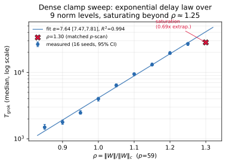
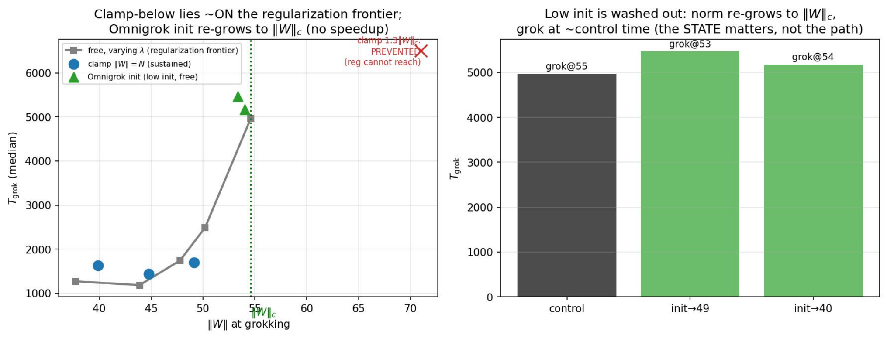
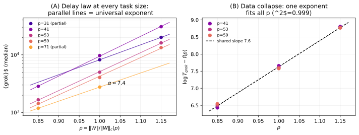
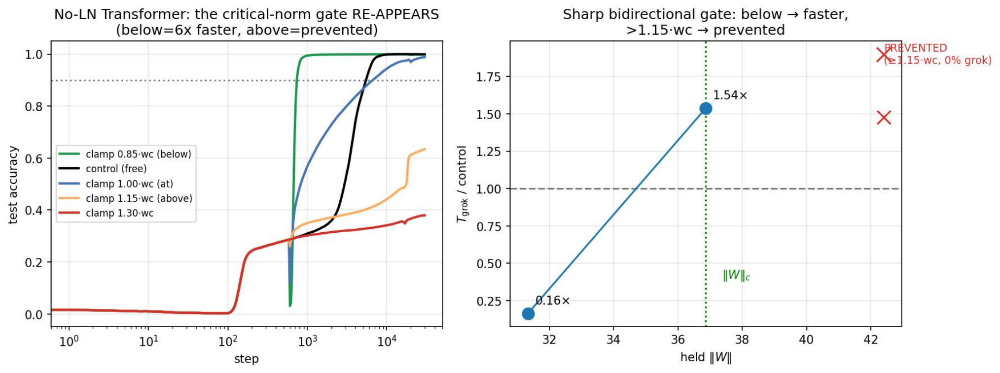

# Truong et al. 2026 — The Weight Norm Sets the Grokking Timescale: A Causal Delay Law

See also: [the global concept index](../../concepts/index.md).

arXiv [2606.13753v1](https://arxiv.org/abs/2606.13753), 11 June 2026. PDF running head: "arXiv:2606.13753v1 [cs.LG] 11 Jun 2026". 2 citations. The source is the native arXiv HTML (LaTeXML) of version v1.

**Truong Xuan Khanh, Luu Duc Trung** — H&K Research Studio / Clevix LLC, Hanoi, Vietnam. **Doan Hoang Viet** — Bac A Bank, Hanoi. **Phan Thanh Duc** — Banking Academy of Vietnam. Correspondence: khanh@clevix.vn

The files of this paper's analysis:

- [`2606.13753.the-weight-norm-sets-the-grokking-timescale-a-causal-delay-law.license.txt`](2606.13753.the-weight-norm-sets-the-grokking-timescale-a-causal-delay-law.license.txt) — the arXiv licence record for this paper.

The anchor scheme and the rules for linking into a card are in the [README of the papers folder](../README.md).

**Excerpt card.** The paper's licence (`arxiv-nonexclusive`) does not permit republishing the paper itself; what stands here are the editorial sections and the fragments the corpus quotes (right of quotation). The paper: <https://arxiv.org/abs/2606.13753>.

## Concepts covered

**[Weight norm minimisation](../../concepts/weight-norm-minimization.md)** — the most direct evidence for this line available in the corpus, because for the first time the norm is not observed but **imposed**: a step-wise projection holds $\|W\|=\rho\,\|W\|_{c}$, and the network groks at exactly the value held ($46.4,54.6,62.8,71.0$ at $\rho=0.85,1.00,1.15,1.30$) rather than at some one value ([`p5-9`](#p5-9), [`fig-2`](#fig-2)). The evidence is one-sided, though: what is confirmed is the norm's role as a clock rather than as a destination. The low-norm solution ceases to be what the network must arrive at — the concentrated $\|W\|_{c}$ is declared the norm the relaxation *manages to reach* rather than a value the grokking requires ([`p11-5`](#p11-5)). What is absent here: norm minimisation as a subject — the zero-loss manifold, motion along it and the limiting norm the work does not analyse at all.

**[The spherical norm constraint](../../concepts/spherical-weight-norm-constraint.md)** — the notion receives its first **dose–response** sweep. Previously the corpus knew rescaling to a single value (Zhang et al. with a norm of 30) and a periodic projection onto the unit sphere (Lyle et al.); here the projection is set at ten levels $\rho\in\{0.85,0.90,\dots,1.30\}$ and the resulting delay is measured ([`p6-3`](#p6-3), [`fig-3`](#fig-3)). Whence too the corpus's first negative control on the act of projecting itself: the arm $\rho=1.00$ applies the same step-wise projection but at the network's natural norm, and groks on the free schedule ([`p12-5`](#p12-5)). It is stipulated that the clamp acts by a single common multiplier and therefore fixes the total magnitude, leaving the optimiser free to redistribute the norm across layers; a layerwise clamp was not run ([`p8-1`](#p8-1)).

**[Causal ablation](../../concepts/causal-ablation-intervention.md)** — a set of negative controls with almost no equal in the corpus, and one more valuable than the law itself. The seed is derived from the baseline setting alone, *excluding* the intervention, so that the initialisation, the data split and the pre-intervention trajectory are shared by the control and by every clamp ([`p4-10`](#p4-10)). There are four controls: the projection at $\rho=1.00$ against the value of the norm ([`p12-5`](#p12-5)); the weight-decay frontier against "this is just a stronger regularisation" ([`p7-1`](#p7-1), [`fig-4`](#fig-4)); a one-off nudge against continuous holding ($1.2\times$ against $7.3\times$) ([`p7-2`](#p7-2)); and layerwise shares against inter-layer structure ([`p8-1`](#p8-1)). Each answers a countervailing explanation named aloud — an arrangement rare in the corpus.

**[Correlation traps](../../concepts/correlation-traps.md)** — the work is built entire as a way out of such a trap and says so itself: the observational section is expressly marked as observational, and its causal status is deferred until the intervention ([`p5-2`](#p5-2)). The trap is meanwhile reproduced within the work too: the coincidence in time of the norm's relaxation with the rise of the Fourier concentration is called a coincidence rather than an effect, and the caveat is repeated three times ([`p5-6`](#p5-6), [`p8-1`](#p8-1), [`p11-6`](#p11-6)).

**[The norm-separation delay law](../../concepts/norm-separation-delay-law.md)** — the relation to the accompanying theory of the same group ([Truong et al. 2026](../2603.13331.the-norm-separation-delay-law-of-grokking-a-first-principles-theory-of-delayed-generalization/2603.13331.the-norm-separation-delay-law-of-grokking-a-first-principles-theory-of-delayed-generalization.card.md)) is arranged as a division of regimes: that theory gives a **logarithmic** delay of free contraction, $T_{\mathrm{grok}}-T_{\mathrm{mem}}\approx(2\kappa\,\eta\lambda)^{-1}\log(V_{\mathrm{mem}}/V_{\star})$, whereas the clamp **blocks** the contraction path and measures the exponential cost of being held away from the threshold ([`p9-1`](#p9-1), [`p4-1`](#p4-1)). A quantitative agreement of the exponent $\alpha\approx 7.5$ with the closed formula the authors expressly do **not** claim. It matters what is absent here: the earlier work's reference experiment is described as "a causal check by freezing the norm", which is not set up in that work (see [`mc-2603-13331`](#mc-2603-13331)).

**[Grokking](../../concepts/grokking.md)** — one of the corpus's stock observations is reinterpreted: the "prevention" of grokking by a high norm is declared not a separate phenomenon but the tail of an exponential at a finite budget. The argument is experimental and twofold: at $\rho=1.30$ no seed groks before $20{,}000$ steps, but by $30{,}000$ $12$–$16/16$ do ([`p6-1`](#p6-1)); and on an unnormalised attention model the case $\rho=1.15$ at a budget of $30{,}000$ plateaued below $0.9$ and looked like prevention, whereas at an extended budget it grokked at $\approx 7.4\times 10^{4}$ steps ([`p9-4`](#p9-4), [`fig-8`](#fig-8)). The authors' caveat is in place: the existence of an upper threshold $\rho^{*}$ at norms far above those checked they leave open ([`p12-4`](#p12-4)).

**[Weight decay](../../concepts/weight-decay.md)** — here it is not a means of acceleration but what sets the **location** of the threshold and **fails to reach** half of its neighbourhood. The critical norm shifts with $\lambda$ ($\approx 49,55,63$ at $\lambda=3,1,0.3$), consistently with the equilibrium norm of weight decay ([`p5-5`](#p5-5)). Whence the section's chief argument: free training at $\lambda\in\{1,2,3,5,8\}$ traces a frontier in the plane "norm at grokking — time", the downward clamps fall **on** it (and the authors honestly decline to count the downward acceleration as a separate effect), while the upward clamps lie outside it, since weight decay can only lower the equilibrium norm ([`p7-1`](#p7-1), [`fig-4`](#fig-4)).

**[The direction of weight decay's influence](../../concepts/weight-decay-direction.md)** — here the work adds a distinction the corpus did not have: the acceleration from a stronger weight decay and the acceleration from a downward norm clamp are **indistinguishable** and are declared one and the same, whereas the slowdown from an upward clamp is in principle irreproducible by regularisation ([`p7-1`](#p7-1)). On sparse parity this distinction disappears: there the clamp falls on the weight-decay frontier in both directions ([`p11-2`](#p11-2)).

**[The Goldilocks zone](../../concepts/goldilocks-zone.md)** — the notion receives a causal reading and, in its weight-space rendering, requires reformulation. The narrow interval of norm in which grokking is observed turns out to be an attracting equilibrium of the weight decay rather than a condition of generalisation: the network groks both above and below it ([`p11-5`](#p11-5)). The concentration reported by [Manir & Rupa](../2603.25009.a-systematic-empirical-study-of-grokking-depth-architecture-activation-and-regularization/2603.25009.a-systematic-empirical-study-of-grokking-depth-architecture-activation-and-regularization.card.md) (a spread of $14.5\%$, one seed per setting) is accepted here as confirmed and tightened to $1$–$2\%$ by fixing the task and $\lambda$ ([`p2-3`](#p2-3), [`p5-3`](#p5-3)).

**[The initialisation scale](../../concepts/initialization-scale.md)** — a direct experiment against the weight-space reading of [Omnigrok](../2210.01117.omnigrok-grokking-beyond-algorithmic-data/2210.01117.omnigrok-grokking-beyond-algorithmic-data.card.md): a low-norm initialisation with subsequent free training is **washed out** — the norm relaxes back to $\|W\|_{c}$ and the grokking proceeds on the free schedule rather than being accelerated by the low start ([`p7-1`](#p7-1), [`fig-4`](#fig-4)). From the delay law this follows directly: the held norm is changed only by continuous holding rather than by an initial value.

**[The learning rate](../../concepts/learning-rate.md)** — for the first time in the corpus two axes are separated on one grid: a full $\rho\times\eta$ matrix shows that the norm changes $T_{\mathrm{grok}}$ by $\approx\!19\times$ while an eightfold change of $\eta$ changes it by only $\approx\!2\times$, with the curves at different $\eta$ nearly parallel ([`p6-2`](#p6-2), [`tab-1`](#tab-1)). This is a direct answer to the explanation through an effective learning rate ([Lyle et al.](../2507.20057.what-can-grokking-teach-us-about-learning-under-nonstationarity/2507.20057.what-can-grokking-teach-us-about-learning-under-nonstationarity.card.md)), accepted here not as a refutation but as a narrowing of scope ([`p3-1`](#p3-1)). Separately: at a sufficient weight decay ($\lambda=3$) the value of $\|W\|_{c}$ itself hardly depends on $r$ over a tenfold range, although the grokking time changes sevenfold ([`p5-3`](#p5-3)).

**[The optimiser](../../concepts/optimizer-adam-adamw-sgd.md)** — AdamW enters the argument twice and both times as an agent rather than as background. The clamp deliberately **does not reset** the moments, in order to separate the state of the norm from the effective learning rate ([`p5-8`](#p5-8)); and it is precisely the optimiser's ability to bring the norm back to equilibrium that is declared the reason why a one-off nudge is washed out and the effect requires continuous holding ([`p7-2`](#p7-2)). There is no comparison with other optimisers.

**[The memorisation phase](../../concepts/memorization-phase.md)** — it is clarified where on the trajectory the grokking stands: the norm spikes at the memorisation (a peak at around step $340$), then the weight decay relaxes it, and the grokking occurs **on the descent** ([`p5-6`](#p5-6), [`fig-1`](#fig-1)). The intervention step $t_{\mathrm{int}}$ is chosen "after the memorisation, before the grokking" and is nowhere given as a number ([`p4-10`](#p4-10)).

**[Modular arithmetic](../../concepts/modular-arithmetic.md)** — the proving ground is the usual one: $(a+b)\bmod p$, the full table of $p^{2}$ pairs, a fraction $\alpha$ in training ([`p4-4`](#p4-4)). What is new for the corpus is the scaling of the critical norm with the modulus, measured twice: $\|W\|_{c}\propto p^{0.38}$ at $p=\{29,41,59,79,97\}$ ([`p5-5`](#p5-5)) and $\propto p^{0.44}$ at $p=\{31,41,53,59,71\}$ ([`p8-3`](#p8-3), [`fig-5`](#fig-5)). The guess as to why it is here that a high-norm regime unreachable by regularisation exists — "modular addition is solved by an almost unique Fourier construction pinned to a particular scale" — is presented outright as a guess rather than as a checked claim ([`p11-2`](#p11-2)).

**[Sparse parity](../../concepts/sparse-parity.md)** — the check task on a non-Fourier structure, and the carry-over comes out exactly by half. What carries over is the concentrated, weight-decay-set grokking norm independent of the learning rate (a fourfold range of $r$ changes the norm by $\approx 3\%$ at a $\sim\!4\times$ change of time). What does not carry over is the chief thing — a delay from above unreachable by regularisation: the grokking norm here depends on the volume of data, and the clamp falls on the weight-decay frontier in both directions ([`p11-1`](#p11-1), [`p11-2`](#p11-2), [`tab-2`](#tab-2), [`fig-9`](#fig-9)).

**[Fourier features and circuits](../../concepts/fourier-features-circuits.md)** — the relation is declared temporal only and is caveated three times: the Fourier concentration of the embedding (the Gini coefficient of the power spectrum) rises in the same window as the relaxation of the norm, but there is no intervention on the circuits ([`p4-7`](#p4-7), [`p5-6`](#p5-6), [`p8-1`](#p8-1)). The heading "A bridge between two explanations" and its place in the list of contributions meanwhile sound stronger than what is shown ([`p11-6`](#p11-6), [`p2-1`](#p2-1)).

**[Phase transition](../../concepts/phase-transition.md)** and **[the order parameter](../../concepts/order-parameter.md)** — the claim is methodological: instead of an analogy, it is proposed to name a scalar control parameter and to measure its causal effect on the transition's time scale, "treating grokking as a phenomenon to be measured rather than merely likened to something" ([`p4-2`](#p4-2)). The weight norm is that parameter. A caveat about the finite range of sizes stands alongside: the exponent is called common over the *range checked* rather than provably universal ([`p8-3`](#p8-3)).

**[Double descent](../../concepts/double-descent.md)** — taken as a contrast, and this is the weakest place of the neighbours' analysis: the claim that double descent "is analytically a saddle-node bifurcation" with an exponent $\delta=1/2$ is neither derived, nor measured, nor supported by a reference in the paper ([`p4-3`](#p4-3), [`p12-2`](#p12-2)). The two places themselves besides differ in the force of the conclusion — see "Inconsistencies".

**[Neural collapse](../../concepts/neural-collapse.md)** — the work leans twice on the concurrent study of Rupa 2026 (arXiv:2604.00230, no card in the corpus): as an independent report of the same decoupling of speed and threshold for a *different* observable, the norm of the penultimate layer's features ([`p2-3`](#p2-3)), and as a null result that **prompted** the design of the experiment: a one-off rescaling of the feature norm followed by release changes nothing, because the norm rights itself again ([`p3-2`](#p3-2)).

**[The sparse subnetwork / the lottery ticket](../../concepts/sparse-subnetwork-lottery-ticket.md)** — the argument of [Minegishi et al.](../2310.19470.bridging-lottery-ticket-and-grokking-understanding-grokking-from-inner-structure-of-networks/2310.19470.bridging-lottery-ticket-and-grokking-understanding-grokking-from-inner-structure-of-networks.card.md) (a norm-matched dense network generalises more slowly than a sparse one) is accepted as showing that the norm is **not sufficient** and is assigned to the narrowing of scope ([`p3-1`](#p3-1)). It gets no direct answer: the present work speaks of the sufficiency of the norm for governing **time** rather than for generalisation, and it does not draw that distinction in the text.

**[The canonical grokking proving ground](../../concepts/canonical-grokking-testbed.md)** — the proving ground is shifted: the principal model here is not a transformer but a two-layer MLP over learnt embeddings ($d=128$, $H=256$, GELU), trained full-batch with AdamW at $r=10^{-3}$, $\lambda=1$, on $12$–$16$ seeds ([`p4-5`](#p4-5), [`p4-6`](#p4-6)). A single-layer attention model is used only in the architecture analysis, in two forms — with LayerNorm and without ([`p9-2`](#p9-2)).

A separate methodological finding the corpus would do well to inherit besides the law itself: **in a normalised network "the weight norm" must mean the functionally significant norm after the normalisation rather than the raw total one** ([`p10-1`](#p10-1)). Under LayerNorm the total norm at grokking is not concentrated (a coefficient of variation of $0.15$–$0.17$), while the threshold returns at the unembedding $U$ (a spread of $0.03$–$0.05$, $\|U\|_{c}\propto p^{0.77}$) ([`p9-3`](#p9-3), [`fig-7`](#fig-7)). Whence too an explanation of two others' null results: the matched norm clipping of [Verma](../2605.20441.weight-decay-regimes-in-grokking-transformers-cheap-online-diagnostics/2605.20441.weight-decay-regimes-in-grokking-transformers-cheap-online-diagnostics.card.md) and the geometry of [Yildirim](../2603.05228.the-geometric-inductive-bias-of-grokking-bypassing-phase-transitions-via-architectural-topology/2603.05228.the-geometric-inductive-bias-of-grokking-bypassing-phase-transitions-via-architectural-topology.card.md) are set under normalisation, in which the total norm is functionally inert ([`p3-2`](#p3-2)).

Merely mentioned, without analysis: [progress measures](../../concepts/progress-measures.md) and [hidden progress](../2207.08799.hidden-progress-in-deep-learning-sgd-learns-parities-near-the-computational-limit/2207.08799.hidden-progress-in-deep-learning-sgd-learns-parities-near-the-computational-limit.card.md) — in a single line of the survey ([`p2-2`](#p2-2)); [circuit efficiency](../../concepts/circuit-efficiency.md) — in the same place, as a competition of memorising and generalising circuits; [the lazy-to-rich transition](../../concepts/lazy-to-rich-kernel-to-feature-learning.md), [margin maximisation](../../concepts/margin-maximization-implicit-bias.md) and [emergence](../../concepts/emergence.md) — one reference each in the survey ([`p2-3`](#p2-3), [`p4-2`](#p4-2)); [real-world data](../../concepts/vision-real-world-data-mnist-cifar.md) — only as the place in which Golechha works ([`p3-1`](#p3-1)); and [effective theory](../../concepts/effective-theory-statistical-mechanics.md) — as a "statistical-physics-style reading" whose frame the work declines in favour of measurement ([`p4-2`](#p4-2)).

It is worth saying separately what the work does **not** contain. There is not a single check on real data — neither MNIST nor language: the whole argument rests on modular addition and sparse parity ([`p12-6`](#p12-6)). There is no derivation of the exponent $\alpha$ from anything — it is measured, and its derivation from the joint dynamics of the norm and the angle is expressly left to future work ([`p9-1`](#p9-1)). There is no explanation of why $\alpha$ on the unnormalised transformer is twice that on the MLP — the form of the law carries over but not its rate ([`p9-4`](#p9-4), [`fig-6`](#fig-6)). There is no continuous layerwise clamp, and so nothing is claimed about independently holding each layer's norm ([`p8-1`](#p8-1)). And there is no number for the intervention step $t_{\mathrm{int}}$, although it is precisely that which sets how long the network spent in free dynamics ([`p4-10`](#p4-10)).

**[Grokking time](../../concepts/grokking-time.md)** — the claim is causal rather than correlational: the weight norm governs the time, and this is shown by an intervention on the norm rather than by a coincidence of its value with the moment of the transition ([`p1-2`](#p1-2)).

**[The universality hypothesis](../../concepts/universality-hypothesis.md)** — the word is taken in its physical sense: double descent is placed in a different universality class from the transition studied here ([`p4-3`](#p4-3)). This is a claim about critical exponents rather than about the sameness of the algorithms learnt.

**[Selective weight decay](../../concepts/selective-weight-decay.md)** — the decoupled decay is applied only to the weight matrices ([`p4-6`](#p4-6)), and the same division is checked by intervention: a one-off scaling of any individual group — the embeddings, the hidden layer or the output — leaves the time within three per cent of the control ([`p7-2`](#p7-2)). So the matter lies not in the norm of an individual group but in the overall state of the norm.
## Points we could not reconcile

The card editor's remarks following the analysis of the claims (`…claims.txt`). All ten are discrepancies within the work itself rather than objections in substance. The last three are visible only in the figures' rasters and do not contradict the captions: the captions either bypass or remove them.

**The upper edge of the exponential is named in four different ways.** §5 keeps the exponential "through $\rho=1.25$" and assigns the sub-exponentiality to $\rho\approx 1.30$ ([`p6-1`](#p6-1)); §6 writes that "beyond $\rho\approx 1.15$ the growth is sub-exponential" and reports the law over $\rho\in[0.85,1.15]$ ([`p8-4`](#p8-4)); the list of contributions gives the interval $[0.85,1.15]$ in item 2 and a saturation "beyond $\rho\approx 1.25$" in item 3 ([`p2-1`](#p2-1)); and table 3 gives $[0.85,1.25]$ with a saturation "beyond $\rho\approx 1.25$" ([`tab-3`](#tab-3)). The cause of the divergence is visible (in the sweep over $p$ the point $1.25$ is simply absent, while in the dense sweep at $p=59$ it is present), but it is not stipulated in the text.

**The caption of figure 3 counts the levels differently from the body.** The body: "At nine levels $\rho\in[0.85,1.25]$ the delay is a pure exponential" ([`p6-3`](#p6-3)). The caption: "is exponential ... at ten levels $\rho\in[0.85,1.25]$" ([`fig-3`](#fig-3)). Ten levels is the whole sweep $\{0.85,0.90,\dots,1.30\}$, including $\rho=1.30$, which the same caption two sentences later declares to fall below the extrapolation. The same arithmetic is repeated in table 3 ("a dense $\rho$ sweep over 10 levels" against the interval $[0.85,1.25]$) ([`tab-3`](#tab-3)).

**The experimental design promises no truncation; the caption of table 1 admits it.** §5: the budget of $30{,}000$ steps is taken "generous ... so that the slow conditions are observed to completion rather than being truncated" ([`p5-8`](#p5-8)). The caption of table 1: in the row $\rho{=}1.30$ at $\eta\in\{1,4\}\times 10^{-3}$ $12$–$14/16$ grok, "the remaining seeds are right-censored at $30{,}000$, so these two medians are slightly understated" ([`tab-1`](#tab-1)). The promise and the admission stand on one page; the re-run at a budget of $160{,}000$ in §6 removes the discrepancy, but after the fact.

**Double descent: §2 assigns it to a different universality class, §9 declines that conclusion.** §2: a saddle-node bifurcation with a different critical exponent, "which places it in a different universality class from the grokking transition studied here" ([`p4-3`](#p4-3)). §9: "We draw the contrast at the level of mechanism ..., rather than claiming different universality classes from exponents, given the limited range of sizes" ([`p12-2`](#p12-2)). The second directly removes the first, but the first is not corrected.

**The exponent in the system size is measured twice and differently.** $\|W\|_{c}\propto p^{0.38}$ in §4 at $p=\{29,41,59,79,97\}$ ([`p5-5`](#p5-5)) and $\propto p^{0.44}$ in §6 at $p=\{31,41,53,59,71\}$ ([`p8-3`](#p8-3)), the second being called "consistent" with the first with no estimate of spread whatever. The sets of moduli are indeed different, but this is not said.

**The ratio at $\rho=1.30$ and $p=59$ is given twice with different numbers.** §5: the delay falls below the extrapolation "$\approx\!0.69\times$, which matches the value from the $p$ sweep in §6" ([`p6-3`](#p6-3)). §6: "at $p=59$ — a ratio of $0.71$" ([`p8-4`](#p8-4)). The discrepancy is small, but the word "matches" ascribes a coincidence where the numbers do not coincide.

**Two failures are read asymmetrically.** The failure to grok from above ($\rho=1.30$ at a short budget) is declared a tail of a finite budget and is not counted as a separate phenomenon ([`p6-1`](#p6-1)). The failure to grok from below ($p=31$ at $\rho=0.85$, a held $\|W\|=34$) is declared "the smallest workable norm", that is, a property of the task — although it is described in the same words: does not grok within the budget, the validation accuracy creeps up slowly ([`p8-4`](#p8-4)). An extended budget for the lower edge, unlike the upper one, was not run.

**Panel A of figure 1 contains points absent from the claim about the spread.** The caption says that the norm at grokking is "concentrated and hardly depends on the training-data fraction $\alpha$ (a coefficient of variation of $1$–$2\%$) **at each $p$**" ([`fig-1`](#fig-1)), whereas the body computes the spread over $\alpha=\{0.30,0.35,0.40,0.50,0.65\}$ ([`p5-3`](#p5-3)). In the panel itself the sweep begins at $\alpha=0.20$, and the leftmost points go far beyond $2\%$: at $p=59$ the value falls to about $50.5$ against $54.8$–$56.4$ over the rest of the interval (about $8$–$10\%$), and at $p=79$ to about $56.8$ against $61$–$63$. The body does not stipulate the narrowing of the interval, and the caption carries the figure of $1$–$2\%$ over to the whole panel.

**Figures 4 and 8 are labelled inside the raster with the word "prevented" where the text removes it.** In figure 4 the clamp point $1.3\,\|W\|_{c}$ carries a red cross and the label `PREVENTED (reg cannot reach)`, although §5 declares that same case a delay and reports that by $30{,}000$ steps $12$–$16/16$ seeds grok ([`p6-1`](#p6-1)); the caption of figure 4 does not use the word "prevention" and does not remove the discrepancy ([`fig-4`](#fig-4)). In figure 8 the raster carries `PREVENTED (>=1.15 wc, 0% grok)`, but here the caption removes the discrepancy outright, stipulating the original budget and calling the plateaux a tail at a finite budget ([`fig-8`](#fig-8), [`p9-4`](#p9-4)).

**Figure 7 has a third panel absent from its caption.** The caption describes only panels **(A)** and **(B)** ([`fig-7`](#fig-7)), whereas the raster contains a panel **(C)** — a textual one, with a plan of the experiment: `clamp ||U|| -> should GATE grokking`, `clamp upstream -> should NOT (LN-washed)`. This is a prediction made before the experiment, and §7 does not confirm it: clamping any individual group, **including** $\|U\|$, shifts the grokking only weakly and non-selectively, up to $\sim\!2\times$ ([`p9-4`](#p9-4)). The work sets out the outcome evenly, without noting that the discriminating prediction failed, and the panel with the prediction remains in the figure.

## What is proved, what is shown and what is conjectured

**The causal half is done exemplarily.** Five separate countervailing explanations are named aloud and each closed by its own control: not the projection ([`p12-5`](#p12-5)), not the regularisation ([`p7-1`](#p7-1)), not a nudge but the holding ([`p7-2`](#p7-2)), not inter-layer structure ([`p8-1`](#p8-1)), not the learning rate ([`p6-2`](#p6-2)). The matched counterfactual is arranged so that there is nothing else to which the difference could be ascribed ([`p4-10`](#p4-10)). For the corpus this is the most valuable thing in the work — more valuable than the law itself.

**The exponential is shown densely rather than fitted on three points.** A sweep over ten levels at $p=59$, all $16/16$ seeds with no truncation, $\alpha=7.64$ with an interval $[7.47,7.81]$ and $R^{2}=0.994$ over a thirtyfold range of times ([`p6-3`](#p6-3)). This is a direct answer to an objection the authors raise against themselves.

**The argument for a common exponent is set out in numbers that do not add up.** The point estimates fall strictly monotonically ($7.92,7.56,7.42,7.07$ at $p=41,53,59,71$); it is said that the bootstrap intervals of all four overlap "in $[7.06,7.38]$", and the common estimate is given as $7.49$ with an interval $[7.16,7.69]$ — that is, the common estimate lies outside the declared region of overlap ([`p8-3`](#p8-3)). The rebuttal "this is seed noise" rests on a reduction of the residual sum of squares only from $0.054$ to $0.037$ for three extra degrees of freedom, and the conclusion "which no model-selection criterion would justify" is said more strongly than it is shown at twelve points.

**The comparison "norm against learning rate" depends on the ranges chosen.** $19\times$ against $2\times$ compares the interval $\rho\in[0.85,1.30]$ with an eightfold range of $\eta$ ([`p6-2`](#p6-2)). A stronger argument is not written out in the text: an eightfold change of $\eta$ gives a factor of two, whereas a one-and-a-half-fold change of the norm gives a factor of nineteen, so the response is not explained by the ratio $\eta/\|W\|$, and the objection about an effective learning rate is removed by that rather than by the ranges.

**The critical norm is defined observationally rather than derived.** $T_{\mathrm{grok}}$ is the first step at a validation accuracy $\geq 0.9$, and $\|W\|_{c}$ is simply the value of the norm at that moment ([`p4-7`](#p4-7)). Robustness to the threshold is checked ($0.8/0.9/0.95$ change the norm by under $2\%$) and turned into an argument that this is an internal state ([`p5-4`](#p5-4)); but the work gives no independent characterisation of $\|W\|_{c}$, and all the $\rho$ are reckoned from the measured value.

**The bridge to the circuits is weaker than its heading.** There is no intervention on the circuits, and the authors acknowledge this three times ([`p5-6`](#p5-6), [`p8-1`](#p8-1), [`p11-6`](#p11-6)) — yet item 6 of the list of contributions and the heading "A bridge between two explanations" place the relation on a par with the measured results ([`p2-1`](#p2-1)). The hedge is present in the text; in retelling it is the first thing to fall away.

**The exponent $\delta=1/2$ for double descent is supported by nothing.** Neither a derivation, nor a measurement, nor a reference: [14, 15] — Belkin et al. and Nakkiran et al. — contain no such claim ([`p4-3`](#p4-3), [`p12-2`](#p12-2)).

**Two references are unverifiable by construction.** "Our own earlier report", which read a high norm as prevention, is not named ([`p6-1`](#p6-1)); and the DOI of the full raw dataset on Zenodo "will be inserted at the proof stage" ([`p13-2`](#p13-2)). The claim being corrected and the full data at source thus cannot be checked.

**Its place in the corpus.** The work moves the weight line from observation into intervention and does so with rare care. Its content is most precisely stated thus: on modular addition with a two-layer MLP under AdamW at $\lambda=1$, and on a single-layer attention model **without** LayerNorm, a step-wise projection of all the weights onto a prescribed norm yields an exponential dose–response of the grokking time over $\rho\in[0.85,1.15]$ with a saturation above; on a normalised network the control disappears, on sparse parity it carries over by half, and on real data it was not checked at all.

## Common misreadings and overstatements

These are the card editor's remarks, not the authors' text: places where this paper restates someone else's results with an error, or without the qualifications their authors attached. The "details" links in the "Common misreadings and overstatements of this paper" sections of the cited works' cards lead here.

###### mc-2603-13331
**Truong et al. (2603.13331) — an experiment with a norm freeze ascribed to them.** The present work three times describes its clamp as "a continuous-dose version of the norm-freeze causal intervention" used by the norm-separation delay theory: `"this is a continuous-dose version of the norm-freeze causal intervention those accounts use to establish necessity (freezing the norm prevents grokking)"` ([`p9-1`](#p9-1)); the same in item 3 of the list of contributions ([`p2-1`](#p2-1)) and in §9 ([`p11-5`](#p11-5)). There is no experiment freezing or fixing the norm in the [work cited](../2603.13331.the-norm-separation-delay-law-of-grokking-a-first-principles-theory-of-delayed-generalization/2603.13331.the-norm-separation-delay-law-of-grokking-a-first-principles-theory-of-delayed-generalization.card.md): necessity there is established by **theorem** 3.8 and checked by a negative example on sparse parity, in which the norm ratio is inverted and there is no delay in 15 runs out of 15. The only intervention analysed in that work is architectural and someone else's (Yildirim 2026), and it acts in the **opposite** direction: fixing the norm on a hypersphere collapses the norm gap, whereupon the model generalises at once, bypassing the memorisation plateau. Thus "freezing the norm prevents grokking" is not only not set up in the work cited but diverges from the only experiment with a fixed norm described there. The present work's own result is unaffected — the dose–response is measured here and stands on its own controls; what suffers is the account of the relation between the two works, and with it the mildness with which it is said that the clamp "confirms the chief claim of that picture".

###### mc-2603-25009
**Manir & Rupa (2603.25009) — a number retracted by the authors themselves.** The survey conveys their comparison of architectures thus: `"the Transformer–MLP gap nearly vanishes ($1.11\times$ delay) under matched hyperparameters"` ([`p2-3`](#p2-3)). The number does exist in the [work cited](../2603.25009.a-systematic-empirical-study-of-grokking-depth-architecture-activation-and-regularization/2603.25009.a-systematic-empirical-study-of-grokking-depth-architecture-activation-and-regularization.card.md), but that work also retracts it: `"This is our definitive architecture comparison, superseding H2’s 1.11$\times$ (which used a suboptimal $\lambda=1.0$ for the Transformer)."`, and the "true" gap at each architecture's own tuned $\lambda$ there equals $1.90\times$. The words "under matched hyperparameters" convey precisely what the work cited declares to be the cause of the error: $\lambda=1.0$ was matched formally and proved suboptimal for the transformer. The same work's other numbers are conveyed accurately ($0.0219\pm 0.0032$, a spread of $14.5\%$, $6.9\times$), so the error is local; but it is on this number that the survey's conclusion about the architecture's being secondary rests.

---

# Quoted fragments

Only the fragments the corpus cards refer to are
reproduced here (right of quotation); the paper's licence does not permit
republishing the whole text. Anchor numbering matches the original.

###### p1-2

We show that the weight norm causally controls the *timescale* of grokking, reconciling two opposing accounts: that grokking occurs at a critical weight norm, and that the norm is not the operative variable. On modular arithmetic, a network first memorizes by raising its weight norm and then relaxes under weight decay; under free dynamics generalization emerges as the norm reaches a sharply concentrated value $\|W\|_{c}$ ($1$–$2\%$ across a two-fold range of training fractions, nearly unchanged across a ten-fold range of learning rates), matching recent threshold reports. We then intervene: a matched-counterfactual clamp holding $\|W\|=\rho\,\|W\|_{c}$ throughout training shows the network groks *at whatever norm it is held at* — no single norm is required — with the time to grok growing as an exponential delay law $T_{\mathrm{grok}}\propto e^{\alpha\rho}$ ($R^{2}>0.99$). Across five tested moduli (four usable for the fit) this is a *scaling law*: one shared exponent $\alpha\approx 7.5$ collapses the delay ($R^{2}=0.996$), the norm entering only through its value relative to $\|W\|_{c}(p)$. Holding the norm above $\|W\|_{c}$ thus delays grokking rather than preventing it — an apparent “prevention” under a fixed budget is the finite-budget tail of this law — and the norm dominates the grokking time ($\approx\!19\times$) over the learning rate ($\approx\!2\times$). This reconciles the camps: the concentrated $\|W\|_{c}$ is the norm the relaxation *reaches* on its natural timescale, not a hard gate, so grokking is seen above and below it; the result is a causal complement to norm-separation delay theory, whose closed-form delay is logarithmic in the norm ratio under free contraction. The effect is altered by *LayerNorm*, which decouples the weight-norm scale from the function. On an un-normalized attention model the delay law recurs with its own exponent ($\alpha_{2}\approx 15$, $R^{2}=0.999$; $\approx 2\times$ the MLP), so the *form* of the law is cross-architectural while its rate is not. A concentrated, regularization-set grokking norm also recurs on a non-Fourier task (sparse parity), although the above-norm delay does not fully transfer.

**Keywords:** grokking; delayed generalization; weight norm; critical norm; causal intervention; weight decay; delay law; scaling law; mechanistic interpretability; learning dynamics.

###### p2-1

1. **A concentrated grokking norm under free dynamics.** Trained freely, the model groks when the weight norm reaches a sharply concentrated value $\|W\|_{c}$: for fixed task size and weight decay, $\|W\|_{c}$ varies by only $1$–$2\%$ across a two-fold range of training fractions and is nearly invariant across a ten-fold range of learning rates (§4). Concurrent studies report the same rate-vs-threshold dissociation [18, 19]; we corroborate it and then show, causally, that it is a *rate* phenomenon.
2. **The weight norm causally sets the grokking timescale (a delay law).** A matched-counterfactual clamp that holds $\|W\|=\rho\,\|W\|_{c}$ throughout training reveals three things (§5): (i) the network groks at *whatever* norm it is held at — there is no single norm grokking requires; (ii) over $\rho\in[0.85,1.15]$ the time to grok follows a clean exponential delay law $T_{\mathrm{grok}}\propto e^{\alpha\rho}$ ($R^{2}>0.99$); (iii) holding the norm above $\|W\|_{c}$ therefore *delays* grokking rather than preventing it — an apparent “prevention” under a fixed budget is the finite-budget tail of this exponential. The norm is the dominant control of grokking time ($\approx\!19\times$ across the range), with the learning rate a secondary, dissociable modulator ($\approx\!2\times$).
3. **The delay is a scaling law with a shared exponent across task sizes.** Repeating the clamp across five tested moduli $p$, the four usable sizes collapse onto a single exponential in the *relative* norm $\rho=\|W\|/\|W\|_{c}(p)$: one shared exponent $\alpha\approx 7.5$ fits them with $R^{2}=0.996$ (per-$p$ CV $4.1\%$ over the tested $1.7\times$ size range), establishing a causal scaling law rather than a per-task fit (§6). We report its limits honestly — sub-exponential saturation beyond $\rho\approx 1.25$ and a minimum-norm floor at the smallest $p$ (which is why it is excluded from the fit) — and relate it to norm-separation delay theory [28]: that theory predicts a *logarithmic* free-training delay via norm contraction, whereas our clamp blocks contraction and is a continuous-dose version of the norm-freeze causal test, confirming the norm as the operative variable (we do not claim a quantitative match of the exponent to a closed-form prediction).
4. **Recurrence across architectures, and the role of normalization.** The delay law recurs on a second, un-normalized attention model with its own exponent ($\alpha_{2}\approx 15$, $R^{2}=0.999$; grok-at-held-norm and high-norm saturation as on the MLP), and is altered by LayerNorm, which decouples the weight-norm scale from the function; only the functionally relevant unembedding norm stays concentrated. The weight norm controls the timescale when it sets the function scale (§7).
5. **Task generality on a non-Fourier task.** On sparse parity, grokking again occurs at a concentrated, weight-decay-set, learning-rate-invariant norm, and the norm again acts through the rate rather than a hard threshold (§8).
6. **A temporal link to the circuit account.** Fourier-feature concentration rises in the same norm-relaxation window. This temporal alignment is consistent with — but does not establish — norm relaxation organizing the feature formation of the circuit account; we do not intervene on the circuits directly, and we make the connection only at the correlational level.

###### p2-2

**Grokking: phenomenology and mechanism.** Grokking was identified by Power et al. 2022 on small algorithmic tasks, where test accuracy rises abruptly long after the training set is fit. Nanda et al. 2023 reverse-engineered the learned solution on modular arithmetic as a small set of Fourier-frequency circuits implementing a trigonometric identity, and introduced progress measures (e.g. a restricted loss) that improve smoothly before the visible jump; Gromov 2023 gave analytic constructions of such solutions, and Barak et al. 2022 showed on sparse parity that hidden progress accumulates throughout the plateau. Varma et al. 2023 framed grokking as competition between a memorizing and a generalizing circuit of differing parameter efficiency, with weight decay tipping the balance. These works establish *what* the network computes and that progress is gradual; our focus is the scalar control variable — the weight norm — and its causal role in triggering the transition.

###### p2-3

**A concentrated weight-norm threshold: an emerging, but purely observational, consensus.** A second line attributes grokking to the parameter norm and the optimizer’s implicit bias. Liu et al. 2022 (Omnigrok) argued that generalization is organized by the weight norm: a generalizing region exists at moderate norm, weight decay or rescaled initialization moves the network into it, and with weight decay as the only regularizer the norm relaxes as $\|w(t)\!\approx\!e^{-\gamma t}\|w_{0}\|$ toward a target $w_{c}$ in time $\propto 1/\lambda$. Related accounts cast the jump as a lazy-to-rich transition [7], or as a late-phase implicit-bias dichotomy [8], connected to the classical max-margin bias of gradient descent [9]. Two concurrent empirical studies sharpen the role of regularization in a way closely related to ours, and we are careful to delineate what they establish from what we add. Manir & Rupa 2026 run a factorial sweep over depth, architecture, activation, and weight decay on modular addition, **[p. 3]** finding that grokking is driven by the interaction of optimization and regularization rather than by architecture — weight decay is the dominant control, with a narrow “Goldilocks” regime, and the Transformer–MLP gap nearly vanishes ($1.11\times$ delay) under matched hyperparameters; in a single weight-norm experiment (one seed per configuration) they report that the RMS parameter norm at grokking is concentrated to $0.0219\pm 0.0032$ (CV $14.5\%$) across five width-512 models, with ReLU and GELU grokking at *identical* norms despite a $6.9\times$ difference in delay. A parallel study of neural-collapse dynamics [19] reports the same rate-vs-threshold dissociation for a *different* observable — the penultimate-layer *feature* norm in image classification — with a concentrated onset value (within-pair CV $<8\%$) that is largely invariant to training conditions while training sets only the *rate* of approach, again with a Goldilocks zone. Both studies are *observational* on the norm–time relation: each records the norm at which the transition occurs and varies hyperparameters around it; neither holds the norm fixed, measures a delay as a function of a controlled norm, or reports a scaling law. Our observational findings (§4) corroborate this rate-vs-threshold dissociation and tighten the concentration to CV $1$–$2\%$ by conditioning on task and $\lambda$, adding invariance to learning rate and to the grokking threshold, and a modulus scaling $\|W\|_{c}\!\propto\!p^{0.38}$. We regard the concentrated threshold itself as a *corroborated* phenomenon rather than a novel one; our distinct contribution begins where these studies stop — we test the threshold *causally* by clamping the norm and reading off the resulting delay (§5), and show the response is a quantitative, cross-task delay law (§6) rather than another observational characterization. (The cross-architecture comparison above is at the natural operating point; our $\alpha_{2}\!\approx\!2\alpha$ for the un-normalized transformer measures a different quantity, the sensitivity of the delay to a *held* norm, so the two are consistent.)

###### p3-1

**Challenges to weight-norm causality.** A vigorous counter-current argues the weight norm is *not* the operative variable. Golechha 2024 reports grokking on real-world data (MNIST, IMDb) outside the expected norm range — even without weight decay, with the norm increasing — concluding weight norms are correlative, not causal. Minegishi et al. 2023 show a sparse “grokking ticket” generalizes faster than a *norm-matched* dense network, so the norm is not sufficient. Notsawo et al. 2025 demonstrate that grokking can be driven by regularization toward properties other than the $\ell_{2}$ norm (sparsity, low rank), that the $\ell_{2}$ norm is not a reliable proxy — it often grows while the model generalizes — and that depth alone can induce grokking without explicit regularization. Lyle et al. 2025 argue that what drives the transition is the *effective learning rate* — the ratio of parameter norm to update norm — rather than the parameter norm on its own, and show that deliberately raising it accelerates feature learning (and mitigates primacy bias under nonstationarity); further work induces grokking with increasing norms and no weight decay [22]. We take this critique seriously and do not claim the norm is universally causal. Instead, our results delimit *when* the norm is causal: it controls the grokking timescale in settings where it sets the function scale, and that control weakens or disappears exactly where these works operate — under normalization (§7), when regularization targets a non-$\ell_{2}$ property, or on a task whose solution is not pinned to a single norm (§8). To separate the norm *state* from the effective learning rate, our intervention holds the norm fixed while the optimizer runs (without resetting AdamW moments) and measures a dose-response across clamp levels at fixed learning rate (§5).

###### p3-2

**Interventions on the norm, and the role of normalization.** The interventional evidence closest to ours comes from two different settings, and in each the intervention differs from our sustained clamp in a way that turns out to be decisive. In the neural-collapse study, Rupa 2026 rescales the penultimate *feature* norm to $0.3\times$ or $3.0\times$ its natural value at the start of the collapse phase and then releases it; the feature norm self-corrects back to the same value from either direction, with collapse time essentially unchanged ($p>0.2$), and the authors read this as evidence that the threshold is a gradient-flow *attractor rather than a cause*. This is a one-shot rescale-and-release, and its null result is the same one we obtain for the grokking weight norm in our own one-shot control (§5, “Sustained, not instantaneous”): a single rescale washes out because the optimizer re-equilibrates the norm, leaving the grokking time within $\sim\!15\%$ of the free control. Far from pre-empting our finding, that null result *motivates* our design — the effect appears only under a *sustained* clamp that holds the norm away from its attractor throughout training, which is what produces the exponential dose–response. The two studies are thus complementary across both domain (feature norm in neural collapse vs. weight norm in grokking) and intervention type (transient rescale vs. sustained hold). Closest to our weight-norm setting, Verma 2026 runs a matched-control intervention on a LayerNorm transformer: re-initializing attention heads changes post-grokking head differentiation, while a *matched weight-norm clip* does not, isolating the effect to head structure rather than weight magnitude. This null result for norm-clipping is consistent with — and explained by — our finding that LayerNorm decouples the weight-norm scale from the function, so that clamping the total norm should have little effect there; our gate appears precisely in the *un-normalized* **[p. 4]** setting (§7). The decoupling itself has a formal basis: for a final normalization layer the radial gradient at the output vanishes, so the loss cannot be reduced by rescaling the last hidden state, whereas without it cross-entropy pushes representation norms up [24]; high-norm directions act on logits only through the final LayerNorm [25], and LayerNorm’s scale-invariance is classical [26]. Concurrently, Yıldırım 2026 relates normalization, the unembedding matrix, and logit scale to grokking onset via a bounded-geometry intervention. Our contribution in this setting is to show which norm remains concentrated under LayerNorm (only the functionally relevant unembedding norm) and that the norm’s control of the grokking timescale reappears once normalization is removed — a grokking-specific instantiation of the general decoupling these works establish.

###### p4-1

**Relationship to our prior work.** A companion theoretical paper from our group derives a norm-separation delay law from first principles, predicting that the *free-training* grokking delay grows logarithmically in the norm ratio as the norm contracts to threshold [28]. The present paper differs in object and method: it intervenes directly on the scalar weight-norm *state* (rather than deriving free dynamics) and maps the conditions under which that state is causal for the onset of grokking. Where that theory predicts the free-training delay as logarithmic in the norm ratio, our pinned-norm intervention measures the complementary regime in which contraction is blocked, finding an exponential dependence on the held relative norm. We build on, and cite, that work rather than restating it.

###### p4-2

**Grokking and emergence as phase transitions.** Abrupt capability jumps in training and at scale invite a statistical-physics reading. Emergent abilities [11] were argued by Schaeffer et al. 2023 to be partly an artifact of discontinuous metrics, sharpening the need for well-defined order parameters and finite-size analysis; singular learning theory treats learning as passing through phases of differing degeneracy [13]. Within this view our contribution is methodological as well as empirical: we identify a scalar control parameter — the weight norm — and measure its causal, quantitative effect on the timescale of the transition, treating grokking as a phenomenon to be measured rather than merely analogized.

###### p4-3

**Double descent.** Epoch-wise and model-wise double descent [14, 15] are distinct generalization transitions in which test error is non-monotone near the interpolation threshold. We use double descent as a contrast (§9): in a linear model it is analytically a saddle-node bifurcation with a different critical exponent, placing it in a different universality class from the grokking transition studied here.

###### p4-4

**Task and data.** We study modular addition $f(a,b)=(a+b)\bmod p$ for prime $p$. Each example is the token sequence $[a,b,{=}]$ over a vocabulary of size $p{+}1$ (the $p$ residues plus an “$=$” token), with target the residue $f(a,b)$. The dataset is the full set of $p^{2}$ pairs; a fraction $\alpha$ is sampled per seed as the training set and the remainder held out. The training fraction $\alpha$ is our control parameter; the modulus $p$ (dataset size $p^{2}$) is our system size.

###### p4-5

**Model.** Unless noted, the network is a two-layer MLP over learned token embeddings: an embedding matrix $E\in\mathbb{R}^{p\times d}$, the concatenation of the two operand embeddings ($\in\mathbb{R}^{2d}$), a hidden layer $W_{1}\in\mathbb{R}^{2d\times H}$ with GELU, and an output $W_{2}\in\mathbb{R}^{H\times p}$; biases carry no weight decay. We use $d=128$, $H=256$. A one-layer multi-head attention model (token and positional embeddings, self-attention, an MLP block, and an unembedding, predicting at the final position) is used for the architecture study (§7), in two variants — with LayerNorm and without — to isolate the role of normalization.

###### p4-6

**Optimization.** We train full-batch with AdamW ($\beta_{1}{=}0.9$, $\beta_{2}{=}0.999$, $\epsilon{=}10^{-8}$), learning rate $r$, and decoupled weight decay $\lambda$ applied to weight matrices only; parameters are initialized at scale $1/\sqrt{\text{fan-in}}$. Reference hyperparameters are $r=10^{-3}$, $\lambda=1$ unless swept.

###### p4-7

**Observables.** On a geometric grid of training steps and across $12$–$16$ seeds we record train and test accuracy; the total weight norm

$$
\|W\|=\big(\|E\|_{F}^{2}+\|W_{1}\|_{F}^{2}+\|W_{2}\|_{F}^{2}\big)^{1/2}, \tag{1}
$$

the Omnigrok control variable; and the embedding’s Fourier concentration, the Gini coefficient of its token-frequency power spectrum $P_{k}=\sum_{j}\,|\hat{E}_{k,j}|^{2}$ (DC term removed, normalized to a distribution), which is low for an unstructured embedding and high once a few Fourier modes dominate. We define the memorization time $T_{\mathrm{mem}}$ as the first step with train accuracy $\geq 0.99$, the grokking time $T_{\mathrm{grok}}$ as the first step with test accuracy $\geq 0.9$ (robustness to this threshold is examined in §4), and the critical norm $\|W\|_{c}=\|W\|$ at $T_{\mathrm{grok}}$.

**Modulus sweep.** For the observational scaling of the critical norm (§4) we sweep $p\in\{29,41,59,79,97\}$.

###### p4-10

**Intervention (matched counterfactual).** For the causal test (§5) the random seed is derived from the base configuration only, *excluding* the intervention, so the control and every intervention share identical initialization, data split, and pre-intervention trajectory. The norm *clamp* projects the weights after each step so that $\|W\|=\rho\,\|W\|_{c}$ for a chosen multiple $\rho$, holding the norm at a multiple of the critical value; a one-shot **[p. 5]** variant applies the projection once at a fixed step $t_{\mathrm{int}}$ (after memorization, before grokking).

**Reproducibility.** All experiment runners write atomically with per-configuration resume and store raw trajectories and intermediate snapshots (including periodic embedding matrices) for later analysis; code and data are released.

###### p5-2

Recording $\|W\|$ at the grokking step reveals a sharp regularity: within a fixed architecture, optimizer, task size, and weight-decay strength, grokking occurs at a critical norm $\|W\|_{c}$ concentrated to within a few percent, varying only with weight decay and system size. We emphasize that this section is observational; its causal status is tested in §5.

###### p5-3

At fixed $(p,\lambda,r)$, $\|W\|$ at grokking is nearly constant across the training fraction $\alpha$: for $p=59$ it is $\{56.4,55.9,54.8,55.1,55.7\}$ at $\alpha=\{0.30,0.35,0.40,0.50,0.65\}$ — a coefficient of variation of $1$–$2\%$ across a two-fold range of data (Fig. 1A). At sufficient weight decay it is also nearly independent of the learning rate: at $\lambda=3$, $\|W\|_{c}=\{48.9,48.7,49.1\}$ across a ten-fold range of $r$ (CV $<1\%$), even though the grokking time changes seven-fold. The learning rate thus changes the *time to reach* $\|W\|_{c}$ much more than the value of $\|W\|_{c}$, separating a tunable relaxation rate from a comparatively stable threshold; this is consistent with the $(r\lambda)$-dependence of the grokking time.

###### p5-4

$\|W\|_{c}$ is robust to the accuracy threshold defining grokking: recomputing it at test-accuracy thresholds $0.8$, $0.9$, $0.95$ changes $\|W\|_{c}$ by less than $2\%$ (e.g. $p=59\!:\,55.0/54.6/54.2$; $p=97\!:\,68.0/67.1/66.4$), with the data-fraction stability unchanged at every threshold. Because accuracy rises steeply at the transition while the norm relaxes slowly, the norm barely moves over the accuracy window $0.8$–$0.95$: $\|W\|_{c}$ marks an internal state, not the placement of a threshold.

###### p5-5

$\|W\|_{c}$ is not a universal constant. It shifts with weight decay — $\|W\|_{c}\approx 49,55,63$ at $\lambda=3,1,0.3$, consistent with a weight-decay equilibrium norm — and scales with system size as $\|W\|_{c}(p)=\{42,48,55,61,67\}$ for $p=\{29,41,59,79,97\}$, a power law $\|W\|_{c}\propto p^{0.38}$ (Fig. 1B). The claim is one of threshold structure within a fixed $(p,\lambda,\text{architecture})$ family, not of a single universal value.

###### p5-6

The norm overshoots during memorization (peaking near step $340$ in Fig. 1C), after which weight decay relaxes it; grokking occurs on the descent as the norm approaches $\|W\|_{c}$. The embedding’s Fourier concentration rises in the same window (norm overshoot $\to$ feature formation $\to$ grokking), suggesting that norm relaxation toward $\|W\|_{c}$ *may organize* the feature formation of the circuit account. The trajectory shows temporal alignment; the next section establishes the causal role of the norm.

###### fig-1

*Figure 1: **A critical weight norm at grokking (observational).** **(A)** $\|W\|$ at grokking is concentrated and nearly invariant to the training fraction $\alpha$ (CV $1$–$2\%$) at each $p$. **(B)** It scales with system size, $\|W\|_{c}\propto p^{0.38}$. **(C)** The norm overshoots during memorization, then weight decay relaxes it; grokking occurs on the descent as $\|W\|$ approaches $\|W\|_{c}$, in the same window as Fourier-feature formation.* **[p. 6]**

###### p5-8

We use a matched counterfactual: the initialization, data split, and pre-intervention trajectory are identical across conditions (the random seed depends only on the base configuration, not on the intervention or the learning rate), so any difference is attributable to the intervention alone. The intervention *clamps* the weight norm: at every step after a fixed point $t_{\mathrm{int}}$ (chosen after memorization, before grokking) we project the weights so that $\|W\|=\rho\,\|W\|_{c}$, holding the norm at a chosen multiple of the critical value without resetting the optimizer moments. To separate the norm *state* from the learning rate, we run a full $\rho\times\eta$ matrix, $\rho\in\{0.85,1.00,1.15,1.30\}$ and learning rate $\eta\in\{1,2,4,8\}\times 10^{-3}$, $16$ seeds each, at $p=59$, $\alpha=0.40$, $\lambda=1$, with a generous $30{,}000$-step budget so that slow conditions are observed to completion rather than censored.

###### p5-9

Two facts settle the causal question (Fig. 2, Table 1). First, the network groks at *whatever* norm it is held at: across $\rho\in\{0.85,1.00,1.15,1.30\}$ the norm at grokking equals the clamp value ($46.4,54.6,62.8,71.0$), not a fixed $\|W\|_{c}$. There is no single norm that grokking requires. Second, over the range $\rho\in[0.85,1.15]$ the time to grok grows as a clean exponential in the held norm,

$$
T_{\mathrm{grok}}(\rho)\ \propto\ e^{\alpha\rho},\hskip 20.00003pt\alpha\approx 7.4,\hskip 10.00002ptR^{2}>0.99, \tag{2}
$$

**[p. 6]**

###### p6-1

fit independently at each learning rate (Fig. 2A); a dense $10$-level sweep below extends this exponential through $\rho=1.25$ (Fig. 3), beyond which (at $\rho\approx 1.30$) the growth becomes sub-exponential (§6). Holding the norm above $\|W\|_{c}$ thus *delays* grokking rather than preventing it: at $\rho=1.30$ ($\|W\|=71$, $30\%$ above critical) the median grokking time is $\approx\!2.8\times 10^{4}$ steps, so under a shorter budget the same condition appears to “never” generalize. Indeed no $\rho=1.30$ seed groks before $20{,}000$ steps, which is exactly why a fixed $20{,}000$-step budget (and our own earlier report) read this as prevention; by $30{,}000$ steps $12$–$16/16$ seeds grok. The “prevention” is the finite-budget tail of the delay law, not a separate phenomenon.

###### p6-2

The norm is by far the larger lever: across the tested range it changes $T_{\mathrm{grok}}$ by $\approx\!19\times$ (at $\eta=10^{-3}$, $T_{\mathrm{grok}}$ rises from $1492$ at $\rho=0.85$ to $27{,}925$ at $\rho=1.30$). The learning rate changes it only $\approx\!2\times$ (e.g. at $\rho=1.30$, $27{,}925\!\to\!16{,}893$ as $\eta$ goes $1\!\to\!8\times 10^{-3}$). The two axes are separable: raising $\eta$ shifts the delay-law intercept slightly but leaves the steep $\rho$-dependence intact (the curves in Fig. 2A are nearly parallel). The norm sets the *timescale* of grokking; the learning rate sets the rate within it. This directly addresses the view that grokking is governed by the effective learning rate rather than the norm [21]: the dominant, order-of-magnitude control here is the norm state, with the learning rate a secondary modulator.

###### tab-1

*Table 1: The weight norm causally sets the grokking *timescale* (matched control; $p=59$, $16$ seeds, $30{,}000$-step budget). Median $T_{\mathrm{grok}}$ (steps) over the $\rho\times\eta$ clamp matrix; the network groks at the held norm in every cell. Bootstrap $95\%$ CIs on the median are tight (e.g. $\rho{=}1.00,\eta{=}1e{-}3$: $4077\,[3795,4257]$; $\rho{=}1.15,\eta{=}1e{-}3$: $13426\,[13045,13817]$); per-cell CIs are in the supplement. All cells grok $16/16$ within budget except the $\rho{=}1.30$ row at $\eta\in\{1,4\}\times 10^{-3}$ ($12$–$14/16$; the remaining seeds are right-censored at $30{,}000$, so those two medians are mild underestimates), which is why §6 re-runs $\rho{=}1.30$ at a $160{,}000$-step budget where all seeds grok uncensored. The apparent “prevention” at high $\rho$ in earlier short-budget runs is the finite-budget tail of the exponential delay (2).* **[p. 6]**

| held $\\|W\\|=\rho\\|W\\|_{c}$ | $\eta{=}1e{-}3$ | $2e{-}3$ | $4e{-}3$ | $8e{-}3$ |
|---|---|---|---|---|
| $0.85\,\\|W\\|_{c}=46.4$ | 1492 | 916 | 697 | 587 |
| $1.00\,\\|W\\|_{c}=54.6$ | 4077 | 2891 | 1961 | 1256 |
| $1.15\,\\|W\\|_{c}=62.8$ | 13426 | 12317 | 10221 | 8007 |
| $1.30\,\\|W\\|_{c}=71.0$ | 27925 | 23168 | 19501 | 16893 |

###### fig-2

*Figure 2: **The weight norm causally sets the grokking timescale.** **(A)** Holding the norm at $\rho\,\|W\|_{c}$ delays grokking as a clean exponential $T_{\mathrm{grok}}\propto e^{\alpha\rho}$ ($R^{2}=0.99$); curves at four learning rates are nearly parallel (norm sets the timescale, $\eta$ the rate). The dotted line marks a typical $20{,}000$-step budget: high-norm clamps fall above it and look “prevented” under a short budget, but grok by $30{,}000$ steps. **(B)** The network groks at *whatever* norm it is held at (points lie on the diagonal), so there is no single norm grokking requires; $\|W\|_{c}$ is merely the norm the free relaxation reaches.* **[p. 7]**

###### p6-3

To check that the exponential is not an artifact of fitting only three norm levels, we ran a fine sweep at $p=59$ over ten clamp levels $\rho\in\{0.85,0.90,\dots,1.30\}$ ($16$ seeds each), measuring $\|W\|_{c}=54.5$ from a free control. The network groks at the held norm in every cell, all $16/16$ seeds, uncensored (Fig. 3). Over the nine levels $\rho\in[0.85,1.25]$ the delay is a clean exponential, $\alpha=7.64$ with a bootstrap $95\%$ CI of $[7.47,7.81]$ and $R^{2}=0.994$ — a tight fit over a $30\times$ range of grokking times, not an underdetermined three-point line. The exponential regime is wider than our initial estimate: it holds through $\rho=1.25$, and only at $\rho=1.30$ does the delay fall clearly below the extrapolation ($\approx\!0.69\times$, matching the $p$-scan value of §6), marking the onset of the sub-exponential saturation. There is a mild downward curvature at the very bottom ($\rho\leq 0.90$), where the held norm approaches the minimum functional norm (§6).

###### fig-3

*Figure 3: **Dense clamp sweep ($p=59$, $16$ seeds).** The grokking delay is exponential in the held relative norm over ten levels $\rho\in[0.85,1.25]$ ($\alpha=7.64$ [$95\%$ CI $7.47,7.81$], $R^{2}=0.994$); error bars are bootstrap $95\%$ CIs on the median. The point at $\rho=1.30$ (matched $p$-scan) falls below the extrapolation, marking the onset of sub-exponential saturation.* **[p. 7]**

**[p. 7]**

###### p7-1

A natural objection is that constraining the norm low is simply stronger regularization, which already accelerates grokking. We address this with a matched control. Training freely at a range of weight decays $\lambda\in\{1,2,3,5,8\}$ traces a regularization frontier on the $(\|W\|\text{ at grokking},T_{\mathrm{grok}})$ plane (lower equilibrium norm, faster grokking). The below-clamp points lie *on* this frontier: the below-direction speed-up is not distinguishable from stronger regularization, and we do not claim it as a separate effect. The *above*-norm delay, however, is not reproducible by regularization: since weight decay can only *lower* the equilibrium norm, no free-$\lambda$ run sits at the slow, high-norm states ($\|W\|=63$–$71$) that the clamp holds, so the long delays at $\rho>1$ are a property of the norm state that no weight-decay setting reaches. An *Omnigrok-style* low-norm initialization (rescaling the initial weights, then training freely) is washed out: the norm relaxes back toward $\|W\|_{c}$ and grokking occurs on the free timescale rather than being accelerated by the low start — consistent with the delay law, since only a *sustained* hold (not the initial value) changes the held norm the dynamics run at.

###### p7-2

A *one-shot* rescale at a single step produces only a weak effect, because the optimizer re-equilibrates the norm and the kick washes out; the large effect requires the *continuous* clamp. Quantitatively, a one-shot global rescale to $\rho\,\|W\|_{c}$ that is then released leaves the grokking time nearly flat across $\rho\in[0.70,1.30]$ (median $T_{\mathrm{grok}}$ moves only $1.2\times$, staying within $\sim\!15\%$ of the free control), whereas a *sustained* hold of the same norm spans $7.3\times$ over the narrower range $\rho\in[0.90,1.15]$. A one-shot $0.8\times$ scaling of any single parameter group (embedding, hidden, or output) likewise leaves $T_{\mathrm{grok}}$ within $\sim\!3\%$ of the control. What matters is the norm state the network is held in throughout the relaxation, not a one-time crossing or **[p. 8]** a transient perturbation of the optimizer — exactly as the delay law (2) requires.

###### p8-1

The clamp is a strong, sustained constraint (a per-step projection in the spirit of Omnigrok’s rescaling), not a subtle perturbation. It rescales all weights by a single global factor, so it fixes the *total* magnitude while leaving the optimizer free to redistribute norm across layers. It does so: under the held clamp the per-layer norm fractions (embedding, hidden, output) still drift over training by as much (maximum shift $\approx 0.06$) as in free training ($\approx 0.06$), even though the total is pinned. The delay is therefore a response to the total norm *value*, not to a freezing of the relative inter-layer structure. (We did not run a *sustained* per-layer pin, so we make no claim about how independently holding each layer’s norm would compare.) Overall the matrix establishes that the norm *state* causally sets the grokking timescale, dominant over the learning rate, and that holding the norm high delays rather than prevents grokking. The intervention does not by itself establish that norm relaxation causes the Fourier features specifically; that link remains temporal (§4).

###### fig-4

*Figure 4: **The norm state, not just regularization.** **(Left)** Free training at varying weight decay traces a $(\|W\|\text{ at grok},T_{\mathrm{grok}})$ frontier; the below-direction norm clamps lie on it (their speed-up is regularization), but the slow high-norm states the clamp holds ($\rho>1$) sit off the frontier, at norms no weight decay reaches, so the above-norm delay is a property of the norm state and not of regularization. **(Right)** An Omnigrok-style low-norm initialization is washed out: the norm relaxes back toward $\|W\|_{c}$ and grokking occurs on the free timescale, so only a *sustained* hold changes the timescale.* **[p. 8]**

###### p8-3

Two results establish a scaling law (Fig. 5). First, at every task size the network again groks at *exactly* the held norm (norm at grokking $=\rho\,\|W\|_{c}(p)$ in every cell; each cell groks $12/12$ seeds with the slowest seed well within budget, so none of these medians is censored), and the delay follows the same exponential form over $\rho\in[0.85,1.15]$ with a shared exponent: fitting each $p$ independently gives $\alpha=7.92,7.56,7.42,7.07$ for $p=41,53,59,71$ ($R^{2}\geq 0.986$), a mean of $\bar{\alpha}=7.49$ (coefficient of variation $4.1\%$). The point estimates decrease monotonically with $p$, but this drift is within seed noise: the bootstrap $95\%$ CIs of the four per-$p$ exponents all overlap (in $[7.06,7.38]$), and replacing the single shared slope by four free per-$p$ slopes (three extra parameters) reduces the residual sum of squares only from $0.054$ to $0.037$, which no model-selection criterion justifies. The data are therefore consistent with a single exponent. Second, the curves *collapse*: a global model $\log T_{\mathrm{grok}}=\alpha\,\rho+f(p)$ with one shared exponent fits all four task sizes with a bootstrap estimate $\alpha=7.49$ ($95\%$ CI $[7.16,7.69]$) and $R^{2}=0.996$ (Fig. 5B). A single exponent across the tested $1.7\times$ range of $p$ is the signature of a scaling law rather than a per-task coincidence: the weight norm sets the grokking timescale through the *same* exponential dependence on the norm *relative* to its task-specific critical value $\rho=\|W\|/\|W\|_{c}(p)$. (This relative normalisation is also the right one empirically: re-collapsing against the absolute norm $\|W\|$ degrades the fit to $R^{2}=0.988$, whereas $\rho$ and other $p$-rescalings match within $0.001$.) We still describe the exponent as shared over the *tested* finite-size range rather than proven universal, since four task sizes cannot exclude a slow drift outside this range. The critical value itself scales smoothly, $\|W\|_{c}(p)\propto p^{0.44}$, consistent with the observational scaling of §4, and the functionally relevant embedding norm scales similarly ($\|E\|_{c}\propto p^{0.47}$).

###### p8-4

The exponential is not unbounded. At $\rho=1.30$ the measured delay falls well *below* the extrapolation of the $[0.85,1.15]$ fit (at **[p. 9]** $p=41$, $3.9\times 10^{4}$ steps versus a predicted $1.0\times 10^{5}$, a ratio of $0.39$; at $p=59$, ratio $0.71$), so the growth is sub-exponential beyond $\rho\approx 1.15$ — the exponential law has an upper edge, and we report it as holding over $\rho\in[0.85,1.15]$ rather than indefinitely. These high-$\rho$ cells are run at a $160{,}000$-step budget and are *not* censored: all $12/12$ seeds grok, with the slowest seed ($\leq\!4.7\times 10^{4}$ steps) finishing more than threefold below the budget, so the measured delays are full distributions rather than budget-limited lower bounds. At the opposite end, the smallest task ($p=31$) clamped *below* its critical norm ($\rho=0.85$, held $\|W\|=34$) does not grok within budget — it memorizes but its test accuracy creeps up only slowly — suggesting a minimum functional norm below which the solution cannot form efficiently at small $p$; at larger $p$ the same $\rho=0.85$ lies above this floor and accelerates grokking as expected. Both edges sharpen rather than weaken the central finding: across the regime where a single weight norm cleanly sets the function scale, the grokking delay obeys one exponential scaling law in the relative norm.

###### p9-1

First-passage / norm-separation accounts of grokking [28] model free training as a crossing problem: weight decay contracts the parameter norm $V_{t}=\|\theta_{t}\|^{2}$ exponentially until it reaches an architecture-dependent threshold $V_{\star}$, at which the validation transition occurs, giving a delay that is *logarithmic* in the norm ratio, $T_{\mathrm{grok}}-T_{\mathrm{mem}}\approx(2\kappa\,\eta\lambda)^{-1}\log(V_{\mathrm{mem}}/V_{\star})$. Our clamp does not measure that logarithmic contraction law — it is a different experiment. By pinning the norm we *block* the contraction route and ask how long grokking takes when the norm cannot reach $V_{\star}$ from above; this is a continuous-dose version of the norm-freeze causal intervention those accounts use to establish necessity (freezing the norm prevents grokking). Our dose-response confirms the central claim of that picture — that the norm is the operative crossing variable — and adds a quantitative law for the pinned regime: the delay grows *exponentially* in the pinned relative norm, steeply enough that a fully frozen high norm reproduces the “never groks within budget” of the freeze intervention. The exponential pinned-norm law is thus complementary to, not the same as, the logarithmic free-contraction law: it characterises the regime where the norm-contraction route is unavailable and generalization must instead be reached at fixed norm. We do not claim a quantitative match between the measured exponent $\alpha\approx 7.5$ and a closed-form theoretical prediction; deriving the pinned-norm exponent from the joint norm–angle dynamics is left to future work.

###### fig-5

*Figure 5: **A scaling law for the grokking delay.** **(A)** Across task sizes $p$, holding the norm at $\rho\,\|W\|_{c}(p)$ delays grokking exponentially over $\rho\in[0.85,1.15]$ (lines; near-parallel $\Rightarrow$ shared exponent $\alpha\approx 7.5$). The $\times$ markers at $\rho=1.30$ fall below the extrapolation: the law saturates beyond $\rho\approx 1.15$. **(B)** Data collapse: with one shared exponent and a per-$p$ offset $f(p)$, all task sizes fall on a single line ($\alpha=7.49$, $R^{2}=0.996$).* **[p. 9]**

###### p9-2

Does the critical-norm phenomenon recur beyond the MLP? We test it on a second architecture — a one-layer attention model — in two variants, and find that the answer turns on a single architectural choice, normalization. We use this to map where the norm controls the timescale rather than to claim broad universality.

###### p9-3

On a one-layer attention model *with* LayerNorm, the *total* weight norm at grokking is not concentrated: it drifts with the training fraction and learning rate (CV $0.15$–$0.17$ across $\alpha$). This is an artifact of the wrong observable. LayerNorm renormalizes the activations, so the scale of the embedding, attention, and MLP weights (which sit before a normalization) is functionally inert and free to drift. The one norm that sets the function is the *unembedding* $U$ (after the final LayerNorm, it sets the logit scale). Measured on $\|U\|$, the threshold returns: $\|U\|$ at grokking is concentrated (CV $0.03$–$0.05$ across $\alpha$, $0.04$ across a tenfold $r$ range at fixed $\lambda$), is set by weight decay, and scales with system size as $\|U\|_{c}\propto p^{0.77}$ (Fig. 7). The critical-norm threshold thus replicates on the Transformer, but on the functionally relevant norm.

###### p9-4

We then clamp by group. Clamping any single group on the LayerNorm model — including $\|U\|$ — moves grokking only weakly and non-specifically (holding $\|U\|$ above its grokking value delays grokking up to $\sim\!2\times$, and clamping an upstream group has a comparable effect), because **[p. 10]** the residual stream mixes contributions and LayerNorm rescales them, so no single weight norm cleanly sets the function. Removing LayerNorm changes this entirely. On the *un-normalized* one-layer attention model, the total weight norm again sets the function scale, and its control of the grokking timescale reappears as a full delay law (Fig. 6). With the critical norm measured at $\|W\|_{c}\approx 37$ from a free control, an extended-budget clamp sweep groks at *exactly* the held norm in every cell (norm at grokking $=\rho\,\|W\|_{c}$: $31.4,36.9,42.4,44.3$ for $\rho=0.85,1.00,1.15,1.20$), all $16/16$ seeds and uncensored, with median $T_{\mathrm{grok}}=718,\,6608,\,73966,\,99920$. Crucially, the $\rho=1.15$ case — which under a short $30{,}000$-step budget plateaued below $0.9$ and looked like *prevention* — groks at $\approx 7.4\times 10^{4}$ steps once the budget is extended, confirming a delay rather than a hard block. The delay is exponential in the held norm, $T_{\mathrm{grok}}\propto e^{\alpha_{2}\rho}$ with $\alpha_{2}=15.45$ ($95\%$ CI $[14.84,15.98]$, $R^{2}=0.999$ over $\rho\in[0.85,1.15]$), and saturates beyond: at $\rho=1.20$ the measured delay is $0.64\times$ the exponential extrapolation, the same exponential-then-saturation shape seen on the MLP (§5–6). The exponent is about twice the MLP’s ($\alpha\approx 7.5$): the *form* of the delay law — grok at the held norm, exponential rise, high-norm saturation — transfers across architectures, while its *rate* is architecture-specific. The dose-response is sharp and bidirectional, mirroring the MLP.

###### fig-6

*Figure 6: **The delay law transfers to a second architecture with its own exponent.** On the un-normalized one-layer attention model (orange, $16$ seeds, bootstrap $95\%$ CIs), the grokking delay is exponential in the held relative norm, $T_{\mathrm{grok}}\propto e^{\alpha_{2}\rho}$ with $\alpha_{2}=15.45$ ($R^{2}=0.999$ over $[0.85,1.15]$), saturating at $\rho=1.20$ — the same shape as the MLP (blue, $\alpha\approx 7.6$) but $\approx 2\times$ steeper. Both architectures grok at the held norm.* **[p. 10]**

###### p10-1

The weight norm controls the grokking timescale whenever it sets the scale of the function — on the MLP and on the un-normalized attention model — and LayerNorm is precisely the operation that breaks this link by renormalizing activations and decoupling the weight-norm scale from the function. This shows the causal mechanism *recurs* on a second, un-normalized architecture, and delimits where it does not apply (normalized networks), where the concentrated norm survives only on the post-normalization readout. We therefore speak of structural recurrence under an explicit condition — that a single weight norm sets the function scale — rather than of architecture-independent universality. A methodological corollary: in a normalized network, “the weight norm” must mean the functionally relevant post-normalization norm, not the raw total.

###### fig-7

*Figure 7: **On a LayerNorm Transformer, the threshold replicates on the functional norm.** **(A)** The unembedding norm $\|U\|$ at grokking is invariant to the training fraction while the total norm drifts. **(B)** Across-$\alpha$ coefficient of variation by parameter group: only the unembedding is concentrated (LayerNorm washes out the upstream norms).* **[p. 10]**

###### fig-8

*Figure 8: **Without LayerNorm, the norm’s control of the timescale reappears.** **(A)** Test-accuracy trajectories on the un-normalized attention model: held below $\|W\|_{c}$ groks $6\times$ faster, control intermediate, held above $\|W\|_{c}$ delayed (trajectories shown at the original $30{,}000$-step budget). **(B)** Sharp bidirectional dose-response. At extended budget every held-norm case groks at the held norm and follows the exponential delay law of Fig. 6; the above-norm plateaus here are its finite-budget tail, not prevention.* **[p. 10]**

**[p. 11]**

###### p11-1

Modular arithmetic has cyclic, Fourier structure, which raises the question of whether the critical norm is an artifact of that structure. We test on $k$-sparse parity — the canonical non-Fourier grokking task [4], where the label is the product of $k$ relevant bits among $n$ and the solution is combinatorial feature selection rather than a Fourier circuit — using an MLP (no normalization, no embedding), so the total weight norm is again the functionally relevant norm.

###### p11-2

Two parts of the phenomenon transfer. First, grokking occurs. Second, the grokking norm is again a concentrated, weight-decay-set, learning-rate-invariant target: at a fixed task and weight decay, varying the learning rate over a fourfold range changes the grokking norm by only $\approx 3\%$ while the grokking time varies $\sim\!4\times$, and weight decay sets the grokking norm along a clean monotone frontier (as on modular arithmetic). What does *not* transfer is the regularization-unreachable above-norm delay. The grokking norm here drifts with the amount of training data (it is not data-invariant), and the norm clamp lies *on* the weight-decay frontier in both directions: unlike the modular case, the high-norm regime is reachable by reducing weight decay, so clamping the norm high reproduces what weak regularization already does, rather than holding the network in a slow, high-norm state that no weight decay can reach. A plausible reason is structural: sparse parity admits many generalizing solutions spread over a range of norms, whereas modular addition is solved by a near-unique Fourier construction pinned to a particular scale, so only the latter has a high-norm regime that regularization cannot otherwise enter (we offer this as a hypothesis, not a tested claim).

###### p11-3

We therefore distinguish two claims by their scope. The *concentrated, regularization-set grokking norm* is task-general (modular arithmetic and sparse parity; MLP and, on the functional norm, the Transformer). The *regularization-unreachable above-norm delay* — the slow, high-norm states the clamp holds that no weight decay reaches, together with the initialization washout — is specific to settings where a single weight norm sets the function scale (modular arithmetic and the un-normalized attention model). Table 2 summarizes.

###### tab-2

*Table 2: Which properties transfer across task and architecture.* **[p. 11]**

| property | mod. add. | parity |
|---|---|---|
| grokking occurs | yes | yes |
| norm at grok set by weight decay | yes | yes |
| norm at grok invariant to learning rate | yes | yes |
| norm at grok invariant to data amount | yes | **no** |
| reg.-unreachable above-norm delay | yes | **no** |

###### fig-9

*Figure 9: **Sparse parity (non-Fourier).** **(Left)** The norm clamps lie on the weight-decay frontier in both directions (no regularization-unreachable high-norm state, unlike modular arithmetic). **(Right)** At fixed task and weight decay, the grokking norm is nearly invariant to learning rate ($\approx 3\%$) while the grokking time varies $\sim\!4\times$ — a concentrated, regularization-set target.* **[p. 11]**

###### tab-3

*Table 3: Claims and evidence strength. We separate what is corroborated, what is causal, and what is scoped, to make the reach of each claim explicit.* **[p. 12]**

| claim | evidence | status |
|---|---|---|
| critical norm under free dynamics | observational sweeps (§4) | corroborated |
| norm controls grokking time | matched clamp matrix (§5) | causal |
| exponential delay over $\rho\!\in\![0.85,1.25]$ | dense 10-level $\rho$ sweep, $R^{2}{=}0.994$ | established (MLP) |
| shared exponent across $p$ | multi-$p$ collapse, $R^{2}{=}0.996$ | finite-range scaling |
| saturation beyond $\rho\!\approx\!1.25$ | $\rho{=}1.30$ cells, uncensored | observed |
| norm vs. projection | $\rho{=}1.00$ control | causal |
| second-architecture delay law | un-normalized attention, $\alpha_{2}{\approx}15$, $R^{2}{=}0.999$ | causal (confirmed) |
| sparse-parity transfer | non-Fourier MLP | partial |
| relation to delay theory | complements log contraction law | qualitative |

###### p11-5

**Reconciling the threshold and “norm-is-not-causal” accounts.** Our central result dissolves a standing disagreement. One line reports a concentrated weight-norm threshold for grokking [6, 18, 19]; another argues the norm is correlative or not the operative variable [16, 17, 20, 21]. The clamp matrix shows both are seeing facets of a *rate* law: the network groks at whatever norm it is held at, and the held norm sets the grokking time exponentially (2). The concentrated $\|W\|_{c}$ seen under free training is therefore the norm the weight-decay relaxation *reaches* on its natural timescale — which is why it looks like a threshold — and not a value grokking requires, which is why grokking is observed above and below it. This complements norm-separation delay theory [28], which predicts the *free-training* delay as logarithmic in the norm ratio from an exponential norm-contraction argument: that theory explains why free training groks on a finite timescale (the norm contracts to threshold), while our pinned-norm intervention — a continuous-dose form of its norm-freeze causal test — isolates the norm as the operative variable and measures the (exponential) cost of being held away from threshold.

###### p11-6

**A bridge between two accounts.** The weight-norm and circuit accounts appear as levels of one transition: weight decay drives the norm down, and **[p. 12]** feature formation — and generalization — follow on the timescale the norm sets. The intervention shows the norm causally sets the timescale; the temporal alignment suggests, but does not prove, that it organizes the features.

**Normalization decouples the norm from the function.** The architecture comparison (§7) gives a mechanistic account of *when* the picture applies. In an un-normalized network the weight norm sets the function scale, and its control of the timescale is sharp; LayerNorm renormalizes the activations, so the scale of upstream weights no longer affects the function and no single weight norm cleanly controls the transition. The concentrated norm survives on a LayerNorm model only on the post-normalization readout (the unembedding). We thus read the weight-norm account as conditional on the norm being functionally meaningful — a condition normalization layers are designed to relax.

###### p12-2

**Contrast with double descent.** Epoch-wise double descent is a related but mechanistically distinct transition: in a multi-task linear model it is a saddle-node bifurcation with transition-time exponent $\delta=1/2$, whereas the grokking time here grows much more steeply with the control parameter. We draw the contrast at the level of mechanism (a saddle-node escape versus a relaxation-set timescale) rather than asserting distinct universality classes from exponents, given the limited size range.

**Generality and its limits.** Across a non-Fourier task (sparse parity) and a second architecture (attention), the concentrated, weight-decay-set, learning-rate-invariant grokking norm recurs, while the regularization-unreachable above-norm delay (slow high-norm states no weight decay reaches; initialization washout) is confined to settings where a single weight norm sets the function scale. We therefore make the broad claim only for the concentrated grokking norm and the delay law, and scope the regularization-unreachable part explicitly.

###### p12-4

**Is there an upper norm above which grokking never occurs?** Within the surveyed range $\rho\in[0.85,1.30]$ grokking always occurs — it is only delayed — and the delay grows *sub*-exponentially at the top of this range rather than diverging, so we see no evidence of a finite norm at which the delay becomes infinite. We cannot, however, rule out an upper threshold $\rho^{*}$ at norms well above those tested: our intervention establishes a delay law and its saturation, not the absence of a hard ceiling at extreme norm. We leave the existence of such a $\rho^{*}$ open.

###### p12-5

**Is it the norm, or the projection?** Because the clamp re-projects the weights every step, one might worry the repeated projection itself — rather than the norm value — causes the delay. The $\rho=1.00$ arm is the control for this: it applies the identical per-step projection but at the network’s natural norm, and it groks on essentially the free-training timescale (no delay). Delay appears only as the projected norm departs from $\|W\|_{c}$, and scales with that departure, so the operative variable is the held norm value, not the act of projecting.

###### p12-6

**Limitations.** The critical norm depends on weight decay and system size, so its concentration is one of structure within a fixed family, not of an absolute value. The clamp is a strong, sustained constraint rather than a subtle perturbation (it changes magnitude while preserving direction). The exponential delay law is established on the MLP over $\rho\in[0.85,1.25]$ and, at an extended budget, on the un-normalized attention model over $\rho\in[0.85,1.15]$ ($\alpha_{2}=15.45$, $R^{2}=0.999$), each saturating beyond; we did not extend the sweep to a third architecture. The architecture study uses one-layer attention models. On the LayerNorm model we establish that no single weight norm controls the timescale but do not exhaustively rule out a multi-norm account. The scaling exponents are measured over a modest size range and reported as suggestive.

**[p. 13]**

###### p13-2

The code and the per-seed metrics required to reproduce every number, table, and figure in this paper are openly available at https://github.com/ClevixLab/critical-norm-grokking. The complete raw dataset, including the full per-step structural snapshots, is archived on Zenodo (DOI to be inserted at proof stage).
