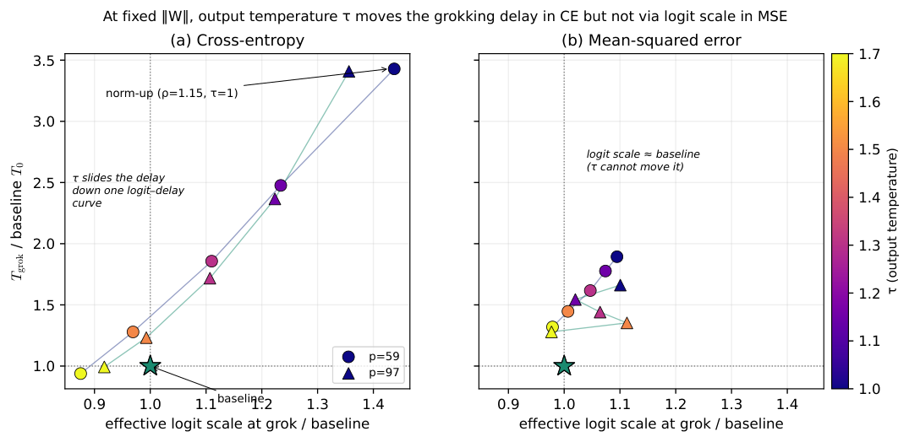
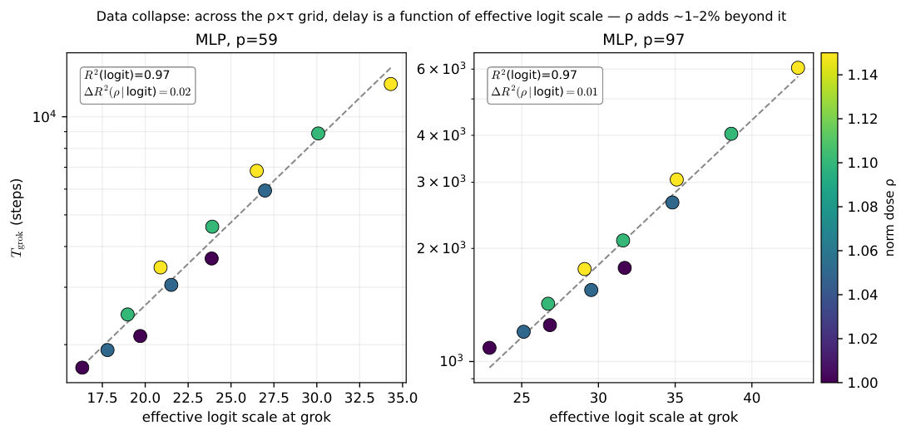
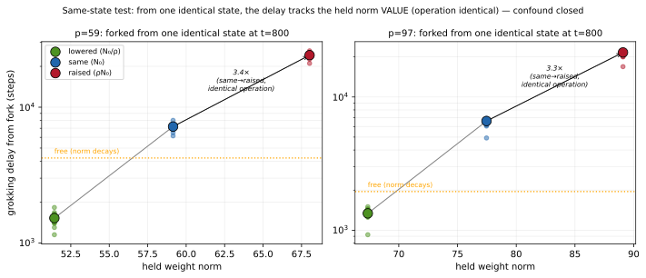

# Truong 2026 — What Does the Weight Norm Control in Grokking? Logit-Scale Mediation under Cross-Entropy

See also: [the global concept index](../../concepts/index.md).

**Truong Xuan Khanh** (H&K Research Studio, Clevix LLC, Hanoi, Vietnam).

arXiv [2606.18465](https://arxiv.org/abs/2606.18465), June 2026, 16 pages, 4 figures. Citations by Semantic Scholar — 1, in the corpus — 1. The second work of the same studio on the norm clamp — and a self-refutation of the first: the exponential dose response of 2606.13753 ("the weight norm sets the grokking timescale") is declared an incomplete reading, because the clamp holds the scalar norm by a rescaling of the weights that drags the scale of the logits along with it. A non-learnable output temperature $\tau$ separates the two: at a clamped norm, matching the effective logit scale to the baseline restores $0.83\text{–}0.89$ of the norm-induced delay (cross-entropy, an MLP, $p=59/97$), and over a $\rho\times\tau$ grid the delay collapses onto the logit scale ($R^{2}=0.97$, with the norm dose adding $1\text{–}2$%). Under the MSE the channel is absent and a norm effect half the size is left with no mechanism; a transformer confirms only the direction. A branching of four arms out of a single state closes the objection that the effect is an artefact of the clamping operation.

The files of this paper's analysis:

- [`2606.18465.what-does-the-weight-norm-control-in-grokking-logit-scale-mediation-under-cross-entropy.license.txt`](2606.18465.what-does-the-weight-norm-control-in-grokking-logit-scale-mediation-under-cross-entropy.license.txt) — the arXiv licence record for this paper.

The anchor scheme and the rules for linking into a card are in the [README of the papers folder](../README.md).

**Excerpt card.** The paper's licence (`arxiv-nonexclusive`) does not permit republishing the paper itself; what stands here are the editorial sections and the fragments the corpus quotes (right of quotation). The paper: <https://arxiv.org/abs/2606.18465>.

## Concepts covered

**[The norm-separation delay law](../../concepts/norm-separation-delay-law.md)** — a direct revision of the experimental half of the programme: the dose response of the clamp from 2606.13753 is reproduced (the same five moduli, the same calibration $w_{c}=54.49$ at $p=59$; the product of the slope and the calibration, $0.140\cdot 54.49\approx 7.6$, coincides with the exponent $\alpha=7.64$ of that work), but the reading "the norm sets the timescale" is declared a conflation of two variables that the clamp moves together ([`p2-1`](#p2-1)); the law itself is demoted to a "robust empirical regularity" used only as a readout for interventions ([`p3-5`](#p3-5)). The analysis: 2606.13753 is absent from the reference list — the argument with the paper's own title is conducted anonymously.

**[Weight norm minimisation](../../concepts/weight-norm-minimization.md)** — a demarcation of the questions: the accounts based on norm minimisation (Omnigrok, the zero-loss manifold) are about the *endpoint*, whereas this work is about the *timescale* and about the proximate variable that sets it; under the cross-entropy the norm acts on the timescale through the logit scale, so the two accounts are declared complementary ([`p9-2`](#p9-2)). The concluding formula: the weight norm is an upstream knob, the proximate variable is the logit scale, and "much of what looked like a law of the weight norm turns out to be a law of the logit scale" ([`p10-4`](#p10-4)).

**[Softmax collapse](../../concepts/softmax-collapse.md)** — the channel of Prieto (a naive minimisation of the loss → a growth of the logits → saturation) is singled out as the mediator of the norm's action: the temperature test isolates the upper part of the channel, and a float64 audit reaches the same point by computational precision with no intervention at all — at $\rho=1.15$ the law is robust to precision (the collapse rate is zero in both precisions), while at $\rho=1.25$ a float32 collapse at a rate of 31 % accelerates a spurious transition that does not occur in float64 by 60k steps ([`p9-1`](#p9-1)). The sign of the action is opposite to Prieto's: there the collapse chokes the training off, here the saturation of the softmax lengthens the delay in a dosed way, and its extreme is a breakdown.

**[Grokking](../../concepts/grokking.md)** — the grokking delay under the cross-entropy is reduced to a function of one variable: over the $\rho\times\tau$ grid (24 cells, all grokking 12/12) $\ln T_{\mathrm{grok}}$ is explained by the effective logit scale at $R^{2}=0.97$, while the norm dose adds $0.01\text{–}0.02$ ([`p5-1`](#p5-1)); the mechanism depends on the loss — under the MSE the logit scale is pinned near unity by the regression objective, and the channel is unavailable ([`p6-1`](#p6-1)). A control: $\tau$ does not move the memorisation time ($T_{\mathrm{mem}}$ changes by 25–50 steps against thousands for the delay), so the action lies entirely in the phase of delayed generalisation.

**[Causal ablation](../../concepts/causal-ablation-intervention.md)** — two exemplary interventions: (1) a three-condition temperature mediation — a non-learnable $\tau$ divides the logits and does not enter $\Vert W\Vert$, which gives an independent knob on the function-space variable at a physically clamped norm ([`p4-2`](#p4-2)); (2) a branching of four arms out of a single saved state, in which a clamp-at-$N_{0}$ and a clamp-at-$\rho N_{0}$ differ only in the value held, the operation being identical — and the delay follows the value ($3.3\text{–}3.4\times$ in all 12 seeds of both moduli), which closes the objection that the effect is an artefact of the rescaling ([`p8-2`](#p8-2)). The author's caution: the restoration fraction is called an intervention-level quantity rather than a regression estimate of mediation.

**[Grokking time](../../concepts/grokking-time.md)** — the form of the dependence is named and separated from its rivals: across all five moduli the relation is exponential, $T_{\mathrm{grok}}\propto\exp(\alpha\lVert W\rVert)$, with a per-modulus slope ([`p3-5`](#p3-5)). The checkability here lies in the fact that the power-law and saddle-node forms are rejected rather than simply not considered.

**[Selective weight decay](../../concepts/selective-weight-decay.md)** — the partition determines not only the penalty but also the measured quantity: the decay and the clamp act on $E,W_1,W_2$, while the biases are not regularised and are excluded from $\Vert W\Vert$ ([`p10-4`](#p10-4)). The norm by which the delay is measured and the set on which the penalty acts are deliberately made to coincide here.
## What is shown and what is conjectured

These are the card editor's remarks, not the authors' text, drawn from a numbered pass over the paper's claims.

**The strong point — a knob that separates the norm from the function.** A non-learnable temperature $\tau$ divides the logits before the loss and does not enter $\Vert W\Vert$, so that at a clamped norm the effective logit scale becomes an independent knob — a clean separation of a scalar quantity from a function-space variable, which the earlier clamp moved together. Three controls are set up carefully: the memorisation time does not move (removing the artefact of the gradient magnitude), the float64 audit converges to the same channel with no intervention whatever, and the branching out of a common state separates the value held from the clamping operation.

**A claim–self-refutation pair.** The paper argues with its own 2606.13753 ("The Weight Norm Sets the Grokking Timescale: A Causal Delay Law", the same studio) without naming it: it is absent from the reference list, and the clamp dose response is introduced with no reference, as common knowledge. The fingerprints coincide: the same five moduli, $\alpha=0.40$, $d=128$, $H=256$, 12 seeds; the calibration $w_{c}=54.49$ against the $54.5\text{–}54.6$ there; the per-modulus slope is measured here in the absolute norm, and the product $0.140\cdot 54.49\approx 7.63$ reproduces the exponent $\alpha=7.64$ of the dense run of that work. The word "causal" from the earlier title is carefully redefined here: the causality behind the value held is confirmed (§4.6), but the acting variable is declared to be a different one.

**What has remained unproved.** The restoration fraction is an interpolated quantity: $T_{2}$ is read off a curve interpolated through five $\tau$ points, and the CI, as the author admits, does not include the uncertainty of the interpolation. The data collapse is built on the realised logit scale at grokking — an endogenous axis, as the author himself caveats. The layer-wise distribution (arm A) is confounded with the capacity of the embeddings, and at $\gamma=+0.6$ a quarter of the seeds do not grok. Under the MSE the temperature also changes the scale of the quadratic objective, so the residue is uninterpreted: the "half-size" norm effect there is left with no mechanism — the negative half of the dissociation rests on $\tau$ being unable to move a pinned logit scale rather than on an isolation of a second pathway. The transformer gives the direction only: logits beyond $1000$, a non-monotonicity of $L$ in $\tau$, and no restoration fraction computed.

**How the work will be cited** ("it is shown that the cause of the grokking delay is not the weight norm but the logit scale") — more precisely: under the cross-entropy on an MLP at two moduli, a temperature restoration of the effective logit scale returns $0.83\text{–}0.89$ of the raised-norm delay, and the delay collapses onto the logit scale over the grid; the dose response itself is not overturned — the norm remains an upstream knob — while under the MSE the channel is absent and a norm effect half the size is left unexplained.

---

# Quoted fragments

Only the fragments the corpus cards refer to are
reproduced here (right of quotation); the paper's licence does not permit
republishing the whole text. Anchor numbering matches the original.

###### p2-1

We argue that this reading conflates two things the clamp changes together. Holding $\|W\|$ fixed requires rescaling the weight matrices, and rescaling also raises the logits, which in cross-entropy pushes the softmax toward saturation. So when a higher held norm lengthens the delay, we cannot yet tell whether the scalar norm is the operative variable or whether it is the logit scale that the rescaling drags along. The distinction matters: the first says grokking is governed by a geometric quantity, the second points at a function-space quantity already implicated by the numerical-stability account of grokking (14).

We separate the two with an intervention. We hold the total weight norm fixed with the clamp and add a non-trainable output temperature $\tau$ that divides the logits before the loss. Because $\tau$ is not a weight, it is not part of $\|W\|$; at a clamped norm it tunes the effective logit scale while leaving the norm fixed. The result, across two moduli, is unambiguous under cross-entropy: varying $\tau$ alone slides the grokking delay across the entire range produced by raising the norm, and the baseline and the norm-raised runs lie on a single curve of delay against effective logit scale. Matching the logit scale back to baseline recovers $0.83$ and $0.89$ of the norm-induced delay. The weight-norm effect on the delay is, to that extent, the logit-scale effect.

The mechanism is loss-dependent. Under mean-squared error the effective logit scale at grokking is pinned near one because the regression target fixes it, $\tau$ cannot move it, and the norm effect, while still present, is about half the size and is not carried by the logit scale. A control rules out the obvious artifact: $\tau$ leaves the memorization time essentially unchanged and acts almost entirely on the delayed-generalization phase, so the effect is about grokking specifically and not about training speed.

Our contributions:

- A temperature-mediation test that separates the scalar weight norm from the effective logit scale at a fixed clamped norm, and the finding that under cross-entropy the norm-induced grokking delay is recovered primarily ($\sim$0.85, tight bootstrap CI, two moduli) by restoring the logit scale.
- A data collapse: across a grid of norms and temperatures, the delay is a function of the effective logit scale alone ($R^{2}=0.97$), with the norm dose adding $1$–$2\%$ beyond it.
- A clean loss dissociation: the logit-scale channel is active under cross-entropy and absent under mean-squared error, so the weight-norm dependence of grokking is not a single mechanism.
- A memorization control showing the temperature acts on the delay and not on memorization, a float64 audit that reaches the same softmax-saturation channel independently, and qualitative corroboration in a no-LayerNorm transformer.
- A same-state test that forks arms from one identical state and shows the delay tracks the held norm value, not the clamp’s rescaling operation, closing the rescaling-artifact objection for this setting.
- Honest scope: the result localizes the proximal variable under cross-entropy; it does not characterize the mean-squared-error route, and the quantitative estimates are for MLPs at two moduli.

**[p. 3]**

###### p3-5

Holding the norm fixed and sweeping the dose $\rho$ yields a clean dose response between the held norm and the grokking time. Across all five moduli the relationship is exponential, $T_{\mathrm{grok}}\propto\exp(\alpha\|W\|)$, with a per-modulus slope $\alpha$. We compare this against a power law and against a saddle-node form $T\propto(w_{0}-\|W\|)^{-1/2}$ (the signature a fold or critical-slowing-down bifurcation would produce) by AIC. The exponential is generally selected (Table 1): decisively at four of the five moduli ($\Delta$AIC $4.6$–$6.4$), and weakly at $p=43$ ($\Delta$AIC $0.4$, essentially tied with the power-law), which we report rather than smooth over. We read this as a robust empirical regularity of the fixed-norm dose response, not a law derived from first principles, and we use it here only as the readout against which the interventions below are measured. The slopes are fit on the softmax-collapse-free range ($\rho\leq 1.15$; §5).

This dose response is the phenomenon to be explained. It establishes that raising the held norm lengthens the delay; it does not, on its own, say what the norm acts through. That is the question of the next section.

**[p. 4]**

*Table 1: Fixed-norm exponential law $\ln T_{\mathrm{grok}}=c+\alpha\|W\|$ per modulus, fit on the softmax-collapse-free range ($\rho\leq 1.15$), majority-grok cells only. $\Delta$AIC is the exponential’s margin over the better of the power-law and saddle-node forms (positive favors the exponential).*

| $p$ | $n$ | $\alpha$ | $R^{2}$ | $\Delta$AIC | SC-free norm range |
|---|---|---|---|---|---|
| 43 | 6 | 0.173 | 0.987 | **0.4 (weak)** | 45–58 |
| 59 | 7 | 0.140 | 0.991 | 6.4 | 46–62 |
| 67 | 7 | 0.126 | 0.982 | 5.5 | 48–65 |
| 97 | 7 | 0.094 | 0.957 | 4.6 | 56–75 |
| 113 | 7 | 0.087 | 0.959 | 4.6 | 60–81 |

###### p4-2

The design is a three-condition mediation. Baseline ($\rho=1.0$, $\tau=1$) gives delay $T_{0}$; raising the norm ($\rho=1.15$, $\tau=1$) gives $T_{1}$; and at $\rho=1.15$ we sweep $\tau$ upward, which lowers the effective logit scale at fixed norm. If the norm effect runs through the logit scale, setting $\tau$ so that the effective logit scale matches the baseline should recover the baseline delay.

###### p4-3

Under cross-entropy this is what happens (Fig. 1a, Table 2). The norm-up delay is $3.4\times$ the baseline at both moduli. Sweeping $\tau$ from $1.0$ to $1.7$ slides the delay monotonically back down, from $3.4\times$ to below baseline, and the cells trace a single curve of delay against effective logit scale on which the baseline and norm-up points both lie. The effective logit scale itself moves by about $1.6\times$ across the sweep. Reading off the delay where the effective logit scale equals its baseline value gives a *logit-scale recovery fraction* $(T_{1}-T_{2})/(T_{1}-T_{0})$ of $0.83$ at $p=59$ (95% bootstrap CI $[0.82,0.85]$) and $0.89$ at $p=97$ ($[0.88,0.91]$); the CI is a paired resample over the twelve seeds and reflects seed variability in $T_{\mathrm{grok}}$, with the logit curve held fixed. We call it a recovery fraction rather than a mediation fraction deliberately: it is the share of the norm-up delay that the temperature intervention recovers by restoring the effective logit scale, an intervention-level quantity, not a regression-based natural-indirect-effect estimate. To that extent the weight-norm effect on the delay is the logit-scale effect: the norm matters because it sets the logit scale, which sets the softmax saturation. This is the same channel the audit of §5 probes, reached here by intervention rather than by precision. The next subsection shows the relationship is not specific to this one norm level: across a grid of norms and temperatures, the delay collapses onto the effective logit scale.

*Table 2: Temperature mediation at $\rho=1.15$ (medians over 12 seeds). The logit-scale recovery fraction is the share of the norm-up delay recovered by matching the effective logit scale back to baseline; it is reported only for cross-entropy, where the logit scale is a usable knob.* **[p. 5]**

| loss | $p$ | $T_{0}$ | $T_{1}$ | norm-up | recovery fraction |
|---|---|---|---|---|---|
| CE | 59 | 3675 | 12600 | $3.43\times$ | $0.83\ [0.82,0.85]$ |
| CE | 97 | 1775 | 6050 | $3.41\times$ | $0.89\ [0.88,0.91]$ |
| MSE | 59 | 1175 | 2225 | $1.89\times$ | n/a (channel inactive) |
| MSE | 97 | 850 | 1412 | $1.66\times$ | n/a (channel inactive) |

*Figure 1: At a fixed clamped norm, varying only the output temperature $\tau$. **(a)** Under cross-entropy the cells trace one curve of delay against effective logit scale: the baseline (star) and the norm-up point ($\tau=1$, top right) lie on it, and increasing $\tau$ slides the delay back down toward baseline. About $83$–$89\%$ of the norm-up delay is recovered by matching the logit scale (two moduli). **(b)** Under mean-squared error the effective logit scale at grokking is pinned near baseline and $\tau$ cannot move it; the residual norm effect (vertical spread) is not along the logit-scale axis. Both moduli overlaid; axes normalized by the baseline cell.* **[p. 5]**

###### p5-1

**[p. 5]** We quantify the collapse by regression. A least-squares fit of $\ln T_{\mathrm{grok}}$ on the effective logit scale explains $R^{2}=0.97$ of the variance at both moduli; adding $\rho$ as a second predictor raises $R^{2}$ by only $0.02$ ($p=59$) and $0.01$ ($p=97$), so once the effective logit scale is known the norm dose carries almost no additional information about the delay (Table 3). The delay is, to this precision, a function of the effective logit scale alone. We are careful about the causal reading: the $x$-axis is the *realized* logit scale at grokking and is therefore endogenous, so the collapse is strong organizing evidence, not an intervention on its own; the causal weight rests on the temperature manipulation of §4.1, which sets the logit scale directly at fixed norm. The two are complementary: the intervention shows the channel is causal, and the collapse shows it accounts for essentially all of the norm dependence.

*Figure 2: Data collapse across the $\rho\times\tau$ grid (12 cells per modulus, all grok 12/12). $T_{\mathrm{grok}}$ against the effective logit scale at grokking, colored by the norm dose $\rho$. Cells of different $\rho$ but matched effective logit scale share the same delay, so the delay collapses onto the logit scale; the norm dose adds $1$–$2\%$ of explained variance beyond it.* **[p. 6]**

**[p. 6]**

*Table 3: Collapse regression across the $\rho\times\tau$ grid. $R^{2}$ of $\ln T_{\mathrm{grok}}$ against the effective logit scale alone, against $\rho$ alone, and against both; $\Delta R^{2}(\rho\,|\,\text{logit})$ is the variance $\rho$ adds beyond the logit scale (near zero indicates collapse).* **[p. 6]**

| $p$ | $R^{2}$(logit) | $R^{2}(\rho)$ | $R^{2}$(both) | $\Delta R^{2}(\rho\,\|\,\text{logit})$ | verdict |
|---|---|---|---|---|---|
| 59 | 0.968 | 0.407 | 0.988 | 0.020 | collapse |
| 97 | 0.973 | 0.415 | 0.984 | 0.011 | collapse |

###### p6-1

Mean-squared error dissociates cleanly (Fig. 1b). There the effective logit scale at grokking sits near one and barely moves with $\tau$, because the regression target fixes the output scale, so the temperature cannot act on a logit-scale channel: across $\tau\in[1.0,1.7]$ the effective logit scale moves about $1.1\times$, against $1.6\times$ under cross-entropy. The norm-up effect under MSE is real but about half the size ($1.7$–$1.9\times$ versus $3.4\times$) and is carried by a route that does not pass through the logit scale. So the weight-norm dependence of the delay is not one mechanism. Under cross-entropy it is logit-scale saturation; under mean-squared error it is something else.

We are deliberately conservative about the MSE residual. The temperature still shortens the MSE delay somewhat, but a temperature that divides the logits also changes the scale of the squared-error target, so we do not read this residual as a clean second channel. We report MSE only to establish the dissociation that the logit-scale channel is absent there; we do not assign the residual norm effect to a specific mechanism. This connects to an asymmetry noted by 14, who observed that grokking under softmax cross-entropy behaves differently from the MSE setting of 8, with the softmax-collapse rate approaching one under cross-entropy; our intervention gives that asymmetry a mechanism on the cross-entropy side.

###### p8-2

From the identical state, the delay rises monotonically with the held norm value, in all twelve seeds at both moduli (Fig. 4). The decisive contrast is clamp-at-$N_{0}$ against clamp-at-$\rho N_{0}$. Both apply the same clamp operation from the same state and differ only in the held value, and the raised arm takes $3.36\times$ longer at $p=59$ (95% CI $[3.27,3.43]$) and $3.27\times$ at $p=97$ ($[3.21,3.38]$). Since the operation is identical in the two arms, the difference is not an artifact of the operation: the delay follows the held value. The ordering across lower, hold, and raise also rules out a one-time rescaling jump, which would perturb the up and down arms the same way instead of ordering them by value. The free arm groks faster than clamp-at-$N_{0}$ because its norm decays after the fork, which is the norm decay that the generalizing-shell account associates with grokking (8). This closes the rescaling-artifact objection for the cross-entropy MLP setting. Training full-batch leaves the dose response intact, so the effect is not a sampling-noise phenomenon either.

*Figure 4: Four arms forked from one identical post-memorization state ($t=800$). The grokking delay (from the fork) rises monotonically with the held norm value across all twelve seeds. The labelled contrast, clamp-at-$N_{0}$ versus clamp-at-$\rho N_{0}$, applies the identical clamp operation and differs only in the held value ($3.3$–$3.4\times$), so the delay tracks the value, not the rescaling operation. Free (dotted) groks faster because its norm decays after the fork.* **[p. 8]**

**[p. 9]**

###### p9-1

Because the cross-entropy clamp operates at large logits, the regime in which softmax collapse can occur (14), we audit the law for floating-point artifacts. We re-run the two highest-dose cross-entropy cells at $p=59$ in float64, holding the norm at the identical absolute values used in float32, and record the softmax-collapse rate (Table 4). At $\rho=1.15$ the collapse rate is zero in both precisions and the grokking times agree, so the law is precision-robust there. At $\rho=1.25$ the float32 run shows a 31% collapse rate and groks at 25k steps, whereas the float64 run does not grok within 60k, so the float32 collapse accelerates a spurious transition at extreme norm. We therefore fit the law on the collapse-free range and exclude the affected cell. This audit is convergent with §4.1: softmax collapse is the extreme of the same logit-saturation channel that the temperature test isolates, reached by precision without any intervention.

*Table 4: Softmax-collapse audit at $p=59$: the two highest-dose cross-entropy cells re-run in float64 at held norms identical to float32. $T$ = median grok step; sc = softmax-collapse rate.* **[p. 9]**

| $\rho$ | held $\\|W\\|$ | $T_{32}$ | $T_{64}$ | sc$_{32}$ | sc$_{64}$ | verdict |
|---|---|---|---|---|---|---|
| 1.15 | 62 | 12.75k | 12.16k | 0.00 | 0.00 | precision-robust |
| 1.25 | 68 | 25.4k | not reached by 60k | 0.31 | 0.00 | float32 SC-confounded |

###### p9-2

**Weight norm and norm minimization.** The weight norm has long been central to grokking: Omnigrok ties grokking to the norm decaying into a generalizing shell (8), and a recent line characterizes the late dynamics as norm minimization on the zero-loss manifold (11; 3), including beyond the Euclidean norm (17). These accounts concern the *endpoint* (which configuration the optimizer selects once training loss is zero). Our question is about the *timescale* and the proximal variable that sets it; we find that under cross-entropy the norm acts on the timescale through the logit scale, so the two are complementary rather than competing.

###### p9-3

**Logit growth, softmax saturation, and optimization starvation.** The account closest to our result is the numerical-stability view of 14: cross-entropy training without regularization drives uncontrolled logit growth (“naive loss minimization”), whose extreme is softmax collapse, where floating-point errors zero the gradient and stall learning. Our temperature test isolates the upstream of that channel, the logit scale, and shows it mediates most of the norm-induced delay under cross-entropy, with the collapse of 14 as its endpoint (§5). Independently, 1 show that regularizing logits directly biases linear classifiers toward clustered logits and can induce grokking, further evidence that logit space, not weight norm alone, is the operative arena under cross-entropy. The intervention itself, dividing logits by a fixed temperature, is the temperature scaling of 5; we use it not for calibration but as a handle on the effective logit scale at fixed norm.

**Phase transitions and scaling.** A parallel line characterizes grokking as a phase transition along model or data axes: a first-order transition in two-layer networks (15), an information-theoretic transition (4), Ising-style and local-rule descriptions (6; 21), and finite-size or dimensional scaling (2; 20; 19). These concern the nature of the transition and its scaling with model or **[p. 10]** data size, a different axis from our intervention-level question of which variable gates the delay at fixed data and model.

**Other proposed drivers.** Grokking has also been attributed to noise-assisted escape and slingshot dynamics (16; 9), to circuit-efficiency reallocation (12; 18), and to a lazy-to-rich transition (7; 10). Our full-batch result places the delay outside the noise-activated family for this setting, and our structure measure is the Fourier progress measure of 12.

Most of this work asks what *produces* grokking and answers with a mechanism that suffices. Our question is narrower: with the weight norm held at a chosen value, which mechanism still moves the delay? The temperature handle lets us put one candidate, the logit scale, in and take it out directly, so the contribution here is not another mechanism but a way to decide, under cross-entropy, what the norm acts through.

###### p10-4

The weight-norm dependence of the grokking delay is not, under cross-entropy, an effect of the scalar norm. Holding the norm fixed and varying only an output temperature slides the delay across the full norm-up range, and matching the effective logit scale back to baseline recovers about $85\%$ of the delay at two moduli, with the effect falling on the delayed-generalization phase and not on memorization. Across a grid of norms and temperatures the delay collapses onto the effective logit scale, which alone explains $97\%$ of its variance. The weight norm is an upstream handle; the proximal variable is the logit scale, and the channel is the softmax saturation that the numerical-stability account of grokking also points to. The mechanism is loss-dependent: mean-squared error pins the logit scale and the norm effect runs elsewhere. Forking arms from one identical state confirms that the delay follows the held norm value and not the rescaling operation, so the dose response is not a clamp artifact. Beyond grokking, the methodological point is that a causal claim about a scalar quantity such as the weight norm has to be separated from the function-space variables **[p. 11]** that rescaling the weights changes along with it; here, once that separation is made, much of what looked like a weight-norm law is a logit-scale law.

**Appendix**
